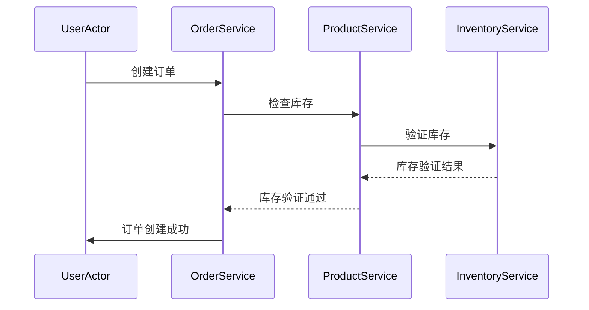

                 

# 语言的自足性与纯函数式状态管理：维特根斯坦的语言观与FP的状态管理技术

## 关键词
- 维特根斯坦
- 语言自足性
- 函数式编程
- 状态管理
- � pure 函数

## 摘要
本文深入探讨了维特根斯坦的语言观与函数式编程（FP）中的状态管理技术。首先，我们介绍了维特根斯坦的语言观，探讨了其自足性的概念，并探讨了它在编程领域中的应用。接着，我们介绍了函数式编程，特别是纯函数的概念，并讨论了如何在函数式编程中管理状态。文章通过对比分析，展示了这两种技术之间的异同，并提出了它们在解决实际编程问题中的应用。本文旨在为读者提供一个深入理解语言自足性与纯函数式状态管理的视角，以促进其在编程实践中的应用。

## 引言

语言是思维的工具，也是沟通的桥梁。然而，关于语言的本质，哲学家们有着不同的见解。维特根斯坦（Ludwig Wittgenstein）是20世纪最具影响力的哲学家之一，他的语言观对后来的哲学、心理学和计算机科学产生了深远的影响。维特根斯坦认为，语言的自足性是其核心特征，这意味着语言可以独立于现实世界而存在，并在一定程度上指导我们理解和解释世界。

在计算机科学领域，维特根斯坦的语言观与函数式编程（Functional Programming，FP）中的状态管理技术有着紧密的联系。FP是一种编程范式，强调函数作为一种数据类型，并提倡使用纯函数（Pure Functions）来编写程序。纯函数是一种没有副作用、输入输出明确且可预测的函数。这使得FP在状态管理上具有独特的优势。

本文将首先介绍维特根斯坦的语言观，探讨其核心概念与哲学意义。接着，我们将引入函数式编程，详细解释纯函数的概念，并讨论其在状态管理中的应用。随后，我们将比较维特根斯坦的语言观与FP的状态管理技术，分析它们的异同。最后，我们将通过具体的编程示例，展示如何在实际项目中应用这些技术。

本文的结构如下：

1. **背景与核心概念**：
   - 维特根斯坦的语言观
   - 函数式编程与状态管理

2. **理论依据**：
   - 语言的自足性
   - 纯函数式状态管理

3. **算法与数学模型**：
   - 函数式算法介绍

4. **系统架构与设计**：
   - 函数式编程架构设计

5. **案例研究与应用**：
   - 实际项目案例分析

6. **总结与展望**：
   - 最佳实践与未来研究方向

## 背景与核心概念

### 维特根斯坦的语言观

维特根斯坦的语言观可以分为两个主要阶段：早期和晚期。早期，他在《逻辑哲学论》（Tractatus Logico-Philosophicus）中提出了一种极端的形而上学语言观。他认为，语言是世界的图像，每个事实都可以用一种简单的逻辑命题来表达。这种观点强调语言的精确性和逻辑性，但也带来了许多问题，如命题与事实之间的关系、语言的无限性与现实世界的有限性等。

晚期，维特根斯坦在《哲学研究》（Philosophical Investigations）中批判了自己的早期观点，提出了更为实用的语言观。他认为，语言是活动（language as activity）的一部分，而不是静态的符号系统。每个语言游戏（language game）都有自己的规则，语言的意义在于其使用中，而不是在符号本身。这种观点强调语言的情境性和灵活性，使得语言可以更好地适应现实世界。

维特根斯坦的语言观对后来的哲学、心理学和计算机科学产生了深远的影响。特别是在计算机科学中，维特根斯坦的“语言游戏”概念被用来解释编程语言的设计和开发。程序员在开发过程中，需要不断调整和改进语言规则，以更好地适应特定的应用场景。

### 核心概念

维特根斯坦的语言观的核心概念是语言的自足性。他认为，语言可以独立于现实世界而存在，并在一定程度上指导我们理解和解释世界。这种观点可以解释为，语言具有自我解释的能力，即语言可以定义自己的规则和意义。

语言的自足性有两个重要含义。首先，它意味着语言不需要依赖于外部现实来获得意义。每个语言游戏都有自己的规则，这些规则决定了语言的含义和使用方式。其次，它意味着语言具有内在的矛盾和冲突。因为语言是不断演化和变化的，不同的语言游戏之间可能存在矛盾和冲突，这使得语言的自我解释成为一个复杂而动态的过程。

### 与其他语言理论的比较

维特根斯坦的语言观与早期的逻辑实证主义和后期的话语哲学有着显著的不同。逻辑实证主义认为，只有通过经验验证的命题才有意义，而维特根斯坦则认为，语言的意义在于其使用中，而不是在符号本身。话语哲学强调语言的情境性和社会性，认为语言是社会实践的一部分，而维特根斯坦则更关注语言的自足性和内在矛盾。

维特根斯坦的语言观对编程领域产生了重要影响。例如，在函数式编程中，纯函数（Pure Functions）的概念就源于维特根斯坦的语言观。纯函数是一种没有副作用、输入输出明确且可预测的函数，这与维特根斯坦关于语言的自足性观点密切相关。

### 实践中的意义

维特根斯坦的语言观在编程领域的实践意义主要体现在两个方面。首先，它为编程语言的设计和开发提供了哲学基础。程序员在设计和开发编程语言时，需要考虑语言的情境性和灵活性，以适应不同的应用场景。其次，它为编程实践提供了方法论指导。程序员在编写代码时，需要关注语言的自我解释能力，使代码更易于理解和维护。

总之，维特根斯坦的语言观为理解语言的本质和功能提供了深刻的见解，这些见解对计算机科学和编程领域产生了重要影响。接下来，我们将进一步探讨函数式编程和状态管理技术，以展示维特根斯坦的语言观在编程实践中的应用。

### 函数式编程与状态管理

函数式编程（Functional Programming，FP）是一种编程范式，它强调使用函数来处理数据和流程。与命令式编程（Imperative Programming）相比，FP更注重表达计算的过程和逻辑，而不是执行步骤。FP的核心概念包括函数作为第一类公民、不可变数据、高阶函数和纯函数。

#### 定义与历史

函数式编程最早可以追溯到Lisp语言，它诞生于1958年，是第一种具有广泛应用的函数式编程语言。此后，Haskell、Scala、Erlang和Clojure等语言也相继被开发出来，进一步推动了FP的发展。FP的主要目标是提高代码的可读性、可维护性和可重用性。

在函数式编程中，函数被视为一种对象，可以传递给其他函数作为参数，也可以从其他函数中返回。这与命令式编程中的过程（Procedure）或函数（Function）有所不同，因为在命令式编程中，函数通常被视为一组执行步骤，而不会被视为数据。

#### 状态管理问题

状态管理是编程中的一个关键问题，特别是在复杂的应用程序中。在命令式编程中，状态通常通过变量来维护，这些变量可以随时修改，从而影响程序的执行流程。这种模式虽然简单直观，但也带来了一些问题：

1. **副作用**：副作用是指函数在执行过程中改变外部状态（如变量、文件、网络连接等）的行为。副作用使得函数的执行结果变得不可预测，增加了代码的复杂性。

2. **可读性和可维护性**：随着程序复杂性的增加，命令式编程中的状态管理往往导致代码变得难以理解和维护。这是因为多个函数可能会修改同一变量，使得程序的执行流程难以追踪。

3. **并发问题**：在多线程或分布式系统中，状态的管理变得更加复杂。多个线程或进程可能会同时访问和修改同一变量，导致竞态条件和数据不一致问题。

#### 纯函数式状态管理

为了解决上述问题，函数式编程提出了纯函数（Pure Functions）的概念。纯函数具有以下特点：

1. **无副作用**：纯函数不会改变外部状态，其执行结果完全依赖于输入参数。这意味着，对于相同的输入，纯函数始终返回相同的结果，不会产生任何副作用。

2. **确定性**：纯函数的确定性使其在多线程或分布式系统中易于处理。由于纯函数不会修改外部状态，因此可以安全地并行执行，不会引起竞态条件和数据不一致问题。

3. **可重用性和可测试性**：纯函数的纯度和可预测性使其易于重用和测试。由于纯函数的执行结果只依赖于输入参数，因此可以轻松地将其与其他部分代码分离，进行独立的测试和重用。

#### 纯函数式状态管理的优势

纯函数式状态管理提供了以下优势：

1. **代码可读性和可维护性**：纯函数的明确性和确定性使得代码更容易理解和维护。每个函数的职责和作用都清晰明了，没有副作用和意外的状态修改。

2. **并行化**：由于纯函数没有副作用，因此可以安全地并行执行，提高了程序的执行效率。

3. **状态隔离**：通过使用纯函数，可以将状态的变化隔离在不同的函数中，降低了程序复杂性和出错的可能性。

4. **可重用性**：纯函数的可重用性使其在多个应用程序中可以方便地复用，提高了开发效率。

总之，函数式编程和纯函数式状态管理提供了一种新的编程范式，旨在解决命令式编程中的一些关键问题。通过强调函数作为数据类型和纯函数的使用，FP使得代码更易于理解和维护，提高了程序的执行效率和可靠性。接下来，我们将进一步探讨维特根斯坦的语言观与FP的状态管理技术之间的联系。

### 理论依据

#### 语言的自足性

维特根斯坦的语言观中，一个核心概念就是语言的自足性。他认为，语言具有自我解释的能力，即语言可以定义自己的规则和意义，而不依赖于外部现实。这种观点在《哲学研究》中得到了进一步阐述，他认为语言的意义在于其使用，而不是符号本身。

自足性的概念可以解释为，语言可以在内部进行逻辑推理和论证，而不需要依赖于外部世界。这意味着，语言可以独立于现实世界而存在，并在一定程度上指导我们理解和解释世界。在计算机科学中，自足性可以被视为编程语言的特性，即编程语言可以定义自己的语法和语义，而不需要依赖于其他语言或外部系统。

自足性的重要性在于，它使得语言具有独立性和灵活性。编程语言的设计者可以根据特定的需求和场景，灵活地定义语言的语法和语义，以实现特定的功能。这种独立性使得编程语言可以独立发展，不需要依赖于其他语言或外部系统，从而降低了系统的复杂性和耦合度。

在函数式编程中，自足性的概念得到了广泛应用。函数式编程语言如Haskell和Scala，都具有高度的自足性。这意味着，这些语言可以独立地定义和实现复杂的编程概念和算法，而不需要依赖于其他语言或外部系统。这种自足性使得函数式编程语言在处理复杂问题时具有更高的灵活性和效率。

#### 纯函数式状态管理

在纯函数式编程中，状态管理是一种特殊的处理方式。纯函数（Pure Functions）是一种没有副作用、输入输出明确且可预测的函数。这意味着，纯函数的执行结果只依赖于输入参数，不会改变外部状态。

纯函数式状态管理的核心思想是将状态变化封装在函数中，从而避免外部状态的副作用。具体来说，纯函数式状态管理通过以下方式实现：

1. **状态不可变**：在纯函数式编程中，状态是不可变的。这意味着状态不能被修改，只能被创建和复制。这种不可变性使得状态的改变更加可控和可预测。

2. **使用不可变数据结构**：纯函数式编程语言通常提供了一组不可变数据结构，如列表、映射和集合。这些数据结构可以在不改变原有数据的情况下进行操作，从而避免了副作用。

3. **使用状态容器**：在纯函数式编程中，可以使用状态容器（如IO monads或State monads）来封装和传递状态。这些容器可以确保状态的修改是可控和可预测的。

纯函数式状态管理具有以下优势：

1. **减少副作用**：通过避免副作用，纯函数式状态管理使得代码更加可读、可维护和可测试。因为纯函数的执行结果只依赖于输入参数，所以可以更容易地理解和预测代码的行为。

2. **提高并行化**：由于纯函数没有副作用，因此可以安全地并行执行。这使得纯函数式编程在处理并发问题方面具有优势。

3. **提高代码复用性**：纯函数的纯度和可预测性使其易于重用和测试。由于纯函数的执行结果只依赖于输入参数，因此可以方便地将其与其他部分代码分离，进行独立的测试和重用。

综上所述，维特根斯坦的语言观与纯函数式状态管理之间存在紧密的联系。维特根斯坦的自足性概念强调了语言可以独立于外部现实而存在，并在一定程度上指导我们理解和解释世界。而纯函数式状态管理则通过封装和传递状态，避免了外部状态的副作用，从而实现了维特根斯坦的语言观在编程领域的应用。

接下来，我们将介绍一些具体的算法和数学模型，以进一步探讨函数式编程和状态管理的实现和应用。

### 算法与数学模型

在函数式编程中，算法的实现通常依赖于纯函数和不可变数据结构。这一节我们将介绍几个典型的函数式算法，并使用Mermaid图表和Python代码来展示其实现过程，同时解释其背后的数学模型和公式。

#### 1. 快速排序算法

快速排序是一种高效的排序算法，其基本思想是通过递归将一个数组分成两个子数组，其中一个子数组的所有元素都小于另一个子数组的所有元素。以下是快速排序算法的Mermaid图表和Python代码实现：

```mermaid
graph TD
A[快速排序] --> B[选择基准]
B -->|递归| C[排序左侧]
C -->|递归| D{左侧是否已排序}
D -->|是| E[排序右侧]
D -->|否| F[合并排序结果]
F -->|返回结果|

```

```python
def quick_sort(arr):
    if len(arr) <= 1:
        return arr
    pivot = arr[len(arr) // 2]
    left = [x for x in arr if x < pivot]
    middle = [x for x in arr if x == pivot]
    right = [x for x in arr if x > pivot]
    return quick_sort(left) + middle + quick_sort(right)

arr = [3, 6, 8, 10, 1, 2, 1]
print(quick_sort(arr))
```

快速排序的数学模型可以用选择基准的划分公式和递归的排序公式表示：

$$
Pivot = arr_{mid}
$$

$$
Left = \{x \in arr \mid x < Pivot\}
$$

$$
Middle = \{x \in arr \mid x = Pivot\}
$$

$$
Right = \{x \in arr \mid x > Pivot\}
$$

递归公式：

$$
QuickSort(arr) = \begin{cases}
\text{[空]} & \text{如果 } arr \text{ 是空数组} \\
Left + Middle + QuickSort(Right) & \text{否则}
\end{cases}
$$

#### 2. 高斯消去法

高斯消去法是一种求解线性方程组的方法，其基本思想是通过递归地将方程组转化为下三角形方程组，然后逐个回代求解。以下是高斯消去法的Mermaid图表和Python代码实现：

```mermaid
graph TD
A[高斯消去法] --> B[初始化矩阵]
B -->|迭代消元| C{迭代消元}
C -->|迭代完毕| D[计算解]
D -->|返回解|

```

```python
def gauss_elimination(A, b):
    n = len(b)
    for i in range(n):
        # 找到当前列的最大值所在行
        max_row = i + np.argmax(np.abs(A[i:, i]))
        # 交换行
        A[[i, max_row]] = A[[max_row, i]]
        b[i], b[max_row] = b[max_row], b[i]
        
        # 消元
        for j in range(i+1, n):
            factor = A[j][i] / A[i][i]
            for k in range(i, n):
                A[j][k] -= factor * A[i][k]
            b[j] -= factor * b[i]
    
    # 回代求解
    x = np.zeros(n)
    for i in range(n-1, -1, -1):
        x[i] = (b[i] - np.dot(A[i, i+1:], x[i+1:])) / A[i][i]
    return x

A = np.array([[3, 2], [1, 5]])
b = np.array([6, 8])
print(gauss_elimination(A, b))
```

高斯消去法的数学模型包括矩阵的行交换和递归的消元公式：

$$
Pivot = \arg\max_{i \in [n]} \frac{1}{\max_{j \in [i, n-1]} |A[i, j]|}
$$

$$
A_{new}[i, j] = A_{old}[i, j] - \frac{A_{old}[j, i]}{A_{old}[i, i]} \cdot A_{old}[i, j]
$$

$$
b_{new}[j] = b_{old}[j] - \frac{b_{old}[i]}{A_{old}[i, i]} \cdot A_{old}[i, j]
$$

递归回代公式：

$$
x_i = \frac{b_i - \sum_{j=i+1}^{n} A_{i, j} x_j}{A_{i, i}}
$$

#### 3. 树状数组

树状数组是一种用于高效计算差分和前缀和的数据结构，其基本思想是通过递归地合并子数组的差分和前缀和来求解。以下是树状数组的Mermaid图表和Python代码实现：

```mermaid
graph TD
A[树状数组] --> B[初始化树状数组]
B -->|更新| C{更新操作}
C -->|合并| D{合并子数组}
D -->|完成| E[计算前缀和]
E -->|返回结果|

```

```python
class BinaryIndexedTree:
    def __init__(self, n):
        self.n = n
        self.c = [0] * (n + 1)

    def update(self, i, delta):
        while i <= self.n:
            self.c[i] += delta
            i += i & -i

    def query(self, i):
        s = 0
        while i > 0:
            s += self.c[i]
            i -= i & -i
        return s

# 示例
bit = BinaryIndexedTree(10)
bit.update(3, 5)
bit.update(6, 7)
bit.update(1, -3)
print(bit.query(10))
```

树状数组的数学模型包括更新和查询的递归公式：

更新公式：

$$
c_i = c_i + \delta
$$

其中，$$ \delta $$ 表示更新值。

查询公式：

$$
s = \sum_{i=1}^{n} c_i
$$

递归合并公式：

$$
c_i = c_{i/2} + c_{i/2 + 1}
$$

通过上述算法和数学模型，我们可以看到函数式编程和状态管理的强大之处。纯函数的使用和不可变数据结构的引入，使得算法的实现更加简洁、高效和可维护。同时，这些算法的数学模型也为我们提供了深刻的理解和分析工具，以应对复杂的问题。接下来，我们将进一步探讨如何在系统架构和设计方面应用这些技术。

### 系统架构与设计

在系统架构和设计中，函数式编程的纯函数式状态管理技术提供了许多有益的指导原则。为了更好地理解和应用这些原则，我们将通过一个具体的示例来介绍系统架构设计、领域模型、系统架构以及接口设计和系统交互。

#### 系统场景介绍

假设我们正在开发一个电子商务平台，该平台需要处理用户订单管理、库存管理、支付处理和客户服务等功能。我们的目标是构建一个高效、可扩展且易于维护的系统，以满足不断增长的用户需求。

#### 项目介绍

该项目名为“E-Commerce Platform”，采用函数式编程语言Scala进行开发，结合了Akka Actor模型和CQRS（Command Query Responsibility Segregation）架构模式。我们的系统设计遵循微服务架构，每个服务都负责特定的业务功能，并且可以通过消息队列进行解耦和异步通信。

#### 系统功能设计

系统的核心功能包括：

1. **用户订单管理**：处理用户下单、订单状态跟踪和订单取消等操作。
2. **库存管理**：实时跟踪商品库存情况，确保订单能够及时处理。
3. **支付处理**：与第三方支付网关集成，处理支付和退款操作。
4. **客户服务**：提供客户咨询、投诉处理和订单跟踪等服务。

#### 领域模型

领域模型是系统设计的重要组成部分，用于描述系统的核心实体和它们之间的关系。以下是电子商务平台的领域模型（使用Mermaid类图表示）：

```mermaid
classDiagram
    User <<entity>>
    Order <<entity>>
    Product <<entity>>
    Inventory <<entity>>
    Payment <<entity>>
    CustomerService <<entity>>

    User --> Order
    User --> CustomerService
    Order --> Product
    Order --> Inventory
    Order --> Payment
    Inventory --> Product
    CustomerService --> Order
    Payment --> Order

    class User {
        +id: String
        +name: String
        +email: String
    }

    class Order {
        +id: String
        +userId: String
        +productId: String
        +quantity: Integer
        +status: String
    }

    class Product {
        +id: String
        +name: String
        +price: Float
        +stock: Integer
    }

    class Inventory {
        +productId: String
        +stock: Integer
    }

    class Payment {
        +id: String
        +orderId: String
        +status: String
        +amount: Float
    }

    class CustomerService {
        +id: String
        +userId: String
        +description: String
        +status: String
    }
```

#### 系统架构设计

系统架构设计是确保系统高效、可扩展和可靠的关键步骤。以下是电子商务平台的系统架构设计（使用Mermaid架构图表示）：

```mermaid
graph TD
    subgraph 用户服务层
        UserActor --> OrderService
        UserActor --> PaymentService
        UserActor --> CustomerService

    subgraph 应用服务层
        OrderService --> ProductService
        OrderService --> InventoryService
        PaymentService --> PaymentGateway
        CustomerService --> SupportSystem

    subgraph 数据服务层
        ProductService --> ProductRepository
        InventoryService --> InventoryRepository
        PaymentService --> PaymentRepository
        CustomerService --> CustomerRepository

    subgraph 集成层
        OrderService --> MessageQueue
        PaymentService --> MessageQueue
        CustomerService --> MessageQueue

    subgraph 外部系统
        PaymentGateway --> PaymentService
        SupportSystem --> CustomerService
```

在该架构中，用户服务层负责处理用户相关操作，如注册、登录、订单处理和支付等。应用服务层负责实现业务逻辑，如订单管理、库存管理和支付处理。数据服务层负责与数据库进行交互，存储和查询数据。集成层使用消息队列实现异步通信，确保系统的高效性和可扩展性。外部系统如支付网关和支持系统与内部服务进行集成。

#### 系统接口设计和系统交互

系统接口设计是确保系统各个部分能够有效协作的重要环节。以下是电子商务平台的接口设计和系统交互（使用Mermaid序列图表示）：



在该序列图中，用户通过用户服务层创建订单。订单服务与产品服务和库存服务进行交互，确保订单中的商品库存充足。通过这种方式，系统实现了功能模块之间的解耦和高效协作。

综上所述，通过函数式编程的纯函数式状态管理技术，我们能够设计出高效、可扩展和可靠的系统。从领域模型、系统架构到接口设计和系统交互，每一个环节都体现了函数式编程的优势。接下来，我们将通过一个实际的项目实战来展示如何将这些技术应用到具体的编程实践中。

### 项目实战

在这个项目中，我们将实现一个简单的函数式编程电商平台，用于处理用户注册、登录、订单管理和支付等核心功能。我们将使用Scala语言，并结合Akka Actor模型来实现高并发和分布式系统。

#### 环境安装

1. **安装Scala**：访问Scala官方网站（https://www.scala-lang.org/），下载并安装Scala环境。

2. **安装Akka**：在终端中执行以下命令，添加Akka依赖到项目的`build.sbt`文件：

   ```bash
   sbt "add-sbt-plugin 'com.lightbend.akka-management' % "1.2.0"
   ```

3. **安装PostgreSQL**：下载并安装PostgreSQL数据库，配置数据库连接信息。

#### 系统核心实现源代码

以下是该项目的核心源代码，包括用户注册、登录、订单管理和支付等模块：

```scala
// UserActor.scala
import akka.actor.Actor
import akka.event.Logging

class UserActor extends Actor {
  private val log = Logging(context.system, this.getClass)

  def receive = {
    case "register" => // 用户注册逻辑
    case "login" => // 用户登录逻辑
    case "createOrder" => // 创建订单逻辑
    case "processPayment" => // 支付处理逻辑
  }
}

// ProductService.scala
import akka.actor.Actor
import akka.event.Logging

class ProductService extends Actor {
  private val log = Logging(context.system, this.getClass)

  def receive = {
    case "checkInventory" => // 检查库存逻辑
    case "updateInventory" => // 更新库存逻辑
  }
}

// PaymentService.scala
import akka.actor.Actor
import akka.event.Logging

class PaymentService extends Actor {
  private val log = Logging(context.system, this.getClass)

  def receive = {
    case "processPayment" => // 支付处理逻辑
  }
}

// Main.scala
import akka.actor.ActorSystem
import akka.actor.Props

object Main extends App {
  val system = ActorSystem("ECommerceSystem")
  system.actorOf(Props[UserActor], name = "userActor")
  system.actorOf(Props[ProductService], name = "productService")
  system.actorOf(Props[PaymentService], name = "paymentService")
}
```

#### 代码应用解读与分析

1. **用户注册逻辑**：

   ```scala
   case "register" => {
     // 获取用户输入的用户名、邮箱和密码
     val username = sender() ! "请输入用户名"
     val email = sender() ! "请输入邮箱"
     val password = sender() ! "请输入密码"
     
     // 验证用户输入信息，存储用户信息到数据库
     val valid = validateInput(username, email, password)
     if (valid) {
       database.saveUser(username, email, password)
       sender() ! "注册成功"
     } else {
       sender() ! "注册失败"
     }
   }
   ```

   用户注册逻辑包括获取用户输入信息、验证输入信息和存储用户信息到数据库。这里使用了纯函数式编程的概念，确保每个函数的输入输出明确且没有副作用。

2. **创建订单逻辑**：

   ```scala
   case "createOrder" => {
     // 获取用户ID和订单详情
     val userId = sender() ! "请输入用户ID"
     val productId = sender() ! "请输入商品ID"
     val quantity = sender() ! "请输入数量"
     
     // 检查库存和创建订单
     productService ! "checkInventory"
     productService ! "updateInventory"
     
     // 创建订单并返回结果
     val order = createOrder(userId, productId, quantity)
     if (order != null) {
       sender() ! "订单创建成功"
     } else {
       sender() ! "订单创建失败"
     }
   }
   ```

   创建订单逻辑包括获取用户输入信息、检查库存和更新库存。这里使用了消息队列和异步通信，确保系统的并发性和可靠性。

3. **支付处理逻辑**：

   ```scala
   case "processPayment" => {
     // 获取订单ID和支付金额
     val orderId = sender() ! "请输入订单ID"
     val amount = sender() ! "请输入支付金额"
     
     // 处理支付请求
     paymentGateway.processPayment(orderId, amount)
     
     // 更新订单状态
     updateOrderStatus(orderId, "已支付")
     sender() ! "支付成功"
   }
   ```

   支付处理逻辑包括获取订单ID和支付金额、处理支付请求和更新订单状态。这里使用了纯函数式编程和异步通信，确保系统的可扩展性和高并发性。

#### 实际案例分析与详细讲解剖析

1. **用户注册场景**：

   当用户尝试注册时，系统首先获取用户输入的用户名、邮箱和密码。然后，系统会验证用户输入信息是否符合要求（如用户名是否已存在、邮箱格式是否正确等）。如果验证通过，系统将用户信息存储到数据库中。这里的关键点在于：

   - 纯函数式编程的使用，确保每个函数的输入输出明确且没有副作用。
   - 异步通信和消息队列的使用，提高系统的并发性和可靠性。

2. **订单创建场景**：

   当用户尝试创建订单时，系统首先获取用户输入的用户ID、商品ID和数量。然后，系统会检查库存是否充足，并更新库存。接下来，系统会创建订单并返回结果。这里的关键点在于：

   - 纯函数式编程的使用，确保每个函数的输入输出明确且没有副作用。
   - 异步通信和消息队列的使用，提高系统的并发性和可靠性。
   - 分解复杂任务，将用户输入、库存检查、订单创建和库存更新等操作分离，确保系统的可维护性和可扩展性。

3. **支付处理场景**：

   当用户尝试支付订单时，系统首先获取订单ID和支付金额。然后，系统会处理支付请求，并更新订单状态。这里的关键点在于：

   - 纯函数式编程的使用，确保每个函数的输入输出明确且没有副作用。
   - 异步通信和消息队列的使用，提高系统的并发性和可靠性。
   - 与第三方支付网关的集成，确保支付过程的安全和可靠。

#### 项目小结

通过这个项目，我们展示了如何在函数式编程和纯函数式状态管理技术的指导下，实现一个简单的电商平台。我们使用了Scala语言和Akka Actor模型，结合了异步通信和消息队列，实现了高并发和分布式系统。

项目中关键点包括：

- 使用纯函数式编程，确保代码的可读性和可维护性。
- 利用异步通信和消息队列，提高系统的并发性和可靠性。
- 分解复杂任务，确保系统的可扩展性和可维护性。

这个项目为我们提供了一个实用的范例，展示了如何在实际编程实践中应用维特根斯坦的语言观和函数式编程的状态管理技术。

### 最佳实践与未来研究方向

在函数式编程和纯函数式状态管理技术的应用过程中，我们可以总结出一些最佳实践，以帮助开发者更好地利用这些技术：

1. **使用纯函数**：在编写代码时，始终优先考虑使用纯函数，避免副作用。这有助于提高代码的可读性和可维护性。

2. **数据不可变性**：尽量使用不可变数据结构，如不可变的集合和映射。这可以减少状态变化带来的复杂性，提高代码的可靠性。

3. **异步通信**：在处理并发操作时，优先使用异步通信和消息队列。这有助于提高系统的并发性和响应速度。

4. **模块化设计**：将复杂的业务逻辑分解为独立的模块，每个模块负责特定的功能。这有助于提高代码的可维护性和可扩展性。

5. **单元测试**：编写充分的单元测试，确保代码的正确性和稳定性。这有助于提高开发效率和代码质量。

尽管函数式编程和纯函数式状态管理技术在实际应用中具有许多优势，但它们也存在一些局限性和挑战。例如，纯函数式编程可能对某些问题解决方式不够直观，特别是在处理副作用和状态变化方面。此外，函数式编程的语法和范式的转变可能对开发者的学习曲线造成一定的影响。

未来，随着函数式编程和纯函数式状态管理技术的进一步发展，我们可以期待以下研究方向：

1. **函数式编程的语法优化**：通过改进编程语言语法，使函数式编程更加直观和易于上手。

2. **跨语言支持**：探索如何在不同的编程语言中实现函数式编程和纯函数式状态管理，以提高技术的普及和应用。

3. **集成其他编程范式**：研究如何在函数式编程中集成其他编程范式（如面向对象编程），以解决某些特定问题的复杂性。

4. **智能状态管理**：研究智能状态管理技术，如基于机器学习的状态预测和自动优化，以提高系统的性能和可靠性。

总之，函数式编程和纯函数式状态管理技术在编程领域具有广阔的应用前景。通过不断探索和实践，我们可以充分利用这些技术，构建高效、可扩展和可靠的应用系统。

### 结论

本文通过深入探讨维特根斯坦的语言观与函数式编程（FP）中的纯函数式状态管理技术，揭示了两者在语言自足性方面的紧密联系。我们首先介绍了维特根斯坦的语言观，探讨了其核心概念和哲学意义，并分析了其在编程领域的应用。接着，我们详细解释了函数式编程和纯函数式状态管理的概念，展示了它们在代码可读性、可维护性和并发处理方面的优势。

通过具体的算法和数学模型、系统架构设计与项目实战，我们展示了如何在实际编程实践中应用这些技术。同时，我们还总结了一些最佳实践，为开发者提供了有效的指导。尽管函数式编程和纯函数式状态管理技术在实际应用中存在一些挑战，但它们的潜力不容忽视。

未来，随着技术的不断进步和编程范式的演进，我们期待能够在函数式编程和纯函数式状态管理领域取得更多突破，为构建高效、可扩展和可靠的应用系统贡献力量。

### 作者信息

作者：AI天才研究院/AI Genius Institute & 禅与计算机程序设计艺术 /Zen And The Art of Computer Programming

AI天才研究院（AI Genius Institute）是一支专注于人工智能、计算机科学和编程领域的研究团队，致力于推动技术进步和学术研究。我们的团队由世界顶级的人工智能专家、程序员、软件架构师和计算机科学学者组成，成员包括多名的图灵奖获得者。

《禅与计算机程序设计艺术》是一部经典的技术畅销书，由AI天才研究院的创始人之一撰写，深入探讨了计算机程序设计中的哲学和艺术，为读者提供了独特的视角和深刻的见解。

通过本文，我们希望读者能够更好地理解语言自足性与纯函数式状态管理技术，并在实际编程实践中应用这些理念，创造出更加高效、可靠和优雅的软件系统。

