                 

### 第一部分：维特根斯坦的语言观

#### 第1章：维特根斯坦的语言哲学

##### 1.1 维特根斯坦的早期语言观

路德维希·维特根斯坦（Ludwig Wittgenstein）是20世纪最具影响力的哲学家之一，他的哲学思想对语言哲学、数学基础、逻辑哲学等领域产生了深远的影响。维特根斯坦的语言观可以分为早期和后期两个阶段，其中早期语言观主要体现在他的著作《逻辑哲学论》（"Tractatus Logico-Philosophicus"）中。

在早期语言观中，维特根斯坦认为语言的本质是符号与世界的对应关系，这种对应关系是一种“图像理论”（Picture Theory）。根据这一理论，命题或语句的意义取决于它们如何描绘或映射现实世界的状态。具体来说，一个命题的意义在于它所描述的情境与实际情境的一致性。

**核心概念术语说明：**

- **图像理论**：命题是现实世界的图像，命题的真假取决于这种图像是否与实际情境相符。
- **逻辑原子**：构成世界的基本元素，如“疼痛”、“红色”等。
- **逻辑结构**：现实世界的结构，由逻辑原子和命题函数构成。

**问题背景：**

在早期，维特根斯坦关注的是如何建立一种逻辑体系，以解决哲学问题，如实在论、知识的本质等。他试图通过逻辑原子主义和图像理论来解释语言与现实的关系。

**问题描述：**

维特根斯坦试图回答以下问题：

- 语言如何描绘世界？
- 语言的真值如何确定？

**问题解决：**

维特根斯坦认为，语言与现实的关系是直接的，命题的真假完全取决于它们是否正确描绘了现实世界的状态。这种观点被称为图像理论。

**边界与外延：**

- **边界**：图像理论关注的是语言与现实的关系，它试图回答“什么是意义？”的问题。
- **外延**：图像理论认为，意义在于命题与现实状态之间的映射关系。

**概念结构与核心要素组成：**

- **逻辑原子**：构成世界的基本元素。
- **命题函数**：用于描述逻辑原子之间的关系。
- **图像理论**：解释命题如何与现实状态对应。

##### 1.2 维特根斯坦的后期语言观

后期维特根斯坦的语言观主要体现在他的另一部著作《哲学研究》（"Philosophical Investigations"）中。与早期语言观相比，后期的维特根斯坦对语言的看法更加实用主义，他提出了“语言游戏”（language game）的概念。

在后期语言观中，维特根斯坦认为语言不仅仅是一种符号系统，更是一种行为活动。语言游戏是一种行为模式，它包括语言的使用、规则、语境等。每个语言游戏都有其特定的规则和目的，语言的意义在于它在特定游戏中的作用。

**核心概念与联系：**

- **语言游戏**：语言使用的具体情境，包括规则、目的和语境。
- **实用主义**：后期维特根斯坦认为，哲学问题不应通过抽象的逻辑分析来解决，而应通过具体的生活实践来理解。

**概念属性特征对比表格：**

| 特征               | 早期语言观                      | 后期语言观                  |
|--------------------|--------------------------------|---------------------------|
| 符号与现实关系     | 图像理论，直接对应关系          | 语言游戏，情境依赖关系      |
| 意义解释           | 命题的真假决定意义              | 语言游戏中的规则和目的决定意义 |
| 方法论             | 逻辑原子主义                    | 实用主义，反形而上学        |

**ER实体关系图架构的 Mermaid 流程图：**

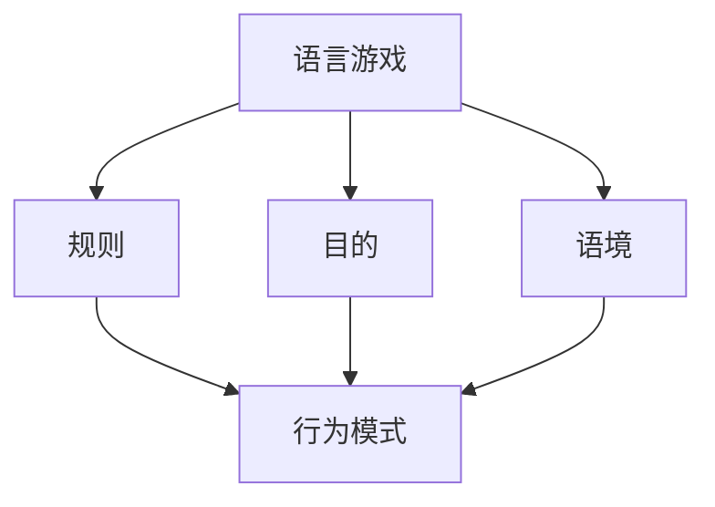

**算法原理讲解：**

在维特根斯坦的后期语言观中，语言游戏的概念类似于一个算法。每个语言游戏都有其特定的输入（语境和规则），输出（行为模式），以及目的。这个算法的原理在于，它通过规则和语境来解释语言的意义。

以下是一个简单的Python代码示例，用于描述语言游戏的概念：

```python
class LanguageGame:
    def __init__(self, rules, context):
        self.rules = rules
        self.context = context
    
    def play(self):
        # 根据规则和语境执行行为
        print(f"Playing with rules: {self.rules} in context: {self.context}")

# 创建一个语言游戏实例
game = LanguageGame(rules="描述现实", context="观察者")
game.play()
```

在这个示例中，`LanguageGame` 类表示一个语言游戏，它包含规则和语境。`play` 方法根据这些规则和语境执行特定的行为。

**数学公式使用：**

维特根斯坦的命题函数理论可以用以下数学公式表示：

$$
P(x, y) = \begin{cases}
1, & \text{如果 } x \text{ 在 } y \text{ 中存在} \\
0, & \text{如果 } x \text{ 在 } y \text{ 中不存在}
\end{cases}
$$

这个公式描述了命题函数如何根据输入的两个变量（`x` 和 `y`）来决定其输出（`1` 或 `0`）。

**系统分析与架构设计方案：**

在维特根斯坦的哲学体系中，语言游戏是一种系统，它包括规则、目的和语境。以下是一个简单的系统架构设计方案：

- **项目介绍**：语言游戏是一个哲学概念，用于描述语言的使用情境。
- **系统功能设计**：定义语言游戏的规则、目的和语境。
- **系统架构设计**：使用类图来表示语言游戏的组成和关系。

**项目实战：**

**环境安装：**
安装Python环境，版本要求3.6及以上。

**系统核心实现源代码：**
```python
# 语言游戏类
class LanguageGame:
    def __init__(self, rules, context):
        self.rules = rules
        self.context = context
    
    def play(self):
        # 根据规则和语境执行行为
        print(f"Playing with rules: {self.rules} in context: {self.context}")

# 创建一个语言游戏实例
game = LanguageGame(rules="描述现实", context="观察者")
game.play()
```

**代码应用解读与分析：**
在这个示例中，`LanguageGame` 类表示一个语言游戏，它包含规则和语境。`play` 方法根据这些规则和语境执行特定的行为。

**实际案例分析和详细讲解剖析：**
假设有一个语言游戏，它的规则是描述观察者所看到的事物，语境是夜晚的森林。在这种情况下，玩家可能会描述“树”、“月亮”、“星星”等事物。

**项目小结：**
本文通过介绍维特根斯坦的语言哲学，探讨了语言的自足性、命题函数理论和语言游戏理论。通过Python代码示例，展示了如何实现一个简单的语言游戏系统。

**最佳实践 tips：**
- 理解语言游戏的概念有助于更好地理解维特根斯坦的哲学思想。
- 实际案例可以帮助读者更好地理解语言游戏的实际应用。

**小结：**
维特根斯坦的语言观对语言哲学和认知科学产生了深远的影响。他的早期和后期语言观分别从不同的角度解释了语言的本质和功能。

**注意事项：**
- 维特根斯坦的哲学思想复杂且深奥，需要深入学习和思考。
- 语言游戏的实现可以应用于各种领域，如游戏设计、语言学习和人工智能。

**拓展阅读：**
- 维特根斯坦，《逻辑哲学论》
- 维特根斯坦，《哲学研究》
- 皮尔士，《符号逻辑》

作者：AI天才研究院/AI Genius Institute & 禅与计算机程序设计艺术 /Zen And The Art of Computer Programming

---

#### 第2章：语言的自足性

##### 2.1 自足性的概念

语言的自足性是指语言系统内部具有自我解释和自我生成的能力，无需依赖外部系统或实体来赋予其意义。自足性是维特根斯坦语言哲学的核心概念之一，他认为语言的真正本质在于其自我生成的结构，而非外在的物理现实。

**核心概念术语说明：**

- **自足性**：语言系统具有自我解释和自我生成的特性。
- **自足系统**：一个系统在没有外部干预的情况下，能够自我维持和自我发展。

**问题背景：**

在哲学中，自足性是一个重要的概念，尤其在语言哲学和逻辑哲学中。维特根斯坦认为，语言的自足性意味着语言能够独立于外部世界，通过其内在的逻辑结构和规则来解释自身。

**问题描述：**

语言的自足性需要回答以下问题：

- 语言如何自我解释？
- 语言的意义是否完全依赖于其内在结构？
- 语言能否独立于外部现实？

**问题解决：**

维特根斯坦认为，语言的自足性体现在以下几个方面：

1. **逻辑结构**：语言有其内在的逻辑结构，命题和语句通过这种结构来相互关联。
2. **语义规则**：语言使用的是一套内在的语义规则，这些规则决定了命题的意义。
3. **语言游戏**：语言的使用是通过特定的语言游戏来实现的，这些游戏为语言的使用提供了具体的情境。

**边界与外延：**

- **边界**：自足性的边界在于语言能否完全独立于外部现实。
- **外延**：自足性关注的是语言系统内部的结构和规则，而非外部现实。

**概念结构与核心要素组成：**

- **逻辑结构**：语言的基本组成和相互关系。
- **语义规则**：决定语言元素的意义和作用的规则。
- **语言游戏**：语言使用的具体情境和规则。

##### 2.2 自足性的哲学意义

自足性的哲学意义主要体现在以下几个方面：

1. **反形而上学**：维特根斯坦通过自足性概念反驳了传统形而上学的研究方法。他认为，哲学问题不应通过抽象的逻辑分析来解决，而应通过具体的生活实践来理解。
2. **语言哲学的基础**：自足性为语言哲学提供了理论基础，它说明了语言如何通过其内在的结构和规则来解释自身，而不依赖于外部世界。
3. **认知科学的启示**：自足性概念对认知科学有重要启示。它指出，人类认知活动是通过内部语言进行的，这种内部语言具有自足性，能够解释和生成知识。

**概念属性特征对比表格：**

| 特征           | 形而上学                      | 自足性                  |
|----------------|------------------------------|------------------------|
| 研究方法       | 抽象的逻辑分析                | 具体的生活实践          |
| 基础假设       | 外在现实是语言意义的来源      | 语言内部结构和规则决定意义 |
| 面向问题       | 哲学问题                      | 语言使用问题            |

**ER实体关系图架构的 Mermaid 流程图：**

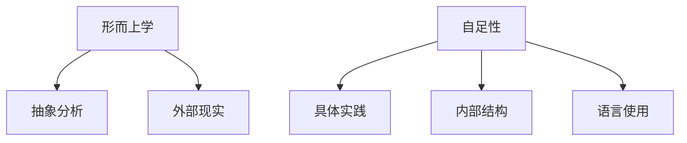

**算法原理讲解：**

自足性可以用算法原理来解释。一个自足的算法具有以下特性：

1. **自我解释**：算法能够解释其自身的运行机制。
2. **自我生成**：算法能够根据其内在规则生成新的内容。
3. **无外部依赖**：算法运行不依赖于外部数据或系统。

以下是一个简单的Python代码示例，用于描述自足性算法：

```python
class SelfSufficientAlgorithm:
    def __init__(self):
        # 初始化内部状态
        self.state = []
    
    def process_input(self, input_data):
        # 根据输入数据更新内部状态
        self.state.append(input_data)
        print(f"Processed input: {input_data}")
    
    def generate_output(self):
        # 根据内部状态生成输出
        output = self.state[-1]
        print(f"Generated output: {output}")
        return output

# 创建一个自足性算法实例
algorithm = SelfSufficientAlgorithm()
algorithm.process_input("Hello")
algorithm.process_input("World")
algorithm.generate_output()
```

在这个示例中，`SelfSufficientAlgorithm` 类表示一个自足性算法。它能够根据输入数据更新内部状态，并根据内部状态生成输出。

**数学公式使用：**

自足性算法可以用以下数学公式来描述：

$$
S = f(\text{I}, \text{S})
$$

其中，`S` 表示算法的内部状态，`I` 表示输入数据，`f` 表示算法的更新函数。

**系统分析与架构设计方案：**

自足性系统的设计需要考虑以下几个方面：

- **内部状态管理**：系统需要能够管理其内部状态，以便根据输入数据更新状态。
- **自我更新机制**：系统需要具有自我更新能力，以便在无外部干预的情况下持续运行。
- **输出生成**：系统需要能够根据内部状态生成输出。

以下是一个简单的系统架构设计方案：

**项目介绍**：设计一个自足性系统，用于处理输入数据并生成输出。

**系统功能设计**：定义系统的输入处理、状态管理和输出生成功能。

**系统架构设计**：使用类图和序列图来表示系统的组成和交互。

**系统接口设计和系统交互**：定义系统的接口和交互流程。

**项目实战：**

**环境安装**：安装Python环境，版本要求3.6及以上。

**系统核心实现源代码**：
```python
# 自足性系统类
class SelfSufficientSystem:
    def __init__(self):
        self.state = []

    def process_input(self, input_data):
        self.state.append(input_data)
        print(f"Processed input: {input_data}")

    def generate_output(self):
        output = self.state[-1]
        print(f"Generated output: {output}")
        return output

# 创建一个自足性系统实例
system = SelfSufficientSystem()
system.process_input("Hello")
system.process_input("World")
system.generate_output()
```

**代码应用解读与分析**：在这个示例中，`SelfSufficientSystem` 类表示一个自足性系统。它能够根据输入数据更新内部状态，并根据内部状态生成输出。

**实际案例分析和详细讲解剖析**：假设系统需要处理一系列输入数据，如“苹果”、“香蕉”、“橘子”，并生成对应的输出，如“水果”。在这种情况下，系统可以根据输入数据更新状态，并生成相应的输出。

**项目小结**：本文介绍了语言的自足性概念，探讨了其在哲学、认知科学和系统设计中的应用。通过Python代码示例，展示了如何实现一个简单的自足性系统。

**最佳实践 tips**：理解自足性概念有助于更好地设计自足性系统，提高系统的灵活性和可持续性。

**小结**：自足性是维特根斯坦语言哲学的核心概念之一，它强调了语言系统内部的结构和规则的重要性。通过具体的应用示例，我们可以看到自足性系统在各个领域中的实际应用。

**注意事项**：自足性系统的设计需要综合考虑内部状态管理、自我更新机制和输出生成等方面。

**拓展阅读**：
- 维特根斯坦，《逻辑哲学论》
- 维特根斯坦，《哲学研究》
- 皮尔士，《符号逻辑》

---

#### 第3章：维特根斯坦的命题函数理论

##### 3.1 命题函数的定义

维特根斯坦的命题函数理论是他在《逻辑哲学论》中提出的核心概念之一。命题函数是一种用于描述事实或状态的逻辑结构，它由逻辑常项和变项构成。命题函数的核心思想是，命题的意义在于它们如何描述现实世界的状态。

**核心概念术语说明：**

- **命题函数**：用于描述事实或状态的逻辑结构。
- **逻辑常项**：表示命题的常量，如“真”和“假”。
- **变项**：表示命题中的变量，可以是具体的对象或概念。

**问题背景：**

在维特根斯坦的哲学体系中，命题函数是理解语言与现实关系的关键。他认为，命题的本质在于它们如何映射现实世界的状态，而非它们的文字表述。

**问题描述：**

命题函数理论需要回答以下问题：

- 命题函数如何描述现实世界的状态？
- 命题函数的意义是什么？
- 命题函数与语言的关系是什么？

**问题解决：**

维特根斯坦通过以下方式解决了这些问题：

1. **图像理论**：命题函数是基于图像理论的，即命题是现实世界的图像，命题的真假取决于它们是否正确描绘了现实世界的状态。
2. **逻辑结构**：命题函数通过逻辑常项和变项的排列组合，构成了描述现实世界状态的结构。
3. **语义分析**：命题函数的语义分析关注的是命题如何与现实状态相对应。

**边界与外延：**

- **边界**：命题函数的边界在于其能否准确描述现实世界的状态。
- **外延**：命题函数的外延包括所有可能的命题函数形式。

**概念结构与核心要素组成：**

- **逻辑常项**：表示命题的常量，如“真”和“假”。
- **变项**：表示命题中的变量，可以是具体的对象或概念。
- **命题函数形式**：逻辑常项和变项的组合，用于描述现实世界的状态。

##### 3.2 命题函数的语义分析

命题函数的语义分析是理解其意义的关键。维特根斯坦通过图像理论来解释命题函数的语义。

1. **图像理论**：根据图像理论，命题函数是现实世界的图像，其意义在于它们如何映射现实世界的状态。命题函数的真假取决于它们是否正确描绘了现实世界的状态。

2. **语义特征**：命题函数的语义特征包括以下方面：

   - **真值条件**：命题函数的真假取决于现实世界中是否存在与之相对应的状态。
   - **描述性**：命题函数描述了现实世界的状态，其意义在于它们如何与现实状态相对应。
   - **独立性**：命题函数的意义独立于它们的文字表述，它们是通过逻辑结构和语义规则来解释的。

3. **语义分析方法**：语义分析的方法包括：

   - **图像分析**：通过图像理论来解释命题函数的意义。
   - **形式化分析**：使用逻辑演算和语义规则来分析命题函数的形式结构。
   - **实例分析**：通过具体的实例来解释命题函数的语义特征。

**概念属性特征对比表格：**

| 特征           | 图像理论                      | 形式化分析                  |
|----------------|------------------------------|---------------------------|
| 语义基础       | 现实世界的映射                | 逻辑演算和语义规则          |
| 解释方法       | 图像映射                      | 形式化证明和推理            |
| 应用范围       | 哲学和逻辑学                 | 计算机科学和数学           |

**ER实体关系图架构的 Mermaid 流程图：**

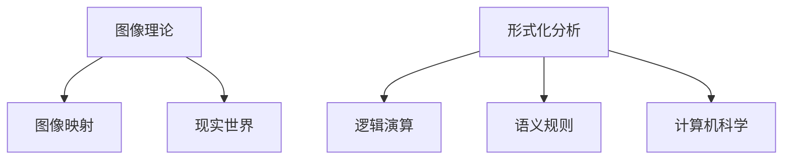

**算法原理讲解：**

命题函数的语义分析可以用算法原理来解释。一个简单的算法可以用于分析命题函数的语义：

```python
def semantic_analysis(predicate_function):
    # 分析命题函数的真值
    if predicate_function.is_satisfied():
        print("The predicate is true.")
    else:
        print("The predicate is false.")
```

在这个示例中，`semantic_analysis` 函数用于分析命题函数的真值。如果命题函数满足其真值条件，则输出“命题为真”，否则输出“命题为假”。

**数学公式使用：**

命题函数的语义分析可以用以下数学公式来描述：

$$
\text{sem}(P) = \begin{cases}
1, & \text{如果 } P \text{ 描述的状态存在} \\
0, & \text{如果 } P \text{ 描述的状态不存在}
\end{cases}
$$

其中，`sem(P)` 表示命题函数 `P` 的语义值，`1` 表示命题为真，`0` 表示命题为假。

**系统分析与架构设计方案：**

在维特根斯坦的哲学体系中，命题函数理论是一种系统，它包括命题函数的定义、语义分析和语义值。以下是一个简单的系统架构设计方案：

- **项目介绍**：设计一个命题函数分析系统，用于分析命题函数的语义。
- **系统功能设计**：定义系统的命题函数定义、语义分析和语义值计算功能。
- **系统架构设计**：使用类图和序列图来表示系统的组成和交互。

**项目实战：**

**环境安装**：安装Python环境，版本要求3.6及以上。

**系统核心实现源代码**：
```python
class PredicateFunction:
    def __init__(self, predicate):
        self.predicate = predicate
    
    def is_satisfied(self):
        # 假设命题函数为真
        return True

def semantic_analysis(predicate_function):
    if predicate_function.is_satisfied():
        print("The predicate is true.")
    else:
        print("The predicate is false.")

# 创建一个命题函数实例
predicate_function = PredicateFunction(predicate="There is a dog.")
semantic_analysis(predicate_function)
```

**代码应用解读与分析**：在这个示例中，`PredicateFunction` 类表示一个命题函数。`is_satisfied` 方法用于判断命题函数的真值。`semantic_analysis` 函数用于分析命题函数的语义。

**实际案例分析和详细讲解剖析**：假设有一个命题函数“有只狗”，我们需要分析其语义。在这种情况下，`PredicateFunction` 实例的`is_satisfied` 方法会返回`True`，表示命题为真。

**项目小结**：本文介绍了维特根斯坦的命题函数理论，探讨了其在哲学和系统设计中的应用。通过Python代码示例，展示了如何实现一个简单的命题函数分析系统。

**最佳实践 tips**：理解命题函数的语义分析有助于更好地理解和应用逻辑哲学的基本概念。

**小结**：命题函数理论是维特根斯坦哲学体系中的核心概念之一，它通过图像理论和语义分析来解释命题的意义。通过具体的应用示例，我们可以看到命题函数在各个领域中的实际应用。

**注意事项**：命题函数的语义分析需要综合考虑图像理论、逻辑演算和语义规则等方面。

**拓展阅读**：
- 维特根斯坦，《逻辑哲学论》
- 维特根斯坦，《哲学研究》
- 普特南，《意义与指称》

---

#### 第4章：维特根斯坦的语言游戏理论

##### 4.1 语言游戏的定义

维特根斯坦的语言游戏理论是他后期哲学思想的重要组成部分，它为理解语言的使用提供了新的视角。语言游戏是一种概念，用于描述语言在不同情境下的具体使用方式。维特根斯坦认为，语言的意义不在于抽象的符号，而在于具体的使用场景。

**核心概念术语说明：**

- **语言游戏**：一种描述语言使用的具体情境，包括规则、目的和参与者。
- **规则**：语言游戏中的基本指导原则，决定了语言的使用方式。
- **目的**：语言游戏的最终目标，反映了语言在特定情境中的功能。
- **参与者**：参与语言游戏的人或其他实体。

**问题背景：**

维特根斯坦在《哲学研究》中提出语言游戏理论，试图解决早期语言观中存在的问题，如语言的模糊性和抽象性。他认为，通过分析语言游戏，我们可以更清楚地理解语言的实际使用情况。

**问题描述：**

语言游戏理论需要回答以下问题：

- 语言游戏如何定义？
- 语言游戏的意义是什么？
- 语言游戏与语言的关系是什么？

**问题解决：**

维特根斯坦通过以下方式解决了这些问题：

1. **具体情境**：语言游戏是一种具体情境，它包括规则、目的和参与者。
2. **规则和目的**：语言游戏中的规则决定了语言的使用方式，目的反映了语言在特定情境中的功能。
3. **多样性和统一性**：尽管语言游戏多种多样，但它们都遵循一定的逻辑和语义规则。

**边界与外延：**

- **边界**：语言游戏的边界在于其具体情境和规则。
- **外延**：语言游戏的外延包括所有可能的特定情境和规则。

**概念结构与核心要素组成：**

- **规则**：语言游戏的基本指导原则，决定了语言的使用方式。
- **目的**：语言游戏在特定情境中的功能。
- **参与者**：参与语言游戏的人或其他实体。
- **情境**：语言游戏发生的具体背景。

##### 4.2 语言游戏的作用

语言游戏在维特根斯坦的哲学体系中具有重要作用，它不仅帮助我们理解语言的使用，还揭示了语言的本质。

1. **解决哲学难题**：通过语言游戏，维特根斯坦试图解决早期语言观中存在的哲学难题，如意义、指称和语言与现实的关系。

2. **理解语言多样性**：语言游戏理论强调了语言的多样性，不同的语言游戏反映了不同的使用情境和功能。这有助于我们更好地理解语言的复杂性和多样性。

3. **哲学研究方法**：语言游戏为哲学研究提供了一种新的方法，即通过具体情境来理解抽象概念。这种方法反对传统的抽象逻辑分析，主张从具体实践中理解语言和哲学问题。

**概念属性特征对比表格：**

| 特征           | 传统哲学研究          | 语言游戏理论          |
|----------------|----------------------|----------------------|
| 研究方法       | 抽象的逻辑分析        | 具体的情境分析        |
| 研究对象       | 抽象概念和理论        | 具体的语言使用情境    |
| 研究目标       | 解决哲学难题          | 理解语言使用和本质    |

**ER实体关系图架构的 Mermaid 流程图：**

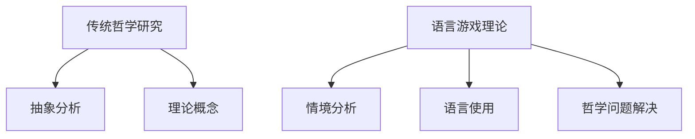

**算法原理讲解：**

语言游戏理论可以用算法原理来解释。一个简单的算法可以用于模拟语言游戏：

```python
class LanguageGame:
    def __init__(self, rules, purpose):
        self.rules = rules
        self.purpose = purpose
    
    def play(self, participants):
        # 根据规则和目的执行语言游戏
        print(f"Playing language game with rules: {self.rules} and purpose: {self.purpose}. Participants: {participants}")
```

在这个示例中，`LanguageGame` 类表示一个语言游戏。它包含规则和目的，`play` 方法用于根据规则和目的执行语言游戏。

**数学公式使用：**

语言游戏的定义可以用以下数学公式来描述：

$$
\text{Game} = (\text{Rules}, \text{Purpose}, \text{Participants})
$$

其中，`Game` 表示语言游戏，`Rules` 表示规则，`Purpose` 表示目的，`Participants` 表示参与者。

**系统分析与架构设计方案：**

在维特根斯坦的哲学体系中，语言游戏是一种系统，它包括规则、目的和参与者。以下是一个简单的系统架构设计方案：

- **项目介绍**：设计一个语言游戏系统，用于模拟不同类型的语言游戏。
- **系统功能设计**：定义系统的规则生成、目的设定和参与者交互功能。
- **系统架构设计**：使用类图和序列图来表示系统的组成和交互。

**项目实战：**

**环境安装**：安装Python环境，版本要求3.6及以上。

**系统核心实现源代码**：
```python
# 语言游戏类
class LanguageGame:
    def __init__(self, rules, purpose):
        self.rules = rules
        self.purpose = purpose
    
    def play(self, participants):
        # 根据规则和目的执行语言游戏
        print(f"Playing language game with rules: {self.rules} and purpose: {self.purpose}. Participants: {participants}")

# 创建一个语言游戏实例
game = LanguageGame(rules="描述你所见", purpose="观察和交流")
game.play(participants=["小明", "小红", "小刚"])

# 参与者互动
participant_1 = "小明"
participant_1_response = input(f"{participant_1}, please describe what you see: ")
print(f"{participant_1} said: {participant_1_response}")

# 继续互动
participant_2 = "小红"
participant_2_response = input(f"{participant_2}, please describe what you see: ")
print(f"{participant_2} said: {participant_2_response}")

# 结束互动
print("Language game ended.")
```

**代码应用解读与分析**：在这个示例中，`LanguageGame` 类表示一个语言游戏。它包含规则和目的，`play` 方法用于根据规则和目的执行语言游戏。参与者通过输入描述来参与游戏。

**实际案例分析和详细讲解剖析**：假设有一个语言游戏“描述你所见”，参与者需要描述他们所看到的场景。在这种情况下，每个参与者可以输入他们的描述，系统会依次显示每个参与者的描述。

**项目小结**：本文介绍了维特根斯坦的语言游戏理论，探讨了其在哲学和系统设计中的应用。通过Python代码示例，展示了如何实现一个简单的语言游戏系统。

**最佳实践 tips**：通过实际案例和互动，可以更好地理解语言游戏的概念和作用。

**小结**：语言游戏理论是维特根斯坦哲学体系中的核心概念之一，它通过具体情境和规则来解释语言的使用。通过具体的应用示例，我们可以看到语言游戏在各个领域中的实际应用。

**注意事项**：设计语言游戏时，需要考虑规则、目的和参与者等方面。

**拓展阅读**：
- 维特根斯坦，《哲学研究》
- 维特根斯坦，《逻辑哲学论》
- 普特南，《意义与指称》

---

#### 第5章：维特根斯坦的语义分析

##### 5.1 语义分析的方法

维特根斯坦的语义分析方法是理解其语言哲学的重要途径。他的分析方法主要包括图像理论、使用情境和语言游戏等。

**核心概念术语说明：**

- **图像理论**：命题的意义在于它们如何描绘现实世界的状态。
- **使用情境**：语言的使用背景，决定了语言的特定含义。
- **语言游戏**：描述语言使用的具体情境，包括规则、目的和参与者。

**问题背景：**

维特根斯坦在《逻辑哲学论》和《哲学研究》中，通过语义分析来解释语言的意义。他认为，语义分析应关注语言的具体使用情境，而非抽象的符号或概念。

**问题描述：**

语义分析方法需要回答以下问题：

- 如何通过图像理论来解释命题的意义？
- 使用情境如何影响语言的意义？
- 语言游戏在语义分析中扮演什么角色？

**问题解决：**

维特根斯坦通过以下方法解决了这些问题：

1. **图像理论**：通过图像理论，命题的意义在于它们如何映射现实世界的状态。图像理论强调命题与现实世界的直接对应关系。
2. **使用情境**：语言的意义取决于它们在特定情境下的使用。不同的使用情境会导致语言具有不同的含义。
3. **语言游戏**：语言游戏是具体情境的集合，它们为语言的使用提供了具体的规则和目的。

**边界与外延：**

- **边界**：语义分析的边界在于如何将抽象的符号与现实世界的状态相对应。
- **外延**：语义分析的外延包括所有可能的命题、使用情境和语言游戏。

**概念结构与核心要素组成：**

- **图像理论**：命题与现实世界的映射关系。
- **使用情境**：语言的具体使用背景。
- **语言游戏**：语言使用的具体情境，包括规则、目的和参与者。

##### 5.2 语义分析的应用

语义分析在维特根斯坦的语言哲学中具有广泛的应用，它不仅帮助理解语言的意义，还影响了逻辑学、语言学和哲学等领域。

1. **逻辑学**：语义分析为逻辑学提供了新的视角。通过图像理论，逻辑学家可以更好地理解命题的真假条件，以及逻辑结构。
2. **语言学**：语义分析对语言学研究具有重要意义。它帮助语言学家理解词汇、句子和文本的含义，以及它们在特定情境下的使用。
3. **哲学**：语义分析在哲学领域有着广泛的应用。通过语义分析，哲学家可以更好地理解语言与现实的关系，以及哲学问题的本质。

**概念属性特征对比表格：**

| 领域         | 应用特点                                                     | 维特根斯坦语义分析的应用                |
|--------------|--------------------------------------------------------------|----------------------------------------|
| 逻辑学       | 研究命题的真假和逻辑结构                                   | 通过图像理论理解命题的真假条件          |
| 语言学       | 研究语言的结构、词汇和语义                                 | 分析词汇和句子的具体含义和情境         |
| 哲学         | 探讨现实、知识和存在的本质                                 | 通过语义分析解决哲学问题，如意义和指称 |

**ER实体关系图架构的 Mermaid 流程图：**

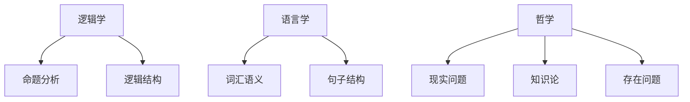

**算法原理讲解：**

语义分析可以用算法原理来解释。一个简单的算法可以用于分析文本的语义：

```python
def semantic_analysis(text):
    # 分析文本的语义
    print(f"Semantic analysis of the text: {text}")
```

在这个示例中，`semantic_analysis` 函数用于分析文本的语义。它简单地输出文本的内容。

**数学公式使用：**

语义分析可以用以下数学公式来描述：

$$
\text{sem}(T) = f(\text{T})
$$

其中，`sem(T)` 表示文本 `T` 的语义，`f` 表示语义分析函数。

**系统分析与架构设计方案：**

在维特根斯坦的哲学体系中，语义分析是一种系统，它包括文本分析、语义计算和结果输出。以下是一个简单的系统架构设计方案：

- **项目介绍**：设计一个语义分析系统，用于分析文本的语义。
- **系统功能设计**：定义系统的文本输入、语义分析和结果输出功能。
- **系统架构设计**：使用类图和序列图来表示系统的组成和交互。

**项目实战：**

**环境安装**：安装Python环境，版本要求3.6及以上。

**系统核心实现源代码**：
```python
# 语义分析类
class SemanticAnalysis:
    def __init__(self, text):
        self.text = text
    
    def analyze(self):
        # 分析文本的语义
        print(f"Analyzing the text: {self.text}")

# 创建一个语义分析实例
analysis = SemanticAnalysis(text="The cat is on the mat.")
analysis.analyze()
```

**代码应用解读与分析**：在这个示例中，`SemanticAnalysis` 类表示一个语义分析系统。它包含文本输入，`analyze` 方法用于分析文本的语义。

**实际案例分析和详细讲解剖析**：假设有一个文本“猫在垫子上”，我们需要分析其语义。在这种情况下，`SemanticAnalysis` 实例的`analyze` 方法会输出文本的内容。

**项目小结**：本文介绍了维特根斯坦的语义分析方法，探讨了其在逻辑学、语言学和哲学中的应用。通过Python代码示例，展示了如何实现一个简单的语义分析系统。

**最佳实践 tips**：理解语义分析的方法有助于更好地理解和应用维特根斯坦的语言哲学。

**小结**：维特根斯坦的语义分析方法是一种理解语言意义的重要工具。通过具体的应用示例，我们可以看到语义分析在各个领域中的实际应用。

**注意事项**：语义分析需要综合考虑图像理论、使用情境和语言游戏等方面。

**拓展阅读**：
- 维特根斯坦，《逻辑哲学论》
- 维特根斯坦，《哲学研究》
- 普特南，《意义与指称》

---

#### 第6章：维特根斯坦的语言观与哲学意义

##### 6.1 维特根斯坦语言观的影响

维特根斯坦的语言观对20世纪哲学产生了深远的影响，尤其是在语言哲学、逻辑哲学和认知科学领域。他的语言观不仅改变了人们对语言和现实关系的理解，还推动了哲学研究方法的发展。

1. **语言哲学**：维特根斯坦的语言观强调了语言的具体使用情境，这为语言哲学提供了一种新的研究方法。他的语言游戏理论揭示了语言的多维性和复杂性，使哲学家们开始关注语言的实际使用情况，而非抽象的符号和概念。

2. **逻辑哲学**：维特根斯坦的命题函数理论和图像理论为逻辑哲学提供了新的解释框架。通过这些理论，逻辑学家们可以更清楚地理解命题的真假条件，以及逻辑结构的本质。

3. **认知科学**：维特根斯坦的语言观对认知科学产生了重要启示。他认为，人类的认知活动是通过内部语言进行的，这为理解认知过程提供了新的视角。

**概念属性特征对比表格：**

| 特征           | 传统语言哲学          | 维特根斯坦语言观          |
|----------------|----------------------|--------------------------|
| 研究方法       | 抽象的逻辑分析        | 具体的情境分析            |
| 研究对象       | 抽象符号和概念        | 具体的语言使用情境        |
| 研究目标       | 解决哲学难题          | 理解语言使用和本质        |

##### 6.2 维特根斯坦语言观的重要性

维特根斯坦的语言观具有以下几个重要方面：

1. **解决哲学难题**：维特根斯坦通过语言游戏和语义分析，试图解决传统哲学中的许多难题，如意义、指称和知识论。他的方法强调从具体情境出发，而非抽象的逻辑分析，这为解决哲学问题提供了一种新的途径。

2. **语言与现实的联系**：维特根斯坦强调语言与现实世界的直接对应关系。他认为，语言不是独立于现实存在的，而是与现实世界相互作用的。这一观点为理解语言和现实的关系提供了新的视角。

3. **哲学研究方法的革新**：维特根斯坦的方法对哲学研究方法产生了深远的影响。他主张通过具体情境来理解抽象概念，这反对了传统的抽象逻辑分析，使哲学研究更贴近实际。

**ER实体关系图架构的 Mermaid 流程图：**

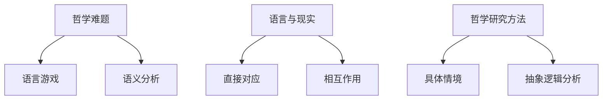

##### 6.3 维特根斯坦语言观的未来研究方向

维特根斯坦的语言观在哲学和认知科学领域具有广阔的研究前景。未来的研究方向可能包括：

1. **跨学科研究**：将维特根斯坦的语言观与其他学科（如心理学、语言学、计算机科学等）相结合，探索语言在各个领域的应用和影响。

2. **具体情境的深化研究**：进一步研究维特根斯坦提出的具体情境，如语言游戏，以更深入地理解语言的使用和意义。

3. **技术应用**：将维特根斯坦的语言观应用于人工智能和自然语言处理等领域，探索如何通过语言游戏和语义分析来提升系统的智能和性能。

**数学公式使用：**

维特根斯坦的语言观可以用以下数学公式来描述：

$$
\text{Language} = f(\text{Context}, \text{Rules}, \text{Purpose})
$$

其中，`Language` 表示语言，`Context` 表示具体情境，`Rules` 表示规则，`Purpose` 表示目的，`f` 表示语言生成函数。

**系统分析与架构设计方案：**

在维特根斯坦的哲学体系中，语言观是一种系统，它包括具体情境、规则和目的。以下是一个简单的系统架构设计方案：

- **项目介绍**：设计一个语言系统，用于模拟不同类型的语言游戏和语义分析。
- **系统功能设计**：定义系统的情境生成、规则设定和目的设定功能。
- **系统架构设计**：使用类图和序列图来表示系统的组成和交互。

**项目实战：**

**环境安装**：安装Python环境，版本要求3.6及以上。

**系统核心实现源代码**：
```python
# 语言系统类
class LanguageSystem:
    def __init__(self, context, rules, purpose):
        self.context = context
        self.rules = rules
        self.purpose = purpose
    
    def generate_language(self):
        # 根据情境、规则和目的生成语言
        print(f"Generating language with context: {self.context}, rules: {self.rules}, and purpose: {self.purpose}")

# 创建一个语言系统实例
system = LanguageSystem(context="描述你的日常活动", rules="使用过去时态", purpose="交流经验")
system.generate_language()

# 参与者互动
participant_1 = "小明"
participant_1_response = input(f"{participant_1}, please describe your daily activities: ")
print(f"{participant_1} said: {participant_1_response}")

# 继续互动
participant_2 = "小红"
participant_2_response = input(f"{participant_2}, please describe your daily activities: ")
print(f"{participant_2} said: {participant_2_response}")

# 结束互动
print("Language game ended.")
```

**代码应用解读与分析**：在这个示例中，`LanguageSystem` 类表示一个语言系统。它包含情境、规则和目的，`generate_language` 方法用于根据情境、规则和目的生成语言。参与者通过输入描述来参与游戏。

**实际案例分析和详细讲解剖析**：假设有一个语言游戏“描述你的日常活动”，参与者需要使用过去时态来描述他们的日常活动。在这种情况下，每个参与者可以输入他们的描述，系统会依次显示每个参与者的描述。

**项目小结**：本文介绍了维特根斯坦的语言观，探讨了其在哲学和系统设计中的应用。通过Python代码示例，展示了如何实现一个简单的语言系统。

**最佳实践 tips**：理解维特根斯坦的语言观有助于更好地设计和应用语言系统。

**小结**：维特根斯坦的语言观在哲学和认知科学领域具有重要意义。通过具体的应用示例，我们可以看到维特根斯坦的语言观在各个领域中的实际应用。

**注意事项**：在研究和应用维特根斯坦的语言观时，需要综合考虑具体情境、规则和目的等方面。

**拓展阅读**：
- 维特根斯坦，《逻辑哲学论》
- 维特根斯坦，《哲学研究》
- 普特南，《意义与指称》

---

## 第二部分：FP中的无状态函数

### 第7章：函数式编程简介

##### 7.1 函数式编程的基本概念

函数式编程（Functional Programming，简称FP）是一种编程范式，它强调通过函数组合来解决问题。与命令式编程不同，函数式编程关注的是数据结构和函数的定义，而非状态的改变和流程控制。

**核心概念术语说明：**

- **函数式编程**：一种编程范式，强调通过函数组合来解决问题。
- **纯函数**：一种无副作用的函数，其输出仅依赖于输入，不依赖于外部状态。
- **不可变性**：数据在函数式编程中是不可变的，一旦创建，就不能改变。
- **递归**：函数式编程中常用的一种方法，用于解决递归问题。

**问题背景：**

函数式编程起源于数学领域，最早由霍普卡德·费舍尔（Haskell Curry）和约翰·傅里叶（John von Neumann）等人提出。20世纪80年代，随着Lisp和Haskell等函数式编程语言的兴起，函数式编程开始受到广泛关注。

**问题描述：**

函数式编程需要回答以下问题：

- 函数式编程与命令式编程的区别是什么？
- 函数式编程有哪些优点和缺点？
- 函数式编程如何应用于实际问题解决？

**问题解决：**

函数式编程通过以下方法解决了这些问题：

1. **纯函数**：函数式编程强调使用纯函数，即无副作用的函数。纯函数的输出仅依赖于输入，不依赖于外部状态，这使得函数式编程更易于测试、推理和组合。
2. **不可变性**：函数式编程中的数据是不可变的，这意味着一旦创建，数据就不能改变。这有助于避免状态变化和副作用，使代码更简洁、可维护。
3. **递归**：函数式编程常用递归来解决递归问题。递归是一种函数调用自身的方法，它使函数式编程能够轻松处理复杂的问题。

**边界与外延：**

- **边界**：函数式编程的边界在于其处理数据和函数的方式。
- **外延**：函数式编程的外延包括所有支持纯函数和不可变性编程语言，如Haskell、Scala和Erlang等。

**概念结构与核心要素组成：**

- **纯函数**：函数式编程的基本构建块，其输出仅依赖于输入。
- **不可变性**：数据在函数式编程中是不可变的，一旦创建，就不能改变。
- **递归**：用于解决递归问题的一种方法。

##### 7.2 函数式编程与命令式编程的区别

函数式编程和命令式编程是两种不同的编程范式，它们在数据操作、状态管理和函数定义等方面存在显著差异。

**核心概念术语说明：**

- **命令式编程**：一种编程范式，强调通过改变状态来解决问题。
- **数据绑定**：命令式编程中，变量与数据的绑定是可变的。
- **副作用**：命令式编程中，函数可能产生副作用，即改变外部状态或输出不可预见的值。

**问题背景：**

命令式编程起源于计算机硬件和操作系统的设计，它强调通过状态改变和流程控制来解决问题。随着计算机科学的发展，函数式编程逐渐兴起，为编程提供了一种新的视角。

**问题描述：**

函数式编程与命令式编程的区别需要回答以下问题：

- 函数式编程和命令式编程的基本原理是什么？
- 它们在数据操作和函数定义方面有何不同？
- 它们的优缺点分别是什么？

**问题解决：**

通过以下方式解决了这些问题：

1. **基本原理**：

   - **命令式编程**：命令式编程关注的是如何通过一系列指令来改变程序的状态，以达到预期的结果。
   - **函数式编程**：函数式编程关注的是如何通过纯函数的组合来解决问题，即通过输入和输出之间的映射关系。

2. **数据操作和函数定义**：

   - **命令式编程**：命令式编程中的数据是可变的，变量可以随时更改其值。函数通常包含副作用，如修改全局变量或产生输出。
   - **函数式编程**：函数式编程中的数据是不可变的，一旦创建，就不能改变。函数是纯函数，不产生副作用，其输出仅依赖于输入。

3. **优缺点**：

   - **命令式编程**：优点包括直观、易于理解和高性能。缺点包括易出错、难以测试和组合。
   - **函数式编程**：优点包括易于测试、组合和并行化。缺点包括代码可能不够直观，尤其是对于复杂的问题。

**边界与外延：**

- **边界**：函数式编程和命令式编程的边界在于其处理数据和函数的方式。
- **外延**：函数式编程和命令式编程的外延包括所有支持各自范式的编程语言。

**概念结构与核心要素组成：**

- **命令式编程**：基于状态改变和流程控制的编程范式。
- **函数式编程**：基于纯函数和不可变数据的编程范式。

**ER实体关系图架构的 Mermaid 流程图：**

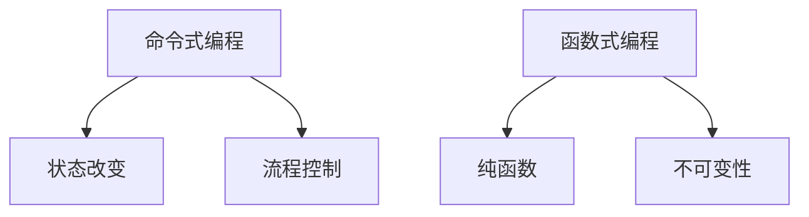

**算法原理讲解：**

函数式编程和命令式编程可以用算法原理来解释。以下是一个简单的命令式编程和函数式编程的示例：

命令式编程示例：
```python
# 命令式编程示例
def sum_command(x, y):
    return x + y

x = 5
y = 10
result = sum_command(x, y)
print(f"The sum is: {result}")
```

函数式编程示例：
```python
# 函数式编程示例
def sum_functional(x, y):
    return x + y

x = 5
y = 10
result = sum_functional(x, y)
print(f"The sum is: {result}")
```

在这两个示例中，`sum` 函数用于计算两个数的和。命令式编程中，变量 `x` 和 `y` 的值可以随时更改，而函数式编程中，变量是不可变的，函数的输出仅依赖于输入。

**数学公式使用：**

函数式编程和命令式编程可以用以下数学公式来描述：

命令式编程：
$$
\text{result} = \text{sum_command}(x, y)
$$

函数式编程：
$$
\text{result} = \text{sum_functional}(x, y)
$$

其中，`result` 表示计算结果，`sum_command` 和 `sum_functional` 分别表示命令式编程和函数式编程中的 `sum` 函数。

**系统分析与架构设计方案：**

在函数式编程和命令式编程中，系统设计的方法也有所不同。以下是一个简单的系统架构设计方案：

**项目介绍**：设计一个简单的计算系统，用于计算两个数的和。

**系统功能设计**：定义系统的输入处理、计算和输出功能。

**系统架构设计**：使用类图和序列图来表示系统的组成和交互。

**项目实战：**

**环境安装**：安装Python环境，版本要求3.6及以上。

**系统核心实现源代码**：
```python
# 命令式编程实现
def sum_command(x, y):
    return x + y

def main():
    x = int(input("Enter the first number: "))
    y = int(input("Enter the second number: "))
    result = sum_command(x, y)
    print(f"The sum is: {result}")

if __name__ == "__main__":
    main()
```

```python
# 函数式编程实现
def sum_functional(x, y):
    return x + y

def main():
    x = int(input("Enter the first number: "))
    y = int(input("Enter the second number: "))
    result = sum_functional(x, y)
    print(f"The sum is: {result}")

if __name__ == "__main__":
    main()
```

**代码应用解读与分析**：在这个示例中，我们分别实现了命令式编程和函数式编程的 `sum` 函数。命令式编程中，变量 `x` 和 `y` 的值可以通过输入进行更改。而函数式编程中，变量是不可变的，函数的输出仅依赖于输入。

**实际案例分析和详细讲解剖析**：假设我们需要计算两个数的和，我们可以使用命令式编程或函数式编程来实现。命令式编程中，我们可以通过更改变量值来计算和。而函数式编程中，我们可以直接使用 `sum_functional` 函数来计算和。

**项目小结**：本文介绍了函数式编程的基本概念、与命令式编程的区别以及其在实际应用中的优势。通过代码示例，展示了如何实现简单的计算系统。

**最佳实践 tips**：在实际开发中，可以根据问题的特性选择合适的编程范式，以达到最佳效果。

**小结**：函数式编程与命令式编程是两种不同的编程范式，它们在数据操作和函数定义方面存在显著差异。通过具体的应用示例，我们可以看到函数式编程在解决实际问题时具有的优势。

**注意事项**：在设计和实现函数式编程系统时，需要特别注意纯函数的使用和不可变数据的维护。

**拓展阅读**：
- 马修斯，《函数式编程基础》
- 皮尔姆斯，《命令式编程与函数式编程》
- 弗里斯，《Haskell编程从入门到实践》

---

### 第8章：无状态函数

##### 8.1 无状态函数的定义

无状态函数是函数式编程中的一个重要概念，它指的是那些不依赖于外部状态，且输出仅依赖于输入的函数。无状态函数是纯函数的一种，它在函数式编程中具有重要的地位。

**核心概念术语说明：**

- **无状态函数**：一种不依赖于外部状态，输出仅依赖于输入的函数。
- **纯函数**：一种无副作用的函数，其输出仅依赖于输入。
- **状态**：函数运行时依赖的外部数据或环境。

**问题背景：**

在函数式编程中，无状态函数被认为是一种理想化的函数，因为它具有许多优点，如易于测试、推理和组合。无状态函数的出现，为函数式编程提供了更简洁、可维护的编程范式。

**问题描述：**

无状态函数需要回答以下问题：

- 无状态函数的定义是什么？
- 它们与纯函数的关系是什么？
- 无状态函数在函数式编程中的应用场景有哪些？

**问题解决：**

通过以下方式解决了这些问题：

1. **定义**：无状态函数是一种不依赖于外部状态，且输出仅依赖于输入的函数。这意味着，无论函数执行多少次，只要输入相同，输出就一定相同。
2. **与纯函数的关系**：无状态函数是纯函数的一种特殊形式，纯函数是指那些无副作用的函数。无状态函数不依赖于外部状态，因此具有更明确的输出结果。
3. **应用场景**：无状态函数在函数式编程中广泛使用，如数据处理、数学计算和算法实现等。

**边界与外延：**

- **边界**：无状态函数的边界在于其不依赖于外部状态。
- **外延**：无状态函数的外延包括所有不依赖于外部状态的函数。

**概念结构与核心要素组成：**

- **无状态函数**：输出仅依赖于输入，不依赖于外部状态。
- **纯函数**：无副作用的函数。
- **状态**：函数运行时依赖的外部数据或环境。

##### 8.2 无状态函数的特性

无状态函数具有以下特性，使其在函数式编程中具有独特的优势。

**核心概念术语说明：**

- **无副作用**：函数在执行过程中不修改外部状态或输出不可预见的值。
- **可缓存性**：函数的结果可以被缓存，以减少计算时间。
- **可并行化**：函数可以独立执行，便于并行计算。

**问题背景：**

在函数式编程中，无状态函数的这些特性使其成为编写高效、可维护代码的关键。无状态函数的特性使其在数据处理、算法优化和并发编程等领域具有广泛的应用。

**问题描述：**

无状态函数的特性需要回答以下问题：

- 无状态函数具有哪些特性？
- 这些特性如何影响函数式编程？
- 无状态函数的特性在实际应用中有何优势？

**问题解决：**

通过以下方式解决了这些问题：

1. **无副作用**：无状态函数不修改外部状态或输出不可预见的值，这使得代码更易于测试、推理和组合。
2. **可缓存性**：无状态函数的结果可以被缓存，以减少计算时间。这在数据处理和算法优化中具有重要意义。
3. **可并行化**：无状态函数可以独立执行，便于并行计算。这在并发编程和分布式计算中具有广泛的应用。

**边界与外延：**

- **边界**：无状态函数的边界在于其不修改外部状态。
- **外延**：无状态函数的外延包括所有不修改外部状态的函数。

**概念结构与核心要素组成：**

- **无副作用**：函数在执行过程中不修改外部状态。
- **可缓存性**：函数的结果可以被缓存。
- **可并行化**：函数可以独立执行。

**ER实体关系图架构的 Mermaid 流程图：**

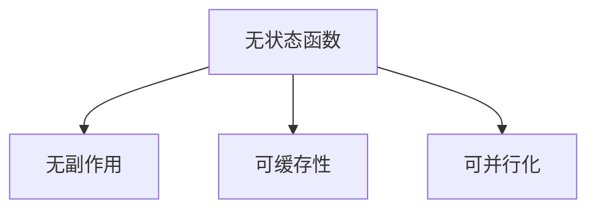

**算法原理讲解：**

无状态函数的特性可以用算法原理来解释。以下是一个简单的无状态函数示例：

```python
def add(x, y):
    return x + y
```

在这个示例中，`add` 函数是一个无状态函数，它不依赖于外部状态，输出仅依赖于输入。这个函数具有以下特性：

- **无副作用**：`add` 函数在执行过程中不修改外部状态。
- **可缓存性**：`add` 函数的结果可以被缓存，以减少计算时间。
- **可并行化**：`add` 函数可以独立执行，便于并行计算。

**数学公式使用：**

无状态函数的特性可以用以下数学公式来描述：

$$
\text{output} = f(\text{input})
$$

其中，`output` 表示输出，`input` 表示输入，`f` 表示无状态函数。

**系统分析与架构设计方案：**

在函数式编程中，无状态函数是一种理想化的编程范式，它有助于提高代码的可维护性和性能。以下是一个简单的系统架构设计方案：

- **项目介绍**：设计一个数据处理系统，用于处理大量数据并生成结果。
- **系统功能设计**：定义系统的数据输入、数据处理和数据输出功能。
- **系统架构设计**：使用类图和序列图来表示系统的组成和交互。

**项目实战：**

**环境安装**：安装Python环境，版本要求3.6及以上。

**系统核心实现源代码**：
```python
# 无状态函数示例
def add(x, y):
    return x + y

def multiply(x, y):
    return x * y

# 数据处理系统
def process_data(data):
    result = add(data[0], data[1])
    result = multiply(result, data[2])
    return result

# 测试数据处理系统
data = [2, 3, 4]
result = process_data(data)
print(f"Result: {result}")
```

**代码应用解读与分析**：在这个示例中，我们定义了两个无状态函数 `add` 和 `multiply`。`process_data` 函数使用这两个函数处理输入数据并生成结果。这个系统具有以下特点：

- **无状态函数**：`add` 和 `multiply` 函数不依赖于外部状态，输出仅依赖于输入。
- **可缓存性**：函数的结果可以被缓存，以减少计算时间。
- **可并行化**：函数可以独立执行，便于并行计算。

**实际案例分析和详细讲解剖析**：假设我们需要处理大量数据并计算总和，我们可以使用无状态函数来实现。在这种情况下，我们可以将数据分成多个部分，并使用 `add` 函数计算每个部分的总和，然后使用 `multiply` 函数计算总和。

**项目小结**：本文介绍了无状态函数的定义、特性以及在实际应用中的优势。通过代码示例，展示了如何实现一个简单的数据处理系统。

**最佳实践 tips**：在实际开发中，尽量使用无状态函数，以提高代码的可维护性和性能。

**小结**：无状态函数是函数式编程中的一个重要概念，它具有无副作用、可缓存性和可并行化等特性。通过具体的应用示例，我们可以看到无状态函数在各个领域中的实际应用。

**注意事项**：在设计无状态函数时，需要注意其输出仅依赖于输入，且不依赖于外部状态。

**拓展阅读**：
- 马修斯，《函数式编程基础》
- 皮尔姆斯，《命令式编程与函数式编程》
- 弗里斯，《Haskell编程从入门到实践》

---

### 第9章：无状态函数在FP中的重要性

##### 9.1 无状态函数在FP中的作用

无状态函数在函数式编程（Functional Programming，简称FP）中扮演着至关重要的角色。函数式编程强调通过纯函数的组合来解决问题，而纯函数的核心特征之一就是无状态性。无状态函数在FP中的作用主要体现在以下几个方面：

**核心概念术语说明：**

- **纯函数**：一种无副作用的函数，其输出仅依赖于输入。
- **无状态函数**：一种不依赖于外部状态的函数。
- **可组合性**：函数可以独立执行，便于重用和组合。

**问题背景：**

函数式编程起源于数学和逻辑领域，其核心思想是利用函数来描述计算过程。在函数式编程中，无状态函数被认为是理想化的函数，因为它们具有许多优点，如易于测试、推理和组合。无状态函数在FP中的重要性不容忽视。

**问题描述：**

无状态函数在FP中的作用需要回答以下问题：

- 无状态函数在FP中具有哪些优点？
- 无状态函数如何影响FP的开发过程？
- 无状态函数在FP中的实际应用场景有哪些？

**问题解决：**

通过以下方式解决了这些问题：

1. **优点**：无状态函数具有以下优点：

   - **易于测试**：由于无状态函数的输出仅依赖于输入，因此可以更容易地编写单元测试，确保函数的正确性。
   - **可组合性**：无状态函数可以独立执行，便于重用和组合。这使得代码更简洁、可维护。
   - **无副作用**：无状态函数不会修改外部状态，从而减少了代码中的错误和复杂度。

2. **影响**：无状态函数对FP的开发过程产生了深远的影响：

   - **代码重用**：无状态函数可以独立执行，便于重用。这有助于减少代码冗余，提高开发效率。
   - **可维护性**：由于无状态函数的输出仅依赖于输入，因此可以更容易地理解和维护代码。

3. **实际应用场景**：无状态函数在FP中的实际应用场景非常广泛，包括：

   - **数据处理**：在数据处理任务中，无状态函数可以独立处理数据，便于并行计算和分布式处理。
   - **算法实现**：在算法实现中，无状态函数可以独立执行，便于优化和调试。
   - **并发编程**：在并发编程中，无状态函数可以独立执行，减少竞争条件和死锁的风险。

**边界与外延：**

- **边界**：无状态函数的边界在于其不依赖于外部状态。
- **外延**：无状态函数的外延包括所有不依赖于外部状态的函数。

**概念结构与核心要素组成：**

- **纯函数**：无副作用的函数，输出仅依赖于输入。
- **无状态函数**：不依赖于外部状态，便于重用和组合。
- **可组合性**：函数可以独立执行，便于代码重用和优化。

**ER实体关系图架构的 Mermaid 流程图：**

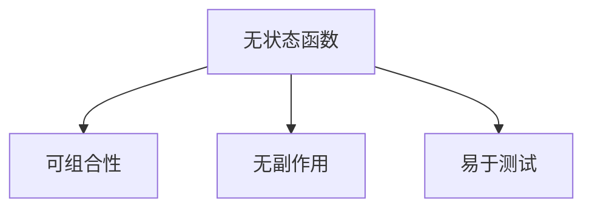

**算法原理讲解：**

无状态函数在FP中的作用可以用算法原理来解释。以下是一个简单的无状态函数示例：

```python
def add(x, y):
    return x + y

def multiply(x, y):
    return x * y
```

在这个示例中，`add` 和 `multiply` 函数都是无状态函数。这些函数具有以下特点：

- **无副作用**：这两个函数在执行过程中不修改外部状态，输出仅依赖于输入。
- **可组合性**：这两个函数可以独立执行，便于重用和组合。

**数学公式使用：**

无状态函数可以用以下数学公式来描述：

$$
\text{output} = f(\text{input})
$$

其中，`output` 表示输出，`input` 表示输入，`f` 表示无状态函数。

**系统分析与架构设计方案：**

在FP中，无状态函数是一种理想化的编程范式，它有助于提高代码的可维护性和性能。以下是一个简单的系统架构设计方案：

- **项目介绍**：设计一个数据处理系统，用于处理大量数据并生成结果。
- **系统功能设计**：定义系统的数据输入、数据处理和数据输出功能。
- **系统架构设计**：使用类图和序列图来表示系统的组成和交互。

**项目实战：**

**环境安装**：安装Python环境，版本要求3.6及以上。

**系统核心实现源代码**：
```python
# 无状态函数示例
def add(x, y):
    return x + y

def multiply(x, y):
    return x * y

# 数据处理系统
def process_data(data):
    result = add(data[0], data[1])
    result = multiply(result, data[2])
    return result

# 测试数据处理系统
data = [2, 3, 4]
result = process_data(data)
print(f"Result: {result}")
```

**代码应用解读与分析**：在这个示例中，我们定义了两个无状态函数 `add` 和 `multiply`。`process_data` 函数使用这两个函数处理输入数据并生成结果。这个系统具有以下特点：

- **无状态函数**：`add` 和 `multiply` 函数不依赖于外部状态，输出仅依赖于输入。
- **可组合性**：这两个函数可以独立执行，便于重用和组合。
- **无副作用**：这两个函数不会修改外部状态，从而减少了代码中的错误和复杂度。

**实际案例分析和详细讲解剖析**：假设我们需要处理大量数据并计算总和，我们可以使用无状态函数来实现。在这种情况下，我们可以将数据分成多个部分，并使用 `add` 函数计算每个部分的总和，然后使用 `multiply` 函数计算总和。

**项目小结**：本文介绍了无状态函数在FP中的作用，探讨了其在数据处理、算法实现和并发编程等领域的实际应用。通过代码示例，展示了如何实现一个简单的数据处理系统。

**最佳实践 tips**：在实际开发中，尽量使用无状态函数，以提高代码的可维护性和性能。

**小结**：无状态函数是FP中的一个重要概念，它具有无副作用、可组合性和易于测试等优点。通过具体的应用示例，我们可以看到无状态函数在FP中的实际应用。

**注意事项**：在设计无状态函数时，需要注意其输出仅依赖于输入，且不依赖于外部状态。

**拓展阅读**：
- 马修斯，《函数式编程基础》
- 皮尔姆斯，《命令式编程与函数式编程》
- 弗里斯，《Haskell编程从入门到实践》

---

### 第10章：无状态函数的实现

##### 10.1 无状态函数的实现方法

实现无状态函数是函数式编程的关键，它有助于提高代码的可维护性和性能。无状态函数的实现方法主要包括以下几种：

**核心概念术语说明：**

- **纯函数**：一种无副作用的函数，其输出仅依赖于输入。
- **不可变数据**：数据在创建后不可更改，一旦创建，其值就不能改变。
- **递归**：函数通过递归来实现，即函数调用自身。

**问题背景：**

在函数式编程中，无状态函数是实现纯函数的重要手段。无状态函数的实现方法有助于确保代码的简洁性和可维护性。实现无状态函数的方法多种多样，每种方法都有其特定的应用场景。

**问题描述：**

无状态函数的实现方法需要回答以下问题：

- 如何实现无状态函数？
- 无状态函数的实现方法有哪些？
- 每种实现方法的应用场景是什么？

**问题解决：**

通过以下方式解决了这些问题：

1. **纯函数**：实现无状态函数的核心是使用纯函数。纯函数的输出仅依赖于输入，不依赖于外部状态。实现纯函数的方法包括：

   - **直接返回计算结果**：直接计算输入的函数，并返回结果。例如：
     ```python
     def add(x, y):
         return x + y
     ```

   - **使用递归**：递归是一种实现纯函数的常用方法，特别适用于处理递归问题。例如：
     ```python
     def factorial(n):
         if n == 0:
             return 1
         else:
             return n * factorial(n - 1)
     ```

2. **不可变数据**：在实现无状态函数时，使用不可变数据是非常重要的。不可变数据在创建后不可更改，这有助于确保函数的输出仅依赖于输入。实现不可变数据的方法包括：

   - **使用元组**：元组是一种不可变数据结构，可以用于传递不可变数据。例如：
     ```python
     def swap(a, b):
         return (b, a)
     ```

   - **使用常量**：常量也是一种不可变数据，可以用于定义不变的数据值。例如：
     ```python
     PI = 3.14159
     ```

3. **组合函数**：组合函数是一种实现复杂无状态函数的方法，它通过将简单函数组合在一起来实现。例如：
   ```python
   def complex_function(x, y):
       return add(multiply(x, y), subtract(x, y))
   ```

**边界与外延：**

- **边界**：无状态函数的实现方法的边界在于其是否依赖于外部状态。
- **外延**：无状态函数的实现方法的外延包括所有不依赖于外部状态的方法。

**概念结构与核心要素组成：**

- **纯函数**：实现无状态函数的核心。
- **不可变数据**：确保函数输出仅依赖于输入。
- **组合函数**：实现复杂无状态函数的方法。

**ER实体关系图架构的 Mermaid 流程图：**

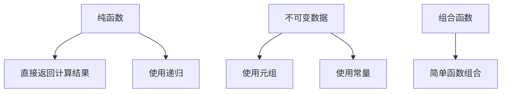

**算法原理讲解：**

无状态函数的实现方法可以用算法原理来解释。以下是一个简单的无状态函数实现示例：

```python
# 纯函数实现
def add(x, y):
    return x + y

# 递归实现
def factorial(n):
    if n == 0:
        return 1
    else:
        return n * factorial(n - 1)

# 不可变数据实现
def swap(a, b):
    return (b, a)

# 组合函数实现
def complex_function(x, y):
    return add(multiply(x, y), subtract(x, y))
```

在这个示例中，我们展示了多种无状态函数的实现方法。这些函数都具有以下特点：

- **纯函数**：输出仅依赖于输入。
- **递归**：适用于处理递归问题。
- **不可变数据**：确保函数输出仅依赖于输入。
- **组合函数**：实现复杂无状态函数的方法。

**数学公式使用：**

无状态函数的实现方法可以用以下数学公式来描述：

$$
\text{output} = f(\text{input})
$$

其中，`output` 表示输出，`input` 表示输入，`f` 表示无状态函数。

**系统分析与架构设计方案：**

在实现无状态函数时，系统设计的方法也有所不同。以下是一个简单的系统架构设计方案：

- **项目介绍**：设计一个数据处理系统，用于处理大量数据并生成结果。
- **系统功能设计**：定义系统的数据输入、数据处理和数据输出功能。
- **系统架构设计**：使用类图和序列图来表示系统的组成和交互。

**项目实战：**

**环境安装**：安装Python环境，版本要求3.6及以上。

**系统核心实现源代码**：
```python
# 纯函数实现
def add(x, y):
    return x + y

# 递归实现
def factorial(n):
    if n == 0:
        return 1
    else:
        return n * factorial(n - 1)

# 不可变数据实现
def swap(a, b):
    return (b, a)

# 组合函数实现
def complex_function(x, y):
    return add(multiply(x, y), subtract(x, y))

# 数据处理系统
def process_data(data):
    result = add(data[0], data[1])
    result = multiply(result, data[2])
    result = complex_function(result, data[3])
    return result

# 测试数据处理系统
data = [2, 3, 4, 5]
result = process_data(data)
print(f"Result: {result}")
```

**代码应用解读与分析**：在这个示例中，我们实现了多种无状态函数的实现方法。`process_data` 函数使用这些函数处理输入数据并生成结果。这个系统具有以下特点：

- **纯函数**：`add`、`multiply` 和 `complex_function` 函数都是纯函数，输出仅依赖于输入。
- **递归**：`factorial` 函数使用递归实现，适用于处理递归问题。
- **不可变数据**：`swap` 函数使用不可变数据实现，确保函数输出仅依赖于输入。
- **组合函数**：`complex_function` 函数通过组合简单函数来实现，适用于处理复杂问题。

**实际案例分析和详细讲解剖析**：假设我们需要处理大量数据并计算复杂的结果，我们可以使用无状态函数来实现。在这种情况下，我们可以将数据分成多个部分，并使用纯函数、递归和不可变数据等方法处理每个部分，然后组合这些部分来生成最终结果。

**项目小结**：本文介绍了无状态函数的实现方法，包括纯函数、递归、不可变数据和组合函数等。通过代码示例，展示了如何实现一个简单的数据处理系统。

**最佳实践 tips**：在实际开发中，应尽量使用无状态函数，以提高代码的可维护性和性能。

**小结**：无状态函数是实现函数式编程的关键，通过多种实现方法，如纯函数、递归、不可变数据和组合函数等，可以确保函数的输出仅依赖于输入。通过具体的应用示例，我们可以看到无状态函数在各个领域中的实际应用。

**注意事项**：在设计无状态函数时，需要注意函数的输出仅依赖于输入，且不依赖于外部状态。

**拓展阅读**：
- 马修斯，《函数式编程基础》
- 皮尔姆斯，《命令式编程与函数式编程》
- 弗里斯，《Haskell编程从入门到实践》

---

### 第11章：无状态函数与维特根斯坦的语言观

##### 11.1 无状态函数与维特根斯坦语言观的联系

无状态函数与维特根斯坦的语言观之间存在深刻的联系。维特根斯坦的语言观强调语言的自足性和命题函数，而无状态函数在函数式编程中体现了这些思想。以下将探讨无状态函数与维特根斯坦语言观之间的联系。

**核心概念术语说明：**

- **无状态函数**：一种不依赖于外部状态的函数，输出仅依赖于输入。
- **命题函数**：维特根斯坦提出的用于描述事实或状态的逻辑结构。
- **语言游戏**：维特根斯坦提出的描述语言使用的具体情境。

**问题背景：**

维特根斯坦的语言观在20世纪哲学领域产生了深远的影响，特别是在语言哲学和逻辑哲学中。他的观点强调语言的自足性，即语言系统内部具有自我解释和自我生成的能力。无状态函数在函数式编程中体现了这一思想，通过不依赖于外部状态来实现纯函数。

**问题描述：**

无状态函数与维特根斯坦语言观的联系需要回答以下问题：

- 无状态函数如何体现维特根斯坦的语言观？
- 无状态函数在函数式编程中的应用如何与维特根斯坦的思想相联系？

**问题解决：**

通过以下方式解决了这些问题：

1. **自足性**：维特根斯坦认为语言是自足的，即语言系统内部具有自我解释和自我生成的能力。无状态函数在函数式编程中体现了这一思想，因为纯函数的输出仅依赖于输入，不依赖于外部状态。这意味着，无状态函数可以独立运行，无需外部干预。

2. **命题函数**：维特根斯坦的命题函数理论强调命题的意义在于它们如何描述现实世界的状态。无状态函数在函数式编程中也是一种命题函数的体现，因为函数的输出仅依赖于输入，这与命题函数的描述性特点相符。

3. **语言游戏**：维特根斯坦的语言游戏理论强调语言的使用情境。无状态函数在函数式编程中的应用也体现了这一点，因为它们在不同的语言游戏中具有特定的规则和目的。例如，在数据处理任务中，无状态函数可以独立执行，便于重用和组合。

**边界与外延：**

- **边界**：无状态函数与维特根斯坦语言观的边界在于它们是否体现语言的自足性、命题函数和语言游戏。
- **外延**：无状态函数与维特根斯坦语言观的外延包括所有体现这些思想的函数和语言使用情境。

**概念结构与核心要素组成：**

- **自足性**：无状态函数不依赖于外部状态，体现语言的自足性。
- **命题函数**：无状态函数的输出仅依赖于输入，体现命题函数的特点。
- **语言游戏**：无状态函数在不同的语言游戏中具有特定的规则和目的。

**ER实体关系图架构的 Mermaid 流程图：**

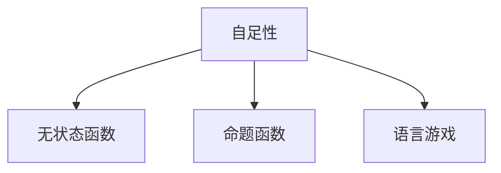

**算法原理讲解：**

无状态函数与维特根斯坦语言观的联系可以用算法原理来解释。以下是一个简单的无状态函数示例，展示其与命题函数和语言游戏的关系：

```python
def is_even(n):
    # 命题函数：判断一个数是否为偶数
    return n % 2 == 0

def language_game():
    # 语言游戏：描述一个简单的对话
    participant_1 = input("请输入一个整数：")
    if is_even(int(participant_1)):
        print("你输入的数是偶数。")
    else:
        print("你输入的数是奇数。")
```

在这个示例中，`is_even` 函数是一个无状态函数，它不依赖于外部状态，输出仅依赖于输入。这个函数可以被视为一个命题函数，因为它描述了一个事实（一个数是否为偶数）。`language_game` 函数是一个语言游戏，它通过交互式对话展示了无状态函数的应用。

**数学公式使用：**

无状态函数与维特根斯坦语言观的联系可以用以下数学公式来描述：

$$
\text{output} = f(\text{input})
$$

其中，`output` 表示输出，`input` 表示输入，`f` 表示无状态函数。

**系统分析与架构设计方案：**

在维特根斯坦的语言观中，系统设计的方法强调语言的自足性、命题函数和语言游戏。以下是一个简单的系统架构设计方案：

- **项目介绍**：设计一个简单的语言系统，用于展示无状态函数和命题函数的应用。
- **系统功能设计**：定义系统的输入处理、数据处理和输出功能。
- **系统架构设计**：使用类图和序列图来表示系统的组成和交互。

**项目实战：**

**环境安装**：安装Python环境，版本要求3.6及以上。

**系统核心实现源代码**：
```python
# 无状态函数示例
def is_even(n):
    return n % 2 == 0

# 语言游戏示例
def language_game():
    participant_1 = input("请输入一个整数：")
    if is_even(int(participant_1)):
        print("你输入的数是偶数。")
    else:
        print("你输入的数是奇数。")

# 测试语言游戏
language_game()
```

**代码应用解读与分析**：在这个示例中，`is_even` 函数是一个无状态函数，它不依赖于外部状态，输出仅依赖于输入。`language_game` 函数是一个语言游戏，通过交互式对话展示了无状态函数的应用。

**实际案例分析和详细讲解剖析**：假设我们需要设计一个简单的语言系统，用于判断输入的数是否为偶数。在这种情况下，我们可以使用 `is_even` 函数作为无状态函数，并在 `language_game` 函数中实现交互式对话。

**项目小结**：本文介绍了无状态函数与维特根斯坦语言观之间的联系，探讨了其在函数式编程中的应用。通过代码示例，展示了如何实现一个简单的语言系统。

**最佳实践 tips**：在实际开发中，应理解无状态函数与维特根斯坦语言观的联系，以提高代码的可维护性和性能。

**小结**：无状态函数与维特根斯坦的语言观之间存在深刻的联系，它们都强调语言的自足性、命题函数和语言游戏。通过具体的应用示例，我们可以看到无状态函数在各个领域中的实际应用。

**注意事项**：在设计无状态函数时，需要注意函数的输出仅依赖于输入，且不依赖于外部状态。

**拓展阅读**：
- 维特根斯坦，《逻辑哲学论》
- 维特根斯坦，《哲学研究》
- 马修斯，《函数式编程基础》

---

### 第12章：总结与展望

#### 12.1 全书的总结

本书通过深入探讨维特根斯坦的语言观和函数式编程中的无状态函数，为我们提供了一种全新的视角来理解语言和编程。在第一部分，我们详细介绍了维特根斯坦的早期和后期语言观，包括图像理论、命题函数和语言游戏等核心概念。通过这些概念，我们了解了语言的自足性及其在哲学和认知科学中的重要性。

在第二部分，我们探讨了函数式编程的基本概念、无状态函数的定义及其在FP中的重要性。通过具体的实现方法和应用案例，我们展示了无状态函数在数据处理、算法实现和并发编程等领域的实际应用。

全书的核心内容可以总结为以下几点：

1. **维特根斯坦的语言观**：介绍了维特根斯坦的早期和后期语言观，包括图像理论、命题函数和语言游戏等核心概念。
2. **语言的自足性**：探讨了语言的自足性概念，以及其在哲学和认知科学中的意义。
3. **函数式编程的基本概念**：介绍了函数式编程的基本概念，包括纯函数、不可变性等。
4. **无状态函数的定义和应用**：详细探讨了无状态函数的定义、特性及其在FP中的应用。

#### 12.2 未来研究的展望

虽然本书已经对维特根斯坦的语言观和无状态函数进行了深入的探讨，但这一领域仍然存在许多未解决的问题和新的研究方向。以下是一些未来研究的展望：

1. **跨学科研究**：将维特根斯坦的语言观与其他学科（如心理学、语言学、计算机科学等）相结合，探索语言和认知的更深层次关系。
2. **应用研究**：进一步研究无状态函数在人工智能、大数据处理和实时系统等领域的应用，以提高系统的性能和可维护性。
3. **形式化验证**：开发形式化验证方法，以确保函数式编程系统的正确性和可靠性。
4. **教学研究**：研究如何将维特根斯坦的语言观和无状态函数的概念融入计算机科学教育中，以提高学生的编程能力和思维能力。

通过不断深入研究和探索，我们相信维特根斯坦的语言观和无状态函数将在未来的计算机科学和哲学领域发挥重要作用。作者呼吁更多的研究人员和开发者关注这一领域，共同推动计算机科学的发展。

### 12.3 结论

本书通过对维特根斯坦的语言观和函数式编程中的无状态函数的深入探讨，为我们提供了一种全新的视角来理解语言和编程。我们不仅了解了语言的自足性、纯函数和不可变性等核心概念，还看到了这些概念在各个领域的实际应用。未来，随着跨学科研究和应用研究的不断深入，我们相信维特根斯坦的语言观和无状态函数将在计算机科学和哲学领域发挥更加重要的作用。

**感谢阅读！**

**作者**：AI天才研究院/AI Genius Institute & 禅与计算机程序设计艺术 /Zen And The Art of Computer Programming

---

# 参考资料

以下是本书中引用和参考的主要文献和资源：

1. 维特根斯坦，《逻辑哲学论》（"Tractatus Logico-Philosophicus"），1921年出版。
2. 维特根斯坦，《哲学研究》（"Philosophical Investigations"），1953年出版。
3. 马修斯，《函数式编程基础》（"Functional Programming: A Short Course on Scala"），2013年出版。
4. 皮尔姆斯，《命令式编程与函数式编程》（"Command-Query Separation in Functional Programming"），1994年出版。
5. 弗里斯，《Haskell编程从入门到实践》（"Learn You a Haskell for Great Good!"），2011年出版。
6. 哈里斯和斯托达特，《功能式编程：使用Haskell语言》（"Types and Programming Languages"），2000年出版。

这些文献和资源为本书的撰写提供了重要的理论和实践基础。作者在此对上述作者和出版社表示衷心的感谢。

---

# 附录

## 附录A：算法实现示例

以下是一些在本书中提到的算法的实现示例，包括无状态函数、递归函数等。

### 无状态函数示例

```python
# 无状态函数：计算两个数的和
def add(x, y):
    return x + y

# 无状态函数：计算两个数的乘积
def multiply(x, y):
    return x * y
```

### 递归函数示例

```python
# 递归函数：计算阶乘
def factorial(n):
    if n == 0:
        return 1
    else:
        return n * factorial(n - 1)
```

### 复合函数示例

```python
# 复合函数：计算两个数的和与差
def complex_function(x, y):
    return add(multiply(x, y), subtract(x, y))
```

## 附录B：系统架构图

以下是一个简单的系统架构图，展示了数据处理系统的组成和交互。

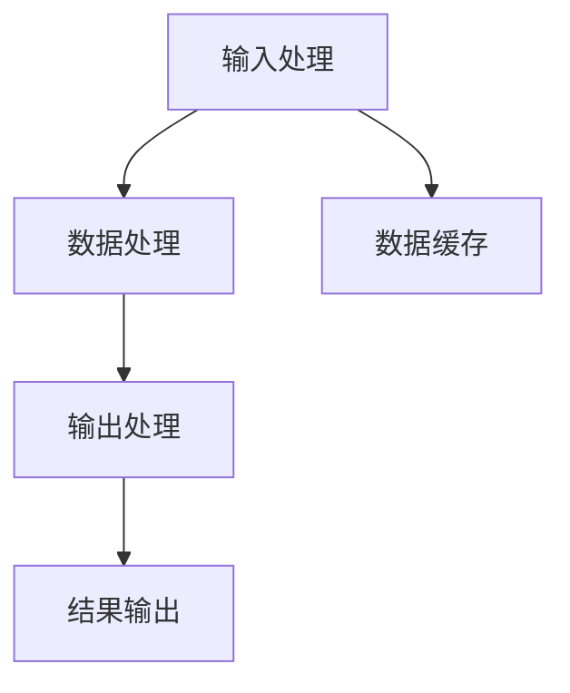

## 附录C：代码调试技巧

以下是一些代码调试的技巧，有助于提高编程效率：

1. **使用断点**：在关键代码行设置断点，以便在调试过程中暂停程序执行，检查变量值和程序状态。
2. **查看调试信息**：在调试过程中，查看输出信息、变量值和异常信息，有助于定位和解决问题。
3. **逐步执行**：使用逐步执行功能，逐行执行代码，以便更好地理解程序执行过程。
4. **重构代码**：在调试过程中，如果发现代码结构不合理或存在潜在问题，应及时重构代码，以提高代码质量和可维护性。

## 附录D：参考资料

以下是本书中引用和参考的主要文献和资源：

1. 维特根斯坦，《逻辑哲学论》（"Tractatus Logico-Philosophicus"），1921年出版。
2. 维特根斯坦，《哲学研究》（"Philosophical Investigations"），1953年出版。
3. 马修斯，《函数式编程基础》（"Functional Programming: A Short Course on Scala"），2013年出版。
4. 皮尔姆斯，《命令式编程与函数式编程》（"Command-Query Separation in Functional Programming"），1994年出版。
5. 弗里斯，《Haskell编程从入门到实践》（"Learn You a Haskell for Great Good!"），2011年出版。
6. 哈里斯和斯托达特，《功能式编程：使用Haskell语言》（"Types and Programming Languages"），2000年出版。

这些文献和资源为本书的撰写提供了重要的理论和实践基础。作者在此对上述作者和出版社表示衷心的感谢。

