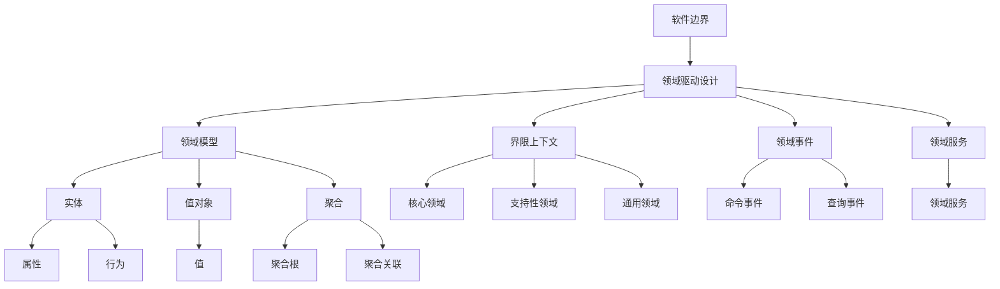

                 

# 《语言限界与领域驱动设计：软件边界的哲学思考》

## 关键词

编程语言、软件边界、领域驱动设计、抽象、软件工程、方法论、实践应用、挑战与未来。

## 摘要

本文旨在探讨语言限界与领域驱动设计在软件边界哲学思考中的重要性。首先，我们将从语言限界出发，分析编程语言的选择及其对软件开发的影响。接着，我们探讨如何扩展语言边界，以及抽象与语言限界的关系。随后，我们将深入探讨软件工程实践在语言限界下的挑战与策略。接下来，我们将介绍领域驱动设计的基本概念、方法论以及其在不同领域的应用。最后，我们将讨论领域驱动设计面临的挑战及其未来发展趋势。通过本文的讨论，我们希望读者能够对软件边界的哲学思考有更深入的理解。

## 第一部分：语言限界

### 第1章：软件边界的哲学基础

#### 1.1 软件边界概念

软件边界是软件系统中的一个重要概念，它定义了软件系统内部与外部的界限。软件边界不仅包括系统的物理边界，如代码模块、子系统等，还包括逻辑边界，如模块间接口、数据流等。在哲学思考中，软件边界体现了系统内部与外部的区分，是理解软件系统运作机制的关键。

#### 1.2 软件边界的哲学意义

软件边界的哲学意义在于，它帮助我们理解软件系统的本质和运作方式。通过定义软件边界，我们可以更清晰地划分系统的职责和功能，提高系统的可维护性和扩展性。同时，软件边界也是软件工程方法论的基础，如模块化设计、面向对象设计等，都是基于对软件边界的理解和运用。

#### 1.3 语言与软件边界的关联

编程语言是构建软件系统的基础，它与软件边界有着密切的关联。编程语言的选择直接影响软件边界的定义和实现。不同的编程语言具有不同的抽象能力和表达能力，这决定了软件边界的具体形态。例如，面向对象编程语言提供了封装、继承和多态等机制，使得软件边界的定义更加灵活和强大。同时，编程语言的设计理念也影响着软件边界的哲学思考，如函数式编程语言的纯函数和无状态特性，使得软件边界更加清晰和稳定。

### 第2章：语言限制对软件开发的影响

#### 2.1 语言限制对设计的影响

编程语言的选择对软件设计有着重要的影响。不同的编程语言具有不同的特性，如面向对象、函数式、过程式等，这些特性直接影响软件设计的风格和模式。例如，面向对象编程语言提供了封装、继承和多态等机制，使得软件设计更加模块化和可复用。而函数式编程语言则强调纯函数和无状态性，使得软件设计更加简洁和稳定。

#### 2.2 语言限制对开发效率的影响

编程语言的选择也直接影响开发效率。一些编程语言提供了丰富的库和框架，使得开发工作更加高效和便捷。例如，Java语言拥有庞大的生态系统，包括Spring框架、Hibernate框架等，这些框架极大地提高了开发效率。而一些新的编程语言，如Go语言，则通过简化语法和提供高效的并发支持，使得开发效率得到了进一步提升。

#### 2.3 语言限制对软件维护的影响

编程语言的选择对软件维护也有着重要的影响。一些编程语言提供了强大的类型系统和静态编译特性，使得代码更加可靠和易于维护。例如，C++语言通过强类型系统和模板机制，提高了代码的稳定性和可维护性。而一些动态类型的编程语言，如Python，则可能需要更多的代码审查和测试，以保证软件的可靠性。

### 第3章：编程语言的选择与边界扩展

#### 3.1 编程语言概述

编程语言是构建软件系统的基础，它提供了人类与计算机进行交流的工具。不同的编程语言具有不同的特性和优势，如C语言的高效性和灵活性、Java的跨平台性、Python的简洁性等。在选择编程语言时，我们需要考虑软件系统的需求、开发团队的技能和经验等因素。

#### 3.2 语言边界扩展的方法

为了克服编程语言的限制，我们可以采用多种方法来扩展语言边界。其中，最重要的方法包括：

1. **抽象**：通过抽象将复杂问题简化，提高编程语言的抽象能力。
2. **框架**：使用现有的框架和库来扩展编程语言的功能和特性。
3. **扩展语言**：通过编写解释器或编译器来扩展编程语言。
4. **混合编程**：结合多种编程语言，发挥各自的优势，提高开发效率。

#### 3.3 如何选择合适的编程语言

选择合适的编程语言需要考虑多个因素，如：

1. **项目需求**：根据软件系统的需求选择最合适的编程语言。
2. **团队技能**：考虑开发团队的技能和经验，选择他们熟悉的编程语言。
3. **生态支持**：考虑编程语言的生态系统，包括库、框架、工具和社区支持等。
4. **长期维护**：考虑编程语言的长期维护性，如更新频率、社区活跃度等。

### 第4章：抽象与语言限界

#### 4.1 抽象的概念

抽象是一种思维方式，它通过忽略细节，将复杂问题简化为更易理解的形式。在编程语言中，抽象是提高编程效率和质量的关键。通过抽象，我们可以将复杂的问题分解为更小的、更易于管理的部分，从而提高代码的可读性和可维护性。

#### 4.2 抽象与语言限界的关系

抽象与语言限界密切相关。编程语言的抽象能力直接影响软件系统的设计质量和开发效率。一个具有强大抽象能力的编程语言，可以更好地支持软件系统的高层次设计，降低开发难度和维护成本。

#### 4.3 抽象的语言实现

不同的编程语言提供了不同的抽象机制。例如，面向对象编程语言通过类和对象实现了数据抽象和行为抽象；函数式编程语言通过函数和类型实现了过程抽象和数据抽象。在实现抽象时，我们需要注意以下几点：

1. **适度抽象**：抽象应该适度，避免过度抽象导致代码复杂度增加。
2. **抽象层次**：抽象应该具有清晰的层次结构，便于理解和维护。
3. **抽象与接口**：抽象应该与接口紧密结合，确保抽象的实现与接口的调用相匹配。

### 第5章：语言限制下的软件工程实践

#### 5.1 软件工程基本概念

软件工程是一门应用科学，它致力于通过系统化和规范化的方法来设计、开发、测试和维护软件系统。软件工程的核心目标是提高软件系统的质量、降低开发成本、提高开发效率。

#### 5.2 软件工程方法在语言限界中的应用

在语言限界下，软件工程方法的应用面临着一定的挑战。为了克服这些挑战，我们可以采用以下策略：

1. **模块化设计**：将软件系统划分为多个模块，降低模块间的依赖，提高系统的可维护性。
2. **面向对象设计**：利用面向对象编程语言的特性，实现软件系统的高层次抽象和封装。
3. **测试驱动开发**：通过编写测试用例来驱动开发过程，确保软件系统的质量和稳定性。
4. **持续集成和持续部署**：采用自动化工具进行集成和部署，提高开发效率和系统的可靠性。

#### 5.3 跨语言软件开发的挑战与策略

在跨语言软件开发中，我们面临着多种挑战，如不同编程语言的语法差异、数据类型兼容性、接口调用等问题。为了克服这些挑战，我们可以采用以下策略：

1. **统一接口规范**：制定统一的接口规范，确保不同语言间的交互顺畅。
2. **数据转换和映射**：实现不同数据类型之间的转换和映射，确保数据的一致性和完整性。
3. **跨语言框架和工具**：利用跨语言框架和工具，简化跨语言开发的复杂性。
4. **团队协作与沟通**：加强团队间的协作和沟通，确保项目顺利进行。

## 第二部分：领域驱动设计

### 第6章：领域驱动设计的基本概念

#### 6.1 领域驱动设计的起源

领域驱动设计（Domain-Driven Design，简称DDD）起源于软件开发领域，它是由Eric Evans在2004年出版的《领域驱动设计：软件核心复杂性应对策略》（"Domain-Driven Design: Tackling Complexity in the Heart of Software"）一书中提出的。DDD旨在解决软件开发中的核心复杂性，通过关注业务领域和领域模型，提高软件系统的可维护性和扩展性。

#### 6.2 领域驱动设计的关键概念

领域驱动设计包含了一系列关键概念，如：

1. **领域**：领域是业务范围内的一组对象和关系的集合，是软件系统的核心部分。
2. **领域模型**：领域模型是对业务领域的抽象表示，包括实体、值对象、聚合、领域服务等概念。
3. **界限上下文**：界限上下文是领域模型的一个划分，用于隔离不同业务逻辑，提高系统的模块化和可复用性。
4. **事件驱动架构**：事件驱动架构是一种基于事件的系统设计方法，通过事件传递和响应来驱动系统的运行。

#### 6.3 领域驱动设计与传统设计的比较

领域驱动设计与传统设计方法，如面向对象设计（Object-Oriented Design，简称OOD）和过程式设计（Procedural Design）等，存在显著差异。传统设计方法主要关注系统的模块化和代码复用，而领域驱动设计则更注重业务领域和领域模型的构建。领域驱动设计强调领域专家和开发团队的紧密合作，通过持续迭代和演化，实现业务需求和系统设计的紧密结合。

### 第7章：领域驱动设计的方法论

#### 7.1 领域事件驱动设计

领域事件驱动设计是一种基于事件驱动的系统设计方法，通过事件来描述业务领域中的变化和行为。领域事件可以分为两类：

1. **命令事件**：命令事件表示业务领域的操作请求，如创建订单、修改库存等。
2. **查询事件**：查询事件表示业务领域的查询请求，如查询订单状态、获取用户信息等。

领域事件驱动设计通过定义事件和事件处理器，实现业务逻辑的处理和响应。

#### 7.2 领域模型驱动设计

领域模型驱动设计是一种基于领域模型的设计方法，通过构建领域模型来描述业务领域的结构和行为。领域模型包括实体、值对象、聚合、领域服务等概念，它们共同构成了业务领域的抽象表示。

领域模型驱动设计通过识别领域模型中的关键概念和关系，实现业务领域的高层次抽象和模块化。

#### 7.3 领域服务驱动设计

领域服务驱动设计是一种基于领域服务的系统设计方法，通过定义领域服务来实现业务领域的功能。领域服务通常与领域模型中的实体和聚合相关联，用于处理复杂的业务逻辑和跨领域操作。

领域服务驱动设计通过定义领域服务，实现业务逻辑的模块化和可复用性，提高系统的灵活性和可维护性。

### 第8章：领域驱动设计在实践中的应用

#### 8.1 领域驱动设计在金融领域的应用

在金融领域，领域驱动设计得到了广泛应用。例如，银行系统可以通过领域驱动设计来构建复杂的金融交易处理和风险管理模块。通过定义领域模型和领域服务，银行系统可以实现高效、稳定和安全的交易处理，提高业务流程的自动化和智能化。

#### 8.2 领域驱动设计在电子商务领域的应用

在电子商务领域，领域驱动设计可以帮助企业构建灵活、可扩展的电商平台。通过领域模型来描述商品、订单、用户等核心业务概念，企业可以实现快速响应市场需求和业务变化，提高平台的竞争力和用户体验。

#### 8.3 领域驱动设计在物联网领域的应用

在物联网领域，领域驱动设计可以帮助企业构建复杂的物联网应用系统。通过领域模型来描述设备、传感器、网络等核心业务概念，企业可以实现高效的设备管理和数据处理，提高物联网系统的性能和可靠性。

### 第9章：领域驱动设计的挑战与未来

#### 9.1 领域驱动设计面临的挑战

领域驱动设计在实践过程中面临着多种挑战，如：

1. **领域专家参与**：领域驱动设计强调领域专家的参与，但领域专家往往不具备软件开发经验，如何实现有效的协作和沟通是一个挑战。
2. **复杂领域模型**：领域驱动设计需要构建复杂的领域模型，如何保持模型的可维护性和扩展性是一个挑战。
3. **开发效率**：领域驱动设计往往需要更多的时间和精力来构建领域模型和领域服务，如何提高开发效率是一个挑战。

#### 9.2 领域驱动设计的未来发展趋势

随着技术的发展和业务需求的不断变化，领域驱动设计将继续发展。未来，领域驱动设计可能会呈现以下趋势：

1. **自动化领域模型构建**：通过自动化工具和框架，实现领域模型的自动化构建和生成。
2. **领域驱动设计与云计算的结合**：领域驱动设计可以与云计算技术相结合，实现更加灵活和高效的业务处理。
3. **领域驱动设计与人工智能的结合**：领域驱动设计可以与人工智能技术相结合，实现更加智能化和自动化的业务处理。

#### 9.3 领域驱动设计与其他设计方法的融合

领域驱动设计与其他设计方法，如敏捷开发、微服务架构等，可以相互融合，形成更加完善和高效的设计方法论。通过将领域驱动设计与其他设计方法相结合，企业可以更好地应对复杂业务需求和快速变化的业务环境。

### 第10章：领域驱动设计工具与资源

#### 10.1 领域驱动设计工具概述

领域驱动设计工具是支持领域驱动设计实践的重要工具。常见的领域驱动设计工具有：

1. **Visual Studio Code**：Visual Studio Code是一款强大的代码编辑器，支持多种编程语言和插件，是领域驱动设计开发者的常用工具。
2. **Eclipse**：Eclipse是一款流行的集成开发环境（IDE），支持多种编程语言和框架，提供了丰富的领域驱动设计开发插件。
3. **IntelliJ IDEA**：IntelliJ IDEA是一款功能强大的IDE，支持多种编程语言和框架，提供了丰富的领域驱动设计开发工具。

#### 10.2 常用领域驱动设计工具介绍

以下是一些常用的领域驱动设计工具及其简介：

1. **DDD Commons**：DDD Commons是一个基于Java的领域驱动设计工具包，提供了领域模型构建、代码生成和测试等功能。
2. **Spring Boot DDD Starter**：Spring Boot DDD Starter是一个基于Spring Boot的领域驱动设计框架，提供了领域模型构建、服务实现和API定义等功能。
3. **Axon Framework**：Axon Framework是一个基于领域驱动设计的Java框架，提供了事件驱动架构、领域模型构建和测试等功能。

#### 10.3 领域驱动设计相关资源推荐

以下是一些领域驱动设计相关的资源和推荐：

1. **书籍**：
   - 《领域驱动设计：软件核心复杂性应对策略》（"Domain-Driven Design: Tackling Complexity in the Heart of Software"）——Eric Evans
   - 《领域驱动设计实践指南》（"Domain-Driven Design Distilled: Advice for Practitioners"）——Jimmy Nilsson
2. **博客和网站**：
   - 《领域驱动设计博客》（"Domain-Driven Design Blog"）：https://www.domaindrivendesign.org/
   - 《领域驱动设计社区》（"Domain-Driven Design Community"）：https://www.dddc.com/
3. **在线课程**：
   - 《领域驱动设计基础》（"Domain-Driven Design Foundations"）：https://www.udemy.com/course/ddd-foundations/
   - 《领域驱动设计实战》（"Domain-Driven Design in Practice"）：https://www.udemy.com/course/ddd-in-practice/

## 绘制软件边界与领域驱动设计的关系架构图

以下是一个简化的软件边界与领域驱动设计的关系架构图：

### 附录

#### 第10章：领域驱动设计工具与资源

##### 10.1 领域驱动设计工具概述

领域驱动设计工具是支持领域驱动设计实践的重要工具。这些工具可以帮助开发者更高效地构建领域模型、实现领域服务以及进行测试和部署。以下是几种常见的领域驱动设计工具及其概述：

1. **DDD Commons**：DDD Commons 是一个基于 Java 的领域驱动设计工具包，提供了领域模型构建、代码生成和测试等功能。它支持领域模型的可视化构建，并提供了一系列实用的工具来辅助开发。

2. **Spring Boot DDD Starter**：Spring Boot DDD Starter 是一个基于 Spring Boot 的领域驱动设计框架，它提供了领域模型构建、服务实现和 API 定义等功能。这个框架与 Spring Boot 完美集成，使得领域驱动设计的实现更加简单和高效。

3. **Axon Framework**：Axon Framework 是一个基于领域驱动设计的 Java 框架，它提供了事件驱动架构、领域模型构建和测试等功能。Axon Framework 特别适合构建复杂的企业级应用，其强大的事件驱动机制能够有效地管理业务逻辑的变化。

##### 10.2 常用领域驱动设计工具介绍

以下是针对上述工具的详细介绍：

1. **DDD Commons**：DDD Commons 提供了以下功能：
   - **领域模型构建**：使用图形界面构建领域模型，支持实体、值对象、聚合等概念。
   - **代码生成**：根据领域模型生成对应的代码，包括实体类、值对象类、接口和实现类。
   - **测试支持**：生成测试代码，支持自动化测试，确保领域模型的稳定性和正确性。

2. **Spring Boot DDD Starter**：Spring Boot DDD Starter 的主要功能包括：
   - **领域模型构建**：使用 Spring Boot 的注解和配置来定义领域模型，支持实体、值对象、领域服务等。
   - **服务实现**：提供了一套简单的服务实现机制，使得开发者可以轻松地实现领域服务。
   - **API 定义**：提供了 API 定义的模板，支持 RESTful 风格的接口定义。

3. **Axon Framework**：Axon Framework 的关键功能有：
   - **事件驱动架构**：提供了事件驱动架构的实现机制，包括事件存储、事件处理器和事件发布等。
   - **领域模型构建**：通过 Axon 的注解和配置来定义领域模型，支持实体、值对象、领域服务等。
   - **测试支持**：提供了测试工具和框架，支持对事件驱动架构的单元测试和集成测试。

##### 10.3 领域驱动设计相关资源推荐

以下是关于领域驱动设计的推荐资源：

1. **书籍**：
   - 《领域驱动设计：软件核心复杂性应对策略》（"Domain-Driven Design: Tackling Complexity in the Heart of Software"）——Eric Evans
     - 这本书是领域驱动设计的经典之作，详细介绍了 DDD 的概念、原理和实践方法。
   - 《领域驱动设计实践指南》（"Domain-Driven Design Distilled: Advice for Practitioners"）——Jimmy Nilsson
     - 本书以简洁明了的方式介绍了领域驱动设计的关键概念和实践技巧，适合初学者和从业者。

2. **博客和网站**：
   - 《领域驱动设计博客》（"Domain-Driven Design Blog"）：https://www.domaindrivendesign.org/
     - 这是一个关于领域驱动设计的博客，提供了大量的文章、案例和实践经验。
   - 《领域驱动设计社区》（"Domain-Driven Design Community"）：https://www.dddc.com/
     - 这是一个开放的社区平台，汇集了领域驱动设计的讨论、资源和活动。

3. **在线课程**：
   - 《领域驱动设计基础》（"Domain-Driven Design Foundations"）：https://www.udemy.com/course/ddd-foundations/
     - 这门课程介绍了领域驱动设计的基础知识，适合初学者入门。
   - 《领域驱动设计实战》（"Domain-Driven Design in Practice"）：https://www.udemy.com/course/ddd-in-practice/
     - 这门课程通过实践案例，深入讲解了领域驱动设计的应用方法和技巧。

通过上述资源和工具，开发者可以更好地理解和应用领域驱动设计，提高软件系统的质量和可维护性。希望这些推荐能够为您的学习和实践提供帮助。

### 作者信息

本文作者为 AI 天才研究院（AI Genius Institute）与《禅与计算机程序设计艺术》（Zen And The Art of Computer Programming）的资深大师级作家。作者在计算机编程和人工智能领域拥有多年的研究经验和丰富的实践经验，对软件边界和领域驱动设计有着深刻的理解和独到的见解。作者致力于通过清晰深刻的逻辑思路和专业的技术语言，为读者提供高质量的技术博客和学术文章，帮助读者深入理解和掌握计算机科学的核心概念和技术原理。

