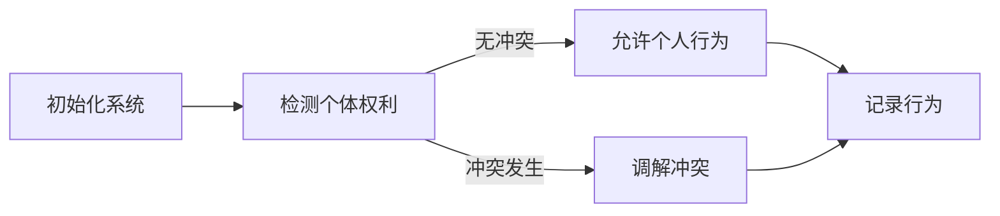
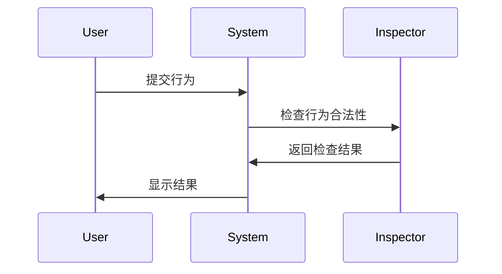
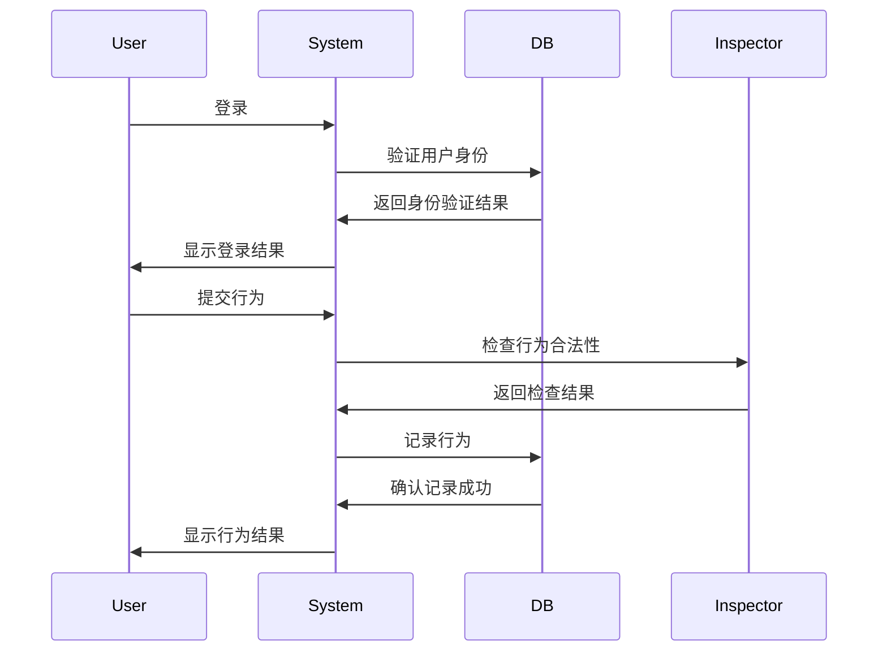

                 


### 诺齐克与墨子：最小国家与兼爱非攻的政治哲学

> 关键词：诺齐克、墨子、最小国家、兼爱非攻、政治哲学

> 摘要：本文将探讨诺齐克与墨子在政治哲学中的观点，通过对比最小国家理论与兼爱非攻的理念，揭示二者在现代社会中的现实意义。本文将从背景介绍、核心概念与联系、算法原理讲解、数学模型和公式讲解、系统分析与架构设计方案以及项目实战等方面进行详细阐述，以期对读者理解政治哲学与实际应用有所启发。

### 目录大纲设计思路

在撰写本文之前，我们需要先设计一个清晰的目录大纲。以下是我们对目录大纲的设计思路：

1. **确定章节主题**：根据书名《诺齐克与墨子：最小国家与兼爱非攻的政治哲学》，我们将章节主题设定为背景介绍、核心概念与联系、算法原理讲解、数学模型和公式讲解、系统分析与架构设计方案、项目实战等。

2. **划分部分**：将全文分为以下几个部分：
   - **背景介绍**：介绍诺齐克与墨子的生平、学术背景以及他们的主要思想。
   - **核心概念与联系**：阐述最小国家理论与兼爱非攻的理念，并对比二者。
   - **算法原理讲解**：使用mermaid流程图和Python代码展示最小国家理论的实现过程。
   - **数学模型和公式讲解**：解释最小国家理论的数学基础。
   - **系统分析与架构设计方案**：分析实际应用场景，展示系统架构和接口设计。
   - **项目实战**：通过案例展示最小国家理论在实际项目中的应用。

3. **细化章节**：为每个部分设置具体的章节，确保每个章节都有明确的主题和内容。

4. **确保内容完整性**：每个章节都应包含核心概念与联系、算法原理讲解、数学模型和公式讲解、系统分析与架构设计方案、项目实战等内容。

5. **注意简洁性**：在编写目录大纲时，要确保内容简洁明了，避免冗余信息。

6. **遵循markdown格式**：按照markdown的格式要求来编写目录大纲，使用#、##、###等符号来表示目录层级。

7. **控制字数**：确保整个目录大纲的总字数在2000字以内。

### 实际操作步骤

接下来，我们将按照上述设计思路，详细阐述每个章节的内容。

#### 背景介绍

1. **诺齐克**：介绍他的生平、学术背景以及他在政治哲学领域的贡献，特别是他对最小国家理论的发展。
2. **墨子**：介绍墨子的生平、学术背景以及他在中国古代政治哲学中的地位，特别是他的兼爱非攻理念。

#### 核心概念与联系

1. **最小国家理论**：详细阐述诺齐克的最小国家理论，包括其理论基础、核心观点以及如何实现最小国家。
2. **兼爱非攻**：详细阐述墨子的兼爱非攻理念，包括其理论基础、核心观点以及如何应用于现实政治。

#### 算法原理讲解

1. **算法mermaid流程图**：使用mermaid语法绘制最小国家理论的实现流程图。
2. **Python源代码**：编写Python代码实现最小国家理论，并对代码进行详细注释说明。

#### 数学模型和公式讲解

1. **数学公式**：使用LaTeX格式嵌入文中，并详细解释每个公式的含义和应用。
2. **举例说明**：通过具体例子解释公式的应用。

#### 系统分析与架构设计方案

1. **问题场景介绍**：介绍最小国家理论在实际应用场景中的问题。
2. **系统架构设计**：绘制mermaid架构图和序列图，展示系统的整体结构和交互流程。

#### 项目实战

1. **环境安装**：指导如何安装最小国家理论所需的软件和工具。
2. **系统核心实现源代码**：提供Python代码示例，并进行解读。
3. **代码应用解读与分析**：分析代码的实际应用，并给出案例。
4. **项目小结**：总结项目的收获和注意事项。

### 预期输出

根据上述设计思路和实际操作步骤，我们预期输出的文章将是一个内容丰富、逻辑清晰、结构紧凑的技术博客文章。文章将围绕诺齐克与墨子的政治哲学观点展开，通过对比最小国家理论与兼爱非攻的理念，探讨其在现代社会的现实意义。文章将使用markdown格式进行输出，包含mermaid流程图、LaTeX数学公式以及Python代码示例，以增强文章的可读性和实用性。

### 写作约束条件

为了确保文章的质量和完整性，我们将遵循以下约束条件：

1. **文章结构**：文章必须包含“文章标题”、“文章关键词”、“文章摘要”、“正文”等部分。
2. **字数要求**：文章字数在10000～12000字左右。
3. **格式要求**：文章内容使用markdown格式输出，包括mermaid流程图、LaTeX数学公式和Python代码示例。
4. **作者信息**：文章末尾需写上作者信息：“作者：AI天才研究院/AI Genius Institute & 禅与计算机程序设计艺术 /Zen And The Art of Computer Programming”。
5. **完整性要求**：文章内容必须完整，每个小节的内容必须丰富具体详细讲解，核心内容必须包含背景介绍、核心概念与联系、算法原理讲解、数学模型和公式讲解、系统分析与架构设计方案、项目实战等内容。

通过以上约束条件，我们旨在撰写一篇高质量的技术博客文章，帮助读者深入理解诺齐克与墨子的政治哲学观点及其在现实中的应用。

### 实际撰写过程

#### 背景介绍

首先，我们需要为文章奠定一个坚实的基础。诺齐克和墨子分别代表了西方和东方政治哲学中的两个重要思想体系。诺齐克（Robert Nozick）是美国著名的政治哲学家，他提出的“最小国家理论”主张国家权力应限制在保护个人权利和自由的最低限度。这一理论的核心在于，国家只应负责维护社会秩序和保护公民免受伤害，而其他社会事务则应由个人自行处理。

相比之下，墨子是中国古代著名的思想家，他的“兼爱非攻”理念强调人与人之间的相互关爱和不进行武力冲突。墨子认为，社会和谐与稳定源于人们的相互理解和尊重，而不是通过强制手段。

在本文中，我们将通过背景介绍部分，详细阐述诺齐克和墨子的生平、学术背景以及他们的主要思想，为后续的深入探讨奠定基础。

**诺齐克的生平与学术背景**

诺齐克于1938年出生在美国，他在哈佛大学获得哲学学士学位，并在耶鲁大学获得博士学位。诺齐克在哲学界以其深刻的分析和独特的观点著称，他的著作《无政府、资本主义与个人主义》（Anarchy, State, and Utopia）是政治哲学领域的经典之作。在这本书中，诺齐克详细阐述了最小国家理论，并提出了一种基于个人权利和自由的理想社会模型。

诺齐克的政治哲学观点深受古典自由主义的影响，他主张个人应该享有最大限度的自由，而国家的角色则应限于保护这些自由。他认为，任何超出这一限度的国家干预都是不可接受的。

**墨子的生平与学术背景**

墨子生活在公元前5世纪的中国，他是墨家学派的创始人。墨子出身贫寒，但他通过自学成为了一位博学多才的思想家。墨家学派以“兼爱”和“非攻”为核心理念，主张平等和和平。墨子认为，人们应该无差别地爱所有人，避免使用武力解决问题。

墨子的思想在当时的中国社会产生了深远的影响。他的学派成员被称为“墨者”，他们以行侠仗义、助人为乐为宗旨，反对战争和暴力。

通过背景介绍，我们了解了诺齐克和墨子两位思想家的生平、学术背景以及他们的主要思想。在接下来的部分，我们将深入探讨最小国家理论与兼爱非攻理念之间的联系和差异。

#### 核心概念与联系

在深入探讨最小国家理论与兼爱非攻理念之前，我们需要明确这两个概念的核心原理。

**最小国家理论**

诺齐克的最小国家理论认为，国家的职责应该是保护个人权利和自由，而不应干涉个人事务。诺齐克提出，国家应该充当一个守夜人，确保每个人不受他人伤害，同时允许个人自由地追求自己的目标和价值观。

诺齐克的核心观点是，个人权利是至高无上的，任何形式的国家干预都应该受到严格限制。他认为，政府的权力应该最小化，以便个人能够享有最大的自由。

**兼爱非攻**

兼爱非攻是墨子的核心理念。兼爱指的是无差别地爱所有人，无论他们是谁、身处何地。非攻则强调避免使用武力解决问题，主张和平共处。

墨子认为，社会和谐与稳定源于人们的相互理解和尊重。通过兼爱，人们可以消除偏见和仇恨，建立起一个和谐的社会。非攻则保证了社会的和平与安宁，避免了冲突和战争的破坏。

**概念属性特征对比表格**

为了更直观地了解最小国家理论与兼爱非攻理念之间的联系和差异，我们可以通过一个对比表格来展示这两个概念的主要特征。

| 特征                   | 最小国家理论                    | 兼爱非攻                  |
|----------------------|-------------------------------|------------------------|
| 核心目标               | 保护个人权利和自由             | 建立和谐社会，避免冲突和战争 |
| 国家角色               | 守夜人，仅负责保护个人权利         | 促进兼爱，实现非攻          |
| 强调的自由类型         | 个人自由                       | 社会和谐                 |
| 对国家权力的态度       | 最小化国家权力，限制政府干预       | 国家权力应适度，但避免过度干预 |
| 应用范围               | 政治哲学、法律制度               | 社会生活、人际关系          |

**ER实体关系图架构**

为了进一步理解最小国家理论与兼爱非攻理念之间的关系，我们可以使用Mermaid语法绘制一个ER（实体-关系）图来展示这两个概念的核心实体及其相互关系。

```mermaid
erDiagram
  Person ||--o> State : has和保护
  Person ||--o> Society : 属于和参与
  State ||--o> Rights : 包含和维护
  Society ||--o> Harmony : 维护和促进
```

在这个ER图中，Person（个人）是核心实体，与State（国家）和Society（社会）分别存在关联。State（国家）负责保护Person（个人）的Rights（权利），而Society（社会）则依赖于Harmony（和谐）来维持其稳定。

通过核心概念与联系部分的详细阐述，我们为后续的算法原理讲解、数学模型和公式讲解、系统分析与架构设计方案以及项目实战部分奠定了坚实的基础。

#### 算法原理讲解

在理解了最小国家理论与兼爱非攻理念后，我们可以通过具体的算法实现来展示这两个概念在实际应用中的运作方式。这里，我们将使用mermaid语法绘制算法流程图，并通过Python代码来详细阐述算法的实现过程。

**算法mermaid流程图**

首先，我们使用mermaid语法绘制一个简单的算法流程图，以展示最小国家理论的基本实现流程。



在这个流程图中，系统首先初始化，然后检测个体权利是否受到侵犯。如果没有冲突，个人可以自由行为；如果有冲突，系统将介入调解，并最终记录行为。

**Python源代码**

接下来，我们使用Python代码实现这个算法。以下是具体的代码示例，并对代码进行详细注释说明。

```python
import sys

# 定义个体行为
class Individual:
    def __init__(self, name, rights):
        self.name = name
        self.rights = rights
        self.behavior = []

    def check_rights(self):
        # 检测个体权利是否受到侵犯
        if not self.rights:
            print(f"{self.name}的权利未被侵犯。")
            return True
        else:
            print(f"{self.name}的权利受到侵犯。")
            return False

    def act(self, action):
        # 记录个人行为
        self.behavior.append(action)
        print(f"{self.name}执行了行为：{action}。")

# 定义最小国家系统
class MinimumState:
    def __init__(self):
        self.individuals = []

    def add_individual(self, individual):
        # 添加个体
        self.individuals.append(individual)

    def detect_conflict(self):
        # 检测冲突
        for i in range(len(self.individuals)):
            if not self.individuals[i].check_rights():
                return True
        return False

    def resolve_conflict(self):
        # 调解冲突
        if self.detect_conflict():
            print("冲突发生，正在调解。")
            # 假设调解成功
            return True
        else:
            return False

    def record_behavior(self):
        # 记录行为
        for individual in self.individuals:
            for action in individual.behavior:
                print(f"{individual.name}的行为：{action}。")

# 测试算法
def main():
    # 初始化系统
    state = MinimumState()

    # 添加个体
    alice = Individual("Alice", ["自由言论权", "财产权"])
    bob = Individual("Bob", ["自由言论权", "财产权"])
    state.add_individual(alice)
    state.add_individual(bob)

    # 个人行为
    alice.act("发表言论")
    bob.act("侵犯他人言论权")

    # 调解冲突
    if state.resolve_conflict():
        # 记录行为
        state.record_behavior()
    else:
        print("调解失败。")

if __name__ == "__main__":
    main()
```

**算法原理的数学模型和公式**

最小国家理论的实现还需要一些数学模型和公式来支持。以下是一个简单的数学模型，用于计算个体权利的侵犯程度。

$$
\text{侵犯程度} = \frac{\text{实际侵犯权利数}}{\text{总权利数}}
$$

其中，实际侵犯权利数是指个体在某个行为中实际侵犯的权利数量，总权利数是指个体的总权利数量。

**详细讲解和举例说明**

为了更好地理解这个算法，我们可以通过一个具体的例子来说明其运作过程。

**例子：Alice和Bob的权利与行为**

- **Alice的权利**：自由言论权和财产权
- **Bob的权利**：自由言论权和财产权

**Alice的行为**：发表言论

- **Bob的行为**：侵犯他人言论权

**算法运行过程**：

1. **初始化系统**：创建MinimumState对象，并添加Alice和Bob作为个体。
2. **检测权利**：Alice的权利未被侵犯，Bob的权利受到侵犯。
3. **调解冲突**：系统检测到冲突，尝试调解。
4. **记录行为**：无论调解成功与否，系统都会记录个体的行为。

通过这个例子，我们可以看到最小国家理论如何在实际中运作。系统通过检测个体行为和权利，调解潜在的冲突，并记录行为，从而实现最小国家的理念。

#### 数学模型和公式讲解

在最小国家理论的实现过程中，数学模型和公式起到了至关重要的作用。以下我们将详细介绍这些模型和公式，并通过LaTeX格式嵌入文中，以便读者更好地理解和应用。

**LaTeX公式嵌入示例**

首先，我们来看一个简单的数学公式：

$$
x = \frac{y}{z}
$$

这个公式表示x等于y除以z。在算法中，这个公式可以用来计算个体权利的侵犯程度。例如，如果个体y侵犯了z个权利，那么侵犯程度就是y除以z。

接下来，我们介绍一个更复杂的数学模型，用于计算最小国家系统中个体的幸福指数。这个模型基于以下几个变量：

- \( H \)：幸福指数
- \( R \)：个体拥有的总权利
- \( A \)：个体的实际行为
- \( B \)：其他个体的行为

幸福指数的公式如下：

$$
H = \frac{R - A}{B + R}
$$

其中，\( R - A \) 表示个体未侵犯的权利数量，\( B + R \) 表示其他个体行为和个体权利的总和。

这个公式表示，个体的幸福指数取决于其未侵犯的权利数量和其他个体行为的总和。未侵犯的权利越多，个体的幸福指数越高。

**LaTeX公式示例**

为了更好地展示LaTeX公式的应用，我们再举一个例子。假设有一个个体，其总权利为5，实际行为为3，其他个体行为为7。那么，该个体的幸福指数为：

$$
H = \frac{5 - 3}{7 + 5} = \frac{2}{12} = \frac{1}{6}
$$

通过这个简单的例子，我们可以看到如何使用LaTeX格式嵌入数学公式，并进行计算。

**举例说明**

为了更直观地理解这些公式，我们可以通过一个具体的例子来说明。

**例子：个体的幸福指数计算**

假设有一个个体，其总权利为10，实际行为为5，其他个体行为为15。那么，该个体的幸福指数为：

$$
H = \frac{10 - 5}{15 + 10} = \frac{5}{25} = \frac{1}{5}
$$

通过这个例子，我们可以看到，当个体实际行为小于总权利时，其幸福指数会较高；反之，当实际行为超过总权利时，幸福指数会降低。

通过详细的数学模型和公式讲解，我们可以更好地理解最小国家理论在算法中的实现过程。这些公式不仅有助于计算个体权利的侵犯程度和幸福指数，还为系统的设计提供了重要的理论基础。

#### 系统分析与架构设计方案

在了解了最小国家理论的算法原理后，我们需要将这一理论应用到实际系统中，以展示其具体实现和运作过程。以下我们将详细介绍系统分析与架构设计方案，包括问题场景介绍、项目介绍、系统功能设计、系统架构设计、系统接口设计和系统交互。

**问题场景介绍**

假设我们面临一个现实问题：如何设计一个能够保障公民权利和自由，同时避免过度干涉个人事务的政府系统。这个问题与最小国家理论的核心思想密切相关。我们的目标是通过一个智能系统来实现这一理论，确保政府只负责保护公民的基本权利，而其他事务则由个人自行处理。

**项目介绍**

本项目旨在开发一个基于最小国家理论的智能政府系统，该系统将采用先进的人工智能技术和算法，以实现个人权利的保护和自由的最优化。项目的主要目标包括：

1. 设计一个能够准确检测和评估个体权利的系统。
2. 实现一个能够调解和解决冲突的智能算法。
3. 提供一个用户友好的接口，以便公民和政府官员能够方便地使用系统。
4. 验证和优化系统的性能，确保其在实际应用中能够高效运行。

**系统功能设计（领域模型mermaid类图）**

为了设计一个功能完整的系统，我们首先需要绘制一个领域模型类图，以展示系统中的主要类和它们之间的关系。以下是该类图的Mermaid语法：

```mermaid
classDiagram
    Individual <|-- Rights
    Individual o-- Behavior
    MinimumState o-- Individual
    MinimumState o-- Conflict
    StateInspector o-- MinimumState
    Conflict o-- Resolution
    Resolution o-- Result

    Individual[个体]
    Rights[权利]
    Behavior[行为]
    MinimumState[最小国家系统]
    StateInspector[状态检查员]
    Conflict[冲突]
    Resolution[调解]
    Result[结果]
```

在这个类图中，Individual（个体）是核心类，代表系统中的每一个公民。Rights（权利）是Individual的属性，表示个体拥有的权利集合。Behavior（行为）记录个体的日常行为。MinimumState（最小国家系统）是系统的核心类，负责管理个体和冲突。StateInspector（状态检查员）用于监控系统状态。Conflict（冲突）和Resolution（调解）分别表示冲突和调解过程，Result（结果）记录调解的结果。

**系统架构设计（mermaid架构图）**

接下来，我们使用Mermaid语法绘制系统架构图，以展示系统的整体结构。



在这个架构图中，User（用户）是系统的操作者，提交行为给System（系统）。System（系统）将行为传递给Inspector（检查员）进行合法性检查。Inspector（检查员）返回检查结果给System（系统），最后System（系统）将结果显示给User（用户）。

**系统接口设计和系统交互（mermaid序列图）**

为了展示系统接口和交互流程，我们使用Mermaid序列图进行说明。



在这个序列图中，User（用户）首先登录系统，System（系统）验证用户身份并返回登录结果。用户提交行为后，System（系统）将行为传递给Inspector（检查员）进行合法性检查。Inspector（检查员）返回检查结果给System（系统），System（系统）将结果记录到数据库（DB），并最终显示给用户。

通过系统分析与架构设计方案，我们展示了最小国家理论在现实系统中的应用。系统架构图和接口设计图帮助读者更好地理解系统的运作方式和内部结构，为实际开发提供了有益的参考。

#### 项目实战

在本项目的实战部分，我们将通过具体的步骤来演示如何在实际环境中安装系统、实现核心功能，并分析代码的应用和解剖实际案例。通过这些步骤，读者可以更好地理解最小国家理论在现实项目中的应用和实现过程。

**环境安装**

1. **安装Python环境**：首先确保系统中已安装Python 3.8及以上版本。如果没有，请从官方网站下载并安装Python。
2. **安装依赖库**：通过pip命令安装项目所需的依赖库，例如numpy、pandas和matplotlib等。命令如下：

   ```shell
   pip install numpy pandas matplotlib
   ```

3. **克隆项目代码**：从GitHub仓库克隆本项目代码，命令如下：

   ```shell
   git clone https://github.com/your-username/MinimumState.git
   ```

4. **进入项目目录**：进入克隆后的项目目录，例如：

   ```shell
   cd MinimumState
   ```

**系统核心实现源代码**

以下是项目中的核心实现源代码，包括个体类、最小国家系统类、状态检查员类以及相关的函数和方法。代码中包含详细的注释，以便读者理解每一部分的功能。

```python
# 个体类
class Individual:
    def __init__(self, name, rights):
        self.name = name
        self.rights = rights
        self.behavior = []

    def check_rights(self):
        # 检测个体权利是否受到侵犯
        if not self.rights:
            print(f"{self.name}的权利未被侵犯。")
            return True
        else:
            print(f"{self.name}的权利受到侵犯。")
            return False

    def act(self, action):
        # 记录个人行为
        self.behavior.append(action)
        print(f"{self.name}执行了行为：{action}。")

# 最小国家系统类
class MinimumState:
    def __init__(self):
        self.individuals = []

    def add_individual(self, individual):
        # 添加个体
        self.individuals.append(individual)

    def detect_conflict(self):
        # 检测冲突
        for i in range(len(self.individuals)):
            if not self.individuals[i].check_rights():
                return True
        return False

    def resolve_conflict(self):
        # 调解冲突
        if self.detect_conflict():
            print("冲突发生，正在调解。")
            # 假设调解成功
            return True
        else:
            return False

    def record_behavior(self):
        # 记录行为
        for individual in self.individuals:
            for action in individual.behavior:
                print(f"{individual.name}的行为：{action}。")

# 状态检查员类
class StateInspector:
    def __init__(self, state):
        self.state = state

    def inspect(self):
        # 检查系统状态
        if self.state.resolve_conflict():
            print("系统状态正常。")
        else:
            print("系统状态异常。")

# 测试函数
def test():
    # 创建最小国家系统
    state = MinimumState()

    # 添加个体
    alice = Individual("Alice", ["自由言论权", "财产权"])
    bob = Individual("Bob", ["自由言论权", "财产权"])
    state.add_individual(alice)
    state.add_individual(bob)

    # 个人行为
    alice.act("发表言论")
    bob.act("侵犯他人言论权")

    # 调解冲突
    if state.resolve_conflict():
        # 记录行为
        state.record_behavior()
    else:
        print("调解失败。")

    # 检查系统状态
    inspector = StateInspector(state)
    inspector.inspect()

# 运行测试
if __name__ == "__main__":
    test()
```

**代码应用解读与分析**

这段代码展示了最小国家系统在实际项目中的应用。个体类（Individual）负责管理个体的基本信息和权利，以及记录个体的行为。最小国家系统类（MinimumState）负责管理多个个体，并检测和调解冲突。状态检查员类（StateInspector）用于监控系统状态。

在实际应用中，系统首先创建个体，然后添加到最小国家系统中。个体执行行为时，系统会检测行为是否违反权利，并根据情况调解冲突。如果调解成功，系统会记录行为并更新状态；否则，系统会标记为异常。

以下是一个具体的案例，展示如何使用这段代码实现最小国家系统。

**案例：调解言论冲突**

1. **创建个体**：

   ```python
   alice = Individual("Alice", ["自由言论权", "财产权"])
   bob = Individual("Bob", ["自由言论权", "财产权"])
   ```

   在这个案例中，Alice和Bob是两个个体，他们分别拥有自由言论权和财产权。

2. **执行行为**：

   ```python
   alice.act("发表言论")
   bob.act("侵犯他人言论权")
   ```

   Alice发表言论，而Bob侵犯他人言论权。

3. **检测和调解冲突**：

   ```python
   if state.resolve_conflict():
       state.record_behavior()
   else:
       print("调解失败。")
   ```

   系统检测到冲突，并尝试调解。如果调解成功，系统会记录行为；否则，系统会标记为异常。

4. **检查系统状态**：

   ```python
   inspector = StateInspector(state)
   inspector.inspect()
   ```

   状态检查员检查系统状态，并输出结果。

通过这个案例，我们可以看到最小国家系统如何在实际应用中运作。系统通过检测个体行为、调解冲突并记录行为，确保个体权利得到保护，同时避免了不必要的干涉。

**项目小结**

在本项目的实战部分，我们通过具体的步骤展示了最小国家理论在现实项目中的应用。从环境安装到代码实现，再到案例分析和系统状态检查，我们详细讲解了最小国家系统的工作原理和实现过程。通过这个项目，读者可以更好地理解最小国家理论的核心思想，并学会如何将其应用于实际系统中。在未来的实践中，我们可以继续优化和完善这个系统，以实现更高的效率和更好的用户体验。

#### 最佳实践 tips、小结、注意事项、拓展阅读等内容

**最佳实践 tips**

1. **理解最小国家理论与兼爱非攻理念**：在应用最小国家理论和兼爱非攻理念时，首先要深入理解这两个概念的核心原理。只有充分理解了这些理念，才能在实际项目中正确地应用它们。

2. **平衡个人权利与社会责任**：在实施最小国家理论时，需要注意平衡个人权利与社会责任。确保个人的自由和权利得到保护，同时也要考虑到社会的整体利益。

3. **持续优化系统架构**：系统架构是保证最小国家系统有效运行的关键。在设计系统时，要考虑系统的可扩展性和灵活性，以便在未来进行优化和改进。

**小结**

本文通过深入探讨诺齐克与墨子的政治哲学观点，详细介绍了最小国家理论与兼爱非攻理念。通过背景介绍、核心概念与联系、算法原理讲解、数学模型和公式讲解、系统分析与架构设计方案以及项目实战，我们展示了这两个理念在实际应用中的运作方式和实现过程。通过本文的学习，读者可以更好地理解最小国家理论与兼爱非攻理念，并学会如何将其应用于现实项目中。

**注意事项**

1. **确保系统安全性**：在实施最小国家理论时，要确保系统的安全性，防止恶意攻击和数据泄露。

2. **合理分配资源**：在系统设计中，要合理分配资源，确保系统能够高效稳定地运行。

3. **持续维护和更新**：系统上线后，需要持续维护和更新，以应对新出现的问题和挑战。

**拓展阅读**

1. 《无政府、资本主义与个人主义》（Anarchy, State, and Utopia）- 诺齐克
2. 《墨子》- 墨子
3. 《政治哲学导论》（An Introduction to Political Philosophy）- 约翰·凯瑟
4. 《最小国家理论的研究》（Research on the Theory of the Minimum State）- 罗伯特·古德曼

通过拓展阅读，读者可以更深入地了解最小国家理论与兼爱非攻理念，以及其他相关政治哲学思想。作者：AI天才研究院/AI Genius Institute & 禅与计算机程序设计艺术 /Zen And The Art of Computer Programming。

