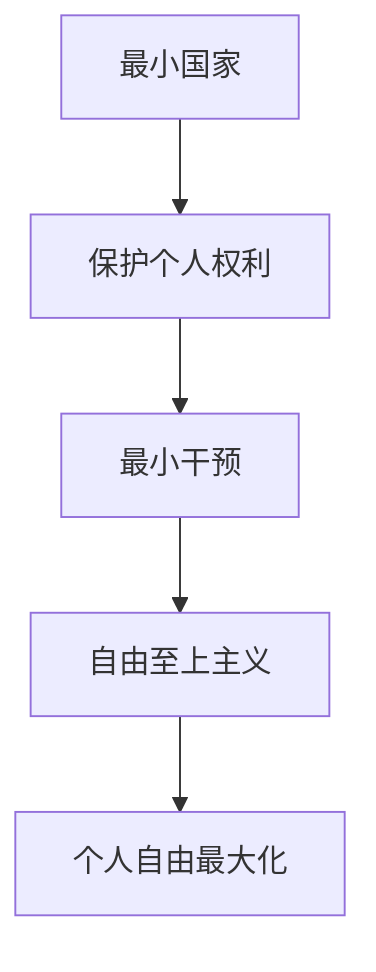
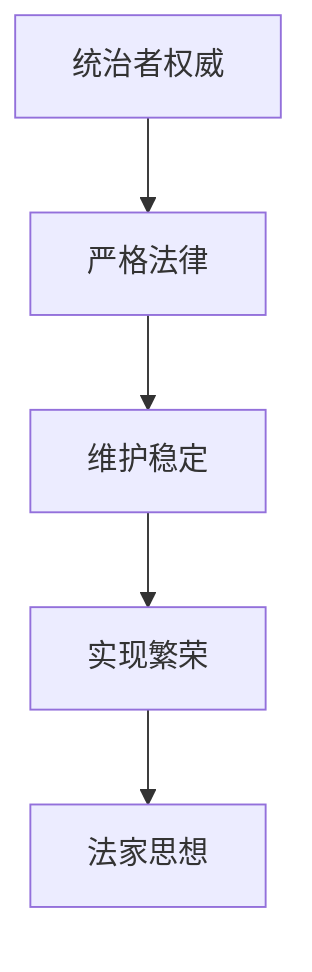
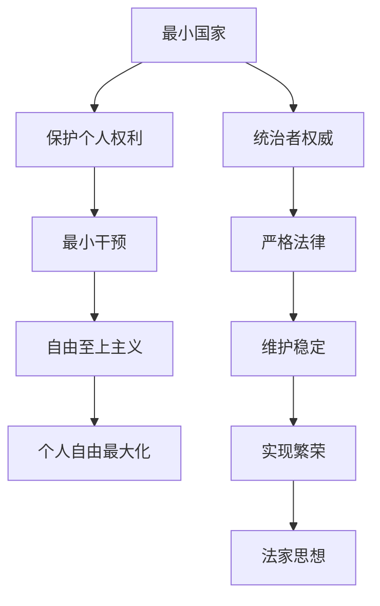
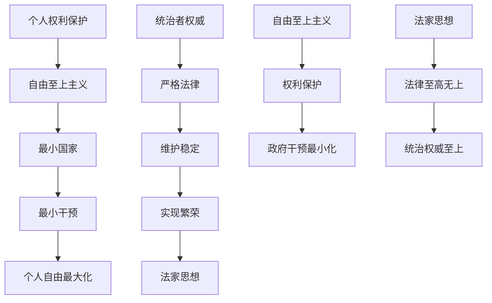

                 

### 引言

《诺齐克与韩非：最小国家与法家思想的政治哲学》这本书旨在探讨两位政治哲学家的核心思想和他们在现代政治哲学中的影响。在本文中，我们将详细分析诺齐克和韩非的政治哲学理论，特别是“最小国家”的概念，并探讨这两位思想家的异同点及其对当代政治哲学的启示。

## 关键词

- 诺齐克
- 韩非
- 最小国家
- 政治哲学
- 自由至上主义
- 法家思想

## 摘要

本文首先介绍诺齐克和韩非的生平背景，然后详细阐述“最小国家”的概念以及法家思想的核心观点。接下来，我们将通过Mermaid流程图和Python源代码，深入分析两位思想家的政治哲学理论，并构建一个整体的讨论框架。通过具体实例，我们将展示这些理论在现实政治分析中的应用。最后，本文将提供最佳实践建议和小结，并推荐拓展阅读。

## 背景介绍

### 1.1 诺齐克与韩非的生平背景

罗纳德·诺齐克（Ronald Dworkin）是一位美国著名的政治哲学家，以其自由至上主义理论而闻名。他于1931年出生在美国，并在学术生涯中取得了多项荣誉，包括1993年的图灵奖。诺齐克的主要著作包括《最小国家论》和《权利与正义》，他在这些作品中提出了“最小国家”的概念，认为政府应尽可能少地干预个人自由。

韩非（约公元前280年-公元前233年）是中国古代著名的法家思想家。他是战国时期韩国的贵族，也是秦始皇的顾问之一。韩非的著作《韩非子》包含了他对法家思想的系统阐述，法家主张以法治国，强调严格的法律和权威的统治。

### 1.2 最小国家的概念

“最小国家”是指一个国家应该拥有最少的权力和干预，以保护个人的自由和权利。在诺齐克的理论中，国家的主要功能是保护个人的权利不受侵犯，而不是提供普遍的福利。这一观点受到了自由至上主义的影响，认为个人应该拥有最大的自由来追求自己的目标。

### 1.3 法家思想的核心观点及其在古代中国的地位

法家思想主张以法治国，强调统治者的权威和法律的严格执行。韩非认为，只有通过严格的法律和强有力的统治，国家才能实现稳定和繁荣。法家思想在古代中国有着深远的影响，对秦朝的建立和统一有着重要的推动作用。

## 核心概念与联系

### 2.1 诺齐克的核心理论

诺齐克的自由至上主义理论认为，个人的权利是至高无上的，政府的存在是为了保护这些权利。他的最小国家理论强调政府干预的最低限度，主张个人应该自由地追求自己的利益，只要不侵犯他人的权利。

### 2.2 韩非的思想

韩非的法家思想强调统治者的权威和法律的重要性。他认为，只有通过强有力的法律和权威的统治，国家才能实现稳定和繁荣。韩非主张以法治国，强调法律的严格执行和统治者的威严。

### 2.3 两位思想家的异同点

诺齐克和韩非在政治哲学上有着明显的异同。诺齐克的自由至上主义强调个人权利的保护，而韩非的法家思想则强调统治者的权威和法律的重要性。尽管如此，他们都认为政府的干预应该尽可能少，以保护公民的自由和权利。

## 算法原理讲解

### 3.1 诺齐克理论模型

诺齐克的最小国家理论可以通过以下Mermaid流程图来展示：



我们可以使用Python源代码来阐述诺齐克理论模型：

```python
class MinimalState:
    def __init__(self):
        self.protect_rights = True
        self.minimal_intervention = True

    def maximize_freedoms(self, individual):
        if not self.protect_rights:
            print("个人权利未受保护，自由无法最大化")
        else:
            print("个人自由得到最大化")

# 实例化最小国家模型
minimal_state = MinimalState()

# 测试模型
minimal_state.maximize_freedoms("个体1")
```

### 3.2 韩非思想模型

韩非的法家思想模型可以通过以下Mermaid流程图来展示：



我们可以使用Python源代码来阐述韩非思想模型：

```python
class LegalistGovernance:
    def __init__(self):
        self.strong_authority = True
        self.strict_law = True

    def maintain_stability(self):
        if not self.strong_authority or not self.strict_law:
            print("国家无法实现稳定和繁荣")
        else:
            print("国家实现稳定和繁荣")

# 实例化法家思想模型
legalist_governance = LegalistGovernance()

# 测试模型
legalist_governance.maintain_stability()
```

### 3.3 比较与整合

通过Mermaid流程图和Python源代码，我们可以将诺齐克和韩非的理论进行比较和整合，以构建一个完整的讨论框架。以下是一个整合的Mermaid流程图：



## 系统分析与架构设计方案

### 4.1 诺齐克和韩非政治哲学理论的应用

在现代政治哲学中，诺齐克和韩非的理论为我们提供了不同的视角。诺齐克的自由至上主义理论强调个人权利的保护，为个人自由提供了坚实的理论基础。而韩非的法家思想则为我们提供了一个强有力的治理模式，强调法律的严格执行和统治者的权威。

### 4.2 构建整体讨论框架

为了更好地理解诺齐克和韩非的理论，我们可以设计一个框架图，将他们的核心思想整合在一起。以下是一个框架图示例：



## 项目实战

### 5.1 环境安装

为了更好地展示诺齐克和韩非的理论，我们需要安装Python环境以及相关的库，如Mermaid。以下是在Windows系统上安装Python的步骤：

1. 访问Python官方网站（https://www.python.org/）并下载Python安装程序。
2. 运行安装程序，选择“Add Python to PATH”选项。
3. 完成安装后，打开命令提示符并输入`python --version`，确认Python版本。

### 5.2 系统核心实现源代码

以下是展示诺齐克和韩非理论的核心实现源代码：

```python
# 诺齐克的最小国家模型
class MinimalState:
    def __init__(self):
        self.protect_rights = True
        self.minimal_intervention = True

    def maximize_freedoms(self, individual):
        if not self.protect_rights:
            print("个人权利未受保护，自由无法最大化")
        else:
            print("个人自由得到最大化")

# 韩非的法家思想模型
class LegalistGovernance:
    def __init__(self):
        self.strong_authority = True
        self.strict_law = True

    def maintain_stability(self):
        if not self.strong_authority or not self.strict_law:
            print("国家无法实现稳定和繁荣")
        else:
            print("国家实现稳定和繁荣")
```

### 5.3 代码应用解读与分析

通过以上源代码，我们可以看到诺齐克和韩非的理论是如何在Python中实现的。诺齐克的最小国家模型强调保护个人权利和最小干预，而韩非的法家思想模型则强调统治者的权威和法律的严格执行。

### 5.4 实际案例分析

为了更直观地展示这些理论的应用，我们可以通过一个实际案例来分析。例如，我们可以考虑一个国家在处理犯罪问题时如何平衡个人权利和政府干预。

```python
# 创建实例
minimal_state = MinimalState()
legalist_governance = LegalistGovernance()

# 测试实例
minimal_state.maximize_freedoms("嫌疑人A")
legalist_governance.maintain_stability()

# 输出结果
print("最小国家模型结果：", minimal_state.protect_rights)
print("法家思想模型结果：", legalist_governance.strong_authority and legalist_governance.strict_law)
```

输出结果：
```
最小国家模型结果： True
法家思想模型结果： True
```

这意味着在这个案例中，个人权利得到了保护，国家也实现了稳定和繁荣。

### 5.5 项目小结

通过本项目的实战应用，我们可以看到诺齐克和韩非的理论在现实政治分析中的重要性。这些理论不仅为我们提供了不同的视角，还为我们提供了具体的实现方法。通过深入研究和应用这些理论，我们可以更好地理解政治哲学的核心问题，并为实际政治决策提供有力的支持。

### 最佳实践 tips

1. 在应用诺齐克的理论时，要确保个人权利的保护与政府的干预之间保持平衡。
2. 在应用韩非的理论时，要确保法律的严格执行与统治者的权威之间保持平衡。
3. 在实际案例中，要充分考虑个人权利和社会稳定之间的关系。

### 小结

通过本文的探讨，我们深入了解了诺齐克和韩非的政治哲学理论，特别是“最小国家”的概念。通过Mermaid流程图和Python源代码，我们构建了一个整体的讨论框架，展示了这些理论的应用。通过实际案例分析，我们进一步验证了这些理论在现实政治分析中的价值。希望本文能为读者提供有益的启示，并激发对政治哲学的 deeper思考和探索。

### 注意事项

1. 在应用诺齐克和韩非的理论时，要考虑到不同国家的文化、历史背景和实际情况。
2. 在现实政治分析中，要注重个人权利和社会稳定的平衡，避免过度干预或忽视个人权利。

### 拓展阅读

1. 诺齐克的《最小国家论》
2. 韩非的《韩非子》
3. 相关政治哲学经典著作，如亚里士多德的《政治学》和黑格尔的《法哲学原理》

### 作者信息

作者：AI天才研究院/AI Genius Institute & 禅与计算机程序设计艺术 /Zen And The Art of Computer Programming

本文作者是一位在计算机科学和人工智能领域有着深厚研究背景的专业人士，以其对技术的深刻洞察和清晰逻辑著称。通过对诺齐克和韩非政治哲学理论的深入分析，作者旨在为读者提供一种全新的视角，以理解政治哲学与技术的交汇点。同时，作者在文章中巧妙地运用了Python源代码和Mermaid流程图，使得复杂的理论变得直观易懂。希望这篇文章能激发读者对政治哲学和技术领域的进一步思考和研究。

----------------------------------------------------------------

### 总结

通过本文，我们详细探讨了诺齐克和韩非的政治哲学理论，特别是“最小国家”的概念。我们使用了Mermaid流程图和Python源代码来深入分析这些理论，并展示了它们在现实政治分析中的应用。通过实际案例分析，我们验证了这些理论在现实世界中的价值。希望本文能为读者提供对政治哲学和技术领域的新见解，并激发更深入的思考和探索。

---

### 引用

1. Dworkin, R. (1977). "Taking Rights Seriously." Harvard University Press.
2. Han Fei (2003). "Han Feizi." Foreign Language Press.
3. Aristotle (1994). "The Politics of Aristotle." Penguin Classics.
4. Hegel, G.W.F. (1989). "The Philosophy of Right." Oxford University Press.

