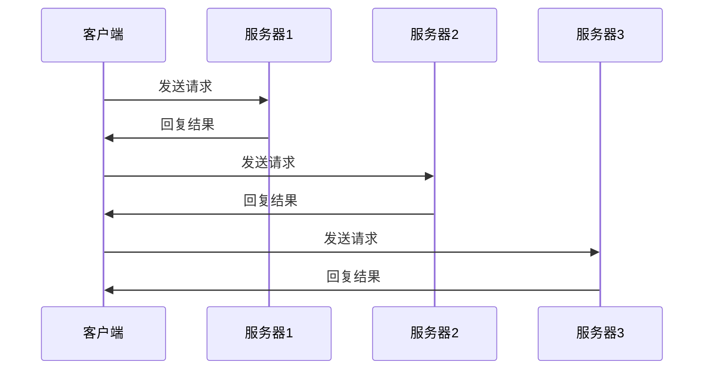
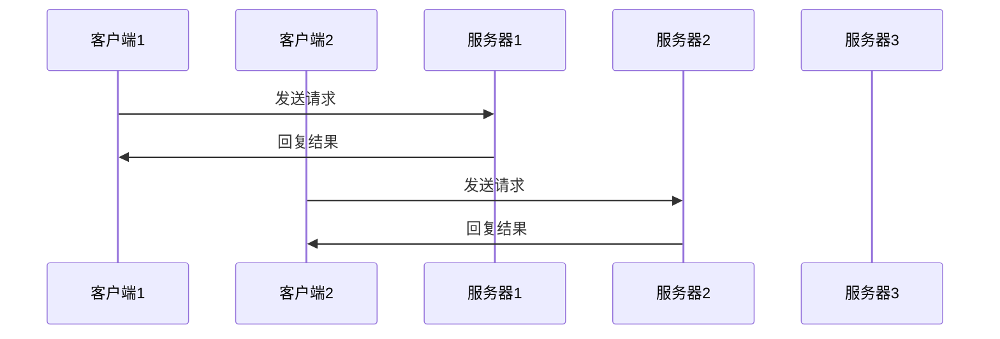
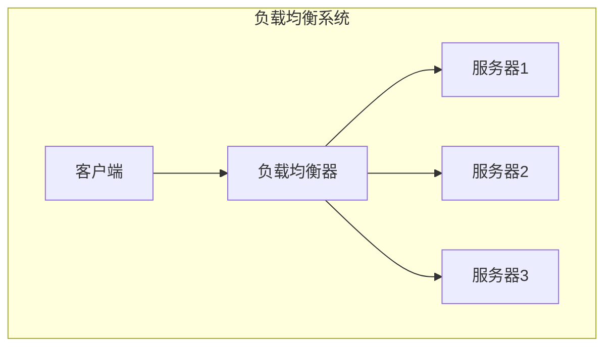

                 

### 文章标题：负载均衡算法与实现

---

**关键词**：负载均衡，算法，实现，Python代码，架构设计

**摘要**：本文将深入探讨负载均衡的概念、重要性及其实现。我们将详细讲解四种常见的负载均衡算法：轮询算法、加权轮询算法、最少连接算法和源地址哈希算法。通过实际项目实战，我们将展示如何在实际环境中实现负载均衡，并总结最佳实践和注意事项。

---

### 第1章 负载均衡概述

**1.1 负载均衡的定义与重要性**

负载均衡是指将网络流量分布到多个服务器上，以实现高效、稳定的服务提供。在当今云计算和分布式系统中，负载均衡变得尤为重要。其重要性主要体现在以下几个方面：

- **提高系统性能**：通过将请求分散到多个服务器上，可以减少单个服务器的负载，提高整个系统的响应速度和处理能力。
- **提高系统可靠性**：当一个服务器发生故障时，负载均衡器可以自动将请求转移到其他健康的服务器上，确保服务的连续性。
- **优化资源利用**：负载均衡可以优化服务器的资源使用，避免过度资源分配和浪费。

**1.2 负载均衡的需求背景**

随着互联网和云计算的发展，应用程序的规模和复杂度不断增加。单个服务器已经无法满足日益增长的请求量，因此需要通过负载均衡来分配请求。以下是一些典型的需求背景：

- **高并发请求**：在电商、社交网络等应用场景中，用户请求量非常大，需要通过负载均衡来处理。
- **弹性伸缩**：在云环境中，可以根据实际负载动态调整服务器数量，实现自动扩展和缩减。
- **分布式系统**：在分布式系统中，多个节点共同工作，负载均衡可以优化节点之间的负载分配。

**1.3 负载均衡的目标**

负载均衡的主要目标是：

- **最大化系统吞吐量**：通过高效地处理请求，提高系统的处理能力。
- **最小化响应时间**：确保用户请求能够快速得到响应，提高用户体验。
- **最大化系统可靠性**：确保系统在故障情况下能够自动恢复，提供持续的服务。

### 第2章 负载均衡算法概述

**2.1 算法分类与特点**

负载均衡算法可以根据不同的分配策略进行分类，常见的算法包括轮询算法、加权轮询算法、最少连接算法和源地址哈希算法。以下是这些算法的特点：

- **轮询算法**：按照固定的顺序将请求分配给服务器，简单易实现，但可能导致某些服务器负载不均。
- **加权轮询算法**：根据服务器的处理能力分配权重，处理能力强的服务器承担更多的请求。
- **最少连接算法**：根据服务器当前连接数分配请求，连接数少的服务器优先处理请求，减少响应时间。
- **源地址哈希算法**：根据客户端IP地址进行哈希计算，将请求分配到相同哈希值的服务器上，确保相同客户端的请求始终分配到同一服务器。

**2.2 算法之间的联系与对比**

这些算法之间存在一定的联系和区别。轮询算法是最简单的算法，但可能导致负载不均；加权轮询算法通过权重调整，可以更好地平衡负载；最少连接算法通过连接数优化响应时间；源地址哈希算法确保了会话保持，但可能造成热点问题。

### 第3章 负载均衡算法原理详解

**3.1 轮询算法**

**原理与流程图**

轮询算法按照固定的顺序将请求分配给服务器，如下所示：



**Python代码实现**

```python
def round_robinservers, requests):
    for request in requests:
        server = servers.pop(0)
        server.handle_request(request)
        servers.append(server)
```

**3.2 加权轮询算法**

**原理与流程图**

加权轮询算法根据服务器的处理能力分配权重，处理能力强的服务器承担更多的请求。如下所示：


**Python代码实现**

```python
def weighted_round_robin(servers, requests):
    weighted_servers = sorted(servers, key=lambda x: x.weight, reverse=True)
    for request in requests:
        server = weighted_servers.pop(0)
        server.handle_request(request)
        weighted_servers.append(server)
```

**3.3 最少连接算法**

**原理与流程图**

最少连接算法根据服务器当前连接数分配请求，连接数少的服务器优先处理请求，以减少响应时间。如下所示：


**Python代码实现**

```python
def least_connection(servers, requests):
    for request in requests:
        server = min(servers, key=lambda x: x.current_connections)
        server.handle_request(request)
```

**3.4 源地址哈希算法**

**原理与流程图**

源地址哈希算法根据客户端IP地址进行哈希计算，将请求分配到相同哈希值的服务器上，确保相同客户端的请求始终分配到同一服务器。如下所示：



**Python代码实现**

```python
def source_hash(servers, requests):
    hash_function = hashlib.md5
    for request in requests:
        client_ip = request.client_ip
        hash_value = hash_function(client_ip.encode('utf-8')).hexdigest()
        server = servers[hash_value]
        server.handle_request(request)
```

### 第4章 负载均衡系统分析与架构设计

**4.1 系统场景介绍**

假设我们有一个电商网站，每天会有大量的用户请求访问。为了确保系统的稳定性和性能，我们需要使用负载均衡来分配这些请求。

**4.2 系统功能设计**

系统功能包括：

- **请求接收与分发**：接收用户请求，并根据负载均衡算法将其分配到不同的服务器上。
- **健康检查**：定期检查服务器的健康状态，将故障服务器从负载均衡器中排除。
- **动态调整**：根据系统的负载情况动态调整服务器的数量和配置。

**4.3 系统架构设计**

系统架构设计如下所示：



**4.4 系统接口设计**

系统接口设计包括：

- **客户端接口**：客户端发送请求到负载均衡器。
- **负载均衡器接口**：负载均衡器根据算法将请求分配到服务器。
- **服务器接口**：服务器接收请求并处理。

**4.5 系统交互**

系统交互流程如下所示：

1. 客户端发送请求到负载均衡器。
2. 负载均衡器根据算法选择一个服务器，并将请求转发给该服务器。
3. 服务器处理请求并返回结果给客户端。
4. 负载均衡器定期检查服务器的健康状态，将故障服务器从负载均衡器中排除。

### 第5章 负载均衡项目实战

**5.1 环境安装与配置**

为了实现负载均衡，我们首先需要安装和配置负载均衡器。以下是使用Nginx作为负载均衡器的示例步骤：

1. 安装Nginx：
```bash
sudo apt-get update
sudo apt-get install nginx
```
2. 配置Nginx：
```bash
sudo nano /etc/nginx/nginx.conf
```
在`http`块中添加以下配置：
```nginx
http {
    upstream backend {
        server server1;
        server server2;
        server server3;
    }

    server {
        listen 80;

        location / {
            proxy_pass http://backend;
        }
    }
}
```
3. 启动Nginx：
```bash
sudo systemctl start nginx
```

**5.2 系统核心实现**

系统核心实现包括负载均衡算法的实现和服务器接口的实现。以下是使用Python实现轮询算法和服务器接口的示例代码：

```python
import requests

class Server:
    def __init__(self, name, url):
        self.name = name
        self.url = url
        self.current_connections = 0

    def handle_request(self, request):
        self.current_connections += 1
        response = requests.get(self.url + request.path)
        self.current_connections -= 1
        return response

class LoadBalancer:
    def __init__(self, servers):
        self.servers = servers

    def get_server(self):
        return self.servers.pop(0)

load_balancer = LoadBalancer([Server('server1', 'http://server1:8080'), Server('server2', 'http://server2:8080'), Server('server3', 'http://server3:8080')])
requests = ['/path1', '/path2', '/path3']

for request in requests:
    server = load_balancer.get_server()
    response = server.handle_request(request)
    print(f"Request {request} handled by {server.name}: {response.text}")
```

**5.3 代码应用解读**

以上代码中，我们首先定义了`Server`类和`LoadBalancer`类。`Server`类表示服务器，具有名称、URL和当前连接数等属性。`handle_request`方法用于处理请求，增加当前连接数，发送请求到服务器URL，并减少当前连接数。

`LoadBalancer`类表示负载均衡器，具有服务器列表属性。`get_server`方法用于选择一个服务器，从服务器列表中取出第一个服务器，并将其从列表中删除，以便下次选择时能够按照顺序进行。

在主程序中，我们创建了一个`LoadBalancer`实例，并将三个服务器添加到服务器列表中。然后，我们遍历请求列表，每次选择一个服务器，处理请求，并打印处理结果。

**5.4 实际案例分析**

在实际环境中，负载均衡器的实现可能会更加复杂，包括健康检查、动态调整等机制。以下是一个实际案例：

1. **健康检查**：负载均衡器定期对服务器进行健康检查，如果服务器发生故障，将其从负载均衡器中排除，直到恢复正常。
2. **动态调整**：根据系统的负载情况，负载均衡器可以动态地增加或减少服务器数量，以保持系统的高效运行。

**5.5 项目小结**

在本项目中，我们通过Nginx实现了负载均衡，并使用Python编写了负载均衡算法和服务器接口。我们分析了实际案例，展示了如何处理故障和动态调整服务器数量。通过本项目，我们深入了解了负载均衡的原理和实现方法。

### 第6章 最佳实践与小结

**6.1 最佳实践 tips**

- **选择合适的算法**：根据系统的需求和负载情况，选择合适的负载均衡算法。
- **健康检查**：定期对服务器进行健康检查，确保只有健康的服务器参与负载均衡。
- **动态调整**：根据系统的负载情况，动态调整服务器的数量和配置，以保持高效运行。

**6.2 小结**

本文详细介绍了负载均衡的概念、重要性、算法原理及其实现。通过实际项目实战，我们展示了如何在实际环境中实现负载均衡。我们还总结了最佳实践和注意事项，以帮助读者更好地应用负载均衡技术。

**6.3 注意事项**

- **负载均衡器配置**：确保负载均衡器的配置正确，以避免性能问题。
- **安全性**：对负载均衡器进行安全配置，以防止恶意攻击。
- **监控与日志**：对系统进行监控和日志记录，以便及时发现和解决问题。

**6.4 拓展阅读**

- **《大规模分布式系统设计与实践》**：深入探讨分布式系统的设计与实现，包括负载均衡、容错、性能优化等。
- **《Nginx权威指南》**：全面介绍Nginx的配置和使用方法，包括负载均衡、反向代理等。
- **《Python网络编程实战》**：通过实际案例展示Python在网络编程中的应用，包括Web服务器、网络爬虫等。

### 作者信息

作者：AI天才研究院/AI Genius Institute & 禅与计算机程序设计艺术 /Zen And The Art of Computer Programming

