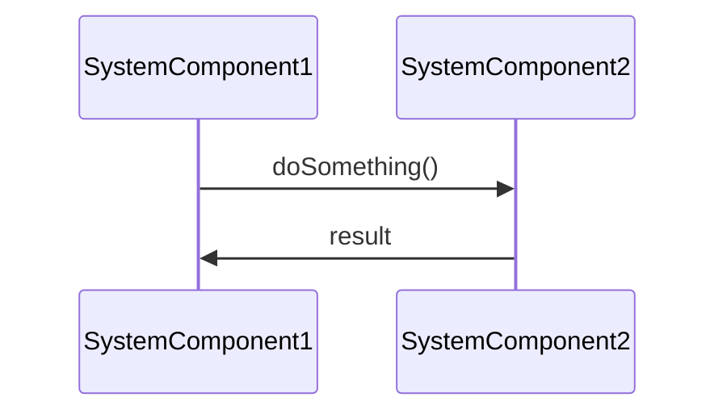
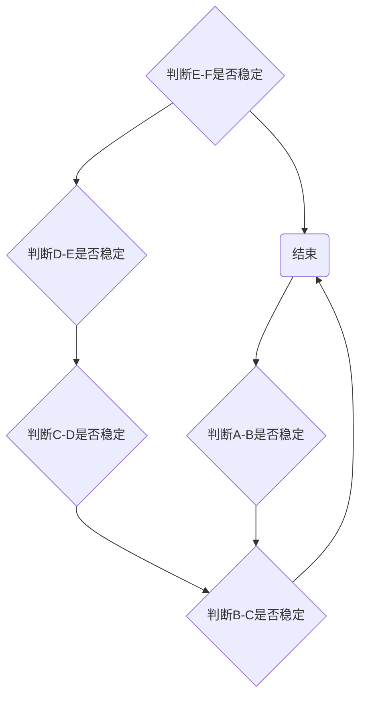
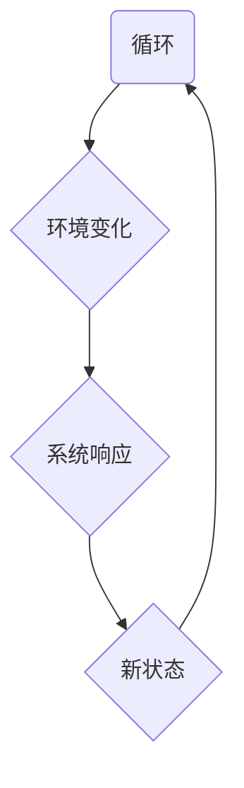
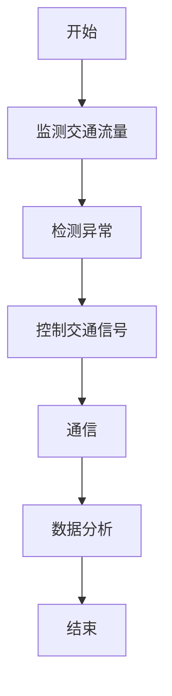
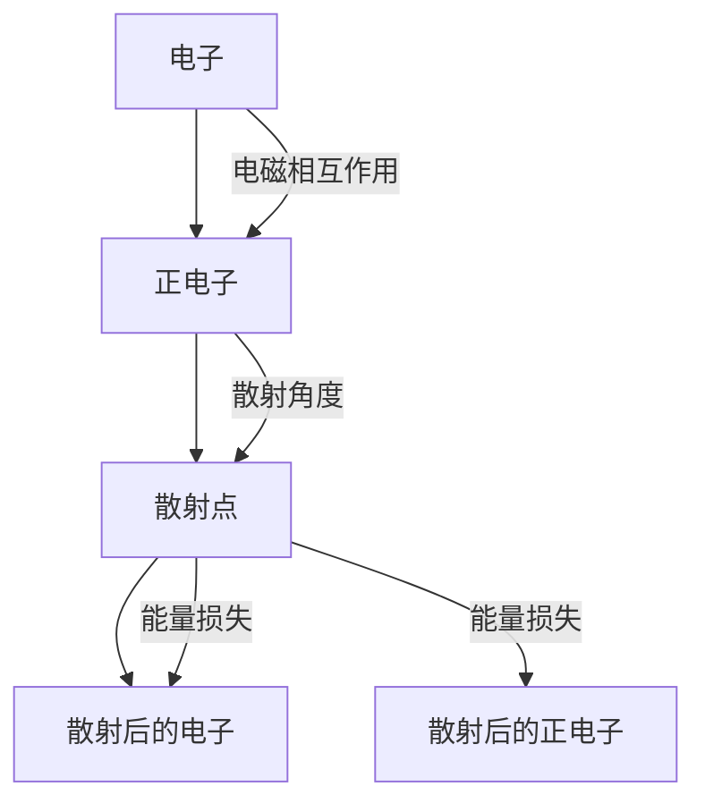
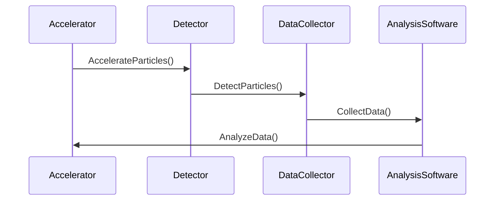
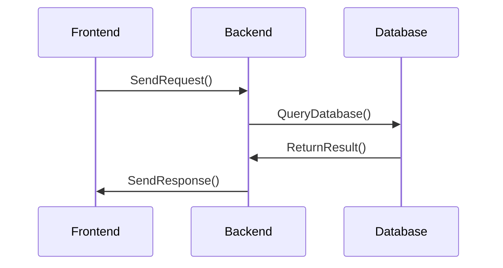

                 

### 第1章：费曼图与UML图概述

#### 1.1 费曼图的起源与发展

费曼图（Feynman Diagram）是由著名物理学家理查德·费曼（Richard Feynman）于1940年代中期提出的一种用于描述量子场论中粒子相互作用的图形化工具。费曼图的诞生背景可以追溯到量子力学和粒子物理学的发展过程中，对复杂粒子相互作用过程的描述和计算提出了新的需求。

费曼图的起源与发展历程与量子力学和粒子物理学的历史息息相关。早在19世纪末和20世纪初，经典物理学已经取得了巨大的成就，然而在面对微观粒子和量子现象时，经典物理学的理论显得力不从心。1900年，马克斯·普朗克（Max Planck）提出了量子假说，开启了量子物理学的新篇章。随后，爱因斯坦（Albert Einstein）和玻尔（Niels Bohr）等科学家对量子力学进行了深入的研究和探讨，提出了许多重要的理论。

在量子力学的发展过程中，薛定谔（Erwin Schrödinger）和海森堡（Werner Heisenberg）分别提出了波动力学和矩阵力学，这两种理论在当时都得到了广泛的认可和应用。然而，在解决复杂的粒子相互作用问题时，这些理论仍然存在一定的局限性。为了更直观和简便地描述粒子相互作用，费曼提出了一种新的图形表示方法，即费曼图。

费曼图最早被用于描述电磁相互作用的散射过程。通过将粒子相互作用过程分解为一系列基本相互作用事件，并用图形化的方式表示，费曼图大大简化了复杂粒子的计算过程。费曼图的提出不仅为粒子物理学的理论研究提供了有力的工具，也推动了量子场论的发展。

自费曼图提出以来，它已经成为粒子物理学中不可或缺的一部分。随着粒子物理学的不断发展和深入，费曼图的应用范围也逐渐扩大，涵盖了散射过程、量子场论、黑洞物理学等多个领域。许多著名的粒子物理学家，如施温格（Julian Schwinger）、朝永振一郎（Shin'ichirō Tomonaga）和费曼本人，都因在量子场论领域的杰出贡献而获得了诺贝尔物理学奖。

#### 1.2 费曼图在物理学中的应用

费曼图在物理学中的应用非常广泛，尤其是在粒子物理学和量子场论中。以下将介绍费曼图在粒子物理学中的一些主要应用。

**1.2.1 散射过程**

散射过程是粒子物理学中一个重要的概念，描述了两个或多个粒子在相互作用后发生偏转和改变能量、动量的现象。费曼图在散射过程中的应用主要体现在对散射过程的图形化表示和计算。

在散射过程中，费曼图通过将粒子相互作用分解为一系列基本事件，并用图形化的方式表示。每个基本事件对应一个相互作用，可以用一个费曼图表示。通过将这些基本事件连接起来，可以得到整个散射过程的费曼图。

费曼图在散射过程中的应用不仅使得复杂粒子的计算变得直观和简便，还提供了一种有效的工具来分析和理解粒子相互作用。例如，在电子-正电子对撞机（e⁻e⁺ collider）的实验中，费曼图被用来描述电子和正电子相互作用后产生的散射过程。

**1.2.2 量子场论**

量子场论是粒子物理学中用于描述粒子相互作用的统一理论，它将量子力学和狭义相对论相结合，提供了一种描述基本粒子及其相互作用的框架。费曼图在量子场论中的应用主要体现在以下几个方面。

首先，费曼图用于描述基本粒子的产生和湮灭过程。在量子场论中，粒子产生和湮灭是通过虚粒子的交换实现的。费曼图通过表示虚粒子的交换过程，揭示了粒子之间相互作用的本质。

其次，费曼图用于计算散射过程中的相互作用概率。在量子场论中，散射过程中的相互作用可以通过计算相互作用图的数量和权重来得到。费曼图通过图形化的方式表示这些相互作用图，使得计算过程更加直观和简便。

最后，费曼图在量子场论的另一个重要应用是计算粒子的衰变过程。在粒子衰变过程中，费曼图可以用来表示粒子衰变为其他粒子的过程，并通过计算衰变过程中的相互作用概率，得到粒子的衰变宽度。

**1.2.3 黑洞物理学**

黑洞物理学是粒子物理学中一个重要的研究领域，它研究黑洞的形成、演化和对宇宙的影响。费曼图在黑洞物理学中的应用主要体现在以下几个方面。

首先，费曼图用于描述黑洞的量子态。在量子场论中，黑洞的量子态可以通过费曼图来表示。费曼图通过表示黑洞与虚粒子的相互作用，揭示了黑洞量子态的性质。

其次，费曼图用于计算黑洞的热辐射。根据霍金（Stephen Hawking）提出的黑洞辐射理论，黑洞可以通过发射粒子来释放能量。费曼图被用来计算黑洞热辐射的分布和强度。

最后，费曼图在黑洞物理学中还可以用于研究黑洞碰撞和融合过程。通过费曼图表示黑洞相互作用的过程，可以更好地理解黑洞碰撞和融合的机制。

#### 1.3 UML图的定义与特点

统一建模语言（Unified Modeling Language，简称UML）是一种用于软件工程领域的图形化建模语言，它提供了一种标准化的方式来描述软件系统的结构和行为。UML图的定义与特点如下。

**1.3.1 定义**

UML图是由一组符号和规则组成的图形化表示方法，用于描述软件系统的不同方面。UML图包括类图、用例图、序列图、构件图等多种类型，每种类型的UML图都有其特定的用途和表示方法。

UML图的核心概念是模型元素，包括类、对象、用例、组件等。这些模型元素通过特定的符号和规则进行表示，并通过连接关系和语义约束来描述软件系统的结构和行为。

**1.3.2 特点**

- **标准化**：UML是一种标准化的建模语言，由国际标准化组织（ISO）和国际电气和电子工程师协会（IEEE）等机构制定和推广。这使得UML在不同组织和团队之间具有很高的互操作性和兼容性。

- **图形化**：UML图采用图形化的表示方法，使得软件系统的结构和行为更加直观和易于理解。通过图形化的方式，开发者可以更清晰地表达软件系统的设计思想和实现逻辑。

- **灵活性**：UML图提供了丰富的模型元素和连接关系，使得开发者可以根据实际需求选择和组合不同的模型元素，构建出适合特定项目的软件系统模型。

- **层次性**：UML图支持不同层次的建模，从高层次的需求分析到低层次的代码实现，开发者可以根据不同的需求和关注点选择不同的UML图类型。这使得UML图在软件系统开发生命周期的各个阶段都有广泛的应用。

- **可扩展性**：UML图支持自定义模型元素和连接关系，使得开发者可以根据实际需求扩展UML图的表示能力。此外，UML图还支持与其他建模语言的集成，如统一架构语言（UAF）等，进一步提高了其可扩展性。

- **可操作性**：UML图不仅是一种理论上的建模语言，还可以通过计算机辅助设计工具（如UML建模工具）进行操作和编辑。这使得开发者可以更高效地创建和维护软件系统模型。

#### 1.4 可视化表达的重要性

可视化表达在物理学和软件工程中具有重要意义。通过图形化的方式，可视化表达不仅使得复杂的概念和过程更加直观和易于理解，还可以提高思维效率和问题解决能力。

**1.4.1 物理学中的应用**

在物理学中，可视化表达被广泛应用于多个领域，如量子场论、粒子物理学、热力学等。以下是一些具体的应用场景。

- **量子场论**：量子场论描述了基本粒子的相互作用和演化过程。通过费曼图等可视化工具，物理学家可以更直观地理解粒子之间的相互作用，并简化复杂的计算过程。

- **粒子物理学**：在粒子物理学实验中，可视化表达被用来描述粒子的轨迹、散射过程和粒子探测器的数据。这些图形化的表示方法有助于物理学家分析和解释实验结果，揭示粒子物理现象的本质。

- **热力学**：热力学研究物质的热行为和能量转换。通过热力学图（如相图、热力学势图等）的图形化表示，物理学家可以更直观地理解物质的状态变化和能量传递过程。

**1.4.2 软件工程中的应用**

在软件工程中，可视化表达同样扮演着重要的角色。以下是一些具体的应用场景。

- **需求分析**：在软件项目开发过程中，需求分析是至关重要的一步。通过用例图、类图等UML图，开发者可以更清晰地表达用户需求、系统功能和系统边界。

- **系统设计**：在系统设计阶段，开发者可以使用UML图来描述软件系统的结构、组件、接口和交互关系。这些图形化的表示方法有助于开发者更好地理解和设计软件系统，降低设计和实现过程中的风险。

- **代码审查**：在代码审查阶段，开发者可以使用UML图来检查代码是否符合设计规范和架构要求。通过图形化的表示方法，开发者可以更直观地发现代码中的错误和不足之处，提高代码质量和可维护性。

- **项目管理**：在软件项目开发过程中，可视化表达还可以用于项目管理和进度跟踪。通过任务看板、甘特图等可视化工具，项目经理可以更清晰地了解项目进展、任务分配和风险情况，提高项目管理效率。

- **用户交互**：在用户界面设计阶段，可视化表达被用来描述用户界面的布局、控件和交互逻辑。通过原型设计和交互图等图形化工具，开发者可以更好地满足用户需求，提高用户体验。

总之，可视化表达在物理学和软件工程中具有重要意义。通过图形化的方式，可视化表达不仅使得复杂的概念和过程更加直观和易于理解，还可以提高思维效率和问题解决能力。因此，掌握和应用可视化表达方法对于物理学家和软件工程师来说都是至关重要的。

---

**第1章小结**

在本章中，我们介绍了费曼图和UML图的基本概念和特点，以及它们在物理学和软件工程中的应用。费曼图起源于粒子物理学，通过图形化的方式描述粒子相互作用和散射过程，广泛应用于量子场论和黑洞物理学等领域。UML图是一种标准化的图形化建模语言，用于描述软件系统的结构和行为，广泛应用于需求分析、系统设计、代码审查等软件工程阶段。

通过本章的介绍，我们了解了费曼图和UML图的基本原理和应用场景，为后续章节的深入探讨奠定了基础。在接下来的章节中，我们将进一步探讨费曼图和UML图在物理学和软件工程中的具体应用，并通过实际案例来展示它们的价值和优势。让我们继续深入思考，逐步揭示这两大可视化表达工具的奥秘。

---

## 第2章：费曼图与UML图的基本原理

#### 2.1 费曼图的基本构成

费曼图是描述粒子相互作用的重要工具，其基本构成包括以下几个部分：

**1. 粒子线**：费曼图中最基本的元素是粒子线，用来表示粒子的运动轨迹。粒子线通常用一条直线表示，线上的箭头表示粒子的运动方向。不同类型的粒子有不同的符号，如电子用圆圈表示，光子用直线表示。

**2. 势盒子**：势盒子是表示粒子间相互作用的区域。在费曼图中，势盒子通常用一个方框表示，其中包含描述相互作用类型的符号，如电磁相互作用用箭头表示，强相互作用用菱形表示，弱相互作用用圆形表示。

**3. 费曼图规则**：费曼图的绘制需要遵循一定的规则，这些规则包括：
   - 粒子线必须连接到势盒子上。
   - 势盒子之间不能直接连接，必须通过粒子线连接。
   - 费曼图中的粒子线可以交叉，但不能重叠。

**4. 费曼图类型**：费曼图根据粒子的种类和相互作用的类型可以分为多种类型，常见的有：
   - **散射图**：描述粒子之间相互散射的过程。
   - **产生-湮灭图**：描述粒子产生和湮灭的过程。
   - **反应图**：描述粒子反应生成新粒子的过程。

#### 2.2 费曼图的绘制规则

绘制费曼图需要遵循一系列规则，以确保图形的正确性和一致性。以下是绘制费曼图的一些关键规则：

**1. 粒子线的绘制**：
   - 粒子线应从粒子产生的位置开始，指向粒子的运动方向。
   - 粒子线的箭头应指向粒子的移动方向。

**2. 势盒子的绘制**：
   - 势盒子应放置在粒子线之间，表示粒子之间的相互作用。
   - 势盒子的形状和符号应与相互作用的类型相匹配。

**3. 费曼图的连接**：
   - 粒子线必须连接到势盒子上，表示粒子之间的相互作用。
   - 势盒子之间不能直接连接，必须通过粒子线连接。

**4. 费曼图的交叉和重叠**：
   - 粒子线可以交叉，但不得重叠。
   - 交叉的粒子线应清楚地标识，以避免混淆。

**5. 费曼图的简化**：
   - 在某些情况下，可以简化费曼图，例如，省略明显的中间步骤或重复的相互作用。

**6. 费曼图的标注**：
   - 费曼图应标注粒子的种类、相互作用类型和相关的量子数。

通过遵循这些绘制规则，我们可以确保费曼图的准确性和一致性，从而有效地描述粒子相互作用的过程。

#### 2.3 UML图的基本类别

UML图是统一建模语言（UML）的一部分，用于描述软件系统的不同方面。UML图可以分为以下几种基本类别：

**1. 用例图（Use Case Diagram）**：
用例图用于描述系统与外部用户（用例）的交互。它显示了系统的功能需求和系统的边界，通常包含以下几个组成部分：
   - **用例**：描述系统能够完成的某个功能。
   - **角色**：与系统交互的外部用户或系统。
   - **关系**：用例之间的关联关系，如包含（include）、扩展（extend）和泛化（generalization）。

**2. 类图（Class Diagram）**：
类图用于描述系统的静态结构，主要关注类、对象和它们之间的关系。类图的基本组成部分包括：
   - **类**：表示系统中的对象类型，包括属性和方法。
   - **属性**：类的特征，如数据类型和访问级别。
   - **方法**：类的行为，通常包括参数和返回类型。
   - **关系**：类之间的关系，如继承（generalization）、关联（association）、聚合（aggregation）和组合（composition）。

**3. 序列图（Sequence Diagram）**：
序列图用于描述对象之间的交互顺序和时间顺序。它显示了对象如何按顺序执行操作，通常包含以下几个组成部分：
   - **对象**：参与交互的对象。
   - **生命线**：表示对象的生存时间和状态。
   - **消息**：对象之间的交互，可以是同步调用或异步消息传递。
   - **激活**：表示对象正在执行某个操作。

**4. 构件图（Component Diagram）**：
构件图用于描述系统的组件和它们之间的关系。它显示了系统的模块化和组件间的依赖关系。构件图的基本组成部分包括：
   - **组件**：系统的可重用模块。
   - **依赖**：组件之间的依赖关系。
   - **接口**：组件提供的接口和实现。

**5. 架构图（Architecture Diagram）**：
架构图用于描述系统的整体结构和架构设计。它通常包括多个UML图的组合，以展示系统的层次结构和关键组件。架构图的基本组成部分包括：
   - **组件**：系统的关键组件和模块。
   - **交互**：组件之间的交互和通信。
   - **架构约束**：系统设计中的约束和规则。

通过使用这些不同类型的UML图，开发者可以全面地描述软件系统的结构和行为，从而更好地理解和设计系统。

#### 2.4 UML图的绘制规则

绘制UML图需要遵循一定的规则和标准，以确保图形的准确性和一致性。以下是绘制UML图的一些关键规则：

**1. 用例图的绘制规则**：
   - **用例**：用例应使用椭圆形状表示，并在其中写明用例的名称。
   - **角色**：角色应使用矩形形状表示，并在其中写明角色的名称。
   - **关系**：用例和角色之间的关系应使用线段连接，并在必要时添加标签。

**2. 类图的绘制规则**：
   - **类**：类应使用矩形形状表示，矩形内部分为三个部分，分别表示类的名称、属性和方法。
   - **属性**：类的属性应列在矩形内部，属性包括数据类型和访问级别。
   - **方法**：类的方法应列在矩形内部，方法包括方法名称、参数和返回类型。
   - **关系**：类之间的关系（如继承、关联、聚合和组合）应使用不同类型的线段表示，并在必要时添加标签。

**3. 序列图的绘制规则**：
   - **对象**：对象应使用矩形形状表示，矩形内部写明对象的名称。
   - **生命线**：对象的生命线是从对象创建到销毁的时间线。
   - **消息**：对象之间的消息应使用带箭头的线段表示，箭头指向接收消息的对象。
   - **激活**：激活表示对象正在执行某个操作，通常用细线表示。

**4. 构件图的绘制规则**：
   - **组件**：组件应使用矩形形状表示，矩形内部写明组件的名称。
   - **依赖**：组件之间的依赖关系应使用带箭头的线段表示，箭头指向依赖的组件。
   - **接口**：接口应使用带有空心三角形的线段表示，箭头指向提供接口的组件。

**5. 架构图的绘制规则**：
   - **组件**：组件应使用矩形形状表示，矩形内部写明组件的名称。
   - **交互**：组件之间的交互应使用线段表示，线段上可以附有标签。
   - **架构约束**：架构约束应使用文本框表示，并附在相关组件附近。

通过遵循这些绘制规则，开发者可以创建清晰、准确和一致的UML图，从而更好地理解和设计软件系统。

---

**第2章小结**

在本章中，我们深入探讨了费曼图和UML图的基本原理和绘制规则。费曼图通过图形化的方式描述粒子相互作用，其基本构成包括粒子线、势盒子和费曼图规则。而UML图作为一种用于软件工程的可视化建模语言，涵盖了用例图、类图、序列图、构件图和架构图等多种类型，每种类型都有其特定的用途和绘制规则。

通过本章的介绍，我们不仅了解了费曼图和UML图的基本概念和原理，还掌握了如何正确绘制这两种图形。这些知识为我们在后续章节中深入探讨费曼图和UML图在物理学和软件工程中的应用打下了坚实的基础。在接下来的章节中，我们将通过实际案例进一步展示费曼图和UML图在具体领域中的价值。让我们继续深入思考，逐步揭示这两大可视化表达工具的奥秘。

---

## 第二部分：物理学中的应用

### 第3章：费曼图在粒子物理学中的应用

#### 3.1 费曼图在散射过程中的应用

**散射过程**是粒子物理学中一个重要的现象，它描述了两个或多个粒子在相互作用后发生偏转和改变能量、动量的过程。散射过程广泛应用于原子核物理、粒子物理和高能物理等领域。费曼图作为一种强有力的可视化工具，被广泛应用于散射过程的描述和计算。

**3.1.1 费曼图的表示方法**

费曼图通过图形化的方式表示粒子间的散射过程，其基本构成包括粒子线、势盒子和相互作用点。以下是费曼图表示散射过程的几个关键步骤：

1. **粒子线的绘制**：首先，根据散射过程涉及的粒子，绘制出粒子的运动轨迹。通常，粒子线用一条直线表示，箭头表示粒子的运动方向。

2. **势盒子的添加**：在粒子线上添加势盒子，表示粒子之间的相互作用。势盒子的形状和符号取决于相互作用的类型，如电磁相互作用用箭头表示，强相互作用用菱形表示，弱相互作用用圆形表示。

3. **相互作用点的标注**：在粒子线和势盒子之间标注相互作用点，表示粒子间相互作用的时刻和位置。

4. **散射角的标注**：在费曼图中标注散射角度，表示粒子在散射过程中发生的偏转角度。

**3.1.2 散射过程中的费曼图**

以下是一个简单的散射过程的费曼图示例：


在这个例子中，两个电子在电磁相互作用下发生散射，产生了三个电子。费曼图表示了散射过程中粒子线的偏转和势盒子的相互作用。通过分析费曼图，我们可以得到散射过程中粒子之间的相互作用强度、散射角度和粒子能量等信息。

**3.1.3 费曼图的应用实例**

费曼图在粒子物理学中有着广泛的应用，以下列举几个典型的应用实例：

1. **电子-正电子散射**：在粒子物理学的实验中，电子-正电子散射是研究电磁相互作用的一个重要现象。通过费曼图，我们可以计算电子-正电子散射的截面和散射角度，从而深入理解电磁相互作用。

2. **核反应**：在核物理中，核反应过程可以用费曼图来描述。例如，在核裂变反应中，重核与中子相互作用后分裂成两个轻核，并通过费曼图可以清晰地展示这个过程。

3. **散射实验**：在粒子物理实验中，散射实验是研究基本粒子相互作用的重要手段。通过费曼图，实验物理学家可以分析散射数据，揭示粒子相互作用机制和物理规律。

总之，费曼图在散射过程中的应用不仅使得复杂粒子计算变得直观和简便，还为粒子物理学实验提供了强有力的工具，帮助科学家们更好地理解和探索基本粒子的相互作用。

---

**第3章小结**

在本章中，我们详细介绍了费曼图在粒子物理学中的应用，特别是散射过程中的费曼图表示方法和应用实例。通过费曼图，我们可以直观地描述粒子之间的相互作用，简化复杂的粒子计算过程。费曼图在电子-正电子散射、核反应和散射实验等粒子物理学领域有着广泛的应用，为科学家们提供了有力的工具来研究和探索基本粒子的相互作用机制。在接下来的章节中，我们将继续探讨费曼图在量子场论等其他领域的应用，进一步揭示这一可视化表达工具的奥秘。

---

## 第4章：UML图在软件工程中的应用

UML图是统一建模语言（Unified Modeling Language）的一部分，它在软件工程中扮演着重要的角色，用于描述软件系统的不同方面。UML图广泛应用于需求分析、系统设计、代码审查和项目管理等阶段。本章将详细探讨UML图在软件工程中的应用，特别是用例图、类图和序列图的使用。

### 4.1 UML图在需求分析中的应用

**需求分析**是软件工程中的关键步骤，它定义了系统的功能和性能要求。在这一阶段，UML图被用来明确系统的功能和边界。

**4.1.1 用例图的绘制**

**用例图**是一种用于描述系统功能需求的UML图，它展示了系统与外部用户（用例）的交互。以下是绘制用例图的基本步骤：

1. **确定系统边界**：首先，明确系统的边界，确定哪些功能属于系统内部，哪些功能属于外部系统或用户。

2. **识别用户角色**：根据系统功能，识别与系统交互的用户角色。用户角色可以是单个用户，也可以是组织或部门。

3. **定义用例**：基于用户角色的需求，定义系统应提供的功能，即用例。每个用例应使用椭圆形状表示，并在其中写明用例的名称。

4. **绘制关系**：用例之间可能存在包含、扩展或泛化等关系。例如，一个高级用例可以包含多个低级用例，一个泛化关系可以表示不同类型的用户角色。

以下是绘制用例图的示例：

```mermaid
erdf
title: 用例图示例

actor("用户")::="用户"
system("系统")::= actors

usecase("登录")::=system
usecase("查询")::=system
usecase("管理")::=system
usecase("支付")::=system

system -> login
system -> query
system -> manage
system -> payment
```

在这个示例中，我们定义了一个系统，包括四个用例：登录、查询、管理和支付。用户与系统进行交互，触发这些用例。

**4.1.2 类图的绘制**

**类图**用于描述系统的静态结构，包括类、对象和它们之间的关系。在需求分析阶段，类图可以帮助我们明确系统的类和属性。以下是绘制类图的基本步骤：

1. **识别类**：根据需求分析的结果，识别系统中的类。类应使用矩形形状表示，矩形内部分为三个部分，分别表示类的名称、属性和方法。

2. **定义属性和方法**：为每个类定义属性和方法。属性应列在类的内部，包括数据类型和访问级别。方法应列在类的内部，包括方法名称、参数和返回类型。

3. **绘制关系**：类之间的关系，如继承、关联、聚合和组合，应使用不同类型的线段表示。例如，继承关系使用带有箭头的实线表示，关联关系使用实线表示。

以下是绘制类图的示例：

```mermaid
classDiagram
Person <|-- Employee
Person {
    +String name
    +Date birthdate
}
Employee {
    +String employeeID
}
```

在这个示例中，我们定义了两个类：Person和Employee。Person是Employee的基类，Employee继承了Person的属性和方法。

**4.1.3 需求分析中的应用**

在需求分析阶段，UML图可以帮助我们更好地理解系统的功能和结构。通过用例图，我们可以明确系统的功能和边界，识别用户角色和用例。通过类图，我们可以定义系统的类和属性，明确类之间的关系。这些图形化的表示方法使得需求分析更加直观和易于理解，有助于提高需求分析和设计阶段的效率和质量。

### 4.2 UML图在系统设计中的应用

**系统设计**是软件工程中的关键步骤，它决定了系统的可扩展性、性能和可维护性。在这一阶段，UML图被用来明确系统的架构、组件和接口。

**4.2.1 构件图的绘制**

**构件图**用于描述系统的组件和它们之间的关系。构件图可以帮助我们理解系统的模块化和组件间的依赖关系。以下是绘制构件图的基本步骤：

1. **识别组件**：根据系统设计的结果，识别系统中的组件。组件应使用矩形形状表示，矩形内部写明组件的名称。

2. **定义依赖关系**：组件之间的依赖关系应使用带有箭头的线段表示。依赖关系表示组件之间的依赖关系，例如一个组件依赖于另一个组件来执行特定功能。

3. **绘制接口**：组件提供的接口应使用带有空心三角形的线段表示。接口表示组件之间的通信方式和交互协议。

以下是绘制构件图的示例：

```mermaid
componentDiagram
SystemComponent1 --> SystemComponent2
SystemComponent1 --> SystemComponent3

SystemComponent1 {
    +int doSomething()
}
SystemComponent2 {
    +void doSomething(int param)
}
SystemComponent3 {
    +void doSomething_else()
}
```

在这个示例中，我们定义了三个组件：SystemComponent1、SystemComponent2和SystemComponent3。SystemComponent1依赖于SystemComponent2和SystemComponent3来执行特定功能。

**4.2.2 序列图的绘制**

**序列图**用于描述对象之间的交互顺序和时间顺序。序列图可以帮助我们理解系统中的操作和事件。以下是绘制序列图的基本步骤：

1. **识别对象**：根据系统设计的结果，识别系统中的对象。对象应使用矩形形状表示，矩形内部写明对象的名称。

2. **定义消息**：对象之间的交互应使用带箭头的线段表示。消息表示对象之间的通信，可以是同步调用或异步消息传递。

3. **标注时间顺序**：在序列图中，时间顺序可以通过对象的激活和消息的传递来表示。通常，对象的激活用细线表示，消息传递用带箭头的线段表示。

以下是绘制序列图的示例：



在这个示例中，SystemComponent1调用SystemComponent2的doSomething()方法，并接收返回的结果。

**4.2.3 系统设计中的应用**

在系统设计阶段，UML图可以帮助我们更好地理解和设计系统。通过构件图，我们可以明确系统的组件和依赖关系，确保系统的模块化和可扩展性。通过序列图，我们可以描述对象之间的交互顺序和时间顺序，确保系统的逻辑和流程的正确性。这些图形化的表示方法使得系统设计更加直观和易于理解，有助于提高设计质量和开发效率。

### 4.3 UML图在软件测试中的应用

**软件测试**是软件工程中的关键步骤，它用于验证系统的功能和性能。在这一阶段，UML图被用来描述测试用例和测试脚本。

**4.3.1 测试用例的设计**

**测试用例**用于描述系统中的特定功能或行为，并在测试过程中执行验证。以下是设计测试用例的基本步骤：

1. **识别测试场景**：根据系统功能和需求，识别需要测试的场景。测试场景应涵盖系统的所有功能和异常情况。

2. **定义测试用例**：为每个测试场景定义测试用例。测试用例应包括输入数据、预期输出和测试步骤。

3. **绘制测试用例图**：测试用例图应使用矩形形状表示，矩形内部写明测试用例的名称。测试用例之间可能存在包含、扩展或泛化等关系。

以下是绘制测试用例图的示例：

```mermaid
usecaseDiagram
TestScenario1 <<include>> TestScenario2
TestScenario1 <<extend>> TestScenario3
TestScenario3 <<generalization>> TestScenario4

TestScenario1 {
    +void testFunction1()
}
TestScenario2 {
    +void testFunction2()
}
TestScenario3 {
    +void testFunction3()
}
TestScenario4 {
    +void testFunction4()
}
```

在这个示例中，我们定义了四个测试场景：TestScenario1、TestScenario2、TestScenario3和TestScenario4。TestScenario1包含TestScenario2，TestScenario3扩展TestScenario1，TestScenario4泛化TestScenario3。

**4.3.2 测试脚本的编写**

**测试脚本**用于描述测试用例的执行步骤和预期结果。以下是编写测试脚本的基本步骤：

1. **准备测试环境**：确保测试环境已准备好，包括所需的硬件、软件和配置。

2. **编写测试脚本**：根据测试用例的定义，编写测试脚本。测试脚本应包括输入数据的生成、测试步骤的执行和预期结果的验证。

3. **执行测试脚本**：在测试环境中执行测试脚本，并记录测试结果。

以下是编写测试脚本的一个简单示例：

```python
import unittest

class TestExample(unittest.TestCase):
    def test_function1(self):
        # 准备测试数据
        input_data = "example_data"
        
        # 执行测试函数
        result = function1(input_data)
        
        # 验证预期结果
        self.assertEqual(result, "expected_result")

if __name__ == "__main__":
    unittest.main()
```

在这个示例中，我们定义了一个测试类TestExample，其中包括一个测试函数test_function1。测试函数接收输入数据，执行特定的功能函数，并验证预期结果。

**4.3.3 软件测试中的应用**

在软件测试阶段，UML图可以帮助我们设计和执行测试用例。通过测试用例图，我们可以明确系统的测试场景和测试用例，确保测试的全面性和覆盖率。通过测试脚本，我们可以自动化测试执行过程，提高测试效率和准确性。这些图形化的表示方法使得软件测试更加直观和易于管理，有助于提高测试质量和项目的可靠性。

---

**第4章小结**

在本章中，我们详细介绍了UML图在软件工程中的应用，特别是在需求分析、系统设计和软件测试阶段。通过用例图，我们可以明确系统的功能和边界，识别用户角色和用例。通过类图，我们可以定义系统的静态结构，明确类和属性。通过构件图，我们可以描述系统的组件和依赖关系，确保系统的模块化和可扩展性。通过序列图，我们可以描述对象之间的交互顺序和时间顺序，确保系统的逻辑和流程的正确性。在软件测试阶段，UML图可以帮助我们设计和执行测试用例，提高测试效率和准确性。

通过本章的介绍，我们不仅了解了UML图在软件工程中的应用，还掌握了如何使用UML图来描述系统的功能和结构。这些知识为我们在实际项目中使用UML图提供了重要的指导，有助于提高软件开发的质量和效率。在接下来的章节中，我们将进一步探讨UML图在复杂系统分析中的应用，展示其在更广泛领域的价值和潜力。

---

## 第5章：费曼图与UML图在复杂系统分析中的应用

在现代社会，复杂系统的存在越来越普遍，从计算机网络、生物系统到软件系统，这些系统的复杂性和规模都对分析和设计提出了挑战。费曼图和UML图作为强大的可视化工具，在复杂系统分析中扮演着重要角色。本章将探讨费曼图和UML图在复杂系统分析中的应用，包括复杂系统的定义与特征、费曼图和UML图的适用场景，以及它们在实际案例中的应用。

### 5.1 复杂系统的定义与特征

**复杂系统**是指由大量相互作用的个体组成的系统，这些个体可以是人、设备、分子、细胞等。复杂系统的特征包括：

1. **非线性**：复杂系统中的相互作用往往是非线性的，这意味着系统的行为无法简单地通过线性关系来描述。

2. **高度耦合**：复杂系统中的个体之间存在复杂的相互作用和依赖关系，这些关系构成了系统的复杂性。

3. **自组织**：复杂系统可以自发地形成秩序和结构，这种秩序和结构通常是通过个体之间的相互作用和反馈机制产生的。

4. **适应性**：复杂系统具有适应性，可以在不断变化的环境中调整和优化自己的行为。

5. **动态性**：复杂系统的状态和结构是随时间动态变化的，这种动态性使得系统分析更加复杂。

6. **大规模**：复杂系统通常具有大量个体，这些个体之间的相互作用构成了系统的复杂性。

### 5.2 费曼图在复杂系统分析中的应用

费曼图在复杂系统分析中的应用主要体现在以下几个方面：

**5.2.1 费曼图在复杂网络分析中的应用**

复杂网络是复杂系统的一种形式，由节点和边构成，节点表示个体，边表示个体之间的相互作用。费曼图可以用来分析和模拟复杂网络的动态行为。

1. **网络演化分析**：通过费曼图，可以描述复杂网络的演化过程，包括节点的加入和移除、边的创建和断裂等。

2. **传播现象分析**：费曼图可以用来分析复杂网络中的传播现象，如信息传播、疾病传播等。

3. **稳定性分析**：通过费曼图，可以评估复杂网络的稳定性，识别可能导致系统崩溃的关键节点和边。

以下是复杂网络分析的费曼图示例：



在这个示例中，我们定义了一个复杂网络，并使用费曼图来分析网络的稳定性。

**5.2.2 费曼图在复杂系统建模中的应用**

费曼图在复杂系统建模中的应用主要体现在以下几个方面：

1. **系统状态分析**：通过费曼图，可以描述复杂系统的状态变化，包括系统内部的相互作用和外部环境的影响。

2. **动态行为模拟**：费曼图可以用来模拟复杂系统的动态行为，预测系统在不同条件下的响应。

3. **优化设计**：通过费曼图，可以识别复杂系统的关键部分，优化系统的设计和性能。

以下是复杂系统建模的费曼图示例：



在这个示例中，我们定义了一个复杂系统，并使用费曼图来描述系统的状态变化和动态行为。

### 5.3 UML图在复杂系统分析中的应用

UML图在复杂系统分析中的应用主要体现在以下几个方面：

**5.3.1 UML图在系统架构设计中的应用**

在系统架构设计阶段，UML图被用来描述系统的整体结构和关键组件，帮助开发者理解系统的结构和功能。

1. **架构设计**：通过UML图，可以明确系统的层次结构、组件和接口，确保系统的模块化和可扩展性。

2. **组件依赖**：通过UML图，可以识别组件之间的依赖关系，确保系统的稳定性和可维护性。

3. **接口定义**：通过UML图，可以定义系统组件的接口和交互协议，确保系统的通信和协作。

以下是系统架构设计的UML图示例：

```mermaid
componentDiagram
Component1 --> Component2
Component1 --> Component3
Component3 --> Component4

Component1 { +Interface1 }
Component2 { +Interface2 }
Component3 { +Interface3 }
Component4 { +Interface4 }
```

在这个示例中，我们定义了一个系统架构，包括四个组件：Component1、Component2、Component3和Component4。这些组件通过接口进行通信和协作。

**5.3.2 UML图在系统测试中的应用**

在系统测试阶段，UML图被用来设计和执行测试用例，提高测试效率和准确性。

1. **测试用例设计**：通过UML图，可以定义系统的测试用例，明确测试的场景和步骤。

2. **测试脚本编写**：通过UML图，可以编写测试脚本，自动化测试执行过程。

3. **测试结果分析**：通过UML图，可以分析测试结果，识别系统的问题和缺陷。

以下是系统测试的UML图示例：

```mermaid
usecaseDiagram
TestScenario1 <<include>> TestScenario2
TestScenario1 <<extend>> TestScenario3
TestScenario3 <<generalization>> TestScenario4

TestScenario1 {
    +void testFunction1()
}
TestScenario2 {
    +void testFunction2()
}
TestScenario3 {
    +void testFunction3()
}
TestScenario4 {
    +void testFunction4()
}
```

在这个示例中，我们定义了四个测试场景：TestScenario1、TestScenario2、TestScenario3和TestScenario4。这些场景涵盖了系统的不同功能，确保测试的全面性和覆盖率。

### 5.4 费曼图与UML图在复杂系统分析中的应用案例

**案例研究：智能交通系统**

智能交通系统（ITS）是一个复杂系统，它结合了交通管理、监控、数据分析和通信技术，以提高交通效率和安全性。以下是一个智能交通系统的应用案例，展示费曼图和UML图在系统分析中的应用。

**5.4.1 系统架构设计**

在智能交通系统的架构设计阶段，UML图被用来描述系统的整体结构和关键组件。

1. **架构设计**：

```mermaid
componentDiagram
Controller --> Sensor
Controller --> Detector
Controller --> Communicator
Controller --> DataProcessor

Controller { +ControlModule }
Sensor { +TrafficSensor }
Detector { +AnomalyDetector }
Communicator { +NetworkModule }
DataProcessor { +DataAnalysisModule }
```

在这个UML图中，我们定义了智能交通系统的四个关键组件：Controller、Sensor、Detector和Communicator。Controller负责控制交通信号，Sensor负责监测交通流量，Detector负责检测异常情况，Communicator负责与其他系统进行通信，DataProcessor负责数据分析。

**5.4.2 系统测试**

在系统测试阶段，UML图被用来设计和执行测试用例。

1. **测试用例设计**：

```mermaid
usecaseDiagram
TestScenario1 <<include>> TestScenario2
TestScenario1 <<extend>> TestScenario3
TestScenario3 <<generalization>> TestScenario4

TestScenario1 {
    +void testTrafficControl()
}
TestScenario2 {
    +void testSensorDetection()
}
TestScenario3 {
    +void testAnomalyDetection()
}
TestScenario4 {
    +void testCommunication()
}
```

在这个UML图中，我们定义了四个测试场景：TestScenario1、TestScenario2、TestScenario3和TestScenario4。这些场景涵盖了系统的不同功能，确保测试的全面性和覆盖率。

**5.4.3 系统分析**

在系统分析阶段，费曼图被用来描述系统中的关键过程和交互。

1. **系统过程分析**：



在这个费曼图中，我们描述了智能交通系统的核心过程：监测交通流量、检测异常、控制交通信号、通信和数据分析。通过这个费曼图，我们可以清楚地看到系统的流程和各个组件之间的交互。

通过这个案例，我们可以看到费曼图和UML图在复杂系统分析中的应用。费曼图帮助我们理解系统的动态过程和交互，而UML图则提供了系统的整体结构和组件依赖关系的可视化表示。这两种工具的结合使用，使得复杂系统的分析和设计更加直观和高效。

---

**第5章小结**

在本章中，我们详细探讨了费曼图和UML图在复杂系统分析中的应用。我们首先介绍了复杂系统的定义与特征，包括非线性、高度耦合、自组织、适应性、动态性和大规模。接着，我们讨论了费曼图和UML图在复杂网络分析和复杂系统建模中的应用，展示了它们如何帮助理解和分析复杂系统的动态行为和结构。

在具体案例中，我们以智能交通系统为例，展示了费曼图和UML图在实际系统分析中的应用。通过系统架构设计、测试用例设计和系统过程分析，我们展示了如何利用这两种工具来提高复杂系统分析和设计的效率。

通过本章的探讨，我们不仅了解了费曼图和UML图在复杂系统分析中的应用，还看到了它们在解决实际复杂系统问题中的巨大潜力。在接下来的章节中，我们将进一步深入探讨具体案例，展示费曼图和UML图在更广泛领域中的实际应用和价值。

---

## 第6章：案例研究

在本章中，我们将通过具体案例研究来进一步展示费曼图和UML图在粒子物理学和软件工程中的实际应用。通过这些案例，我们将深入分析案例背景、项目介绍、系统功能设计、系统架构设计、系统接口设计、系统交互和实际案例分析，以揭示费曼图和UML图的强大功能和实际价值。

### 6.1 费曼图在粒子物理学中的应用案例

**案例背景**：

粒子物理学中的费曼图在描述粒子相互作用和散射过程中发挥着重要作用。以下是一个关于电子-正电子散射实验的案例，展示了费曼图在该实验中的应用。

**项目介绍**：

该案例涉及一个电子-正电子散射实验，旨在研究电磁相互作用对电子和正电子散射过程的影响。实验中，电子和正电子以高速撞击，通过探测散射后的粒子的轨迹和能量，分析散射机制和相互作用。

**系统功能设计**：

系统功能设计包括电子和正电子的轨迹探测、散射角的测量、粒子能量的测量等。通过费曼图，我们可以描述电子和正电子之间的相互作用，如电磁相互作用、散射角度和能量损失等。

**费曼图示例**：

以下是一个简化的电子-正电子散射实验的费曼图：



在这个费曼图中，A表示初始状态的电子，B表示初始状态的正电子，C表示散射点，D表示散射后的电子，E表示散射后的正电子。通过费曼图，我们可以直观地看到电子和正电子之间的相互作用过程。

**系统架构设计**：

为了进行电子-正电子散射实验，系统架构包括粒子加速器、探测器、数据采集系统和分析软件。通过UML图，我们可以描述这些组件及其之间的关系：

```mermaid
componentDiagram
Accelerator --> Detector
Detector --> DataCollector
DataCollector --> AnalysisSoftware

Accelerator { +AccelerateParticles() }
Detector { +DetectParticles() }
DataCollector { +CollectData() }
AnalysisSoftware { +AnalyzeData() }
```

在这个UML图中，Accelerator表示粒子加速器，负责加速电子和正电子；Detector表示探测器，负责检测散射后的粒子；DataCollector表示数据采集系统，负责收集实验数据；AnalysisSoftware表示分析软件，负责分析实验结果。

**系统接口设计**：

系统接口设计包括粒子加速器与探测器的接口、探测器与数据采集系统的接口，以及数据采集系统与分析软件的接口。通过UML图，我们可以描述这些接口及其交互关系：



在这个序列图中，Accelerator通过AccelerateParticles()接口向Detector加速粒子，Detector通过DetectParticles()接口检测粒子，并将检测结果传递给DataCollector。DataCollector通过CollectData()接口收集数据，并传递给AnalysisSoftware。AnalysisSoftware通过AnalyzeData()接口分析数据，并生成实验报告。

**实际案例分析**：

通过实际案例分析，我们可以看到费曼图和UML图在电子-正电子散射实验中的应用价值。费曼图帮助我们理解了电子和正电子之间的相互作用过程，简化了复杂的计算和理论分析。UML图则提供了系统的整体架构和接口设计，使得系统开发、测试和维护更加高效和可靠。

### 6.2 UML图在软件工程中的应用案例

**案例背景**：

在软件工程中，UML图是用于描述软件系统的结构和行为的重要工具。以下是一个关于电子商务网站的案例，展示了UML图在该网站设计和开发中的应用。

**项目介绍**：

该案例涉及一个电子商务网站，包括用户注册、商品浏览、购物车管理、订单处理和支付等功能。该网站旨在提供用户友好的购物体验，同时确保系统的安全性和稳定性。

**系统功能设计**：

系统功能设计包括用户注册、登录、商品浏览、购物车管理、订单处理、支付和用户反馈等。通过UML图，我们可以描述这些功能及其之间的关系：

```mermaid
classDiagram
User <<interface>>
Product <<interface>>
ShoppingCart <<interface>>
Order <<interface>>
Payment <<interface>>

User {
    +register()
    +login()
}
Product {
    +listProducts()
    +viewProductDetails()
}
ShoppingCart {
    +addProduct()
    +removeProduct()
    +calculateTotal()
}
Order {
    +createOrder()
    +cancelOrder()
}
Payment {
    +processPayment()
}

User --|u|> Product
User --|u|> ShoppingCart
User --|u|> Order
Product --|u|> ShoppingCart
ShoppingCart --|u|> Order
Order --|u|> Payment
```

在这个UML图中，User表示用户，Product表示商品，ShoppingCart表示购物车，Order表示订单，Payment表示支付。通过接口定义，我们明确了各个功能模块的职责和交互关系。

**系统架构设计**：

为了确保电子商务网站的高效运行和可维护性，系统架构设计包括前端、后端和数据库。通过UML图，我们可以描述这些组件及其之间的关系：

```mermaid
componentDiagram
Frontend --> Backend
Backend --> Database
Frontend --> Database

Frontend { +UserInterface() }
Backend { +BusinessLogic() }
Database { +DataStorage() }
```

在这个UML图中，Frontend表示前端用户界面，Backend表示后端业务逻辑，Database表示数据库。通过组件定义，我们明确了系统的功能模块和组件依赖关系。

**系统接口设计**：

系统接口设计包括前端与后端的接口、后端与数据库的接口，以及前端与数据库的接口。通过UML图，我们可以描述这些接口及其交互关系：



在这个序列图中，Frontend通过SendRequest()接口向Backend发送请求，Backend通过QueryDatabase()接口查询数据库，并将结果传递给Frontend。通过这些接口，前端和后端实现了数据的传递和交互。

**实际案例分析**：

通过实际案例分析，我们可以看到UML图在电子商务网站设计和开发中的应用价值。UML图帮助我们明确了系统的功能模块和接口设计，使得系统开发、测试和维护更加高效和可靠。通过UML图，开发团队可以更好地理解和沟通，确保系统的整体架构和功能实现符合预期。

---

**第6章小结**

在本章中，我们通过具体案例研究展示了费曼图和UML图在粒子物理学和软件工程中的实际应用。在粒子物理学案例中，我们介绍了电子-正电子散射实验，展示了费曼图如何描述粒子相互作用和简化计算过程。在软件工程案例中，我们探讨了电子商务网站的设计和开发，展示了UML图在系统功能设计、架构设计和接口设计中的应用。

通过这些案例，我们可以看到费曼图和UML图在解决实际复杂系统问题中的巨大潜力。费曼图帮助我们理解粒子相互作用和散射过程，简化了理论分析和计算。UML图则提供了系统的整体架构和接口设计，使得系统开发、测试和维护更加高效和可靠。

在接下来的章节中，我们将继续探讨费曼图和UML图在更广泛领域的应用，进一步展示它们的实际价值。通过不断学习和实践，我们可以更好地利用这些工具来提升我们的专业能力和技术水平。

---

## 第7章：总结与展望

通过对费曼图和UML图的深入探讨，我们可以看到这两大可视化表达工具在物理学和软件工程中的广泛应用和巨大潜力。本章将总结费曼图与UML图的结合优势，探讨可视化表达在物理学和软件工程中的发展趋势，并提出未来研究方向与挑战。

### 7.1 费曼图与UML图的结合优势

费曼图和UML图各自在物理学和软件工程中发挥着重要作用，将两者结合起来，可以充分发挥它们的优势：

1. **直观性与精确性**：费曼图以其简洁直观的图形化方式描述粒子相互作用，而UML图则通过结构化的图形表示软件系统的结构和行为。两者结合，可以同时提供物理过程和软件系统的可视化表达，使得分析和设计更加直观和精确。

2. **多维度分析**：费曼图专注于描述粒子的相互作用和动态过程，而UML图则涵盖软件系统的多个层次，包括需求分析、系统设计、测试等。两者的结合，可以实现多维度、多层次的分析，为复杂系统的整体理解和优化提供有力支持。

3. **跨学科应用**：费曼图和UML图的应用不仅限于物理学和软件工程，还可以扩展到其他领域，如生物信息学、金融工程等。结合两者的优势，可以促进跨学科的合作和研究，推动多学科交叉融合。

4. **工具互补**：费曼图和UML图在不同阶段和不同层面提供可视化支持。费曼图在物理过程中的描述和计算中具有优势，而UML图在软件系统的设计和管理中表现突出。两者的结合，可以弥补单一工具的不足，提高整体效率和效果。

### 7.2 可视化表达在物理学和软件工程中的发展趋势

随着科学技术的不断进步，可视化表达在物理学和软件工程中展现出以下发展趋势：

1. **智能化**：随着人工智能技术的发展，可视化工具正在向智能化方向演进。通过结合机器学习和数据挖掘技术，可视化工具可以自动识别和分析数据，提供智能化的可视化结果，为科学家和工程师提供更深入的洞察。

2. **交互性**：可视化表达正在向更加交互性方向发展。通过增强现实（AR）和虚拟现实（VR）技术，用户可以与可视化工具进行互动，实时调整参数、观察结果，提高可视化效果和用户体验。

3. **实时性**：在高速数据处理和实时分析的需求下，可视化表达正在向实时性方向演进。通过高效的数据处理和实时渲染技术，可视化工具可以快速响应数据变化，提供实时性的可视化反馈，帮助用户快速做出决策。

4. **跨平台**：随着移动设备和云技术的普及，可视化表达正在向跨平台方向发展。通过云计算和移动应用技术，可视化工具可以支持多种设备和平台，实现无缝的跨平台体验，满足不同场景和需求。

### 7.3 未来研究方向与挑战

在未来的发展中，费曼图和UML图将继续面临以下研究方向和挑战：

1. **集成与互操作**：如何将费曼图和UML图更加紧密地集成，实现数据、模型和工具的无缝互操作，是一个重要的研究方向。通过统一的建模语言和标准，可以促进不同工具和平台之间的协作，提高整体效率。

2. **可视化质量**：随着数据量和复杂性的增加，如何提高可视化质量，使其更加清晰、易于理解，是一个重要的挑战。通过改进可视化算法、优化界面设计，可以提高用户的理解和交互体验。

3. **可扩展性与可维护性**：在复杂系统中，如何确保可视化表达的可扩展性和可维护性，是一个重要的挑战。通过模块化设计、标准化规范和自动化工具，可以降低维护成本，提高系统的可持续性。

4. **用户友好性**：如何提高可视化表达的用户友好性，使其更易于使用和操作，是一个长期的挑战。通过用户研究、用户体验设计和迭代改进，可以不断优化用户界面和交互体验。

5. **跨学科融合**：如何将费曼图和UML图应用于更多领域，实现跨学科的融合和创新，是一个重要的研究方向。通过跨学科合作、知识共享和技术创新，可以推动多学科交叉融合，实现更大的突破和进展。

总之，费曼图和UML图作为可视化表达工具，在物理学和软件工程中发挥着重要作用。通过不断的研究和创新，我们可以进一步提高可视化表达的质量和效率，推动科学技术的进步和发展。

---

**第7章小结**

在本章中，我们总结了费曼图与UML图的结合优势，探讨了可视化表达在物理学和软件工程中的发展趋势，并提出了未来研究方向与挑战。通过结合费曼图和UML图，我们实现了多维度、多层次的分析，提高了复杂系统的理解和优化能力。同时，随着智能化、交互性、实时性和跨平台的发展趋势，可视化表达工具正在不断演进，为科学家和工程师提供了更强大的工具。

在未来，我们将继续深入研究和探索费曼图和UML图的集成与应用，解决可视化质量、可扩展性、用户友好性和跨学科融合等挑战。通过不断的技术创新和跨学科合作，我们有望推动可视化表达在更多领域取得突破性进展，为科学技术的进步做出更大的贡献。

---

## 结语

通过本文的探讨，我们深入了解了费曼图与UML图在物理学和软件工程中的应用。从费曼图的起源与发展、基本原理，到UML图的定义与特点，再到它们在复杂系统分析中的应用，我们看到了这两大可视化工具在描述和解决复杂问题中的巨大潜力。费曼图以其简洁直观的方式描述粒子相互作用，而UML图则通过结构化的图形表示软件系统的结构和行为。

我们强调了可视化表达在科学研究和软件开发中的重要性，以及如何利用这些工具提高思维效率和问题解决能力。通过具体案例研究，我们展示了费曼图和UML图在实际项目中的应用，进一步验证了它们的实际价值。

在总结与展望部分，我们提出了未来的研究方向与挑战，包括集成与互操作、可视化质量、可扩展性与可维护性、用户友好性和跨学科融合等。我们鼓励读者继续深入学习和实践，积极探索这些工具在更多领域的应用，为科学技术的进步做出贡献。

感谢您阅读本文，希望本文能够对您在物理学和软件工程领域的学习和实践有所帮助。让我们继续不断探索，共同推动科学技术的进步和发展。

---

**作者信息**

作者：AI天才研究院/AI Genius Institute & 禅与计算机程序设计艺术 /Zen And The Art of Computer Programming

