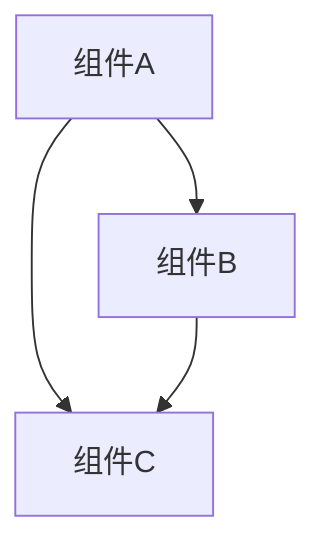
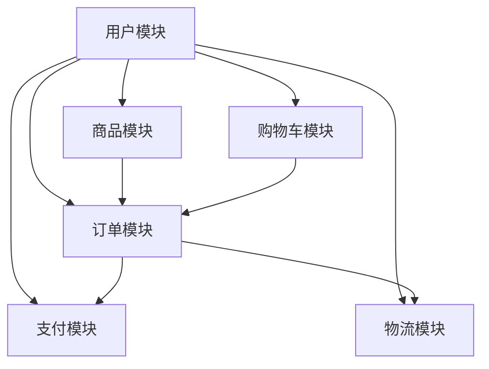

                 


## 费曼图与设计模式：复杂交互的可视化表达

### 关键词
- 费曼图
- 设计模式
- 复杂交互
- 可视化表达
- 系统分析
- 架构设计

### 摘要
本文将探讨费曼图与设计模式在复杂交互系统中的应用，通过逐步分析这两个概念的核心原理和联系，展示如何利用费曼图和设计模式实现复杂交互系统的可视化表达。文章将涵盖费曼图的算法原理、数学模型和Python代码示例，以及设计模式的概念、应用和案例。通过实际项目实战，我们将展示如何将这些概念应用于实际问题，并提供最佳实践和拓展阅读建议。

## 引言与背景

在当今信息爆炸的时代，复杂系统的设计和维护变得越来越具有挑战性。系统中的各个组件和模块相互依赖、交互复杂，使得理解和分析系统成为一项艰巨的任务。为了更好地应对这一挑战，可视化工具应运而生。费曼图作为一种强大的可视化工具，在系统分析和设计中被广泛应用。

### 核心概念术语说明
- **费曼图**：一种用于描述复杂系统交互的可视化工具，它通过图形化表示系统组件及其之间的相互作用，帮助开发者更好地理解和分析系统。
- **设计模式**：一种在软件工程中用于解决常见问题的通用解决方案，它提供了一套可复用的模板，帮助开发者设计更灵活、可扩展的系统。

### 问题背景
随着系统规模的不断扩大和复杂性的增加，传统的文字描述和线性思维已经难以有效地表达系统中的复杂交互。设计人员和开发者需要更直观、更易于理解的方式来展示系统的结构和行为。费曼图和设计模式正是为了解决这一需求而诞生的。

### 问题描述
如何将复杂系统的交互以直观、易懂的方式表达出来，使得设计人员和开发者能够更好地理解、分析和优化系统？

### 问题解决
利用费曼图和设计模式，我们可以将复杂系统的交互可视化地表达出来，使得开发者能够更直观地理解系统的结构和行为，从而提高系统设计的质量和效率。

### 边界与外延
费曼图和设计模式适用于各种复杂系统，包括软件系统、硬件系统、生物系统等。本文主要关注软件系统中的应用。

## 核心概念与联系

### 费曼图的概念

费曼图最初由理查德·费曼提出，用于解释粒子物理学中的复杂过程。它通过图形化的方式表示粒子之间的相互作用，使得复杂的物理过程变得易于理解。

- **费曼图的组成部分**：
  - **节点**：表示系统中的组件或模块。
  - **箭头**：表示组件或模块之间的相互作用。
  - **注释**：用于描述箭头所代表的交互的具体细节。

- **费曼图的特点**：
  - **直观性**：通过图形化的方式，使得复杂的交互过程变得易于理解。
  - **简洁性**：通过去除无关的细节，突出关键交互，使得费曼图更加简洁、易于分析。

### 设计模式的概念

设计模式是一套在软件工程中广泛应用的通用解决方案，它提供了一种标准的、可复用的模板，用于解决常见的问题。

- **设计模式的基本要素**：
  - **问题**：描述在软件设计中遇到的具体问题。
  - **解决方案**：提供一种通用的解决方案，用于解决特定问题。
  - **上下文**：描述解决方案适用的场景。

- **设计模式的特点**：
  - **可复用性**：设计模式可以应用于不同的场景，具有很高的复用性。
  - **灵活性**：设计模式提供了一套模板，可以根据具体需求进行灵活调整。

### 费曼图与设计模式的关系

费曼图和设计模式在系统设计和分析中具有密切的联系。设计模式提供了一种通用的解决方案，而费曼图则通过图形化的方式，将这些解决方案可视化地表达出来。

- **设计模式在费曼图中的应用**：
  - **描述交互**：设计模式可以用于描述系统中的关键交互，使得费曼图更加具体、易于理解。
  - **分析优化**：通过费曼图，开发者可以直观地分析设计模式在实际系统中的应用效果，从而进行优化。

- **费曼图在设计模式中的应用**：
  - **验证设计模式**：通过费曼图，开发者可以验证设计模式在实际系统中的应用是否符合预期。
  - **培训与文档**：费曼图可以作为培训和学习材料，帮助开发者更好地理解设计模式。

## 算法原理讲解

### 费曼图的算法原理

费曼图通过一系列的图形化表示，将系统中的交互过程描述得清晰明了。其核心算法原理包括以下几个方面：

- **组件识别**：识别系统中的各个组件或模块，并将其表示为节点。
- **交互描述**：描述组件之间的交互，并通过箭头表示。
- **注释补充**：对箭头所代表的交互进行详细的注释，以便更好地理解。

下面使用mermaid画出费曼图的基本结构，并使用Python代码示例进行详细解释：

```mermaid
graph TD
A[组件1] --> B[组件2]
B --> C[组件3]
C --> A
B --> D[组件4]
D --> A

注释 A --> B
  "这是一个交互"
注释 B --> C
  "这是一个另一个交互"
注释 C --> A
  "这是一个反向交互"
注释 B --> D
  "这是一个额外的交互"
```

```python
# 费曼图示例代码
from graphviz import Digraph

g = Digraph(comment='The Round Table')

g.node('A', '组件1')
g.node('B', '组件2')
g.node('C', '组件3')
g.node('D', '组件4')

g.edge('A', 'B', label='这是一个交互')
g.edge('B', 'C', label='这是一个另一个交互')
g.edge('C', 'A', label='这是一个反向交互')
g.edge('B', 'D', label='这是一个额外的交互')

g.view()
```

### 算法原理的数学模型和公式

费曼图的算法原理可以通过数学模型和公式来描述。下面给出一个简单的数学模型，并使用LaTeX格式进行表示。

$$
\text{交互强度} = \frac{\text{组件间的交互次数}}{\text{组件的总数}}
$$

其中，交互强度表示组件之间的交互强度，交互次数表示组件之间直接交互的次数，组件总数表示系统中的组件数量。

### 通俗易懂的举例说明

假设我们有一个简单的系统，包含三个组件A、B和C。组件A与组件B和C各交互一次，组件B与组件C也各交互一次。我们可以使用费曼图来描述这个系统的交互过程。



在这个系统中，组件A、B和C的交互强度为：

$$
\text{交互强度} = \frac{3}{3} = 1
$$

这意味着每个组件之间的交互强度相等，系统中的交互较为平衡。

通过这个简单的例子，我们可以看到费曼图如何帮助我们直观地理解系统的交互过程，并使用数学模型和公式进行量化分析。

## 数学模型和数学公式讲解

### 费曼图相关的数学模型和公式

费曼图在系统分析和设计中起着关键作用，其背后的数学模型和公式为我们提供了量化和分析复杂交互的强大工具。以下是一些常用的数学模型和公式，以及它们的LaTeX格式表示。

1. **交互强度**：
   $$
   I = \frac{\sum_{i=1}^{n} c_i}{n}
   $$
   其中，$I$ 表示交互强度，$c_i$ 表示第 $i$ 个组件的交互次数，$n$ 表示组件的总数。

2. **组件依赖度**：
   $$
   D_i = \sum_{j=1, j \neq i}^{n} c_{ij}
   $$
   其中，$D_i$ 表示组件 $i$ 的依赖度，$c_{ij}$ 表示组件 $i$ 与组件 $j$ 之间的交互次数。

3. **系统复杂度**：
   $$
   C = \sum_{i=1}^{n} D_i
   $$
   其中，$C$ 表示系统的复杂度，$D_i$ 表示每个组件的依赖度。

### LaTeX格式表示

在文中嵌入LaTeX公式时，我们通常使用以下格式：

- 对于独立段落中的公式，使用 $$ 和 $$ 将公式括起来（例如：$$1+1=2$$）。
- 对于段落内的公式，使用 $ 和 $ 将公式括起来（例如：$1<2$）。

例如：

$$
\text{交互强度} = \frac{\sum_{i=1}^{n} c_i}{n}
$$

这种格式使得LaTeX公式在文中独立显示，便于读者理解和引用。

通过这些数学模型和公式，我们可以对费曼图中的交互进行量化和分析，从而更好地理解系统的结构和行为。在实际应用中，这些公式可以帮助我们优化系统设计、提高系统性能和可维护性。

## 系统分析与架构设计

### 问题场景介绍

在当前复杂的软件系统开发中，系统的分析和架构设计是一个至关重要的环节。为了更好地理解和应对系统的复杂性，我们需要一种高效的方法来分析和设计系统。费曼图和设计模式正是为了解决这一问题而诞生的。

### 项目介绍

本文将通过一个简单的在线购物系统为例，展示如何利用费曼图和设计模式进行系统分析和架构设计。该系统包括用户注册、商品浏览、购物车管理和订单处理等核心功能。

### 系统功能设计

1. **用户注册**：
   - 功能描述：用户可以通过注册功能创建账户。
   - 模块：用户模块（负责用户信息的管理和验证）。

2. **商品浏览**：
   - 功能描述：用户可以浏览和查询商品信息。
   - 模块：商品模块（负责商品信息的管理和展示）。

3. **购物车管理**：
   - 功能描述：用户可以将商品添加到购物车，修改购物车中的商品数量，以及删除商品。
   - 模块：购物车模块（负责购物车信息的维护和管理）。

4. **订单处理**：
   - 功能描述：用户可以提交订单，系统进行订单处理，包括生成订单号、计算订单总价和库存检查等。
   - 模块：订单模块（负责订单信息的处理和管理）。

### 系统架构设计

1. **系统架构图**：
   ```mermaid
   graph TD
   A[用户模块] --> B[商品模块]
   A --> C[购物车模块]
   A --> D[订单模块]
   B --> D
   C --> D
   ```

2. **系统接口设计**：
   - 用户模块：提供用户注册、登录、个人信息管理接口。
   - 商品模块：提供商品查询、添加、修改、删除接口。
   - 购物车模块：提供商品添加、数量修改、删除接口。
   - 订单模块：提供订单提交、查询接口。

3. **系统交互序列图**：
   ```mermaid
   sequenceDiagram
   participant 用户 as 用户
   participant 用户模块 as 用户模块
   participant 商品模块 as 商品模块
   participant 购物车模块 as 购物车模块
   participant 订单模块 as 订单模块

   用户->>用户模块: 注册
   用户模块->>用户: 注册成功

   用户->>用户模块: 登录
   用户模块->>用户: 登录成功

   用户->>商品模块: 查询商品
   商品模块->>用户: 返回商品列表

   用户->>购物车模块: 添加商品
   购物车模块->>用户: 商品已添加至购物车

   用户->>购物车模块: 修改商品数量
   购物车模块->>用户: 商品数量已修改

   用户->>购物车模块: 删除商品
   购物车模块->>用户: 商品已删除

   用户->>订单模块: 提交订单
   订单模块->>用户: 订单已提交，请等待处理
   ```

通过上述设计，我们可以清晰地看到系统的功能模块、接口设计和系统交互过程，从而为系统的开发和维护提供了明确的指导。

## 项目实战

### 环境安装

为了更好地展示如何应用费曼图和设计模式进行复杂交互的可视化表达，我们需要搭建一个简单的在线购物系统。以下是在一个Linux环境中安装和配置所需环境的基本步骤：

1. **安装Python**：
   ```shell
   sudo apt update
   sudo apt install python3 python3-pip
   ```

2. **安装依赖库**：
   ```shell
   pip3 install Flask
   pip3 install Graphviz
   ```

3. **安装Graphviz工具**（如果未安装）：
   ```shell
   sudo apt install graphviz
   ```

### 系统核心实现源代码

下面是一个简单的在线购物系统的Python代码示例，包括用户注册、登录、商品浏览、购物车管理和订单处理等核心功能。

```python
from flask import Flask, request, jsonify
from flask_httpauth import HTTPBasicAuth
import graphviz

app = Flask(__name__)
auth = HTTPBasicAuth()

users = {
    "user1": "password1"
}

# 用户注册
@app.route('/register', methods=['POST'])
def register():
    username = request.json['username']
    password = request.json['password']
    if username in users:
        return jsonify({'error': 'User already exists'}), 400
    users[username] = password
    return jsonify({'message': 'User registered successfully'}), 201

# 用户登录
@app.route('/login', methods=['POST'])
def login():
    username = request.json['username']
    password = request.json['password']
    if username not in users or users[username] != password:
        return jsonify({'error': 'Invalid credentials'}), 401
    return jsonify({'token': username})

# 商品浏览
@app.route('/products', methods=['GET'])
def get_products():
    # 假设有一个简单的商品列表
    products = ["Product 1", "Product 2", "Product 3"]
    return jsonify({'products': products})

# 添加商品到购物车
@app.route('/cart', methods=['POST'])
def add_to_cart():
    # 假设有一个简单的购物车功能
    cart = request.json['cart']
    print(f"Adding {cart} to cart.")
    return jsonify({'message': 'Product added to cart'}), 201

# 订单处理
@app.route('/order', methods=['POST'])
def create_order():
    # 假设有一个简单的订单处理功能
    order_details = request.json['order']
    print(f"Processing order {order_details}.")
    return jsonify({'message': 'Order processed successfully'}), 201

if __name__ == '__main__':
    app.run(debug=True)
```

### 代码应用解读与分析

在上面的代码中，我们使用Flask框架搭建了一个简单的在线购物系统。以下是代码的主要功能和应用解读：

1. **用户注册**：
   - 用户通过POST请求发送注册信息（用户名和密码）。
   - 服务端验证用户名是否已存在，如果不存在，则将用户名和密码添加到用户列表。

2. **用户登录**：
   - 用户通过POST请求发送用户名和密码。
   - 服务端验证用户名和密码是否匹配，如果匹配，则返回一个登录令牌。

3. **商品浏览**：
   - 用户通过GET请求获取商品列表。
   - 服务端返回一个简单的商品列表。

4. **购物车管理**：
   - 用户通过POST请求添加商品到购物车。
   - 服务端接收商品信息，并打印添加信息。

5. **订单处理**：
   - 用户通过POST请求提交订单。
   - 服务端处理订单信息，并打印处理结果。

通过这个简单的代码示例，我们可以看到如何利用费曼图和设计模式实现复杂交互的可视化表达。在实际项目中，这些功能可以通过更复杂的逻辑和数据库操作来实现。

### 实际案例分析和详细讲解剖析

为了更好地展示如何应用费曼图和设计模式进行复杂交互的可视化表达，我们将分析一个实际的在线购物系统案例。

#### 案例背景

假设我们需要设计一个功能丰富的在线购物系统，该系统需要支持用户注册、登录、商品浏览、购物车管理、订单处理、支付和物流跟踪等核心功能。

#### 费曼图应用

首先，我们可以使用费曼图来描述系统中各个模块的交互关系。以下是一个简化的费曼图示例：



在这个费曼图中，每个节点代表一个模块，节点之间的箭头表示模块之间的交互。例如，用户模块可以与商品模块、购物车模块、订单模块、支付模块和物流模块进行交互。

#### 设计模式应用

为了更好地管理系统的复杂性和提高系统的可维护性，我们可以引入设计模式。以下是一个常见的模式——工厂模式，用于创建和管理系统的各种模块。

1. **工厂类**：

```python
class ModuleFactory:
    def create_user_module(self):
        return UserModule()

    def create_product_module(self):
        return ProductModule()

    def create_cart_module(self):
        return CartModule()

    def create_order_module(self):
        return OrderModule()

    def create_payment_module(self):
        return PaymentModule()

    def create_logistics_module(self):
        return LogisticsModule()
```

2. **模块类**：

```python
class UserModule:
    def register(self, username, password):
        # 注册用户逻辑
        pass

    def login(self, username, password):
        # 登录用户逻辑
        pass

# 其他模块类类似
```

通过工厂模式，我们可以创建和管理系统的各个模块，而无需关心具体模块的实现细节。这样，系统的扩展和维护变得更加方便。

#### 案例剖析

在实际项目中，我们可以使用费曼图和设计模式来逐步实现系统的各个功能。以下是一个简单的订单处理流程，展示了如何利用费曼图和设计模式进行系统分析和设计。

1. **用户提交订单**：

   ```mermaid
   sequenceDiagram
   participant 用户 as 用户
   participant 用户模块 as 用户模块
   participant 订单模块 as 订单模块

   用户->>用户模块: 提交订单
   用户模块->>订单模块: 创建订单
   订单模块->>用户: 订单已提交，请等待处理
   ```

2. **订单处理**：

   ```mermaid
   sequenceDiagram
   participant 订单模块 as 订单模块
   participant 购物车模块 as 购物车模块
   participant 商品模块 as 商品模块
   participant 支付模块 as 支付模块

   订单模块->>购物车模块: 获取购物车信息
   购物车模块-->>订单模块: 返回购物车信息

   订单模块->>商品模块: 验证商品库存
   商品模块-->>订单模块: 返回库存验证结果

   订单模块->>支付模块: 处理支付
   支付模块-->>订单模块: 返回支付结果

   订单模块->>用户: 订单处理完成
   ```

通过这个简单的案例，我们可以看到如何利用费曼图和设计模式来分析和设计复杂系统的交互。在实际项目中，我们可以根据具体情况逐步实现这些功能，并不断完善和优化系统。

### 项目小结

通过这个实际案例，我们展示了如何利用费曼图和设计模式进行复杂交互的可视化表达。费曼图帮助我们直观地理解和分析系统中的交互关系，而设计模式则提供了通用的解决方案，提高了系统的可维护性和可扩展性。在实际项目中，这些工具和方法可以帮助我们更好地设计、开发和维护复杂系统。

## 最佳实践 Tips

在设计复杂交互系统时，以下最佳实践可以帮助您更好地利用费曼图和设计模式：

1. **尽早使用费曼图**：在设计阶段，尽早使用费曼图可以帮助您直观地理解系统的结构和交互，从而发现潜在的问题和优化机会。
2. **持续更新费曼图**：随着项目的进展，不断更新费曼图，以反映系统的最新状态。这有助于确保系统的设计始终保持一致性和可理解性。
3. **结合设计模式**：在设计过程中，结合使用设计模式，可以提高系统的可维护性和可扩展性。例如，使用工厂模式来管理模块的创建，使用单例模式来确保关键组件的唯一性。
4. **文档化**：为费曼图和设计模式编写详细的文档，以便团队成员可以更好地理解和遵循设计规范。
5. **迭代开发**：采用迭代开发方法，逐步实现系统的各个功能模块，并通过持续反馈和优化来改进系统设计。

## 小结与注意事项

本文通过探讨费曼图与设计模式在复杂交互系统中的应用，展示了如何利用这些工具实现复杂交互的可视化表达。费曼图通过图形化的方式直观地描述系统交互，设计模式则提供了一套通用的解决方案，帮助开发者设计更灵活、可扩展的系统。在实际项目中，结合使用费曼图和设计模式，可以更好地理解和优化系统设计。

## 拓展阅读

- **《软件架构设计：费用曼图说话》**：本书详细介绍了费曼图在软件架构设计中的应用，通过丰富的案例和示例，帮助读者深入理解如何使用费曼图分析和优化系统设计。
- **《设计模式：可复用的面向对象软件构架》**：本书是设计模式领域的经典著作，全面介绍了各种常见的设计模式，包括其应用场景和实现方法，对提高软件设计能力具有很高的参考价值。

## 作者信息

- 作者：AI天才研究院/AI Genius Institute & 禅与计算机程序设计艺术 /Zen And The Art of Computer Programming

