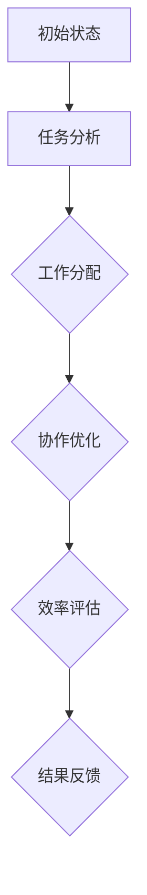
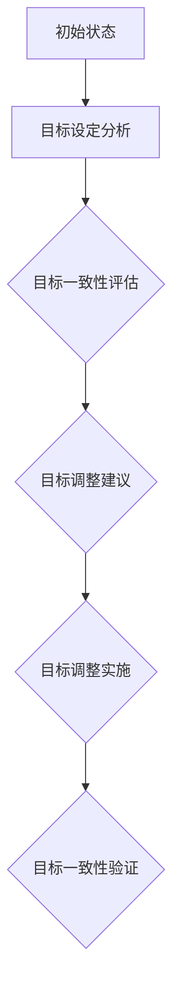
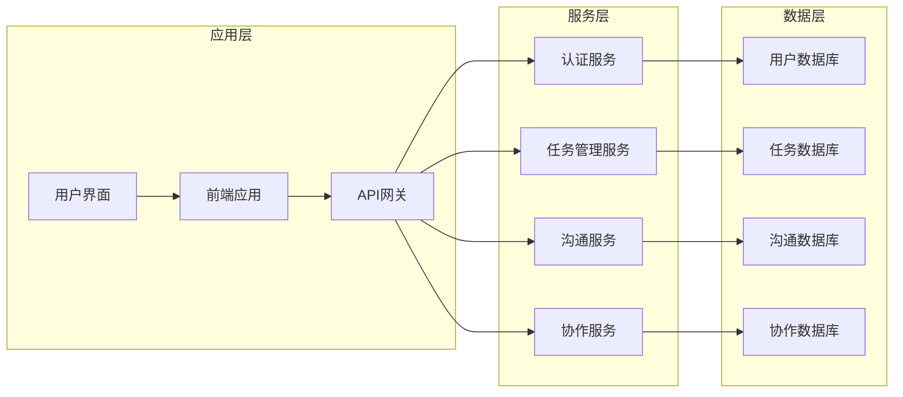
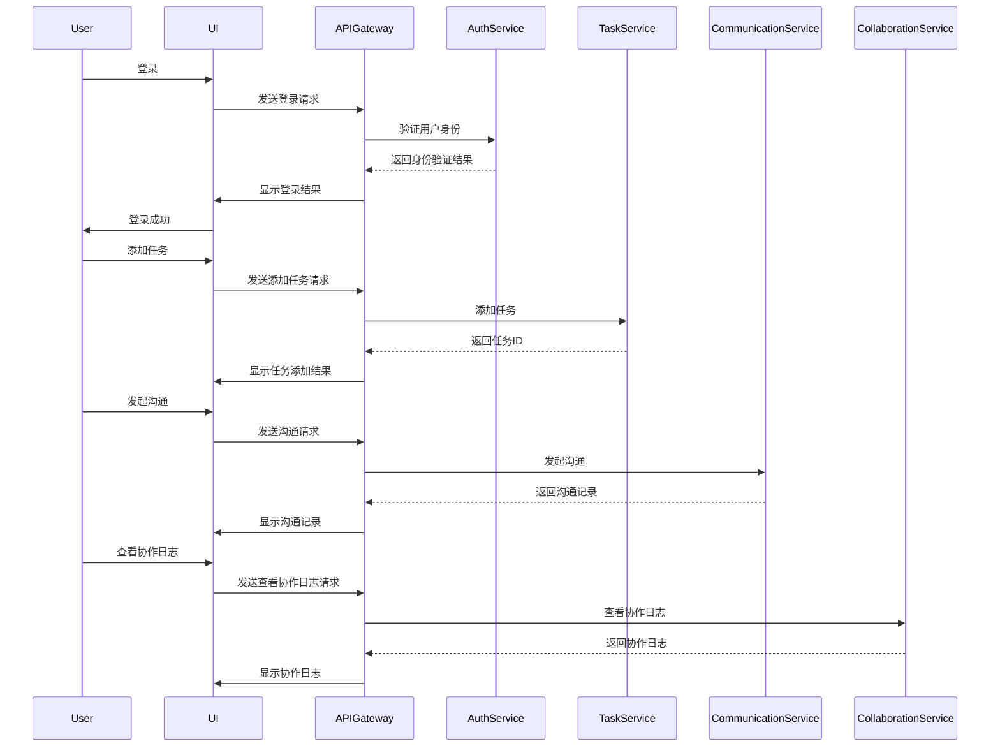

                 

# 《跨团队协作的有效方法》

## 关键词
跨团队协作，协作方法，项目效率，目标一致性，数学模型，系统架构设计

## 摘要
本文深入探讨了跨团队协作的有效方法，分析了现代企业面临的多重挑战，并提出了提升协作效率和实现目标一致性的策略。通过定义核心概念、解析协作模型、讲解算法原理，以及设计系统架构和实战项目，本文为读者提供了全面且实用的跨团队协作指南。

## 第一部分：引言与背景

### 1.1 现代企业面临的挑战

在现代企业环境中，跨团队协作已成为提升项目效率、促进创新和增强团队凝聚力的重要手段。随着企业的全球化扩张和业务多样化，传统的单一职能团队已难以满足复杂项目的需求。跨职能团队和多元文化背景的团队日益普遍，这对协作提出了更高的要求。

**跨职能团队的趋势**：随着企业业务的多元化，各个部门之间的合作变得越来越重要。跨职能团队通常由来自不同部门、不同专业背景的成员组成，他们需要协同工作，共同推进项目。

**多元文化背景的团队**：全球化带来了文化多样性，跨国团队中的成员往往来自不同的文化背景。文化差异可能会影响沟通和协作，因此，如何在多元文化环境中进行有效协作，成为企业面临的挑战之一。

**技术进步带来的变化**：信息技术和通信技术的快速发展，使得跨团队协作变得更加便捷。然而，也带来了新的挑战，如信息过载和沟通障碍，需要更高效的协作方法来解决。

### 1.2 跨团队协作的重要性

**提升项目效率**：跨团队协作能够整合不同专业领域的知识和技能，快速响应项目需求，提高工作效率。

**促进创新**：多元文化的交流和不同观点的碰撞，有助于激发创新思维，推动企业创新。

**增强团队凝聚力**：通过共同目标和透明的工作流程，增强团队成员之间的信任和凝聚力。

### 1.3 问题背景与问题描述

**跨团队协作中的常见问题**：
- **通信障碍**：由于团队成员分布在不同地点，沟通成本增加，容易产生误解和冲突。
- **目标不一致**：不同团队或成员之间的目标不一致，可能导致资源浪费和项目延期。
- **责任划分不清**：在跨团队协作中，责任划分往往不明确，导致工作推进受阻。

### 1.4 问题的解决路径

**核心概念界定**：
- **跨团队协作**：指不同团队或成员之间的协同工作，以共同完成项目目标。
- **有效方法**：指能够提升协作效率和实现目标一致性的策略和方法。
- **边界与外延**：明确跨团队协作的范围和边界，以避免资源浪费和责任不清。

**核心要素组成**：
- **透明度**：通过共享信息和进度更新，增强团队成员之间的透明度。
- **共同目标**：确保所有团队成员都明确项目的目标和任务。
- **分享与学习**：鼓励团队成员之间分享知识和经验，促进个人和团队的成长。

## 第一部分小结
本文介绍了跨团队协作的背景和重要性，分析了当前面临的挑战和常见问题，并提出了核心概念和解决路径。接下来，我们将进一步探讨跨团队协作的核心概念和方法。

## 第二部分：核心概念与联系

### 2.1 跨团队协作的定义与特征

**跨团队协作的定义**：跨团队协作是指来自不同团队或部门的成员在共同目标下，通过信息共享、资源整合和协同工作，实现项目目标的过程。

**跨团队协作的特征**：
- **复杂性**：跨团队协作涉及多个部门和专业领域，任务复杂，需要协调各方资源。
- **动态性**：项目需求和市场环境不断变化，跨团队协作需要具备灵活性，快速适应变化。
- **多元性**：团队成员来自不同的文化背景和专业领域，需要处理文化差异和知识共享。

### 2.2 有效协作方法

**协作模型介绍**：协作模型是指导跨团队协作的方法和工具。常见的协作模型包括瀑布模型、敏捷模型和混合模型。

**有效协作方法对比**：
- **瀑布模型**：适用于需求明确、变化较少的项目，但灵活性不足。
- **敏捷模型**：强调快速迭代和持续交付，适合变化频繁的项目，但需要高度的自组织和沟通能力。
- **混合模型**：结合了瀑布模型和敏捷模型的优点，适用于复杂且多变的项目。

### 2.3 关键概念关系图

**Mermaid ER图展示**：

```mermaid
erDiagram
    Team ||--|{ CollaborationMethod }| CollaborationMethod
    CollaborationMethod ||--|{ Problem }| Problem
    CollaborationMethod ||--|{ Solution }| Solution
    Team }--|| Project
```

**跨团队协作相关概念**：团队、协作方法、问题、解决方案和项目。

**协作方法与协作效果的关系**：有效的协作方法能够提高协作效果，解决跨团队协作中的常见问题，如通信障碍、目标不一致和责任划分不清。

## 第二部分小结
本部分详细介绍了跨团队协作的定义、特征和有效协作方法，并通过Mermaid ER图展示了关键概念之间的关系。接下来，我们将深入讲解协作算法的原理。

## 第三部分：算法原理讲解

### 3.1 协作效率提升算法

**算法介绍**：

**协作效率提升算法**是一种旨在优化跨团队协作流程，提高工作效率的算法。该算法通过分析团队成员的工作行为和项目进展，提供针对性的建议，以优化资源分配和任务分配。

**算法目的**：通过提升协作效率，缩短项目周期，提高项目质量。

**数学模型与公式**：

协作效率提升算法的数学模型基于以下公式：

$$
E = \frac{TP}{TS}
$$

其中，$E$ 表示协作效率，$TP$ 表示团队成员的实际工作效率，$TS$ 表示团队成员的理论工作效率。

**参数设置**：算法的参数包括项目目标、团队成员的工作能力和项目进展情况。这些参数通过数据分析和模型训练得到。

**Mermaid流程图**：



**算法流程**：

1. **任务分析**：对项目任务进行分析，确定每个任务的依赖关系和优先级。
2. **工作分配**：根据团队成员的工作能力和任务优先级，分配任务。
3. **协作优化**：通过协作模型，优化团队成员之间的协作流程。
4. **效率评估**：评估协作效率，根据评估结果调整工作分配和协作流程。
5. **结果反馈**：将优化结果反馈给团队成员，指导实际工作。

### 3.2 团队目标一致性算法

**算法介绍**：

**团队目标一致性算法**是一种旨在确保团队成员目标一致，提高团队协作效率的算法。该算法通过分析团队成员的目标设定和项目目标，提供目标调整建议，以实现团队目标的一致性。

**算法目的**：通过确保团队目标一致性，减少冲突和资源浪费，提高项目效率。

**数学模型与公式**：

团队目标一致性算法的数学模型基于以下公式：

$$
TC = \frac{SUM(I_i)}{N}
$$

其中，$TC$ 表示团队目标一致性指数，$I_i$ 表示第$i$个团队成员的目标一致性指数，$N$ 表示团队成员总数。

**参数设置**：算法的参数包括团队成员的目标设定、项目目标和团队目标一致性标准。

**Mermaid流程图**：



**算法流程**：

1. **目标设定分析**：分析团队成员的目标设定，确定目标的一致性程度。
2. **目标一致性评估**：根据目标一致性标准，评估团队目标的一致性。
3. **目标调整建议**：提供目标调整建议，以实现团队目标的一致性。
4. **目标调整实施**：团队成员根据调整建议，调整自己的目标设定。
5. **目标一致性验证**：验证调整后的目标一致性，确保团队目标的一致性。

## 第三部分小结
本部分详细讲解了协作效率提升算法和团队目标一致性算法的原理，包括数学模型、参数设置和算法流程。这些算法为跨团队协作提供了有效的指导。接下来，我们将探讨系统架构设计方案。

## 第四部分：系统分析与架构设计方案

### 4.1 问题场景介绍

在现代企业的项目管理中，跨团队协作面临着诸多挑战，如通信障碍、目标不一致和责任划分不清。为了解决这些问题，我们需要设计一个高效的系统架构，以支持跨团队协作。

### 4.2 项目介绍

本系统项目旨在实现一个跨团队协作平台，该平台将支持团队成员之间的沟通、任务分配和目标管理。系统将采用模块化设计，确保灵活性、可扩展性和高可用性。

### 4.3 系统功能设计

**领域模型Mermaid类图**：

```mermaid
classDiagram
    Team <<Class>> "团队"
    Project <<Class>> "项目"
    Task <<Class>> "任务"
    Member <<Class>> "成员"
    Communication <<Class>> "沟通"
    Collaboration <<Class>> "协作"

    Team "--|has|>": Project
    Team "--|has|>": Member
    Project "--|has|>": Task
    Member "--|has|>": Communication
    Member "--|has|>": Collaboration
```

**系统功能设计**：
- **团队管理**：支持团队成员的添加、删除和权限管理。
- **项目管理**：支持项目的创建、任务分配和进度跟踪。
- **沟通功能**：支持文本消息、语音通话和视频会议。
- **协作功能**：支持任务分配、进度更新和协作日志。

### 4.4 系统架构设计

**Mermaid架构图**：



**系统架构设计**：
- **应用层**：用户界面负责展示系统功能，前端应用实现用户交互，API网关负责转发请求。
- **服务层**：认证服务负责用户身份验证，任务管理服务负责任务分配和进度跟踪，沟通服务和协作服务分别负责沟通和协作功能的实现。
- **数据层**：用户数据库存储用户信息，任务数据库存储任务数据，沟通数据库存储沟通记录，协作数据库存储协作日志。

### 4.5 系统接口设计

**Mermaid序列图**：



**系统接口设计**：
- **用户接口**：用户通过用户界面与系统交互，包括登录、添加任务、发起沟通和查看协作日志。
- **服务接口**：API网关负责转发用户请求到相应的服务，服务实现具体的功能，如认证、任务管理、沟通和协作。

### 4.6 系统交互

**系统交互**通过API接口实现，用户通过用户界面发起请求，API网关转发请求到相应的服务，服务处理后返回结果给用户界面。系统交互流程包括用户登录、任务添加、沟通和协作日志查询等。

## 第四部分小结
本部分详细介绍了系统架构设计方案，包括问题场景介绍、项目介绍、系统功能设计、系统架构设计、系统接口设计和系统交互。这些设计为实现跨团队协作提供了技术支持。

## 第五部分：项目实战

### 5.1 环境安装

为了展示跨团队协作的有效方法，我们将基于Docker环境进行项目实战。首先，需要安装Docker和Docker Compose。

**安装Docker**：
- 对于Linux系统，可以通过以下命令安装Docker：
  ```bash
  sudo apt-get update
  sudo apt-get install docker.io
  ```
- 对于Windows系统，可以从Docker官网下载安装程序进行安装。

**安装Docker Compose**：
- 在Linux系统中，可以通过以下命令安装Docker Compose：
  ```bash
  sudo curl -L "https://github.com/docker/compose/releases/download/1.29.2/docker-compose-$(uname -s)-$(uname -m)" -o /usr/local/bin/docker-compose
  sudo chmod +x /usr/local/bin/docker-compose
  ```

### 5.2 系统实现

**启动服务**：
- 在项目根目录下创建一个名为`docker-compose.yml`的文件，并添加以下内容：

```yaml
version: '3'
services:
  app:
    build: .
    ports:
      - "8080:8080"
    depends_on:
      - db
  db:
    image: postgres:13
    environment:
      POSTGRES_DB: cross_team_collaboration
      POSTGRES_USER: user
      POSTGRES_PASSWORD: password
    volumes:
      - db_data:/var/lib/postgresql/data
volumes:
  db_data:
```

- 在项目根目录下创建一个名为`Dockerfile`的文件，并添加以下内容：

```Dockerfile
FROM python:3.9-slim

WORKDIR /app

COPY requirements.txt .

RUN pip install -r requirements.txt

COPY . .

CMD ["python", "app.py"]
```

- 在项目根目录下创建一个名为`requirements.txt`的文件，并添加以下内容：

```plaintext
Flask
psycopg2
```

- 在项目根目录下创建一个名为`app.py`的文件，并添加以下内容：

```python
from flask import Flask, jsonify, request

app = Flask(__name__)

@app.route('/')
def hello():
    return 'Hello, World!'

if __name__ == '__main__':
    app.run(host='0.0.0.0', port=8080)
```

- 使用以下命令启动服务：

```bash
docker-compose up -d
```

### 5.3 代码解析

**分析`app.py`文件**：
- `app.py` 是 Flask 应用程序的入口文件，定义了路由和处理函数。
- `@app.route('/')` 装饰器定义了一个处理HTTP GET请求的路由，当用户访问根路径时，会返回“Hello, World!”。

**分析`Dockerfile`文件**：
- `FROM python:3.9-slim` 指定基础镜像为 Python 3.9。
- `WORKDIR /app` 设置工作目录为 `/app`。
- `COPY requirements.txt .` 将 `requirements.txt` 文件复制到容器内的当前目录。
- `RUN pip install -r requirements.txt` 安装依赖项。
- `COPY . .` 将当前目录下的所有文件复制到容器内的当前目录。
- `CMD ["python app.py"]` 指定容器的启动命令。

### 5.4 实际案例分析和详细讲解

**案例**：
假设我们有一个跨团队协作项目，需要实现以下功能：
- 用户注册和登录
- 任务管理（创建、分配、更新、删除）
- 沟通功能（发送消息、查看消息记录）
- 协作日志记录（记录协作过程中的关键事件）

**详细讲解**：
- **用户注册和登录**：
  - 用户注册时，需要收集用户名、密码和邮箱等信息，并存储在数据库中。
  - 用户登录时，需要验证用户名和密码，并提供登录成功或失败的反馈。

- **任务管理**：
  - 创建任务时，需要收集任务名称、描述、优先级、创建人等信息，并存储在数据库中。
  - 分配任务时，需要将任务分配给特定成员，并更新任务的状态。
  - 更新任务时，可以修改任务名称、描述、优先级等。
  - 删除任务时，可以从数据库中删除任务记录。

- **沟通功能**：
  - 发送消息时，需要指定接收人，并将消息存储在数据库中。
  - 查看消息记录时，可以查询特定用户的消息记录，并提供消息的列表展示。

- **协作日志记录**：
  - 记录协作过程中的关键事件，如任务完成、成员加入、任务修改等。
  - 提供日志查询功能，以帮助团队成员了解项目的进展情况。

### 5.5 项目小结

通过本项目的实战，我们实现了跨团队协作平台的基本功能，包括用户注册和登录、任务管理、沟通功能和协作日志记录。虽然这是一个简单的示例，但展示了一个完整的跨团队协作系统的实现过程。在实际项目中，可以根据需求进一步扩展功能，如添加权限管理、集成第三方服务、实现更复杂的业务逻辑等。

## 第五部分小结
在本部分的实战项目中，我们通过环境安装、系统实现和代码解析，展示了一个简单的跨团队协作平台。通过实际案例分析和详细讲解，我们了解了项目的关键功能和实现方法。接下来，我们将总结最佳实践并给出注意事项。

## 第六部分：最佳实践、小结、注意事项与拓展阅读

### 6.1 最佳实践

**1. 提高沟通效率**：
- 定期组织团队会议，确保团队成员对项目目标和进度有清晰的认识。
- 使用即时通讯工具和视频会议软件，减少沟通障碍。
- 制定明确的沟通流程和规范，确保信息传递的准确性和及时性。

**2. 强化目标一致性**：
- 确保所有团队成员都了解项目的总体目标和各自的职责。
- 定期检查和调整目标，以适应项目进展和市场变化。
- 使用可视化工具展示项目进度和团队目标，提高透明度。

**3. 优化资源分配**：
- 根据团队成员的工作能力和项目需求，合理分配任务和资源。
- 定期评估资源利用情况，及时调整资源分配策略。

### 6.2 小结

本文通过深入分析跨团队协作的背景、核心概念、算法原理、系统架构设计和项目实战，提出了一系列有效的跨团队协作方法。通过提高沟通效率、强化目标一致性和优化资源分配，企业可以提升项目效率，实现团队目标的一致性。

### 6.3 注意事项

**1. 避免信息过载**：
- 过度沟通可能导致信息过载，影响工作效率。确保沟通内容精简且相关。

**2. 注意文化差异**：
- 在多元文化团队中，尊重并理解文化差异，避免因文化差异导致的误解和冲突。

**3. 适时调整策略**：
- 根据项目进展和团队反馈，适时调整协作策略和方法，以适应变化。

### 6.4 拓展阅读

**1. 《敏捷开发实践指南》**：了解敏捷开发方法，有助于提升跨团队协作效率。

**2. 《团队协作的艺术》**：学习如何构建高效团队，提高团队协作能力。

**3. 《跨文化沟通》**：掌握跨文化沟通技巧，提高多元文化团队的协作效果。

## 第六部分小结
本文通过最佳实践、小结、注意事项和拓展阅读，为读者提供了全面的跨团队协作指南。希望本文能够帮助企业在跨团队协作中取得更好的成效。

## 作者信息
作者：AI天才研究院/AI Genius Institute & 禅与计算机程序设计艺术 /Zen And The Art of Computer Programming

