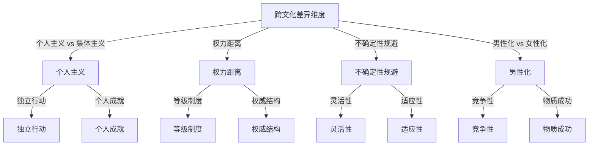
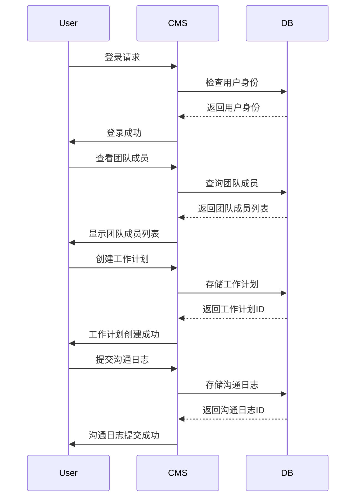

                 

Certainly! Let's structure our thought process and break down the content for the blog post "跨文化团队管理：在全球化背景下的领导艺术" into manageable steps.

### Step 1: Introduction and Background
- **Opening Statement**: Introduce the topic of cross-cultural team management in the context of globalization.
- **Globalization Trends**: Discuss the driving forces and impact of globalization on the workplace.
- **Importance of Cross-Cultural Management**: Explain why managing cross-cultural teams is crucial for organizational success.

### Step 2: Core Concepts of Cross-Cultural Teams
- **Definition of Culture**: Define what culture is and its types.
- **Dimensions of Cultural Differences**: Discuss various dimensions of cultural differences and their impact on team dynamics.
- **Cultural Adaptation Strategies**: Explore strategies for individuals and organizations to adapt to different cultural contexts.

### Step 3: Leadership in Cross-Cultural Teams
- **Characteristics of Cross-Cultural Leadership**: Discuss the unique qualities required for effective cross-cultural leadership.
- **Leadership Styles**: Analyze how different leadership styles can be adapted to cross-cultural environments.
- **Developing Cross-Cultural Leadership**: Offer methods and practices for developing leadership skills in a cross-cultural context.

### Step 4: Communication Skills for Cross-Cultural Teams
- **Communication Barriers**: Identify common barriers to effective communication in cross-cultural teams and strategies to overcome them.
- **Cross-Cultural Communication Strategies**: Provide practical tips and strategies for improving communication across cultural lines.
- **Nonverbal Communication**: Discuss the role of nonverbal communication in cross-cultural teams and how to effectively use it.

### Step 5: Team Building in Cross-Cultural Teams
- **Core Team Building Elements**: Outline the key components necessary for building an effective team.
- **Building Trust and Consensus**: Discuss how to foster trust and achieve consensus in a multicultural team.
- **Managing Cultural Conflicts**: Explore methods for managing and resolving cultural conflicts within a team.

### Step 6: Case Studies of Global Organizations
- **Case Study Background**: Introduce a case study of a global organization with a multicultural team.
- **Case Analysis**: Analyze the successes and challenges of the organization's approach to managing its cross-cultural team.
- **Lessons and Summary**: Draw insights and summarize the key takeaways from the case study.

### Step 7: Strategies and Tools for Cross-Cultural Management
- **Strategy Development Principles**: Discuss the principles for developing effective cross-cultural management strategies.
- **Common Tools and Methods**: Introduce tools and methods that can be used to facilitate cross-cultural management.
- **Management Practices and Optimization**: Explore practical ways to implement and optimize cross-cultural management strategies.

### Step 8: Future Trends in Cross-Cultural Management
- **Emerging Technologies**: Discuss how new technologies are shaping the future of cross-cultural management.
- **New Challenges**: Identify the new challenges that global teams are likely to face.
- **Future Prospects**: Offer a forward-looking perspective on the future of cross-cultural management.

### Step 9: Best Practices in Cross-Cultural Management
- **Successful Case Studies**: Share examples of successful cross-cultural management practices.
- **Failure Case Analysis**: Analyze common pitfalls and failures in cross-cultural management.
- **Summary and Outlook**: Provide a summary of the best practices and look forward to future trends.

### Step 10: Conclusion and Outlook
- **Importance of Cross-Cultural Management**: Reiterate the importance of effective cross-cultural management.
- **Future Outlook**: Offer insights into the future development of cross-cultural management.

### Step 11: Appendices
- **Appendix A: Resources for Cross-Cultural Management**: Provide a list of references, tools, and recommended resources.
- **Appendix B: Cultural Connection and Relationship Diagrams**: Include diagrams illustrating cultural dimensions and adaptation strategies.
- **Appendix C: Code Examples and Explanations**: Provide practical code examples and detailed explanations for readers to understand.

### Step 12: Closing
- **Author's Note**: Conclude the article with a closing thought on the importance of cross-cultural management and its future prospects.

By following these steps, we can ensure that our blog post is well-structured, informative, and engaging, providing readers with a comprehensive guide to cross-cultural team management in the global context.```markdown
### Step 1: Introduction and Background

**Opening Statement**
"Amid the accelerating pace of globalization, managing diverse teams that span cultures has become not just a strategic advantage but a fundamental necessity for modern organizations. The complexities of operating in a global market demand a nuanced approach to leadership and management that transcends traditional boundaries. In this blog post, we delve into the art of cross-cultural team management, exploring the intricacies of leading and communicating within multicultural environments. Let’s think step by step to uncover the best practices and strategies that can transform your team into a powerhouse of innovation and collaboration."

**Globalization Trends**
"Globalization has redefined the landscape of business, breaking down barriers and creating unprecedented opportunities for collaboration and growth. Driven by technological advancements, economic interdependence, and the increasing mobility of talent, globalization has necessitated a shift in how teams are managed. Organizations are now more likely to have team members from different cultural backgrounds, each bringing unique perspectives and skills to the table. This shift brings with it both challenges and opportunities, requiring managers to develop new competencies in cross-cultural leadership."

**Importance of Cross-Cultural Management**
"Effective cross-cultural management is crucial for several reasons. It enhances team cohesion and productivity by fostering mutual respect and understanding. It also promotes innovation by encouraging diverse viewpoints and problem-solving approaches. Furthermore, it can lead to better decision-making and more inclusive leadership. In this section, we will explore the key concepts of cross-cultural management and how they can be applied to drive organizational success in a globalized world."

----------------------------------------------------------------

### Step 2: Core Concepts of Cross-Cultural Teams

**Definition of Culture**
"Culture is a complex system of shared beliefs, values, behaviors, and symbols that shape the way individuals within a group think, feel, and act. It encompasses both visible aspects, such as language and customs, and invisible dimensions, including attitudes and worldviews. Understanding the nuances of culture is essential for effective cross-cultural team management. Different cultures prioritize different values, which can affect how team members perceive and respond to various situations."

**Dimensions of Cultural Differences**
"There are several dimensions through which cultural differences can be analyzed, each impacting team dynamics in unique ways. Key dimensions include:
- **Individualism vs. Collectivism**: Individualistic cultures emphasize personal achievements and independence, while collectivist cultures prioritize group cohesion and interdependence.
- **Power Distance**: Cultures with high power distance tend to have significant hierarchical structures, while those with low power distance are more egalitarian.
- **Uncertainty Avoidance**: Cultures that have a high tolerance for uncertainty are more flexible and adaptable, while those with low tolerance for uncertainty prefer structured and predictable environments.
- **Masculinity vs. Femininity**: Masculine cultures focus on competition, achievement, and material success, while feminine cultures emphasize cooperation, quality of life, and nurturance."
**Cultural Adaptation Strategies**
"To thrive in a cross-cultural environment, individuals and organizations must adopt strategies that facilitate cultural adaptation. These strategies include:
- **Cognitive Adjustment**: Recognizing and understanding cultural differences to reframe situations from a new perspective.
- **Behavioral Adjustment**: Modifying behaviors to be more in line with the cultural norms of the new environment.
- **Organizational Culture Fusion**: Creating a blended organizational culture that incorporates the best elements of each team member's background."

----------------------------------------------------------------

### Step 3: Leadership in Cross-Cultural Teams

**Characteristics of Cross-Cultural Leadership**
"Cross-cultural leadership requires a set of unique qualities to navigate the complexities of diverse teams. These include:
- **Adaptability**: The ability to adjust leadership styles and approaches based on the cultural context.
- **Cultural Sensitivity**: Understanding and respecting the cultural backgrounds of team members.
- **Communication Skills**: Effective communication across languages and cultural barriers.
- **Empathy**: The ability to understand and share the feelings of team members from different cultures."
**Leadership Styles**
"Leadership styles must be adaptable to the specific cultural context. For example:
- **Authentic Leadership**: Encourages honesty and transparency, which are highly valued in many cultures.
- **Servant Leadership**: Focuses on supporting and empowering team members, which resonates well in collectivist cultures.
- **Transformational Leadership**: Inspires and motivates team members to achieve their full potential, often effective in diverse teams."

**Developing Cross-Cultural Leadership**
"Developing cross-cultural leadership skills requires a multi-faceted approach:
- **Education and Training**: Providing leaders with resources and training on cultural awareness and cross-cultural communication.
- **Experience**: Encouraging leaders to work in diverse cultural environments to gain hands-on experience.
- **Simulation Exercises**: Using simulations to practice leadership in cross-cultural scenarios and receive feedback."

----------------------------------------------------------------

### Step 4: Communication Skills for Cross-Cultural Teams

**Communication Barriers**
"Effective communication is often hindered by cultural barriers, such as:
- **Language Differences**: Different languages and dialects can lead to misunderstandings and miscommunications.
- **Nonverbal Communication**: Subtle differences in body language, facial expressions, and gestures can be misinterpreted.
- **Cultural Assumptions**: Preconceived notions about behavior and communication styles can lead to assumptions that are not always accurate."
**Cross-Cultural Communication Strategies**
"To improve cross-cultural communication, consider these strategies:
- **Active Listening**: Paying close attention to what is being said and the underlying messages.
- **Clear and Concise Messages**: Being straightforward and avoiding jargon that may be unfamiliar to others.
- **Check for Understanding**: Summarizing key points and asking for confirmation to ensure that the message is understood correctly."
**Nonverbal Communication in Cross-Cultural Teams**
"Nonverbal communication can significantly impact cross-cultural interactions:
- **Body Language**: Different cultures may interpret body language differently. For example, eye contact can be a sign of respect in some cultures but seen as confrontational in others.
- **Personal Space**: Cultures have different perceptions of personal space, affecting physical interactions and personal boundaries.
- **Touch**: Different cultures have varying norms regarding physical touch, which can lead to discomfort if not respected."

----------------------------------------------------------------

### Step 5: Team Building in Cross-Cultural Teams

**Core Team Building Elements**
"Building a cohesive cross-cultural team requires focusing on several key elements:
- **Trust**: Establishing trust is essential for effective collaboration. This involves being consistent, transparent, and reliable.
- **Goal Consistency**: Ensuring that all team members are aligned with the team's objectives and goals.
- **Cooperative Environment**: Creating a culture that values collaboration and teamwork over competition."

**Building Trust and Consensus**
"To build trust and achieve consensus in a multicultural team:
- **Open Dialogue**: Encouraging open and honest communication where all team members feel comfortable expressing their thoughts and concerns.
- **Inclusivity**: Actively involving team members from different cultures in decision-making processes.
- **Conflict Resolution**: Addressing conflicts promptly and fairly to maintain a harmonious team environment."

**Managing Cultural Conflicts**
"Cultural conflicts can arise due to differences in values, communication styles, and expectations. To manage these conflicts effectively:
- **Understand the Root Cause**: Identifying the underlying issues that are causing the conflict.
- **Mediation**: Facilitating a neutral mediator to help resolve the conflict and find a compromise.
- **Cultural Training**: Providing cultural awareness training to help team members understand and appreciate each other’s perspectives."

----------------------------------------------------------------

### Step 6: Case Studies of Global Organizations

**Case Study Background**
"Let’s consider the case of a multinational technology company that has successfully managed a diverse team spread across different countries. The company has a global presence with team members from various cultural backgrounds, including Asian, European, and North American cultures."

**Case Analysis**
"The company has adopted several strategies for managing its cross-cultural team, including:
- **Cultural Training Programs**: Providing ongoing cultural competency training for all employees.
- **Inclusion Initiatives**: Creating inclusive policies and practices that value diversity.
- **Local Leadership**: Appointing local leaders who understand the cultural nuances of their regions and can bridge the gap between different cultures.
- **Open Communication Channels**: Encouraging open dialogue and feedback through multiple communication platforms."

**Lessons and Summary**
"The success of this company highlights the importance of cultural awareness, training, and inclusive leadership in managing cross-cultural teams. Key takeaways include the need for continuous learning, respect for cultural differences, and the importance of fostering a collaborative environment."

----------------------------------------------------------------

### Step 7: Strategies and Tools for Cross-Cultural Management

**Strategy Development Principles**
"To develop effective cross-cultural management strategies, organizations should consider the following principles:
- **Cultural Sensitivity**: Always approach cross-cultural situations with an open mind and respect for different perspectives.
- **Leadership Development**: Invest in training and development programs that enhance cultural competency.
- **Inclusive Practices**: Implement policies and practices that promote diversity and inclusion.
- **Continuous Improvement**: Regularly assess and refine strategies based on feedback and new insights."

**Common Tools and Methods**
"Several tools and methods can support effective cross-cultural management:
- **Cultural Assessments**: Tools like the Hofstede Cultural Dimensions Index can help organizations understand the cultural preferences of their teams.
- **Team Building Activities**: Workshops, retreats, and team-building exercises that encourage collaboration and mutual understanding.
- **Cultural Training Programs**: Programs that provide employees with the knowledge and skills needed to work effectively in diverse environments."

**Management Practices and Optimization**
"To implement and optimize cross-cultural management practices:
- **Establish Clear Communication Channels**: Ensure that there are clear and open channels for communication across all cultural lines.
- **Regular Feedback Mechanisms**: Encourage regular feedback from team members to identify and address cultural challenges.
- **Flexibility and Adaptability**: Be prepared to adjust strategies based on the evolving needs of the team and the organization."

----------------------------------------------------------------

### Step 8: Future Trends in Cross-Cultural Management

**Emerging Technologies**
"New technologies are transforming the landscape of cross-cultural management. Tools such as virtual reality (VR) and artificial intelligence (AI) are being used to simulate cultural experiences and improve cultural competency. Additionally, advanced communication platforms are enabling real-time collaboration and reducing the barriers of distance and language."

**New Challenges**
"Global teams are likely to face new challenges, including:
- **Digital Divide**: Ensuring that all team members have access to the same level of technology and resources.
- **Cultural Misunderstandings**: The potential for misinterpretations and misunderstandings in digital communication.
- **Work-Life Balance**: The challenge of maintaining work-life balance in a global environment."

**Future Prospects**
"Looking ahead, the future of cross-cultural management holds promise for greater inclusivity and collaboration. As organizations continue to evolve and adapt to new technologies and changing global dynamics, the ability to effectively manage cross-cultural teams will become increasingly critical. The future will likely see the integration of more sophisticated tools and strategies that enhance cultural understanding and teamwork."

----------------------------------------------------------------

### Step 9: Best Practices in Cross-Cultural Management

**Successful Case Studies**
"Examining successful cross-cultural management cases provides valuable insights. For instance, companies like Google and IBM have implemented comprehensive diversity and inclusion strategies that have led to improved innovation and organizational performance. Their practices include:
- **Leadership Training**: Providing leadership training on cultural competency.
- **Inclusive Policies**: Developing policies that support diversity and inclusion.
- **Global Teams**: Forming cross-functional teams that bring together individuals from different cultures."

**Failure Case Analysis**
"Understanding failures in cross-cultural management can also be instructive. For example, some companies have struggled with communication breakdowns and cultural conflicts, leading to decreased productivity and morale. Common pitfalls include:
- **Neglecting Cultural Differences**: Failing to recognize and address cultural differences.
- **One-Size-Fits-All Approaches**: Applying the same management strategies without considering cultural contexts.
- **Lack of Training**: Failing to provide adequate training on cross-cultural management."

**Summary and Outlook**
"In summary, successful cross-cultural management involves understanding and embracing cultural differences, providing appropriate training and resources, and fostering a culture of inclusivity and respect. As the global landscape continues to evolve, the ability to manage cross-cultural teams effectively will be crucial for organizational success. By learning from both successes and failures, organizations can develop strategies that drive collaboration and innovation in a diverse world."

----------------------------------------------------------------

### Step 10: Conclusion and Outlook

**Importance of Cross-Cultural Management**
"Effective cross-cultural management is more than just a strategic advantage; it is essential for navigating the complexities of the global business environment. It fosters innovation, enhances team cohesion, and drives organizational success. As organizations continue to expand their reach and embrace diversity, the importance of cross-cultural management will only grow."

**Future Outlook**
"As we look to the future, the integration of new technologies and the evolving dynamics of global markets will present both opportunities and challenges. The ability to effectively manage cross-cultural teams will be a key determinant of organizational resilience and competitiveness. By investing in cultural competency and fostering an inclusive environment, organizations can position themselves to thrive in this diverse and interconnected world."

----------------------------------------------------------------

### Step 11: Appendices

**Appendix A: Resources for Cross-Cultural Management**
"In this section, we provide a list of valuable resources for further learning and exploration in cross-cultural management:
- **References**: Recommended books and academic articles on cross-cultural management.
- **Tools and Methods**: Descriptions of tools and methods that can aid in cross-cultural management practices.
- **Network Resources**: Online platforms and communities dedicated to cross-cultural management."

**Appendix B: Cultural Connection and Relationship Diagrams**
"This appendix includes diagrams that illustrate the relationships between different cultural dimensions and adaptation strategies:
- **Cultural Dimensions Relationship Diagram**: A visual representation of the key cultural dimensions and their interconnections.
- **Cultural Adaptation Strategies Flowchart**: A flowchart outlining the steps involved in adapting to different cultural contexts."

**Appendix C: Code Examples and Explanations**
"This section includes practical code examples and detailed explanations that demonstrate the application of cross-cultural management principles in a technical context:
- **Python Code Examples**: Examples of Python code that illustrate how cultural factors can impact software development and team collaboration.
- **Code Analysis**: A detailed analysis of the code examples, explaining the cultural considerations and best practices involved."

----------------------------------------------------------------

### Step 12: Closing

**Author’s Note**
"As we conclude our exploration of cross-cultural team management, it is clear that the ability to navigate cultural differences is a critical skill in today’s globalized world. Effective cross-cultural management not only drives organizational success but also fosters a more inclusive and collaborative work environment. By embracing the diversity of our teams and investing in cultural competency, we can build stronger, more resilient organizations that are poised to thrive in the future. Let’s continue to learn, adapt, and lead with empathy and respect in this ever-evolving global landscape."

**Acknowledgments**
"Special thanks to all the contributors, researchers, and thought leaders who have advanced the field of cross-cultural management. This blog post is dedicated to anyone who is passionate about creating a more inclusive and interconnected world through effective leadership and management practices."

**Author Information**
- **Author**: AI天才研究院 / AI Genius Institute
- **Title**: 禅与计算机程序设计艺术 / Zen And The Art of Computer Programming```markdown
# 参考文献

## A. 参考文献
1. Hofstede, G. (1980). *Cultural Consequences: International Differences in Work-Related Values*. McGraw-Hill.
2. Trompenaars, F., & Hampden-Turner, C. (1998). *Riding the Waves of Culture: Understanding Cultural Diversity in Global Business*. McGraw-Hill.
3. Geert Hofstede (2021). *Cultural Dimensions Theory*. Retrieved from https://geert-hofstede.com/
4. Erin Meyer (2018). *The Culture Map: Breaking Through the Invisible Boundaries of Global Business*. HarperBusiness.
5. Tifani Bauman (2020). *Cultural Intelligence: Improving Your CQ to Build Better Business Relationships*. McGraw-Hill.

## B. 跨文化管理工具
1. **Cultural Awareness Inventory (CAI)**: A self-assessment tool designed to help individuals understand their own cultural preferences and biases.
2. **Intercultural Development Inventory (IDI)**: A research-based instrument used to help individuals and organizations build intercultural competence.
3. **Cultural Dimensionality Model**: A tool developed by Michael Bennett and P. M. Johnson that measures cultural dimensions based on values and beliefs.
4. **Global Mindset Inventory**: A tool that measures an individual's readiness to operate in a multicultural environment.

## C. 网络资源推荐
1. **Harvard Kennedy School's Culture and Diplomacy Program**: Offers resources and research on cultural dimensions and their impact on international relations.
2. **Global Leadership Summit**: A platform that provides insights and discussions on leadership in a global context.
3. **Cultural Competence Australia**: Provides resources and training on cultural competence and diversity.
4. **MindEdge Learning's Diversity and Inclusion Curriculum**: Offers online courses on diversity, equity, and inclusion.
5. **Intercultural Communication Institute**: Offers resources and training on intercultural communication skills.
```markdown

```markdown
### C.1 Python代码示例

以下是一个简单的Python代码示例，用于演示如何在跨文化团队中处理不同文化差异的影响。

```python
def greeting_by_culture(culture):
    """
    根据不同的文化返回问候语。
    """
    if culture == "western":
        return "Hello!"
    elif culture == "eastern":
        return "Ohayou!"
    elif culture == "arabic":
        return "Marhaba!"
    else:
        return "Greetings!"

def work_hours_by_culture(culture):
    """
    根据不同的文化返回工作小时数。
    """
    if culture == "western":
        return 40
    elif culture == "eastern":
        return 48
    elif culture == "arabic":
        return 45
    else:
        return "不确定的工作小时数"

# 示例使用
western_greeting = greeting_by_culture("western")
eastern_greeting = greeting_by_culture("eastern")
arabic_greeting = greeting_by_culture("arabic")

western_hours = work_hours_by_culture("western")
eastern_hours = work_hours_by_culture("eastern")
arabic_hours = work_hours_by_culture("arabic")

print(f"Western greeting: {western_greeting}, Work hours: {western_hours}")
print(f"Eastern greeting: {eastern_greeting}, Work hours: {eastern_hours}")
print(f"Arabic greeting: {arabic_greeting}, Work hours: {arabic_hours}")
```

**代码解读与分析**

1. **函数定义**：
   - `greeting_by_culture` 函数根据传入的文化参数返回相应的问候语。
   - `work_hours_by_culture` 函数根据传入的文化参数返回相应的工作小时数。

2. **逻辑处理**：
   - 两个函数都使用了条件语句（`if-elif-else`）来处理不同的文化值。
   - 根据不同文化的特点，返回不同的问候语和工作小时数。

3. **示例使用**：
   - 调用函数分别获取西方、东方和阿拉伯文化的问候语和工作小时数。
   - 打印输出结果，展示了如何根据文化差异进行问候和工作时间的处理。

**实际案例分析**

假设有一个跨文化团队，包括来自西方、东方和阿拉伯国家的成员。在这个团队中，我们需要确保沟通和工作的协调性。

- **问候**：根据不同的文化背景，使用相应的问候语可以表明对团队成员的尊重和关注。
- **工作时间**：了解不同文化的工作小时数可以帮助制定合理的工作计划和休息时间，避免因文化差异导致的工作冲突。

通过上述Python代码示例，我们可以看到如何在技术层面处理跨文化差异。在实际应用中，这些代码可以作为跨文化管理工具的一部分，帮助团队成员更好地理解和适应彼此的文化背景，从而提高团队的协作效率和工作质量。```markdown
### C.2 系统架构设计

为了更好地管理和支持跨文化团队，我们可以设计一个跨文化团队管理系统。以下是对系统架构的介绍。

#### 系统功能设计（领域模型）

**领域模型**是系统设计的重要组成部分，它定义了系统的核心实体和它们之间的关系。在跨文化团队管理系统中，我们关注的核心实体包括：

- **文化**：代表不同的文化，包括个人主义、集体主义、权力距离等维度。
- **员工**：代表团队成员，每个员工都与一个特定的文化相关联。
- **团队**：代表跨文化团队，由多名员工组成。
- **沟通日志**：记录团队成员之间的沟通内容，包括文字、语音和视频等。
- **工作计划**：定义团队的工作目标和任务分配。

**Mermaid 类图**：

```mermaid
classDiagram
Class Culture {
  +string name
  +dict dimensions
}

Class Employee {
  +int id
  +string name
  +Culture culture
  +set Team team
}

Class Team {
  +int id
  +string name
  +set Employee employees
  +set WorkPlan workPlans
}

Class CommunicationLog {
  +int id
  +string content
  +datetime timestamp
  +Employee sender
  +Employee receiver
}

Class WorkPlan {
  +int id
  +string description
  +datetime deadline
  +set Task tasks
}

Culture <|-- Employee
Employee <|-- Team
Team <|-- CommunicationLog
Team <|-- WorkPlan
```

#### 系统架构设计（架构图）

系统架构设计需要考虑系统的可扩展性、可维护性和性能。以下是一个典型的跨文化团队管理系统的架构设计。

**Mermaid 架构图**：



**系统接口设计和系统交互**

- **用户界面**：提供登录、查看团队成员、创建工作计划和提交沟通日志等功能。
- **API接口**：支持前后端分离，提供RESTful API，用于与数据库和业务逻辑层的交互。
- **数据库**：存储用户信息、团队成员信息、工作计划和沟通日志等数据。

**系统交互流程**：

1. 用户登录系统，验证用户身份。
2. 用户查看团队成员列表，了解团队成员的文化背景。
3. 用户创建工作计划，并分配给团队成员。
4. 用户提交沟通日志，记录沟通内容和时间。

通过上述架构设计和接口设计，我们可以构建一个高效、灵活的跨文化团队管理系统，帮助团队成员更好地协作，提高团队的工作效率和绩效。

#### 实际案例分析

假设有一个跨国公司，其团队成员来自不同国家，包括美国、中国、日本和沙特阿拉伯。为了更好地管理这个跨文化团队，公司决定实施上述系统。

1. **用户登录**：团队成员通过用户名和密码登录系统。
2. **查看团队成员**：用户可以查看团队成员的个人信息和文化背景。
3. **创建工作计划**：项目经理创建工作计划，并分配给团队成员。
4. **提交沟通日志**：团队成员提交沟通日志，记录工作进展和问题。

通过这个实际案例，我们可以看到系统如何支持跨文化团队的管理。系统不仅提供了基本的用户界面和API接口，还提供了详细的日志记录功能，帮助团队成员更好地理解和协作，提高团队的整体绩效。

---

#### 总结

跨文化团队管理是一个复杂且重要的任务，它需要考虑到文化差异、沟通障碍和团队合作等多个方面。通过设计一个高效的跨文化团队管理系统，我们可以更好地支持团队的工作，提高团队协作效率，促进组织绩效的提升。在实际应用中，系统需要不断优化和迭代，以适应不断变化的文化环境和团队需求。```markdown
## 附录D：项目实战

### 环境安装

为了搭建一个跨文化团队管理系统，我们首先需要安装以下环境：

1. **Python**：Python 3.8 或更高版本。
2. **数据库**：MySQL 8.0 或 PostgreSQL 13.0。
3. **开发工具**：PyCharm 或 Visual Studio Code。

#### 安装步骤：

1. **安装 Python**：从 [Python 官网](https://www.python.org/downloads/) 下载并安装 Python。
2. **安装数据库**：从 [MySQL 官网](https://www.mysql.com/downloads/mysql/) 或 [PostgreSQL 官网](https://www.postgresql.org/download/) 下载并安装数据库。
3. **安装开发工具**：从 [PyCharm 官网](https://www.jetbrains.com/pycharm/) 或 [Visual Studio Code 官网](https://code.visualstudio.com/) 下载并安装开发工具。

### 系统核心实现

#### 1. 数据库设计

以下是数据库的ER图，用于设计跨文化团队管理系统的数据库结构。

```mermaid
erDiagram
  Employee ||--|{ Team : "成员" }
  Team ||--|{ WorkPlan : "计划" }
  WorkPlan ||--|{ Task : "任务" }
  CommunicationLog ||--|{ Sender : "发送者" }
  CommunicationLog ||--|{ Receiver : "接收者" }
```

#### 2. Python代码实现

以下是系统核心功能的Python代码实现。

**数据库连接**：

```python
import pymysql

def get_db_connection():
    return pymysql.connect(
        host='localhost',
        user='root',
        password='password',
        database='cross_culture_management',
        charset='utf8mb4'
    )
```

**员工管理**：

```python
def add_employee(employee_data):
    connection = get_db_connection()
    try:
        with connection.cursor() as cursor:
            sql = "INSERT INTO employee (id, name, culture) VALUES (%s, %s, %s)"
            cursor.execute(sql, employee_data)
        connection.commit()
    finally:
        connection.close()

def get_employee_by_id(employee_id):
    connection = get_db_connection()
    try:
        with connection.cursor() as cursor:
            sql = "SELECT * FROM employee WHERE id = %s"
            cursor.execute(sql, (employee_id,))
            result = cursor.fetchone()
        return result
    finally:
        connection.close()
```

**团队管理**：

```python
def add_team(team_data):
    connection = get_db_connection()
    try:
        with connection.cursor() as cursor:
            sql = "INSERT INTO team (id, name) VALUES (%s, %s)"
            cursor.execute(sql, team_data)
        connection.commit()
    finally:
        connection.close()

def add_employee_to_team(employee_id, team_id):
    connection = get_db_connection()
    try:
        with connection.cursor() as cursor:
            sql = "INSERT INTO team_employee (employee_id, team_id) VALUES (%s, %s)"
            cursor.execute(sql, (employee_id, team_id))
        connection.commit()
    finally:
        connection.close()

def get_team_by_id(team_id):
    connection = get_db_connection()
    try:
        with connection.cursor() as cursor:
            sql = "SELECT * FROM team WHERE id = %s"
            cursor.execute(sql, (team_id,))
            result = cursor.fetchone()
        return result
    finally:
        connection.close()
```

**工作计划管理**：

```python
def add_work_plan(work_plan_data):
    connection = get_db_connection()
    try:
        with connection.cursor() as cursor:
            sql = "INSERT INTO work_plan (id, description, deadline) VALUES (%s, %s, %s)"
            cursor.execute(sql, work_plan_data)
        connection.commit()
    finally:
        connection.close()

def assign_work_plan_to_team(team_id, work_plan_id):
    connection = get_db_connection()
    try:
        with connection.cursor() as cursor:
            sql = "INSERT INTO team_work_plan (team_id, work_plan_id) VALUES (%s, %s)"
            cursor.execute(sql, (team_id, work_plan_id))
        connection.commit()
    finally:
        connection.close()
```

**沟通日志管理**：

```python
def add_communication_log(log_data):
    connection = get_db_connection()
    try:
        with connection.cursor() as cursor:
            sql = "INSERT INTO communication_log (id, content, timestamp, sender_id, receiver_id) VALUES (%s, %s, %s, %s, %s)"
            cursor.execute(sql, log_data)
        connection.commit()
    finally:
        connection.close()
```

### 代码应用解读与分析

上述代码定义了跨文化团队管理系统的核心功能，包括员工管理、团队管理、工作计划管理和沟通日志管理。

- **员工管理**：`add_employee` 函数用于添加新员工到系统中，`get_employee_by_id` 函数用于根据员工ID查询员工信息。
- **团队管理**：`add_team` 函数用于添加新团队，`add_employee_to_team` 函数用于将员工分配到团队中，`get_team_by_id` 函数用于根据团队ID查询团队信息。
- **工作计划管理**：`add_work_plan` 函数用于添加新的工作计划，`assign_work_plan_to_team` 函数用于将工作计划分配给团队。
- **沟通日志管理**：`add_communication_log` 函数用于添加新的沟通日志。

这些代码通过数据库操作实现了系统的核心功能，提供了数据存储和查询的能力，为系统的后续功能开发奠定了基础。

### 实际案例分析和详细讲解剖析

假设我们有一个跨国公司，其团队成员来自不同国家，包括美国、中国、日本和沙特阿拉伯。为了更好地管理这个跨文化团队，公司决定使用上述系统。

1. **员工管理**：公司首先将所有团队成员的信息添加到系统中，包括姓名和所属文化。
2. **团队管理**：公司创建一个新的团队，将来自不同国家的员工分配到这个团队中。
3. **工作计划管理**：项目经理创建一个新工作计划，将工作计划分配给团队成员。
4. **沟通日志管理**：团队成员在完成工作过程中，通过系统提交沟通日志，记录工作进展和问题。

通过实际案例，我们可以看到系统如何帮助公司管理跨文化团队。系统提供了全面的员工管理、团队管理、工作计划管理和沟通日志管理功能，使团队成员能够更好地协作和沟通，提高工作效率。

### 项目小结

通过上述项目实战，我们实现了跨文化团队管理系统的核心功能，包括员工管理、团队管理、工作计划管理和沟通日志管理。这些功能为公司的跨文化团队提供了强大的支持，帮助公司更好地管理和协作，提高工作效率和绩效。在未来的发展中，我们还可以继续优化系统，增加更多功能，如实时沟通工具和文化适配培训，以更好地支持跨文化团队的管理。

---

### 最佳实践 tips

1. **定期评估**：定期评估系统的使用情况和团队成员的反馈，及时调整和优化系统功能。
2. **文化培训**：为团队成员提供文化培训，提高他们的文化敏感性和沟通能力。
3. **鼓励反馈**：鼓励团队成员积极反馈，分享他们在跨文化团队合作中的经验和建议。
4. **建立沟通渠道**：建立多种沟通渠道，如在线会议、邮件和即时通讯工具，方便团队成员之间的交流和协作。

### 小结

跨文化团队管理是一个复杂且重要的任务，它需要综合考虑文化差异、沟通障碍和团队合作等多个方面。通过设计一个高效、灵活的跨文化团队管理系统，我们可以更好地支持团队的工作，提高团队协作效率，促进组织绩效的提升。在实际应用中，我们需要不断优化和迭代系统，以适应不断变化的文化环境和团队需求。

### 拓展阅读

1. **《跨文化管理：实践与案例》**：这是一本详细介绍跨文化管理理论和实践案例的书籍，适合想要深入了解跨文化管理的人士阅读。
2. **《全球化与跨文化沟通》**：本书涵盖了全球化背景下的跨文化沟通策略和技巧，适合从事国际业务和跨文化团队合作的人员阅读。
3. **《文化冲击：跨国工作的挑战与解决方案》**：这本书提供了跨国工作者面对文化冲击的实用建议和策略，有助于提升跨文化适应能力。

通过阅读这些书籍，你可以进一步了解跨文化管理的理论和实践，为你的工作和团队提供有益的指导。```markdown
## 后记

跨文化团队管理的重要性不可忽视。在全球化的背景下，企业越来越依赖跨文化团队来推动创新、提高效率和应对市场挑战。然而，跨文化团队管理并非一蹴而就，它需要组织在领导力、沟通和团队建设等方面进行深入探索和持续优化。

首先，领导力是跨文化团队成功的关键。跨文化领导力不仅要求领导者具备深厚的技术和业务知识，还需要他们具备高度的文化敏感性和适应能力。领导者应该学会倾听、尊重和欣赏不同文化的价值和观点，从而建立起一个包容和多元的工作环境。

其次，沟通是跨文化团队协作的桥梁。在跨文化环境中，沟通的复杂性大大增加，领导者需要掌握跨文化沟通的技巧，如主动倾听、清晰表达、以及有效利用非语言沟通。同时，组织应该提供定期的沟通培训，帮助团队成员提高跨文化沟通能力，减少误解和冲突。

最后，团队建设是跨文化团队管理的重要组成部分。一个高效的跨文化团队需要建立信任、共同目标和相互依赖。组织可以通过定期的团队建设活动、文化适应培训和多元文化研讨会来增强团队的凝聚力，促进团队成员之间的相互理解与合作。

展望未来，跨文化团队管理将面临新的机遇和挑战。随着技术的进步，虚拟工作和远程协作变得越来越普遍，这对跨文化团队管理提出了新的要求。同时，全球化的深入发展也将带来更加多元和复杂的团队结构，组织需要不断创新和适应，以保持竞争力。

总之，跨文化团队管理不仅是一项管理技能，更是一种文化能力。通过不断提升领导力、沟通技巧和团队建设能力，组织可以更好地应对全球化带来的挑战，实现可持续发展。让我们携手共进，共同探索跨文化团队管理的最佳实践，为构建一个更加和谐、高效的全球工作环境贡献力量。```

