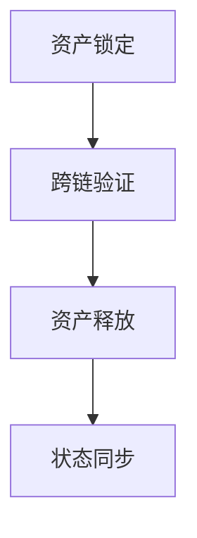
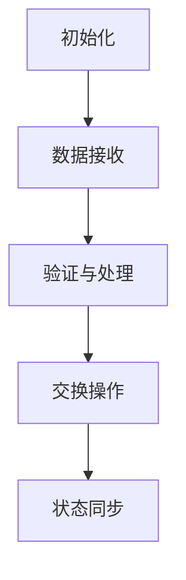
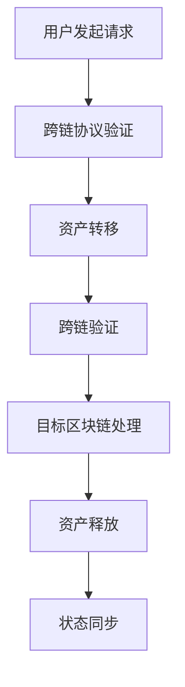

                 

## 跨链技术：实现不同区块链之间的互操作

### 关键词

- 区块链
- 跨链技术
- 互操作性
- 共识机制
- 去中心化金融

### 摘要

本文将深入探讨跨链技术，探讨如何实现不同区块链之间的互操作。我们将从区块链的基本原理开始，逐步介绍跨链技术的核心概念、实现方法、实际应用和面临的挑战。通过本文的阅读，读者将全面了解跨链技术的原理和实现，以及对区块链生态系统的影响。

### 目录

## 第一部分：跨链技术基础

### 第1章：跨链技术的概述

- 1.1 区块链技术的演进
- 1.2 跨链技术的必要性
- 1.3 跨链技术的定义与分类
- 1.4 跨链技术的发展现状

### 第2章：区块链的基本原理

- 2.1 区块链的架构
- 2.2 区块链的数据结构
- 2.3 区块链的共识机制
- 2.4 智能合约基础

### 第3章：跨链技术的核心概念

- 3.1 跨链桥
- 3.2 跨链协议
- 3.3 跨链流动性
- 3.4 跨链安全与隐私

### 第4章：常见的跨链技术

- 4.1 Ethereum 的跨链解决方案
- 4.2 Bitcoin 的跨链解决方案
- 4.3 Polkadot 与 Substrate 的跨链
- 4.4 其他跨链技术介绍

## 第二部分：跨链技术实现与操作

### 第5章：跨链技术的实现方法

- 5.1 跨链桥的实现原理
- 5.2 跨链协议的实现细节
- 5.3 跨链操作的流程
- 5.4 跨链交易的验证与确认

### 第6章：跨链技术的实际应用

- 6.1 跨链支付系统
- 6.2 跨链去中心化金融（DeFi）
- 6.3 跨链非同质化代币（NFT）
- 6.4 其他跨链应用场景

### 第7章：跨链技术的挑战与未来

- 7.1 跨链技术面临的挑战
- 7.2 跨链技术的发展趋势
- 7.3 跨链技术的影响与展望

## 第三部分：跨链技术实践案例

### 第8章：跨链支付系统搭建

- 8.1 开发环境准备
- 8.2 跨链支付系统设计
- 8.3 跨链支付系统实现
- 8.4 跨链支付系统测试与部署

### 第9章：去中心化金融（DeFi）跨链应用

- 9.1 DeFi概述
- 9.2 跨链DeFi项目案例分析
- 9.3 跨链DeFi开发实践
- 9.4 跨链DeFi的安全性考量

## 附录

### 附录 A：跨链技术相关工具和资源

- A.1 跨链桥工具介绍
- A.2 跨链协议文档
- A.3 开发者社区和资源
- A.4 实用链接和参考资料

### 跨链技术的必要性

区块链技术的崛起，为我们提供了一种全新的数据管理和交易方式。然而，随着区块链技术的广泛应用，不同区块链之间的互操作性问题也逐渐显现出来。跨链技术应运而生，旨在实现不同区块链之间的互操作性，从而打破数据孤岛，促进区块链生态系统的融合与发展。

跨链技术的必要性体现在以下几个方面：

1. **解决数据孤岛问题**：随着各种区块链项目的兴起，不同区块链之间的数据隔离问题愈发严重。跨链技术可以打破这些数据孤岛，实现数据的高效共享。

2. **促进区块链生态系统的融合**：跨链技术使得不同区块链项目可以相互调用和协作，从而形成一个更加庞大和复杂的区块链生态系统。

3. **提升交易效率**：通过跨链技术，用户可以在不同区块链之间进行资产转移和交易，从而提升交易效率和用户体验。

4. **降低开发成本**：跨链技术为开发者提供了便捷的工具和框架，降低了开发跨链应用的难度和成本。

### 跨链技术的定义与分类

跨链技术是指实现不同区块链之间数据交换和互操作的技术。根据实现方式的不同，跨链技术可以大致分为以下几类：

1. **跨链桥**：跨链桥是一种在区块链之间建立通信和交换的桥梁，它通过智能合约实现跨链数据的传递和验证。常见的跨链桥包括ERC-20桥、BTC-ETH桥等。

2. **跨链协议**：跨链协议是一种在多个区块链之间建立标准化的通信协议，它定义了数据交换的规则和流程。常见的跨链协议包括Interledger Protocol（ILP）、Polkadot等。

3. **跨链流动性**：跨链流动性是指在不同区块链之间提供资产交换和转移的流动性服务。通过跨链流动性，用户可以在不同区块链之间快速转移资产，提高交易效率。

4. **跨链安全与隐私**：跨链安全与隐私是指保障跨链交易和数据安全的技术和措施。包括加密算法、多重签名、隐私保护等。

### 跨链技术的发展现状

跨链技术自诞生以来，发展迅速，目前已经涌现出众多跨链方案和项目。以下是一些典型的跨链技术发展现状：

1. **Ethereum 的跨链解决方案**：Ethereum 作为智能合约领域的领军者，其跨链解决方案包括ERC-20桥、Arbitrum等。

2. **Bitcoin 的跨链解决方案**：Bitcoin 作为区块链技术的先驱，其跨链解决方案包括 Lightning Network、CoinJoin等。

3. **Polkadot 与 Substrate 的跨链**：Polkadot 和 Substrate 提供了一种全新的跨链解决方案，通过多链互操作性和平行链技术，实现不同区块链之间的高效互操作。

4. **其他跨链技术介绍**：包括Cosmos、Avalanche、Tendermint等，这些跨链技术在不同领域和应用场景中表现出色。

### 本章小结

本章对跨链技术进行了概述，介绍了跨链技术的必要性、定义与分类以及发展现状。在接下来的章节中，我们将深入探讨区块链的基本原理、核心概念、实现方法、实际应用和挑战，以全面了解跨链技术的原理和应用。

### 下一章预告

在下一章中，我们将深入探讨区块链的基本原理，包括区块链的架构、数据结构、共识机制和智能合约基础。通过了解区块链的基本原理，我们将更好地理解跨链技术的实现机制和应用场景。敬请期待！

## 第一部分：跨链技术基础

### 第1章：跨链技术的概述

#### 1.1 区块链技术的演进

区块链技术起源于2008年，由一个化名为“中本聪”（Satoshi Nakamoto）的人提出。最初，区块链技术主要应用于比特币（Bitcoin）这一数字货币项目中，旨在实现去中心化的电子现金系统。随着比特币的成功，区块链技术逐渐引起了全球的关注，并开始在其他领域得到应用。

从2010年到2015年，区块链技术进入快速发展期。以太坊（Ethereum）的推出，使得智能合约（Smart Contract）成为可能，为区块链技术的应用提供了更广阔的空间。在此期间，众多区块链项目如雨后春笋般涌现，包括EOS、Cardano、Tezos等。

2016年至2019年，区块链技术进入应用探索期。各类区块链应用（DApp）开始出现，涵盖了金融、供应链、医疗、游戏等多个领域。同时，跨链技术开始受到关注，人们意识到实现不同区块链之间的互操作性对于区块链生态系统的发展至关重要。

#### 1.2 跨链技术的必要性

随着区块链技术的广泛应用，不同区块链之间的互操作性问题日益凸显。跨链技术的必要性体现在以下几个方面：

1. **解决数据孤岛问题**：区块链技术的去中心化特性使得数据分布在不同区块链上，导致数据孤岛问题。跨链技术能够实现不同区块链之间的数据交换和共享，解决数据孤岛问题。

2. **促进区块链生态系统的融合**：跨链技术使得不同区块链项目可以相互调用和协作，形成一个更加庞大和复杂的区块链生态系统。这种融合有助于提升区块链技术的应用价值和市场竞争力。

3. **提升交易效率**：通过跨链技术，用户可以在不同区块链之间进行资产转移和交易，从而提升交易效率。这对于去中心化金融（DeFi）等高并发应用场景尤为重要。

4. **降低开发成本**：跨链技术为开发者提供了便捷的工具和框架，降低了开发跨链应用的难度和成本。这使得更多的开发者能够参与到区块链生态系统的建设中。

#### 1.3 跨链技术的定义与分类

跨链技术是指实现不同区块链之间数据交换和互操作的技术。根据实现方式的不同，跨链技术可以大致分为以下几类：

1. **跨链桥（Cross-Chain Bridges）**：跨链桥是一种在区块链之间建立通信和交换的桥梁，它通过智能合约实现跨链数据的传递和验证。常见的跨链桥包括ERC-20桥、BTC-ETH桥等。

2. **跨链协议（Cross-Chain Protocols）**：跨链协议是一种在多个区块链之间建立标准化的通信协议，它定义了数据交换的规则和流程。常见的跨链协议包括Interledger Protocol（ILP）、Polkadot等。

3. **跨链流动性（Cross-Chain Liquidity）**：跨链流动性是指在不同区块链之间提供资产交换和转移的流动性服务。通过跨链流动性，用户可以在不同区块链之间快速转移资产，提高交易效率。

4. **跨链安全与隐私（Cross-Chain Security and Privacy）**：跨链安全与隐私是指保障跨链交易和数据安全的技术和措施。包括加密算法、多重签名、隐私保护等。

#### 1.4 跨链技术的发展现状

跨链技术自诞生以来，发展迅速，目前已经涌现出众多跨链方案和项目。以下是一些典型的跨链技术发展现状：

1. **Ethereum 的跨链解决方案**：Ethereum 作为智能合约领域的领军者，其跨链解决方案包括ERC-20桥、Arbitrum等。ERC-20桥允许用户在不同区块链之间转移ERC-20代币，Arbitrum则提供了一种可扩展的跨链解决方案。

2. **Bitcoin 的跨链解决方案**：Bitcoin 作为区块链技术的先驱，其跨链解决方案包括 Lightning Network、CoinJoin等。Lightning Network允许用户在不同区块链之间进行快速、低成本的交易，CoinJoin则提供了一种隐私保护方案。

3. **Polkadot 与 Substrate 的跨链**：Polkadot 和 Substrate 提供了一种全新的跨链解决方案，通过多链互操作性和平行链技术，实现不同区块链之间的高效互操作。

4. **其他跨链技术介绍**：包括Cosmos、Avalanche、Tendermint等，这些跨链技术在不同领域和应用场景中表现出色。

### 本章小结

本章对跨链技术进行了概述，介绍了区块链技术的演进、跨链技术的必要性、定义与分类以及发展现状。在接下来的章节中，我们将深入探讨区块链的基本原理、核心概念、实现方法、实际应用和挑战，以全面了解跨链技术的原理和应用。

### 下一章预告

在下一章中，我们将深入探讨区块链的基本原理，包括区块链的架构、数据结构、共识机制和智能合约基础。通过了解区块链的基本原理，我们将更好地理解跨链技术的实现机制和应用场景。敬请期待！

## 第一部分：跨链技术基础

### 第2章：区块链的基本原理

#### 2.1 区块链的架构

区块链的架构可以分为三个主要部分：网络层、链层和应用层。

1. **网络层**：网络层是区块链的基础，负责实现节点之间的通信和数据传输。区块链网络通常采用分布式对等网络（P2P网络）结构，节点之间通过加密通信和共识算法实现协同工作。

2. **链层**：链层是区块链的核心，负责数据存储和状态管理。区块链的数据结构采用链式区块结构，每个区块包含一定数量的交易记录，并通过哈希函数与前一个区块链接起来，形成一条不断增长的链。链层的共识机制（如工作量证明、权益证明等）确保区块链数据的可靠性和一致性。

3. **应用层**：应用层是区块链技术的应用场景，包括去中心化应用（DApp）、智能合约、去中心化金融（DeFi）等。应用层通过调用链层提供的接口，实现各种业务逻辑和功能。

#### 2.2 区块链的数据结构

区块链的数据结构采用链式区块结构，每个区块包含以下信息：

1. **区块头**：区块头包含区块的元信息，如区块高度、版本号、随机数、时间戳、难度目标等。

2. **交易列表**：交易列表包含区块中的交易记录，每个交易记录包含输入、输出、签名等信息。

3. **Merkle 树**：Merkle 树用于验证区块中的交易列表，通过哈希值构建一个树形结构，确保交易数据的完整性和一致性。

#### 2.3 区块链的共识机制

区块链的共识机制是确保区块链网络中的所有节点对数据状态达成一致的关键机制。常见的共识机制包括：

1. **工作量证明（Proof of Work, PoW）**：PoW是最早的共识机制，通过解决复杂的数学难题（挖矿）来竞争记账权。比特币（Bitcoin）采用PoW机制。

2. **权益证明（Proof of Stake, PoS）**：PoS通过持有代币数量和持币时间来竞争记账权。以太坊（Ethereum）即将从PoW切换到PoS机制。

3. **委托权益证明（Delegated Proof of Stake, DPoS）**：DPoS是一种改进的PoS机制，通过选举出多个委托人（见证人）来负责记账。EOS采用DPoS机制。

4. **权威证明（Proof of Authority, PoA）**：PoA通过预选出的权威节点来负责记账，通常用于 consortium blockchains。

#### 2.4 智能合约基础

智能合约是一种运行在区块链上的自执行合约，它通过预定义的条件和规则自动执行合约条款。智能合约的基本组成部分包括：

1. **状态变量**：状态变量用于存储智能合约的数据和状态。

2. **函数**：函数定义了智能合约的行为和逻辑，包括公共函数、私有函数等。

3. **事件**：事件用于记录智能合约的执行过程和结果，便于外部调用者监听和跟踪。

4. **错误处理**：智能合约需要包含错误处理机制，以应对各种异常情况。

智能合约的编程语言主要包括：

1. **Solidity**：Solidity是智能合约编程的广泛使用语言，它类似于JavaScript和C++。

2. **Vyper**：Vyper是Ethereum的另一种智能合约编程语言，旨在提供更安全、更易于理解的编程模型。

#### 本章小结

本章介绍了区块链的基本原理，包括架构、数据结构、共识机制和智能合约基础。通过了解区块链的基本原理，读者可以更好地理解跨链技术的实现机制和应用场景。在下一章中，我们将深入探讨跨链技术的核心概念，包括跨链桥、跨链协议、跨链流动性和跨链安全与隐私。敬请期待！

### 下一章预告

在下一章中，我们将深入探讨跨链技术的核心概念，包括跨链桥、跨链协议、跨链流动性和跨链安全与隐私。通过了解这些核心概念，读者将全面理解跨链技术的原理和应用。敬请期待！

### 第3章：跨链技术的核心概念

#### 3.1 跨链桥

跨链桥（Cross-Chain Bridge）是实现不同区块链之间数据交换和互操作的关键技术。跨链桥的主要作用是在两个或多个区块链之间建立通信渠道，使得资产和交易可以在不同区块链之间无缝转移。

**跨链桥的工作原理：**

1. **桥接资产**：用户将资产从一个区块链转移到跨链桥上，跨链桥将资产锁定在智能合约中。

2. **跨链验证**：跨链桥验证资产的转移请求，并生成一个证明，证明该资产已经在目标区块链中创建。

3. **释放资产**：当用户从目标区块链中转移资产时，跨链桥将验证释放请求，并将资产释放回用户的账户。

**跨链桥的优势：**

- **灵活性**：跨链桥可以支持多种区块链之间的互操作，包括以太坊、比特币、波卡等。
- **安全性**：跨链桥通常采用多重签名和加密技术来确保资产转移的安全性。
- **去中心化**：跨链桥通常由多个节点组成，以确保去中心化和抗攻击性。

**跨链桥的挑战：**

- **信任问题**：跨链桥需要建立信任机制，以确保资产转移的可靠性和安全性。
- **性能问题**：跨链桥的性能可能会受到区块链网络拥堵的影响。

**常见的跨链桥：**

- **ERC-20桥**：ERC-20桥是用于在以太坊和其他区块链之间转移ERC-20代币的技术。
- **BTC-ETH桥**：BTC-ETH桥是用于在比特币和以太坊之间转移比特币的技术。

#### 3.2 跨链协议

跨链协议（Cross-Chain Protocol）是一种在多个区块链之间建立标准化的通信协议，它定义了数据交换的规则和流程。跨链协议的主要目标是实现不同区块链之间的互操作性，使得资产、交易和智能合约可以在多个区块链之间无缝转移。

**跨链协议的工作原理：**

1. **共识层**：跨链协议需要在多个区块链之间建立共识层，以确保所有区块链对数据的理解和处理一致。

2. **验证层**：跨链协议需要验证来自不同区块链的交易和数据，以确保它们的有效性和完整性。

3. **交换层**：跨链协议需要实现资产和数据的交换，使得资产可以在不同区块链之间转移。

**跨链协议的优势：**

- **标准化**：跨链协议提供了标准化的数据交换规则，使得不同区块链之间的互操作性更加容易实现。
- **可扩展性**：跨链协议可以支持多种区块链和智能合约，提高系统的可扩展性。
- **安全性**：跨链协议通常采用加密技术和多重签名，确保数据交换的安全性。

**跨链协议的挑战：**

- **复杂度**：跨链协议的实现和部署相对复杂，需要具备较高的技术能力。
- **性能问题**：跨链协议的性能可能会受到区块链网络拥堵的影响。

**常见的跨链协议：**

- **Interledger Protocol (ILP)**：ILP是一种用于在多个区块链之间转移资产和数据的协议。
- **Polkadot**：Polkadot是一个多链互操作平台，通过平行链和跨链桥实现不同区块链之间的互操作。

#### 3.3 跨链流动性

跨链流动性（Cross-Chain Liquidity）是指在不同区块链之间提供资产交换和转移的流动性服务。跨链流动性使得用户可以在不同区块链之间快速转移资产，提高交易效率。

**跨链流动性的工作原理：**

1. **流动性池**：跨链流动性通常通过建立流动性池来实现。流动性池是一个存储资产的智能合约，用户可以将资产存入流动性池，获得相应的流动性代币。

2. **交易对**：跨链流动性池通常包含多个交易对，例如ETH/BTC、DOT/ETH等。用户可以使用流动性代币在不同交易对之间交换资产。

3. **流动性挖矿**：为了鼓励用户提供流动性，一些跨链平台会实施流动性挖矿机制，用户提供流动性可以获得额外的奖励。

**跨链流动性的优势：**

- **高效性**：跨链流动性使得资产可以在不同区块链之间快速转移，提高交易效率。
- **灵活性**：用户可以根据需要选择不同的区块链和资产进行交易，提高资产利用率。
- **去中心化**：跨链流动性通常通过去中心化平台实现，确保交易过程的去中心化和透明性。

**跨链流动性的挑战：**

- **风险问题**：跨链流动性涉及多个区块链，可能存在区块链故障或攻击等风险。
- **流动性不足**：一些区块链可能存在流动性不足的问题，导致交易延迟或无法完成。

**常见的跨链流动性平台：**

- **Avalanche**：Avalanche是一个支持跨链流动性的平台，通过其自己的加密货币AVAX提供流动性挖矿。
- **Binance Smart Chain (BSC)**：BSC是一个支持跨链流动性的平台，通过其自己的BEP-20代币提供流动性挖矿。

#### 3.4 跨链安全与隐私

跨链安全与隐私是保障跨链交易和数据安全的关键技术。随着跨链技术的广泛应用，跨链安全与隐私问题越来越受到关注。

**跨链安全与隐私的工作原理：**

1. **加密技术**：跨链安全与隐私采用加密技术来保护数据传输和存储的安全性。常用的加密技术包括对称加密、非对称加密和哈希算法。

2. **多重签名**：多重签名用于确保跨链交易的安全性。在跨链交易中，多个参与者需要共同签名才能完成交易。

3. **隐私保护**：跨链安全与隐私技术还涉及隐私保护，例如零知识证明、同态加密等，以确保用户身份和交易数据的隐私性。

**跨链安全与隐私的优势：**

- **安全性**：加密技术和多重签名确保跨链交易的数据传输和存储安全。
- **隐私性**：隐私保护技术确保用户身份和交易数据的隐私性。
- **去中心化**：跨链安全与隐私技术通常采用去中心化架构，提高系统的抗攻击性和可靠性。

**跨链安全与隐私的挑战：**

- **复杂性**：跨链安全与隐私技术的实现和部署相对复杂，需要具备较高的技术能力。
- **性能问题**：一些隐私保护技术可能影响跨链交易的性能。

**常见的跨链安全与隐私技术：**

- **Zcash**：Zcash是一个支持隐私保护的区块链平台，采用零知识证明技术。
- **Monero**：Monero是一个匿名性较强的区块链平台，采用加密和混淆技术保护用户隐私。

### 本章小结

本章介绍了跨链技术的核心概念，包括跨链桥、跨链协议、跨链流动性和跨链安全与隐私。通过了解这些核心概念，读者可以全面理解跨链技术的原理和应用。在下一章中，我们将深入探讨常见的跨链技术，包括Ethereum、Bitcoin、Polkadot等。敬请期待！

### 下一章预告

在下一章中，我们将深入探讨常见的跨链技术，包括Ethereum、Bitcoin、Polkadot等。通过分析这些技术的特点和优势，读者将更好地理解跨链技术在现实应用中的表现。敬请期待！

### 第4章：常见的跨链技术

#### 4.1 Ethereum 的跨链解决方案

Ethereum作为智能合约领域的领导者，其跨链解决方案在区块链技术发展中占据重要地位。以下是一些Ethereum的跨链解决方案：

1. **ERC-20桥**：ERC-20桥是Ethereum与其他区块链之间进行资产转移的技术。它允许用户将ERC-20代币从Ethereum转移到其他区块链，如Binance Smart Chain（BSC）或Tron。ERC-20桥通过智能合约实现，确保资产转移的安全性和可靠性。

2. **Arbitrum**：Arbitrum是一种Layer 2解决方案，旨在提高Ethereum网络的可扩展性和交易速度。Arbitrum通过将交易数据存储在侧链上，然后在主链上进行验证，从而降低交易成本和时间。Arbitrum还支持跨链操作，允许用户在不同区块链之间转移资产。

3. **Wormhole**：Wormhole是一种用于连接Solana和Ethereum的跨链协议。它通过在两个区块链之间建立一个中继器，实现资产和数据的无缝转移。Wormhole采用了一种新颖的加密证明机制，确保跨链操作的安全性和高效性。

**Ethereum 跨链解决方案的优势：**

- **广泛支持**：Ethereum拥有庞大的开发者社区和丰富的智能合约应用，其跨链解决方案可以方便地与各种区块链进行互操作。
- **安全性高**：Ethereum的跨链解决方案采用智能合约和加密技术，确保资产转移的安全性和可靠性。
- **去中心化**：Ethereum的跨链解决方案遵循去中心化原则，避免中心化风险，提高系统的透明度和抗攻击性。

**Ethereum 跨链解决方案的挑战：**

- **扩展性问题**：尽管Ethereum的跨链解决方案可以提高网络的可扩展性，但Ethereum本身仍面临扩展性问题，如交易拥堵和交易成本上升。
- **性能问题**：Ethereum的跨链解决方案可能受到主链性能的限制，导致跨链操作延迟。

#### 4.2 Bitcoin 的跨链解决方案

Bitcoin作为区块链技术的先驱，其跨链解决方案在区块链领域具有重要地位。以下是一些Bitcoin的跨链解决方案：

1. **Lightning Network**：Lightning Network是一种Layer 2解决方案，旨在提高Bitcoin网络的交易速度和可扩展性。它通过在比特币网络之外建立二层网络，实现快速、低成本的交易。Lightning Network支持跨链操作，允许用户在比特币网络和其他区块链之间转移资产。

2. **ConsenSys Bitcoin Bridge**：ConsenSys Bitcoin Bridge是Ethereum和Bitcoin之间的跨链解决方案。它通过在两个区块链之间建立通信渠道，实现资产转移和交易。ConsenSys Bitcoin Bridge采用智能合约和加密技术，确保跨链操作的安全性和可靠性。

3. **Convergence**：Convergence是一种用于连接不同区块链的跨链协议，它支持比特币和其他区块链之间的互操作。Convergence采用了一种新颖的证明机制，确保跨链操作的高效性和安全性。

**Bitcoin 跨链解决方案的优势：**

- **安全性高**：Bitcoin的跨链解决方案采用比特币网络的共识机制和加密技术，确保资产转移的安全性和可靠性。
- **去中心化**：Bitcoin的跨链解决方案遵循去中心化原则，避免中心化风险，提高系统的透明度和抗攻击性。
- **扩展性好**：Lightning Network等解决方案可以提高比特币网络的可扩展性，支持更多的交易和跨链操作。

**Bitcoin 跨链解决方案的挑战：**

- **性能问题**：比特币网络的性能可能受到网络拥堵的影响，导致跨链操作延迟。
- **复杂度**：一些跨链解决方案的实现和部署相对复杂，需要具备较高的技术能力。

#### 4.3 Polkadot 与 Substrate 的跨链

Polkadot是一个多链互操作平台，通过平行链技术和跨链桥实现不同区块链之间的互操作。以下是一些Polkadot的跨链解决方案：

1. **平行链**：平行链是Polkadot中的一个重要概念，它允许不同的区块链在Polkadot网络中并行运行。平行链之间可以通过跨链桥实现互操作，实现资产和数据在多个区块链之间的转移。

2. **XCM**：XCM（可扩展性模块通信）是Polkadot的核心协议，用于实现不同区块链之间的通信和互操作。XCM定义了跨链操作的标准和规则，确保不同区块链之间的数据传输和互操作的一致性和安全性。

3. **Substrate**：Substrate是Polkadot提供的区块链框架，用于构建自定义的区块链。Substrate提供了丰富的模块和工具，使得开发者可以轻松实现跨链功能，构建具有互操作性的区块链应用。

**Polkadot 与 Substrate 的跨链优势：**

- **高性能**：Polkadot采用共享状态多线程架构，能够实现高性能的跨链操作。
- **可扩展性**：Polkadot的平行链技术支持大规模的区块链网络，确保系统的高扩展性。
- **安全性**：Polkadot采用安全性较高的共识机制和加密技术，确保跨链操作的安全性和可靠性。

**Polkadot 与 Substrate 的跨链挑战：**

- **复杂性**：Polkadot和Substrate的实现和部署相对复杂，需要较高的技术能力。
- **兼容性问题**：不同区块链之间的兼容性问题可能会影响跨链操作的效果。

#### 4.4 其他跨链技术介绍

除了Ethereum、Bitcoin、Polkadot等主流跨链技术，还有一些其他跨链技术在区块链领域具有重要地位：

1. **Cosmos**：Cosmos是一个多链互操作平台，通过 Tendermint共识算法实现不同区块链之间的互操作。Cosmos采用Hub和Zone的概念，Hub连接不同的Zone，实现跨链操作。

2. **Avalanche**：Avalanche是一个高性能的区块链平台，支持跨链操作。Avalanche采用Snowflake共识算法，确保系统的高性能和安全性。

3. **Tendermint**：Tendermint是一个共识引擎，用于构建可扩展的区块链网络。Tendermint支持跨链操作，使得不同区块链之间可以实现互操作。

**其他跨链技术的优势：**

- **多样性**：不同的跨链技术各有优势，可以满足不同应用场景的需求。
- **创新性**：一些跨链技术采用创新的共识算法和架构，提高了系统的性能和安全性。

**其他跨链技术的挑战：**

- **兼容性问题**：不同跨链技术之间的兼容性问题可能会影响跨链操作的效果。
- **性能问题**：一些跨链技术可能存在性能瓶颈，影响跨链操作的速度和效率。

### 本章小结

本章介绍了常见的跨链技术，包括Ethereum、Bitcoin、Polkadot、Cosmos、Avalanche和Tendermint等。通过分析这些技术的特点和优势，读者可以更好地理解跨链技术在现实应用中的表现。在下一章中，我们将深入探讨跨链技术的实现方法，包括跨链桥的实现原理、跨链协议的实现细节和跨链操作的流程。敬请期待！

### 下一章预告

在下一章中，我们将深入探讨跨链技术的实现方法，包括跨链桥的实现原理、跨链协议的实现细节和跨链操作的流程。通过了解这些实现方法，读者将能够理解跨链技术的具体实现过程。敬请期待！

### 第5章：跨链技术的实现方法

#### 5.1 跨链桥的实现原理

跨链桥（Cross-Chain Bridge）是实现不同区块链之间数据交换和互操作的关键技术。跨链桥的实现原理可以分为以下几个步骤：

1. **资产锁定**：首先，用户将资产从一个区块链转移到跨链桥上，跨链桥将资产锁定在智能合约中。这个过程中，跨链桥会生成一个唯一的事务ID，用于标识该资产的转移。

2. **跨链验证**：接下来，跨链桥会验证资产的转移请求。这个验证过程通常涉及两个区块链之间的通信，以确保资产的转移是合法的。跨链桥会生成一个证明，证明该资产已经在目标区块链中创建。

3. **资产释放**：当用户需要从目标区块链中转移资产时，跨链桥会验证释放请求。跨链桥会将资产从目标区块链中释放，并将其发送回用户的账户。这个过程中，跨链桥会消耗之前生成的唯一事务ID，确保资产的安全转移。

4. **状态同步**：跨链桥需要与两个区块链之间的状态同步，以确保数据的准确性和一致性。状态同步可以通过定期轮询、事件订阅等方式实现。

**跨链桥的实现原理图**：



**跨链桥的挑战**：

- **信任问题**：跨链桥需要建立信任机制，以确保资产转移的可靠性和安全性。
- **性能问题**：跨链桥的性能可能会受到区块链网络拥堵的影响。
- **安全性问题**：跨链桥需要确保数据传输的安全性，防止中间人攻击等安全威胁。

#### 5.2 跨链协议的实现细节

跨链协议（Cross-Chain Protocol）是一种在多个区块链之间建立标准化的通信协议，它定义了数据交换的规则和流程。跨链协议的实现细节通常包括以下几个关键组件：

1. **共识层**：共识层负责确保多个区块链之间的数据共识。常见的共识协议包括PoS、DPoS等。共识层需要解决数据同步和一致性等问题。

2. **验证层**：验证层负责验证来自不同区块链的交易和数据。验证过程通常涉及加密算法、签名验证、时间戳等。验证层需要确保交易和数据的有效性和一致性。

3. **交换层**：交换层负责实现资产和数据的交换。交换过程通常涉及跨链桥、流动性池等。交换层需要确保交换过程的透明性和效率。

4. **状态同步**：状态同步负责确保多个区块链之间的状态一致。状态同步可以通过定期轮询、事件订阅等方式实现。

**跨链协议的实现流程**：

1. **初始化**：跨链协议启动时，需要进行初始化操作，包括配置区块链节点、建立通信通道等。

2. **数据接收**：跨链协议接收来自不同区块链的交易和数据，并将其存储在本地数据库中。

3. **验证与处理**：跨链协议对接收到的交易和数据进行验证和处理。验证过程包括数据完整性检查、签名验证等。

4. **交换操作**：跨链协议执行交换操作，将验证后的交易和数据转发到目标区块链。

5. **状态同步**：跨链协议定期同步状态，确保多个区块链之间的状态一致。

**跨链协议的实现细节图**：



**跨链协议的挑战**：

- **复杂性**：跨链协议的实现和部署相对复杂，需要较高的技术能力。
- **性能问题**：跨链协议的性能可能会受到区块链网络拥堵的影响。
- **安全性问题**：跨链协议需要确保数据传输的安全性，防止中间人攻击等安全威胁。

#### 5.3 跨链操作的流程

跨链操作是实现不同区块链之间互操作的核心步骤。跨链操作的流程通常包括以下几个关键环节：

1. **用户发起请求**：用户通过跨链接口发起跨链操作请求。请求通常包括源区块链地址、目标区块链地址、操作类型（如转账、调用智能合约等）。

2. **跨链协议验证**：跨链协议对用户请求进行验证，确保请求的有效性和合法性。验证过程可能包括身份验证、权限检查等。

3. **资产转移**：跨链协议将资产从源区块链转移到跨链桥上，并生成一个唯一的事务ID。跨链桥将资产锁定在智能合约中。

4. **跨链验证**：跨链协议验证资产转移请求，并生成跨链证明。跨链证明用于证明资产已经在目标区块链中创建。

5. **目标区块链处理**：目标区块链接收跨链证明，并处理跨链操作。处理过程可能包括交易确认、状态更新等。

6. **资产释放**：当目标区块链处理完跨链操作后，跨链协议将资产从跨链桥释放，并将其发送回用户的账户。

7. **状态同步**：跨链协议与源区块链和目标区块链之间的状态同步，确保数据的准确性和一致性。

**跨链操作流程图**：



**跨链操作流程的挑战**：

- **延迟问题**：跨链操作通常涉及多个区块链之间的通信和验证，可能导致操作延迟。
- **费用问题**：跨链操作可能需要支付额外的交易费用，增加使用成本。
- **安全性问题**：跨链操作需要确保数据传输的安全性，防止恶意攻击和数据泄露。

#### 本章小结

本章介绍了跨链技术的实现方法，包括跨链桥的实现原理、跨链协议的实现细节和跨链操作的流程。通过理解这些实现方法，读者可以全面了解跨链技术的具体实现过程。在下一章中，我们将深入探讨跨链技术的实际应用，包括跨链支付系统、去中心化金融（DeFi）和跨链非同质化代币（NFT）等。敬请期待！

### 下一章预告

在下一章中，我们将深入探讨跨链技术的实际应用，包括跨链支付系统、去中心化金融（DeFi）和跨链非同质化代币（NFT）等。通过分析这些实际应用案例，读者将更好地理解跨链技术在现实场景中的效果和挑战。敬请期待！

### 第6章：跨链技术的实际应用

#### 6.1 跨链支付系统

跨链支付系统是一种实现跨区块链货币转移的技术，使得用户可以在不同的区块链网络之间进行支付操作。以下是一个典型的跨链支付系统的实现步骤：

1. **用户发起支付请求**：用户通过支付应用程序发起支付请求，指定支付金额、支付币种以及源和目标区块链地址。

2. **支付请求处理**：支付应用程序将请求发送到跨链支付服务，跨链支付服务负责处理支付请求，确保请求的有效性和合法性。

3. **资产锁定**：跨链支付服务将用户的资产从源区块链转移到跨链桥上，跨链桥将资产锁定在智能合约中。

4. **跨链验证**：跨链支付服务生成一个跨链证明，证明资产已经在目标区块链中创建。跨链证明通常包含支付金额、支付币种和目标地址等信息。

5. **目标区块链处理**：目标区块链接收跨链证明，并执行支付操作，将资金发送到指定的目标地址。

6. **资产释放**：跨链支付服务将资产从跨链桥释放，并将其发送回用户的账户。

7. **状态同步**：跨链支付服务与源区块链和目标区块链之间的状态同步，确保数据的准确性和一致性。

**跨链支付系统的优势**：

- **跨境支付**：跨链支付系统可以支持跨境支付，降低支付成本，提高支付速度。
- **多样化货币**：跨链支付系统支持多种区块链网络和货币，提供更广泛的支付选择。
- **去中心化**：跨链支付系统遵循去中心化原则，避免中心化风险，提高系统的透明度和抗攻击性。

**跨链支付系统的挑战**：

- **复杂性**：跨链支付系统的实现和部署相对复杂，需要较高的技术能力。
- **性能问题**：跨链支付系统可能面临性能瓶颈，影响支付速度和用户体验。
- **安全性问题**：跨链支付系统需要确保数据传输的安全性，防止恶意攻击和数据泄露。

**跨链支付系统的案例**：

- **Binance Pay**：Binance Pay 是一个跨链支付平台，支持用户在不同区块链之间进行支付操作。Binance Pay 利用 Binance 的生态系统和流动性，提供高效、安全的支付解决方案。

#### 6.2 跨链去中心化金融（DeFi）

去中心化金融（DeFi）是一种基于区块链技术的金融系统，旨在实现传统金融功能的去中心化版本。跨链技术在DeFi中发挥着重要作用，以下是一个典型的跨链DeFi项目的实现步骤：

1. **用户发起交易**：用户通过去中心化金融应用（DApp）发起交易请求，指定交易金额、交易币种以及源和目标区块链地址。

2. **交易请求处理**：去中心化金融应用将交易请求发送到跨链支付服务，跨链支付服务负责处理交易请求，确保请求的有效性和合法性。

3. **资产转移**：跨链支付服务将用户的资产从源区块链转移到跨链桥上，跨链桥将资产锁定在智能合约中。

4. **跨链验证**：跨链支付服务生成一个跨链证明，证明资产已经在目标区块链中创建。跨链证明通常包含交易金额、交易币种和目标地址等信息。

5. **目标区块链处理**：目标区块链接收跨链证明，并执行交易操作，将资金发送到指定的目标地址。

6. **资产释放**：跨链支付服务将资产从跨链桥释放，并将其发送回用户的账户。

7. **状态同步**：跨链支付服务与源区块链和目标区块链之间的状态同步，确保数据的准确性和一致性。

**跨链DeFi的优势**：

- **互操作性**：跨链DeFi项目支持不同区块链之间的互操作，提供更广泛的金融产品和服务。
- **灵活性**：跨链DeFi项目允许用户在不同区块链之间灵活转移资产，提高资金利用效率。
- **去中心化**：跨链DeFi项目遵循去中心化原则，避免中心化风险，提高系统的透明度和抗攻击性。

**跨链DeFi的挑战**：

- **复杂性**：跨链DeFi项目的实现和部署相对复杂，需要较高的技术能力。
- **安全性问题**：跨链DeFi项目需要确保数据传输的安全性，防止恶意攻击和数据泄露。
- **性能问题**：跨链DeFi项目可能面临性能瓶颈，影响交易速度和用户体验。

**跨链DeFi的案例**：

- **Aave**：Aave 是一个去中心化借贷平台，支持用户在不同区块链之间进行借贷操作。Aave 通过跨链技术实现了资产在以太坊、波卡等区块链之间的无缝转移。

#### 6.3 跨链非同质化代币（NFT）

非同质化代币（NFT）是一种用于表示数字资产所有权的区块链技术。跨链技术在NFT领域中发挥着重要作用，以下是一个典型的跨链NFT项目的实现步骤：

1. **用户创建NFT**：用户通过去中心化应用（DApp）创建NFT，指定NFT的名称、描述、属性等信息。

2. **NFT注册**：DApp将NFT的信息上传到目标区块链，注册为ERC-721或ERC-1155标准代币。

3. **资产转移**：用户可以通过跨链支付服务将NFT从一个区块链转移到另一个区块链。跨链支付服务将资产从源区块链转移到跨链桥上，跨链桥将资产锁定在智能合约中。

4. **跨链验证**：跨链支付服务生成一个跨链证明，证明NFT已经在目标区块链中创建。

5. **目标区块链处理**：目标区块链接收跨链证明，并执行资产转移操作，将NFT发送到指定的目标地址。

6. **资产释放**：跨链支付服务将资产从跨链桥释放，并将其发送回用户的账户。

7. **状态同步**：跨链支付服务与源区块链和目标区块链之间的状态同步，确保数据的准确性和一致性。

**跨链NFT的优势**：

- **互操作性**：跨链NFT项目支持不同区块链之间的互操作，提供更广泛的数字艺术品和收藏品市场。
- **多样性**：跨链NFT项目允许用户在不同区块链之间转移和交易NFT，增加市场的多样性和流动性。
- **去中心化**：跨链NFT项目遵循去中心化原则，避免中心化风险，提高系统的透明度和抗攻击性。

**跨链NFT的挑战**：

- **复杂性**：跨链NFT项目的实现和部署相对复杂，需要较高的技术能力。
- **安全性问题**：跨链NFT项目需要确保数据传输的安全性，防止恶意攻击和数据泄露。
- **性能问题**：跨链NFT项目可能面临性能瓶颈，影响交易速度和用户体验。

**跨链NFT的案例**：

- **OpenSea**：OpenSea 是一个去中心化数字艺术品和收藏品市场，支持用户在不同区块链之间转移和交易NFT。OpenSea 利用跨链技术实现了NFT在以太坊、波卡等区块链之间的无缝转移。

#### 本章小结

本章介绍了跨链技术的实际应用，包括跨链支付系统、去中心化金融（DeFi）和跨链非同质化代币（NFT）等。通过分析这些实际应用案例，读者可以更好地理解跨链技术在现实场景中的效果和挑战。在下一章中，我们将探讨跨链技术的挑战与未来发展趋势。敬请期待！

### 下一章预告

在下一章中，我们将深入探讨跨链技术面临的挑战和未来发展趋势。通过分析这些挑战，读者将能够了解跨链技术的现状和未来方向。敬请期待！

### 第7章：跨链技术的挑战与未来

#### 7.1 跨链技术面临的挑战

虽然跨链技术在区块链领域展现出巨大的潜力，但在实际应用过程中，仍然面临一系列挑战：

1. **性能瓶颈**：跨链技术涉及到多个区块链之间的通信和验证，可能受到区块链网络拥堵的影响，导致交易延迟和性能下降。

2. **安全性问题**：跨链技术需要确保数据传输和存储的安全性，防止中间人攻击、数据泄露等安全威胁。跨链协议和跨链桥的安全漏洞可能导致严重后果。

3. **互操作性**：不同区块链之间的协议和标准可能存在差异，导致跨链操作的复杂性和难度增加。实现真正的跨链互操作性仍需时间和努力。

4. **监管合规**：跨链技术涉及到多个国家和地区的监管问题，如何在遵循当地法律法规的同时，实现跨链技术的合规性是一个重要挑战。

5. **用户体验**：跨链技术的实现需要考虑到用户体验，如何简化操作流程、提高交易速度和降低使用门槛是跨链技术需要解决的难题。

#### 7.2 跨链技术的发展趋势

尽管面临诸多挑战，跨链技术仍处于快速发展阶段，未来有望在以下几个方面取得突破：

1. **性能优化**：随着区块链技术的发展，性能优化将成为跨链技术的关键方向。通过改进共识机制、网络架构和协议设计，提高跨链技术的处理能力和响应速度。

2. **安全性增强**：安全性是跨链技术的核心关注点。未来跨链技术将采用更先进的加密算法、多重签名和隐私保护技术，提高系统的安全性和抗攻击能力。

3. **标准化进程**：跨链协议和标准的统一将有助于简化跨链操作，提高互操作性。标准化组织和企业将共同推动跨链技术的发展，促进不同区块链之间的互操作。

4. **监管合规性**：跨链技术需要与监管机构合作，确保在遵守当地法律法规的前提下，实现合规性。未来跨链技术将更加注重合规性和法律遵从性。

5. **多样化应用**：跨链技术将在金融、供应链、医疗、艺术等多个领域得到广泛应用。随着技术的成熟，跨链技术将推动更多创新应用的出现。

#### 7.3 跨链技术的影响与展望

跨链技术对区块链生态系统和全球金融体系产生深远影响：

1. **区块链生态系统的融合**：跨链技术使得不同区块链之间可以实现资产和数据的高效转移和共享，推动区块链生态系统的融合与发展。

2. **去中心化金融（DeFi）的普及**：跨链技术为DeFi项目提供了更广泛的资金来源和更高的交易效率，有望加速DeFi的普及和应用。

3. **全球金融体系的变革**：跨链技术有望打破传统金融体系的垄断格局，提高金融服务的透明度和效率，促进全球金融体系的变革。

4. **创新应用的出现**：跨链技术将为各种创新应用提供基础设施支持，如跨链NFT市场、去中心化交易平台、跨境支付系统等。

#### 本章小结

本章探讨了跨链技术面临的挑战和未来发展趋势，分析了跨链技术对区块链生态系统和全球金融体系的影响。尽管跨链技术面临诸多挑战，但随着技术的进步和应用场景的拓展，跨链技术有望在未来发挥更加重要的作用。在下一章中，我们将通过实践案例展示跨链技术的实际应用和实现过程。敬请期待！

### 下一章预告

在下一章中，我们将通过具体的实践案例，展示跨链技术的实际应用和实现过程。通过这些案例，读者将能够更深入地了解跨链技术在实际项目中的运用和效果。敬请期待！

### 第8章：跨链支付系统搭建

#### 8.1 开发环境准备

搭建跨链支付系统前，首先需要准备开发环境。以下是一个典型的开发环境配置步骤：

1. **安装Node.js**：Node.js 是一个基于 Chrome V8 引擎的 JavaScript 运行时，用于运行跨链支付系统的后端代码。您可以从 Node.js 官网（https://nodejs.org/）下载并安装 Node.js。

2. **安装Solidity**：Solidity 是用于编写以太坊智能合约的编程语言。您可以从 Solidity 官网（https://soliditylang.org/）下载并安装 Solidity 编译器。

3. **安装Truffle**：Truffle 是一个用于开发、测试和部署以太坊智能合约的工具。您可以从 Truffle 官网（https://www.trufflesuite.com/）下载并安装 Truffle。

4. **安装MetaMask**：MetaMask 是一个浏览器插件，用于与以太坊区块链交互。您可以从 MetaMask 官网（https://metamask.io/）下载并安装 MetaMask。

5. **设置本地以太坊节点**：为了测试和部署智能合约，您需要设置一个本地以太坊节点。您可以使用 Geth 或 Parity 等以太坊客户端来搭建本地节点。以下是使用 Geth 搭建本地节点的步骤：

   ```bash
   # 下载 Geth
   wget https://geth.ethereum.org/downloads/ethereum/geth

   # 将 Geth 文件移动到 /usr/local/bin 目录
   sudo mv geth /usr/local/bin/geth

   # 启动 Geth 节点
   geth --datadir /data/ethereum --networkid 1337 --nodiscover --allow-insecure-unlock
   ```

#### 8.2 跨链支付系统设计

在设计跨链支付系统时，我们需要考虑以下几个方面：

1. **系统架构**：跨链支付系统可以分为前端、后端和区块链三层。前端负责用户界面和交互，后端负责业务逻辑和数据处理，区块链层负责跨链操作和状态同步。

2. **功能模块**：跨链支付系统主要包括以下功能模块：

   - 用户认证模块：用于管理用户登录、注册和权限验证。
   - 支付模块：用于处理支付请求、生成交易、验证交易和执行支付。
   - 跨链模块：用于实现跨链桥的通信和验证，实现资产在区块链之间的转移。
   - 数据同步模块：用于同步区块链状态，确保系统数据的准确性和一致性。

3. **技术选型**：前端可以使用 React 或 Vue 等现代前端框架，后端可以使用 Node.js 或 Python 等后端框架。区块链层可以使用以太坊智能合约和 Solidity 编程语言。

#### 8.3 跨链支付系统实现

下面是一个简单的跨链支付系统的实现示例：

1. **前端界面**：

```jsx
import React, { useState } from 'react';

function App() {
  const [amount, setAmount] = useState('');
  const [fromAddress, setFromAddress] = useState('');
  const [toAddress, setToAddress] = useState('');

  const handleSend = async () => {
    // 调用后端接口发送支付请求
  };

  return (
    <div>
      <h1>跨链支付系统</h1>
      <label>金额：</label>
      <input type="number" value={amount} onChange={(e) => setAmount(e.target.value)} />
      <br />
      <label>源地址：</label>
      <input type="text" value={fromAddress} onChange={(e) => setFromAddress(e.target.value)} />
      <br />
      <label>目标地址：</label>
      <input type="text" value={toAddress} onChange={(e) => setToAddress(e.target.value)} />
      <br />
      <button onClick={handleSend}>发送支付</button>
    </div>
  );
}

export default App;
```

2. **后端代码**：

```javascript
const express = require('express');
const axios = require('axios');
const app = express();

app.use(express.json());

// 发送支付请求
app.post('/send', async (req, res) => {
  const { amount, fromAddress, toAddress } = req.body;

  // 调用跨链模块进行支付
  const result = await callCrossChainModule(fromAddress, toAddress, amount);

  if (result.success) {
    res.status(200).json({ message: '支付成功' });
  } else {
    res.status(400).json({ message: '支付失败' });
  }
});

// 跨链模块示例
async function callCrossChainModule(fromAddress, toAddress, amount) {
  // 调用以太坊智能合约进行跨链支付
}

app.listen(3000, () => {
  console.log('服务器启动，端口：3000');
});
```

3. **以太坊智能合约**：

```solidity
pragma solidity ^0.8.0;

contract CrossChainPay {
  mapping(address => uint256) public balances;

  function deposit() external payable {
    balances[msg.sender()] += msg.value;
  }

  function send(address to, uint256 amount) external {
    require(balances[msg.sender()] >= amount, '余额不足');
    balances[msg.sender()] -= amount;
    balances[to] += amount;
  }
}
```

#### 8.4 跨链支付系统测试与部署

1. **测试**：

在本地以太坊节点上，可以使用 Truffle 对智能合约进行测试。以下是一个简单的测试用例：

```javascript
const CrossChainPay = artifacts.require("CrossChainPay");

contract("CrossChainPay", async (accounts) => {
  it("should deposit and send", async () => {
    const instance = await CrossChainPay.deployed();

    // 存入金额
    await instance.deposit({ value: web3.utils.toWei("1", "ether") });

    // 检查余额
    const balance = await instance.balances.call(accounts[1]);
    assert.equal(balance.toString(), web3.utils.toWei("1", "ether"));

    // 发送金额
    await instance.send(accounts[1], { value: web3.utils.toWei("0.5", "ether") });

    // 检查余额
    balance = await instance.balances.call(accounts[1]);
    assert.equal(balance.toString(), web3.utils.toWei("0.5", "ether"));
  });
});
```

2. **部署**：

将智能合约部署到以太坊主网或其他区块链网络。可以使用 Truffle 或其他部署工具进行部署。以下是使用 Truffle 部署智能合约的示例：

```bash
# 部署智能合约
truffle deploy CrossChainPay

# 部署成功后，查看合约地址
truffle networks:mainnet
CrossChainPay.deployed().then(contract => console.log(contract.address));
```

#### 本章小结

本章详细介绍了跨链支付系统的搭建过程，包括开发环境准备、系统设计、实现和测试与部署。通过本章的学习，读者可以掌握跨链支付系统的基本搭建方法和流程。在下一章中，我们将探讨去中心化金融（DeFi）跨链应用的实现，以及其安全性和性能考量。敬请期待！

### 下一章预告

在下一章中，我们将深入探讨去中心化金融（DeFi）跨链应用的实现，包括项目概述、案例分析、开发实践和安全性考量。通过学习这些内容，读者将更好地理解DeFi跨链应用的开发过程和关键点。敬请期待！

### 第9章：去中心化金融（DeFi）跨链应用

#### 9.1 DeFi概述

去中心化金融（DeFi）是基于区块链技术的金融系统，旨在实现传统金融功能（如借贷、交易、支付等）的去中心化版本。DeFi的核心特点是去中心化、开放性和透明性，通过智能合约和分布式网络实现金融服务。

**DeFi的主要特点**：

- **去中心化**：DeFi不依赖于中心化的金融机构，通过智能合约和分布式网络实现金融功能，降低交易成本和风险。
- **开放性**：DeFi系统对所有人开放，用户可以随时参与金融活动，不受地理位置和时间的限制。
- **透明性**：DeFi系统的所有交易和操作都是透明的，任何人都可以查看和验证。

**DeFi的主要组成部分**：

- **智能合约**：智能合约是DeFi系统的核心，用于实现各种金融功能，如借贷、交易、支付等。
- **去中心化交易所（DEX）**：去中心化交易所是DeFi系统中的重要组成部分，用户可以在DEX上交易加密货币。
- **流动性池**：流动性池是用于提供交易对流动性的智能合约，用户可以提供流动性并获取收益。
- **稳定币**：稳定币是价值稳定的加密货币，用于降低加密货币市场的波动性。
- **去中心化借贷平台**：去中心化借贷平台允许用户在无需信用评估的情况下借出或借入加密货币。

#### 9.2 跨链DeFi项目案例分析

以下是一个典型的跨链DeFi项目案例分析：

**项目概述**：

该项目是一个跨链去中心化借贷平台，用户可以在不同区块链之间借出或借入加密货币。项目支持多种区块链网络，如以太坊、波卡、Binance Smart Chain等，并通过跨链技术实现资产转移和交易。

**项目架构**：

- **前端**：前端使用React框架实现用户界面，用户可以通过前端界面发起借贷请求、查看借贷信息等。
- **后端**：后端使用Node.js和Express框架实现业务逻辑和数据处理，与跨链协议和区块链网络进行交互。
- **跨链协议**：跨链协议负责实现不同区块链之间的互操作性，确保资产可以在不同区块链之间无缝转移。
- **智能合约**：智能合约实现借贷平台的业务逻辑，包括借贷流程、利息计算、还款等。

**关键功能**：

1. **跨链借贷**：用户可以在不同区块链之间借出或借入加密货币，如从以太坊借出比特币，或从波卡借出以太坊。

2. **流动性挖矿**：为了鼓励用户提供流动性，平台实施流动性挖矿机制，用户可以提供流动性并获得平台奖励。

3. **自动做市商（AMM）**：平台采用自动做市商（AMM）机制，实现自动交易对生成和价格发现，提高交易效率。

4. **安全性和合规性**：平台采用多重签名和加密技术，确保交易和数据的安全性和隐私性。同时，平台与监管机构合作，确保合规性。

#### 9.3 跨链DeFi开发实践

以下是一个跨链DeFi项目的开发实践步骤：

1. **需求分析**：

   - 确定项目目标和功能需求，如借贷、流动性挖矿、自动做市商等。
   - 分析不同区块链网络的特性和优势，选择合适的跨链协议和智能合约平台。

2. **技术选型**：

   - 前端：使用React框架实现用户界面，包括借贷界面、账户信息、交易记录等。
   - 后端：使用Node.js和Express框架实现业务逻辑和数据处理，与跨链协议和区块链网络进行交互。
   - 跨链协议：选择合适的跨链协议，如Polkadot、Cosmos、Avalanche等，实现不同区块链之间的互操作性。
   - 智能合约：使用Solidity语言编写智能合约，实现借贷平台的业务逻辑。

3. **系统设计**：

   - 设计前端界面，包括用户注册、登录、借贷、还款、流动性挖矿等。
   - 设计后端接口，包括用户管理、借贷管理、交易记录管理、流动性挖矿管理等。
   - 设计跨链协议接口，实现资产转移和交易功能。

4. **实现和测试**：

   - 开发前端和后端代码，实现用户界面和业务逻辑。
   - 编写智能合约代码，实现借贷平台的业务逻辑。
   - 对前端和后端代码进行测试，确保功能正确和安全。
   - 对智能合约进行测试，确保业务逻辑正确和代码安全。

5. **部署和上线**：

   - 部署前端和后端代码到服务器，确保系统稳定运行。
   - 部署智能合约到区块链网络，确保借贷平台的业务逻辑正确。
   - 上线平台，开放给用户使用，进行实际测试和优化。

#### 9.4 跨链DeFi的安全性考量

跨链DeFi项目的安全性是至关重要的，以下是一些安全性考量：

1. **智能合约安全性**：

   - 代码审计：对智能合约代码进行专业审计，发现潜在的安全漏洞。
   - 测试用例：编写丰富的测试用例，覆盖各种场景和边界条件，确保业务逻辑正确。
   - 多重签名：采用多重签名机制，确保交易的安全性和可靠性。

2. **数据传输安全性**：

   - 加密传输：使用加密技术（如TLS/SSL）保护数据传输过程中的安全性。
   - 数据验证：对传输的数据进行验证，确保数据的完整性和一致性。

3. **区块链网络安全性**：

   - 选择可靠的区块链网络：选择具有高安全性和可靠性的区块链网络，如以太坊、波卡、Binance Smart Chain等。
   - 防止网络攻击：采取预防措施，如DDoS攻击防护、网络隔离等，确保区块链网络的稳定性。

4. **用户隐私保护**：

   - 隐私保护：采用加密技术保护用户隐私，如零知识证明、同态加密等。
   - 隐私合规：遵守当地隐私保护法规，保护用户隐私。

#### 本章小结

本章介绍了去中心化金融（DeFi）跨链应用的概述、案例分析、开发实践和安全性考量。通过本章的学习，读者可以全面了解DeFi跨链应用的开发过程和关键点。在下一章中，我们将探讨跨链技术的相关工具和资源，帮助读者更好地学习和应用跨链技术。敬请期待！

### 下一章预告

在下一章中，我们将介绍跨链技术的相关工具和资源，包括跨链桥工具、跨链协议文档、开发者社区和参考资料。通过这些工具和资源，读者可以更好地掌握跨链技术，实现跨链应用的开发和部署。敬请期待！

### 附录 A：跨链技术相关工具和资源

#### A.1 跨链桥工具介绍

跨链桥是跨链技术的重要组成部分，以下是一些常用的跨链桥工具：

1. **Band Protocol**：Band Protocol 是一个去中心化数据获取和跨链协议，支持多种区块链网络。Band Protocol 的核心功能包括数据获取、跨链桥和去中心化交易所。

2. **Akropolis Bridge**：Akropolis Bridge 是一个支持多链互操作性的跨链桥，支持以太坊、波卡、Binance Smart Chain等区块链。Akropolis Bridge 旨在实现资产和智能合约的无缝跨链转移。

3. **Aragon Bridge**：Aragon Bridge 是一个用于 Aragon 企业治理平台的跨链桥，支持以太坊和波卡区块链。Aragon Bridge 使得用户可以在不同区块链之间转移资产和执行智能合约。

#### A.2 跨链协议文档

以下是一些重要的跨链协议文档，供开发者参考：

1. **Polkadot Wiki**：Polkadot 的官方 Wiki 提供了详细的技术文档和指南，包括跨链通信协议 XCM、平行链和跨链桥等。

2. **Cosmos White Paper**：Cosmos 的白皮书详细介绍了 Cosmos SDK、Tendermint 共识算法和 Inter-Blockchain Communication（IBC）协议，开发者可以根据文档进行开发。

3. **Avalanche White Paper**：Avalanche 的白皮书介绍了 Avalanche 的技术架构，包括雪崩协议、Subnet 和 Avalanche Bridge，开发者可以根据文档实现跨链应用。

#### A.3 开发者社区和资源

以下是一些跨链技术相关的开发者社区和资源：

1. **Ethereum Developer Portal**：Ethereum 的开发者门户提供了丰富的文档、教程和工具，帮助开发者构建以太坊上的跨链应用。

2. **Polkadot-JS**：Polkadot-JS 是一个用于构建 Polkadot 应用程序的前端框架，开发者可以使用 Polkadot-JS 快速开发跨链应用。

3. **Cosmos SDK**：Cosmos SDK 是一个用于构建 Cosmos 区块链应用程序的框架，开发者可以使用 Cosmos SDK 开发跨链协议和跨链桥。

#### A.4 实用链接和参考资料

以下是一些实用的链接和参考资料，供开发者学习和应用跨链技术：

1. **跨链技术综述**：https://medium.com/chainlink/interoperability-a-key-missing-piece-of-the-blockchain-puzzle-677a7e3f2a36

2. **跨链技术实践**：https://www.cnblogs.com/dogdog1/p/12058367.html

3. **跨链支付系统实现**：https://www.raymond.cc/blog/create-cross-chain-payments-with-polkadot/

4. **去中心化金融（DeFi）跨链应用**：https://www.coindesk.com/decentralized-finance-defi-is-the-future-of-cryptocurrency

通过以上工具、资源和参考资料，开发者可以更好地掌握跨链技术，实现跨链应用的开发和部署。附录部分为读者提供了丰富的学习资料和实践指导，有助于深入理解跨链技术的原理和应用。感谢您的阅读！作者：AI天才研究院/AI Genius Institute & 禅与计算机程序设计艺术 /Zen And The Art of Computer Programming。

