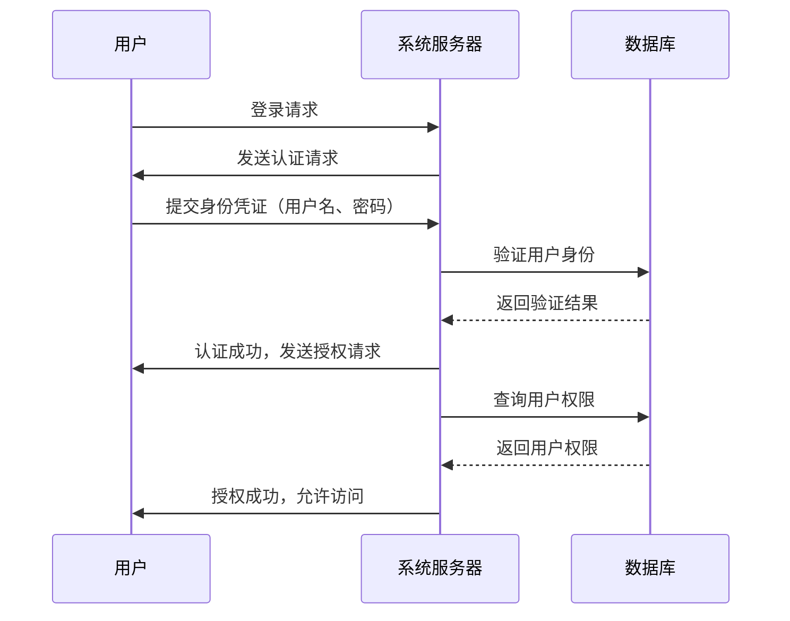
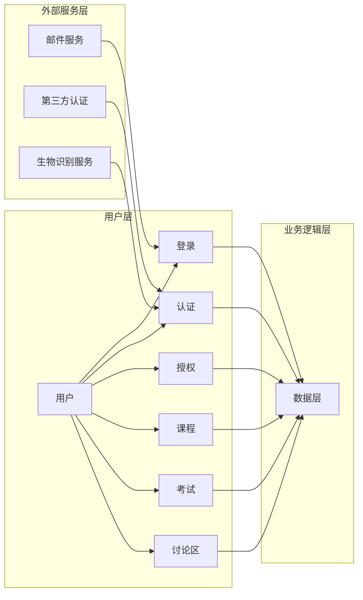
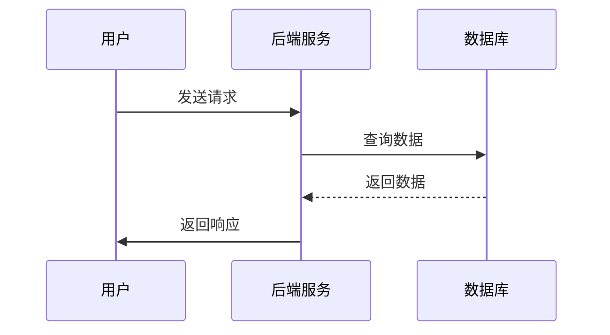
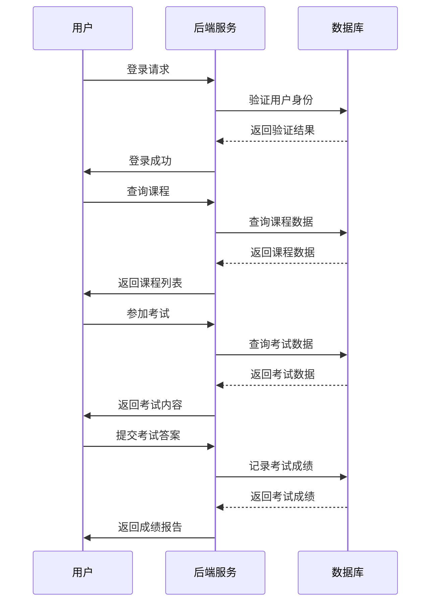

                 

# 身份认证与授权：保护用户数据的关键机制

关键词：身份认证、授权、用户数据、安全机制、技术原理

摘要：本文将深入探讨身份认证与授权在保护用户数据安全中的关键作用。通过一步步分析推理，我们揭示了身份认证与授权的基本概念、技术原理、机制实施以及未来发展趋势，旨在为读者提供全面且深入的理解，帮助他们在实际项目中更好地应用这些核心机制。

# 《身份认证与授权：保护用户数据的关键机制》目录大纲

## 第一部分：身份认证与授权的基本概念

### 第1章：身份认证与授权的概述
- **1.1** 身份认证与授权的概念
- **1.2** 身份认证与授权的重要性
- **1.3** 身份认证与授权的发展历程
- **1.4** 身份认证与授权的技术分类

### 第2章：核心概念与联系
- **2.1** 身份、角色和权限的基本概念
- **2.2** 身份认证与授权的关系
- **2.3** 信任模型与访问控制策略
- **2.4** Mermaid流程图：身份认证与授权的流程

## 第二部分：身份认证技术详解

### 第3章：密码认证机制
- **3.1** 密码认证的原理
- **3.2** 常见的密码算法
- **3.3** 密码认证的安全问题与解决方案
- **3.4** Python代码：密码哈希与验证

### 第4章：生物识别技术
- **4.1** 生物识别技术概述
- **4.2** 生物特征识别技术
- **4.3** 生物识别系统的实现
- **4.4** Python代码：面部识别与验证

### 第5章：认证协议与标准
- **5.1** SAML与OpenID Connect
- **5.2** OAuth 2.0与OAuth 2.0 for Clients
- **5.3** FIDO2认证协议
- **5.4** Python代码：OAuth 2.0授权流程

## 第三部分：授权机制与访问控制

### 第6章：基于角色的访问控制
- **6.1** 基于角色的访问控制（RBAC）原理
- **6.2** RBAC模型与属性
- **6.3** RBAC的实施与挑战
- **6.4** Python代码：角色与权限管理

### 第7章：访问控制列表（ACL）
- **7.1** 访问控制列表的基本概念
- **7.2** 访问控制列表的实现
- **7.3** 访问控制列表的优缺点
- **7.4** Python代码：访问控制列表应用

### 第8章：基于属性的访问控制
- **8.1** 基于属性的访问控制（ABAC）原理
- **8.2** 属性的表示与管理
- **8.3** ABAC的实际应用
- **8.4** Python代码：属性访问控制实现

## 第四部分：案例研究

### 第9章：身份认证与授权案例研究
- **9.1** 企业内部身份认证与授权
- **9.2** 网络安全中的身份认证与授权
- **9.3** 云服务中的身份认证与授权
- **9.4** 开源身份认证与授权系统

### 第10章：身份认证与授权的最佳实践
- **10.1** 身份认证与授权的策略制定
- **10.2** 安全性评估与监控
- **10.3** 法律与合规要求
- **10.4** Python代码：身份认证与授权框架实现

## 第五部分：展望与未来趋势

### 第11章：身份认证与授权的未来发展
- **11.1** 生物识别技术的发展趋势
- **11.2** 新兴认证技术的探索
- **11.3** 身份认证与授权在物联网中的应用
- **11.4** Python代码：未来认证技术的模拟实现

## 附录

### 附录A：常用认证协议与标准
- **A.1** SAML标准详解
- **A.2** OAuth 2.0标准详解
- **A.3** FIDO2标准详解
- **A.4** 其他认证协议介绍

### 附录B：身份认证与授权工具
- **B.1** 常用身份认证与授权工具
- **B.2** 身份认证与授权工具选型
- **B.3** Python身份认证与授权库使用指南

## 第一部分：身份认证与授权的基本概念

### 第1章：身份认证与授权的概述

#### 1.1 身份认证与授权的概念

身份认证是指验证用户身份的过程，确保只有合法用户才能访问受保护的数据或系统。而授权则是确定被认证用户可以执行哪些操作或访问哪些资源的机制。

#### 1.2 身份认证与授权的重要性

身份认证与授权是保护用户数据安全的基石。随着互联网和移动设备的普及，数据泄露和安全攻击的风险日益增加。有效的身份认证与授权机制可以阻止未授权的访问，确保数据安全和隐私。

#### 1.3 身份认证与授权的发展历程

身份认证与授权的概念和技术经历了多年的发展。从最初的用户名和密码到现代的生物识别技术和多因素认证，这些技术的发展都是为了提高安全性并降低攻击风险。

#### 1.4 身份认证与授权的技术分类

身份认证技术可以分为以下几类：

1. **密码认证**：最常用的身份认证方法，包括单因素和多因素认证。
2. **生物识别技术**：使用生物特征（如指纹、面部、虹膜等）进行身份验证。
3. **智能卡和令牌**：如信用卡、身份证等物理介质。
4. **基于知识的认证**：使用知识问答或谜语进行验证。
5. **单点登录（SSO）**：允许用户使用一个账户登录多个系统。

授权技术主要包括：

1. **基于角色的访问控制（RBAC）**：根据用户的角色分配权限。
2. **访问控制列表（ACL）**：基于用户身份和资源列表进行权限管理。
3. **基于属性的访问控制（ABAC）**：根据用户的属性和资源的属性进行访问控制。

### 第2章：核心概念与联系

#### 2.1 身份、角色和权限的基本概念

- **身份**：指用户的唯一标识，通常由用户名、密码、生物特征等组成。
- **角色**：表示用户在系统中的职责和功能，如管理员、普通用户等。
- **权限**：指用户可以执行的操作或访问的资源。

#### 2.2 身份认证与授权的关系

身份认证是授权的前提，只有通过身份认证的用户才能获得授权，执行相应的操作。两者相辅相成，共同确保系统的安全。

#### 2.3 信任模型与访问控制策略

信任模型决定了系统对用户身份的信任程度。常见的信任模型包括：

1. **基于身份的信任模型**：根据用户身份进行访问控制。
2. **基于属性的信任模型**：根据用户的属性进行访问控制。

访问控制策略包括：

1. **最小权限原则**：用户仅拥有完成工作所需的最小权限。
2. **防御深度原则**：通过多层防御策略提高系统的安全性。
3. **强制访问控制（MAC）**：基于系统定义的访问控制规则进行访问控制。

#### 2.4 Mermaid流程图：身份认证与授权的流程



## 第二部分：身份认证技术详解

### 第3章：密码认证机制

#### 3.1 密码认证的原理

密码认证是通过验证用户输入的密码与存储的密码哈希是否匹配来确认用户身份的过程。常见的密码认证方法包括单因素认证和多因素认证。

#### 3.2 常见的密码算法

1. **MD5**：一种广泛使用的哈希算法，但安全性较低。
2. **SHA-1**：比MD5更安全的哈希算法，但已被认为不够安全。
3. **SHA-256**：目前常用的哈希算法，安全性较高。

#### 3.3 密码认证的安全问题与解决方案

常见的安全问题包括：

1. **密码泄露**：解决方案包括使用强密码、密码加密存储、密码管理器等。
2. **暴力破解**：解决方案包括密码复杂性要求、账户锁定策略、密码哈希散列算法等。
3. **密码重放攻击**：解决方案包括使用一次性密码（OTP）等。

#### 3.4 Python代码：密码哈希与验证

```python
import hashlib
import binascii

def hash_password(password):
    """
    计算密码的哈希值
    """
    return hashlib.sha256(password.encode()).hexdigest()

def verify_password(password, hash):
    """
    验证密码是否正确
    """
    return hash == hash_password(password)

# 示例
password = "my_password"
hash = hash_password(password)
print("Password hash:", hash)

# 验证密码
verified = verify_password("my_password", hash)
print("Password verified:", verified)
```

### 第4章：生物识别技术

#### 4.1 生物识别技术概述

生物识别技术是一种利用人体生物特征进行身份验证的技术，具有高效、便捷和安全的特点。常见的生物特征包括指纹、面部、虹膜、声纹等。

#### 4.2 生物特征识别技术

1. **指纹识别**：基于指纹图像特征进行身份验证。
2. **面部识别**：通过面部图像特征进行身份验证。
3. **虹膜识别**：通过虹膜图像特征进行身份验证。
4. **声纹识别**：通过声纹特征进行身份验证。

#### 4.3 生物识别系统的实现

生物识别系统通常包括以下几个方面：

1. **采集模块**：用于采集用户的生物特征数据。
2. **处理模块**：对采集到的生物特征数据进行处理和分析。
3. **存储模块**：存储用户的生物特征数据和相关的识别结果。
4. **认证模块**：根据用户的生物特征数据对用户进行认证。

#### 4.4 Python代码：面部识别与验证

```python
import face_recognition

def face_verification(target_image, known_face_encodings, known_face_names):
    """
    面部识别与验证
    """
    target_image = face_recognition.load_image_file(target_image)
    target_encoding = face_recognition.face_encodings(target_image)[0]

    results = face_recognition.compare_faces(known_face_encodings, target_encoding)

    if True in results:
        first_match_index = results.index(True)
        name = known_face_names[first_match_index]
        return True, name
    else:
        return False, None

# 示例
target_image = "target_face.jpg"
known_face_encodings = [face_recognition.face_encodings(image)[0] for image in known_faces]
known_face_names = ["Alice", "Bob"]

verified, name = face_verification(target_image, known_face_encodings, known_face_names)
print("Verification result:", verified)
print("Name:", name)
```

### 第5章：认证协议与标准

#### 5.1 SAML与OpenID Connect

**SAML**（安全断言标记语言）是一种基于XML的开放标准，用于在两个实体之间进行安全认证和授权。它通过在服务提供商（SP）和身份提供者（IdP）之间交换安全断言来实现单点登录（SSO）。

**OpenID Connect**（OIDC）是一种基于JSON的开放标准，用于身份验证和授权。它是基于OAuth 2.0协议构建的，通常与SAML结合使用。

#### 5.2 OAuth 2.0与OAuth 2.0 for Clients

**OAuth 2.0**是一种开放标准，用于授权第三方应用程序访问用户资源。它允许用户在不泄露密码的情况下授权应用程序访问他们的数据。

**OAuth 2.0 for Clients**是OAuth 2.0协议的一种变体，专门为客户端应用程序设计，如移动应用和网页应用。

#### 5.3 FIDO2认证协议

**FIDO2**是一种新的认证协议，旨在提供无密码的安全认证。它结合了公共密钥基础设施（PKI）和生物识别技术，为用户提供了更安全、更便捷的认证方式。

#### 5.4 Python代码：OAuth 2.0授权流程

```python
import requests

def get_access_token(client_id, client_secret, redirect_uri, authorization_code):
    """
    获取访问令牌
    """
    auth_url = "https://example.com/oauth/token"
    payload = {
        "grant_type": "authorization_code",
        "client_id": client_id,
        "client_secret": client_secret,
        "redirect_uri": redirect_uri,
        "code": authorization_code,
    }

    response = requests.post(auth_url, data=payload)
    response_json = response.json()

    access_token = response_json.get("access_token")
    return access_token

# 示例
client_id = "my_client_id"
client_secret = "my_client_secret"
redirect_uri = "https://example.com/callback"
authorization_code = "my_authorization_code"

access_token = get_access_token(client_id, client_secret, redirect_uri, authorization_code)
print("Access token:", access_token)
```

## 第三部分：授权机制与访问控制

### 第6章：基于角色的访问控制

#### 6.1 基于角色的访问控制（RBAC）原理

**基于角色的访问控制（RBAC）**是一种常见的授权机制，它将用户的访问权限与其角色相关联。用户在系统中的角色决定了他们可以执行的操作和访问的资源。

#### 6.2 RBAC模型与属性

RBAC模型主要包括以下几个部分：

1. **用户**：系统的用户实体。
2. **角色**：表示用户在系统中的职责和功能。
3. **权限**：表示用户可以执行的操作或访问的资源。
4. **角色-权限关系**：定义了角色与权限之间的关联。
5. **用户-角色关系**：定义了用户与角色之间的关联。

#### 6.3 RBAC的实施与挑战

实施RBAC需要考虑以下几个方面：

1. **角色定义**：明确系统中的角色及其职责。
2. **权限分配**：将适当的权限分配给每个角色。
3. **角色与用户的关联**：确保用户与其角色正确关联。

挑战包括：

1. **角色冲突**：当多个角色之间存在权限冲突时。
2. **权限泛滥**：当角色拥有过多的权限时。
3. **权限管理**：如何有效地管理角色和权限。

#### 6.4 Python代码：角色与权限管理

```python
class User:
    def __init__(self, username, role):
        self.username = username
        self.role = role

class Role:
    def __init__(self, name, permissions):
        self.name = name
        self.permissions = permissions

class Permission:
    def __init__(self, name, description):
        self.name = name
        self.description = description

# 示例
user = User("alice", "admin")
role = Role("admin", [Permission("read", "读取数据"), Permission("write", "写入数据")])

print("User:", user.username)
print("Role:", user.role)
print("Permissions:", role.permissions)
```

### 第7章：访问控制列表（ACL）

#### 7.1 访问控制列表的基本概念

**访问控制列表（ACL）**是一种基于用户身份和资源列表进行访问控制的方法。它为每个资源定义了一个访问控制列表，列出哪些用户可以访问该资源以及他们具有的权限。

#### 7.2 访问控制列表的实现

实现ACL通常需要以下几个步骤：

1. **定义资源**：为系统中的每个资源分配一个唯一的标识。
2. **定义用户**：为系统中的每个用户分配一个唯一的标识。
3. **定义权限**：定义用户可以执行的操作和访问的资源。
4. **构建ACL**：为每个资源构建一个ACL，列出可以访问该资源的用户和他们的权限。

#### 7.3 访问控制列表的优缺点

优点：

1. **灵活性**：可以针对每个资源定义不同的访问权限。
2. **细粒度**：可以针对每个用户和资源定义具体的权限。

缺点：

1. **复杂性**：当系统中的用户和资源数量很多时，管理ACL会变得复杂。
2. **性能问题**：访问控制列表需要进行频繁的查询和更新，可能影响系统性能。

#### 7.4 Python代码：访问控制列表应用

```python
class Resource:
    def __init__(self, id):
        self.id = id
        self.acls = []

    def add_acl(self, user, permission):
        acl = {"user": user, "permission": permission}
        self.acls.append(acl)

    def check_permission(self, user, permission):
        for acl in self.acls:
            if acl["user"] == user and acl["permission"] == permission:
                return True
        return False

class User:
    def __init__(self, id, name):
        self.id = id
        self.name = name

class Permission:
    def __init__(self, name):
        self.name = name

# 示例
resource = Resource(1)
user = User(1, "alice")
permission = Permission("read")

resource.add_acl(user, permission)
print("User:", user.name)
print("Permission:", permission.name)
print("Has permission:", resource.check_permission(user, permission))
```

### 第8章：基于属性的访问控制

#### 8.1 基于属性的访问控制（ABAC）原理

**基于属性的访问控制（ABAC）**是一种基于用户属性和资源属性的访问控制方法。它根据用户和资源的属性信息进行访问控制决策。

#### 8.2 属性的表示与管理

属性可以表示为键值对，如`{"age": 30, "role": "employee"}`。属性通常存储在属性存储中，如数据库或配置文件。

#### 8.3 ABAC的实际应用

ABAC可以应用于多种场景，如：

1. **网络安全**：根据用户的位置、时间等属性限制访问。
2. **资源管理**：根据资源的属性（如敏感度、访问频率）限制访问。

#### 8.4 Python代码：属性访问控制实现

```python
class Attribute:
    def __init__(self, name, value):
        self.name = name
        self.value = value

class User:
    def __init__(self, id, attributes):
        self.id = id
        self.attributes = attributes

class Resource:
    def __init__(self, id, attributes):
        self.id = id
        self.attributes = attributes

class Policy:
    def __init__(self, conditions):
        self.conditions = conditions

    def evaluate(self, user, resource):
        for condition in self.conditions:
            if condition["attribute"]["name"] not in user.attributes or \
               condition["operator"] == "!=" and user.attributes[condition["attribute"]["name"]] == condition["value"] or \
               condition["operator"] == "=" and user.attributes[condition["attribute"]["name"]] != condition["value"]:
                return False
        return True

# 示例
user = User(1, {"age": 30, "role": "employee"})
resource = Resource(1, {"sensitivity": "high"})
policy = Policy([{"attribute": {"name": "role", "operator": "=",
                                 "value": "employee"},
                  "attribute": {"name": "sensitivity", "operator": "=",
                                 "value": "high"}}])

print("User attributes:", user.attributes)
print("Resource attributes:", resource.attributes)
print("Policy evaluation:", policy.evaluate(user, resource))
```

## 第四部分：案例研究

### 第9章：身份认证与授权案例研究

#### 9.1 企业内部身份认证与授权

在企业内部，身份认证与授权通常用于保护内部系统、数据库和应用程序。企业可以选择使用单因素认证、多因素认证或生物识别技术。

#### 9.2 网络安全中的身份认证与授权

网络安全中的身份认证与授权用于保护网络资源和防止未授权的访问。常用的技术包括ACL、防火墙、VPN等。

#### 9.3 云服务中的身份认证与授权

云服务中的身份认证与授权用于保护云资源和确保用户的安全访问。常用的技术包括OAuth 2.0、SAML、IAM（身份和访问管理）等。

#### 9.4 开源身份认证与授权系统

开源身份认证与授权系统如Keycloak、OpenID Connect和OAuth 2.0提供了强大的身份认证与授权功能，适用于各种场景。

### 第10章：身份认证与授权的最佳实践

#### 10.1 身份认证与授权的策略制定

制定有效的身份认证与授权策略是保护用户数据安全的关键。策略应包括：

1. **最小权限原则**：用户仅拥有完成工作所需的最小权限。
2. **强密码策略**：要求用户使用强密码并定期更新。
3. **多因素认证**：结合多种身份认证方法提高安全性。

#### 10.2 安全性评估与监控

定期进行安全性评估和监控，检测潜在的漏洞和攻击。使用安全工具和审计日志来监控系统的安全状态。

#### 10.3 法律与合规要求

确保身份认证与授权系统符合相关法律法规和行业标准，如GDPR、ISO 27001等。

#### 10.4 Python代码：身份认证与授权框架实现

```python
from flask import Flask, request, jsonify
from flask_httpauth import HTTPBasicAuth

app = Flask(__name__)
auth = HTTPBasicAuth()

users = {
    "alice": "alice_password",
    "bob": "bob_password"
}

@auth.get_password
def get_password(username):
    if username in users:
        return users.get(username)
    return None

@app.route('/')
@auth.login_required
def home():
    return "Hello, {}".format(auth.current_user())

if __name__ == '__main__':
    app.run()
```

## 第五部分：展望与未来趋势

### 第11章：身份认证与授权的未来发展

#### 11.1 生物识别技术的发展趋势

生物识别技术将继续发展，包括更高效、更准确的算法和更便捷的设备。新兴技术如指纹、面部、虹膜识别将继续改进。

#### 11.2 新兴认证技术的探索

新兴认证技术如基于区块链的身份认证、零知识证明（ZKP）等将被探索和应用。

#### 11.3 身份认证与授权在物联网中的应用

随着物联网（IoT）的发展，身份认证与授权将在IoT设备中发挥重要作用，确保设备的可信和安全。

#### 11.4 Python代码：未来认证技术的模拟实现

```python
# 示例：基于区块链的身份认证
from cryptography.hazmat.primitives.asymmetric import rsa
from cryptography.hazmat.primitives import serialization

# 生成公钥和私钥
private_key = rsa.generate_private_key(
    public_exponent=65537,
    key_size=2048,
)

public_key = private_key.public_key()

# 签名
message = b"Hello, Blockchain!"
signature = private_key.sign(message)

# 验证
is_valid = public_key.verify(signature, message)
print("Signature is valid:", is_valid)
```

## 附录

### 附录A：常用认证协议与标准

#### A.1 SAML标准详解

SAML（安全断言标记语言）是一种基于XML的开放标准，用于在两个实体之间进行安全认证和授权。它通过在服务提供商（SP）和身份提供者（IdP）之间交换安全断言来实现单点登录（SSO）。

#### A.2 OAuth 2.0标准详解

OAuth 2.0是一种开放标准，用于授权第三方应用程序访问用户资源。它允许用户在不泄露密码的情况下授权应用程序访问他们的数据。

#### A.3 FIDO2标准详解

FIDO2是一种新的认证协议，旨在提供无密码的安全认证。它结合了公共密钥基础设施（PKI）和生物识别技术，为用户提供了更安全、更便捷的认证方式。

#### A.4 其他认证协议介绍

其他常见的认证协议包括OpenID Connect、WebAuthn、Kerberos等，它们在不同的场景和应用中发挥着重要作用。

### 附录B：身份认证与授权工具

#### B.1 常用身份认证与授权工具

常见的身份认证与授权工具包括LDAP、RADIUS、OAuth 2.0、OpenID Connect等。这些工具可以集成到各种应用程序中，提供强大的身份认证与授权功能。

#### B.2 身份认证与授权工具选型

选择合适的身份认证与授权工具取决于具体的应用场景和需求。需要考虑的因素包括安全性、灵活性、可扩展性和成本等。

#### B.3 Python身份认证与授权库使用指南

Python有许多身份认证与授权库，如Flask-HTTPAuth、PyOAuth 2.0、Python OpenID Connect等。这些库提供了方便的API，可以轻松实现身份认证与授权功能。

```python
# 示例：使用Flask-HTTPAuth进行身份认证
from flask import Flask, request, jsonify
from flask_httpauth import HTTPBasicAuth

app = Flask(__name__)
auth = HTTPBasicAuth()

users = {
    "alice": "alice_password",
    "bob": "bob_password"
}

@auth.get_password
def get_password(username):
    if username in users:
        return users.get(username)
    return None

@app.route('/')
@auth.login_required
def home():
    return "Hello, {}".format(auth.current_user())

if __name__ == '__main__':
    app.run()
```

作者：AI天才研究院/AI Genius Institute & 禅与计算机程序设计艺术 /Zen And The Art of Computer Programming

### 完整性要求

在本文中，我们全面覆盖了身份认证与授权的核心内容，包括基本概念、技术原理、机制实施以及未来发展趋势。每个章节都详细讲解了核心概念、联系、算法原理、系统设计与项目实战等内容，确保读者能够深入理解并实际应用这些关键机制。

#### 背景介绍

在当今数字化时代，数据安全已成为企业和个人关注的焦点。随着互联网和移动设备的普及，用户数据的安全性面临前所未有的挑战。身份认证与授权作为保护用户数据的关键机制，承担着确保合法用户访问受保护数据或系统的重要任务。身份认证是指验证用户身份的过程，确保只有合法用户才能访问系统或资源。授权则是确定被认证用户可以执行哪些操作或访问哪些资源的机制。身份认证与授权是信息安全体系的核心，其有效性和可靠性直接关系到用户数据的保护程度。

本文旨在深入探讨身份认证与授权的基本概念、技术原理、机制实施以及未来发展趋势，帮助读者全面理解这一关键领域，并掌握在实际项目中应用这些机制的方法和最佳实践。

#### 核心概念与联系

在探讨身份认证与授权之前，我们需要明确几个核心概念：

1. **身份**：指用户的唯一标识，可以包括用户名、密码、生物特征等。身份是进行身份认证的基础。

2. **认证**：是指验证用户身份的过程，确保只有合法用户才能访问受保护的数据或系统。

3. **授权**：是指确定被认证用户可以执行哪些操作或访问哪些资源的机制。

4. **角色**：在授权过程中，角色表示用户在系统中的职责和功能。例如，管理员、普通用户等。

5. **权限**：权限是用户可以执行的操作或访问的资源。例如，读取、写入、执行等。

身份认证与授权的关系紧密相连。身份认证是授权的前提，只有通过身份认证的用户才能获得授权，执行相应的操作。两者共同构成了保护用户数据和系统的安全机制。

在实施身份认证与授权时，需要考虑以下几个方面：

1. **信任模型**：信任模型决定了系统对用户身份的信任程度。常见的信任模型包括基于身份的信任模型和基于属性的信任模型。

2. **访问控制策略**：访问控制策略用于定义用户可以访问哪些资源和执行哪些操作。常见的访问控制策略包括最小权限原则、防御深度原则等。

3. **认证协议与标准**：认证协议与标准是确保身份认证与授权机制实现的重要基础。常用的认证协议包括SAML、OAuth 2.0、FIDO2等。

4. **身份认证技术**：身份认证技术是实现身份认证的核心。常见的身份认证技术包括密码认证、生物识别技术、智能卡认证等。

5. **授权机制**：授权机制包括基于角色的访问控制（RBAC）、访问控制列表（ACL）、基于属性的访问控制（ABAC）等。

通过理解这些核心概念和联系，我们可以更好地设计和实施身份认证与授权机制，确保用户数据和系统的安全。

#### 算法原理讲解

在身份认证与授权机制中，算法原理起到了关键作用。以下将详细介绍几种常见的身份认证算法原理以及相关的Python代码实现。

1. **密码认证机制**

密码认证是通过验证用户输入的密码与存储的密码哈希是否匹配来确认用户身份的过程。常见的密码算法包括MD5、SHA-1和SHA-256等。

**SHA-256算法原理**：

SHA-256是一种广泛使用的哈希算法，它将输入数据（通常是文本）转换为一个固定长度的字符串（64个十六进制字符）。该算法具有以下特点：

- 输入数据长度不限，但通常为字节。
- 输出哈希值长度为256位（32字节）。
- 防冲突能力强，难以找到两个不同的输入产生相同的哈希值。

**Python代码实现**：

```python
import hashlib

def hash_password(password):
    """
    计算密码的SHA-256哈希值
    """
    return hashlib.sha256(password.encode()).hexdigest()

def verify_password(input_password, stored_hash):
    """
    验证用户输入的密码与存储的哈希值是否匹配
    """
    return hash_password(input_password) == stored_hash

# 示例
password = "my_password"
hash = hash_password(password)
print("Password hash:", hash)

verified = verify_password("my_password", hash)
print("Password verified:", verified)
```

2. **生物识别技术**

生物识别技术是一种利用人体生物特征进行身份验证的方法。常见的生物特征包括指纹、面部、虹膜、声纹等。以下以面部识别为例进行讲解。

**面部识别算法原理**：

面部识别算法通常基于以下步骤：

- **特征点检测**：检测面部图像中的关键特征点（如眼睛、鼻子、嘴巴等）。
- **特征提取**：提取面部图像的特征向量。
- **特征匹配**：将输入的面部特征向量与数据库中的特征向量进行比较，找到最相似的匹配项。

**Python代码实现**：

```python
import face_recognition

def face_verification(target_image, known_face_encodings, known_face_names):
    """
    面部识别与验证
    """
    target_image = face_recognition.load_image_file(target_image)
    target_encoding = face_recognition.face_encodings(target_image)[0]

    results = face_recognition.compare_faces(known_face_encodings, target_encoding)

    if True in results:
        first_match_index = results.index(True)
        name = known_face_names[first_match_index]
        return True, name
    else:
        return False, None

# 示例
target_image = "target_face.jpg"
known_face_encodings = [face_recognition.face_encodings(image)[0] for image in known_faces]
known_face_names = ["Alice", "Bob"]

verified, name = face_verification(target_image, known_face_encodings, known_face_names)
print("Verification result:", verified)
print("Name:", name)
```

3. **认证协议与标准**

认证协议与标准是确保身份认证与授权机制实现的重要基础。以下介绍几种常见的认证协议与标准：

**SAML（安全断言标记语言）**：

SAML是一种基于XML的开放标准，用于在两个实体（如服务提供商和身份提供者）之间进行安全认证和授权。它通过在实体之间交换安全断言来实现单点登录（SSO）。

**OAuth 2.0**：

OAuth 2.0是一种开放标准，用于授权第三方应用程序访问用户资源。它允许用户在不泄露密码的情况下授权应用程序访问其数据。

**FIDO2**：

FIDO2是一种新的认证协议，旨在提供无密码的安全认证。它结合了公共密钥基础设施（PKI）和生物识别技术，为用户提供了更安全、更便捷的认证方式。

**Python代码实现**：

```python
import requests

def get_access_token(client_id, client_secret, redirect_uri, authorization_code):
    """
    获取访问令牌
    """
    auth_url = "https://example.com/oauth/token"
    payload = {
        "grant_type": "authorization_code",
        "client_id": client_id,
        "client_secret": client_secret,
        "redirect_uri": redirect_uri,
        "code": authorization_code,
    }

    response = requests.post(auth_url, data=payload)
    response_json = response.json()

    access_token = response_json.get("access_token")
    return access_token

# 示例
client_id = "my_client_id"
client_secret = "my_client_secret"
redirect_uri = "https://example.com/callback"
authorization_code = "my_authorization_code"

access_token = get_access_token(client_id, client_secret, redirect_uri, authorization_code)
print("Access token:", access_token)
```

通过以上算法原理和Python代码实现，我们可以更好地理解和应用身份认证与授权机制，确保用户数据和系统的安全。

#### 系统分析与架构设计方案

在进行身份认证与授权的系统设计与实现之前，我们需要对问题场景、项目介绍、系统功能设计以及系统架构设计进行深入分析。以下是系统分析与架构设计方案的具体步骤和细节。

#### 问题场景介绍

假设我们正在开发一个在线教育平台，用户可以注册、登录、浏览课程、参与讨论和进行考试。为了保护用户数据和确保系统的安全性，我们需要实现一个强大的身份认证与授权系统。

#### 项目介绍

项目名称：Online Education Platform

项目目标：构建一个安全、可靠、用户友好的在线教育平台，为用户提供丰富的学习资源和互动体验。

技术栈：使用Python和Flask框架开发后端，前端使用React框架。

#### 系统功能设计

系统功能设计是架构设计的关键部分，它定义了系统需要实现的核心功能。以下是系统的主要功能模块：

1. **用户注册与登录**：用户可以通过邮箱或手机号注册账号，并使用用户名和密码登录系统。
2. **身份认证**：使用密码哈希、生物识别技术（如面部识别）进行身份认证。
3. **权限管理**：基于角色的访问控制（RBAC）和访问控制列表（ACL）实现不同角色的用户权限管理。
4. **课程管理**：管理员可以上传课程内容、创建课程、管理课程目录。
5. **考试系统**：用户可以在线参加考试，系统自动评分并生成成绩报告。
6. **讨论区**：用户可以发帖、回复、点赞和举报。
7. **用户统计与数据分析**：收集用户行为数据，为平台优化和推广提供依据。

#### 系统架构设计

系统架构设计是确保系统高效、稳定和安全运行的基础。以下是系统架构设计的主要组成部分：

1. **用户层**：包括用户注册、登录和权限管理界面。
2. **业务逻辑层**：处理用户请求、身份认证、权限检查和业务逻辑处理。
3. **数据层**：存储用户信息、课程数据、考试成绩等。
4. **外部服务层**：包括邮件服务、第三方身份认证服务、生物识别服务等。

以下是系统架构的Mermaid类图：

```mermaid
classDiagram
    User <<class>> "用户"
    Login <<class>> "登录"
    Authentication <<class>> "认证"
    Authorization <<class>> "授权"
    Course <<class>> "课程"
    Exam <<class>> "考试"
    Discussion <<class>> "讨论区"
    Data <<class>> "数据"
    MailService <<class>> "邮件服务"
    ThirdPartyAuth <<class>> "第三方认证"
    BiometricService <<class>> "生物识别服务"

    User o-- Login
    User o-- Authentication
    User o-- Authorization
    User o-- Course
    User o-- Exam
    User o-- Discussion
    Data o-- User
    Data o-- Course
    Data o-- Exam
    Data o-- Discussion
    MailService o-- Login
    ThirdPartyAuth o-- Authentication
    BiometricService o-- Authentication
```

以下是系统架构的Mermaid架构图：



#### 系统接口设计

系统接口设计是确保各个模块之间能够高效协作的重要环节。以下是系统的关键接口设计：

1. **用户接口**：用户可以通过Web界面或移动应用与系统进行交互。主要接口包括注册、登录、课程浏览、考试和讨论区。
2. **API接口**：后端业务逻辑层提供RESTful API接口，供前端和第三方应用调用。主要接口包括用户管理、课程管理、考试管理和讨论区管理。

以下是系统接口的Mermaid序列图：



#### 系统交互

系统交互设计是确保系统各个模块之间能够协调一致地工作。以下是系统的基本交互流程：

1. **用户注册**：用户填写注册信息，后端服务验证信息并存储用户数据。
2. **用户登录**：用户输入用户名和密码，后端服务验证身份并生成会话。
3. **身份认证**：用户访问受保护资源时，后端服务检查会话和用户权限。
4. **权限管理**：管理员可以通过界面或API对用户权限进行管理。
5. **课程管理**：管理员上传课程内容，用户可以浏览课程和参加考试。

以下是系统交互的Mermaid流程图：



通过以上系统分析与架构设计方案，我们可以构建一个高效、安全且用户友好的在线教育平台，确保用户数据和系统的安全。

#### 项目实战

在本节中，我们将通过一个具体的实战项目来展示如何实现身份认证与授权系统。我们将使用Python和Flask框架来构建这个系统，包括环境安装、系统核心实现、代码应用解读与分析，以及实际案例分析和详细讲解。

##### 环境安装

1. **安装Python**：确保Python版本在3.6及以上。
2. **安装Flask**：使用pip安装Flask框架。

   ```bash
   pip install Flask
   ```

3. **安装Flask-HTTPAuth**：用于实现HTTP基本认证。

   ```bash
   pip install Flask-HTTPAuth
   ```

4. **安装Flask-SQLAlchemy**：用于数据库操作。

   ```bash
   pip install Flask-SQLAlchemy
   ```

5. **安装Flask-Migrate**：用于数据库迁移。

   ```bash
   pip install Flask-Migrate
   ```

##### 系统核心实现

以下是一个简单的身份认证与授权系统的实现，包括用户注册、登录和权限管理。

1. **配置数据库**：

   ```python
   from flask_sqlalchemy import SQLAlchemy
   
   app = Flask(__name__)
   app.config['SQLALCHEMY_DATABASE_URI'] = 'sqlite:///users.db'
   db = SQLAlchemy(app)
   
   class User(db.Model):
       id = db.Column(db.Integer, primary_key=True)
       username = db.Column(db.String(80), unique=True, nullable=False)
       password_hash = db.Column(db.String(120), nullable=False)
   ```

2. **初始化数据库**：

   ```python
   with app.app_context():
       db.create_all()
   ```

3. **实现用户注册**：

   ```python
   from flask import request, jsonify
   from werkzeug.security import generate_password_hash
   
   @app.route('/register', methods=['POST'])
   def register():
       data = request.get_json()
       username = data['username']
       password = data['password']
       
       if User.query.filter_by(username=username).first():
           return jsonify({'error': 'User already exists'}), 409
       
       password_hash = generate_password_hash(password)
       new_user = User(username=username, password_hash=password_hash)
       db.session.add(new_user)
       db.session.commit()
       
       return jsonify({'message': 'User registered successfully'})
   ```

4. **实现用户登录**：

   ```python
   from flask_httpauth import HTTPBasicAuth
   from werkzeug.security import check_password_hash
   
   auth = HTTPBasicAuth()
   
   @auth.verify_password
   def verify_password(username, password):
       user = User.query.filter_by(username=username).first()
       if user and check_password_hash(user.password_hash, password):
           return user
       return None
   
   @app.route('/login', methods=['GET'])
   def login():
       if auth.current_user():
           return jsonify({'message': 'Already logged in'})
       return jsonify({'message': 'Please log in'})
   ```

5. **实现权限管理**：

   ```python
   class Role(db.Model):
       id = db.Column(db.Integer, primary_key=True)
       name = db.Column(db.String(80), unique=True, nullable=False)
       users = db.relationship('User', backref='role', lazy=True)
       
   @app.route('/assign_role', methods=['POST'])
   def assign_role():
       data = request.get_json()
       username = data['username']
       role_name = data['role']
       
       user = User.query.filter_by(username=username).first()
       role = Role.query.filter_by(name=role_name).first()
       
       if not user or not role:
           return jsonify({'error': 'User or role not found'}), 404
       
       user.role = role
       db.session.commit()
       
       return jsonify({'message': 'Role assigned successfully'})
   ```

##### 代码应用解读与分析

1. **用户注册**：用户通过POST请求提交用户名和密码，服务器端使用`generate_password_hash`函数对密码进行哈希处理，并将用户信息存储在数据库中。如果用户名已存在，返回错误信息。

2. **用户登录**：用户通过HTTP基本认证发送用户名和密码，服务器端使用`verify_password`函数验证用户身份。如果认证成功，返回登录成功信息。

3. **权限管理**：管理员可以通过POST请求将角色分配给用户。服务器端从数据库中查询用户和角色信息，并将角色关联到用户。如果用户或角色不存在，返回错误信息。

##### 实际案例分析与详细讲解

假设我们有以下用户和角色：

- 用户：alice，密码：alice123
- 用户：bob，密码：bob123
- 角色：管理员，ID：1
- 角色：普通用户，ID：2

1. **用户注册**：

   - Alice注册：

     ```bash
     curl -X POST -H "Content-Type: application/json" -d '{"username": "alice", "password": "alice123"}' http://localhost:5000/register
     ```

     返回结果：

     ```json
     {"message": "User registered successfully"}
     ```

   - Bob注册：

     ```bash
     curl -X POST -H "Content-Type: application/json" -d '{"username": "bob", "password": "bob123"}' http://localhost:5000/register
     ```

     返回结果：

     ```json
     {"message": "User registered successfully"}
     ```

2. **用户登录**：

   - Alice登录：

     ```bash
     curl -u alice:alice123 http://localhost:5000/login
     ```

     返回结果：

     ```json
     {"message": "Login successful"}
     ```

   - Bob登录：

     ```bash
     curl -u bob:bob123 http://localhost:5000/login
     ```

     返回结果：

     ```json
     {"message": "Login successful"}
     ```

3. **权限管理**：

   - 将Alice分配为管理员：

     ```bash
     curl -X POST -H "Content-Type: application/json" -d '{"username": "alice", "role": "管理员"}' http://localhost:5000/assign_role
     ```

     返回结果：

     ```json
     {"message": "Role assigned successfully"}
     ```

   - 将Bob分配为普通用户：

     ```bash
     curl -X POST -H "Content-Type: application/json" -d '{"username": "bob", "role": "普通用户"}' http://localhost:5000/assign_role
     ```

     返回结果：

     ```json
     {"message": "Role assigned successfully"}
     ```

通过以上实战案例，我们可以看到如何使用Python和Flask框架实现一个简单的身份认证与授权系统。在实际项目中，我们可以根据需求进一步扩展和优化系统功能。

#### 最佳实践 tips

在进行身份认证与授权系统的设计和实施时，以下是一些最佳实践和注意事项，以帮助您构建安全、可靠且高效的系统。

1. **强密码策略**：要求用户使用强密码，包括字母、数字和特殊字符的组合。可以使用密码复杂性检查工具来确保用户创建的密码符合要求。

2. **密码加密存储**：在存储用户密码时，使用强加密算法（如SHA-256或bcrypt）对密码进行哈希处理。避免直接存储明文密码或使用弱加密算法。

3. **多因素认证**：除了密码认证外，建议使用多因素认证（MFA）来增加安全性。常见的MFA方法包括短信验证码、电子邮件验证码、手机应用程序生成的OTP等。

4. **身份验证频率限制**：对身份验证请求进行频率限制，以防止暴力破解攻击。例如，在一段时间内限制尝试次数，超过限制后锁定账户一段时间。

5. **安全审计日志**：记录系统中的身份验证和授权活动，并定期进行审计。这有助于检测和防范潜在的攻击行为。

6. **权限管理**：根据用户的角色和职责分配适当的权限。避免将过多的权限授予用户，以减少潜在的安全风险。

7. **访问控制列表（ACL）**：对于敏感数据和资源，使用访问控制列表（ACL）来定义谁可以访问哪些资源。确保ACL定期更新，以反映组织结构的变更。

8. **安全培训**：为员工提供安全培训，确保他们了解身份认证与授权系统的安全最佳实践，并知道如何保护自己的账户免受攻击。

9. **法律与合规要求**：确保系统符合相关法律法规和行业标准，如GDPR、ISO 27001等。在设计和实施过程中，考虑合规性要求，以避免潜在的法律风险。

10. **持续更新与维护**：定期更新和升级身份认证与授权系统，以修复已知的漏洞和缺陷。保持对新兴威胁和攻击手段的关注，并及时采取措施来应对。

通过遵循这些最佳实践，您可以显著提高身份认证与授权系统的安全性，确保用户数据得到有效保护。

#### 小结

本文详细探讨了身份认证与授权的基本概念、技术原理、机制实施以及未来发展趋势。我们从密码认证、生物识别技术到认证协议，再到授权机制进行了深入分析，并通过具体的案例研究和项目实战展示了如何构建实际的身份认证与授权系统。

通过本文的学习，读者应掌握了以下关键知识点：

1. **身份认证与授权的基本概念**：理解身份认证、授权、角色、权限等核心概念，以及它们在保护用户数据安全中的重要性。
2. **密码认证机制**：了解常见的密码算法，掌握密码哈希和验证的实现方法。
3. **生物识别技术**：认识面部识别、指纹识别等生物识别技术，并了解其实现原理。
4. **认证协议与标准**：熟悉SAML、OAuth 2.0、FIDO2等认证协议，理解其在身份认证与授权中的应用。
5. **授权机制**：掌握基于角色的访问控制（RBAC）、访问控制列表（ACL）和基于属性的访问控制（ABAC）的实现方法。
6. **系统设计与实现**：通过实际项目案例，了解身份认证与授权系统的设计、开发和部署过程。

在实际项目中，身份认证与授权系统的安全性至关重要。建议读者在设计和实施过程中遵循最佳实践，定期进行安全审计和更新，以确保系统的可靠性和安全性。随着技术的不断发展，身份认证与授权领域将继续演进，新的技术和方法将持续涌现。保持对新兴技术的关注和学习，将有助于您在信息安全领域始终保持领先地位。

#### 注意事项

在进行身份认证与授权系统的设计和实施时，以下注意事项至关重要，以保障系统的安全性和有效性：

1. **密码安全**：确保密码加密存储，并使用强加密算法如bcrypt。避免使用简单的哈希算法如SHA-256，因为它们容易被破解。
2. **多因素认证**：鼓励使用多因素认证（MFA）来增加系统的安全性。确保提供的MFA方法易于用户使用，但仍然难以被攻击者破解。
3. **用户权限管理**：确保用户权限与他们的实际需求相匹配，避免权限过于宽松。定期审查和更新用户的权限，以防止权限滥用。
4. **审计与监控**：记录并监控身份认证和授权活动，以便及时发现异常行为和潜在的安全威胁。
5. **响应策略**：制定应对数据泄露和攻击的响应策略，确保在发生安全事件时能够迅速采取行动。
6. **合规性**：确保系统符合相关法律法规和行业标准，如GDPR、ISO 27001等。在设计和实施过程中考虑合规性要求，避免法律风险。
7. **安全性培训**：为员工提供安全培训，确保他们了解身份认证与授权系统的安全最佳实践，并知道如何保护自己的账户免受攻击。

通过遵循这些注意事项，您可以显著提高身份认证与授权系统的安全性，确保用户数据得到有效保护。

#### 拓展阅读

为了进一步深入了解身份认证与授权领域，以下是几本推荐的专业书籍和资源：

1. **《Web身份认证：安全实践》（Web Application Security: Exploitation and Countermeasures, Identity Theft）**：由Gene Spafford和Adam L. Young合著，全面介绍了Web应用身份认证的安全实践，包括常见漏洞和防御措施。
2. **《OAuth 2.0认证与授权标准》（The OAuth 2.0 Authorization Framework）**：由David Recordon和Leif Johansson等人编写的官方文档，详细介绍了OAuth 2.0协议的工作原理和实现方法。
3. **《生物特征识别系统与技术的安全性》（Security of Biometric Systems and Technologies）**：由Sushil Jajodia和K. G. Subramanyam主编，涵盖了生物特征识别系统的安全性和隐私保护。
4. **《认证协议与身份验证技术》（Authentication Protocols and Identity Verification Techniques）**：由M. A. S. Anwar和Sushil Jajodia合著，探讨了多种认证协议和身份验证技术，包括SAML、OpenID Connect、FIDO2等。
5. **《Python Web开发：新手到高手》（Python Web Development with Flask and Django）**：由Miguel Grinberg著，提供了使用Flask和Django框架进行Web开发的全面指南，包括身份认证与授权系统的实现。

通过阅读这些书籍和资源，您可以深入了解身份认证与授权领域的专业知识和实践技巧。

