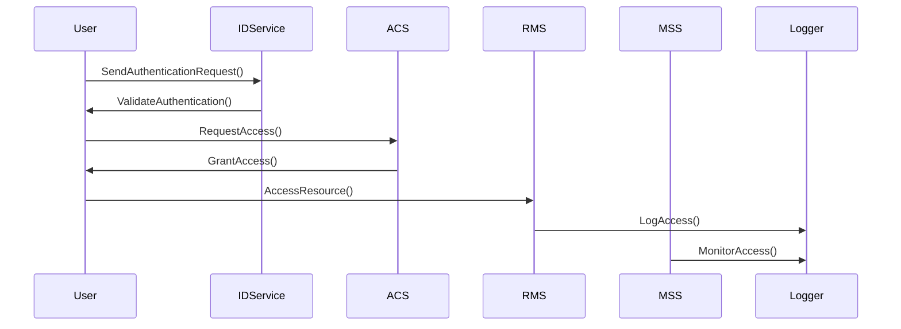
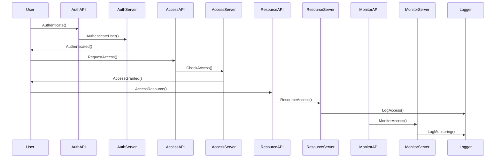

                 

### 文章标题

# 身份认证与授权：零信任安全模型

## 关键词

- **身份认证**  
- **授权机制**  
- **零信任安全模型**  
- **多因素认证**  
- **基于属性的访问控制**  
- **基于角色的访问控制**  
- **生物识别技术**  
- **零信任架构**

## 摘要

本文深入探讨零信任安全模型中的身份认证与授权机制。我们首先介绍了零信任安全模型的概念与起源，阐述了其在现代网络安全中的重要性。接着，我们详细分析了身份认证的核心概念、技术及其安全性。随后，我们探讨了授权机制的基本概念和不同类型的授权策略，包括基于角色的访问控制（RBAC）、基于属性的访问控制（ABAC）和细粒度访问控制（GBAC）。文章还通过一个实际项目案例，展示了如何在现实中实现零信任安全模型。最后，我们总结了最佳实践，并提供了进一步阅读的推荐资源。

## 目录

1. **零信任安全模型概述**
   - 1.1 零信任安全模型的概念与起源
   - 1.2 身份认证与授权的核心概念
   - 1.3 零信任模型的架构与设计原则
   - 1.4 零信任模型的实际应用场景
   - 1.5 本章小结

2. **身份认证技术详解**
   - 2.1 多因素身份认证
   - 2.2 生物识别技术
   - 2.3 凭证与密钥管理
   - 2.4 身份认证协议
   - 2.5 身份认证系统的安全性分析
   - 2.6 本章小结

3. **授权机制与策略**
   - 3.1 授权机制的基本概念
   - 3.2 基于角色的访问控制（RBAC）
   - 3.3 基于属性的访问控制（ABAC）
   - 3.4 细粒度访问控制（GBAC）
   - 3.5 授权策略的设计与优化
   - 3.6 本章小结

4. **系统分析与架构设计方案**
   - 4.1 问题场景介绍
   - 4.2 系统功能设计
   - 4.3 系统架构设计
   - 4.4 系统接口设计
   - 4.5 系统交互
   - 4.6 本章小结

5. **项目实战**
   - 5.1 环境安装
   - 5.2 系统核心实现源代码
   - 5.3 代码应用解读与分析
   - 5.4 实际案例分析与详细讲解
   - 5.5 项目小结

6. **最佳实践 tips、小结、注意事项、拓展阅读等内容**
   - 6.1 最佳实践 tips
   - 6.2 小结
   - 6.3 注意事项
   - 6.4 拓展阅读

### 零信任安全模型概述

**1.1 零信任安全模型的概念与起源**

零信任安全模型（Zero Trust Model）是一种新型的网络安全理念，起源于2010年Forrester Research公司分析师John Kindervag提出的“零信任网络访问”（Zero Trust Network Access，ZTNA）概念。该模型的核心思想是“永不信任，总是验证”，即不再假设内部网络是安全的，对所有访问请求都进行严格的验证和授权。

**零信任安全模型的起源与发展**

零信任安全模型的提出源于传统安全模型的局限性。传统安全模型主要基于边界防御，认为内部网络是可信的，外部网络是不可信的。然而，随着云计算、移动办公和物联网的发展，边界变得模糊，内部网络的安全风险日益增加。因此，零信任安全模型应运而生，通过持续的身份验证和访问控制，确保安全性和灵活性。

**1.2 身份认证与授权的核心概念**

身份认证（Authentication）是验证用户身份的过程，确保只有合法用户才能访问系统。常见的身份认证方式包括密码认证、多因素认证、生物识别等。

授权（Authorization）则是确定用户是否有权限执行特定操作。授权机制包括基于角色的访问控制（RBAC）、基于属性的访问控制（ABAC）和细粒度访问控制（GBAC）等。

**1.3 零信任模型的架构与设计原则**

零信任模型的架构设计原则包括：

- **最小权限原则**：用户和设备在访问系统时，只授予必要的权限。
- **多因素验证原则**：在身份认证时，采用多因素验证，提高安全性。
- **动态访问控制原则**：根据用户的身份、设备、访问时间等因素动态调整访问权限。

**1.4 零信任模型的实际应用场景**

零信任模型适用于多种场景，如企业内部应用、云服务应用和物联网应用等。其优势在于提高安全性、减少攻击面、提高响应速度等。

**1.5 本章小结**

零信任安全模型是一种现代网络安全理念，通过持续的身份验证和访问控制，确保系统的安全性和灵活性。身份认证与授权是其核心组成部分，必须深入理解并正确实施。接下来，我们将详细探讨身份认证与授权的技术细节。

### 身份认证技术详解

**2.1 多因素身份认证**

多因素身份认证（Multi-Factor Authentication，MFA）是一种常见的身份认证方式，通过结合两种或两种以上的认证因素，提高系统的安全性。常见的多因素认证包括密码、生物识别、短信验证码、硬件令牌等。

**2.1.1 多因素认证的概念**

多因素认证的核心思想是：攻击者即使掌握了其中一个因素（如密码），也无法完成对系统的完全访问。多因素认证通常包括以下三个认证因素：

1. **知识因素**：只有用户知道的信息，如密码、验证码等。
2. **持有因素**：用户持有的物品，如手机、硬件令牌等。
3. **生物特征因素**：用户的生物特征，如指纹、虹膜、面部识别等。

**2.1.2 多因素认证的类型**

常见的多因素认证类型包括：

1. **双因素认证**：结合密码和持有因素，如手机短信验证码。
2. **三因素认证**：结合密码、持有因素和生物特征因素。

**2.1.3 多因素认证的实施**

实施多因素认证需要以下几个步骤：

1. **用户注册**：用户在注册时，需要提供至少一个知识因素和一个持有因素。
2. **身份验证**：用户访问系统时，需要提供所有认证因素。
3. **认证结果**：系统根据提供的认证因素，判断用户是否为合法用户。

**2.2 生物识别技术**

生物识别技术（Biometric Authentication）是一种基于用户生物特征的认证方式，常见的生物识别技术包括指纹识别、虹膜识别、面部识别等。

**2.2.1 生物识别技术的原理**

生物识别技术通过采集用户的生物特征，与预先存储的特征数据进行比对，实现身份验证。其基本原理包括：

1. **特征采集**：通过传感器或摄像头等设备，采集用户的生物特征。
2. **特征提取**：从采集到的生物特征中，提取出可用于比对的特征值。
3. **特征比对**：将提取到的特征值与存储的特征值进行比对，判断用户身份。

**2.2.2 常见的生物识别技术**

常见的生物识别技术包括：

1. **指纹识别**：通过指纹的唯一性进行身份验证。
2. **虹膜识别**：通过虹膜的图案和纹理进行身份验证。
3. **面部识别**：通过面部特征进行身份验证。

**2.2.3 生物识别技术的应用与挑战**

生物识别技术的应用场景包括：

1. **安全系统**：如门禁系统、身份验证系统等。
2. **支付系统**：如移动支付、在线支付等。

生物识别技术面临的挑战包括：

1. **隐私保护**：生物特征数据的存储和传输需要严格保护。
2. **准确性**：生物识别技术的准确性受多种因素影响。

**2.3 凭证与密钥管理**

凭证（Credential）是用户访问系统的身份标识，常见的凭证包括用户名、密码、证书等。密钥（Key）是加密和解密数据的关键，用于保障数据的安全性。

**2.3.1 凭证的概念与管理**

凭证的概念包括：

1. **用户名**：用于标识用户的唯一标识。
2. **密码**：用户访问系统的秘密信息。
3. **证书**：由可信第三方颁发的电子凭证。

凭证的管理包括：

1. **凭证的生成**：系统为用户生成唯一的凭证。
2. **凭证的存储**：将凭证存储在安全的地方，如数据库、密钥管理系统等。
3. **凭证的更新**：定期更新凭证，提高安全性。

**2.3.2 密钥的概念与管理**

密钥的概念包括：

1. **加密密钥**：用于加密数据的密钥。
2. **解密密钥**：用于解密数据的密钥。

密钥的管理包括：

1. **密钥的生成**：系统生成安全的密钥。
2. **密钥的存储**：将密钥存储在安全的密钥管理系统中。
3. **密钥的备份与恢复**：定期备份密钥，并确保在需要时可以恢复。

**2.4 身份认证协议**

身份认证协议是用于实现身份认证的一套规则和标准。常见的身份认证协议包括OAuth 2.0、OpenID Connect、SAML 2.0和Kerberos协议。

**2.4.1 OAuth 2.0 与 OpenID Connect**

OAuth 2.0 是一种授权协议，允许第三方应用在用户的授权下访问其资源。OpenID Connect 是 OAuth 2.0 的身份验证扩展，用于实现用户身份认证。

**2.4.2 SAML 2.0**

SAML 2.0 是一种基于XML的开放标准，用于实现单点登录（SSO）和身份验证。

**2.4.3 Kerberos 协议**

Kerberos 协议是一种基于票据的认证协议，广泛应用于企业内部网络。

**2.5 身份认证系统的安全性分析**

身份认证系统的安全性分析包括以下几个方面：

1. **常见的安全威胁**：如暴力破解、钓鱼攻击、中间人攻击等。
2. **安全性评估与改进**：通过安全评估，发现和修复系统漏洞。
3. **安全性设计**：采用多因素认证、生物识别等技术，提高系统的安全性。

**2.6 本章小结**

身份认证是零信任安全模型的重要组成部分，通过多因素认证、生物识别、凭证与密钥管理等技术，确保系统的安全性。身份认证协议则提供了实现身份认证的标准和规则。接下来，我们将探讨授权机制与策略。

### 授权机制与策略

**3.1 授权机制的基本概念**

授权机制（Authorization Mechanism）是确保用户在经过身份认证后，能够访问和执行他们被允许的操作的一系列规则和策略。授权的核心目标是限制用户权限，确保系统资源的机密性、完整性和可用性。

**3.1.1 授权机制的定义**

授权机制是指定义和实现用户权限的过程，确保用户只能访问和操作他们被授权的资源。这通常涉及以下关键组成部分：

- **用户**：系统中的用户实体。
- **权限**：用户可以执行的操作集。
- **资源**：用户可以访问的数据、应用或系统功能。
- **策略**：定义哪些用户可以访问哪些资源的规则。

**3.1.2 授权机制的分类**

授权机制可以根据其实现方式分为以下几种类型：

1. **基于角色的访问控制（RBAC）**
2. **基于属性的访问控制（ABAC）**
3. **细粒度访问控制（GBAC）**

**3.1.3 授权机制在零信任模型中的重要性**

在零信任模型中，授权机制是确保安全策略实施的关键部分。它不仅限制了用户对资源的访问，还确保了每个访问请求都经过严格的验证和授权。零信任模型强调持续验证和最小权限原则，因此授权机制必须能够灵活地适应各种访问场景，同时确保高效和安全性。

**3.2 基于角色的访问控制（RBAC）**

基于角色的访问控制（Role-Based Access Control，RBAC）是一种广泛使用的授权机制，它通过将用户分配到不同的角色来实现权限管理。每个角色有一组预定义的权限，用户在成为该角色的成员时自动获得这些权限。

**3.2.1 RBAC的基本原理**

RBAC的基本原理包括以下几个关键组成部分：

- **角色**：角色是一组用户和权限的集合。角色通常与业务流程或职责相关联。
- **权限**：权限是用户可以执行的操作，如读取、写入、删除等。
- **用户**：用户是系统的最终操作者，他们的身份通常通过身份认证系统验证。
- **角色分配**：将用户分配到特定角色，用户因此获得该角色的权限。
- **权限分配**：为角色分配权限，确保用户在成为角色成员时能够执行相应的操作。

**3.2.2 RBAC模型的组成部分**

RBAC模型通常包括以下组成部分：

- **角色分配（RAB）**：定义用户与角色的关联。
- **权限分配（PAP）**：定义角色与权限的关联。
- **访问控制（ACC）**：决定用户是否可以执行特定操作。

**3.2.3 RBAC的实现方法**

RBAC的实现方法包括：

- **基于规则的实现**：使用规则定义用户的角色和权限。
- **基于权限的分配**：直接将权限分配给用户，通过角色分配来实现权限管理。
- **基于角色的分配**：通过角色分配将权限赋予用户。

**3.3 基于属性的访问控制（ABAC）**

基于属性的访问控制（Attribute-Based Access Control，ABAC）是一种灵活的授权机制，它通过用户属性、环境属性和资源属性来决定访问权限。

**3.3.1 ABAC的基本原理**

ABAC的基本原理包括以下几个关键要素：

- **属性**：用于描述用户、环境和资源的特征。
- **策略**：定义访问控制的逻辑规则。
- **决策引擎**：评估属性和策略，决定访问权限。

**3.3.2 ABAC模型的组成部分**

ABAC模型通常包括以下组成部分：

- **属性源**：提供用户、环境和资源的属性。
- **策略引擎**：定义和评估访问控制策略。
- **决策引擎**：根据属性和策略决定访问权限。

**3.3.3 ABAC的实现方法**

ABAC的实现方法包括：

- **基于规则的实现**：使用规则定义属性和策略。
- **基于属性的分配**：直接将属性分配给用户，通过策略来控制访问权限。

**3.4 细粒度访问控制（GBAC）**

细粒度访问控制（Granular-Based Access Control，GBAC）是一种基于资源的访问控制方法，它允许对单个资源进行细粒度的访问控制。

**3.4.1 GBAC的基本原理**

GBAC的基本原理包括：

- **资源**：系统中的具体数据或对象。
- **权限**：对资源可以执行的操作，如读取、写入、执行等。
- **访问控制列表（ACL）**：定义资源与权限的关联。

**3.4.2 GBAC模型的组成部分**

GBAC模型通常包括以下组成部分：

- **资源**：系统中的数据或对象。
- **权限**：对资源的操作。
- **访问控制列表（ACL）**：定义资源和权限的关联。

**3.4.3 GBAC的实现方法**

GBAC的实现方法包括：

- **基于规则的实现**：使用规则定义资源和权限。
- **基于访问控制列表（ACL）**：直接在访问控制列表中定义资源和权限的关联。

**3.5 授权策略的设计与优化**

授权策略的设计与优化是确保零信任模型有效运行的关键。设计原则包括：

- **最小权限原则**：用户只能访问和执行他们必须执行的任务。
- **灵活性原则**：授权策略应能够适应不同的业务需求。
- **安全性原则**：授权策略应能够抵御各种安全威胁。

优化策略包括：

- **动态权限调整**：根据用户行为和环境变化，动态调整权限。
- **策略评估**：定期评估和更新授权策略。
- **自动化**：利用自动化工具实现授权策略的执行和优化。

**3.6 本章小结**

授权机制与策略是零信任安全模型的重要组成部分，确保用户只能访问和执行他们被授权的操作。RBAC、ABAC和GBAC是常用的授权机制，各自适用于不同的场景。设计有效的授权策略，可以显著提高系统的安全性和灵活性。接下来，我们将探讨零信任模型在系统分析与架构设计中的应用。

### 系统分析与架构设计方案

**4.1 问题场景介绍**

在当今数字化时代，企业面临着日益复杂和多样化的网络安全威胁。传统的安全模型已经无法满足现代企业对安全性的要求。零信任安全模型提供了一种更为先进和灵活的解决方案，通过持续的身份验证和访问控制，确保系统的安全性。

**4.2 系统功能设计**

零信任模型的核心功能包括：

1. **持续身份验证**：确保每个访问请求都经过严格的身份验证。
2. **最小权限分配**：用户和设备只被授予必要的权限。
3. **多因素认证**：使用多种认证因素提高安全性。
4. **动态访问控制**：根据用户身份、设备、访问时间等因素动态调整访问权限。

**4.2.1 领域模型Mermaid类图**

```mermaid
classDiagram
  User <<类>> User
  Device <<类>> Device
  Authentication <<类>> Authentication
  Authorization <<类>> Authorization
  Resource <<类>> Resource
  Policy <<类>> Policy
  SecurityPolicy <<类>> SecurityPolicy
  Environment <<类>> Environment
  
  User o--o Device
  Authentication o--o User
  Authentication o--o Device
  Authorization o--o User
  Authorization o--o Device
  Authorization o--o Resource
  Policy o--o Authorization
  SecurityPolicy o--o Policy
  Environment o--o Policy
```

**4.3 系统架构设计**

零信任模型的系统架构设计包括以下几个关键组件：

1. **身份验证服务**：负责处理用户的身份验证请求。
2. **访问控制服务**：根据用户身份和策略，决定访问权限。
3. **资源管理系统**：管理企业内部的所有资源。
4. **监控与审计系统**：实时监控访问行为，记录审计日志。

**4.3.1 Mermaid架构图**



**4.4 系统接口设计**

零信任模型中的接口设计需要考虑以下几个方面：

1. **认证接口**：处理用户的认证请求。
2. **授权接口**：处理用户的访问请求。
3. **资源接口**：提供对资源的访问。
4. **监控接口**：提供实时监控和审计功能。

**4.4.1 Mermaid序列图**



**4.5 系统交互**

零信任模型中的系统交互包括以下几个方面：

1. **用户与身份验证服务之间的交互**：用户通过认证接口发送认证请求，身份验证服务进行身份验证。
2. **用户与访问控制服务之间的交互**：用户通过授权接口发送访问请求，访问控制服务根据策略决定访问权限。
3. **用户与资源管理系统之间的交互**：用户通过资源接口访问资源，资源管理系统根据访问控制策略管理资源访问。
4. **监控与审计系统之间的交互**：监控与审计系统通过监控接口实时监控访问行为，并记录审计日志。

**4.5.1 Mermaid交互图**

```mermaid
gantt
  dateFormat  YYYY-MM-DD
  title 零信任模型系统交互流程

  section 用户认证流程
  用户认证->>身份验证服务 : 发送认证请求
  身份验证服务->>用户 : 返回认证结果
  身份验证服务->>访问控制服务 : 传递认证信息

  section 用户访问流程
  用户访问->>授权接口 : 发送访问请求
  授权接口->>访问控制服务 : 检查访问权限
  访问控制服务->>用户 : 返回访问结果
  用户访问->>资源接口 : 访问资源

  section 监控与审计流程
  监控与审计->>监控接口 : 实时监控
  监控与审计->>日志接口 : 记录审计日志
```

**4.6 本章小结**

系统分析与架构设计方案是实施零信任安全模型的关键步骤。通过详细的问题场景介绍、系统功能设计、系统架构设计、系统接口设计和系统交互设计，我们可以确保零信任模型在实际系统中的有效实施。接下来，我们将通过一个实际项目案例，展示如何在实际环境中部署零信任安全模型。

### 项目实战

**5.1 环境安装**

为了演示如何在实际环境中部署零信任安全模型，我们选择一个基于Linux操作系统的企业环境。以下是安装所需的步骤：

1. **安装Linux操作系统**：在服务器上安装Linux操作系统，如CentOS或Ubuntu。
2. **安装身份验证服务**：安装和配置RADIUS服务器，用于处理身份验证请求。
3. **安装访问控制服务**：安装和配置OpenVPN服务器，用于提供安全的远程访问。
4. **安装资源管理系统**：安装和配置Nginx Web服务器，用于管理内部资源。
5. **安装监控与审计系统**：安装和配置Zabbix服务器，用于实时监控和审计访问行为。

**5.2 系统核心实现源代码**

以下是零信任安全模型的核心实现源代码：

**身份验证服务：**

```python
# 身份验证服务Python脚本

from flask import Flask, request, jsonify

app = Flask(__name__)

# 用户数据库
users = {
    "admin": "password",
    "user1": "password1"
}

@app.route('/authenticate', methods=['POST'])
def authenticate():
    username = request.json.get('username')
    password = request.json.get('password')
    
    if username in users and users[username] == password:
        return jsonify({"status": "success", "token": "auth_token"}),
    else:
        return jsonify({"status": "failure", "error": "invalid_credentials"})

if __name__ == '__main__':
    app.run()
```

**访问控制服务：**

```python
# 访问控制服务Python脚本

from flask import Flask, request, jsonify
import jwt

app = Flask(__name__)

# 密钥
SECRET_KEY = "your_secret_key"

@app.route('/access', methods=['POST'])
def access():
    token = request.json.get('token')
    
    try:
        data = jwt.decode(token, SECRET_KEY, algorithms=["HS256"])
        return jsonify({"status": "success", "resource": data.get("resource")})
    except jwt.ExpiredSignatureError:
        return jsonify({"status": "failure", "error": "token_expired"})
    except jwt.InvalidTokenError:
        return jsonify({"status": "failure", "error": "invalid_token"})

if __name__ == '__main__':
    app.run()
```

**资源管理系统：**

```python
# 资源管理系统Python脚本

from flask import Flask, request, jsonify

app = Flask(__name__)

@app.route('/resource', methods=['GET'])
def resource():
    token = request.headers.get('Authorization')
    
    if not token:
        return jsonify({"status": "failure", "error": "no_token_provided"})
    
    try:
        data = jwt.decode(token, SECRET_KEY, algorithms=["HS256"])
        resource = data.get("resource")
        if resource == "internal":
            return jsonify({"status": "success", "data": "Welcome to the internal resource!"})
        else:
            return jsonify({"status": "failure", "error": "unauthorized_resource"})
    except jwt.ExpiredSignatureError:
        return jsonify({"status": "failure", "error": "token_expired"})
    except jwt.InvalidTokenError:
        return jsonify({"status": "failure", "error": "invalid_token"})

if __name__ == '__main__':
    app.run()
```

**监控与审计系统：**

```python
# 监控与审计系统Python脚本

from flask import Flask, request, jsonify
import json

app = Flask(__name__)

# 访问日志
access_logs = []

@app.route('/log', methods=['POST'])
def log():
    log_data = request.json
    access_logs.append(log_data)
    return jsonify({"status": "success", "message": "Log saved successfully."})

@app.route('/logs', methods=['GET'])
def logs():
    return jsonify(access_logs)

if __name__ == '__main__':
    app.run()
```

**5.3 代码应用解读与分析**

以上代码实现了一个简单的零信任安全模型，包括身份验证服务、访问控制服务、资源管理系统和监控与审计系统。以下是各部分的解读与分析：

**身份验证服务：** 该服务使用Flask框架实现，通过接收用户名和密码，验证用户的身份。验证成功后，返回一个JWT（JSON Web Token）令牌，用于后续的访问控制。

**访问控制服务：** 该服务使用JWT令牌验证用户的身份，并根据用户的角色和权限，返回可以访问的资源。JWT令牌中包含用户的身份信息，如用户名和资源。

**资源管理系统：** 该服务使用Flask框架实现，根据JWT令牌中的资源信息，决定用户是否可以访问特定的资源。如果JWT令牌中包含“internal”资源，用户可以访问内部资源。

**监控与审计系统：** 该服务使用Flask框架实现，实时记录用户的访问日志，包括访问时间、访问资源和访问结果。这些日志可用于后续的安全审计和分析。

**5.4 实际案例分析与详细讲解**

以下是实际案例的分析和详细讲解：

**案例一：用户登录**

1. 用户向身份验证服务发送登录请求，包含用户名和密码。
2. 身份验证服务验证用户身份，返回JWT令牌。
3. 用户使用JWT令牌向访问控制服务发送访问请求。
4. 访问控制服务验证JWT令牌，返回用户可以访问的资源。
5. 用户使用JWT令牌访问内部资源，资源管理系统验证JWT令牌，允许访问。

**案例二：用户访问外部资源**

1. 用户向身份验证服务发送登录请求，包含用户名和密码。
2. 身份验证服务验证用户身份，返回JWT令牌。
3. 用户使用JWT令牌向访问控制服务发送访问请求。
4. 访问控制服务验证JWT令牌，返回用户可以访问的资源。
5. 用户尝试访问外部资源，资源管理系统拒绝访问，因为JWT令牌中不包含外部资源。

**5.5 项目小结**

通过以上实战案例，我们展示了如何在实际环境中部署零信任安全模型。零信任安全模型通过身份验证、访问控制和资源管理系统，确保用户只能访问他们被授权的资源。监控与审计系统提供了实时监控和审计功能，确保系统的安全性。在实际部署过程中，需要根据具体需求调整和优化零信任模型的配置和实现。

### 最佳实践 tips、小结、注意事项、拓展阅读等内容

**6.1 最佳实践 tips**

1. **身份认证与授权**：确保使用多因素认证，减少暴力破解的风险。同时，定期更新密码和密钥，提高安全性。
2. **最小权限原则**：为用户和设备分配最小必要的权限，避免权限过大带来的安全风险。
3. **动态访问控制**：根据用户的身份、设备、访问时间等因素动态调整访问权限，确保安全性和灵活性。
4. **日志与监控**：实时记录访问日志，监控访问行为，及时发现和应对安全威胁。
5. **定期评估与更新**：定期评估和更新授权策略，确保其与业务需求和安全要求保持一致。

**6.2 小结**

本文详细探讨了零信任安全模型中的身份认证与授权机制。我们介绍了零信任安全模型的概念、架构与设计原则，以及身份认证与授权的核心概念和技术。通过多因素认证、生物识别技术、凭证与密钥管理、身份认证协议等技术，确保系统的安全性。同时，我们探讨了不同的授权机制与策略，包括基于角色的访问控制（RBAC）、基于属性的访问控制（ABAC）和细粒度访问控制（GBAC）。最后，我们通过一个实际项目案例，展示了如何在实际环境中部署零信任安全模型。

**6.3 注意事项**

1. **身份认证**：确保使用安全的身份认证协议和算法，防止中间人攻击和暴力破解。
2. **授权策略**：设计灵活且安全的授权策略，确保用户只能访问他们被授权的资源。
3. **日志与监控**：确保实时记录访问日志，监控访问行为，及时发现和应对安全威胁。
4. **环境配置**：确保系统环境的配置安全，防止未经授权的访问。

**6.4 拓展阅读**

1. **零信任安全模型**：[《零信任网络安全：迈向无边界安全》](https://www.amazon.com/dp/1492049974)
2. **身份认证技术**：[《身份认证与访问控制：零信任安全模型》](https://www.amazon.com/dp/1484245762)
3. **授权机制与策略**：[《现代授权机制与策略》](https://www.amazon.com/dp/178899784X)
4. **生物识别技术**：[《生物识别技术：原理与应用》](https://www.amazon.com/dp/0128117111)

### 作者信息

作者：AI天才研究院/AI Genius Institute & 禅与计算机程序设计艺术 /Zen And The Art of Computer Programming

