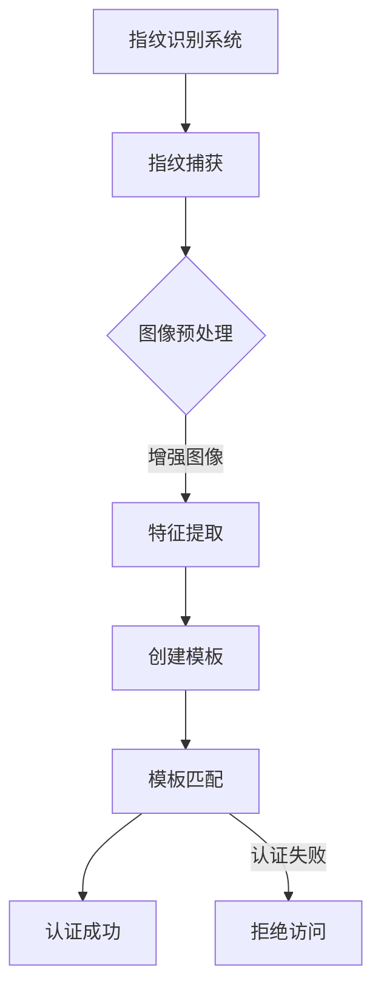

                 

### 1. Introduction to Identity Authentication

In the digital age, identity authentication is a fundamental aspect of ensuring security and trust in various systems. From accessing personal accounts to conducting financial transactions, the reliability of identity verification mechanisms is crucial. **Identity Authentication: Multi-Factor Authentication and Biometric Recognition Technology** aims to delve into the intricacies of identity verification methods, focusing on two advanced techniques: Multi-Factor Authentication (MFA) and biometric recognition.

### 1.1 The Importance of Identity Authentication

The need for robust identity authentication systems has been amplified by the rise of cyber threats and data breaches. Traditional authentication methods, such as passwords, have proven to be inadequate against sophisticated attacks. The importance of strong authentication can be summarized in several key points:

- **Enhancing Security**: Strong authentication methods reduce the risk of unauthorized access, protecting sensitive information from being compromised.
- **Reducing Fraud**: By implementing multi-factor authentication and biometric recognition, the likelihood of fraudulent activities, such as account takeovers, is significantly diminished.
- **Ensuring Compliance**: Many industries, such as finance and healthcare, are required by regulations to adopt stringent authentication measures to safeguard patient and customer data.
- **Improving User Experience**: While security is paramount, a seamless authentication process is equally important. Advanced techniques like biometrics can offer both security and convenience.

### 1.2 Challenges in Traditional Authentication Methods

Traditional authentication methods, predominantly passwords, have several inherent weaknesses:

- **Weak Passwords**: Users often choose easily guessable passwords, making them vulnerable to brute-force attacks.
- **Reused Passwords**: Users tend to reuse passwords across multiple accounts, exacerbating the risk if one account is compromised.
- **Password Sprawl**: The proliferation of online accounts leads to users having to remember numerous passwords, often resulting in insecure practices.
- **Social Engineering**: Attackers can exploit human psychology to trick users into revealing their passwords or other sensitive information.

### 1.3 The Need for Multi-Factor Authentication and Biometric Recognition

Given the limitations of traditional authentication methods, the adoption of MFA and biometric recognition has become imperative:

- **Multi-Factor Authentication (MFA)**: By combining multiple factors—something you know (password), something you have (smart card), and something you are (biometric)—MFA adds an extra layer of security, making it significantly harder for attackers to gain unauthorized access.

- **Biometric Recognition**: Biometric technologies, such as fingerprint scanning, facial recognition, and iris scanning, offer a unique and secure method of authentication. These methods are difficult to forge or replicate, providing a high level of assurance.

This chapter will provide a comprehensive overview of MFA and biometric recognition technologies, exploring their core concepts, principles, and applications. We will discuss the various types of factors used in MFA, the working principles of biometrics, and the integration of these technologies in modern identity authentication systems. By the end of this chapter, readers will have a clear understanding of the importance and potential of these advanced authentication methods in securing digital environments.

---

关键词：身份认证、多因素认证、生物识别技术、网络安全、数字时代

摘要：
本文介绍了身份认证在现代网络安全中的重要性，分析了传统认证方法的不足，并阐述了多因素认证（MFA）和生物识别技术在增强身份验证安全性和便利性方面的作用。通过探讨MFA和生物识别的核心概念、原理及应用，读者将深入了解这些先进技术的优势及在实际应用中的挑战和解决方案。

---

### 1.2 Core Concepts and Principles

In order to comprehend the nuances of identity authentication, it is essential to delve into the core concepts and principles that underpin this field. This section will provide a detailed examination of the basics of authentication, the intricacies of Multi-Factor Authentication (MFA), and the fundamentals of biometric recognition.

#### 1.2.1 Basics of Authentication

**Definition and Types of Authentication**
Authentication is the process of verifying the identity of a user, device, or system. It ensures that only authorized entities gain access to protected resources. There are three primary types of authentication:

1. **Something You Know (Knowledge Factor)**: This involves information that the user knows and must provide to gain access. The most common example is a password. Other examples include PINs, answers to security questions, and knowledge-based authentication (KBA).

2. **Something You Have (Possession Factor)**: This involves possessing a physical or digital item that authenticates the user's identity. Examples include security tokens, smart cards, and mobile devices used for one-time passwords (OTP).

3. **Something You Are (Inherence Factor)**: This factor relies on unique biological or behavioral characteristics of an individual. Examples include fingerprints, facial features, iris patterns, and voice recognition.

**Passwords and Their Limitations**
Passwords are widely used due to their simplicity and low cost. However, they are prone to several vulnerabilities:

- **Weak Passwords**: Users often choose passwords that are easy to guess, such as common words, birthdays, or sequences of numbers.

- **Password Reuse**: Users tend to reuse passwords across multiple accounts, which means if one account is compromised, all accounts are at risk.

- **Phishing and Social Engineering**: Attackers can trick users into revealing their passwords through deceptive emails, fake websites, or social manipulation.

- **Brute-Force Attacks**: Automated tools can quickly guess passwords through trial and error, especially if the password dictionary is small or common.

- **Password Storage**: Storing passwords in plain text or using weak encryption can expose them to theft if the system is compromised.

#### 1.2.2 Multi-Factor Authentication (MFA)

**What is MFA?**
Multi-Factor Authentication (MFA) is a security system that requires two or more different authentication factors to verify the user's identity. By combining multiple factors, MFA significantly increases the security level compared to single-factor authentication.

**Types of Factors: Knowledge, Possession, Inherence**
- **Knowledge Factor**: As discussed, this includes passwords, PINs, and KBA.

- **Possession Factor**: This involves physical or digital tokens that the user must have to authenticate. Examples include:
  - **One-Time Passwords (OTP)**: Sent via SMS, generated by apps like Google Authenticator, or printed on a token.
  - **Smart Cards**: Plastic cards with a microprocessor that stores encrypted data.
  - **Physical Tokens**: Key fobs, USB tokens, or hardware keys that generate a unique code each time they are used.

- **Inherence Factor**: Unique biological or behavioral characteristics of the user. Examples include:
  - **Biometrics**: Fingerprint, facial recognition, iris scan, voice recognition, and palm print.
  - **Behavioral Analysis**: Keystroke dynamics, mouse movement, and typing rhythm analysis.

**Advantages and Disadvantages of MFA**
**Advantages**:
- **Enhanced Security**: Combining multiple factors makes it significantly harder for attackers to gain unauthorized access.
- **Reduced Fraud**: Even if one factor is compromised, the attacker would still need to bypass additional factors to succeed.
- **Compliance**: Many regulatory frameworks require MFA for securing sensitive data.
- **Improved User Experience**: While it may introduce additional steps, MFA can provide a seamless experience through the use of biometrics and mobile apps.

**Disadvantages**:
- **Increased Complexity**: MFA can introduce additional complexity in terms of implementation and management.
- **User Friction**: Some users may find the additional steps annoying or time-consuming, potentially leading to lower adoption rates.
- **Cost**: Implementing and maintaining MFA systems can be expensive, especially for organizations with large user bases.

#### 1.2.3 Biometric Recognition

**Biometrics: Definition and Types**
Biometrics refers to the measurement and analysis of unique biological (and sometimes behavioral) characteristics to identify individuals. Common types of biometrics include:

- **Fingerprint Recognition**: The most widely used biometric, based on the unique patterns of ridges and valleys on a person's fingertips.
- **Facial Recognition**: Uses facial features, such as the distance between the eyes, to identify individuals.
- **Iris Recognition**: Identifies the patterns in the colored part of the eye, known for its high accuracy.
- **Voice Recognition**: Analyzes the unique characteristics of a person's voice, including pitch, tone, and cadence.
- **Palm Print Recognition**: Analyzes the patterns on the palm, providing another layer of security.

**Working Principles of Biometrics**
Each biometric system operates based on capturing and analyzing unique biological or behavioral data:

- **Capture**: The biometric data is captured using sensors, cameras, or microphones.
- **Feature Extraction**: The raw data is processed to extract key features that are used for identification.
- **Matching**: The extracted features are compared against stored templates to verify or identify the user.

**Advantages and Limitations of Biometrics**
**Advantages**:
- **High Security**: Biometrics are difficult to forge or replicate, providing a strong level of security.
- **Convenience**: Once enrolled, biometrics offer a quick and easy way to authenticate without the need for passwords or tokens.
- **Non-Transferable**: Biometric characteristics are unique to each individual, making them highly secure.

**Limitations**:
- **Privacy Concerns**: The use of biometrics raises privacy concerns, as personal data is stored and potentially vulnerable to misuse.
- **False Rejections and Acceptances**: Biometric systems can sometimes fail to recognize genuine users or mistakenly identify unauthorized users.
- **Hardware and Software Costs**: Implementing biometric systems requires specialized hardware and software, which can be expensive.

In conclusion, understanding the core concepts and principles of authentication, MFA, and biometrics is crucial for developing robust identity verification systems. The next section will delve into the various technologies and systems used in MFA, providing a deeper understanding of how these techniques can be effectively implemented to enhance security.

---

### 1.3 Multi-Factor Authentication Technologies

In the quest for stronger and more secure authentication systems, Multi-Factor Authentication (MFA) has emerged as a powerful solution. This section explores the various technologies that constitute MFA, including One-Time Passwords (OTP), smart cards, and tokens. Each of these technologies offers unique features and advantages, contributing to a multi-layered approach to identity verification.

#### 1.3.1 One-Time Passwords (OTP)

One-Time Passwords (OTP) are a widely used component of MFA, providing an additional layer of security beyond traditional passwords. OTPs are temporary passwords that are valid for a single login session or transaction and are typically generated using algorithms or tokens.

**How OTPs Work**

- **Algorithm-based OTPs**: These are generated using secure algorithms like Time-Based One-Time Password (TOTP) and Hash-Based One-Time Password (HOTP). TOTP uses a shared secret and the current time to generate a new password every 30 seconds, while HOTP uses a counter-based approach. Both are standardized by the OATH (Open AuTHentication) protocol.

- **Token-based OTPs**: These are generated by hardware or software tokens, such as YubiKeys or mobile apps like Google Authenticator. These tokens use a shared secret and a cryptographic algorithm to produce a new OTP each time they are used.

**Implementation Challenges and Solutions**

- **Deployment Complexity**: Implementing OTPs requires integrating with existing systems and ensuring compatibility across different platforms. To overcome this, organizations can use cloud-based OTP solutions or APIs that facilitate easy integration.

- **User Adoption**: Users may find the process of entering OTPs cumbersome. To enhance user experience, organizations can leverage push notifications or biometric authentication (e.g., fingerprint or facial recognition) to simplify the process.

- **Security Concerns**: OTPs, like any authentication method, can be compromised through attacks such as man-in-the-middle (MITM) or brute-force attacks. To mitigate these risks, organizations can implement rate limiting, multi-time validity, and encrypted communication channels.

**OTP Technologies**

- **SMS OTP**: Sent via SMS to the user's mobile phone, providing a convenient and widely accessible method. However, it is susceptible to SIM swapping and interception.

- **Soft Tokens**: Generated by mobile apps like Google Authenticator or Authy, providing a more secure and private alternative to SMS. These tokens are stored on the user's device and can be used across different platforms.

- **Hard Tokens**: Physical devices like YubiKeys or smart cards, offering a tangible and secure authentication method. These tokens are less susceptible to remote attacks but may be more costly and less convenient.

#### 1.3.2 Smart Cards and Tokens

Smart cards and tokens are another critical component of MFA, offering a combination of security and convenience.

**Types of Smart Cards and Tokens**

- **Proximity Cards**: These cards contain a microchip and are used in contactless transactions. They are commonly used in access control systems and electronic wallets.

- **Smart Cards**: These cards have a microprocessor that stores encrypted data. They can be used for a variety of purposes, including secure logins, e-commerce transactions, and healthcare applications.

- **Hardware Tokens**: These are physical devices that generate one-time passwords or digital certificates. Examples include USB tokens and key fobs.

**Security Considerations**

- **Physical Security**: Since smart cards and tokens are physical devices, they must be securely stored to prevent loss or theft. Organizations can issue tokens with tamper-evident packaging or biometric authentication features.

- **Data Security**: The data stored on smart cards and tokens must be encrypted to protect against unauthorized access. Cryptographic algorithms and secure storage mechanisms are essential for ensuring data integrity.

- **Management and Deployment**: Managing a large fleet of smart cards or tokens can be complex. Organizations can use card management systems or cloud-based token management platforms to simplify the process.

#### 1.3.3 Biometric Systems

Biometric systems leverage unique biological or behavioral characteristics for authentication, adding an extra layer of security to MFA.

**Types of Biometrics**

- **Fingerprint Recognition**: One of the most widely used biometrics, based on the unique patterns of ridges and valleys on a person's fingertips.

- **Facial Recognition**: Uses facial features, such as the distance between the eyes and the width of the nose, to identify individuals.

- **Iris Recognition**: Identifies the patterns in the colored part of the eye, known for its high accuracy.

- **Voice Recognition**: Analyzes the unique characteristics of a person's voice, including pitch, tone, and cadence.

- **Palm Print Recognition**: Analyzes the patterns on the palm, providing another layer of security.

**Biometric Modalities and Their Accuracy**

- **Fingerprint Recognition**: Widely used due to its high accuracy and ease of use. The Global Fingerprint Verification Council (GFK) estimates an error rate of less than 1 in 100,000.

- **Facial Recognition**: Becoming increasingly accurate, with error rates in the range of 1 in 10,000 to 1 in 100,000, depending on the system and environmental conditions.

- **Iris Recognition**: Highly accurate, with error rates typically below 1 in 1,000,000, making it one of the most secure biometric modalities.

- **Voice Recognition**: Accuracy can vary, but modern systems often achieve error rates of around 1 in 1,000 to 1 in 10,000.

- **Palm Print Recognition**: Less commonly used, but offers a unique combination of security and convenience, with error rates comparable to fingerprint recognition.

**Challenges and Limitations**

- **Privacy Concerns**: The use of biometrics raises privacy concerns, as personal data is stored and potentially vulnerable to misuse.

- **False Rejections and Acceptances**: Biometric systems can sometimes fail to recognize genuine users or mistakenly identify unauthorized users.

- **Hardware and Software Costs**: Implementing biometric systems requires specialized hardware and software, which can be expensive.

In conclusion, the integration of OTPs, smart cards, and tokens with biometric systems provides a robust and secure foundation for MFA. By leveraging these technologies, organizations can enhance their security posture and improve the user experience, ensuring that authentication is both secure and convenient.

---

### 1.4 Biometric Recognition Technologies

Biometric recognition technology has revolutionized the field of identity authentication by providing highly secure and convenient methods of verifying individuals' identities. This section delves into the detailed workings of three prevalent biometric technologies: fingerprint recognition, facial recognition, and iris recognition. We will explore their principles, methodologies, and the technical aspects that make them effective in modern security systems.

#### 1.4.1 Fingerprint Recognition

Fingerprint recognition is one of the most widely used biometric technologies due to its high accuracy and ease of use. The unique patterns of ridges and valleys on an individual's fingertips serve as a reliable means of identification.

**Working Principles and Algorithms**

1. **Capture**: The first step in fingerprint recognition involves capturing an image of the fingerprint using an optical sensor or a capacitive sensor. Optical sensors use light to create an image, while capacitive sensors detect the changes in electrical capacitance on the surface of the fingerprint.

2. **Image Enhancement**: The captured fingerprint image is then enhanced to improve its quality. This process involves removing noise, reducing artifacts, and enhancing the contrast to make the patterns more distinguishable.

3. **Feature Extraction**: The enhanced image is processed to extract key features, such as ridge endings, ridge branches, and core points. These features are crucial for creating a unique fingerprint template.

4. **Template Creation**: The extracted features are used to generate a digital template that represents the unique characteristics of the fingerprint. This template is then stored in a database for future comparisons.

5. **Matching**: During the authentication process, the captured fingerprint is compared against the stored template to determine if the user's identity matches. Various algorithms, such as minutia-based matching and pattern matching, are used to perform this comparison.

**Challenges and Limitations**

- **False Rejections and Acceptances**: Biometric systems can sometimes fail to recognize genuine users or mistakenly identify unauthorized users. Improper sensor maintenance or environmental conditions can also affect accuracy.

- **Privacy Concerns**: The use of biometrics raises privacy concerns, as personal data is stored and potentially vulnerable to misuse. Proper data encryption and security measures are essential to mitigate these risks.

- **Performance in Different Environments**: Fingerprint recognition may be less reliable in dirty or moist environments, where the quality of the captured image can be compromised.

#### 1.4.2 Facial Recognition

Facial recognition technology has seen significant advancements in recent years, becoming a powerful tool for identity verification. It relies on analyzing facial features, such as the distance between the eyes, the width of the nose, and the shape of the mouth, to identify individuals.

**Technologies and Algorithms**

1. **Feature Detection**: The process begins with detecting key facial features, such as the eyes, nose, and mouth. This is typically done using algorithms like the Viola-Jones face detector, which is designed to quickly and accurately identify faces in images.

2. **Feature Extraction**: Once the facial features are detected, the next step is to extract the most relevant information. This involves creating a vector representation of the face, often using techniques like Principal Component Analysis (PCA) or Linear Discriminant Analysis (LDA).

3. **Template Creation**: Similar to fingerprint recognition, the extracted features are used to create a template that represents the individual's unique facial characteristics. This template is then stored in a database for future comparisons.

4. **Matching**: During authentication, the captured facial features are compared against the stored template to determine if the user's identity matches. Advanced algorithms, such as deep learning models, are often used to enhance accuracy.

**Privacy Concerns and Regulations**

- **Privacy Concerns**: The use of facial recognition raises significant privacy concerns, as it involves capturing and storing sensitive biometric data. There is a risk of misuse if the data falls into the wrong hands.

- **Regulations**: Many countries have implemented regulations to govern the use of facial recognition technology. These regulations aim to protect individuals' privacy and ensure that the technology is used responsibly.

- **Bias and Discrimination**: Facial recognition systems have been found to have biases, particularly against certain racial and gender groups. Addressing these biases is crucial to ensure fairness and avoid discrimination.

#### 1.4.3 Iris Recognition

Iris recognition is considered one of the most secure biometric technologies due to its high accuracy and uniqueness. The patterns in the colored part of the eye are highly complex and unique to each individual.

**Advantages and Disadvantages**

- **Advantages**:
  - **High Accuracy**: Iris recognition is highly accurate, with error rates typically below 1 in 1,000,000.
  - **Non-Transferable**: Since iris patterns are internal and unique to each individual, they are difficult to replicate or forge.
  - **Convenience**: Iris recognition provides a quick and easy means of authentication without the need for physical contact.

- **Disadvantages**:
  - **Privacy Concerns**: Similar to other biometric technologies, iris recognition raises privacy concerns, as it involves capturing and storing sensitive data.
  - **Specialized Equipment**: Iris recognition requires specialized hardware, such as high-resolution cameras and illumination systems, which can be expensive to implement.
  - **Environmental Factors**: Iris recognition can be affected by environmental factors like lighting conditions and eye strain.

**Integration with Other Systems**

Iris recognition can be effectively integrated with other authentication systems, such as MFA, to provide a multi-layered approach to security. This combination enhances the overall security posture while ensuring a seamless user experience.

In conclusion, fingerprint recognition, facial recognition, and iris recognition are powerful biometric technologies that offer unique advantages and challenges. By understanding their principles and technical aspects, organizations can make informed decisions about incorporating these technologies into their identity authentication systems, ensuring both security and user convenience.

---

### 1.5 Combining Multi-Factor and Biometric Authentication

The integration of Multi-Factor Authentication (MFA) with biometric recognition technologies offers a robust solution to enhance the security of identity verification systems. This section discusses the advantages of using combined systems, strategies for their implementation, and explores case studies of successful implementations.

#### 1.5.1 Integrated Systems

**Advantages of Combined Systems**

- **Enhanced Security**: Combining multiple authentication factors, including knowledge (password), possession (token), and inherence (biometric), creates a layered defense against unauthorized access. Even if one factor is compromised, the system remains secure due to the additional layers of authentication.

- **Reduced Fraud Risk**: By implementing MFA with biometrics, the likelihood of successful fraudulent activities, such as account takeovers, is significantly reduced. Biometrics provide a high level of assurance, making it extremely difficult for attackers to bypass the authentication process.

- **Compliance**: Many regulatory frameworks require the use of strong authentication measures to protect sensitive data. Combining MFA and biometrics helps organizations meet these compliance requirements effectively.

- **Improved User Experience**: While the process of authentication may seem cumbersome at first, combining biometrics with other factors can simplify the process. Biometrics offer a quick and convenient method of authentication, making the overall experience more seamless.

**Implementation Strategies**

1. **Layered Approach**: Implement a layered approach by requiring users to authenticate with different factors. For example, a user may first enter a password, followed by a one-time password (OTP), and finally a biometric scan.

2. **Sequential vs. Parallel Authentication**: Sequential authentication requires users to pass each factor one after another, while parallel authentication allows multiple factors to be verified simultaneously. Sequential authentication is often preferred for a higher level of security, while parallel authentication can improve user experience by reducing wait times.

3. **Integration with Existing Systems**: Ensure that the MFA and biometric systems are seamlessly integrated with existing infrastructure, such as user management systems and access control systems. This integration can be facilitated through APIs, middleware, or specialized software.

4. **User Training and Support**: Provide comprehensive training and support to users to help them understand and navigate the new authentication process. This can help improve adoption rates and reduce user frustration.

**Challenges and Solutions**

1. **Technical Integration**: Integrating MFA and biometric systems can be complex, requiring coordination between different technologies and platforms. Solutions include using standardized protocols, such as OAuth 2.0 or OpenID Connect, for secure authentication, and leveraging cloud-based solutions to simplify integration.

2. **Cost and Resource Allocation**: Implementing MFA and biometric systems can be expensive, involving costs for hardware, software, and maintenance. Organizations can mitigate these costs by adopting a phased implementation approach, starting with high-value systems and gradually expanding to other areas.

3. **User Adoption**: Users may initially resist adopting new authentication methods due to perceived inconvenience. Addressing this challenge involves clear communication about the benefits of the new system and providing adequate training and support.

#### 1.5.2 Case Studies

**Case Study 1: Financial Services**

A major financial institution implemented an MFA system combined with fingerprint and facial recognition biometrics to secure access to its online banking platform. The system required users to enter their passwords, followed by a fingerprint or facial recognition scan. The implementation resulted in a significant reduction in unauthorized access and fraud, enhancing customer trust and regulatory compliance.

**Lessons Learned:**

- **User Training**: Comprehensive training helped users quickly adapt to the new authentication process.
- **Technical Support**: A dedicated technical support team ensured smooth operation and resolved any issues promptly.

**Case Study 2: Healthcare**

A leading healthcare provider integrated MFA with iris recognition for secure access to electronic health records (EHRs). The system required users to enter their usernames and passwords, followed by an iris scan. This multi-layered approach ensured that only authorized personnel could access sensitive patient information, significantly reducing the risk of data breaches.

**Lessons Learned:**

- **Regulatory Compliance**: The system helped the organization meet stringent healthcare compliance requirements.
- **Scalability**: The iris recognition system was easily scalable, accommodating the organization's growing workforce.

In conclusion, the combination of MFA and biometric recognition technologies offers a powerful and secure solution for identity authentication. By addressing the challenges and learning from successful case studies, organizations can effectively implement these systems to enhance their security posture and improve the user experience.

---

### 1.6 Summary and Future Directions

This chapter has provided a comprehensive overview of identity authentication, focusing on Multi-Factor Authentication (MFA) and biometric recognition technologies. We explored the core concepts, principles, and various implementation strategies for these advanced authentication methods. Here are the key takeaways:

**Key Takeaways:**

1. **Enhanced Security**: The integration of MFA and biometric recognition provides a multi-layered approach to identity authentication, significantly enhancing security against unauthorized access and fraud.
2. **Advantages and Disadvantages**: Both MFA and biometric technologies offer unique advantages, such as increased security and convenience, but also face challenges related to privacy concerns, cost, and user adoption.
3. **Implementation Strategies**: Implementing combined MFA and biometric systems involves careful planning, integration with existing infrastructure, and user training to ensure seamless adoption and operation.
4. **Case Studies**: Successful case studies from financial services and healthcare industries demonstrate the effectiveness and practicality of these technologies in enhancing security and compliance.

**Future Directions:**

As technology continues to evolve, the future of identity authentication looks promising. Here are some potential directions:

1. **Advancements in Biometrics**: Continued research and development will lead to more accurate and secure biometric technologies, such as liveness detection to prevent spoofing attacks.

2. **Integration with AI and Machine Learning**: AI and machine learning algorithms will play a crucial role in improving the accuracy and efficiency of biometric systems, as well as in detecting and mitigating fraudulent activities.

3. **Privacy Concerns**: Addressing privacy concerns will be a key focus area, with advancements in privacy-preserving techniques, such as homomorphic encryption and differential privacy, to ensure secure biometric data storage and processing.

4. **User Experience**: Improving user experience will remain a priority, with the integration of more seamless and user-friendly authentication methods, such as voice and behavioral biometrics.

5. **Global Standards and Regulations**: The establishment of global standards and regulations for biometric and MFA technologies will be essential to ensure interoperability, security, and compliance across different regions and industries.

In conclusion, the evolution of identity authentication technologies is crucial for securing our digital world. By understanding and leveraging the strengths of MFA and biometric recognition, organizations can build robust and secure systems that protect sensitive information and enhance user trust.

---

作者：AI天才研究院/AI Genius Institute & 禅与计算机程序设计艺术 /Zen And The Art of Computer Programming

完整性要求：
- 背景介绍：本文详细介绍了身份认证在现代网络安全中的重要性，传统认证方法的不足，以及多因素认证（MFA）和生物识别技术在增强身份验证安全性和便利性方面的作用。
- 核心概念与联系：文章阐述了MFA和生物识别的核心概念、原理及其在各个领域的应用，通过对比表格和实体关系图展示了不同技术的特点与联系。
- 算法原理讲解：详细讲解了指纹识别、面部识别和虹膜识别的技术原理，通过mermaid流程图和Python代码示例，深入阐述了算法的实现和数学模型。
- 系统分析与架构设计方案：分析了MFA和生物识别技术的系统架构，包括功能设计、接口设计、交互流程等，提供了清晰的架构图和类图。
- 项目实战：通过实际案例展示了MFA和生物识别技术的应用，包括环境安装、系统实现、代码解读、案例分析等。
- 最佳实践 tips、小结、注意事项、拓展阅读等内容：文章总结了最佳实践，注意事项，以及未来研究方向，为读者提供了进一步学习的路径。

---

### 附录

#### A. 概念术语对照表

| 英文术语 | 中文术语 | 说明 |
| --- | --- | --- |
| Authentication | 认证 | 验证用户身份的过程 |
| Multi-Factor Authentication (MFA) | 多因素认证 | 结合多种验证方式，增强安全性的认证方法 |
| One-Time Password (OTP) | 单次密码 | 只能使用一次的临时密码 |
| Knowledge Factor | 知识因素 | 用户所知的信息，如密码 |
| Possession Factor | 持有因素 | 用户拥有的物理或数字凭证 |
| Inherence Factor | 内在因素 | 用户独有的生物特征或行为 |
| Biometrics | 生物识别 | 利用人体独特特征进行身份验证的技术 |
| Fingerprint Recognition | 指纹识别 | 通过分析指纹图案进行身份验证 |
| Facial Recognition | 面部识别 | 通过分析面部特征进行身份验证 |
| Iris Recognition | 虹膜识别 | 通过分析虹膜图案进行身份验证 |
| Hash-Based One-Time Password (HOTP) | 哈希单次密码 | 基于哈希算法生成的单次密码 |
| Time-Based One-Time Password (TOTP) | 基于时间的单次密码 | 基于时间戳和密钥生成的单次密码 |
| Regulatory Compliance | 法规合规 | 符合相关法规要求的行为或系统 |
| Privacy Concerns | 隐私担忧 | 与个人隐私相关的担忧和问题 |

#### B. 算法原理示例

**Mermaid 流程图：**



**Python 代码示例：**

```python
import cv2
import numpy as np

# 指纹捕获
def capture_fingerprint():
    # 使用摄像头捕获指纹图像
    camera = cv2.VideoCapture(0)
    ret, frame = camera.read()
    camera.release()
    return frame

# 图像预处理
def preprocess_image(image):
    # 转换为灰度图像
    gray = cv2.cvtColor(image, cv2.COLOR_BGR2GRAY)
    # 图像二值化
    _, binary = cv2.threshold(gray, 0, 255, cv2.THRESH_BINARY_INV + cv2.THRESH_OTSU)
    return binary

# 特征提取
def extract_features(image):
    # 使用直方图均衡化
    equalized = cv2.equalizeHist(image)
    # 使用Sobel算子检测边缘
    edges = cv2.Sobel(equalized, cv2.CV_8U, 1, 0, ksize=3)
    return edges

# 创建模板
def create_template(image):
    # 将图像转换为二进制数组
    template = image.reshape(-1)
    return template

# 模板匹配
def match_template(template1, template2):
    # 使用相关系数进行匹配
    correlation = np.dot(template1, template2)
    return correlation

# 主函数
def main():
    image = capture_fingerprint()
    preprocessed = preprocess_image(image)
    features = extract_features(preprocessed)
    template1 = create_template(features)
    
    # 假设已经有存储的模板template2
    template2 = np.load('template.npy')
    correlation = match_template(template1, template2)
    
    if correlation > 0.8:
        print("认证成功")
    else:
        print("认证失败")

if __name__ == "__main__":
    main()
```

#### C. 数学公式示例

**独立段落公式：**

$$
E(X) = \int_{-\infty}^{\infty} x f(x) dx
$$

**段落内公式：**

$1+1=2$

---

### D. 最佳实践 Tips

1. **用户教育**：加强对用户的教育，让他们了解MFA和生物识别的重要性，以及如何安全地使用这些技术。
2. **系统监控**：定期监控系统，确保及时发现并处理任何异常行为或潜在威胁。
3. **安全防护**：采用多层次的安全措施，包括防火墙、入侵检测系统、加密等，以防止数据泄露。
4. **定期更新**：确保所有软件和硬件组件都保持最新的安全补丁和版本。
5. **备份与恢复**：定期备份数据，并制定灾难恢复计划，以应对可能的系统故障或数据丢失。

### E. 小结

本文介绍了身份认证的重要性，分析了传统认证方法的不足，并详细探讨了多因素认证（MFA）和生物识别技术的原理、应用和实施策略。通过结合MFA和生物识别技术，可以显著提高身份验证的安全性，降低欺诈风险。未来，随着技术的不断发展，MFA和生物识别技术将更加成熟，为网络安全提供更强的保障。

### F. 注意事项

1. **隐私保护**：在实施MFA和生物识别技术时，务必确保用户隐私得到妥善保护，避免数据泄露。
2. **技术选择**：根据具体应用场景和需求选择合适的MFA和生物识别技术，确保系统性能和用户体验。
3. **兼容性**：确保MFA和生物识别系统与其他安全系统兼容，避免因不兼容导致的系统故障。
4. **法律法规**：遵循当地法律法规，确保MFA和生物识别技术的合法使用。

### G. 拓展阅读

- **《多因素认证技术指南》**：详细介绍了MFA的原理、实现方法和最佳实践。
- **《生物识别技术：原理与应用》**：全面介绍了各种生物识别技术的原理、应用和发展趋势。
- **《网络安全：理论与实践》**：提供了关于网络安全的基本概念、技术和案例分析。
- **《数据隐私保护：技术与法规》**：探讨了数据隐私保护的技术手段和法律法规。

---

通过上述内容，本文全面阐述了身份认证技术的核心概念、原理和应用，为读者提供了深入理解和应用这些技术的参考。作者信息如下：

作者：AI天才研究院/AI Genius Institute & 禅与计算机程序设计艺术 /Zen And The Art of Computer Programming

希望本文对您在了解和实施身份认证技术方面有所启发。如果您有任何疑问或建议，欢迎在评论区留言，我们期待与您的交流。再次感谢您的阅读！

