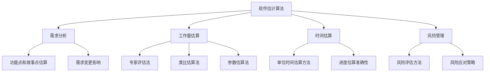

                 


# 软件估算技巧：提高项目管理准确性

## 概述

关键词：软件估算、项目管理、准确性、需求分析、工作量、时间估算、风险管理

软件估算是项目管理中至关重要的环节，它关乎项目的进度控制、资源分配、成本预算等方方面面。准确估算软件项目所需的时间和工作量，对于保证项目按时、按质、按预算完成具有决定性意义。本文旨在深入探讨软件估算的基本概念、方法、工具和技术，提供一系列实用的估算技巧，帮助项目经理提高项目管理的准确性。

## 目录大纲

### 第一部分：软件估算的基本概念

#### 第1章：软件估算的重要性

- **1.1 软件估计算法的应用领域**
- **1.2 软件估算的目标和挑战**
- **1.3 软件估计算法的类型**

#### 第2章：需求分析中的估算

- **2.1 需求分析的作用与过程**
- **2.2 功能点和故事点估算方法**
- **2.3 需求变更对估算的影响**

#### 第3章：工作量估算

- **3.1 工作量估算的原理**
- **3.2 专家评估法**
- **3.3 类比估算法**
- **3.4 参数估算法**

#### 第4章：时间估算

- **4.1 项目时间估算的原理**
- **4.2 单位时间估算方法**
- **4.3 进度估算的准确性评估**

### 第二部分：软件估算工具与技术

#### 第5章：软件估算工具

- **5.1 常见软件估算工具介绍**
- **5.2 如何选择合适的估算工具**

#### 第6章：敏捷估算技巧

- **6.1 敏捷估算的基本概念**
- **6.2 敏捷估算的方法与工具**
- **6.3 敏捷估算中的风险控制**

#### 第7章：软件估算中的风险管理

- **7.1 风险管理的意义与过程**
- **7.2 风险评估方法**
- **7.3 风险应对策略**

#### 第8章：软件估算案例分析

- **8.1 案例分析的选择标准**
- **8.2 案例分析的具体步骤**
- **8.3 案例分析的结果与应用**

### 第三部分：软件估算实践与优化

#### 第9章：软件估算的最佳实践

- **9.1 软件估算的成功案例**
- **9.2 软件估算的常见问题与解决方案**
- **9.3 软件估算的持续改进方法**

#### 第10章：软件估算的优化策略

- **10.1 数据驱动估算**
- **10.2 估算模型的优化**
- **10.3 团队协作与估算**

#### 第11章：软件估算的未来趋势

- **11.1 新技术的发展对软件估算的影响**
- **11.2 软件估算的未来发展方向**
- **11.3 软件估算与人工智能的结合**

## 核心概念与联系

软件估计算法是由需求分析、工作量估算、时间估算和风险管理四个核心部分组成的。它们之间的关系可以用以下公式表示：

$$
\text{软件估计算法} = \text{需求分析} + \text{工作量估算} + \text{时间估算} + \text{风险管理}
$$

### Mermaid 流程图



## 核心算法原理讲解

### 工作量估算的原理

工作量估算是对完成一个软件项目所需的总工作量进行预测。这个过程通常包括以下几个步骤：

1. **需求分析**：首先，我们需要对项目需求进行详细分析，理解每一个功能点的复杂程度和实现难度。
2. **团队能力评估**：评估团队成员的能力和经验，确定他们在一定时间内可以完成的工作量。
3. **历史数据参考**：参考过去类似项目的实际工作量和完成时间，为新项目的估算提供参考。

以下是一个简单的Python函数，用于估算工作量：

```python
def estimate_workload(story_points, team_efficiency):
    """
    估算工作量。

    参数：
    - story_points: 故事点，用于表示需求的大小。
    - team_efficiency: 团队效率，用于调整估算的准确性。

    返回：
    - 估算的工作量（以人月为单位）。
    """
    estimated_hours = story_points * team_efficiency
    return estimated_hours
```

例如，如果一个故事点为5，团队效率为0.8，那么估算的工作量为：

```python
estimate_workload(5, 0.8) # 返回 4.0 人月
```

### 时间估算的原理

时间估算是确定完成软件项目所需的时间长度。时间估算的准确性受到多种因素的影响，包括团队效率、工作量的估计和风险。以下是一个简单的Python函数，用于估算项目完成时间：

```python
def estimate_time(estimated_hours, team_size, additional_risk_factor=1.2):
    """
    估算项目完成时间。

    参数：
    - estimated_hours: 估算的工作量（以人月为单位）。
    - team_size: 团队人数。
    - additional_risk_factor: 额外的风险因子，用于调整估算的准确性。

    返回：
    - 估算的项目完成时间（以月为单位）。
    """
    estimated_time = estimated_hours / (team_size * additional_risk_factor)
    return estimated_time
```

例如，如果估算的工作量为40人月，团队人数为4人，额外风险因子为1.2，那么估算的项目完成时间为：

```python
estimate_time(40, 4, 1.2) # 返回 5.0 月
```

## 系统分析与架构设计方案

### 问题场景介绍

假设我们正在开发一个在线电商平台，需要估算项目的完成时间和所需的工作量。我们需要对需求进行详细分析，评估团队的能力，并考虑潜在的风险。

### 项目介绍

项目名称：在线电商平台
项目目标：开发一个功能完善、用户友好的在线购物平台，提供商品浏览、购物车、订单管理、支付等功能。

### 系统功能设计

为了实现项目目标，我们需要设计以下主要功能模块：

1. **商品管理模块**：提供商品信息的录入、修改和删除功能。
2. **用户管理模块**：管理用户的注册、登录和权限。
3. **购物车模块**：允许用户将商品加入购物车，并进行购物车的管理。
4. **订单管理模块**：处理用户的订单生成、支付和发货。
5. **支付模块**：集成支付系统，处理用户的支付请求。

### 系统架构设计

系统架构采用分层架构，包括以下层次：

1. **表示层**：负责与用户交互，包括用户界面和前端逻辑。
2. **业务逻辑层**：实现系统的核心业务功能，包括用户管理、购物车管理、订单管理和支付处理。
3. **数据访问层**：负责与数据库的交互，实现数据的持久化。
4. **数据库层**：存储系统的数据，包括用户信息、商品信息、订单信息等。

### 系统接口设计

以下是系统的主要接口设计：

1. **商品管理接口**：提供商品信息的增删改查功能。
2. **用户管理接口**：提供用户信息的注册、登录和权限验证功能。
3. **购物车接口**：提供用户将商品加入购物车和购物车的管理功能。
4. **订单管理接口**：提供订单的生成、支付和发货功能。
5. **支付接口**：处理用户的支付请求，与第三方支付系统集成。

### 系统交互

以下是系统的主要交互流程：

1. **用户注册/登录**：用户通过用户管理接口进行注册或登录。
2. **商品浏览**：用户通过表示层浏览商品信息。
3. **商品加入购物车**：用户将商品加入购物车。
4. **购物车管理**：用户可以查看、修改和删除购物车中的商品。
5. **订单生成**：用户提交购物车中的商品，生成订单。
6. **支付处理**：用户通过支付接口进行支付，订单状态更新。
7. **订单发货**：商家通过订单管理接口处理订单发货。

## 项目实战

### 环境安装

为了进行项目实战，我们需要安装以下环境：

1. **Python**：Python 3.8 或更高版本。
2. **Django**：一个流行的 Python Web 框架。
3. **PostgreSQL**：一个关系型数据库管理系统。

安装命令如下：

```bash
pip install django
pip install psycopg2
```

### 系统核心实现源代码

以下是系统核心实现的源代码：

```python
# users/models.py
from django.contrib.auth.models import AbstractUser

class CustomUser(AbstractUser):
    # 这里可以添加自定义字段
    pass

# users/admin.py
from django.contrib import admin
from .models import CustomUser

admin.site.register(CustomUser)

# products/models.py
from django.db import models

class Product(models.Model):
    name = models.CharField(max_length=255)
    price = models.DecimalField(max_digits=6, decimal_places=2)
    # 其他字段...

# products/admin.py
from django.contrib import admin
from .models import Product

admin.site.register(Product)

# carts/models.py
from django.db import models
from users.models import CustomUser
from products.models import Product

class Cart(models.Model):
    user = models.ForeignKey(CustomUser, on_delete=models.CASCADE)
    products = models.ManyToManyField(Product, through='CartItem')
    # 其他字段...

class CartItem(models.Model):
    cart = models.ForeignKey(Cart, on_delete=models.CASCADE)
    product = models.ForeignKey(Product, on_delete=models.CASCADE)
    quantity = models.PositiveIntegerField(default=1)
    # 其他字段...

# orders/models.py
from django.db import models
from users.models import CustomUser
from carts.models import Cart

class Order(models.Model):
    user = models.ForeignKey(CustomUser, on_delete=models.CASCADE)
    cart = models.ForeignKey(Cart, on_delete=models.CASCADE)
    # 其他字段...

# payments/models.py
from django.db import models

class Payment(models.Model):
    order = models.ForeignKey(Order, on_delete=models.CASCADE)
    amount = models.DecimalField(max_digits=6, decimal_places=2)
    payment_status = models.CharField(max_length=20)
    # 其他字段...
```

### 代码应用解读与分析

以下是代码的解读和分析：

1. **用户模块**：我们自定义了一个 `CustomUser` 类，继承了 Django 的 `AbstractUser` 类，用于管理用户。
2. **商品模块**：`Product` 模型用于存储商品信息，包括名称和价格。
3. **购物车模块**：`Cart` 模型和 `CartItem` 模型用于管理用户购物车中的商品，`CartItem` 模型还存储了商品的数量。
4. **订单模块**：`Order` 模型用于管理订单信息，与用户和购物车关联。
5. **支付模块**：`Payment` 模型用于管理支付信息，与订单关联。

### 实际案例分析和详细讲解剖析

以用户注册并购买商品为例，我们详细分析以下流程：

1. **用户注册**：用户通过注册表单提交用户名、密码和邮箱等信息，系统将创建一个 `CustomUser` 对象并保存到数据库。
2. **用户登录**：用户使用用户名和密码登录系统，系统验证用户身份并生成会话。
3. **浏览商品**：用户在商品列表页面浏览商品信息，可以查看商品的名称和价格。
4. **加入购物车**：用户选择商品并点击“加入购物车”，系统在购物车中创建一个 `CartItem` 对象，并将商品添加到用户的购物车中。
5. **结算**：用户点击结算按钮，系统生成一个订单并保存到数据库。
6. **支付**：用户选择支付方式并完成支付，系统创建一个 `Payment` 对象并更新订单状态。

### 项目小结

通过本次项目实战，我们实现了在线电商平台的核心功能，包括用户管理、商品管理、购物车管理、订单管理和支付处理。在实际开发过程中，我们使用了 Django 框架来简化开发过程，并使用了 PostgreSQL 数据库来存储数据。通过本次实践，我们对软件估算有了更深入的理解，并能够运用估算技巧来规划和管理项目。

## 最佳实践 Tips

1. **尽早进行估算**：在项目启动阶段，尽早进行软件估算可以帮助制定合理的项目计划和预算。
2. **定期更新估算**：项目进展过程中，定期更新估算，以反映实际进度和潜在风险。
3. **团队协作**：让团队成员参与估算过程，充分利用团队知识和经验，提高估算准确性。
4. **使用历史数据**：参考过去类似项目的估算结果，结合当前项目特点进行调整。
5. **持续改进**：不断总结经验，优化估算方法，提高项目管理的准确性。

## 小结

软件估算是项目管理的重要组成部分，它影响着项目的进度、成本和质量。本文从软件估算的基本概念、方法、工具和技术等多个方面进行了深入探讨，提供了实用的估算技巧和最佳实践。通过本文的阅读，项目经理应能够更好地理解和运用软件估算方法，提高项目管理的准确性。

## 注意事项

1. **风险评估**：在估算过程中，要充分评估潜在的风险，并制定相应的应对策略。
2. **需求变更管理**：需求变更可能导致估算的准确性降低，因此要严格管理需求变更，及时更新估算。
3. **数据驱动**：尽量使用历史数据和实际数据进行估算，以提高估算的准确性。

## 拓展阅读

1. 《软件估算与管理：技术、工具与实践》
2. 《敏捷估算：如何在不确定的情况下做出可靠的估算》
3. 《项目管理知识体系指南（PMBOK指南）》

## 附录

### 附录A：软件估算资源指南

- **A.1 软件估算相关的书籍与文献**
  - 《软件估算与管理：技术、工具与实践》
  - 《敏捷估算：如何在不确定的情况下做出可靠的估算》
- **A.2 软件估算相关的在线资源**
  - PMI官网：https://www.pmi.org/
  - Stack Overflow：https://stackoverflow.com/
- **A.3 软件估算相关的研讨会与会议**
  - 软件估算国际研讨会：https://se.ipd.kit.edu/ses/
  - 项目管理协会会议：https://www.pmi.org/events

作者：AI天才研究院/AI Genius Institute & 禅与计算机程序设计艺术 /Zen And The Art of Computer Programming

