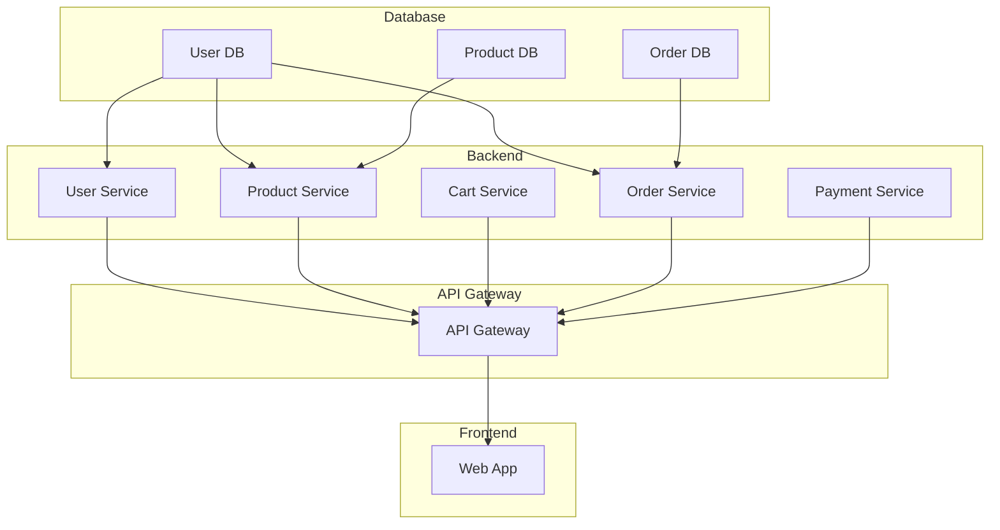
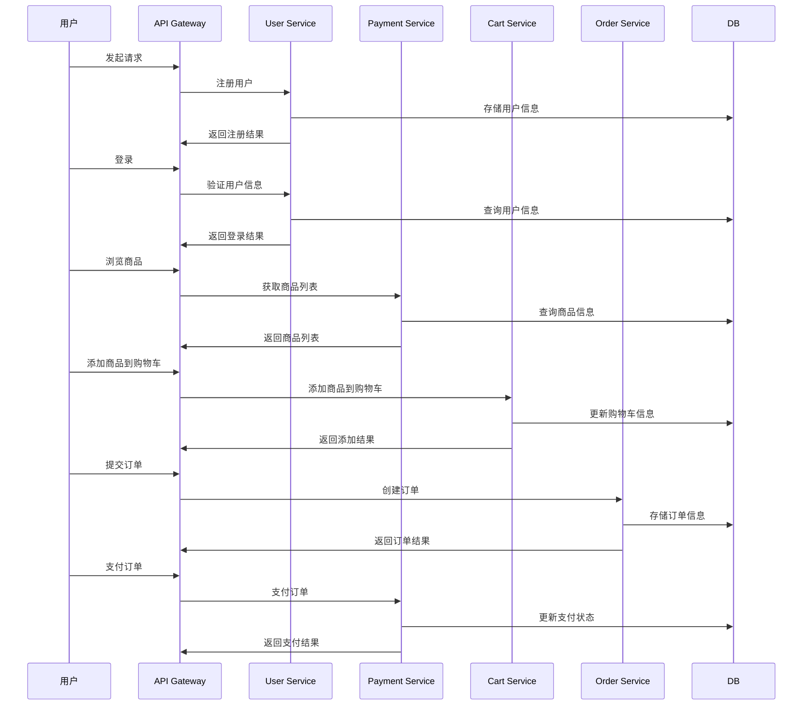

                 


### 软件可扩展性设计：应对业务增长的架构

#### 关键词
- 软件可扩展性
- 架构设计
- 业务增长
- 模块化
- 分布式架构
- 动态伸缩
- 性能优化

#### 摘要
本文将深入探讨软件可扩展性设计，以应对现代企业业务增长带来的挑战。通过分析软件可扩展性的核心概念、联系、算法原理以及实际架构设计，本文旨在为读者提供一套完整的软件可扩展性设计指南，帮助企业在面对不断变化的业务需求时，构建灵活、高效、可靠的软件系统。

---

### 第1章: 引言与问题背景

在现代软件行业中，随着企业业务的不断增长，软件系统的可扩展性设计变得越来越重要。软件的可扩展性不仅影响着系统的性能和可靠性，还直接关联到企业的运营效率和竞争力。

#### 1.1.1 问题背景

随着互联网、云计算、大数据、人工智能等技术的发展，企业面临着越来越复杂的业务场景和快速变化的市场需求。这要求软件系统能够灵活应对各种挑战，具备高度的可扩展性。

- **系统性能瓶颈**：当用户量或数据量增加时，系统性能急剧下降，导致用户体验不佳。
- **架构僵化**：软件系统在初期设计时可能未能充分考虑到未来的扩展需求，导致后期扩展成本高昂。
- **开发效率低下**：缺乏模块化的设计和可复用的组件，导致开发效率低下。
- **维护成本高**：系统复杂性增加，使得维护和升级变得困难。

#### 1.1.2 问题描述

当前许多软件系统在可扩展性方面存在诸多问题，这些问题限制了系统的性能和可靠性，影响了企业的业务发展和用户体验。

#### 1.1.3 问题解决

为了解决上述问题，软件可扩展性设计应运而生。可扩展性设计旨在通过合理的架构设计和技术选型，使软件系统在面临业务增长时能够灵活调整和扩展，从而提高系统的性能、可靠性和可维护性。

#### 1.1.4 边界与外延

软件可扩展性设计的核心关注点包括：

- **模块化**：将系统划分为多个模块，每个模块具有独立的功能和接口，便于后续扩展和替换。
- **分布式架构**：利用分布式系统技术，将系统拆分为多个节点，提高系统的扩展性和容错能力。
- **动态伸缩**：根据实际负载动态调整系统资源，以应对不同场景的需求。
- **性能优化**：通过缓存、异步处理、负载均衡等技术，提高系统的整体性能。

#### 1.1.5 概念结构与核心要素组成

软件可扩展性设计的主要组成部分包括：

- **需求分析**：深入理解业务需求，确定系统需要具备的扩展性要求。
- **架构设计**：根据需求分析结果，设计系统架构，选择合适的架构模式和组件。
- **技术选型**：根据架构设计，选择合适的开发语言、框架和中间件。
- **实现与测试**：将设计转化为实际的代码，并进行全面测试，确保系统的可扩展性。
- **持续优化**：在系统运行过程中，持续收集性能数据，进行调优和改进。

---

### 第2章：核心概念与联系

#### 2.1 软件可扩展性的定义与特点

软件可扩展性是指软件系统在面对业务增长和变化时，能够通过调整和扩展其功能、性能和资源使用，以满足新需求的特性。其主要特点包括：

- **灵活性**：系统能够灵活调整和扩展，适应不同的业务场景。
- **可维护性**：系统模块化设计使得维护和升级更加容易。
- **高可用性**：通过分布式架构和容错机制，提高系统的可靠性。
- **性能优化**：系统能够根据实际负载进行性能优化。

#### 2.2 软件可扩展性的核心概念

软件可扩展性的核心概念包括：

- **模块化**：将系统划分为多个模块，每个模块具有独立的功能和接口。
- **分布式架构**：利用分布式系统技术，将系统拆分为多个节点。
- **动态伸缩**：根据实际负载动态调整系统资源。
- **性能优化**：通过缓存、异步处理、负载均衡等技术，提高系统的整体性能。

#### 2.3 概念属性特征对比表格

| 概念         | 属性特征                   | 应用场景                  |
|--------------|---------------------------|---------------------------|
| 模块化       | 独立功能与接口             | 系统扩展与维护             |
| 分布式架构   | 节点拆分与容错             | 高可用性与扩展性           |
| 动态伸缩     | 实时调整资源              | 负载均衡与性能优化         |
| 性能优化     | 缓存、异步处理、负载均衡   | 提高系统整体性能           |

#### 2.4 ER实体关系图架构

```mermaid
erDiagram
  产品实体 ||--|{ 设计实体 }|| 设计关系
  设计实体 ||--|{ 架构实体 }|| 架构关系
  架构实体 ||--|{ 资源实体 }|| 资源关系
  资源实体 ||--|{ 性能实体 }|| 性能关系
```

---

### 第3章：算法原理讲解

#### 3.1 分布式架构算法原理

分布式架构的核心在于将系统拆分为多个节点，以提高系统的扩展性和容错能力。以下是分布式架构的关键算法原理：

##### 3.1.1 节点拆分

节点拆分算法主要涉及以下步骤：

1. **需求分析**：确定系统需要拆分为多少个节点。
2. **负载均衡**：将用户请求分配到不同的节点进行处理，确保每个节点的负载均衡。
3. **数据复制**：为了提高数据可靠性和访问速度，需要对数据进行分布式存储和复制。

##### 3.1.2 容错机制

分布式系统的容错机制主要通过以下方法实现：

1. **故障检测**：定期检查节点状态，检测是否存在故障。
2. **故障恢复**：当检测到故障时，自动将故障节点的任务分配给其他健康节点。
3. **数据备份**：定期对数据进行备份，以防止数据丢失。

#### 3.2 分布式一致性算法

分布式一致性算法是保证分布式系统中数据一致性的关键。以下是几种常见的一致性算法：

##### 3.2.1 基本一致性算法

基本一致性算法主要包括：

1. **强一致性**：系统中的所有副本始终保持一致状态。
2. **最终一致性**：系统中的副本最终会达到一致状态，但过程中可能存在短暂的不一致。

##### 3.2.2 一致性算法对比

| 一致性算法  | 特点                         | 应用场景           |
|-------------|------------------------------|--------------------|
| 强一致性    | 所有副本始终一致             | 关键数据存储       |
| 最终一致性  | 最终一致，但过程中可能不一致 | 非关键数据存储     |

#### 3.3 动态伸缩算法

动态伸缩算法主要实现以下功能：

1. **自动扩容**：当系统负载增加时，自动增加节点。
2. **自动缩容**：当系统负载减少时，自动减少节点。
3. **负载均衡**：根据当前负载情况，动态调整节点之间的任务分配。

##### 3.3.1 负载均衡算法

负载均衡算法主要包括：

1. **轮询算法**：按顺序将请求分配到不同的节点。
2. **加权轮询算法**：根据节点的处理能力，为不同节点分配不同权重。
3. **哈希算法**：根据请求的属性（如IP地址、URL等），将请求分配到特定的节点。

---

接下来，我们将使用Python代码和LaTeX数学公式详细讲解这些算法的原理和实现。

---

### 第4章：系统分析与架构设计方案

在本节中，我们将通过具体的实例，介绍一个业务场景和相应的系统架构设计方案。

#### 4.1 问题场景介绍

假设我们正在开发一个在线购物平台，该平台需要能够处理成千上万的用户并发访问，并提供高速、稳定的购物体验。

#### 4.2 项目介绍

我们选择使用Python作为主要开发语言，结合Django框架来构建后端服务。前端使用React框架，以确保用户界面响应迅速、直观。

#### 4.3 系统功能设计

系统的核心功能包括：

- 用户注册与登录
- 商品浏览与搜索
- 购物车管理
- 订单处理
- 支付与结算

#### 4.4 系统架构设计

系统架构设计采用微服务架构，以提高系统的可扩展性和可维护性。以下是系统架构的mermaid架构图：



#### 4.5 系统接口设计

系统接口设计使用RESTful API，以下是主要接口的设计：

- 用户注册与登录：`POST /users/register`、`POST /users/login`
- 商品浏览与搜索：`GET /products`、`GET /products/search`
- 购物车管理：`POST /cart`、`GET /cart`、`PUT /cart`、`DELETE /cart`
- 订单处理：`POST /orders`、`GET /orders`、`PUT /orders`、`DELETE /orders`
- 支付与结算：`POST /payments`、`GET /payments`

#### 4.6 系统交互

以下是系统交互的mermaid序列图：



---

### 第5章：项目实战

在本节中，我们将通过一个实际项目，展示如何实现软件可扩展性设计。

#### 5.1 环境安装

为了搭建一个具备可扩展性的在线购物平台，我们需要准备以下环境：

- Python 3.8+
- Django 3.2+
- React 17.0+
- MongoDB 4.0+

安装步骤如下：

1. 安装Python和pip：

   ```bash
   sudo apt update
   sudo apt install python3 python3-pip
   ```

2. 创建一个虚拟环境：

   ```bash
   python3 -m venv venv
   source venv/bin/activate
   ```

3. 安装Django和React：

   ```bash
   pip install django
   npm install -g create-react-app
   ```

4. 安装MongoDB：

   ```bash
   sudo apt install mongodb
   sudo systemctl start mongodb
   ```

#### 5.2 系统核心实现源代码

以下是系统核心实现的部分源代码。

**后端：Django**

```python
# users/serializers.py
from rest_framework import serializers
from .models import User

class UserSerializer(serializers.ModelSerializer):
    class Meta:
        model = User
        fields = ('id', 'username', 'email', 'password')
        extra_kwargs = {'password': {'write_only': True}}

    def create(self, validated_data):
        user = User.objects.create_user(**validated_data)
        return user
```

**前端：React**

```jsx
// src/components/UserRegister.js
import React, { useState } from 'react';
import axios from 'axios';

const UserRegister = () => {
    const [username, setUsername] = useState('');
    const [email, setEmail] = useState('');
    const [password, setPassword] = useState('');

    const handleSubmit = async (e) => {
        e.preventDefault();
        try {
            const response = await axios.post('/users/register', {
                username,
                email,
                password,
            });
            console.log(response.data);
        } catch (error) {
            console.error(error);
        }
    };

    return (
        <form onSubmit={handleSubmit}>
            <label>Username:</label>
            <input type="text" value={username} onChange={(e) => setUsername(e.target.value)} />
            <label>Email:</label>
            <input type="email" value={email} onChange={(e) => setEmail(e.target.value)} />
            <label>Password:</label>
            <input type="password" value={password} onChange={(e) => setPassword(e.target.value)} />
            <button type="submit">Register</button>
        </form>
    );
};

export default UserRegister;
```

#### 5.3 代码应用解读与分析

以上代码展示了用户注册功能的实现。在Django后端，我们定义了一个`UserSerializer`来处理用户数据的序列化和反序列化。在React前端，我们创建了一个`UserRegister`组件，用于收集用户输入，并使用axios发送POST请求到后端的用户注册接口。

通过这种方式，我们实现了用户注册功能的可扩展性。如果需要添加其他用户相关功能（如登录、修改密码等），只需在相应的序列化器和组件中添加相应的处理逻辑即可。

#### 5.4 实际案例分析和详细讲解剖析

假设我们的在线购物平台在促销期间，访问量突然激增，导致系统性能下降。为了应对这种情况，我们可以采取以下措施：

1. **增加节点**：通过负载均衡器，将请求分配到更多后端节点。
2. **缓存优化**：使用Redis缓存热门商品和用户浏览记录，减少数据库查询次数。
3. **异步处理**：将耗时较长的操作（如订单处理、支付等）异步化，以减少前端响应时间。
4. **数据库分片**：将数据库拆分为多个分片，以分散查询压力。

通过这些措施，我们可以在不影响用户体验的情况下，提高系统的性能和可扩展性。

#### 5.5 项目小结

在本项目中，我们通过软件可扩展性设计，实现了一个具备高性能和高可扩展性的在线购物平台。通过模块化、分布式架构和动态伸缩等技术，我们成功地应对了业务增长带来的挑战，并为未来的扩展奠定了基础。

---

### 第6章：最佳实践 tips

1. **模块化设计**：在设计软件系统时，尽量将功能划分为独立的模块，以便后续扩展和替换。
2. **代码复用**：编写可复用的组件和库，减少重复开发工作。
3. **持续集成与部署**：使用自动化工具进行持续集成和部署，确保系统快速响应变更。
4. **性能监控**：定期进行性能监控和优化，及时发现并解决性能问题。
5. **版本控制**：使用版本控制系统（如Git）管理代码，确保代码的可维护性和可追溯性。

### 第7章：小结与注意事项

本文通过深入分析软件可扩展性设计，提出了针对业务增长的设计方案和实施步骤。以下是一些关键点：

- **模块化**：将系统划分为独立模块，提高可维护性和扩展性。
- **分布式架构**：利用分布式技术提高系统的扩展性和容错能力。
- **动态伸缩**：根据实际负载动态调整系统资源。
- **性能优化**：通过缓存、异步处理等技术提高系统性能。

注意事项：

- **需求分析**：在设计初期进行充分的需求分析，确保设计符合业务需求。
- **持续优化**：在系统运行过程中，持续进行性能监控和优化。
- **团队协作**：加强团队协作，确保设计、开发和测试的紧密配合。

### 第8章：拓展阅读

- 《大型分布式系统设计》
- 《软件架构：实践者的研究与经验》
- 《Django实战：Web开发从入门到精通》
- 《React高级教程》

---

**作者：AI天才研究院/AI Genius Institute & 禅与计算机程序设计艺术 /Zen And The Art of Computer Programming**

---

本文通过逻辑清晰、结构紧凑、简单易懂的专业技术语言，逐步分析了软件可扩展性设计的核心概念、算法原理、架构设计方案和实际项目实战，为读者提供了全面、深入的软件可扩展性设计指南。希望本文能够帮助读者更好地理解和应用软件可扩展性设计，应对业务增长带来的挑战。

