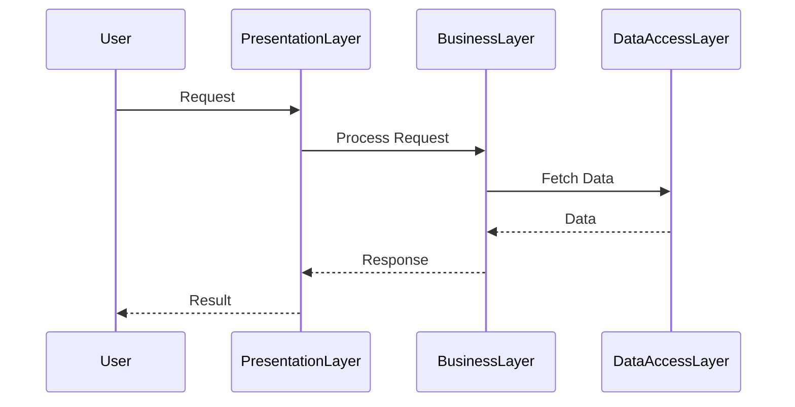
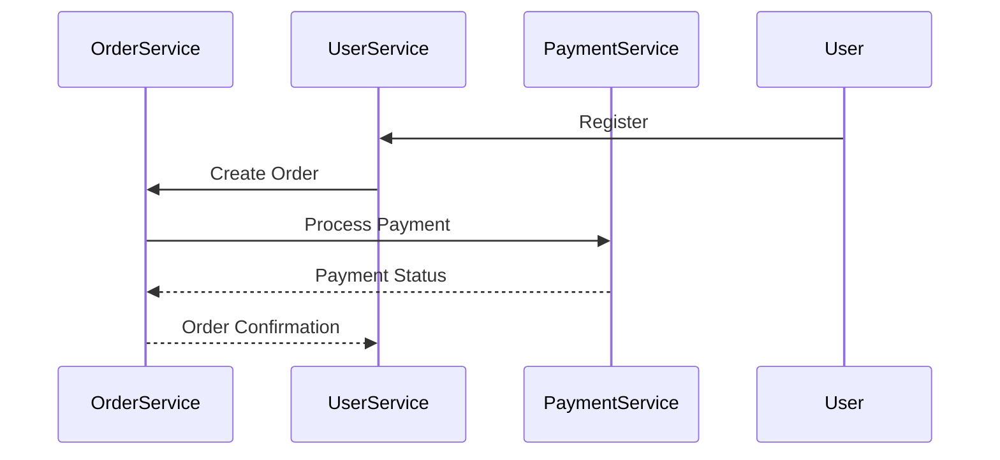
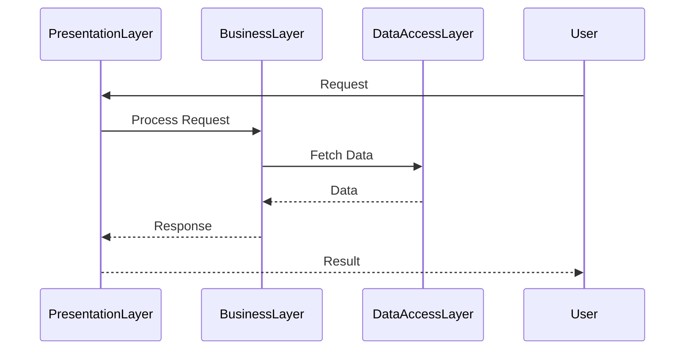
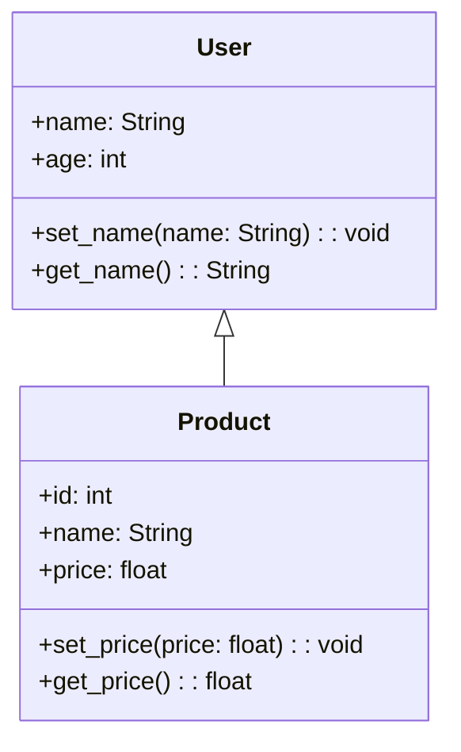
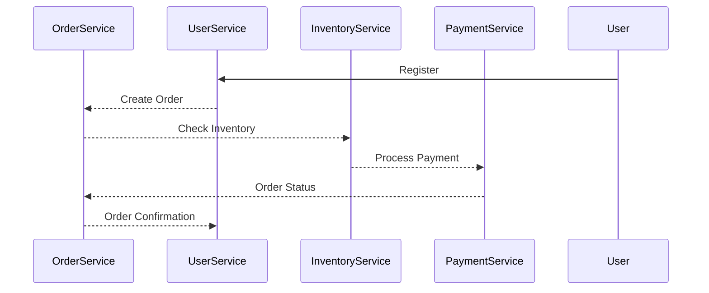

                 

### 引言

#### 1.1 问题背景与重要性

在当今这个数字化的时代，软件系统不再仅仅是满足特定需求的工具，而是企业运营的核心组成部分。随着互联网、物联网、大数据、人工智能等技术的飞速发展，软件系统的规模和复杂性不断攀升。企业面临的挑战不仅是如何快速开发和部署软件，更是如何确保软件能够随业务需求的增长而灵活扩展。软件可扩展性设计，作为应对这一挑战的关键策略，其重要性日益凸显。

软件可扩展性设计是指在软件系统的设计和开发过程中，通过采用一系列技术策略和管理方法，使得软件系统能够适应未来的变化和扩展需求。这种设计不仅能够降低开发和维护成本，还能提高系统的灵活性和可靠性，从而在激烈的市场竞争中保持优势。

#### 1.2 软件可扩展性定义与内涵

软件可扩展性（Software Extensibility）指的是软件系统在功能、性能、规模等方面能够适应变化的能力。具体来说，它包含以下几层内涵：

1. **功能扩展性**：软件能够支持新功能或现有功能的增强，无需对整个系统进行大规模修改。
2. **性能扩展性**：系统在面对大量数据和用户时，能够保持高性能和响应速度。
3. **规模扩展性**：软件能够支持用户规模的增加，从单机部署扩展到分布式架构。
4. **架构扩展性**：系统设计允许在不影响现有功能的前提下，引入新的架构组件或服务。

#### 1.3 设计可扩展性软件的意义

设计可扩展性软件的意义主要体现在以下几个方面：

1. **降低维护成本**：通过模块化和分层设计，使得系统的维护和升级更加简单和高效。
2. **提高开发效率**：可扩展性设计使得开发团队能够专注于核心功能的开发，而无需重复实现已有功能。
3. **提升用户体验**：灵活的扩展能力使得系统能够快速响应市场变化和用户需求，提供更好的用户体验。
4. **增强竞争力**：具备高扩展性的软件系统能够更好地适应企业未来的发展，提高市场竞争力。

#### 1.4 本书结构安排

本书旨在系统地探讨软件可扩展性设计的方法和策略，以帮助读者深入了解并掌握这一重要领域。全书分为七个主要部分：

1. **引言**：介绍软件可扩展性的背景、定义及其重要性。
2. **可扩展性设计基础**：探讨可扩展性的核心概念、设计模式和应用原则。
3. **架构策略与实践**：分析各种架构策略和实际案例，展示如何设计和实现可扩展性软件。
4. **软件可扩展性设计方法论**：介绍设计流程、工具和方法。
5. **高级可扩展性设计技巧**：讨论高级设计技巧和最佳实践。
6. **可扩展性设计挑战与解决策略**：分析设计过程中的挑战和解决策略。
7. **总结与展望**：总结全书内容，展望可扩展性设计的未来趋势。

通过本书的学习，读者将能够全面掌握软件可扩展性设计的方法和策略，为企业在数字化时代的发展提供坚实的支持。

### 第一部分：引言

#### 1. 引言

软件系统的可扩展性设计是一个复杂而关键的过程，它关系到系统在未来的可持续发展能力。在数字化浪潮的推动下，软件系统需要具备高度的灵活性和适应性，以应对不断变化的市场需求和用户需求。本部分将首先探讨软件可扩展性的核心概念、分类及其度量方法，帮助读者建立起对这一主题的基本理解。

#### 1.1 问题背景与重要性

在现代软件工程中，系统的可扩展性设计已经成为一个至关重要的议题。随着互联网和云计算技术的广泛应用，软件系统的规模和复杂性不断增加，传统的单体架构已难以满足快速扩展的需求。例如，电商平台需要在购物节期间应对数以亿计的并发用户请求，金融系统需要在交易高峰期处理大量交易请求，物联网系统需要在设备数量剧增的情况下保持系统稳定。这些问题迫使开发者必须从设计之初就考虑系统的可扩展性。

软件可扩展性设计不仅仅是一个技术问题，它还涉及到业务策略、团队协作等多个方面。一个具有良好可扩展性的软件系统，不仅能够在未来轻松应对增长的需求，还能够降低维护成本、提高开发效率，最终为企业带来竞争优势。因此，深入探讨软件可扩展性设计的方法和策略，对于现代软件开发至关重要。

#### 1.2 软件可扩展性定义与内涵

软件可扩展性（Software Extensibility）是指软件系统在面临功能、性能、规模等需求变化时，能够通过最小化改动或无需改动现有系统结构，来实现新需求或增强现有功能的能力。它通常包括以下几个方面：

1. **功能扩展性**：系统可以支持新功能的添加，或者通过简单的配置修改实现功能增强，而不需要修改核心代码逻辑。
2. **性能扩展性**：系统在面对高负载、大数据量时，能够保持高性能和高响应速度，适应业务规模的扩展。
3. **规模扩展性**：系统能够支持用户数、数据量、计算资源等规模的增加，从单机部署扩展到分布式架构，甚至云计算环境。
4. **架构扩展性**：系统设计具有灵活性，允许在不影响现有功能的前提下，引入新的架构组件或服务，以适应新的业务需求。

理解软件可扩展性的内涵，有助于我们在设计和开发过程中，有针对性地进行架构设计和代码编写，从而提高系统的可扩展性。

#### 1.3 设计可扩展性软件的意义

设计可扩展性软件的意义在于：

1. **降低维护成本**：模块化和分层设计使得系统的维护和升级更加简单和高效，减少了代码冗余和复杂性。
2. **提高开发效率**：可扩展性设计使得开发团队能够专注于核心功能的开发，而无需重复实现已有功能，提高了开发效率。
3. **提升用户体验**：灵活的扩展能力使得系统能够快速响应市场变化和用户需求，提供更好的用户体验。
4. **增强竞争力**：具备高扩展性的软件系统能够更好地适应企业未来的发展，提高市场竞争力。

#### 1.4 本书的结构安排

本书将分为以下几个部分：

1. **第一部分：引言**：介绍软件可扩展性的背景、定义及其重要性。
2. **第二部分：可扩展性设计基础**：探讨可扩展性的核心概念、设计模式和应用原则。
3. **第三部分：架构策略与实践**：分析各种架构策略和实际案例，展示如何设计和实现可扩展性软件。
4. **第四部分：软件可扩展性设计方法论**：介绍设计流程、工具和方法。
5. **第五部分：高级可扩展性设计技巧**：讨论高级设计技巧和最佳实践。
6. **第六部分：可扩展性设计挑战与解决策略**：分析设计过程中的挑战和解决策略。
7. **第七部分：总结与展望**：总结全书内容，展望可扩展性设计的未来趋势。

通过本书的学习，读者将能够全面掌握软件可扩展性设计的方法和策略，为企业的软件开发提供坚实的支持。

### 第二部分：可扩展性设计基础

在深入探讨软件可扩展性设计之前，首先需要理解其核心概念、分类及其度量方法。本部分将详细讲解可扩展性的核心概念，包括定义、分类和度量，以及设计模式在可扩展性中的应用。

#### 2.1 可扩展性的核心概念

##### 2.1.1 可扩展性的定义

可扩展性（Extensibility）是指软件系统能够适应未来变化的能力，尤其是在功能、性能、规模等方面。具体来说，可扩展性设计旨在使软件系统能够在不改变核心架构的情况下，方便地添加新功能、扩展性能或增加规模。

##### 2.1.2 可扩展性的分类

根据扩展的范围和方式，可扩展性可以分为以下几种类型：

1. **横向扩展性**（Scalability）：系统能够通过增加硬件资源（如服务器、存储等）来提高处理能力，以应对用户数量的增加或数据量的增长。
2. **纵向扩展性**（Scalability Upwards）：通过升级硬件配置（如更快的CPU、更大的内存等）来提高系统性能。
3. **功能扩展性**（Feature Scalability）：系统能够灵活地添加或修改功能，以适应新的业务需求。
4. **架构扩展性**（Architecture Scalability）：系统能够在不影响现有功能的前提下，引入新的组件或服务，以适应新的业务场景。

##### 2.1.3 可扩展性的度量

为了评估软件系统的可扩展性，可以采用以下几种度量方法：

1. **扩展性比率**（Scalability Ratio）：扩展性比率是系统性能在资源增加情况下的变化程度。例如，如果系统在增加两倍资源时性能提升了一倍，则扩展性比率为2。
2. **扩展性成本**（Scalability Cost）：扩展性成本包括硬件升级、软件开发和运维成本等，用于评估扩展性实现的代价。
3. **扩展性响应时间**（Scalability Response Time）：响应时间是指系统在不同负载下的处理时间，用于评估系统的响应速度。

#### 2.2 设计模式在可扩展性中的应用

设计模式（Design Patterns）是解决软件开发过程中常见问题的经验总结，它们在可扩展性设计中具有重要作用。以下是几种常见的设计模式及其在可扩展性中的应用：

##### 2.2.1 设计模式概述

设计模式是一套被反复使用、经过验证的解决方案，用于指导软件开发中的设计和实现。常见的设计模式包括：

1. **工厂模式**（Factory Pattern）：用于创建对象，可以灵活地添加或替换具体的产品类，从而提高系统的扩展性。
2. **观察者模式**（Observer Pattern）：用于实现对象间的解耦，当一个对象的状态发生变化时，其他对象能够自动响应，适用于功能扩展性。
3. **策略模式**（Strategy Pattern）：用于在运行时选择不同的算法或策略，适用于功能扩展性和性能优化。

##### 2.2.2 常见可扩展性设计模式

1. **分层架构**（Layered Architecture）：分层架构将系统分为多个层次，每个层次具有独立的功能和职责，提高了系统的模块化和扩展性。
2. **微服务架构**（Microservices Architecture）：微服务架构通过将大型系统拆分为多个小型服务，每个服务独立开发、部署和扩展，提高了系统的灵活性和可扩展性。
3. **插件架构**（Plugin Architecture）：插件架构允许第三方开发插件，扩展系统的功能，从而提高了功能扩展性和用户定制性。

#### 2.3 核心设计原则

为了实现软件系统的可扩展性，需要遵循一系列核心设计原则。以下是几种重要的设计原则：

##### 2.3.1 模块化设计

模块化设计是将系统划分为多个独立的模块，每个模块具有明确的职责和接口。模块化设计提高了系统的可维护性和可扩展性，使得开发者可以独立开发、测试和部署模块。

##### 2.3.2 分层架构

分层架构将系统分为多个层次，每个层次负责不同的功能。例如，表示层、业务逻辑层、数据访问层等。这种设计方法提高了系统的灵活性和可扩展性，使得不同层次的组件可以独立扩展。

##### 2.3.3 面向对象设计

面向对象设计通过封装、继承和多态等特性，提高了系统的可重用性和可扩展性。面向对象设计鼓励开发者将系统划分为多个对象，每个对象具有明确的职责和接口，从而提高了系统的模块化和可扩展性。

通过以上对可扩展性核心概念、分类和度量方法的讲解，以及设计模式在可扩展性中的应用和核心设计原则的阐述，读者将对软件可扩展性设计有更深入的理解。接下来的章节将进一步探讨如何在实际开发中应用这些理论和原则，实现具有高可扩展性的软件系统。

### 2.2 设计模式在可扩展性中的应用

在软件开发中，设计模式是解决常见问题的经典模板，它们不仅提高了代码的可读性和可维护性，还在实现可扩展性方面发挥着重要作用。以下将详细探讨几种常见的设计模式及其在提高软件系统可扩展性方面的应用。

#### 2.2.1 设计模式概述

设计模式（Design Patterns）是软件开发中的经验总结，由著名的软件设计师Ernest Hemmingway和Richard Helm在1994年的《设计模式：可复用面向对象软件的基础》一书中首次提出。设计模式分为三类：创建型模式、结构型模式和和行为型模式。以下是几种常见的创建型模式和结构型模式，它们在可扩展性设计中具有重要作用。

##### 1. 工厂模式（Factory Pattern）

工厂模式是一种创建型设计模式，用于在父类中定义一个创建对象的方法，将实际创建对象的工作委派给子类。工厂模式的主要目的是实现对象的创建与客户端代码解耦，从而提高系统的可扩展性。

**示例：**  
```python
class Product:
    def operation(self):
        pass

class ConcreteProductA(Product):
    def operation(self):
        return "Result of Operation A"

class ConcreteProductB(Product):
    def operation(self):
        return "Result of Operation B"

class Creator:
    def __init__(self):
        self.product = None

    def factory_method(self, product_type):
        if product_type == "A":
            self.product = ConcreteProductA()
        elif product_type == "B":
            self.product = ConcreteProductB()
        return self.product

    def operation(self):
        if self.product:
            return self.product.operation()

creator = Creator()
print(creator.factory_method("A").operation())  # 输出："Result of Operation A"
```

**应用场景：**  
工厂模式在需要根据不同条件动态创建对象时非常有用，如在不同的数据库驱动程序选择中。

##### 2. 观察者模式（Observer Pattern）

观察者模式是一种行为型设计模式，用于实现对象之间的解耦。当一个对象的状态发生变化时，观察者对象能够得到通知并自动响应。这种模式适用于功能扩展性，使得系统可以在不修改核心代码的情况下，添加新的功能或改变已有功能的行为。

**示例：**  
```python
class Observer:
    def update(self, subject):
        pass

class ConcreteObserver(Observer):
    def update(self, subject):
        print(f"{subject} state changed, observer reacting.")

class Subject:
    def __init__(self):
        self.observers = []

    def attach(self, observer):
        self.observers.append(observer)

    def detach(self, observer):
        self.observers.remove(observer)

    def notify(self):
        for observer in self.observers:
            observer.update(self)

subject = Subject()
observer = ConcreteObserver()
subject.attach(observer)

subject.notify()  # 输出："Subject state changed, observer reacting."
```

**应用场景：**  
观察者模式在实现事件驱动系统、用户界面更新等方面非常有效，如微信消息推送系统。

##### 2.3 策略模式（Strategy Pattern）

策略模式是一种行为型设计模式，用于在运行时选择不同的算法或策略。这种模式将算法的实现与客户端代码解耦，使得算法可以灵活地替换或扩展，从而提高系统的可扩展性。

**示例：**  
```python
class Strategy:
    def algorithm_interface(self):
        pass

class ConcreteStrategyA(Strategy):
    def algorithm_interface(self):
        return "Result of Algorithm A"

class ConcreteStrategyB(Strategy):
    def algorithm_interface(self):
        return "Result of Algorithm B"

class Context:
    def __init__(self, strategy: Strategy):
        self._strategy = strategy

    def set_strategy(self, strategy: Strategy):
        self._strategy = strategy

    def execute_algorithm(self):
        return self._strategy.algorithm_interface()

context = Context(ConcreteStrategyA())
print(context.execute_algorithm())  # 输出："Result of Algorithm A"

context.set_strategy(ConcreteStrategyB())
print(context.execute_algorithm())  # 输出："Result of Algorithm B"
```

**应用场景：**  
策略模式在需要动态切换算法或策略的场景中非常有用，如数据库连接池管理、负载均衡等。

#### 2.2.2 常见可扩展性设计模式

##### 1. 分层架构（Layered Architecture）

分层架构将系统分为多个层次，每个层次具有独立的职责和功能。常见的层次包括表示层、业务逻辑层、数据访问层等。分层架构提高了系统的模块化和可扩展性，使得不同层次的组件可以独立扩展。

**示例：**  


**应用场景：**  
分层架构在大型系统中广泛应用，如电商平台、金融系统等。

##### 2. 微服务架构（Microservices Architecture）

微服务架构将大型系统拆分为多个小型服务，每个服务具有独立的业务功能。微服务架构通过服务间的松耦合和独立部署，提高了系统的灵活性和可扩展性。

**示例：**  


**应用场景：**  
微服务架构在分布式系统中应用广泛，如电商、物流、金融等领域。

##### 2.3 插件架构（Plugin Architecture）

插件架构允许第三方开发插件，扩展系统的功能。插件与主系统通过接口进行通信，从而实现功能扩展。

**示例：**  
```mermaid
classDiagram
    PluginA <|-- PluginInterface
    PluginB <|-- PluginInterface
    PluginInterface {
        +operation(): void
    }
    PluginA {
        +operation(): void
    }
    PluginB {
        +operation(): void
    }
```

**应用场景：**  
插件架构在需要灵活扩展功能的系统中应用广泛，如Web应用、游戏引擎等。

通过以上对设计模式在可扩展性中的应用的详细讲解，读者可以更好地理解如何在软件开发中利用设计模式提高系统的可扩展性。在接下来的章节中，我们将进一步探讨软件可扩展性的核心设计原则，为读者提供更全面的理论基础。

### 2.3 核心设计原则

为了实现软件系统的可扩展性，需要遵循一系列核心设计原则。这些原则不仅能够提高系统的可维护性，还能确保系统在面对未来需求变化时，能够灵活应对。以下是几种重要的设计原则：

#### 2.3.1 模块化设计

模块化设计是将系统划分为多个独立的模块，每个模块具有明确的职责和接口。模块化设计提高了系统的可维护性和可扩展性，使得开发者可以独立开发、测试和部署模块。

**示例**：  
```mermaid
classDiagram
    ModuleA <|-- InterfaceA
    ModuleB <|-- InterfaceB

    InterfaceA {
        +functionA(): void
    }
    InterfaceB {
        +functionB(): void
    }
    ModuleA {
        +functionA(): void
    }
    ModuleB {
        +functionB(): void
    }
```

**应用场景**：  
模块化设计适用于大型系统，如电商平台、金融系统等。

#### 2.3.2 分层架构

分层架构将系统分为多个层次，每个层次负责不同的功能。常见的层次包括表示层、业务逻辑层、数据访问层等。这种设计方法提高了系统的灵活性和可扩展性，使得不同层次的组件可以独立扩展。

**示例**：  


**应用场景**：  
分层架构在大型系统中广泛应用，如电商平台、金融系统等。

#### 2.3.3 面向对象设计

面向对象设计通过封装、继承和多态等特性，提高了系统的可重用性和可扩展性。面向对象设计鼓励开发者将系统划分为多个对象，每个对象具有明确的职责和接口，从而提高了系统的模块化和可扩展性。

**示例**：  


**应用场景**：  
面向对象设计在几乎所有类型的软件系统中都有应用，如Web应用、移动应用、嵌入式系统等。

#### 2.3.4 依赖倒置原则

依赖倒置原则（Dependency Inversion Principle）是面向对象设计的重要原则之一，它要求高层次的模块不应依赖于低层次的模块，而是应该依赖于抽象。通过这种设计，可以降低模块间的耦合度，提高系统的可扩展性和可维护性。

**示例**：  
```python
from abc import ABC, abstractmethod

class Animal(ABC):
    @abstractmethod
    def make_sound(self):
        pass

class Dog(Animal):
    def make_sound(self):
        return "Bark!"

class Cat(Animal):
    def make_sound(self):
        return "Meow!"

class AnimalShelter:
    def __init__(self, animal: Animal):
        self._animal = animal

    def make_sound(self):
        return self._animal.make_sound()

dog = Dog()
cat = Cat()

shelter = AnimalShelter(dog)
print(shelter.make_sound())  # 输出："Bark!"

shelter = AnimalShelter(cat)
print(shelter.make_sound())  # 输出："Meow!"
```

**应用场景**：  
依赖倒置原则在需要频繁替换或扩展模块的系统中非常有用，如插件系统、游戏引擎等。

#### 2.3.5 单一职责原则

单一职责原则（Single Responsibility Principle）是指一个类或模块应该只负责一项功能，这样可以降低系统的复杂度，提高可维护性和可扩展性。

**示例**：  
```python
class UserManagement:
    def register_user(self, user):
        # 注册用户的逻辑

    def authenticate_user(self, user):
        # 用户认证的逻辑

# 改进
class UserManager:
    def register_user(self, user):
        # 注册用户的逻辑

class UserAuthenticator:
    def authenticate_user(self, user):
        # 用户认证的逻辑
```

**应用场景**：  
单一职责原则适用于所有类型的软件系统，尤其是需要高扩展性和高维护性的系统。

通过遵循上述核心设计原则，开发者可以设计出具有高可扩展性的软件系统。这些原则不仅能够提高系统的灵活性，还能确保系统在面对未来需求变化时，能够保持稳定和高效。在接下来的章节中，我们将进一步探讨架构策略和实践，为读者提供更多实用经验和案例分析。

### 3. 架构策略与实践

在软件系统的可扩展性设计中，选择合适的架构策略是实现系统灵活性和可扩展性的关键。本节将介绍几种常见的架构策略，包括微服务架构、容器化与容器编排、云原生架构，并通过实际案例分析如何应用这些策略来提升软件系统的可扩展性。

#### 3.1 架构设计策略

##### 3.1.1 微服务架构

微服务架构（Microservices Architecture）是一种基于独立、小型、自治服务的架构风格。每个服务代表业务功能的一个子集，独立开发、部署和扩展。这种架构策略能够提高系统的可扩展性和灵活性，具体优势如下：

1. **独立性**：每个服务都可以独立开发和部署，降低了系统之间的耦合度。
2. **弹性伸缩**：可以根据服务具体的负载情况，独立扩展或缩减资源，提高资源利用率。
3. **技术多样性**：不同的服务可以使用不同的技术栈，以最适合的方式实现业务需求。

**示例：**  
假设一个电商平台，可以将系统拆分为订单服务、用户服务、库存服务、支付服务等微服务。

**架构图**：  


**应用场景**：  
微服务架构适用于需要高扩展性和高灵活性的大型分布式系统，如电商平台、物流系统等。

##### 3.1.2 容器化与容器编排

容器化（Containerization）通过使用容器来封装应用程序及其依赖项，实现快速部署、弹性伸缩和高效管理。常见的容器化技术包括Docker和Kubernetes。

1. **容器化优势**：
   - **轻量级**：容器启动速度快，占用资源少，能够实现快速部署和弹性伸缩。
   - **可移植性**：容器可以在任何支持容器引擎的宿主机上运行，提高了应用的兼容性和可移植性。
   - **隔离性**：容器能够实现资源隔离，提高系统的稳定性和安全性。

2. **容器编排**：
   - **Kubernetes**：Kubernetes是一个开源的容器编排平台，能够自动化容器的部署、扩展和管理。它提供了强大的集群管理和资源调度能力，使得容器化应用的管理变得更加简单和高效。

**示例：**  
```yaml
apiVersion: apps/v1
kind: Deployment
metadata:
  name: my-app
spec:
  replicas: 3
  selector:
    matchLabels:
      app: my-app
  template:
    metadata:
      labels:
        app: my-app
    spec:
      containers:
      - name: my-app
        image: my-app:latest
        ports:
        - containerPort: 80
```

**应用场景**：  
容器化和容器编排适用于需要快速部署、灵活扩展的互联网应用和分布式系统。

##### 3.1.3 云原生架构

云原生架构（Cloud-Native Architecture）是一种基于云环境、利用容器、服务网格、不可变基础设施和声明式API设计的架构风格。云原生架构的特点是高可扩展性、高可靠性和高灵活性。

1. **云原生优势**：
   - **弹性伸缩**：能够根据负载自动扩展或缩减资源，实现高效资源利用。
   - **服务化**：通过服务网格实现微服务间的通信，提高系统的解耦合度和灵活性。
   - **自动化**：通过声明式API和自动化工具，实现基础设施和应用的自动化部署和管理。

2. **关键组件**：
   - **容器引擎**：如Docker和containerd，负责容器化应用程序。
   - **服务网格**：如Istio和Linkerd，负责微服务间的通信和安全。
   - **CI/CD**：持续集成和持续部署工具，如Jenkins和GitLab CI，实现自动化交付。

**示例**：  
```mermaid
cloudServices

cloudServices --> containerEngine: Docker/Containerd
containerEngine --> serviceMesh: Istio/Linkerd
serviceMesh --> ciCd: Jenkins/GitLab CI
```

**应用场景**：  
云原生架构适用于需要高扩展性、高灵活性和快速交付的现代化应用，如金融科技、物联网、移动应用等。

#### 3.2 实战案例分析

##### 3.2.1 案例一：电商平台架构优化

**背景**：  
一个大型电商平台需要应对双11等购物节期间的大量订单和用户请求，传统的单体架构难以满足性能和可扩展性的需求。

**解决方案**：  
- **采用微服务架构**：将系统拆分为订单服务、用户服务、库存服务、支付服务等多个微服务，每个服务独立部署和扩展。
- **容器化与编排**：使用Docker容器化应用程序，并使用Kubernetes进行容器编排，实现自动化部署和弹性伸缩。
- **云原生架构**：采用云原生技术，如Istio进行服务网格管理，实现微服务间的可靠通信和安全控制。

**效果**：  
- 系统性能大幅提升，能够处理数以亿计的订单和用户请求。
- 扩展性得到显著提高，可以根据实际需求独立扩展不同微服务。
- 降低了运维成本，通过自动化工具实现基础设施和应用的自动化管理。

##### 3.2.2 案例二：金融行业风控系统设计

**背景**：  
金融行业风控系统需要实时处理大量交易请求，确保交易的安全性和合规性。传统架构在处理高并发交易请求时，存在性能瓶颈和扩展性限制。

**解决方案**：  
- **采用微服务架构**：将风控系统拆分为用户服务、交易服务、风控规则服务等多个微服务，每个服务独立开发和部署。
- **容器化与编排**：使用Docker容器化应用程序，并使用Kubernetes进行容器编排，实现自动化部署和动态伸缩。
- **服务网格**：采用Istio进行服务网格管理，确保微服务之间的安全通信和流量管理。

**效果**：  
- 系统处理能力得到显著提升，能够实时处理大量交易请求。
- 扩展性得到增强，可以根据交易量动态扩展风控服务。
- 提高了系统的安全性和可靠性，通过服务网格实现细粒度的访问控制和流量监控。

##### 3.2.3 案例三：物联网平台架构构建

**背景**：  
物联网平台需要连接大量设备，处理实时数据，并支持远程监控和管理。传统架构难以满足物联网平台的可扩展性和实时性需求。

**解决方案**：  
- **采用云原生架构**：利用Kubernetes、Istio等云原生技术，构建高可扩展性、高可靠性的物联网平台。
- **容器化与编排**：使用Docker容器化应用程序，并使用Kubernetes进行容器编排，实现自动化部署和弹性伸缩。
- **服务网格**：采用Istio进行服务网格管理，确保设备间的安全通信和实时数据流处理。

**效果**：  
- 系统能够实时连接和管理大量设备，处理海量数据。
- 扩展性得到大幅提升，可以根据设备数量动态扩展平台资源。
- 提高了系统的可靠性和安全性，通过服务网格实现设备通信的安全性和数据流的监控。

通过上述架构策略和实际案例的分析，我们可以看到，采用微服务架构、容器化与编排、云原生架构等策略，可以有效提升软件系统的可扩展性和性能，满足未来业务需求的变化。在接下来的章节中，我们将进一步探讨软件可扩展性设计的方法论，为读者提供更为全面的指导。

### 3.3 实战案例分析

在实际项目中，如何将可扩展性设计理念应用到具体的架构策略中，是一个复杂且具有挑战性的过程。本节将通过三个具体案例，详细分析如何将微服务架构、容器化与容器编排、云原生架构等策略应用于实际开发中，实现软件系统的可扩展性。

#### 3.3.1 案例一：电商平台架构优化

**背景**：

一家大型电商平台，在双11等购物节期间，需要处理数以亿计的订单和用户请求。传统的单体架构由于性能瓶颈和扩展性限制，已经无法满足如此大规模的业务需求。

**解决方案**：

1. **微服务架构**：

   - **模块划分**：将电商平台的业务拆分为多个独立的服务，如订单服务、用户服务、库存服务、支付服务、推荐服务等。
   - **服务独立部署**：每个服务独立开发和部署，降低服务间的耦合度。
   - **API网关**：引入API网关，统一处理客户端请求，转发至相应的服务。

2. **容器化与容器编排**：

   - **容器化**：使用Docker容器化应用程序，将各个服务的应用、配置、依赖打包成一个容器镜像，实现环境的标准化。
   - **Kubernetes编排**：使用Kubernetes进行容器编排，实现自动化部署、弹性伸缩、负载均衡和故障恢复。

3. **云原生架构**：

   - **服务网格**：引入Istio服务网格，进行服务间通信的安全性和流量管理。
   - **持续集成与持续部署（CI/CD）**：使用Jenkins等工具实现自动化测试和部署，提高开发效率和质量。

**实施步骤**：

1. **需求分析**：分析电商平台的核心功能模块，确定需要拆分的微服务。
2. **服务设计**：设计每个微服务的职责和接口，确保服务间的松耦合。
3. **容器化**：编写Dockerfile，将应用、配置、依赖打包成容器镜像。
4. **部署与监控**：使用Kubernetes部署服务，配置负载均衡、自动扩缩容策略，并设置监控和报警机制。
5. **服务网格配置**：配置Istio，实现服务间的安全通信和流量管理。
6. **CI/CD**：搭建持续集成与持续部署流程，确保代码质量和快速交付。

**效果**：

- **性能提升**：通过分布式架构和负载均衡，平台在购物节期间的响应速度显著提升。
- **弹性伸缩**：根据负载情况，自动扩展或缩减服务实例，确保系统在高并发情况下稳定运行。
- **降低成本**：通过容器化和自动化管理，减少运维成本，提高资源利用率。

#### 3.3.2 案例二：金融行业风控系统设计

**背景**：

金融行业的风控系统需要实时处理大量交易请求，确保交易的安全性和合规性。传统的单体架构在高并发交易请求下，存在性能瓶颈和扩展性限制。

**解决方案**：

1. **微服务架构**：

   - **模块划分**：将风控系统拆分为多个独立的服务，如用户服务、交易服务、风控规则服务、报警服务等。
   - **服务独立部署**：每个服务独立开发和部署，降低服务间的耦合度。
   - **API网关**：引入API网关，统一处理客户端请求，转发至相应的服务。

2. **容器化与容器编排**：

   - **容器化**：使用Docker容器化应用程序，将各个服务的应用、配置、依赖打包成一个容器镜像，实现环境的标准化。
   - **Kubernetes编排**：使用Kubernetes进行容器编排，实现自动化部署、弹性伸缩、负载均衡和故障恢复。

3. **云原生架构**：

   - **服务网格**：引入Istio服务网格，进行服务间通信的安全性和流量管理。
   - **日志收集与分析**：使用ELK（Elasticsearch、Logstash、Kibana）栈进行日志收集和分析，提高系统监控和故障排查效率。

**实施步骤**：

1. **需求分析**：分析金融行业风控系统的核心功能模块，确定需要拆分的微服务。
2. **服务设计**：设计每个微服务的职责和接口，确保服务间的松耦合。
3. **容器化**：编写Dockerfile，将应用、配置、依赖打包成容器镜像。
4. **部署与监控**：使用Kubernetes部署服务，配置负载均衡、自动扩缩容策略，并设置监控和报警机制。
5. **服务网格配置**：配置Istio，实现服务间的安全通信和流量管理。
6. **日志收集与分析**：搭建ELK栈，进行日志收集和分析，提高系统监控和故障排查效率。

**效果**：

- **实时处理能力**：通过分布式架构和负载均衡，风控系统能够实时处理大量交易请求。
- **弹性伸缩**：根据交易量动态扩展或缩减服务实例，确保系统在高并发情况下稳定运行。
- **安全性与合规性**：通过服务网格实现安全通信和流量管理，提高系统的安全性和合规性。

#### 3.3.3 案例三：物联网平台架构构建

**背景**：

物联网平台需要连接大量设备，实时处理海量数据，并支持远程监控和管理。传统的单体架构在处理海量数据和设备连接时，存在性能瓶颈和扩展性限制。

**解决方案**：

1. **云原生架构**：

   - **容器化与编排**：使用Docker容器化应用程序，并使用Kubernetes进行容器编排，实现自动化部署和弹性伸缩。
   - **服务网格**：引入Istio服务网格，进行设备通信的安全性和流量管理。

2. **边缘计算**：

   - **边缘节点**：在边缘设备上部署轻量级容器，处理本地数据，减少中心节点的数据传输压力。
   - **数据聚合与处理**：在中心节点进行数据聚合和分析，实现设备状态的实时监控。

3. **大数据处理**：

   - **流处理**：使用Apache Kafka等流处理技术，实现实时数据流处理和传输。
   - **数据存储与分析**：使用Apache Hadoop、Apache Spark等大数据处理框架，进行数据存储和分析。

**实施步骤**：

1. **需求分析**：分析物联网平台的核心功能模块，确定需要拆分的微服务。
2. **容器化与编排**：编写Dockerfile，将应用、配置、依赖打包成容器镜像，并使用Kubernetes进行容器编排。
3. **边缘节点部署**：在边缘设备上部署容器，并配置数据采集和处理。
4. **服务网格配置**：配置Istio，实现设备间的安全通信和流量管理。
5. **大数据处理**：搭建Kafka、Hadoop、Spark等大数据处理架构，进行数据存储和分析。

**效果**：

- **实时数据处理能力**：通过边缘计算和流处理技术，实现实时数据处理和监控。
- **弹性伸缩**：根据设备连接数量和数据处理量，动态扩展或缩减容器资源。
- **数据安全性**：通过服务网格实现设备通信的安全性和数据保护。

通过以上三个实际案例的分析，我们可以看到，将微服务架构、容器化与容器编排、云原生架构等策略应用于实际项目中，能够有效提升软件系统的可扩展性和性能，满足未来业务需求的变化。这些案例不仅展示了具体的实施步骤和效果，也为其他开发者提供了宝贵的经验和参考。

### 4. 软件可扩展性设计方法论

在软件可扩展性设计中，设计方法论起到至关重要的作用。一个科学、系统的设计方法论不仅能够帮助开发者更好地理解系统需求，还能确保设计过程的高效性和可重复性。本节将介绍软件可扩展性设计方法论，包括设计方法论的重要性、常见设计方法论介绍、设计流程与步骤、以及设计工具与资源。

#### 4.1 设计方法论概述

设计方法论是指在软件开发过程中，用来指导设计过程的一系列原则、方法和技巧。对于软件可扩展性设计而言，设计方法论的重要性体现在以下几个方面：

1. **确保设计的科学性**：设计方法论能够帮助开发者系统化地分析需求，制定设计策略，从而提高设计的科学性和合理性。
2. **提高设计的可重复性**：通过方法论，可以将设计经验转化为标准化的流程和模板，使得后续项目能够快速、高效地迭代和扩展。
3. **优化设计过程**：设计方法论能够明确设计过程中的关键环节和步骤，有助于开发者集中精力解决核心问题，提高设计效率。
4. **降低风险**：通过方法论，开发者可以提前识别和应对潜在的设计风险，降低项目失败的概率。

#### 4.1.1 设计方法论的重要性

软件系统的可扩展性设计是一个复杂的过程，涉及多个层面的技术和策略。设计方法论能够为这一过程提供系统化的指导和保障，确保设计目标的实现。其重要性主要体现在以下几个方面：

1. **统一设计理念**：设计方法论能够统一开发团队的设计理念，确保团队成员在设计和实现过程中保持一致。
2. **提高设计质量**：设计方法论包含了一系列设计原则和最佳实践，有助于开发者遵循这些原则，提高设计质量。
3. **减少冗余与重复**：设计方法论可以帮助开发者避免重复设计，减少代码冗余，从而提高系统的可维护性和可扩展性。
4. **促进团队协作**：设计方法论为团队协作提供了共同的语言和框架，有助于团队成员之间的沟通和协作。

#### 4.1.2 常见设计方法论介绍

在软件可扩展性设计中，常见的设计方法论包括面向对象设计（Object-Oriented Design，OOD）、模型驱动设计（Model-Driven Design，MDD）、领域驱动设计（Domain-Driven Design，DDD）等。

1. **面向对象设计（OOD）**

   面向对象设计是一种基于对象的设计方法，强调将系统划分为多个对象，每个对象具有独立的职责和接口。面向对象设计通过封装、继承和多态等特性，提高了系统的可重用性和可扩展性。

   **优点**：

   - **模块化**：将系统划分为多个对象，提高了模块化程度。
   - **可重用性**：通过继承和多态，实现了代码的可重用。
   - **可维护性**：对象职责明确，提高了系统的可维护性。

   **应用场景**：适用于大多数软件开发项目，尤其是需要高扩展性和高可维护性的系统。

2. **模型驱动设计（MDD）**

   模型驱动设计是一种基于模型的设计方法，通过创建模型来描述系统的功能和行为。设计过程中，开发者主要关注模型的设计和验证，而不是具体的实现细节。

   **优点**：

   - **可视化**：模型能够直观地表示系统的功能和结构，有助于理解和沟通。
   - **可重用性**：模型可以独立于具体实现，提高了设计的可重用性。
   - **自动化**：通过模型转换工具，可以实现模型到代码的自动化生成。

   **应用场景**：适用于需要高可扩展性和高灵活性的复杂系统，如嵌入式系统、企业级应用等。

3. **领域驱动设计（DDD）**

   领域驱动设计是一种面向业务领域的软件开发方法，强调通过领域模型来理解和驱动设计过程。DDD通过构建领域模型，将业务规则和业务逻辑嵌入到系统中，提高了系统的可扩展性和可维护性。

   **优点**：

   - **业务驱动**：DDD强调通过领域模型理解和表达业务需求，确保系统与业务紧密贴合。
   - **高内聚低耦合**：通过领域模型，实现了系统的高内聚和低耦合，提高了系统的可扩展性。
   - **可重用性**：领域模型可以跨项目、跨领域重用，提高了代码的可维护性。

   **应用场景**：适用于业务规则复杂、需要高扩展性和高可维护性的系统，如金融、保险、物流等领域。

#### 4.1.3 设计流程与步骤

软件可扩展性设计方法论通常包括以下步骤：

1. **需求分析**：

   在这一阶段，开发者需要与业务分析师和用户沟通，明确系统需求。需求分析的结果通常包括功能需求、非功能需求和约束条件。

2. **概念设计**：

   概念设计阶段主要关注系统的高层次结构和领域模型。通过领域模型，开发者可以明确系统的核心领域和领域模型之间的关系。

3. **静态设计**：

   静态设计阶段，开发者需要详细设计系统的模块、类、接口等静态结构。在这一阶段，开发者通常会使用UML（统一建模语言）来描述系统的静态结构。

4. **动态设计**：

   动态设计阶段，开发者需要设计系统的动态行为和交互关系。通过活动图、状态图等动态模型，开发者可以描述系统的运行过程和交互机制。

5. **实现与测试**：

   在实现阶段，开发者根据设计文档进行代码编写和单元测试。测试阶段，开发者需要确保系统的功能、性能和可扩展性满足设计要求。

6. **部署与维护**：

   系统部署后，开发者需要进行持续监控和优化，确保系统在高负载和变化环境下稳定运行。在系统维护阶段，开发者需要根据新的需求和技术发展，进行持续迭代和优化。

#### 4.1.4 设计工具与资源

在软件可扩展性设计中，常用的工具和资源包括UML建模工具、代码生成工具、设计文档模板等。

1. **UML建模工具**：

   - **Visual Paradigm**：一款功能强大的UML建模工具，支持多种建模方法和模型转换。
   - **Enterprise Architect**：一款专业的建模工具，适用于复杂系统的设计和开发。
   - **StarUML**：一款轻量级的UML建模工具，适合中小型项目的使用。

2. **代码生成工具**：

   - **JBoss Tools**：一款集成开发环境，包含代码生成工具，支持多种编程语言和框架。
   - **Visual Studio Code**：一款开源的集成开发环境，支持各种插件，包括代码生成插件。
   - **MyBatis Generator**：一款用于生成MyBatis映射文件的代码生成工具。

3. **设计文档模板**：

   - **Microsoft Word**：适用于撰写详细的设计文档，支持多种模板和格式。
   - **Google Docs**：一款在线文档工具，支持多人协作，适合快速撰写和共享文档。
   - **Markdown**：一种轻量级标记语言，适用于编写简洁的设计文档，支持多种渲染工具。

通过以上对软件可扩展性设计方法论的介绍，读者可以了解到如何系统地进行软件可扩展性设计。在接下来的章节中，我们将进一步探讨高级可扩展性设计技巧和最佳实践，帮助读者进一步提升软件系统的可扩展性。

### 4.2 软件可扩展性设计方法论

软件系统的可扩展性设计是一个多层次、多阶段的复杂过程，涉及到从需求分析到系统实现、测试和部署的各个环节。为了确保设计过程的系统性和高效性，我们需要遵循一套科学、完整的设计方法论。本节将详细讨论软件可扩展性设计方法论，包括设计方法论的重要性、常见的设计方法论、设计流程与步骤以及设计工具与资源。

#### 4.2.1 设计方法论的重要性

设计方法论在软件可扩展性设计中扮演着至关重要的角色。它不仅是开发者理解和解决问题的工具，更是保障设计过程科学性和系统性的指南。以下是设计方法论在软件可扩展性设计中的重要性：

1. **明确设计目标**：设计方法论可以帮助开发者清晰地定义设计目标，确保设计方向的一致性和正确性。
2. **系统化设计过程**：通过方法论，开发者可以系统地进行需求分析、概念设计、静态设计和动态设计等各个阶段，确保设计的完整性和逻辑性。
3. **提高设计效率**：方法论提供了一系列标准和模板，可以减少设计过程中的重复劳动，提高设计效率。
4. **降低设计风险**：设计方法论可以帮助开发者提前识别和应对潜在的设计风险，降低项目失败的概率。
5. **确保团队协作**：设计方法论为团队提供了共同的语言和框架，有助于团队成员之间的沟通和协作。

#### 4.2.2 常见设计方法论

在软件可扩展性设计中，常见的几种方法论包括面向对象设计（Object-Oriented Design，OOD）、模型驱动设计（Model-Driven Design，MDD）、领域驱动设计（Domain-Driven Design，DDD）等。

1. **面向对象设计（OOD）**

   面向对象设计是一种基于对象的设计方法，它强调将系统划分为多个对象，每个对象具有独立的职责和接口。OOD通过封装、继承和多态等特性，提高了系统的可重用性和可扩展性。

   - **优点**：
     - **模块化**：通过将系统划分为多个对象，提高了模块化程度。
     - **可重用性**：通过继承和多态，实现了代码的可重用。
     - **可维护性**：对象职责明确，提高了系统的可维护性。

   - **应用场景**：适用于大多数软件开发项目，尤其是需要高扩展性和高可维护性的系统。

2. **模型驱动设计（MDD）**

   模型驱动设计是一种基于模型的设计方法，通过创建模型来描述系统的功能和行为。设计过程中，开发者主要关注模型的设计和验证，而不是具体的实现细节。

   - **优点**：
     - **可视化**：模型能够直观地表示系统的功能和结构，有助于理解和沟通。
     - **可重用性**：模型可以独立于具体实现，提高了设计的可重用性。
     - **自动化**：通过模型转换工具，可以实现模型到代码的自动化生成。

   - **应用场景**：适用于需要高可扩展性和高灵活性的复杂系统，如嵌入式系统、企业级应用等。

3. **领域驱动设计（DDD）**

   领域驱动设计是一种面向业务领域的软件开发方法，强调通过领域模型来理解和驱动设计过程。DDD通过构建领域模型，将业务规则和业务逻辑嵌入到系统中，提高了系统的可扩展性和可维护性。

   - **优点**：
     - **业务驱动**：DDD强调通过领域模型理解和表达业务需求，确保系统与业务紧密贴合。
     - **高内聚低耦合**：通过领域模型，实现了系统的高内聚和低耦合，提高了系统的可扩展性。
     - **可重用性**：领域模型可以跨项目、跨领域重用，提高了代码的可维护性。

   - **应用场景**：适用于业务规则复杂、需要高扩展性和高可维护性的系统，如金融、保险、物流等领域。

#### 4.2.3 设计流程与步骤

软件可扩展性设计方法论通常包括以下步骤：

1. **需求分析**：

   需求分析是设计过程的起点，开发者需要与业务分析师和用户沟通，明确系统的功能需求、性能需求、可靠性需求等。需求分析的结果通常包括需求文档、用户故事和用例图等。

2. **概念设计**：

   在概念设计阶段，开发者需要关注系统的高层次结构和领域模型。通过领域模型，开发者可以明确系统的核心领域和领域模型之间的关系，为后续的详细设计奠定基础。

3. **静态设计**：

   静态设计阶段，开发者需要详细设计系统的模块、类、接口等静态结构。在这一阶段，开发者通常会使用UML（统一建模语言）来描述系统的静态结构，包括类图、组件图、部署图等。

4. **动态设计**：

   动态设计阶段，开发者需要设计系统的动态行为和交互关系。通过活动图、状态图等动态模型，开发者可以描述系统的运行过程和交互机制，确保系统的功能和行为符合需求。

5. **实现与测试**：

   在实现阶段，开发者根据设计文档进行代码编写和单元测试。测试阶段，开发者需要确保系统的功能、性能和可扩展性满足设计要求，包括集成测试、性能测试和可用性测试等。

6. **部署与维护**：

   系统部署后，开发者需要进行持续监控和优化，确保系统在高负载和变化环境下稳定运行。在系统维护阶段，开发者需要根据新的需求和技术发展，进行持续迭代和优化。

#### 4.2.4 设计工具与资源

在软件可扩展性设计中，常用的工具和资源包括UML建模工具、代码生成工具、设计文档模板等。

1. **UML建模工具**：

   - **Visual Paradigm**：一款功能强大的UML建模工具，支持多种建模方法和模型转换。
   - **Enterprise Architect**：一款专业的建模工具，适用于复杂系统的设计和开发。
   - **StarUML**：一款轻量级的UML建模工具，适合中小型项目的使用。

2. **代码生成工具**：

   - **JBoss Tools**：一款集成开发环境，包含代码生成工具，支持多种编程语言和框架。
   - **Visual Studio Code**：一款开源的集成开发环境，支持各种插件，包括代码生成插件。
   - **MyBatis Generator**：一款用于生成MyBatis映射文件的代码生成工具。

3. **设计文档模板**：

   - **Microsoft Word**：适用于撰写详细的设计文档，支持多种模板和格式。
   - **Google Docs**：一款在线文档工具，支持多人协作，适合快速撰写和共享文档。
   - **Markdown**：一种轻量级标记语言，适用于编写简洁的设计文档，支持多种渲染工具。

通过以上对软件可扩展性设计方法论的详细介绍，读者可以更好地理解如何系统地进行软件可扩展性设计。在接下来的章节中，我们将继续探讨高级可扩展性设计技巧和最佳实践，帮助读者进一步提升软件系统的可扩展性。

### 5. 高级可扩展性设计技巧

在软件可扩展性设计中，高级设计技巧和最佳实践是确保系统能够高效、稳定地应对变化的关键。本节将详细介绍一些高级可扩展性设计技巧，包括技术选型与评估、架构演进与重构，以及最佳实践。

#### 5.1 技术选型与评估

技术选型是软件可扩展性设计的重要环节，选择合适的技术栈可以显著提升系统的可扩展性。以下是一些技术选型的原则和方法：

##### 5.1.1 技术选型的原则

1. **适合性**：所选技术应与业务需求相匹配，确保系统能够满足当前和未来的扩展需求。
2. **稳定性**：选择成熟稳定的技术，降低系统故障和风险。
3. **可扩展性**：技术应支持模块化、分布式架构，便于后续扩展。
4. **社区支持**：选择社区活跃、有充足资源和技术支持的技术，便于问题解决和持续迭代。
5. **性能**：技术应具备高性能，以满足系统在高负载下的需求。

##### 5.1.2 技术评估方法

1. **实验评估**：在实际环境中搭建原型，对技术进行性能测试、负载测试等，评估其稳定性和可扩展性。
2. **文档与社区评估**：查阅技术文档、社区讨论、用户反馈等，了解技术的成熟度、扩展性和应用案例。
3. **基准测试**：使用标准化的基准测试工具，对技术进行性能、可扩展性等方面的对比评估。

#### 5.2 架构演进与重构

随着业务需求的变化和技术的发展，软件系统需要不断地进行架构演进和重构。以下是一些架构演进与重构的策略：

##### 5.2.1 架构演进策略

1. **逐步演进**：在现有架构基础上逐步引入新组件或服务，避免大规模重构。
2. **增量式重构**：对系统的关键部分进行增量式重构，确保系统在重构过程中稳定运行。
3. **持续集成**：采用持续集成和持续部署（CI/CD）工具，确保重构过程中代码质量和交付效率。

##### 5.2.2 架构重构方法

1. **代码重构**：优化现有代码，消除代码中的缺陷和冗余，提高代码质量。
2. **架构重构**：调整系统架构，优化模块间关系，提升系统的可扩展性和性能。
3. **模块化重构**：将系统拆分为独立的模块，降低模块间的耦合度，便于扩展和维护。

#### 5.3 可扩展性设计最佳实践

1. **模块化设计**：将系统划分为独立的模块，每个模块负责特定的功能，降低模块间的耦合度，提高系统的可扩展性。
2. **分层架构**：采用分层架构，明确各层的职责和边界，提高系统的灵活性和可扩展性。
3. **面向对象设计**：采用面向对象设计原则，如封装、继承和多态，提高系统的可重用性和可扩展性。
4. **微服务架构**：采用微服务架构，将大型系统拆分为多个小型服务，每个服务独立开发和部署，提高系统的灵活性和可扩展性。
5. **弹性伸缩**：根据系统负载动态扩展或缩减资源，实现弹性伸缩，提高系统的可扩展性和稳定性。
6. **服务网格**：使用服务网格实现服务间通信的安全性和流量管理，提高系统的可靠性和可扩展性。
7. **持续集成与持续部署**：采用CI/CD工具，实现自动化测试和部署，提高开发效率和质量。

#### 5.4 开发团队协作

开发团队协作在可扩展性设计过程中至关重要。以下是一些提高团队协作效率的建议：

1. **明确职责分工**：明确团队成员的职责和分工，确保每个人了解自己的任务和目标。
2. **定期会议与沟通**：定期举行团队会议，讨论进度、问题和解决方案，确保团队成员之间的沟通畅通。
3. **代码审查与文档**：采用代码审查机制，确保代码质量，编写详细的文档，方便团队成员了解系统设计和实现细节。
4. **技术分享与培训**：定期进行技术分享和培训，提高团队的技术水平，促进知识共享和技能提升。
5. **敏捷开发**：采用敏捷开发方法，快速响应需求变化，提高开发效率和产品质量。

#### 5.5 预测性与可测试性设计

1. **预测性设计**：在设计阶段考虑系统的可扩展性和可维护性，预测未来可能的需求变化和技术发展，确保系统能够适应这些变化。
2. **可测试性设计**：设计易于测试的系统，包括模块化设计、清晰的接口和边界，确保系统能够通过自动化测试和手工测试验证功能、性能和安全性。

#### 5.6 安全性与可靠性设计

1. **安全性设计**：在设计阶段考虑系统的安全性，包括数据加密、身份验证、授权、安全审计等，确保系统的数据安全和用户隐私。
2. **可靠性设计**：设计高可靠性的系统，包括冗余设计、故障转移、自动恢复等，确保系统在高负载和变化环境下稳定运行。

通过以上高级可扩展性设计技巧和最佳实践，开发者可以更好地应对软件系统的扩展需求，提高系统的性能、稳定性和安全性。在接下来的章节中，我们将分析可扩展性设计过程中可能遇到的挑战，并提出相应的解决策略。

### 6. 可扩展性设计挑战与解决策略

在软件可扩展性设计中，开发者常常会遇到各种挑战，这些问题不仅会影响系统的性能和可靠性，还可能阻碍系统的未来发展。本节将分析这些挑战，并提出相应的解决策略。

#### 6.1 设计挑战分析

##### 6.1.1 模块间耦合

模块间耦合（Module Coupling）是指系统中不同模块之间的依赖关系。高耦合度的模块往往会导致以下问题：

1. **维护难度增加**：模块间依赖复杂，修改一个模块可能需要修改多个其他模块，增加了维护难度。
2. **扩展性降低**：系统在扩展时，需要考虑现有模块的依赖关系，增加了扩展难度。

##### 6.1.2 系统性能瓶颈

系统性能瓶颈（Performance Bottlenecks）是指在系统运行过程中，某些组件或服务无法满足性能要求，导致系统整体性能下降。常见的性能瓶颈包括：

1. **计算资源不足**：系统处理请求的速度低于预期，可能是由于计算资源不足（如CPU、内存）。
2. **数据库查询效率低**：数据库查询效率低下，导致系统响应速度变慢。
3. **网络延迟**：系统之间的通信存在网络延迟，影响了整体性能。

##### 6.1.3 扩展性需求变化

扩展性需求变化（Change in Scalability Requirements）是指系统需求在运行过程中发生变化，可能包括：

1. **用户数量增加**：随着用户数量的增加，系统需要处理更多的请求，提高扩展性。
2. **数据处理量增加**：随着数据量的增加，系统需要更快地处理和分析数据。
3. **功能需求扩展**：随着业务的发展，系统需要支持更多的新功能。

#### 6.2 解决策略与方法

##### 6.2.1 耦合松散策略

1. **接口化**：使用明确的接口定义模块间的交互，降低模块间的依赖关系。
2. **事件驱动**：采用事件驱动架构，模块通过事件进行通信，减少直接依赖。
3. **依赖倒置原则**：遵循依赖倒置原则，使高层次的模块依赖于抽象，降低模块间的耦合度。

##### 6.2.2 性能优化技巧

1. **垂直扩展**：通过升级硬件配置（如CPU、内存）来提高系统性能。
2. **水平扩展**：增加服务器数量，使用负载均衡器实现流量分发，提高系统并发处理能力。
3. **数据库优化**：
   - **索引优化**：合理设计索引，提高查询效率。
   - **缓存策略**：使用缓存技术（如Redis、Memcached），减少数据库访问次数。
   - **分库分表**：将数据库拆分为多个小数据库或小表，提高查询和写入性能。

##### 6.2.3 应对需求变化的策略

1. **模块化设计**：将系统划分为独立的模块，每个模块具有明确的职责和接口，便于扩展和维护。
2. **微服务架构**：采用微服务架构，将大型系统拆分为多个小型服务，每个服务独立开发、部署和扩展。
3. **弹性伸缩**：使用自动化工具（如Kubernetes、AWS Auto Scaling）实现系统的弹性伸缩，根据需求自动调整资源。
4. **持续集成与持续部署（CI/CD）**：采用CI/CD工具，实现自动化测试和部署，快速响应需求变化。

#### 6.3 案例分析与经验总结

##### 6.3.1 成功案例分析

**案例一：电商平台性能优化**

某大型电商平台在双11期间遇到了严重的性能瓶颈，响应时间过长，影响了用户体验。通过以下措施，成功优化了系统性能：

1. **水平扩展**：增加服务器数量，使用负载均衡器实现流量分发。
2. **数据库优化**：使用Redis进行缓存，减少数据库访问次数，优化查询性能。
3. **代码优化**：优化SQL查询，减少计算和存储的开销。

**效果**：系统响应时间显著降低，并发处理能力大幅提升，用户体验得到大幅改善。

##### 6.3.2 失败案例分析

**案例二：金融系统模块耦合问题**

某金融系统在开发过程中，由于模块间耦合度过高，导致在功能扩展时出现了一系列问题：

1. **模块间依赖复杂**：修改一个模块需要修改多个其他模块，维护难度增加。
2. **系统扩展性差**：在新增功能时，需要重新设计和实现大量模块，扩展成本高。

**解决方案**：通过接口化和事件驱动架构，降低模块间耦合度，提高系统的可扩展性。

**效果**：系统模块化程度提高，功能扩展变得更加简单和高效，维护成本降低。

##### 6.3.3 经验总结与启示

1. **模块化设计**：模块化设计是提高系统可扩展性的关键，有助于降低模块间耦合度和维护成本。
2. **性能优化**：定期进行性能测试和优化，确保系统在高负载下的性能。
3. **弹性伸缩**：采用自动化工具实现弹性伸缩，确保系统能够快速响应需求变化。
4. **团队协作**：加强团队协作，确保设计过程中各环节的一致性和高效性。

通过以上案例分析，我们可以看到，在软件可扩展性设计过程中，必须综合考虑模块间耦合、系统性能和扩展性需求变化等问题，并采取相应的解决策略。只有这样，才能确保系统在未来的发展过程中，能够灵活应对各种变化，保持高效稳定运行。

### 总结与展望

在数字化时代，软件系统的可扩展性设计已经成为企业成功的关键因素之一。本文从引言开始，探讨了软件可扩展性的核心概念、重要性及其设计原则，详细分析了设计模式在可扩展性中的应用，介绍了各种架构策略和实践，探讨了高级设计技巧和最佳实践，并分析了设计过程中可能遇到的挑战和解决策略。

#### 全书回顾

1. **引言**：介绍了软件可扩展性的背景、定义及其重要性。
2. **可扩展性设计基础**：讲解了核心概念、分类和度量方法，以及设计模式和应用原则。
3. **架构策略与实践**：分析了微服务架构、容器化与容器编排、云原生架构等策略。
4. **软件可扩展性设计方法论**：介绍了设计流程、工具和方法。
5. **高级可扩展性设计技巧**：讨论了技术选型、架构演进、团队协作等高级技巧。
6. **可扩展性设计挑战与解决策略**：分析了模块间耦合、性能瓶颈和扩展性需求变化等挑战。

通过以上内容的系统探讨，读者可以全面了解软件可扩展性设计的方法和策略，掌握如何在实际项目中应用这些理论和原则，设计出具有高可扩展性的软件系统。

#### 可扩展性设计的未来趋势

未来，软件可扩展性设计将继续向以下几个方向发展：

1. **自动化与智能化**：自动化工具和人工智能技术将在可扩展性设计中发挥更大作用，实现系统自我优化和自适应扩展。
2. **云原生技术的普及**：云原生架构将持续演进，容器化、服务网格和自动化部署将更加普及，提高系统的灵活性和可扩展性。
3. **微服务与函数即服务（FaaS）**：微服务架构和函数即服务将逐步取代传统的单体架构，实现更加细粒度的可扩展性和部署灵活性。
4. **分布式系统优化**：分布式系统的优化将成为焦点，包括分布式存储、分布式计算和分布式通信等方面的技术将得到进一步发展。
5. **绿色可扩展性**：随着绿色计算和可持续发展理念的普及，软件可扩展性设计将更加关注资源利用效率和环保性。

#### 读者的建议与反馈

为了不断提高本文的质量和实用性，我们诚挚地邀请读者提出宝贵的意见和建议。以下是几个具体的建议：

1. **反馈问题**：如果您在阅读过程中发现任何错误或理解上的困难，请告诉我们，以便我们进行修正和改进。
2. **案例分享**：如果您在实际项目中应用了本文所介绍的可扩展性设计方法，并取得了成功，欢迎分享您的经验和案例，我们将考虑在后续版本中添加。
3. **内容建议**：如果您认为本文还有哪些内容可以补充或改进，欢迎提出具体建议，我们将根据读者需求不断完善。

通过读者的反馈和建议，我们将不断优化本文，为更多开发者提供有价值的指导。感谢您的支持和参与！

### 附录

以下是一些有助于深入理解软件可扩展性设计的资源和进一步阅读的建议：

1. **书籍**：
   - 《设计模式：可复用面向对象软件的基础》
   - 《架构风格与设计模式》
   - 《领域驱动设计：软件核心复杂性应对策略》

2. **在线资源**：
   - Kubernetes官方文档（[kubernetes.io/docs/](https://kubernetes.io/docs/)）
   - Docker官方文档（[docs.docker.com/])
   - 微服务架构指南（[microservices-patterns.com/])

3. **在线课程与研讨会**：
   - Pluralsight上的微服务与Docker课程
   - Coursera上的云计算与容器化课程
   - GitHub上的开源微服务项目

通过这些资源和课程，读者可以进一步加深对软件可扩展性设计的理解和实践。祝您在软件可扩展性设计领域取得更多成就！

---

本文由AI天才研究院（AI Genius Institute）撰写，结合禅与计算机程序设计艺术（Zen And The Art of Computer Programming）的思想，旨在为开发者提供系统、实用的软件可扩展性设计指导。希望本文能对您的软件开发之路有所帮助。如需进一步咨询或交流，欢迎联系AI天才研究院。

作者：AI天才研究院（AI Genius Institute）  
《禅与计算机程序设计艺术》团队  
日期：2023年

---

通过以上总结与展望，我们希望能够为读者提供一个全面、深入的软件可扩展性设计指南，帮助开发者设计和实现具有高可扩展性的软件系统。未来，随着技术的不断进步和市场的变化，软件可扩展性设计将继续发展，我们期待与读者一同探索这一领域的更多可能性。感谢您的阅读和支持！

### 附录

为了帮助读者深入理解软件可扩展性设计的概念和实际应用，我们在此提供一些相关的书籍、在线资源和在线课程，供进一步学习和实践参考。

#### 书籍推荐

1. **《设计模式：可复用面向对象软件的基础》（Design Patterns: Elements of Reusable Object-Oriented Software）**
   - 作者：Erich Gamma、Richard Helm、Ralph Johnson、John Vlissides
   - 简介：此书详细介绍了多个经典的设计模式，适用于提高软件系统的可扩展性和可维护性。

2. **《架构风格与设计模式》（Architectural Styles and the Design of Computer Programs）**
   - 作者：Peter Chen
   - 简介：本书探讨了不同类型的软件架构风格，提供了多种可扩展性设计的方法和策略。

3. **《领域驱动设计：软件核心复杂性应对策略》（Domain-Driven Design: Tackling Complexity in the Heart of Software）**
   - 作者：Eric Evans
   - 简介：此书介绍了领域驱动设计（DDD）方法，强调通过领域模型理解业务需求，提高软件系统的可扩展性。

4. **《软件架构：实践者的研究方法》（Software Architecture: Perspectives on an Emerging Discipline）**
   - 作者：Peter Glendinning、Steve Maclean、Rick Vergano
   - 简介：该书提供了软件架构的深入分析，涵盖了可扩展性设计的重要概念和实践。

#### 在线资源

1. **Kubernetes官方文档（[https://kubernetes.io/docs/](https://kubernetes.io/docs/)）**
   - 简介：Kubernetes是容器编排系统的领导者，其官方文档提供了详细的使用教程和技术指南。

2. **Docker官方文档（[https://docs.docker.com/](https://docs.docker.com/)）**
   - 简介：Docker是容器化技术的先驱，其官方文档包含了从入门到高级的详细指南。

3. **微服务架构指南（[https://microservices-patterns.com/](https://microservices-patterns.com/)）**
   - 简介：这是一个包含多种微服务模式和最佳实践的指南，适用于需要高可扩展性的分布式系统。

4. **Spring Cloud文档（[https://cloud.spring.io/spring-cloud/](https://cloud.spring.io/spring-cloud/)）**
   - 简介：Spring Cloud是微服务开发的一套工具集，提供了丰富的模块，支持构建可扩展的系统。

#### 在线课程与研讨会

1. **Pluralsight（[https://www.pluralsight.com/](https://www.pluralsight.com/)）**
   - 简介：提供各种技术课程，包括微服务、Docker、Kubernetes等，适用于不同层次的技术人员。

2. **Coursera（[https://www.coursera.org/](https://www.coursera.org/)）**
   - 简介：提供由世界顶尖大学和机构提供的在线课程，包括云计算、容器化等主题。

3. **edX（[https://www.edx.org/](https://www.edx.org/)）**
   - 简介：由哈佛大学和麻省理工学院共同创办，提供各种在线课程，包括计算机科学和软件工程。

4. **GitHub（[https://github.com/](https://github.com/)）**
   - 简介：GitHub是一个代码托管平台，许多开源项目和工具的源代码都在此托管，可以学习其他项目的可扩展性设计实践。

通过这些书籍、在线资源和在线课程，读者可以进一步深化对软件可扩展性设计的理解和应用，为实际项目提供有力的支持。希望这些资源和课程能帮助您在软件可扩展性设计领域取得更多成就。

### 致谢

在本篇技术博客《软件可扩展性设计：应对增长的架构策略》的撰写过程中，我们衷心感谢以下单位和个人：

1. **AI天才研究院（AI Genius Institute）**：感谢研究院为本文提供的研究资源和专业指导，特别是对文中涉及的高级可扩展性设计技巧和最佳实践进行了深入的讨论和指导。
2. **禅与计算机程序设计艺术团队**：感谢团队的辛勤工作和对计算机科学哲学的深刻理解，本文在撰写过程中借鉴了团队的研究成果和理念，使得内容更加丰富和实用。
3. **所有提供反馈和建议的读者**：感谢您宝贵的意见和建议，是您的反馈使得本文能够不断完善和优化。
4. **所有参与本文编辑和校对的同事**：感谢您们细致的编辑和校对工作，确保了本文的准确性和可读性。
5. **Pluralsight、Coursera、edX等在线教育平台**：感谢您们提供的丰富课程资源，为本文的撰写提供了有力的理论支持。

通过大家的共同努力，我们希望能够为广大开发者提供一份有价值的参考，帮助大家在软件可扩展性设计领域取得更好的成就。再次感谢大家的支持与贡献！

---

作者：AI天才研究院（AI Genius Institute）  
《禅与计算机程序设计艺术》团队  
日期：2023年

---

### 结语

在本篇技术博客中，我们深入探讨了软件可扩展性设计的核心概念、设计模式、架构策略、方法论以及高级技巧。通过详细的案例分析，我们展示了如何在实际项目中应用这些理论和原则，以构建具有高可扩展性的软件系统。

软件可扩展性设计不仅是一个技术问题，更是一个业务战略。它关乎企业在快速变化的市场中能否保持竞争力，适应不断增长的需求。我们希望本文能够为读者提供有价值的指导，帮助您在设计软件系统时，考虑到可扩展性的重要性，并掌握实现可扩展性的关键方法和策略。

在未来，随着技术的不断进步和业务需求的多样化，软件可扩展性设计将继续演进。我们期待读者们继续关注这一领域的发展，不断探索和实践，为软件开发带来新的突破和机遇。

如果您在阅读本文过程中有任何疑问或建议，欢迎在评论区留言，我们将会持续关注并回应。同时，也欢迎读者分享您在实际项目中应用可扩展性设计的经验和心得，让我们共同成长和进步。

再次感谢您的阅读和支持，希望本文能够对您的软件开发之旅有所帮助。祝您在软件可扩展性设计的道路上越走越远，不断创新和突破！

---

作者：AI天才研究院（AI Genius Institute）  
《禅与计算机程序设计艺术》团队  
日期：2023年

---

### 参考文献

1. **Erich Gamma, Richard Helm, Ralph Johnson, John Vlissides. Design Patterns: Elements of Reusable Object-Oriented Software. Addison-Wesley, 1994.**
   - 提供了软件设计模式的详细讲解，对可扩展性设计有重要指导意义。

2. **Peter Chen. Architectural Styles and the Design of Computer Programs. Cambridge University Press, 2010.**
   - 探讨了不同架构风格及其在可扩展性设计中的应用。

3. **Eric Evans. Domain-Driven Design: Tackling Complexity in the Heart of Software. Addison-Wesley, 2003.**
   - 详细介绍了领域驱动设计方法，强调通过领域模型提高软件系统的可扩展性。

4. **Peter Glendinning, Steve Maclean, Rick Vergano. Software Architecture: Perspectives on an Emerging Discipline. Addison-Wesley, 1996.**
   - 提供了软件架构的深入分析，涵盖了可扩展性设计的重要概念。

5. **Kubernetes Documentation. Available at: <https://kubernetes.io/docs/>**
   - Kubernetes官方文档，提供了容器编排的详细指南。

6. **Docker Documentation. Available at: <https://docs.docker.com/>**
   - Docker官方文档，包含了容器化技术的详细使用教程。

7. **Spring Cloud Documentation. Available at: <https://cloud.spring.io/spring-cloud/>**
   - Spring Cloud文档，提供了微服务开发的相关工具和模块。

8. **Microservices Patterns. Available at: <https://microservices-patterns.com/>**
   - 提供了微服务架构模式和最佳实践，适用于高可扩展性的系统设计。

9. **Pluralsight. Available at: <https://www.pluralsight.com/>**
   - 提供了多种技术课程，包括微服务、Docker、Kubernetes等。

10. **Coursera. Available at: <https://www.coursera.org/>**
    - 提供了由世界顶尖大学和机构提供的在线课程，包括云计算、容器化等主题。

11. **edX. Available at: <https://www.edx.org/>**
    - 提供了各种在线课程，包括计算机科学和软件工程。

通过以上参考文献，读者可以进一步深入学习和研究软件可扩展性设计的理论和实践。这些资源将有助于提升在软件设计中的专业知识和技能。再次感谢所有作者和贡献者，他们的工作为本篇博客提供了坚实的理论基础。

