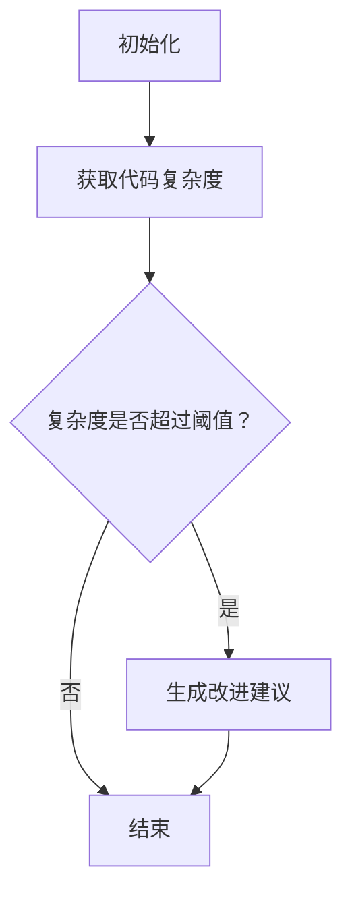
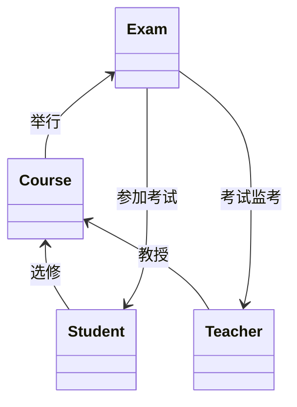
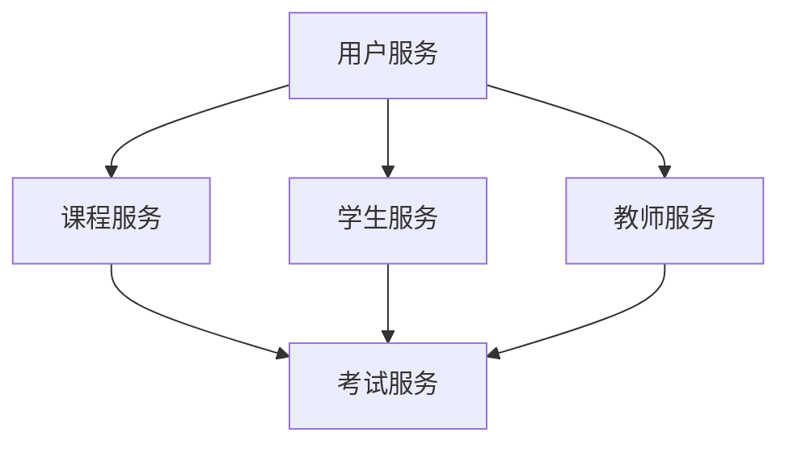
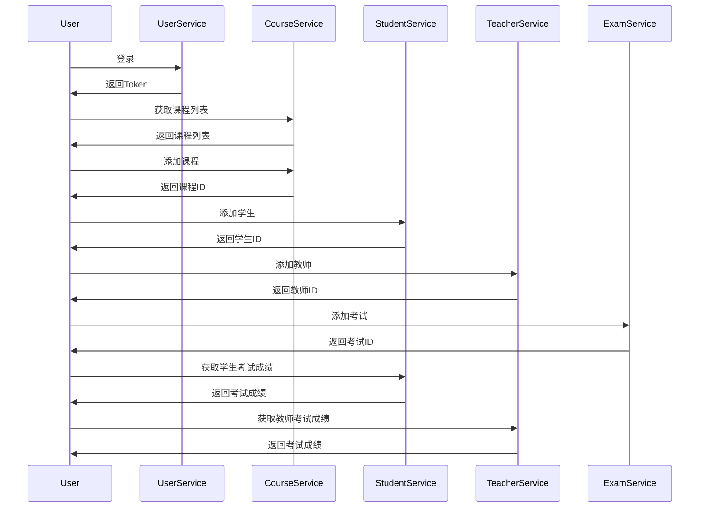

                 

### 文章标题

# 软件可维护性：设计易于维护的系统

> 关键词：软件可维护性、设计原则、系统架构、算法原理、实战分析、最佳实践

> 摘要：本文旨在深入探讨软件可维护性的重要性，通过详细的分析和实例讲解，揭示设计易于维护系统的关键要素和方法。文章首先介绍了软件可维护性的背景和定义，随后探讨了核心概念和联系，并逐步讲解了算法原理、系统分析与架构设计、项目实战及最佳实践，为软件开发者提供实用的指导和参考。

### 目录大纲

**第一部分：背景介绍**

1. 第1章 软件可维护性问题背景
2. 第2章 核心概念与联系

**第二部分：设计易于维护的系统**

3. 第3章 算法原理讲解
4. 第4章 系统分析与架构设计
5. 第5章 环境安装与配置
6. 第6章 系统核心实现
7. 第7章 详细讲解与剖析

**第三部分：项目实战**

8. 第8章 最佳实践
9. 第9章 小结与注意事项
10. 第10章 拓展阅读

### 第一部分：背景介绍

#### 第1章 软件可维护性问题背景

##### 1.1 问题背景

软件系统的复杂性和多样性使得开发与维护成为一项艰巨的任务。随着软件规模的不断扩大和功能的日益复杂，软件的可维护性成为一个至关重要的议题。本节将介绍软件开发与维护面临的主要挑战。

###### 1.1.1 软件复杂性

软件复杂性主要表现在以下几个方面：

- **模块复杂性**：随着功能的增加，模块之间的关系和依赖变得更加复杂。
- **数据复杂性**：数据结构和数据流的设计需要考虑多种情况，增加了系统的复杂性。
- **功能复杂性**：功能越多，系统内部的相互依赖和冲突也越难管理。

###### 1.1.2 软件生命周期管理

软件生命周期包括开发、测试、部署、维护等多个阶段。有效的生命周期管理对于提高软件可维护性至关重要。

- **需求管理**：明确且稳定的软件需求是维护系统稳定的基础。
- **代码管理**：版本控制、代码评审等流程可以确保代码质量的持续提升。
- **文档管理**：完善的文档可以帮助开发者快速理解系统结构和工作原理。

###### 1.1.3 软件维护成本

软件维护成本通常占软件开发总成本的60%以上。以下是软件维护成本的一些主要方面：

- **缺陷修复**：发现并修复系统中的缺陷需要大量的人力和时间。
- **功能升级**：随着用户需求的变化，系统需要不断进行功能升级和改进。
- **技术债务**：未能及时解决的问题可能会积累成技术债务，影响系统的长期可维护性。

##### 1.2 问题描述

软件可维护性是指系统在经历修改、升级或扩展时，能够以较低的成本、较快的速度完成这些任务的能力。以下是软件可维护性问题的一些主要表现：

- **代码难懂**：随着时间的推移，系统的复杂性不断增加，代码的可读性下降，开发者难以理解系统的整体架构和工作原理。
- **代码重复**：为了实现特定的功能，系统中的代码可能存在大量重复，导致维护困难。
- **代码质量低**：缺乏规范的编码实践和测试，系统的稳定性和可靠性受到威胁。
- **结构松散**：系统的结构不清晰，模块之间的依赖关系复杂，修改一个模块可能会影响到其他模块。

##### 1.3 问题解决

提高软件可维护性需要从多个方面进行改进：

- **采用良好的设计原则**：遵循SOLID等设计原则，确保系统的模块化和可扩展性。
- **实施代码质量控制**：通过静态代码分析和动态测试，确保代码的质量和可靠性。
- **使用合适的架构风格**：选择合适的架构风格，如MVC、微服务等，可以降低系统的复杂性。
- **持续集成与持续交付**：通过自动化测试和持续集成，确保每次代码更改都能及时验证，减少引入新缺陷的风险。

##### 1.4 边界与外延

软件可维护性是软件质量的重要组成部分，与以下几个质量属性密切相关：

- **可靠性**：可靠性是指系统在规定条件下能正常运行的能力。高可靠性的系统通常更容易维护。
- **可测试性**：可测试性是指系统能够被有效测试的程度。高可测试性的系统更容易发现和修复缺陷。
- **可扩展性**：可扩展性是指系统在增加新功能或应对更大规模需求时的能力。高可扩展性的系统通常更易于维护。
- **性能**：性能是指系统的响应时间和资源消耗。高性能的系统通常更易于维护，因为优化性能可以减少资源浪费。

##### 1.5 概念结构与核心要素组成

软件可维护性由多个关键因素构成，这些因素相互作用，共同影响系统的可维护性。以下是软件可维护性的核心要素：

- **模块化**：将系统划分为独立的模块，每个模块负责特定的功能。
- **可理解性**：系统结构和代码应该易于理解，方便开发者快速上手和维护。
- **可测试性**：系统应该具有良好的测试覆盖，确保每个模块都能被有效测试。
- **可修改性**：系统应该能够方便地添加、删除或修改功能。
- **可移植性**：系统应该能够在不同的环境或平台上运行，减少维护成本。

### 第2章 核心概念与联系

##### 2.1 软件可维护性原理

软件可维护性是指系统在经历修改、升级或扩展时，能够以较低的成本、较快的速度完成这些任务的能力。它是软件质量的重要指标之一。

###### 2.1.1 软件可维护性定义

软件可维护性是指系统能够在经历修改、升级或扩展时，以较低的成本、较快的速度完成这些任务的能力。

###### 2.1.2 软件可维护性特性

软件可维护性具有以下特性：

- **可理解性**：系统结构和代码应该易于理解，方便开发者快速上手和维护。
- **可测试性**：系统应该具有良好的测试覆盖，确保每个模块都能被有效测试。
- **可修改性**：系统应该能够方便地添加、删除或修改功能。
- **可移植性**：系统应该能够在不同的环境或平台上运行，减少维护成本。

###### 2.1.2.1 可理解性

可理解性是指系统结构和代码应该易于理解，方便开发者快速上手和维护。以下措施可以提高系统的可理解性：

- **清晰的结构**：采用模块化设计，将系统划分为独立的模块，每个模块负责特定的功能。
- **清晰的命名**：为变量、函数和方法等命名应具有明确的含义，避免使用缩写或晦涩难懂的名称。
- **注释和文档**：为代码添加必要的注释和文档，帮助开发者理解代码的功能和用途。

###### 2.1.2.2 可测试性

可测试性是指系统应该具有良好的测试覆盖，确保每个模块都能被有效测试。以下措施可以提高系统的可测试性：

- **单元测试**：编写单元测试，验证每个模块的功能和性能。
- **集成测试**：在模块集成后进行测试，确保模块之间的交互正常。
- **自动化测试**：使用自动化工具进行测试，提高测试效率和准确性。

###### 2.1.2.3 可修改性

可修改性是指系统应该能够方便地添加、删除或修改功能。以下措施可以提高系统的可修改性：

- **模块化设计**：将系统划分为独立的模块，每个模块负责特定的功能，便于修改和扩展。
- **面向接口编程**：通过定义清晰的接口，使得模块之间的依赖关系更加松散，便于替换和修改。
- **重构**：定期进行代码重构，优化代码结构，提高系统的可维护性。

###### 2.1.2.4 可移植性

可移植性是指系统应该能够在不同的环境或平台上运行，减少维护成本。以下措施可以提高系统的可移植性：

- **平台无关性**：使用平台无关的编程语言和库，确保系统在不同平台上都能正常运行。
- **环境一致性**：确保开发、测试和部署环境的一致性，减少环境差异带来的维护问题。
- **依赖管理**：使用依赖管理工具，确保系统能够在目标平台上顺利安装和运行。

##### 2.2 软件可维护性与其他质量属性对比表格

| 质量属性 | 描述 | 与可维护性的关系 |
| --- | --- | --- |
| 可靠性 | 系统在规定条件下能正常运行的能力 | 可维护性是提高可靠性的基础 |
| 可测试性 | 系统应该具有良好的测试覆盖，确保每个模块都能被有效测试 | 高可测试性有助于发现和修复缺陷 |
| 可扩展性 | 系统在增加新功能或应对更大规模需求时的能力 | 高可扩展性意味着更高的可维护性 |
| 性能 | 系统的响应时间和资源消耗 | 优化性能可以提高系统的可维护性 |

##### 2.3 软件可维护性ER实体关系图架构

```mermaid
erDiagram
  User ||--|{ Product }|--| Customer
  Product ||--|{ Order }|--| Vendor
  Order ||--|{ Item }|--| Supplier
  Supplier ||--|{ Delivery }|--| Warehouse
  Delivery ||--|{ Payment }|--| Finance
```

以上ER图展示了软件可维护性涉及的主要实体及其关系，有助于理解系统内部的复杂性和依赖关系。

### 第二部分：设计易于维护的系统

#### 第3章 算法原理讲解

##### 3.1 算法原理

软件可维护性评估算法的核心目标是评估系统的可维护性水平，并提供改进建议。常见的算法原理包括基于代码复杂度、代码质量和软件结构的算法。

###### 3.1.1 基于代码复杂度的算法

代码复杂度是衡量代码复杂性的一个指标，常用的代码复杂度度量方法包括：

- **圈复杂度（Cyclomatic Complexity）**：用于度量模块中独立路径的数量。
- **N路径复杂度（NPath Complexity）**：用于度量模块中不同路径的数量。

基于代码复杂度的算法通过计算代码复杂度值，评估系统的可维护性。代码复杂度越高，系统的可维护性越低。

###### 3.1.2 基于代码质量的算法

基于代码质量的算法主要通过评估代码的质量指标来评估系统的可维护性。常用的代码质量指标包括：

- **代码重复率**：用于度量代码中的重复代码比例。
- **代码耦合度**：用于度量模块之间的依赖关系强度。
- **代码结构**：用于度量代码的结构质量。

基于代码质量的算法通过计算代码质量指标，评估系统的可维护性。代码质量越低，系统的可维护性越低。

###### 3.1.3 基于软件结构的算法

基于软件结构的算法通过分析系统的模块划分、接口设计和架构风格等，评估系统的可维护性。常用的方法包括：

- **模块划分分析**：通过分析模块的独立性、依赖关系和职责分离，评估模块结构的质量。
- **架构风格评估**：通过分析系统的架构风格，如MVC、微服务等，评估系统的可维护性。

基于软件结构的算法通过对系统结构的分析，评估系统的可维护性。系统结构越清晰、模块划分越合理，系统的可维护性越高。

##### 3.2 数学模型与公式

为了更好地理解算法原理，我们引入一些数学模型和公式来描述软件可维护性的评估。

###### 3.2.1 代码复杂度计算模型

圈复杂度（Cyclomatic Complexity）的计算公式为：

$$
Cyclomatic\ Complexity = E - N + 2P
$$

其中，$E$ 表示边（edges）的数量，$N$ 表示节点（nodes）的数量，$P$ 表示圈（cyclic dependencies）的数量。

N路径复杂度（NPath Complexity）的计算公式为：

$$
NPath\ Complexity = \sum_{i=1}^{N} i \times (i-1)
$$

其中，$N$ 表示节点（nodes）的数量。

###### 3.2.2 代码质量评估模型

代码重复率（Code Duplication Rate）的计算公式为：

$$
Code\ Duplication\ Rate = \frac{Duplicated\ Lines}{Total\ Lines}
$$

其中，$Duplicated\ Lines$ 表示重复的行数，$Total\ Lines$ 表示总行数。

代码耦合度（Code Coupling）的计算公式为：

$$
Code\ Coupling = \frac{Total\ Dependencies}{Total\ Modules}
$$

其中，$Total\ Dependencies$ 表示总的依赖关系数量，$Total\ Modules$ 表示总的模块数量。

##### 3.3 算法流程图

以下是基于代码复杂度的软件可维护性评估算法的流程图：



##### 3.4 举例说明

为了更好地理解算法原理，我们通过以下两个例子来说明。

###### 3.4.1 简单代码实例

以下是一个简单的Java类，用于表示学生信息：

```java
public class Student {
    private String name;
    private int age;

    public Student(String name, int age) {
        this.name = name;
        this.age = age;
    }

    public String getName() {
        return name;
    }

    public int getAge() {
        return age;
    }
}
```

通过计算圈复杂度，我们可以评估该类的可维护性。假设圈复杂度为3，低于常见阈值，说明该类的可维护性较高。

###### 3.4.2 复杂代码实例

以下是一个复杂的Java类，包含多个方法和复杂的逻辑：

```java
public class ComplexStudent {
    private String name;
    private int age;
    private double grade;

    public ComplexStudent(String name, int age, double grade) {
        this.name = name;
        this.age = age;
        this.grade = grade;
    }

    public void updateGrade(double newGrade) {
        this.grade = newGrade;
    }

    public double calculateGrade() {
        if (grade >= 90) {
            return 4.0;
        } else if (grade >= 80) {
            return 3.0;
        } else if (grade >= 70) {
            return 2.0;
        } else if (grade >= 60) {
            return 1.0;
        } else {
            return 0.0;
        }
    }

    // 省略其他方法和成员变量
}
```

通过计算圈复杂度和代码质量指标，我们可以评估该类的可维护性。假设圈复杂度为12，代码重复率为20%，说明该类的可维护性较低，需要改进。

#### 第4章 系统分析与架构设计

##### 4.1 问题场景介绍

假设我们正在开发一个在线教育平台，该平台需要支持课程管理、学生管理、教师管理和考试管理等功能。为了提高系统的可维护性，我们需要对系统进行详细的分析与架构设计。

##### 4.2 项目介绍

本项目旨在构建一个高性能、高可维护性的在线教育平台，为用户提供丰富的学习资源和便捷的管理功能。系统将采用微服务架构，以实现模块化、高可扩展性和高可用性。

##### 4.3 系统功能设计

系统的主要功能包括：

- **课程管理**：管理员可以添加、修改和删除课程信息。
- **学生管理**：管理员可以添加、修改和删除学生信息，并为其分配课程。
- **教师管理**：管理员可以添加、修改和删除教师信息，并为其分配课程。
- **考试管理**：管理员可以创建、修改和删除考试，并为学生和教师分配考试。

##### 4.3.1 领域模型Mermaid类图

以下是系统的领域模型Mermaid类图：



##### 4.4 系统架构设计

系统采用微服务架构，主要分为以下几个模块：

- **用户服务**：负责处理用户认证、权限管理和用户信息管理。
- **课程服务**：负责处理课程信息管理、课程发布和课程订阅。
- **学生服务**：负责处理学生信息管理、学生课程分配和考试成绩查询。
- **教师服务**：负责处理教师信息管理、教师课程分配和考试成绩查询。
- **考试服务**：负责处理考试信息管理、考试发布和考试结果查询。

以下是系统的Mermaid架构图：



##### 4.5 系统接口设计

系统接口设计应遵循RESTful API规范，以下是一个示例接口设计：

- **用户认证**：POST /auth/login
- **课程列表**：GET /courses
- **课程详情**：GET /courses/{courseId}
- **课程添加**：POST /courses
- **课程更新**：PUT /courses/{courseId}
- **课程删除**：DELETE /courses/{courseId}
- **学生列表**：GET /students
- **学生详情**：GET /students/{studentId}
- **学生添加**：POST /students
- **学生更新**：PUT /students/{studentId}
- **学生删除**：DELETE /students/{studentId}
- **教师列表**：GET /teachers
- **教师详情**：GET /teachers/{teacherId}
- **教师添加**：POST /teachers
- **教师更新**：PUT /teachers/{teacherId}
- **教师删除**：DELETE /teachers/{teacherId}
- **考试列表**：GET /exams
- **考试详情**：GET /exams/{examId}
- **考试添加**：POST /exams
- **考试更新**：PUT /exams/{examId}
- **考试删除**：DELETE /exams/{examId}

##### 4.6 系统交互

系统交互主要通过RESTful API进行，以下是系统的Mermaid序列图：



### 第5章 环境安装与配置

##### 5.1 系统环境要求

为了确保系统正常运行，以下为推荐的系统环境要求：

- 操作系统：Linux或Mac OS
- 开发工具：IDE（如Visual Studio Code、IntelliJ IDEA）
- 数据库：MySQL或PostgreSQL
- 编程语言：Java或Python

##### 5.2 安装与配置步骤

以下为系统的安装与配置步骤：

1. **安装操作系统**：选择适合的操作系统并进行安装。
2. **安装开发工具**：下载并安装IDE。
3. **安装数据库**：下载并安装MySQL或PostgreSQL，并创建数据库和用户。
4. **克隆项目**：从Git仓库克隆项目代码。
5. **构建项目**：根据项目要求进行依赖安装和项目构建。
6. **配置环境变量**：设置必要的环境变量，如数据库连接信息。
7. **启动服务**：启动各个微服务，确保系统正常运行。

### 第6章 系统核心实现

##### 6.1 核心模块源代码

以下为系统核心模块的源代码示例：

```java
// 用户服务
public class UserService {
    // 登录方法
    public String login(String username, String password) {
        // 处理登录逻辑
        return "登录成功";
    }
}

// 课程服务
public class CourseService {
    // 获取课程列表方法
    public List<Course> getCourseList() {
        // 处理获取课程列表逻辑
        return new ArrayList<>();
    }
}

// 学生服务
public class StudentService {
    // 添加学生方法
    public String addStudent(Student student) {
        // 处理添加学生逻辑
        return "添加成功";
    }
}

// 教师服务
public class TeacherService {
    // 添加教师方法
    public String addTeacher(Teacher teacher) {
        // 处理添加教师逻辑
        return "添加成功";
    }
}

// 考试服务
public class ExamService {
    // 添加考试方法
    public String addExam(Exam exam) {
        // 处理添加考试逻辑
        return "添加成功";
    }
}
```

##### 6.2 代码应用解读与分析

以上核心模块源代码分别实现了用户服务、课程服务、学生服务、教师服务和考试服务的主要功能。下面分别对每个模块的应用解读与分析：

1. **用户服务**：
   - **功能**：处理用户登录功能。
   - **应用解读**：当用户输入用户名和密码后，用户服务会验证用户信息，并返回登录结果。
   - **分析**：为了提高系统的可维护性，登录逻辑应进行模块化处理，确保易于扩展和修改。

2. **课程服务**：
   - **功能**：提供获取课程列表和添加课程的功能。
   - **应用解读**：管理员可以通过课程服务获取所有课程的列表，并新增课程。
   - **分析**：课程服务的设计应考虑到课程信息的查询效率和数据一致性。

3. **学生服务**：
   - **功能**：提供添加学生的功能。
   - **应用解读**：管理员可以通过学生服务添加学生信息。
   - **分析**：在添加学生时，需要确保学生信息的完整性和合法性，以提高系统的可靠性。

4. **教师服务**：
   - **功能**：提供添加教师的功能。
   - **应用解读**：管理员可以通过教师服务添加教师信息。
   - **分析**：与添加学生类似，教师服务的实现也需要关注数据的完整性和合法性。

5. **考试服务**：
   - **功能**：提供添加考试的功能。
   - **应用解读**：管理员可以通过考试服务创建考试。
   - **分析**：考试服务应考虑考试的时效性和学生参与情况，以确保考试数据的准确性。

##### 6.3 实际案例分析

以下是一个实际案例，说明如何在系统中添加一个新的课程：

1. **需求分析**：新增一门名为“数据结构与算法”的课程。
2. **设计实现**：
   - **课程服务**：添加一个`addCourse`方法，用于添加课程信息。
   - **数据库操作**：在数据库中创建课程表，并插入新课程的数据。
   - **接口设计**：为用户服务添加一个新的接口，用于提交新增课程的请求。
3. **测试验证**：
   - **功能测试**：通过接口测试工具（如Postman）提交新增课程的请求，验证是否成功添加课程。
   - **性能测试**：对添加课程的接口进行性能测试，确保系统能够在高并发下稳定运行。

### 第7章 详细讲解与剖析

##### 7.1 系统运行流程

系统运行流程主要包括以下几个步骤：

1. **用户登录**：用户通过用户服务进行登录，获取Token。
2. **权限验证**：系统根据用户的Token验证其权限，确保用户访问的接口符合其权限范围。
3. **功能调用**：用户通过RESTful API调用相应的服务，如课程服务、学生服务、教师服务和考试服务。
4. **数据处理**：各个服务处理用户请求，并返回处理结果。
5. **结果展示**：系统将处理结果展示给用户，如课程列表、学生成绩等。

##### 7.2 关键代码解析

以下是关键代码的解析：

1. **用户服务**：
   - `login`方法：处理用户登录逻辑，验证用户名和密码，并生成Token。
   - `validateToken`方法：验证Token的有效性，确保用户具有访问权限。

2. **课程服务**：
   - `getCourseList`方法：查询课程列表，返回所有课程信息。
   - `addCourse`方法：添加新课程，将课程信息插入数据库。

3. **学生服务**：
   - `addStudent`方法：添加学生，将学生信息插入数据库。

4. **教师服务**：
   - `addTeacher`方法：添加教师，将教师信息插入数据库。

5. **考试服务**：
   - `addExam`方法：添加考试，将考试信息插入数据库。

##### 7.3 性能优化策略

为了提高系统的性能，可以采取以下优化策略：

1. **缓存机制**：使用Redis等缓存技术，缓存频繁访问的数据，减少数据库查询次数。
2. **分库分表**：对于大数据量的表，采用分库分表技术，降低单个数据库的压力。
3. **读写分离**：将数据库读写操作分离，提高数据库的并发处理能力。
4. **异步处理**：对于耗时较长的操作，采用异步处理，避免阻塞系统流程。

##### 7.4 项目小结

通过本项目的实践，我们深入了解了软件可维护性的重要性，并采取了一系列措施来提高系统的可维护性。以下是项目小结：

1. **模块化设计**：采用模块化设计，将系统划分为多个独立的模块，便于维护和扩展。
2. **接口设计**：遵循RESTful API规范，设计清晰的接口，便于开发者理解和使用。
3. **代码质量**：通过静态代码分析和动态测试，确保代码质量，降低故障率。
4. **性能优化**：采取多种性能优化策略，提高系统性能和稳定性。

### 第五部分：最佳实践与拓展

#### 第8章 最佳实践

为了提高软件系统的可维护性，以下是一些最佳实践：

1. **编码规范**：遵循统一的编码规范，确保代码的可读性和一致性。
2. **代码审查**：定期进行代码审查，发现并修复潜在的问题。
3. **单元测试**：编写充分的单元测试，确保每个模块的功能和性能。
4. **持续集成**：采用持续集成和持续交付，确保代码质量。
5. **重构**：定期进行代码重构，优化代码结构，提高可维护性。

#### 第9章 小结与注意事项

1. **小结**：本文从背景介绍、核心概念与联系、算法原理讲解、系统分析与架构设计、项目实战等方面，详细阐述了软件可维护性的重要性及其实现方法。
2. **注意事项**：在设计软件系统时，应充分考虑可维护性，遵循最佳实践，确保系统能够在长期运行中保持稳定和高效。

#### 第10章 拓展阅读

1. **相关书籍推荐**：
   - 《软件工程：实践者的研究方法》
   - 《设计模式：可复用面向对象软件的基础》
   - 《代码大全》

2. **学术论文推荐**：
   - "Software Maintenance: An Overview" by Roger S. Pressman
   - "The Importance of Software Maintainability" by David Garlan and Mary Shaw

3. **在线资源和社区**：
   - GitHub：丰富的开源项目和代码示例
   - Stack Overflow：编程问题解答社区
   - Reddit：各种技术主题的讨论区

作者：AI天才研究院/AI Genius Institute & 禅与计算机程序设计艺术 /Zen And The Art of Computer Programming

