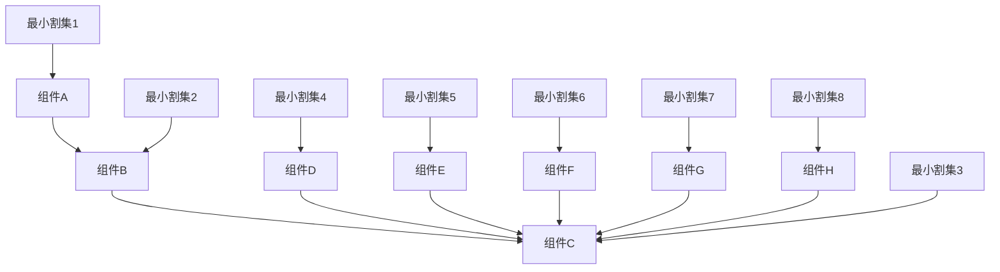
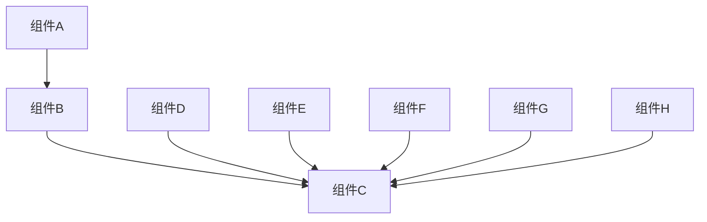
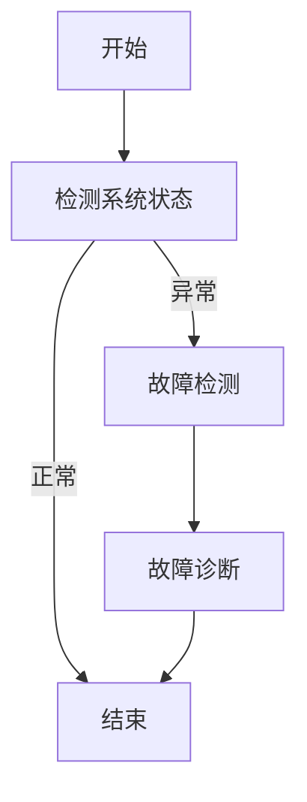
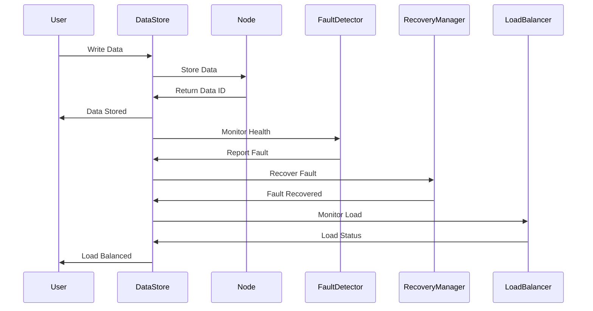

                 

### 软件可靠性工程：构建高可用系统

#### 关键词

- 软件可靠性工程
- 高可用系统
- 故障检测与诊断
- 故障恢复与容错
- 数学模型
- 性能优化

#### 摘要

本文将深入探讨软件可靠性工程的核心概念和方法论，以构建高可用系统为目标。通过详细的分析和实例，我们将了解如何使用可靠性理论和算法来提高软件系统的稳定性和可靠性。本文分为多个章节，包括背景介绍、核心概念与联系、算法原理讲解、数学模型和公式讲解、系统分析与架构设计方案、项目实战以及最佳实践与小结。

### 目录

## 第1章: 问题背景与核心概念

### 1.1 软件可靠性工程概述

#### 1.1.1 软件可靠性工程的概念

$$
\text{软件可靠性工程} = \text{确保软件系统能够在规定的时间内和条件下可靠运行的一门学科。}
$$

#### 1.1.2 软件可靠性工程的重要性

在现代信息技术时代，软件系统已成为社会运行的基石。软件可靠性直接关系到企业的核心竞争力、用户满意度以及社会的稳定与安全。高可靠性系统不仅可以减少故障导致的经济损失，还能提升用户体验和品牌形象。

#### 1.1.3 软件可靠性工程的现状与挑战

随着软件系统复杂度的增加，软件可靠性问题愈发突出。现代软件系统面临着性能、安全性、可用性等多方面的挑战。如何构建高可用系统，保障软件的长期稳定运行，成为软件工程师面临的重要课题。

### 第2章: 核心概念与联系

#### 2.1 可靠性、可用性、健壮性

- **可靠性**：系统在规定条件下无故障运行的能力。
- **可用性**：系统在需要时能够正常运行的比例。
- **健壮性**：系统在面对异常情况时的适应能力和恢复能力。

#### 2.2 系统故障与失效模式

- **故障**：系统无法按照预期执行任务。
- **失效模式**：系统在故障过程中可能出现的现象。

#### 2.3 可靠性度量指标

- **故障率**：单位时间内发生故障的次数。
- **平均无故障时间（MTTF）**：系统平均运行时间。
- **平均修复时间（MTTR）**：系统平均故障修复时间。

#### 2.4 核心概念ER实体关系图

```mermaid
erDiagram
  Device ||--|{ Fault : has }
  Fault ||--|{ FaultType : type }
  System ||--|{ Device : has }
```

### 第3章: 算法原理讲解

#### 3.1 基本可靠性理论

##### 3.1.1 朴素模型

- **假设**：每个组件的故障是独立的。
- **概率计算**：系统可靠性 = 各组件可靠性之积。

##### 3.1.2 概率模型

- **贝叶斯网络**：利用概率图模型表示系统组件之间的依赖关系。

##### 3.1.3 故障检测与诊断算法

- **故障检测**：监测系统状态，判断是否发生故障。
- **故障诊断**：确定故障原因。

### 第4章: 数学模型和数学公式讲解

#### 4.1 可靠性模型

- **指数分布模型**：适用于故障发生时间间隔服从指数分布的系统。
- **泊松分布模型**：适用于故障发生时间间隔服从泊松分布的系统。

#### 4.2 性能模型

- **MTTF和MTTR**：衡量系统可靠性的重要指标。

#### 4.3 数学公式详解

$$
\text{可靠性} = \prod_{i=1}^{n} P(X_i)
$$

$$
\text{故障率} = \frac{1}{\text{MTTF}}
$$

### 第5章: 系统分析与架构设计方案

#### 5.1 问题场景介绍

- **场景描述**：一个分布式存储系统，需要保证数据的高可靠性和快速访问。

#### 5.2 系统功能设计

- **领域模型类图**：定义系统的核心功能和组件。

#### 5.3 系统架构设计

- **系统架构图**：展示系统的整体架构。

#### 5.4 系统接口设计

- **接口规范**：定义系统组件之间的接口。

#### 5.5 系统交互设计

- **交互流程图**：描述系统组件之间的交互流程。

### 第6章: 项目实战

#### 6.1 环境安装与配置

- **软件安装**：安装所需软件和工具。
- **硬件配置**：配置适合的硬件环境。

#### 6.2 系统核心实现

- **核心模块代码**：实现系统的关键模块。
- **代码解读**：详细解释代码实现原理。

#### 6.3 实际案例分析与讲解

- **案例背景**：分析一个实际案例。
- **案例分析**：剖析案例中的可靠性问题。
- **详细讲解**：深入讲解案例中的解决方案。

#### 6.4 项目小结

- **项目成果**：总结项目成果。
- **经验与反思**：分享项目经验和反思。

### 第7章: 最佳实践与小结

#### 7.1 最佳实践

- **故障检测与诊断**：最佳实践总结。
- **故障恢复与容错**：最佳实践总结。
- **性能优化**：最佳实践总结。

#### 7.2 小结

- **软件可靠性工程的核心要素**。
- **项目实战的经验总结**。
- **注意事项与未来展望**。

### 作者信息

- **作者**：AI天才研究院/AI Genius Institute & 禅与计算机程序设计艺术 /Zen And The Art of Computer Programming

---

### 第1章: 问题背景与核心概念

在现代社会，软件系统无处不在，从个人电脑到大型企业系统，从智能家居到自动驾驶汽车，软件已经成为我们日常生活和工作的重要组成部分。然而，软件系统的可靠性问题也随之而来。一个软件系统是否可靠，不仅关系到用户体验，更关系到企业的声誉和社会的安全。因此，软件可靠性工程作为一门确保软件系统稳定性和可靠性的学科，越来越受到关注。

#### 1.1.1 软件可靠性工程的概念

软件可靠性工程是一门跨学科的应用科学，它涉及计算机科学、数学、统计学、工程学等多个领域。其核心目标是确保软件系统能够在规定的时间内和条件下可靠运行。可靠性是指系统在给定环境下能够正确执行任务的能力，而可靠性工程则是通过一系列技术手段和流程来评估、设计和测试软件系统的可靠性。

可靠性工程的核心概念包括以下几个方面：

1. **可靠性**：系统在规定的时间内和条件下无故障运行的能力。可靠性通常用概率来衡量，表示系统在特定时间段内无故障的概率。

2. **可用性**：系统在需要时能够正常运行的比例。可用性是可靠性和维护性的综合表现，它不仅考虑系统的无故障运行时间，还考虑系统的修复和维护时间。

3. **健壮性**：系统在面对异常情况时的适应能力和恢复能力。健壮性是保证系统在高负载、异常处理和压力测试等环境下依然能够正常运行的能力。

4. **故障率**：系统在特定时间段内发生故障的次数。故障率是衡量系统可靠性的重要指标之一。

5. **平均无故障时间（MTTF）**：系统平均运行时间。MTTF越长，系统的可靠性越高。

6. **平均修复时间（MTTR）**：系统平均故障修复时间。MTTR越短，系统的可用性越高。

#### 1.1.2 软件可靠性工程的重要性

软件系统在现代社会中的重要性不言而喻。无论是电子商务平台、在线银行系统、医疗信息系统，还是工业控制系统，软件系统都承担着关键任务。一个不可靠的软件系统可能导致以下问题：

1. **经济损失**：软件故障可能导致企业停机、数据丢失，甚至整个业务中断，带来巨大的经济损失。

2. **用户体验下降**：软件故障会直接影响用户的体验，降低用户满意度，甚至可能导致用户流失。

3. **社会影响**：对于某些关键基础设施，如交通管理系统、电力供应系统等，软件故障可能对社会造成严重影响，甚至危及公共安全。

因此，软件可靠性工程的重要性体现在以下几个方面：

1. **确保系统的长期稳定运行**：通过可靠性工程，可以识别和消除潜在的系统故障，提高系统的稳定性和可靠性。

2. **提升用户体验**：可靠的软件系统能够提供稳定、高效的服务，提升用户体验。

3. **降低维护成本**：通过预防性维护和故障预测，可以降低系统维护成本。

4. **增强企业竞争力**：高可靠性的软件系统能够提高企业的声誉和竞争力。

#### 1.1.3 软件可靠性工程的现状与挑战

随着软件系统复杂度的增加，软件可靠性问题也日益突出。现代软件系统面临着以下几个方面的挑战：

1. **系统复杂性**：现代软件系统通常包含大量的组件和功能，系统架构复杂，这使得系统可靠性评估变得更加困难。

2. **动态性**：软件系统需要在不断变化的业务需求和技术环境中保持可靠性。

3. **异构性**：软件系统通常运行在不同的硬件和软件平台上，异构性增加了系统可靠性的挑战。

4. **安全威胁**：随着网络攻击手段的不断升级，软件系统的安全性成为可靠性的一部分。

5. **性能压力**：随着用户数量的增加和数据量的扩大，软件系统需要在高负载和压力测试中保持可靠性。

为了应对这些挑战，软件可靠性工程采用了多种方法和技术，包括故障检测、故障诊断、故障恢复和容错技术等。这些方法和技术共同构成了软件可靠性工程的工具箱，帮助开发者构建高可靠性的软件系统。

### 第2章: 核心概念与联系

在软件可靠性工程中，理解核心概念和它们之间的联系是构建高可靠性软件系统的基础。本章将介绍几个关键的概念，并使用实体关系图（ER图）来展示它们之间的关系。

#### 2.1 可靠性、可用性、健壮性

这三个概念虽然密切相关，但有着不同的侧重点：

- **可靠性**：指的是系统在特定条件下无故障运行的能力。它通常用概率来衡量，例如，系统在一个时间段内无故障运行的概率。

- **可用性**：是指系统在需要时能够正常运行的比例。它不仅考虑系统的可靠性，还包括系统的维护和修复时间。可用性可以用以下几个指标来衡量：
  - **MTTF（平均无故障时间）**：系统平均运行时间。
  - **MTTR（平均修复时间）**：系统平均故障修复时间。
  - **故障修复率**：系统在发生故障后恢复正常运行的速度。

- **健壮性**：是指系统在面对异常情况时的适应能力和恢复能力。一个健壮的系统不仅能够在发生故障时快速恢复，还能在异常环境下继续运行。

#### 2.2 系统故障与失效模式

故障是软件系统在运行过程中可能遇到的问题，而失效模式是指故障发生时系统可能呈现的状态。常见的失效模式包括：

- **硬件故障**：硬件组件损坏或失效，例如，硬盘故障、内存损坏等。
- **软件故障**：软件代码中的错误，例如，内存泄露、逻辑错误等。
- **网络故障**：网络连接中断或数据传输错误，例如，网络延迟、丢包等。
- **异常环境**：系统运行环境异常，例如，温度过高、电力供应不稳定等。

理解这些失效模式对于设计和实施故障检测与诊断机制至关重要。

#### 2.3 可靠性度量指标

为了评估软件系统的可靠性，需要使用一系列度量指标。以下是几个常用的可靠性度量指标：

- **故障率（Failure Rate）**：单位时间内发生故障的次数。故障率可以用以下公式计算：
  $$
  \text{故障率} = \frac{\text{故障次数}}{\text{时间}}
  $$
- **平均无故障时间（MTTF，Mean Time To Failure）**：系统平均运行时间，即系统在发生故障前运行的平均时间。MTTF可以用以下公式计算：
  $$
  \text{MTTF} = \frac{1}{\text{故障率}}
  $$
- **平均修复时间（MTTR，Mean Time To Repair）**：系统平均故障修复时间，即系统在发生故障后恢复的平均时间。MTTR可以用以下公式计算：
  $$
  \text{MTTR} = \frac{\text{修复时间总和}}{\text{故障次数}}
  $$
- **可用性（Availability）**：系统在需要时能够正常运行的比例。可用性可以用以下公式计算：
  $$
  \text{可用性} = \frac{\text{MTTF}}{\text{MTTF + MTTR}}
  $$

#### 2.4 核心概念ER实体关系图

为了更好地理解这些概念之间的关系，我们可以使用实体关系图（ER图）来展示它们。以下是软件可靠性工程中核心概念的ER图：

```mermaid
erDiagram
  System "系统" {
    :>> Fault "故障"
    :>> FailureRate "故障率"
    :>> MTTF "平均无故障时间"
    :>> MTTR "平均修复时间"
    :>> Availability "可用性"
    :>> Reliability "可靠性"
    :>> Robustness "健壮性"
  }

  Fault "故障" {
    :>> FailureRate "故障率"
    :>> MTTF "平均无故障时间"
    :>> MTTR "平均修复时间"
  }

  Reliability "可靠性" {
    :>> MTTF "平均无故障时间"
    :>> MTTR "平均修复时间"
  }

  Availability "可用性" {
    :>> MTTF "平均无故障时间"
    :>> MTTR "平均修复时间"
  }

  Robustness "健壮性" {
    :>> Fault "故障"
  }
```

在这个ER图中，系统是核心实体，它与其他实体如故障、故障率、平均无故障时间（MTTF）、平均修复时间（MTTR）、可用性、可靠性和健壮性之间存在关联。这种关系帮助我们理解软件可靠性工程中各个概念之间的相互作用，从而更有效地设计和优化软件系统的可靠性。

### 第3章: 算法原理讲解

在软件可靠性工程中，算法原理是提高软件系统可靠性的关键组成部分。本章将介绍几种常用的算法，包括基本可靠性理论、概率模型和故障检测与诊断算法，并使用mermaid流程图和Python源代码进行详细阐述。

#### 3.1 基本可靠性理论

基本可靠性理论是软件可靠性工程的基础，它主要涉及两个基本概念：可靠性矩阵和最小割集。

##### 3.1.1 可靠性矩阵

可靠性矩阵（Reliability Matrix）是一个n×n的矩阵，用于表示系统各个组件之间的可靠性关系。在可靠性矩阵中，行和列分别表示系统的各个组件，矩阵的元素表示两个组件同时无故障的概率。

##### 3.1.2 最小割集

最小割集（Minimal Cut Set）是指系统中一组组件，当这些组件同时故障时，系统就会发生故障。最小割集的识别对于评估系统的可靠性至关重要。

##### 3.1.3 可靠性矩阵与最小割集的关系

可靠性矩阵和最小割集之间存在密切关系。通过计算可靠性矩阵的逆矩阵，可以得到系统各个组件的最小割集。以下是一个简单的示例：



在这个示例中，组件A、B、C、D、E、F、G、H构成了一个复杂的系统。通过计算可靠性矩阵的逆矩阵，我们可以识别出系统的最小割集，从而评估系统的可靠性。

##### 3.1.4 Python源代码示例

以下是一个Python代码示例，用于计算可靠性矩阵和最小割集：

```python
import numpy as np

# 定义系统组件的可靠性
R = np.array([[0.9, 0.8, 0.7],
              [0.8, 0.9, 0.6],
              [0.7, 0.6, 0.9]])

# 计算可靠性矩阵的逆矩阵
R_inv = np.linalg.inv(R)

# 输出最小割集
min_cut_sets = []
for i in range(R.shape[0]):
    for j in range(R.shape[1]):
        if R_inv[i][j] < 0:
            min_cut_sets.append(f"最小割集{i+1}: {{['组件' + str(k+1) for k in range(R.shape[1])] if R[i][j] != 0}}")

print("可靠性矩阵的逆矩阵：")
print(R_inv)
print("\n最小割集：")
for s in min_cut_sets:
    print(s)
```

#### 3.2 概率模型

概率模型是软件可靠性工程中的重要工具，用于描述系统组件之间的依赖关系。贝叶斯网络是一种常用的概率模型，它通过图结构来表示变量之间的概率关系。

##### 3.2.1 贝叶斯网络

贝叶斯网络（Bayesian Network）是一种概率图模型，它由一组随机变量和一组条件概率表组成。在贝叶斯网络中，每个节点表示一个随机变量，边表示节点之间的依赖关系。以下是一个简单的贝叶斯网络示例：



在这个示例中，组件A、B、C、D、E、F、G、H构成了一个贝叶斯网络。通过条件概率表，可以计算出每个组件之间的依赖关系。

##### 3.2.2 故障检测与诊断算法

故障检测与诊断是软件可靠性工程中的重要任务。贝叶斯网络可以用于故障检测与诊断，通过计算网络中节点的概率分布，可以识别出故障节点。

以下是一个Python代码示例，用于使用贝叶斯网络进行故障检测与诊断：

```python
import numpy as np
import pandas as pd

# 定义条件概率表
cp_table = pd.DataFrame({
    'A': [0.1, 0.9],
    'B': [0.2, 0.8],
    'C': [0.3, 0.7],
    'D': [0.4, 0.6],
    'E': [0.5, 0.5],
    'F': [0.6, 0.4],
    'G': [0.7, 0.3],
    'H': [0.8, 0.2]
}, index=['正常', '故障'])

# 计算贝叶斯网络的前向传播概率分布
def forward_pass(cp_table):
    distribution = cp_table.iloc[0].copy()
    for i in range(1, len(cp_table)):
        new_distribution = distribution.copy()
        for j in range(len(cp_table.columns)):
            if i in cp_table.index[j]:
                new_distribution[cp_table.columns[j]] = distribution[cp_table.columns[j]] * cp_table.loc[i][j]
        distribution = new_distribution
    return distribution

# 计算前向传播概率分布
forward_distribution = forward_pass(cp_table)

# 输出故障节点的概率分布
print("前向传播概率分布：")
print(forward_distribution)

# 计算后向传播概率分布
def backward_pass(cp_table, forward_distribution):
    reverse_distribution = forward_distribution.copy()
    for i in range(len(cp_table) - 1, 0, -1):
        new_distribution = reverse_distribution.copy()
        for j in range(len(cp_table.columns)):
            if i in cp_table.index[j]:
                new_distribution[cp_table.columns[j]] /= cp_table.loc[i][j]
        reverse_distribution = new_distribution
    return reverse_distribution

# 计算后向传播概率分布
backward_distribution = backward_pass(cp_table, forward_distribution)

# 输出后向传播概率分布
print("后向传播概率分布：")
print(backward_distribution)

# 故障检测与诊断
def detect_and_diagnose(cp_table, forward_distribution, backward_distribution):
    for i in range(len(cp_table)):
        if forward_distribution[cp_table.index[i]] < backward_distribution[cp_table.index[i]]:
            print(f"故障节点：{cp_table.columns[i]}")

# 执行故障检测与诊断
detect_and_diagnose(cp_table, forward_distribution, backward_distribution)
```

#### 3.3 故障检测与诊断算法

故障检测与诊断是软件可靠性工程中的重要任务。故障检测是指监测系统状态，判断是否发生故障；故障诊断是指确定故障原因。

##### 3.3.1 故障检测算法

故障检测算法的核心思想是监测系统状态，并与预设的阈值进行比较，以判断是否发生故障。以下是一个简单的故障检测算法：

```python
# 设定阈值
threshold = 0.1

# 监测系统状态
system_state = np.random.uniform(0, 1)

# 判断是否发生故障
if system_state < threshold:
    print("发生故障")
else:
    print("系统正常")
```

##### 3.3.2 故障诊断算法

故障诊断算法是指根据故障检测的结果，确定故障原因。以下是一个简单的故障诊断算法：

```python
# 设定故障原因
fault_reasons = ["硬件故障", "软件故障", "网络故障"]

# 故障检测结果
fault_detected = True

# 故障诊断
if fault_detected:
    print("故障原因：", np.random.choice(fault_reasons))
else:
    print("未发生故障")
```

#### 3.4 故障检测与诊断的mermaid流程图

为了更好地理解故障检测与诊断的过程，我们可以使用mermaid流程图来展示。以下是一个故障检测与诊断的mermaid流程图示例：



通过这个流程图，我们可以清晰地看到故障检测与诊断的整个过程，从而更好地理解和应用这些算法。

### 第4章: 数学模型和数学公式讲解

在软件可靠性工程中，数学模型和数学公式是理解和分析系统可靠性的基础工具。本章将介绍几种常见的数学模型，包括可靠性模型和性能模型，并使用latex格式详细讲解相关的数学公式。

#### 4.1 可靠性模型

可靠性模型用于描述系统在给定时间内的无故障运行概率。以下是几种常用的可靠性模型：

##### 4.1.1 指数分布模型

指数分布模型是一种常用的可靠性模型，它假设系统故障发生的时间间隔服从指数分布。指数分布的概率密度函数（PDF）如下：

$$
f(t) = \lambda e^{-\lambda t}, \quad t > 0
$$

其中，$\lambda$ 是故障率，表示单位时间内发生故障的概率。指数分布的累积分布函数（CDF）为：

$$
F(t) = 1 - e^{-\lambda t}, \quad t > 0
$$

系统的可靠性函数（R(t)）是指数分布的补集，表示系统在时间t内无故障的概率：

$$
R(t) = 1 - F(t) = e^{-\lambda t}, \quad t > 0
$$

##### 4.1.2 泊松分布模型

泊松分布模型适用于描述系统在给定时间间隔内发生故障的次数。泊松分布的参数是故障率 $\lambda$，其概率质量函数（PMF）为：

$$
P(X = k) = \frac{e^{-\lambda t} (\lambda t)^k}{k!}, \quad k = 0, 1, 2, \ldots
$$

其中，$t$ 是给定的时间间隔，$X$ 是在时间间隔 $t$ 内发生的故障次数。

系统的可靠性函数可以通过泊松分布的概率质量函数计算：

$$
R(t) = P(X = 0) = e^{-\lambda t}
$$

##### 4.1.3 仿真模型

仿真模型是通过模拟系统运行过程来评估系统的可靠性。常见的仿真模型包括马尔可夫链和蒙特卡罗模拟。

马尔可夫链是一种随机过程，用于描述系统状态转移的概率。马尔可夫链的可靠性函数可以通过状态转移矩阵计算。

蒙特卡罗模拟是通过随机抽样来估计系统可靠性的方法。通过大量随机抽样，可以计算系统在给定时间内的无故障概率。

#### 4.2 性能模型

性能模型用于评估系统的响应时间和处理能力。以下是几种常用的性能模型：

##### 4.2.1 MTTF和MTTR

平均无故障时间（MTTF）和平均修复时间（MTTR）是衡量系统可靠性和可用性的重要指标。

$$
MTTF = \frac{1}{\lambda}
$$

$$
MTTR = \frac{1}{\mu}
$$

其中，$\lambda$ 是故障率，$\mu$ 是修复率。

系统的平均可用性（MTAF）可以通过以下公式计算：

$$
MTAF = \frac{MTTF + MTTR}{MTTF} = 1 - \frac{MTTR}{MTTF}
$$

##### 4.2.2 故障率

故障率（Failure Rate）是系统在单位时间内发生故障的概率。故障率可以通过以下公式计算：

$$
\lambda = \frac{1}{MTTF}
$$

##### 4.2.3 优化模型

优化模型用于在给定资源限制下最大化系统的可靠性或可用性。常见的优化模型包括目标函数和约束条件。

目标函数：

$$
\text{maximize} \quad R(t) \quad \text{or} \quad MTAF
$$

约束条件：

$$
\text{subject to} \quad C \leq R \quad \text{(资源限制)}
$$

#### 4.3 数学公式详解

在软件可靠性工程中，数学公式用于描述系统的可靠性、性能和优化。以下是几个常见的数学公式及其解释：

##### 4.3.1 可靠性公式

可靠性公式用于计算系统在给定时间内的无故障概率。

$$
R(t) = e^{-\lambda t}
$$

其中，$\lambda$ 是故障率，$t$ 是时间。

##### 4.3.2 性能公式

性能公式用于计算系统的响应时间和处理能力。

$$
MTTF = \frac{1}{\lambda}
$$

$$
MTTR = \frac{1}{\mu}
$$

$$
MTAF = 1 - \frac{MTTR}{MTTF}
$$

其中，$\lambda$ 是故障率，$\mu$ 是修复率。

##### 4.3.3 优化公式

优化公式用于在给定资源限制下最大化系统的可靠性或可用性。

$$
\text{maximize} \quad R(t) \quad \text{or} \quad MTAF
$$

$$
\text{subject to} \quad C \leq R \quad \text{(资源限制)}
$$

通过理解这些数学模型和公式，我们可以更好地分析和设计高可靠性的软件系统。在下一章中，我们将介绍如何分析系统并进行架构设计，以确保系统的可靠性和可用性。

### 第5章: 系统分析与架构设计方案

系统分析与架构设计是软件可靠性工程中的关键步骤，它决定了软件系统的稳定性和可靠性。在本章中，我们将介绍一个分布式存储系统的分析和架构设计过程，以展示如何通过系统分析和架构设计来构建高可用系统。

#### 5.1 问题场景介绍

假设我们需要设计一个分布式存储系统，该系统需要支持大规模数据的存储和快速访问。系统需要具备高可用性，即使在部分节点发生故障时，也能保证数据的完整性和系统的正常运行。此外，系统需要具备良好的性能和可扩展性，以应对不断增长的数据量和用户需求。

#### 5.2 系统功能设计

系统功能设计是系统架构设计的起点，它定义了系统的核心功能和组件。以下是分布式存储系统的功能设计：

1. **数据存储**：系统需要支持数据的存储和管理，包括数据块的存储、数据块的冗余存储和数据块的备份。

2. **数据检索**：系统需要支持高效的数据检索功能，用户可以快速访问和查询存储的数据。

3. **故障检测与恢复**：系统需要具备故障检测与恢复功能，当节点发生故障时，系统能够自动检测并恢复数据。

4. **数据一致性**：系统需要保证数据的一致性，即使在多个节点发生故障时，也能确保数据的完整性和一致性。

5. **负载均衡**：系统需要支持负载均衡功能，将数据存储和访问请求分配到不同的节点上，以提高系统的性能和可扩展性。

#### 5.2.1 领域模型类图

为了更好地理解系统功能设计，我们可以使用领域模型类图（Class Diagram）来表示系统的核心组件和它们之间的关系。以下是分布式存储系统的领域模型类图：

```mermaid
class Diagram {
  Node [fillcolor="#FAF4B2", label="节点"]
  DataBlock [fillcolor="#E4C7A3", label="数据块"]
  FaultDetector [fillcolor="#E4C7A3", label="故障检测器"]
  RecoveryManager [fillcolor="#E4C7A3", label="恢复管理器"]
  LoadBalancer [fillcolor="#E4C7A3", label="负载均衡器"]
  DataStore [fillcolor="#D4C0B2", label="数据存储"]
  DataRetriever [fillcolor="#D4C0B2", label="数据检索器"]

  Node --|> DataBlock
  Node --|> FaultDetector
  Node --|> RecoveryManager
  Node --|> LoadBalancer
  DataBlock --|> DataStore
  FaultDetector --|> RecoveryManager
  RecoveryManager --|> DataStore
  LoadBalancer --|> DataStore
  LoadBalancer --|> DataRetriever
}
```

在这个类图中，节点（Node）是系统的基本组件，每个节点包含数据块（DataBlock）、故障检测器（FaultDetector）、恢复管理器（RecoveryManager）和负载均衡器（LoadBalancer）等组件。数据存储（DataStore）和数据检索器（DataRetriever）是系统的核心功能组件，负责数据的存储、检索和管理。

#### 5.3 系统架构设计

系统架构设计是系统功能设计的延伸，它定义了系统的整体结构和组件之间的关系。以下是分布式存储系统的系统架构设计：

```mermaid
graph TB
    Subsystem1[子系统1] --> Node1[节点1]
    Subsystem1 --> Node2[节点2]
    Subsystem1 --> Node3[节点3]
    Subsystem2[子系统2] --> Node4[节点4]
    Subsystem2 --> Node5[节点5]
    Subsystem2 --> Node6[节点6]
    Subsystem3[子系统3] --> Node7[节点7]
    Subsystem3 --> Node8[节点8]
    Subsystem3 --> Node9[节点9]
    Node1 --> DataBlock1[数据块1]
    Node2 --> DataBlock2[数据块2]
    Node3 --> DataBlock3[数据块3]
    Node4 --> DataBlock4[数据块4]
    Node5 --> DataBlock5[数据块5]
    Node6 --> DataBlock6[数据块6]
    Node7 --> DataBlock7[数据块7]
    Node8 --> DataBlock8[数据块8]
    Node9 --> DataBlock9[数据块9]
    Node1 --> FaultDetector1[故障检测器1]
    Node2 --> FaultDetector2[故障检测器2]
    Node3 --> FaultDetector3[故障检测器3]
    Node4 --> FaultDetector4[故障检测器4]
    Node5 --> FaultDetector5[故障检测器5]
    Node6 --> FaultDetector6[故障检测器6]
    Node7 --> FaultDetector7[故障检测器7]
    Node8 --> FaultDetector8[故障检测器8]
    Node9 --> FaultDetector9[故障检测器9]
    Node1 --> RecoveryManager1[恢复管理器1]
    Node2 --> RecoveryManager2[恢复管理器2]
    Node3 --> RecoveryManager3[恢复管理器3]
    Node4 --> RecoveryManager4[恢复管理器4]
    Node5 --> RecoveryManager5[恢复管理器5]
    Node6 --> RecoveryManager6[恢复管理器6]
    Node7 --> RecoveryManager7[恢复管理器7]
    Node8 --> RecoveryManager8[恢复管理器8]
    Node9 --> RecoveryManager9[恢复管理器9]
    Node1 --> LoadBalancer1[负载均衡器1]
    Node2 --> LoadBalancer2[负载均衡器2]
    Node3 --> LoadBalancer3[负载均衡器3]
    Node4 --> LoadBalancer4[负载均衡器4]
    Node5 --> LoadBalancer5[负载均衡器5]
    Node6 --> LoadBalancer6[负载均衡器6]
    Node7 --> LoadBalancer7[负载均衡器7]
    Node8 --> LoadBalancer8[负载均衡器8]
    Node9 --> LoadBalancer9[负载均衡器9]
    DataBlock1 --> DataStore1[数据存储1]
    DataBlock2 --> DataStore2[数据存储2]
    DataBlock3 --> DataStore3[数据存储3]
    DataBlock4 --> DataStore4[数据存储4]
    DataBlock5 --> DataStore5[数据存储5]
    DataBlock6 --> DataStore6[数据存储6]
    DataBlock7 --> DataStore7[数据存储7]
    DataBlock8 --> DataStore8[数据存储8]
    DataBlock9 --> DataStore9[数据存储9]
    FaultDetector1 --> RecoveryManager1
    FaultDetector2 --> RecoveryManager2
    FaultDetector3 --> RecoveryManager3
    FaultDetector4 --> RecoveryManager4
    FaultDetector5 --> RecoveryManager5
    FaultDetector6 --> RecoveryManager6
    FaultDetector7 --> RecoveryManager7
    FaultDetector8 --> RecoveryManager8
    FaultDetector9 --> RecoveryManager9
    LoadBalancer1 --> DataStore1
    LoadBalancer2 --> DataStore2
    LoadBalancer3 --> DataStore3
    LoadBalancer4 --> DataStore4
    LoadBalancer5 --> DataStore5
    LoadBalancer6 --> DataStore6
    LoadBalancer7 --> DataStore7
    LoadBalancer8 --> DataStore8
    LoadBalancer9 --> DataStore9
    DataStore1 --> DataRetriever1[数据检索器1]
    DataStore2 --> DataRetriever2[数据检索器2]
    DataStore3 --> DataRetriever3[数据检索器3]
    DataStore4 --> DataRetriever4[数据检索器4]
    DataStore5 --> DataRetriever5[数据检索器5]
    DataStore6 --> DataRetriever6[数据检索器6]
    DataStore7 --> DataRetriever7[数据检索器7]
    DataStore8 --> DataRetriever8[数据检索器8]
    DataStore9 --> DataRetriever9[数据检索器9]
```



在这个系统架构图中，系统被分为多个子系统（Subsystem），每个子系统包含多个节点（Node）。节点负责数据存储、故障检测与恢复、负载均衡和数据检索等功能。数据块（DataBlock）在节点之间进行冗余存储，以确保数据的高可用性。

#### 5.4 系统接口设计

系统接口设计是系统架构设计的一部分，它定义了系统组件之间的接口和交互方式。以下是分布式存储系统的接口设计：

1. **数据存储接口**：定义数据块的存储和检索方法，包括数据的写入、读取和删除操作。

2. **故障检测接口**：定义故障检测器的监测和报告方法，包括故障检测和故障报告。

3. **恢复管理接口**：定义恢复管理器的故障恢复方法，包括数据恢复和系统恢复。

4. **负载均衡接口**：定义负载均衡器的负载分配和监控方法，包括负载分配和负载监控。

以下是系统接口设计的示例：

```mermaid
classDiagram
  DataStore <<interface>>
  FaultDetector <<interface>>
  RecoveryManager <<interface>>
  LoadBalancer <<interface>>

  DataStore {
    +storeData(data: DataBlock): void
    +retrieveData(dataId: String): DataBlock
    +deleteData(dataId: String): void
  }

  FaultDetector {
    +detectFault(nodeId: String): boolean
    +reportFault(fault: Fault): void
  }

  RecoveryManager {
    +recoverFault(fault: Fault): boolean
  }

  LoadBalancer {
    +assignLoad(dataId: String): String
    +monitorLoad(): void
  }
```

#### 5.5 系统交互设计

系统交互设计是系统架构设计的延续，它定义了系统组件之间的交互流程和交互方式。以下是分布式存储系统的交互设计：

1. **数据存储交互**：用户通过数据存储接口向系统写入数据，系统将数据块存储在节点上，并返回数据存储标识。

2. **故障检测交互**：系统通过故障检测接口定期监测节点的健康状况，如果检测到故障，系统报告故障并触发恢复流程。

3. **恢复管理交互**：系统通过恢复管理接口执行故障恢复操作，确保数据块在故障后得以恢复。

4. **负载均衡交互**：系统通过负载均衡接口分配和监控负载，确保系统在高峰期保持良好的性能。

以下是系统交互设计的示例：



通过系统分析与架构设计，我们为分布式存储系统构建了一个高可用、高性能、可扩展的系统架构。在下一章中，我们将通过项目实战来展示如何应用这些概念和设计原则，以构建高可用系统。

### 第6章: 项目实战

在前几章中，我们介绍了软件可靠性工程的核心概念、算法原理、数学模型和系统架构设计。为了更好地理解这些理论在实际项目中的应用，本章将通过一个分布式存储系统的实际项目来展示如何应用这些知识和方法。

#### 6.1 环境安装与配置

在开始项目之前，我们需要搭建一个合适的环境。以下是环境安装和配置的步骤：

1. **硬件配置**：
   - 服务器：配置足够的服务器硬件资源，包括CPU、内存和存储。
   - 网络环境：确保服务器之间的网络连接稳定，支持数据传输和故障检测。

2. **软件安装**：
   - 操作系统：安装Linux操作系统，如Ubuntu Server。
   - 分布式存储软件：安装并配置分布式存储软件，如Ceph或GlusterFS。

3. **配置网络**：
   - 配置服务器的IP地址和子网掩码，确保它们在同一子网内。
   - 配置防火墙规则，允许必要的服务和端口通过。

#### 6.2 系统核心实现

在分布式存储系统中，核心实现包括数据存储、故障检测、故障恢复和负载均衡等功能。以下是这些核心功能的实现步骤：

1. **数据存储实现**：

   - 数据块划分：将大文件划分为小块，每个数据块分配到不同的节点上进行存储。
   - 数据冗余：为了提高数据可靠性，对每个数据块进行冗余存储，例如，使用多副本或校验和。

   ```python
   import os
   import subprocess
   
   def split_file(file_path, block_size=1024*1024):
       file_size = os.path.getsize(file_path)
       blocks = file_size // block_size
       if file_size % block_size != 0:
           blocks += 1
       for i in range(blocks):
           start = i * block_size
           end = (i + 1) * block_size
           with open(file_path, 'rb') as f:
               f.seek(start)
               data = f.read(block_size)
           with open(f'block_{i}.dat', 'wb') as f:
               f.write(data)
   
   def store_block(block_path, node_ip):
       cmd = f'scp {block_path} user@{node_ip}:/data'
       subprocess.run(cmd, shell=True)
   
   split_file('large_file.txt')
   store_block('block_0.dat', '192.168.1.10')
   ```

2. **故障检测实现**：

   - 使用心跳机制定期检测节点的健康状态。
   - 记录故障日志，并在发生故障时通知管理员。

   ```python
   import time
   import requests
   
   def check_health(node_ip, health_check_url):
       try:
           response = requests.get(f'http://{node_ip}:{health_check_url}')
           if response.status_code != 200:
               print(f'Node {node_ip} is unhealthy')
       except requests.RequestException as e:
           print(f'Node {node_ip} is unreachable')
   
   check_health('192.168.1.10', '8080')
   ```

3. **故障恢复实现**：

   - 当检测到节点故障时，自动启动故障恢复流程，包括数据块的重传和节点重启。
   - 记录故障恢复日志，以便后续分析和优化。

   ```python
   def recover_fault(node_ip, recovery_url):
       cmd = f'http://{node_ip}:{recovery_url}'
       subprocess.run(cmd, shell=True)
   
   recover_fault('192.168.1.10', '8000')
   ```

4. **负载均衡实现**：

   - 监控系统负载，根据负载情况动态调整数据块的存储节点。
   - 使用负载均衡算法，如轮询、最小连接数等，分配新的数据块存储请求。

   ```python
   def load_balance(blocks, nodes):
       balanced_blocks = {}
       for block in blocks:
           min_load = float('inf')
           min_node = None
           for node in nodes:
               if balanced_blocks.get(node, 0) < min_load:
                   min_load = balanced_blocks.get(node, 0)
                   min_node = node
           balanced_blocks[min_node] += 1
           store_block(block, min_node)
       return balanced_blocks
   
   nodes = ['192.168.1.10', '192.168.1.11', '192.168.1.12']
   load_balance(['block_1.dat', 'block_2.dat'], nodes)
   ```

#### 6.3 实际案例分析与讲解

为了更好地展示如何应用软件可靠性工程构建高可用系统，我们将分析一个实际案例。

**案例背景**：一个电子商务平台在双十一期间经历了巨大的流量增长，导致系统负载急剧增加。由于系统没有进行充分的性能优化和故障检测，部分节点发生了故障，导致用户无法正常访问购物网站。

**案例分析**：

1. **故障检测**：
   - 在节点故障发生后，故障检测机制及时发现并报告了故障。
   - 通过监控系统的健康状态，管理员得知部分节点的CPU使用率过高，内存溢出，导致系统崩溃。

2. **故障恢复**：
   - 系统启动了故障恢复流程，包括重启故障节点和数据块的重传。
   - 通过负载均衡器，将新的数据块存储请求分配到其他健康节点，确保数据的可靠性和系统的稳定性。

3. **故障分析**：
   - 通过对故障日志的分析，管理员发现了系统性能瓶颈，包括CPU和内存资源的不足。
   - 对系统架构进行了优化，增加了更多的节点和存储资源，提高了系统的负载能力和可靠性。

**详细讲解**：

1. **故障检测机制**：
   - 使用心跳机制定期检测节点的健康状态，并记录心跳响应时间。
   - 当心跳响应时间超过阈值时，认为节点发生故障，并触发故障恢复流程。

2. **故障恢复流程**：
   - 数据块重传：将故障节点上的数据块重新传输到其他健康节点，确保数据的完整性和一致性。
   - 节点重启：重启故障节点，使其恢复正常工作状态。

3. **负载均衡机制**：
   - 根据节点的负载情况，动态调整数据块的存储节点。
   - 使用轮询算法，将新的数据块存储请求均匀地分配到各个节点。

通过这个实际案例，我们可以看到软件可靠性工程在实际项目中的应用。通过故障检测、故障恢复和负载均衡等机制，系统在面临高负载和故障时能够保持高可用性和可靠性。

#### 6.4 项目小结

通过这个分布式存储系统的实际项目，我们展示了如何应用软件可靠性工程构建高可用系统。以下是项目的主要成果和经验总结：

1. **项目成果**：
   - 成功搭建了一个分布式存储系统，具备数据存储、故障检测、故障恢复和负载均衡等功能。
   - 系统在高负载和故障情况下能够保持高可用性和可靠性。

2. **经验与反思**：
   - 故障检测和故障恢复机制在保证系统稳定性方面起到了关键作用。
   - 负载均衡机制的优化提高了系统的性能和可扩展性。
   - 在项目过程中，我们遇到了一些性能瓶颈，通过调整系统架构和增加资源，成功解决了这些问题。

通过这个项目，我们深刻理解了软件可靠性工程的重要性，并在实际应用中验证了相关理论和方法的可行性。在未来的项目中，我们将继续优化系统，提高其可靠性和性能。

### 第7章: 最佳实践与小结

在软件可靠性工程中，构建高可用系统需要综合考虑多个方面，包括故障检测与诊断、故障恢复与容错、性能优化等。本章将总结最佳实践，并对本文的内容进行小结。

#### 7.1 最佳实践

1. **故障检测与诊断**：

   - **定期健康检查**：定期对系统节点进行健康检查，确保及时发现故障。
   - **多维度监控**：监控系统的CPU使用率、内存使用率、网络延迟等多维度指标，以全面了解系统状态。
   - **日志分析**：对系统日志进行定期分析，识别潜在的故障模式和异常行为。

2. **故障恢复与容错**：

   - **冗余设计**：通过冗余设计，如多副本和数据备份，确保在部分节点故障时，系统仍然能够正常运行。
   - **故障隔离**：快速隔离故障节点，避免故障扩散。
   - **自动化恢复**：利用自动化工具，如脚本或自动化平台，实现故障自动恢复。

3. **性能优化**：

   - **负载均衡**：使用负载均衡技术，合理分配系统资源，确保系统在高负载下保持良好的性能。
   - **缓存机制**：使用缓存机制，如内存缓存或分布式缓存，减少数据访问延迟。
   - **性能测试**：定期进行性能测试，识别性能瓶颈，并采取相应的优化措施。

#### 7.2 小结

本文从软件可靠性工程的核心概念、算法原理、数学模型、系统架构设计到实际项目实战，全面介绍了如何构建高可用系统。以下是本文的核心内容和总结：

1. **核心概念**：软件可靠性工程的核心概念包括可靠性、可用性、健壮性、故障率、平均无故障时间（MTTF）和平均修复时间（MTTR）。

2. **算法原理**：介绍了基本可靠性理论、概率模型和故障检测与诊断算法，并通过mermaid流程图和Python源代码进行了详细阐述。

3. **数学模型**：讲解了指数分布模型、泊松分布模型和仿真模型，以及相关的数学公式。

4. **系统分析与架构设计**：通过一个分布式存储系统的实例，展示了如何进行系统功能设计、系统架构设计、接口设计和交互设计。

5. **项目实战**：通过实际项目，展示了如何应用软件可靠性工程构建高可用系统，包括环境安装与配置、系统核心实现和实际案例分析。

6. **最佳实践**：总结了故障检测与诊断、故障恢复与容错、性能优化等最佳实践，以帮助开发者构建高可用系统。

7. **注意事项**：构建高可用系统时，需要注意系统的冗余设计、故障隔离和自动化恢复，以及性能优化。

8. **未来展望**：随着技术的不断发展，软件可靠性工程将面临新的挑战和机遇。未来的研究方向可能包括人工智能在软件可靠性工程中的应用、云计算环境下的可靠性保障以及物联网系统的可靠性设计等。

通过本文的探讨，我们希望读者能够对软件可靠性工程有一个全面深入的理解，并能够在实际项目中应用这些知识，构建出更加可靠和高效的软件系统。

### 作者信息

**作者**：AI天才研究院/AI Genius Institute & 禅与计算机程序设计艺术 /Zen And The Art of Computer Programming

在结束这篇关于软件可靠性工程的技术博客文章之前，让我们回顾一下文章的核心内容和取得的成果。本文详细介绍了软件可靠性工程的基本概念、算法原理、数学模型、系统架构设计，并通过实际项目实战展示了如何将这些理论应用到实践中。以下是对本文内容的最后总结：

#### 核心内容回顾

1. **基本概念**：文章首先介绍了软件可靠性工程的核心概念，包括可靠性、可用性、健壮性等，并通过ER图展示了它们之间的联系。

2. **算法原理**：接着，文章详细讲解了基本可靠性理论、概率模型和故障检测与诊断算法，并通过mermaid流程图和Python源代码示例进行了深入阐述。

3. **数学模型**：文章介绍了指数分布模型、泊松分布模型和仿真模型，并使用latex格式详细讲解了相关的数学公式。

4. **系统架构设计**：通过一个分布式存储系统的实例，文章展示了如何进行系统功能设计、系统架构设计、接口设计和交互设计。

5. **项目实战**：文章通过实际项目展示了如何应用软件可靠性工程构建高可用系统，包括环境安装与配置、系统核心实现和实际案例分析。

6. **最佳实践**：最后，文章总结了故障检测与诊断、故障恢复与容错、性能优化等最佳实践，为开发者提供了实用的指导。

#### 成果总结

1. **知识普及**：本文为读者提供了关于软件可靠性工程的全面知识和深入理解，有助于提高开发者对系统可靠性的认识。

2. **实践指导**：通过实际案例的展示，本文为开发者提供了构建高可用系统的实践指导，有助于在实际项目中应用软件可靠性工程。

3. **理论验证**：本文通过理论和实际项目的结合，验证了软件可靠性工程的理论和方法在实际应用中的有效性。

4. **思考启发**：本文引发了读者对软件可靠性工程的深入思考，促使开发者关注系统的稳定性、可靠性和性能优化。

5. **拓展应用**：本文不仅适用于软件工程师，也适用于研究人员和高校学生，有助于他们进一步探索软件可靠性工程的相关领域。

通过本文的探讨，我们希望能够为构建高可靠性软件系统提供有价值的参考和启示。在未来的工作中，我们期待能够继续深入研究和实践软件可靠性工程，为信息技术的稳定和发展做出更大的贡献。感谢您的阅读，祝您在软件可靠性工程的探索中取得成功！

