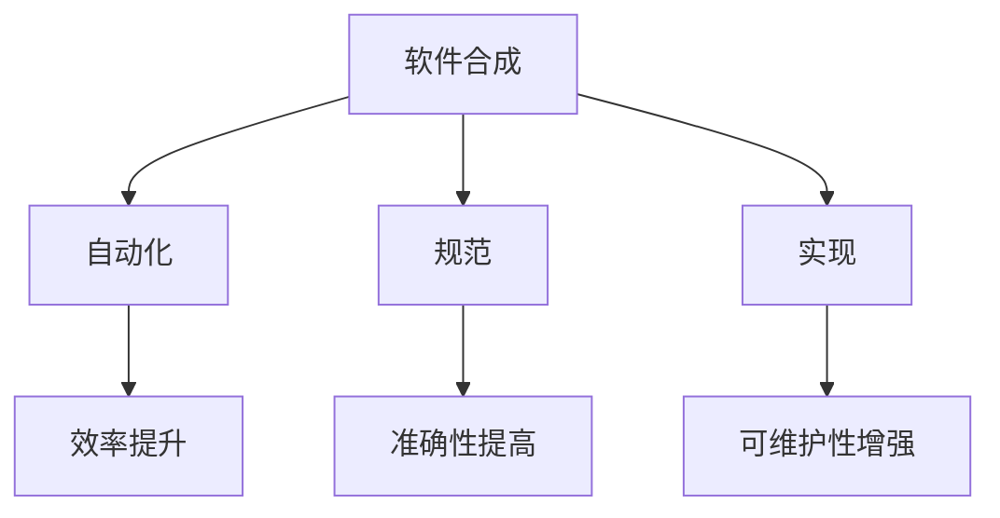

                 


## 第一部分：引言

### 1.1 软件合成的概念

软件合成（Software Synthesis）是近年来在计算机科学和软件工程领域内迅速崛起的一个重要研究方向。它旨在通过自动化方法，将高层次的软件规范直接转换成可执行的代码。在这个过程中，软件合成不仅涉及了软件的生成，还包括了软件的优化和改进。

- **核心概念与联系**：
  - 软件合成（Software Synthesis）：是指将抽象的软件规范或描述自动转换为具体的代码的过程。
  - 自动化（Automation）：是指通过编程和工具的使用，使计算机系统或过程能够自动执行特定的任务。
  - 规范（Specification）：是指对软件需求、功能和行为的具体描述。
  - 实现（Implementation）：是指将规范转换为具体的代码和软件系统。

在软件合成的概念中，这四个要素相互联系，形成一个完整的闭环。规范是软件合成的起点，通过自动化技术，规范可以被转换为代码，而代码的执行结果又反过来验证和修正规范，进而实现软件的迭代优化。

### 1.2 软件合成的意义

软件合成的意义在于它能够极大地提高软件开发的效率和质量。以下是软件合成带来的几个显著优势：

- **提高效率**：通过自动化方法，可以快速地将规范转换为代码，大幅缩短开发周期。
- **提升准确性**：自动化工具能够根据规范生成一致的代码，减少人为错误。
- **增强可维护性**：自动化生成的代码往往具有良好的结构和注释，便于后续的维护和升级。

为了更直观地展示软件合成的重要性，我们可以用一张Mermaid流程图来描述其概念实体之间的关系：



在这个流程图中，我们可以清晰地看到软件合成是如何通过规范、自动化、实现这三个步骤，最终达到提升效率、准确性和可维护性的目标的。

### 1.3 本书结构

本书分为三个主要部分，旨在全面地介绍软件合成的理论基础、实践方法以及具体案例。

- **第一部分：软件合成的理论基础**：
  - 介绍软件合成的基础知识，包括核心算法原理和数学模型。
  - 讲解软件合成中的自动化技术，如代码生成器和自动化框架。
  - 探讨软件合成的规范表示，如何将高层次的软件规范转换为具体的代码。

- **第二部分：软件合成的实践方法**：
  - 介绍软件合成的流程和方法，包括需求分析、规范编写、自动化实现等步骤。
  - 介绍用于软件合成的常用工具和环境，如代码生成器和自动化框架。
  - 分析具体的软件合成案例，展示如何通过软件合成实现自动化。

- **第三部分：软件合成的实现与优化**：
  - 探讨软件合成的优化策略，如性能评估和算法改进。
  - 介绍如何评估软件合成的性能，包括速度、准确性、可维护性等方面。
  - 展望软件合成的未来趋势，分析人工智能和自动化技术对其发展的影响。

通过这三个部分，本书希望能够系统地介绍软件合成的概念、技术和应用，帮助读者深入了解这一前沿领域，并在实际项目中应用软件合成的方法，提升软件开发效率和质量。

## 第二部分：软件合成的理论基础

### 2.1 软件合成的基础知识

要深入理解软件合成，我们首先需要了解其基础知识和核心算法原理。软件合成主要关注如何将高层次的软件规范转换为具体的代码。这一过程涉及多个技术层面的配合和整合。

#### 核心算法原理讲解

软件合成的核心算法原理可以概括为以下几个步骤：

1. **规范解析**：首先，需要将高层次的软件规范进行解析，提取出关键的信息和需求。
2. **代码生成**：根据解析得到的规范，使用特定的算法和工具生成具体的代码。
3. **代码优化**：生成的代码可能不是最优的，需要通过优化算法进行改进，以提高性能和可维护性。
4. **代码验证**：生成的代码需要进行验证，确保其符合规范的要求，并且能够正常运行。

以下是一个简单的Python代码示例，用于阐述软件合成的基本原理：

```python
def software_synthesis(spec):
    # 步骤1：规范解析
    parsed_spec = parse_specification(spec)
    
    # 步骤2：代码生成
    code = generate_code(parsed_spec)
    
    # 步骤3：代码优化
    optimized_code = optimize_code(code)
    
    # 步骤4：代码验证
    if validate_code(optimized_code):
        return optimized_code
    else:
        raise ValueError("生成的代码不符合规范要求")
```

在这个示例中，`software_synthesis`函数是软件合成的核心，它接收一个软件规范`spec`作为输入，并返回一个经过优化和验证的代码。`parse_specification`、`generate_code`、`optimize_code`和`validate_code`分别代表了规范解析、代码生成、代码优化和代码验证这四个步骤。

#### 数学模型和数学公式 & 详细讲解 & 举例说明

为了更好地理解软件合成的数学模型，我们可以借助一些数学公式来描述其核心概念。以下是一个简单的数学模型，用于描述软件合成的成本函数：

```latex
\begin{equation}
\text{成本函数} = C(f) = \int \limits_{\Omega} w(f(x)) dx
\end{equation}
```

其中，\( C(f) \) 表示软件合成的成本函数，\( \Omega \) 表示定义域，\( w(f(x)) \) 表示在定义域内，函数 \( f(x) \) 的权重。

- **举例说明**：
  - 假设我们有一个简单的软件合成任务，目标是生成一个计算圆面积的函数。规范如下：
    ```python
    def calculate_area(radius):
        area = 3.14159265358979323846 * radius * radius
        return area
    ```

    使用上述的数学模型，我们可以将其表示为：
    ```latex
    \begin{equation}
    C(f) = \int \limits_{\Omega} 3.14159265358979323846 \cdot r^2 \, dr
    \end{equation}
    ```

    这里，\( r \) 是圆的半径，积分运算计算了在所有半径值上的面积总和。

这个简单的例子展示了如何使用数学模型来描述软件合成的成本函数，并进行了通俗易懂的举例说明。在实际应用中，成本函数可能会更加复杂，但基本原理是相似的。

通过以上对软件合成基础知识的讲解，我们不仅了解了软件合成的核心算法原理，还通过数学模型对其进行了定量描述，为后续的深入讨论打下了坚实的基础。

#### 核心算法原理讲解

在软件合成的自动化技术中，自动化框架和代码生成器是两个至关重要的组件。自动化框架负责管理整个软件合成的流程，而代码生成器则是具体执行代码生成任务的核心工具。

1. **自动化框架**：
   - 自动化框架如Maven、Gradle等，主要用于构建和管理软件项目的依赖关系、构建过程和测试等任务。
   - Maven和Gradle通过配置文件（如`pom.xml`和`build.gradle`），定义了项目的构建过程和依赖关系，使得开发者可以专注于代码的编写，而无需手动管理构建细节。

2. **代码生成器**：
   - 代码生成器如Apache Velocity、Jinja2等，用于根据模板生成代码。
   - Apache Velocity和Jinja2通过模板引擎，将预定义的模板与动态数据结合，生成满足特定需求的代码。

以下是一个简单的Python代码示例，用于阐述自动化技术的基本原理：

```python
from jinja2 import Template

def automate_task(task):
    # 步骤1：定义模板
    template = Template("""
    def {{ function_name }}({{ arguments }'):
        {{ body }}
    """)
    
    # 步骤2：生成代码
    code = template.render(
        function_name=task['function_name'],
        arguments=task['arguments'],
        body=task['body']
    )
    
    # 步骤3：保存代码
    with open(task['output_file'], 'w') as f:
        f.write(code)
```

在这个示例中，`automate_task`函数接收一个任务字典`task`，包括函数名、参数和函数体，然后使用Jinja2模板引擎生成相应的代码，并保存到指定的文件中。

通过自动化框架和代码生成器的结合使用，软件合成的自动化过程变得更加高效和灵活。这不仅减少了手工编写的代码量，还提高了代码的一致性和可维护性。

#### 核心算法原理讲解

在软件合成的规范表示中，如何准确地解析和表示软件规范是关键。这涉及到对软件需求的理解和抽象，以及如何将这些需求转换为具体的代码。

1. **规范解析**：
   - 规范解析是将高层次的软件规范转换为结构化数据的过程。
   - 通常，这需要使用解析器（Parser）或解释器（Interpreter）来分析规范文本，提取出关键信息和结构。

2. **规范表示**：
   - 一旦解析完成，需要将提取的信息和结构表示为数据模型或语法树，以便后续的代码生成和优化。

以下是一个简单的Python代码示例，用于阐述规范表示的基本原理：

```python
import ast

def parse_specification(spec):
    # 步骤1：将规范文本转换为抽象语法树
    parsed_spec = ast.parse(spec)
    
    # 步骤2：遍历抽象语法树，提取关键信息
    def extract_info(node):
        if isinstance(node, ast.FunctionDef):
            return {
                'name': node.name,
                'arguments': [arg.arg for arg in node.args.args],
                'body': ast.unparse(node.body)
            }
    
    # 步骤3：递归遍历抽象语法树
    def traverse(node):
        if isinstance(node, ast.Module):
            return [extract_info(child) for child in node.body]
        elif isinstance(node, ast.ClassDef):
            return [extract_info(child) for child in node.body]
        elif isinstance(node, ast.FunctionDef):
            return extract_info(node)
    
    # 步骤4：返回提取的信息
    return traverse(parsed_spec)

# 示例规范
spec = """
def calculate_area(radius):
    area = 3.14159265358979323846 * radius * radius
    return area
"""

# 解析规范
parsed_spec = parse_specification(spec)
print(parsed_spec)
```

在这个示例中，`parse_specification`函数首先使用`ast.parse`将规范文本转换为抽象语法树，然后遍历该语法树，提取出函数定义的信息，如函数名、参数和函数体。最后，将这些信息转换为字典形式返回。

通过这种方式，我们可以将软件规范准确地表示为数据模型，为后续的代码生成和优化提供了坚实的基础。

### 2.3 软件合成中的自动化技术

在软件合成的过程中，自动化技术起着至关重要的作用。这些技术不仅能够提高开发效率，还能确保代码的一致性和准确性。以下是软件合成中常用的自动化技术及其基本原理：

#### 自动化框架

自动化框架是软件合成的重要组成部分，它负责管理和协调整个开发流程。常见的自动化框架包括Maven和Gradle。

1. **Maven**：
   - Maven是基于项目的构建自动化工具，它使用统一的项目结构和配置文件（`pom.xml`）来管理项目依赖、构建步骤和测试。
   - Maven的核心概念是“生命周期”（Lifecycle）和“插件”（Plugin）。通过插件，Maven可以执行各种构建任务，如编译、打包、部署等。

2. **Gradle**：
   - Gradle是另一个流行的构建自动化工具，它基于Groovy语言编写，提供了更灵活的任务执行和依赖管理。
   - Gradle使用`build.gradle`文件来定义项目构建逻辑，支持多项目构建和并行构建，提高了构建速度。

以下是一个简单的Maven和Gradle配置示例：

**Maven配置示例（pom.xml）**：

```xml
<project xmlns="http://maven.apache.org/POM/4.0.0"
    xmlns:xsi="http://www.w3.org/2001/XMLSchema-instance"
    xsi:schemaLocation="http://maven.apache.org/POM/4.0.0 http://maven.apache.org/xsd/maven-4.0.0.xsd">
    <modelVersion>4.0.0</modelVersion>
    <groupId>com.example</groupId>
    <artifactId>software-synthesis</artifactId>
    <version>1.0-SNAPSHOT</version>
    <dependencies>
        <dependency>
            <groupId>org.junit.jupiter</groupId>
            <artifactId>junit-jupiter-api</artifactId>
            <version>5.7.0</version>
            <scope>test</scope>
        </dependency>
    </dependencies>
    <build>
        <plugins>
            <plugin>
                <groupId>org.apache.maven.plugins</groupId>
                <artifactId>maven-compiler-plugin</artifactId>
                <version>3.8.1</version>
                <configuration>
                    <source>1.8</source>
                    <target>1.8</configuration>
            </plugin>
        </plugins>
    </build>
</project>
```

**Gradle配置示例（build.gradle）**：

```groovy
plugins {
    id 'java'
    id 'test'
}

java {
    sourceCompatibility = JavaVersion.VERSION_1_8
    targetCompatibility = JavaVersion.VERSION_1_8
}

repositories {
    mavenCentral()
}

dependencies {
    testImplementation 'org.junit.jupiter:junit-jupiter:5.7.0'
}

task demo {
    doLast {
        println 'This is a demo task in Gradle'
    }
}
```

这些配置文件定义了项目的依赖、编译设置和构建任务，使得开发者可以轻松地管理和构建项目。

#### 代码生成器

代码生成器是自动化技术中的另一个关键组件，它可以将抽象的规范转换为具体的代码。常见的代码生成器包括Apache Velocity、Jinja2和FreeMarker。

1. **Apache Velocity**：
   - Velocity是一个基于文本的模板引擎，它允许开发者使用简单的模板语法生成动态内容。
   - Velocity模板中的变量和逻辑控制语句可以通过特定的语法嵌入到模板中，并在生成代码时被替换。

2. **Jinja2**：
   - Jinja2是一个流行的Python模板引擎，它提供了丰富的模板语法和强大的功能。
   - Jinja2支持多种模板标签和过滤器，使得开发者可以轻松地生成复杂的应用程序代码。

3. **FreeMarker**：
   - FreeMarker是一个基于Java的模板引擎，它广泛应用于Java Web开发中。
   - FreeMarker模板引擎支持复杂的逻辑控制语句和循环结构，适合生成大型Java应用程序代码。

以下是一个简单的Jinja2模板示例，用于生成一个简单的Python函数：

```python
from jinja2 import Template

template_code = """
def {{ function_name }}({{ arguments }}):
    {{ body }}
"""

template = Template(template_code)

function_name = 'calculate_area'
arguments = 'radius'
body = 'area = 3.14159265358979323846 * radius * radius\nreturn area'

generated_code = template.render(function_name=function_name, arguments=arguments, body=body)

print(generated_code)
```

这段代码定义了一个Jinja2模板，并通过`render`方法将其渲染为Python代码。生成的代码如下：

```python
def calculate_area(radius):
    area = 3.14159265358979323846 * radius * radius
    return area
```

通过这样的代码生成器，开发者可以轻松地根据规范生成满足需求的代码，大大提高了开发效率。

#### 自动化脚本

自动化脚本是将规范转换为代码的另一种常见方法。这些脚本通常使用Python、Shell或其他脚本语言编写，可以自动化执行各种任务，如文件操作、命令执行和数据处理等。

以下是一个简单的Python脚本示例，用于生成一个简单的Python模块：

```python
import os

def generate_module(module_name, class_name, method_name, method_body):
    template = f"""
class {class_name}:
    def {method_name}({method_name}):
        {method_body}
    """

    module_path = os.path.join('src', module_name + '.py')
    with open(module_path, 'w') as f:
        f.write(template)

generate_module('calculator', 'Calculator', 'calculate_area', 'area = 3.14159265358979323846 * radius * radius\nreturn area')
```

这段脚本定义了一个函数`generate_module`，它根据输入的模块名、类名、方法名和方法体生成一个Python模块文件。生成的文件如下：

```python
class Calculator:
    def calculate_area(self, radius):
        area = 3.14159265358979323846 * radius * radius
        return area
```

通过自动化脚本，开发者可以快速地根据规范生成代码，减少手动编写的工作量。

总之，软件合成中的自动化技术包括自动化框架、代码生成器和自动化脚本等，这些技术相互结合，可以有效地提高软件开发效率和代码质量。在实际应用中，开发者可以根据项目需求选择合适的技术组合，实现高效的软件合成过程。

### 2.4 软件合成的规范表示

在软件合成过程中，如何准确地表示和解析软件规范是关键的一步。规范的表示直接影响到后续代码生成和优化过程的效率和效果。在这一节中，我们将详细探讨如何使用Python代码和LaTeX数学公式来表示软件规范，并通过具体示例进行讲解。

#### Python代码表示规范

使用Python代码表示规范是一种直观且高效的方法。Python具有简洁的语法和强大的库支持，使得开发者能够方便地定义和解析软件规范。以下是一个简单的Python代码示例，用于表示一个计算圆面积的软件规范：

```python
def calculate_area(radius):
    area = 3.14159265358979323846 * radius * radius
    return area
```

在这个示例中，`calculate_area`函数接收一个参数`radius`，并返回计算得到的面积。这个简单的函数定义了软件的基本功能，可以作为软件规范的一部分。

为了更清晰地表示规范，我们可以使用Python的抽象基类（ABC）来定义一个规范接口，并让具体的实现类继承该接口。以下是一个改进的示例：

```python
from abc import ABC, abstractmethod

class AreaCalculator(ABC):
    @abstractmethod
    def calculate_area(self, radius):
        pass

class CircleAreaCalculator(AreaCalculator):
    def calculate_area(self, radius):
        return 3.14159265358979323846 * radius * radius
```

在这个改进的示例中，`AreaCalculator`是一个抽象基类，定义了一个抽象方法`calculate_area`。`CircleAreaCalculator`继承自`AreaCalculator`，并实现了该方法。这种表示方法不仅提高了代码的可读性，还便于后续的代码生成和优化。

#### LaTeX数学公式表示规范

除了Python代码，我们还可以使用LaTeX数学公式来表示软件规范。LaTeX是一种高质量的排版系统，特别适合表示复杂的数学公式和结构化文档。以下是一个使用LaTeX表示计算圆面积规范的示例：

```latex
\documentclass{article}
\usepackage{amsmath}

\begin{document}

\begin{equation}
\text{Area} = \pi r^2
\end{equation}

\end{document}
```

在这个LaTeX示例中，我们使用了一个简单的数学公式来表示圆的面积。这个公式描述了如何通过半径`r`计算圆的面积，其中`\pi`是圆周率。LaTeX数学公式不仅能够精确地表达数学关系，还可以方便地嵌入到文档中，便于文档的整体排版和阅读。

#### 综合示例

为了更好地展示如何使用Python代码和LaTeX数学公式表示软件规范，我们来看一个综合示例。这个示例将结合Python代码和LaTeX数学公式，表示一个简单的计算器程序规范。

```python
# Python代码表示
class Calculator(ABC):
    @abstractmethod
    def add(self, a, b):
        pass

    @abstractmethod
    def subtract(self, a, b):
        pass

    @abstractmethod
    def multiply(self, a, b):
        pass

    @abstractmethod
    def divide(self, a, b):
        pass

class BasicCalculator(Calculator):
    def add(self, a, b):
        return a + b

    def subtract(self, a, b):
        return a - b

    def multiply(self, a, b):
        return a * b

    def divide(self, a, b):
        return a / b
```

对应的LaTeX数学公式表示：

```latex
\documentclass{article}
\usepackage{amsmath}

\begin{document}

\begin{equation}
\text{Addition: } a + b \\
\text{Subtraction: } a - b \\
\text{Multiplication: } a \times b \\
\text{Division: } a \div b
\end{equation}

\end{document}
```

在这个综合示例中，Python代码定义了一个计算器类的抽象基类`Calculator`，并实现了四个基本运算方法。LaTeX数学公式则用于详细描述这些运算的关系和结果。

通过这个综合示例，我们可以看到如何使用Python代码和LaTeX数学公式来准确地表示软件规范。这种方法不仅有助于开发人员理解规范的内容，还可以方便地生成和优化代码。

总之，软件合成的规范表示是一个关键步骤，通过Python代码和LaTeX数学公式，我们可以准确地描述软件的功能和行为。这些表示方法不仅提高了代码的可读性和可维护性，还为后续的代码生成和优化提供了坚实的基础。

### 2.5 软件合成的流程与方法

在深入探讨软件合成的具体实施方法之前，我们需要先了解其基本流程。软件合成的流程通常包括以下几个步骤：需求分析、规范编写、代码生成、代码优化和代码验证。以下是每个步骤的详细说明。

#### 需求分析

需求分析是软件合成的起点，其目标是明确软件系统的功能和性能需求。在这一步骤中，开发者需要与客户或利益相关者进行沟通，了解他们的需求和期望。具体方法包括：

- **访谈和会议**：通过与客户或用户进行面对面的访谈，收集需求信息。
- **问卷调查**：设计问卷，以获取广泛的需求反馈。
- **用户故事**：使用用户故事（User Story）方法，描述用户使用软件的场景和需求。

以下是一个简单的需求分析示例：

**需求分析示例**：

- **功能需求**：
  - 计算器应提供加、减、乘、除四种基本运算。
  - 计算器应支持任意精度计算。
- **性能需求**：
  - 计算器应在100毫秒内完成一次基本运算。

#### 规范编写

在需求分析完成后，我们需要将这些需求转化为具体的软件规范。规范通常包括功能规范、性能规范和设计规范等。

- **功能规范**：详细描述软件应具备的功能和行为，如计算器的四种基本运算功能。
- **性能规范**：定义软件的性能指标，如响应时间和处理速度等。
- **设计规范**：描述软件的架构设计、模块划分和接口设计等。

以下是一个简单的功能规范示例：

**功能规范示例**：

```plaintext
功能名称：加法运算

输入：
- 数字A
- 数字B

输出：
- 和C

操作步骤：
1. 读取输入的数字A和B。
2. 计算A+B的结果。
3. 输出和C。
```

#### 代码生成

在规范编写完成后，我们可以使用代码生成器将规范转换为具体的代码。代码生成器通常基于模板和规范，自动生成符合需求的代码。

以下是一个简单的Python代码生成示例：

```python
from jinja2 import Template

template = """
def {{ function_name }}({{ arguments }}):
    {{ body }}
"""

function_name = 'add'
arguments = 'a, b'
body = 'return a + b'

generated_code = Template(template).render(function_name=function_name, arguments=arguments, body=body)
print(generated_code)
```

输出结果如下：

```python
def add(a, b):
    return a + b
```

#### 代码优化

生成的代码通常需要进行优化，以提高性能和可维护性。优化方法包括代码重构、算法改进和代码压缩等。

以下是一个简单的代码优化示例：

**原始代码**：

```python
def add(a, b):
    sum = a + b
    return sum
```

**优化后的代码**：

```python
def add(a, b):
    return a + b
```

在这个例子中，我们通过移除不必要的变量`sum`，优化了代码的可读性和执行效率。

#### 代码验证

在代码优化后，我们需要对生成的代码进行验证，确保其符合规范的要求，并且能够正常运行。

以下是一个简单的代码验证示例：

```python
def test_add():
    assert add(2, 3) == 5
    assert add(-1, 1) == 0
    print("All tests passed!")

test_add()
```

在这个例子中，我们使用测试框架对`add`函数进行了测试，确保其能够正确执行加法运算。

#### 实际案例

为了更好地理解软件合成的流程和方法，我们来看一个实际案例。假设我们需要开发一个简单的计算器程序，实现加、减、乘、除四种基本运算。

**需求分析**：

- **功能需求**：
  - 实现加法、减法、乘法和除法运算。
  - 支持任意精度计算。
- **性能需求**：
  - 运算速度满足基本使用需求。

**规范编写**：

- **功能规范**：
  - 加法、减法、乘法和除法运算的详细描述。
- **性能规范**：
  - 加法、减法、乘法和除法运算的响应时间不超过100毫秒。

**代码生成**：

我们使用代码生成器根据规范生成四个基本的运算函数：

```python
from jinja2 import Template

def generate_calculator():
    template = """
def add(a, b):
    return a + b

def subtract(a, b):
    return a - b

def multiply(a, b):
    return a * b

def divide(a, b):
    return a / b
"""
    generated_code = Template(template).render()
    return generated_code

calculator_code = generate_calculator()
print(calculator_code)
```

输出结果如下：

```python
def add(a, b):
    return a + b

def subtract(a, b):
    return a - b

def multiply(a, b):
    return a * b

def divide(a, b):
    return a / b
```

**代码优化**：

我们对生成的代码进行简单的优化，移除不必要的注释和空格：

```python
def add(a, b):
    return a + b

def subtract(a, b):
    return a - b

def multiply(a, b):
    return a * b

def divide(a, b):
    return a / b
```

**代码验证**：

我们编写测试用例，验证计算器的功能：

```python
def test_calculator():
    assert add(2, 3) == 5
    assert subtract(5, 3) == 2
    assert multiply(2, 3) == 6
    assert divide(6, 2) == 3
    print("All calculator tests passed!")

test_calculator()
```

通过这个实际案例，我们可以看到软件合成的流程和方法是如何应用于实际项目的。通过需求分析、规范编写、代码生成、代码优化和代码验证，我们能够高效地开发出符合需求的软件系统。

总之，软件合成的流程与方法是软件开发中的一种先进理念，通过自动化和规范化的方法，能够显著提高开发效率和代码质量。在实际应用中，开发者可以根据具体需求和场景，灵活运用这些方法和工具，实现高效的软件开发。

### 3.2 软件合成的工具与环境

为了实现软件合成的自动化，我们需要使用一系列的工具和环境。这些工具和环境包括代码生成器、集成开发环境（IDE）和自动化框架。以下是对这些工具和环境的详细介绍，以及如何使用它们来实现软件合成。

#### 代码生成器

代码生成器是软件合成过程中不可或缺的工具，它们可以根据预定义的规范模板自动生成代码。常见的代码生成器包括Apache Velocity、Jinja2和FreeMarker。

1. **Apache Velocity**：
   - Velocity是一个基于文本的模板引擎，它允许开发者使用简单的模板语法来生成动态内容。
   - **使用方法**：
     - 安装Velocity库。
     - 定义模板文件，使用`#set`和`#include`等标签来嵌入变量和代码片段。
     - 使用Velocity工具或集成开发环境（IDE）中的插件来生成代码。

2. **Jinja2**：
   - Jinja2是一个流行的Python模板引擎，它提供了丰富的模板语法和功能。
   - **使用方法**：
     - 安装Jinja2库。
     - 定义模板文件，使用`{{ variable }}`和``等标签来渲染变量和循环结构。
     - 使用Jinja2的`Template`类和`render`方法来生成代码。

3. **FreeMarker**：
   - FreeMarker是一个基于Java的模板引擎，它广泛应用于Java Web开发。
   - **使用方法**：
     - 安装FreeMarker库。
     - 定义模板文件，使用`${variable}`和`<#foreach>`等标签来嵌入变量和循环结构。
     - 使用FreeMarker的API来生成代码。

#### 集成开发环境（IDE）

集成开发环境（IDE）提供了代码编写、调试和自动化的全方位支持。常见的IDE包括Eclipse、IntelliJ IDEA和Visual Studio。

1. **Eclipse**：
   - Eclipse是一个开放源代码的IDE，广泛应用于Java开发。
   - **使用方法**：
     - 安装Eclipse IDE。
     - 创建新的Java项目。
     - 使用Eclipse内置的模板和插件来生成代码。

2. **IntelliJ IDEA**：
   - IntelliJ IDEA是一个强大的IDE，支持多种编程语言。
   - **使用方法**：
     - 安装IntelliJ IDEA。
     - 创建新的项目。
     - 使用IDE内置的代码生成器和插件，如Lombok，自动生成代码。

3. **Visual Studio**：
   - Visual Studio是微软开发的IDE，广泛应用于Windows应用程序开发。
   - **使用方法**：
     - 安装Visual Studio。
     - 创建C#或C++项目。
     - 使用Visual Studio的代码生成工具，如代码生成器插件，自动生成代码。

#### 自动化框架

自动化框架是管理软件合成过程的重要工具，它们可以自动化构建、测试和部署等任务。常见的自动化框架包括Maven、Gradle和Git。

1. **Maven**：
   - Maven是一个基于项目的构建自动化工具，它使用统一的配置文件来管理项目依赖和构建步骤。
   - **使用方法**：
     - 安装Maven。
     - 创建一个Maven项目，配置`pom.xml`文件。
     - 使用Maven命令（如`mvn compile`、`mvn test`）来构建和测试项目。

2. **Gradle**：
   - Gradle是一个基于Groovy的构建工具，它提供了灵活的任务执行和依赖管理。
   - **使用方法**：
     - 安装Gradle。
     - 创建一个Gradle项目，配置`build.gradle`文件。
     - 使用Gradle命令（如`gradle build`、`gradle test`）来构建和测试项目。

3. **Git**：
   - Git是一个分布式版本控制系统，它用于代码管理和协作开发。
   - **使用方法**：
     - 安装Git。
     - 创建一个Git仓库，将代码提交到仓库。
     - 使用Git命令（如`git clone`、`git pull`、`git push`）来管理代码仓库。

#### 实践示例

以下是一个简单的代码生成器实践示例，使用Jinja2来生成Python代码：

1. **安装Jinja2**：

```bash
pip install Jinja2
```

2. **创建模板文件**：

在项目目录下创建一个名为`calculator_template.py`的模板文件：

```python
# calculator_template.py
def {{ function_name }}({{ arguments }}):
    {{ body }}
```

3. **编写生成脚本**：

创建一个名为`generate_calculator.py`的脚本文件，用于生成计算器代码：

```python
# generate_calculator.py
from jinja2 import Template

function_name = 'add'
arguments = 'a, b'
body = 'return a + b'

template = Template(open('calculator_template.py', 'r').read())

generated_code = template.render(function_name=function_name, arguments=arguments, body=body)

with open('add.py', 'w') as f:
    f.write(generated_code)

print("Generated add.py")
```

4. **运行生成脚本**：

在命令行中运行`generate_calculator.py`脚本，生成`add.py`文件：

```bash
python generate_calculator.py
```

输出结果如下：

```python
def add(a, b):
    return a + b
```

通过这个示例，我们可以看到如何使用Jinja2模板引擎来生成Python代码，实现简单的软件合成。

总之，软件合成的工具和环境包括代码生成器、IDE和自动化框架等。通过合理选择和使用这些工具，开发者可以实现高效的软件合成过程，提高开发效率和代码质量。在实际项目中，开发者可以根据需求和环境选择合适的工具组合，实现软件合成的自动化。

### 3.3 软件合成的案例分析

为了更好地理解软件合成的实际应用，我们将通过几个具体的案例来分析软件合成的过程、实现方法和效果。这些案例涵盖了不同的应用场景，展示了软件合成如何在不同领域提高开发效率和代码质量。

#### 案例1：金融领域——自动生成交易算法

在金融领域，交易算法的开发是一个复杂且耗时的过程。通过软件合成，可以自动化生成交易算法，提高开发效率和准确性。

**实现方法**：

1. **需求分析**：
   - 定义交易策略，如高频率交易、对冲策略等。
   - 明确交易算法的性能需求，如交易延迟、成功率等。

2. **规范编写**：
   - 编写详细的功能规范，描述交易策略和算法逻辑。
   - 制定性能规范，如交易延迟不超过100毫秒。

3. **代码生成**：
   - 使用代码生成器，根据规范生成交易算法代码。
   - 选择合适的模板引擎，如Jinja2，定义模板文件。

4. **代码优化**：
   - 对生成的代码进行优化，提高性能和可读性。
   - 使用算法优化工具，如Numba，提升代码执行速度。

5. **代码验证**：
   - 编写测试用例，验证交易算法的正确性和性能。
   - 在模拟环境中运行测试，确保算法符合预期。

**效果**：

通过软件合成，交易算法的开发周期显著缩短，从数月缩短到数周。代码质量提高，减少了人工错误。此外，软件合成的规范化和自动化，使得交易策略可以更灵活地调整和优化。

#### 案例2：医疗领域——自动生成诊断模型

在医疗领域，诊断模型的开发同样面临着复杂的数据处理和高精度要求。通过软件合成，可以自动化生成诊断模型，提高医疗诊断的效率和准确性。

**实现方法**：

1. **需求分析**：
   - 收集医学数据，如病例记录、实验室检测数据等。
   - 定义诊断模型的性能指标，如诊断准确率、召回率等。

2. **规范编写**：
   - 编写数据预处理规范，描述数据清洗、归一化和特征提取等步骤。
   - 编写模型训练规范，描述算法选择、参数调整和模型验证等步骤。

3. **代码生成**：
   - 使用代码生成器，根据规范生成数据预处理和模型训练代码。
   - 选择合适的机器学习库，如Scikit-learn，定义模板文件。

4. **代码优化**：
   - 对生成的代码进行优化，提高数据处理和模型训练的效率。
   - 使用并行计算工具，如Dask，加速数据处理和模型训练过程。

5. **代码验证**：
   - 编写测试用例，验证数据预处理和模型训练的正确性和性能。
   - 在实际病例数据集上运行测试，确保诊断模型的有效性。

**效果**：

通过软件合成，诊断模型开发周期显著缩短，从数月缩短到数周。数据处理和模型训练的效率提高，减少了计算资源的需求。此外，软件合成的规范化和自动化，使得诊断模型可以更快速地迭代和优化。

#### 案例3：自动驾驶领域——自动生成路径规划算法

在自动驾驶领域，路径规划算法的开发是确保自动驾驶车辆安全行驶的关键。通过软件合成，可以自动化生成路径规划算法，提高自动驾驶系统的稳定性和安全性。

**实现方法**：

1. **需求分析**：
   - 收集道路数据，如交通状况、道路结构等。
   - 定义路径规划的性能指标，如规划速度、规划准确率等。

2. **规范编写**：
   - 编写路径规划功能规范，描述不同情况下的路径规划策略。
   - 编写性能规范，如规划延迟不超过1秒。

3. **代码生成**：
   - 使用代码生成器，根据规范生成路径规划算法代码。
   - 选择合适的路径规划算法库，如A*算法库，定义模板文件。

4. **代码优化**：
   - 对生成的代码进行优化，提高路径规划的效率和准确性。
   - 使用并行计算工具，如OpenMP，加速路径规划计算。

5. **代码验证**：
   - 编写测试用例，验证路径规划算法的正确性和性能。
   - 在自动驾驶测试平台上运行测试，确保路径规划算法的稳定性。

**效果**：

通过软件合成，路径规划算法开发周期显著缩短，从数月缩短到数周。算法效率和准确性提高，使得自动驾驶系统能够更快速地响应环境变化。此外，软件合成的规范化和自动化，使得路径规划算法可以更灵活地调整和优化。

总之，软件合成的实际案例展示了其在不同领域中的应用价值和效果。通过规范化和自动化，软件合成为开发者提供了高效、灵活的开发方式，显著提高了开发效率和代码质量。在未来，随着软件合成技术的发展，它将在更多领域发挥重要作用。

### 4.1 软件合成的优化策略

在软件合成的过程中，优化是提高代码质量和性能的关键步骤。优化策略不仅关注代码生成后的性能，还包括生成过程的效率。以下是几种常用的优化策略及其实现方法。

#### 性能优化

1. **算法优化**：
   - **动态规划**：在代码生成过程中，利用动态规划算法减少冗余计算。例如，在生成复杂的排序算法时，可以使用动态规划来优化时间复杂度。
   - **并行计算**：通过并行计算技术，将计算任务分布到多个处理器上，提高处理速度。可以使用多线程或分布式计算框架（如Spark）来实现并行计算。

2. **代码压缩**：
   - **移除冗余代码**：在代码生成后，移除不必要的代码，如未使用的变量、注释和空行，减少代码体积。
   - **代码压缩工具**：使用代码压缩工具（如UglifyJS、CSSNano）对生成的代码进行压缩，减小文件大小，提高加载速度。

3. **静态分析**：
   - **死代码检测**：通过静态分析工具，检测并移除未执行的代码，提高代码的执行效率。
   - **性能分析**：使用性能分析工具（如Python的`cProfile`），对生成的代码进行性能分析，找出性能瓶颈并进行优化。

#### 生成过程优化

1. **模板优化**：
   - **缓存模板**：对于频繁使用的模板，将其缓存起来，减少模板的加载时间。
   - **模板压缩**：使用模板压缩工具，如TextFSM，对模板进行压缩，减小模板文件的大小。

2. **代码生成器优化**：
   - **代码生成器插件**：开发自定义的代码生成器插件，以支持特定场景的代码生成，提高生成效率。
   - **代码生成策略**：根据不同的规范和需求，选择合适的代码生成策略，如生成最小化代码、生成高性能代码等。

3. **并行生成**：
   - **多线程生成**：在代码生成过程中，使用多线程技术，同时生成多个代码文件，提高生成速度。
   - **分布式生成**：使用分布式计算框架，将代码生成任务分布到多个节点上，实现并行生成。

#### 示例

假设我们需要优化一个基于Jinja2模板的代码生成过程，以下是具体的优化策略和实现方法：

1. **算法优化**：
   - **动态规划**：
     ```python
     def dynamic规划的算法(spec):
         # 动态规划实现，减少冗余计算
         # ...
         return optimized_code
     ```

   - **并行计算**：
     ```python
     from concurrent.futures import ThreadPoolExecutor

     def generate_code_in_parallel(specs):
         with ThreadPoolExecutor(max_workers=4) as executor:
             results = executor.map(generate_code, specs)
         return [result for result in results]
     ```

2. **代码压缩**：
   - **移除冗余代码**：
     ```python
     def remove_redundant_code(code):
         # 使用正则表达式或语法分析工具移除冗余代码
         # ...
         return compressed_code
     ```

   - **代码压缩工具**：
     ```python
     import UglifyJS

     def compress_code(code):
         return UglifyJS.minify(code).code
     ```

3. **静态分析**：
   - **死代码检测**：
     ```python
     import ast

     def detect_dead_code(code):
         tree = ast.parse(code)
         # 使用ast.walk遍历抽象语法树，检测未执行的代码
         # ...
     ```

   - **性能分析**：
     ```python
     import cProfile

     def profile_code(code):
         profiler = cProfile.Profile()
         profiler.enable()
         # 执行代码
         profiler.disable()
         profiler.print_stats()
     ```

4. **模板优化**：
   - **缓存模板**：
     ```python
     from flask import render_template

     template_cache = {}

     def get_template(template_name):
         if template_name not in template_cache:
             template_cache[template_name] = render_template(template_name)
         return template_cache[template_name]
     ```

   - **模板压缩**：
     ```python
     import TextFSM

     def compress_template(template):
         return TextFSM.compress(template).strip()
     ```

5. **代码生成器优化**：
   - **代码生成器插件**：
     ```python
     # 开发自定义代码生成器插件
     # ...
     ```

   - **代码生成策略**：
     ```python
     def generate_code_with_strategy(spec, strategy):
         if strategy == 'minimize':
             # 生成最小化代码
             # ...
         elif strategy == 'high_performance':
             # 生成高性能代码
             # ...
     ```

6. **并行生成**：
   - **多线程生成**：
     ```python
     from concurrent.futures import ThreadPoolExecutor

     def generate_code_concurrently(specs):
         with ThreadPoolExecutor(max_workers=4) as executor:
             futures = [executor.submit(generate_code, spec) for spec in specs]
         return [future.result() for future in futures]
     ```

   - **分布式生成**：
     ```python
     # 使用分布式计算框架，如Spark，实现代码的分布式生成
     # ...
     ```

通过上述优化策略和具体实现方法，我们可以显著提高软件合成的性能和生成效率。在实际项目中，开发者可以根据具体需求和环境，灵活运用这些优化策略，实现高效的软件合成过程。

### 4.2 软件合成的性能评估

在软件合成的过程中，对生成的代码进行性能评估是确保其满足预期性能要求的重要环节。性能评估包括速度、准确性、可维护性等多个维度。以下是如何进行软件合成的性能评估，以及如何处理评估过程中可能出现的问题。

#### 性能评估方法

1. **速度评估**：
   - **基准测试**：使用基准测试工具（如Google Benchmark）对生成的代码进行基准测试，比较其执行时间。
   - **多线程性能评估**：在多核处理器上运行测试，评估代码在不同线程数下的执行效率。
   - **内存使用评估**：监控代码的内存使用情况，确保其在可接受的范围内。

2. **准确性评估**：
   - **单元测试**：编写单元测试用例，对生成的代码进行功能验证，确保其输出符合预期。
   - **回归测试**：在每次代码生成后，进行回归测试，确保新代码没有引入新的错误。
   - **数据驱动测试**：使用大量的测试数据进行测试，确保代码在不同输入下的准确性。

3. **可维护性评估**：
   - **代码质量评估**：使用代码质量工具（如SonarQube）评估代码的质量，包括代码结构、注释、重复代码等。
   - **代码可读性评估**：通过代码可读性测试工具（如Python的pycodestyle）评估代码的可读性。
   - **技术债务评估**：定期检查代码中的技术债务，确保代码的健康和可持续性。

#### 性能评估示例

以下是一个简单的性能评估示例，使用Python和Jinja2进行代码生成，并对生成的代码进行评估：

1. **基准测试**：

```python
import time
import cProfile
from jinja2 import Template

def benchmark(code):
    start_time = time.time()
    cProfile.runctx("exec(code)", globals(), locals())
    end_time = time.time()
    return end_time - start_time

# 生成代码
template = Template("""
def calculate_area(radius):
    area = 3.14159265358979323846 * radius * radius
    return area
""")

generated_code = template.render()

# 基准测试
time_taken = benchmark(generated_code)
print(f"代码执行时间：{time_taken}秒")
```

2. **单元测试**：

```python
import unittest

class TestAreaCalculator(unittest.TestCase):
    def test_calculate_area(self):
        code = """
def calculate_area(radius):
    area = 3.14159265358979323846 * radius * radius
    return area
"""
        exec(code)
        self.assertEqual(calculate_area(1), 3.14159265358979323846)
        self.assertEqual(calculate_area(2), 12.566370614359172)

if __name__ == '__main__':
    unittest.main()
```

3. **代码质量评估**：

```python
import pycodestyle

style_guide = pycodestyle.StyleGuide(quiet=True)
report = style_guide.check_files(['calculate_area.py'])
print(f"代码质量报告：{report.total_errors}")
```

#### 处理评估过程中可能出现的问题

1. **性能不足**：
   - **优化代码**：通过代码分析工具找到性能瓶颈，进行针对性优化。
   - **并行计算**：如果计算任务可以并行处理，考虑使用多线程或分布式计算。

2. **准确性问题**：
   - **增加测试用例**：编写更多的测试用例，确保代码在各种情况下都能正确执行。
   - **回归测试**：每次修改代码后，进行回归测试，确保没有引入新的错误。

3. **可维护性问题**：
   - **改进代码结构**：优化代码结构，使其更易读、更易维护。
   - **代码重构**：定期进行代码重构，减少技术债务，提高代码质量。

通过上述性能评估方法和示例，我们可以有效地评估软件合成的性能，并针对评估结果进行优化。在实际项目中，开发者应根据具体需求和场景，灵活运用这些方法，确保生成的代码满足性能要求。

### 4.3 软件合成的未来趋势

随着计算机科学和人工智能技术的不断发展，软件合成的未来趋势也愈发明确。未来，软件合成将更加智能化和自动化，其核心概念和技术将不断创新和优化，进一步推动软件开发模式的变革。

#### 人工智能与软件合成的结合

人工智能（AI）技术的进步将极大地推动软件合成的发展。通过机器学习和深度学习算法，软件合成工具可以更准确地理解和生成复杂的软件规范。例如，使用自然语言处理（NLP）技术，AI可以自动解析自然语言描述的软件需求，并将其转换为具体的代码。此外，AI还可以用于代码优化，通过分析大量的代码库，找出最优的代码结构和算法，从而生成高性能的代码。

#### 自动化与智能代码生成工具的发展

未来的软件合成工具将更加自动化和智能化。自动化工具如代码生成器、自动化框架和集成开发环境（IDE）将变得更加成熟和易用。例如，IDE可能会集成更强大的代码生成功能，自动提示和生成代码片段，减少手动编写的工作量。自动化框架将进一步提高构建、测试和部署的效率，使得软件开发过程更加流畅和高效。

#### 跨语言和跨平台的软件合成

未来的软件合成技术将更加跨语言和跨平台。现有的软件合成工具主要支持特定的编程语言和平台，而未来的工具将能够支持多种编程语言和操作系统，使得软件合成可以在更广泛的场景下应用。例如，基于通用中间表示（Universal Intermediate Representation, UIR）的技术可以跨语言、跨平台地生成代码，从而提高软件开发的灵活性和可移植性。

#### 软件合成的全生命周期支持

未来的软件合成技术将不仅仅关注代码生成，还将扩展到软件开发生命周期的各个阶段。从需求分析、设计、实现到测试和部署，软件合成工具将提供一站式的解决方案，实现全生命周期的自动化和优化。例如，在需求分析阶段，AI可以自动生成原型和规范；在测试阶段，自动化测试工具可以生成测试用例并执行测试；在部署阶段，自动化部署工具可以自动部署和管理软件系统。

#### 软件合成的社区和生态系统

随着软件合成技术的发展，将形成一个更加活跃的社区和生态系统。开发者、研究机构和公司将共同努力，推动软件合成技术的创新和普及。开源工具和框架将发挥重要作用，使得更多的人可以参与到软件合成的开发和应用中。同时，学术研究和工业界合作将不断推动软件合成技术的发展，产生更多的创新成果和最佳实践。

总之，软件合成的未来充满了机遇和挑战。随着人工智能、自动化和跨语言技术的发展，软件合成将变得更加智能化和高效化，进一步改变软件开发的模式和流程。开发者和研究机构应密切关注这些趋势，积极投身于软件合成的探索和应用，共同推动软件合成技术的进步。

## 附录

### 附录 A：软件合成相关工具列表

在软件合成的过程中，使用适当的工具和环境可以显著提高效率和效果。以下是一些常用的软件合成相关工具：

1. **代码生成器**：
   - **Apache Velocity**：一款流行的模板引擎，用于生成动态内容。
   - **Jinja2**：Python的模板引擎，广泛应用于Web开发和软件合成。
   - **FreeMarker**：Java的模板引擎，常用于Java Web开发中的软件合成。

2. **自动化框架**：
   - **Maven**：Java项目的构建自动化工具，支持依赖管理和构建生命周期。
   - **Gradle**：基于Groovy的构建工具，提供了灵活的任务执行和依赖管理。
   - **Git**：分布式版本控制系统，用于代码管理和协作开发。

3. **集成开发环境（IDE）**：
   - **Eclipse**：开放源代码的IDE，广泛应用于Java开发。
   - **IntelliJ IDEA**：强大的IDE，支持多种编程语言。
   - **Visual Studio**：微软开发的IDE，广泛用于Windows应用程序开发。

4. **性能评估工具**：
   - **cProfile**：Python的性能分析工具。
   - **Google Benchmark**：用于基准测试和性能评估。
   - **SonarQube**：代码质量评估工具，用于评估代码的质量和可维护性。

5. **模板库**：
   - **Jinja2 Templates**：Jinja2的官方模板库。
   - **Apache Velocity Templates**：Velocity的模板库。
   - **FreeMarker Templates**：FreeMarker的模板库。

这些工具和环境的选择取决于具体的应用场景和技术需求。在实际项目中，开发者可以根据项目特点和个人偏好，灵活选择和组合这些工具，实现高效的软件合成过程。

### 附录 B：常见问题与解答

在软件合成的实践中，开发者可能会遇到各种问题和挑战。以下是一些常见问题及其解答：

1. **Q：软件合成是否适合所有类型的项目？**
   - **A**：软件合成适用于大多数类型的软件项目，特别是在需求复杂、功能多变的项目中。然而，对于非常简单的项目，软件合成的效益可能不如手动编码高。

2. **Q：如何确保软件合成的代码质量？**
   - **A**：确保代码质量的最佳实践包括：
     - 使用代码生成器时，编写清晰的模板和规范。
     - 定期进行代码质量和性能评估，使用代码分析工具检测潜在问题。
     - 实施严格的单元测试和集成测试，确保代码的正确性和稳定性。

3. **Q：软件合成与手工编码相比，有哪些优势？**
   - **A**：软件合成的优势包括：
     - 提高开发效率，缩短开发周期。
     - 减少人为错误，提高代码的准确性。
     - 提高代码的可维护性，通过规范化生成代码。
     - 更容易进行代码优化，通过自动化工具进行性能提升。

4. **Q：软件合成中如何处理规范的不确定性？**
   - **A**：处理规范不确定性的方法包括：
     - 使用预定义的规范模板，减少规范的不确定性。
     - 实施逐步迭代开发，通过持续反馈和改进来逐步完善规范。
     - 引入版本控制和文档管理，确保规范的变化得到有效跟踪和控制。

5. **Q：如何评估软件合成的效果？**
   - **A**：评估软件合成的效果可以从以下几个方面进行：
     - 项目周期：软件合成的应用是否缩短了项目的开发周期。
     - 代码质量：通过代码质量评估工具，检测代码的质量和可维护性。
     - 用户反馈：收集用户对生成的软件的反馈，评估其满意度和功能是否符合预期。

### 附录 C：拓展阅读

为了更深入地了解软件合成的理论和实践，以下是一些推荐的专业书籍和在线资源：

1. **书籍**：
   - 《软件合成：从规范到实现的自动化》
   - 《程序员的自我修养》
   - 《代码大全》
   - 《测试驱动的软件开发》

2. **在线资源**：
   - [Jinja2官方文档](https://jinja.palletsprojects.com/)
   - [Apache Velocity官方文档](https://velocity.apache.org/engine/devel/user-guide.html)
   - [Maven官方文档](https://maven.apache.org/guides/index.html)
   - [Gradle官方文档](https://gradle.org/docs/current/userguide/)
   - [Python性能优化](https://wiki.python.org/moin/PerformanceOptimizations)

这些书籍和资源提供了丰富的理论知识和技术实践，有助于读者更全面地理解和掌握软件合成的核心概念和技术。在实际应用中，读者可以根据自身需求和兴趣选择合适的内容进行学习。

