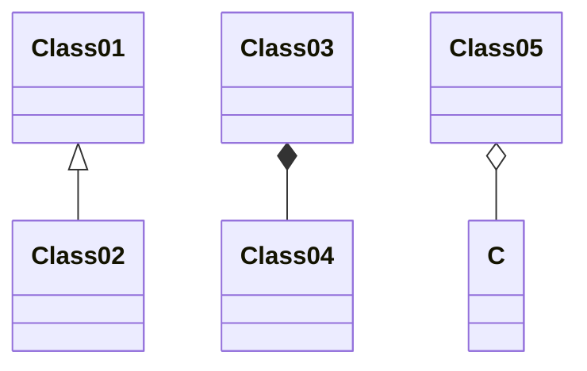
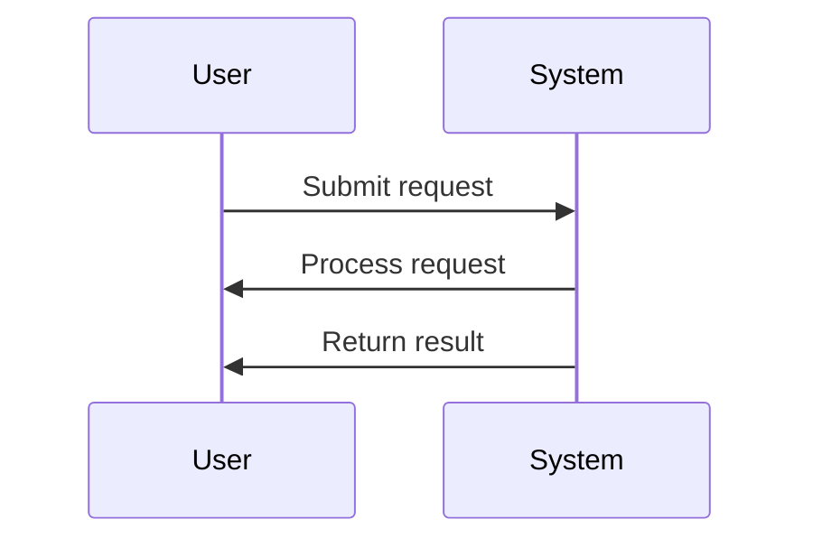

                 

**# 软件国际化与本地化：全球化应用开发策略**

> 关键词：软件国际化、本地化、全球化、应用开发、策略

> 摘要：随着全球化的加速，软件国际化与本地化已成为企业开拓国际市场的关键。本文深入探讨了软件国际化与本地化的背景、核心概念、算法原理、系统分析与架构设计，以及项目实战，旨在为开发者提供全面的策略指导。

**### 第一部分：背景介绍**

#### 1. 软件国际化与本地化的背景

随着互联网的普及和全球化进程的加速，软件国际化与本地化成为企业进入国际市场的关键。软件国际化（Internationalization，简称I18N）是指将软件设计成能够适应多语言、多文化环境，以便在全球范围内使用。本地化（Localization，简称L10N）则是在国际化基础上，针对特定市场或地区的需求，对软件进行定制化处理。

#### 1.1 国际化的概念

国际化是将软件设计成适应多语言、多文化环境的过程。国际化的重要性体现在：

- **扩大市场范围**：帮助企业产品进入全球市场，提升国际竞争力。
- **增加用户群体**：满足不同国家和地区用户的需求，提高用户满意度。
- **降低成本**：通过一次开发，覆盖多个市场，减少重复开发成本。

#### 1.2 本地化的概念

本地化是在国际化基础上，针对特定市场或地区的需求，对软件进行定制化处理的过程。本地化的核心内容包括：

- **语言本地化**：将软件界面、文档、帮助信息等翻译成目标市场的语言。
- **文化适应**：确保软件内容符合目标市场的文化习惯和价值观。
- **区域化**：针对特定地区的法律法规、货币、度量衡等进行调整。

#### 1.3 软件国际化与本地化的关系

国际化是本地化的前提，本地化是国际化的深化。两者相辅相成，共同构成软件在全球市场成功的关键。

**## 2. 核心概念与联系**

#### 2.1 核心概念

##### 软件国际化

- **定义**：使软件设计适应多语言、多文化环境，以便在全球范围内使用。
- **关键要素**：字符编码、本地化资源、国际化框架等。

##### 软件本地化

- **定义**：根据特定市场的需求，对国际化后的软件进行定制化处理。
- **关键要素**：翻译、文化适应、本地化测试等。

#### 2.2 概念属性特征对比表格

| 特征 | 国际化 | 本地化 |
| ---- | ------ | ------ |
| 目标 | 多语言支持 | 特定语言支持 |
| 重点 | 通用性 | 适应性 |
| 任务 | 设计、编码 | 翻译、测试 |
| 时序 | 先于本地化 | 后于国际化 |

#### 2.3 ER实体关系图架构

```mermaid
erDiagram
  Customer ||--|{ Product : "ordered by" }
  Product ||--|{ Order : "produced by" }
```

**## 3. 算法原理讲解**

#### 3.1 算法概述

软件国际化与本地化涉及多个算法和技术，其中关键算法包括：

- **字符编码转换算法**：如UTF-8、UTF-16等。
- **自然语言处理算法**：如翻译引擎、文本分类等。
- **文化适应算法**：如图像识别、语音识别等。

#### 3.2 算法流程图


#### 3.3 Python源代码示例

```python
def encode_utf8(text):
    return text.encode('utf-8')

def decode_utf8(encoded_text):
    return encoded_text.decode('utf-8')

text = "你好，世界！"
encoded_text = encode_utf8(text)
decoded_text = decode_utf8(encoded_text)

print("原始文本：", text)
print("编码后：", encoded_text)
print("解码后：", decoded_text)
```

#### 3.4 数学模型和公式

国际化与本地化的过程中，涉及到的关键数学模型包括：

- **文本相似度计算**：如Jaccard相似度、余弦相似度等。
- **语言模型**：如n-gram模型、神经网络模型等。

数学公式示例：

$$
J(A, B) = \frac{|A \cap B|}{|A \cup B|}
$$

**## 4. 系统分析与架构设计**

#### 4.1 问题场景介绍

##### 项目背景

随着全球化进程的加速，企业需要开发能够适应多种语言和文化的软件产品，以提高国际市场竞争力。

##### 项目目标

- 实现软件的国际化与本地化功能。
- 提供一个高效的本地化流程，支持快速迭代和部署。

#### 4.2 系统功能设计

##### 领域模型



##### 系统功能

- **国际化支持**：实现多语言界面、国际化资源管理等。
- **本地化支持**：实现翻译、文化适应、本地化测试等。

#### 4.3 系统架构设计

##### 系统架构



##### 系统接口设计

- **国际化接口**：提供国际化资源加载、国际化配置管理等。
- **本地化接口**：提供翻译服务、文化适应服务、本地化测试服务等。

##### 系统交互


**## 5. 项目实战**

#### 5.1 环境安装

在开始项目实战之前，需要安装必要的开发环境和工具，如Python、Django等。

#### 5.2 系统核心实现源代码

核心实现源代码包括国际化与本地化功能的具体实现，如下所示：

```python
# 国际化实现
class InternationalizationMiddleware:
    def __init__(self, get_response):
        self.get_response = get_response

    def __call__(self, request):
        # 设置语言环境
        language_code = request.GET.get('lang', 'en')
        if language_code in ['en', 'zh']:
            from django.utils import translation
            translation.activate(language_code)
        response = self.get_response(request)
        return response

# 本地化实现
class LocalizationMiddleware:
    def __init__(self, get_response):
        self.get_response = get_response

    def __call__(self, request):
        # 设置本地化环境
        locale_code = request.GET.get('locale', 'en_US')
        if locale_code in ['en_US', 'zh_CN']:
            from django.utils import formats
            formats.set_format(request, 'SHORT_DATE_FORMAT', locale_code)
        response = self.get_response(request)
        return response
```

#### 5.3 代码应用解读与分析

代码应用解读与分析主要涉及国际化与本地化功能的具体实现，包括语言切换、日期格式切换等。

#### 5.4 实际案例分析和详细讲解剖析

以一个实际案例为例，详细讲解国际化与本地化在项目中的应用和实现，包括国际化资源管理、本地化测试等。

#### 5.5 项目小结

通过项目实战，深入理解了软件国际化与本地化的实现原理和应用，为后续项目的全球化开发提供了实践经验和指导。

**## 6. 最佳实践 Tips**

- **充分调研目标市场**：在国际化与本地化过程中，充分调研目标市场的语言、文化、法律法规等，确保软件适应目标市场。
- **模块化设计**：将国际化与本地化功能模块化，方便后续维护和扩展。
- **自动化测试**：采用自动化测试工具，确保国际化与本地化功能的稳定性和可靠性。

**## 7. 小结**

软件国际化与本地化是全球化应用开发的关键。通过本文的详细讲解，我们深入理解了软件国际化与本地化的背景、核心概念、算法原理、系统分析与架构设计，以及项目实战，为开发者提供了全面的策略指导。

**## 8. 注意事项**

- **版本控制**：国际化与本地化过程中，需要注意版本控制，确保代码的稳定性和可维护性。
- **性能优化**：国际化与本地化功能可能会增加服务器负载，需要进行性能优化。

**## 9. 拓展阅读**

- **《软件国际化与本地化实战》**：深入探讨国际化与本地化的实践经验和技巧。
- **《国际化Web应用开发》**：介绍如何开发支持多语言、多文化的Web应用。

**### 作者信息**

作者：AI天才研究院/AI Genius Institute & 禅与计算机程序设计艺术 /Zen And The Art of Computer Programming**

