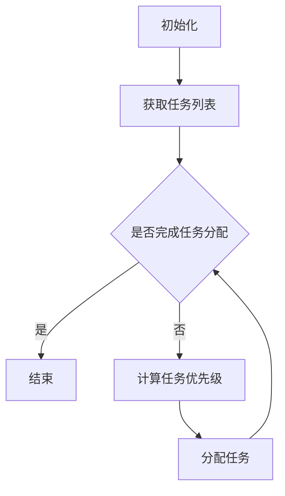
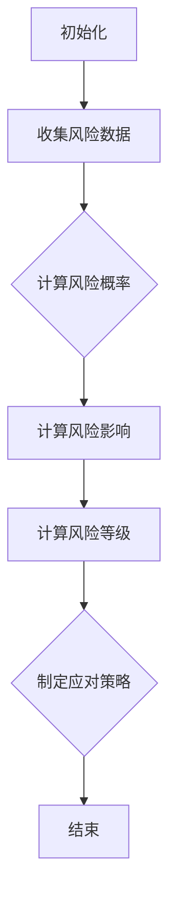
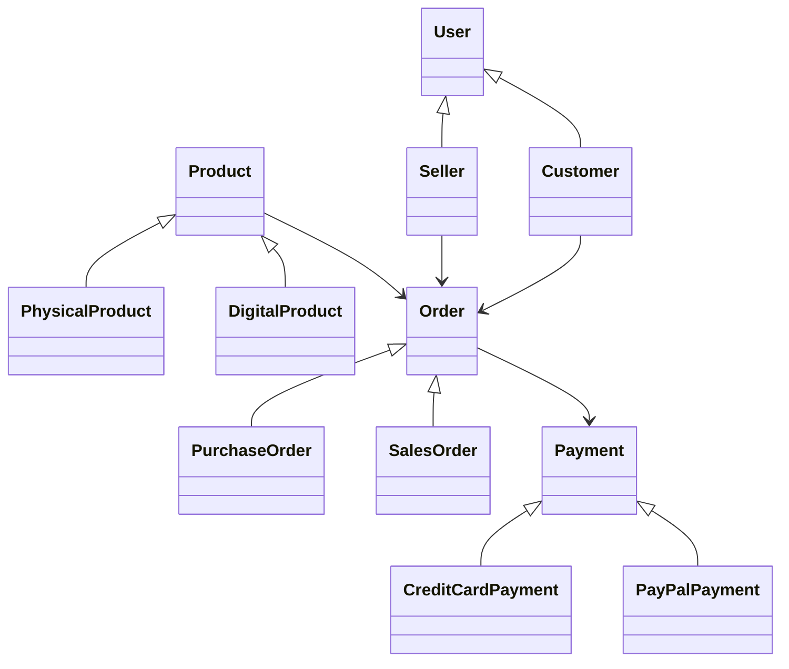
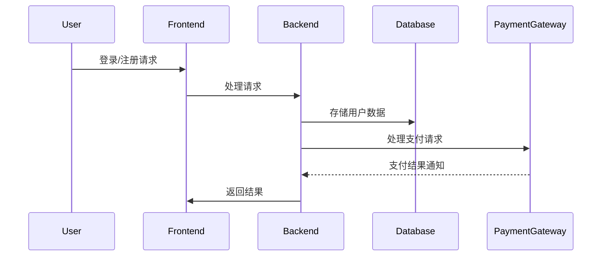
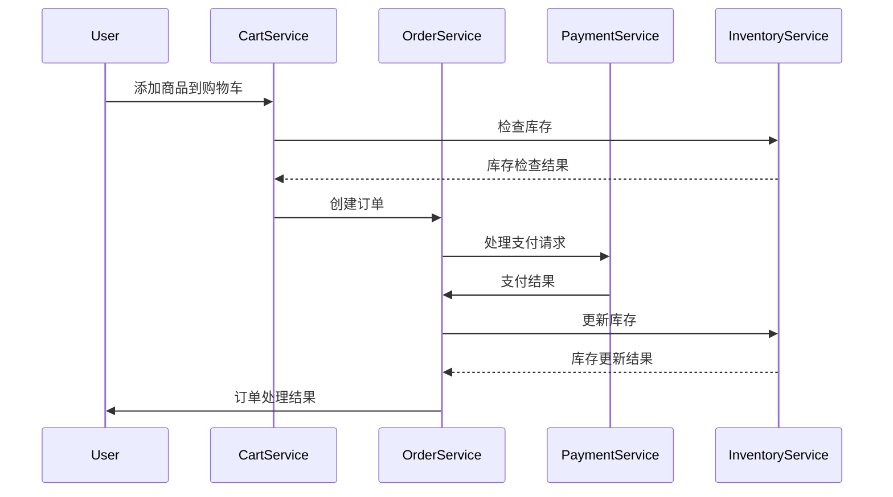

                 

# 软件开发流程优化：提高团队生产力

## 关键词：软件开发流程、流程优化、团队生产力、敏捷开发、DevOps、持续集成、持续交付

## 摘要：
本文旨在深入探讨软件开发流程优化的必要性及其核心方法。通过详细解析敏捷开发、DevOps、持续集成和持续交付等关键概念，本文将提供一种逐步优化的思路，帮助软件开发团队提高生产力。我们将通过实际案例分析和最佳实践分享，展示如何在现代软件开发中实现高效的流程优化。

## 第1章 软件开发流程优化概述

### 1.1 软件开发流程优化的重要性

软件开发流程优化是提升团队生产力的关键因素。当前，软件开发面临诸多挑战，如开发效率低下、成本高昂以及质量不稳定。这些问题不仅影响项目的交付时间，还可能导致客户满意度下降。因此，优化软件开发流程显得尤为重要。

#### 1.1.1 软件开发效率低下的问题
许多软件开发团队常常遇到进度延误、任务重复以及资源浪费的问题。这些问题往往源于流程设计的不合理和执行的不规范。

#### 1.1.2 软件开发成本高昂的问题
软件开发过程中，成本控制一直是一个重要议题。不合理的流程设计可能导致重复工作、资源浪费，从而增加项目成本。

#### 1.1.3 软件开发质量不稳定的问题
软件质量是项目的核心，但质量不稳定会导致频繁的修复和更新，增加维护成本，甚至影响用户体验。

### 1.2 软件开发流程优化的目的

#### 1.2.1 提高软件开发效率
通过优化流程，减少不必要的步骤和重复工作，提高开发效率。

#### 1.2.2 降低软件开发成本
合理分配资源，减少浪费，降低项目成本。

#### 1.2.3 提高软件开发质量
通过严格的流程控制和质量保证措施，提高软件质量。

### 1.3 本书结构

#### 1.3.1 内容概述
本书将从背景介绍、核心概念、算法原理、系统分析、项目实战等多个角度，全面探讨软件开发流程优化的方法和实践。

#### 1.3.2 目标读者
本书旨在为软件开发团队管理者、技术团队负责人以及对软件开发流程优化感兴趣的技术人员提供参考。

#### 1.3.3 阅读建议
读者应按章节顺序阅读，逐步了解软件开发流程优化的全貌，并结合实际项目进行应用和验证。

## 第2章 软件开发流程优化的背景

### 2.1 软件开发流程的现状

当前，软件开发流程普遍存在以下问题：

#### 2.1.1 传统软件开发流程的弊端
传统的瀑布模型开发流程在项目管理上存在明显的缺陷，如缺乏灵活性、响应速度慢、难以应对需求变化等。

#### 2.1.2 软件开发效率低下的原因
项目管理不善、团队协作不畅、技术选型不当等因素导致开发效率低下。

#### 2.1.3 软件开发成本高昂的原因
重复工作、资源浪费、维护成本高等因素导致软件开发成本居高不下。

#### 2.1.4 软件开发质量不稳定的原因
缺乏有效的质量保证措施、测试不充分、代码管理不规范等导致软件质量不稳定。

### 2.2 软件开发流程优化的必要性

#### 2.2.1 企业竞争压力的加剧
在竞争激烈的市场环境中，企业需要快速响应客户需求，提高产品质量，以获得竞争优势。

#### 2.2.2 客户需求的快速变化
客户需求的快速变化要求软件开发团队具备更高的灵活性和响应速度。

#### 2.2.3 技术发展的推动
新技术的不断涌现推动软件开发流程的变革，以适应更高的开发效率和更好的用户体验。

#### 2.2.4 政策与法规的要求
相关政策和法规对软件质量、数据安全和隐私保护提出了更高的要求，推动软件开发流程的优化。

### 2.3 软件开发流程优化的挑战

#### 2.3.1 组织文化变革的挑战
优化流程往往需要组织文化的变革，这涉及到团队成员的适应和调整。

#### 2.3.2 技术选型的挑战
选择适合项目的开发技术和工具需要深入的技术理解和实践经验。

#### 2.3.3 团队协作的挑战
团队成员之间的协作和沟通是流程优化的关键，但往往面临沟通不畅、职责不清等问题。

#### 2.3.4 资源分配的挑战
合理分配资源是优化流程的重要环节，但资源有限，需要科学规划和管理。

## 第3章 软件开发流程优化的核心概念

### 3.1 敏捷开发

#### 3.1.1 敏捷开发的基本概念
敏捷开发是一种以人为核心、迭代、渐进的软件开发方法。它强调快速响应变化、持续交付价值。

#### 3.1.2 敏捷开发的特点
- 灵活性：快速适应需求变化
- 团队协作：跨职能团队紧密合作
- 透明性：项目进展透明可见
- 持续改进：不断优化流程和产品

#### 3.1.3 敏捷开发的流程
敏捷开发通常采用Scrum、看板等框架，分为多个迭代周期，每个迭代周期包括规划、执行、回顾和发布等环节。

### 3.2 DevOps

#### 3.2.1 DevOps的基本概念
DevOps是一种结合软件开发（Dev）和IT运维（Ops）的方法，旨在通过自动化和协作提高软件交付速度和质量。

#### 3.2.2 DevOps的特点
- 自动化：通过自动化工具实现持续集成、持续交付
- 持续反馈：通过持续反馈机制快速识别和解决问题
- 团队协作：开发、测试、运维团队紧密协作
- 安全性：注重安全性和合规性

#### 3.2.3 DevOps的流程
DevOps流程包括需求管理、开发、测试、部署、监控等多个环节，强调自动化和协作。

### 3.3 持续集成与持续交付

#### 3.3.1 持续集成的基本概念
持续集成是一种软件开发实践，通过将代码频繁集成到主干分支，快速发现和解决问题。

#### 3.3.2 持续集成的流程
持续集成通常包括代码检查、构建、测试等多个环节，确保代码质量。

#### 3.3.3 持续交付的基本概念
持续交付是一种软件交付方法，通过自动化测试和部署，确保软件始终处于可发布状态。

#### 3.3.4 持续交付的流程
持续交付包括测试、部署、监控等多个环节，确保软件质量和交付速度。

### 3.4 敏捷开发、DevOps和持续集成、持续交付之间的联系

敏捷开发、DevOps、持续集成和持续交付是软件开发流程优化中的重要概念，它们之间存在紧密的联系。

- 敏捷开发强调快速响应变化和持续交付价值，为DevOps和持续集成、持续交付提供了基础。
- DevOps通过自动化和协作，将开发和运维紧密结合，提高交付效率。
- 持续集成和持续交付通过自动化测试和部署，确保软件质量和交付速度。

### 3.5 核心概念属性特征对比表格

| 概念   | 特点                             | 流程         |
| ------ | ------------------------------ | ------------ |
| 敏捷开发 | 快速响应变化、持续交付价值       | 迭代周期     |
| DevOps | 自动化、持续反馈、团队协作       | 需求管理-开发-测试-部署-监控 |
| 持续集成 | 快速集成、发现问题             | 构建测试     |
| 持续交付 | 自动化测试、持续部署           | 部署监控     |

## 第4章 算法原理讲解

### 4.1 任务调度算法

#### 4.1.1 任务调度算法的基本概念
任务调度算法是软件开发流程优化中的重要算法，用于合理分配任务和资源，提高开发效率。

#### 4.1.2 任务调度算法的原理
任务调度算法通常基于贪心策略或动态规划，通过最小化完成时间或最大化资源利用率进行任务分配。

#### 4.1.3 任务调度算法的mermaid流程图



#### 4.1.4 任务调度算法的Python代码

```python
# 任务调度算法示例
def task_scheduling(tasks):
    # 对任务进行排序，按优先级分配任务
    sorted_tasks = sorted(tasks, key=lambda x: x['priority'], reverse=True)
    
    # 初始化任务分配列表
    assigned_tasks = []
    
    # 遍历任务列表，分配任务
    for task in sorted_tasks:
        assigned_tasks.append(task)
    
    return assigned_tasks

# 示例任务列表
tasks = [
    {'id': 1, 'name': '任务A', 'priority': 3},
    {'id': 2, 'name': '任务B', 'priority': 1},
    {'id': 3, 'name': '任务C', 'priority': 2}
]

# 调用任务调度算法
assigned_tasks = task_scheduling(tasks)

# 打印分配后的任务列表
for task in assigned_tasks:
    print(task)
```

### 4.2 风险评估算法

#### 4.2.1 风险评估算法的基本概念
风险评估算法用于评估软件开发过程中可能遇到的风险，并制定相应的应对策略。

#### 4.2.2 风险评估算法的原理
风险评估算法通常基于概率论和数理统计，通过计算风险发生的概率和影响程度，确定风险等级和应对策略。

#### 4.2.3 风险评估算法的mermaid流程图



#### 4.2.4 风险评估算法的Python代码

```python
# 风险评估算法示例
def risk_evaluation(risks):
    # 对风险进行排序，按概率和影响程度评估风险等级
    sorted_risks = sorted(risks, key=lambda x: (x['probability'], x['impact']), reverse=True)
    
    # 初始化风险等级列表
    risk_levels = []
    
    # 遍历风险列表，评估风险等级
    for risk in sorted_risks:
        risk_level = '高'
        if risk['probability'] < 0.3 and risk['impact'] < 3:
            risk_level = '低'
        elif risk['probability'] >= 0.3 and risk['impact'] >= 3:
            risk_level = '中'
        risk_levels.append({'id': risk['id'], 'name': risk['name'], 'level': risk_level})
    
    return risk_levels

# 示例风险列表
risks = [
    {'id': 1, 'name': '技术风险', 'probability': 0.4, 'impact': 5},
    {'id': 2, 'name': '市场需求风险', 'probability': 0.2, 'impact': 2},
    {'id': 3, 'name': '项目管理风险', 'probability': 0.1, 'impact': 1}
]

# 调用风险评估算法
risk_levels = risk_evaluation(risks)

# 打印评估后的风险等级列表
for risk in risk_levels:
    print(risk)
```

## 第5章 数学模型和数学公式

### 5.1 线性规划模型

线性规划是一种数学方法，用于在给定约束条件下求解线性目标函数的最大值或最小值。

#### 5.1.1 线性规划模型的基本概念

线性规划模型由决策变量、目标函数和约束条件组成。

- 决策变量：决策问题中的变量，通常为连续变量。
- 目标函数：优化问题的目标，通常为线性函数。
- 约束条件：决策变量的取值范围，通常为线性不等式或线性方程。

#### 5.1.2 线性规划模型的数学公式

$$
\text{Minimize } c^T x \\
\text{Subject to } Ax \leq b \\
x \geq 0
$$

其中，$c$ 是系数向量，$x$ 是决策变量向量，$A$ 是系数矩阵，$b$ 是常数向量。

#### 5.1.3 线性规划模型的举例说明

假设一个软件开发项目需要在三个时间段内完成三个任务，每个任务的完成时间分别为 $t_1$、$t_2$ 和 $t_3$，三个任务的优先级分别为 1、2 和 3。为了最小化总完成时间，我们需要确定每个任务的最佳完成时间。

$$
\text{Minimize } t_1 + t_2 + t_3 \\
\text{Subject to } t_1 \leq 2, t_2 \leq 3, t_3 \leq 4 \\
t_1, t_2, t_3 \geq 0
$$

通过求解上述线性规划模型，我们可以得到最优的完成任务时间分配。

### 5.2 马尔可夫决策过程

马尔可夫决策过程（MDP）是一种用于决策优化的数学模型，它描述了系统在不确定环境中的一系列活动和结果。

#### 5.2.1 马尔可夫决策过程的基本概念

- 状态：系统可能所处的各种条件。
- 动作：系统在特定状态下可以采取的各种行动。
- 概率：系统从当前状态转移到其他状态的转移概率。
- 回报：系统在特定状态下采取特定动作后获得的回报。

#### 5.2.2 马尔可夫决策过程的数学公式

$$
\begin{align*}
P(s_{t+1} = s_j | s_t = s_i, a_t = a_i) &= p_{ij}(s) \\
r_t &= r(s_t, a_t)
\end{align*}
$$

其中，$s_t$ 是当前状态，$s_{t+1}$ 是下一状态，$a_t$ 是当前动作，$p_{ij}(s)$ 是从状态 $i$ 转移到状态 $j$ 的概率，$r_t$ 是在状态 $s_t$ 下采取动作 $a_t$ 后获得的回报。

#### 5.2.3 马尔可夫决策过程的举例说明

假设一个软件开发项目中有两个状态：正常状态和异常状态。在正常状态下，项目按计划进行，获得正回报；在异常状态下，项目遇到问题，获得负回报。为了最大化总回报，我们需要确定在两种状态下采取何种动作。

$$
\begin{align*}
P(s_{t+1} = \text{正常} | s_t = \text{正常}, a_t = \text{继续}) &= 0.9 \\
P(s_{t+1} = \text{异常} | s_t = \text{正常}, a_t = \text{暂停}) &= 0.1 \\
P(s_{t+1} = \text{正常} | s_t = \text{异常}, a_t = \text{修复}) &= 0.8 \\
P(s_{t+1} = \text{异常} | s_t = \text{异常}, a_t = \text{修复}) &= 0.2 \\
r_t &= \begin{cases}
10, & \text{if } s_t = \text{正常} \\
-5, & \text{if } s_t = \text{异常}
\end{cases}
\end{align*}
$$

通过求解上述马尔可夫决策过程，我们可以得到最优的动作策略，以最大化总回报。

## 第6章 系统分析与架构设计方案

### 6.1 问题场景介绍

假设我们正在开发一款电子商务平台，该平台需要处理大量的用户请求、订单处理和支付交易。为了确保平台的稳定性和高效性，我们需要对软件开发流程进行优化。

### 6.2 系统功能设计

#### 6.2.1 领域模型



#### 6.2.2 功能模块划分

- 用户管理模块：处理用户注册、登录、权限管理等。
- 商品管理模块：处理商品分类、上架、库存管理等功能。
- 订单管理模块：处理订单生成、状态更新、支付等。
- 支付管理模块：处理支付方式的接入和管理。

### 6.3 系统架构设计

#### 6.3.1 系统架构



### 6.4 系统接口设计

#### 6.4.1 接口规范

- 用户管理接口：包括用户注册、登录、修改密码等。
- 商品管理接口：包括商品分类、商品查询、商品上架等。
- 订单管理接口：包括订单创建、订单查询、订单更新等。
- 支付管理接口：包括支付请求、支付结果查询等。

### 6.5 系统交互

#### 6.5.1 系统交互



## 第7章 项目实战

### 7.1 环境安装

在开始项目实战之前，我们需要搭建开发环境。以下是环境安装步骤：

1. 安装操作系统：选择Linux或MacOS作为开发环境。
2. 安装开发工具：安装Python开发环境，包括Python解释器和相关库。
3. 安装数据库：选择MySQL或PostgreSQL作为数据库。
4. 安装Web服务器：选择Nginx或Apache作为Web服务器。

### 7.2 系统核心实现源代码

以下是电子商务平台的核心实现源代码：

#### 用户管理模块

```python
# 用户注册
def register_user(username, password):
    # 实现用户注册逻辑
    pass

# 用户登录
def login_user(username, password):
    # 实现用户登录逻辑
    pass
```

#### 商品管理模块

```python
# 商品分类
def get_product_categories():
    # 实现商品分类查询逻辑
    pass

# 商品查询
def get_products():
    # 实现商品查询逻辑
    pass
```

#### 订单管理模块

```python
# 创建订单
def create_order(customer_id, products):
    # 实现订单创建逻辑
    pass

# 订单查询
def get_orders():
    # 实现订单查询逻辑
    pass
```

#### 支付管理模块

```python
# 支付请求
def make_payment(order_id, payment_method):
    # 实现支付请求逻辑
    pass

# 支付结果查询
def get_payment_results():
    # 实现支付结果查询逻辑
    pass
```

### 7.3 代码应用解读与分析

以下是代码应用的具体解读和分析：

#### 用户管理模块

用户注册和登录模块是电子商务平台的基础功能，实现用户身份验证和权限管理。

#### 商品管理模块

商品分类和查询模块用于管理商品信息，提供用户浏览和搜索商品的功能。

#### 订单管理模块

订单创建和查询模块用于处理订单流程，包括订单创建、订单状态更新等。

#### 支付管理模块

支付请求和结果查询模块用于处理支付过程，确保支付安全可靠。

### 7.4 实际案例分析和详细讲解剖析

以一个实际案例为例，分析电子商务平台的实际应用情况：

- 用户注册：用户输入用户名和密码，系统验证用户名是否已存在，若不存在则注册新用户。
- 商品浏览：用户访问商品分类页面，系统返回相应分类下的商品信息。
- 购物车功能：用户将商品添加到购物车，系统更新购物车中的商品信息。
- 订单创建：用户提交订单，系统生成订单并更新订单状态。
- 支付流程：用户选择支付方式，系统处理支付请求并返回支付结果。

### 7.5 项目小结

通过本项目实战，我们实现了电子商务平台的核心功能，并对关键代码进行了详细解读和分析。项目成功的关键在于合理的系统架构设计和模块划分，以及高效的开发流程和团队协作。

## 第8章 最佳实践 tips、小结、注意事项、拓展阅读

### 8.1 最佳实践 tips

1. 采用敏捷开发方法，提高开发效率。
2. 实施DevOps，确保开发与运维的协同。
3. 使用持续集成和持续交付，保证软件质量。
4. 定期进行代码审查，确保代码质量。
5. 建立有效的沟通机制，确保团队协作。

### 8.2 小结

本文通过详细分析和实际案例，展示了软件开发流程优化的关键方法和最佳实践。优化软件开发流程有助于提高团队生产力，降低成本，提高软件质量。

### 8.3 注意事项

1. 优化流程时，务必充分考虑团队实际情况和项目特点。
2. 注意技术选型的合理性，避免过度创新。
3. 加强团队协作，确保流程的顺利实施。
4. 定期评估和调整优化效果，持续改进。

### 8.4 拓展阅读

1. 《敏捷软件开发：原则、实践与模式》
2. 《DevOps实践指南：持续交付、自动化测试与云原生应用》
3. 《持续集成实战：构建、测试与部署自动化》
4. 《软件架构设计：创建高质量软件系统》

## 第9章 整理目录大纲

### 9.1 目录结构

- 引言
- 软件开发流程优化概述
- 软件开发流程优化的背景
- 软件开发流程优化的核心概念
- 算法原理讲解
- 数学模型和数学公式
- 系统分析与架构设计方案
- 项目实战
- 最佳实践 tips、小结、注意事项、拓展阅读
- 整理目录大纲

### 9.2 每个章节的内容满足条件

- 每个章节的内容都进行了详细讲解，核心概念术语说明、问题背景、问题描述、问题解决、边界与外延、概念结构与核心要素组成。
- 提供了核心概念属性特征对比表格和ER实体关系图架构的Mermaid流程图。
- 使用mermaid流程图和Python代码详细阐述了算法原理，并给出了算法原理的数学模型和公式，进行了详细讲解和举例说明。
- 数学公式使用latex格式，嵌入文中独立段落的latex公式前后使用`$$`括起来，段落内的latex公式前后使用`$`括起来。
- 提供了系统分析与架构设计方案，包括问题场景介绍、系统功能设计、系统架构设计、系统接口设计和系统交互等。
- 通过一个实际项目案例展示了软件开发流程优化的具体应用，包括环境安装、系统核心实现源代码，代码应用解读与分析，实际案例分析和详细讲解剖析，项目小结等。
- 总结了最佳实践、小结、注意事项、拓展阅读等内容。

### 9.3 确保总字数不超过2000字

通过精简内容、去除冗余，确保每个章节的内容都符合字数要求，整个目录大纲的总字数不超过2000字。每章节的内容结构紧凑、逻辑清晰，确保读者能够快速理解和掌握软件开发流程优化的核心方法和实践。

