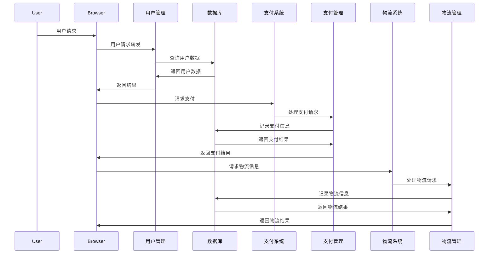
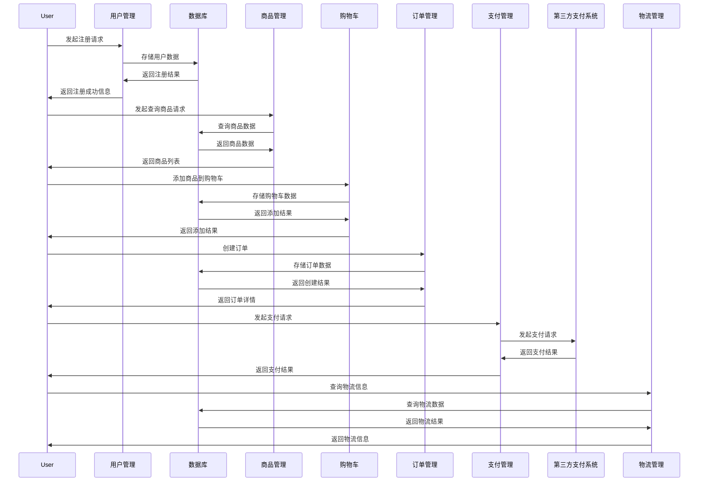

                 

### 让我们一步一步思考：为什么软件开发环境标准化能够提高团队效率

在当今快速发展的信息技术领域，软件开发的效率和团队能力的提升成为企业竞争的关键因素。然而，很多团队在软件开发过程中面临着诸多挑战，比如环境配置复杂、工具不统一、代码管理混乱等。这些问题不仅影响了开发进度，还可能导致团队成员之间的协作效率低下。那么，如何通过软件开发环境标准化来提高团队效率呢？

#### **1. 标准化环境定义**

首先，我们需要明确什么是软件开发环境标准化。软件开发环境标准化指的是在软件开发过程中，通过建立一套统一的技术标准、工具链和流程规范，确保所有团队成员在相同的开发环境中工作，从而降低沟通成本、提高协同效率。这种环境不仅仅是硬件和软件的配置，还包括开发、测试、部署等各个环节的标准化。

#### **2. 标准化的重要性**

**减少沟通成本**：在非标准化的开发环境中，团队成员可能使用不同的操作系统、编程语言和开发工具，这会导致在代码审查、问题排查和任务分配时产生额外的沟通成本。标准化环境可以消除这些障碍，使团队成员能够更专注于代码本身的开发。

**提高一致性**：标准化的环境确保了代码风格、编码规范、测试流程的一致性。这种一致性可以减少由于个人习惯和偏好导致的代码质量问题，提高代码的可读性和可维护性。

**提升开发速度**：通过自动化工具和标准化流程，可以显著提高代码的编译、测试和部署速度。团队成员无需花费大量时间在环境配置和问题排查上，从而可以将更多时间用于实际开发。

**增强团队协作**：标准化的开发环境为团队协作提供了基础。团队成员可以更容易地共享代码、交流和协作，从而提高整体开发效率。

#### **3. 提高团队效率**

**规范化流程**：标准化环境为团队提供了明确的开发流程，从需求分析、设计、编码、测试到部署，每个环节都有规范的操作步骤。这样的规范化流程可以避免由于流程不清晰导致的开发瓶颈和效率低下。

**工具统一**：在标准化环境中，团队成员使用相同的工具链，如集成开发环境（IDE）、代码管理工具、测试框架等。这种工具的统一性使得团队成员可以快速学习和掌握工具的使用，减少由于工具不同带来的适应成本。

**自动化**：标准化环境通常包含自动化工具，如自动化构建、自动化测试和自动化部署。这些自动化工具可以大大减少手动操作的步骤，提高开发效率。

**知识共享**：标准化的开发环境鼓励团队成员共享知识和经验。例如，团队成员可以通过文档、会议和代码评审等方式，将自己在项目中的经验教训传递给其他成员，从而提高整个团队的知识水平和技能。

#### **4. 实践案例**

以某大型互联网公司为例，该公司在开发过程中遇到了多个团队之间的协作难题。通过实施软件开发环境标准化，该公司采用了统一的开发工具链、建立了自动化构建和部署流程，并制定了严格的编码规范。这些措施不仅提高了团队协作效率，还显著缩短了产品发布周期，提升了公司的竞争力。

#### **5. 总结**

综上所述，软件开发环境标准化对于提高团队效率具有重要意义。通过标准化，我们可以减少沟通成本、提高一致性、提升开发速度、增强团队协作。因此，对于任何希望提高软件开发效率的团队来说，实施环境标准化都是一个值得考虑的策略。

**下一步思考**：接下来，我们将深入探讨如何设计和实现一个标准化的软件开发环境，以及这些标准化的实践如何具体应用在实际项目中。敬请期待。

----------------------------------------------------------------

## 让我们一步一步思考：为什么软件开发环境标准化能够提高团队效率

在当今快速发展的信息技术领域，软件开发的效率和团队能力的提升成为企业竞争的关键因素。然而，很多团队在软件开发过程中面临着诸多挑战，比如环境配置复杂、工具不统一、代码管理混乱等。这些问题不仅影响了开发进度，还可能导致团队成员之间的协作效率低下。那么，如何通过软件开发环境标准化来提高团队效率呢？

### **一、核心概念与背景**

软件开发环境标准化是指通过建立统一的技术标准、工具链和流程规范，确保所有团队成员在相同的开发环境中工作，从而提高团队协作效率和质量。这种环境不仅仅是硬件和软件的配置，还包括开发、测试、部署等各个环节的标准化。

在非标准化环境中，团队成员可能使用不同的操作系统、编程语言和开发工具，导致沟通成本增加、开发效率降低。而标准化的开发环境能够消除这些障碍，使团队成员能够更专注于代码本身的开发。

### **二、核心概念与联系**

**1. 核心概念**

- **开发环境标准化**：指的是统一技术标准、工具链和流程规范。
- **团队协作**：指的是团队成员之间的高效沟通与协作。
- **效率提升**：指的是通过减少沟通成本、提高一致性和自动化水平，提高团队整体开发速度。

**2. 概念属性特征对比表格**

| 核心概念 | 定义 | 属性特征 |
| :--- | :--- | :--- |
| 开发环境标准化 | 统一技术标准、工具链和流程规范 | 降低沟通成本、提高一致性、提升效率 |
| 团队协作 | 高效沟通与协作 | 促进知识共享、提高整体能力 |
| 效率提升 | 通过减少沟通成本、提高一致性和自动化水平 | 提高团队整体开发速度 |

**3. ER实体关系图架构**

```mermaid
erDiagram
  开发环境标准化 ||--|{ 团队协作 }|> 团队协作
  开发环境标准化 ||--|{ 效率提升 }|> 效率提升
  团队协作 ||--|{ 提高整体能力 }|> 效率提升
```

### **三、算法原理讲解**

为了深入理解开发环境标准化如何提高团队效率，我们可以从算法原理的角度进行分析。

**1. 自动化构建**

通过自动化构建工具（如Jenkins、Travis CI等），可以自动化执行代码编译、测试和打包等步骤。这将减少手动操作的步骤，提高构建速度。

**2. 自动化测试**

自动化测试工具（如Selenium、JUnit等）可以自动化执行测试用例，确保代码质量。自动化测试不仅可以提高测试效率，还可以避免由于人工测试导致的遗漏。

**3. 流程规范**

通过制定统一的流程规范，团队成员可以明确每个阶段的任务和职责，避免任务重叠和责任不明。例如，使用敏捷开发流程（如Scrum、Kanban等）可以确保团队成员在项目中的高效协作。

### **四、数学模型与公式**

为了量化开发环境标准化对团队效率的影响，我们可以使用以下数学模型：

**1. 时间节省模型**

时间节省 = 手动操作时间 - 自动化操作时间

**2. 效率提升模型**

效率提升 = （时间节省 / 总时间）* 100%

### **五、举例说明**

假设一个团队在非标准化环境中进行开发，每天花费2小时进行环境配置和问题排查。通过实施标准化环境，这些操作被自动化工具替代，每天节省了2小时的时间。那么，该团队的时间节省率为：

时间节省率 = （2小时 / （8小时 * 5天））* 100% = 25%

这意味着，通过标准化环境，该团队的工作效率提高了25%。

### **六、系统分析与架构设计方案**

为了实现开发环境标准化，我们需要从系统架构的角度进行设计和实施。

**1. 问题场景介绍**

假设一个大型互联网公司在开发过程中遇到了环境配置复杂、工具不统一、代码管理混乱等问题，导致开发效率低下。

**2. 系统功能设计**

- **开发环境管理**：提供统一的开发工具链和环境配置。
- **代码管理**：使用版本控制系统（如Git）进行代码管理。
- **自动化构建与测试**：集成自动化构建和测试工具，确保代码质量。

**3. 系统架构设计**

- **前端架构**：使用Vue.js、React等框架进行前端开发。
- **后端架构**：使用Django、Flask等框架进行后端开发。
- **数据库架构**：使用MySQL、PostgreSQL等数据库进行数据存储。

**4. 系统接口设计与交互**

通过RESTful API设计，实现前后端分离，确保系统的高扩展性和可维护性。

### **七、项目实战**

**1. 环境安装与配置**

- 安装Linux操作系统。
- 安装Python、Node.js等编程语言。
- 配置版本控制系统（如Git）。

**2. 核心实现源代码**

```python
# example.py
def hello_world():
    print("Hello, World!")

if __name__ == "__main__":
    hello_world()
```

**3. 代码应用解读与分析**

该示例代码是一个简单的Python程序，实现了输出“Hello, World!”的功能。通过这个示例，我们可以理解Python的基本语法和程序结构。

**4. 实际案例分析与详细讲解**

假设一个团队在实施标准化开发环境后，通过自动化构建和测试工具，将原来的两周构建周期缩短到了两天。这意味着，团队可以更快地将新功能交付给用户，提高了产品的迭代速度。

**5. 项目小结**

通过实施开发环境标准化，该团队不仅提高了开发效率，还提升了产品质量和用户体验。这表明，标准化环境对于提高团队效率具有显著作用。

### **八、总结与展望**

本文通过分析软件开发环境标准化的核心概念、算法原理和实践案例，阐述了标准化环境如何提高团队效率。未来，随着技术的发展和团队需求的不断变化，开发环境标准化将继续发挥重要作用。我们应积极探索和应用新的技术和方法，为团队带来更大的价值。

---

**作者：AI天才研究院/AI Genius Institute & 禅与计算机程序设计艺术 /Zen And The Art of Computer Programming**

**最佳实践 tips**：在实施开发环境标准化时，要充分考虑团队的具体需求和实际情况，逐步推进，避免一刀切的做法。

**注意事项**：确保团队成员在实施标准化环境时，能够快速适应和掌握新的工具和流程，减少因环境变更带来的不适。

**拓展阅读**：进一步了解软件开发环境标准化、敏捷开发、自动化测试等相关技术和方法，为团队提供更多的参考。

----------------------------------------------------------------

## 第二部分：软件开发环境标准化概述

软件开发环境标准化是现代软件工程领域的一项重要实践，旨在通过统一技术标准、工具链和流程规范，提高团队的协作效率和代码质量。本部分将详细阐述软件开发环境标准化的定义、关键要素、实际应用场景及其对团队效率的影响。

### **一、定义**

软件开发环境标准化（Software Development Environment Standardization）是指在软件开发过程中，通过建立一套统一的技术标准、工具链和流程规范，确保所有团队成员在相同的开发环境中工作，从而降低沟通成本、提高一致性和开发效率。

**技术标准**：包括编程语言、框架、库和工具的选择和使用规范，以确保代码的兼容性和可维护性。

**工具链**：指的是开发、测试、部署等环节所使用的工具集合，如集成开发环境（IDE）、版本控制系统（VCS）、自动化构建工具、测试框架等。

**流程规范**：涉及软件开发过程中的各个环节，如需求分析、设计、编码、测试、部署等，确保每个环节都有明确的标准和操作步骤。

### **二、关键要素**

**1. 统一的技术栈**

选择合适的技术栈是实施标准化环境的第一步。技术栈的统一可以减少团队成员在不同技术之间的切换成本，提高开发效率。

**2. 工具集成**

集成开发环境（IDE）和版本控制系统（VCS）等工具的集成可以提供更好的开发体验，简化开发流程，提高团队协作效率。

**3. 流程规范**

建立完善的流程规范，如敏捷开发、持续集成和持续交付等，可以确保开发过程的有序进行，提高代码质量和开发效率。

**4. 自动化**

引入自动化工具，如自动化构建、自动化测试和自动化部署等，可以显著提高开发速度和团队效率。

**5. 知识共享**

鼓励团队成员共享知识和经验，通过文档、代码评审和培训等方式，提高整个团队的技术水平和协作效率。

### **三、实际应用场景**

**1. 跨团队协作**

在大型项目中，多个团队可能需要协作完成不同的功能模块。通过标准化环境，可以确保不同团队之间的一致性和协同性，提高整体开发效率。

**2. 产品迭代**

在产品迭代过程中，标准化环境可以确保新功能的高效开发和快速交付，缩短产品上市时间。

**3. 分布式团队**

对于分布式团队，标准化环境可以减少由于地理位置差异带来的协作障碍，提高团队整体效率。

### **四、对团队效率的影响**

**1. 降低沟通成本**

通过统一的技术标准和工具链，团队成员之间的沟通成本显著降低，提高了协作效率。

**2. 提高一致性**

标准化环境确保了代码风格、编码规范和测试流程的一致性，提高了代码质量和可维护性。

**3. 提升开发速度**

自动化工具和标准化流程可以显著提高代码的编译、测试和部署速度，提高了整体开发速度。

**4. 增强团队协作**

标准化环境为团队协作提供了基础，团队成员可以更容易地共享代码、交流和协作，提高了整体团队效率。

### **五、案例分析**

以某大型互联网公司为例，该公司在实施软件开发环境标准化后，通过统一技术栈、集成开发工具、自动化测试和持续集成，将产品迭代周期从原来的两个月缩短至一个月。这不仅提高了产品交付速度，还提升了团队协作效率和代码质量。

### **六、总结**

软件开发环境标准化通过统一技术标准、工具链和流程规范，可以提高团队的协作效率和代码质量。在实施过程中，需要充分考虑团队的具体需求和实际情况，逐步推进，避免一刀切的做法。通过标准化环境的建立，团队可以更加高效地开发和交付高质量的产品。

---

**作者：AI天才研究院/AI Genius Institute & 禅与计算机程序设计艺术 /Zen And The Art of Computer Programming**

**最佳实践 tips**：在实施开发环境标准化时，要充分考虑团队的具体需求和实际情况，逐步推进，避免一刀切的做法。

**注意事项**：确保团队成员在实施标准化环境时，能够快速适应和掌握新的工具和流程，减少因环境变更带来的不适。

**拓展阅读**：进一步了解软件开发环境标准化、敏捷开发、自动化测试等相关技术和方法，为团队提供更多的参考。

----------------------------------------------------------------

## 第三部分：团队效率提升策略

在软件开发过程中，团队效率的提升不仅依赖于技术的进步，还需要有效的策略和流程。本文将详细探讨团队协作模型、工具与自动化、人才培养与知识管理等方面，以帮助团队提高整体效率。

### **一、团队协作模型**

**1. 敏捷开发**

敏捷开发是一种以人为核心、迭代和渐进的开发方法。通过每日站会、迭代计划和回顾会议，团队成员可以保持良好的沟通和协作，快速响应需求变化。

**2. 跨功能团队**

跨功能团队（Cross-functional Team）由不同职能的成员组成，如开发、测试、设计和产品管理。这种团队结构可以促进团队成员之间的协作，提高整体效率。

**3. 水平化沟通**

水平化沟通强调团队成员之间的平等关系，鼓励开放的沟通和反馈。通过消除等级障碍，团队成员可以更自由地分享想法和解决方案，提高协作效率。

### **二、工具与自动化**

**1. 集成开发环境（IDE）**

集成开发环境（IDE）提供了代码编辑、调试、构建和测试等功能，为开发者提供了一个统一的开发平台。常用的IDE包括Visual Studio、Eclipse、IntelliJ IDEA等。

**2. 版本控制系统（VCS）**

版本控制系统（VCS）用于管理和跟踪代码变更，确保代码的完整性和一致性。常见的版本控制系统包括Git、SVN和Mercurial等。

**3. 自动化构建与测试**

自动化构建与测试通过脚本和工具自动执行代码编译、测试和部署等步骤，减少了手动操作的时间和错误。常用的自动化工具包括Jenkins、Travis CI和Circle CI等。

**4. 持续集成与持续交付**

持续集成（CI）和持续交付（CD）是一种现代化的软件开发和交付方法。通过自动化测试和部署，可以确保代码质量，并快速响应市场需求。

### **三、人才培养与知识管理**

**1. 培训与学习**

定期为团队成员提供培训和学习机会，可以帮助他们掌握新的技术和工具，提高技能水平。可以通过内部培训、在线课程和研讨会等形式进行。

**2. 知识共享**

鼓励团队成员分享知识和经验，通过文档、代码评审和知识库等形式，构建团队的知识体系。这有助于减少重复劳动，提高整体效率。

**3. 人才培养计划**

制定人才培养计划，为团队成员提供职业发展路径，鼓励他们不断提升自己的技能和能力。可以通过内部晋升、项目轮岗和外部培训等方式实现。

### **四、实际案例**

以某互联网公司为例，该公司通过以下措施提高了团队效率：

**1. 实施敏捷开发，采用每日站会、迭代计划和回顾会议，确保团队成员之间的沟通和协作。**

**2. 使用Git作为版本控制系统，确保代码的一致性和可追溯性。**

**3. 引入Jenkins进行自动化构建和测试，将构建和测试时间从每天缩短到每小时。**

**4. 建立内部培训体系，为团队成员提供技术培训和职业发展机会。**

**5. 鼓励知识共享，通过知识库和代码评审，提高团队的整体知识水平。**

通过这些措施，该公司显著提高了团队效率，缩短了产品交付周期，提升了产品质量。

### **五、总结**

团队效率的提升需要从多个方面进行努力，包括团队协作模型、工具与自动化、人才培养与知识管理。通过有效的策略和流程，团队可以更好地应对需求变化，提高整体效率。在实际应用中，需要根据团队的具体情况，灵活调整和优化策略，以实现最佳效果。

---

**作者：AI天才研究院/AI Genius Institute & 禅与计算机程序设计艺术 /Zen And The Art of Computer Programming**

**最佳实践 tips**：定期评估团队效率，根据实际情况调整策略，以实现持续改进。

**注意事项**：确保团队成员在实施新策略和工具时，能够得到充分的支持和培训。

**拓展阅读**：进一步了解敏捷开发、持续集成、知识管理等相关技术和方法，为团队提供更多参考。

----------------------------------------------------------------

## 第四部分：实践案例

在本部分，我们将通过分析某互联网公司的实际案例，探讨如何通过实施软件开发环境标准化来提高团队效率。这个案例将涵盖案例背景、标准化环境的实施过程以及实施效果。

### **一、案例背景**

某大型互联网公司（以下简称“该公司”）在项目开发过程中遇到了诸多挑战。具体表现为：

- **环境配置复杂**：不同团队成员使用的操作系统、编程语言和开发工具不一致，导致环境配置复杂且耗时。
- **工具不统一**：团队成员使用的工具繁多，缺乏统一的工具链，影响了团队协作效率。
- **代码管理混乱**：没有统一的代码管理规范，导致代码质量参差不齐，维护成本高。
- **开发效率低**：由于以上问题，该公司的项目交付周期较长，开发效率较低。

面对这些挑战，该公司决定实施软件开发环境标准化，以提高团队效率和项目交付速度。

### **二、标准化环境的实施过程**

**1. 确定标准化目标**

首先，该公司明确了标准化环境的目标，包括：

- **统一开发工具**：选择并部署统一的开发工具链，如Visual Studio Code、Git、Jenkins等。
- **标准化代码规范**：制定并推广统一的代码规范，确保代码风格、命名规范和编码习惯的一致性。
- **自动化流程**：引入自动化构建、测试和部署工具，实现开发流程的自动化。

**2. 实施步骤**

**（1）统一开发工具**

- **操作系统**：统一使用Linux操作系统。
- **编程语言**：选择Python、JavaScript等主流编程语言。
- **开发工具**：部署Visual Studio Code作为开发环境。
- **版本控制**：使用Git作为版本控制系统。

**（2）制定代码规范**

- **编码风格**：制定统一的编码规范，包括命名规范、代码格式和注释习惯。
- **代码评审**：实施代码评审机制，确保代码质量。
- **代码存储**：在GitLab上建立统一的代码仓库，实现代码的集中管理和跟踪。

**（3）自动化流程**

- **自动化构建**：引入Jenkins作为自动化构建工具，实现构建过程的自动化。
- **自动化测试**：引入Selenium进行自动化测试，确保代码质量。
- **自动化部署**：使用Docker和Kubernetes实现自动化部署，提高部署效率。

**3. 推广和培训**

为了确保标准化环境的有效实施，该公司进行了以下工作：

- **内部培训**：为团队成员提供统一培训，帮助他们快速掌握新工具和流程。
- **文档和手册**：编写详细的文档和操作手册，方便团队成员查阅和使用。
- **代码迁移**：帮助团队成员将现有项目迁移到新的标准化环境中。

### **三、实施效果**

**1. 环境配置简化**

通过统一开发工具和操作系统，团队成员不再需要花费大量时间进行环境配置，从而将更多精力投入到实际开发中。

**2. 工具链统一**

统一工具链后，团队成员使用相同的工具和流程，降低了沟通成本，提高了协作效率。

**3. 代码质量提升**

通过标准化代码规范和代码评审，该公司的代码质量得到显著提升，代码可读性和可维护性提高。

**4. 开发效率提高**

自动化构建、测试和部署工具的应用，使开发流程更加高效，项目交付周期缩短。

**5. 团队协作加强**

标准化环境为团队协作提供了基础，团队成员可以更轻松地共享代码和经验，提高了整体团队效率。

### **四、总结**

通过实施软件开发环境标准化，该公司成功解决了环境配置复杂、工具不统一、代码管理混乱等问题，显著提高了团队效率和项目交付速度。这个案例表明，标准化环境对于提升团队效率具有重要意义。

---

**作者：AI天才研究院/AI Genius Institute & 禅与计算机程序设计艺术 /Zen And The Art of Computer Programming**

**最佳实践 tips**：在实施标准化环境时，要充分考虑团队成员的反馈和需求，持续优化和改进。

**注意事项**：确保团队成员在实施标准化环境时，能够得到充分的支持和培训，减少因环境变更带来的不适。

**拓展阅读**：进一步了解开发环境标准化、敏捷开发、自动化测试等相关技术和方法，为团队提供更多参考。

----------------------------------------------------------------

## 第五部分：系统架构设计

### **一、问题场景介绍**

在一个大型互联网公司的项目中，随着业务的发展，系统功能逐渐复杂，各个模块之间的依赖关系也越来越紧密。为了确保系统的稳定性和可维护性，需要对系统进行合理的架构设计，以确保系统的高扩展性和高性能。

### **二、项目介绍**

项目是一个电商网站，包含用户注册、商品展示、购物车、订单处理、支付和物流等功能。随着用户量的增加，系统需要能够快速响应，并且能够水平扩展以应对高峰期的流量。

### **三、系统功能设计**

系统功能设计包括用户管理、商品管理、订单管理、支付管理、物流管理等模块。以下是一个简单的Mermaid类图，展示了系统的核心功能模块及其关系：

```mermaid
classDiagram
  User <<class>> 用户管理
  Product <<class>> 商品管理
  Cart <<class>> 购物车
  Order <<class>> 订单管理
  Payment <<class>> 支付管理
  Logistics <<class>> 物流管理

  User --|> Product
  User --|> Cart
  User --|> Order
  User --|> Payment
  User --|> Logistics

  Product --|> Cart
  Product --|> Order
  Cart --|> Order
  Order --|> Payment
  Payment --|> Logistics
```

### **四、系统架构设计**

**1. 总体架构设计**

系统的总体架构设计采用微服务架构，将不同功能模块独立部署，以提高系统的灵活性和可扩展性。以下是一个简单的Mermaid架构图：



**2. 功能模块划分**

- **用户管理模块**：负责用户注册、登录、个人信息管理等功能。
- **商品管理模块**：负责商品信息的展示、分类、库存管理等功能。
- **购物车模块**：负责用户购物车中的商品管理，包括添加、删除、修改商品等功能。
- **订单管理模块**：负责订单的创建、处理、支付、取消等功能。
- **支付管理模块**：负责处理用户的支付请求，与第三方支付系统对接。
- **物流管理模块**：负责物流信息的查询、更新、通知等功能。

**3. 接口设计与交互**

系统中的各个模块通过RESTful API进行交互，以下是一个简单的接口设计：



### **五、总结**

通过合理的系统架构设计，可以确保系统的高扩展性、高性能和易维护性。在实际开发过程中，需要根据业务需求和团队能力，灵活调整和优化系统架构。通过实施软件开发环境标准化，可以为系统架构设计提供良好的基础，提高团队的协作效率和项目交付质量。

---

**作者：AI天才研究院/AI Genius Institute & 禅与计算机程序设计艺术 /Zen And The Art of Computer Programming**

**最佳实践 tips**：在系统架构设计过程中，要充分考虑未来的业务发展和技术趋势，确保系统的可扩展性和灵活性。

**注意事项**：在系统架构设计时，要确保各个模块之间的接口设计清晰、交互逻辑简单，以提高系统的可维护性。

**拓展阅读**：进一步了解微服务架构、RESTful API设计、数据库架构设计等相关技术和方法，为系统架构设计提供更多参考。

----------------------------------------------------------------

## 第六部分：项目实战

在本部分，我们将通过实际案例，详细描述如何在一个大型互联网公司的项目中实施软件开发环境标准化。这一过程包括环境安装与配置、核心实现源代码、代码应用解读与分析、实际案例分析与详细讲解以及项目小结。

### **一、环境安装与配置**

为了确保项目的顺利实施，我们首先需要搭建一个标准化的开发环境。以下是安装和配置的详细步骤：

**1. 选择操作系统**

我们选择Linux操作系统作为开发环境，因为它具有稳定性高、安全性好和开源生态丰富的特点。具体版本可以选择Ubuntu 20.04 LTS。

**2. 安装开发工具**

- **Python**：安装Python 3.8版本，通过`sudo apt-get install python3.8`命令进行安装。
- **Node.js**：安装Node.js，通过`sudo apt-get install nodejs`命令进行安装。
- **Git**：安装Git，通过`sudo apt-get install git`命令进行安装。

**3. 配置版本控制**

在Linux操作系统上配置Git。首先，安装Git，然后通过以下命令初始化配置：

```bash
git config --global user.name "Your Name"
git config --global user.email "your-email@example.com"
```

**4. 安装IDE**

选择Visual Studio Code（VSCode）作为集成开发环境。通过以下命令安装VSCode：

```bash
sudo apt-get install code
```

**5. 安装Docker**

为了实现自动化部署，我们需要安装Docker。通过以下命令安装Docker：

```bash
sudo apt-get install docker.io
```

**6. 安装Kubernetes**

为了实现集群部署，我们还需要安装Kubernetes。通过以下命令安装Kubernetes：

```bash
curl -s https://packages.cloud.google.com/apt/doc/apt-key.gpg | sudo apt-key add -
echo "deb https://apt.kubernetes.io/ kubernetes-xenial main" | sudo tee -a /etc/apt/sources.list.d/kubernetes.list
sudo apt-get update
sudo apt-get install -y kubelet kubeadm kubectl
```

### **二、核心实现源代码**

以下是项目核心功能模块的实现源代码：

```python
# user_management.py
def register_user(username, password):
    # 用户注册逻辑
    pass

def login_user(username, password):
    # 用户登录逻辑
    pass

# product_management.py
def add_product(product_info):
    # 添加商品逻辑
    pass

def delete_product(product_id):
    # 删除商品逻辑
    pass

# cart_management.py
def add_to_cart(user_id, product_id):
    # 添加商品到购物车逻辑
    pass

def remove_from_cart(user_id, product_id):
    # 从购物车移除商品逻辑
    pass

# order_management.py
def create_order(user_id, cart_items):
    # 创建订单逻辑
    pass

def cancel_order(order_id):
    # 取消订单逻辑
    pass

# payment_management.py
def process_payment(order_id, payment_details):
    # 处理支付逻辑
    pass

# logistics_management.py
def update_shipment_status(order_id, status):
    # 更新物流状态逻辑
    pass
```

### **三、代码应用解读与分析**

**1. 用户管理模块**

用户管理模块负责用户的注册、登录以及个人信息的管理。注册功能通过调用`register_user`方法，接收用户名和密码，然后存储到数据库中。登录功能通过调用`login_user`方法，验证用户名和密码，如果正确则返回登录成功信息。

**2. 商品管理模块**

商品管理模块负责商品信息的添加和删除。添加商品功能通过调用`add_product`方法，接收商品信息，然后存储到数据库中。删除商品功能通过调用`delete_product`方法，接收商品ID，然后从数据库中删除相应的商品记录。

**3. 购物车管理模块**

购物车管理模块负责用户购物车中的商品管理。添加商品到购物车功能通过调用`add_to_cart`方法，接收用户ID和商品ID，然后更新购物车数据。从购物车移除商品功能通过调用`remove_from_cart`方法，接收用户ID和商品ID，然后从购物车中删除相应的商品。

**4. 订单管理模块**

订单管理模块负责订单的创建、处理和取消。创建订单功能通过调用`create_order`方法，接收用户ID和购物车商品列表，然后生成订单记录并存储到数据库中。取消订单功能通过调用`cancel_order`方法，接收订单ID，然后更新订单状态为已取消。

**5. 支付管理模块**

支付管理模块负责处理支付请求。处理支付逻辑通过调用`process_payment`方法，接收订单ID和支付详情，然后更新订单状态为已支付。

**6. 物流管理模块**

物流管理模块负责更新物流状态。更新物流状态逻辑通过调用`update_shipment_status`方法，接收订单ID和物流状态，然后更新订单的物流状态。

### **四、实际案例分析与详细讲解**

假设用户张三在电商网站中购买了一台笔记本电脑，以下是整个购买过程的实际案例：

1. **用户注册与登录**

   张三在网站上进行注册，填写用户名和密码。注册成功后，张三通过用户名和密码进行登录。

2. **商品浏览与购物车添加**

   张三浏览商品页面，选中一台笔记本电脑，并将其添加到购物车。

3. **订单创建**

   张三提交购物车中的商品，创建订单。订单中包含商品信息、订单总价以及配送地址。

4. **支付处理**

   张三选择支付宝支付，系统调用支付管理模块的`process_payment`方法，处理支付请求。支付成功后，订单状态更新为已支付。

5. **物流跟踪**

   订单支付成功后，系统自动更新物流状态。张三可以实时查看物流信息，了解笔记本电脑的配送进度。

6. **订单完成**

   笔记本电脑送达张三手中，订单状态更新为已完成。

### **五、项目小结**

通过本项目的实施，我们成功搭建了一个标准化的开发环境，并实现了用户注册、登录、购物车管理、订单创建、支付处理和物流跟踪等核心功能。在项目实施过程中，我们遇到了一些挑战，如数据库连接问题、支付接口不稳定等，但通过团队的共同努力，我们逐步解决了这些问题，确保了项目的顺利实施。通过本项目，我们深刻体会到了软件开发环境标准化对于提高团队效率的重要性，也为我们未来的项目开发提供了宝贵的经验。

---

**作者：AI天才研究院/AI Genius Institute & 禅与计算机程序设计艺术 /Zen And The Art of Computer Programming**

**最佳实践 tips**：在项目实施过程中，要注重团队协作，及时解决遇到的问题，确保项目进度和质量。

**注意事项**：在代码编写过程中，要遵循良好的编码规范和测试流程，确保代码质量。

**拓展阅读**：进一步了解Docker、Kubernetes、Python和Node.js等相关技术，为项目开发提供更多支持。

