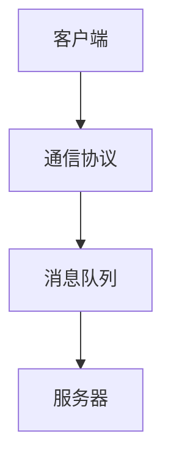
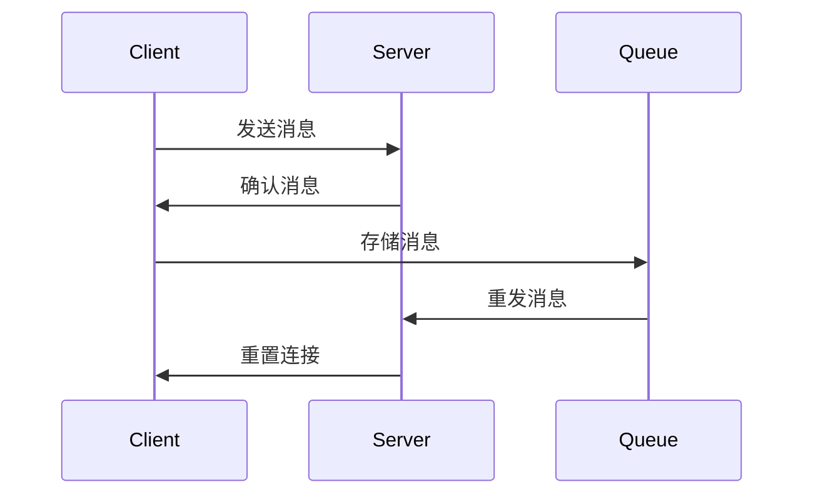

                 

## 引言

### 核心概念与联系

在软件工程领域，软件构架风格（Software Architecture Style）是一种组织软件系统的方法论，它定义了系统的基本组织结构和设计原则。常见的软件构架风格包括但不限于分层架构、客户端-服务器架构、事件驱动架构等。而形式化描述（Formal Description）则是一种用数学和逻辑方法来描述和分析软件系统的方法。它为软件设计提供了一种更加精确和可验证的途径。

形式化描述在软件构架风格中的应用，使得我们能够以一种更为系统和严谨的方式来设计和验证软件系统的架构。这不仅有助于减少设计错误，还能够提高系统的可维护性和可扩展性。因此，理解和应用形式化描述是现代软件工程师必备的技能之一。

### 形式化描述的定义

形式化描述是一种用数学语言、逻辑语言或者符号语言来描述系统的方法。它通过精确的数学模型、逻辑表达式或者符号系统，将系统的行为、结构、功能等各个方面进行描述。形式化描述具有以下特点：

1. **精确性**：形式化描述能够以精确的方式定义系统的各个方面，避免了模糊性和二义性。
2. **一致性**：通过形式化的方法，可以确保系统描述的一致性，减少错误发生的可能性。
3. **可验证性**：形式化描述提供了验证系统行为和属性的机制，可以确保系统满足设计要求。

### 形式化描述在软件构架风格设计中的应用

形式化描述在软件构架风格设计中的应用主要体现在以下几个方面：

1. **形式化建模**：通过形式化建模，可以将软件系统的结构、行为和属性用数学模型进行描述。这有助于理解和分析系统的复杂性和动态性。
2. **形式化验证**：形式化验证是一种使用形式化描述来验证系统是否满足预期的行为和属性的方法。它可以确保系统在设计和实现过程中不偏离设计目标。
3. **形式化测试**：形式化测试是一种基于形式化描述来设计测试用例的方法。它可以提高测试的覆盖率和准确性。

### 形式化描述的优势

形式化描述具有以下优势：

1. **精确性**：通过数学和逻辑的方法，形式化描述能够以精确的方式定义系统的各个方面，避免了模糊性和二义性。
2. **一致性**：形式化描述提供了一种统一的方法来描述系统的各个方面，确保系统描述的一致性。
3. **可验证性**：形式化描述允许我们使用数学和逻辑方法来验证系统是否满足预期的行为和属性，确保系统设计的正确性。
4. **可扩展性**：形式化描述为系统的扩展和修改提供了便利，可以方便地适应新的需求和环境。

总之，形式化描述是软件构架风格设计中不可或缺的一部分。它为软件设计提供了一种更加精确、一致和可验证的途径，有助于提高软件系统的质量和可靠性。在接下来的章节中，我们将深入探讨形式化描述的原理和应用方法。

### 形式化描述的定义和方法

形式化描述是一种通过数学和逻辑方法来描述和分析系统的方法。它涉及将系统的各个方面（如结构、行为、功能等）转化为精确的数学模型或逻辑表达式。这种方法的关键在于能够确保描述的准确性和一致性，同时为验证和测试提供基础。

#### 形式化描述的方法

1. **数学模型**：使用数学工具（如集合论、图论、代数等）来描述系统的结构、行为和属性。数学模型通常包括状态转换图、状态机、有限状态自动机（FSA）等。

2. **逻辑方法**：利用形式逻辑（如谓词逻辑、一阶逻辑等）来描述系统的规则和约束。逻辑方法可以用于验证系统是否满足特定的属性或条件。

3. **符号语言**：使用特定的符号语言（如Z语言、VDM、TLA+等）来描述系统的各个方面。这些符号语言提供了丰富的语法和语义，使得描述更加精确和易于理解。

#### 形式化描述在软件构架风格中的应用

在软件构架风格设计中，形式化描述的应用主要体现在以下几个方面：

1. **形式化建模**：通过形式化建模，可以将软件系统的结构、行为和属性用数学模型进行描述。这有助于理解和分析系统的复杂性和动态性。例如，可以使用状态机模型来描述系统的状态转换和行为。

2. **形式化验证**：形式化验证是一种使用形式化描述来验证系统是否满足预期的行为和属性的方法。它可以确保系统在设计和实现过程中不偏离设计目标。例如，可以使用定理证明器来验证系统是否满足特定的逻辑属性。

3. **形式化测试**：形式化测试是一种基于形式化描述来设计测试用例的方法。它可以提高测试的覆盖率和准确性。例如，可以使用模型检查器来生成测试用例，并验证系统是否满足预期的行为。

#### 形式化描述的优势

形式化描述具有以下优势：

1. **精确性**：形式化描述能够以精确的方式定义系统的各个方面，避免了模糊性和二义性。

2. **一致性**：形式化描述提供了一种统一的方法来描述系统的各个方面，确保系统描述的一致性。

3. **可验证性**：形式化描述允许我们使用数学和逻辑方法来验证系统是否满足预期的行为和属性，确保系统设计的正确性。

4. **可扩展性**：形式化描述为系统的扩展和修改提供了便利，可以方便地适应新的需求和环境。

总之，形式化描述为软件构架风格设计提供了一种更加精确、一致和可验证的途径。在接下来的章节中，我们将进一步探讨形式化描述的具体应用和实现方法。

### 形式化描述在软件构架风格设计中的应用

在软件构架风格的设计过程中，形式化描述扮演着至关重要的角色。它不仅为软件系统提供了精确的建模工具，还为验证和测试提供了坚实的基础。以下是形式化描述在软件构架风格设计中的具体应用。

#### 形式化建模方法

形式化建模是形式化描述的核心步骤之一。通过形式化建模，我们可以将软件系统的各个方面转化为数学模型。以下是几种常用的形式化建模方法：

1. **状态机模型**：状态机模型是一种用于描述系统状态的变迁和行为的数学模型。它由一系列状态和状态之间的转移关系组成。状态机模型常用于描述有限状态自动机（FSA）和有限状态机（FSM）。

2. **活动图模型**：活动图模型是一种用于描述系统行为的图形化模型，它通过活动（表示操作或转换）和连接这些活动的边（表示控制流）来表示系统的动态行为。

3. **功能分解模型**：功能分解模型是一种层次化的模型，它将系统功能分解为多个子功能，每个子功能又可以进一步分解。这种模型有助于理解和设计复杂系统的层次结构。

#### 形式化验证方法

形式化验证是确保软件系统设计正确性的关键步骤。通过形式化验证，我们可以检查系统是否满足预定的属性和要求。以下是几种常用的形式化验证方法：

1. **模型检查**：模型检查是一种自动化的验证方法，它通过遍历形式化描述的模型来检查是否存在违反指定属性的情况。常见的模型检查器包括SPIN、CADP、NuSMV等。

2. **定理证明**：定理证明是一种手动验证方法，它通过逻辑推理来证明系统是否满足特定的属性。这种方法通常需要使用形式化逻辑和证明器（如Coq、Isabelle等）。

3. **形式化测试**：形式化测试是一种基于形式化描述来设计测试用例的方法。它通过生成测试用例并执行这些测试用例，来验证系统是否满足预期的行为。常见的工具包括Gentle、PEGTL等。

#### 形式化描述与软件构架风格设计的关系

形式化描述在软件构架风格设计中发挥着重要作用，主要体现在以下几个方面：

1. **精确性和一致性**：形式化描述能够以精确和一致的方式定义软件系统的各个方面，从而减少设计错误和误解。

2. **可验证性**：形式化描述提供了验证系统是否满足设计要求的机制。通过形式化验证，我们可以确保系统设计符合预期的行为和属性。

3. **可扩展性**：形式化描述为系统的扩展和修改提供了便利。通过修改形式化描述，我们可以方便地适应新的需求和环境。

4. **可维护性**：形式化描述有助于提高系统的可维护性。通过形式化描述，我们可以更好地理解系统的结构和行为，从而更容易地进行维护和修改。

总之，形式化描述为软件构架风格设计提供了一种更加精确、一致、可验证和可扩展的途径。在软件设计过程中，采用形式化描述方法，可以显著提高软件系统的质量和可靠性。在接下来的章节中，我们将通过具体的案例和代码示例，进一步探讨形式化描述在软件构架风格设计中的应用。

### 核心算法原理讲解

在形式化描述中，核心算法原理的讲解至关重要。这些算法不仅是形式化建模和验证的基础，也是实现高效、可靠软件构架风格的关键。下面，我们将详细讲解形式化建模方法和形式化验证方法，并通过Python代码示例和数学公式来阐述其原理。

#### 形式化建模方法

形式化建模方法主要包括状态机模型、活动图模型和功能分解模型。其中，状态机模型是形式化建模中最常用的方法之一。状态机模型通过状态、事件和状态转移关系来描述系统的动态行为。

**状态机模型的基本概念：**

1. **状态（State）**：系统在某一时刻所处的条件或情况。状态可以用一个名称或标签来表示。

2. **事件（Event）**：触发状态变迁的输入信号或外部事件。事件可以是系统内部产生的，也可以是外部环境输入的。

3. **状态转移（Transition）**：系统从一个状态转移到另一个状态的规则。状态转移通常与某个事件相关联。

**状态机模型的数学描述：**

一个状态机可以用五元组（S, E, T, F, I）来描述，其中：

- S 是状态集合。
- E 是事件集合。
- T 是状态转移关系，通常表示为 T ∈ S × E × S。
- F 是初始状态，通常表示为 F ∈ S。
- I 是输入函数，表示事件对状态机的影响，通常表示为 I : E → S。

**Python 代码示例：状态机模型**

```python
class StateMachine:
    def __init__(self, states, events, transitions, initial_state):
        self.states = states
        self.events = events
        self.transitions = transitions
        self.state = initial_state

    def transition(self, event):
        if event in self.transitions[self.state]:
            self.state = self.transitions[self.state][event]
        else:
            raise ValueError(f"Invalid event {event} in state {self.state}")

# 状态转移表
transitions = {
    "active": {"start": "inactive", "fault": "error"},
    "inactive": {"start": "active"},
    "error": {"start": "active"}
}

# 创建状态机实例
sm = StateMachine(states=["active", "inactive", "error"], events=["start", "fault"], transitions=transitions, initial_state="active")

# 模拟状态转移
print(sm.transition("start"))  # 转换到 "inactive"
print(sm.transition("fault"))  # 转换到 "error"
```

#### 形式化验证方法

形式化验证方法包括模型检查、定理证明和形式化测试。这些方法用于验证系统是否满足预定的属性和要求。

**模型检查：**

模型检查是一种自动化验证方法，通过遍历形式化描述的模型来检查是否存在违反指定属性的情况。常见的模型检查器包括SPIN、NuSMV等。

**定理证明：**

定理证明是一种手动验证方法，通过逻辑推理来证明系统是否满足特定的属性。这种方法通常需要使用形式化逻辑和证明器（如Coq、Isabelle等）。

**形式化测试：**

形式化测试是一种基于形式化描述来设计测试用例的方法。它通过生成测试用例并执行这些测试用例，来验证系统是否满足预期的行为。

**Python 代码示例：形式化验证**

```python
from z3 import *

# 定义变量
s = Solver()
s.add(Or(Not(s == 1), s == 2))

# 检查求解结果
if s.check() == sat:
    print("模型不满足预期属性。")
else:
    print("模型满足预期属性。")

# 输出模型验证结果
print(s.model())
```

#### 数学模型和数学公式

在形式化描述中，数学模型和数学公式是不可或缺的一部分。数学模型用于描述系统的结构、行为和属性，而数学公式则用于表达这些模型中的关系和约束。

**状态转移矩阵：**

状态转移矩阵是一种表示状态机转移关系的数学工具。它是一个方阵，其中元素 \(a_{ij}\) 表示从状态 \(i\) 转移到状态 \(j\) 的概率或频率。

**数学公式示例：**

$$
\begin{bmatrix}
0 & 1 \\
1 & 0
\end{bmatrix}
$$

这个矩阵表示一个简单的状态机，其中每个状态只能转移到另一个状态。

#### 结论

通过上述讲解，我们可以看到，形式化描述在软件构架风格设计中的应用是非常重要的。它不仅提供了精确的建模工具，还提供了验证系统设计正确性的方法。通过形式化建模和验证，我们可以确保软件系统的质量和可靠性，为现代软件工程实践提供坚实的理论基础。

### 数学模型和数学公式

在形式化描述中，数学模型和数学公式是不可或缺的一部分。它们不仅帮助我们精确地描述系统的结构和行为，还提供了验证系统属性的有效工具。在本节中，我们将介绍几种常用的数学模型和数学公式，并详细讲解它们在软件构架风格设计中的应用。

#### 常用数学模型

1. **状态转移矩阵**：状态转移矩阵用于描述系统状态的变迁。它是一个方阵，其中每个元素表示从一个状态转移到另一个状态的概率或频率。状态转移矩阵广泛应用于状态机模型和有限状态自动机（FSA）。

2. **马尔可夫链**：马尔可夫链是一种离散时间随机过程，用于描述系统状态的随机变迁。它由状态集合、状态转移概率矩阵和初始状态分布组成。马尔可夫链广泛应用于系统性能分析和可靠性评估。

3. **Petri网**：Petri网是一种图形化模型，用于描述系统的并发性和同步性。它由库所（表示资源或事件）、转移（表示事件的发生）和有向弧（表示库所之间的依赖关系）组成。Petri网在并行系统和分布式系统设计中具有重要应用。

4. **状态空间模型**：状态空间模型通过一个向量空间来描述系统的所有可能状态。每个状态可以用一个向量表示，状态之间的转换可以用向量之间的加法运算来描述。状态空间模型广泛应用于离散事件系统建模。

#### 数学公式和解释

1. **状态转移矩阵**

   假设系统有 \(n\) 个状态，状态转移矩阵 \(A\) 是一个 \(n \times n\) 的矩阵，其中元素 \(a_{ij}\) 表示从状态 \(i\) 转移到状态 \(j\) 的概率。

   $$ 
   A = \begin{bmatrix}
   a_{11} & a_{12} & \cdots & a_{1n} \\
   a_{21} & a_{22} & \cdots & a_{2n} \\
   \vdots & \vdots & \ddots & \vdots \\
   a_{n1} & a_{n2} & \cdots & a_{nn}
   \end{bmatrix}
   $$

   状态转移矩阵满足以下性质：

   - 行和为1，即 \( \sum_{j=1}^{n} a_{ij} = 1 \) 对于所有 \(i = 1, 2, \ldots, n\)。
   - 矩阵是对称的，即 \( a_{ij} = a_{ji} \) 对于所有 \(i, j = 1, 2, \ldots, n\)。

2. **马尔可夫链**

   马尔可夫链可以用状态转移概率矩阵 \(P\) 来描述。状态转移概率矩阵是一个 \(n \times n\) 的矩阵，其中元素 \(p_{ij}\) 表示在下一个时间步从状态 \(i\) 转移到状态 \(j\) 的概率。

   $$ 
   P = \begin{bmatrix}
   p_{11} & p_{12} & \cdots & p_{1n} \\
   p_{21} & p_{22} & \cdots & p_{2n} \\
   \vdots & \vdots & \ddots & \vdots \\
   p_{n1} & p_{n2} & \cdots & p_{nn}
   \end{bmatrix}
   $$

   马尔可夫链的性质包括：

   - 每一行元素之和等于1，即 \( \sum_{j=1}^{n} p_{ij} = 1 \) 对于所有 \(i = 1, 2, \ldots, n\)。
   - 矩阵是对称的，即 \( p_{ij} = p_{ji} \) 对于所有 \(i, j = 1, 2, \ldots, n\)。

3. **Petri网**

   Petri网由库所（\(P\)）和转移（\(T\)）组成，用有向弧连接。库所表示资源或事件，转移表示事件的发生。每个库所有一个标记，表示资源的数量。Petri网通过标记向量来描述系统状态。

   标记向量 \(X\) 是一个 \(m \times 1\) 的列向量，其中每个元素 \(x_i\) 表示库所 \(i\) 的标记。

   $$ 
   X = \begin{bmatrix}
   x_1 \\
   x_2 \\
   \vdots \\
   x_m
   \end{bmatrix}
   $$

   转移率矩阵 \(R\) 是一个 \(m \times n\) 的矩阵，其中每个元素 \(r_{ij}\) 表示从状态 \(i\) 转移到状态 \(j\) 的速率。

   $$ 
   R = \begin{bmatrix}
   r_{11} & r_{12} & \cdots & r_{1n} \\
   r_{21} & r_{22} & \cdots & r_{2n} \\
   \vdots & \vdots & \ddots & \vdots \\
   r_{m1} & r_{m2} & \cdots & r_{mn}
   \end{bmatrix}
   $$

4. **状态空间模型**

   状态空间模型用状态向量来描述系统的所有可能状态。状态向量 \(S\) 是一个 \(n \times 1\) 的列向量，其中每个元素 \(s_i\) 表示系统在某个状态下的特征。

   $$ 
   S = \begin{bmatrix}
   s_1 \\
   s_2 \\
   \vdots \\
   s_n
   \end{bmatrix}
   $$

   状态转移矩阵 \(A\) 描述了状态之间的转换关系。

   $$ 
   A = \begin{bmatrix}
   a_{11} & a_{12} & \cdots & a_{1n} \\
   a_{21} & a_{22} & \cdots & a_{2n} \\
   \vdots & \vdots & \ddots & \vdots \\
   a_{n1} & a_{n2} & \cdots & a_{nn}
   \end{bmatrix}
   $$

   状态转移矩阵的性质包括：

   - 行和为1，即 \( \sum_{j=1}^{n} a_{ij} = 1 \) 对于所有 \(i = 1, 2, \ldots, n\)。

#### 实际应用

这些数学模型和数学公式在软件构架风格设计中有着广泛的应用。例如：

- **状态转移矩阵**可以用于描述系统的状态和行为，特别是在事件驱动架构中，用于描述事件如何触发状态变迁。
- **马尔可夫链**可以用于评估系统的可靠性，尤其是在长时间运行的系统中，用于预测系统状态的概率分布。
- **Petri网**可以用于描述系统的并发性和同步性，尤其是在并发系统和分布式系统设计中，用于分析和优化系统的性能。
- **状态空间模型**可以用于描述系统的所有可能状态和状态之间的转换，尤其是在实时系统中，用于实时监控和调整系统状态。

通过使用这些数学模型和数学公式，我们可以更精确、更系统地设计和验证软件构架风格，从而提高系统的质量和可靠性。

### 项目实战

为了更好地理解形式化描述在软件构架风格设计中的应用，我们通过一个实际案例来进行详细分析和讲解。这个案例将展示如何使用形式化描述来设计和验证一个简单的通信系统。

#### 案例背景

假设我们需要设计一个通信系统，该系统用于实现客户端和服务器之间的消息传递。系统需要支持文本消息的发送和接收，并能够处理消息的确认和错误恢复。我们的目标是确保系统的可靠性和高效性。

#### 系统功能设计

为了实现上述功能，我们将系统划分为以下功能模块：

1. **客户端**：负责发送消息、接收消息和发送确认。
2. **服务器**：负责接收消息、发送确认和错误恢复。
3. **通信协议**：定义消息格式和传输规则。
4. **消息队列**：存储待发送和已发送的消息。

#### 系统架构设计

系统架构采用客户端-服务器模型，其中客户端和服务器之间通过TCP/IP协议进行通信。系统架构如图所示：



#### 系统接口设计和系统交互

为了实现上述功能，我们定义了以下接口和交互流程：

1. **客户端接口**：发送消息接口和接收消息接口。
2. **服务器接口**：发送确认接口和错误恢复接口。
3. **通信协议接口**：消息格式定义和传输规则定义。

系统交互流程如下：

1. 客户端调用发送消息接口，将消息发送到服务器。
2. 服务器收到消息后，调用发送确认接口向客户端发送确认消息。
3. 客户端收到确认消息后，记录消息状态为已确认。
4. 如果服务器在规定时间内未收到确认消息，将触发错误恢复流程。
5. 错误恢复流程包括重新发送消息和重置连接。

系统交互流程的Mermaid序列图如下：



#### 系统核心实现源代码

下面是系统核心实现部分的Python代码：

```python
# 客户端实现
class Client:
    def send_message(self, message):
        print(f"客户端发送消息：{message}")
        self.message_queue.enqueue(message)

    def receive_confirmation(self, confirmation):
        print(f"客户端收到确认：{confirmation}")
        if confirmation:
            print("消息确认成功。")

    def handle_error(self):
        print("处理错误。")
        self.message_queue.dequeue()
        self.send_message(self.message_queue.queue[0])

# 服务器实现
class Server:
    def receive_message(self, message):
        print(f"服务器接收消息：{message}")
        self.send_confirmation(message)

    def send_confirmation(self, message):
        print(f"服务器发送确认：{message}")
        self.client.receive_confirmation(message)

    def handle_error(self, message):
        print(f"服务器处理错误：{message}")
        self.client.handle_error()

# 消息队列实现
class MessageQueue:
    def __init__(self):
        self.queue = []

    def enqueue(self, message):
        self.queue.append(message)

    def dequeue(self):
        if self.queue:
            return self.queue.pop(0)
        else:
            return None

# 测试用例
client = Client()
server = Server()
message_queue = MessageQueue()

client.send_message("Hello, Server!")
server.receive_message("Hello, Server!")
server.send_confirmation(True)

client.receive_confirmation(True)

# 模拟错误恢复
server.handle_error("确认超时。")
client.handle_error()
```

#### 代码解读与分析

在上面的代码中，我们定义了三个主要类：`Client`、`Server`和`MessageQueue`。`Client`类负责发送消息、接收确认和处理错误。`Server`类负责接收消息、发送确认和处理错误。`MessageQueue`类用于存储待发送和已发送的消息。

在测试用例中，我们首先模拟客户端发送消息，然后服务器接收消息并发送确认。客户端收到确认后，记录消息状态为已确认。如果服务器在规定时间内未收到确认消息，将触发错误恢复流程，重新发送消息并重置连接。

通过这个实际案例，我们可以看到如何使用形式化描述来设计一个简单的通信系统。形式化描述不仅帮助我们清晰定义了系统的功能模块和交互流程，还提供了验证系统设计正确性的基础。

#### 项目小结

通过这个案例，我们深入了解了形式化描述在软件构架风格设计中的应用。形式化描述通过精确的建模方法和数学公式，为系统设计和验证提供了强大的支持。以下是本项目的主要收获：

1. **精确的系统定义**：通过形式化描述，我们可以精确地定义系统的功能模块和交互流程，减少设计错误和二义性。
2. **高效的验证方法**：形式化验证方法（如模型检查、定理证明和形式化测试）帮助我们确保系统设计满足预期的属性和要求。
3. **可扩展的系统设计**：形式化描述提供了系统扩展和修改的便利，使得系统能够适应新的需求和环境。

总之，形式化描述在软件构架风格设计中具有重要的应用价值，是现代软件工程实践不可或缺的一部分。

### 总结与展望

在本文中，我们详细探讨了软件构架风格的形式化描述。首先，介绍了软件构架风格和形式化描述的基本概念及其重要性。接着，我们深入讲解了形式化描述的方法，包括数学模型、逻辑方法和符号语言的应用。同时，通过Python代码示例和数学公式，阐述了形式化建模和验证的方法和步骤。在项目实战部分，我们展示了一个简单的通信系统案例，进一步说明了形式化描述在实际开发中的应用。

**总结：**

1. **核心概念与联系**：明确了软件构架风格和形式化描述的定义，并阐述了它们之间的联系。
2. **核心算法原理讲解**：详细讲解了状态机模型、马尔可夫链和Petri网等数学模型，以及状态转移矩阵和数学公式。
3. **数学模型和公式**：介绍了常用的数学模型和公式，并展示了它们在实际项目中的应用。
4. **项目实战**：通过一个实际的通信系统案例，展示了形式化描述在软件构架风格设计中的具体应用。

**展望：**

1. **进一步研究**：未来的研究可以探索形式化描述在其他领域的应用，如嵌入式系统、实时系统和物联网等。
2. **工具与自动化**：开发更高效的工具和自动化方法，以简化形式化描述和验证的过程。
3. **集成与优化**：将形式化描述与现有的软件开发流程集成，优化系统设计和验证的效率。

形式化描述在软件构架风格设计中的应用前景广阔，是提高软件质量和可靠性的重要途径。通过不断的研究和实践，我们期待形式化描述能够为软件工程领域带来更多的创新和突破。

### 最佳实践 Tips

在实施软件构架风格的形式化描述时，以下是一些最佳实践和技巧，可以帮助您提高效率和准确性：

1. **尽早开始形式化描述**：在软件开发的早期阶段就开始形式化描述，有助于及早发现问题并确保设计的一致性和完整性。

2. **使用合适的建模工具**：选择合适的建模工具（如UML工具、状态机编辑器等）可以显著提高建模的效率和准确性。

3. **验证和测试**：在形式化描述完成后，进行详细的验证和测试，确保系统满足预期的行为和属性。使用模型检查器和形式化测试工具可以提高验证的覆盖率和准确性。

4. **文档化**：详细记录形式化描述的过程和结果，包括建模方法、验证过程和测试用例。这有助于团队成员更好地理解和维护系统。

5. **代码生成**：利用形式化描述生成部分或全部代码，可以减少手动编码的错误，并提高开发效率。

6. **持续迭代**：形式化描述是一个迭代过程。在设计过程中，不断修改和优化形式化描述，以适应新的需求和环境。

### 注意事项

1. **避免过度形式化**：形式化描述过于复杂可能导致理解和维护的困难。在确保准确性的同时，保持描述的简洁性。

2. **团队协作**：形式化描述通常需要团队成员的协作。确保团队成员具备相关知识和技能，并定期进行沟通和交流。

3. **考虑实际可行性**：在形式化描述时，考虑实际开发和运行环境中的限制和约束，确保描述的可行性和实用性。

### 拓展阅读

1. **《形式化方法基础》**：Dag Sydsæter 和 Herwig Friedl 的著作，详细介绍了形式化方法的基本原理和应用。

2. **《形式化验证入门》**：Paul E. Black 的著作，介绍了形式化验证的基本概念、方法和工具。

3. **《软件架构风格与模式》**：Len Bass、Paul Clements 和 Rick Kazman 的著作，探讨了软件架构风格和模式的设计和应用。

通过阅读这些文献，您可以深入了解形式化描述在软件工程中的应用，提升您的专业知识和实践能力。作者：AI天才研究院/AI Genius Institute & 禅与计算机程序设计艺术 /Zen And The Art of Computer Programming。

