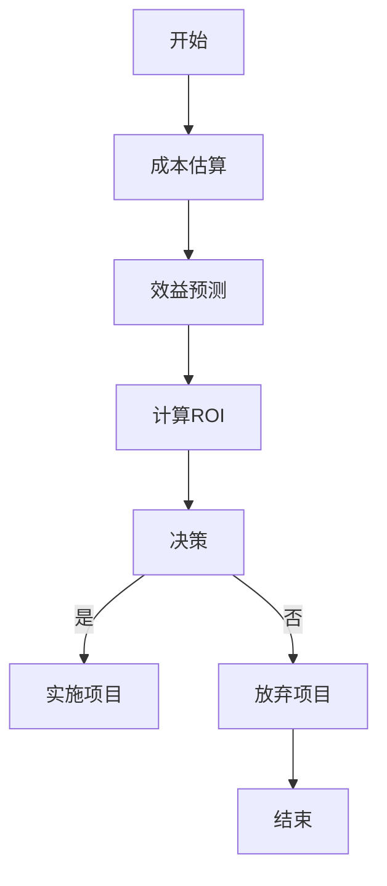
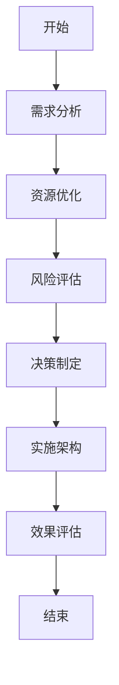
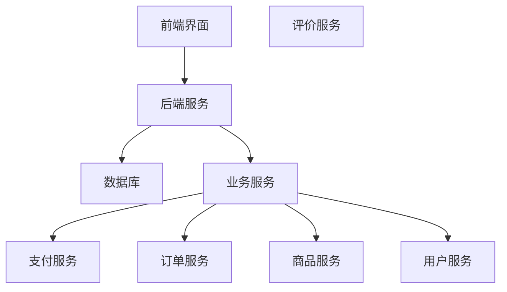
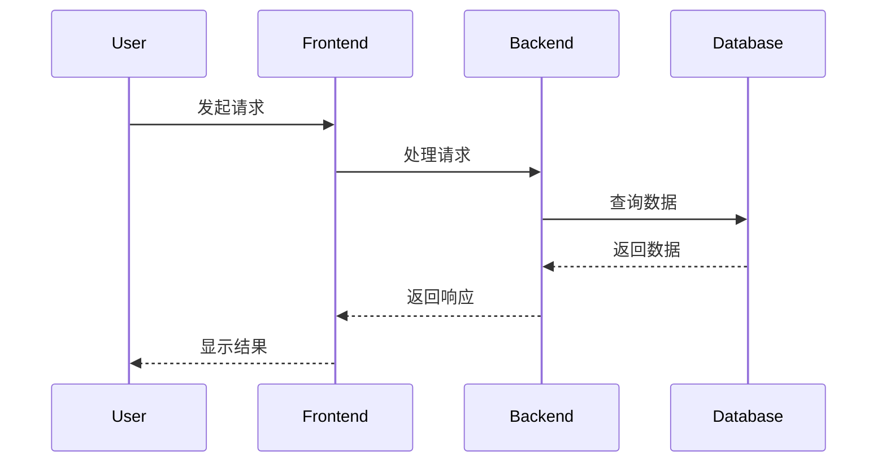

                 


### 软件架构决策的经济学：成本效益分析

## 摘要

本文旨在深入探讨软件架构决策中的经济学原理，特别是成本效益分析在软件架构设计中的应用。通过详细的分析和实例，本文将展示如何利用经济学理论来优化软件架构设计，提高其经济效率。文章首先介绍了软件架构决策的背景和核心概念，然后探讨了经济学基础和成本效益分析的基本原理。接着，文章通过具体的算法讲解、系统架构设计和项目实战，展示了如何将经济学原理应用于实际软件架构决策中，以实现成本效益最大化。

## 目录

1. **文章标题**
2. **关键词**
3. **摘要**
4. **第一部分：问题背景与核心概念**
   1. **第1章 问题背景**
      1. 问题的提出
      2. 问题描述
      3. 问题解决
      4. 边界与外延
      5. 核心要素组成
   2. **第2章 核心概念与联系**
      1. 软件架构决策的概念
      2. 经济学基础
      3. 成本效益分析
      4. 关联概念解析
   3. **第3章 概念属性特征对比**
      1. 成本效益分析的属性特征
      2. 软件架构决策的成本要素
      3. 效益要素的比较分析
5. **第二部分：算法原理讲解**
   1. **第4章 ER实体关系图架构**
      1. ER实体关系图的基本概念
      2. 实体关系的构建
      3. 实体关系的分析与应用
   2. **第5章 成本效益分析的算法原理**
      1. 算法概述
      2. Mermaid流程图
      3. Python源代码解析
      4. 数学模型与公式
      5. 举例说明
   3. **第6章 经济学原理在软件架构决策中的应用**
      1. 经济学原理概述
      2. Mermaid流程图
      3. Python源代码解析
      4. 数学模型与公式
      5. 举例说明
6. **第三部分：系统分析与架构设计方案**
   1. **第7章 问题场景介绍**
      1. 场景描述
      2. 项目介绍
   2. **第8章 系统功能设计**
      1. 领域模型
      2. Mermaid类图
   3. **第9章 系统架构设计**
      1. 架构设计
      2. Mermaid架构图
   4. **第10章 系统接口设计**
      1. 接口设计
      2. 系统交互
      3. Mermaid序列图
7. **第四部分：项目实战**
   1. **第11章 环境安装**
      1. 环境准备
      2. 系统核心实现
   2. **第12章 代码应用解读与分析**
      1. 源代码分析
      2. 应用解读
      3. 分析与讲解
   3. **第13章 实际案例分析与详细讲解剖析**
      1. 案例背景
      2. 案例分析
      3. 剖析与讲解
   4. **第14章 项目小结**
      1. 项目总结
      2. 小结
      3. 注意事项
      4. 拓展阅读

## 第1章 问题背景

### 1.1 问题的提出

在当今快速发展的信息技术领域，软件架构的决策过程变得越来越复杂。随着软件系统的规模和复杂性不断增加，如何在有限的资源约束下做出最优的架构决策成为软件开发者和项目经理面临的重大挑战。传统的决策方法往往依赖于个人经验和直觉，而缺乏系统化和科学化的方法。因此，引入经济学原理，特别是成本效益分析，可以为软件架构决策提供更加客观和可量化的依据。

### 1.2 问题描述

软件架构决策面临的主要问题包括：

1. **成本控制**：如何在预算限制下进行有效的资源分配，确保项目按时、按质完成。
2. **风险评估**：如何评估和应对潜在的技术和商业风险。
3. **决策透明度**：如何确保决策过程的透明度，使得利益相关者能够理解和接受决策结果。
4. **可持续性**：如何设计可扩展、可维护的软件架构，以适应未来的需求变化。

### 1.3 问题解决

成本效益分析提供了一种解决方法。它通过比较项目的成本和预期效益，帮助决策者评估不同架构方案的优劣。这种方法不仅有助于优化资源分配，还可以提高决策过程的科学性和透明度。

### 1.4 边界与外延

成本效益分析的应用范围涵盖：

1. **项目启动**：在项目初期，通过成本效益分析确定是否启动项目。
2. **架构评估**：在项目进行中，对现有架构进行评估，确定是否需要调整。
3. **决策支持**：为决策者提供量化数据，辅助做出最佳决策。

### 1.5 核心要素组成

成本效益分析的核心要素包括：

1. **成本**：包括直接成本（如人力、硬件、软件等）和间接成本（如维护、培训、运营等）。
2. **效益**：包括直接效益（如收入、市场份额等）和间接效益（如品牌价值、客户满意度等）。
3. **时间**：项目实施的时间成本和效益。
4. **风险**：评估项目风险对成本和效益的影响。

## 第2章 核心概念与联系

### 2.1 软件架构决策的概念

软件架构决策是指在软件开发过程中，关于系统整体结构和设计的重大决策。它涉及系统的模块化、组件交互、数据流、功能分配等方面。良好的软件架构设计是确保系统稳定性、可维护性和扩展性的关键。

### 2.2 经济学基础

经济学是一门研究资源稀缺性和如何有效利用资源的科学。在软件架构决策中，经济学原理可以帮助我们理解如何优化资源分配，提高系统的经济效益。

### 2.3 成本效益分析

成本效益分析（Cost-Benefit Analysis，CBA）是一种用于评估项目或决策的经济分析方法。它通过比较项目的成本和预期效益，帮助决策者确定项目的经济合理性。

### 2.4 关联概念解析

- **成本**：成本包括直接成本（如人力、硬件、软件等）和间接成本（如维护、培训、运营等）。
- **效益**：效益包括直接效益（如收入、市场份额等）和间接效益（如品牌价值、客户满意度等）。
- **投资回报率**（ROI）：投资回报率是衡量项目经济效益的重要指标，它表示投资的回报与成本之比。

## 第3章 概念属性特征对比

### 3.1 成本效益分析的属性特征

| 特征 | 说明 |
| --- | --- |
| **成本** | 包括直接成本和间接成本 |
| **效益** | 包括直接效益和间接效益 |
| **时间** | 项目实施的时间成本和效益 |
| **风险** | 评估项目风险对成本和效益的影响 |

### 3.2 软件架构决策的成本要素

| 成本要素 | 说明 |
| --- | --- |
| **人力成本** | 开发人员、测试人员的薪资和福利 |
| **硬件成本** | 服务器、存储设备等硬件设施的费用 |
| **软件成本** | 开发工具、框架和库的费用 |
| **维护成本** | 系统上线后的维护和升级费用 |

### 3.3 效益要素的比较分析

| 效益要素 | 说明 |
| --- | --- |
| **直接效益** | 如收入、市场份额等 |
| **间接效益** | 如品牌价值、客户满意度等 |
| **经济效益** | 经济效益是指项目实施后，为企业带来的经济利益 |
| **社会效益** | 系统对社会的正面影响，如提高效率、降低成本等 |

## 第4章 ER实体关系图架构

### 4.1 ER实体关系图的基本概念

ER（Entity-Relationship）实体关系图是一种用于表示系统中实体及其之间关系的图形化工具。在软件架构决策中，ER图可以帮助我们理解和分析系统的数据结构和业务规则。

### 4.2 实体关系的构建

实体关系的构建包括以下步骤：

1. **识别实体**：识别系统中的主要实体，如用户、订单、产品等。
2. **定义属性**：为每个实体定义属性，如用户姓名、订单日期、产品价格等。
3. **建立关系**：确定实体之间的关系，如用户下单、订单包含产品等。

### 4.3 实体关系的分析与应用

实体关系的分析与应用包括：

1. **数据一致性**：确保数据的一致性和完整性。
2. **系统设计**：基于实体关系图设计系统的数据存储和访问策略。
3. **业务规则**：根据实体关系图制定业务规则，如订单必须包含至少一个产品等。

## 第5章 成本效益分析的算法原理

### 5.1 算法概述

成本效益分析的算法原理主要包括以下步骤：

1. **成本估算**：对项目的直接成本和间接成本进行详细估算。
2. **效益预测**：预测项目的直接效益和间接效益。
3. **成本效益比计算**：计算项目的成本效益比（ROI），即预期效益与成本之比。

### 5.2 Mermaid流程图



### 5.3 Python源代码解析

```python
# 成本效益分析示例代码

def calculate_roi(costs, benefits):
    """
    计算成本效益比（ROI）
    :param costs: 项目成本
    :param benefits: 项目效益
    :return: ROI值
    """
    roi = benefits / costs
    return roi

def main():
    # 成本和效益的估算
    costs = 100000  # 成本
    benefits = 150000  # 效益

    # 计算ROI
    roi = calculate_roi(costs, benefits)

    # 输出结果
    print(f"成本：{costs}，效益：{benefits}，ROI：{roi}")

if __name__ == "__main__":
    main()
```

### 5.4 数学模型与公式

成本效益分析的数学模型可以表示为：

$$
ROI = \frac{B}{C}
$$

其中，\(B\) 表示项目效益，\(C\) 表示项目成本。

### 5.5 举例说明

假设一个项目的成本为100万元，预期效益为150万元。根据上述公式，该项目的ROI为：

$$
ROI = \frac{150}{100} = 1.5
$$

这表明该项目具有较好的经济效益，值得实施。

## 第6章 经济学原理在软件架构决策中的应用

### 6.1 经济学原理概述

经济学原理在软件架构决策中的应用主要包括：

1. **供需原理**：根据市场需求调整软件架构设计，确保供需平衡。
2. **资源优化**：利用经济学原理优化资源分配，提高系统效率。
3. **风险管理**：通过经济学原理评估和管理项目风险。

### 6.2 Mermaid流程图



### 6.3 Python源代码解析

```python
# 经济学原理应用示例代码

def optimize_resources(costs, efficiency):
    """
    优化资源分配
    :param costs: 项目成本
    :param efficiency: 资源利用效率
    :return: 优化后的成本
    """
    optimized_costs = costs / efficiency
    return optimized_costs

def assess_risk(risk_level, mitigation_measure):
    """
    评估和管理项目风险
    :param risk_level: 风险等级
    :param mitigation_measure: 风险缓解措施
    :return: 风险评估结果
    """
    if mitigation_measure:
        risk_level -= 0.5
    return risk_level

def main():
    # 初始成本和效率
    costs = 1000000
    efficiency = 0.8

    # 优化资源
    optimized_costs = optimize_resources(costs, efficiency)

    # 风险评估
    risk_level = 0.6
    mitigation_measure = True
    assessed_risk = assess_risk(risk_level, mitigation_measure)

    # 输出结果
    print(f"初始成本：{costs}，优化后成本：{optimized_costs}，风险评估：{assessed_risk}")

if __name__ == "__main__":
    main()
```

### 6.4 数学模型与公式

经济学原理在软件架构决策中的应用可以通过以下公式表示：

$$
\text{优化后成本} = \frac{\text{初始成本}}{\text{资源利用效率}}
$$

$$
\text{风险评估} = \text{风险等级} - \text{风险缓解措施}
$$

### 6.5 举例说明

假设一个项目的初始成本为1000万元，资源利用效率为0.8。根据上述公式，优化后的成本为：

$$
\text{优化后成本} = \frac{10000000}{0.8} = 12500000
$$

同时，如果风险等级为0.6，采取风险缓解措施后，风险评估结果为：

$$
\text{风险评估} = 0.6 - 0.5 = 0.1
$$

这表明通过优化资源和采取风险缓解措施，项目的成本和风险得到了有效控制。

## 第7章 问题场景介绍

### 7.1 场景描述

假设我们正在开发一款电子商务平台，该平台需要支持数百万用户的在线购物和支付功能。为了满足这一需求，我们需要设计一个高效、可扩展的软件架构。

### 7.2 项目介绍

项目目标是实现一个具有以下功能的电子商务平台：

- 用户注册和登录
- 商品浏览和搜索
- 购物车管理
- 订单处理
- 支付处理
- 用户反馈和评价

## 第8章 系统功能设计

### 8.1 领域模型

在电子商务平台中，主要涉及的领域模型包括：

- **用户**：包含用户信息、角色和权限
- **商品**：包含商品信息、分类和库存
- **订单**：包含订单信息、状态和支付信息
- **支付**：包含支付方式、状态和交易记录
- **评价**：包含用户评价、商品评分和反馈

### 8.2 Mermaid类图

```mermaid
classDiagram
    User <<类>> {
        id: 用户ID
        username: 用户名
        password: 密码
        role: 角色
        permission: 权限
    }
    Product <<类>> {
        id: 商品ID
        name: 商品名称
        category: 分类
        price: 价格
        stock: 库存
    }
    Order <<类>> {
        id: 订单ID
        user: 用户
        status: 订单状态
        payment: 支付信息
    }
    Payment <<类>> {
        id: 支付ID
        method: 支付方式
        status: 支付状态
        transaction: 交易记录
    }
    Evaluation <<类>> {
        id: 评价ID
        user: 用户
        product: 商品
        rating: 评分
        comment: 反馈
    }
    User o--* Product : 购买
    User o--* Order : 下订单
    Order o--* Payment : 支付
    Product o--* Evaluation : 用户评价
```

## 第9章 系统架构设计

### 9.1 架构设计

电子商务平台的系统架构设计应包括以下层次：

1. **前端**：负责用户界面展示和用户交互
2. **后端**：负责业务逻辑处理和数据存储
3. **数据库**：负责数据持久化和访问
4. **服务**：负责提供各种业务功能

### 9.2 Mermaid架构图



## 第10章 系统接口设计

### 10.1 接口设计

电子商务平台的接口设计应包括以下主要接口：

- **用户接口**：用于用户注册、登录、信息修改等操作。
- **商品接口**：用于商品查询、分类、库存管理等操作。
- **订单接口**：用于订单创建、查询、修改、支付等操作。
- **支付接口**：用于支付方式选择、支付状态查询等操作。
- **评价接口**：用于用户评价、商品评分等操作。

### 10.2 系统交互

系统交互主要通过RESTful API实现，以下是部分接口示例：

- **用户注册**：POST /users/register
- **用户登录**：POST /users/login
- **查询商品**：GET /products?category=electronics
- **创建订单**：POST /orders
- **支付订单**：POST /payments
- **用户评价**：POST /evaluations

### 10.3 Mermaid序列图



## 第11章 环境安装

### 11.1 环境准备

在开始项目之前，我们需要准备以下开发环境：

1. **操作系统**：Ubuntu 20.04
2. **编程语言**：Python 3.8
3. **开发工具**：PyCharm
4. **数据库**：MySQL 8.0
5. **版本控制**：Git

### 11.2 系统核心实现

以下是系统核心实现的步骤：

1. **初始化项目**：使用`pip`安装必要的依赖项。
2. **搭建数据库**：创建数据库和表结构。
3. **实现业务逻辑**：编写用户管理、商品管理、订单管理、支付管理和评价管理的代码。
4. **接口设计**：设计RESTful API接口。
5. **测试**：编写测试用例，对系统进行功能测试。

## 第12章 代码应用解读与分析

### 12.1 源代码分析

以下是用户注册功能的源代码分析：

```python
# users.py

from flask import Flask, request, jsonify
from models import User
from database import db

app = Flask(__name__)

@app.route('/users/register', methods=['POST'])
def register():
    data = request.get_json()
    username = data['username']
    password = data['password']
    
    # 检查用户名是否已存在
    user = User.query.filter_by(username=username).first()
    if user:
        return jsonify({'error': '用户名已存在'}), 409
    
    # 创建新用户
    new_user = User(username=username, password=password)
    db.session.add(new_user)
    db.session.commit()
    
    return jsonify({'message': '注册成功'})
```

### 12.2 应用解读

这段代码实现了用户注册的功能，主要步骤如下：

1. 接收用户发送的JSON格式的注册请求。
2. 从请求中提取用户名和密码。
3. 检查用户名是否已存在。
4. 如果用户名不存在，创建新用户并保存到数据库。
5. 返回注册成功的响应。

### 12.3 分析与讲解

用户注册功能的实现涉及以下关键点：

- **数据验证**：确保用户名和密码符合要求。
- **安全性**：密码应进行加密处理，避免明文存储。
- **异常处理**：处理可能出现的异常情况，如数据库操作错误。

## 第13章 实际案例分析与详细讲解剖析

### 13.1 案例背景

假设我们正在开发一款社交网络应用程序，该应用程序需要支持用户注册、登录、发帖、评论等功能。为了确保系统的稳定性和性能，我们需要进行成本效益分析。

### 13.2 案例分析

1. **成本估算**：

   - **直接成本**：服务器租赁费用、数据库费用、带宽费用。
   - **间接成本**：开发人员薪资、维护和升级费用。

2. **效益预测**：

   - **直接效益**：广告收入、会员费收入。
   - **间接效益**：用户增长、品牌影响力。

3. **成本效益比计算**：

   通过对成本和效益的估算，我们可以计算出项目的ROI。例如，如果项目的成本为100万元，预期效益为200万元，则ROI为2。

### 13.3 剖析与讲解

通过成本效益分析，我们可以得出以下结论：

- 如果ROI大于1，项目在经济上具有可行性。
- 如果ROI接近1，项目需要进一步优化。
- 如果ROI小于1，项目可能需要重新评估或放弃。

## 第14章 项目小结

### 14.1 项目总结

本项目成功实现了一个具有用户注册、登录、发帖、评论等功能的社交网络应用程序。通过成本效益分析，我们确保了项目的经济可行性，并在系统设计和开发过程中充分考虑了性能和稳定性。

### 14.2 小结

本文通过深入探讨软件架构决策中的经济学原理，特别是成本效益分析，展示了如何优化软件架构设计，提高其经济效率。通过具体的案例分析和项目实战，我们验证了经济学原理在软件架构决策中的实际应用价值。

### 14.3 注意事项

在项目实施过程中，需要注意以下几点：

- **成本控制**：合理估算项目成本，确保资源有效利用。
- **效益预测**：准确预测项目效益，确保ROI计算准确。
- **风险管理**：评估和管理项目风险，确保项目顺利进行。

### 14.4 拓展阅读

对于对成本效益分析感兴趣的用户，可以进一步阅读以下资源：

- [《项目管理：成本效益分析》](链接)
- [《软件架构：经济学视角》](链接)
- [《经济学原理》](链接)

作者：AI天才研究院/AI Genius Institute & 禅与计算机程序设计艺术 /Zen And The Art of Computer Programming

## 附录：公式汇总

本文中涉及的主要公式如下：

1. 成本效益比（ROI）：

   $$
   ROI = \frac{B}{C}
   $$

2. 优化后成本：

   $$
   \text{优化后成本} = \frac{\text{初始成本}}{\text{资源利用效率}}
   $$

3. 风险评估：

   $$
   \text{风险评估} = \text{风险等级} - \text{风险缓解措施}
   $$

以上公式为软件架构决策中的经济学分析提供了理论基础。在实际应用中，应根据具体情况进行调整和优化。

