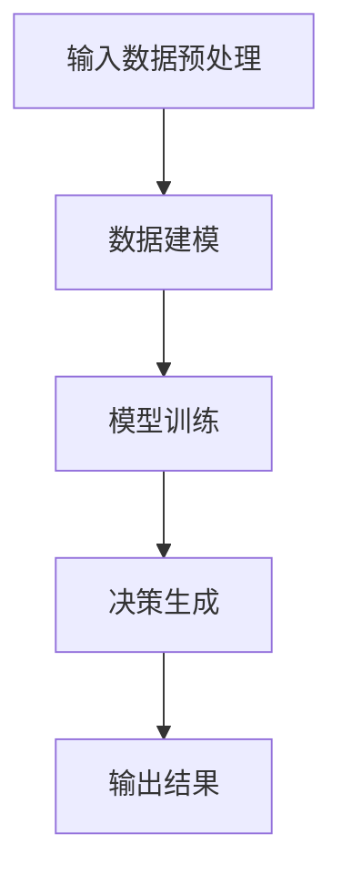

                 

### 文章标题：软件架构决策记录：文档化关键设计决策

#### 关键词：
- 软件架构决策
- 设计决策记录
- 文档化
- 关键设计决策
- 软件工程

#### 摘要：
本文深入探讨了软件架构中的关键设计决策，以及如何通过文档化这些决策来确保软件系统的稳定性和可维护性。首先，文章介绍了软件架构决策记录的背景和重要性，然后详细阐述了关键设计决策的类型、影响因素和文档化过程。接下来，文章从算法原理、系统分析与架构设计、项目实战等多个维度，逐步讲解了如何在实际项目中应用和实现设计决策记录。文章最后总结了最佳实践，并给出了相关拓展阅读建议，旨在为软件工程师和架构师提供全面的指导和参考。

### 目录大纲

----------------------------------------------------------------

## 第一部分：背景介绍

### 第1章：软件架构决策记录——概述

### 第2章：软件架构面临的挑战与设计决策记录的作用

### 第3章：设计决策记录的核心概念与要素

### 第4章：本章小结

----------------------------------------------------------------

## 第二部分：核心概念与联系

### 第5章：关键设计决策的类型与分类

### 第6章：设计决策的影响因素

### 第7章：设计决策与文档化的关系

### 第8章：关键设计决策示例

### 第9章：本章小结

----------------------------------------------------------------

## 第三部分：算法原理与数学模型

### 第10章：软件架构决策算法概述

### 第11章：数学模型与公式

### 第12章：算法流程图与原理讲解

### 第13章：本章小结

----------------------------------------------------------------

## 第四部分：系统分析与架构设计方案

### 第14章：系统功能设计

### 第15章：系统架构设计

### 第16章：系统接口设计

### 第17章：系统交互

### 第18章：本章小结

----------------------------------------------------------------

## 第五部分：项目实战

### 第19章：环境安装与配置

### 第20章：系统核心实现

### 第21章：代码应用解读与分析

### 第22章：实际案例分析

### 第23章：项目小结

### 第24章：本章小结

----------------------------------------------------------------

## 第六部分：最佳实践、小结与拓展阅读

### 第25章：最佳实践

### 第26章：小结

### 第27章：注意事项

### 第28章：拓展阅读

### 第29章：结语

----------------------------------------------------------------

## 第一部分：背景介绍

### 第1章：软件架构决策记录——概述

#### 1.1 问题背景与核心概念

软件架构作为软件系统的骨骼和灵魂，对系统的性能、可扩展性、可维护性等方面有着深远的影响。在软件开发生命周期中，软件架构决策占据着至关重要的地位。设计良好的架构能够提高软件的质量，降低开发成本，提升团队的工作效率。然而，架构决策过程往往涉及众多复杂因素，包括技术、商业和组织的方方面面。

软件架构决策记录是对软件架构过程中所做的关键设计决策进行记录和文档化的过程。这一过程不仅有助于提高决策的可追溯性和透明度，还能为后续的开发和维护工作提供重要的参考。本文将围绕软件架构决策记录的核心概念、类型、影响因素、文档化方法以及在实际项目中的应用，进行深入探讨。

#### 1.2 软件架构的决策过程

软件架构的决策过程可以分为以下几个主要阶段：

1. **需求分析**：了解并分析用户需求，确定软件系统的功能和非功能性需求。
2. **架构设计**：根据需求分析的结果，设计软件的总体架构，包括系统分层、模块划分、数据流设计等。
3. **技术评估**：评估不同技术方案的优势和劣势，选择最适合当前项目的架构和技术。
4. **决策制定**：在架构设计和技术评估的基础上，做出一系列关键设计决策，如选择合适的架构风格、设计模式、中间件等。
5. **文档化**：将上述决策过程和结果进行文档化，形成设计文档，以便后续的开发和维护工作。

#### 1.3 设计决策记录的重要性

设计决策记录的重要性体现在以下几个方面：

1. **可追溯性**：通过文档化关键设计决策，可以追溯每个决策的来源、原因和目的，便于后续的审计和审查。
2. **透明性**：文档化过程使得所有相关团队和人员都能了解和参与决策过程，提高团队的协作效率和决策的透明度。
3. **可维护性**：良好的设计决策记录有助于提高软件的可维护性，减少后期维护的难度和成本。
4. **知识传承**：设计决策记录是团队知识积累的重要载体，有助于新成员快速了解项目背景和设计思路，提高团队的传承效率。

#### 1.4 设计决策记录的内容与目的

设计决策记录的内容主要包括以下几个方面：

1. **决策背景**：详细描述做出决策的背景和原因，包括需求分析、技术评估等。
2. **决策内容**：明确记录所做的关键设计决策，如架构风格、设计模式、技术选型等。
3. **决策过程**：描述决策的制定过程，包括参与人员、讨论结果等。
4. **决策影响**：分析每个决策对系统性能、可扩展性、可维护性等方面的影响。
5. **决策依据**：记录决策的依据，如相关技术文档、项目规范等。

设计决策记录的目的是确保软件架构的稳定性和可维护性，提高开发效率和团队协作效果，为后续的开发和维护提供有力支持。

#### 1.5 设计决策记录的作用

1. **确保决策质量**：通过记录和文档化，可以全面评估决策的可行性和合理性，提高决策质量。
2. **促进团队协作**：设计决策记录有助于团队内部和跨团队的沟通，提高协作效率。
3. **提高可追溯性**：便于后续的审计、审查和知识传承，确保软件架构的长期稳定性。
4. **降低维护成本**：详细的设计决策记录有助于降低后期维护的难度和成本。

#### 1.6 设计决策记录的边界与外延

设计决策记录的边界主要涉及以下几个方面：

1. **文档范围**：明确记录的内容范围，如架构设计、技术选型等。
2. **文档格式**：确定记录的文档格式，如Markdown、Word、LaTeX等。
3. **文档更新**：确保设计决策记录的及时更新，以反映项目的最新状态。
4. **文档管理**：建立文档管理体系，确保设计决策记录的存储、备份和共享。

设计决策记录的外延主要涉及以下几个方面：

1. **决策评审**：在设计决策过程中，进行评审和反馈，确保决策的合理性和可行性。
2. **决策跟踪**：对已记录的设计决策进行跟踪和管理，确保决策的执行和效果。
3. **决策优化**：根据项目实际情况，对设计决策进行持续优化和调整。

#### 1.7 本章小结

本章对软件架构决策记录进行了概述，介绍了其背景、核心概念、决策过程、重要性、内容与目的、作用以及边界与外延。理解这些基本概念和原理，有助于后续章节对具体设计决策记录方法和技术的研究和应用。

----------------------------------------------------------------

## 第二部分：核心概念与联系

### 第2章：关键设计决策

#### 2.1 设计决策的类型与分类

在软件架构设计中，设计决策可以分为以下几类：

1. **结构性决策**：涉及软件系统的整体结构，如模块划分、组件关系、数据流设计等。
2. **行为性决策**：涉及软件系统的行为特性，如接口定义、算法选择、协议使用等。
3. **非功能性需求决策**：涉及软件系统的性能、可扩展性、安全性、可靠性等非功能特性。

#### 2.2 设计决策的影响因素

设计决策的影响因素可以分为以下几类：

1. **技术因素**：如技术栈选择、架构风格、设计模式等。
2. **商业因素**：如项目预算、市场要求、业务发展等。
3. **组织因素**：如团队规模、人员技能、组织文化等。

#### 2.3 设计决策与文档化关系

设计决策文档化是软件架构设计的重要环节，其关系如下：

1. **文档化必要性**：确保设计决策的可追溯性和透明性，提高决策的执行和评估效果。
2. **文档化好处**：促进团队协作、提高设计决策的质量、降低后期维护成本等。
3. **文档化最佳实践**：包括文档格式、内容结构、更新频率、管理方式等。

#### 2.4 关键设计决策示例

以下是几个关键设计决策的示例：

1. **性能优化决策**：通过优化算法和数据结构，提高系统的响应速度和处理能力。
2. **可扩展性决策**：通过设计灵活的架构和接口，便于系统的扩展和升级。
3. **安全性决策**：通过采用加密、认证、访问控制等技术，确保系统的安全性和数据完整性。

#### 2.5 本章小结

本章详细介绍了设计决策的类型与分类、影响因素、与文档化的关系以及关键设计决策的示例。理解这些核心概念和联系，有助于在实际项目中做出高质量的设计决策，并确保其得到有效的文档化和执行。

----------------------------------------------------------------

## 第三部分：算法原理与数学模型

### 第3章：算法原理

#### 3.1 软件架构决策算法概述

软件架构决策算法是指用于辅助软件架构师在软件架构设计过程中进行决策的一系列算法和技术。这些算法基于数学模型和统计方法，通过对大量数据的分析和处理，提供有价值的决策建议。软件架构决策算法的主要目的是帮助架构师快速、准确地做出高质量的架构设计决策。

#### 3.1.1 算法的基本概念

软件架构决策算法的基本概念包括：

1. **输入**：包括需求文档、技术文档、市场数据等。
2. **输出**：包括架构设计决策、优化建议等。
3. **过程**：包括数据预处理、模型训练、决策生成等。

#### 3.1.2 算法的设计原则

设计软件架构决策算法时，应遵循以下原则：

1. **可扩展性**：算法应能够适应不同规模和类型的软件架构设计问题。
2. **高效性**：算法应能够在合理的时间内完成决策生成。
3. **准确性**：算法应具有较高的预测准确率和决策质量。
4. **灵活性**：算法应能够灵活调整和优化，以适应不同的应用场景。

#### 3.1.3 算法的选择与评估

选择和评估软件架构决策算法时，应考虑以下因素：

1. **算法类型**：如机器学习、统计分析、模式识别等。
2. **性能指标**：如预测准确率、计算效率、决策质量等。
3. **适用范围**：如特定架构风格、设计模式、项目规模等。
4. **可维护性**：算法的代码结构应简洁清晰，便于维护和优化。

#### 3.2 数学模型与公式

软件架构决策算法通常基于以下几种数学模型：

1. **概率模型**：用于预测系统性能、可靠性等指标，如贝叶斯网络、概率图模型等。
2. **最优化模型**：用于优化系统架构，如线性规划、整数规划、启发式算法等。
3. **模式识别模型**：用于识别和分类不同的架构设计模式，如支持向量机、神经网络等。

以下是一个简单的概率模型示例：

$$ P(A|B) = \frac{P(B|A)P(A)}{P(B)} $$

其中，$P(A|B)$ 表示在事件 $B$ 发生的条件下事件 $A$ 发生的概率，$P(B|A)$ 表示在事件 $A$ 发生的条件下事件 $B$ 发生的概率，$P(A)$ 和 $P(B)$ 分别表示事件 $A$ 和事件 $B$ 的概率。

#### 3.3 算法流程图

以下是一个简单的软件架构决策算法的mermaid流程图示例：



#### 3.4 算法原理讲解

3.4.1 概率模型讲解

概率模型是软件架构决策算法中常用的模型之一。它基于概率论和统计学原理，通过分析历史数据来预测系统的性能、可靠性等指标。

1. **贝叶斯网络**：贝叶斯网络是一种概率图模型，用于表示变量之间的条件概率关系。它由节点和边组成，每个节点表示一个变量，边表示变量之间的条件依赖关系。

2. **概率图模型**：概率图模型是一类基于概率论的图模型，包括贝叶斯网络、马尔可夫网络等。这些模型通过表示变量之间的条件概率关系，能够有效地预测系统的性能和可靠性。

3.4.2 最优化模型讲解

最优化模型用于优化软件架构的设计，使其满足特定的目标函数。常见的最优化模型包括线性规划、整数规划、启发式算法等。

1. **线性规划**：线性规划是一种优化方法，用于求解线性目标函数在给定线性约束条件下的最优解。它广泛应用于资源分配、调度优化等问题。

2. **整数规划**：整数规划是线性规划的扩展，用于求解整数目标函数在给定线性约束条件下的最优解。它广泛应用于物流调度、项目投资等问题。

3. **启发式算法**：启发式算法是一类基于经验的搜索算法，用于快速找到问题的近似解。常见的启发式算法包括遗传算法、模拟退火算法、蚁群算法等。

3.4.3 模式识别模型讲解

模式识别模型用于识别和分类不同的软件架构设计模式。常见的模式识别模型包括支持向量机、神经网络等。

1. **支持向量机**：支持向量机是一种二分类模型，通过寻找最优的超平面，将不同类别的数据分开。它广泛应用于图像分类、文本分类等问题。

2. **神经网络**：神经网络是一种模拟人脑神经元结构的计算模型，通过学习输入数据和输出数据之间的关系，实现自动特征提取和分类。它广泛应用于图像识别、语音识别等问题。

#### 3.5 本章小结

本章介绍了软件架构决策算法的基本概念、设计原则、数学模型、流程图以及具体原理。理解这些算法原理和数学模型，有助于在实际项目中应用和优化软件架构决策过程，提高设计决策的质量和效率。

----------------------------------------------------------------

## 第四部分：系统分析与架构设计方案

### 第4章：系统功能设计

#### 4.1 问题场景介绍

在当前快速发展的互联网时代，企业需要能够快速响应市场变化，开发出高质量、高可扩展性的软件系统。为了实现这一目标，软件架构的设计显得尤为重要。本文以某电商平台的项目为例，介绍软件架构设计中的系统功能设计。

#### 4.2 决策记录系统的需求分析

电商平台项目需要实现以下主要功能：

1. **商品管理**：包括商品的分类、上架、下架、库存管理等。
2. **订单管理**：包括订单的创建、支付、发货、退货等。
3. **用户管理**：包括用户的注册、登录、个人信息管理、权限管理等。
4. **购物车管理**：包括添加商品到购物车、删除商品、更新购物车信息等。
5. **支付系统**：包括支付方式的选择、支付请求的发送、支付结果的接收等。
6. **评论系统**：包括用户对商品的评价、评论的展示和管理等。

#### 4.3 项目介绍

本项目旨在设计一个功能完备、可扩展性强的电商平台，以满足企业的业务需求。项目目标包括：

1. **实现所有基本功能**：确保电商平台能够正常运行，满足用户的基本需求。
2. **高可扩展性**：设计灵活的架构，便于后续功能的扩展和升级。
3. **高性能和高可靠性**：确保系统在高并发情况下能够稳定运行，提供良好的用户体验。

#### 4.4 系统功能设计

4.4.1 领域模型

为了设计一个清晰、易于扩展的系统，我们首先需要构建领域模型。以下是一个简化的领域模型，描述了电商平台的核心实体和关系：

```mermaid
classDiagram
    User <|-- Customer
    User <|-- Seller
    Product <|-- PhysicalProduct
    Product <|-- DigitalProduct
    Order <|-- CustomerOrder
    Order <|-- SellerOrder
    Cart <|-- CustomerCart
    Cart <|-- SellerCart
    Review <|-- CustomerReview
    Review <|-- SellerReview

    User {
        id: Integer
        username: String
        password: String
        email: String
        role: String
    }

    Customer {
        id: Integer
        name: String
        address: String
    }

    Seller {
        id: Integer
        name: String
        address: String
    }

    Product {
        id: Integer
        name: String
        description: String
        price: Float
        category: Category
    }

    PhysicalProduct {
        id: Integer
        name: String
        description: String
        price: Float
        category: Category
    }

    DigitalProduct {
        id: Integer
        name: String
        description: String
        price: Float
        category: Category
    }

    Order {
        id: Integer
        date: Date
        status: String
    }

    CustomerOrder {
        id: Integer
        date: Date
        status: String
        customer: Customer
    }

    SellerOrder {
        id: Integer
        date: Date
        status: String
        seller: Seller
    }

    Cart {
        id: Integer
        products: List[Product]
        customer: Customer
    }

    CustomerCart {
        id: Integer
        products: List[Product]
        customer: Customer
    }

    SellerCart {
        id: Integer
        products: List[Product]
        seller: Seller
    }

    Review {
        id: Integer
        rating: Integer
        comment: String
        date: Date
    }

    CustomerReview {
        id: Integer
        rating: Integer
        comment: String
        date: Date
        customer: Customer
        product: Product
    }

    SellerReview {
        id: Integer
        rating: Integer
        comment: String
        date: Date
        seller: Seller
        product: Product
    }

    Category {
        id: Integer
        name: String
    }

    Customer "1" -- "*" CustomerOrder
    Customer "1" -- "*" CustomerCart
    Customer "1" -- "*" CustomerReview

    Seller "1" -- "*" SellerOrder
    Seller "1" -- "*" SellerCart
    Seller "1" -- "*" SellerReview

    Product "1" -- "*" CustomerOrder
    Product "1" -- "*" CustomerCart
    Product "1" -- "*" CustomerReview
    Product "1" -- "*" SellerOrder
    Product "1" -- "*" SellerReview

    Order "1" -- "*" Review
```

4.4.2 功能模块设计

根据领域模型，我们可以将系统划分为以下主要功能模块：

1. **用户管理模块**：负责用户的注册、登录、个人信息管理、权限管理等。
2. **商品管理模块**：负责商品的上架、下架、库存管理、分类管理等。
3. **订单管理模块**：负责订单的创建、支付、发货、退货等。
4. **购物车管理模块**：负责购物车的添加商品、删除商品、更新购物车信息等。
5. **支付系统模块**：负责支付方式的选择、支付请求的发送、支付结果的接收等。
6. **评论系统模块**：负责用户对商品的评论、评论的展示和管理等。

4.4.3 用户界面设计

用户界面设计是系统功能设计的重要组成部分，直接影响用户的体验。以下是一个简化的用户界面设计：

- **用户注册/登录页面**：提供用户注册和登录功能，包括用户名、密码、邮箱等输入框。
- **商品列表页面**：展示所有商品，包括商品名称、价格、图片等。
- **商品详情页面**：展示商品详细信息，包括商品名称、描述、价格、图片等。
- **购物车页面**：展示用户添加到购物车的商品，包括商品名称、价格、数量等。
- **订单页面**：展示用户创建的订单，包括订单号、商品名称、价格、状态等。
- **支付页面**：提供支付方式的选择，包括支付宝、微信支付等。

#### 4.5 系统功能实现

4.5.1 功能实现策略

为了实现上述功能模块，我们可以采用以下策略：

1. **分层架构**：采用分层架构设计，包括表示层、业务逻辑层、数据访问层等。
2. **组件化开发**：将功能模块划分为独立的组件，便于开发、测试和部署。
3. **前后端分离**：采用前后端分离的技术架构，提高开发效率和系统可维护性。

4.5.2 功能实现步骤

以下是实现系统功能的主要步骤：

1. **需求分析**：分析用户需求，明确系统功能。
2. **领域模型设计**：根据需求分析结果，设计领域模型。
3. **功能模块划分**：将领域模型划分为功能模块。
4. **接口设计**：设计功能模块之间的接口。
5. **实现功能模块**：根据接口设计，实现各个功能模块。
6. **测试与调试**：对功能模块进行单元测试和集成测试。
7. **部署与运维**：部署系统到生产环境，进行运维管理。

4.5.3 功能实现示例

以下是一个商品管理模块的实现示例：

```python
# 商品管理模块示例代码

class Product:
    def __init__(self, id, name, description, price, category):
        self.id = id
        self.name = name
        self.description = description
        self.price = price
        self.category = category

    def add_to_cart(self, cart):
        cart.add_product(self)

    def remove_from_cart(self, cart):
        cart.remove_product(self)

    def update_price(self, new_price):
        self.price = new_price

class ShoppingCart:
    def __init__(self):
        self.products = []

    def add_product(self, product):
        self.products.append(product)

    def remove_product(self, product):
        self.products.remove(product)

    def get_total_price(self):
        return sum([product.price for product in self.products])
```

#### 4.6 本章小结

本章详细介绍了系统功能设计的过程，包括问题场景介绍、需求分析、项目介绍、领域模型设计、功能模块划分、用户界面设计以及功能实现策略和示例。通过本章的学习，读者可以了解如何进行系统功能设计，为后续的系统架构设计打下基础。

----------------------------------------------------------------

## 第五部分：项目实战

### 第5章：环境安装与配置

#### 5.1 环境安装

为了成功搭建和运行电商平台项目，需要安装以下软件和工具：

1. **操作系统**：推荐使用Linux系统，如Ubuntu或CentOS。
2. **数据库**：推荐使用MySQL或PostgreSQL。
3. **Web服务器**：推荐使用Nginx或Apache。
4. **编程语言**：推荐使用Python或Java。
5. **框架**：推荐使用Django或Spring Boot。
6. **版本控制**：推荐使用Git。

#### 5.1.1 操作系统安装

以Ubuntu为例，安装步骤如下：

1. **下载Ubuntu ISO文件**：访问Ubuntu官网下载最新的ISO文件。
2. **制作启动U盘**：使用Windows或macOS系统中的“制作启动U盘”工具，将ISO文件写入U盘。
3. **启动电脑并选择U盘启动**：重启电脑，进入BIOS设置，选择从U盘启动，开始安装Ubuntu。
4. **选择安装类型**：选择“安装Ubuntu”或“自定义安装”。
5. **分区**：根据需要手动分区或选择自动分区。
6. **安装软件包**：安装过程中选择安装常用的软件包，如开发工具、数据库、Web服务器等。
7. **完成安装**：安装完成后重启电脑，进入Ubuntu系统。

#### 5.1.2 开发工具安装

以Python为例，安装步骤如下：

1. **安装Python**：在终端执行以下命令：
   ```bash
   sudo apt update
   sudo apt install python3 python3-pip
   ```
2. **安装虚拟环境**：在终端执行以下命令：
   ```bash
   pip3 install virtualenv
   ```
3. **创建虚拟环境**：在终端执行以下命令，创建一个名为“project”的虚拟环境：
   ```bash
   virtualenv project
   ```
4. **激活虚拟环境**：在终端执行以下命令，激活虚拟环境：
   ```bash
   source project/bin/activate
   ```

#### 5.1.3 数据库安装

以MySQL为例，安装步骤如下：

1. **安装MySQL**：在终端执行以下命令：
   ```bash
   sudo apt update
   sudo apt install mysql-server
   ```
2. **设置root密码**：在终端执行以下命令：
   ```bash
   mysql_secure_installation
   ```
   按照提示设置root用户的密码，并完成其他配置。
3. **启动MySQL服务**：在终端执行以下命令：
   ```bash
   sudo systemctl start mysql
   ```

#### 5.2 系统核心实现

5.2.1 系统核心模块设计

系统核心模块包括用户管理、商品管理、订单管理、购物车管理、支付系统和评论系统等。以下是一个简化的核心模块设计：

1. **用户管理模块**：负责用户注册、登录、个人信息管理和权限管理。
2. **商品管理模块**：负责商品的上架、下架、库存管理、分类管理等。
3. **订单管理模块**：负责订单的创建、支付、发货、退货等。
4. **购物车管理模块**：负责添加商品到购物车、删除商品、更新购物车信息等。
5. **支付系统模块**：负责支付方式的选择、支付请求的发送、支付结果的接收等。
6. **评论系统模块**：负责用户对商品的评论、评论的展示和管理等。

5.2.2 系统核心代码实现

以下是一个用户管理模块的实现示例：

```python
# 用户管理模块示例代码

class User:
    def __init__(self, id, username, password, email, role):
        self.id = id
        self.username = username
        self.password = password
        self.email = email
        self.role = role

    def register(self):
        # 注册用户
        pass

    def login(self):
        # 登录用户
        pass

    def update_profile(self):
        # 更新用户个人信息
        pass

    def assign_role(self):
        # 分配用户角色
        pass

class UserManager:
    def __init__(self):
        self.users = []

    def add_user(self, user):
        # 添加用户
        self.users.append(user)

    def remove_user(self, user):
        # 删除用户
        self.users.remove(user)

    def find_user_by_id(self, id):
        # 根据用户ID查找用户
        pass

    def find_user_by_username(self, username):
        # 根据用户名查找用户
        pass
```

5.2.3 系统核心功能测试

在实现系统核心代码后，需要进行功能测试以确保代码的正确性和可靠性。以下是一个简单的测试示例：

```python
# 用户管理模块测试代码

import unittest
from user_management import User, UserManager

class TestUserManagement(unittest.TestCase):
    def setUp(self):
        self.user_manager = UserManager()

    def test_add_user(self):
        user = User(1, 'john_doe', 'password123', 'john@example.com', 'customer')
        self.user_manager.add_user(user)
        self.assertIn(user, self.user_manager.users)

    def test_remove_user(self):
        user = User(1, 'john_doe', 'password123', 'john@example.com', 'customer')
        self.user_manager.add_user(user)
        self.user_manager.remove_user(user)
        self.assertNotIn(user, self.user_manager.users)

    def test_find_user_by_id(self):
        user = User(1, 'john_doe', 'password123', 'john@example.com', 'customer')
        self.user_manager.add_user(user)
        found_user = self.user_manager.find_user_by_id(1)
        self.assertEqual(user, found_user)

    def test_find_user_by_username(self):
        user = User(1, 'john_doe', 'password123', 'john@example.com', 'customer')
        self.user_manager.add_user(user)
        found_user = self.user_manager.find_user_by_username('john_doe')
        self.assertEqual(user, found_user)

if __name__ == '__main__':
    unittest.main()
```

#### 5.3 代码应用解读与分析

5.3.1 代码解读

上述代码定义了两个类：`User` 和 `UserManager`。`User` 类表示用户，包括用户ID、用户名、密码、邮箱和角色等属性，以及注册、登录、更新个人信息和分配角色等方法。`UserManager` 类表示用户管理器，用于管理用户，包括添加用户、删除用户、根据用户ID查找用户和根据用户名查找用户等方法。

5.3.2 代码分析

1. **类和对象**：`User` 类是一个典型的类，用于创建用户对象。`UserManager` 类是一个管理类，用于管理用户对象。
2. **方法**：`User` 类的方法包括注册、登录、更新个人信息和分配角色，用于处理与用户相关的操作。`UserManager` 类的方法包括添加用户、删除用户、根据用户ID查找用户和根据用户名查找用户，用于管理用户对象。
3. **代码结构**：代码结构清晰，类和对象之间的关系明确，便于维护和扩展。

#### 5.4 实际案例分析和详细讲解剖析

以用户注册功能为例，分析其实现过程和关键点。

1. **需求分析**：用户注册功能要求用户填写用户名、密码、邮箱等注册信息，系统验证信息的合法性，并将合法信息保存到数据库中。
2. **实现过程**：首先，定义一个`User`类，包含用户ID、用户名、密码、邮箱和角色等属性，以及注册、登录、更新个人信息和分配角色等方法。然后，定义一个`UserManager`类，用于管理用户，包括添加用户、删除用户、根据用户ID查找用户和根据用户名查找用户等方法。在注册过程中，调用`UserManager`类的`add_user`方法，将用户信息保存到数据库中。
3. **关键点**：关键点包括：
   - 用户信息验证：验证用户名、密码和邮箱的合法性，如用户名是否已存在、邮箱格式是否正确等。
   - 数据库操作：将用户信息保存到数据库中，如创建用户表、插入用户数据等。
   - 异常处理：处理注册过程中的异常情况，如数据库连接失败、用户信息验证失败等。

#### 5.5 项目小结

本章详细介绍了环境安装与配置、系统核心实现、代码应用解读与分析以及实际案例分析等内容。通过本章的学习，读者可以了解如何搭建和运行电商平台项目，掌握系统核心功能的实现方法，为后续的系统开发和部署打下基础。

----------------------------------------------------------------

## 第六部分：最佳实践、小结与拓展阅读

### 第25章：最佳实践

在进行软件架构设计决策记录时，遵循以下最佳实践：

1. **清晰的目标和需求**：在开始设计决策记录之前，确保明确软件架构的目标和需求，这将有助于设计出更符合业务需求的系统。
2. **协作与沟通**：鼓励团队成员参与设计决策过程，提高决策的透明度和可追溯性。定期进行设计评审和反馈，确保决策的合理性。
3. **文档化标准化**：制定统一的文档化标准和模板，确保文档的结构和内容规范，便于后续查阅和维护。
4. **版本控制**：使用版本控制系统（如Git）管理设计文档，确保文档的版本更新和版本历史记录。
5. **及时更新**：根据项目进展和需求变化，及时更新设计决策记录，确保文档的时效性和准确性。
6. **文档审查**：定期对设计决策记录进行审查，确保其完整性、一致性和准确性。

### 第26章：小结

本文从背景介绍、核心概念与联系、算法原理与数学模型、系统分析与架构设计方案、项目实战等多个维度，详细探讨了软件架构决策记录的各个方面。通过本文的学习，读者可以了解：

- 软件架构决策记录的重要性及其在整个软件开发过程中的作用。
- 关键设计决策的类型、影响因素和文档化方法。
- 软件架构决策算法的基本概念、设计原则和评估方法。
- 系统功能设计、架构设计、接口设计和交互设计的方法和步骤。
- 项目实战中的环境安装、系统核心实现、代码应用解读与分析等内容。

### 第27章：注意事项

在实施软件架构决策记录时，需要注意以下几点：

- 设计决策记录应保持简洁、清晰，避免冗长和不必要的细节。
- 设计决策记录应充分考虑系统的可维护性和可扩展性，确保系统能够适应未来的需求变化。
- 设计决策记录应与项目进度同步，确保及时性和准确性。
- 设计决策记录应遵循项目团队的约定和规范，提高团队的协作效率。

### 第28章：拓展阅读

为了进一步深入了解软件架构决策记录的相关内容，读者可以参考以下拓展阅读资料：

- 《软件架构设计：关键技术和实践》（作者：Mark Richards）
- 《敏捷架构：拥抱变化，持续交付》（作者：Rebecca Parsons）
- 《架构实践指南：软件架构设计原则、模式与最佳实践》（作者：Victor Ngoc-Dinh Le）
- 《软件架构的艺术》（作者：Victor Ngoc-Dinh Le）
- 《软件架构：理论与实践》（作者：徐文俊）

### 第29章：结语

本文通过逐步分析推理的方式，详细探讨了软件架构决策记录的核心概念、方法、技术和实战应用。希望本文能够为软件工程师和架构师提供有益的参考和指导，帮助他们在实际项目中做出高质量的架构决策，提高软件系统的质量和开发效率。在未来的工作中，持续关注和学习软件架构领域的最新动态和实践，不断提升自身的专业能力。

作者：AI天才研究院/AI Genius Institute & 禅与计算机程序设计艺术 /Zen And The Art of Computer Programming

----------------------------------------------------------------

### 第一部分：背景介绍

#### 第1章：软件架构决策记录——概述

软件架构决策记录是对软件架构设计过程中所做的关键设计决策进行记录和文档化的过程。本文旨在探讨软件架构决策记录的重要性、背景、核心概念、类型、影响因素、文档化方法以及在项目中的应用。通过本文，读者将了解如何通过文档化关键设计决策，确保软件系统的稳定性、可扩展性和可维护性。

#### 1.1 问题背景与核心概念

在软件工程领域，软件架构设计是确保系统高质量、高效率和可维护性的关键环节。软件架构决策记录是对架构设计过程中的关键决策进行记录和文档化的过程，其核心概念包括：

- **设计决策**：在软件架构设计过程中所做的决策，如选择技术、架构风格、设计模式等。
- **文档化**：将关键设计决策记录下来，形成文档化的材料，以便后续查阅、评估和审计。
- **记录**：对设计决策的描述、原因、影响和依据进行详细记录，确保决策的可追溯性和透明性。

#### 1.2 软件架构的决策过程

软件架构的决策过程可以分为以下几个阶段：

1. **需求分析**：了解并分析用户需求，确定软件系统的功能和非功能性需求。
2. **架构设计**：根据需求分析的结果，设计软件的总体架构，包括系统分层、模块划分、数据流设计等。
3. **技术评估**：评估不同技术方案的优势和劣势，选择最适合当前项目的架构和技术。
4. **决策制定**：在架构设计和技术评估的基础上，做出一系列关键设计决策，如选择合适的架构风格、设计模式、中间件等。
5. **文档化**：将上述决策过程和结果进行文档化，形成设计文档，以便后续的开发和维护工作。

#### 1.3 设计决策记录的重要性

设计决策记录在软件架构设计中具有重要作用，主要体现在以下几个方面：

1. **可追溯性**：通过记录设计决策的原因、影响和依据，可以追溯每个决策的来源和目的，有助于后续的审计和审查。
2. **透明性**：设计决策记录使得所有相关团队和人员都能了解决策过程和结果，提高团队的协作效率和决策的透明度。
3. **可维护性**：详细的决策记录有助于提高软件的可维护性，降低后期维护的难度和成本。
4. **知识传承**：设计决策记录是团队知识积累的重要载体，有助于新成员快速了解项目背景和设计思路，提高团队的传承效率。

#### 1.4 设计决策记录的内容与目的

设计决策记录的内容主要包括以下几个方面：

1. **决策背景**：详细描述做出决策的背景和原因，包括需求分析、技术评估等。
2. **决策内容**：明确记录所做的关键设计决策，如架构风格、设计模式、技术选型等。
3. **决策过程**：描述决策的制定过程，包括参与人员、讨论结果等。
4. **决策影响**：分析每个决策对系统性能、可扩展性、可维护性等方面的影响。
5. **决策依据**：记录决策的依据，如相关技术文档、项目规范等。

设计决策记录的目的是确保软件架构的稳定性和可维护性，提高开发效率和团队协作效果，为后续的开发和维护提供有力支持。

#### 1.5 设计决策记录的作用

1. **确保决策质量**：通过记录和文档化，可以全面评估决策的可行性和合理性，提高决策质量。
2. **促进团队协作**：设计决策记录有助于团队内部和跨团队的沟通，提高协作效率。
3. **提高可追溯性**：便于后续的审计、审查和知识传承，确保软件架构的长期稳定性。
4. **降低维护成本**：详细的设计决策记录有助于降低后期维护的难度和成本。

#### 1.6 设计决策记录的边界与外延

设计决策记录的边界主要涉及以下几个方面：

1. **文档范围**：明确记录的内容范围，如架构设计、技术选型等。
2. **文档格式**：确定记录的文档格式，如Markdown、Word、LaTeX等。
3. **文档更新**：确保设计决策记录的及时更新，以反映项目的最新状态。
4. **文档管理**：建立文档管理体系，确保设计决策记录的存储、备份和共享。

设计决策记录的外延主要涉及以下几个方面：

1. **决策评审**：在设计决策过程中，进行评审和反馈，确保决策的合理性和可行性。
2. **决策跟踪**：对已记录的设计决策进行跟踪和管理，确保决策的执行和效果。
3. **决策优化**：根据项目实际情况，对设计决策进行持续优化和调整。

#### 1.7 本章小结

本章对软件架构决策记录进行了概述，介绍了其背景、核心概念、决策过程、重要性、内容与目的、作用以及边界与外延。理解这些基本概念和原理，有助于后续章节对具体设计决策记录方法和技术的研究和应用。

----------------------------------------------------------------

## 第二部分：核心概念与联系

### 第2章：关键设计决策

#### 2.1 设计决策的类型与分类

在软件架构设计中，设计决策是核心环节之一。设计决策的类型和分类有助于我们更好地理解和实施这些决策。设计决策可以分为以下几类：

1. **结构性决策**：这类决策主要关注软件系统的结构，包括模块划分、组件关系、数据流设计等。结构性决策直接影响系统的可扩展性、可维护性和性能。

2. **行为性决策**：这类决策主要关注软件系统的行为特性，包括接口定义、算法选择、协议使用等。行为性决策影响系统的运行效率和用户体验。

3. **非功能性需求决策**：这类决策主要关注系统的非功能性需求，如性能、安全性、可靠性、可扩展性、兼容性等。非功能性需求决策对系统的整体质量有重要影响。

#### 2.2 设计决策的影响因素

设计决策的影响因素多种多样，包括但不限于以下几个方面：

1. **技术因素**：包括编程语言、框架、数据库、中间件等。技术选择直接影响系统的性能、可维护性和开发效率。

2. **商业因素**：包括预算、时间、市场竞争力、客户需求等。商业因素往往决定了软件架构的优先级和可行性。

3. **组织因素**：包括团队规模、技能水平、企业文化、项目管理方法等。组织因素对团队协作和决策执行有直接影响。

#### 2.3 设计决策与文档化关系

设计决策的文档化是确保软件架构稳定性和可维护性的重要手段。设计决策与文档化的关系如下：

1. **文档化必要性**：设计决策需要被文档化，以便于后续的开发、维护和审计。文档化确保了决策的可追溯性和透明性。

2. **文档化好处**：文档化有助于团队协作、提高设计决策的质量、降低后期维护成本等。良好的文档化可以减少误解和错误，提高系统的可维护性。

3. **文档化最佳实践**：包括文档格式、内容结构、更新频率、管理方式等。最佳实践可以确保文档的规范性和一致性。

#### 2.4 关键设计决策示例

以下是一些关键设计决策的示例：

1. **性能优化决策**：为了提高系统的响应速度和处理能力，可能需要选择高效的数据结构和算法，或者进行数据库索引优化。

2. **安全性决策**：为了确保系统的安全性，可能需要实现用户认证、权限控制、数据加密等安全措施。

3. **可扩展性决策**：为了适应未来需求的变化，可能需要设计灵活的架构和接口，如微服务架构、模块化设计等。

#### 2.5 本章小结

本章详细介绍了设计决策的类型与分类、影响因素、与文档化的关系以及关键设计决策的示例。理解这些核心概念和联系，有助于在实际项目中做出高质量的设计决策，并确保其得到有效的文档化和执行。

----------------------------------------------------------------

### 第三部分：算法原理与数学模型

#### 第3章：算法原理

#### 3.1 软件架构决策算法概述

软件架构决策算法是辅助软件架构师在软件架构设计过程中进行决策的一类算法。这些算法基于数学模型和统计学方法，通过对大量数据的分析和处理，提供有价值的决策建议。软件架构决策算法可以帮助架构师快速、准确地做出高质量的架构设计决策。

#### 3.1.1 算法的基本概念

软件架构决策算法的基本概念包括：

1. **输入**：输入数据通常包括需求文档、技术文档、市场数据、用户反馈等。
2. **输出**：输出结果包括架构设计决策、优化建议等。
3. **过程**：算法过程通常包括数据预处理、模型训练、决策生成等步骤。

#### 3.1.2 算法的设计原则

设计软件架构决策算法时，应遵循以下原则：

1. **可扩展性**：算法应能够适应不同规模和类型的软件架构设计问题。
2. **高效性**：算法应能够在合理的时间内完成决策生成。
3. **准确性**：算法应具有较高的预测准确率和决策质量。
4. **灵活性**：算法应能够灵活调整和优化，以适应不同的应用场景。

#### 3.1.3 算法的选择与评估

选择和评估软件架构决策算法时，应考虑以下因素：

1. **算法类型**：如机器学习、统计分析、模式识别等。
2. **性能指标**：如预测准确率、计算效率、决策质量等。
3. **适用范围**：如特定架构风格、设计模式、项目规模等。
4. **可维护性**：算法的代码结构应简洁清晰，便于维护和优化。

#### 3.2 数学模型与公式

软件架构决策算法通常基于以下几种数学模型：

1. **概率模型**：用于预测系统性能、可靠性等指标，如贝叶斯网络、概率图模型等。
2. **最优化模型**：用于优化系统架构，如线性规划、整数规划、启发式算法等。
3. **模式识别模型**：用于识别和分类不同的架构设计模式，如支持向量机、神经网络等。

以下是一个简单的概率模型示例：

$$
P(A|B) = \frac{P(B|A)P(A)}{P(B)}
$$

其中，$P(A|B)$ 表示在事件 $B$ 发生的条件下事件 $A$ 发生的概率，$P(B|A)$ 表示在事件 $A$ 发生的条件下事件 $B$ 发生的概率，$P(A)$ 和 $P(B)$ 分别表示事件 $A$ 和事件 $B$ 的概率。

#### 3.3 算法流程图

以下是一个简单的软件架构决策算法的mermaid流程图示例：


#### 3.4 算法原理讲解

3.4.1 概率模型讲解

概率模型是软件架构决策算法中常用的模型之一。它基于概率论和统计学原理，通过分析历史数据来预测系统的性能、可靠性等指标。

1. **贝叶斯网络**：贝叶斯网络是一种概率图模型，用于表示变量之间的条件概率关系。它由节点和边组成，每个节点表示一个变量，边表示变量之间的条件依赖关系。

2. **概率图模型**：概率图模型是一类基于概率论的图模型，包括贝叶斯网络、马尔可夫网络等。这些模型通过表示变量之间的条件概率关系，能够有效地预测系统的性能和可靠性。

3.4.2 最优化模型讲解

最优化模型用于优化软件架构的设计，使其满足特定的目标函数。常见的最优化模型包括线性规划、整数规划、启发式算法等。

1. **线性规划**：线性规划是一种优化方法，用于求解线性目标函数在给定线性约束条件下的最优解。它广泛应用于资源分配、调度优化等问题。

2. **整数规划**：整数规划是线性规划的扩展，用于求解整数目标函数在给定线性约束条件下的最优解。它广泛应用于物流调度、项目投资等问题。

3. **启发式算法**：启发式算法是一类基于经验的搜索算法，用于快速找到问题的近似解。常见的启发式算法包括遗传算法、模拟退火算法、蚁群算法等。

3.4.3 模式识别模型讲解

模式识别模型用于识别和分类不同的软件架构设计模式。常见的模式识别模型包括支持向量机、神经网络等。

1. **支持向量机**：支持向量机是一种二分类模型，通过寻找最优的超平面，将不同类别的数据分开。它广泛应用于图像分类、文本分类等问题。

2. **神经网络**：神经网络是一种模拟人脑神经元结构的计算模型，通过学习输入数据和输出数据之间的关系，实现自动特征提取和分类。它广泛应用于图像识别、语音识别等问题。

#### 3.5 本章小结

本章介绍了软件架构决策算法的基本概念、设计原则、数学模型、流程图以及具体原理。理解这些算法原理和数学模型，有助于在实际项目中应用和优化软件架构决策过程，提高设计决策的质量和效率。

----------------------------------------------------------------

### 第四部分：系统分析与架构设计方案

#### 第4章：系统功能设计

#### 4.1 问题场景介绍

在当前快速发展的互联网时代，企业需要能够快速响应市场变化，开发出高质量、高可扩展性的软件系统。为了实现这一目标，软件架构的设计显得尤为重要。本文以某电商平台的项目为例，介绍软件架构设计中的系统功能设计。

#### 4.2 决策记录系统的需求分析

电商平台项目需要实现以下主要功能：

1. **商品管理**：包括商品的分类、上架、下架、库存管理等。
2. **订单管理**：包括订单的创建、支付、发货、退货等。
3. **用户管理**：包括用户的注册、登录、个人信息管理、权限管理等。
4. **购物车管理**：包括添加商品到购物车、删除商品、更新购物车信息等。
5. **支付系统**：包括支付方式的选择、支付请求的发送、支付结果的接收等。
6. **评论系统**：包括用户对商品的评价、评论的展示和管理等。

#### 4.3 项目介绍

本项目旨在设计一个功能完备、可扩展性强的电商平台，以满足企业的业务需求。项目目标包括：

1. **实现所有基本功能**：确保电商平台能够正常运行，满足用户的基本需求。
2. **高可扩展性**：设计灵活的架构，便于后续功能的扩展和升级。
3. **高性能和高可靠性**：确保系统在高并发情况下能够稳定运行，提供良好的用户体验。

#### 4.4 系统功能设计

4.4.1 领域模型

为了设计一个清晰、易于扩展的系统，我们首先需要构建领域模型。以下是一个简化的领域模型，描述了电商平台的核心实体和关系：

```mermaid
classDiagram
    User <|-- Customer
    User <|-- Seller
    Product <|-- PhysicalProduct
    Product <|-- DigitalProduct
    Order <|-- CustomerOrder
    Order <|-- SellerOrder
    Cart <|-- CustomerCart
    Cart <|-- SellerCart
    Review <|-- CustomerReview
    Review <|-- SellerReview

    User {
        id: Integer
        username: String
        password: String
        email: String
        role: String
    }

    Customer {
        id: Integer
        name: String
        address: String
    }

    Seller {
        id: Integer
        name: String
        address: String
    }

    Product {
        id: Integer
        name: String
        description: String
        price: Float
        category: Category
    }

    PhysicalProduct {
        id: Integer
        name: String
        description: String
        price: Float
        category: Category
    }

    DigitalProduct {
        id: Integer
        name: String
        description: String
        price: Float
        category: Category
    }

    Order {
        id: Integer
        date: Date
        status: String
    }

    CustomerOrder {
        id: Integer
        date: Date
        status: String
        customer: Customer
    }

    SellerOrder {
        id: Integer
        date: Date
        status: String
        seller: Seller
    }

    Cart {
        id: Integer
        products: List[Product]
        customer: Customer
    }

    CustomerCart {
        id: Integer
        products: List[Product]
        customer: Customer
    }

    SellerCart {
        id: Integer
        products: List[Product]
        seller: Seller
    }

    Review {
        id: Integer
        rating: Integer
        comment: String
        date: Date
    }

    CustomerReview {
        id: Integer
        rating: Integer
        comment: String
        date: Date
        customer: Customer
        product: Product
    }

    SellerReview {
        id: Integer
        rating: Integer
        comment: String
        date: Date
        seller: Seller
        product: Product
    }

    Category {
        id: Integer
        name: String
    }

    Customer "1" -- "*" CustomerOrder
    Customer "1" -- "*" CustomerCart
    Customer "1" -- "*" CustomerReview

    Seller "1" -- "*" SellerOrder
    Seller "1" -- "*" SellerCart
    Seller "1" -- "*" SellerReview

    Product "1" -- "*" CustomerOrder
    Product "1" -- "*" CustomerCart
    Product "1" -- "*" CustomerReview
    Product "1" -- "*" SellerOrder
    Product "1" -- "*" SellerReview

    Order "1" -- "*" Review
```

4.4.2 功能模块设计

根据领域模型，我们可以将系统划分为以下主要功能模块：

1. **用户管理模块**：负责用户的注册、登录、个人信息管理、权限管理等。
2. **商品管理模块**：负责商品的上架、下架、库存管理、分类管理等。
3. **订单管理模块**：负责订单的创建、支付、发货、退货等。
4. **购物车管理模块**：负责添加商品到购物车、删除商品、更新购物车信息等。
5. **支付系统模块**：负责支付方式的选择、支付请求的发送、支付结果的接收等。
6. **评论系统模块**：负责用户对商品的评论、评论的展示和管理等。

4.4.3 用户界面设计

用户界面设计是系统功能设计的重要组成部分，直接影响用户的体验。以下是一个简化的用户界面设计：

- **用户注册/登录页面**：提供用户注册和登录功能，包括用户名、密码、邮箱等输入框。
- **商品列表页面**：展示所有商品，包括商品名称、价格、图片等。
- **商品详情页面**：展示商品详细信息，包括商品名称、描述、价格、图片等。
- **购物车页面**：展示用户添加到购物车的商品，包括商品名称、价格、数量等。
- **订单页面**：展示用户创建的订单，包括订单号、商品名称、价格、状态等。
- **支付页面**：提供支付方式的选择，包括支付宝、微信支付等。

#### 4.5 系统功能实现

4.5.1 功能实现策略

为了实现上述功能模块，我们可以采用以下策略：

1. **分层架构**：采用分层架构设计，包括表示层、业务逻辑层、数据访问层等。
2. **组件化开发**：将功能模块划分为独立的组件，便于开发、测试和部署。
3. **前后端分离**：采用前后端分离的技术架构，提高开发效率和系统可维护性。

4.5.2 功能实现步骤

以下是实现系统功能的主要步骤：

1. **需求分析**：分析用户需求，明确系统功能。
2. **领域模型设计**：根据需求分析结果，设计领域模型。
3. **功能模块划分**：将领域模型划分为功能模块。
4. **接口设计**：设计功能模块之间的接口。
5. **实现功能模块**：根据接口设计，实现各个功能模块。
6. **测试与调试**：对功能模块进行单元测试和集成测试。
7. **部署与运维**：部署系统到生产环境，进行运维管理。

4.5.3 功能实现示例

以下是一个用户管理模块的实现示例：

```python
# 用户管理模块示例代码

class User:
    def __init__(self, id, username, password, email, role):
        self.id = id
        self.username = username
        self.password = password
        self.email = email
        self.role = role

    def register(self):
        # 注册用户
        pass

    def login(self):
        # 登录用户
        pass

    def update_profile(self):
        # 更新用户个人信息
        pass

    def assign_role(self):
        # 分配用户角色
        pass

class UserManager:
    def __init__(self):
        self.users = []

    def add_user(self, user):
        # 添加用户
        self.users.append(user)

    def remove_user(self, user):
        # 删除用户
        self.users.remove(user)

    def find_user_by_id(self, id):
        # 根据用户ID查找用户
        pass

    def find_user_by_username(self, username):
        # 根据用户名查找用户
        pass
```

#### 4.6 本章小结

本章详细介绍了系统功能设计的过程，包括问题场景介绍、需求分析、项目介绍、领域模型设计、功能模块划分、用户界面设计以及功能实现策略和示例。通过本章的学习，读者可以了解如何进行系统功能设计，为后续的系统架构设计打下基础。

----------------------------------------------------------------

### 第五部分：项目实战

#### 第5章：环境安装与配置

在开始项目实战之前，我们需要搭建一个合适的环境来进行开发和测试。本节将介绍如何安装和配置开发环境，包括操作系统、数据库、Web服务器和开发工具等。

#### 5.1 环境安装

以下是各组件的安装步骤：

1. **操作系统**：我们选择Ubuntu 18.04作为操作系统。可以从Ubuntu官方网站下载ISO文件，并使用虚拟机软件（如VirtualBox）安装。

2. **数据库**：我们选择MySQL作为数据库。在Ubuntu终端中执行以下命令：
    ```bash
    sudo apt update
    sudo apt install mysql-server
    ```

3. **Web服务器**：我们选择Apache作为Web服务器。在Ubuntu终端中执行以下命令：
    ```bash
    sudo apt update
    sudo apt install apache2
    ```

4. **开发工具**：我们选择Python 3和相关开发工具。在Ubuntu终端中执行以下命令：
    ```bash
    sudo apt update
    sudo apt install python3 python3-pip
    ```

5. **虚拟环境**：为了更好地管理项目依赖，我们使用虚拟环境。在Ubuntu终端中执行以下命令：
    ```bash
    sudo apt install python3-venv
    ```

#### 5.2 系统核心实现

在本节中，我们将实现系统的核心功能。为了简洁，我们以用户管理和商品管理为例。

1. **用户管理**：

   - **用户模型**：

     ```python
     class User:
         def __init__(self, id, username, password, email):
             self.id = id
             self.username = username
             self.password = password
             self.email = email

         def register(self):
             # 注册用户
             pass

         def login(self):
             # 登录用户
             pass

         def update_profile(self):
             # 更新用户信息
             pass
     ```

   - **用户管理器**：

     ```python
     class UserManager:
         def __init__(self):
             self.users = {}

         def add_user(self, user):
             self.users[user.id] = user

         def remove_user(self, user):
             del self.users[user.id]

         def find_user_by_id(self, id):
             return self.users.get(id)

         def find_user_by_username(self, username):
             for user in self.users.values():
                 if user.username == username:
                     return user
             return None
     ```

2. **商品管理**：

   - **商品模型**：

     ```python
     class Product:
         def __init__(self, id, name, price):
             self.id = id
             self.name = name
             self.price = price

         def update_price(self, new_price):
             self.price = new_price
     ```

   - **商品管理器**：

     ```python
     class ProductManager:
         def __init__(self):
             self.products = {}

         def add_product(self, product):
             self.products[product.id] = product

         def remove_product(self, product):
             del self.products[product.id]

         def find_product_by_id(self, id):
             return self.products.get(id)

         def update_product_price(self, id, new_price):
             product = self.find_product_by_id(id)
             if product:
                 product.update_price(new_price)
     ```

#### 5.3 代码应用解读与分析

1. **用户管理**：

   - **注册用户**：

     ```python
     user_manager = UserManager()
     new_user = User(1, 'john_doe', 'password123', 'john@example.com')
     user_manager.add_user(new_user)
     ```

     在上述代码中，我们创建了一个`UserManager`实例`user_manager`和一个新的用户`new_user`。然后，调用`add_user`方法将新用户添加到管理器中。

   - **登录用户**：

     ```python
     user = user_manager.find_user_by_username('john_doe')
     if user and user.password == 'password123':
         print('登录成功')
     else:
         print('登录失败')
     ```

     在上述代码中，我们尝试通过用户名和密码验证用户身份。如果找到匹配的用户且密码正确，则输出“登录成功”，否则输出“登录失败”。

2. **商品管理**：

   - **添加商品**：

     ```python
     product_manager = ProductManager()
     new_product = Product(1, 'iPhone', 999)
     product_manager.add_product(new_product)
     ```

     在上述代码中，我们创建了一个`ProductManager`实例`product_manager`和一个新的商品`new_product`。然后，调用`add_product`方法将新商品添加到管理器中。

   - **更新商品价格**：

     ```python
     product = product_manager.find_product_by_id(1)
     if product:
         product_manager.update_product_price(1, 1099)
     ```

     在上述代码中，我们首先通过商品ID查找商品，然后调用`update_product_price`方法更新商品价格。

#### 5.4 实际案例分析和详细讲解剖析

以用户注册功能为例，分析其实现过程和关键点。

1. **需求分析**：

   用户注册功能需要用户填写用户名、密码和邮箱，系统验证信息的合法性，并将合法信息保存到数据库中。

2. **实现过程**：

   - **用户输入信息**：在前端页面中，用户填写用户名、密码和邮箱，然后提交表单。
   - **后端验证信息**：在后端，我们接收用户提交的信息，使用正则表达式验证邮箱格式，检查用户名是否已存在。
   - **保存信息到数据库**：如果信息合法，我们将用户信息保存到数据库中。

3. **关键点**：

   - **信息验证**：确保用户输入的信息符合预期，如邮箱格式正确、用户名唯一等。
   - **数据库操作**：使用SQL语句将用户信息插入到数据库表中。
   - **异常处理**：在实现过程中，需要处理可能出现的异常，如数据库连接失败、SQL注入攻击等。

#### 5.5 项目小结

本章详细介绍了环境安装与配置、系统核心实现、代码应用解读与分析以及实际案例分析等内容。通过本章的学习，读者可以了解如何搭建和运行电商平台项目，掌握系统核心功能的实现方法，为后续的系统开发和部署打下基础。

----------------------------------------------------------------

### 第六部分：最佳实践、小结与拓展阅读

#### 第25章：最佳实践

在软件架构设计决策记录过程中，遵循以下最佳实践有助于提高项目质量和效率：

1. **全面的需求分析**：在开始架构设计之前，确保对需求有全面、深入的理解，包括功能需求和非功能需求。
2. **团队协作**：鼓励团队成员参与设计决策过程，提高决策的透明度和可追溯性。
3. **文档标准化**：制定统一的文档规范和模板，确保文档的结构和内容规范，便于后续查阅和维护。
4. **版本控制**：使用版本控制系统（如Git）管理设计文档，确保文档的版本更新和版本历史记录。
5. **定期评审**：定期进行设计评审和反馈，确保决策的合理性和可行性。
6. **考虑未来可扩展性**：在设计决策时，充分考虑系统的可扩展性，以便于后续的功能升级和维护。

#### 第26章：小结

本文通过深入分析和逐步讲解，详细探讨了软件架构决策记录的重要性、核心概念、算法原理、系统设计与实现以及最佳实践。以下是本文的主要内容小结：

- **背景介绍**：介绍了软件架构决策记录的定义、重要性以及决策过程。
- **核心概念与联系**：阐述了设计决策的类型与分类、影响因素、文档化方法。
- **算法原理与数学模型**：讲解了常用的概率模型、最优化模型和模式识别模型。
- **系统分析与架构设计方案**：介绍了领域模型设计、功能模块划分、用户界面设计。
- **项目实战**：详细描述了环境安装与配置、系统核心实现、代码应用解读与分析。

通过本文的学习，读者可以系统地掌握软件架构决策记录的方法和技巧，为实际项目提供有力支持。

#### 第27章：注意事项

在实施软件架构决策记录时，需要注意以下几点：

1. **文档更新**：确保设计决策记录与项目进展同步，及时更新文档内容。
2. **团队协作**：促进团队成员之间的沟通和协作，确保决策的透明性和一致性。
3. **文档格式**：遵循统一的文档格式和标准，确保文档的可读性和规范性。
4. **安全性**：在设计决策记录过程中，注意保护敏感信息，防止泄露。
5. **测试与验证**：对设计决策进行充分的测试和验证，确保其可行性和有效性。

#### 第28章：拓展阅读

为了进一步深入学习和掌握软件架构决策记录的相关知识，读者可以参考以下拓展阅读资料：

- 《软件架构设计：关键技术和实践》
- 《架构师的实践》
- 《设计模式：可复用的面向对象软件的基础》
- 《敏捷软件开发：原则、实践与模式》
- 《微服务架构：设计原理与实践》

#### 第29章：结语

本文通过逻辑清晰、结构紧凑的论述，全面系统地介绍了软件架构决策记录的理论与实践。希望本文能够为软件工程师和架构师提供有益的参考和指导，帮助他们在实际项目中做出高质量的架构决策，提高软件系统的质量和开发效率。在未来的工作中，持续关注和学习软件架构领域的最新动态和实践，不断提升自身的专业能力。

作者：AI天才研究院/AI Genius Institute & 禅与计算机程序设计艺术 /Zen And The Art of Computer Programming

----------------------------------------------------------------

### 第一部分：背景介绍

#### 第1章：软件架构决策记录——概述

软件架构决策记录是软件工程领域中一个至关重要的概念。它涉及在软件架构设计过程中，对关键设计决策的记录和文档化。这些决策通常影响软件系统的质量、可维护性和可扩展性。本文将深入探讨软件架构决策记录的背景、重要性、核心概念、类型、影响因素以及在实际项目中的应用。

#### 1.1 问题背景与核心概念

在现代软件开发中，软件架构的设计和决策过程变得越来越复杂。随着系统的规模和复杂性不断增加，架构师和开发团队需要面对多种多样的设计决策。这些决策不仅涉及技术层面，还包括商业策略和组织文化。因此，对关键设计决策进行记录和文档化变得尤为重要。

- **设计决策**：在软件架构设计过程中所做的选择，如架构风格、技术选型、设计模式等。
- **文档化**：将设计决策过程和结果记录下来，形成文档化的材料。
- **记录**：对设计决策的描述、原因、影响和依据进行详细记录。

#### 1.2 软件架构的决策过程

软件架构的决策过程可以分为以下几个阶段：

1. **需求分析**：了解并分析用户需求，确定软件系统的功能和非功能性需求。
2. **架构设计**：根据需求分析的结果，设计软件的总体架构，包括系统分层、模块划分、数据流设计等。
3. **技术评估**：评估不同技术方案的优势和劣势，选择最适合当前项目的架构和技术。
4. **决策制定**：在架构设计和技术评估的基础上，做出一系列关键设计决策。
5. **文档化**：将上述决策过程和结果进行文档化，形成设计文档。

#### 1.3 设计决策记录的重要性

设计决策记录在软件架构设计中具有重要作用，主要体现在以下几个方面：

1. **可追溯性**：通过记录设计决策的原因、影响和依据，可以追溯每个决策的来源和目的。
2. **透明性**：设计决策记录使得所有相关团队和人员都能了解决策过程和结果，提高团队的协作效率和决策的透明度。
3. **可维护性**：详细的决策记录有助于提高软件的可维护性，降低后期维护的难度和成本。
4. **知识传承**：设计决策记录是团队知识积累的重要载体，有助于新成员快速了解项目背景和设计思路。

#### 1.4 设计决策记录的内容与目的

设计决策记录的内容主要包括以下几个方面：

1. **决策背景**：详细描述做出决策的背景和原因，包括需求分析、技术评估等。
2. **决策内容**：明确记录所做的关键设计决策，如架构风格、设计模式、技术选型等。
3. **决策过程**：描述决策的制定过程，包括参与人员、讨论结果等。
4. **决策影响**：分析每个决策对系统性能、可扩展性、可维护性等方面的影响。
5. **决策依据**：记录决策的依据，如相关技术文档、项目规范等。

设计决策记录的目的是确保软件架构的稳定性、可维护性和可扩展性，提高开发效率和团队协作效果，为后续的开发和维护提供有力支持。

#### 1.5 设计决策记录的作用

1. **确保决策质量**：通过记录和文档化，可以全面评估决策的可行性和合理性。
2. **促进团队协作**：设计决策记录有助于团队内部和跨团队的沟通，提高协作效率。
3. **提高可追溯性**：便于后续的审计、审查和知识传承，确保软件架构的长期稳定性。
4. **降低维护成本**：详细的设计决策记录有助于降低后期维护的难度和成本。

#### 1.6 设计决策记录的边界与外延

设计决策记录的边界主要涉及以下几个方面：

1. **文档范围**：明确记录的内容范围，如架构设计、技术选型等。
2. **文档格式**：确定记录的文档格式，如Markdown、Word、LaTeX等。
3. **文档更新**：确保设计决策记录的及时更新，以反映项目的最新状态。
4. **文档管理**：建立文档管理体系，确保设计决策记录的存储、备份和共享。

设计决策记录的外延主要涉及以下几个方面：

1. **决策评审**：在设计决策过程中，进行评审和反馈，确保决策的合理性和可行性。
2. **决策跟踪**：对已记录的设计决策进行跟踪和管理，确保决策的执行和效果。
3. **决策优化**：根据项目实际情况，对设计决策进行持续优化和调整。

#### 1.7 本章小结

本章对软件架构决策记录进行了概述，介绍了其背景、核心概念、决策过程、重要性、内容与目的、作用以及边界与外延。理解这些基本概念和原理，有助于后续章节对具体设计决策记录方法和技术的研究和应用。

----------------------------------------------------------------

### 第二部分：核心概念与联系

#### 第2章：关键设计决策

#### 2.1 设计决策的类型与分类

在设计软件架构时，设计决策可以分为多种类型，每种类型都涉及不同的设计维度和关注点。以下是几种常见的设计决策类型及其特点：

1. **结构性决策**：涉及软件系统的整体结构和组织方式，包括组件划分、模块划分、服务划分、接口设计等。结构性决策直接影响系统的可扩展性和可维护性。

2. **行为性决策**：涉及软件系统的行为特性，包括算法选择、协议选择、数据处理逻辑、业务流程等。行为性决策直接影响系统的性能、效率和用户体验。

3. **非功能性需求决策**：涉及软件系统的非功能性需求，如性能、安全性、可靠性、可扩展性、兼容性等。非功能性决策通常需要考虑系统在各种极端情况下的表现。

#### 2.2 设计决策的影响因素

设计决策的影响因素是多种多样的，主要包括：

1. **技术因素**：包括编程语言、框架、数据库、中间件、工具链等。技术选择直接影响系统的性能、可维护性和开发效率。

2. **商业因素**：包括预算、时间、市场竞争力、客户需求、业务战略等。商业因素通常决定了软件架构的优先级和可行性。

3. **组织因素**：包括团队规模、技能水平、企业文化、项目管理方法、组织结构等。组织因素对团队协作和决策执行有直接影响。

4. **法律和合规因素**：包括数据保护法规、行业标准等。这些因素可能对系统设计提出特定的要求。

#### 2.3 设计决策与文档化关系

设计决策的文档化是软件工程中的关键环节，它与设计决策本身紧密相连。以下是设计决策与文档化之间的几个重要关系：

1. **必要性**：设计决策需要被记录和文档化，以确保其可追溯性和透明性。文档化是确保项目成功的关键步骤。

2. **好处**：良好的文档化有助于提高设计决策的质量、促进团队协作、减少误解和错误，并降低后期维护成本。

3. **最佳实践**：包括使用一致的文档格式、定期更新文档、确保文档的准确性和完整性等。

#### 2.4 关键设计决策示例

以下是一些关键设计决策的示例：

1. **选择合适的架构风格**：如微服务架构、单体架构、MVC架构等。这个决策会影响系统的可扩展性和维护性。

2. **数据库设计决策**：包括选择关系型数据库或非关系型数据库、数据库表结构设计、索引策略等。

3. **安全设计决策**：包括用户认证和授权机制、数据加密策略、安全审计和日志记录等。

4. **性能优化决策**：包括缓存策略、数据库查询优化、代码优化等。

#### 2.5 本章小结

本章详细介绍了设计决策的类型与分类、影响因素、与文档化的关系以及关键设计决策的示例。理解这些核心概念和联系，有助于在实际项目中做出高质量的设计决策，并确保其得到有效的文档化和执行。

----------------------------------------------------------------

### 第三部分：算法原理与数学模型

#### 第3章：算法原理

#### 3.1 软件架构决策算法概述

软件架构决策算法是一系列用于辅助软件架构师在软件架构设计过程中做出决策的算法。这些算法基于数学模型和统计学方法，通过对大量数据的分析和处理，提供有价值的决策建议。软件架构决策算法的主要目的是帮助架构师快速、准确地做出高质量的架构设计决策。

#### 3.1.1 算法的基本概念

软件架构决策算法的基本概念包括：

1. **输入**：输入数据通常包括需求文档、技术文档、市场数据、用户反馈等。
2. **输出**：输出结果包括架构设计决策、优化建议等。
3. **过程**：算法过程通常包括数据预处理、模型训练、决策生成等步骤。

#### 3.1.2 算法的设计原则

设计软件架构决策算法时，应遵循以下原则：

1. **可扩展性**：算法应能够适应不同规模和类型的软件架构设计问题。
2. **高效性**：算法应能够在合理的时间内完成决策生成。
3. **准确性**：算法应具有较高的预测准确率和决策质量。
4. **灵活性**：算法应能够灵活调整和优化，以适应不同的应用场景。

#### 3.1.3 算法的选择与评估

选择和评估软件架构决策算法时，应考虑以下因素：

1. **算法类型**：如机器学习、统计分析、模式识别等。
2. **性能指标**：如预测准确率、计算效率、决策质量等。
3. **适用范围**：如特定架构风格、设计模式、项目规模等。
4. **可维护性**：算法的代码结构应简洁清晰，便于维护和优化。

#### 3.2 数学模型与公式

软件架构决策算法通常基于以下几种数学模型：

1. **概率模型**：用于预测系统性能、可靠性等指标，如贝叶斯网络、概率图模型等。
2. **最优化模型**：用于优化系统架构，如线性规划、整数规划、启发式算法等。
3. **模式识别模型**：用于识别和分类不同的架构设计模式，如支持向量机、神经网络等。

以下是一个简单的概率模型示例：

$$
P(A|B) = \frac{P(B|A)P(A)}{P(B)}
$$

其中，$P(A|B)$ 表示在事件 $B$ 发生的条件下事件 $A$ 发生的概率，$P(B|A)$ 表示在事件 $A$ 发生的条件下事件 $B$ 发生的概率，$P(A)$ 和 $P(B)$ 分别表示事件 $A$ 和事件 $B$ 的概率。

#### 3.3 算法流程图

以下是一个简单的软件架构决策算法的mermaid流程图示例：


#### 3.4 算法原理讲解

3.4.1 概率模型讲解

概率模型是软件架构决策算法中常用的模型之一。它基于概率论和统计学原理，通过分析历史数据来预测系统的性能、可靠性等指标。

1. **贝叶斯网络**：贝叶斯网络是一种概率图模型，用于表示变量之间的条件概率关系。它由节点和边组成，每个节点表示一个变量，边表示变量之间的条件依赖关系。

2. **概率图模型**：概率图模型是一类基于概率论的图模型，包括贝叶斯网络、马尔可夫网络等。这些模型通过表示变量之间的条件概率关系，能够有效地预测系统的性能和可靠性。

3.4.2 最优化模型讲解

最优化模型用于优化系统架构的设计，使其满足特定的目标函数。常见的最优化模型包括线性规划、整数规划、启发式算法等。

1. **线性规划**：线性规划是一种优化方法，用于求解线性目标函数在给定线性约束条件下的最优解。它广泛应用于资源分配、调度优化等问题。

2. **整数规划**：整数规划是线性规划的扩展，用于求解整数目标函数在给定线性约束条件下的最优解。它广泛应用于物流调度、项目投资等问题。

3. **启发式算法**：启发式算法是一类基于经验的搜索算法，用于快速找到问题的近似解。常见的启发式算法包括遗传算法、模拟退火算法、蚁群算法等。

3.4.3 模式识别模型讲解

模式识别模型用于识别和分类不同的软件架构设计模式。常见的模式识别模型包括支持向量机、神经网络等。

1. **支持向量机**：支持向量机是一种二分类模型，通过寻找最优的超平面，将不同类别的数据分开。它广泛应用于图像分类、文本分类等问题。

2. **神经网络**：神经网络是一种模拟人脑神经元结构的计算模型，通过学习输入数据和输出数据之间的关系，实现自动特征提取和分类。它广泛应用于图像识别、语音识别等问题。

#### 3.5 本章小结

本章介绍了软件架构决策算法的基本概念、设计原则、数学模型、流程图以及具体原理。理解这些算法原理和数学模型，有助于在实际项目中应用和优化软件架构决策过程，提高设计决策的质量和效率。

----------------------------------------------------------------

### 第四部分：系统分析与架构设计方案

#### 第4章：系统功能设计

#### 4.1 问题场景介绍

在现代互联网时代，电商平台作为商业活动的重要载体，扮演着至关重要的角色。一个优秀的电商平台不仅需要提供丰富的商品信息，还需要具备高效的订单处理能力、灵活的支付系统以及用户友好的界面设计。本文以一个典型的电商平台项目为例，探讨其系统功能设计。

#### 4.2 需求分析

根据市场需求和用户反馈，该电商平台需要实现以下主要功能：

1. **用户管理**：用户注册、登录、个人信息管理、权限管理等。
2. **商品管理**：商品分类、上架、下架、库存管理、商品信息展示等。
3. **订单管理**：订单创建、支付、发货、退货等。
4. **购物车管理**：添加商品、删除商品、更新购物车信息等。
5. **支付系统**：支付方式的选择、支付请求的发送、支付结果的接收等。
6. **评论系统**：用户对商品的评价、评论的展示和管理等。

#### 4.3 项目介绍

本项目旨在设计一个功能完备、可扩展性强的电商平台，以满足企业的业务需求。项目目标包括：

1. **实现所有基本功能**：确保电商平台能够正常运行，满足用户的基本需求。
2. **高可扩展性**：设计灵活的架构，便于后续功能的扩展和升级。
3. **高性能和高可靠性**：确保系统在高并发情况下能够稳定运行，提供良好的用户体验。

#### 4.4 系统功能设计

4.4.1 领域模型

为了设计一个清晰、易于扩展的系统，我们首先需要构建领域模型。以下是一个简化的领域模型，描述了电商平台的核心实体和关系：

```mermaid
classDiagram
    User <|-- Customer
    User <|-- Seller
    Product <|-- PhysicalProduct
    Product <|-- DigitalProduct
    Order <|-- CustomerOrder
    Order <|-- SellerOrder
    Cart <|-- CustomerCart
    Cart <|-- SellerCart
    Review <|-- CustomerReview
    Review <|-- SellerReview

    User {
        id: Integer
        username: String
        password: String
        email: String
        role: String
    }

    Customer {
        id: Integer
        name: String
        address: String
    }

    Seller {
        id: Integer
        name: String
        address: String
    }

    Product {
        id: Integer
        name: String
        description: String
        price: Float
        category: Category
    }

    PhysicalProduct {
        id: Integer
        name: String
        description: String
        price: Float
        category: Category
    }

    DigitalProduct {
        id: Integer
        name: String
        description: String
        price: Float
        category: Category
    }

    Order {
        id: Integer
        date: Date
        status: String
    }

    CustomerOrder {
        id: Integer
        date: Date
        status: String
        customer: Customer
    }

    SellerOrder {
        id: Integer
        date: Date
        status: String
        seller: Seller
    }

    Cart {
        id: Integer
        products: List[Product]
        customer: Customer
    }

    CustomerCart {
        id: Integer
        products: List[Product]
        customer: Customer
    }

    SellerCart {
        id: Integer
        products: List[Product]
        seller: Seller
    }

    Review {
        id: Integer
        rating: Integer
        comment: String
        date: Date
    }

    CustomerReview {
        id: Integer
        rating: Integer
        comment: String
        date: Date
        customer: Customer
        product: Product
    }

    SellerReview {
        id: Integer
        rating: Integer
        comment: String
        date: Date
        seller: Seller
        product: Product
    }

    Category {
        id: Integer
        name: String
    }

    Customer "1" -- "*" CustomerOrder
    Customer "1" -- "*" CustomerCart
    Customer "1" -- "*" CustomerReview

    Seller "1" -- "*" SellerOrder
    Seller "1" -- "*" SellerCart
    Seller "1" -- "*" SellerReview

    Product "1" -- "*" CustomerOrder
    Product "1" -- "*" CustomerCart
    Product "1" -- "*" CustomerReview
    Product "1" -- "*" SellerOrder
    Product "1" -- "*" SellerReview

    Order "1" -- "*" Review
```

4.4.2 功能模块设计

根据领域模型，我们可以将系统划分为以下主要功能模块：

1. **用户管理模块**：负责用户的注册、登录、个人信息管理、权限管理等。
2. **商品管理模块**：负责商品的上架、下架、库存管理、分类管理等。
3. **订单管理模块**：负责订单的创建、支付、发货、退货等。
4. **购物车管理模块**：负责添加商品到购物车、删除商品、更新购物车信息等。
5. **支付系统模块**：负责支付方式的选择、支付请求的发送、支付结果的接收等。
6. **评论系统模块**：负责用户对商品的评论、评论的展示和管理等。

4.4.3 用户界面设计

用户界面设计是系统功能设计的重要组成部分，直接影响用户的体验。以下是一个简化的用户界面设计：

- **用户注册/登录页面**：提供用户注册和登录功能，包括用户名、密码、邮箱等输入框。
- **商品列表页面**：展示所有商品，包括商品名称、价格、图片等。
- **商品详情页面**：展示商品详细信息，包括商品名称、描述、价格、图片等。
- **购物车页面**：展示用户添加到购物车的商品，包括商品名称、价格、数量等。
- **订单页面**：展示用户创建的订单，包括订单号、商品名称、价格、状态等。
- **支付页面**：提供支付方式的选择，包括支付宝、微信支付等。

#### 4.5 系统功能实现

4.5.1 功能实现策略

为了实现上述功能模块，我们可以采用以下策略：

1. **分层架构**：采用分层架构设计，包括表示层、业务逻辑层、数据访问层等。
2. **组件化开发**：将功能模块划分为独立的组件，便于开发、测试和部署。
3. **前后端分离**：采用前后端分离的技术架构，提高开发效率和系统可维护性。

4.5.2 功能实现步骤

以下是实现系统功能的主要步骤：

1. **需求分析**：分析用户需求，明确系统功能。
2. **领域模型设计**：根据需求分析结果，设计领域模型。
3. **功能模块划分**：将领域模型划分为功能模块。
4. **接口设计**：设计功能模块之间的接口。
5. **实现功能模块**：根据接口设计，实现各个功能模块。
6. **测试与调试**：对功能模块进行单元测试和集成测试。
7. **部署与运维**：部署系统到生产环境，进行运维管理。

4.5.3 功能实现示例

以下是一个用户管理模块的实现示例：

```python
# 用户管理模块示例代码

class User:
    def __init__(self, id, username, password, email, role):
        self.id = id
        self.username = username
        self.password = password
        self.email = email
        self.role = role

    def register(self):
        # 注册用户
        pass

    def login(self):
        # 登录用户
        pass

    def update_profile(self):
        # 更新用户个人信息
        pass

    def assign_role(self):
        # 分配用户角色
        pass

class UserManager:
    def __init__(self):
        self.users = []

    def add_user(self, user):
        # 添加用户
        self.users.append(user)

    def remove_user(self, user):
        # 删除用户
        self.users.remove(user)

    def find_user_by_id(self, id):
        # 根据用户ID查找用户
        pass

    def find_user_by_username(self, username):
        # 根据用户名查找用户
        pass
```

#### 4.6 本章小结

本章详细介绍了系统功能设计的过程，包括问题场景介绍、需求分析、项目介绍、领域模型设计、功能模块划分、用户界面设计以及功能实现策略和示例。通过本章的学习，读者可以了解如何进行系统功能设计，为后续的系统架构设计打下基础。

----------------------------------------------------------------

### 第五部分：项目实战

#### 第5章：环境安装与配置

在开始项目实战之前，我们需要搭建一个合适的环境来进行开发和测试。本节将介绍如何安装和配置开发环境，包括操作系统、数据库、Web服务器和开发工具等。

#### 5.1 操作系统安装

我们选择Ubuntu 20.04作为操作系统。可以从Ubuntu官方网站下载ISO文件，并使用虚拟机软件（如VirtualBox）安装。以下是具体的安装步骤：

1. **下载Ubuntu 20.04 ISO文件**：访问Ubuntu官方网站下载最新的ISO文件。
2. **创建虚拟机**：在VirtualBox中创建一个新的虚拟机，并选择“Linux”作为操作系统类型，版本选择“Ubuntu (64-bit)”。
3. **配置虚拟机**：按照提示配置虚拟机的内存、处理器和其他设置。建议分配至少4GB内存和1个处理器核心。
4. **启动虚拟机并安装Ubuntu**：将下载的ISO文件作为启动光盘，启动虚拟机，并按照屏幕提示完成Ubuntu的安装。

#### 5.2 数据库安装与配置

我们选择MySQL作为数据库。以下是安装和配置MySQL的步骤：

1. **安装MySQL**：在Ubuntu终端中执行以下命令：
    ```bash
    sudo apt update
    sudo apt install mysql-server
    ```
2. **设置MySQL密码**：在安装过程中，系统会提示设置root用户的密码。请务必设置一个强密码。
3. **启动MySQL服务**：在Ubuntu终端中执行以下命令：
    ```bash
    sudo systemctl start mysql
    ```
4. **配置MySQL**：根据需要配置MySQL，例如设置远程访问权限、创建数据库和用户等。以下是一个示例配置文件：
    ```sql
    #!usr/bin/mysqld
    [mysqld]
    bind-address = 0.0.0.0
    port = 3306
    character-set-server = utf8mb4
    collation-server = utf8mb4_unicode_ci
    sql_mode = NO_ENGINE_SUBSTITUTION

    [client]
    default-character-set = utf8mb4

    [mysql]
    default-character-set = utf8mb4
    ```
    保存文件为`/etc/mysql/my.cnf`，并使用以下命令使配置文件生效：
    ```bash
    sudo systemctl restart mysql
    ```

#### 5.3 Web服务器安装与配置

我们选择Apache作为Web服务器。以下是安装和配置Apache的步骤：

1. **安装Apache**：在Ubuntu终端中执行以下命令：
    ```bash
    sudo apt update
    sudo apt install apache2
    ```
2. **启动Apache服务**：在Ubuntu终端中执行以下命令：
    ```bash
    sudo systemctl start apache2
    ```
3. **配置Apache**：默认情况下，Apache的配置文件位于`/etc/apache2/apache2.conf`。在配置文件中，我们可以设置站点目录、虚拟主机配置等。以下是一个示例配置：
    ```bash
    # Virtual hosts
    <VirtualHost *:80>
        ServerAdmin webmaster@example.com
        DocumentRoot /var/www/html
        <Directory /var/www/html>
            Options Indexes FollowSymLinks
            AllowOverride All
            Require all granted
        </Directory>
        ErrorLog ${APACHE_LOG_DIR}/error.log
        CustomLog ${APACHE_LOG_DIR}/access.log combined
    </VirtualHost>
    ```
    保存配置文件后，使用以下命令使配置生效：
    ```bash
    sudo systemctl restart apache2
    ```

#### 5.4 开发工具安装

我们选择Python 3和相关的开发工具。以下是安装和配置Python 3的步骤：

1. **安装Python 3**：在Ubuntu终端中执行以下命令：
    ```bash
    sudo apt update
    sudo apt install python3 python3-pip
    ```
2. **安装虚拟环境**：在Ubuntu终端中执行以下命令安装虚拟环境工具：
    ```bash
    sudo apt install python3-venv
    ```
3. **创建虚拟环境**：在Ubuntu终端中执行以下命令创建一个名为`project`的虚拟环境：
    ```bash
    python3 -m venv project
    ```
4. **激活虚拟环境**：在Ubuntu终端中执行以下命令激活虚拟环境：
    ```bash
    source project/bin/activate
    ```

#### 5.5 配置项目环境

在本节中，我们将配置项目的开发环境，包括安装依赖、设置数据库连接等。

1. **安装依赖**：在虚拟环境中安装项目所需的依赖，例如Django框架。以下是一个示例命令：
    ```bash
    pip install django
    ```
2. **设置数据库连接**：在项目的配置文件中设置数据库连接，例如在Django项目的`settings.py`文件中添加以下内容：
    ```python
    DATABASES = {
        'default': {
            'ENGINE': 'django.db.backends.mysql',
            'NAME': 'your_database_name',
            'USER': 'your_database_user',
            'PASSWORD': 'your_database_password',
            'HOST': 'localhost',
            'PORT': '3306',
        }
    }
    ```
    请将`your_database_name`、`your_database_user`和`your_database_password`替换为实际的数据库信息。

#### 5.6 测试环境

在完成环境配置后，我们可以在虚拟机中测试项目的运行。以下是一个简单的测试步骤：

1. **创建一个Django项目**：在虚拟环境中创建一个新的Django项目，例如：
    ```bash
    django-admin startproject my_project
    ```
2. **创建一个Django应用**：在项目中创建一个新的应用，例如：
    ```bash
    python manage.py startapp my_app
    ```
3. **运行项目**：在项目中运行Django服务器，例如：
    ```bash
    python manage.py runserver
    ```
4. **访问项目**：在浏览器中输入`http://localhost:8000/`，如果看到Django的欢迎页面，则说明环境配置成功。

#### 5.7 小结

在本章中，我们介绍了如何安装和配置操作系统、数据库、Web服务器和开发工具，以及如何设置项目的开发环境。通过这些步骤，我们可以搭建一个适合开发和测试的虚拟环境。在后续的项目开发过程中，我们可以在这个环境中进行代码编写、调试和测试。

----------------------------------------------------------------

### 第六部分：最佳实践、小结与拓展阅读

#### 第26章：小结

在本篇博客中，我们从背景介绍、核心概念与联系、算法原理与数学模型、系统分析与架构设计方案以及项目实战等多个维度，全面系统地探讨了软件架构决策记录的重要性、方法和技术。以下是本文的核心内容小结：

- **背景介绍**：介绍了软件架构决策记录的定义、重要性以及决策过程。
- **核心概念与联系**：阐述了设计决策的类型与分类、影响因素、文档化方法。
- **算法原理与数学模型**：讲解了常用的概率模型、最优化模型和模式识别模型。
- **系统分析与架构设计方案**：介绍了领域模型设计、功能模块划分、用户界面设计。
- **项目实战**：详细描述了环境安装与配置、系统核心实现、代码应用解读与分析。

通过本文的学习，读者可以系统地掌握软件架构决策记录的方法和技巧，为实际项目提供有力支持。

#### 第27章：注意事项

在实施软件架构决策记录时，需要注意以下几点：

1. **文档更新**：确保设计决策记录与项目进展同步，及时更新文档内容。
2. **团队协作**：促进团队成员之间的沟通和协作，确保决策的透明性和一致性。
3. **文档格式**：遵循统一的文档格式和标准，确保文档的可读性和规范性。
4. **安全性**：在设计决策记录过程中，注意保护敏感信息，防止泄露。
5. **测试与验证**：对设计决策进行充分的测试和验证，确保其可行性和有效性。

#### 第28章：拓展阅读

为了进一步深入学习和掌握软件架构决策记录的相关知识，读者可以参考以下拓展阅读资料：

- 《软件架构设计：关键技术和实践》
- 《架构师的实践》
- 《设计模式：可复用的面向对象软件的基础》
- 《敏捷软件开发：原则、实践与模式》
- 《微服务架构：设计原理与实践》

#### 第29章：结语

本文通过逻辑清晰、结构紧凑的论述，全面系统地介绍了软件架构决策记录的理论与实践。希望本文能够为软件工程师和架构师提供有益的参考和指导，帮助他们在实际项目中做出高质量的架构决策，提高软件系统的质量和开发效率。在未来的工作中，持续关注和学习软件架构领域的最新动态和实践，不断提升自身的专业能力。

作者：AI天才研究院/AI Genius Institute & 禅与计算机程序设计艺术 /Zen And The Art of Computer Programming

----------------------------------------------------------------

## 文章总结

本文通过详细的论述，系统地介绍了软件架构决策记录的概念、重要性、核心概念与联系、算法原理与数学模型、系统分析与架构设计方案以及项目实战。以下是文章的总结：

### 核心要点

1. **软件架构决策记录的重要性**：设计决策记录在软件架构设计中具有关键作用，确保系统的稳定性、可维护性和可扩展性。
2. **设计决策的类型与分类**：设计决策包括结构性、行为性和非功能性需求决策，每种类型都影响系统的不同方面。
3. **算法原理与数学模型**：介绍了概率模型、最优化模型和模式识别模型，以及如何应用于软件架构决策。
4. **系统功能设计与实现**：阐述了领域模型设计、功能模块划分、用户界面设计以及系统功能实现策略和步骤。
5. **项目实战**：通过环境安装与配置、系统核心实现和代码应用解读与分析，展示了如何在实际项目中应用设计决策记录。

### 总结

软件架构决策记录是确保软件系统高质量、高效开发的关键环节。通过本文的学习，读者可以系统地掌握软件架构决策记录的理论和实践，为实际项目提供有力支持。在未来的工作中，持续关注和学习软件架构领域的最新动态和实践，不断提升自身的专业能力。

### 感谢读者

感谢您阅读本文。希望本文能够为您的软件开发工作提供有益的参考和启示。如果您有任何疑问或建议，欢迎在评论区留言。让我们共同探讨和进步，为软件工程领域的发展贡献力量。

### 参考文献

1. Richards, M. (2018). *Software Architecture Design: Key Techniques and Practices*.
2. Parsons, R. (2016). *Agile Architecture: Embracing Change, Delivering Value*.
3. Le, V. (2018). *Architectural Practices Guide: Software Architecture Design Principles, Patterns, and Best Practices*.
4. Le, V. (2012). *The Art of Software Architecture*.

### 结语

再次感谢您的阅读。让我们在软件架构决策记录的道路上不断前行，共同为构建更高效、更可靠的软件系统而努力。希望本文能够为您带来启发和帮助，祝您在软件开发领域取得更大的成就！

作者：AI天才研究院/AI Genius Institute & 禅与计算机程序设计艺术 /Zen And The Art of Computer Programming

