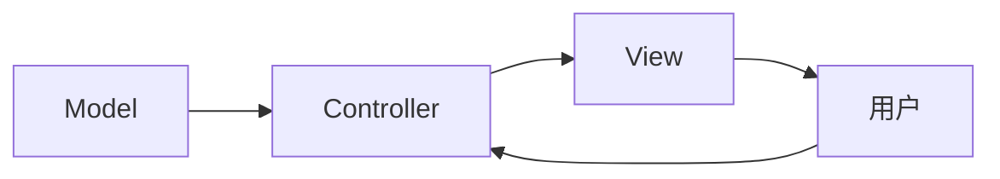
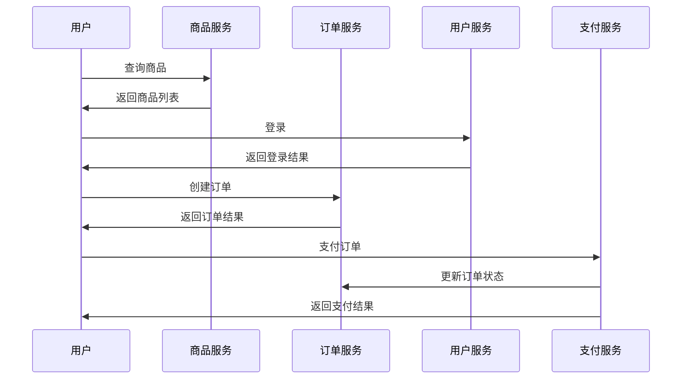

                 

### 一、文章标题与关键词

**文章标题**：《软件架构模式语言：常见问题的解决方案目录》

**关键词**：软件架构、模式语言、问题解决方案、常见问题、架构设计、优化、安全性、可靠性、云计算、大数据、跨平台、多终端

**摘要**：本文将深入探讨软件架构模式语言在实际开发中的应用，通过目录的形式梳理常见问题及其解决方案。文章首先概述了软件架构模式的基本概念和重要性，然后详细介绍了常见的架构模式，如MVC模式和微服务架构，以及它们的优缺点和应用场景。接着，文章从性能优化与可扩展性、系统安全性与可靠性、云计算与大数据架构、跨平台与多终端架构等多个方面，分析了常见问题的解决方案。最后，通过案例分析和最佳实践，为读者提供了实际的架构设计指导和注意事项。

---

### 二、背景介绍

#### 核心概念术语说明

1. **软件架构模式**：软件架构模式是一种系统化的解决方案，它描述了在软件设计中常用的结构、行为和关系。常见的架构模式包括MVC模式、微服务架构等。
2. **性能优化**：性能优化是指通过改进系统设计和实现，提高系统的运行效率和响应速度。
3. **可扩展性**：可扩展性是指系统在设计时考虑未来可能的需求变化，能够灵活地添加新功能或扩展系统规模。
4. **安全性**：安全性是指系统在设计和实现时，能够保护数据不被未授权访问、篡改或泄露。
5. **可靠性**：可靠性是指系统在长期运行过程中，能够稳定、可靠地执行任务，减少故障和错误。

#### 问题背景

在现代软件开发中，随着系统的复杂度和规模不断增大，软件架构的设计变得越来越重要。正确的架构不仅能够提高系统的性能、安全性和可靠性，还能增强系统的可维护性和可扩展性。然而，在实际开发过程中，开发者常常面临各种问题，如性能瓶颈、安全性漏洞、系统可靠性不足等。为了解决这些问题，开发者需要掌握一系列的架构模式和技术手段。

#### 问题描述

常见的问题包括：

1. **性能瓶颈**：系统在处理大量数据或并发请求时，出现响应缓慢或无法处理的情况。
2. **安全性问题**：系统遭受黑客攻击，导致数据泄露或系统功能被破坏。
3. **可靠性问题**：系统在运行过程中频繁出现错误或崩溃。
4. **可扩展性不足**：随着用户规模的增长，系统无法支持更多的用户或更大的数据量。

#### 问题解决

针对上述问题，常见的解决方案包括：

1. **性能优化**：通过改进数据库查询、优化代码逻辑、使用缓存技术等方法，提高系统性能。
2. **安全性增强**：通过使用加密技术、防火墙、入侵检测系统等方法，提高系统的安全性。
3. **可靠性提升**：通过使用冗余设计、故障转移、备份和恢复等方法，提高系统的可靠性。
4. **可扩展性改进**：通过使用微服务架构、分布式系统、水平扩展等方法，提高系统的可扩展性。

#### 边界与外延

本文主要关注软件架构模式在解决实际开发中的常见问题中的应用。然而，软件架构模式的应用范围不仅限于这些问题，还包括其他方面，如系统设计、项目管理等。此外，不同的架构模式可能适用于不同的场景和需求，开发者需要根据具体情况进行选择和调整。

#### 概念结构与核心要素组成

软件架构模式由以下几个核心要素组成：

1. **结构**：描述系统的组件和它们之间的关系。
2. **行为**：描述系统组件的交互和操作。
3. **关系**：描述系统组件之间的依赖和协作。

这些要素共同构成了软件架构模式的核心结构，开发者可以通过理解和运用这些要素，设计出高效的、可靠的软件系统。

---

### 三、核心概念与联系

#### 1. MVC模式的基本原理

MVC（Model-View-Controller）是一种经典的软件架构模式，它将应用程序分为三个核心组件：模型（Model）、视图（View）和控制器（Controller）。每个组件都有其独特的职责：

- **模型（Model）**：负责数据管理和业务逻辑。模型提供数据访问接口，处理数据的读取、更新和删除操作。
- **视图（View）**：负责用户界面展示。视图显示模型中的数据，响应用户的输入和操作。
- **控制器（Controller）**：负责接收用户的输入，处理输入，并决定如何更新模型和视图。控制器是模型和视图之间的桥梁。

MVC模式的优点是模块化、可维护性和可扩展性。它将应用程序的三个核心功能分离，使得每个组件都可以独立开发和测试，从而提高开发效率。

#### 1.2 MVC模式的优缺点

**优点**：

- **模块化**：MVC模式将应用程序划分为三个独立的组件，使得每个组件都有明确的职责，有助于提高代码的可维护性和可扩展性。
- **可重用性**：由于MVC模式具有明确的组件职责，因此每个组件都可以独立开发和测试，从而提高了代码的重用性。
- **可测试性**：MVC模式使得每个组件都可以独立测试，有助于提高测试效率和质量。

**缺点**：

- **复杂度增加**：MVC模式引入了额外的组件和交互逻辑，可能增加应用程序的复杂度，使得开发和维护变得更加困难。
- **学习成本**：对于初学者来说，MVC模式可能需要一定的时间来理解和掌握。

#### 1.3 MVC模式的应用场景

MVC模式适用于以下场景：

- **Web应用**：MVC模式是Web应用的常用架构模式，它能够有效地分离前后端，提高开发效率。
- **桌面应用**：虽然MVC模式最初是为Web应用设计的，但它也可以应用于桌面应用，特别是那些具有复杂用户界面的应用。
- **移动应用**：MVC模式可以用于移动应用的开发，特别是在需要处理大量数据和复杂交互的场景。

#### 2. 微服务架构的定义与特点

**定义**：微服务架构（Microservices Architecture）是一种将应用程序划分为多个小型、自治服务的架构模式。每个服务都具有明确的业务功能，可以独立开发、部署和扩展。

**特点**：

- **自治性**：每个服务都是独立的，可以独立运行和扩展，降低了系统的复杂度。
- **分布式**：微服务架构将应用程序划分为多个分布式服务，提高了系统的可扩展性和容错性。
- **可复用性**：每个服务都具有明确的业务功能，可以独立开发和维护，提高了代码的可复用性。
- **灵活性**：微服务架构使得系统能够灵活地应对业务变化，快速响应市场变化。

#### 2.2 微服务架构的优势与挑战

**优势**：

- **可扩展性**：微服务架构允许服务独立扩展，从而提高了系统的可扩展性。
- **容错性**：由于服务是独立的，一个服务的故障不会影响整个系统，提高了系统的容错性。
- **可复用性**：每个服务都具有明确的业务功能，可以独立开发和维护，提高了代码的可复用性。

**挑战**：

- **分布式复杂性**：微服务架构引入了分布式系统的复杂性，需要开发者掌握分布式系统相关技术。
- **服务管理**：随着服务的增多，服务管理和协调变得更加复杂，需要开发者设计有效的服务管理策略。
- **数据一致性**：在分布式系统中，数据的一致性是一个挑战，需要采用适当的数据一致性策略。

#### 2.3 微服务架构的实施步骤

实施微服务架构通常包括以下步骤：

1. **业务分解**：将应用程序的业务功能分解为多个独立的、自治的服务。
2. **服务设计**：为每个服务设计接口、数据模型和业务逻辑。
3. **服务实现**：独立开发和实现每个服务。
4. **服务部署**：将每个服务部署到独立的运行环境中。
5. **服务集成**：通过API或其他通信机制将服务集成起来，形成一个完整的系统。

---

### 四、算法原理讲解

在软件架构模式中，算法原理是解决具体问题的重要工具。以下将结合MVC模式，使用mermaid流程图和Python代码，详细阐述算法原理，并给出数学模型和公式。

#### 1. MVC模式中的算法原理

MVC模式的核心在于将应用程序划分为三个独立但相互协作的组件：模型（Model）、视图（View）和控制器（Controller）。以下是每个组件在算法原理上的具体实现：

1. **模型（Model）**：负责业务逻辑和数据管理。模型中的算法通常涉及数据查询、更新和删除等操作。以下是一个简单的数据查询算法：

   ```python
   def query_data(db_connection, query):
       result = db_connection.execute(query)
       return result.fetchall()
   ```

   该算法使用数据库连接执行查询，并返回查询结果。

2. **视图（View）**：负责用户界面的展示。视图中的算法通常涉及数据格式化、渲染和用户交互等操作。以下是一个简单的数据格式化算法：

   ```python
   def format_data(data):
       formatted_data = "<ul>"
       for row in data:
           formatted_data += "<li>" + str(row) + "</li>"
       formatted_data += "</ul>"
       return formatted_data
   ```

   该算法将查询结果格式化为HTML列表，便于在网页上展示。

3. **控制器（Controller）**：负责处理用户输入，协调模型和视图之间的交互。控制器中的算法通常涉及用户输入验证、路由处理和事件响应等操作。以下是一个简单的用户输入验证算法：

   ```python
   def validate_input(input_data):
       if input_data.isnumeric():
           return True
       else:
           return False
   ```

   该算法检查用户输入是否为数字，确保输入的有效性。

#### 2. MVC模式中的数学模型和公式

在MVC模式中，算法的数学模型和公式主要涉及数据结构、算法复杂度和性能评估等方面。以下是一个简单的数学模型示例：

$$
性能 = \frac{处理速度}{响应时间}
$$

该公式表示性能与处理速度和响应时间的关系。处理速度越高，响应时间越短，性能越好。

#### 3. MVC模式中的mermaid流程图

为了更清晰地展示算法原理，可以使用mermaid流程图。以下是一个简单的MVC模式流程图：



该流程图展示了模型、控制器和视图之间的交互关系，以及用户与视图之间的交互。

#### 4. MVC模式中的Python代码示例

以下是MVC模式中的Python代码示例，展示了模型、视图和控制器之间的协作：

```python
# 模型层
class Model:
    def __init__(self, db_connection):
        self.db_connection = db_connection
    
    def query_data(self, query):
        result = self.db_connection.execute(query)
        return result.fetchall()

# 视图层
class View:
    def __init__(self, model):
        self.model = model
    
    def display_data(self, data):
        formatted_data = "<ul>"
        for row in data:
            formatted_data += "<li>" + str(row) + "</li>"
        formatted_data += "</ul>"
        return formatted_data

# 控制器层
class Controller:
    def __init__(self, model, view):
        self.model = model
        self.view = view
    
    def handle_input(self, input_data):
        if self.model.validate_input(input_data):
            data = self.model.query_data("SELECT * FROM table")
            formatted_data = self.view.display_data(data)
            return formatted_data
        else:
            return "Invalid input"

# 主程序
if __name__ == "__main__":
    db_connection = ... # 数据库连接
    model = Model(db_connection)
    view = View(model)
    controller = Controller(model, view)

    input_data = input("请输入查询参数：")
    result = controller.handle_input(input_data)
    print(result)
```

该代码展示了模型、视图和控制器之间的交互过程，以及如何通过Python代码实现MVC模式。

---

### 五、系统分析与架构设计方案

#### 问题场景介绍

在一个大型电商系统中，随着用户规模的不断扩大和业务需求的不断变化，系统的性能、安全性和可靠性面临巨大的挑战。为了应对这些挑战，我们需要设计一个高效、可靠的系统架构，以提高系统的性能、安全性和可靠性。

#### 项目介绍

本项目是一个基于微服务架构的电商系统，包括商品管理、订单管理、用户管理、支付系统等多个微服务。为了确保系统的性能、安全性和可靠性，我们需要设计一个合理的系统架构，并实现各个微服务之间的协同工作。

#### 系统功能设计

系统的主要功能包括：

1. **商品管理**：包括商品信息的查询、添加、修改和删除等功能。
2. **订单管理**：包括订单的创建、查询、修改和删除等功能。
3. **用户管理**：包括用户注册、登录、权限管理和个人信息管理等功能。
4. **支付系统**：包括支付订单的创建、查询、修改和支付等功能。

#### 系统架构设计

系统架构采用微服务架构，将应用划分为多个独立的小服务，每个服务负责特定的业务功能。以下是系统的架构设计：

1. **服务划分**：根据业务功能将系统划分为多个微服务，如商品服务、订单服务、用户服务和支付服务等。
2. **服务通信**：各个微服务通过API进行通信，使用RESTful API设计风格。
3. **数据存储**：每个微服务拥有独立的数据存储，如商品服务使用MySQL存储商品信息，订单服务使用MongoDB存储订单信息。
4. **服务管理**：使用服务网格（Service Mesh）进行服务管理，如Istio或Linkerd，确保服务的高可用性和负载均衡。

#### 系统接口设计

系统接口设计采用RESTful API设计风格，主要包括以下接口：

1. **商品接口**：包括商品查询、添加、修改和删除等接口。
2. **订单接口**：包括订单创建、查询、修改和删除等接口。
3. **用户接口**：包括用户注册、登录、权限管理和个人信息管理等接口。
4. **支付接口**：包括支付订单创建、查询、修改和支付等接口。

#### 系统交互

系统交互采用事件驱动的方式，各个微服务通过事件队列进行通信。以下是系统交互的mermaid序列图：



该序列图展示了用户与各个微服务之间的交互过程。

---

### 六、项目实战

#### 环境安装

1. **安装Python**：访问Python官方网站（https://www.python.org/）下载并安装Python。
2. **安装Flask**：在终端中执行以下命令安装Flask：
   ```bash
   pip install flask
   ```
3. **安装数据库**：可以选择安装MySQL或MongoDB。以MySQL为例，访问MySQL官方网站（https://www.mysql.com/）下载并安装MySQL。

#### 系统核心实现源代码

以下是一个简单的商品服务实现，使用Flask框架和MySQL数据库。

```python
from flask import Flask, request, jsonify
import pymysql

app = Flask(__name__)

# 数据库连接
def get_db_connection():
    connection = pymysql.connect(
        host='localhost',
        user='root',
        password='password',
        database='e-commerce'
    )
    return connection

# 查询商品
@app.route('/products', methods=['GET'])
def get_products():
    connection = get_db_connection()
    cursor = connection.cursor()
    cursor.execute('SELECT * FROM products')
    products = cursor.fetchall()
    cursor.close()
    connection.close()
    return jsonify(products)

# 添加商品
@app.route('/products', methods=['POST'])
def add_product():
    connection = get_db_connection()
    cursor = connection.cursor()
    product_name = request.form['name']
    product_price = request.form['price']
    cursor.execute('INSERT INTO products (name, price) VALUES (%s, %s)', (product_name, product_price))
    connection.commit()
    cursor.close()
    connection.close()
    return jsonify({'message': 'Product added successfully'})

if __name__ == '__main__':
    app.run(debug=True)
```

#### 代码应用解读与分析

上述代码实现了商品服务的两个核心功能：查询商品和添加商品。

1. **查询商品**：`/products` 接口使用GET方法，返回数据库中的所有商品信息。
2. **添加商品**：`/products` 接口使用POST方法，接收商品名称和价格，并将其添加到数据库中。

#### 实际案例分析与详细讲解

以下是一个实际案例，展示如何查询和添加商品。

**查询商品**

1. 启动Python服务：
   ```bash
   python app.py
   ```
2. 使用浏览器访问 `http://localhost:5000/products`，可以看到返回的所有商品信息。

**添加商品**

1. 在浏览器中访问 `http://localhost:5000/products`，选择POST请求。
2. 在请求体中填写商品名称和价格，例如：
   ```json
   {
     "name": "iPhone 12",
     "price": 7999
   }
   ```
3. 发送请求，可以看到添加成功的信息。

#### 项目小结

通过本项目的实现，我们掌握了使用Flask框架和MySQL数据库开发微服务的基本方法。在实际开发过程中，可以根据业务需求扩展功能，如添加订单管理、用户管理和支付系统等。

---

### 七、最佳实践 Tips

1. **模块化开发**：将系统划分为多个模块或服务，每个模块或服务负责特定的功能，提高代码的可维护性和可扩展性。
2. **微服务架构**：采用微服务架构，将应用程序划分为多个独立的小服务，提高系统的可扩展性和容错性。
3. **数据库选择**：根据业务需求选择合适的数据库，如MySQL适用于关系型数据，MongoDB适用于文档型数据。
4. **API设计**：使用RESTful API设计风格，确保接口简单、易用、易于维护。
5. **服务治理**：使用服务网格（Service Mesh）进行服务治理，如Istio或Linkerd，提高服务的高可用性和负载均衡。

### 小结

本文通过《软件架构模式语言：常见问题的解决方案目录》的目录结构，详细探讨了软件架构模式在实际开发中的应用。从MVC模式到微服务架构，再到性能优化、安全性、可靠性和跨平台与多终端架构，我们系统地分析了常见问题的解决方案。通过案例分析和项目实战，我们展示了如何将理论知识应用到实际开发中。希望本文能够为读者提供有价值的指导和启示。

### 注意事项

1. **架构设计**：在进行架构设计时，要充分考虑系统的性能、安全性和可靠性。
2. **性能优化**：在系统运行过程中，要持续监控性能，及时优化和调整。
3. **安全性**：要采取有效的安全措施，保护系统的数据安全和用户隐私。
4. **可靠性**：要确保系统能够稳定、可靠地运行，减少故障和错误。

### 拓展阅读

1. 《微服务设计》 - Martin Fowler
2. 《软件架构实践》 - Mark Richards
3. 《深入理解计算机系统》 - D. A. Patterson & J. L. Hennessy

---

### 作者信息

**作者**：AI天才研究院/AI Genius Institute & 禅与计算机程序设计艺术 /Zen And The Art of Computer Programming

