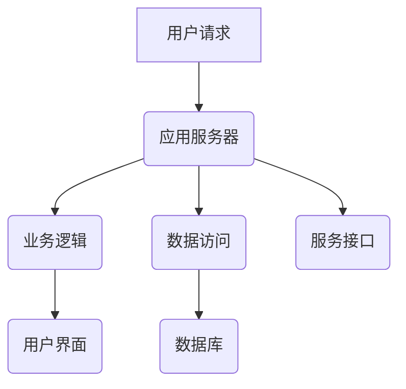
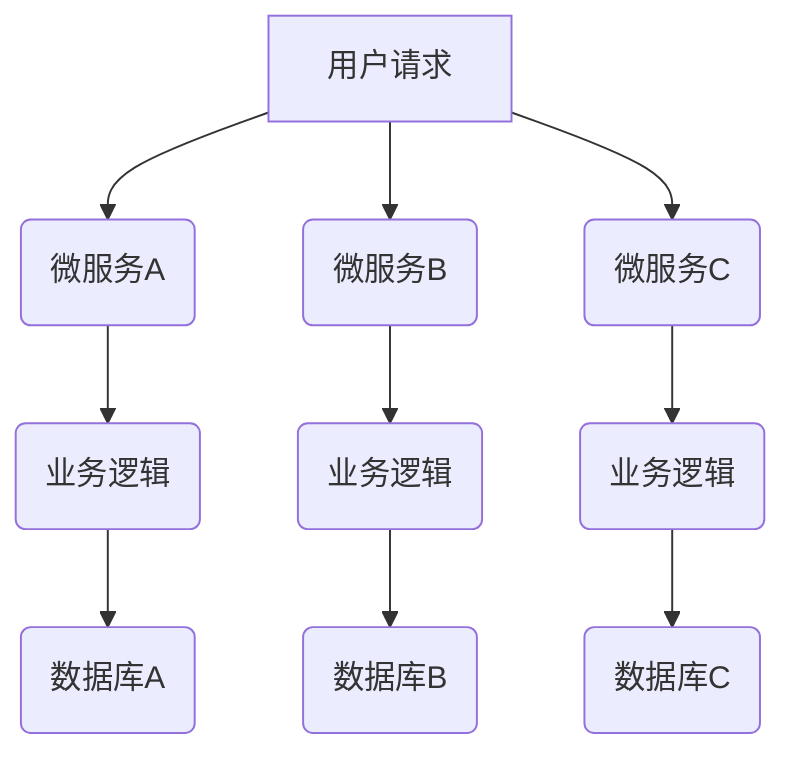
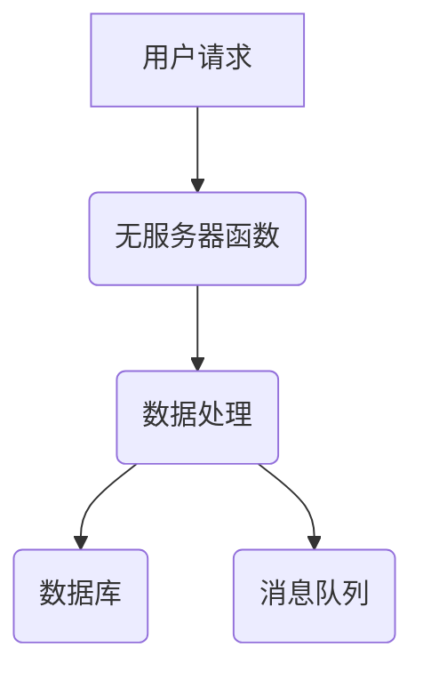

                 

# 《软件架构的演进：从单体到微服务再到无服务》

关键词：软件架构、单体架构、微服务架构、无服务架构、架构演进

摘要：本文从软件架构的基本概念出发，详细阐述了从单体架构到微服务架构，再到无服务架构的演进过程。通过对各个架构模式的特点、优势和不足的分析，结合实际案例，探讨了如何在不同场景下选择和实现合适的软件架构。

## 目录大纲

## 第一部分：架构演进基础

### 第1章：软件架构概述

#### 1.1 软件架构的定义与作用

#### 1.2 软件架构的发展历程

#### 1.3 单体架构的特点与局限性

### 第2章：单体架构的缺陷与改进

#### 2.1 单体架构的常见问题

#### 2.2 微服务架构的优势

#### 2.3 微服务架构的架构风格

### 第3章：微服务架构的实践

#### 3.1 微服务架构的设计原则

#### 3.2 微服务的开发与部署

#### 3.3 微服务的监控与治理

### 第4章：微服务架构的挑战与解决方案

#### 4.1 微服务架构的常见挑战

#### 4.2 持续集成与持续部署

#### 4.3 服务拆分与合并

## 第二部分：微服务到无服务架构的演变

### 第5章：无服务架构的概述

#### 5.1 无服务架构的定义与特点

#### 5.2 无服务架构的优势与局限

### 第6章：无服务架构的设计与实践

#### 6.1 无服务架构的设计原则

#### 6.2 无服务架构的实践案例

#### 6.3 无服务架构的优劣势分析

### 第7章：从微服务到无服务架构的演进

#### 7.1 微服务与无服务架构的比较

#### 7.2 演进路径与策略

#### 7.3 演进中的挑战与解决方案

## 第三部分：架构演进中的最佳实践

### 第8章：架构演进的方法与工具

#### 8.1 架构演进的方法论

#### 8.2 架构演进工具介绍

#### 8.3 架构演进案例分析

### 第9章：架构演进中的风险管理

#### 9.1 风险识别与评估

#### 9.2 风险应对策略

#### 9.3 演进过程中的风险管理实践

### 第10章：架构演进的成功案例

#### 10.1 成功案例介绍

#### 10.2 案例分析与启示

## 附录

### 附录 A：架构演进相关资源

#### A.1 书籍推荐

#### A.2 文章与论文

#### A.3 在线课程与培训

### 附录 B：Mermaid 流程图示例

#### B.1 单体架构流程图

#### B.2 微服务架构流程图

#### B.3 无服务架构流程图

---

## 核心概念与联系

### 单体架构

- **定义**：单体架构（Monolithic Architecture）是指将应用程序的所有功能、逻辑、数据访问层、服务接口等全部集成在一个单一的代码库中。
- **特点**：简单、易于开发和维护，但难以扩展和重构。
- **联系**：单体架构是软件架构演进的基础，它为后续的微服务和无服务架构提供了实践经验。

### 微服务架构

- **定义**：微服务架构（Microservices Architecture）是将应用程序划分为多个小型、独立的服务，每个服务专注于完成一个特定的业务功能。
- **特点**：高可扩展性、高容错性、易于维护和部署。
- **联系**：微服务架构是对单体架构的改进，它解决了单体架构在扩展性和维护性方面的局限性。

### 无服务架构

- **定义**：无服务架构（Serverless Architecture）是一种完全由第三方服务提供商管理的计算架构，开发者无需关心底层基础设施的运维。
- **特点**：零运维、高弹性、按需计费。
- **联系**：无服务架构是对微服务架构的进一步演变，它将微服务的部署和管理完全交给第三方服务提供商。

### Mermaid 流程图示例

#### 单体架构流程图

#### 微服务架构流程图

#### 无服务架构流程图

---

## 第1章：软件架构概述

### 1.1 软件架构的定义与作用

软件架构（Software Architecture）是软件开发过程中对系统结构的高层次设计，它定义了系统的组件、组件之间的关系以及它们如何协同工作来实现系统的需求。软件架构不仅包括技术层面的设计，还包括业务逻辑、用户交互、安全性、可维护性等多个方面。

软件架构在软件开发过程中起着至关重要的作用。首先，它为开发团队提供了清晰的设计蓝图，使得团队成员能够更好地理解系统的整体结构和各个组件的功能。其次，软件架构有助于优化系统性能，提高系统的可扩展性和可维护性。最后，良好的软件架构能够降低系统的复杂度，减少潜在的故障风险。

### 1.2 软件架构的发展历程

软件架构的发展历程可以分为几个阶段：

1. **单体架构（Monolithic Architecture）**：在早期的软件开发中，应用程序的所有功能都集成在一个单一的代码库中。这种架构简单、易于开发，但难以扩展和维护。

2. **分层架构（Layered Architecture）**：随着软件开发规模的增大，分层架构开始流行。分层架构将系统分为多个层次，每个层次负责不同的功能，如表示层、业务逻辑层、数据访问层等。这种架构提高了系统的可扩展性和可维护性。

3. **微服务架构（Microservices Architecture）**：微服务架构将应用程序划分为多个小型、独立的服务，每个服务负责特定的业务功能。这种架构具有高可扩展性和高容错性，但同时也带来了复杂的分布式系统问题。

4. **无服务架构（Serverless Architecture）**：无服务架构是一种完全由第三方服务提供商管理的计算架构。开发者无需关心底层基础设施的运维，只需关注业务逻辑的实现。这种架构具有零运维、高弹性和按需计费的特点。

### 1.3 单体架构的特点与局限性

单体架构具有以下特点：

- **简单性**：所有功能集成在一个代码库中，开发过程相对简单。
- **易于开发**：由于代码库单一，开发者可以方便地协同工作。
- **易于维护**：由于代码库单一，维护过程相对简单。

然而，单体架构也存在一些局限性：

- **扩展性差**：随着系统规模的增大，单体的扩展性变得困难，可能会影响系统的性能和稳定性。
- **维护复杂**：随着功能的增加，单体架构的维护难度也会增加，可能导致代码库变得混乱。
- **部署困难**：单体架构的部署过程相对复杂，需要协调多个组件的版本和依赖关系。

### 1.4 软件架构的未来趋势

随着技术的不断进步，软件架构也在不断演进。未来的软件架构可能会呈现出以下趋势：

- **容器化与微服务架构**：容器化技术（如Docker）使得微服务架构的实施变得更加简单和高效。
- **无服务架构**：无服务架构逐渐成为一种主流的架构模式，它降低了开发者的运维负担，提高了系统的可扩展性和灵活性。
- **云计算与分布式计算**：云计算和分布式计算技术的发展使得大规模分布式系统的实现变得更加容易和可靠。
- **AI与机器学习**：AI和机器学习技术的应用将使得软件架构能够根据实际运行情况自动调整，提高系统的性能和可维护性。

## 第2章：单体架构的缺陷与改进

### 2.1 单体架构的常见问题

尽管单体架构在早期软件开发中具有一定的优势，但随着系统规模的不断扩大，它也暴露出许多问题：

- **扩展性差**：单体架构难以扩展，随着用户数量的增加，系统的性能可能会下降。
- **维护复杂**：单体架构的代码库庞大，随着功能的增加，维护难度也会增加。
- **部署困难**：单体架构的部署过程复杂，需要协调多个组件的版本和依赖关系。

### 2.2 微服务架构的优势

微服务架构（Microservices Architecture）是对单体架构的一种改进，它通过将应用程序划分为多个小型、独立的服务，每个服务负责特定的业务功能，从而解决了单体架构的上述问题。微服务架构具有以下优势：

- **高扩展性**：每个服务都可以独立扩展，从而提高系统的整体性能。
- **高容错性**：某个服务出现故障时，不会影响其他服务的正常运行。
- **易于维护**：每个服务都是独立的，可以独立开发和维护，降低了维护难度。
- **灵活部署**：每个服务都可以独立部署，从而简化了部署过程。

### 2.3 微服务架构的架构风格

微服务架构通常采用以下几种架构风格：

- **服务划分**：将应用程序划分为多个小型、独立的服务，每个服务负责特定的业务功能。
- **分布式系统**：微服务架构是一个分布式系统，各个服务通过网络进行通信。
- **去中心化**：微服务架构没有中心化的控制机制，各个服务独立运行。
- **容器化**：使用容器技术（如Docker）来部署和管理微服务，提高了部署效率和可移植性。

### 2.4 从单体架构到微服务架构的演进

从单体架构到微服务架构的演进可以分为以下几个步骤：

1. **服务化**：将单体架构中的大块代码分解成多个小型服务，每个服务负责特定的业务功能。
2. **分布式部署**：将各个服务部署到不同的服务器上，实现分布式系统的架构风格。
3. **去中心化管理**：取消单体架构中的中心化管理机制，采用去中心化的方式管理各个服务。
4. **容器化部署**：使用容器技术（如Docker）来部署和管理微服务，提高部署效率和可移植性。

### 2.5 实际案例：从单体架构到微服务架构的转型

以某个电商系统为例，它最初采用单体架构进行开发。随着用户数量的增加，系统的性能逐渐下降，维护难度也不断增加。为了解决这些问题，团队决定进行架构转型，采用微服务架构。

1. **服务化**：将单体架构中的大块代码分解成多个小型服务，如用户服务、商品服务、订单服务等。
2. **分布式部署**：将各个服务部署到不同的服务器上，使用负载均衡器来分发用户请求。
3. **去中心化管理**：取消单体架构中的中心化管理机制，采用去中心化的方式管理各个服务。
4. **容器化部署**：使用Docker来部署和管理微服务，提高了部署效率和可移植性。

通过架构转型，电商系统的性能得到了显著提升，维护难度也大幅降低，同时团队的开发效率也得到了提高。

### 2.6 微服务架构的挑战与解决方案

虽然微服务架构具有许多优势，但同时也带来了新的挑战：

- **服务拆分与合并**：如何合理划分服务，避免过度拆分或合并不足。
- **分布式系统问题**：如网络延迟、服务调用失败、数据一致性等。
- **监控与治理**：如何对分布式系统进行有效的监控和治理。

针对这些挑战，可以采用以下解决方案：

- **服务拆分与合并**：采用逐步拆分和合并的策略，结合实际业务场景进行优化。
- **分布式系统问题**：使用分布式系统解决方案（如CAP定理、分布式锁等）来应对。
- **监控与治理**：采用分布式监控工具（如Prometheus、Kubernetes等）来对分布式系统进行监控和治理。

### 2.7 小结

微服务架构是对单体架构的一种改进，它通过将应用程序划分为多个小型、独立的服务，提高了系统的扩展性、容错性和可维护性。在实际应用中，需要结合业务场景和实际情况，逐步进行架构转型，并应对其中可能遇到的挑战。

## 第3章：微服务架构的实践

### 3.1 微服务架构的设计原则

微服务架构的成功实施依赖于一系列设计原则。以下是一些关键的设计原则：

- **独立性**：每个服务都应该独立部署、独立运行，从而降低系统中的耦合度。
- **解耦**：通过使用消息队列、RESTful API 等技术来减少服务间的直接依赖。
- **自治**：每个服务都应该具有自己的数据存储和业务逻辑，从而提高系统的自治性。
- **可扩展性**：每个服务都应该设计成可以独立扩展，从而提高系统的整体性能。
- **容错性**：系统应该具备良好的容错性，确保某个服务的故障不会影响其他服务的正常运行。

### 3.2 微服务的开发与部署

开发微服务架构的应用程序需要遵循一系列步骤和最佳实践：

1. **服务拆分**：根据业务需求将应用程序拆分成多个独立的服务，每个服务负责特定的业务功能。
2. **服务定义**：为每个服务定义清晰的接口和API，确保服务之间可以通过标准化的接口进行通信。
3. **服务开发**：使用合适的编程语言和框架来开发各个服务，确保服务的独立性和可扩展性。
4. **容器化**：使用容器技术（如 Docker）将服务打包成容器镜像，以便在分布式环境中进行部署。
5. **持续集成与持续部署**（CI/CD）：实施自动化测试和部署流程，确保服务的快速迭代和可靠部署。

### 3.3 微服务的监控与治理

监控与治理是微服务架构中至关重要的一环，以下是一些关键点：

- **分布式监控**：使用分布式监控工具（如 Prometheus、Grafana）来监控各个服务的运行状态和性能指标。
- **服务跟踪**：使用服务跟踪工具（如 Zipkin、Jaeger）来追踪服务间的调用链和性能问题。
- **日志管理**：集中管理和分析各个服务的日志，以便快速发现和解决问题。
- **服务治理**：使用服务治理工具（如 Istio、Linkerd）来管理服务之间的通信，确保系统的稳定性和安全性。

### 3.4 实践案例：微服务架构在电商平台的应用

以一个电商平台为例，其微服务架构的实施过程如下：

1. **服务拆分**：将电商平台拆分成多个独立的服务，如用户服务、商品服务、订单服务、支付服务等。
2. **服务定义**：为每个服务定义清晰的接口和API，确保服务之间可以通过标准化的接口进行通信。
3. **服务开发**：使用 Spring Boot、Node.js 等框架来开发各个服务，确保服务的独立性和可扩展性。
4. **容器化**：使用 Docker 将服务打包成容器镜像，以便在 Kubernetes 环境中进行部署。
5. **持续集成与持续部署**：实施 Jenkins、GitLab CI 等工具来自动化测试和部署流程，确保服务的快速迭代和可靠部署。
6. **监控与治理**：使用 Prometheus、Grafana 等工具来监控各个服务的运行状态和性能指标，使用 Istio 来管理服务之间的通信。

通过实施微服务架构，电商平台提高了系统的扩展性和容错性，同时降低了维护成本，提高了开发效率。

### 3.5 小结

微服务架构的实践涉及到服务拆分、定义、开发、部署、监控与治理等多个方面。通过合理的设计和实践，微服务架构能够提高系统的可扩展性、容错性和可维护性，从而满足日益增长的业务需求。

## 第4章：微服务架构的挑战与解决方案

### 4.1 微服务架构的常见挑战

尽管微服务架构具有许多优势，但在实际应用中也会面临一些挑战：

- **复杂性增加**：分布式系统的复杂性可能会增加，如服务调用、数据一致性和网络延迟等问题。
- **服务拆分与合并**：如何合理划分服务，避免过度拆分或合并不足。
- **监控与治理**：如何对大量分布式服务进行有效的监控和治理。
- **数据一致性**：分布式系统中如何确保数据的一致性。

### 4.2 持续集成与持续部署

持续集成（Continuous Integration，CI）和持续部署（Continuous Deployment，CD）是微服务架构中不可或缺的一部分，以下是一些关键点：

- **自动化测试**：实施自动化测试，确保每次代码提交都经过严格的测试。
- **版本控制**：使用版本控制系统（如 Git）来管理代码的版本，确保代码的稳定性和可靠性。
- **部署流水线**：构建部署流水线，将代码从开发环境、测试环境到生产环境进行自动部署。
- **回滚机制**：在部署过程中出现问题时，能够快速回滚到上一个稳定版本。

### 4.3 服务拆分与合并

服务拆分与合并是微服务架构中一个重要但具有挑战性的任务，以下是一些建议：

- **逐步拆分**：逐步将单体架构中的功能拆分成微服务，避免一次性拆分导致系统复杂性增加。
- **业务驱动**：根据业务需求来拆分服务，确保每个服务都有明确的业务职责。
- **持续重构**：随着业务的发展，持续评估和优化服务的拆分，确保架构的适应性和灵活性。
- **合并策略**：当多个服务有高度关联性时，可以考虑合并服务，以简化系统的复杂性和提高性能。

### 4.4 监控与治理

监控与治理是确保微服务架构稳定运行的关键，以下是一些最佳实践：

- **分布式监控**：使用分布式监控工具（如 Prometheus、Grafana）来监控各个服务的运行状态和性能指标。
- **服务跟踪**：使用服务跟踪工具（如 Zipkin、Jaeger）来追踪服务间的调用链和性能问题。
- **日志管理**：集中管理和分析各个服务的日志，以便快速发现和解决问题。
- **服务治理**：使用服务治理工具（如 Istio、Linkerd）来管理服务之间的通信，确保系统的稳定性和安全性。

### 4.5 实际案例：微服务架构在电商平台的应用

以某个电商平台的微服务架构为例，其面对的挑战和解决方案如下：

**挑战**：
1. **服务拆分**：如何合理划分服务，避免过度拆分导致系统复杂性增加。
2. **监控与治理**：如何对大量分布式服务进行有效的监控和治理。

**解决方案**：
1. **服务拆分**：逐步拆分，根据业务需求将电商平台拆分成多个独立的服务，如用户服务、商品服务、订单服务、支付服务等。
2. **监控与治理**：使用 Prometheus、Grafana 进行分布式监控，使用 Zipkin 进行服务跟踪，使用 Istio 进行服务治理。

通过实施这些解决方案，电商平台成功应对了微服务架构带来的挑战，提高了系统的可扩展性和容错性，降低了维护成本。

### 4.6 小结

微服务架构在带来诸多优势的同时，也面临一系列挑战。通过合理的服务拆分与合并、持续集成与持续部署、监控与治理等策略，可以有效地应对这些挑战，确保微服务架构在复杂环境中稳定运行。

## 第5章：无服务架构的概述

### 5.1 无服务架构的定义与特点

无服务架构（Serverless Architecture）是一种计算服务模型，它允许开发者编写和运行代码而无需管理底层基础设施。无服务架构的核心特点包括：

- **零运维**：服务提供商负责管理底层基础设施，开发者无需关心服务器、网络和存储的运维。
- **高弹性**：系统可以根据实际负载自动扩展或缩小，从而实现按需计费。
- **按需计费**：开发者只需为实际使用的计算资源付费，无需担心资源的闲置或过载问题。
- **函数即服务**（Function as a Service，FaaS）：开发者将代码打包成函数，按需调用执行。

### 5.2 无服务架构的优势与局限

无服务架构具有以下优势：

- **简化运维**：开发者无需关注底层基础设施的运维，可以专注于业务逻辑的实现。
- **高弹性**：系统可以根据实际负载自动扩展或缩小，提高了系统的可靠性。
- **降低成本**：按需计费模型降低了开发者的成本，避免了资源的闲置和浪费。

然而，无服务架构也存在一些局限：

- **依赖第三方服务**：无服务架构依赖于第三方服务提供商，可能受到服务提供商政策变化的影响。
- **开发复杂性**：函数的编写和部署相对简单，但复杂的业务逻辑和数据处理可能需要额外的解决方案。
- **性能限制**：函数的执行时间有限，可能不适合长时间运行的任务。

### 5.3 无服务架构的应用场景

无服务架构适用于以下场景：

- **事件驱动应用**：如实时消息处理、日志分析、IoT 数据处理等。
- **临时任务**：如自动化备份、数据同步、临时计算任务等。
- **API网关**：作为API网关处理来自客户端的请求，转发到后端微服务。
- **数据加工**：对大规模数据进行实时处理和分析。

### 5.4 无服务架构的发展趋势

随着技术的不断进步，无服务架构也在不断发展：

- **更广泛的平台支持**：越来越多的云服务提供商支持无服务架构，如 AWS Lambda、Azure Functions、Google Cloud Functions 等。
- **函数组合与编排**：支持函数之间的组合和编排，提高系统的灵活性和可扩展性。
- **混合架构**：无服务架构与微服务架构结合，发挥各自的优势，提高系统的性能和可维护性。
- **更多编程语言支持**：越来越多的编程语言支持无服务架构，如 Python、JavaScript、Java 等。

### 5.5 小结

无服务架构通过简化运维、提高弹性、降低成本等优势，逐渐成为软件开发的一种重要模式。在实际应用中，开发者应根据具体场景和需求选择合适的架构，以实现系统的最优性能和可维护性。

## 第6章：无服务架构的设计与实践

### 6.1 无服务架构的设计原则

无服务架构的设计原则包括以下几个方面：

- **函数独立性**：确保每个函数具有独立的业务功能，便于管理和维护。
- **无状态设计**：避免在函数中保存状态，以减少依赖和确保函数的可重用性。
- **事件驱动**：使用事件驱动模式，使函数可以根据外部事件触发执行，提高系统的响应性和可扩展性。
- **模块化**：将复杂的业务逻辑拆分成多个独立的模块，便于维护和升级。
- **高效性**：优化函数的执行效率，减少冷启动时间，提高系统的整体性能。

### 6.2 无服务架构的实践案例

以下是一个无服务架构的实践案例：使用 AWS Lambda 实现一个简单的日志处理服务。

1. **需求分析**：需要处理来自不同来源的日志数据，对日志进行分类、过滤和存储。

2. **设计**：
   - 创建多个 Lambda 函数，分别处理不同类型的日志数据。
   - 使用 API Gateway 作为入口，将日志数据路由到相应的 Lambda 函数。
   - 使用 Amazon S3 存储日志数据。

3. **实现**：
   - 使用 AWS Lambda 开发多个函数，如 `LogParser`、`LogFilter` 和 `LogStorer`。
   - `LogParser` 函数负责解析日志数据，提取关键信息。
   - `LogFilter` 函数负责过滤不符合要求的日志数据。
   - `LogStorer` 函数负责将过滤后的日志数据存储到 S3。

4. **部署**：
   - 使用 AWS CloudFormation 创建基础设施，包括 Lambda 函数、API Gateway 和 S3 桶。
   - 部署完成后，通过 API Gateway 访问日志处理服务。

### 6.3 无服务架构的优劣势分析

无服务架构具有以下优势：

- **零运维**：服务提供商负责管理底层基础设施，开发者无需关心服务器、网络和存储的运维。
- **高弹性**：系统可以根据实际负载自动扩展或缩小，提高了系统的可靠性。
- **降低成本**：按需计费模型降低了开发者的成本，避免了资源的闲置和浪费。

无服务架构也存在一些劣势：

- **依赖第三方服务**：无服务架构依赖于第三方服务提供商，可能受到服务提供商政策变化的影响。
- **开发复杂性**：函数的编写和部署相对简单，但复杂的业务逻辑和数据处理可能需要额外的解决方案。
- **性能限制**：函数的执行时间有限，可能不适合长时间运行的任务。

### 6.4 小结

无服务架构通过简化运维、提高弹性和降低成本等优势，逐渐成为软件开发的一种重要模式。在实际应用中，开发者应根据具体场景和需求选择合适的架构，以实现系统的最优性能和可维护性。

## 第7章：从微服务到无服务架构的演进

### 7.1 微服务与无服务架构的比较

微服务架构和无服务架构在许多方面具有相似之处，但也存在显著差异：

- **独立性**：微服务架构中的每个服务都是独立的，可以独立部署、升级和扩展。无服务架构中的函数也是独立的，但更加强调函数的原子性和无状态性。
- **分布式系统**：微服务架构是一个分布式系统，服务之间通过网络进行通信。无服务架构也是分布式系统，但更注重函数的按需调用和执行。
- **运维**：微服务架构需要开发者自行管理服务器的运维，如部署、监控和扩展。无服务架构则由服务提供商负责基础设施的运维。
- **成本**：微服务架构的成本相对较高，因为需要自建和管理基础设施。无服务架构的成本较低，因为按需计费，避免了资源的闲置和浪费。

### 7.2 演进路径与策略

从微服务架构到无服务架构的演进可以分为以下几个步骤：

1. **初步实践**：在微服务架构中，使用函数来处理一些简单业务逻辑，如日志处理、数据加工等。
2. **功能迁移**：将一些复杂且具有独立业务功能的微服务迁移到无服务架构中，如实时数据分析、事件处理等。
3. **整合与优化**：将无服务架构中的函数与微服务进行整合，优化系统性能和可维护性。例如，使用无服务架构处理 API 网关和数据处理，而核心业务逻辑仍使用微服务架构。
4. **全面转型**：在确保业务稳定性和性能的前提下，逐步将整个系统迁移到无服务架构中，实现零运维、高弹性和按需计费。

### 7.3 演进中的挑战与解决方案

从微服务架构到无服务架构的演进过程中，可能会面临以下挑战：

1. **服务迁移**：如何确保服务迁移过程中的数据一致性和业务连续性。
   - **解决方案**：使用数据迁移工具（如 AWS Data Pipeline、Azure Data Factory）进行数据迁移。在迁移过程中，采用双写策略，确保数据的一致性和安全性。

2. **性能优化**：如何保证在无服务架构中的性能表现不低于微服务架构。
   - **解决方案**：对函数进行性能优化，减少冷启动时间和执行时间。使用缓存、异步处理等技术提高系统的响应速度。

3. **监控与治理**：如何对无服务架构进行有效的监控和治理。
   - **解决方案**：使用分布式监控工具（如 Prometheus、Grafana）对函数进行监控。使用服务治理工具（如 AWS CloudWatch、Azure Monitor）对函数进行管理和优化。

4. **团队协作**：如何适应无服务架构的开发和运维模式，提高团队协作效率。
   - **解决方案**：组织团队进行培训和学习，提高对无服务架构的理解和技能。采用敏捷开发模式，缩短开发周期，提高系统的迭代速度。

### 7.4 实际案例：从微服务到无服务架构的转型

以某个金融交易平台为例，其从微服务架构到无服务架构的转型过程如下：

1. **初步实践**：在微服务架构中，使用 AWS Lambda 处理日志处理、实时数据分析等简单业务逻辑。
2. **功能迁移**：将实时数据分析服务迁移到 AWS Lambda，使用 API Gateway 作为入口，处理来自客户端的请求。
3. **整合与优化**：将 Lambda 函数与微服务进行整合，优化系统性能。例如，使用 Lambda 处理实时数据处理，而核心交易逻辑仍使用微服务架构。
4. **全面转型**：在确保业务稳定性和性能的前提下，逐步将整个系统迁移到无服务架构，实现零运维、高弹性和按需计费。

通过从微服务到无服务架构的转型，金融交易平台提高了系统的性能和可维护性，降低了运维成本，同时提升了用户体验。

### 7.5 小结

从微服务架构到无服务架构的演进是一个逐步优化的过程。通过合理的设计和实践，可以充分发挥无服务架构的优势，提高系统的性能和可维护性，降低运维成本。在实际应用中，开发者应根据具体场景和需求，制定合适的演进策略，实现系统的高效运行。

## 第8章：架构演进的方法与工具

### 8.1 架构演进的方法论

架构演进是一个持续的过程，需要根据业务需求、技术发展、团队协作等多方面因素进行优化。以下是一些关键方法论：

- **迭代演进**：逐步优化架构，而不是一次性完成。通过小步快走，降低风险，提高系统的灵活性和适应性。
- **面向业务**：架构演进应以业务需求为导向，确保系统能够持续满足业务发展需求。
- **技术选型**：根据具体场景选择合适的技术栈，避免过度依赖特定技术，提高系统的可维护性和可扩展性。
- **持续集成与持续部署**（CI/CD）：实施自动化测试和部署流程，确保架构演进过程中的稳定性和可靠性。

### 8.2 架构演进工具介绍

在架构演进过程中，以下工具可以帮助开发者和管理者更好地进行设计和实施：

- **设计工具**：如 UML 建模工具（如 Enterprise Architect、Visio）、架构设计工具（如 Draw.io、Lucidchart）等。
- **代码管理工具**：如 Git、GitLab、GitHub 等。
- **容器化工具**：如 Docker、Kubernetes 等。
- **监控工具**：如 Prometheus、Grafana、ELK Stack 等。
- **服务治理工具**：如 Istio、Linkerd、Consul 等。

### 8.3 架构演进案例分析

以下是一个架构演进的实际案例：某电商平台的架构演进过程。

1. **初始阶段**：采用单体架构，系统简单但难以扩展和维护。
2. **转型阶段**：引入微服务架构，将系统拆分为多个独立的服务，提高系统的可扩展性和可维护性。
3. **优化阶段**：逐步引入无服务架构，将部分微服务迁移到 Lambda 函数，实现零运维、高弹性。
4. **全面演进**：持续优化架构，整合无服务架构和微服务架构，提高系统的整体性能和可维护性。

### 8.4 小结

架构演进是一个持续优化的过程，需要根据业务需求、技术发展、团队协作等多方面因素进行。通过合理的方法论和工具，可以有效地推动架构的演进，实现系统的稳定性和可扩展性。

## 第9章：架构演进中的风险管理

### 9.1 风险识别与评估

在架构演进过程中，识别和评估潜在风险是至关重要的。以下是一些常见风险及其评估方法：

- **技术风险**：包括新技术引入的不确定性、技术栈选择的合理性等。评估方法：技术调研、专家评审、试点项目。
- **业务风险**：包括业务需求变更、业务连续性等问题。评估方法：业务场景分析、用户调研、需求变更管理。
- **人员风险**：包括团队技能不足、团队协作不顺畅等问题。评估方法：团队培训、团队建设、沟通机制优化。
- **运营风险**：包括系统稳定性、安全性等问题。评估方法：系统测试、安全评估、运维监控。

### 9.2 风险应对策略

针对识别出的风险，可以采取以下应对策略：

- **技术风险**：采用逐步引入、试点项目的方式，降低新技术引入的不确定性。优化技术栈，提高系统的可维护性和可扩展性。
- **业务风险**：建立需求变更管理机制，确保业务需求的稳定性和连续性。加强与业务团队的沟通，确保架构演进符合业务需求。
- **人员风险**：加强团队培训，提高团队成员的技能水平。优化团队协作机制，提高团队协作效率。
- **运营风险**：实施严格的测试和监控流程，确保系统的稳定性和安全性。建立应急响应机制，提高系统的故障恢复能力。

### 9.3 演进过程中的风险管理实践

以下是一个架构演进中的风险管理实践案例：

1. **风险识别**：在架构演进初期，识别出技术风险、业务风险、人员风险和运营风险。
2. **风险评估**：采用专家评审、用户调研等方法，对识别出的风险进行评估，确定风险级别。
3. **风险应对**：针对评估出的高风险，制定具体的应对策略，如引入新技术前进行试点项目、加强团队培训等。
4. **风险监控**：在架构演进过程中，持续监控风险的变化和应对措施的效果，及时调整和优化。

### 9.4 小结

在架构演进过程中，识别和评估潜在风险是关键。通过合理的应对策略和有效的风险管理实践，可以降低风险的影响，确保架构演进的顺利进行。

## 第10章：架构演进的成功案例

### 10.1 成功案例介绍

以下是一个架构演进的成功案例：某大型电商平台从单体架构到微服务架构再到无服务架构的演进过程。

1. **初始阶段**：采用单体架构，系统简单但难以扩展和维护。
2. **转型阶段**：引入微服务架构，将系统拆分为多个独立的服务，提高系统的可扩展性和可维护性。
3. **优化阶段**：逐步引入无服务架构，将部分微服务迁移到 Lambda 函数，实现零运维、高弹性。
4. **全面演进**：持续优化架构，整合无服务架构和微服务架构，提高系统的整体性能和可维护性。

### 10.2 案例分析与启示

1. **业务需求驱动**：该平台的架构演进过程始终以业务需求为导向，确保系统能够持续满足业务发展的需求。
2. **逐步转型**：通过逐步引入新技术，降低转型过程中的风险，确保系统的稳定性和可靠性。
3. **团队协作**：建立高效的团队协作机制，提高团队成员的技能水平，确保架构演进的成功实施。
4. **持续优化**：持续对架构进行优化和调整，确保系统的高性能和可维护性。

### 10.3 案例启示

1. **以业务需求为导向**：架构演进应以业务需求为导向，确保系统能够持续满足业务发展的需求。
2. **逐步转型**：通过逐步引入新技术，降低转型过程中的风险，确保系统的稳定性和可靠性。
3. **团队协作**：建立高效的团队协作机制，提高团队成员的技能水平，确保架构演进的成功实施。
4. **持续优化**：持续对架构进行优化和调整，确保系统的高性能和可维护性。

### 10.4 小结

通过分析这个架构演进的成功案例，我们可以得出以下启示：以业务需求为导向，逐步转型，团队协作，持续优化是架构演进的关键。在实际应用中，应根据具体场景和需求，制定合适的架构演进策略，实现系统的稳定性和可扩展性。

## 附录 A：架构演进相关资源

### A.1 书籍推荐

1. **《微服务设计》**：By Sam Newman
2. **《无服务器架构》**：By Dave McCrory and Patrick Debois
3. **《软件架构：实践者的研究与经验》**：By Richard Helm、Robert Orfali 和 Walt Scacchi

### A.2 文章与论文

1. **"Microservices: A Definition of a New Architecture Style"**：By Martin Fowler
2. **"Serverless Computing: Everything You Need to Know"**：By CNCF
3. **"Microservices and the Cloud-Native Revolution"**：By Kelsey Hightower

### A.3 在线课程与培训

1. **"Microservices with Spring Boot"**：By Pluralsight
2. **"Serverless Architecture on AWS"**：By AWS
3. **"Microservices Architecture: Design and Implementation"**：By Udemy

## 附录 B：Mermaid 流程图示例

### B.1 单体架构流程图

### B.2 微服务架构流程图

### B.3 无服务架构流程图

## 结束语

作者：AI天才研究院/AI Genius Institute & 禅与计算机程序设计艺术 /Zen And The Art of Computer Programming

在本文中，我们详细探讨了软件架构的演进过程，从单体架构到微服务架构，再到无服务架构。通过对各个架构模式的特点、优势和不足的分析，结合实际案例，我们展示了如何在不同场景下选择和实现合适的软件架构。在未来的软件开发中，架构演进将继续是一个重要的方向，开发者需要不断学习和适应新的技术，以实现系统的稳定性和可扩展性。

