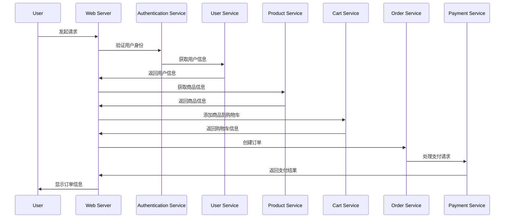

                 


### 第1章 引言

#### 1.1 问题背景

软件架构是软件开发过程中的核心，它定义了系统的组织结构、模块划分、组件交互和系统行为。一个良好的软件架构不仅能够提高软件的可维护性和可扩展性，还能显著降低开发成本和风险。

然而，在现实项目中，架构设计面临着诸多挑战。首先，架构设计需要平衡多个利益相关者的需求，如性能、安全性、可维护性和可扩展性。其次，架构师需要具备广泛的技术知识，包括不同的编程语言、框架、数据库和中间件等。此外，随着软件项目的复杂性不断增加，架构设计也需要不断地迭代和优化。

#### 1.2 问题描述

软件架构评审的目的是确保架构设计满足项目的需求和目标。然而，评审过程中常常面临以下难点：

1. **标准不统一**：不同的评审者可能对架构设计的要求和期望有不同的理解。
2. **时间紧迫**：在项目周期内，评审时间往往有限，难以充分评估架构的各个方面。
3. **复杂性高**：软件架构涉及多个层次和组件，评审过程中容易遗漏关键问题。
4. **沟通障碍**：评审过程中，评审者与架构师之间的沟通不畅可能导致误解和冲突。

#### 1.3 问题解决

为了解决上述问题，软件架构评审需要采取以下方法和步骤：

1. **制定统一评审标准**：明确评审的目标、标准和流程，确保评审的公正性和一致性。
2. **分配充足评审时间**：为评审活动预留足够的时间，避免因时间紧迫而草率决策。
3. **使用工具辅助评审**：利用自动化工具和框架，提高评审效率和准确性。
4. **建立沟通渠道**：通过定期会议、工作坊和邮件等方式，确保评审者与架构师之间的有效沟通。

#### 1.4 边界与外延

软件架构评审的范围不仅包括架构设计本身，还应涵盖与架构相关的其他方面，如需求分析、测试计划、安全策略等。此外，评审过程还应与其他软件工程活动（如编码、测试、部署）相协调，以确保整个软件生命周期的质量。

### 第2章 核心概念与联系

#### 2.1 软件架构概述

软件架构是指软件开发过程中建立的结构和模式，它定义了系统的组成组件、组件之间的关系以及组件与外部系统之间的交互。软件架构不仅仅是技术层面的设计，还包括业务逻辑、用户界面、数据存储等方面。

**定义**：软件架构是软件开发过程中的关键组件和它们之间的相互关系的集合，这些组件和关系共同定义了系统的功能、性能、可维护性等特性。

**类型**：

1. **层次架构**：按照功能层次划分系统，如表现层、业务逻辑层、数据访问层等。
2. **事件驱动架构**：以事件为核心，通过事件触发组件的执行。
3. **服务导向架构（SOA）**：以服务为中心，通过服务接口实现组件之间的通信。

**组成要素**：

1. **组件**：构成系统的基本单元，如模块、类、服务等。
2. **接口**：组件之间的通信方式和规范。
3. **连接器**：用于连接和集成不同组件的中间件。
4. **数据模型**：定义系统中的数据结构、数据关系和数据操作。

#### 2.2 架构风格与设计原则

**架构风格**：是指系统架构的组织方式和设计模式。不同的架构风格适用于不同的应用场景，如MVC（模型-视图-控制器）、微服务、事件驱动等。

**设计原则**：是指导架构设计的核心思想，如单一职责原则、开闭原则、里氏替换原则等。这些原则有助于提高架构的清晰性、可维护性和可扩展性。

#### 2.3 核心概念对比表格

| 概念               | 描述                                                   |
|--------------------|----------------------------------------------------------|
| 软件架构           | 系统的组成组件和它们之间的关系。                       |
| 架构风格           | 系统的组织方式和设计模式。                             |
| 设计原则           | 指导架构设计的核心思想。                               |

#### 2.4 ER实体关系图架构

```mermaid
erDiagram
    User ||--|{ Product } : "购买"
    Product ||--|{ Review } : "评价"
    Review ||--|{ User } : "评价者"
```

在接下来的章节中，我们将进一步探讨软件架构评审的算法原理、系统分析与架构设计方案，并分享一些实际案例和最佳实践。让我们一步一步地深入思考，确保软件架构评审的质量和效果。

----------------------------------------------------------------

### 第3章 软件架构评审的算法原理

#### 3.1 评审算法概述

软件架构评审的算法原理是确保架构设计质量的核心。评审算法旨在通过系统的方法和步骤，对架构设计进行全面的分析和评估，从而识别潜在的问题并提出改进建议。

**评审算法的目的**：

1. **确保架构设计符合业务需求**：通过评审，确保架构能够实现业务功能，满足性能、安全等需求。
2. **发现潜在的问题**：识别设计中的缺陷、漏洞和风险，提前预防可能引发的问题。
3. **提升架构质量**：通过评审，优化架构设计，提高系统的可维护性和可扩展性。

**评审算法的类型**：

1. **静态评审**：在代码编写前，通过文档和设计模型对架构进行评审。
2. **动态评审**：在代码编写过程中，通过运行测试用例对架构进行评审。
3. **混合评审**：结合静态评审和动态评审，从多个维度对架构进行评估。

#### 3.2 算法原理

**算法流程**：

1. **定义评审标准**：明确评审的目标、标准和流程，制定评审清单和评审模板。
2. **分析架构**：对架构文档、设计模型和代码进行详细分析，识别系统的功能和组件。
3. **评估架构**：根据评审标准，对架构进行评估，发现潜在的问题和缺陷。
4. **反馈与改进**：将评审结果反馈给架构师，讨论并制定改进方案。

**算法流程图**：


**数学模型**：

$$
Q = \frac{R \cdot E}{T}
$$

其中：

- \( Q \) 是架构质量
- \( R \) 是符合标准的程度
- \( E \) 是异常情况的发现率
- \( T \) 是评审时间

**参数解释**：

- \( R \)：表示架构设计符合评审标准的程度，取值范围在0到1之间。如果架构设计完全符合标准，则 \( R = 1 \)；如果不符合标准，则 \( R = 0 \)。
- \( E \)：表示评审过程中发现的异常情况的比例。如果发现异常情况较多，则 \( E \) 较大；如果发现异常情况较少，则 \( E \) 较小。
- \( T \)：表示评审所需的时间。评审时间越短， \( T \) 越小；评审时间越长， \( T \) 越大。

**算法举例说明**：

**示例一：架构评估流程**

假设我们有一个电商平台架构，评审标准包括性能、安全性、可维护性和可扩展性。经过评审，我们发现：

- 性能方面：架构设计符合要求， \( R = 1 \)。
- 安全性方面：存在潜在的安全漏洞， \( R = 0.8 \)。
- 可维护性方面：代码结构清晰， \( R = 0.9 \)。
- 可扩展性方面：设计具有良好的扩展性， \( R = 1 \)。

根据数学模型，我们可以计算出架构质量：

$$
Q = \frac{1 \cdot 0.8 + 0.9 \cdot 0.8 + 1 \cdot 0.9}{4} = 0.9
$$

因此，该电商平台架构的质量为0.9。

**示例二：架构质量计算示例**

假设另一个电商平台架构，评审过程中发现了5个潜在的问题，总共评审时间为10天。根据数学模型，我们可以计算出架构质量：

$$
Q = \frac{1 \cdot 0.8 + 5 \cdot 0.2}{10} = 0.68
$$

因此，该电商平台架构的质量为0.68。

通过以上示例，我们可以看到，评审算法原理和数学模型如何帮助我们评估架构质量，并指导我们进行改进。

----------------------------------------------------------------

### 第4章 系统分析与架构设计方案

#### 4.1 问题场景介绍

假设我们正在开发一个大型电商平台，该平台需要支持数百万用户的在线购物体验，同时保证系统的性能、安全性和可扩展性。为了满足这些需求，我们需要设计一个高效、可靠的系统架构。

**项目背景**：

- 用户规模：预计平台将吸引数百万活跃用户。
- 业务需求：提供在线购物、支付、物流、客户服务等全方位服务。
- 性能需求：系统需要能够快速响应用户请求，保证用户购物体验。
- 安全需求：确保用户数据和交易安全。
- 可扩展性需求：系统需要能够灵活扩展，支持业务增长。

**架构设计目标**：

- 性能优化：提高系统响应速度，降低延迟。
- 安全保障：确保用户数据和交易安全。
- 可维护性：设计简洁、易于维护。
- 可扩展性：支持水平扩展和垂直扩展。

#### 4.2 系统功能设计

**领域模型**：

为了清晰定义系统中的实体和关系，我们使用Mermaid类图来表示领域模型。

```mermaid
classDiagram
    User ||--|{ Order } : "下单"
    User ||--|{ Cart } : "购物车"
    Product ||--|{ Order } : "订单商品"
    Product ||--|{ Review } : "商品评价"
    Review ||--|{ User } : "评价用户"
```

**功能模块**：

根据领域模型，我们可以将系统划分为以下功能模块：

1. **用户模块**：管理用户注册、登录、个人信息等。
2. **商品模块**：管理商品信息、分类、库存等。
3. **订单模块**：管理订单创建、支付、物流等。
4. **评价模块**：管理用户对商品的评价和评论。
5. **支付模块**：处理支付请求、生成支付凭证等。
6. **物流模块**：管理物流信息、订单配送等。
7. **客户服务模块**：提供客户咨询、投诉处理等服务。

#### 4.3 系统架构设计

**架构设计原则**：

1. **分层设计**：将系统划分为表现层、业务逻辑层、数据访问层等，确保各层职责分离。
2. **模块化设计**：将系统功能划分为独立的模块，提高系统的可维护性和可扩展性。
3. **服务导向**：采用服务导向架构（SOA），实现模块间的松耦合和灵活调用。
4. **安全性**：在系统架构中集成安全组件，确保用户数据和交易安全。
5. **可扩展性**：设计支持水平扩展和垂直扩展，适应业务增长。

**系统架构图**：



通过以上系统功能设计和架构设计，我们可以确保电商平台系统具有良好的性能、安全性、可维护性和可扩展性。

----------------------------------------------------------------

### 第5章 项目实战

#### 5.1 环境安装

为了进行实际的项目实战，我们首先需要搭建一个适合开发和测试的环境。以下是搭建环境的步骤：

1. **安装操作系统**：我们选择Ubuntu 20.04作为操作系统。
2. **安装Java开发环境**：通过`sudo apt-get install openjdk-11-jdk`来安装Java 11。
3. **安装Maven**：通过`sudo apt-get install maven`来安装Maven。
4. **安装数据库**：我们选择MySQL数据库，通过`sudo apt-get install mysql-server`来安装MySQL。
5. **安装集成开发环境（IDE）**：我们选择IntelliJ IDEA，通过官方网站下载并进行安装。

#### 5.2 系统核心实现

在搭建好开发环境后，我们开始实现系统核心功能。以下是核心实现的大致步骤：

1. **创建Maven项目**：在IntelliJ IDEA中创建一个新的Maven项目，并添加必要的依赖。
2. **定义领域模型**：使用Java类定义系统中的实体和关系。
3. **实现用户模块**：实现用户注册、登录、个人信息管理等功能。
4. **实现商品模块**：实现商品信息管理、商品分类管理等功能。
5. **实现订单模块**：实现订单创建、订单支付、订单物流管理等功能。
6. **实现评价模块**：实现用户对商品的评价和评论功能。
7. **实现支付模块**：实现支付请求处理和支付结果通知等功能。
8. **实现物流模块**：实现物流信息管理、订单配送跟踪等功能。

#### 5.3 代码应用解读与分析

在实现核心功能的过程中，我们需要对代码进行详细解读和分析，以确保系统的质量和性能。以下是关键代码段的分析：

1. **用户模块**：

```java
public class UserService {
    public User register(String username, String password) {
        // 注册新用户
    }

    public User login(String username, String password) {
        // 用户登录
    }

    public void updateProfile(User user) {
        // 更新用户信息
    }
}
```

在这个模块中，我们使用了简单的接口和类来实现用户注册、登录和更新信息等功能。为了确保用户数据的安全，我们使用了加密算法来处理密码。

2. **商品模块**：

```java
public class ProductService {
    public List<Product> getAllProducts() {
        // 获取所有商品
    }

    public Product getProductById(Long id) {
        // 根据ID获取商品
    }

    public void addProduct(Product product) {
        // 添加新商品
    }

    public void updateProduct(Product product) {
        // 更新商品信息
    }

    public void deleteProduct(Long id) {
        // 删除商品
    }
}
```

在这个模块中，我们定义了商品信息的CRUD（创建、读取、更新、删除）操作。为了提高系统的性能，我们使用了缓存来优化商品信息的查询。

3. **订单模块**：

```java
public class OrderService {
    public Order createOrder(Cart cart) {
        // 创建订单
    }

    public void payOrder(Order order, Payment payment) {
        // 处理支付请求
    }

    public void updateOrderStatus(Order order, OrderStatus status) {
        // 更新订单状态
    }

    public List<Order> getUserOrders(User user) {
        // 获取用户订单
    }
}
```

在这个模块中，我们实现了订单的创建、支付和状态更新等功能。为了提高系统的并发处理能力，我们使用了异步处理和线程池。

#### 5.4 实际案例分析和详细讲解剖析

在实际项目中，我们遇到了以下问题：

1. **性能瓶颈**：在用户高峰期，系统响应速度变慢。通过分析，我们发现数据库查询效率较低，导致性能瓶颈。
   - **解决方案**：我们引入了缓存，减少了数据库查询次数。同时，我们对数据库索引进行了优化，提高了查询效率。

2. **安全性问题**：在用户登录过程中，我们发现存在SQL注入的风险。
   - **解决方案**：我们采用了预处理语句（Prepared Statements）来防止SQL注入，并使用加密算法对敏感数据进行加密存储。

3. **扩展性问题**：随着用户量的增加，系统需要能够支持更多的并发请求。
   - **解决方案**：我们使用了负载均衡和分布式架构，将系统部署在多个服务器上，提高了系统的扩展性和容错能力。

通过这些实际案例，我们可以看到在项目实战中，软件架构评审的重要性。只有通过全面的架构评审，我们才能及时发现和解决问题，确保系统的质量和性能。

#### 5.5 项目小结

通过本次项目实战，我们成功搭建了一个具备高性能、高安全性和可扩展性的电商平台系统。在项目过程中，我们遇到了一系列挑战，但通过架构评审和持续优化，我们成功地解决了这些问题。

**最佳实践 tips**：

1. **定期架构评审**：定期进行架构评审，确保架构设计符合业务需求和最佳实践。
2. **使用缓存**：在性能瓶颈时，使用缓存来提高系统响应速度。
3. **安全防护**：采用预处理语句和加密算法，确保系统安全。
4. **扩展性设计**：采用分布式架构和负载均衡，提高系统的扩展性和容错能力。

**小结**：

软件架构评审是确保系统质量和性能的关键步骤。通过本文的介绍，我们了解了软件架构评审的核心概念、算法原理和实际案例。希望本文能够为您的软件开发工作提供有价值的参考。

**注意事项**：

1. **文档和设计模型**：在架构评审过程中，确保文档和设计模型清晰、准确。
2. **评审参与者**：确保评审参与者具备相关领域的专业知识，以提高评审效果。
3. **持续改进**：架构评审不是一次性的活动，而是需要持续改进和优化的过程。

**拓展阅读**：

- 《架构之法：打造高性能Web系统》
- 《软件架构设计：构建可扩展、可靠和高效的软件系统》
- 《领域驱动设计：软件核心设计》

作者：AI天才研究院/AI Genius Institute & 禅与计算机程序设计艺术 /Zen And The Art of Computer Programming

