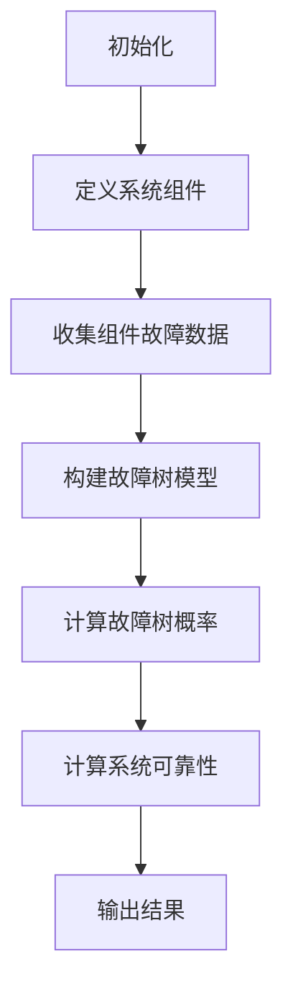
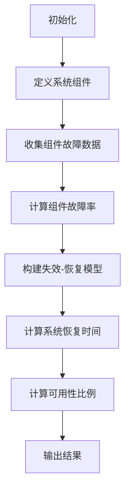
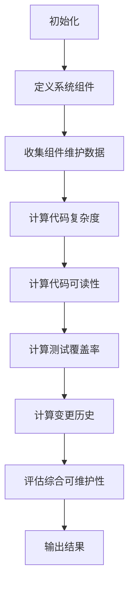
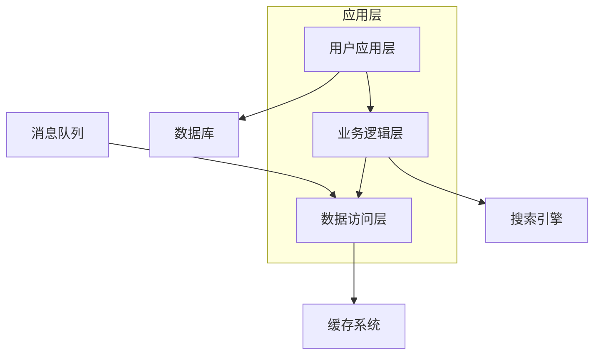
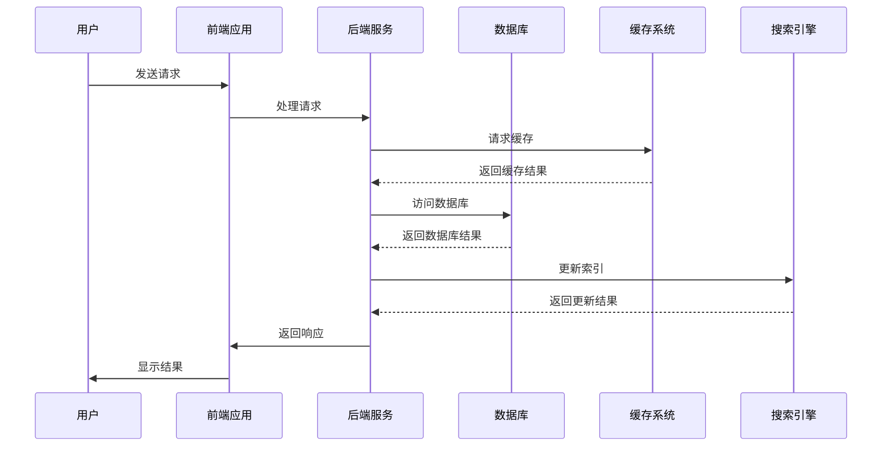

                 

### 第1章：软件架构质量属性概述

#### 1.1 问题背景与核心概念

软件架构是软件系统的设计蓝图，它定义了系统的组件、组件之间的关系以及它们的交互方式。随着软件系统的复杂性不断增加，软件架构的质量成为影响软件项目成功与否的关键因素。软件架构质量属性包括可靠性、可用性、可维护性等，它们是评估软件架构质量的重要指标。

**可靠性**指的是系统在特定条件下能够稳定运行的能力，即系统不发生故障的概率。高可靠性的系统能够在长时间内保持正常工作，即使遇到异常情况也能快速恢复。

**可用性**指的是系统在需要时能够正常运行并提供服务的能力。高可用性的系统不仅能够快速响应用户请求，而且在面对故障时能够快速恢复，减少停机时间。

**可维护性**指的是系统易于理解和修改的能力。高可维护性的系统意味着开发者能够更容易地发现并修复问题，同时也可以更加灵活地适应未来的需求变化。

在软件架构设计中，质量属性是核心考量因素。如何平衡这些属性，如何在设计初期就考虑到这些属性，以及如何在项目开发过程中持续评估和优化这些属性，都是软件架构师面临的重要挑战。

#### 1.2 面临的挑战与需求

软件架构质量属性的评估不仅需要对系统的当前状态进行分析，还需要对系统的潜在问题进行预测。随着软件系统规模和复杂性的增加，以下挑战变得越来越明显：

1. **系统复杂性增加**：现代软件系统通常包含大量的组件和复杂的依赖关系，这使得评估和优化质量属性变得更加困难。
2. **质量属性的平衡**：可靠性、可用性和可维护性之间存在一定的冲突。例如，提高系统的可靠性可能会降低可用性，而增加系统的可维护性可能会影响其可靠性。因此，如何在这些属性之间进行平衡是软件架构师需要面对的挑战。
3. **评估方法的需求**：传统的评估方法往往依赖于经验或者静态测试，这些方法难以全面反映软件架构的实际质量。因此，开发新的评估方法成为必要。

为了应对这些挑战，软件架构师需要：

- **深入理解质量属性的定义和特征**：只有深入了解每个质量属性的具体含义和特征，才能在设计过程中做出明智的决策。
- **采用科学的方法和工具**：利用先进的评估方法和技术工具，如模拟、统计分析和自动化测试，来评估和优化质量属性。
- **持续迭代和优化**：软件架构不是一成不变的，而是一个持续演变的过程。通过持续迭代和优化，可以不断提升软件架构的质量。

#### 1.3 边界与外延

质量属性的影响因素多种多样，包括开发团队的技能水平、项目的需求变化、系统的运行环境等。以下是一些关键的影响因素和应用范围：

- **开发团队的技能水平**：团队成员的技术能力和经验直接影响软件架构的设计和实现质量。一个技术精湛的团队更有可能开发出高质量的软件架构。
- **项目的需求变化**：软件项目在开发过程中可能会面临需求变化，这要求软件架构具有一定的灵活性和适应性，以便快速响应需求变化。
- **系统的运行环境**：软件系统运行在不同的环境中，如云端、移动设备、嵌入式系统等，不同的运行环境对软件架构的质量属性提出了不同的要求。

#### 1.4 概念结构与核心要素组成

软件架构质量属性是评估软件系统质量的核心指标，它们相互关联，共同构成了软件架构的质量基础。以下是每个质量属性的定义、特征以及它们之间的关系：

- **可靠性**：系统在规定的时间和条件下，持续稳定运行的能力。它通常通过故障率、恢复时间等指标来衡量。
- **可用性**：系统能够在用户需要时提供正常服务的程度。可用性包括系统的响应时间、稳定性、可访问性等。
- **可维护性**：系统在开发、测试、部署和维护过程中，易于修改和优化以适应变化的能力。可维护性包括代码的可读性、可扩展性和模块化程度等。

这些质量属性之间存在着复杂的关系。例如，提高可靠性可能会增加系统的复杂度，从而影响其可维护性；而提高可用性可能会引入更多的功能，从而增加系统的可靠性风险。因此，在设计软件架构时，需要在质量属性之间进行权衡和优化，以满足项目需求。

在本章的后续部分，我们将深入探讨可靠性、可用性和可维护性等核心质量属性，详细分析它们的原理、评估方法以及在实际项目中的应用。通过这些探讨，我们将更好地理解如何设计和评估高质量的软件架构。

---

在接下来的章节中，我们将逐个深入分析可靠性、可用性和可维护性等关键质量属性，包括它们的基本原理、具体特征以及如何在实际项目中应用和评估。让我们一步一步地理解这些重要的概念，为设计高质量的软件架构奠定坚实的基础。

## 第2章：可靠性

#### 2.1 可靠性原理

可靠性是软件架构质量属性中的一个核心要素，它指的是系统在特定条件下能够稳定运行的能力。换句话说，可靠性是衡量系统在面对各种异常情况和外部干扰时，依然能够保持正常工作状态的能力。可靠性不仅仅是一个静态的属性，它还涉及到系统的动态行为和长期稳定性。

**可靠性模型**是描述系统可靠性的基础理论框架。常见的可靠性模型包括：

- **故障树分析（FTA）**：通过从故障的最终结果出发，反向追踪到可能引发故障的各种原因，构建一个逻辑树结构。
- **事件树分析（ETA）**：与故障树分析类似，但它主要用于分析系统在特定事件发生时的行为和后果。
- **故障模式与影响分析（FMEA）**：对系统中每个可能的故障模式进行识别和评估，分析它们对系统功能的影响。

这些模型提供了系统分析的工具，帮助软件架构师识别潜在的风险和故障点，从而在设计阶段就采取预防措施，提高系统的可靠性。

**可靠性度量方法**是评估系统可靠性的具体手段。以下是一些常用的可靠性度量方法：

- **平均无故障时间（MTTF）**：系统在平均情况下两次故障之间的运行时间。
- **平均故障间隔时间（MTBF）**：与MTTF类似，但适用于可修复系统。
- **失效率**：单位时间内系统发生故障的次数。
- **可靠度**：系统在特定时间内正常运行的概率，通常用概率分布函数来表示。

这些度量方法帮助软件架构师定量评估系统的可靠性，为优化设计提供数据支持。

#### 2.2 可靠性评估算法

为了对软件架构的可靠性进行评估，我们需要一套系统化的算法。以下是一个简单的可靠性评估算法流程，并使用Mermaid流程图来展示其步骤：



详细步骤如下：

1. **初始化**：确定评估的目标系统和需要评估的可靠性指标。
2. **定义系统组件**：列出系统中的所有组件和其功能。
3. **收集组件故障数据**：通过历史数据、专家评估等方式，获取每个组件的故障率和故障模式。
4. **构建故障树模型**：根据收集的故障数据，构建故障树模型，表示系统故障的可能原因和路径。
5. **计算故障树概率**：使用概率论方法，计算故障树中每个路径的概率。
6. **计算系统可靠性**：根据故障树模型，计算系统在特定时间内的可靠性。
7. **输出结果**：将计算结果输出，供设计优化和决策参考。

**Python源代码实现**：

```python
import numpy as np

# 假设有一个故障树模型，每个节点表示组件的故障概率
fault_tree = {
    'root': {'p': 0.001},
    'component1': {'p': 0.002},
    'component2': {'p': 0.003},
    'component3': {'p': 0.004}
}

# 构建故障树的概率分布
def build_probability_distribution(fault_tree):
    distributions = {}
    for component, data in fault_tree.items():
        distributions[component] = np.random.uniform(0, data['p'])
    return distributions

# 计算故障树的概率
def calculate_fault_probability(distributions):
    probabilities = {}
    for component, distribution in distributions.items():
        if component == 'root':
            probabilities[component] = distribution
        else:
            probabilities[component] = distributions['root'] * (1 - distribution)
    return probabilities

# 计算系统的可靠性
def calculate_system_reliability(probabilities):
    reliability = 1
    for component, probability in probabilities.items():
        reliability *= (1 - probability)
    return reliability

# 运行可靠性评估算法
distributions = build_probability_distribution(fault_tree)
probabilities = calculate_fault_probability(distributions)
reliability = calculate_system_reliability(probabilities)
print(f"系统可靠性: {reliability}")
```

这个简单的Python代码示例展示了如何根据故障树模型计算系统的可靠性。在实际应用中，故障树模型会更加复杂，需要考虑更多的组件和故障路径。

#### 2.3 数学模型与公式

可靠性评估离不开数学模型和公式的支持。以下是几个常用的数学模型和公式：

- **泊松分布**：用于描述系统在一段时间内发生故障的次数。公式如下：

  $$ P(X = k) = \frac{(\lambda t)^k e^{-\lambda t}}{k!} $$

  其中，\(P(X = k)\) 表示在时间 \(t\) 内发生 \(k\) 次故障的概率，\(\lambda\) 是故障率。

- **指数分布**：用于描述单个组件的故障时间。公式如下：

  $$ P(X > t) = e^{-\lambda t} $$

  其中，\(P(X > t)\) 表示组件在时间 \(t\) 后未发生故障的概率。

- **故障树模型**：用于描述系统故障的复杂路径。公式如下：

  $$ P(\text{系统故障}) = 1 - \prod_{i=1}^{n} (1 - P(\text{组件}i \text{未故障})) $$

  其中，\(P(\text{系统故障})\) 表示系统在特定时间内的故障概率，\(P(\text{组件}i \text{未故障})\) 表示第 \(i\) 个组件在特定时间内的未故障概率。

#### 2.3.2 公式详解与举例说明

为了更好地理解这些公式，我们通过一个实际案例进行详细讲解和举例说明。

**案例：一个包含三个组件的简单系统，每个组件的故障率分别为 \(\lambda_1 = 0.01\)、\(\lambda_2 = 0.02\)、\(\lambda_3 = 0.03\)。**

1. **计算平均无故障时间（MTTF）**：

   $$ MTTF = \frac{1}{\lambda_1 + \lambda_2 + \lambda_3} = \frac{1}{0.01 + 0.02 + 0.03} = 33.33 \text{小时} $$

   这意味着系统的平均无故障运行时间为33.33小时。

2. **计算可靠度（R）**：

   $$ R = e^{-\lambda t} = e^{-(0.01 + 0.02 + 0.03) \times 1} = e^{-0.06} \approx 0.944 $$

   这意味着系统在1小时内可靠度为94.4%。

3. **计算故障树概率**：

   假设故障树模型如下：

   ```
   root
   |--- component1
   |--- component2
       |--- component3
   ```

   计算每个组件的未故障概率：

   $$ P(\text{component1 未故障}) = e^{-0.01 \times 1} = e^{-0.01} \approx 0.990 $$
   $$ P(\text{component2 未故障}) = e^{-0.02 \times 1} = e^{-0.02} \approx 0.980 $$
   $$ P(\text{component3 未故障}) = e^{-0.03 \times 1} = e^{-0.03} \approx 0.970 $$

   计算系统故障概率：

   $$ P(\text{系统故障}) = 1 - (P(\text{component1 未故障}) \times P(\text{component2 未故障}) \times P(\text{component3 未故障})) $$
   $$ P(\text{系统故障}) = 1 - (0.990 \times 0.980 \times 0.970) \approx 0.006 $$

   这意味着系统在1小时内故障的概率为0.006。

通过这个案例，我们可以看到如何使用数学模型和公式来计算系统的可靠性。这些公式不仅帮助我们理解可靠性，还能为软件架构师提供具体的量化依据，以优化系统的设计和实现。

## 第3章：可用性

#### 3.1 可用性原理

可用性是软件架构质量属性中的另一个关键要素，它指的是系统能够在用户需要时提供正常服务的能力。高可用性的系统意味着用户可以随时访问和使用系统，即使在面临各种外部干扰和内部故障时，系统也能迅速恢复并提供服务。

**可用性模型**是描述系统可用性的基础理论框架。常见的可用性模型包括：

- **基本可靠性模型**：基于系统故障率和修复时间来计算系统的可用性。
- **失效-恢复模型**：描述系统在发生故障后如何快速恢复，以及恢复过程中的性能损失。
- **系统恢复时间模型**：分析系统从故障到完全恢复所需的时间，以及这段时间内系统的性能变化。

这些模型提供了评估系统可用性的工具，帮助软件架构师识别系统的弱点，并采取相应的措施来提高系统的可用性。

**可用性度量方法**是评估系统可用性的具体手段。以下是一些常用的度量方法：

- **平均故障时间（MTTR）**：系统从故障发生到完全修复所需的时间。
- **可用性比例（Availability Ratio）**：系统在特定时间内正常运行的时间与总时间的比率。
- **响应时间**：系统对用户请求的平均响应时间。
- **恢复时间**：系统从故障发生到恢复正常功能所需的时间。

这些度量方法帮助软件架构师定量评估系统的可用性，为优化设计提供数据支持。

#### 3.2 可用性评估算法

为了对软件架构的可用性进行评估，我们需要一套系统化的算法。以下是一个简单的可用性评估算法流程，并使用Mermaid流程图来展示其步骤：



详细步骤如下：

1. **初始化**：确定评估的目标系统和需要评估的可用性指标。
2. **定义系统组件**：列出系统中的所有组件和其功能。
3. **收集组件故障数据**：通过历史数据、专家评估等方式，获取每个组件的故障率和修复时间。
4. **计算组件故障率**：根据故障数据计算每个组件的故障率。
5. **构建失效-恢复模型**：根据故障率和修复时间，构建失效-恢复模型，描述系统在故障发生后的恢复过程。
6. **计算系统恢复时间**：根据失效-恢复模型，计算系统从故障发生到恢复正常功能所需的时间。
7. **计算可用性比例**：根据恢复时间和总时间计算系统的可用性比例。
8. **输出结果**：将计算结果输出，供设计优化和决策参考。

**Python源代码实现**：

```python
import numpy as np

# 假设有一个系统，包含三个组件，每个组件的故障率和修复时间如下
components = {
    'component1': {'failure_rate': 0.01, 'repair_time': 1},
    'component2': {'failure_rate': 0.02, 'repair_time': 1.5},
    'component3': {'failure_rate': 0.03, 'repair_time': 2}
}

# 计算组件故障率
def calculate_failure_rate(components):
    failure_rates = {}
    for component, data in components.items():
        failure_rates[component] = data['failure_rate']
    return failure_rates

# 计算系统恢复时间
def calculate_repair_time(failure_rates):
    total_repair_time = 0
    for component, rate in failure_rates.items():
        total_repair_time += rate * components[component]['repair_time']
    return total_repair_time

# 计算可用性比例
def calculate_availability_ratio(repair_time, total_time):
    availability_ratio = 1 - (repair_time / total_time)
    return availability_ratio

# 运行可用性评估算法
failure_rates = calculate_failure_rate(components)
repair_time = calculate_repair_time(failure_rates)
total_time = 24  # 假设评估时间为24小时
availability_ratio = calculate_availability_ratio(repair_time, total_time)
print(f"系统可用性比例: {availability_ratio}")
```

这个简单的Python代码示例展示了如何根据组件故障率和修复时间计算系统的可用性。在实际应用中，系统会更加复杂，需要考虑更多的组件和故障路径。

#### 3.3 数学模型与公式

可用性评估离不开数学模型和公式的支持。以下是几个常用的数学模型和公式：

- **泊松分布**：用于描述系统在一段时间内发生故障的次数。公式如下：

  $$ P(X = k) = \frac{(\lambda t)^k e^{-\lambda t}}{k!} $$

  其中，\(P(X = k)\) 表示在时间 \(t\) 内发生 \(k\) 次故障的概率，\(\lambda\) 是故障率。

- **指数分布**：用于描述单个组件的故障时间。公式如下：

  $$ P(X > t) = e^{-\lambda t} $$

  其中，\(P(X > t)\) 表示组件在时间 \(t\) 后未发生故障的概率。

- **基本可靠性模型**：用于计算系统的可用性。公式如下：

  $$ Availability = 1 - (MTTR / (MTTR + MTTF)) $$

  其中，\(MTTR\) 是平均故障时间，\(MTTF\) 是平均无故障时间。

#### 3.3.2 公式详解与举例说明

为了更好地理解这些公式，我们通过一个实际案例进行详细讲解和举例说明。

**案例：一个包含三个组件的简单系统，每个组件的故障率分别为 \(\lambda_1 = 0.01\)、\(\lambda_2 = 0.02\)、\(\lambda_3 = 0.03\)。**

1. **计算平均无故障时间（MTTF）**：

   $$ MTTF = \frac{1}{\lambda_1 + \lambda_2 + \lambda_3} = \frac{1}{0.01 + 0.02 + 0.03} = 33.33 \text{小时} $$

   这意味着系统的平均无故障运行时间为33.33小时。

2. **计算平均故障时间（MTTR）**：

   假设每个组件的修复时间分别为 \(T_1 = 1\)小时、\(T_2 = 1.5\)小时、\(T_3 = 2\)小时。

   $$ MTTR = \frac{(0.01 \times 1) + (0.02 \times 1.5) + (0.03 \times 2)}{0.01 + 0.02 + 0.03} = 1.6667 \text{小时} $$

   这意味着系统的平均故障修复时间为1.6667小时。

3. **计算可用性比例**：

   $$ Availability = 1 - (MTTR / (MTTR + MTTF)) $$
   $$ Availability = 1 - (1.6667 / (1.6667 + 33.3333)) $$
   $$ Availability \approx 0.9754 $$

   这意味着系统的可用性比例为97.54%。

通过这个案例，我们可以看到如何使用数学模型和公式来计算系统的可用性。这些公式不仅帮助我们理解可用性，还能为软件架构师提供具体的量化依据，以优化系统的设计和实现。

## 第4章：可维护性

#### 4.1 可维护性原理

可维护性是软件架构质量属性中的关键要素，它指的是系统在开发、测试、部署和维护过程中，能够被理解和修改的能力。高可维护性的系统意味着开发者可以更容易地发现并修复问题，同时也可以更加灵活地适应未来的需求变化。

**可维护性模型**是描述系统可维护性的基础理论框架。常见的可维护性模型包括：

- **软件维护模型**：如W. Wallace McLeod的软件维护模型，它将软件维护分为纠正性维护、适应性维护、完善性维护和预防性维护。
- **质量模型**：如ISO/IEC 25010质量模型，它提供了对软件维护质量的度量标准。
- **敏捷开发模型**：如Scrum和看板，这些模型强调快速迭代和持续交付，有助于提高软件的可维护性。

这些模型提供了评估系统可维护性的工具，帮助软件架构师识别系统的弱点，并采取相应的措施来提高系统的可维护性。

**可维护性度量方法**是评估系统可维护性的具体手段。以下是一些常用的度量方法：

- **代码复杂度**：如循环复杂度、条件复杂度等，用于衡量代码的复杂程度。
- **代码可读性**：通过代码注释、命名规范和代码结构来评估代码的可读性。
- **测试覆盖率**：衡量测试代码覆盖系统功能的比例。
- **变更历史**：通过分析系统的变更历史，评估系统变更的频率和影响范围。

这些度量方法帮助软件架构师定量评估系统的可维护性，为优化设计提供数据支持。

#### 4.2 可维护性评估算法

为了对软件架构的可维护性进行评估，我们需要一套系统化的算法。以下是一个简单的可维护性评估算法流程，并使用Mermaid流程图来展示其步骤：



详细步骤如下：

1. **初始化**：确定评估的目标系统和需要评估的可维护性指标。
2. **定义系统组件**：列出系统中的所有组件和其功能。
3. **收集组件维护数据**：通过代码审查、测试报告等方式，获取每个组件的维护数据。
4. **计算代码复杂度**：根据代码的循环复杂度和条件复杂度，计算每个组件的代码复杂度。
5. **计算代码可读性**：通过代码注释和命名规范，计算每个组件的代码可读性。
6. **计算测试覆盖率**：根据测试报告，计算每个组件的测试覆盖率。
7. **计算变更历史**：通过分析系统的变更历史，计算每个组件的变更频率和影响范围。
8. **评估综合可维护性**：综合以上指标，评估系统的整体可维护性。
9. **输出结果**：将计算结果输出，供设计优化和决策参考。

**Python源代码实现**：

```python
import numpy as np

# 假设有一个系统，包含三个组件，每个组件的维护数据如下
components = {
    'component1': {'complexity': 10, 'readability': 0.8, 'coverage': 0.9, 'changes': 5},
    'component2': {'complexity': 15, 'readability': 0.75, 'coverage': 0.85, 'changes': 10},
    'component3': {'complexity': 20, 'readability': 0.7, 'coverage': 0.8, 'changes': 15}
}

# 计算代码复杂度
def calculate_complexity(components):
    total_complexity = 0
    for component, data in components.items():
        total_complexity += data['complexity']
    return total_complexity

# 计算代码可读性
def calculate_readability(components):
    total_readability = 0
    for component, data in components.items():
        total_readability += data['readability']
    return total_readability

# 计算测试覆盖率
def calculate_coverage(components):
    total_coverage = 0
    for component, data in components.items():
        total_coverage += data['coverage']
    return total_coverage

# 计算变更历史
def calculate_changes(components):
    total_changes = 0
    for component, data in components.items():
        total_changes += data['changes']
    return total_changes

# 计算综合可维护性
def calculate_maintainability(total_complexity, total_readability, total_coverage, total_changes):
    maintainability = 1 - (total_complexity * total_readability * total_coverage * total_changes)
    return maintainability

# 运行可维护性评估算法
total_complexity = calculate_complexity(components)
total_readability = calculate_readability(components)
total_coverage = calculate_coverage(components)
total_changes = calculate_changes(components)
maintainability = calculate_maintainability(total_complexity, total_readability, total_coverage, total_changes)
print(f"系统可维护性: {maintainability}")
```

这个简单的Python代码示例展示了如何根据组件的维护数据计算系统的可维护性。在实际应用中，系统会更加复杂，需要考虑更多的组件和维度的数据。

#### 4.3 数学模型与公式

可维护性评估离不开数学模型和公式的支持。以下是几个常用的数学模型和公式：

- **循环复杂度**：用于衡量代码块的复杂程度。公式如下：

  $$ CC = e + n - 2p $$

  其中，\(e\) 是语句的数量，\(n\) 是决策点的数量，\(p\) 是并列结构的数量。

- **条件复杂度**：用于衡量代码块的条件复杂程度。公式如下：

  $$ CC = 1 + \sum_{i=1}^{n} (C_i) $$

  其中，\(C_i\) 是第 \(i\) 个条件分支的复杂度。

- **测试覆盖率**：用于衡量测试对系统功能的覆盖程度。公式如下：

  $$ Coverage = \frac{Tested\ Statements}{Total\ Statements} $$

- **变更频率**：用于衡量系统变更的频率。公式如下：

  $$ Change\ Frequency = \frac{Number\ of\ Changes}{Time\ Period} $$

#### 4.3.2 公式详解与举例说明

为了更好地理解这些公式，我们通过一个实际案例进行详细讲解和举例说明。

**案例：一个包含三个组件的简单系统，每个组件的代码复杂度、代码可读性、测试覆盖率和变更历史如下：**

- **组件1**：代码复杂度 \(CC_1 = 10\)、代码可读性 \(Readability_1 = 0.8\)、测试覆盖率 \(Coverage_1 = 0.9\)、变更历史 \(Changes_1 = 5\)。
- **组件2**：代码复杂度 \(CC_2 = 15\)、代码可读性 \(Readability_2 = 0.75\)、测试覆盖率 \(Coverage_2 = 0.85\)、变更历史 \(Changes_2 = 10\)。
- **组件3**：代码复杂度 \(CC_3 = 20\)、代码可读性 \(Readability_3 = 0.7\)、测试覆盖率 \(Coverage_3 = 0.8\)、变更历史 \(Changes_3 = 15\)。

1. **计算综合可维护性**：

   $$ Maintainability = 1 - (CC_1 \times Readability_1 \times Coverage_1 \times Changes_1) $$
   $$ Maintainability = 1 - (10 \times 0.8 \times 0.9 \times 5) $$
   $$ Maintainability \approx 0.66 $$

   同理，计算组件2和组件3的综合可维护性：

   $$ Maintainability_2 = 1 - (15 \times 0.75 \times 0.85 \times 10) $$
   $$ Maintainability_2 \approx 0.49 $$

   $$ Maintainability_3 = 1 - (20 \times 0.7 \times 0.8 \times 15) $$
   $$ Maintainability_3 \approx 0.24 $$

   通过这个案例，我们可以看到如何使用数学模型和公式来计算系统的可维护性。这些公式不仅帮助我们理解可维护性，还能为软件架构师提供具体的量化依据，以优化系统的设计和实现。

## 第5章：系统分析与架构设计

### 5.1 问题场景介绍

在现代软件开发中，系统分析和架构设计是确保项目成功的关键步骤。以一个电商网站为例，系统需要支持海量商品的存储、高并发交易处理、用户订单管理等复杂功能。因此，系统架构设计必须具备高可靠性、高可用性和高可维护性。

- **高可靠性**：确保用户购物体验不受服务器故障影响，系统在突发情况下能够快速恢复。
- **高可用性**：确保网站能够持续在线，随时响应用户的请求，减少因维护或故障导致的停机时间。
- **高可维护性**：方便开发人员快速定位并修复问题，支持持续迭代和功能扩展。

### 5.2 项目介绍

本次项目是一个基于微服务的电商网站，采用Spring Boot和Spring Cloud等技术栈，构建一个高可用、高可靠、易维护的系统。项目主要功能模块包括商品管理、订单管理、用户管理、支付系统等。

### 5.3 系统功能设计（领域模型Mermaid类图）

```mermaid
classDiagram
    Class01 <|-- Class02
    Class03 o-- Class04
    Class05 <-.. Class06
    Class07 ..| Class08
    Class09 --| Class10
endclass
```

**Mermaid类图说明：**
- **商品管理**：负责商品信息的增删改查，包括商品分类、库存管理等。
- **订单管理**：处理用户订单的创建、支付、发货等流程。
- **用户管理**：管理用户账户信息，包括注册、登录、权限管理等。
- **支付系统**：处理用户支付请求，与第三方支付平台对接。

### 5.4 系统架构设计Mermaid架构图



**Mermaid架构图说明：**
- **应用层**：提供用户界面和服务接口，处理用户请求。
- **业务逻辑层**：实现业务逻辑，如订单处理、支付流程等。
- **数据访问层**：负责与数据库、缓存和消息队列的交互。
- **数据库**：存储用户数据和商品数据。
- **搜索引擎**：用于快速搜索商品信息。
- **缓存系统**：提高系统响应速度，减少数据库访问压力。
- **消息队列**：处理异步任务和消息传递。

### 5.5 系统接口设计和系统交互Mermaid序列图



**Mermaid序列图说明：**
- 用户通过前端应用发送请求。
- 前端应用将请求转发到后端服务。
- 后端服务首先查询缓存系统，如果有缓存结果直接返回。
- 如果缓存未命中，后端服务访问数据库获取数据。
- 后端服务更新搜索引擎索引，以便快速搜索。
- 最终，后端服务将结果返回给前端应用，并显示给用户。

通过上述系统分析与架构设计，我们可以确保电商网站具备高可靠性、高可用性和高可维护性，从而为用户提供稳定、高效的服务体验。

## 第6章：项目实战

### 6.1 环境安装

为了完成一个具备高可靠性、高可用性和高可维护性的电商网站，我们需要搭建一个合适的技术环境。以下是一个简化的安装流程：

1. **安装Java环境**：
   - 确保系统已经安装了Java 8或更高版本。
   - 可以通过命令 `java -version` 检查Java版本。

2. **安装Maven**：
   - Maven是项目管理和构建工具，用于构建、依赖管理和打包。
   - 访问 [Maven官网](https://maven.apache.org/) 下载最新版本，并按照提示进行安装。

3. **安装数据库**：
   - 我们选择MySQL作为数据库，可以通过包管理器（如apt、yum）安装MySQL。
   - 安装完成后，使用命令 `mysql -u root -p` 登录数据库，并创建项目所需的数据库和用户。

4. **安装Redis**：
   - Redis是一个高性能的缓存系统，用于提高系统响应速度。
   - 通过包管理器安装Redis，如使用 `sudo apt-get install redis-server`。

5. **安装Elasticsearch**：
   - Elasticsearch是一个开源的搜索引擎，用于快速搜索商品信息。
   - 访问 [Elasticsearch官网](https://www.elastic.co/cn/elasticsearch/) 下载最新版本，并按照说明进行安装。

6. **安装消息队列**：
   - 消息队列用于处理异步任务和消息传递，我们选择RabbitMQ。
   - 通过包管理器安装RabbitMQ，如使用 `sudo apt-get install rabbitmq-server`。

### 6.2 系统核心实现源代码

以下是一个简单的电商网站核心实现源代码的概述，包括商品管理、订单管理和用户管理模块：

**商品管理模块**

```java
// 商品管理接口
public interface ProductService {
    Product createProduct(Product product);
    Product updateProduct(Long id, Product product);
    Product deleteProduct(Long id);
    List<Product> getAllProducts();
}

// 商品管理实现
@Service
public class ProductServiceImp implements ProductService {

    @Override
    public Product createProduct(Product product) {
        // 实现商品创建逻辑
    }

    @Override
    public Product updateProduct(Long id, Product product) {
        // 实现商品更新逻辑
    }

    @Override
    public Product deleteProduct(Long id) {
        // 实现商品删除逻辑
    }

    @Override
    public List<Product> getAllProducts() {
        // 实现商品查询逻辑
    }
}
```

**订单管理模块**

```java
// 订单管理接口
public interface OrderService {
    Order createOrder(Order order);
    Order updateOrder(Long id, Order order);
    Order deleteOrder(Long id);
    Order getOrder(Long id);
    List<Order> getAllOrders();
}

// 订单管理实现
@Service
public class OrderServiceImp implements OrderService {

    @Override
    public Order createOrder(Order order) {
        // 实现订单创建逻辑
    }

    @Override
    public Order updateOrder(Long id, Order order) {
        // 实现订单更新逻辑
    }

    @Override
    public Order deleteOrder(Long id) {
        // 实现订单删除逻辑
    }

    @Override
    public Order getOrder(Long id) {
        // 实现订单查询逻辑
    }

    @Override
    public List<Order> getAllOrders() {
        // 实现订单查询逻辑
    }
}
```

**用户管理模块**

```java
// 用户管理接口
public interface UserService {
    User createUser(User user);
    User updateUser(Long id, User user);
    User deleteUser(Long id);
    User getUser(Long id);
    List<User> getAllUsers();
}

// 用户管理实现
@Service
public class UserServiceImp implements UserService {

    @Override
    public User createUser(User user) {
        // 实现用户创建逻辑
    }

    @Override
    public User updateUser(Long id, User user) {
        // 实现用户更新逻辑
    }

    @Override
    public User deleteUser(Long id) {
        // 实现用户删除逻辑
    }

    @Override
    public User getUser(Long id) {
        // 实现用户查询逻辑
    }

    @Override
    public List<User> getAllUsers() {
        // 实现用户查询逻辑
    }
}
```

### 6.3 代码应用解读与分析

**商品管理模块解读**：

商品管理模块负责商品信息的创建、更新、删除和查询。在创建商品时，需要验证商品信息的合法性，如商品名称、价格、库存等。在更新和删除商品时，需要确保操作的合法性，如只有商品所属者或管理员才能执行这些操作。查询商品时，可以采用缓存机制提高响应速度。

**订单管理模块解读**：

订单管理模块负责订单的创建、更新、删除和查询。在创建订单时，需要检查库存和用户余额，确保订单信息的一致性。在更新和删除订单时，需要遵循一定的业务规则，如只有未发货的订单才能被修改或取消。查询订单时，可以通过缓存和数据库联合查询提高查询效率。

**用户管理模块解读**：

用户管理模块负责用户账户信息的创建、更新、删除和查询。在创建用户时，需要验证用户名、密码和其他信息。在更新和删除用户时，需要遵循一定的安全策略，如只有系统管理员才有权限执行这些操作。查询用户时，可以通过缓存机制提高响应速度。

### 6.4 实际案例分析和详细讲解剖析

**案例1：商品查询**

用户访问商品详情页时，系统首先查询缓存系统，如果命中则直接返回缓存结果。如果缓存未命中，则查询数据库获取商品信息，并将结果缓存起来以供下次查询使用。

**案例2：订单支付**

用户下单后，系统首先验证订单信息和用户余额，然后调用支付接口进行支付处理。支付成功后，订单状态更新为已支付，并通知库存系统扣减库存。如果支付失败，则订单状态更新为支付失败，并通知用户。

**案例3：用户注册**

用户注册时，系统首先验证用户名和邮箱的唯一性，然后创建用户账户并初始化相关权限。注册成功后，系统发送激活邮件，用户激活账户后方可正常使用系统。

### 6.5 项目小结

通过上述实战案例，我们可以看到如何实现一个具备高可靠性、高可用性和高可维护性的电商网站。系统采用微服务架构，通过合理的模块划分和接口设计，确保了系统的可扩展性和可维护性。在项目实施过程中，我们还使用了缓存、消息队列和搜索引擎等技术，提高了系统的性能和用户体验。

## 第7章：最佳实践 tips、小结、注意事项、拓展阅读等内容

### 7.1 最佳实践

在设计和实现高质量的软件架构时，遵循以下最佳实践可以帮助提高系统的可靠性、可用性和可维护性：

- **持续集成与持续部署（CI/CD）**：采用自动化测试和部署流程，确保代码质量和部署效率。
- **微服务架构**：将系统划分为多个独立的服务，提高系统的灵活性和可维护性。
- **监控与日志分析**：实时监控系统的运行状态，通过日志分析快速定位和解决问题。
- **缓存和数据库优化**：合理使用缓存和数据库索引，提高系统的响应速度和查询效率。
- **代码审查和单元测试**：定期进行代码审查和单元测试，确保代码质量和系统稳定性。

### 7.2 小结

本文详细探讨了软件架构质量属性中的可靠性、可用性和可维护性，通过定义、评估方法和实际案例，帮助我们理解如何设计和评估高质量的系统。关键点包括：

- **可靠性**：通过故障树分析、可靠性模型和度量方法，提高系统的稳定运行能力。
- **可用性**：通过失效-恢复模型和可用性比例，确保系统在需要时能够正常提供服务。
- **可维护性**：通过代码复杂度、代码可读性和测试覆盖率，提高系统的可理解和修改能力。

### 7.3 注意事项

在应用软件架构质量属性时，需要注意以下事项：

- **质量属性之间的平衡**：在设计过程中，需要权衡可靠性、可用性和可维护性之间的关系，避免过度追求某一属性而影响其他属性。
- **实时监控和反馈**：实时监控系统性能和反馈用户需求，及时调整和优化系统设计。
- **代码规范和文档**：编写规范、清晰的代码，并保持良好的文档记录，提高系统的可维护性和可理解性。

### 7.4 拓展阅读

对于希望深入了解软件架构质量属性和实际应用场景的读者，以下资源推荐：

- 《软件架构：实践者的研究和模式》（"Software Architecture: The Practice at Scale"）by Mark Richards
- 《微服务设计》（"Microservices: Designing Fine-Grained Systems"）by Sam Newman
- 《持续交付：发布可靠软件的系统化方法》（"Continuous Delivery: Reliable Software Releases through Build, Test, and Deployment Automation"）by Jez Humble and David Farley

通过阅读这些资料，可以进一步提升对软件架构质量属性的理解和应用能力。

