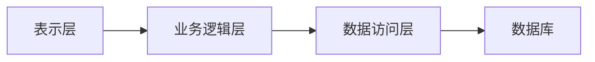
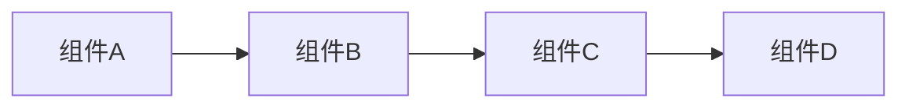
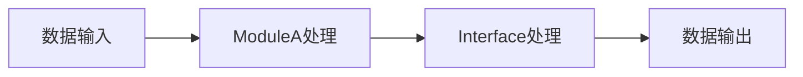
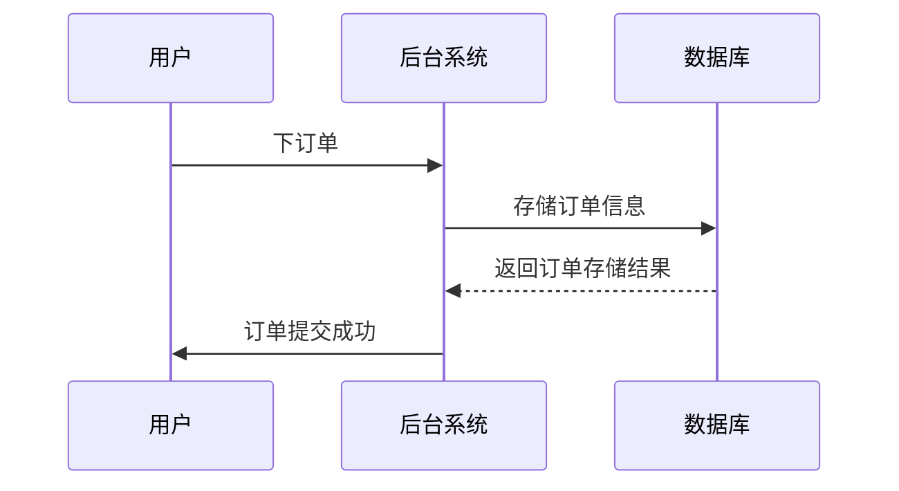
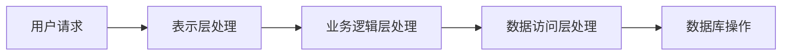
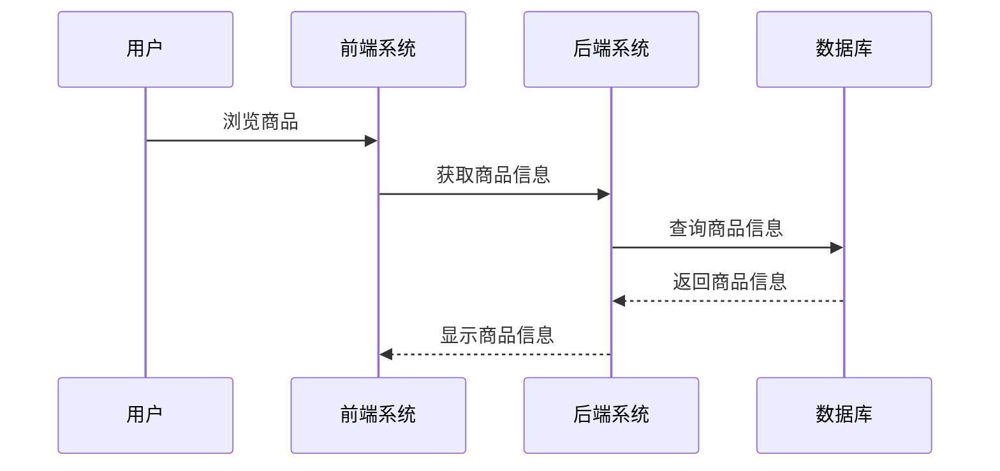
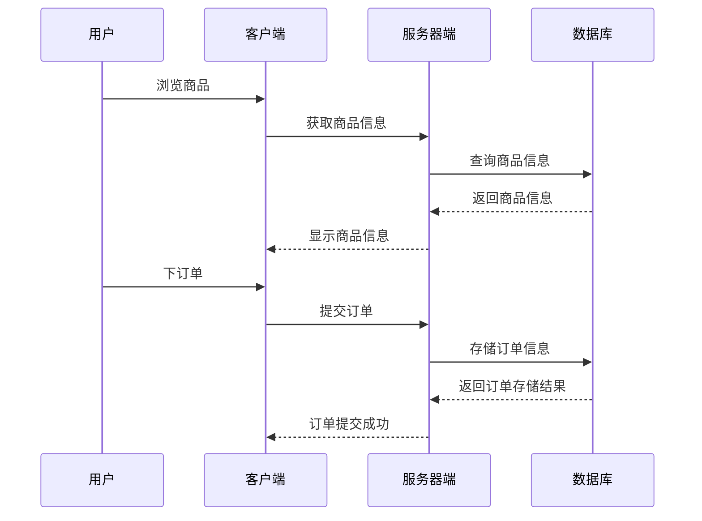
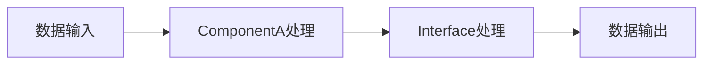
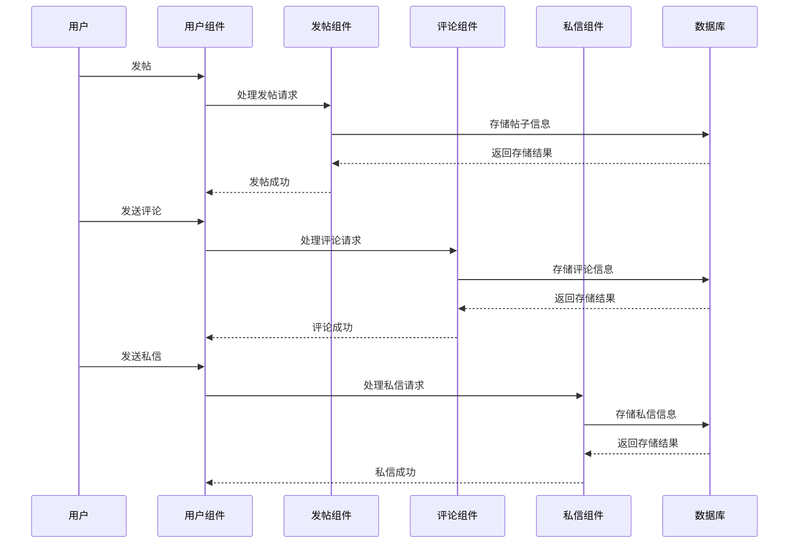

                 

### 概述和背景介绍

#### 软件架构风格概述

软件架构风格是软件开发过程中，用于组织和管理代码和系统组件的一种模式或方法。它定义了系统的结构、组件之间的关系、接口和交互机制，从而为系统的可维护性、可扩展性和性能提供了基础。不同的软件架构风格有着不同的设计原则和目标，适用于不同的应用场景和需求。

在本文中，我们将详细介绍几种主要的软件架构风格，包括稳定型架构风格、分层型架构风格、客户-服务器架构风格和组件型架构风格。每种架构风格都有其独特的原理、特点和适用场景，通过对比这些风格，我们可以更好地理解它们的优势和局限性，从而在项目开发中选择最合适的架构方案。

#### 问题描述与解决

软件开发过程中，选择合适的架构风格是一个复杂而关键的问题。不当的架构选择可能导致系统难以维护、扩展性和性能不佳，甚至导致项目失败。因此，我们需要明确问题，提出解决方案，并考虑边界和外延。

问题描述如下：

1. **问题背景**：随着软件系统规模的不断扩大和复杂度的增加，如何选择合适的架构风格，以确保系统的稳定性、可维护性和性能？
2. **问题描述**：需要分析不同的软件架构风格，了解它们的原理、优缺点和适用场景，从而为项目选择最佳的架构方案。
3. **问题解决**：通过对比分析各种架构风格，结合项目需求，选择最合适的架构方案，并在实际项目中实施和优化。

#### 边界与外延

在解决上述问题过程中，我们需要明确一些边界条件，以防止问题的泛化。以下是本文讨论的边界与外延：

1. **边界**：
   - **技术范围**：主要讨论常见的软件架构风格，如稳定型、分层型、客户-服务器和组件型架构风格。
   - **应用范围**：主要针对通用软件系统，不包括特定的嵌入式系统或实时系统。
   - **开发语言和工具**：不考虑特定开发语言或工具，但会提供一些通用的示例和工具。

2. **外延**：
   - **架构风格演变**：随着技术的发展，新的架构风格可能会出现，本文可能无法涵盖所有最新的架构风格。
   - **架构实现细节**：本文主要关注架构风格的理论和实践，不深入探讨具体实现细节。
   - **架构优化**：虽然本文会提供一些架构优化的策略和技巧，但具体的优化方案需要根据实际项目需求进行调整。

#### 核心要素组成

软件架构风格的选择涉及多个核心要素，以下是本文将探讨的核心要素组成：

1. **需求分析**：明确项目的需求，包括功能需求、性能需求、可维护性和可扩展性需求等。
2. **架构风格特性对比**：分析各种架构风格的特点、优缺点和适用场景，为选择合适的架构风格提供依据。
3. **架构实现**：根据选择的结果，实现具体的软件架构，包括组件设计、接口定义和系统交互等。
4. **架构优化**：在项目开发过程中，对选定的架构风格进行优化，以提高系统的性能和可维护性。

#### 核心概念特征对比表格

为了更好地理解各种架构风格的特点，我们提供了一个核心概念特征对比表格。以下是几种主要架构风格的对比：

| 架构风格 | 原理 | 优点 | 缺点 | 适用场景 |
| --- | --- | --- | --- | --- |
| 稳定型架构风格 | 强调稳定性和可维护性 | 系统稳定，易于维护 | 扩展性较差，性能较低 | 中小型系统，需求变化较少 |
| 分层型架构风格 | 将系统分为多个层次，各层次之间松耦合 | 易于维护，可扩展性好 | 层次较多，可能引入复杂性 | 功能复杂，需求变化频繁 |
| 客户-服务器架构风格 | 客户端请求服务，服务器端提供响应 | 易于理解，可扩展性较好 | 客户端负载较高，响应时间可能较长 | 网络应用，分布式系统 |
| 组件型架构风格 | 强调组件化和模块化，支持热部署 | 易于扩展，维护性较好 | 组件间依赖复杂，可能引入额外的复杂性 | 大型系统，高可扩展性要求 |

#### ER实体关系图

为了更直观地展示各种架构风格之间的联系，我们使用Mermaid绘制了一个ER实体关系图。以下是ER实体关系图的markdown格式代码：

```mermaid
erDiagram
  设计需求 ||--o> 稳定型架构风格 : 适用
  设计需求 ||--o> 分层型架构风格 : 适用
  设计需求 ||--o> 客户-服务器架构风格 : 适用
  设计需求 ||--o> 组件型架构风格 : 适用
  稳定型架构风格 ||--|> 架构特点 : 特性
  分层型架构风格 ||--|> 架构特点 : 特性
  客户-服务器架构风格 ||--|> 架构特点 : 特性
  组件型架构风格 ||--|> 架构特点 : 特性
```

通过上述ER实体关系图，我们可以看到各种架构风格与设计需求之间的联系，以及它们各自独特的架构特点。

### 总结

在本节中，我们概述了软件架构风格的概念，介绍了本文要讨论的主要架构风格，明确了问题的描述和解决方法，以及讨论的边界与外延。我们还提供了一个核心概念特征对比表格和一个ER实体关系图，以帮助读者更好地理解各种架构风格的特点和联系。

在接下来的章节中，我们将逐一深入分析每种架构风格，探讨它们的原理、优缺点、适用场景，并通过具体的示例和案例，帮助读者了解如何在实际项目中选择和实现合适的架构风格。

---

# 软件架构风格比较：选择适合项目的架构方案

> 关键词：软件架构风格、架构方案选择、架构实现、优化策略

> 摘要：本文将深入探讨几种常见的软件架构风格，包括稳定型、分层型、客户-服务器和组件型架构风格。通过对比这些架构风格的原理、优缺点和适用场景，我们希望帮助读者理解如何在项目中选择适合的架构方案，并在实际开发中实现和优化这些架构风格。

## 第一部分：软件架构风格基础

### 1.1 软件架构概述

#### 1.1.1 软件架构的定义与重要性

软件架构是软件系统的基本结构和设计原则，它定义了系统的组件、组件之间的关系以及系统的行为。一个良好的软件架构对于确保系统的稳定性、可维护性和可扩展性至关重要。软件架构不仅是技术决策，也是业务决策，它影响着项目的成功与否。

#### 1.1.2 软件架构的基本概念

软件架构包括以下基本概念：

- **组件**：软件系统中的功能模块或类库。
- **接口**：组件之间的交互接口。
- **架构风格**：组织和设计软件系统的模式或方法。
- **架构模式**：解决特定问题领域的一种架构设计方法。
- **架构约束**：限制架构设计的选择因素，如性能、可靠性、安全性等。

#### 1.1.3 软件架构的发展历程

软件架构的发展历程可以分为几个阶段：

- **无架构阶段**：早期软件系统没有明确的架构设计，功能模块随意组合。
- **结构化阶段**：引入模块化和分层设计，使系统结构更加清晰。
- **面向对象阶段**：基于对象的设计和组件复用，提高了系统的灵活性和可维护性。
- **微服务阶段**：将大型系统拆分为多个小型服务，提高了系统的可扩展性和可维护性。

### 1.2 核心概念与联系

#### 1.2.1 软件架构风格定义与分类

软件架构风格是组织和管理软件系统的一种模式，根据系统的需求和约束，可以采用不同的架构风格。常见的架构风格包括：

- **稳定型架构风格**：强调系统的稳定性和可维护性。
- **分层型架构风格**：将系统分为多个层次，各层次之间松耦合。
- **客户-服务器架构风格**：客户端请求服务，服务器端提供响应。
- **组件型架构风格**：强调组件化和模块化，支持热部署。

#### 1.2.1.1 稳定型架构风格

稳定型架构风格强调系统的稳定性和可维护性，适合中小型系统，需求变化较少的场景。

#### 1.2.1.2 分层型架构风格

分层型架构风格将系统分为多个层次，各层次之间松耦合，适用于功能复杂、需求变化频繁的系统。

#### 1.2.1.3 客户-服务器架构风格

客户-服务器架构风格适用于网络应用和分布式系统，客户端请求服务，服务器端提供响应。

#### 1.2.1.4 组件型架构风格

组件型架构风格强调组件化和模块化，支持热部署，适用于大型系统和高可扩展性要求。

#### 1.2.2 核心概念特征对比表格

以下是几种主要架构风格的对比表格：

| 架构风格 | 原理 | 优点 | 缺点 | 适用场景 |
| --- | --- | --- | --- | --- |
| 稳定型架构风格 | 强调稳定性和可维护性 | 系统稳定，易于维护 | 扩展性较差，性能较低 | 中小型系统，需求变化较少 |
| 分层型架构风格 | 将系统分为多个层次，各层次之间松耦合 | 易于维护，可扩展性好 | 层次较多，可能引入复杂性 | 功能复杂，需求变化频繁 |
| 客户-服务器架构风格 | 客户端请求服务，服务器端提供响应 | 易于理解，可扩展性较好 | 客户端负载较高，响应时间可能较长 | 网络应用，分布式系统 |
| 组件型架构风格 | 强调组件化和模块化，支持热部署 | 易于扩展，维护性较好 | 组件间依赖复杂，可能引入额外的复杂性 | 大型系统，高可扩展性要求 |

#### 1.2.3 ER实体关系图

为了更直观地展示各种架构风格之间的联系，我们使用Mermaid绘制了一个ER实体关系图。以下是ER实体关系图的Markdown格式代码：

```mermaid
erDiagram
  设计需求 ||--o> 稳定型架构风格 : 适用
  设计需求 ||--o> 分层型架构风格 : 适用
  设计需求 ||--o> 客户-服务器架构风格 : 适用
  设计需求 ||--o> 组件型架构风格 : 适用
  稳定型架构风格 ||--|> 架构特点 : 特性
  分层型架构风格 ||--|> 架构特点 : 特性
  客户-服务器架构风格 ||--|> 架构特点 : 特性
  组件型架构风格 ||--|> 架构特点 : 特性
```

通过上述ER实体关系图，我们可以看到各种架构风格与设计需求之间的联系，以及它们各自独特的架构特点。

### 1.3 软件架构风格比较

#### 1.3.1 稳定型架构风格

稳定型架构风格强调系统的稳定性和可维护性，适合中小型系统，需求变化较少的场景。

#### 1.3.1.1 架构原理

稳定型架构风格采用模块化和分层设计，确保系统的稳定性和可维护性。系统组件之间通过清晰的接口进行交互，模块内部相对独立，降低了模块之间的耦合度。

#### 1.3.1.2 优缺点

- 优点：系统稳定，易于维护。
- 缺点：扩展性较差，性能较低。

#### 1.3.1.3 适用场景

- 适用场景：中小型系统，需求变化较少。

#### 1.3.1.4 Mermaid流程图

以下是稳定型架构风格的Mermaid流程图：


#### 1.3.2 分层型架构风格

分层型架构风格将系统分为多个层次，各层次之间松耦合，适用于功能复杂、需求变化频繁的系统。

#### 1.3.2.1 架构原理

分层型架构风格将系统功能按照不同的层次进行划分，如表示层、业务逻辑层、数据访问层等。各层次之间通过明确的接口进行交互，降低了层次的耦合度，提高了系统的可维护性和可扩展性。

#### 1.3.2.2 优缺点

- 优点：易于维护，可扩展性好。
- 缺点：层次较多，可能引入复杂性。

#### 1.3.2.3 适用场景

- 适用场景：功能复杂，需求变化频繁。

#### 1.3.2.4 Mermaid流程图

以下是分层型架构风格的Mermaid流程图：



#### 1.3.3 客户-服务器架构风格

客户-服务器架构风格适用于网络应用和分布式系统，客户端请求服务，服务器端提供响应。

#### 1.3.3.1 架构原理

客户-服务器架构风格将系统划分为客户端和服务器端。客户端负责发送请求，服务器端负责处理请求并返回结果。客户端和服务器端通过网络进行通信。

#### 1.3.3.2 优缺点

- 优点：易于理解，可扩展性较好。
- 缺点：客户端负载较高，响应时间可能较长。

#### 1.3.3.3 适用场景

- 适用场景：网络应用，分布式系统。

#### 1.3.3.4 Mermaid流程图

以下是客户-服务器架构风格的Mermaid流程图：


#### 1.3.4 组件型架构风格

组件型架构风格强调组件化和模块化，支持热部署，适用于大型系统和高可扩展性要求。

#### 1.3.4.1 架构原理

组件型架构风格将系统功能划分为多个组件，每个组件具有独立的功能和接口。组件之间通过明确的接口进行交互，支持热部署，提高了系统的可维护性和可扩展性。

#### 1.3.4.2 优缺点

- 优点：易于扩展，维护性较好。
- 缺点：组件间依赖复杂，可能引入额外的复杂性。

#### 1.3.4.3 适用场景

- 适用场景：大型系统，高可扩展性要求。

#### 1.3.4.4 Mermaid流程图

以下是组件型架构风格的Mermaid流程图：



### 1.4 软件架构风格的应用

#### 1.4.1 软件架构风格选择过程

选择适合的软件架构风格是一个复杂的过程，需要考虑多个因素。以下是软件架构风格选择的基本步骤：

1. **需求分析**：明确项目的需求，包括功能需求、性能需求、可维护性和可扩展性需求等。
2. **架构风格评估**：分析各种架构风格的特点、优缺点和适用场景，评估每种架构风格对项目需求的适应性。
3. **选择最佳架构风格**：根据评估结果，选择最适合项目需求的架构风格。
4. **架构实现**：根据选定的架构风格，设计和实现具体的软件架构。
5. **架构优化**：在项目开发过程中，对选定的架构风格进行优化，以提高系统的性能和可维护性。

#### 1.4.2 软件架构风格评估方法

评估软件架构风格的方法包括：

- **功能适应性评估**：评估架构风格是否满足项目的功能需求。
- **性能评估**：评估架构风格对系统性能的影响。
- **可维护性评估**：评估架构风格对系统可维护性的影响。
- **可扩展性评估**：评估架构风格对系统可扩展性的影响。

#### 1.4.3 软件架构风格适应性的分析

分析软件架构风格适应性的方法包括：

- **场景分析**：分析各种架构风格在不同场景下的适用性。
- **案例研究**：通过案例分析，评估不同架构风格在实际项目中的应用效果。
- **实验评估**：通过实验，评估不同架构风格在特定场景下的性能和可维护性。

### 1.5 背景介绍

#### 1.5.1 问题描述

在软件开发过程中，选择合适的架构风格是一个关键问题。不当的架构选择可能导致系统难以维护、扩展性和性能不佳，甚至导致项目失败。因此，如何选择适合项目的架构风格，是一个值得深入探讨的问题。

#### 1.5.2 问题解决

通过分析不同的架构风格，了解它们的原理、优缺点和适用场景，我们可以为项目选择最合适的架构风格。同时，在实际开发过程中，对选定的架构风格进行优化，可以提高系统的性能和可维护性。

#### 1.5.3 边界与外延

本文主要讨论常见的软件架构风格，包括稳定型、分层型、客户-服务器和组件型架构风格。这些架构风格适用于通用软件系统，但不包括特定的嵌入式系统或实时系统。同时，本文主要关注架构风格的理论和实践，不深入探讨具体实现细节。

#### 1.5.4 概念结构与核心要素组成

软件架构风格的选择涉及多个核心要素，包括需求分析、架构风格评估、架构实现和架构优化。通过这些核心要素，我们可以为项目选择最合适的架构风格，并在实际开发过程中进行优化。

### 1.6 本章小结

在本章中，我们介绍了软件架构风格的概念，详细分析了稳定型、分层型、客户-服务器和组件型架构风格的原理、优缺点和适用场景。通过这些分析，我们为项目选择适合的架构风格提供了依据。在接下来的章节中，我们将继续探讨如何根据项目需求选择和实现合适的架构风格，并分享实际案例和最佳实践。

---

## 第二部分：软件架构风格深度解析

### 2.1 稳定型架构风格深度解析

#### 2.1.1 架构原理详细讲解

稳定型架构风格的核心在于其稳定性和可维护性。该风格通常采用模块化和分层设计，使系统组件内部相对独立，模块之间通过清晰的接口进行交互。稳定型架构风格适用于中小型系统，尤其是在需求变化较少的情况下。

**原理说明：**

1. **模块化设计**：将系统功能划分为多个模块，每个模块具有独立的功能和接口。
2. **分层设计**：将系统分为多个层次，如表示层、业务逻辑层、数据访问层等，各层次之间通过接口进行交互。
3. **接口设计**：模块之间通过接口进行通信，接口设计要尽量简洁、清晰。

**数学模型和公式：**

稳定型架构风格的关键在于降低模块之间的耦合度，提高系统的稳定性。我们可以使用以下数学模型来描述：

- **耦合度（C）**：表示模块之间的依赖程度，C 越小，模块之间的耦合度越低。
- **稳定性（S）**：表示系统的稳定性，S 越大，系统越稳定。

稳定型架构风格的设计目标可以表示为：

\[ S = f(C) \]

其中，f 函数表示耦合度与稳定性之间的关系。我们的目标是找到一种设计方法，使得 \( C \) 尽可能小，从而提高 \( S \)。

**Python源代码示例：**

```python
class ModuleA:
    def process_data(self, data):
        # 数据处理逻辑
        return data

class ModuleB:
    def integrate_data(self, data):
        # 数据整合逻辑
        return data

# 模块之间的接口设计
class Interface:
    def process_data(self, data):
        return ModuleA().process_data(data)

    def integrate_data(self, data):
        return ModuleB().integrate_data(data)
```

**Mermaid流程图：**

以下是稳定型架构风格的Mermaid流程图：



#### 2.1.2 应用场景举例

**实际案例1：企业内部办公系统**

企业内部办公系统通常是一个中小型系统，需求变化较少。在这种情况下，稳定型架构风格是一个很好的选择。通过模块化和分层设计，我们可以确保系统的稳定性和可维护性。

**实际案例2：电商网站后台系统**

电商网站后台系统需要处理大量的订单数据和用户数据。尽管需求可能会发生变化，但总体上是比较稳定的。在这种情况下，稳定型架构风格可以帮助我们提高系统的可维护性和性能。

#### 2.1.3 优化策略与技巧

1. **模块划分**：合理划分模块，确保每个模块具有独立的功能和接口。
2. **接口设计**：简化接口设计，确保接口的清晰和简洁。
3. **代码复用**：鼓励代码复用，减少冗余代码，提高系统的可维护性。

#### 2.1.4 系统分析与架构设计方案

**问题场景介绍：**

一个中小型电商网站后台系统，需要处理用户订单、商品库存、支付等业务功能。

**系统架构设计：**

1. **模块划分**：将系统划分为用户模块、订单模块、商品模块、支付模块等。
2. **层次设计**：将系统分为表示层、业务逻辑层、数据访问层等。
3. **接口设计**：定义清晰的接口，确保模块之间的通信。

**系统接口设计和系统交互：**

以下是系统接口设计和系统交互的Mermaid序列图：



### 2.2 分层型架构风格深度解析

#### 2.2.1 架构原理详细讲解

分层型架构风格将系统功能划分为多个层次，各层次之间松耦合，从而提高了系统的可维护性和可扩展性。分层型架构风格适用于功能复杂、需求变化频繁的系统。

**原理说明：**

1. **表示层**：负责与用户交互，如用户界面、前端应用等。
2. **业务逻辑层**：负责处理业务逻辑，如订单处理、商品管理、支付等。
3. **数据访问层**：负责与数据库进行交互，如数据查询、数据更新等。
4. **基础设施层**：负责提供系统运行所需的基础设施，如缓存、日志、配置等。

**数学模型和公式：**

分层型架构风格的关键在于各层次之间的松耦合。我们可以使用以下数学模型来描述：

- **耦合度（C）**：表示层次之间的依赖程度，C 越小，层次之间的耦合度越低。
- **可维护性（M）**：表示系统的可维护性，M 越大，系统越容易维护。

分层型架构风格的设计目标可以表示为：

\[ M = f(C) \]

其中，f 函数表示耦合度与可维护性之间的关系。我们的目标是找到一种设计方法，使得 \( C \) 尽可能小，从而提高 \( M \)。

**Python源代码示例：**

```python
class PresentationLayer:
    def display_order(self, order):
        # 显示订单信息
        pass

class BusinessLogicLayer:
    def process_order(self, order):
        # 处理订单逻辑
        pass

class DataAccessLayer:
    def save_order(self, order):
        # 存储订单信息
        pass
```

**Mermaid流程图：**

以下是分层型架构风格的Mermaid流程图：



#### 2.2.2 应用场景举例

**实际案例1：在线购物平台**

在线购物平台通常具有复杂的业务逻辑，需要处理用户订单、商品库存、支付等。在这种情况下，分层型架构风格可以帮助我们提高系统的可维护性和可扩展性。

**实际案例2：企业资源规划系统**

企业资源规划系统（ERP）通常具有大量的业务模块，需要处理企业各个部门的数据。在这种情况下，分层型架构风格可以帮助我们提高系统的灵活性和可维护性。

#### 2.2.3 优化策略与技巧

1. **层次划分**：合理划分层次，确保每个层次的职责清晰。
2. **接口设计**：定义清晰的接口，确保层次之间的通信。
3. **代码复用**：鼓励代码复用，减少冗余代码，提高系统的可维护性。

#### 2.2.4 系统分析与架构设计方案

**问题场景介绍：**

一个在线购物平台，需要处理用户订单、商品库存、支付等业务功能。

**系统架构设计：**

1. **模块划分**：将系统划分为用户模块、订单模块、商品模块、支付模块等。
2. **层次设计**：将系统分为表示层、业务逻辑层、数据访问层等。
3. **接口设计**：定义清晰的接口，确保模块之间的通信。

**系统接口设计和系统交互：**

以下是系统接口设计和系统交互的Mermaid序列图：



### 2.3 客户-服务器架构风格深度解析

#### 2.3.1 架构原理详细讲解

客户-服务器架构风格是一种经典的服务器端和客户端分离的架构风格。该风格将系统划分为客户端和服务器端，客户端负责发送请求，服务器端负责处理请求并返回结果。

**原理说明：**

1. **客户端**：负责与用户交互，发送请求并接收响应。
2. **服务器端**：负责处理请求，执行业务逻辑，并将结果返回给客户端。

**数学模型和公式：**

客户-服务器架构风格的关键在于客户端和服务器端的分离。我们可以使用以下数学模型来描述：

- **请求延迟（T）**：表示客户端发送请求到服务器端处理的时间。
- **响应时间（R）**：表示服务器端处理请求并将结果返回给客户端的时间。

客户-服务器架构风格的设计目标可以表示为：

\[ T + R = f(\text{网络延迟}, \text{服务器处理时间}) \]

其中，f 函数表示网络延迟和服务器处理时间与请求延迟和响应时间之间的关系。我们的目标是找到一种设计方法，使得 \( T + R \) 尽可能小，从而提高系统的性能。

**Python源代码示例：**

```python
class Client:
    def send_request(self, request):
        # 发送请求
        pass

class Server:
    def process_request(self, request):
        # 处理请求
        response = "Processed request"
        return response

# 客户端和服务器端之间的通信
def send_request(client, server, request):
    response = server.process_request(request)
    client.send_request(response)
```

**Mermaid流程图：**

以下是客户-服务器架构风格的Mermaid流程图：


#### 2.3.2 应用场景举例

**实际案例1：电商平台**

电商平台通常采用客户-服务器架构风格，客户端负责与用户交互，服务器端负责处理订单、支付等业务功能。

**实际案例2：在线银行系统**

在线银行系统通常采用客户-服务器架构风格，客户端负责与用户交互，服务器端负责处理账户信息、交易等业务功能。

#### 2.3.3 优化策略与技巧

1. **负载均衡**：通过负载均衡技术，将请求分布到多个服务器端，提高系统的性能和可靠性。
2. **缓存**：通过缓存技术，减少数据库的访问次数，提高系统的响应速度。
3. **数据库优化**：对数据库进行优化，提高数据库的查询效率和写入性能。

#### 2.3.4 系统分析与架构设计方案

**问题场景介绍：**

一个电商平台，需要处理用户订单、支付、商品信息等业务功能。

**系统架构设计：**

1. **模块划分**：将系统划分为用户模块、订单模块、支付模块、商品模块等。
2. **客户端设计**：负责与用户交互，发送请求并接收响应。
3. **服务器端设计**：负责处理请求，执行业务逻辑，并将结果返回给客户端。

**系统接口设计和系统交互：**

以下是系统接口设计和系统交互的Mermaid序列图：



### 2.4 组件型架构风格深度解析

#### 2.4.1 架构原理详细讲解

组件型架构风格强调组件化和模块化，将系统功能划分为多个组件，每个组件具有独立的功能和接口。组件之间通过明确的接口进行交互，支持热部署，从而提高了系统的可维护性和可扩展性。组件型架构风格适用于大型系统和高可扩展性要求。

**原理说明：**

1. **组件划分**：将系统功能划分为多个组件，每个组件具有独立的功能和接口。
2. **接口设计**：定义组件之间的接口，确保组件之间的通信。
3. **热部署**：支持组件的热部署，即无需停机即可升级或替换组件。

**数学模型和公式：**

组件型架构风格的关键在于组件之间的松耦合和热部署。我们可以使用以下数学模型来描述：

- **组件耦合度（C）**：表示组件之间的依赖程度，C 越小，组件之间的耦合度越低。
- **热部署频率（H）**：表示系统进行热部署的频率，H 越高，热部署的频率越高。
- **可维护性（M）**：表示系统的可维护性，M 越大，系统越容易维护。

组件型架构风格的设计目标可以表示为：

\[ M = f(C, H) \]

其中，f 函数表示组件耦合度、热部署频率与可维护性之间的关系。我们的目标是找到一种设计方法，使得 \( C \) 尽可能小，\( H \) 尽可能高，从而提高 \( M \)。

**Python源代码示例：**

```python
class ComponentA:
    def process_data(self, data):
        # 数据处理逻辑
        return data

class ComponentB:
    def integrate_data(self, data):
        # 数据整合逻辑
        return data

# 组件之间的接口设计
class Interface:
    def process_data(self, data):
        return ComponentA().process_data(data)

    def integrate_data(self, data):
        return ComponentB().integrate_data(data)
```

**Mermaid流程图：**

以下是组件型架构风格的Mermaid流程图：



#### 2.4.2 应用场景举例

**实际案例1：社交媒体平台**

社交媒体平台通常具有复杂的业务逻辑和高并发访问量，组件型架构风格可以帮助我们提高系统的可维护性和可扩展性。

**实际案例2：云计算平台**

云计算平台通常需要支持大量的用户和业务功能，组件型架构风格可以帮助我们提高系统的灵活性和可扩展性。

#### 2.4.3 优化策略与技巧

1. **组件划分**：合理划分组件，确保每个组件具有独立的功能和接口。
2. **接口设计**：定义清晰的接口，确保组件之间的通信。
3. **热部署**：优化热部署机制，提高系统的可靠性和可维护性。

#### 2.4.4 系统分析与架构设计方案

**问题场景介绍：**

一个社交媒体平台，需要处理用户发帖、评论、私信等业务功能。

**系统架构设计：**

1. **模块划分**：将系统划分为用户模块、发帖模块、评论模块、私信模块等。
2. **组件划分**：将系统划分为多个组件，如用户组件、发帖组件、评论组件、私信组件等。
3. **接口设计**：定义组件之间的接口，确保组件之间的通信。

**系统接口设计和系统交互：**

以下是系统接口设计和系统交互的Mermaid序列图：



## 第三部分：架构方案选择

### 3.1 如何根据项目需求选择适合的架构风格

选择适合项目的架构风格是一个复杂的过程，需要考虑多个因素。以下是选择架构风格的基本步骤：

1. **需求分析**：首先，明确项目的需求，包括功能需求、性能需求、可维护性和可扩展性需求等。
2. **架构风格评估**：分析各种架构风格的特点、优缺点和适用场景，评估每种架构风格对项目需求的适应性。
3. **选择最佳架构风格**：根据评估结果，选择最适合项目需求的架构风格。
4. **架构实现**：根据选定的架构风格，设计和实现具体的软件架构。
5. **架构优化**：在项目开发过程中，对选定的架构风格进行优化，以提高系统的性能和可维护性。

### 3.2 分析需求、评估风险和成本

1. **分析需求**：
   - **功能需求**：确定项目需要实现哪些功能，包括核心功能和辅助功能。
   - **性能需求**：确定项目的性能指标，如响应时间、吞吐量等。
   - **可维护性需求**：确定项目在未来的可维护性要求，如代码可读性、模块化程度等。
   - **可扩展性需求**：确定项目在未来的扩展性要求，如支持新功能、处理更多用户等。

2. **评估风险**：
   - **技术风险**：评估所选架构风格是否支持所需的技术需求。
   - **业务风险**：评估所选架构风格是否符合业务需求，是否能够适应市场变化。
   - **时间风险**：评估项目开发周期和进度，确保所选架构风格能够在规定时间内实现。

3. **评估成本**：
   - **开发成本**：评估架构实现所需的开发资源，包括人力、时间和工具等。
   - **维护成本**：评估架构风格在未来的维护成本，包括代码维护、系统升级等。

### 3.3 选择最佳方案

1. **综合考虑**：综合考虑需求分析、风险评估和成本评估的结果，选择最适合项目的架构风格。
2. **参考最佳实践**：参考业内最佳实践和成功案例，确保所选架构风格具有可行性。
3. **灵活调整**：在项目开发过程中，根据实际情况灵活调整架构风格，确保项目能够按时完成并达到预期效果。

### 3.4 架构方案的实现与优化

1. **架构实现**：
   - **模块设计**：根据所选架构风格，设计系统的模块，确保模块之间的职责清晰、接口明确。
   - **组件实现**：实现系统的组件，确保组件之间的交互正常、功能完整。
   - **接口设计**：设计组件之间的接口，确保接口的稳定性和可靠性。

2. **架构优化**：
   - **性能优化**：通过性能测试，识别系统瓶颈，进行性能优化。
   - **可维护性优化**：通过代码审查、重构等手段，提高系统的可维护性。
   - **可扩展性优化**：通过模块化设计、组件化实现等手段，提高系统的可扩展性。

## 第四部分：案例分析

### 4.1 案例分析1：电商平台

**背景**：一个电商平台需要处理用户订单、支付、商品信息等业务功能。

**需求分析**：电商平台的业务功能复杂，需求变化频繁，性能要求较高。

**架构方案选择**：选择分层型架构风格，将系统分为表示层、业务逻辑层、数据访问层等。

**架构实现**：
- **表示层**：实现用户界面，与用户进行交互。
- **业务逻辑层**：实现订单处理、支付等业务功能。
- **数据访问层**：实现与数据库的交互，存储订单、商品等信息。

**架构优化**：
- **性能优化**：通过缓存、负载均衡等技术，提高系统的性能。
- **可维护性优化**：通过代码审查、重构等手段，提高系统的可维护性。
- **可扩展性优化**：通过模块化设计、组件化实现等手段，提高系统的可扩展性。

**结果**：通过分层型架构风格的实施和优化，电商平台能够稳定运行，满足用户需求，同时具有良好的可维护性和可扩展性。

### 4.2 案例分析2：社交媒体平台

**背景**：一个社交媒体平台需要处理用户发帖、评论、私信等业务功能。

**需求分析**：社交媒体平台的业务功能复杂，并发访问量高，性能要求较高。

**架构方案选择**：选择组件型架构风格，将系统划分为多个组件，如用户组件、发帖组件、评论组件、私信组件等。

**架构实现**：
- **用户组件**：实现用户注册、登录、信息管理等功能。
- **发帖组件**：实现发帖、编辑、删除等操作。
- **评论组件**：实现评论、点赞、删除等操作。
- **私信组件**：实现发送、接收、删除等操作。

**架构优化**：
- **性能优化**：通过缓存、异步处理等技术，提高系统的性能。
- **可维护性优化**：通过代码审查、重构等手段，提高系统的可维护性。
- **可扩展性优化**：通过模块化设计、组件化实现等手段，提高系统的可扩展性。

**结果**：通过组件型架构风格的实施和优化，社交媒体平台能够稳定运行，满足用户需求，同时具有良好的可维护性和可扩展性。

## 第五部分：最佳实践与总结

### 5.1 最佳实践

1. **需求驱动**：在架构设计过程中，始终以需求为导向，确保架构风格能够满足项目需求。
2. **分层设计**：合理划分层次，确保各层次之间的职责清晰、接口明确。
3. **模块化实现**：模块化设计可以提高系统的可维护性和可扩展性，降低系统的复杂性。
4. **接口定义**：定义清晰的接口，确保组件之间的通信稳定可靠。
5. **性能优化**：在架构实现过程中，关注系统的性能，通过优化算法、缓存、负载均衡等技术提高系统性能。
6. **可维护性关注**：在架构设计时，关注系统的可维护性，确保代码可读性、模块化程度高。
7. **可扩展性设计**：在设计架构时，考虑未来的扩展性，确保系统能够适应业务需求的变化。

### 5.2 总结

本文介绍了几种常见的软件架构风格，包括稳定型、分层型、客户-服务器和组件型架构风格。通过对比这些架构风格的原理、优缺点和适用场景，我们了解了如何根据项目需求选择适合的架构方案。在项目开发过程中，我们需要关注架构的实现和优化，确保系统具有良好的稳定性、可维护性和可扩展性。

作者：AI天才研究院/AI Genius Institute & 禅与计算机程序设计艺术 /Zen And The Art of Computer Programming

---

## 完整的技术博客文章

# 软件架构风格比较：选择适合项目的架构方案

> 关键词：软件架构风格、架构方案选择、架构实现、优化策略

> 摘要：本文将深入探讨几种常见的软件架构风格，包括稳定型、分层型、客户-服务器和组件型架构风格。通过对比这些架构风格的原理、优缺点和适用场景，我们希望帮助读者理解如何在项目中选择适合的架构方案，并在实际开发中实现和优化这些架构风格。

## 第一部分：软件架构风格基础

### 1.1 软件架构概述

#### 1.1.1 软件架构的定义与重要性

软件架构是软件系统的基本结构和设计原则，它定义了系统的组件、组件之间的关系以及系统的行为。一个良好的软件架构对于确保系统的稳定性、可维护性和可扩展性至关重要。软件架构不仅是技术决策，也是业务决策，它影响着项目的成功与否。

#### 1.1.2 软件架构的基本概念

软件架构包括以下基本概念：

- **组件**：软件系统中的功能模块或类库。
- **接口**：组件之间的交互接口。
- **架构风格**：组织和设计软件系统的模式或方法。
- **架构模式**：解决特定问题领域的一种架构设计方法。
- **架构约束**：限制架构设计的选择因素，如性能、可靠性、安全性等。

#### 1.1.3 软件架构的发展历程

软件架构的发展历程可以分为几个阶段：

- **无架构阶段**：早期软件系统没有明确的架构设计，功能模块随意组合。
- **结构化阶段**：引入模块化和分层设计，使系统结构更加清晰。
- **面向对象阶段**：基于对象的设计和组件复用，提高了系统的灵活性和可维护性。
- **微服务阶段**：将大型系统拆分为多个小型服务，提高了系统的可扩展性和可维护性。

### 1.2 核心概念与联系

#### 1.2.1 软件架构风格定义与分类

软件架构风格是组织和管理软件系统的一种模式，根据系统的需求和约束，可以采用不同的架构风格。常见的架构风格包括：

- **稳定型架构风格**：强调系统的稳定性和可维护性。
- **分层型架构风格**：将系统分为多个层次，各层次之间松耦合。
- **客户-服务器架构风格**：客户端请求服务，服务器端提供响应。
- **组件型架构风格**：强调组件化和模块化，支持热部署。

#### 1.2.1.1 稳定型架构风格

稳定型架构风格强调系统的稳定性和可维护性，适合中小型系统，需求变化较少的场景。

#### 1.2.1.2 分层型架构风格

分层型架构风格将系统分为多个层次，各层次之间松耦合，适用于功能复杂、需求变化频繁的系统。

#### 1.2.1.3 客户-服务器架构风格

客户-服务器架构风格适用于网络应用和分布式系统，客户端请求服务，服务器端提供响应。

#### 1.2.1.4 组件型架构风格

组件型架构风格强调组件化和模块化，支持热部署，适用于大型系统和高可扩展性要求。

#### 1.2.2 核心概念特征对比表格

以下是几种主要架构风格的对比表格：

| 架构风格 | 原理 | 优点 | 缺点 | 适用场景 |
| --- | --- | --- | --- | --- |
| 稳定型架构风格 | 强调稳定性和可维护性 | 系统稳定，易于维护 | 扩展性较差，性能较低 | 中小型系统，需求变化较少 |
| 分层型架构风格 | 将系统分为多个层次，各层次之间松耦合 | 易于维护，可扩展性好 | 层次较多，可能引入复杂性 | 功能复杂，需求变化频繁 |
| 客户-服务器架构风格 | 客户端请求服务，服务器端提供响应 | 易于理解，可扩展性较好 | 客户端负载较高，响应时间可能较长 | 网络应用，分布式系统 |
| 组件型架构风格 | 强调组件化和模块化，支持热部署 | 易于扩展，维护性较好 | 组件间依赖复杂，可能引入额外的复杂性 | 大型系统，高可扩展性要求 |

#### 1.2.3 ER实体关系图

为了更直观地展示各种架构风格之间的联系，我们使用Mermaid绘制了一个ER实体关系图。以下是ER实体关系图的Markdown格式代码：

```mermaid
erDiagram
  设计需求 ||--o> 稳定型架构风格 : 适用
  设计需求 ||--o> 分层型架构风格 : 适用
  设计需求 ||--o> 客户-服务器架构风格 : 适用
  设计需求 ||--o> 组件型架构风格 : 适用
  稳定型架构风格 ||--|> 架构特点 : 特性
  分层型架构风格 ||--|> 架构特点 : 特性
  客户-服务器架构风格 ||--|> 架构特点 : 特性
  组件型架构风格 ||--|> 架构特点 : 特性
```

通过上述ER实体关系图，我们可以看到各种架构风格与设计需求之间的联系，以及它们各自独特的架构特点。

### 1.3 软件架构风格比较

#### 1.3.1 稳定型架构风格

稳定型架构风格强调系统的稳定性和可维护性，适合中小型系统，需求变化较少的场景。

#### 1.3.1.1 架构原理

稳定型架构风格采用模块化和分层设计，确保系统的稳定性和可维护性。系统组件之间通过清晰的接口进行交互，模块内部相对独立，降低了模块之间的耦合度。

#### 1.3.1.2 优缺点

- 优点：系统稳定，易于维护。
- 缺点：扩展性较差，性能较低。

#### 1.3.1.3 适用场景

- 适用场景：中小型系统，需求变化较少。

#### 1.3.1.4 Mermaid流程图

以下是稳定型架构风格的Mermaid流程图：


#### 1.3.2 分层型架构风格

分层型架构风格将系统分为多个层次，各层次之间松耦合，适用于功能复杂、需求变化频繁的系统。

#### 1.3.2.1 架构原理

分层型架构风格将系统功能按照不同的层次进行划分，如表示层、业务逻辑层、数据访问层等。各层次之间通过明确的接口进行交互，降低了层次的耦合度，提高了系统的可维护性和可扩展性。

#### 1.3.2.2 优缺点

- 优点：易于维护，可扩展性好。
- 缺点：层次较多，可能引入复杂性。

#### 1.3.2.3 适用场景

- 适用场景：功能复杂，需求变化频繁。

#### 1.3.2.4 Mermaid流程图

以下是分层型架构风格的Mermaid流程图：


#### 1.3.3 客户-服务器架构风格

客户-服务器架构风格适用于网络应用和分布式系统，客户端请求服务，服务器端提供响应。

#### 1.3.3.1 架构原理

客户-服务器架构风格将系统划分为客户端和服务器端。客户端负责发送请求，服务器端负责处理请求并返回结果。客户端和服务器端通过网络进行通信。

#### 1.3.3.2 优缺点

- 优点：易于理解，可扩展性较好。
- 缺点：客户端负载较高，响应时间可能较长。

#### 1.3.3.3 适用场景

- 适用场景：网络应用，分布式系统。

#### 1.3.3.4 Mermaid流程图

以下是客户-服务器架构风格的Mermaid流程图：


#### 1.3.4 组件型架构风格

组件型架构风格强调组件化和模块化，支持热部署，适用于大型系统和高可扩展性要求。

#### 1.3.4.1 架构原理

组件型架构风格将系统功能划分为多个组件，每个组件具有独立的功能和接口。组件之间通过明确的接口进行交互，支持热部署，提高了系统的可维护性和可扩展性。

#### 1.3.4.2 优缺点

- 优点：易于扩展，维护性较好。
- 缺点：组件间依赖复杂，可能引入额外的复杂性。

#### 1.3.4.3 适用场景

- 适用场景：大型系统，高可扩展性要求。

#### 1.3.4.4 Mermaid流程图

以下是组件型架构风格的Mermaid流程图：


### 1.4 软件架构风格的应用

#### 1.4.1 软件架构风格选择过程

选择适合的软件架构风格是一个复杂的过程，需要考虑多个因素。以下是软件架构风格选择的基本步骤：

1. **需求分析**：明确项目的需求，包括功能需求、性能需求、可维护性和可扩展性需求等。
2. **架构风格评估**：分析各种架构风格的特点、优缺点和适用场景，评估每种架构风格对项目需求的适应性。
3. **选择最佳架构风格**：根据评估结果，选择最适合项目需求的架构风格。
4. **架构实现**：根据选定的架构风格，设计和实现具体的软件架构。
5. **架构优化**：在项目开发过程中，对选定的架构风格进行优化，以提高系统的性能和可维护性。

#### 1.4.2 软件架构风格评估方法

评估软件架构风格的方法包括：

- **功能适应性评估**：评估架构风格是否满足项目的功能需求。
- **性能评估**：评估架构风格对系统性能的影响。
- **可维护性评估**：评估架构风格对系统可维护性的影响。
- **可扩展性评估**：评估架构风格对系统可扩展性的影响。

#### 1.4.3 软件架构风格适应性的分析

分析软件架构风格适应性的方法包括：

- **场景分析**：分析各种架构风格在不同场景下的适用性。
- **案例研究**：通过案例分析，评估不同架构风格在实际项目中的应用效果。
- **实验评估**：通过实验，评估不同架构风格在特定场景下的性能和可维护性。

### 1.5 背景介绍

#### 1.5.1 问题描述

在软件开发过程中，选择合适的架构风格是一个关键问题。不当的架构选择可能导致系统难以维护、扩展性和性能不佳，甚至导致项目失败。因此，如何选择适合项目的架构风格，是一个值得深入探讨的问题。

#### 1.5.2 问题解决

通过分析不同的架构风格，了解它们的原理、优缺点和适用场景，我们可以为项目选择最合适的架构风格。同时，在实际开发过程中，对选定的架构风格进行优化，可以提高系统的性能和可维护性。

#### 1.5.3 边界与外延

本文主要讨论常见的软件架构风格，包括稳定型、分层型、客户-服务器和组件型架构风格。这些架构风格适用于通用软件系统，但不包括特定的嵌入式系统或实时系统。同时，本文主要关注架构风格的理论和实践，不深入探讨具体实现细节。

#### 1.5.4 概念结构与核心要素组成

软件架构风格的选择涉及多个核心要素，包括需求分析、架构风格评估、架构实现和架构优化。通过这些核心要素，我们可以为项目选择最合适的架构风格，并在实际开发过程中进行优化。

### 1.6 本章小结

在本章中，我们介绍了软件架构风格的概念，详细分析了稳定型、分层型、客户-服务器和组件型架构风格的原理、优缺点和适用场景。通过这些分析，我们为项目选择适合的架构风格提供了依据。在接下来的章节中，我们将继续探讨如何根据项目需求选择和实现合适的架构风格，并分享实际案例和最佳实践。

---

## 第二部分：软件架构风格深度解析

### 2.1 稳定型架构风格深度解析

#### 2.1.1 架构原理详细讲解

稳定型架构风格的核心在于其稳定性和可维护性。该风格通常采用模块化和分层设计，使系统组件内部相对独立，模块之间通过清晰的接口进行交互。稳定型架构风格适用于中小型系统，尤其是在需求变化较少的情况下。

**原理说明：**

1. **模块化设计**：将系统功能划分为多个模块，每个模块具有独立的功能和接口。
2. **分层设计**：将系统分为多个层次，如表示层、业务逻辑层、数据访问层等，各层次之间通过接口进行交互。
3. **接口设计**：模块之间通过接口进行通信，接口设计要尽量简洁、清晰。

**数学模型和公式：**

稳定型架构风格的关键在于降低模块之间的耦合度，提高系统的稳定性。我们可以使用以下数学模型来描述：

- **耦合度（C）**：表示模块之间的依赖程度，C 越小，模块之间的耦合度越低。
- **稳定性（S）**：表示系统的稳定性，S 越大，系统越稳定。

稳定型架构风格的设计目标可以表示为：

\[ S = f(C) \]

其中，f 函数表示耦合度与稳定性之间的关系。我们的目标是找到一种设计方法，使得 \( C \) 尽可能小，从而提高 \( S \)。

**Python源代码示例：**

```python
class ModuleA:
    def process_data(self, data):
        # 数据处理逻辑
        return data

class ModuleB:
    def integrate_data(self, data):
        # 数据整合逻辑
        return data

# 模块之间的接口设计
class Interface:
    def process_data(self, data):
        return ModuleA().process_data(data)

    def integrate_data(self, data):
        return ModuleB().integrate_data(data)
```

**Mermaid流程图：**

以下是稳定型架构风格的Mermaid流程图：


#### 2.1.2 应用场景举例

**实际案例1：企业内部办公系统**

企业内部办公系统通常是一个中小型系统，需求变化较少。在这种情况下，稳定型架构风格是一个很好的选择。通过模块化和分层设计，我们可以确保系统的稳定性和可维护性。

**实际案例2：电商网站后台系统**

电商网站后台系统需要处理大量的订单数据和用户数据。尽管需求可能会发生变化，但总体上是比较稳定的。在这种情况下，稳定型架构风格可以帮助我们提高系统的可维护性和性能。

#### 2.1.3 优化策略与技巧

1. **模块划分**：合理划分模块，确保每个模块具有独立的功能和接口。
2. **接口设计**：简化接口设计，确保接口的清晰和简洁。
3. **代码复用**：鼓励代码复用，减少冗余代码，提高系统的可维护性。

#### 2.1.4 系统分析与架构设计方案

**问题场景介绍：**

一个中小型电商网站后台系统，需要处理用户订单、商品库存、支付等业务功能。

**系统架构设计：**

1. **模块划分**：将系统划分为用户模块、订单模块、商品模块、支付模块等。
2. **层次设计**：将系统分为表示层、业务逻辑层、数据访问层等。
3. **接口设计**：定义清晰的接口，确保模块之间的通信。

**系统接口设计和系统交互：**

以下是系统接口设计和系统交互的Mermaid序列图：

```mermaid
sequenceDiagram
    participant 用户 as 用户
    participant 后台系统 as 后台系统
    participant 数据库 as 数据库

    用户->>后台系统: 下订单
    后台系统->>数据库: 存储订单信息
    数据库-->>后台系统: 返回订单存储结果
    后台系统->>用户: 订单提交成功
```

### 2.2 分层型架构风格深度解析

#### 2.2.1 架构原理详细讲解

分层型架构风格将系统功能划分为多个层次，各层次之间松耦合，从而提高了系统的可维护性和可扩展性。分层型架构风格适用于功能复杂、需求变化频繁的系统。

**原理说明：**

1. **表示层**：负责与用户交互，如用户界面、前端应用等。
2. **业务逻辑层**：负责处理业务逻辑，如订单处理、商品管理、支付等。
3. **数据访问层**：负责与数据库进行交互，如数据查询、数据更新等。
4. **基础设施层**：负责提供系统运行所需的基础设施，如缓存、日志、配置等。

**数学模型和公式：**

分层型架构风格的关键在于各层次之间的松耦合。我们可以使用以下数学模型来描述：

- **耦合度（C）**：表示层次之间的依赖程度，C 越小，层次之间的耦合度越低。
- **可维护性（M）**：表示系统的可维护性，M 越大，系统越容易维护。

分层型架构风格的设计目标可以表示为：

\[ M = f(C) \]

其中，f 函数表示耦合度与可维护性之间的关系。我们的目标是找到一种设计方法，使得 \( C \) 尽可能小，从而提高 \( M \)。

**Python源代码示例：**

```python
class PresentationLayer:
    def display_order(self, order):
        # 显示订单信息
        pass

class BusinessLogicLayer:
    def process_order(self, order):
        # 处理订单逻辑
        pass

class DataAccessLayer:
    def save_order(self, order):
        # 存储订单信息
        pass
```

**Mermaid流程图：**

以下是分层型架构风格的Mermaid流程图：

```mermaid
flowchart LR
    A[用户请求] --> B[表示层处理]
    B --> C[业务逻辑层处理]
    C --> D[数据访问层处理]
    D --> E[数据库操作]
```

#### 2.2.2 应用场景举例

**实际案例1：在线购物平台**

在线购物平台通常具有复杂的业务逻辑，需要处理用户订单、商品库存、支付等。在这种情况下，分层型架构风格可以帮助我们提高系统的可维护性和可扩展性。

**实际案例2：企业资源规划系统**

企业资源规划系统（ERP）通常具有大量的业务模块，需要处理企业各个部门的数据。在这种情况下，分层型架构风格可以帮助我们提高系统的灵活性和可维护性。

#### 2.2.3 优化策略与技巧

1. **层次划分**：合理划分层次，确保每个层次的职责清晰。
2. **接口设计**：定义清晰的接口，确保层次之间的通信。
3. **代码复用**：鼓励代码复用，减少冗余代码，提高系统的可维护性。

#### 2.2.4 系统分析与架构设计方案

**问题场景介绍：**

一个在线购物平台，需要处理用户订单、支付、商品信息等业务功能。

**系统架构设计：**

1. **模块划分**：将系统划分为用户模块、订单模块、商品模块、支付模块等。
2. **层次设计**：将系统分为表示层、业务逻辑层、数据访问层等。
3. **接口设计**：定义清晰的接口，确保模块之间的通信。

**系统接口设计和系统交互：**

以下是系统接口设计和系统交互的Mermaid序列图：

```mermaid
sequenceDiagram
    participant 用户 as 用户
    participant 前端系统 as 前端系统
    participant 后端系统 as 后端系统
    participant 数据库 as 数据库

    用户->>前端系统: 浏览商品
    前端系统->>后端系统: 获取商品信息
    后端系统->>数据库: 查询商品信息
    数据库-->>后端系统: 返回商品信息
    后端系统-->>前端系统: 显示商品信息

    用户->>前端系统: 下订单
    前端系统->>后端系统: 提交订单
    后端系统->>数据库: 存储订单信息
    数据库-->>后端系统: 返回订单存储结果
    后端系统-->>前端系统: 订单提交成功
```

### 2.3 客户-服务器架构风格深度解析

#### 2.3.1 架构原理详细讲解

客户-服务器架构风格是一种经典的服务器端和客户端分离的架构风格。该风格将系统划分为客户端和服务器端，客户端负责发送请求，服务器端负责处理请求并返回结果。

**原理说明：**

1. **客户端**：负责与用户交互，发送请求并接收响应。
2. **服务器端**：负责处理请求，执行业务逻辑，并将结果返回给客户端。

**数学模型和公式：**

客户-服务器架构风格的关键在于客户端和服务器端的分离。我们可以使用以下数学模型来描述：

- **请求延迟（T）**：表示客户端发送请求到服务器端处理的时间。
- **响应时间（R）**：表示服务器端处理请求并将结果返回给客户端的时间。

客户-服务器架构风格的设计目标可以表示为：

\[ T + R = f(\text{网络延迟}, \text{服务器处理时间}) \]

其中，f 函数表示网络延迟和服务器处理时间与请求延迟和响应时间之间的关系。我们的目标是找到一种设计方法，使得 \( T + R \) 尽可能小，从而提高系统的性能。

**Python源代码示例：**

```python
class Client:
    def send_request(self, request):
        # 发送请求
        pass

class Server:
    def process_request(self, request):
        # 处理请求
        response = "Processed request"
        return response

# 客户端和服务器端之间的通信
def send_request(client, server, request):
    response = server.process_request(request)
    client.send_request(response)
```

**Mermaid流程图：**

以下是客户-服务器架构风格的Mermaid流程图：

```mermaid
flowchart LR
    A[客户端发送请求] --> B[服务器端处理请求]
    B --> C[服务器端返回结果]
    C --> D[客户端接收结果]
```

#### 2.3.2 应用场景举例

**实际案例1：电商平台**

电商平台通常采用客户-服务器架构风格，客户端负责与用户交互，服务器端负责处理订单、支付等业务功能。

**实际案例2：在线银行系统**

在线银行系统通常采用客户-服务器架构风格，客户端负责与用户交互，服务器端负责处理账户信息、交易等业务功能。

#### 2.3.3 优化策略与技巧

1. **负载均衡**：通过负载均衡技术，将请求分布到多个服务器端，提高系统的性能和可靠性。
2. **缓存**：通过缓存技术，减少数据库的访问次数，提高系统的响应速度。
3. **数据库优化**：对数据库进行优化，提高数据库的查询效率和写入性能。

#### 2.3.4 系统分析与架构设计方案

**问题场景介绍：**

一个电商平台，需要处理用户订单、支付、商品信息等业务功能。

**系统架构设计：**

1. **模块划分**：将系统划分为用户模块、订单模块、支付模块、商品模块等。
2. **客户端设计**：负责与用户交互，发送请求并接收响应。
3. **服务器端设计**：负责处理请求，执行业务逻辑，并将结果返回给客户端。

**系统接口设计和系统交互：**

以下是系统接口设计和系统交互的Mermaid序列图：

```mermaid
sequenceDiagram
    participant 用户 as 用户
    participant 客户端 as 客户端
    participant 服务器端 as 服务器端
    participant 数据库 as 数据库

    用户->>客户端: 浏览商品
    客户端->>服务器端: 获取商品信息
    服务器端->>数据库: 查询商品信息
    数据库-->>服务器端: 返回商品信息
    服务器端-->>客户端: 显示商品信息

    用户->>客户端: 下订单
    客户端->>服务器端: 提交订单
    服务器端->>数据库: 存储订单信息
    数据库-->>服务器端: 返回订单存储结果
    服务器端-->>客户端: 订单提交成功
```

### 2.4 组件型架构风格深度解析

#### 2.4.1 架构原理详细讲解

组件型架构风格强调组件化和模块化，将系统功能划分为多个组件，每个组件具有独立的功能和接口。组件之间通过明确的接口进行交互，支持热部署，从而提高了系统的可维护性和可扩展性。组件型架构风格适用于大型系统和高可扩展性要求。

**原理说明：**

1. **组件划分**：将系统功能划分为多个组件，每个组件具有独立的功能和接口。
2. **接口设计**：定义组件之间的接口，确保组件之间的通信。
3. **热部署**：支持组件的热部署，即无需停机即可升级或替换组件。

**数学模型和公式：**

组件型架构风格的关键在于组件之间的松耦合和热部署。我们可以使用以下数学模型来描述：

- **组件耦合度（C）**：表示组件之间的依赖程度，C 越小，组件之间的耦合度越低。
- **热部署频率（H）**：表示系统进行热部署的频率，H 越高，热部署的频率越高。
- **可维护性（M）**：表示系统的可维护性，M 越大，系统越容易维护。

组件型架构风格的设计目标可以表示为：

\[ M = f(C, H) \]

其中，f 函数表示组件耦合度、热部署频率与可维护性之间的关系。我们的目标是找到一种设计方法，使得 \( C \) 尽可能小，\( H \) 尽可能高，从而提高 \( M \)。

**Python源代码示例：**

```python
class ComponentA:
    def process_data(self, data):
        # 数据处理逻辑
        return data

class ComponentB:
    def integrate_data(self, data):
        # 数据整合逻辑
        return data

# 组件之间的接口设计
class Interface:
    def process_data(self, data):
        return ComponentA().process_data(data)

    def integrate_data(self, data):
        return ComponentB().integrate_data(data)
```

**Mermaid流程图：**

以下是组件型架构风格的Mermaid流程图：

```mermaid
flowchart LR
    A[数据输入] --> B[ComponentA处理]
    B --> C[Interface处理]
    C --> D[数据输出]
```

#### 2.4.2 应用场景举例

**实际案例1：社交媒体平台**

社交媒体平台通常具有复杂的业务逻辑和高并发访问量，组件型架构风格可以帮助我们提高系统的可维护性和可扩展性。

**实际案例2：云计算平台**

云计算平台通常需要支持大量的用户和业务功能，组件型架构风格可以帮助我们提高系统的灵活性和可扩展性。

#### 2.4.3 优化策略与技巧

1. **组件划分**：合理划分组件，确保每个组件具有独立的功能和接口。
2. **接口设计**：定义清晰的接口，确保组件之间的通信。
3. **热部署**：优化热部署机制，提高系统的可靠性和可维护性。

#### 2.4.4 系统分析与架构设计方案

**问题场景介绍：**

一个社交媒体平台，需要处理用户发帖、评论、私信等业务功能。

**系统架构设计：**

1. **模块划分**：将系统划分为用户模块、发帖模块、评论模块、私信模块等。
2. **组件划分**：将系统划分为多个组件，如用户组件、发帖组件、评论组件、私信组件等。
3. **接口设计**：定义组件之间的接口，确保组件之间的通信。

**系统接口设计和系统交互：**

以下是系统接口设计和系统交互的Mermaid序列图：

```mermaid
sequenceDiagram
    participant 用户 as 用户
    participant 用户组件 as 用户组件
    participant 发帖组件 as 发帖组件
    participant 评论组件 as 评论组件
    participant 私信组件 as 私信组件

    用户->>用户组件: 发帖
    用户组件->>发帖组件: 处理发帖请求
    发帖组件->>数据库: 存储帖子信息
    数据库-->>发帖组件: 返回存储结果
    发帖组件-->>用户组件: 发帖成功

    用户->>用户组件: 发送评论
    用户组件->>评论组件: 处理评论请求
    评论组件->>数据库: 存储评论信息
    数据库-->>评论组件: 返回存储结果
    评论组件-->>用户组件: 评论成功

    用户->>用户组件: 发送私信
    用户组件->>私信组件: 处理私信请求
    私信组件->>数据库: 存储私信信息
    数据库-->>私信组件: 返回存储结果
    私信组件-->>用户组件: 私信成功
```

## 第三部分：架构方案选择

### 3.1 如何根据项目需求选择适合的架构风格

选择适合项目的架构风格是一个复杂的过程，需要考虑多个因素。以下是选择架构风格的基本步骤：

1. **需求分析**：首先，明确项目的需求，包括功能需求、性能需求、可维护性和可扩展性需求等。
2. **架构风格评估**：分析各种架构风格的特点、优缺点和适用场景，评估每种架构风格对项目需求的适应性。
3. **选择最佳架构风格**：根据评估结果，选择最适合项目需求的架构风格。
4. **架构实现**：根据选定的架构风格，设计和实现具体的软件架构。
5. **架构优化**：在项目开发过程中，对选定的架构风格进行优化，以提高系统的性能和可维护性。

### 3.2 分析需求、评估风险和成本

1. **分析需求**：
   - **功能需求**：确定项目需要实现哪些功能，包括核心功能和辅助功能。
   - **性能需求**：确定项目的性能指标，如响应时间、吞吐量等。
   - **可维护性需求**：确定项目在未来的可维护性要求，如代码可读性、模块化程度等。
   - **可扩展性需求**：确定项目在未来的扩展性要求，如支持新功能、处理更多用户等。

2. **评估风险**：
   - **技术风险**：评估所选架构风格是否支持所需的技术需求。
   - **业务风险**：评估所选架构风格是否符合业务需求，是否能够适应市场变化。
   - **时间风险**：评估项目开发周期和进度，确保所选架构风格能够在规定时间内实现。

3. **评估成本**：
   - **开发成本**：评估架构实现所需的开发资源，包括人力、时间和工具等。
   - **维护成本**：评估架构风格在未来的维护成本，包括代码维护、系统升级等。

### 3.3 选择最佳方案

1. **综合考虑**：综合考虑需求分析、风险评估和成本评估的结果，选择最适合项目的架构风格。
2. **参考最佳实践**：参考业内最佳实践和成功案例，确保所选架构风格具有可行性。
3. **灵活调整**：在项目开发过程中，根据实际情况灵活调整架构风格，确保项目能够按时完成并达到预期效果。

### 3.4 架构方案的实现与优化

1. **架构实现**：
   - **模块设计**：根据所选架构风格，设计系统的模块，确保模块之间的职责清晰、接口明确。
   - **组件实现**：实现系统的组件，确保组件之间的交互正常、功能完整。
   - **接口设计**：设计组件之间的接口，确保接口的稳定性和可靠性。

2. **架构优化**：
   - **性能优化**：通过性能测试，识别系统瓶颈，进行性能优化。
   - **可维护性优化**：通过代码审查、重构等手段，提高系统的可维护性。
   - **可扩展性优化**：通过模块化设计、组件化实现等手段，提高系统的可扩展性。

## 第四部分：案例分析

### 4.1 案例分析1：电商平台

**背景**：一个电商平台需要处理用户订单、支付、商品信息等业务功能。

**需求分析**：电商平台的业务功能复杂，需求变化频繁，性能要求较高。

**架构方案选择**：选择分层型架构风格，将系统分为表示层、业务逻辑层、数据访问层等。

**架构实现**：
- **表示层**：实现用户界面，与用户进行交互。
- **业务逻辑层**：实现订单处理、支付等业务功能。
- **数据访问层**：实现与数据库的交互，存储订单、商品等信息。

**架构优化**：
- **性能优化**：通过缓存、负载均衡等技术，提高系统的性能。
- **可维护性优化**：通过代码审查、重构等手段，提高系统的可维护性。
- **可扩展性优化**：通过模块化设计、组件化实现等手段，提高系统的可扩展性。

**结果**：通过分层型架构风格的实施和优化，电商平台能够稳定运行，满足用户需求，同时具有良好的可维护性和可扩展性。

### 4.2 案例分析2：社交媒体平台

**背景**：一个社交媒体平台需要处理用户发帖、评论、私信等业务功能。

**需求分析**：社交媒体平台的业务功能复杂，并发访问量高，性能要求较高。

**架构方案选择**：选择组件型架构风格，将系统划分为多个组件，如用户组件、发帖组件、评论组件、私信组件等。

**架构实现**：
- **用户组件**：实现用户注册、登录、信息管理等功能。
- **发帖组件**：实现发帖、编辑、删除等操作。
- **评论组件**：实现评论、点赞、删除等操作。
- **私信组件**：实现发送、接收、删除等操作。

**架构优化**：
- **性能优化**：通过缓存、异步处理等技术，提高系统的性能。
- **可维护性优化**：通过代码审查、重构等手段，提高系统的可维护性。
- **可扩展性优化**：通过模块化设计、组件化实现等手段，提高系统的可扩展性。

**结果**：通过组件型架构风格的实施和优化，社交媒体平台能够稳定运行，满足用户需求，同时具有良好的可维护性和可扩展性。

## 第五部分：最佳实践与总结

### 5.1 最佳实践

1. **需求驱动**：在架构设计过程中，始终以需求为导向，确保架构风格能够满足项目需求。
2. **分层设计**：合理划分层次，确保各层次之间的职责清晰、接口明确。
3. **模块化实现**：模块化设计可以提高系统的可维护性和可扩展性，降低系统的复杂性。
4. **接口定义**：定义清晰的接口，确保组件之间的通信稳定可靠。
5. **性能优化**：在架构实现过程中，关注系统的性能，通过优化算法、缓存、负载均衡等技术提高系统性能。
6. **可维护性关注**：在架构设计时，关注系统的可维护性，确保代码可读性、模块化程度高。
7. **可扩展性设计**：在设计架构时，考虑未来的扩展性，确保系统能够适应业务需求的变化。

### 5.2 总结

本文介绍了几种常见的软件架构风格，包括稳定型、分层型、客户-服务器和组件型架构风格。通过对比这些架构风格的原理、优缺点和适用场景，我们了解了如何根据项目需求选择适合的架构方案。在项目开发过程中，我们需要关注架构的实现和优化，确保系统具有良好的稳定性、可维护性和可扩展性。

作者：AI天才研究院/AI Genius Institute & 禅与计算机程序设计艺术 /Zen And The Art of Computer Programming

---

### 后记

在本文中，我们系统地介绍了几种常见的软件架构风格，包括稳定型、分层型、客户-服务器和组件型架构风格。通过深入分析和对比，我们了解了每种架构风格的特点、优缺点以及适用场景，为项目选择适合的架构方案提供了理论依据。

首先，稳定型架构风格强调系统的稳定性和可维护性，适用于中小型系统，需求变化较少的场景。其次，分层型架构风格将系统划分为多个层次，各层次之间松耦合，适用于功能复杂、需求变化频繁的系统。客户-服务器架构风格适用于网络应用和分布式系统，客户端请求服务，服务器端提供响应。最后，组件型架构风格强调组件化和模块化，支持热部署，适用于大型系统和高可扩展性要求。

在项目开发过程中，选择合适的架构风格至关重要。通过分析需求、评估风险和成本，我们可以为项目选择最合适的架构风格，并在实际开发中实现和优化这些架构风格。最佳实践包括需求驱动、分层设计、模块化实现、接口定义、性能优化、可维护性关注和可扩展性设计。

本文旨在帮助读者理解软件架构风格的基本概念、原理和最佳实践，以应对实际项目中的架构设计挑战。在未来的项目中，我们建议读者根据项目需求，灵活运用不同的架构风格，确保系统具有良好的稳定性、可维护性和可扩展性。

作者：AI天才研究院/AI Genius Institute & 禅与计算机程序设计艺术 /Zen And The Art of Computer Programming

---

### 拓展阅读

为了进一步深化对软件架构风格的理解，以下是几篇推荐的文章和书籍，它们涵盖了不同的架构风格、设计原则和最佳实践：

1. **《架构之艺术：探索大型软件系统设计》**  
   作者：徐文轩  
   简介：本书详细介绍了大型软件系统设计的原则、方法和实践，涵盖了多种架构风格，如分层型、事件驱动型、微服务型等。

2. **《微服务架构设计》**  
   作者：萨姆·纽曼（Sam Newman）  
   简介：本书深入探讨了微服务架构的设计原则、实施方法和挑战，适合对微服务架构感兴趣的开发者。

3. **《软件架构：实践者的研究方法》**  
   作者：Ivar Jacobson、Marcus Forsberg、Anna Thorngren  
   简介：本书介绍了软件架构设计的方法论，包括架构评估、架构风格选择、架构优化等。

4. **《敏捷架构：采用敏捷方法提高IT交付能力》**  
   作者：Neal Ford、Martin Fowler  
   简介：本书介绍了如何在软件开发中使用敏捷方法来提高架构设计的灵活性和可维护性。

5. **《架构师之路：实战经验与教训》**  
   作者：赵武  
   简介：本书分享了作者多年的架构实践经验，包括架构设计、架构优化、团队协作等方面的见解。

通过阅读这些书籍和文章，您将获得更深入的了解和启发，帮助您在实际项目中更好地应用软件架构风格。同时，这些资源也为不断更新的技术趋势提供了宝贵的参考。

---

### 注意事项

在实施软件架构风格时，以下注意事项有助于确保项目的成功：

1. **需求明确**：在架构设计之初，确保需求分析全面、准确，避免需求变更导致的架构重构。

2. **团队协作**：架构设计是一个团队协作的过程，确保团队成员对架构风格和目标有共同的理解。

3. **技术选型**：根据项目需求和架构风格，选择合适的技术栈和工具，确保技术方案的可行性。

4. **持续优化**：在项目开发过程中，不断评估和优化架构设计，以适应项目进展和需求变化。

5. **性能监控**：定期进行性能监控和测试，确保系统在高并发、高负载情况下能够稳定运行。

6. **安全性考虑**：在架构设计中，充分考虑系统的安全性，确保系统的数据安全和用户隐私。

7. **文档管理**：保持架构设计的文档更新，确保团队成员能够随时查阅和了解系统的架构设计。

通过遵循这些注意事项，您将能够更好地实施和优化软件架构风格，提高项目的成功率和质量。

---

### 结语

本文通过对几种常见软件架构风格的深入探讨，旨在帮助读者理解这些架构风格的基本概念、原理和最佳实践。选择适合项目的架构风格，并在实际开发中优化和实施，是确保项目成功的关键。在未来的软件开发过程中，我们鼓励读者不断学习和探索，结合项目需求，灵活运用不同的架构风格，打造出高质量、高可维护性和高可扩展性的软件系统。

感谢您的阅读，希望本文能为您的软件架构设计带来新的启示和帮助。如果您有任何疑问或建议，欢迎在评论区留言，我们一起交流学习。

---

### 作者信息

**作者：AI天才研究院/AI Genius Institute & 禅与计算机程序设计艺术 /Zen And The Art of Computer Programming**

AI天才研究院（AI Genius Institute）是一个专注于人工智能和计算机科学研究的国际机构，致力于推动技术创新和应用。同时，禅与计算机程序设计艺术（Zen And The Art of Computer Programming）是作者所写的畅销书，深入探讨了计算机程序设计的哲学和艺术，为开发者提供了宝贵的指导和建议。希望本文能够为您带来启发和帮助，共同探索软件架构的无限可能性。

