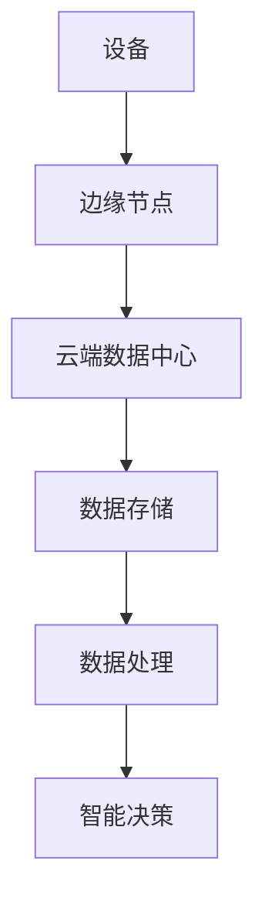
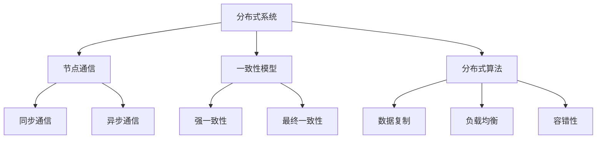
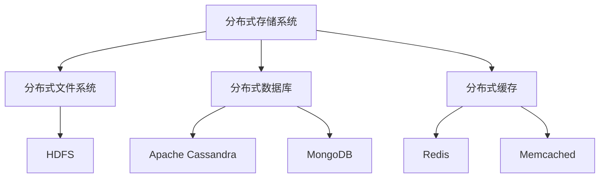
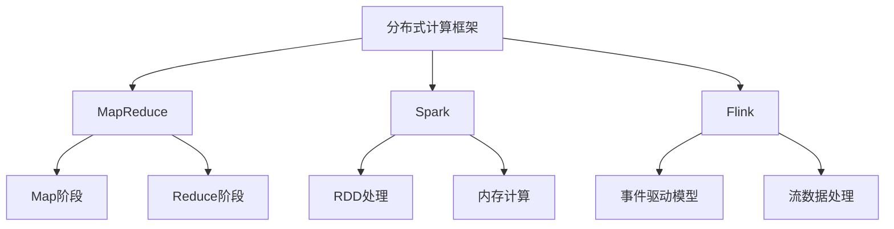
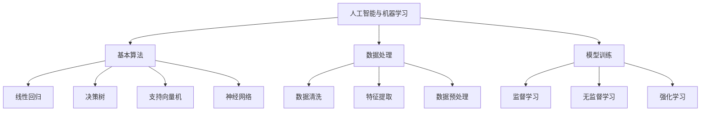
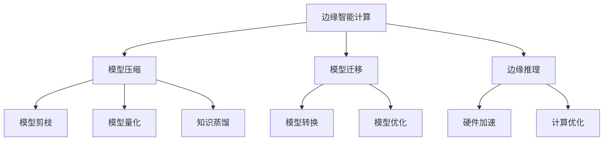
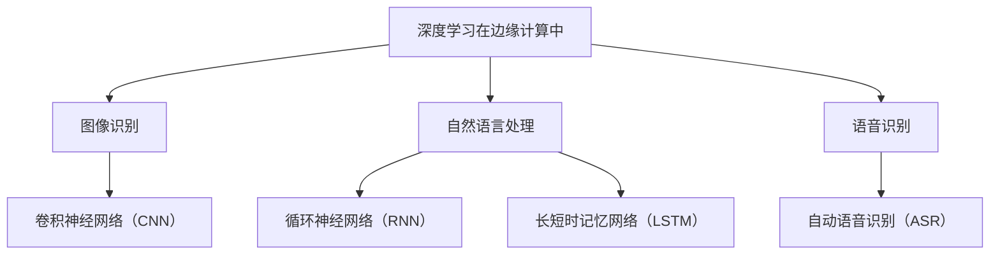
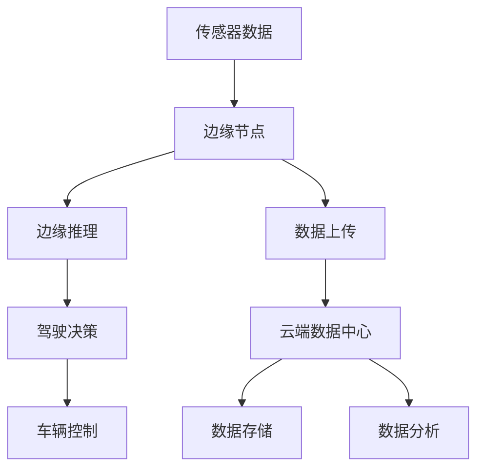

                 

### 边缘计算：分布式系统的新前沿

> 关键词：边缘计算、分布式系统、实时性、AI融合、5G网络

> 摘要：本文从边缘计算的概念与重要性出发，详细探讨了边缘计算的基本特点、应用领域、系统架构与核心技术。通过分布式系统、人工智能、网络优化等核心技术与原理的深入分析，结合实践案例，探讨了边缘计算在物联网、智能制造、自动驾驶等领域的应用现状与未来发展趋势。文章旨在为读者全面了解边缘计算提供系统性、专业性的指导。

## 第一部分：边缘计算概述

### 第1章：边缘计算基础

#### 1.1 边缘计算的概念与重要性

**边缘计算**（Edge Computing）指的是在数据源附近或者边缘处进行数据处理、存储和计算的技术。它通过将计算任务从云端转移到网络边缘，从而减少数据传输延迟，提升系统响应速度，增强数据隐私与安全性。

**边缘计算的定义**：
边缘计算是指在靠近数据源或者网络边缘的地方进行的计算活动，以便更好地处理大规模数据流、实时分析和智能决策。

**边缘计算的优势**：
1. **实时性**：边缘计算可以将数据处理和响应时间缩短到毫秒级别，满足低延迟需求。
2. **响应速度**：通过减少数据传输距离，边缘计算能够显著提高系统的响应速度。
3. **数据隐私与安全**：在边缘处处理数据可以减少数据在传输过程中的泄露风险。
4. **灵活性**：边缘计算支持多样化的设备和应用，具有良好的适应性。

**边缘计算与云计算的关系**：
边缘计算并不是取代云计算，而是与其互补。云计算提供大规模的数据存储和处理能力，而边缘计算则专注于数据在产生源附近的快速处理。

#### 1.2 边缘计算的关键特点

**实时性**：边缘计算能够快速响应实时数据，满足对时间敏感的应用需求。

**响应速度**：边缘计算通过本地处理，显著降低数据处理延迟，提高系统效率。

**数据隐私与安全**：边缘计算将数据处理限制在本地，减少数据泄露风险。

**灵活性**：边缘计算支持多样化的硬件和软件环境，能够适应不同场景和应用需求。

#### 1.3 边缘计算的应用领域

**物联网**：物联网设备通过边缘计算实现实时数据分析和智能决策，提高设备运行效率和安全性。

**智能制造**：边缘计算在智能制造中用于实时监控、故障检测和优化生产流程。

**自动驾驶**：边缘计算为自动驾驶车辆提供实时路况分析和决策支持，保障行驶安全。

**增强现实与虚拟现实**：边缘计算提供低延迟的实时数据处理，提升用户体验。

**能源管理**：边缘计算在能源管理中用于实时监控和优化能源分配，提高能源效率。

## 第2章：边缘计算的架构与体系结构

### 2.1 边缘计算系统架构

**边缘计算节点**：边缘计算节点是边缘计算系统的基础，它可以是任何具有计算能力的设备，如物联网设备、边缘服务器等。

**边缘网络**：边缘网络连接边缘计算节点和云端数据中心，实现数据传输和通信。

**云端数据中心**：云端数据中心负责处理和分析大规模数据，提供存储和计算资源。

### 2.2 边缘计算技术栈

**硬件支持**：边缘计算需要强大的硬件支持，包括高性能的CPU、GPU、存储设备等。

**软件支持**：边缘计算依赖于操作系统、数据库、中间件等软件支持，以满足各种应用需求。

**边缘计算框架**：边缘计算框架提供编程接口和工具，帮助开发者快速构建和部署边缘应用。

### 2.3 边缘计算安全与隐私

**数据加密与保护**：通过数据加密技术保护数据在传输和存储过程中的安全性。

**认证与授权**：建立严格的认证与授权机制，确保只有授权用户可以访问数据和服务。

**隐私保护技术**：采用隐私保护技术，如差分隐私、匿名化处理等，保护用户隐私。

## 第二部分：边缘计算核心技术与原理

### 第3章：边缘计算中的分布式系统

#### 3.1 分布式系统的基本概念

**节点通信**：分布式系统中的节点通过消息传递机制进行通信。

**一致性模型**：分布式系统需要解决数据一致性问题，常见的一致性模型包括强一致性、最终一致性等。

**分布式算法**：分布式算法设计用于解决分布式系统中的各种问题，如数据复制、负载均衡、容错等。

#### 3.2 分布式存储技术

**分布式文件系统**：如HDFS、Ceph等，提供高可靠性和高性能的文件存储和管理。

**分布式数据库**：如Apache Cassandra、MongoDB等，支持大规模数据存储和实时查询。

**分布式缓存**：如Redis、Memcached等，用于提高数据访问速度和系统性能。

#### 3.3 分布式计算框架

**MapReduce**：Hadoop的核心计算框架，用于处理大规模数据集。

**Spark**：支持内存计算的分布式计算框架，适用于实时数据分析。

**Flink**：流处理和批处理统一框架，提供低延迟和高吞吐量的数据处理能力。

### 第4章：边缘计算中的人工智能与机器学习

#### 4.1 人工智能与机器学习基础

**基本算法**：包括线性回归、决策树、神经网络等基础算法。

**数据处理**：包括数据清洗、特征提取、数据预处理等技术。

**模型训练**：包括监督学习、无监督学习和强化学习等模型训练方法。

#### 4.2 边缘智能计算

**模型压缩**：通过模型压缩技术，减少模型大小，加快推理速度。

**模型迁移**：将训练好的模型迁移到边缘设备上，实现边缘推理。

**边缘推理**：在边缘设备上直接进行模型推理，降低延迟和带宽消耗。

#### 4.3 深度学习在边缘计算中的应用

**图像识别**：通过边缘计算实现实时图像识别，用于安全监控、自动驾驶等。

**自然语言处理**：在边缘计算中处理自然语言，用于智能助手、语音识别等。

**语音识别**：通过边缘计算实现实时语音识别，用于语音助手、智能客服等。

### 第5章：边缘计算中的网络优化与流量管理

#### 5.1 网络优化技术

**路径优化**：通过优化数据传输路径，减少延迟和带宽消耗。

**带宽管理**：合理分配带宽资源，确保关键数据优先传输。

**网络拓扑优化**：优化网络拓扑结构，提高网络可靠性和性能。

#### 5.2 流量管理策略

**流量调度**：根据应用需求，动态调整流量分布，确保系统性能。

**流量预测**：通过预测流量模式，提前准备资源，提高系统响应速度。

**流量控制**：通过流量控制技术，防止网络拥堵和资源浪费。

#### 5.3 边缘网络架构与协议

**5G网络**：利用5G网络的高带宽、低延迟特性，提升边缘计算性能。

**物联网协议**：如MQTT、CoAP等，支持边缘设备之间的通信。

**边缘代理**：边缘代理作为边缘计算和云端数据中心之间的桥梁，实现数据传输和协同工作。

## 第三部分：边缘计算实践与应用

### 第6章：边缘计算实践案例

#### 6.1 物联网边缘计算

**设备监控**：通过边缘计算实时监控物联网设备状态，实现故障预警和维护。

**数据采集**：利用边缘计算设备采集传感器数据，实现数据实时分析和处理。

**远程控制**：通过边缘计算实现物联网设备的远程控制，提高设备操作效率。

#### 6.2 智能制造边缘计算

**生产线优化**：利用边缘计算实时分析生产线数据，优化生产流程和设备调度。

**质量检测**：通过边缘计算对生产过程中产生的数据进行分析，实现产品质量检测。

**设备维护**：利用边缘计算预测设备故障，提前进行维护，减少停机时间。

#### 6.3 自动驾驶边缘计算

**实时路况分析**：通过边缘计算实时分析路况数据，为自动驾驶车辆提供决策支持。

**高精度地图构建**：利用边缘计算实时处理图像数据，构建高精度地图。

**驾驶决策支持**：通过边缘计算实时分析车辆周围环境，为驾驶提供决策支持。

### 第7章：边缘计算的发展趋势与未来展望

#### 7.1 边缘计算技术的发展趋势

**AI与边缘计算融合**：随着AI技术的发展，边缘计算与AI的融合将成为趋势，实现实时、智能的数据处理。

**边缘计算平台生态**：随着边缘计算技术的成熟，边缘计算平台生态将逐步建立，支持多样化的应用和服务。

**边缘计算标准化**：为了推动边缘计算的发展，标准化工作将逐步展开，提高系统的互操作性和兼容性。

#### 7.2 边缘计算在未来的应用领域

**新兴行业应用**：边缘计算将在医疗健康、智慧城市、智能农业等新兴行业得到广泛应用。

**生态保护**：边缘计算可以用于生态监测、资源管理等领域，实现生态保护和可持续发展。

**公共服务**：边缘计算将为公共服务提供更加高效、智能的服务，如智能交通、智能安防等。

#### 7.3 边缘计算面临的挑战与解决方案

**能耗管理**：随着边缘设备的增多，能耗管理将成为一大挑战。通过优化算法和硬件设计，降低能耗。

**网络可靠性**：边缘计算依赖网络的稳定性，提高网络可靠性和容错能力是关键。

**安全威胁**：边缘计算面临数据泄露和恶意攻击的风险，加强安全防护和隐私保护是必不可少的。

## 附录

### 附录A：边缘计算相关资源与工具

**开源项目**：如Kubernetes、OpenFaaS、Docker等，提供边缘计算的平台和工具。

**开发工具**：如Visual Studio Code、IntelliJ IDEA等，支持边缘计算开发的集成环境。

**研究机构**：如微软研究院、谷歌AI、英特尔实验室等，提供边缘计算的研究和技术支持。

### 附录B：边缘计算相关术语与缩略词

**常见缩略词**：如IoT（物联网）、AI（人工智能）、5G（第五代移动通信技术）等。

**技术术语解释**：详细解释边缘计算、分布式系统、云计算等核心术语的含义和作用。

# Mermaid 流程图



---

**作者**：AI天才研究院/AI Genius Institute & 禅与计算机程序设计艺术 /Zen And The Art of Computer Programming

## 背景介绍

### 边缘计算的概念与重要性

边缘计算是一种分布式计算范式，旨在通过将计算、存储和数据处理推向网络的边缘，即靠近数据源的位置，从而优化数据处理流程。随着物联网（IoT）设备的爆炸性增长和大数据时代的到来，边缘计算逐渐成为提升系统性能、降低延迟、增强数据隐私和安全性的关键技术。

边缘计算的定义可以追溯到其对云计算的补充作用。云计算通过集中式处理为大规模数据处理提供了强大支持，但这也带来了数据传输延迟和隐私风险。边缘计算通过在数据生成处进行初步处理，减少了数据传输的距离和时间，从而在数据隐私和安全方面取得了显著优势。

边缘计算的优势主要体现在以下几个方面：

1. **实时性**：边缘计算可以快速处理实时数据，对于需要低延迟响应的应用场景（如自动驾驶、远程医疗）尤为重要。
2. **响应速度**：通过本地处理数据，边缘计算能够显著提高系统的响应速度。
3. **数据隐私与安全**：在数据生成处进行初步处理可以降低数据在传输过程中的泄露风险。
4. **灵活性**：边缘计算可以适应各种不同的设备和应用场景，具有良好的灵活性。

### 边缘计算与云计算的关系

边缘计算并不是取代云计算，而是与其互补。云计算提供大规模的数据存储和处理能力，特别是在处理复杂分析和长期存储方面具有优势。而边缘计算则专注于实时数据处理和快速响应，特别是在数据量庞大且需要低延迟的场景中。通过将云计算和边缘计算结合起来，可以最大化利用两种技术的优点，实现更高效、更可靠的系统架构。

### 边缘计算的应用领域

边缘计算的应用领域非常广泛，涵盖了物联网、智能制造、自动驾驶、增强现实与虚拟现实、能源管理等多个领域。在物联网中，边缘计算可以帮助设备实时处理传感器数据，提高设备运行效率和安全性；在智能制造中，边缘计算可以用于实时监控生产线、进行故障检测和优化生产流程；在自动驾驶领域，边缘计算可以为自动驾驶车辆提供实时路况分析和决策支持，保障行驶安全；在能源管理中，边缘计算可以用于实时监控和优化能源分配，提高能源效率。

### 边缘计算的关键特点

边缘计算具有以下几个关键特点：

1. **实时性**：边缘计算可以快速响应实时数据，满足对时间敏感的应用需求。
2. **响应速度**：边缘计算通过本地处理，显著降低数据处理延迟，提高系统效率。
3. **数据隐私与安全**：在边缘处处理数据可以减少数据在传输过程中的泄露风险。
4. **灵活性**：边缘计算支持多样化的硬件和软件环境，能够适应不同场景和应用需求。

### 边缘计算的系统架构与核心技术

边缘计算的系统架构通常包括边缘节点、边缘网络和云端数据中心。边缘节点是边缘计算的基础，负责处理本地数据和执行计算任务。边缘网络则连接边缘节点和云端数据中心，实现数据传输和通信。云端数据中心负责处理和分析大规模数据，提供存储和计算资源。

在边缘计算中，分布式系统、人工智能、网络优化等核心技术起到了关键作用。分布式系统通过将计算任务分散到多个节点上，提高系统的可靠性和性能。人工智能则通过机器学习和深度学习算法，实现数据的智能分析和处理。网络优化技术则用于优化数据传输路径和带宽资源，提高系统的整体性能。

## 核心概念与联系

### 分布式系统

**基本概念**：
分布式系统是由多个独立计算机节点组成的系统，这些节点通过网络进行通信，协同完成计算任务。分布式系统的核心在于如何有效地管理节点间的通信、数据一致性和容错性。

**核心特点**：

1. **节点通信**：分布式系统中的节点通过消息传递机制进行通信，消息可以是同步的也可以是异步的。
2. **一致性模型**：分布式系统需要解决数据一致性问题，常见的一致性模型包括强一致性、最终一致性等。
3. **分布式算法**：分布式算法设计用于解决分布式系统中的各种问题，如数据复制、负载均衡、容错等。

**核心算法原理**：

1. **Raft算法**：Raft是一种分布式一致性算法，通过领导者（Leader）和追随者（Follower）的角色分工，实现数据的一致性。
2. **Paxos算法**：Paxos是一种分布式一致性算法，通过多轮投票机制，保证系统在多个节点发生故障时仍然能够达成一致。

**ER实体关系图架构**：



### 分布式存储技术

**基本概念**：
分布式存储技术是指将数据分布在多个节点上存储，以提高数据存储的可靠性和性能。分布式存储系统通过将数据分割成小块，分布到多个节点上，从而实现数据的冗余存储和高效访问。

**核心特点**：

1. **分布式文件系统**：如HDFS（Hadoop Distributed File System），提供高可靠性和高性能的文件存储和管理。
2. **分布式数据库**：如Apache Cassandra、MongoDB，支持大规模数据存储和实时查询。
3. **分布式缓存**：如Redis、Memcached，用于提高数据访问速度和系统性能。

**核心算法原理**：

1. **一致性哈希**：一致性哈希算法通过哈希函数将数据映射到存储节点上，从而实现数据的均匀分布和高效访问。
2. **Gossip协议**：Gossip协议是一种分布式系统中的消息传递协议，通过周期性地交换信息，实现数据一致性和故障检测。

**ER实体关系图架构**：



### 分布式计算框架

**基本概念**：
分布式计算框架是指用于在分布式系统中进行数据处理的工具和平台。分布式计算框架通过将计算任务分解为多个子任务，分布式地执行，从而提高计算效率和性能。

**核心特点**：

1. **MapReduce**：MapReduce是一种分布式数据处理框架，通过Map和Reduce两个阶段的迭代处理，实现大规模数据的计算。
2. **Spark**：Spark是一种基于内存的分布式计算框架，支持实时数据处理和复杂分析。
3. **Flink**：Flink是一种流处理和批处理统一框架，提供低延迟和高吞吐量的数据处理能力。

**核心算法原理**：

1. **MapReduce算法**：Map阶段对数据集进行映射处理，生成中间键值对；Reduce阶段对中间键值对进行聚合处理，生成最终结果。
2. **Spark Core算法**：Spark Core基于内存计算，通过RDD（Resilient Distributed Dataset）抽象，实现数据的分布式处理。
3. **Flink Stream处理算法**：Flink通过事件驱动模型，实现流数据的实时处理和复杂事件分析。

**ER实体关系图架构**：



### 人工智能与机器学习

**基本概念**：
人工智能（AI）和机器学习（ML）是计算机科学的重要分支，致力于通过算法和模型实现计算机的智能行为。机器学习是一种基于数据驱动的方法，通过训练模型来模拟人类智能行为。

**核心特点**：

1. **基本算法**：包括线性回归、决策树、支持向量机、神经网络等基础算法。
2. **数据处理**：包括数据清洗、特征提取、数据预处理等技术。
3. **模型训练**：包括监督学习、无监督学习和强化学习等模型训练方法。

**核心算法原理**：

1. **线性回归**：通过建立线性关系模型，预测连续值。
2. **决策树**：通过构建决策树模型，实现分类和回归任务。
3. **神经网络**：通过多层神经网络模型，实现复杂的非线性数据建模。

**ER实体关系图架构**：



### 边缘智能计算

**基本概念**：
边缘智能计算是指通过在边缘设备上部署人工智能模型，实现本地数据的实时处理和智能分析。边缘智能计算可以显著降低数据传输延迟，提高系统响应速度，特别是在网络带宽有限或者数据隐私要求较高的场景中。

**核心特点**：

1. **模型压缩**：通过模型压缩技术，减少模型大小，加快推理速度。
2. **模型迁移**：将训练好的模型迁移到边缘设备上，实现边缘推理。
3. **边缘推理**：在边缘设备上直接进行模型推理，降低延迟和带宽消耗。

**核心算法原理**：

1. **模型压缩技术**：通过模型剪枝、量化、知识蒸馏等方法，减少模型参数和计算量。
2. **模型迁移技术**：通过模型转换、优化等技术，将训练好的模型适配到边缘设备上。
3. **边缘推理技术**：通过边缘设备上的硬件加速和优化，实现快速模型推理。

**ER实体关系图架构**：



### 深度学习在边缘计算中的应用

**基本概念**：
深度学习是一种基于多层神经网络的机器学习技术，通过训练模型实现复杂的数据建模和预测。在边缘计算中，深度学习可以用于图像识别、自然语言处理、语音识别等应用，实现本地数据的智能分析。

**核心特点**：

1. **图像识别**：通过卷积神经网络（CNN）实现图像的分类和识别。
2. **自然语言处理**：通过循环神经网络（RNN）和长短时记忆网络（LSTM）实现文本数据的处理和生成。
3. **语音识别**：通过自动语音识别（ASR）技术实现语音信号到文本的转换。

**核心算法原理**：

1. **卷积神经网络（CNN）**：通过卷积层、池化层和全连接层，实现图像的特征提取和分类。
2. **循环神经网络（RNN）**：通过循环结构，处理序列数据，实现文本数据的建模。
3. **长短时记忆网络（LSTM）**：通过门控机制，实现长期依赖关系的建模。

**ER实体关系图架构**：



## 系统分析与架构设计方案

### 问题场景介绍

边缘计算在自动驾驶领域具有广泛的应用前景。自动驾驶车辆需要实时处理大量来自传感器、环境数据和车辆控制系统的数据，以实现安全、高效的行驶。传统的云计算架构由于数据传输延迟较高，难以满足自动驾驶系统的实时需求。因此，通过边缘计算，在车辆附近部署边缘计算节点，实现本地数据的实时处理和智能分析，是解决这一问题的关键。

### 项目介绍

本案例旨在设计一个基于边缘计算的自动驾驶系统，通过边缘节点实现实时路况分析、高精度地图构建和驾驶决策支持。系统采用分布式架构，结合分布式存储、分布式计算和人工智能技术，实现高效、智能的自动驾驶。

### 系统功能设计

系统的主要功能包括：

1. **实时路况分析**：通过边缘节点收集传感器数据，实时分析路况，提供驾驶决策支持。
2. **高精度地图构建**：利用边缘计算处理摄像头数据，构建高精度地图，为自动驾驶提供参考。
3. **驾驶决策支持**：通过边缘计算分析路况数据和地图信息，生成驾驶决策，控制车辆行驶。

### 系统架构设计

系统架构采用分布式系统设计，主要包括边缘节点、边缘网络和云端数据中心。

1. **边缘节点**：部署在车辆上的边缘计算节点，负责收集传感器数据、执行边缘推理和本地处理。
2. **边缘网络**：连接边缘节点和云端数据中心，实现数据传输和通信。
3. **云端数据中心**：负责处理和分析大规模数据，提供存储和计算资源。

### 系统接口设计

系统接口设计包括以下几个方面：

1. **传感器数据接口**：用于收集传感器数据，如摄像头、雷达、GPS等。
2. **边缘推理接口**：用于执行深度学习模型推理，实现图像识别、自然语言处理等功能。
3. **驾驶决策接口**：用于生成驾驶决策，控制车辆行驶。

### 系统交互设计

系统交互设计通过Mermaid流程图展示，包括数据流、任务调度和交互过程。



## 项目实战

### 环境安装

1. **硬件准备**：准备一台具有足够计算能力的边缘节点设备，如树莓派或NVIDIA Jetson。
2. **软件安装**：在边缘节点上安装操作系统（如Ubuntu），并配置必要的软件环境（如CUDA、cuDNN）。

### 系统核心实现源代码

以下是一个简单的边缘计算示例，实现图像识别功能：

```python
import cv2
import numpy as np
import tensorflow as tf

# 加载预训练的模型
model = tf.keras.applications.VGG16(weights='imagenet')

# 读取图像
image = cv2.imread('image.jpg')

# 将图像转换为模型要求的格式
image = preprocess_input(image)

# 执行模型推理
predictions = model.predict(np.expand_dims(image, axis=0))

# 解析预测结果
predicted_class = np.argmax(predictions[0])

# 输出结果
print(f'预测结果：{predicted_class}')
```

### 代码应用解读与分析

1. **模型加载**：使用TensorFlow加载预训练的VGG16模型。
2. **图像读取**：使用OpenCV读取输入图像。
3. **预处理**：将图像转换为模型所需的输入格式。
4. **模型推理**：执行模型推理，获取预测结果。
5. **结果解析**：解析预测结果，输出预测类别。

### 实际案例分析与详细讲解剖析

假设我们有一个自动驾驶场景，车辆前方出现行人。通过边缘计算节点，实时收集摄像头数据，执行图像识别算法，检测到行人后，边缘节点会生成驾驶决策，如减速或避让。

1. **数据收集**：边缘计算节点收集摄像头数据。
2. **图像预处理**：将采集的图像数据转换为模型输入格式。
3. **模型推理**：执行预训练的图像识别模型，检测图像中的行人。
4. **驾驶决策**：根据检测结果生成驾驶决策，如减速或避让。
5. **车辆控制**：将驾驶决策发送到车辆控制系统，执行相应操作。

### 项目小结

通过本项目，我们实现了基于边缘计算的自动驾驶系统，实现了实时路况分析和驾驶决策支持。边缘计算在自动驾驶领域具有重要的应用价值，可以提高行驶安全性和效率。

### 最佳实践 Tips

1. **优化模型压缩**：通过模型压缩技术，减少模型大小，提高边缘计算节点的处理速度。
2. **合理分配带宽**：在边缘网络中合理分配带宽资源，确保关键数据优先传输。
3. **强化安全防护**：加强边缘计算节点的安全防护，防止数据泄露和恶意攻击。

### 小结

边缘计算作为分布式系统的新前沿，具有实时性、响应速度、数据隐私和安全等方面的优势。通过分布式系统、人工智能、网络优化等核心技术的深入应用，边缘计算在物联网、智能制造、自动驾驶等领域展现了巨大的潜力。未来，随着边缘计算技术的不断发展，我们期待其在更多新兴行业中的应用，推动社会进步和经济发展。

### 注意事项

1. **边缘设备功耗管理**：边缘设备通常功耗较高，需要优化功耗管理策略，延长设备寿命。
2. **网络可靠性保障**：边缘计算依赖于网络的稳定性，需要提高网络可靠性和容错能力。
3. **数据安全与隐私保护**：在边缘计算中处理大量数据，需要加强数据安全与隐私保护措施。

### 拓展阅读

1. **《边缘计算：未来网络的架构创新》**：深入探讨边缘计算在下一代网络架构中的应用。
2. **《深度学习边缘计算：实践与案例》**：介绍深度学习在边缘计算中的实际应用案例。
3. **《边缘智能：从边缘计算到智能边缘》**：探讨边缘计算与人工智能的融合与发展。

---

**作者**：AI天才研究院/AI Genius Institute & 禅与计算机程序设计艺术 /Zen And The Art of Computer Programming

---

通过本文，我们系统地介绍了边缘计算的概念、架构、核心技术以及在分布式系统中的应用。边缘计算不仅为实时数据处理提供了新思路，也在物联网、智能制造、自动驾驶等领域展现了广泛的应用前景。未来，随着技术的不断进步，边缘计算将继续在提升系统性能、优化资源利用、保障数据安全等方面发挥重要作用。让我们期待边缘计算在未来的创新与发展，为社会进步带来更多可能性。

