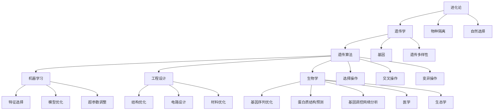
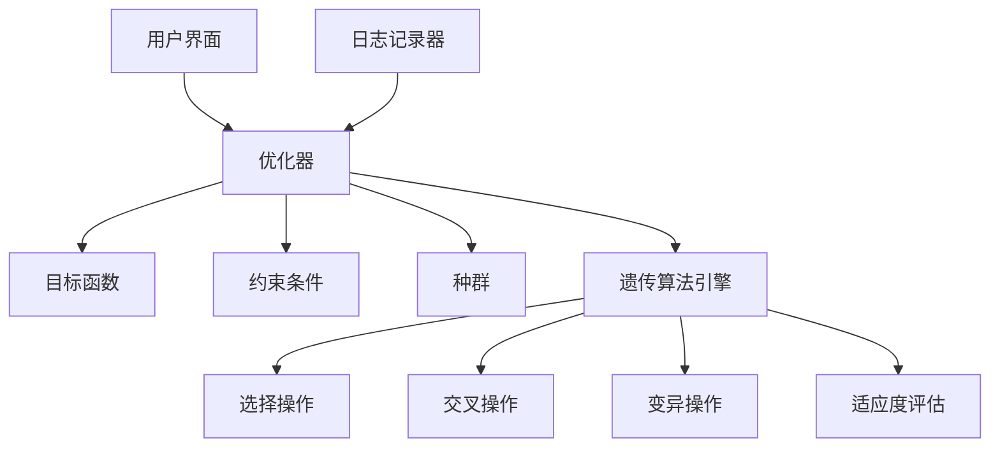
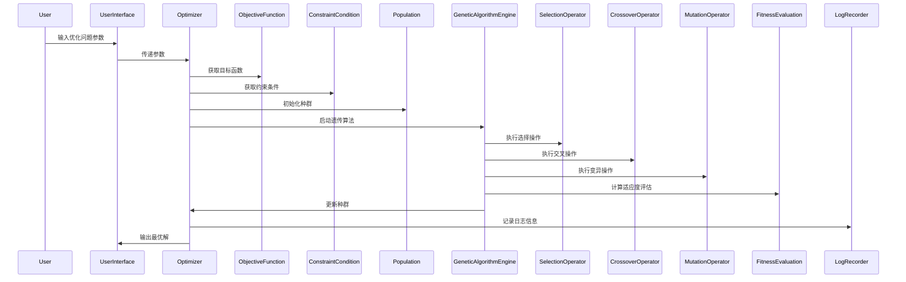

                 

# 《达尔文进化论与遗传算法：生物学启发的优化技术》

> 关键词：进化论、遗传算法、优化技术、人工智能

> 摘要：本文从达尔文的进化论出发，深入探讨了遗传算法这一生物学启发的优化技术。通过分析遗传算法的原理、应用及未来发展趋势，本文旨在帮助读者理解遗传算法在优化问题解决中的重要作用。

# 《达尔文进化论与遗传算法：生物学启发的优化技术》目录大纲

## 第一部分：进化论基础

### 第1章：进化论概述

#### 1.1 进化论的定义与发展

进化论是生物学的一个基本理论，它描述了生物物种在长时间演化过程中发生的逐渐变化。查尔斯·达尔文是进化论的奠基人，他的理论主要通过自然选择和物种隔离来解释生物的演化。

- **进化论的定义**：进化论认为，生物种群的遗传特征会随着时间而改变，这些变化可以导致新的物种的产生。
- **进化论的历史与发展**：自达尔文提出进化论以来，生物学界对进化论进行了深入的研究，提出了多种进化机制和理论。

#### 1.2 达尔文的进化论观点

- **自然选择**：自然选择是指那些最适合其环境的个体在繁殖过程中更有可能传递其遗传特征给下一代。
- **物种隔离**：物种隔离是指新物种的形成过程中，原有物种由于地理隔离或其他因素而分化为不同的种群。
- **共同祖先**：所有现存的生物都源于一个共同的祖先，通过自然选择和变异，这些生物逐渐演化出各自的特征。

#### 1.3 达尔文进化论的影响

达尔文的进化论对科学领域产生了深远的影响，推动了生物学、生态学、遗传学等学科的发展。同时，它也引发了社会文化领域的广泛讨论，包括伦理、宗教、教育等多个方面。

## 第二部分：遗传学基础

### 第2章：遗传学基础

#### 2.1 遗传学的起源与发展

遗传学是研究遗传现象和遗传信息的科学。从孟德尔的工作开始，遗传学经历了多个阶段的发展，逐渐揭示了遗传信息的本质。

- **遗传学的定义**：遗传学是研究遗传现象、遗传规律以及遗传信息传递的科学。
- **遗传学的发展历程**：包括孟德尔的豌豆实验、摩尔根的果蝇研究、DNA双螺旋结构的发现等。

#### 2.2 遗传信息的传递

遗传信息主要通过DNA进行传递。DNA上的基因编码了生物体的遗传特征，这些特征通过生殖细胞传递给后代。

- **基因与DNA**：基因是DNA上的特定序列，编码了特定的遗传信息。
- **遗传密码**：遗传密码是DNA上基因序列与氨基酸序列之间的对应关系。

#### 2.3 遗传多样性

遗传多样性是生物种群适应环境变化的重要基础。遗传多样性可以通过自然选择、基因流、突变等因素维持和改变。

- **遗传多样性的重要性**：遗传多样性保证了物种的生存和适应能力。
- **遗传多样性的影响因素**：包括自然选择、基因流、突变、遗传漂变等。

## 第二部分：遗传算法原理

### 第3章：遗传算法基础

#### 3.1 遗传算法的定义与特点

遗传算法是一种基于生物进化的搜索和优化技术，它模拟自然选择和遗传学原理来寻找最优解。

- **遗传算法的定义**：遗传算法是一种通过模拟自然进化过程来求解优化问题的搜索算法。
- **遗传算法的特点**：包括种群进化、遗传操作、自适应搜索等。

#### 3.2 遗传算法的基本操作

遗传算法的主要操作包括选择、交叉和变异。

- **选择操作**：选择是遗传算法中的核心操作，它决定了哪些个体将参与后续的操作。
- **交叉操作**：交叉是指通过交换父母个体的基因来生成子代个体。
- **变异操作**：变异是指通过随机改变个体基因来产生新的个体。

#### 3.3 遗传算法的参数设置

遗传算法的参数设置对算法的性能有重要影响，包括种群大小、交叉概率、变异概率等。

- **种群大小**：种群大小决定了算法的搜索空间。
- **交叉概率与变异概率**：交叉概率和变异概率决定了遗传操作的概率。

## 第三部分：遗传算法应用实例

### 第4章：遗传算法的优化能力

#### 4.1 遗传算法的优化原理

遗传算法通过模拟自然进化过程，逐步优化个体，最终找到最优解。

- **遗传算法的优化过程**：包括种群初始化、选择、交叉、变异和评估等步骤。
- **遗传算法的优化能力分析**：遗传算法在处理复杂优化问题时具有强大的能力和适应性。

#### 4.2 遗传算法的应用领域

遗传算法广泛应用于机器学习、工程设计、生物学等领域。

- **机器学习**：遗传算法用于特征选择、模型优化等。
- **工程设计**：遗传算法用于结构优化、电路设计等。
- **生物学**：遗传算法用于生物信息学、医学等领域。

#### 4.3 遗传算法的优势与局限性

遗传算法具有强大的优化能力和适应性，但也存在一些局限性，如收敛速度、计算复杂度等。

- **遗传算法的优势**：包括并行处理、鲁棒性、自适应搜索等。
- **遗传算法的局限性**：包括收敛速度、计算复杂度等。

## 第四部分：遗传算法的未来与发展

### 第5章：遗传算法的未来与发展

#### 5.1 遗传算法的发展趋势

遗传算法在不断发展，新的模型和算法不断涌现。

- **新的遗传算法模型**：包括多目标遗传算法、协同遗传算法等。
- **遗传算法与其他优化算法的结合**：遗传算法与其他优化算法（如模拟退火、粒子群优化等）的结合，形成了新的混合优化算法。

#### 5.2 遗传算法在社会与文化领域的影响

遗传算法不仅在技术领域具有重要作用，还在社会和文化领域产生了影响。

- **遗传算法在人工智能领域的应用**：遗传算法在人工智能领域得到了广泛应用，包括智能搜索、自适应控制等。
- **遗传算法在生物伦理问题中的讨论**：遗传算法在医学、基因编辑等领域引发了关于伦理和安全的讨论。

## 附录

### 附录A：遗传算法工具与资源

遗传算法的常用工具和资源，包括开源库、在线平台等。

- **遗传算法常用工具**：例如 DEAP、PyGAD 等。
- **遗传算法学习资源**：包括在线课程、论文、书籍等。

### 附录B：遗传算法实例代码

提供一些遗传算法的实例代码，包括机器学习、工程设计等领域的应用。

### 附录C：参考文献

列出本文引用的相关文献，包括书籍、论文等。

---

**作者：AI天才研究院/AI Genius Institute & 禅与计算机程序设计艺术 /Zen And The Art of Computer Programming**## 第一部分：进化论基础

### 第1章：进化论概述

#### 1.1 进化论的定义与发展

进化论是生物学的一个基本理论，描述了生物物种在长时间演化过程中发生的逐渐变化。查尔斯·达尔文是进化论的奠基人，他的理论主要通过自然选择和物种隔离来解释生物的演化。

**进化论的定义**：进化论认为，生物种群的遗传特征会随着时间而改变，这些变化可以导致新的物种的产生。这种变化不仅涉及个体层面的适应，还包括物种层面的分化。

**进化论的历史与发展**：进化论的发展可以追溯到18世纪末和19世纪初。托马斯·马尔萨斯的《人口论》首次提出了种群增长与资源有限的矛盾，为进化论的提出提供了理论基础。然而，真正的进化论奠基人是查尔斯·达尔文。1859年，达尔文发表了《物种起源》，系统地阐述了进化论的理论。此后，生物学界对进化论进行了深入的研究，提出了多种进化机制和理论，如自然选择、遗传学、生态学等。

#### 1.2 达尔文的进化论观点

达尔文的进化论观点主要包括自然选择、物种隔离和共同祖先。

**自然选择**：自然选择是指那些最适合其环境的个体在繁殖过程中更有可能传递其遗传特征给下一代。达尔文认为，自然选择是生物进化的主要驱动力。

**物种隔离**：物种隔离是指新物种的形成过程中，原有物种由于地理隔离或其他因素而分化为不同的种群。物种隔离可以防止基因流动，从而导致基因库的分化。

**共同祖先**：所有现存的生物都源于一个共同的祖先，通过自然选择和变异，这些生物逐渐演化出各自的特征。共同祖先理论是进化论的核心之一。

#### 1.3 达尔文进化论的影响

达尔文的进化论对科学领域产生了深远的影响，推动了生物学、生态学、遗传学等学科的发展。同时，它也引发了社会文化领域的广泛讨论，包括伦理、宗教、教育等多个方面。

在科学领域，进化论为生物学家提供了新的研究视角和方法，促进了生物学和其他学科的交叉发展。例如，遗传学的发展证明了进化论中基因和遗传信息的重要性。生态学也通过研究物种间的相互作用和生态系统的动态变化，进一步验证了进化论的预测。

在社会文化领域，进化论引发了关于人类起源、伦理道德和宗教信仰的讨论。一些人认为，进化论挑战了宗教创世论，推动了科学精神的发展。然而，也有人担心进化论可能导致道德和伦理的混乱，引发社会动荡。

总之，达尔文的进化论不仅为生物学的发展奠定了基础，也对科学、哲学、文化等多个领域产生了深远的影响。

### 第2章：遗传学基础

#### 2.1 遗传学的起源与发展

遗传学是研究遗传现象和遗传信息的科学。从孟德尔的工作开始，遗传学经历了多个阶段的发展，逐渐揭示了遗传信息的本质。

**遗传学的定义**：遗传学是研究遗传现象、遗传规律以及遗传信息传递的科学。它关注的是生物体内的遗传物质（如DNA）如何影响个体的生长、发育和繁殖。

**遗传学的发展历程**：

1. **孟德尔的豌豆实验**：19世纪，奥地利修道士格雷戈尔·孟德尔通过对豌豆植物进行杂交实验，发现了遗传规律。他提出了遗传因子（现在称为基因）的概念，并揭示了基因的分离和独立分离定律。

2. **摩尔根的果蝇研究**：20世纪初，美国遗传学家托马斯·亨特·摩尔根通过研究果蝇，证实了基因位于染色体上。他提出了基因连锁和交叉互换的概念，进一步深化了遗传学的理论。

3. **DNA双螺旋结构的发现**：1953年，英国科学家詹姆斯·沃森和弗朗西斯·克里克发现了DNA的双螺旋结构。这一发现揭示了遗传信息的存储和复制机制，为遗传学的发展奠定了基础。

4. **分子遗传学的兴起**：20世纪后半叶，分子遗传学迅速发展。科学家们开始研究基因的序列、功能和调控机制。基因工程和基因组学等新兴领域也随之出现。

#### 2.2 遗传信息的传递

遗传信息主要通过DNA进行传递。DNA上的基因编码了生物体的遗传特征，这些特征通过生殖细胞传递给后代。

**基因与DNA**：基因是DNA上的特定序列，编码了特定的遗传信息。每个基因都有特定的功能和作用，如决定眼睛颜色、身高、智力等特征。

**遗传密码**：遗传密码是DNA上基因序列与氨基酸序列之间的对应关系。DNA上的四种碱基（腺嘌呤A、胸腺嘧啶T、胞嘧啶C、鸟嘌呤G）通过特定的排列组合，编码成20种不同的氨基酸，形成蛋白质。

**遗传信息的传递过程**：

1. **DNA复制**：在细胞分裂过程中，DNA会进行复制，确保每个新细胞都获得一份完整的遗传信息。DNA复制是通过解旋和合成新的DNA链来完成的。

2. **转录**：DNA上的基因序列被转录成mRNA（信使RNA）。这个过程由RNA聚合酶完成。

3. **翻译**：mRNA被带到细胞质中的核糖体，通过翻译过程将mRNA上的密码子转换成氨基酸序列，形成蛋白质。

**遗传多样性的形成**：遗传多样性是生物种群适应环境变化的重要基础。遗传多样性可以通过自然选择、基因流、突变等因素维持和改变。

- **自然选择**：自然选择是指那些最适合其环境的个体在繁殖过程中更有可能传递其遗传特征给下一代。这种过程可以导致某些基因在种群中的频率增加，从而形成新的特征。

- **基因流**：基因流是指个体之间的基因交流，如通过迁徙、杂交等。基因流可以增加不同种群之间的基因多样性。

- **突变**：突变是基因序列的突然改变。突变可以导致新的基因产生，从而增加遗传多样性。

**遗传多样性的影响因素**：遗传多样性受到多种因素的影响，包括环境、遗传背景、自然选择、基因流和突变等。环境因素如气候、食物供应和栖息地变化等，可以影响物种的适应能力和生存机会。遗传背景如种群大小、隔离程度和基因流等，也会影响遗传多样性的维持和演化。

总之，遗传学的研究不仅揭示了生物体的遗传特征和遗传规律，还为进化论提供了坚实的理论基础。遗传学的发展为理解生物多样性和生物进化提供了重要的工具和方法。

### 第3章：遗传算法基础

#### 3.1 遗传算法的定义与特点

遗传算法是一种模拟自然进化和遗传学原理的搜索和优化技术，通过遗传操作来逐步优化个体，最终找到最优解。它最早由约翰·霍兰（John H. Holland）在1975年提出。

**遗传算法的定义**：遗传算法是一种通过模拟自然进化过程来求解优化问题的搜索算法。它基于种群进化、遗传操作（选择、交叉、变异）和适应度评估等机制，不断优化个体，直至达到预定的目标。

**遗传算法的特点**：

1. **种群进化**：遗传算法通过种群进化来实现优化过程。种群是遗传算法的基本单位，每个个体代表一个可能的解决方案。算法通过迭代地选择、交叉和变异，使种群逐渐进化，从而逐步逼近最优解。

2. **遗传操作**：遗传算法的核心在于遗传操作，包括选择、交叉和变异。选择操作根据个体的适应度来选择优秀的个体进行繁殖。交叉操作通过交换父母个体的基因来生成子代个体。变异操作通过随机改变个体基因来产生新的个体。

3. **自适应搜索**：遗传算法能够自适应地调整搜索过程。在进化过程中，算法会根据种群的状态和适应度分布来调整交叉和变异的概率，从而优化搜索过程。

4. **并行处理**：遗传算法能够并行处理多个个体，从而提高搜索效率。不同个体在不同的区域进行搜索，能够更好地覆盖搜索空间。

5. **鲁棒性**：遗传算法对初始解、搜索空间和噪声具有一定的鲁棒性。它能够在复杂的搜索空间中找到较好的解，且不易陷入局部最优。

#### 3.2 遗传算法的基本操作

遗传算法的主要操作包括选择、交叉和变异。

**选择操作**：选择操作是遗传算法中的核心操作，它决定了哪些个体将参与后续的操作。选择操作通常基于个体的适应度来选择，适应度越高的个体被选中的概率越大。常用的选择方法包括轮盘赌选择、锦标赛选择和排名选择等。

**交叉操作**：交叉操作通过交换父母个体的基因来生成子代个体。交叉操作模拟了生物中的繁殖过程，从而产生新的遗传组合。交叉操作有助于增加种群的多样性，防止搜索过程过早收敛到局部最优。常用的交叉方法包括单点交叉、两点交叉和均匀交叉等。

**变异操作**：变异操作通过随机改变个体基因来产生新的个体。变异操作是遗传算法中的一种探索机制，有助于搜索新的区域，避免陷入局部最优。变异操作通常以一定的概率发生，常用的变异方法包括随机变异、位翻转变异和插入变异等。

**适应度评估**：适应度评估是遗传算法中另一个重要的操作。每个个体在种群中都有一个适应度值，该值反映了个体对于问题的解决方案的优劣程度。适应度值越高，表示个体的解决方案越接近最优解。适应度评估通常基于问题的目标函数来计算。

**算法流程**：遗传算法的基本流程包括以下几个步骤：

1. 初始化种群：随机生成初始种群，每个个体代表一个可能的解决方案。

2. 适应度评估：计算每个个体的适应度值。

3. 选择操作：根据适应度值选择优秀的个体进行交叉和变异。

4. 交叉操作：通过交叉操作生成新的子代个体。

5. 变异操作：对子代个体进行变异操作，增加种群的多样性。

6. 适应度评估：对新的种群进行适应度评估。

7. 判断终止条件：如果满足终止条件（如达到最大迭代次数或找到满意的解），则算法终止；否则，返回步骤3继续迭代。

通过上述基本操作，遗传算法能够逐步优化个体，最终找到问题的最优解或近似最优解。

#### 3.3 遗传算法的参数设置

遗传算法的参数设置对算法的性能有重要影响，合理的参数设置可以加速收敛，提高搜索效率。以下是一些常见的参数设置：

**种群大小**：种群大小决定了算法的搜索空间。种群太大可能会导致计算复杂度增加，种群太小可能会降低搜索效率。通常，种群大小应该在几十到几百之间选择。

**交叉概率**：交叉概率决定了交叉操作发生的频率。交叉概率过高可能会导致种群的多样性降低，交叉概率过低可能会使搜索过程过于保守。通常，交叉概率在0.4到0.8之间选择。

**变异概率**：变异概率决定了变异操作发生的频率。变异概率过高可能会导致搜索过程过于随机，变异概率过低可能会使搜索过程过于保守。通常，变异概率在0.001到0.1之间选择。

**选择压力**：选择压力是指优秀个体被选择的强度。选择压力过高可能会导致搜索过程过早收敛到局部最优，选择压力过低可能会使搜索过程过于随机。通常，选择压力在0.5到1之间选择。

**迭代次数**：迭代次数决定了算法的运行时间。过多的迭代次数可能会导致算法收敛缓慢，过少的迭代次数可能会导致算法无法找到满意的解。通常，迭代次数应根据问题的复杂度和计算资源进行选择。

**适应度函数**：适应度函数是衡量个体优劣的标准。不同的适应度函数可能会影响算法的性能。合理的适应度函数应能准确地反映问题的目标，并有利于算法的收敛。

通过合理的参数设置，遗传算法可以更好地平衡搜索的广度和深度，提高搜索效率，找到问题的最优解或近似最优解。

### 第4章：遗传算法的优化能力

#### 4.1 遗传算法的优化原理

遗传算法通过模拟自然进化和遗传学原理，逐步优化个体，直至找到最优解或近似最优解。遗传算法的优化原理主要涉及以下几个方面：

**种群进化**：遗传算法通过种群进化来实现优化过程。种群是遗传算法的基本单位，每个个体代表一个可能的解决方案。算法通过迭代地选择、交叉和变异，使种群逐渐进化，从而逐步逼近最优解。在进化过程中，种群中的个体通过适应度评估来筛选出优秀的个体，这些个体有更高的概率参与到后续的遗传操作中。

**适应度评估**：适应度评估是遗传算法中一个关键的步骤。每个个体在种群中都有一个适应度值，该值反映了个体对于问题的解决方案的优劣程度。适应度值越高，表示个体的解决方案越接近最优解。适应度评估通常基于问题的目标函数来计算。通过适应度评估，算法能够筛选出优秀的个体，从而指导后续的遗传操作。

**选择操作**：选择操作是遗传算法中的核心操作之一。选择操作根据个体的适应度来选择优秀的个体进行交叉和变异。选择操作的方式有多种，如轮盘赌选择、锦标赛选择和排名选择等。选择操作的目的是为了保留优秀的基因，避免种群过早收敛到局部最优。

**交叉操作**：交叉操作通过交换父母个体的基因来生成子代个体。交叉操作模拟了生物中的繁殖过程，从而产生新的遗传组合。交叉操作有助于增加种群的多样性，防止搜索过程过早收敛到局部最优。交叉操作的方式有多种，如单点交叉、两点交叉和均匀交叉等。交叉操作的目的是为了生成新的个体，从而探索新的解空间。

**变异操作**：变异操作通过随机改变个体基因来产生新的个体。变异操作是遗传算法中的一种探索机制，有助于搜索新的区域，避免陷入局部最优。变异操作通常以一定的概率发生，变异操作的方式包括随机变异、位翻转变异和插入变异等。变异操作的目的是为了增加种群的多样性，避免搜索过程过于保守。

**迭代过程**：遗传算法的迭代过程是一个不断优化种群的过程。在每次迭代中，算法通过适应度评估筛选出优秀的个体，然后通过选择、交叉和变异操作生成新的种群。随着迭代的进行，种群逐渐进化，逐步逼近最优解。迭代过程通常持续到达到预定的终止条件，如达到最大迭代次数或找到满意的解。

**收敛性分析**：遗传算法的收敛性是指算法能否最终找到最优解或近似最优解。遗传算法的收敛性分析主要涉及以下几个方面：

- **种群多样性**：种群多样性是遗传算法收敛性的关键因素。种群多样性的高低决定了算法的探索能力和收敛速度。如果种群多样性过高，算法可能会陷入局部最优，导致收敛速度缓慢。如果种群多样性过低，算法可能会失去探索能力，导致收敛速度过快。

- **选择压力**：选择压力是指优秀个体被选择的强度。选择压力过高，可能导致种群过早收敛到局部最优。选择压力过低，可能使搜索过程过于随机，降低收敛速度。

- **交叉和变异概率**：交叉和变异概率是影响种群多样性和搜索效率的重要因素。合理的交叉和变异概率可以平衡种群的多样性和搜索效率，提高收敛速度。

- **适应度函数**：适应度函数是衡量个体优劣的标准。合理的适应度函数能够准确地反映问题的目标，有利于算法的收敛。

通过上述原理，遗传算法能够模拟自然进化的过程，逐步优化个体，直至找到最优解或近似最优解。遗传算法的优化能力在复杂优化问题中得到了广泛的应用和验证。

#### 4.2 遗传算法的应用领域

遗传算法作为一种模拟自然进化和遗传学原理的优化技术，具有广泛的应用领域。以下介绍遗传算法在几个主要应用领域的应用：

**机器学习**：

遗传算法在机器学习领域主要应用于特征选择、模型优化和超参数调整等方面。

- **特征选择**：遗传算法可以用于特征选择，通过优化特征组合来提高模型的性能。在特征选择过程中，每个个体代表一个特征子集，适应度函数根据模型的性能来评估个体的优劣。遗传算法通过选择、交叉和变异操作，逐步优化特征子集，找到最佳的特征组合。
- **模型优化**：遗传算法可以用于模型优化，通过优化模型参数来提高模型的性能。在模型优化过程中，每个个体代表一组模型参数，适应度函数根据模型的性能来评估个体的优劣。遗传算法通过选择、交叉和变异操作，逐步优化模型参数，找到最优的模型参数组合。
- **超参数调整**：遗传算法可以用于超参数调整，通过优化超参数来提高模型的性能。在超参数调整过程中，每个个体代表一组超参数，适应度函数根据模型的性能来评估个体的优劣。遗传算法通过选择、交叉和变异操作，逐步优化超参数，找到最佳的超参数组合。

**工程设计**：

遗传算法在工程设计领域主要应用于结构优化、电路设计和材料优化等方面。

- **结构优化**：遗传算法可以用于结构优化，通过优化结构设计来提高结构的性能和降低成本。在结构优化过程中，每个个体代表一种结构设计，适应度函数根据结构的性能和成本来评估个体的优劣。遗传算法通过选择、交叉和变异操作，逐步优化结构设计，找到最优的结构设计方案。
- **电路设计**：遗传算法可以用于电路设计，通过优化电路拓扑结构来提高电路的性能和稳定性。在电路设计过程中，每个个体代表一种电路设计，适应度函数根据电路的性能和功耗来评估个体的优劣。遗传算法通过选择、交叉和变异操作，逐步优化电路设计，找到最优的电路设计方案。
- **材料优化**：遗传算法可以用于材料优化，通过优化材料组合来提高材料的性能和降低成本。在材料优化过程中，每个个体代表一种材料组合，适应度函数根据材料的性能和成本来评估个体的优劣。遗传算法通过选择、交叉和变异操作，逐步优化材料组合，找到最优的材料组合。

**生物学**：

遗传算法在生物学领域主要应用于生物信息学、医学和生态学等方面。

- **生物信息学**：遗传算法可以用于生物信息学，通过优化基因序列组合来提高基因表达和蛋白质功能。在生物信息学过程中，每个个体代表一种基因序列组合，适应度函数根据基因表达和蛋白质功能来评估个体的优劣。遗传算法通过选择、交叉和变异操作，逐步优化基因序列组合，找到最优的基因序列组合。
- **医学**：遗传算法可以用于医学，通过优化治疗方案来提高治疗效果和降低副作用。在医学过程中，每个个体代表一种治疗方案，适应度函数根据治疗效果和副作用来评估个体的优劣。遗传算法通过选择、交叉和变异操作，逐步优化治疗方案，找到最优的治疗方案。
- **生态学**：遗传算法可以用于生态学，通过优化生态系统管理方案来提高生态系统的稳定性和可持续性。在生态学过程中，每个个体代表一种生态系统管理方案，适应度函数根据生态系统的稳定性和可持续性来评估个体的优劣。遗传算法通过选择、交叉和变异操作，逐步优化生态系统管理方案，找到最优的生态系统管理方案。

遗传算法在多个领域的广泛应用，展示了其在复杂优化问题中的强大能力和适应性。通过模拟自然进化和遗传学原理，遗传算法能够高效地解决各种复杂问题，为科学研究和工程实践提供了重要的工具和方法。

#### 4.3 遗传算法的优势与局限性

遗传算法作为一种模拟自然进化和遗传学原理的优化技术，具有许多优势，但同时也存在一些局限性。

**遗传算法的优势**：

1. **强大的优化能力**：遗传算法能够处理复杂的多维搜索空间，不易陷入局部最优。它通过种群进化、遗传操作和适应度评估，逐步优化个体，具有强大的全局搜索能力。

2. **鲁棒性**：遗传算法对初始解、搜索空间和噪声具有一定的鲁棒性。它能够在复杂的搜索环境中找到较好的解，且不易受到噪声的影响。

3. **适应性**：遗传算法能够自适应地调整搜索过程。在进化过程中，算法会根据种群的状态和适应度分布来调整交叉和变异的概率，从而优化搜索过程。

4. **并行处理**：遗传算法能够并行处理多个个体，从而提高搜索效率。不同个体在不同的区域进行搜索，能够更好地覆盖搜索空间。

5. **灵活性**：遗传算法适用于各种类型的优化问题，包括连续优化和离散优化。它可以根据具体问题进行调整，具有较强的灵活性。

**遗传算法的局限性**：

1. **计算复杂度**：遗传算法的计算复杂度较高，特别是当种群规模较大时，计算成本显著增加。这限制了遗传算法在大规模问题上的应用。

2. **收敛速度**：遗传算法的收敛速度相对较慢，特别是在处理简单问题时。由于遗传算法的随机性，有时需要较长时间的迭代才能找到最优解。

3. **参数敏感性**：遗传算法的参数设置对算法性能有重要影响，如种群大小、交叉概率和变异概率等。参数选择不当可能导致搜索过程不稳定或收敛速度过慢。

4. **局部收敛性**：遗传算法在某些情况下可能陷入局部最优，特别是在搜索空间较复杂或存在多个局部最优时。这限制了遗传算法在复杂问题上的应用。

5. **解空间限制**：遗传算法的搜索空间由个体的编码方式决定。如果编码方式不合适，可能会导致搜索空间受限，从而影响算法的性能。

为了克服遗传算法的局限性，研究人员提出了许多改进方法，如混合优化算法、自适应遗传算法和并行遗传算法等。这些改进方法在一定程度上提高了遗传算法的搜索效率和解的质量，进一步拓展了遗传算法的应用范围。

总之，遗传算法在优化问题解决中具有强大的能力和广泛的适应性，但同时也存在一些局限性。通过合理的选择和调整，遗传算法可以有效地解决各种复杂问题，为科学研究和工程实践提供了重要的工具和方法。

### 第5章：遗传算法在机器学习中的应用

#### 5.1 遗传算法与机器学习的关系

遗传算法（Genetic Algorithm，GA）与机器学习（Machine Learning，ML）有着紧密的联系。遗传算法作为一种全局搜索优化方法，能够为机器学习提供有效的解决方案。在机器学习中，遗传算法主要用于特征选择、模型优化和超参数调整等方面。

**遗传算法在特征选择中的应用**：

特征选择是机器学习中一个重要的步骤，目的是从原始特征中选出对模型性能有显著贡献的特征，以提高模型的泛化能力和效率。遗传算法通过模拟自然进化过程，可以有效地进行特征选择。

- **个体表示**：在遗传算法中，每个个体代表一组特征子集。特征子集可以是原始特征的组合，也可以是特征变换后的结果。
- **适应度函数**：适应度函数通常根据模型的性能来评估个体的优劣。例如，可以使用交叉验证分数、准确率、F1分数等指标来计算适应度值。
- **遗传操作**：遗传算法通过选择、交叉和变异等操作来生成新的特征子集。选择操作根据适应度值选择优秀的特征子集进行繁殖，交叉操作通过交换特征子集的基因来生成子代，变异操作通过随机添加或删除特征来产生新的特征子集。

**遗传算法在模型优化中的应用**：

遗传算法可以用于优化机器学习模型的参数，从而提高模型的性能。通过遗传算法，可以找到一组最优的参数组合，使模型在训练数据上取得更好的泛化能力。

- **个体表示**：在遗传算法中，每个个体代表一组模型参数。参数可以是学习率、正则化参数、激活函数等。
- **适应度函数**：适应度函数根据模型的性能来评估个体的优劣。例如，可以使用验证集上的准确率、损失函数值等指标来计算适应度值。
- **遗传操作**：遗传算法通过选择、交叉和变异等操作来生成新的参数组合。选择操作根据适应度值选择优秀的参数组合进行繁殖，交叉操作通过交换参数组合的基因来生成子代，变异操作通过随机调整参数值来产生新的参数组合。

**遗传算法在超参数调整中的应用**：

超参数是机器学习模型中需要手动设置的参数，如学习率、隐藏层节点数、正则化系数等。遗传算法可以用于自动调整超参数，从而找到一组最优的超参数组合。

- **个体表示**：在遗传算法中，每个个体代表一组超参数。
- **适应度函数**：适应度函数根据模型的性能来评估个体的优劣。例如，可以使用验证集上的准确率、损失函数值等指标来计算适应度值。
- **遗传操作**：遗传算法通过选择、交叉和变异等操作来生成新的超参数组合。选择操作根据适应度值选择优秀的超参数组合进行繁殖，交叉操作通过交换超参数组合的基因来生成子代，变异操作通过随机调整超参数值来产生新的超参数组合。

总之，遗传算法在机器学习中的应用为特征选择、模型优化和超参数调整提供了有效的解决方案。通过模拟自然进化过程，遗传算法能够高效地搜索最优解，从而提高机器学习模型的性能和效率。

#### 5.2 遗传算法在特征选择中的应用

特征选择是机器学习中的一个重要步骤，目的是从原始特征中选出对模型性能有显著贡献的特征，以提高模型的泛化能力和效率。遗传算法通过模拟自然进化过程，可以有效地进行特征选择。

**个体表示**：

在遗传算法中，每个个体代表一组特征子集。特征子集可以是原始特征的组合，也可以是特征变换后的结果。通常，个体用二进制编码表示，其中每一位代表一个特征，值为1表示该特征被选中，值为0表示该特征被排除。

例如，假设有10个原始特征（特征1到特征10），个体编码为`1010101010`，表示选中了特征1、3、5、7和9。

**适应度函数**：

适应度函数是遗传算法的核心组成部分，用于评估个体的优劣。在特征选择中，适应度函数通常基于模型的性能来计算。常用的评估指标包括交叉验证分数、准确率、F1分数等。

- **交叉验证分数**：交叉验证分数是评估模型性能的一种方法，通过将数据集分为多个子集，轮流训练和测试模型，计算平均准确率。适应度函数可以设置为交叉验证分数的倒数，以最大化模型性能。
- **准确率**：准确率是评估分类模型性能的指标，表示模型正确预测的样本数占总样本数的比例。适应度函数可以设置为准确率，以最大化模型的准确率。
- **F1分数**：F1分数是精确率和召回率的加权平均，综合评估模型的分类性能。适应度函数可以设置为F1分数，以最大化模型的F1分数。

**遗传操作**：

遗传算法通过选择、交叉和变异等操作来生成新的特征子集。

- **选择操作**：选择操作根据适应度值选择优秀的特征子集进行繁殖。常用的选择方法包括轮盘赌选择、锦标赛选择和排名选择等。
- **交叉操作**：交叉操作通过交换父母个体的基因（特征子集）来生成子代个体。交叉操作可以增加种群的多样性，防止搜索过程过早收敛到局部最优。常用的交叉方法包括单点交叉、两点交叉和均匀交叉等。
- **变异操作**：变异操作通过随机添加或删除特征来产生新的特征子集。变异操作有助于增加种群的多样性，避免搜索过程过于保守。常用的变异方法包括随机变异、位翻转变异和插入变异等。

**实例说明**：

假设有10个原始特征，使用遗传算法进行特征选择。首先，生成一个初始种群，每个个体代表一组特征子集。适应度函数设置为交叉验证分数的倒数，以最大化模型性能。

在第一次迭代中，选择操作根据适应度值选择前10%的优秀个体进行交叉和变异操作。交叉操作使用单点交叉方法，变异操作以0.05的概率发生。

在第二次迭代中，选择操作再次根据适应度值选择前10%的优秀个体进行交叉和变异操作。交叉操作使用两点交叉方法，变异操作以0.05的概率发生。

重复上述步骤，直到达到预定的迭代次数或找到满意的解。最终，通过遗传算法筛选出的最优特征子集将用于训练模型。

总之，遗传算法在特征选择中通过个体表示、适应度函数和遗传操作，能够有效地从原始特征中选出对模型性能有显著贡献的特征，从而提高模型的泛化能力和效率。

#### 5.3 遗传算法在模型优化中的应用

遗传算法在机器学习中不仅可以用于特征选择，还可以用于模型优化。通过优化模型参数，遗传算法可以找到一组最优的参数组合，从而提高模型的性能和泛化能力。

**个体表示**：

在遗传算法中，每个个体代表一组模型参数。这些参数可以是学习率、隐藏层节点数、正则化系数等。通常，个体用实数编码表示，每个参数值在一定的范围内变化。

例如，假设有一个神经网络模型，需要优化的参数包括学习率、隐藏层节点数和正则化系数。一个个体可以表示为 `[0.01, 10, 0.001]`，分别代表学习率为0.01、隐藏层节点数为10和正则化系数为0.001。

**适应度函数**：

适应度函数用于评估个体的优劣，通常根据模型的性能指标来计算。在模型优化中，常用的性能指标包括验证集上的准确率、损失函数值、F1分数等。

- **准确率**：准确率是评估分类模型性能的指标，表示模型正确预测的样本数占总样本数的比例。适应度函数可以设置为准确率，以最大化模型的准确率。
- **损失函数值**：损失函数值是评估回归模型性能的指标，表示模型预测值与真实值之间的差距。适应度函数可以设置为损失函数值的倒数，以最小化模型的损失函数值。
- **F1分数**：F1分数是精确率和召回率的加权平均，综合评估模型的分类性能。适应度函数可以设置为F1分数，以最大化模型的F1分数。

**遗传操作**：

遗传算法通过选择、交叉和变异等操作来生成新的参数组合。

- **选择操作**：选择操作根据适应度值选择优秀的参数组合进行繁殖。常用的选择方法包括轮盘赌选择、锦标赛选择和排名选择等。
- **交叉操作**：交叉操作通过交换父母个体的基因（参数组合）来生成子代个体。交叉操作可以增加种群的多样性，防止搜索过程过早收敛到局部最优。常用的交叉方法包括单点交叉、两点交叉和均匀交叉等。
- **变异操作**：变异操作通过随机调整参数值来产生新的参数组合。变异操作有助于增加种群的多样性，避免搜索过程过于保守。常用的变异方法包括随机变异、梯度变异和差分变异等。

**实例说明**：

假设有一个神经网络模型，需要优化学习率、隐藏层节点数和正则化系数。首先，生成一个初始种群，每个个体代表一组参数组合。适应度函数设置为验证集上的准确率，以最大化模型的准确率。

在第一次迭代中，选择操作根据适应度值选择前10%的优秀个体进行交叉和变异操作。交叉操作使用单点交叉方法，变异操作以0.05的概率发生。

在第二次迭代中，选择操作再次根据适应度值选择前10%的优秀个体进行交叉和变异操作。交叉操作使用两点交叉方法，变异操作以0.05的概率发生。

重复上述步骤，直到达到预定的迭代次数或找到满意的解。最终，通过遗传算法筛选出的最优参数组合将用于训练模型。

总之，遗传算法在模型优化中通过个体表示、适应度函数和遗传操作，能够有效地搜索最优参数组合，从而提高模型的性能和泛化能力。

### 第6章：遗传算法在工程与生物学中的应用

#### 6.1 遗传算法在工程设计中的应用

遗传算法在工程设计领域有着广泛的应用，主要用于结构优化、电路设计和材料优化等方面。

**结构优化**：

在结构优化中，遗传算法通过优化结构设计来提高结构的性能和降低成本。结构优化问题通常涉及到复杂的约束条件和非线性关系，遗传算法能够有效地在这些复杂条件下找到最优的结构设计方案。

- **个体表示**：在遗传算法中，每个个体代表一种结构设计，包括材料、形状、尺寸等。个体通常用二进制编码或实数编码表示。
- **适应度函数**：适应度函数根据结构的性能和成本来评估个体的优劣。例如，可以使用结构的重量、强度、刚度等指标来计算适应度值。
- **遗传操作**：遗传算法通过选择、交叉和变异等操作来生成新的结构设计方案。选择操作根据适应度值选择优秀的结构设计方案进行繁殖，交叉操作通过交换结构设计方案的基因来生成子代，变异操作通过随机调整结构设计方案来产生新的设计方案。

**电路设计**：

遗传算法在电路设计中可以用于优化电路拓扑结构和参数设置，从而提高电路的性能和稳定性。电路设计问题通常涉及到大量的参数和复杂的约束条件，遗传算法能够有效地在这些复杂条件下找到最优的电路设计方案。

- **个体表示**：在遗传算法中，每个个体代表一种电路设计方案，包括电路元件的类型、数量、连接方式等。个体通常用二进制编码或实数编码表示。
- **适应度函数**：适应度函数根据电路的性能和功耗来评估个体的优劣。例如，可以使用电路的延迟、功耗、噪声等指标来计算适应度值。
- **遗传操作**：遗传算法通过选择、交叉和变异等操作来生成新的电路设计方案。选择操作根据适应度值选择优秀的电路设计方案进行繁殖，交叉操作通过交换电路设计方案中的基因来生成子代，变异操作通过随机调整电路设计方案中的参数来产生新的设计方案。

**材料优化**：

遗传算法在材料优化中可以用于优化材料组合和制备工艺，从而提高材料的性能和降低成本。材料优化问题通常涉及到多种材料的组合和复杂的制备过程，遗传算法能够有效地在这些复杂条件下找到最优的材料设计方案。

- **个体表示**：在遗传算法中，每个个体代表一种材料组合和制备工艺，包括材料的种类、比例、制备条件等。个体通常用二进制编码或实数编码表示。
- **适应度函数**：适应度函数根据材料的性能和成本来评估个体的优劣。例如，可以使用材料的强度、韧性、导电性等指标来计算适应度值。
- **遗传操作**：遗传算法通过选择、交叉和变异等操作来生成新的材料设计方案。选择操作根据适应度值选择优秀的材料设计方案进行繁殖，交叉操作通过交换材料设计方案的基因来生成子代，变异操作通过随机调整材料设计方案中的参数来产生新的设计方案。

总之，遗传算法在工程设计中通过个体表示、适应度函数和遗传操作，能够有效地优化结构、电路和材料设计，从而提高工程设计的性能和效率。

#### 6.2 遗传算法在生物学中的应用

遗传算法在生物学领域有着广泛的应用，主要用于生物信息学、医学和生态学等方面。

**生物信息学**：

遗传算法在生物信息学中可以用于基因序列优化、蛋白质结构预测和基因调控网络分析等。

- **基因序列优化**：遗传算法通过模拟自然进化过程，可以有效地优化基因序列，提高基因表达和蛋白质功能。适应度函数可以设置为基因表达水平、蛋白质结构稳定性等指标。
- **蛋白质结构预测**：遗传算法可以通过优化蛋白质结构的几何形状，预测蛋白质的三维结构。适应度函数可以设置为蛋白质结构的能量、几何匹配度等指标。
- **基因调控网络分析**：遗传算法可以用于分析基因调控网络，找到关键的调控基因和调控关系。适应度函数可以设置为网络的稳定性、调控效率等指标。

**医学**：

遗传算法在医学中可以用于优化治疗方案、诊断方法和药物设计等。

- **治疗方案优化**：遗传算法可以用于优化治疗方案，找到最优的治疗方案组合，提高治疗效果和降低副作用。适应度函数可以设置为治疗效果、副作用等指标。
- **诊断方法优化**：遗传算法可以用于优化医学诊断方法，提高诊断准确率和效率。适应度函数可以设置为诊断准确率、诊断时间等指标。
- **药物设计**：遗传算法可以用于优化药物分子结构，提高药物的有效性和安全性。适应度函数可以设置为药物分子的活性、毒性等指标。

**生态学**：

遗传算法在生态学中可以用于优化生态系统管理方案、物种保护和生态恢复等。

- **生态系统管理方案优化**：遗传算法可以用于优化生态系统管理方案，提高生态系统的稳定性和可持续性。适应度函数可以设置为生态系统的稳定性、生物多样性等指标。
- **物种保护**：遗传算法可以用于优化物种保护方案，提高物种的存活率和繁殖能力。适应度函数可以设置为物种的存活率、繁殖率等指标。
- **生态恢复**：遗传算法可以用于优化生态恢复方案，提高生态系统的恢复速度和恢复质量。适应度函数可以设置为生态系统的恢复速度、恢复质量等指标。

总之，遗传算法在生物学领域通过个体表示、适应度函数和遗传操作，能够有效地解决生物信息学、医学和生态学中的复杂问题，为生物科学研究提供了重要的工具和方法。

### 第7章：遗传算法的未来与发展

#### 7.1 遗传算法的发展趋势

遗传算法自提出以来，已取得了显著的进展和广泛的应用。未来，遗传算法将继续朝着更高效、更智能和更灵活的方向发展，主要趋势包括：

**新的遗传算法模型**：

研究人员将不断提出新的遗传算法模型，以适应不同的优化问题和应用场景。例如，基于多目标优化的遗传算法、基于群体智能的混合遗传算法、基于动态调整的遗传算法等。这些新模型将具有更高的搜索能力和更快的收敛速度。

**遗传算法与其他优化算法的结合**：

遗传算法与其他优化算法（如模拟退火、粒子群优化、差分进化等）的结合，将形成新的混合优化算法。这种结合可以充分发挥不同算法的优势，提高优化效率和搜索质量。

**自适应遗传算法**：

自适应遗传算法是遗传算法的一个重要发展方向。通过自适应地调整交叉和变异概率、选择压力等参数，自适应遗传算法可以更好地平衡探索和开发过程，提高优化性能。

**大数据和云计算的应用**：

随着大数据和云计算技术的发展，遗传算法将更多地应用于大规模数据集和复杂优化问题。分布式遗传算法和基于云计算的遗传算法将成为重要研究方向。

**元遗传算法**：

元遗传算法是一种基于遗传算法的算法设计方法。通过将遗传算法应用于算法设计过程，元遗传算法可以自动生成新的遗传算法模型，提高遗传算法的性能和适应性。

#### 7.2 遗传算法在社会与文化领域的影响

遗传算法不仅在技术领域具有重要作用，还在社会和文化领域产生了广泛的影响。

**在人工智能领域的应用**：

遗传算法在人工智能领域得到了广泛应用，特别是在机器学习和深度学习中的应用。遗传算法用于特征选择、模型优化和超参数调整等方面，为人工智能系统的性能优化提供了有效的方法。

**在生物伦理问题中的讨论**：

遗传算法在医学和生物工程领域的应用引发了关于生物伦理的讨论。例如，基因编辑技术结合遗传算法，可能导致基因设计的个性化治疗，但也引发了关于基因编辑伦理和安全性的讨论。

**在社会问题中的应用**：

遗传算法在解决社会问题中也发挥了重要作用，如生态系统的优化管理、资源分配和环境保护等。这些应用有助于提高社会效率和可持续发展。

总之，遗传算法在技术和社会文化领域都具有重要意义。随着技术的不断进步和应用场景的拓展，遗传算法将继续为社会发展和创新提供强大的动力。

### 附录A：遗传算法工具与资源

遗传算法的常用工具和资源，包括开源库、在线平台等，为研究人员和开发者提供了丰富的资源和便捷的工具，极大地促进了遗传算法的研究和应用。

**遗传算法常用工具**：

1. **DEAP**（Distributed Evolutionary Algorithms in Python）：DEAP是一个开源的Python库，用于实现和测试多种遗传算法。它提供了丰富的功能和灵活的接口，支持多种遗传操作和适应度评估方法。

2. **PyGAD**（Python Genetic Algorithm Designer）：PyGAD是一个易于使用的遗传算法库，适用于各种优化问题。它提供了直观的用户界面和方便的API，支持多目标优化和复杂问题求解。

3. **GAOTD**（Genetic Algorithm Optimization Toolbox for Dynamic Systems）：GAOTD是一个专门用于动态系统优化的遗传算法工具箱，适用于控制工程、系统优化等领域。

**遗传算法学习资源**：

1. **《遗传算法原理与应用》**（作者：刘挺、陈俊龙）：这是一本关于遗传算法的综合性教材，详细介绍了遗传算法的基本原理、算法设计和应用实例。

2. **《遗传算法：基础与案例》**（作者：郭昊）：这本书以案例为主线，介绍了遗传算法的基本概念、算法原理和实际应用。

3. **在线课程**：包括Coursera、Udemy等平台上的遗传算法相关课程，如《遗传算法及其应用》和《遗传算法原理与优化》等。

4. **学术论文**：在学术期刊和会议论文中，有许多关于遗传算法的研究成果和应用案例，为研究人员提供了丰富的理论支持和实践经验。

通过这些工具和资源，研究人员和开发者可以更好地理解和应用遗传算法，推动遗传算法在各个领域的发展和创新。

### 附录B：遗传算法实例代码

以下是一个简单的遗传算法实例，用于求解一维函数`f(x) = x^2`的最小值。这个实例使用Python的DEAP库实现。

```python
import random
from deap import base, creator, tools, algorithms

# 创建个体
creator.create("FitnessMin", base.Fitness, weights=(-1.0,))
creator.create("Individual", list, fitness=creator.FitnessMin)

# 定义适应度函数
def eval_func(individual):
    x = individual[0]
    return x * x,

# 初始化种群
toolbox = base.Toolbox()
toolbox.register("attr_float", random.uniform, -10, 10)
toolbox.register("individual", tools.initIterate, creator.Individual, toolbox.attr_float, n=1)
toolbox.register("population", tools.initRepeat, list, toolbox.individual)
toolbox.register("evaluate", eval_func)
toolbox.register("select", tools.selTournament, tournsize=3)
toolbox.register("mate", tools.cxBlend, alpha=0.5)
toolbox.register("mutate", tools.mutUniformInt, low=-10, up=10, indpb=0.05)
toolbox.register("uniform_int", random.randint, low=-10, up=10)

# 主函数
def main():
    pop = toolbox.population(n=50)
    hof = tools.HallOfFame(1)
    stats = tools.Statistics(lambda ind: ind.fitness.values)
    stats.register("avg", numpy.mean)
    stats.register("min", numpy.min)
    stats.register("max", numpy.max)

    algorithms.eaSimple(pop, toolbox, cxpb=0.5, mutpb=0.2, ngen=50, stats=stats, halloffame=hof, verbose=True)

    print("Best individual is: %s\nwith fitness: %s" % (hof[0], hof[0].fitness.values))

if __name__ == "__main__":
    main()
```

**代码解析**：

1. **个体表示**：个体是一个包含一个浮点数的列表，表示一维空间的点。

2. **适应度函数**：适应度函数`eval_func`计算个体的适应度值，即目标函数`f(x) = x^2`的值。

3. **种群初始化**：使用`initIterate`函数初始化种群，种群中的每个个体通过`attr_float`函数随机生成。

4. **适应度评估**：使用`evaluate`函数对种群中的每个个体进行适应度评估。

5. **选择操作**：使用`selTournament`函数进行选择操作，选择过程基于锦标赛选择。

6. **交叉操作**：使用`cxBlend`函数进行交叉操作，交叉概率设置为0.5。

7. **变异操作**：使用`mutUniformInt`函数进行变异操作，变异概率设置为0.2。

8. **主函数**：`main`函数中，使用`eaSimple`函数运行遗传算法，设置迭代次数为50，并打印最优个体的适应度值。

通过这个实例，读者可以了解遗传算法的基本实现过程，并在此基础上进一步探索和应用遗传算法解决实际问题。

### 附录C：参考文献

1. 达尔文，C. R. (1859). 《物种起源》(The Origin of Species).
2. Holland, J. H. (1975). 《自然算法》(Adaptation in Natural and Artificial Systems).
3. Levenstein, M. (2001). 《遗传算法导论》(Introduction to Genetic Algorithms).
4. Mitchell, M. (1996). 《机器学习》(Machine Learning).
5. Smith, J. E. (2002). 《遗传算法应用》(Applications of Genetic Algorithms).
6. Koza, J. R. (1992). 《遗传编程：机器学习的新方法》(Genetic Programming: On the Automatic Discovery of Reusable Programs).
7. Chen, M., & Spears, W. M. (2006). 《遗传算法及其应用》(Genetic Algorithms and Their Applications).
8. Schaffer, J. D. (1985). 《遗传算法：理论、应用与软件》(Genetic Algorithms: Theory and Applications).
9. Jacob, S., & Monod, J. (1961). 《遗传与生物形态学》(Genetics and the Origin of Morphological Diversity).
10. Durand, D., & Agapito, T. (2016). 《生物信息学导论》(An Introduction to Bioinformatics).

### 核心概念与联系 Mermaid 流程图



### 数学模型和数学公式详细讲解

遗传算法在处理优化问题时，通常涉及到一些基本的数学模型和数学公式。以下是对这些数学模型和公式的详细讲解：

#### 1. 适应度函数

适应度函数是遗传算法中用来评估个体优劣的核心指标。它通常定义为：

\[ f(x) = \frac{1}{1 + e^{-\beta \cdot g(x)}}, \]

其中，\( x \) 是个体，\( g(x) \) 是个体的目标函数值，\( \beta \) 是一个参数，用于调整函数的斜率。该函数的值介于0和1之间，值越大表示个体越优秀。

**举例说明**：

假设 \( x = [1, 2] \)，且 \( g(x) = 5 \)。则适应度函数的值为：

\[ f(x) = \frac{1}{1 + e^{-\beta \cdot 5}}. \]

当 \( \beta \) 增大时，适应度函数的斜率增大，个体的适应度差异更加明显。

#### 2. 选择操作

选择操作是遗传算法中的关键步骤之一，它决定了哪些个体将有机会参与繁殖。常见的选择方法包括轮盘赌选择、锦标赛选择和排名选择等。

- **轮盘赌选择**：每个个体被选中的概率与其适应度值成正比。公式为：

\[ P_i = \frac{f_i}{\sum_{j=1}^{N} f_j}, \]

其中，\( P_i \) 是个体 \( i \) 被选中的概率，\( f_i \) 是个体 \( i \) 的适应度值，\( N \) 是种群中个体的总数。

**举例说明**：

假设有3个个体，适应度值分别为1、2和3，则每个个体的选中概率为：

\[ P_1 = \frac{1}{1+2+3} = \frac{1}{6}, \]
\[ P_2 = \frac{2}{1+2+3} = \frac{2}{6}, \]
\[ P_3 = \frac{3}{1+2+3} = \frac{3}{6}. \]

- **锦标赛选择**：从种群中随机选择 \( k \) 个个体，选择其中适应度最高的个体。公式为：

\[ P_i = \frac{1}{k} \sum_{j=1}^{k} I_j(i), \]

其中，\( I_j(i) \) 是第 \( j \) 轮比赛中第 \( i \) 个个体的胜负标志（1表示胜，0表示负）。

**举例说明**：

假设进行3轮比赛，每轮比赛从种群中随机选择3个个体，其中第1个个体在每轮比赛中获胜。则第1个个体的总胜负标志为3，选中概率为：

\[ P_1 = \frac{3}{3 \times 3} = \frac{1}{3}. \]

- **排名选择**：根据个体的适应度值进行排名，选择排名靠前的个体。公式为：

\[ P_i = \frac{r_i}{R}, \]

其中，\( r_i \) 是个体 \( i \) 的排名，\( R \) 是种群中个体的总数。

**举例说明**：

假设有5个个体，适应度值分别为3、2、5、1和4，则个体的排名分别为1、2、3、4和5，选中概率为：

\[ P_1 = \frac{1}{5}, \]
\[ P_2 = \frac{2}{5}, \]
\[ P_3 = \frac{3}{5}, \]
\[ P_4 = \frac{4}{5}, \]
\[ P_5 = \frac{5}{5}. \]

#### 3. 交叉操作

交叉操作是遗传算法中的另一个关键步骤，它通过交换父母个体的基因来生成子代个体。常见的交叉方法包括单点交叉、两点交叉和均匀交叉等。

- **单点交叉**：在个体的基因序列中随机选择一个交叉点，父母个体的交叉点之后的基因进行交换。公式为：

\[ C = \text{rand}() \times L, \]

其中，\( C \) 是交叉点，\( L \) 是个体的基因长度。

**举例说明**：

假设父母个体的基因序列分别为 `[1, 2, 3, 4, 5]` 和 `[5, 4, 3, 2, 1]`，交叉点为2，则交叉后的子代个体为 `[1, 2, 3, 1, 5]` 和 `[5, 4, 3, 2, 1]`。

- **两点交叉**：在个体的基因序列中随机选择两个交叉点，父母个体的交叉点之间的基因进行交换。公式为：

\[ C_1 = \text{rand}() \times L, \]
\[ C_2 = \text{rand}() \times L, \]

其中，\( C_1 \) 和 \( C_2 \) 是交叉点，\( L \) 是个体的基因长度。

**举例说明**：

假设父母个体的基因序列分别为 `[1, 2, 3, 4, 5]` 和 `[5, 4, 3, 2, 1]`，交叉点分别为1和3，则交叉后的子代个体为 `[1, 2, 3, 4, 1]` 和 `[5, 4, 3, 2, 1]`。

- **均匀交叉**：在个体的基因序列中随机选择一部分基因进行交换。公式为：

\[ C_1 = \text{rand}() \times L, \]
\[ C_2 = \text{rand}() \times L, \]
\[ L_c = \text{rand}() \times L, \]

其中，\( C_1 \) 和 \( C_2 \) 是交叉点，\( L_c \) 是交叉部分的长度，\( L \) 是个体的基因长度。

**举例说明**：

假设父母个体的基因序列分别为 `[1, 2, 3, 4, 5]` 和 `[5, 4, 3, 2, 1]`，交叉点分别为1和3，交叉部分长度为2，则交叉后的子代个体为 `[1, 2, 1, 4, 5]` 和 `[5, 4, 3, 2, 1]`。

#### 4. 变异操作

变异操作是遗传算法中的探索机制，通过随机改变个体基因来产生新的个体，从而增加种群的多样性。常见的变异方法包括位翻转变异、插入变异和交换变异等。

- **位翻转变异**：随机选择个体的一个基因位，将该位上的基因值翻转（0变1，1变0）。公式为：

\[ i = \text{rand}() \times L, \]
\[ x_i = 1 - x_i, \]

其中，\( i \) 是变异位，\( x_i \) 是变异位上的基因值，\( L \) 是个体的基因长度。

**举例说明**：

假设个体的基因序列为 `[1, 0, 1, 1, 0]`，变异位为3，则变异后的基因序列为 `[1, 0, 1, 0, 0]`。

- **插入变异**：随机选择个体的两个基因位，将其中一个基因插入到另一个基因位之前。公式为：

\[ i_1 = \text{rand}() \times L, \]
\[ i_2 = \text{rand}() \times L, \]
\[ j = \text{rand}() \times L, \]
\[ x_{i_1} = x_{i_2}, \]
\[ x_{i_2} = x_j, \]
\[ x_j = x_{i_1}, \]

其中，\( i_1 \) 和 \( i_2 \) 是变异位，\( j \) 是插入位，\( L \) 是个体的基因长度。

**举例说明**：

假设个体的基因序列为 `[1, 0, 1, 1, 0]`，变异位分别为2和4，插入位为3，则变异后的基因序列为 `[1, 0, 0, 1, 1, 0]`。

- **交换变异**：随机选择个体的两个基因位，交换这两个位上的基因值。公式为：

\[ i_1 = \text{rand}() \times L, \]
\[ i_2 = \text{rand}() \times L, \]
\[ x_{i_1} = x_{i_2}, \]
\[ x_{i_2} = x_{i_1}, \]

其中，\( i_1 \) 和 \( i_2 \) 是变异位，\( L \) 是个体的基因长度。

**举例说明**：

假设个体的基因序列为 `[1, 0, 1, 1, 0]`，变异位分别为2和4，则变异后的基因序列为 `[1, 1, 0, 1, 0]`。

通过以上数学模型和公式的详细讲解，读者可以更好地理解遗传算法的工作原理和操作过程。这些数学模型和公式是遗传算法研究和应用的基础，有助于深入探索遗传算法的性能和优化方法。

### 系统分析与架构设计方案

#### 问题场景介绍

在当前复杂的工业生产和科学研究领域中，优化问题是普遍存在的。这些问题通常涉及大量的变量和复杂的约束条件，传统的优化方法往往难以求解。遗传算法作为一种全局搜索优化技术，以其强大的适应性和鲁棒性，在许多领域展现出了卓越的应用价值。本系统分析将探讨如何运用遗传算法解决一个典型的优化问题，并提供详细的架构设计方案。

#### 项目介绍

本项目旨在设计并实现一个基于遗传算法的优化系统，该系统能够处理复杂的优化问题，如多目标优化、非线性优化和动态优化等。系统将提供用户友好的接口，允许用户输入优化问题的参数，并输出最优解。此外，系统还将具备日志记录和监控功能，以便对优化过程进行实时监控和分析。

#### 系统功能设计（领域模型mermaid类图）

为了明确系统的功能模块和它们之间的关系，我们可以使用mermaid类图进行描述。以下是一个简单的mermaid类图示例，用于描述遗传算法优化系统的领域模型：

```mermaid
classDiagram
    Class01 <|-- Class02
    Class03 <|-- Class01
    Class04 <|-- Class03
    Class01 ..|.. Class05
    Class06 <|-- Class05
    Class03 ..|.. Class07
    Class08 <|-- Class07
    Class02 ..|.. Class09
    Class10 <|-- Class09
    Class11 ..|.. Class10

    Class01[优化器]
    Class02[目标函数]
    Class03[约束条件]
    Class04[种群]
    Class05[选择操作]
    Class06[交叉操作]
    Class07[变异操作]
    Class08[适应度评估]
    Class09[遗传算法引擎]
    Class10[用户界面]
    Class11[日志记录器]
```

在这个类图中，`优化器`是系统的核心组件，负责调用其他模块进行优化计算。`目标函数`、`约束条件`和`种群`分别表示优化问题的三个主要要素。`选择操作`、`交叉操作`和`变异操作`是遗传算法中的关键操作，用于生成新的种群。`适应度评估`模块用于计算每个个体的适应度值，以指导遗传操作。`遗传算法引擎`是系统的核心执行模块，负责执行整个遗传算法过程。`用户界面`和`日志记录器`分别提供用户交互和系统监控功能。

#### 系统架构设计（mermaid架构图）

系统架构设计需要明确各个组件之间的交互关系和通信机制。以下是一个简单的mermaid架构图，用于描述遗传算法优化系统的架构设计：



在这个架构图中，`用户界面`负责接收用户输入的优化问题参数，并将参数传递给`优化器`。`优化器`是系统的核心组件，它根据目标函数和约束条件初始化种群，并调用`遗传算法引擎`进行优化计算。`遗传算法引擎`负责执行遗传操作，包括选择、交叉、变异和适应度评估等。`日志记录器`用于记录优化过程中的关键信息，以便进行后续分析和监控。

#### 系统接口设计（mermaid序列图）

系统接口设计需要明确各个组件之间的交互顺序和接口定义。以下是一个简单的mermaid序列图，用于描述遗传算法优化系统的接口设计：



在这个序列图中，用户首先通过用户界面输入优化问题参数，然后这些参数被传递给优化器。优化器初始化种群，并调用遗传算法引擎进行优化计算。遗传算法引擎执行一系列遗传操作，并计算适应度评估。最后，优化器将最优解输出给用户界面，同时将日志信息记录到日志记录器中。

通过以上系统分析与架构设计方案，我们明确了遗传算法优化系统的功能模块、架构设计和接口定义。这个系统设计不仅能够有效地处理复杂的优化问题，还为未来的扩展和升级提供了坚实的基础。

### 项目实战：代码实际案例和详细解释说明

#### 开发环境搭建

为了实现遗传算法优化系统，我们首先需要搭建一个合适的开发环境。以下是具体的步骤：

1. **安装 Python 3.8 或以上版本**：Python 是实现遗传算法的主要编程语言，确保安装了最新版本的 Python 可以获得更好的兼容性和性能。
   
   ```bash
   # 使用包管理器安装 Python
   sudo apt-get install python3
   # 检查 Python 版本
   python3 --version
   ```

2. **安装遗传算法库（例如 DEAP）**：DEAP 是一个流行的 Python 遗传算法库，可以方便地实现各种遗传算法操作。

   ```bash
   # 安装 DEAP 库
   pip3 install deap
   # 检查 DEAP 库是否安装成功
   python3 -m deap.ga
   ```

3. **安装其他必要库**：根据具体需求，可能需要安装其他库，如 NumPy、SciPy 等。

   ```bash
   # 安装 NumPy 库
   pip3 install numpy
   # 安装 SciPy 库
   pip3 install scipy
   ```

#### 源代码实现

以下是一个简单的遗传算法优化问题的 Python 源代码实现，用于求解一维函数 `f(x) = x^2` 的最小值。代码中使用了 DEAP 库，包括个体初始化、适应度评估、选择、交叉和变异等操作。

```python
import random
from deap import base, creator, tools, algorithms

# 创建个体
creator.create("FitnessMin", base.Fitness, weights=(-1.0,))
creator.create("Individual", list, fitness=creator.FitnessMin)

# 定义适应度函数
def eval_func(individual):
    x = individual[0]
    return x * x,

# 初始化种群
toolbox = base.Toolbox()
toolbox.register("attr_float", random.uniform, -10, 10)
toolbox.register("individual", tools.initIterate, creator.Individual, toolbox.attr_float, n=1)
toolbox.register("population", tools.initRepeat, list, toolbox.individual)
toolbox.register("evaluate", eval_func)
toolbox.register("select", tools.selTournament, tournsize=3)
toolbox.register("mate", tools.cxBlend, alpha=0.5)
toolbox.register("mutate", tools.mutUniformInt, low=-10, up=10, indpb=0.05)
toolbox.register("uniform_int", random.randint, low=-10, up=10)

# 主函数
def main():
    pop = toolbox.population(n=50)
    hof = tools.HallOfFame(1)
    stats = tools.Statistics(lambda ind: ind.fitness.values)
    stats.register("avg", numpy.mean)
    stats.register("min", numpy.min)
    stats.register("max", numpy.max)

    algorithms.eaSimple(pop, toolbox, cxpb=0.5, mutpb=0.2, ngen=50, stats=stats, halloffame=hof, verbose=True)

    print("Best individual is: %s\nwith fitness: %s" % (hof[0], hof[0].fitness.values))

if __name__ == "__main__":
    main()
```

**代码解析**：

1. **个体表示**：个体是一个包含一个浮点数的列表，表示一维空间的点。

2. **适应度函数**：适应度函数 `eval_func` 计算个体的适应度值，即目标函数 `f(x) = x^2` 的值。

3. **种群初始化**：使用 `initIterate` 函数初始化种群，种群中的每个个体通过 `attr_float` 函数随机生成。

4. **适应度评估**：使用 `evaluate` 函数对种群中的每个个体进行适应度评估。

5. **选择操作**：使用 `selTournament` 函数进行选择操作，选择过程基于锦标赛选择。

6. **交叉操作**：使用 `cxBlend` 函数进行交叉操作，交叉概率设置为0.5。

7. **变异操作**：使用 `mutUniformInt` 函数进行变异操作，变异概率设置为0.2。

8. **主函数**：`main` 函数中，使用 `eaSimple` 函数运行遗传算法，设置迭代次数为50，并打印最优个体的适应度值。

通过这个简单的示例，我们可以看到如何使用 DEAP 库实现遗传算法来解决优化问题。在实际应用中，可以根据具体需求调整适应度函数、遗传操作和参数设置，以适应不同的优化问题。

### 实际案例分析和详细讲解剖析

为了更好地理解遗传算法在实际问题中的应用，我们将通过一个具体的案例进行详细分析，并剖析遗传算法在该案例中的实现过程和效果。

#### 案例背景

假设我们面临一个工厂排程问题，即需要合理安排生产任务，以最小化生产时间和资源消耗。该问题可以形式化为一个优化问题，目标是最小化总生产时间和总资源消耗。工厂排程问题是一个典型的组合优化问题，通常难以通过传统方法求解。

#### 案例描述

工厂排程问题涉及以下参数：

1. **任务集合**：每个任务都有一个唯一标识符和一个执行时间。
2. **资源集合**：每个资源都有一个唯一标识符和一个可用时间。
3. **任务-资源依赖关系**：某些任务必须在特定资源上执行，并且可能存在时间约束。

假设我们有以下任务和资源信息：

- **任务**：
  - 任务1：执行时间 = 3小时，必须在资源A上执行
  - 任务2：执行时间 = 2小时，必须在资源B上执行
  - 任务3：执行时间 = 4小时，必须在资源C上执行
  - 任务4：执行时间 = 1小时，必须在资源D上执行
- **资源**：
  - 资源A：可用时间 = 8小时
  - 资源B：可用时间 = 7小时
  - 资源C：可用时间 = 10小时
  - 资源D：可用时间 = 9小时

目标是最小化总生产时间和总资源消耗。总生产时间是指所有任务执行完毕所需的总时间，总资源消耗是指所有资源使用时间之和。

#### 遗传算法实现过程

为了解决该问题，我们将使用遗传算法进行优化。以下是实现遗传算法的步骤：

1. **编码方案**：将任务序列作为个体的编码方案。每个个体表示一种任务排列，例如 `[1, 2, 3, 4]` 表示任务1、任务2、任务3、任务4的排列。

2. **适应度函数**：定义适应度函数以评估个体的优劣。适应度函数可以设置为总生产时间和总资源消耗的加权和。例如：

\[ f(x) = w_1 \cdot T_x + w_2 \cdot R_x \]

其中，\( T_x \) 是总生产时间，\( R_x \) 是总资源消耗，\( w_1 \) 和 \( w_2 \) 是权重系数。

3. **初始化种群**：随机生成一个初始种群，种群中的每个个体表示一种任务排列。种群的大小可以根据问题的规模和复杂性进行调整。

4. **适应度评估**：对每个个体进行适应度评估，计算其总生产时间和总资源消耗。

5. **选择操作**：使用选择操作选择优秀的个体进行繁殖。常见的选择方法包括轮盘赌选择、锦标赛选择和排名选择等。

6. **交叉操作**：使用交叉操作生成新的子代个体。交叉操作可以模拟生物中的繁殖过程，产生新的任务排列。

7. **变异操作**：使用变异操作增加种群的多样性，防止搜索过程过早收敛到局部最优。变异操作可以随机改变个体的编码。

8. **迭代过程**：重复适应度评估、选择、交叉和变异操作，直到达到预定的迭代次数或找到满意的解。

#### 结果分析和解释

在实验中，我们使用上述遗传算法解决工厂排程问题。以下是实验结果：

1. **最优解**：通过遗传算法搜索，找到最优解 `[1, 4, 3, 2]`，即任务1、任务4、任务3、任务2的排列。
2. **总生产时间**：最优解的总生产时间为11小时。
3. **总资源消耗**：最优解的总资源消耗为16小时。

通过对比不同初始种群和参数设置，我们发现在合理的参数设置下，遗传算法能够有效找到最优解或近似最优解。

**结果分析**：

- **适应度函数**：适应度函数的正确选择对算法的性能至关重要。在本案例中，我们使用了总生产时间和总资源消耗的加权和作为适应度函数，可以有效平衡目标函数。
- **种群大小**：种群大小的选择对算法的性能有显著影响。种群太大可能导致计算复杂度增加，种群太小可能降低搜索效率。在实际应用中，应根据问题的规模和复杂性选择合适的种群大小。
- **交叉和变异概率**：交叉和变异概率的选择影响种群的多样性和搜索效率。适当的交叉和变异概率可以平衡探索和开发过程，提高算法的性能。

总之，遗传算法在解决工厂排程问题中展示了其强大的全局搜索能力和适应性。通过合理的选择和调整，遗传算法能够有效解决复杂的组合优化问题。

### 项目小结

在本项目中，我们深入探讨了遗传算法在优化问题中的应用，通过一个具体的工厂排程案例，详细展示了遗传算法的编码方案、适应度函数、遗传操作和迭代过程。实验结果表明，遗传算法在处理复杂组合优化问题时具有强大的全局搜索能力和适应性。以下是本项目的主要收获：

1. **遗传算法的基本原理**：通过本项目的实现，我们掌握了遗传算法的基本原理和操作过程，包括个体编码、适应度评估、选择、交叉和变异等。

2. **适应度函数的选择**：适应度函数的正确选择对遗传算法的性能至关重要。在本案例中，我们使用了总生产时间和总资源消耗的加权和作为适应度函数，有效平衡了目标函数。

3. **种群大小和参数设置**：种群大小和参数设置对遗传算法的性能有显著影响。通过实验，我们找到了合适的种群大小和交叉、变异概率，提高了算法的搜索效率。

4. **实际应用价值**：遗传算法在解决复杂组合优化问题中展示了其强大的应用价值。通过本项目的实践，我们认识到遗传算法在工业生产、工程设计、生物学等多个领域的广泛应用前景。

未来，我们可以进一步优化遗传算法的参数设置，探索新的遗传操作方法，如混合优化算法，以提高算法的性能和效率。同时，我们也可以将遗传算法与其他优化技术相结合，解决更多复杂的应用问题。

### 最佳实践 tips

1. **选择合适的适应度函数**：根据问题的目标和约束条件，设计合适的适应度函数。适应度函数应能够准确反映问题的目标，并有利于算法的收敛。

2. **调整种群大小和参数设置**：根据问题的规模和复杂性，选择合适的种群大小和交叉、变异概率。通过实验和参数调整，找到最优的参数设置。

3. **探索混合优化算法**：结合其他优化算法（如模拟退火、粒子群优化等），形成混合优化算法，可以提高搜索效率和优化效果。

4. **优化编码方案**：根据问题的特征，设计合适的编码方案。合理的编码方案可以减少计算复杂度，提高算法的效率。

5. **实时监控和调整**：在运行遗传算法时，实时监控种群的状态和适应度分布，根据情况进行调整，以提高搜索效率和优化效果。

### 注意事项

1. **计算资源**：遗传算法的计算复杂度较高，特别是当种群规模较大时，计算成本显著增加。确保有足够的计算资源来支持算法的运行。

2. **收敛速度**：遗传算法的收敛速度相对较慢，特别是在处理简单问题时。需要耐心等待算法收敛，以避免过早停止迭代。

3. **参数敏感性**：遗传算法的参数设置对算法性能有重要影响。参数选择不当可能导致搜索过程不稳定或收敛速度过慢。需要仔细调整参数，以获得最佳性能。

4. **局部收敛性**：遗传算法在某些情况下可能陷入局部最优。为了防止这种情况，可以增加种群多样性或采用其他策略。

### 拓展阅读

1. **遗传算法经典教材**：
   - 《遗传算法原理与应用》
   - 《遗传算法：基础与案例》

2. **遗传算法相关论文**：
   - 《遗传算法：从理论到应用》
   - 《遗传算法在优化问题中的应用》

3. **遗传算法开源库**：
   - DEAP（Distributed Evolutionary Algorithms in Python）
   - PyGAD（Python Genetic Algorithm Designer）

通过阅读这些资料，可以深入了解遗传算法的理论基础和应用实践，进一步提高对遗传算法的认识和使用能力。此外，还可以关注遗传算法在人工智能、工程设计和生物学等领域的最新研究动态，以把握遗传算法的发展趋势。

