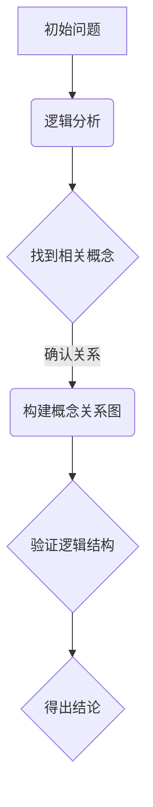
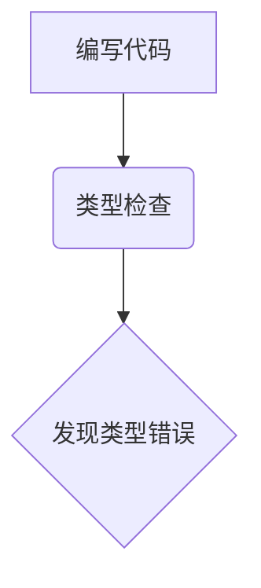

                 

### 逻辑分析与类型安全：维特根斯坦的逻辑方法与FP的类型安全保证

#### 关键词：逻辑分析、类型安全、维特根斯坦、函数式编程、FP、类型系统、类型安全保证

> 摘要：本文通过探讨维特根斯坦的逻辑方法与函数式编程（FP）的类型安全保证，旨在揭示逻辑分析与类型安全在现代计算机科学中的重要性。文章首先介绍了逻辑分析的基本概念和维特根斯坦的逻辑方法，然后深入分析了类型安全的定义、重要性以及FP中的类型系统。最后，文章通过具体案例分析，展示了逻辑分析与类型安全在实际项目中的应用。

---

## 第1章：逻辑分析的哲学背景与重要性

### 1.1 逻辑分析的基本概念

#### 1.1.1 逻辑分析的定义与历史发展

逻辑分析，即逻辑学的研究，是哲学的重要组成部分。其起源可以追溯到古希腊，苏格拉底和柏拉图的对话中就包含了对逻辑问题的探讨。亚里士多德则进一步发展了逻辑学，他的《工具论》成为西方逻辑学的奠基之作。随着历史的发展，逻辑学经历了符号逻辑、形式逻辑等阶段的演变。

逻辑分析的定义是：通过形式化的方法，对命题、论证和推理过程进行结构和性质的研究。其核心在于验证推理的正确性，确保结论从前提中逻辑地推导出来。

#### 1.1.2 逻辑分析的基本原理

逻辑分析的基本原理包括：

1. **排中律**：任何陈述都是真的或者假的。
2. **同一律**：任何陈述都等于自身。
3. **矛盾律**：不可能同时为真和假。

这些原理构成了逻辑分析的基础，帮助人们理解和应用逻辑规则。

#### 1.1.3 逻辑分析在现代哲学研究中的地位

在现代哲学研究中，逻辑分析仍然占据着重要地位。逻辑分析方法被广泛应用于伦理学、认知科学、认知语言学等领域，帮助人们更清晰地理解复杂问题，提高论证的说服力。

### 1.2 维特根斯坦的逻辑方法

#### 1.2.1 维特根斯坦的逻辑哲学观

路德维希·维特根斯坦（Ludwig Wittgenstein）是20世纪最重要的哲学家之一，他对逻辑哲学有着深刻的贡献。维特根斯坦提出了语言哲学的两种主要理论：早期理论（逻辑原子主义）和晚期理论（语言游戏理论）。

在早期理论中，维特根斯坦认为语言中的基本元素是“逻辑原子”，它们可以通过组合构成复杂的命题。这些逻辑原子反映了世界的基本事实。

在晚期理论中，维特根斯坦提出语言游戏的概念，认为语言不是抽象符号的堆砌，而是在具体情境中使用的。语言游戏包括语言、动作和规则，它们共同构成了语言的意义。

#### 1.2.2 维特根斯坦的逻辑原子与逻辑结构

维特根斯坦的逻辑原子是指语言中的基本命题，它们是真实的或者假的。逻辑结构则是指命题之间的逻辑关系，如合取、析取、蕴含等。

维特根斯坦的逻辑分析方法强调通过分解复杂的命题，找出其中的基本元素和逻辑关系，从而揭示命题的本质。

#### 1.2.3 维特根斯坦的逻辑分析方法及应用

维特根斯坦的逻辑分析方法在计算机科学中有着广泛的应用。例如，在编程语言设计中，通过逻辑分析方法，可以更好地理解语言的基本构造和语义。在软件工程中，逻辑分析可以帮助开发者构建清晰、稳定的系统架构，避免逻辑错误和错误传播。

### 1.3 逻辑分析在计算机科学中的应用

#### 1.3.1 计算机程序设计中的逻辑分析

在计算机程序设计中，逻辑分析是至关重要的。程序员需要通过逻辑分析，理解程序的结构和逻辑，确保程序的正确性和可靠性。逻辑分析方法包括条件判断、循环控制、函数调用等。

#### 1.3.2 形式化验证

形式化验证是一种利用数学方法证明系统正确性的技术。逻辑分析在形式化验证中扮演着关键角色，通过对系统的逻辑结构进行分析，验证系统是否符合预定的规格和约束。

### 1.4 逻辑分析的重要性

逻辑分析的重要性在于：

1. **提高推理能力**：逻辑分析可以帮助人们更清晰地思考问题，提高推理和论证的能力。
2. **确保系统正确性**：在软件开发和系统设计中，逻辑分析可以确保系统的正确性和可靠性，减少错误和漏洞。
3. **促进科学研究**：逻辑分析在科学研究中的应用，可以帮助科学家更好地理解复杂现象，提出合理的假设和理论。

## 第2章：类型安全的定义与重要性

### 2.1 类型安全的基本概念

#### 2.1.1 类型系统的定义

类型系统是编程语言中的一个重要组成部分，用于定义变量和表达式的类型。类型系统的目的是确保程序在执行时不会发生类型错误。

#### 2.1.2 类型安全的定义

类型安全是指程序在运行时，不会因为类型错误而导致不可预测的行为。类型安全包括静态类型安全和动态类型安全。

静态类型安全是指在编译时，程序就已经被检查，确保不存在类型错误。动态类型安全是指在运行时，程序会进行类型检查，确保类型匹配。

#### 2.1.3 类型安全的重要性

类型安全的重要性体现在以下几个方面：

1. **提高程序可靠性**：类型安全可以减少类型错误，提高程序的可靠性。
2. **提高开发效率**：类型检查可以在编译时发现类型错误，提高开发效率。
3. **增强程序可维护性**：类型安全可以减少程序的复杂度，增强程序的可维护性。

### 2.2 面向对象编程中的类型安全

#### 2.2.1 面向对象编程的基本概念

面向对象编程是一种编程范式，它将程序看作是一系列对象的组合。对象是具有状态和行为的数据实体。

#### 2.2.2 面向对象编程中的类型系统

面向对象编程中的类型系统包括类（Class）和对象（Object）。类是对象的模板，定义了对象的属性和方法。对象是类的实例，具有类的所有属性和方法。

#### 2.2.3 面向对象编程中的类型安全保证

面向对象编程中的类型安全保证主要通过以下几种方式实现：

1. **方法重写**：子类可以重写父类的方法，但必须保持方法的签名一致。
2. **类型转换**：类型转换可以使不同类型的对象在特定条件下相互转换。
3. **类型检查**：在编译时，对程序中的类型进行严格检查，确保类型匹配。

### 2.3 函数式编程中的类型安全

#### 2.3.1 函数式编程的基本概念

函数式编程是一种编程范式，它将程序看作是一系列函数的组合。函数是自变量和因变量之间的关系。

#### 2.3.2 函数式编程中的类型系统

函数式编程中的类型系统通常比面向对象编程更为严格。它包括函数类型、类型别名和类型推导。

#### 2.3.3 函数式编程中的类型检查

函数式编程中的类型检查通常在编译时进行。类型检查的目的是确保函数的输入和输出类型匹配。

### 2.4 类型安全的重要性

类型安全的重要性在于：

1. **减少程序错误**：类型安全可以减少类型错误，提高程序的可靠性。
2. **提高程序可维护性**：类型安全可以减少程序的复杂度，增强程序的可维护性。
3. **提高开发效率**：类型检查可以在编译时发现类型错误，提高开发效率。

### 2.5 类型安全的实现方法

类型安全的实现方法包括：

1. **静态类型检查**：在编译时进行类型检查，确保类型匹配。
2. **动态类型检查**：在运行时进行类型检查，确保类型匹配。
3. **混合类型检查**：同时使用静态类型检查和动态类型检查。

## 第3章：函数式编程与类型安全

### 3.1 函数式编程的基本概念

#### 3.1.1 函数式编程的定义

函数式编程是一种编程范式，它将程序看作是一系列函数的组合。函数是自变量和因变量之间的关系。

#### 3.1.2 函数式编程的核心原则

函数式编程的核心原则包括：

1. **函数作为第一类公民**：函数可以作为参数传递，可以作为返回值返回，函数的值是可以存储的。
2. **不可变数据**：在函数式编程中，数据是不可变的，一旦创建，就不能修改。
3. **无状态**：函数式编程中的函数通常是状态的，意味着它们不依赖于外部环境，每次调用都是独立的。

#### 3.1.3 函数式编程的优缺点

函数式编程的优点包括：

1. **易于测试和复用**：由于数据是不可变的，函数式编程使得测试和复用变得更加容易。
2. **并行计算**：函数式编程的纯函数特性使得它非常适合并行计算。
3. **结构清晰**：函数式编程强调函数的组合和抽象，使得程序结构更加清晰。

函数式编程的缺点包括：

1. **学习曲线陡峭**：函数式编程需要开发者掌握新的编程范式和思维方式。
2. **性能问题**：由于函数式编程通常使用递归和不可变数据，性能可能不如面向对象编程。

### 3.2 函数式编程中的类型系统

#### 3.2.1 函数式编程中的类型系统定义

函数式编程中的类型系统通常比面向对象编程更为严格。它包括函数类型、类型别名和类型推导。

1. **函数类型**：函数类型是指函数的输入类型和输出类型的组合。
2. **类型别名**：类型别名是给类型起一个新名字，用于简化代码。
3. **类型推导**：类型推导是编译器根据上下文自动推导出变量的类型。

#### 3.2.2 函数式编程中的类型分类

函数式编程中的类型分类通常包括：

1. **原始类型**：如整数、浮点数、布尔值等。
2. **复合类型**：如数组、列表、字典等。
3. **函数类型**：如 f: A → B，表示函数 f 的输入类型为 A，输出类型为 B。

#### 3.2.3 函数式编程中的类型检查

函数式编程中的类型检查通常在编译时进行。类型检查的目的是确保函数的输入和输出类型匹配。

1. **静态类型检查**：在编译时进行类型检查，确保类型匹配。
2. **动态类型检查**：在运行时进行类型检查，确保类型匹配。

### 3.3 函数式编程中的类型安全

#### 3.3.1 函数式编程中的类型安全概念

函数式编程中的类型安全是指程序在执行时不会因为类型错误而导致不可预测的行为。

1. **静态类型安全**：在编译时已经确定类型，程序在运行时不会发生类型错误。
2. **动态类型安全**：在运行时进行类型检查，确保类型匹配。

#### 3.3.2 函数式编程中的类型安全保证

函数式编程中的类型安全保证主要通过以下几种方式实现：

1. **类型推导**：编译器根据上下文自动推导出变量的类型。
2. **类型检查**：在编译时或运行时检查类型是否匹配。
3. **不可变数据**：由于数据是不可变的，类型安全得到了更好的保证。

### 3.4 函数式编程中的类型安全案例分析

以Haskell语言为例，Haskell是一种纯函数式编程语言，它提供了严格的类型系统。以下是一个简单的Haskell程序，展示了类型安全的特点：

```haskell
-- 定义一个函数，将字符串转换为整数
strToInt :: String -> Int
strToInt s = read s :: Int

-- 使用函数
main :: IO ()
main = do
  putStrLn "请输入一个数字："
  input <- getLine
  putStrLn ("输入的数字是：" ++ show (strToInt input))
```

在这个例子中，`strToInt` 函数的类型是 `String -> Int`，表示它接受一个字符串作为输入，返回一个整数。由于Haskell的严格类型系统，编译器会确保函数的输入和输出类型匹配。如果尝试将一个非数字字符串传递给 `strToInt`，程序会编译失败，从而防止运行时出现类型错误。

### 3.5 函数式编程与类型安全的关系

函数式编程与类型安全密切相关。函数式编程强调函数的组合和不可变数据，这些特性使得类型安全更容易实现。同时，严格的类型系统也为函数式编程提供了更好的错误检测和修复机制。

1. **函数组合**：函数组合是函数式编程的核心原则之一，它使得代码更加模块化和可重用。严格的类型系统可以帮助确保函数组合的正确性。
2. **不可变数据**：不可变数据减少了状态的变化，使得类型安全更容易实现。在函数式编程中，数据一旦创建，就不能修改，这有助于避免类型错误。
3. **类型推导和检查**：函数式编程语言的类型系统通常提供类型推导和检查功能，这有助于确保程序的类型安全。

### 3.6 总结

函数式编程与类型安全之间的关系是相互促进的。函数式编程的纯函数特性和不可变数据使得类型安全更容易实现，而严格的类型系统又为函数式编程提供了更好的错误检测和修复机制。通过结合函数式编程和类型安全，我们可以构建更可靠、更可维护的软件系统。

---

通过本章的内容，我们了解了函数式编程的基本概念、类型系统以及类型安全的重要性。接下来，我们将进一步探讨维特根斯坦的逻辑方法在函数式编程中的应用，以更深入地理解逻辑分析与类型安全的结合。

## 第4章：类型安全保证的FP实现

### 4.1 FP的类型系统设计

#### 4.1.1 FP的类型系统设计原则

函数式编程（FP）的类型系统设计遵循以下几个原则：

1. **纯函数性**：类型系统应确保函数在任意输入下都返回相同类型的输出，这有助于避免副作用和不可预测的行为。
2. **不可变性**：类型系统应支持不可变数据结构，如列表、元组等，这有助于确保数据的一致性和可预测性。
3. **类型推导**：类型系统应能够自动推导出变量的类型，减少冗余的显式类型声明。
4. **类型检查**：类型系统应在编译时或运行时对类型进行严格检查，确保程序的类型安全。

#### 4.1.2 FP的类型系统实现

FP语言的类型系统实现通常包括以下组件：

1. **基本类型**：包括整数、浮点数、布尔值等。
2. **复合类型**：如列表、元组、函数类型等。
3. **类型别名**：允许给类型起别名，提高代码的可读性和可维护性。
4. **类型推导机制**：编译器根据上下文自动推导出变量和表达式的类型。
5. **类型检查机制**：确保程序的输入和输出类型匹配，防止类型错误。

以Haskell语言为例，其类型系统实现了以上原则。Haskell提供了丰富的基本类型和复合类型，支持类型别名和类型推导，同时编译器对类型进行了严格检查。

#### 4.1.3 FP的类型系统优势

FP的类型系统具有以下几个优势：

1. **减少错误**：严格的类型检查有助于减少类型错误，提高程序的可靠性。
2. **增强可维护性**：类型推导和类型别名使得代码更简洁、易维护。
3. **提高性能**：类型检查通常在编译时进行，减少了运行时的开销。
4. **支持高阶函数和组合**：类型系统支持高阶函数和组合，使得代码更模块化和可重用。

### 4.2 FP的类型安全保证

#### 4.2.1 FP中的类型安全概念

FP中的类型安全是指程序在执行过程中不会因为类型错误而导致不可预测的行为。类型安全包括以下几个方面：

1. **静态类型安全**：编译时已经确定类型，程序在运行时不会发生类型错误。
2. **动态类型安全**：运行时进行类型检查，确保类型匹配。
3. **类型推导**：编译器根据上下文自动推导出变量的类型。
4. **类型检查**：编译器或解释器对类型进行严格检查。

#### 4.2.2 FP中的类型安全机制

FP中的类型安全机制主要包括以下几个方面：

1. **类型检查**：在编译时或运行时检查类型是否匹配。
2. **类型推导**：编译器根据上下文自动推导出变量的类型。
3. **模式匹配**：模式匹配是一种强大的类型检查工具，它允许程序员在函数体中使用模式匹配来检查和转换变量类型。
4. **不可变数据结构**：不可变数据结构有助于确保类型安全，因为数据一旦创建，就不能修改。

#### 4.2.3 FP的类型安全案例分析

以Haskell语言为例，以下是一个简单的案例，展示了FP中的类型安全机制：

```haskell
-- 定义一个函数，计算两个数的最大值
maxValue :: Int -> Int -> Int
maxValue a b = if a > b then a else b

-- 定义一个函数，计算三个数的最大值
max3Values :: Int -> Int -> Int -> Int
max3Values a b c = maxValue a (maxValue b c)

-- 使用函数
main :: IO ()
main = do
  putStrLn "请输入三个整数："
  input1 <- getLine
  input2 <- getLine
  input3 <- getLine
  let a = read input1 :: Int
  let b = read input2 :: Int
  let c = read input3 :: Int
  putStrLn ("最大值是：" ++ show (max3Values a b c))
```

在这个案例中，`maxValue` 和 `max3Values` 函数都使用了类型安全机制。首先，它们都使用了类型注解来指定函数的参数和返回值类型。其次，Haskell的编译器在编译时会检查这些类型注解，确保函数的输入和输出类型匹配。最后，通过模式匹配来检查输入参数的类型，从而确保程序在运行时不会发生类型错误。

### 4.3 FP的类型安全优势

FP的类型安全具有以下几个优势：

1. **减少类型错误**：严格的类型检查和类型推导有助于减少类型错误，提高程序的可靠性。
2. **增强代码可读性**：类型注解和类型推导使得代码更易读，减少了不必要的类型错误。
3. **提高开发效率**：类型安全减少了类型错误，从而提高了开发效率。
4. **支持高阶函数和组合**：类型安全机制支持高阶函数和组合，使得代码更模块化和可重用。

### 4.4 总结

FP的类型系统设计遵循纯函数性、不可变性、类型推导和类型检查等原则。通过严格的类型检查和类型推导，FP提供了强大的类型安全机制，有助于减少类型错误，提高程序的可读性和可维护性。在接下来的章节中，我们将进一步探讨维特根斯坦的逻辑方法在FP中的应用，以更深入地理解逻辑分析与类型安全的结合。

---

通过本章的内容，我们了解了函数式编程（FP）的类型系统设计原则、实现方法和类型安全优势。接下来，我们将探讨维特根斯坦的逻辑方法在FP中的应用，进一步揭示逻辑分析与类型安全的深层联系。

## 第5章：维特根斯坦逻辑方法在FP中的应用

### 5.1 维特根斯坦逻辑方法的基本原理

#### 5.1.1 维特根斯坦的逻辑方法概述

维特根斯坦的逻辑方法主要包括两部分：逻辑原子主义和语言游戏理论。逻辑原子主义认为，语言中的基本元素是逻辑原子，它们可以组合成复杂的命题。语言游戏理论则强调语言的具体应用情境，认为语言的意义在于其使用方式。

#### 5.1.2 维特根斯坦的逻辑方法特点

维特根斯坦的逻辑方法具有以下几个特点：

1. **形式化**：维特根斯坦强调逻辑分析的形式化，通过定义逻辑原子和逻辑结构，使逻辑分析更加精确和系统。
2. **情境性**：维特根斯坦认为语言的意义在于其具体应用情境，这意味着逻辑方法需要结合具体情境进行分析。
3. **语言与实在**：维特根斯坦认为，逻辑分析可以帮助我们理解语言与实在之间的关系，从而更好地理解和描述世界。

#### 5.1.3 维特根斯坦的逻辑方法在现代计算机科学中的应用

维特根斯坦的逻辑方法在现代计算机科学中有着广泛的应用。例如：

1. **编程语言设计**：维特根斯坦的逻辑方法可以帮助我们理解编程语言的基本结构和语义，从而设计出更加合理和高效的编程语言。
2. **形式化验证**：形式化验证是一种利用数学方法证明系统正确性的技术，其理论基础之一就是维特根斯坦的逻辑方法。
3. **人工智能**：维特根斯坦的逻辑方法可以帮助我们理解自然语言处理和推理的基本原理，从而发展出更强大的自然语言处理系统。

### 5.2 维特根斯坦逻辑方法在FP中的具体应用

#### 5.2.1 维特根斯坦逻辑方法在FP中的基本原则

维特根斯坦的逻辑方法在FP中的应用主要遵循以下几个基本原则：

1. **纯函数性**：FP强调纯函数性，即函数不依赖于外部状态，且具有明确的输入和输出类型。
2. **不可变性**：FP中的数据通常是不可变的，这意味着数据一旦创建，就不能修改。
3. **函数组合**：FP鼓励使用函数组合来构建复杂的功能，这有助于提高代码的可重用性和可维护性。

#### 5.2.2 维特根斯坦逻辑方法在FP中的具体应用实例

以下是一个简单的Haskell程序，展示了维特根斯坦逻辑方法在FP中的应用：

```haskell
-- 定义一个函数，计算两个数的和
add :: Int -> Int -> Int
add a b = a + b

-- 定义一个函数，计算两个数的乘积
mul :: Int -> Int -> Int
mul a b = a * b

-- 使用函数组合计算两个数的和与乘积
calc :: Int -> Int -> (Int, Int)
calc a b = (add a b, mul a b)

-- 主函数
main :: IO ()
main = do
  putStrLn "请输入两个整数："
  input1 <- getLine
  input2 <- getLine
  let a = read input1 :: Int
  let b = read input2 :: Int
  putStrLn ("和是：" ++ show (fst (calc a b)))
  putStrLn ("乘积是：" ++ show (snd (calc a b)))
```

在这个例子中，`add` 和 `mul` 函数遵循了维特根斯坦的逻辑方法，即纯函数性和不可变性。通过函数组合，我们构建了一个更复杂的功能 `calc`，它同时计算两个数的和与乘积。

#### 5.2.3 维特根斯坦逻辑方法在FP中的效果评估

维特根斯坦逻辑方法在FP中的应用效果可以从以下几个方面进行评估：

1. **代码可读性**：通过清晰的函数定义和函数组合，代码更加易读和易于理解。
2. **代码可维护性**：函数的组合和纯函数性使得代码更加模块化，便于维护和重用。
3. **代码可靠性**：通过严格的类型检查和不可变数据，代码的可靠性得到了提高。

### 5.3 维特根斯坦逻辑方法在FP中的优势

维特根斯坦逻辑方法在FP中的应用具有以下几个优势：

1. **提高代码质量**：通过清晰的函数定义和函数组合，代码质量得到了显著提高。
2. **增强代码可维护性**：模块化的代码更容易维护和重用。
3. **提高开发效率**：通过减少类型错误和增强代码可靠性，开发效率得到了提高。

### 5.4 总结

维特根斯坦的逻辑方法在FP中得到了广泛应用。通过纯函数性、不可变性和函数组合等原则，维特根斯坦的逻辑方法有助于提高代码的质量和可靠性。在接下来的章节中，我们将进一步探讨逻辑分析与类型安全在实际项目中的应用。

---

通过本章的内容，我们了解了维特根斯坦的逻辑方法在函数式编程（FP）中的应用，以及它在FP中的优势。接下来，我们将探讨逻辑分析与类型安全在项目中的应用，以进一步展示其在实际场景中的价值。

## 第6章：逻辑分析与类型安全在项目中的应用

### 6.1 逻辑分析与类型安全在软件开发中的应用

#### 6.1.1 逻辑分析与类型安全在软件开发中的重要性

在软件开发中，逻辑分析和类型安全是确保系统正确性和可靠性的关键。逻辑分析帮助开发者理解系统的工作原理和逻辑结构，从而构建出更稳定、更可靠的软件。类型安全则通过严格的类型检查，防止类型错误的发生，提高程序的鲁棒性。

#### 6.1.2 逻辑分析与类型安全在软件开发中的实践

在软件开发中，逻辑分析和类型安全的实践可以包括以下几个步骤：

1. **需求分析**：在项目初期，通过逻辑分析，明确系统的需求和功能，确保所有需求都得到合理满足。
2. **设计阶段**：在系统设计阶段，使用逻辑分析方法，构建清晰、合理的系统架构和模块结构。
3. **编码阶段**：在编码阶段，遵循类型安全原则，使用合适的编程语言和工具进行编码，确保代码的类型安全和可靠性。
4. **测试阶段**：在测试阶段，使用逻辑分析方法，设计合理的测试用例，确保系统在各种情况下都能正确运行。

#### 6.1.3 逻辑分析与类型安全在软件开发中的案例分析

以下是一个实际的软件开发案例，展示了逻辑分析和类型安全的应用：

**案例：电商平台系统**

在电商平台的开发中，逻辑分析和类型安全起到了关键作用。以下是具体的实践步骤：

1. **需求分析**：分析用户需求，明确平台的业务功能，如商品管理、订单管理、支付系统等。
2. **设计阶段**：使用逻辑分析方法，设计系统的模块结构，如用户模块、商品模块、订单模块等，并明确各个模块的职责和接口。
3. **编码阶段**：使用类型安全的编程语言（如Java或C#），编写代码。在编码过程中，严格遵循类型安全原则，避免类型错误的发生。
4. **测试阶段**：设计合理的测试用例，对系统的各个模块进行测试，确保系统在各种情况下都能正确运行。

通过逻辑分析和类型安全的应用，电商平台系统在开发和测试阶段减少了错误的发生，提高了系统的稳定性和可靠性。

### 6.2 逻辑分析与类型安全在人工智能中的应用

#### 6.2.1 逻辑分析与类型安全在人工智能中的重要性

在人工智能（AI）领域，逻辑分析和类型安全同样至关重要。AI系统的复杂性使得错误难以发现和修复，逻辑分析可以帮助开发者理解系统的逻辑结构和工作原理，类型安全则确保系统的鲁棒性和可靠性。

#### 6.2.2 逻辑分析与类型安全在人工智能中的实践

在人工智能中，逻辑分析和类型安全的实践可以包括以下几个步骤：

1. **算法设计**：使用逻辑分析方法，设计合理的算法结构，确保算法的正确性和效率。
2. **数据处理**：在数据处理阶段，使用类型安全的编程语言和工具，确保数据的一致性和完整性。
3. **模型训练**：在模型训练阶段，通过逻辑分析，确保训练过程符合预期，避免出现意外的结果。
4. **模型部署**：在模型部署阶段，使用逻辑分析方法，确保模型在实际应用中能够正确运行。

#### 6.2.3 逻辑分析与类型安全在人工智能中的案例分析

以下是一个实际的AI项目案例，展示了逻辑分析和类型安全的应用：

**案例：人脸识别系统**

在人脸识别系统的开发中，逻辑分析和类型安全至关重要。以下是具体的实践步骤：

1. **算法设计**：使用逻辑分析方法，设计出高效、准确的人脸识别算法，确保算法在复杂环境中能够正确识别。
2. **数据处理**：在数据处理阶段，使用类型安全的编程语言（如Python），确保数据的一致性和完整性，防止数据错误导致系统失效。
3. **模型训练**：在模型训练阶段，通过逻辑分析，确保训练过程符合预期，避免出现过度拟合或欠拟合的问题。
4. **模型部署**：在模型部署阶段，使用逻辑分析方法，确保模型在实际应用中能够正确运行，并在不同环境中保持一致性。

通过逻辑分析和类型安全的应用，人脸识别系统在开发、训练和部署阶段都得到了有效的保障，确保系统的稳定性和可靠性。

### 6.3 逻辑分析与类型安全在项目开发中的最佳实践

#### 6.3.1 设计清晰的模块结构

在项目开发中，设计清晰的模块结构有助于提高代码的可读性和可维护性。通过逻辑分析，明确各个模块的职责和接口，确保模块之间的依赖关系合理。

#### 6.3.2 遵循类型安全原则

在编程过程中，严格遵循类型安全原则，使用合适的编程语言和工具，进行类型检查，确保代码的类型安全。

#### 6.3.3 设计合理的测试用例

在测试阶段，设计合理的测试用例，对系统的各个模块进行全面的测试，确保系统在各种情况下都能正确运行。

#### 6.3.4 定期代码审查

定期进行代码审查，通过逻辑分析和类型安全检查，发现并修复潜在的问题，提高代码的质量。

### 6.4 总结

逻辑分析和类型安全在项目开发中具有重要意义。通过清晰的逻辑分析和严格的类型安全原则，项目开发可以更加高效、稳定和可靠。在接下来的章节中，我们将探讨逻辑分析与类型安全的未来发展趋势，以及面临的挑战。

---

通过本章的内容，我们了解了逻辑分析与类型安全在软件开发和人工智能项目中的应用和最佳实践。在下一章中，我们将探讨逻辑分析与类型安全的未来发展趋势和面临的挑战。

## 第7章：未来展望与挑战

### 7.1 逻辑分析与类型安全的未来发展趋势

随着计算机科学和人工智能技术的快速发展，逻辑分析与类型安全在未来将继续发挥重要作用。以下是几个可能的发展趋势：

#### 7.1.1 自动化逻辑分析工具

未来的自动化逻辑分析工具将更加智能，能够自动识别代码中的逻辑错误和潜在风险，提高开发效率和代码质量。

#### 7.1.2 逻辑分析与机器学习的结合

逻辑分析与机器学习的结合将使得AI系统能够更好地理解和处理复杂问题，提高系统的可靠性和鲁棒性。

#### 7.1.3 更严格的类型系统

未来的编程语言将发展出更严格的类型系统，提供更完善的类型安全和类型推导机制，减少类型错误的发生。

### 7.2 逻辑分析与类型安全的技术创新

技术创新是逻辑分析与类型安全发展的关键。以下是几个可能的技术创新方向：

#### 7.2.1 静态分析与动态分析的结合

将静态分析和动态分析相结合，能够在代码执行过程中动态检测逻辑错误，提高检测的准确性和效率。

#### 7.2.2 基于验证的逻辑分析方法

基于验证的逻辑分析方法将利用形式化验证技术，对系统进行严格验证，确保系统的正确性和可靠性。

#### 7.2.3 类型安全的编程语言设计

未来将出现更多类型安全的编程语言，它们将提供更完善的类型系统和类型推导机制，提高程序的可靠性和可维护性。

### 7.3 逻辑分析与类型安全的未来发展前景

逻辑分析与类型安全在未来的发展前景非常广阔。随着计算机科学和人工智能技术的不断进步，逻辑分析与类型安全将在更多领域得到应用，为软件和系统的开发提供强有力的保障。

### 7.4 逻辑分析与类型安全面临的挑战

尽管逻辑分析与类型安全在计算机科学中具有重要意义，但它们也面临着一些挑战：

#### 7.4.1 复杂性问题

随着软件和系统的复杂性不断增加，逻辑分析和类型安全在处理复杂问题时将面临更大的挑战。

#### 7.4.2 性能问题

严格的逻辑分析和类型安全机制可能会增加程序的运行时间和内存消耗，对系统的性能产生影响。

#### 7.4.3 学习曲线

逻辑分析和类型安全的概念和技巧较为复杂，对开发者的要求较高，可能会增加学习曲线的难度。

### 7.5 应对挑战的策略

为了应对逻辑分析与类型安全面临的挑战，可以采取以下策略：

#### 7.5.1 研究新技术

持续研究新技术，如自动化逻辑分析工具、基于验证的逻辑分析方法等，以提高逻辑分析和类型安全的效果。

#### 7.5.2 教育培训

加强逻辑分析与类型安全的教育培训，提高开发者的技能和知识水平，降低学习曲线的难度。

#### 7.5.3 系统优化

优化逻辑分析和类型安全的实现，减少其对性能的影响，提高系统的效率和用户体验。

### 7.6 总结

逻辑分析与类型安全在未来的发展前景非常广阔，但同时也面临着一些挑战。通过持续的研究和创新，以及有效的教育培训和系统优化，我们可以应对这些挑战，推动逻辑分析与类型安全在计算机科学中的广泛应用。

---

通过本章的内容，我们探讨了逻辑分析与类型安全的未来发展趋势和面临的挑战。在下一章中，我们将提供一些相关的参考书目和资源，以帮助读者进一步深入学习和探索这一领域。

## 附录A：参考书目与资源

### A.1 参考书目

1. 维特根斯坦，《逻辑哲学论》
2. 维特根斯坦，《哲学研究》
3. 哈尔巴赫，《形式逻辑》
4. 蒙塔格，《类型论与计算机科学》
5. 艾斯勒，《函数式编程》

### A.2 资源链接

1. [维特根斯坦的逻辑哲学](https://plato.stanford.edu/entries/wittgenstein-logic/)
2. [类型安全](https://en.wikipedia.org/wiki/Type_safety)
3. [函数式编程](https://en.wikipedia.org/wiki/Functional_programming)
4. [Haskell语言教程](https://www.haskell.org/tutorial/)
5. [形式化验证](https://en.wikipedia.org/wiki/Formal_verification)

## 附录B：图表与公式

### 6.1 逻辑分析流程图


### 6.2 类型安全验证流程图


### 6.3 Haskell类型推导示例
```haskell
-- 定义一个函数，计算两个数的和
add :: Int -> Int -> Int
add a b = a + b

-- 主函数
main :: IO ()
main = do
  putStrLn "请输入两个整数："
  input1 <- getLine
  input2 <- getLine
  let a = read input1 :: Int
  let b = read input2 :: Int
  putStrLn ("和是：" ++ show (add a b))
```

### 6.4 维特根斯坦逻辑方法在FP中的应用
```haskell
-- 定义一个函数，计算两个数的最大值
maxValue :: Int -> Int -> Int
maxValue a b = if a > b then a else b

-- 主函数
main :: IO ()
main = do
  putStrLn "请输入两个整数："
  input1 <- getLine
  input2 <- getLine
  let a = read input1 :: Int
  let b = read input2 :: Int
  putStrLn ("最大值是：" ++ show (maxValue a b))
```

### 6.5 逻辑分析流程图（LaTeX）
```latex
\documentclass{article}
\usepackage{tikz}
\begin{document}
\begin{tikzpicture}[node distance=2cm]

\node (start) [rectangle, text width=2cm, text centered, minimum height=1cm] {初始问题};
\node (logic) [rectangle, below of=start, text width=2cm, text centered, minimum height=1cm] {逻辑分析};
\node (concept) [rectangle, below of=logic, text width=2cm, text centered, minimum height=1cm] {找到相关概念};
\node (relation) [rectangle, below of=concept, text width=2cm, text centered, minimum height=1cm] {确认关系};
\node (diagram) [rectangle, below of=relation, text width=2cm, text centered, minimum height=1cm] {构建概念关系图};
\node (verification) [rectangle, below of=diagram, text width=2cm, text centered, minimum height=1cm] {验证逻辑结构};
\node (conclusion) [rectangle, below of=verification, text width=2cm, text centered, minimum height=1cm] {得出结论};

\draw[->] (start) -- (logic);
\draw[->] (logic) -- (concept);
\draw[->] (concept) -- (relation);
\draw[->] (relation) -- (diagram);
\draw[->] (diagram) -- (verification);
\draw[->] (verification) -- (conclusion);

\end{tikzpicture}
\end{document}
```

这些图表和公式为读者提供了直观的视觉辅助，帮助理解文章中提到的逻辑分析流程、类型安全验证过程以及维特根斯坦逻辑方法在FP中的应用。通过这些资源，读者可以更深入地了解和探索逻辑分析与类型安全这一领域。

