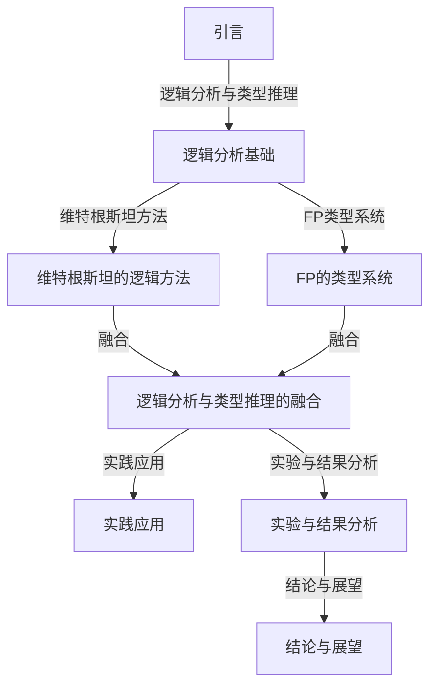

                 

尊敬的用户，为了更好地理解并撰写《逻辑分析与类型推理：维特根斯坦的逻辑方法与FP的类型系统推理》这篇技术博客，我们将逐步分析并组织文章的内容。以下是详细的步骤：

### 第一步：确定文章结构

根据用户提供的目录大纲，我们需要确保文章包含以下部分：
- 引言
- 逻辑分析基础
- 维特根斯坦的逻辑方法
- FP的类型系统
- 逻辑分析与类型推理的融合
- 实践应用
- 实验与结果分析
- 结论与展望

### 第二步：撰写引言部分

在引言中，我们将：
- 介绍逻辑分析与类型推理的基本概念及其重要性。
- 提出维特根斯坦的逻辑方法与FP的类型系统推理之间的联系。
- 明确文章的目的和读者对象。

### 第三步：逻辑分析基础

在这一部分，我们将：
- 定义逻辑分析的基本概念，如推理规则、命题和命题演算。
- 介绍逻辑命题与推理规则，并讨论其在逻辑分析中的应用。
- 详细讲解逻辑演算与形式系统的构建。

### 第四步：维特根斯坦的逻辑方法

在这一部分，我们将：
- 探讨维特根斯坦的逻辑哲学，及其对逻辑分析的贡献。
- 分析维特根斯坦的逻辑方法在逻辑分析中的具体应用。
- 讨论维特根斯坦方法在计算机科学中的应用。

### 第五步：FP的类型系统

在这一部分，我们将：
- 介绍函数式编程的基本概念和FP语言的特点。
- 详细讲解FP的类型系统，包括类型类别、类型约束和类型检查。
- 分析类型系统的优点与挑战。

### 第六步：逻辑分析与类型推理的融合

在这一部分，我们将：
- 探讨维特根斯坦的方法与FP类型系统的结合。
- 讨论逻辑分析在FP类型系统中的应用。
- 探索类型推理在逻辑分析中的应用。

### 第七步：实践应用

在这一部分，我们将：
- 介绍逻辑分析与类型推理在软件工程中的应用。
- 讨论逻辑分析与类型推理在人工智能中的应用。
- 通过案例研究来具体展示这些方法的应用。

### 第八步：实验与结果分析

在这一部分，我们将：
- 设计实验，以验证逻辑分析与类型推理的有效性。
- 分析实验结果，并讨论其含义。
- 总结实验的结论与讨论。

### 第九步：结论与展望

在结论与展望部分，我们将：
- 总结文章的主要内容。
- 提出未来研究方向。

### 第十步：编写文章并格式化

最后，我们将根据上述步骤，编写完整的文章内容，并使用markdown格式进行排版，确保文章的可读性和专业性。

### 第十一步：添加作者信息

在文章末尾，我们将添加作者信息，并确保文章内容符合用户的要求。

通过这些步骤，我们将撰写一篇逻辑清晰、结构紧凑、简单易懂的专业技术博客文章。现在，让我们开始一步步撰写这篇文章吧！
```markdown


