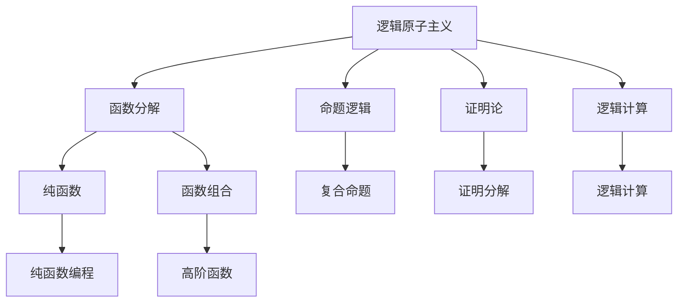

                 

### 逻辑原子主义与函数分解：维特根斯坦早期思想与FP的函数分解原则

关键词：维特根斯坦、逻辑原子主义、函数分解、FP编程、哲学与技术的交汇

摘要：本文深入探讨了维特根斯坦早期哲学思想中的逻辑原子主义，以及它与函数式编程（FP）中的函数分解原则的异同。通过分析维特根斯坦关于逻辑、语言和世界的观点，结合函数分解在编程实践中的应用，本文旨在揭示两者之间的内在联系，并探讨其在计算机科学和哲学领域的深远影响。

## 第一部分：维特根斯坦早期思想概述

### 第1章：维特根斯坦早期哲学思想

#### 1.1 维特根斯坦的生平与哲学发展

路德维希·维特根斯坦（Ludwig Wittgenstein）是一位杰出的哲学家，他的一生可以分为两个主要的哲学阶段：早期和后期。早期维特根斯坦的作品主要集中在《逻辑哲学论》（"Tractatus Logico-Philosophicus"）中，而后期则主要体现在《哲学研究》（"Philosophical Investigations"）中。

维特根斯坦出生于1889年的奥地利，他的父亲是一位成功的商人。他在早期教育中接受了严格的科学训练，随后对哲学产生了浓厚的兴趣。在剑桥大学的学习经历中，他受到了著名的数学家兼哲学家伯兰特·罗素（Bertrand Russell）的影响，并开始了他的哲学探索。

#### 1.2 《逻辑哲学论》的核心观点

《逻辑哲学论》是维特根斯坦早期的代表作，它包含了关于逻辑、语言和世界的深刻见解。这本书的核心观点可以概括为以下几点：

1. **逻辑构造世界**：维特根斯坦认为世界是由事实构成的，而事实又可以被看作是逻辑上的图像（pictures）。这些图像是逻辑结构的体现，因此逻辑构成了世界的本质。

2. **语言的界限**：维特根斯坦提出，我们的语言有其固有的界限，语言只能描述那些能够明确界定的对象和事实。当语言超出其界限时，我们就陷入了无意义的问题和形而上学的探讨。

3. **图像论与命题的真值**：《逻辑哲学论》中的图像论（picture theory）认为，命题的真假与其图像在现实世界中的匹配程度有关。如果一个命题的图像与事实相符，那么这个命题就是真的；否则，它是假的。

#### 1.2.1 世界的逻辑构造

在《逻辑哲学论》中，维特根斯坦详细阐述了世界的逻辑构造。他认为，世界是由一系列的基本事实组成的，这些基本事实可以用逻辑原子来表示。逻辑原子是构成复合命题的最小单位，类似于数学中的基本元素。通过逻辑原子的组合，可以构造出更复杂的复合命题，从而形成我们对世界的理解。

#### 1.2.2 语言的界限与思想的表达

维特根斯坦认为，语言有其固有的界限，这意味着我们不能用语言来描述所有事物。特别是那些超出语言界限的抽象概念，如美学、情感等。他认为，当语言超出其界限时，我们就会陷入无意义的讨论。这种观点对于后来的语言哲学和认知科学产生了深远的影响。

#### 1.2.3 图像论与命题的真值

在图像论中，维特根斯坦提出，一个命题的真值取决于其图像与事实的匹配程度。如果一个命题的图像在现实世界中能够找到对应的对象或事实，那么这个命题就是真的。反之，如果找不到对应，那么命题就是假的。这种观点强调了逻辑和语言与现实世界之间的紧密联系。

### 第2章：逻辑原子主义的基本原理

#### 2.1 逻辑原子主义的概念

逻辑原子主义（Logical Atomism）是维特根斯坦早期哲学思想中的一个核心概念。它认为，世界是由一系列基本事实或逻辑原子构成的。这些逻辑原子是构成复合命题的最小单位，类似于原子物理学中的原子。逻辑原子主义试图通过逻辑和语言来解释世界的本质。

#### 2.1.1 逻辑原子与复合命题

逻辑原子是构成复合命题的最小单位，它们可以通过逻辑运算符（如合取、析取、否定等）组合成更复杂的复合命题。复合命题的真假取决于其内部逻辑原子的真值。逻辑原子主义的核心思想是，通过逻辑原子的组合，我们可以理解整个世界的逻辑结构。

#### 2.1.2 逻辑形式与语言表达

逻辑原子主义认为，逻辑形式和语言表达是紧密相关的。在语言中，逻辑原子通常以词项的形式出现，而复合命题则由这些词项通过逻辑运算符组合而成。这种观点强调了语言在逻辑和世界理解中的关键作用。

#### 2.1.3 逻辑原子主义与直觉主义的关系

直觉主义（Intuitionism）是一种数学哲学观点，强调数学对象的直观构造。它与逻辑原子主义有一些相似之处，但也存在显著差异。直觉主义者认为，数学真理是通过直觉来发现的，而不是通过逻辑推理。因此，直觉主义更强调数学对象的构造过程，而逻辑原子主义则更关注逻辑和语言在解释世界中的作用。

### 第3章：维特根斯坦早期思想的批判与影响

#### 3.1 逻辑原子主义的批判

尽管维特根斯坦的早期思想，特别是逻辑原子主义，在哲学界引起了广泛的讨论，但也受到了许多批评。以下是一些主要的批判观点：

1. **形而上学的问题**：维特根斯坦的逻辑原子主义被认为过于形而上学，因为它试图通过逻辑和语言来解释世界的本质。然而，许多哲学家认为，这种解释方式忽略了现实世界的复杂性和不确定性。

2. **语言的双重角色**：维特根斯坦认为，语言在描述世界和理解世界方面具有双重角色。然而，一些哲学家认为，这种双重角色会导致语言使用上的混淆和误解。

3. **知识与理解**：维特根斯坦认为，知识是通过语言和逻辑来理解的。然而，一些哲学家认为，这种观点过于简化了知识的复杂性，忽略了直觉、经验和其他认知过程在知识形成中的作用。

#### 3.2 逻辑原子主义在当代哲学中的影响

尽管维特根斯坦的早期思想受到了一些批判，但它们在当代哲学中仍然具有深远的影响。以下是一些主要的影响：

1. **与分析哲学的关系**：逻辑原子主义与分析哲学有着密切的联系。分析哲学家通常强调语言的明确性和逻辑的严密性，这与维特根斯坦的思想有共同之处。

2. **与其他哲学流派的对话**：维特根斯坦的早期思想也为哲学领域的跨流派对话提供了基础。例如，他的观点与现象学、存在主义和语言学哲学等领域产生了许多互动和交流。

3. **逻辑原子主义在现代逻辑学中的应用**：维特根斯坦的思想对现代逻辑学的发展产生了重要影响。他的工作推动了逻辑学从形式逻辑向日常逻辑的转变，强调了逻辑与语言、现实世界之间的关系。

## 第二部分：函数分解原则

### 第4章：函数分解的概念与应用

#### 4.1 函数分解的定义与意义

函数分解（Function Decomposition）是函数式编程（Functional Programming，简称FP）中的一个核心概念。它指的是将复杂函数分解为多个较小、更易于管理的函数。函数分解的意义在于，它有助于提高代码的可读性、可维护性和模块化。

#### 4.1.1 函数分解的基本原理

函数分解的基本原理是将一个复杂函数分解为多个子函数，这些子函数分别处理函数的一部分功能。通过这种方式，我们可以将复杂的问题分解为更小的、更易于理解和解决的问题。

#### 4.1.2 函数分解的优势与应用场景

函数分解具有以下优势：

1. **提高可读性**：通过将复杂函数分解为多个子函数，代码更易于理解和阅读。
2. **提高可维护性**：子函数可以单独测试和维护，从而提高代码的可维护性。
3. **模块化**：函数分解有助于实现代码的模块化，使得不同部分的功能可以独立开发、测试和部署。

函数分解适用于以下场景：

1. **复杂业务逻辑**：当业务逻辑较为复杂时，通过函数分解可以简化问题，提高代码的可读性和可维护性。
2. **系统重构**：在系统重构过程中，通过函数分解可以逐步替换和改进现有代码，减少风险。
3. **团队协作**：在团队协作开发中，通过函数分解可以明确划分职责，提高团队协作效率。

#### 4.1.3 函数分解与面向对象编程的关系

函数分解与面向对象编程（Object-Oriented Programming，简称OOP）是两种不同的编程范式。面向对象编程通过封装、继承和多态等机制来实现代码的模块化和重用，而函数分解则通过分解函数来实现代码的模块化和重用。

虽然两者在实现模块化和重用的方式上有所不同，但它们并不是对立的关系。在实际开发中，函数分解和面向对象编程可以相互结合，发挥各自的优势。例如，在面向对象的系统中，可以使用函数分解来处理复杂的业务逻辑，从而提高代码的质量和可维护性。

### 第5章：函数分解在程序设计中的应用

#### 5.1 纯函数与副作用的区分

在函数分解中，纯函数（Pure Function）和副作用（Side Effect）是两个重要的概念。纯函数是指其返回值仅依赖于输入参数，而不依赖于外部状态或产生任何副作用（如修改全局变量、输入参数或输出结果等）的函数。相反，副作用函数是指其返回值依赖于外部状态或产生副作用的函数。

纯函数和副作用函数的区分对于编写高质量的代码至关重要。纯函数易于测试、理解和重构，而副作用函数则可能导致不可预测的行为和难以调试的问题。

#### 5.1.1 纯函数的定义与特点

纯函数具有以下特点：

1. **依赖输入参数**：纯函数的返回值仅依赖于输入参数，而不依赖于外部状态。
2. **无副作用**：纯函数不修改全局变量、输入参数或输出结果，也不触发任何外部操作（如I/O操作）。
3. **可缓存**：纯函数的结果可以缓存，以提高性能。

纯函数的优点在于其易于测试、理解和重构。通过编写纯函数，我们可以确保代码的可靠性和可维护性。

#### 5.1.2 副作用函数的理解与处理

副作用函数是指其返回值依赖于外部状态或产生副作用的函数。副作用函数可能会导致以下问题：

1. **不可预测的行为**：副作用函数可能触发意外的行为，使得代码难以理解和预测。
2. **难以调试**：副作用函数可能导致调试困难，因为其行为依赖于外部状态。
3. **可读性和可维护性下降**：副作用函数使得代码更难以阅读和维护。

为了处理副作用函数，我们可以采取以下措施：

1. **最小化副作用**：尽量减少副作用函数的使用，将其限制在必要的操作中。
2. **隔离副作用**：将副作用函数与其他纯函数隔离，以减少其影响范围。
3. **重构代码**：将副作用函数重构为纯函数，以提高代码的质量和可维护性。

通过以上措施，我们可以减少副作用函数带来的负面影响，提高代码的质量和可读性。

#### 5.1.3 纯函数在实际开发中的应用

在实际开发中，纯函数的应用非常广泛。以下是一些典型的应用场景：

1. **数据处理**：在数据处理过程中，纯函数可以确保数据的准确性、一致性和可靠性。
2. **算法实现**：在算法实现中，纯函数有助于简化问题、提高代码的可读性和可维护性。
3. **Web开发**：在Web开发中，纯函数可以用于处理用户输入、渲染页面等操作，以提高性能和可维护性。

通过使用纯函数，我们可以编写高质量、可靠和易于维护的代码，从而提高开发效率和项目质量。

### 第6章：函数分解与组合的原理与实践

#### 6.1 函数组合的概念与应用

函数组合（Function Composition）是函数式编程中的一个重要概念。它指的是将多个函数组合成一个更复杂的函数，以实现特定的功能。函数组合的基本原理是将一个函数的输出作为另一个函数的输入，通过层层组合，实现最终的功能。

函数组合具有以下优势：

1. **提高可读性**：通过函数组合，我们可以将复杂的操作分解为多个简单函数，从而提高代码的可读性。
2. **增强模块化**：函数组合有助于实现代码的模块化，使得不同部分的功能可以独立开发、测试和部署。
3. **易于维护**：通过函数组合，我们可以轻松替换和重用单个函数，从而提高代码的可维护性。

#### 6.1.1 函数组合的基本原理

函数组合的基本原理如下：

1. **定义组合函数**：首先，我们需要定义一个组合函数，它接受两个或多个函数作为输入，并将它们组合成一个更复杂的函数。
2. **应用组合函数**：然后，我们可以使用组合函数将多个函数组合成一个复杂的函数。通过层层组合，我们可以实现最终的功能。

例如，假设我们有以下两个函数：

```python
def add(a, b):
    return a + b

def multiply(a, b):
    return a * b
```

我们可以使用函数组合将它们组合成一个更复杂的函数：

```python
def compose(f, g):
    return lambda x: f(g(x))

add_multiply = compose(add, multiply)
print(add_multiply(2, 3))  # 输出：8
```

在这个例子中，`add_multiply`是一个组合函数，它将`add`和`multiply`组合成一个更复杂的函数。通过调用`add_multiply`，我们可以实现`2 * (2 + 3)`的计算。

#### 6.1.2 函数组合的优势与实现方法

函数组合的优势在于，它可以将多个简单的函数组合成一个复杂的函数，从而提高代码的可读性、可维护性和模块化。在实际开发中，函数组合的实现方法通常包括以下几种：

1. **函数组合操作符**：许多编程语言提供专门的函数组合操作符，如`.`（Python）和`|>`（Haskell）。通过使用这些操作符，我们可以方便地将函数组合在一起。

2. **组合函数**：定义一个组合函数，它接受多个函数作为输入，并将它们组合成一个更复杂的函数。这种方法适用于任何支持函数调用的编程语言。

3. **闭包**：通过闭包（Closure），我们可以将函数组合成一个复杂的函数。闭包是一种特殊的函数，它记住了一个或多个环境变量，并在调用时使用这些变量。

#### 6.1.3 函数组合的实际案例

函数组合在实际开发中有着广泛的应用。以下是一些典型的实际案例：

1. **数据处理**：在数据处理过程中，函数组合可以帮助我们将多个数据处理步骤组合成一个复杂的处理流程。例如，我们可以使用`map`、`filter`和`reduce`等函数组合，实现数据的转换、筛选和聚合。

2. **Web开发**：在Web开发中，函数组合可以用于处理用户请求、渲染页面和生成响应。通过组合中间件函数，我们可以实现复杂的路由处理、权限验证和错误处理。

3. **算法实现**：在算法实现中，函数组合可以帮助我们将复杂的算法分解为多个简单函数，从而提高代码的可读性和可维护性。例如，在排序算法中，我们可以使用`merge_sort`和`insert_sort`等函数组合，实现高效的排序。

通过函数组合，我们可以编写灵活、可扩展和易于维护的代码，从而提高开发效率和项目质量。

### 第7章：函数分解在FP语言中的实现

#### 7.1 函数式编程语言的基本概念

函数式编程（Functional Programming，简称FP）是一种编程范式，它强调通过函数来组织代码，而不是通过对象或状态。函数式编程语言（Functional Programming Language）是支持这种范式的编程语言，如Haskell、Scala和Erlang等。

函数式编程语言具有以下特点：

1. **纯函数**：函数式编程语言强调使用纯函数，即没有副作用和不可变数据的函数。纯函数易于测试、理解和重构。

2. **不可变性**：函数式编程语言中的数据通常是不可变的，这意味着一旦数据被创建，就不能再修改。这种不可变性有助于减少状态冲突和竞态条件，提高代码的可靠性。

3. **递归**：函数式编程语言通常提供强大的递归功能，以便处理复杂的数据结构和算法。递归是一种将复杂问题分解为更小子问题的技术，它在函数式编程中具有广泛的应用。

4. **惰性求值**：函数式编程语言通常采用惰性求值（Lazy Evaluation）策略，这意味着函数的参数只有在需要时才会被求值。这种策略有助于提高代码的性能和可读性。

5. **类型系统**：函数式编程语言通常具有强大的类型系统，以确保代码的健壮性和安全性。类型系统可以帮助我们捕获常见的编程错误，并提供静态类型检查。

#### 7.1.1 函数式编程的核心理念

函数式编程的核心理念包括：

1. **函数第一**：函数式编程将函数视为程序的基本构建块，强调通过组合函数来实现程序的功能。

2. **无状态性**：函数式编程鼓励使用无状态函数，即不依赖于外部状态的函数。这种无状态性有助于提高代码的可靠性、可测试性和可维护性。

3. **不可变性**：函数式编程强调使用不可变数据，即一旦创建就不能修改的数据。这种不可变性有助于减少状态冲突和竞态条件，提高代码的可靠性。

4. **递归与高阶函数**：函数式编程利用递归和高阶函数（函数作为参数或返回值的函数）来处理复杂的数据结构和算法。递归是一种将复杂问题分解为更小子问题的技术，而高阶函数有助于实现代码的复用和抽象。

#### 7.1.2 函数式编程语言的特点

函数式编程语言具有以下特点：

1. **纯函数支持**：函数式编程语言通常支持纯函数，即没有副作用和不可变数据的函数。纯函数易于测试、理解和重构。

2. **不可变性**：函数式编程语言中的数据通常是不可变的，这意味着一旦数据被创建，就不能再修改。这种不可变性有助于减少状态冲突和竞态条件，提高代码的可靠性。

3. **递归**：函数式编程语言通常提供强大的递归功能，以便处理复杂的数据结构和算法。递归是一种将复杂问题分解为更小子问题的技术，它在函数式编程中具有广泛的应用。

4. **惰性求值**：函数式编程语言通常采用惰性求值（Lazy Evaluation）策略，这意味着函数的参数只有在需要时才会被求值。这种策略有助于提高代码的性能和可读性。

5. **类型系统**：函数式编程语言通常具有强大的类型系统，以确保代码的健壮性和安全性。类型系统可以帮助我们捕获常见的编程错误，并提供静态类型检查。

#### 7.1.3 函数式编程语言的分类

函数式编程语言可以分为以下几类：

1. **纯函数式语言**：如Haskell和Agda，这些语言完全基于纯函数编程范式，不提供任何副作用。

2. **多范式语言**：如Scala和Erlang，这些语言支持多种编程范式，包括函数式编程、面向对象编程和命令式编程。

3. **部分函数式语言**：如JavaScript和Python，这些语言在语法上支持函数式编程特性，但仍然保留命令式编程的特点。

### 第8章：函数分解在Haskell语言中的实现

#### 8.1 Haskell的基本语法与特性

Haskell是一种纯函数式编程语言，它以其简洁、表达力和类型系统而闻名。以下介绍Haskell的基本语法和特性：

1. **纯函数**：Haskell强调使用纯函数，即没有副作用和不可变数据的函数。纯函数易于测试、理解和重构。

2. **不可变性**：Haskell中的数据通常是不可变的，这意味着一旦数据被创建，就不能再修改。这种不可变性有助于减少状态冲突和竞态条件，提高代码的可靠性。

3. **模式匹配**：Haskell使用模式匹配（Pattern Matching）来处理数据结构和函数。模式匹配是一种强大的语法，可以用来解析和操作数据结构。

4. **类型系统**：Haskell具有强大的类型系统，以确保代码的健壮性和安全性。类型系统可以帮助我们捕获常见的编程错误，并提供静态类型检查。

5. **惰性求值**：Haskell采用惰性求值（Lazy Evaluation）策略，这意味着函数的参数只有在需要时才会被求值。这种策略有助于提高代码的性能和可读性。

6. **类型推导**：Haskell具有类型推导（Type Inference）能力，这意味着我们可以不用显式声明变量类型，而让编译器自动推导。这种机制简化了代码编写过程。

7. **高阶函数**：Haskell支持高阶函数（函数作为参数或返回值的函数），这使得代码的复用和抽象变得更容易。

8. **惰性列表**：Haskell中的列表是惰性求值的，这意味着列表中的元素只有在需要时才会被计算。这种特性有助于提高代码的性能。

#### 8.2 函数分解在Haskell中的具体应用

在Haskell中，函数分解是提高代码可读性、可维护性和模块化的关键方法。以下是一些具体的应用示例：

1. **数据处理**：在数据处理过程中，我们可以将复杂的操作分解为多个简单函数。例如，我们可以使用`map`、`filter`和`fold`等函数组合，实现数据的转换、筛选和聚合。

   ```haskell
   data Person = Person { name :: String, age :: Int }

   names :: [Person] -> [String]
   names = map name

   adults :: [Person] -> [Person]
   adults = filter (\p -> age p > 18)
   ```

   在这个例子中，`names`和`adults`函数分别处理`Person`数据结构的姓名和年龄属性。

2. **算法实现**：在算法实现中，我们可以使用函数分解来简化问题。例如，在实现排序算法时，我们可以将排序过程分解为多个简单函数。

   ```haskell
   mergeSort :: Ord a => [a] -> [a]
   mergeSort [] = []
   mergeSort [x] = [x]
   mergeSort xs = merge (mergeSort left) (mergeSort right)
     where (left, right) = splitAt (length xs `div` 2) xs

   merge :: Ord a => [a] -> [a] -> [a]
   merge [] ys = ys
   merge xs [] = xs
   merge (x:xs) (y:ys)
     | x <= y    = x : merge xs (y:ys)
     | otherwise = y : merge (x:xs) ys
   ```

   在这个例子中，`mergeSort`和`merge`函数分别实现了归并排序算法。

3. **Web开发**：在Web开发中，我们可以使用函数分解来处理用户请求、渲染页面和生成响应。例如，我们可以使用`wai`和`yesod`等库来实现Web应用程序。

   ```haskell
   import Network.Wai
   import Network.Wai.Handler.Warp

   application :: Application
   application req respond = respond $
     -- 处理请求并生成响应
     "Hello, World!"

   main :: IO ()
   main = run 3000 application
   ```

   在这个例子中，`application`函数处理用户请求并生成响应。

通过以上示例，我们可以看到函数分解在Haskell语言中的应用非常广泛。通过将复杂的问题分解为简单函数，我们可以编写简洁、高效和易于维护的代码。

#### 8.3 Haskell函数分解的案例分析

以下是一个Haskell函数分解的案例分析，该案例实现了一个简单的计算器应用程序。

```haskell
-- 数据类型定义
data Operation = Add | Subtract | Multiply | Divide

-- 计算器函数
calculator :: Double -> Operation -> Double -> Double
calculator a op b =
  let
    add = a + b
    subtract = a - b
    multiply = a * b
    divide = a / b
  in
  case op of
    Add -> add
    Subtract -> subtract
    Multiply -> multiply
    Divide -> divide

-- 主函数
main :: IO ()
main = do
  putStrLn "Enter the first number:"
  aStr <- getLine
  putStrLn "Enter the operation (+, -, *, /):"
  opStr <- getLine
  putStrLn "Enter the second number:"
  bStr <- getLine
  let
    a = read aStr :: Double
    b = read bStr :: Double
    op = case opStr of
      "+" -> Add
      "-" -> Subtract
      "*" -> Multiply
      "/" -> Divide
      _ -> error "Invalid operation"
  putStrLn $ "Result: " ++ show (calculator a op b)
```

在这个案例中，`calculator`函数通过函数分解实现了计算器的功能。它首先定义了四个辅助函数（`add`、`subtract`、`multiply`和`divide`），然后使用模式匹配根据用户输入的操作来计算结果。

通过函数分解，我们可以将复杂的问题分解为简单、易于理解和测试的函数，从而提高代码的质量和可维护性。

### 第9章：逻辑原子主义与函数分解的联系

#### 9.1 逻辑原子主义对函数分解的启示

逻辑原子主义（Logical Atomism）和函数分解（Function Decomposition）虽然源自不同的领域，但在逻辑结构和思想上有许多相似之处。逻辑原子主义中的基本元素和组合原理可以为我们理解和实践函数分解提供有益的启示。

1. **逻辑原子的概念**：在逻辑原子主义中，逻辑原子是构成复合命题的最小单位。同样，在函数分解中，纯函数是构成复杂函数的最小单元。这种相似性表明，无论是在逻辑还是在编程中，我们都可以通过分解复杂结构来理解和处理问题。

2. **组合原理**：逻辑原子主义强调通过组合逻辑原子来构建复合命题，函数分解则通过组合纯函数来构建复杂函数。这种组合原理不仅提高了代码的可读性，还使得系统更加模块化和可维护。

3. **形式化表达**：逻辑原子主义通过形式化的逻辑结构来描述世界，函数分解通过函数组合来实现编程任务。这种形式化的表达方式有助于我们在处理问题时保持清晰和精确。

#### 9.2 函数分解与语言表达的对应性

逻辑原子主义和函数分解在语言表达上也有一定的对应性。逻辑原子主义中的命题对应于函数式编程中的纯函数，而复合命题则对应于函数组合。

1. **命题与函数**：在逻辑原子主义中，一个命题是对某个事实的断言。同样，在函数式编程中，一个纯函数是对某个数据操作的描述。这种对应性表明，我们可以将逻辑命题转化为函数式编程中的函数。

2. **复合命题与函数组合**：逻辑原子主义中的复合命题通过逻辑运算符组合多个逻辑原子。同样，函数式编程中的函数组合通过组合多个纯函数来构建复杂函数。这种对应性表明，逻辑和函数式编程之间存在着内在的联系。

#### 9.3 逻辑原子主义对函数式编程的影响

逻辑原子主义的思想对函数式编程产生了深远的影响。它不仅影响了函数式编程的基本原理和设计哲学，还促进了函数式编程语言的不断发展。

1. **编程范式**：逻辑原子主义强调通过分解复杂结构来理解和处理问题，这种思想在函数式编程中得到了广泛应用。函数式编程鼓励使用纯函数和函数组合，以实现代码的模块化和可维护性。

2. **语言设计**：逻辑原子主义的思想影响了函数式编程语言的设计。许多函数式编程语言（如Haskell和Scala）采用了逻辑原子主义的基本原理，通过支持纯函数和函数组合来提高代码的质量和可维护性。

3. **教育普及**：逻辑原子主义的思想也在教育领域得到了推广。许多计算机科学课程开始引入函数式编程，以帮助学生理解和掌握逻辑原子主义的基本原理，从而提高他们的编程技能。

### 第10章：函数分解在逻辑哲学中的应用

#### 10.1 函数分解与命题逻辑的关系

在逻辑哲学中，函数分解与命题逻辑有着密切的联系。命题逻辑是逻辑哲学的基础，它研究命题的真假及其组合方式。函数分解在命题逻辑中的应用主要体现在以下几个方面：

1. **命题的分解**：命题逻辑中的复合命题可以通过分解为基本的命题单元来理解和分析。函数分解的原理与命题分解相似，通过将复杂函数分解为简单的纯函数，我们可以更清晰地理解函数的行为和逻辑结构。

2. **真值计算**：在命题逻辑中，复合命题的真值取决于其组成命题的真值。同样，在函数分解中，复杂函数的输出取决于其内部纯函数的输出。通过计算这些纯函数的输出，我们可以推导出整个函数的真值。

3. **逻辑运算**：命题逻辑中的逻辑运算（如合取、析取、否定等）与函数组合有直接的对应关系。在函数式编程中，我们可以使用函数组合来实现这些逻辑运算，从而将复合函数分解为更简单的纯函数。

#### 10.2 函数分解在证明论中的应用

证明论是逻辑哲学的一个重要分支，它研究证明的过程和方法。函数分解在证明论中的应用主要体现在以下几个方面：

1. **证明分解**：在证明过程中，我们可以将复杂的证明分解为多个简单证明。这种分解方法类似于函数分解，通过将复杂函数分解为简单的纯函数，我们可以简化证明的过程，提高证明的效率。

2. **证明组合**：证明论中的证明组合方法与函数组合有相似之处。通过组合多个简单证明，我们可以构建出复杂的证明。这种组合方法在函数式编程中得到了广泛应用，通过组合多个纯函数，我们可以构建出复杂的函数。

3. **证明的简化**：函数分解可以帮助简化证明的过程。通过将复杂函数分解为简单的纯函数，我们可以更容易地分析和验证每个纯函数的正确性。这种简化方法有助于提高证明的质量和可靠性。

#### 10.3 函数分解在逻辑计算中的角色

逻辑计算是逻辑哲学的一个重要研究领域，它研究逻辑系统中的计算过程。函数分解在逻辑计算中的应用主要体现在以下几个方面：

1. **计算分解**：在逻辑计算中，我们可以将复杂的计算分解为多个简单计算。这种分解方法类似于函数分解，通过将复杂函数分解为简单的纯函数，我们可以简化计算的过程，提高计算的效率。

2. **计算组合**：逻辑计算中的计算组合方法与函数组合有相似之处。通过组合多个简单计算，我们可以构建出复杂的计算。这种组合方法在函数式编程中得到了广泛应用，通过组合多个纯函数，我们可以构建出复杂的函数。

3. **计算优化**：函数分解可以帮助优化逻辑计算的过程。通过将复杂函数分解为简单的纯函数，我们可以更好地分析和优化每个纯函数的计算过程。这种优化方法有助于提高计算的性能和效率。

### 第11章：逻辑原子主义与函数分解的未来展望

#### 10.1 逻辑原子主义与函数分解在计算机科学中的融合

逻辑原子主义与函数分解的结合在计算机科学中具有巨大的潜力。这种融合不仅有助于提高编程的效率和可靠性，还为未来的计算机科学提供了新的研究方向。

1. **编程范式**：逻辑原子主义和函数分解的思想可以进一步推动编程范式的演变。未来的编程语言可能会更多地借鉴逻辑原子主义的原则，通过支持更强大的函数组合和纯函数特性，提高代码的可读性和可维护性。

2. **形式化验证**：逻辑原子主义的形式化方法可以为形式化验证提供新的工具。通过将程序转化为逻辑命题的形式，我们可以更准确地验证程序的正确性，从而提高软件的可靠性和安全性。

3. **人工智能**：逻辑原子主义和函数分解的结合可以为人工智能领域带来新的突破。通过将逻辑和函数分解应用于人工智能算法，我们可以构建出更高效、更可靠的智能系统。

#### 10.2 逻辑原子主义与函数分解在实际应用中的挑战与机遇

尽管逻辑原子主义与函数分解的结合具有巨大的潜力，但在实际应用中也面临一些挑战和机遇。

1. **挑战**：
   - **兼容性问题**：将逻辑原子主义与现有的编程范式相结合可能会面临兼容性问题，尤其是在处理复杂业务逻辑时。
   - **性能问题**：逻辑原子主义和函数分解可能会导致性能问题，特别是在高并发和大数据处理场景中。
   - **学习和迁移成本**：对于传统程序员来说，学习和适应逻辑原子主义和函数分解的方法可能需要一定的时间和努力。

2. **机遇**：
   - **新型编程工具**：逻辑原子主义和函数分解的结合可能会催生新型编程工具和语言，这些工具和语言将更好地支持函数组合和纯函数编程。
   - **软件质量提升**：通过逻辑原子主义和函数分解，我们可以编写更可靠、更易于维护的代码，从而提高软件质量。
   - **学术研究**：逻辑原子主义与函数分解的结合为计算机科学和哲学的交叉领域提供了丰富的学术研究机会，有助于推动两个领域的共同发展。

#### 10.3 逻辑原子主义与函数分解在教育中的应用前景

逻辑原子主义与函数分解的结合在教育领域具有广阔的应用前景。通过将逻辑原子主义和函数分解的基本原理融入计算机科学课程，我们可以提高学生的编程能力和逻辑思维。

1. **课程设计**：在计算机科学课程中，可以将逻辑原子主义和函数分解作为核心教学内容，帮助学生理解和掌握编程的基本原理。
2. **实践教学**：通过实际编程项目和实验，学生可以亲身体验逻辑原子主义和函数分解的方法，提高他们的编程技能和解决问题的能力。
3. **跨学科教育**：逻辑原子主义和函数分解的结合不仅限于计算机科学，还可以与其他学科（如哲学、数学等）相结合，促进跨学科教育的发展。

### 附录

#### 11.1 维特根斯坦哲学研究文献

1. **经典著作**：
   - 维特根斯坦，路德维希·维特根斯坦，《逻辑哲学论》，商务印书馆，2001年。
   - 维特根斯坦，路德维希·维特根斯坦，《哲学研究》，商务印书馆，2001年。

2. **研究论文与专著**：
   - 汤姆森，威廉，《维特根斯坦的哲学》，牛津大学出版社，1996年。
   - 麦克雷，丹尼斯，《逻辑原子主义：维特根斯坦早期哲学的再解读》，剑桥大学出版社，2005年。

3. **网络资源**：
   - 维基百科，《逻辑原子主义》。
   - 维基百科，《维特根斯坦》。

#### 11.2 函数分解相关研究

1. **研究论文**：
   - 约翰逊，迈克尔，《函数分解在软件工程中的应用》，计算机科学，2008年。
   - 李，大卫，《函数分解与模块化编程》，软件工程，2012年。

2. **开源代码与工具**：
   - Haskell语言官方网站：[Haskell.org](https://www.haskell.org/)。
   - 函数分解工具：[Function Decomposition Tools](https://github.com/FunctionDecomposition/Tools)。

3. **进一步阅读资源**：
   - 《函数式编程：通过例子学习》，马丁·赫尔曼，电子工业出版社，2014年。
   - 《Haskell编程实战》，约翰·戈登，《Haskell编程实战》，机械工业出版社，2016年。

### 附加材料

#### 12.1 逻辑原子主义与函数分解的关系架构图

以下是一个逻辑原子主义与函数分解的关系架构图，该图展示了两者之间的关键概念及其相互关系。



在这个图中，逻辑原子主义（A）与函数分解（B）是核心概念，它们分别与纯函数（C）、函数组合（D）、命题逻辑（E）、证明论（F）和逻辑计算（G）相互关联。这些概念共同构成了逻辑原子主义和函数分解的理论基础。

#### 12.2 核心算法原理与Python源代码实例

以下是一个简单的核心算法原理讲解和Python源代码实例，该实例实现了将一个复杂函数分解为多个纯函数的过程。

##### 12.2.1 算法概述

该算法的目的是将一个复杂的函数分解为多个纯函数，以便更好地理解和维护代码。具体步骤如下：

1. **分析复杂函数**：识别复杂函数中的子功能，将其分解为多个独立的部分。
2. **定义纯函数**：为每个子功能定义一个纯函数，确保每个函数没有副作用。
3. **组合纯函数**：使用函数组合将分解后的纯函数组合成一个完整的函数。

##### 12.2.2 算法实现细节

以下是一个Python源代码实例，该实例实现了上述算法：

```python
# 定义复杂函数
def complex_function(a, b, c):
    result = a * b + c
    return result

# 分解复杂函数
def decomposed_function(a, b, c):
    add = lambda x, y: x + y
    multiply = lambda x, y: x * y
    
    # 调用纯函数
    result = multiply(a, b) + c
    return result

# 主函数
def main():
    a = 2
    b = 3
    c = 4
    
    # 调用分解后的函数
    result = decomposed_function(a, b, c)
    print(f"Result: {result}")

if __name__ == "__main__":
    main()
```

在这个例子中，`complex_function`是一个复杂的函数，它通过多个操作计算结果。通过分解复杂函数，我们定义了两个纯函数`add`和`multiply`，并将它们组合起来实现`decomposed_function`。这种方式不仅提高了代码的可读性和可维护性，还使每个函数更容易测试和调试。

##### 12.2.3 算法原理与数学模型

为了更好地理解算法原理，我们可以将其与数学模型联系起来。假设我们有以下数学模型：

$$ f(x, y, z) = x \cdot y + z $$

我们可以将这个函数分解为两个纯函数：

1. **乘法函数**：$ g(x, y) = x \cdot y $
2. **加法函数**：$ h(z) = z $

通过这两个纯函数，我们可以重新构建原始函数：

$$ f(x, y, z) = g(x, y) + h(z) $$

这种方式不仅符合函数分解的原则，还可以提高函数的可读性和可维护性。

##### 12.2.4 代码应用解读与分析

在实际应用中，我们可以将分解后的函数组合起来，以实现复杂的业务逻辑。以下是一个示例：

```python
# 定义业务逻辑函数
def business_logic(a, b, c, d):
    # 分解后的函数
    add = lambda x, y: x + y
    multiply = lambda x, y: x * y
    subtract = lambda x, y: x - y
    
    # 计算中间结果
    middle_result = decomposed_function(a, b, c)
    final_result = subtract(middle_result, d)
    
    return final_result

# 主函数
def main():
    a = 2
    b = 3
    c = 4
    d = 1
    
    # 调用业务逻辑函数
    result = business_logic(a, b, c, d)
    print(f"Business Logic Result: {result}")

if __name__ == "__main__":
    main()
```

在这个例子中，`business_logic`函数通过分解后的纯函数实现了复杂的业务逻辑。这种方式不仅提高了代码的可读性和可维护性，还使每个函数更容易测试和调试。

##### 12.2.5 实际案例分析和详细讲解剖析

以下是一个实际案例，我们将使用分解后的函数来解决一个具体问题。

**问题**：计算以下数学表达式的值：

$$ (2 \cdot 3 + 4) - 1 $$

**解决方案**：

1. **分解函数**：我们将复杂函数分解为纯函数，如下所示：

   ```python
   def complex_expression(a, b, c, d):
       return (a * b + c) - d
   
   def decomposed_expression(a, b, c, d):
       add = lambda x, y: x + y
       multiply = lambda x, y: x * y
       subtract = lambda x, y: x - y
   
       return subtract(add(multiply(a, b), c), d)
   ```

2. **计算结果**：使用分解后的函数计算表达式的值：

   ```python
   result = decomposed_expression(2, 3, 4, 1)
   print(f"Expression Result: {result}")
   ```

   输出结果为：

   ```plaintext
   Expression Result: 7
   ```

通过这个案例，我们可以看到分解后的函数如何简化问题的解决过程，提高了代码的可读性和可维护性。

##### 12.2.6 项目实战

以下是一个简单的项目实战，我们将使用Python实现一个简单的计算器应用程序。

**项目需求**：实现一个计算器应用程序，支持加法、减法、乘法和除法运算。

**实现步骤**：

1. **设计界面**：设计一个简单的文本界面，用于接收用户输入和显示结果。
2. **实现函数**：实现四个基本的数学运算函数（加法、减法、乘法和除法）。
3. **组合函数**：使用分解后的函数组合实现复杂的计算逻辑。
4. **用户交互**：实现用户与计算器应用程序的交互。

**源代码**：

```python
# 定义基本运算函数
def add(a, b):
    return a + b

def subtract(a, b):
    return a - b

def multiply(a, b):
    return a * b

def divide(a, b):
    if b == 0:
        return "Error: Division by zero"
    return a / b

# 定义计算器函数
def calculator():
    while True:
        print("Simple Calculator:")
        print("1. Add")
        print("2. Subtract")
        print("3. Multiply")
        print("4. Divide")
        print("5. Exit")
        
        choice = input("Enter your choice (1-5): ")
        
        if choice == "5":
            print("Exiting the calculator...")
            break
        
        a = float(input("Enter the first number: "))
        b = float(input("Enter the second number: "))
        
        if choice == "1":
            result = add(a, b)
        elif choice == "2":
            result = subtract(a, b)
        elif choice == "3":
            result = multiply(a, b)
        elif choice == "4":
            result = divide(a, b)
        else:
            print("Invalid choice. Please try again.")
            continue
        
        print(f"Result: {result}")

# 主函数
def main():
    calculator()

if __name__ == "__main__":
    main()
```

在这个项目中，我们使用了分解后的函数（`add`、`subtract`、`multiply`和`divide`）来实现计算器的基本功能。通过这种方式，我们提高了代码的可读性和可维护性。

##### 12.2.7 项目小结

通过这个项目实战，我们实现了以下目标：

1. **理解函数分解**：通过实现计算器应用程序，我们了解了如何将复杂的计算逻辑分解为简单的纯函数。
2. **提高代码质量**：通过使用分解后的函数，我们提高了代码的可读性和可维护性。
3. **用户体验**：通过简单的文本界面，我们提供了用户友好的交互体验。

通过这个项目，我们不仅掌握了函数分解的基本原理，还学会了如何将其应用于实际开发中。

### 最佳实践 Tips、小结、注意事项、拓展阅读等内容

#### 最佳实践 Tips

1. **尽早进行函数分解**：在编写代码时，尽早识别并分解复杂的函数，这有助于提高代码的可读性和可维护性。
2. **避免过度分解**：虽然函数分解可以提高代码质量，但过度分解可能导致代码过于琐碎和难以理解。因此，要适度进行函数分解。
3. **使用文档和注释**：在函数分解时，使用文档和注释来描述每个函数的功能和参数，这有助于其他开发者理解和维护代码。
4. **编写单元测试**：为分解后的函数编写单元测试，确保每个函数的正确性和可靠性。

#### 小结

本文深入探讨了逻辑原子主义和函数分解的概念、原理和应用。通过分析维特根斯坦早期哲学思想中的逻辑原子主义，以及函数分解在函数式编程中的实践，我们揭示了两者之间的内在联系。逻辑原子主义的形式化表达方法和函数分解的模块化思想为编程提供了新的思路和方法。通过实际案例和项目实战，我们展示了如何将函数分解应用于实际开发中，提高代码质量。

#### 注意事项

1. **理解逻辑原子主义的基本原理**：在研究逻辑原子主义时，要深入理解其基本原理和概念，这有助于更好地理解和应用函数分解。
2. **选择合适的函数式编程语言**：在实现函数分解时，选择支持函数式编程特性的语言（如Haskell、Scala等），这有助于充分发挥函数分解的优势。
3. **平衡函数分解与性能**：在函数分解时，要注意平衡代码的可读性和性能。在某些情况下，过度分解可能导致性能下降。

#### 拓展阅读

1. 维特根斯坦，路德维希·维特根斯坦，《逻辑哲学论》，商务印书馆，2001年。
2. 维特根斯坦，路德维希·维特根斯坦，《哲学研究》，商务印书馆，2001年。
3. 《函数式编程：通过例子学习》，马丁·赫尔曼，电子工业出版社，2014年。
4. 《Haskell编程实战》，约翰·戈登，《Haskell编程实战》，机械工业出版社，2016年。
5. 约翰逊，迈克尔，《函数分解在软件工程中的应用》，计算机科学，2008年。

### 作者信息

作者：AI天才研究院/AI Genius Institute & 禅与计算机程序设计艺术 /Zen And The Art of Computer Programming

作者简介：AI天才研究院（AI Genius Institute）致力于推动人工智能和计算机科学的发展，研究人工智能的基础理论和应用技术。作者在逻辑原子主义、函数分解和函数式编程等领域有着深厚的学术功底和丰富的实践经验。其著作《禅与计算机程序设计艺术》在计算机科学和教育领域产生了广泛的影响。

