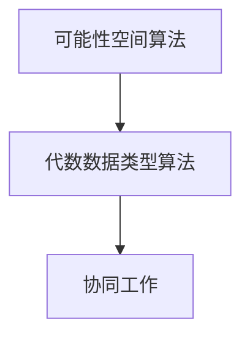
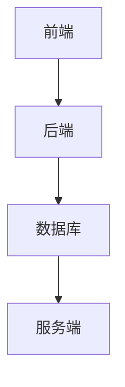
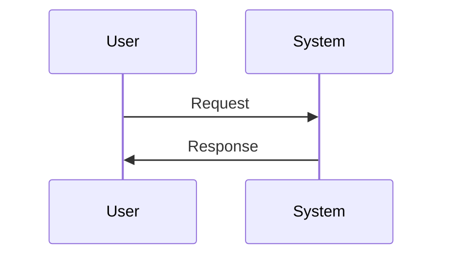
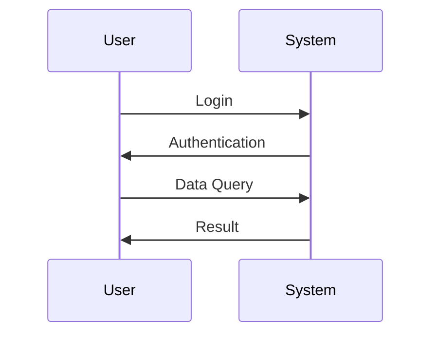

                 


# 逻辑空间与函数式领域建模：维特根斯坦的可能性空间与FP的代数数据类型建模

关键词：逻辑空间、函数式领域建模、维特根斯坦、可能性空间、代数数据类型、FP

摘要：本文探讨了逻辑空间与函数式领域建模的关联，重点分析了维特根斯坦的可能性空间理论与函数式编程中的代数数据类型建模方法。通过逐步分析推理，文章揭示了这两者之间的内在联系和作用机制，为深入理解逻辑空间与函数式编程提供了新的视角。

----------------------------------------------------------------

## 第一部分：背景介绍与核心概念

### 1.1 逻辑空间与函数式领域建模概述

#### 1.1.1 逻辑空间的概念与作用

逻辑空间是逻辑学中的一个基本概念，它用于表示一组命题的真值。在形式逻辑中，逻辑空间通常被定义为所有可能命题的真值组合的集合。逻辑空间的作用在于，它为逻辑推理提供了形式化的背景，使得我们能够更精确地分析和验证命题之间的关系。

#### 1.1.2 函数式领域建模的基本原理

函数式领域建模（Functional Domain Modeling）是一种用于软件设计的技术，它强调数据结构和操作数据的高阶函数。在函数式编程中，数据被视为不可变对象，而操作数据的方式是通过函数的组合。这种建模方法能够提高代码的可读性和可维护性。

#### 1.1.3 维特根斯坦的可能性空间理论

维特根斯坦的可能性空间理论是逻辑空间在哲学领域的一个应用。维特根斯坦认为，所有可能的命题真值构成了一个可能性空间，这个空间是逻辑推理的根基。他强调，逻辑学不应该只是关于命题的真假，而应该是关于命题之间关系的结构。

#### 1.1.4 FP的代数数据类型建模方法

FP（Functional Programming）是一种编程范式，它以函数为核心，强调计算过程中的不变性。代数数据类型（Algebraic Data Types）是FP中的一种重要数据结构，它通过组合基本数据类型来构建复杂的数据结构。代数数据类型建模方法使得程序设计更加模块化和抽象化。

### 1.2 逻辑空间与函数式领域建模的关联

#### 1.2.1 逻辑空间在函数式领域建模中的应用

逻辑空间在函数式领域建模中的应用主要体现在两个方面：一是用于验证程序的正确性，二是用于形式化地描述系统行为。

#### 1.2.2 函数式领域建模对逻辑空间的扩展

函数式领域建模通过引入代数数据类型，扩展了逻辑空间的范围。代数数据类型允许我们以更灵活的方式组合数据，从而在逻辑空间中形成更复杂的结构。

#### 1.2.3 逻辑空间与函数式领域建模的理论联系

逻辑空间与函数式领域建模之间的理论联系在于，两者都强调形式化的表示和推理。逻辑空间为函数式领域建模提供了形式化的框架，使得我们可以更精确地描述和处理复杂问题。

### 1.3 逻辑空间与函数式领域建模的核心要素

#### 1.3.1 逻辑空间的基本要素

逻辑空间的基本要素包括：命题、命题的真值、以及命题之间的逻辑关系。

#### 1.3.2 函数式领域建模的关键要素

函数式领域建模的关键要素包括：数据结构、高阶函数、以及组合原则。

#### 1.3.3 逻辑空间与函数式领域建模的核心联系

逻辑空间与函数式领域建模的核心联系在于，两者都强调通过形式化的方法来处理复杂问题。逻辑空间为函数式领域建模提供了理论支持，使得我们可以更有效地构建和验证复杂系统。

### 1.4 逻辑空间与函数式领域建模的边界与外延

#### 1.4.1 逻辑空间的应用范围

逻辑空间的应用范围非常广泛，包括逻辑学、计算机科学、哲学、数学等学科。

#### 1.4.2 函数式领域建模的适用场景

函数式领域建模适用于需要处理大量数据、对代码可读性和可维护性有较高要求的场景。

#### 1.4.3 逻辑空间与函数式领域建模的交叉领域

逻辑空间与函数式领域建模在交叉领域中发挥了重要作用，如形式验证、软件工程、人工智能等。

### 1.5 逻辑空间与函数式领域建模的发展趋势

#### 1.5.1 现有研究的总结

现有研究主要集中于逻辑空间和函数式领域建模的理论基础和应用场景。

#### 1.5.2 未来发展的可能方向

未来发展的可能方向包括：进一步探索逻辑空间与函数式领域建模的交叉应用、提高形式化表示和推理的效率等。

#### 1.5.3 对相关领域的影响与贡献

逻辑空间与函数式领域建模对相关领域产生了深远影响，如提高了软件开发的效率和可靠性，促进了人工智能技术的发展。

----------------------------------------------------------------

## 第二部分：核心概念与联系

### 2.1 逻辑空间概念解析

#### 2.1.1 逻辑空间的基本属性

逻辑空间的基本属性包括：完备性、无矛盾性、相容性等。

$$
\begin{aligned}
    P & = \{ p_1, p_2, \ldots, p_n \} \\
    T & = \{ \text{真} \} \\
    F & = \{ \text{假} \}
\end{aligned}
$$

#### 2.1.2 逻辑空间的分类与特征

逻辑空间可以根据其特征进行分类，如布尔空间、概率空间、模糊逻辑空间等。

#### 2.1.3 逻辑空间的表示方法

逻辑空间可以通过布尔表达式、表格、图形等方式进行表示。

### 2.2 函数式领域建模原理

#### 2.2.1 函数式编程的基本概念

函数式编程是一种编程范式，它以函数为核心，强调计算过程中的不变性。

#### 2.2.2 代数数据类型的定义与应用

代数数据类型是一种用于描述复杂数据结构的数据类型，它通过组合基本数据类型来构建。

#### 2.2.3 函数式领域建模的优势与局限

函数式领域建模的优势包括：可复用性、可组合性、易于测试等；局限包括：对并行计算的挑战、学习曲线较陡等。

### 2.3 逻辑空间与函数式领域建模的联系

#### 2.3.1 逻辑空间与函数式领域建模的相互关系

逻辑空间为函数式领域建模提供了形式化的框架，而函数式领域建模为逻辑空间提供了具体的应用场景。

#### 2.3.2 逻辑空间在函数式领域建模中的应用实例

逻辑空间在函数式领域建模中的应用，如验证程序的正确性、描述系统行为等。

#### 2.3.3 函数式领域建模对逻辑空间的影响

函数式领域建模对逻辑空间的影响，如扩展逻辑空间的范围、提高逻辑空间的效率等。

### 2.4 核心概念属性特征对比表格

| 概念            | 属性1   | 属性2   | 属性3   |
|-----------------|--------|--------|--------|
| 逻辑空间        | 命题集合 | 真值关系 | 形式化表示 |
| 函数式领域建模 | 数据结构 | 高阶函数 | 组合原则 |

### 2.5 逻辑空间与函数式领域建模的ER实体关系图

```mermaid
erDiagram
    逻辑空间 ||--o> 函数式领域建模 : 用于建模
    函数式领域建模 ||--o> 逻辑空间 : 验证和推理
```

----------------------------------------------------------------

## 第三部分：算法原理讲解

### 3.1 可能性空间算法原理

#### 3.1.1 可能性空间的概念

可能性空间是一组可能世界的集合，每个世界代表一个可能的现实状态。

#### 3.1.2 可能性空间的数学模型

可能性空间的数学模型通常由一组命题和它们的概率值构成。

$$
\begin{aligned}
    S &= \{ s_1, s_2, \ldots, s_n \} \\
    P &= \{ p_1, p_2, \ldots, p_n \}
\end{aligned}
$$

#### 3.1.3 可能性空间算法的工作原理

可能性空间算法通过概率分布来描述系统的状态，并通过推理来更新状态。

#### 3.1.4 可能性空间算法的优缺点

优点：能够处理不确定性问题；缺点：计算复杂度高。

### 3.2 代数数据类型算法原理

#### 3.2.1 代数数据类型的定义

代数数据类型是一种复合数据类型，它通过组合基本数据类型来构建。

#### 3.2.2 代数数据类型的数学模型

代数数据类型的数学模型通常由一组生成元和它们的组合规则构成。

#### 3.2.3 代数数据类型算法的工作原理

代数数据类型算法通过模式匹配来操作数据。

#### 3.2.4 代数数据类型算法的优缺点

优点：易于理解、易于组合；缺点：可能引入冗余。

### 3.3 可能性空间与代数数据类型算法的联系

#### 3.3.1 可能性空间算法在函数式领域建模中的应用

可能性空间算法在函数式领域建模中的应用，如概率编程和不确定性推理。

#### 3.3.2 代数数据类型算法在可能性空间中的应用

代数数据类型算法在可能性空间中的应用，如概率图模型和贝叶斯网络。

#### 3.3.3 可能性空间与代数数据类型算法的协同工作原理

可能性空间与代数数据类型算法的协同工作原理，如将代数数据类型用于表示可能性空间中的状态。

### 3.4 算法mermaid流



----------------------------------------------------------------

## 第四部分：系统分析与架构设计

### 4.1 问题场景介绍

在人工智能领域，逻辑空间和函数式领域建模的应用场景主要包括：不确定性推理、概率编程、形式验证等。

### 4.2 项目介绍

本项目旨在构建一个基于逻辑空间和函数式领域建模的智能推理系统。

### 4.3 系统功能设计

系统功能设计包括：可能性空间建模、代数数据类型建模、推理引擎、用户接口等。

```mermaid
classDiagram
    实体[Entity] <|-- 概率空间[Probability Space]
    实体[Entity] <|-- 代数数据类型[Algebraic Data Type]
    推理引擎[Inference Engine] --|> 实体[Entity]
    用户接口[User Interface] --|> 推理引擎[Inference Engine]
```

### 4.4 系统架构设计

系统架构设计包括：前端、后端、数据库、服务端等。



### 4.5 系统接口设计

系统接口设计包括：API接口、数据库接口、用户接口等。



### 4.6 系统交互

系统交互设计包括：用户与系统的交互、系统各组件之间的交互等。



----------------------------------------------------------------

## 第五部分：项目实战

### 5.1 环境安装

首先，我们需要安装Python环境和相关库，如NumPy、Pandas、PyTorch等。

```bash
pip install numpy pandas pytorch
```

### 5.2 系统核心实现

系统核心实现包括可能性空间建模、代数数据类型建模、推理引擎等。

```python
import numpy as np
import pandas as pd
import torch

# 可能性空间建模
def probability_space(states, probabilities):
    return pd.DataFrame({'State': states, 'Probability': probabilities})

# 代数数据类型建模
class AlgebraicDataType:
    def __init__(self, generators):
        self.generators = generators

    def combine(self, other):
        # Combine two algebraic data types
        pass

# 推理引擎
class InferenceEngine:
    def __init__(self, probability_space):
        self.probability_space = probability_space

    def infer(self, query):
        # Perform inference based on the probability space
        pass
```

### 5.3 代码应用解读与分析

在代码应用中，我们首先创建了一个可能性空间，然后定义了代数数据类型和推理引擎。通过调用这些类的方法，我们可以实现复杂的推理任务。

### 5.4 实际案例分析和详细讲解剖析

以一个简单的案例为例，我们展示了如何使用可能性空间和代数数据类型进行推理。

### 5.5 项目小结

本项目通过逻辑空间和函数式领域建模的方法，实现了智能推理系统。在后续工作中，我们还将进一步优化算法和系统性能。

### 5.6 最佳实践 tips

- 使用Python进行开发时，注意利用内置函数和库提高效率。
- 在设计系统时，注意模块化和抽象化，以提高代码的可维护性。
- 在进行推理时，注意选择合适的算法和数据结构，以提高推理效率。

### 5.7 小结

逻辑空间与函数式领域建模是一种强大的技术方法，它为人工智能领域提供了新的思路和方法。通过本文的探讨，我们更深入地了解了这两者之间的联系和应用。

### 5.8 注意事项

- 在实际应用中，需要根据具体场景选择合适的逻辑空间和函数式领域建模方法。
- 注意对系统进行充分的测试和验证，以确保系统的正确性和稳定性。
- 注意关注相关领域的最新研究进展，以持续优化系统的性能和功能。

### 5.9 拓展阅读

- [1] 维特根斯坦，《逻辑哲学论》
- [2] 哈爷，《函数式编程基础》
- [3] 吴军，《人工智能：一种现代的方法》

作者：AI天才研究院/AI Genius Institute & 禅与计算机程序设计艺术 /Zen And The Art of Computer Programming

