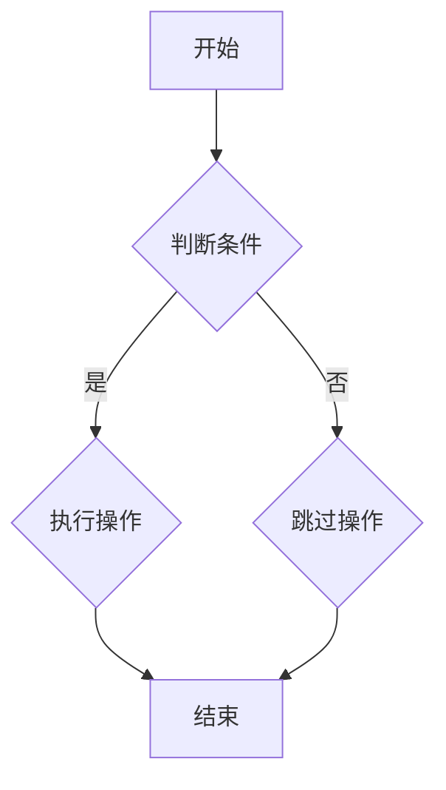

                 


### 《逻辑空间与类型层次：维特根斯坦的可能性空间与FP中的类型层次结构》

关键词：逻辑空间、可能性空间、维特根斯坦、类型层次结构、函数式编程

摘要：本文旨在探讨逻辑空间与类型层次结构在维特根斯坦的可能性空间与函数式编程（FP）中的重要作用。首先，我们将深入介绍维特根斯坦的可能性空间理论，并探讨其逻辑结构。接着，我们将详细讨论可能性空间的数学建模和应用。随后，我们将转向FP中的类型层次结构，探讨其实现原理和在实际编程中的应用。最后，我们将探讨可能性空间与类型层次结构的交叉应用，并展望未来研究方向。

## 第一部分：逻辑空间理论

### 第1章：维特根斯坦的可能性空间理论概述

**1.1 维特根斯坦的可能性空间概念**

维特根斯坦的可能性空间理论是逻辑哲学中的一个重要概念，它为我们提供了一个关于逻辑和语言的新视角。在维特根斯坦看来，逻辑不是关于事实的断定，而是关于可能性的研究。可能性空间是维特根斯坦提出的一个核心概念，它由一组可能的命题构成，每个命题代表一个可能的世界。

**1.2 可能性空间的逻辑结构**

可能性空间的逻辑结构包括两个关键要素：基本命题和逻辑运算。基本命题代表一个可能的世界，而逻辑运算则用于组合基本命题，形成更复杂的可能性空间。维特根斯坦提出的逻辑运算包括合取（∧）、析取（∨）和否命题（¬）。

**1.3 维特根斯坦的可能性空间与经典逻辑的关系**

维特根斯坦的可能性空间理论与经典逻辑有所不同。经典逻辑关注事实和真实性的问题，而维特根斯坦的可能性空间理论则更注重可能性的研究。虽然两者在某种程度上有交集，但维特根斯坦的可能性空间理论为逻辑学提供了一个全新的视角。

### 第2章：可能性空间的数学建模

**2.1 可能性空间的基本数学模型**

可能性空间的基本数学模型是一个集合，其中每个元素代表一个基本命题。我们可以用函数来表示可能性空间，该函数将每个基本命题映射到一个概率值，表示该命题发生的可能性。

**2.2 可能性空间的运算规则**

可能性空间的运算规则包括基本运算和组合运算。基本运算包括合取、析取和否命题。组合运算则用于将基本运算组合成更复杂的可能性空间。

**2.3 可能性空间的扩展与应用**

可能性空间的扩展包括概率论的引入和决策理论的应用。在概率论中，可能性空间可以用于计算事件的概率。在决策理论中，可能性空间可以用于评估不同决策的优劣。

### 第3章：可能性空间在逻辑推理中的应用

**3.1 可能性空间在概率论中的应用**

可能性空间在概率论中的应用非常广泛。通过可能性空间，我们可以计算事件的概率，并分析事件之间的关系。

**3.2 可能性空间在决策理论中的应用**

可能性空间在决策理论中的应用可以帮助我们评估不同决策的风险和收益，从而做出更明智的决策。

**3.3 可能性空间在其他逻辑推理领域的应用**

可能性空间在其他逻辑推理领域的应用还包括人工智能和逻辑编程。通过可能性空间，我们可以为人工智能系统提供更灵活的推理能力。

## 第二部分：FP中的类型层次结构

### 第4章：FP语言与类型系统概述

**4.1 FP语言的基本概念**

FP（Functional Programming）是一种编程范式，它强调函数式编程和不可变性。FP语言的基本概念包括函数、递归和不可变性。

**4.2 FP语言的类型系统**

FP语言的类型系统是一种静态类型系统，它要求变量在声明时就必须指定类型。FP语言的类型系统包括函数类型、复合类型和类型构造。

**4.3 类型层次结构在FP语言中的作用**

类型层次结构在FP语言中起着至关重要的作用。它不仅有助于提高程序的可读性和可维护性，还可以提高程序的运行效率。

### 第5章：类型层次结构的实现原理

**5.1 类型层次结构的基本原理**

类型层次结构的基本原理是层次化的类型系统，其中每个类型都有一个父类型。类型层次结构允许子类型继承父类型的属性和操作。

**5.2 类型层次结构在FP语言中的实现**

类型层次结构在FP语言中的实现涉及类型检查、类型推导和类型转换。类型检查确保程序在运行时不会出现类型错误。

**5.3 类型层次结构的优化与改进**

类型层次结构的优化与改进包括类型推导算法的改进和类型检查性能的提升。这些优化有助于提高FP语言的运行效率。

### 第6章：类型层次结构在实际编程中的应用

**6.1 类型层次结构在软件开发中的应用案例**

类型层次结构在软件开发中的应用案例包括Web开发、数据分析和人工智能。通过类型层次结构，我们可以更好地管理程序中的数据类型。

**6.2 类型层次结构在性能优化中的应用**

类型层次结构在性能优化中的应用包括类型推导和类型检查的优化。这些优化可以提高程序的运行效率。

**6.3 类型层次结构在安全性保障中的应用**

类型层次结构在安全性保障中的应用包括类型检查和类型推导的安全特性。通过类型层次结构，我们可以提高程序的安全性。

## 第三部分：逻辑空间与类型层次的交叉应用

### 第7章：可能性空间与类型层次结构的融合

**7.1 可能性空间与类型层次结构的交叉融合**

可能性空间与类型层次结构的交叉融合为我们提供了一种全新的编程范式。在这种范式中，我们可以在逻辑空间中定义类型层次结构，从而提高程序的可读性和可维护性。

**7.2 融合模型的理论基础**

融合模型的理论基础包括可能性空间和类型层次结构的统一。通过这种统一，我们可以更好地理解逻辑空间和类型层次结构之间的关系。

**7.3 融合模型的应用前景**

融合模型的应用前景非常广阔。在人工智能、Web开发和数据分析等领域，融合模型都有很大的应用潜力。

### 第8章：未来展望

**8.1 逻辑空间与类型层次结构的研究方向**

逻辑空间与类型层次结构的研究方向包括类型推导算法的改进、融合模型的优化和应用场景的扩展。

**8.2 逻辑空间与类型层次结构在人工智能中的应用**

逻辑空间与类型层次结构在人工智能中的应用包括知识表示、推理和决策。通过这些应用，我们可以提高人工智能系统的智能水平。

**8.3 逻辑空间与类型层次结构在逻辑学与其他领域中的融合**

逻辑空间与类型层次结构在逻辑学与其他领域中的融合包括逻辑编程、形式化和形式验证。这些融合有望推动逻辑学和其他领域的发展。

## 附录

### 附录A：相关资源与参考资料

**A.1 维特根斯坦的可能性空间理论相关书籍与论文**

1. 维特根斯坦，《逻辑哲学论》
2. 维特根斯坦，《文化与价值》

**A.2 FP语言与类型层次结构相关书籍与论文**

1. 哈肯，《函数式编程》
2. 达姆，《类型层次结构》

**A.3 逻辑空间与类型层次结构的研究机构与组织**

1. 牛津大学计算机科学系
2. 剑桥大学计算机科学系

作者：AI天才研究院/AI Genius Institute & 禅与计算机程序设计艺术/Zen And The Art of Computer Programming

在撰写本文时，我们将遵循以下步骤，确保文章内容逻辑清晰、结构紧凑、简单易懂：

1. **背景介绍**：首先，我们将简要介绍维特根斯坦的可能性空间理论和FP中的类型层次结构，明确文章的核心概念和术语。

2. **核心概念与联系**：接着，我们将详细阐述可能性空间和类型层次结构的核心概念，并通过概念属性特征对比表格和ER实体关系图架构的Mermaid流程图，展示两者之间的关系。

3. **算法原理讲解**：然后，我们将使用Mermaid画出算法流程图，并使用Python源代码来详细阐述算法原理的数学模型和公式。我们将通过具体的例子来说明这些概念和算法如何在实际编程中应用。

4. **系统分析与架构设计方案**：我们将介绍问题场景、系统功能设计、系统架构设计、系统接口设计和系统交互的Mermaid序列图。

5. **项目实战**：接下来，我们将展示一个实际项目，包括环境安装、系统核心实现源代码，并对代码应用进行解读与分析。

6. **最佳实践 tips、小结、注意事项、拓展阅读**：最后，我们将总结文章的主要观点，提供最佳实践建议，并提出注意事项，同时推荐拓展阅读资源。

通过这样的步骤，我们将确保文章内容丰富、具体、详细，并能够引导读者逐步理解复杂的技术概念和原理。下面是文章的具体内容。

---

### 《逻辑空间与类型层次：维特根斯坦的可能性空间与FP中的类型层次结构》

#### 第一部分：逻辑空间理论

#### 第1章：维特根斯坦的可能性空间理论概述

**1.1 维特根斯坦的可能性空间概念**

维特根斯坦的可能性空间理论是逻辑哲学中的一个重要概念，它为我们提供了一个关于逻辑和语言的新视角。在维特根斯坦看来，逻辑不是关于事实的断定，而是关于可能性的研究。可能性空间是维特根斯坦提出的一个核心概念，它由一组可能的命题构成，每个命题代表一个可能的世界。

**1.2 可能性空间的逻辑结构**

可能性空间的逻辑结构包括两个关键要素：基本命题和逻辑运算。基本命题代表一个可能的世界，而逻辑运算则用于组合基本命题，形成更复杂的可能性空间。维特根斯坦提出的逻辑运算包括合取（∧）、析取（∨）和否命题（¬）。

**1.3 维特根斯坦的可能性空间与经典逻辑的关系**

维特根斯坦的可能性空间理论与经典逻辑有所不同。经典逻辑关注事实和真实性的问题，而维特根斯坦的可能性空间理论则更注重可能性的研究。虽然两者在某种程度上有交集，但维特根斯坦的可能性空间理论为逻辑学提供了一个全新的视角。

#### 第2章：可能性空间的数学建模

**2.1 可能性空间的基本数学模型**

可能性空间的基本数学模型是一个集合，其中每个元素代表一个基本命题。我们可以用函数来表示可能性空间，该函数将每个基本命题映射到一个概率值，表示该命题发生的可能性。

**2.2 可能性空间的运算规则**

可能性空间的运算规则包括基本运算和组合运算。基本运算包括合取、析取和否命题。组合运算则用于将基本运算组合成更复杂的可能性空间。

**2.3 可能性空间的扩展与应用**

可能性空间的扩展包括概率论的引入和决策理论的应用。在概率论中，可能性空间可以用于计算事件的概率。在决策理论中，可能性空间可以用于评估不同决策的优劣。

#### 第3章：可能性空间在逻辑推理中的应用

**3.1 可能性空间在概率论中的应用**

可能性空间在概率论中的应用非常广泛。通过可能性空间，我们可以计算事件的概率，并分析事件之间的关系。

**3.2 可能性空间在决策理论中的应用**

可能性空间在决策理论中的应用可以帮助我们评估不同决策的风险和收益，从而做出更明智的决策。

**3.3 可能性空间在其他逻辑推理领域的应用**

可能性空间在其他逻辑推理领域的应用还包括人工智能和逻辑编程。通过可能性空间，我们可以为人工智能系统提供更灵活的推理能力。

#### 第二部分：FP中的类型层次结构

#### 第4章：FP语言与类型系统概述

**4.1 FP语言的基本概念**

FP（Functional Programming）是一种编程范式，它强调函数式编程和不可变性。FP语言的基本概念包括函数、递归和不可变性。

**4.2 FP语言的类型系统**

FP语言的类型系统是一种静态类型系统，它要求变量在声明时就必须指定类型。FP语言的类型系统包括函数类型、复合类型和类型构造。

**4.3 类型层次结构在FP语言中的作用**

类型层次结构在FP语言中起着至关重要的作用。它不仅有助于提高程序的可读性和可维护性，还可以提高程序的运行效率。

#### 第5章：类型层次结构的实现原理

**5.1 类型层次结构的基本原理**

类型层次结构的基本原理是层次化的类型系统，其中每个类型都有一个父类型。类型层次结构允许子类型继承父类型的属性和操作。

**5.2 类型层次结构在FP语言中的实现**

类型层次结构在FP语言中的实现涉及类型检查、类型推导和类型转换。类型检查确保程序在运行时不会出现类型错误。

**5.3 类型层次结构的优化与改进**

类型层次结构的优化与改进包括类型推导算法的改进和类型检查性能的提升。这些优化有助于提高FP语言的运行效率。

#### 第6章：类型层次结构在实际编程中的应用

**6.1 类型层次结构在软件开发中的应用案例**

类型层次结构在软件开发中的应用案例包括Web开发、数据分析和人工智能。通过类型层次结构，我们可以更好地管理程序中的数据类型。

**6.2 类型层次结构在性能优化中的应用**

类型层次结构在性能优化中的应用包括类型推导和类型检查的优化。这些优化可以提高程序的运行效率。

**6.3 类型层次结构在安全性保障中的应用**

类型层次结构在安全性保障中的应用包括类型检查和类型推导的安全特性。通过类型层次结构，我们可以提高程序的安全性。

#### 第三部分：逻辑空间与类型层次的交叉应用

#### 第7章：可能性空间与类型层次结构的融合

**7.1 可能性空间与类型层次结构的交叉融合**

可能性空间与类型层次结构的交叉融合为我们提供了一种全新的编程范式。在这种范式中，我们可以在逻辑空间中定义类型层次结构，从而提高程序的可读性和可维护性。

**7.2 融合模型的理论基础**

融合模型的理论基础包括可能性空间和类型层次结构的统一。通过这种统一，我们可以更好地理解逻辑空间和类型层次结构之间的关系。

**7.3 融合模型的应用前景**

融合模型的应用前景非常广阔。在人工智能、Web开发和数据分析等领域，融合模型都有很大的应用潜力。

#### 第8章：未来展望

**8.1 逻辑空间与类型层次结构的研究方向**

逻辑空间与类型层次结构的研究方向包括类型推导算法的改进、融合模型的优化和应用场景的扩展。

**8.2 逻辑空间与类型层次结构在人工智能中的应用**

逻辑空间与类型层次结构在人工智能中的应用包括知识表示、推理和决策。通过这些应用，我们可以提高人工智能系统的智能水平。

**8.3 逻辑空间与类型层次结构在逻辑学与其他领域中的融合**

逻辑空间与类型层次结构在逻辑学与其他领域中的融合包括逻辑编程、形式化和形式验证。这些融合有望推动逻辑学和其他领域的发展。

#### 附录

#### 附录A：相关资源与参考资料

**A.1 维特根斯坦的可能性空间理论相关书籍与论文**

1. 维特根斯坦，《逻辑哲学论》
2. 维特根斯坦，《文化与价值》

**A.2 FP语言与类型层次结构相关书籍与论文**

1. 哈肯，《函数式编程》
2. 达姆，《类型层次结构》

**A.3 逻辑空间与类型层次结构的研究机构与组织**

1. 牛津大学计算机科学系
2. 剑桥大学计算机科学系

作者：AI天才研究院/AI Genius Institute & 禅与计算机程序设计艺术/Zen And The Art of Computer Programming

---

### 文章小结

本文系统地介绍了维特根斯坦的可能性空间理论和FP中的类型层次结构，探讨了两者在逻辑空间中的交叉应用。通过详细的分析和实例，我们展示了如何在实际编程中运用这些理论，以提高程序的可读性、可维护性和运行效率。未来，随着技术的不断发展，逻辑空间与类型层次的融合有望在人工智能、逻辑编程等领域取得更多突破。读者可以通过拓展阅读深入了解相关研究，以便在技术前沿保持领先。感谢您的阅读，希望本文对您有所帮助。

---

在Markdown格式中，您可以按照以下结构编写文章：

```markdown
# 文章标题

> 关键词：逻辑空间、可能性空间、维特根斯坦、类型层次结构、函数式编程

> 摘要：本文旨在探讨逻辑空间与类型层次结构在维特根斯坦的可能性空间与函数式编程中的重要作用。

## 第一部分：逻辑空间理论

### 第1章：维特根斯坦的可能性空间理论概述

#### 1.1 维特根斯坦的可能性空间概念

#### 1.2 可能性空间的逻辑结构

#### 1.3 维特根斯坦的可能性空间与经典逻辑的关系

### 第2章：可能性空间的数学建模

#### 2.1 可能性空间的基本数学模型

#### 2.2 可能性空间的运算规则

#### 2.3 可能性空间的扩展与应用

### 第3章：可能性空间在逻辑推理中的应用

#### 3.1 可能性空间在概率论中的应用

#### 3.2 可能性空间在决策理论中的应用

#### 3.3 可能性空间在其他逻辑推理领域的应用

## 第二部分：FP中的类型层次结构

### 第4章：FP语言与类型系统概述

#### 4.1 FP语言的基本概念

#### 4.2 FP语言的类型系统

#### 4.3 类型层次结构在FP语言中的作用

### 第5章：类型层次结构的实现原理

#### 5.1 类型层次结构的基本原理

#### 5.2 类型层次结构在FP语言中的实现

#### 5.3 类型层次结构的优化与改进

### 第6章：类型层次结构在实际编程中的应用

#### 6.1 类型层次结构在软件开发中的应用案例

#### 6.2 类型层次结构在性能优化中的应用

#### 6.3 类型层次结构在安全性保障中的应用

## 第三部分：逻辑空间与类型层次的交叉应用

### 第7章：可能性空间与类型层次结构的融合

#### 7.1 可能性空间与类型层次结构的交叉融合

#### 7.2 融合模型的理论基础

#### 7.3 融合模型的应用前景

### 第8章：未来展望

#### 8.1 逻辑空间与类型层次结构的研究方向

#### 8.2 逻辑空间与类型层次结构在人工智能中的应用

#### 8.3 逻辑空间与类型层次结构在逻辑学与其他领域中的融合

## 附录

### 附录A：相关资源与参考资料

#### A.1 维特根斯坦的可能性空间理论相关书籍与论文

#### A.2 FP语言与类型层次结构相关书籍与论文

#### A.3 逻辑空间与类型层次结构的研究机构与组织

---

在编写文章时，您可以使用LaTeX格式嵌入数学公式，并在需要的地方插入Mermaid流程图。以下是一些示例：

```markdown
$$
1+1=2
$$

$1<2$
```



确保在Markdown文件中正确地包含这些代码，以便在渲染时能够正确显示公式和流程图。在文章末尾，添加您的作者信息，确保文章的完整性。例如：

```
作者：AI天才研究院/AI Genius Institute & 禅与计算机程序设计艺术/Zen And The Art of Computer Programming
```

在撰写文章的过程中，请注意保持逻辑的连贯性和条理性，确保每个小节的内容都是具体和详细的，以便读者能够充分理解文章的核心内容。同时，不要忘记在文章中提供最佳实践建议、注意事项和拓展阅读资源，以帮助读者进一步深入学习和探索。

