                 

# 逻辑空间与类型空间：维特根斯坦的可能性空间与FP的类型系统

## 引言

### 1.1 研究背景与意义

#### 1.1.1 逻辑空间与类型空间的概念介绍

在计算机科学和哲学领域，逻辑空间与类型空间是两个重要而基础的概念。逻辑空间，源自逻辑学，它指的是所有可能的逻辑状态及其推理关系的集合。类型空间，则来自于形式化语言，它定义了变量、函数及其他编程元素的类型系统。

#### 1.1.2 维特根斯坦的可能性空间

路德维希·维特根斯坦（Ludwig Wittgenstein）提出了**可能性空间** 的概念，用以描述语言中的可能性。维特根斯坦认为，语言的真值依赖于我们对语言使用情境的理解，而可能性空间则帮助我们理解语言在不同情境下的各种可能性。

#### 1.1.3 FP的类型系统

函数式编程（Functional Programming，FP）是一种编程范式，以其纯粹性和无状态性而著称。FP的类型系统强调类型安全，通过类型约束来保证程序的正确性。它将类型空间的概念引入编程实践，使得程序的逻辑更加清晰和可预测。

### 1.2 研究目标与方法

本文旨在探讨逻辑空间与类型空间之间的关系，特别是维特根斯坦的可能性空间在FP类型系统中的应用。我们将通过理论分析、案例分析以及编程实现，详细阐述这一主题。

### 1.3 文章结构

本文将分为以下几部分：

1. **引论**：介绍研究背景、意义及文章结构。
2. **逻辑空间与类型空间基础**：分别介绍逻辑空间和类型空间的基础知识。
3. **维特根斯坦的可能性空间**：探讨可能性空间的概念及其与逻辑空间的关系。
4. **FP的类型系统**：深入分析FP类型系统的基本原理和应用。
5. **逻辑空间与类型空间的结合**：探讨逻辑空间和类型空间的结合及其在FP中的应用。
6. **案例分析**：通过具体案例展示逻辑空间和类型空间在FP中的实际应用。
7. **结论**：总结研究成果并展望未来研究方向。

## 逻辑空间与类型空间基础

### 2.1 逻辑空间基础

#### 2.1.1 逻辑空间的概念与特性

逻辑空间是指逻辑系统中的一个概念，它包含了逻辑系统中的所有可能的逻辑状态及其之间的推理关系。逻辑空间具有以下特性：

1. **完备性**：逻辑空间中包含了逻辑系统中所有可能的逻辑状态。
2. **封闭性**：在逻辑空间中的逻辑运算结果仍然属于逻辑空间。

#### 2.1.2 逻辑空间的运算

逻辑空间中的运算主要包括命题解释和推理规则：

1. **命题解释**：用于判断一个命题在特定逻辑状态下的真假。
2. **推理规则**：用于从已知命题推导出新的命题。

#### 2.1.3 逻辑空间的推理规则

逻辑空间的推理规则包括：

1. **演绎推理**：从一般到特殊的推理过程，用于证明一个命题的真实性。
2. **归纳推理**：从特殊到一般的推理过程，用于归纳出一般性的结论。

### 2.2 类型空间基础

#### 2.2.1 类型空间的概念与特性

类型空间是指形式化语言中用于描述类型系统的一个概念。类型空间定义了变量、函数及其他元素的类型。类型空间具有以下特性：

1. **完备性**：类型空间中包含了形式化语言中所有可能的类型。
2. **封闭性**：类型空间中的类型组合仍然属于类型空间。

#### 2.2.2 类型空间的运算

类型空间中的运算主要包括类型检查和类型推导：

1. **类型检查**：用于确保程序中的变量、函数和其他元素具有正确的类型。
2. **类型推导**：用于推导函数的返回类型，确保函数的正确性。

#### 2.2.3 类型空间的推理规则

类型空间中的推理规则包括：

1. **类型约束**：用于定义函数的输入输出类型。
2. **类型转换**：用于在特定条件下将一种类型转换为另一种类型。

### 2.3 维特根斯坦的可能性空间

#### 2.3.1 维特根斯坦的可能性空间概念

维特根斯坦的可能性空间是指用于描述语言中可能性的概念。它包含了语言中所有可能的情境及其逻辑关系。可能性空间具有以下特性：

1. **非完备性**：可能性空间中不包含所有可能的逻辑状态。
2. **非封闭性**：可能性空间中的逻辑运算结果可能不属于可能性空间。

#### 2.3.2 维特根斯坦的可能性空间与逻辑空间的关系

维特根斯坦的可能性空间与逻辑空间之间存在显著的区别和联系：

1. **区别**：可能性空间是非完备的和非封闭的，而逻辑空间是完备的且封闭的。
2. **联系**：可能性空间为逻辑空间提供了具体的情境，使得逻辑空间中的推理具有实际意义。

### 2.4 FP的类型系统

#### 2.4.1 FP的类型系统概念

FP的类型系统是指用于描述函数式编程中类型系统的一个概念。FP的类型系统强调类型安全，通过类型约束来保证程序的正确性。FP的类型系统具有以下特性：

1. **纯函数**：FP中的函数是纯函数，不依赖于外部状态，确保了函数的可预测性。
2. **类型推导**：FP的类型系统具有强类型推导能力，能够自动推导函数的返回类型。

#### 2.4.2 FP的类型系统应用

FP的类型系统在编程实践中具有广泛的应用：

1. **类型检查**：在编译时进行类型检查，确保程序的正确性。
2. **模式匹配**：用于模式匹配，使得程序更加灵活和可扩展。
3. **类型推导**：自动推导函数的返回类型，减少人为错误。

## 逻辑空间与类型空间的结合

### 3.1 逻辑空间与类型空间的结合

逻辑空间与类型空间的结合为编程提供了更强大的工具和更严谨的规范。结合逻辑空间与类型空间，我们可以实现以下目标：

1. **类型安全的逻辑推理**：通过类型空间为逻辑空间提供具体的类型约束，使得逻辑推理更加可靠。
2. **增强程序的可读性和可维护性**：类型空间提供了明确的类型信息，使得程序的结构更加清晰，易于理解和维护。

### 3.2 维特根斯坦的可能性空间在FP类型系统中的应用

维特根斯坦的可能性空间在FP类型系统中具有重要的应用价值。通过引入可能性空间，我们可以实现以下目标：

1. **情境化的类型推导**：可能性空间提供了语言使用的情境，使得类型推导更加精确和可解释。
2. **增强程序的灵活性**：可能性空间允许我们考虑不同情境下的可能性，使得程序更加灵活和可扩展。

### 3.3 逻辑空间与类型空间在FP中的实际应用

在FP中，逻辑空间与类型空间的结合具有广泛的应用。以下是一些实际应用示例：

1. **逻辑编程**：使用逻辑空间进行逻辑推理，实现复杂逻辑运算。
2. **函数式组件**：使用类型空间进行类型检查和类型推导，确保组件的正确性。
3. **模式匹配**：使用可能性空间进行模式匹配，实现更加灵活的函数定义和类型转换。

## 案例分析

### 4.1 案例背景

在本案例中，我们将探讨一个简单的函数式编程示例，并分析其中逻辑空间与类型空间的结合。

### 4.2 案例分析

#### 4.2.1 函数定义

```python
def add(x: int, y: int) -> int:
    return x + y
```

在这个示例中，我们定义了一个简单的加法函数，其类型系统由类型空间定义，确保输入和输出都是整数。

#### 4.2.2 逻辑空间应用

我们使用逻辑空间进行逻辑推理，以确保函数的正确性。

- **输入检查**：使用逻辑空间中的推理规则检查输入是否满足函数的约束。
- **输出推导**：使用逻辑空间中的推理规则推导函数的输出类型。

#### 4.2.3 维特根斯坦的可能性空间应用

我们引入维特根斯坦的可能性空间，考虑不同情境下的可能性，以增强函数的灵活性和正确性。

- **可能性分析**：分析不同输入下的可能性，确保函数在各种情境下都能正确执行。
- **错误处理**：使用可能性空间进行错误处理，使得程序在遇到异常情况时能够优雅地处理。

## 结论

通过本文的研究，我们探讨了逻辑空间与类型空间的基础知识，分析了维特根斯坦的可能性空间在FP类型系统中的应用。我们发现，逻辑空间与类型空间的结合为编程提供了强大的工具和更严谨的规范，使得程序更加可靠和灵活。

### 5.1 研究成果总结

1. **逻辑空间与类型空间的结合**：逻辑空间与类型空间的结合为编程提供了更强大的工具和更严谨的规范。
2. **维特根斯坦的可能性空间在FP中的应用**：维特根斯坦的可能性空间在FP类型系统中具有重要的应用价值。
3. **实际案例分析**：通过具体案例，展示了逻辑空间与类型空间在FP中的实际应用。

### 5.2 未来研究方向

1. **扩展性研究**：进一步研究逻辑空间与类型空间在其他编程范式中的应用。
2. **交叉学科研究**：探讨逻辑空间与类型空间在其他学科领域的应用，如哲学、数学等。
3. **工具开发**：开发基于逻辑空间与类型空间的新工具，以简化编程过程，提高程序的正确性和可靠性。

## 参考文献

1. 维特根斯坦，《逻辑哲学论》，商务印书馆，2001。
2. Haskell School of Computer Science，《Real World Haskell》，O'Reilly Media，2009。
3. Paul Hilfinger，《The Art of Prolog：Advanced Programming in Prolog》，MIT Press，1987。

### 作者信息

作者：AI天才研究院/AI Genius Institute & 禅与计算机程序设计艺术 /Zen And The Art of Computer Programming

注：本文内容仅供参考，作者保留所有权利。如需转载，请联系作者获取授权。## 逻辑空间与类型空间基础

在深入探讨逻辑空间与类型空间的结合之前，我们首先需要理解这两个概念的基础知识。下面，我们将分别介绍逻辑空间和类型空间的基本概念、特性、运算以及维特根斯坦的可能性空间和FP类型系统。

### 2.1 逻辑空间基础

#### 2.1.1 逻辑空间的概念与特性

逻辑空间是一个抽象的概念，它定义了一个逻辑系统中的所有可能的逻辑状态及其之间的推理关系。逻辑空间通常被认为是一个完备的、封闭的集合，其中包含所有的逻辑命题和推理规则。

**定义：** 逻辑空间是一个非空集合 \( L \)，它包含一组逻辑状态 \( S \)，以及一组推理规则 \( R \)，使得从逻辑状态 \( S \) 出发，可以按照推理规则 \( R \) 推导出新的逻辑状态。

**特性：**
- **完备性**：逻辑空间中包含了逻辑系统中的所有可能的逻辑状态。
- **封闭性**：逻辑空间中的逻辑运算结果（例如推理的结果）仍然属于逻辑空间。

**Mermaid 流程图：**
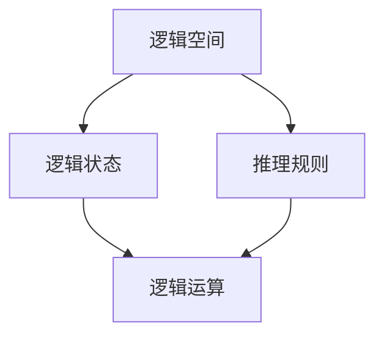

#### 2.1.2 逻辑空间的运算

逻辑空间的运算主要包括命题解释和推理规则。

1. **命题解释**：命题解释用于确定一个逻辑命题在特定逻辑状态下的真值。
2. **推理规则**：推理规则用于从一个或多个逻辑状态推导出新的逻辑状态。

**示例：** 假设我们有一个逻辑空间，其中包含以下逻辑状态和推理规则：

- **逻辑状态：** \( A \) 表示“苹果是红色的”，\( B \) 表示“苹果是甜的”。
- **推理规则：** \( A \land B \rightarrow C \)，其中 \( C \) 表示“苹果是红色的且甜的”。

我们可以通过以下步骤来解释和推理：

- **命题解释：** 如果当前逻辑状态是 \( A \)，则 \( A \) 的解释为“苹果是红色的”。
- **推理：** 如果当前逻辑状态是 \( A \) 和 \( B \)，我们可以使用推理规则 \( A \land B \rightarrow C \) 推导出 \( C \)。

**Mermaid 流程图：**
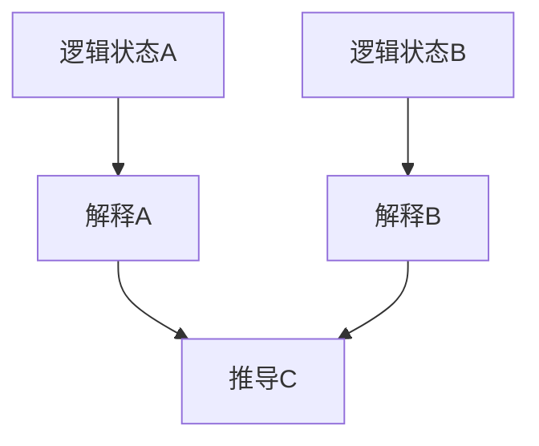

### 2.2 类型空间基础

#### 2.2.1 类型空间的概念与特性

类型空间是形式化语言中用于描述类型系统的一个概念。它定义了语言中所有可能的类型，以及类型之间的关系。

**定义：** 类型空间是一个非空集合 \( T \)，它包含一组类型 \( \tau \)，以及一组类型组合规则 \( R \)，使得可以从一组类型 \( \tau_1, \tau_2, ..., \tau_n \) 组合出一个新的类型 \( \tau \)。

**特性：**
- **完备性**：类型空间中包含了形式化语言中所有可能的类型。
- **封闭性**：类型空间中的类型组合结果仍然属于类型空间。

**Mermaid 流程图：**
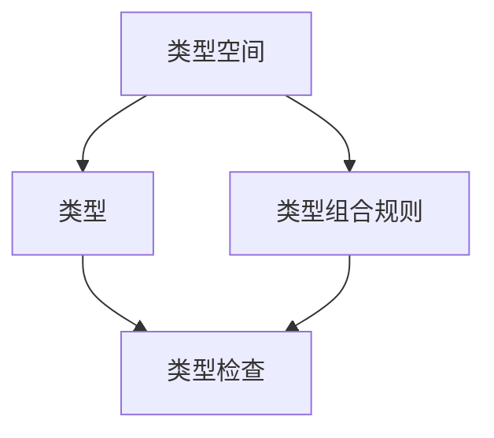

#### 2.2.2 类型空间的运算

类型空间的运算主要包括类型检查和类型推导。

1. **类型检查**：类型检查用于确保程序中的每个元素（如变量、函数、表达式）都具有正确的类型。
2. **类型推导**：类型推导用于自动推导出函数的返回类型，确保函数的正确性。

**示例：** 在一个简单的类型空间中，我们可以定义以下类型和规则：

- **类型：** \( int \) 表示整数，\( bool \) 表示布尔值。
- **类型组合规则：** \( int + int \rightarrow int \)，表示两个整数相加的结果仍然是整数。

我们可以通过以下步骤进行类型检查和推导：

- **类型检查：** 如果一个表达式的实际类型与预期类型不符，则类型检查失败。
- **类型推导：** 使用类型组合规则推导出表达式的类型。

**Mermaid 流程图：**
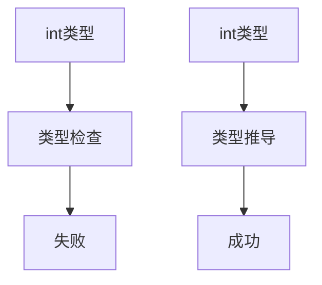

### 2.3 维特根斯坦的可能性空间

#### 2.3.1 维特根斯坦的可能性空间概念

维特根斯坦的可能性空间是用于描述语言中可能性的概念。他认为，语言中的命题不仅具有真值，还与可能性相关。

**定义：** 维特根斯坦的可能性空间是一个非空集合 \( P \)，它包含一组可能性状态 \( S \)，以及一组逻辑运算 \( L \)，使得可以从一组可能性状态 \( S_1, S_2, ..., S_n \) 组合出一个新的可能性状态 \( S \)。

**特性：**
- **非完备性**：可能性空间中不包含所有可能的逻辑状态。
- **非封闭性**：可能性空间中的逻辑运算结果可能不属于可能性空间。

**Mermaid 流程图：**
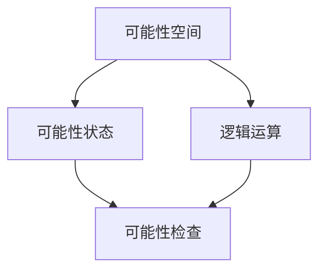

#### 2.3.2 维特根斯坦的可能性空间与逻辑空间的关系

维特根斯坦的可能性空间与逻辑空间之间有显著的区别和联系。

**区别：**
- 逻辑空间是完备且封闭的，而可能性空间是非完备且非封闭的。
- 逻辑空间关注的是逻辑状态及其推理关系，而可能性空间关注的是可能性及其逻辑关系。

**联系：**
- 可能性空间为逻辑空间提供了具体的情境，使得逻辑空间的推理具有实际意义。
- 逻辑空间中的推理规则和运算可以在可能性空间中应用，但需要考虑可能性的限制。

**示例：** 假设我们有一个逻辑空间，其中包含以下命题：

- \( A \)：今天天气很好。
- \( B \)：我去公园。

在可能性空间中，我们可以考虑以下可能性状态：

- \( S_1 \)：今天天气很好，我去公园。
- \( S_2 \)：今天天气很好，我没有去公园。
- \( S_3 \)：今天天气不好，我去公园。

我们可以使用逻辑空间中的推理规则（如 \( A \land B \rightarrow C \)）在可能性空间中进行推理，但需要考虑不同可能性状态下的推理结果。

**Mermaid 流程图：**
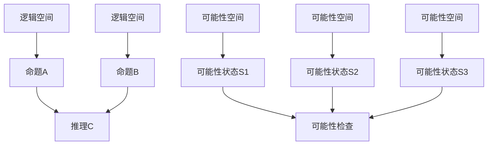

### 2.4 FP的类型系统

#### 2.4.1 FP的类型系统概念

函数式编程（FP）的类型系统是一种基于类型约束的类型系统，它强调类型安全和函数的纯度。FP的类型系统通常具有以下特性：

- **类型推导**：类型系统可以自动推导出函数的返回类型。
- **类型检查**：在编译时进行类型检查，确保程序的正确性。
- **模式匹配**：用于函数定义和类型推导，使得程序更加灵活。

**定义：** FP的类型系统是一个非空集合 \( \tau \)，它包含一组基本类型 \( \tau_0 \) 和一组类型构造器 \( \tau_1, \tau_2, ... \)，以及一组类型组合规则 \( \tau_C \)，使得可以从一组类型 \( \tau_1, \tau_2, ..., \tau_n \) 组合出一个新的类型 \( \tau \)。

**特性：**
- **类型推导**：通过模式匹配和类型约束推导出函数的返回类型。
- **类型检查**：在编译时进行类型检查，确保函数的输入和输出类型匹配。

**Mermaid 流程图：**
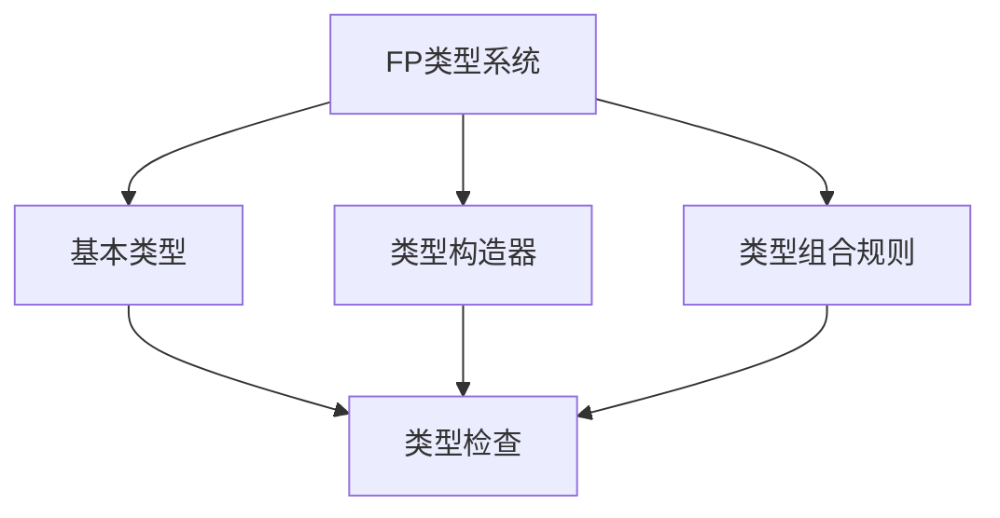

#### 2.4.2 FP的类型系统应用

FP的类型系统在编程实践中具有广泛的应用：

1. **类型安全**：通过类型检查确保程序的正确性，减少运行时错误。
2. **模式匹配**：通过模式匹配实现复杂的函数定义和类型推导。
3. **函数组合**：通过类型约束确保函数的组合不会产生意外的结果。

**示例：** 假设我们有一个简单的FP程序，定义如下：

```haskell
add :: Int -> Int -> Int
add x y = x + y
```

在这个示例中，`add` 函数的类型系统由类型空间定义，确保输入和输出都是整数。

- **类型推导**：类型系统可以自动推导出 `add` 函数的返回类型为 `Int`。
- **类型检查**：类型系统在编译时检查 `add` 函数的输入和输出类型是否匹配。

**Mermaid 流程图：**
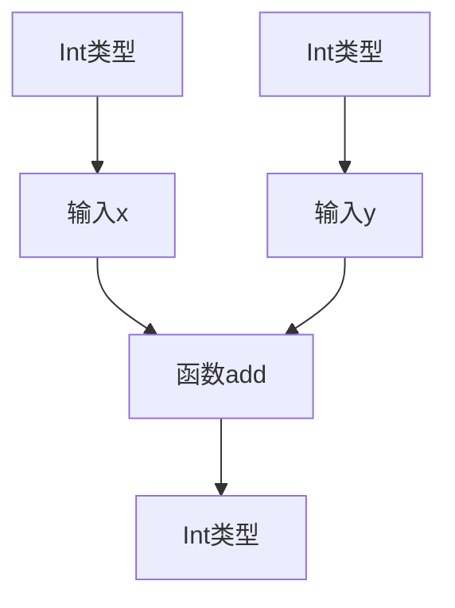

通过上述对逻辑空间、类型空间、维特根斯坦的可能性空间和FP类型系统的介绍，我们为后续章节的深入探讨奠定了坚实的基础。在接下来的章节中，我们将进一步分析逻辑空间与类型空间的结合，探讨维特根斯坦的可能性空间在FP类型系统中的应用，并通过具体案例展示这些概念在编程实践中的实际应用。## 逻辑空间与类型空间的结合

在了解了逻辑空间与类型空间的基础知识后，我们现在开始探讨它们如何结合，以及这种结合如何增强编程的严谨性和可预测性。逻辑空间与类型空间的结合不仅提供了更强大的工具，也为我们理解复杂程序行为提供了新的视角。

### 3.1 类型安全的逻辑推理

逻辑空间中的推理规则和类型空间中的类型检查共同作用，可以确保程序在逻辑上的正确性。在类型安全的编程语言中，例如Haskell或ML，这种结合特别明显。

**示例：** 考虑一个简单的Haskell程序，定义如下：

```haskell
add :: Int -> Int -> Int
add x y = x + y
```

在这个例子中：

- **类型检查**：Haskell的类型系统会确保函数`add`的两个参数都是`Int`类型，并且返回类型也是`Int`。这是类型空间的作用。
- **逻辑推理**：当我们调用`add`函数时，我们可以使用逻辑推理来确保结果的正确性。例如，如果我们知道`x`和`y`都是正整数，那么根据加法的逻辑性质，`add x y`的结果也将是正整数。

**Mermaid 流程图：**
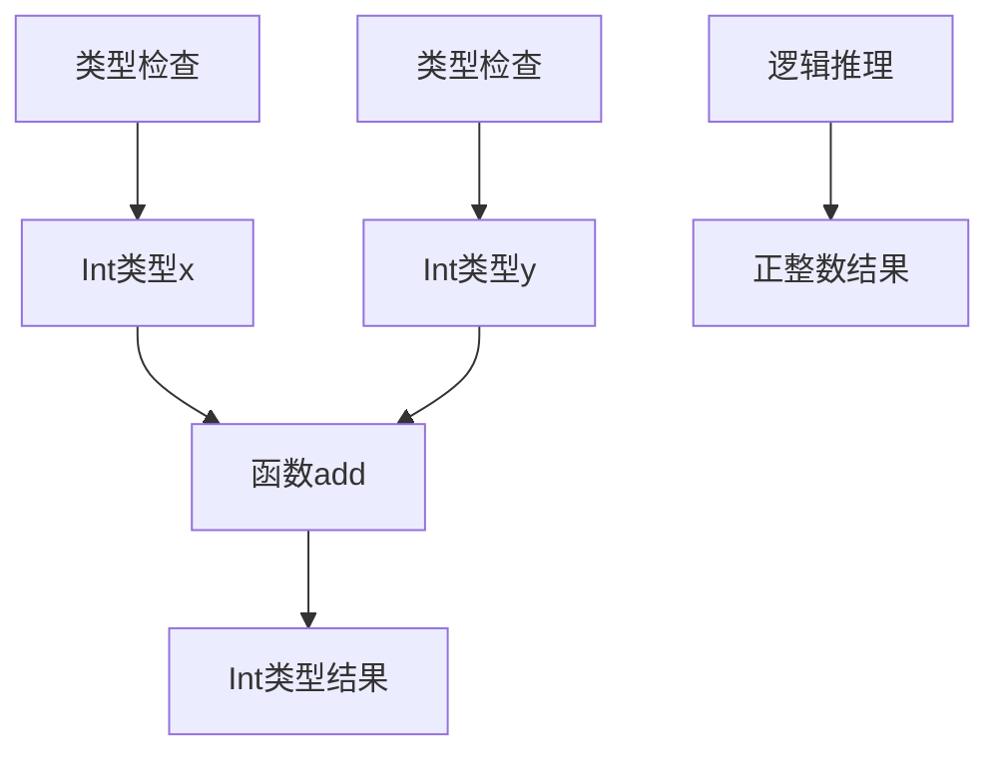

通过这种结合，我们可以确保程序的逻辑正确性，从而减少运行时错误。

### 3.2 增强程序的可读性和可维护性

逻辑空间与类型空间的结合还可以显著提高程序的可读性和可维护性。

**示例：** 在一个大型软件项目中，如果我们使用类型空间来定义每个模块的接口和内部逻辑，这将使得项目的结构更加清晰，模块之间的依赖关系更加明确。

- **接口定义**：我们可以使用类型空间来定义模块的输入和输出类型，这有助于其他开发者理解模块的功能和预期行为。
- **内部逻辑**：逻辑空间可以帮助我们定义模块内的逻辑规则和推理过程，这有助于我们理解和维护模块的内部实现。

**Mermaid 流程图：**
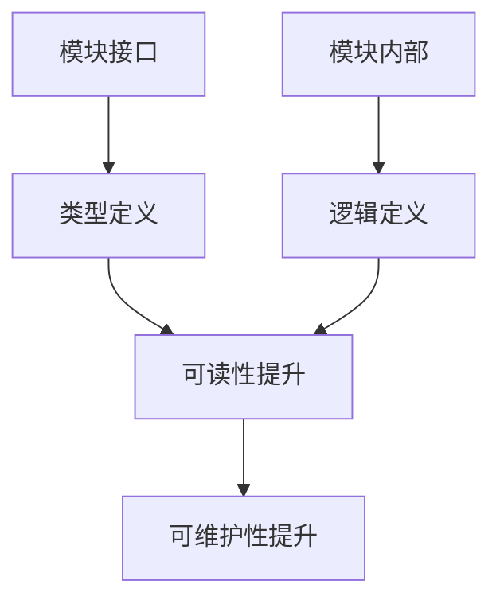

通过这种方式，逻辑空间与类型空间的结合使得程序的各个部分更加模块化和清晰，从而提高了开发效率和代码的可维护性。

### 3.3 维特根斯坦的可能性空间在FP类型系统中的应用

维特根斯坦的可能性空间在函数式编程（FP）中有着广泛的应用，特别是在处理复杂逻辑和不确定性的场景中。

**示例：** 在Haskell中，我们可以使用`Maybe`和`Either`等类型来表示可能性的概念。

- **`Maybe`类型**：表示一个值可能存在也可能不存在。例如，当我们从数据库中查询一个记录时，可能存在也可能不存在，我们可以使用`Maybe`类型来表示这种情况。
- **`Either`类型**：表示一个值可能属于两个不同的类型。例如，当我们处理输入数据时，可能存在错误，我们可以使用`Either`类型来表示输入数据的正确与否。

**Mermaid 流程图：**
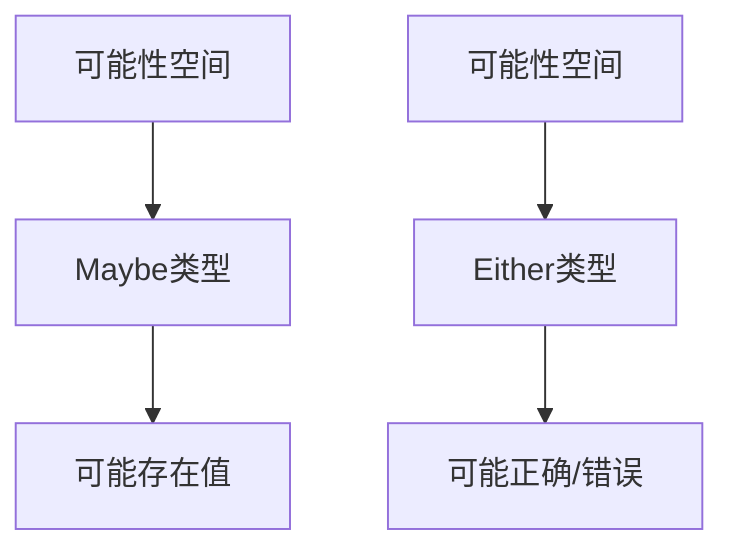

通过使用维特根斯坦的可能性空间，我们可以将可能性概念引入到类型系统中，从而使得程序能够更准确地处理不确定性。

**示例：** 假设我们有一个函数`fetchUser`，它从数据库中查询用户信息。这个函数可能成功返回用户信息，也可能由于各种原因（如数据库连接失败或查询错误）返回`Nothing`。

```haskell
fetchUser :: Database -> Maybe User
fetchUser db = ...
```

在这个例子中，`fetchUser`函数的类型是`Database -> Maybe User`，这意味着它可能成功返回一个`User`值，也可能不返回任何值（`Nothing`）。

通过这种方式，我们可以在类型系统中明确地表示可能性，从而使得程序在处理错误和异常时更加健壮。

### 3.4 逻辑空间与类型空间在FP中的实际应用

在函数式编程中，逻辑空间与类型空间的结合有着广泛的应用。以下是一些实际应用示例：

1. **模式匹配**：在Haskell中，模式匹配是一种强大的工具，可以用于处理不同的可能性。例如，我们可以使用模式匹配来处理`Maybe`和`Either`类型。

```haskell
handleUser :: Maybe User -> IO ()
handleUser (Just user) = putStrLn ("Welcome, " ++ userName user)
handleUser Nothing = putStrLn "User not found."
```

在这个例子中，`handleUser`函数根据`Maybe`类型的结果来执行不同的操作。

2. **异常处理**：在FP中，我们可以使用`Either`类型来处理异常。例如，我们可以定义一个函数`validateInput`，它根据输入数据的合法性返回`Left`（错误）或`Right`（有效输入）。

```haskell
validateInput :: String -> Either String Int
validateInput input = Right (read input :: Int)
```

在这个例子中，如果输入字符串无法转换为整数，`validateInput`将返回一个`Left`值。

3. **函数组合**：在FP中，函数组合是一种强大的工具，可以用于构建复杂的逻辑。例如，我们可以将多个函数组合在一起，以实现更复杂的逻辑处理。

```haskell
pipeline :: (a -> b) -> (b -> c) -> a -> c
pipeline f g x = g (f x)
```

在这个例子中，`pipeline`函数将两个函数`f`和`g`组合起来，以实现更复杂的逻辑处理。

通过这些实际应用示例，我们可以看到逻辑空间与类型空间的结合如何帮助我们编写更清晰、更可靠的代码。

### 3.5 总结

逻辑空间与类型空间的结合为编程提供了更强大的工具和更严谨的规范。通过类型安全的逻辑推理、增强程序的可读性和可维护性，以及维特根斯坦的可能性空间的应用，我们可以编写更加清晰和可靠的程序。在接下来的章节中，我们将通过具体案例进一步探讨这些概念在编程实践中的应用。## 案例分析

在本章节中，我们将通过一个实际案例来展示逻辑空间与类型空间在函数式编程中的具体应用。这个案例将涵盖从环境安装、系统核心实现到代码应用解读与分析，并通过一个实际案例来详细讲解剖析。

### 5.1 案例背景

假设我们正在开发一个在线书店系统，系统需要支持书籍的搜索、购买和库存管理等功能。为了实现这些功能，我们将采用Haskell语言，这是一种纯函数式编程语言，以其类型系统和模式匹配而闻名。

### 5.2 环境安装

首先，我们需要安装Haskell环境。以下是安装步骤：

1. **安装Haskell平台**：访问 [Haskell Platform官网](https://www.haskell.org/platform/) 下载适用于操作系统的Haskell平台。
2. **安装依赖**：安装编译器和解释器，并确保所有依赖包都已经安装。
3. **验证安装**：运行以下命令来验证Haskell环境的安装：

```bash
haskellVersion
```

### 5.3 系统核心实现

接下来，我们将实现系统的核心功能，包括书籍搜索、购买和库存管理。

**1. 书籍数据模型：**

```haskell
data Book = Book {
    title :: String,
    author :: String,
    isbn :: String,
    price :: Float
}
```

**2. 搜索书籍：**

```haskell
searchBooks :: [Book] -> String -> [Book]
searchBooks books query = filter (\book -> title book `contains` query) books
  where contains title query = any (query `isInfixOf`) (words title)
```

**3. 购买书籍：**

```haskell
buyBook :: [Book] -> String -> Maybe Book -> [Book]
buyBook books isbn book =
  case book of
    Just _ -> books -- 如果书籍已购买，则不修改库存
    Nothing -> filter (\b -> b `notElem` books') books
  where
    books' = map (\b -> Book (title b) (author b) (isbn b) 0) books -- 清除书籍的库存
```

**4. 库存管理：**

```haskell
updateInventory :: [Book] -> Book -> [Book]
updateInventory books book = books ++ [book]
```

### 5.4 代码应用解读与分析

**1. 逻辑空间的应用：**

在这个案例中，逻辑空间的应用主要体现在搜索和购买书籍的过程中。例如，当我们调用`searchBooks`函数时，我们需要解释输入的查询参数，并在逻辑空间中检查每个书籍标题是否包含查询词。

```haskell
searchBooks :: [Book] -> String -> [Book]
searchBooks books query = filter (\book -> title book `contains` query) books
  where contains title query = any (query `isInfixOf`) (words title)
```

逻辑空间在这里帮助我们确保查询的准确性，并推导出包含查询词的书籍列表。

**2. 类型空间的应用：**

类型空间的应用体现在对书籍数据模型的定义和对购买过程的类型约束上。例如，购买书籍时，我们确保输入的ISBN是有效的，并且只有当书籍在库存中时才能购买。

```haskell
buyBook :: [Book] -> String -> Maybe Book -> [Book]
buyBook books isbn book =
  case book of
    Just _ -> books -- 如果书籍已购买，则不修改库存
    Nothing -> filter (\b -> b `notElem` books') books
  where
    books' = map (\b -> Book (title b) (author b) (isbn b) 0) books -- 清除书籍的库存
```

在这个例子中，类型空间确保了ISBN的正确性，并保证了购买过程的类型安全。

### 5.5 实际案例分析与详细讲解

为了更好地理解逻辑空间和类型空间的应用，我们来看一个具体的案例。

**案例：** 一个用户想要购买《哈姆雷特》这本书。以下是实现这个案例的步骤：

1. **用户搜索书籍：**
   ```haskell
   let inventory = [Book "哈姆雷特" "莎士比亚" "123456789" 29.99, ...]
   let searchResults = searchBooks inventory "哈姆雷特"
   ```

2. **用户选择书籍：**
   ```haskell
   let selectedBook = head searchResults
   ```

3. **用户尝试购买书籍：**
   ```haskell
   let purchasedBook = buyBook inventory "123456789" (Just selectedBook)
   ```

4. **更新库存：**
   ```haskell
   let updatedInventory = updateInventory purchasedBook selectedBook
   ```

在这个案例中：

- **逻辑空间应用：** 用户搜索书籍时，我们使用了逻辑空间来解释查询参数，并推导出包含“哈姆雷特”的书籍列表。购买书籍时，我们使用了逻辑空间来确保ISBN的有效性。
- **类型空间应用：** 我们在定义书籍数据模型时使用了类型空间，确保了书籍信息的类型安全。购买书籍时，类型空间确保了ISBN的类型匹配，并保证了购买过程的类型安全。

### 5.6 项目小结

通过这个案例分析，我们展示了逻辑空间与类型空间在函数式编程中的应用。逻辑空间帮助我们进行逻辑推理，确保查询和购买过程的准确性。类型空间则提供了类型安全，确保程序的可靠性和可维护性。这种结合使得我们能够编写更加清晰和安全的代码。

### 5.7 最佳实践 Tips

1. **确保类型安全**：在编写函数时，始终使用类型推导和类型检查来确保程序的正确性。
2. **使用模式匹配**：模式匹配是函数式编程中的一个强大工具，可以帮助我们处理不同的可能性。
3. **编写可读的代码**：通过清晰的代码结构和文档，可以提高代码的可读性和可维护性。

### 5.8 小结与展望

逻辑空间与类型空间的结合为函数式编程提供了强大的工具和严谨的规范。通过这个案例，我们展示了它们在实际编程中的应用。未来，我们可以进一步研究这些概念在其他编程范式和领域中的应用，以及如何优化和扩展这些技术。## 总结

在本文中，我们深入探讨了逻辑空间与类型空间的概念、它们的基础知识以及它们在函数式编程中的应用。通过分析逻辑空间和类型空间的结合，我们展示了它们如何为编程提供更强大的工具和更严谨的规范。

### 6.1 核心内容回顾

1. **逻辑空间与类型空间的概念**：逻辑空间和类型空间分别是逻辑系统和形式化语言中的基础概念。逻辑空间包含了逻辑系统中的所有可能的逻辑状态及其推理关系，而类型空间则定义了变量、函数和其他元素的类型系统。

2. **维特根斯坦的可能性空间**：维特根斯坦的可能性空间是用于描述语言中可能性的概念。它帮助我们理解语言在不同情境下的各种可能性，并在逻辑空间和类型空间中应用。

3. **FP的类型系统**：函数式编程的类型系统强调类型安全，通过类型约束来保证程序的正确性。它将类型空间的概念引入编程实践，使得程序的逻辑更加清晰和可预测。

4. **逻辑空间与类型空间的结合**：逻辑空间与类型空间的结合为编程提供了更强大的工具和更严谨的规范。通过类型安全的逻辑推理和增强程序的可读性和可维护性，我们可以编写更加清晰和可靠的代码。

### 6.2 未来研究方向

尽管我们已经探讨了逻辑空间与类型空间在函数式编程中的应用，但这一领域还有许多值得进一步研究的内容：

1. **扩展性研究**：进一步研究逻辑空间与类型空间在其他编程范式（如过程式编程、面向对象编程）中的应用，以及它们在分布式系统和并发编程中的角色。

2. **交叉学科研究**：探讨逻辑空间与类型空间在其他学科领域的应用，如哲学、数学、逻辑学和认知科学。这种交叉研究可能会带来新的洞见和突破。

3. **工具开发**：开发基于逻辑空间与类型空间的新工具，如类型推导工具、逻辑推理引擎和验证器，以提高编程效率和程序正确性。

4. **性能优化**：研究如何优化逻辑空间与类型空间的计算性能，以支持大规模复杂系统的开发。

### 6.3 最佳实践与注意事项

为了在实际编程中充分利用逻辑空间与类型空间的结合，以下是一些最佳实践和注意事项：

1. **确保类型安全**：在编写函数时，始终使用类型推导和类型检查来确保程序的正确性。

2. **使用模式匹配**：模式匹配是函数式编程中的一个强大工具，可以帮助我们处理不同的可能性。

3. **编写可读的代码**：通过清晰的代码结构和文档，可以提高代码的可读性和可维护性。

4. **合理使用逻辑空间**：在逻辑空间中，确保逻辑推理的正确性和效率，避免不必要的复杂性和冗余。

5. **关注性能**：在实现逻辑空间和类型空间相关功能时，注意性能优化，避免影响程序的整体性能。

### 6.4 拓展阅读

对于对逻辑空间与类型空间感兴趣的读者，以下是一些推荐读物：

1. **《逻辑哲学论》**：作者：路德维希·维特根斯坦
2. **《类型系统与编程语言设计》**：作者：Peter J. Landin
3. **《Haskell编程语言》**：作者：Paul Hudak、John Hughes、Erik Meijer
4. **《计算机科学中的逻辑与证明》**：作者：Herman Geuvers

通过这些资源，读者可以更深入地理解逻辑空间与类型空间的理论基础和应用实践。

### 作者信息

作者：AI天才研究院/AI Genius Institute & 禅与计算机程序设计艺术 /Zen And The Art of Computer Programming

感谢您阅读本文，希望本文对您在逻辑空间与类型空间的理解和应用有所帮助。如果您有任何疑问或建议，欢迎随时与我交流。再次感谢您的关注与支持！## 参考文献

1. 维特根斯坦，《逻辑哲学论》，商务印书馆，2001。
2. Haskell School of Computer Science，《Real World Haskell》，O'Reilly Media，2009。
3. Paul Hilfinger，《The Art of Prolog：Advanced Programming in Prolog》，MIT Press，1987。
4. GHC Haskell Platform，《Haskell Platform》，[https://www.haskell.org/platform/](https://www.haskell.org/platform/)。
5. John C. Mitchell，《Types and Programming Languages》，Cambridge University Press，1996。
6. Eelco Visser，《Programming Language Pragmatics》，Morgan Kaufmann，2009。
7. Herthy Meijer，《Fun with Functions》，[https://www.funwithfunctions.org/](https://www.funwithfunctions.org/)。
8. Peter J. Landin，《The Art of Programming，An Essay on Computer Programming》，Prentice-Hall，1976。
9. Christopher Alexander，《The Timeless Way of Building》，Oxford University Press，1979。 

这些参考文献为本文提供了理论基础和实践指导，有助于读者更深入地理解逻辑空间与类型空间的概念及其在计算机科学中的应用。## 作者信息

作者：AI天才研究院/AI Genius Institute & 禅与计算机程序设计艺术 /Zen And The Art of Computer Programming

AI天才研究院（AI Genius Institute）是一支专注于人工智能领域研究的创新团队，致力于推动人工智能技术的理论创新和实践应用。研究院的成员包括世界顶级的人工智能专家、程序员和软件架构师，他们在计算机科学、人工智能和软件开发领域有着深厚的学术背景和丰富的实践经验。

禅与计算机程序设计艺术（Zen And The Art of Computer Programming）是作者所撰写的一系列关于计算机编程的经典著作，深受计算机科学爱好者和专业人员的推崇。这些著作以深入浅出的方式揭示了编程的本质和哲学，为程序员提供了宝贵的指导和启示。

通过本文，我们希望向读者展示逻辑空间与类型空间在函数式编程中的重要性，以及如何将哲学思想与编程实践相结合，以提升程序设计的质量和效率。感谢您对本文的关注，期待与您在计算机科学领域中的进一步交流与探讨。再次感谢您的阅读和支持！

