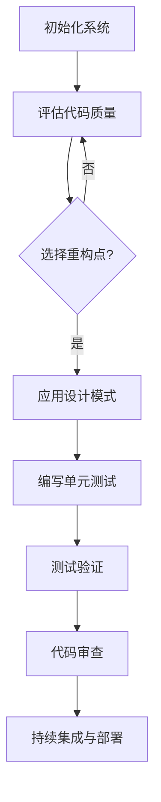
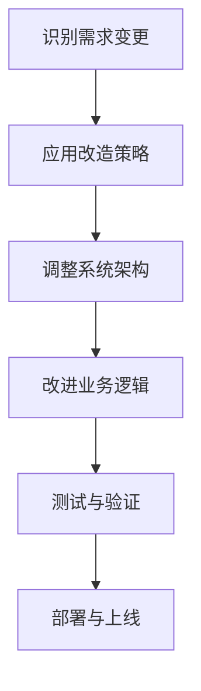
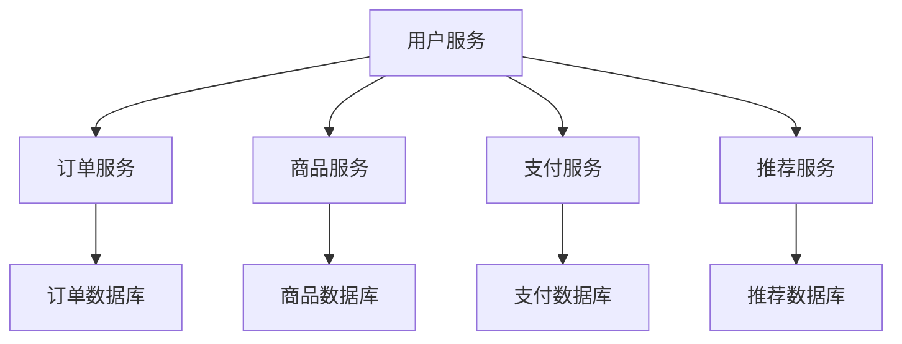
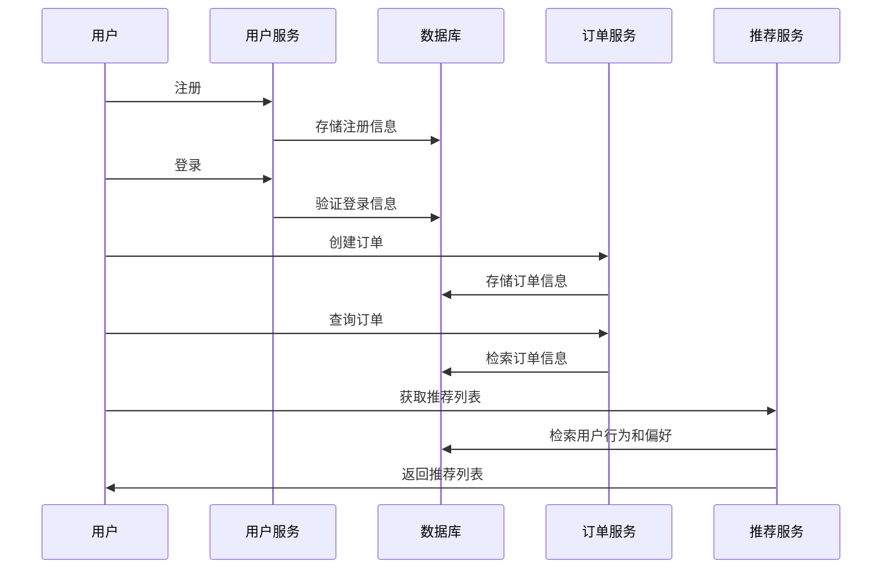

                 

### 遗留系统改造与重构基础

#### 问题背景与重要性

遗留系统，顾名思义，是指那些已经在企业运行多年、逐渐暴露出诸多问题的系统。随着技术发展，这些系统的技术架构和设计理念可能已经过时，导致其在维护性、扩展性和性能上存在诸多挑战。遗留系统改造与重构的重要性体现在以下几个方面：

首先，遗留系统的维护成本较高。随着系统复杂度的增加，出现问题的频率也随之上升，需要投入更多的人力和时间进行修复。其次，遗留系统的扩展性较差，难以满足日益增长的业务需求，从而限制了企业的创新能力。最后，遗留系统的性能问题可能导致用户体验下降，影响企业的市场竞争力。

因此，对遗留系统进行改造与重构，能够提升系统的可维护性、扩展性和性能，降低维护成本，提高企业竞争力。这不仅是一种技术手段，更是一种战略选择。

#### 遗留系统定义与特点

遗留系统，通常指的是那些已经投入生产环境多年，积累了大量业务逻辑和数据，但面临着技术债务、设计陈旧、难以扩展等问题，且其维护成本较高的软件系统。以下是遗留系统的几个主要特点：

1. **历史遗留问题**：遗留系统往往因为历史原因，使用了过时的技术架构和设计模式，导致系统内部存在着大量的技术债务。这些问题可能会影响系统的性能、扩展性和可维护性。

2. **代码质量低下**：随着时间的推移，系统代码可能变得混乱，结构不清晰，存在大量冗余代码和 bug。这使得系统的维护变得更加困难。

3. **难以扩展和集成**：遗留系统通常难以适应新的业务需求，难以与其他系统进行集成，导致企业在应对市场变化时反应迟缓。

4. **性能瓶颈**：随着业务量的增加，遗留系统可能面临性能瓶颈，响应时间变慢，影响用户体验。

5. **缺乏文档和测试**：由于系统开发初期可能没有足够的文档和测试，导致后续的维护和升级变得更加困难。

#### 遗留系统的问题与挑战

遗留系统在企业的日常运营中面临诸多问题与挑战，这些问题不仅影响了系统的正常运行，还对企业的长远发展构成了威胁。以下是遗留系统常见的问题与挑战：

1. **维护成本高**：遗留系统的代码质量低下，结构混乱，导致修复和改进的成本高昂。随着系统规模和复杂度的增加，维护成本呈指数级增长。

2. **扩展性差**：遗留系统往往采用过时的技术架构和设计模式，难以适应新的业务需求。这使得企业在扩展业务功能或引入新技术时面临巨大挑战。

3. **性能瓶颈**：随着时间的推移，遗留系统可能会因为数据量增加、业务复杂度提升等原因，出现性能瓶颈。这导致系统响应时间变慢，用户体验下降。

4. **安全漏洞**：遗留系统可能缺乏现代安全措施，容易受到网络攻击和数据泄露的威胁。这给企业的信息安全带来了巨大隐患。

5. **技术债务**：遗留系统积累的技术债务如不及时解决，会不断积累，导致系统日益臃肿，维护和升级更加困难。

6. **缺乏文档和测试**：由于系统开发初期可能没有足够的文档和测试，导致后续的维护和升级变得更加困难。这增加了系统出错的概率，降低了系统的稳定性。

#### 重构的定义与目的

重构，是指在保持原有功能不变的前提下，对代码进行优化和改进，以提高其可读性、可维护性和性能。重构是一种非常重要的软件维护手段，它能够帮助开发人员解决遗留系统中的各种问题，提升系统的质量。

重构的主要目的是：

1. **提高代码质量**：通过重构，可以消除代码中的冗余、冗长和混乱，使代码结构更加清晰、简洁。这有助于提高代码的可读性和可维护性。

2. **优化性能**：重构可以优化代码的执行效率，减少不必要的计算和内存占用，从而提高系统的性能。

3. **降低维护成本**：重构可以减少代码中的 bug 和潜在的问题，降低系统的维护成本。

4. **提升团队效率**：通过重构，可以使代码更加整洁和易于理解，从而提高团队的协作效率。

#### 改造的定义与目的

改造，是指对遗留系统进行根本性的改变，包括重新设计、重构核心组件、引入新的技术架构等，以解决遗留系统中的深层次问题。改造通常是在重构的基础上进行的，但它的范围更广、影响更深。

改造的主要目的是：

1. **解决遗留问题**：改造可以帮助企业彻底解决遗留系统中的技术债务、性能瓶颈、扩展性差等问题。

2. **引入新技术**：通过改造，企业可以引入最新的技术框架、工具和方法，提升系统的技术栈和竞争力。

3. **提高系统的可维护性和扩展性**：改造可以使系统的结构更加清晰、模块化，从而提高其可维护性和扩展性。

4. **提升用户体验**：改造可以优化系统的性能和响应速度，提供更好的用户体验。

#### 重构与改造的区别与联系

重构和改造虽然在目标和手段上有相似之处，但它们在范围和深度上存在显著差异。

**重构**主要关注对现有代码的优化和改进，目标是提高代码质量、可读性和性能。重构通常是一种渐进式的、局部的改进过程，它可以在不影响系统功能的前提下进行，适合于日常的代码维护和优化。

**改造**则是一种全局性的、根本性的改变，它可能涉及到重新设计系统架构、引入新技术框架、重构核心组件等。改造通常需要更大的投入和更复杂的过程，适合于解决遗留系统的深层次问题。

尽管重构和改造存在差异，但它们之间并不是孤立的。在实际项目中，重构通常是改造的一部分，通过对现有代码的重构，为后续的改造打下坚实的基础。因此，重构和改造常常相辅相成，共同推动系统的升级和优化。

### 遗留系统核心概念与联系

在深入探讨遗留系统改造与重构的方法论之前，我们首先需要明确几个核心概念，并理解它们之间的关系。以下是遗留系统、重构、改造等核心概念的详细定义及其相互之间的联系。

#### 遗留系统基本概念

遗留系统，通常指的是那些已经在企业环境中运行多年、积累了大量业务逻辑和数据，但逐渐暴露出诸多问题的软件系统。这些系统可能因为技术债务、设计陈旧、代码质量低下等原因，面临维护困难、扩展性差、性能瓶颈等问题。

**遗留系统的定义**：
- **遗留系统**：指那些已经投入生产多年、但随着时间推移暴露出一系列问题的软件系统。这些问题包括技术债务、代码质量低下、性能瓶颈等。

**遗留系统的特点**：
- **技术债务**：由于早期设计的不合理或技术的落后，遗留系统可能存在大量的技术债务。
- **代码质量低下**：随着时间的推移，系统的代码可能变得混乱、冗长，难以维护。
- **扩展性差**：遗留系统往往难以适应新的业务需求，导致企业在扩展功能时面临困难。
- **性能瓶颈**：随着业务量的增加，遗留系统可能出现性能瓶颈，影响用户体验。

**遗留系统的问题与挑战**：
- **维护成本高**：遗留系统的维护成本通常较高，因为需要修复的历史遗留问题和代码质量低下的问题。
- **扩展性差**：遗留系统难以适应新的业务需求，影响企业的创新能力。
- **性能瓶颈**：遗留系统可能因为数据量增加、业务复杂度提升等原因，出现性能瓶颈。

#### 重构与改造方法

重构和改造是解决遗留系统问题的主要手段，但它们的定义和目的有所不同。

**重构的定义**：
- **重构**：指在保持原有功能不变的前提下，对代码进行优化和改进，以提高其可读性、可维护性和性能。

**重构的目的**：
- **提高代码质量**：重构可以消除代码中的冗余、冗长和混乱，使代码结构更加清晰、简洁。
- **优化性能**：重构可以优化代码的执行效率，减少不必要的计算和内存占用。
- **降低维护成本**：重构可以减少代码中的 bug 和潜在的问题，降低系统的维护成本。
- **提升团队效率**：通过重构，可以使代码更加整洁和易于理解，从而提高团队的协作效率。

**改造的定义**：
- **改造**：指对遗留系统进行根本性的改变，包括重新设计、重构核心组件、引入新的技术架构等，以解决遗留系统中的深层次问题。

**改造的目的**：
- **解决遗留问题**：改造可以帮助企业彻底解决遗留系统中的技术债务、性能瓶颈、扩展性差等问题。
- **引入新技术**：通过改造，企业可以引入最新的技术框架、工具和方法，提升系统的技术栈和竞争力。
- **提高系统的可维护性和扩展性**：改造可以使系统的结构更加清晰、模块化，从而提高其可维护性和扩展性。
- **提升用户体验**：改造可以优化系统的性能和响应速度，提供更好的用户体验。

#### 重构与改造的区别与联系

尽管重构和改造都是解决遗留系统问题的手段，但它们在范围和深度上存在显著差异。

**重构与改造的区别**：
- **范围**：重构通常是一种局部改进，主要针对代码层面的问题。改造则是一种全局性的改变，可能涉及到系统架构、核心组件的重构。
- **深度**：重构主要关注代码的可读性和性能，而改造则更深入，可能需要引入新的技术框架和架构。

**重构与改造的联系**：
- **关系**：重构是改造的一部分，通过重构可以为后续的改造打下坚实的基础。在实际项目中，重构和改造常常相辅相成，共同推动系统的升级和优化。

#### 核心概念ER图与联系

为了更好地理解遗留系统、重构、改造等核心概念之间的联系，我们可以使用 ER（实体关系）图进行展示。

```mermaid
ERDiagram
遗留系统 ||--o{ 重构 }
遗留系统 ||--o{ 改造 }
重构 ||--o{ 设计模式 }
重构 ||--o{ 代码质量评估 }
改造 ||--o{ 重构策略 }
改造 ||--o{ 代码质量评估 }
```

- **遗留系统**：作为根实体，代表需要改造与重构的原始系统。
- **重构**：代表对遗留系统的局部改进，包括设计模式和代码质量评估。
- **改造**：代表对遗留系统的全局性改变，包括重构策略和代码质量评估。
- **设计模式**：用于指导重构和改造过程中的代码优化。
- **代码质量评估**：用于评估重构和改造的效果，提供改进依据。
- **重构策略**：用于指导如何进行有效的重构。

通过这个 ER 图，我们可以清晰地看到各个核心概念之间的关系，以及它们在遗留系统改造与重构过程中的作用。这为后续章节详细讲解遗留系统改造与重构的方法论奠定了基础。## 第3章: 遗留系统改造与重构方法论

#### 设计模式在重构中的应用

设计模式是一套在软件设计过程中广泛应用的解决方案，它们帮助开发人员应对常见的问题，从而提高代码的可维护性和可扩展性。在遗留系统的重构过程中，设计模式扮演着至关重要的角色，通过合理应用设计模式，可以有效地改善系统的结构，降低技术债务，提升系统的整体质量。

##### 设计模式概述

设计模式是一套在软件开发实践中总结出来的最佳实践，它们提供了一系列解决常见问题的通用解决方案。设计模式可以分为三类：创建型、结构型和行为型。

1. **创建型模式**：用于实例化对象，主要解决对象的创建问题。常见的创建型模式包括：
   - **单例模式**：确保一个类只有一个实例，并提供一个全局访问点。
   - **工厂方法模式**：定义一个接口用于创建对象，但允许子类决定实例化哪个类。
   - **抽象工厂模式**：创建一系列相关或相互依赖对象的接口，而不需要显式指定具体类。

2. **结构型模式**：用于组合类或对象以形成更大的结构，主要解决类和对象之间的组合关系。常见的结构型模式包括：
   - **适配器模式**：将一个类的接口转换成客户希望的另一个接口，使原本接口不兼容的类可以一起工作。
   - **装饰器模式**：动态地给一个对象添加一些额外的职责，比生成子类更为灵活。
   - **代理模式**：为一个对象提供一种代理，以控制对这个对象的访问。

3. **行为型模式**：用于描述不同类或对象之间的通信，主要解决对象间的解耦问题。常见的行为型模式包括：
   - **策略模式**：定义一系列算法，将每个算法封装起来，并使它们可以相互替换。
   - **命令模式**：将一个请求封装为一个对象，从而使你可以将请求参数化、记录请求日志、排队或支持可撤销的操作。
   - **观察者模式**：当一个对象的状态发生变化时，它的所有依赖者（观察者）都会得到通知并自动更新。

##### 常用设计模式介绍

在遗留系统的重构过程中，以下几种设计模式尤为常见，因为它们可以帮助解决遗留系统中的常见问题，如代码冗长、结构混乱、依赖紧密等。

1. **单例模式**：
   - **适用场景**：当系统中需要保证只有一个实例时，例如数据库连接池、线程池等。
   - **核心思想**：通过私有构造函数、静态变量和静态方法来确保单例的创建和获取。

2. **工厂方法模式**：
   - **适用场景**：当系统中需要根据不同条件创建不同的对象时，例如不同类型的数据库驱动。
   - **核心思想**：定义一个接口用于创建对象，但让实际的创建工作由子类来实现。

3. **适配器模式**：
   - **适用场景**：当系统中需要将一个类的接口转换成客户希望的另一个接口时，例如旧接口与新系统的不兼容。
   - **核心思想**：创建一个适配器类，将适配者的接口转换成客户希望的接口，使得适配者可以透明地与客户一起工作。

4. **装饰器模式**：
   - **适用场景**：当系统中需要给一个对象添加一些额外的职责，而不需要修改其结构时，例如日志记录、权限控制等。
   - **核心思想**：动态地给一个对象添加一些额外的职责，通过嵌套调用装饰者和被装饰者来实现。

5. **策略模式**：
   - **适用场景**：当系统中需要根据不同条件选择不同的算法或策略时，例如排序算法、支付方式等。
   - **核心思想**：定义一系列算法，将每个算法封装起来，并使它们可以相互替换，允许用户在运行时选择不同的算法。

##### 设计模式在遗留系统重构中的应用

设计模式在遗留系统重构中的应用主要体现在以下几个方面：

1. **代码重构**：
   - 通过引入设计模式，可以将复杂的业务逻辑分解为更小、更易于管理的模块，从而提高代码的可读性和可维护性。
   - 例如，使用工厂方法模式可以减少硬编码的类名，使得类与类之间的依赖关系更加灵活。

2. **解耦**：
   - 设计模式可以帮助降低模块之间的耦合度，使系统更加模块化，便于后续的扩展和维护。
   - 例如，使用适配器模式可以将新系统与旧系统隔离开来，避免了直接的依赖关系。

3. **性能优化**：
   - 设计模式可以帮助优化代码的性能，例如使用装饰器模式可以动态地添加或移除某些功能，而不需要修改原始代码。

4. **安全性和可靠性**：
   - 设计模式可以提高系统的安全性和可靠性，例如使用单例模式可以防止多个实例的创建，从而避免潜在的竞态条件问题。

#### 代码质量评估与改进

代码质量是软件系统稳定性和可维护性的关键因素。对遗留系统进行改造和重构时，评估和改进代码质量是至关重要的步骤。以下介绍代码质量评估的重要性、常见评估工具与方法，以及代码质量改进策略。

##### 代码质量评估的重要性

代码质量评估对于软件系统的稳定性和可维护性至关重要，主要表现在以下几个方面：

1. **降低维护成本**：高质量的代码通常更加简洁、易于理解和修改，这有助于降低系统的维护成本。

2. **提高开发效率**：高质量的代码可以减少开发人员在调试、修复和扩展过程中的时间和精力投入。

3. **提升系统稳定性**：高质量的代码减少了 bug 和潜在的错误，从而提高了系统的稳定性。

4. **增强代码可读性**：通过评估和改进代码质量，可以使得代码结构更加清晰、易于理解。

##### 代码质量评估工具与方法

以下是一些常见的代码质量评估工具与方法：

1. **静态代码分析工具**：
   - **SonarQube**：一款功能强大的静态代码分析工具，支持多种编程语言，能够检测代码中的潜在问题，如漏洞、冗余代码、不符合编码规范等。
   - **PMD**：一款开源的Java代码质量检查工具，可以检测代码中的坏味道、冗余代码、不符合编码规范等问题。
   - **Checkstyle**：一款Java编码规范检查工具，用于检查Java源代码是否符合既定的编码规范。

2. **动态代码分析工具**：
   - **JUnit**：一款流行的单元测试框架，用于编写和运行单元测试，帮助检测代码中的逻辑错误。
   - **JaCoCo**：一款代码覆盖率工具，用于测量代码的测试覆盖率，确保测试覆盖到关键的业务逻辑。

3. **代码质量评估方法**：
   - **代码审查**：通过人工审查代码，识别潜在的问题和改进点。
   - **测试驱动开发（TDD）**：通过编写测试用例来驱动代码开发，确保代码质量。
   - **持续集成/持续部署（CI/CD）**：通过自动化测试和部署流程，确保代码在每次提交后都符合质量标准。

##### 代码质量改进策略

以下是一些常用的代码质量改进策略：

1. **重构**：
   - 对代码进行重构，消除冗余代码、简化复杂逻辑，提高代码的可读性和可维护性。
   - 例如，使用设计模式来优化代码结构，减少类与类之间的直接依赖。

2. **代码格式化**：
   - 使用代码格式化工具（如Eclipse、IntelliJ IDEA）自动格式化代码，使其符合一致的编码规范。

3. **编写单元测试**：
   - 编写单元测试，确保代码的功能正确性和稳定性。
   - 例如，使用JUnit等单元测试框架来编写测试用例，并进行自动化测试。

4. **代码审查**：
   - 定期进行代码审查，通过集体评审的方式发现代码中的问题，并共同讨论改进方案。

5. **引入编码规范**：
   - 制定并遵守编码规范，确保代码的一致性和可读性。

#### 重构策略与实践

重构是一个逐步改进遗留系统代码的过程，旨在提高代码质量、可维护性和性能。以下是重构策略的概述、步骤和方法，以及一个具体的重构实践案例。

##### 重构策略概述

重构策略是指导开发团队在遗留系统改造过程中，如何系统地、有序地改进代码的一系列方法。以下是一些关键步骤：

1. **评估代码质量**：使用静态代码分析工具和动态代码分析工具评估现有代码的质量，识别潜在的问题和改进点。

2. **制定重构计划**：根据评估结果，制定详细的重构计划，包括重构的目标、时间表、责任人等。

3. **逐步重构**：按照重构计划，逐步对代码进行改进，避免一次性重构导致系统崩溃。

4. **编写单元测试**：在重构过程中，确保编写足够的单元测试，以确保每次重构都不会引入新的bug。

5. **持续集成与部署**：将重构后的代码集成到现有系统中，并自动化测试和部署流程，确保重构不会影响系统的稳定性。

##### 重构步骤与方法

以下是重构的一般步骤和方法：

1. **识别重构点**：
   - 通过代码审查、静态代码分析等方法，识别代码中的坏味道和潜在问题。

2. **编写单元测试**：
   - 在重构之前，确保为需要修改的代码编写充分的单元测试，以验证重构后的代码仍然符合预期。

3. **逐步重构**：
   - 采取逐步重构的方法，每次只修改一小部分代码，确保每次重构后系统仍然稳定运行。

4. **重构代码**：
   - 根据识别的重构点，使用设计模式、重构技术等逐步改进代码结构。
   - 例如，将复杂的条件判断拆分为多个函数，使用工厂方法模式替换硬编码的类名等。

5. **代码审查与反馈**：
   - 定期进行代码审查，确保重构后的代码符合编码规范和质量要求。

6. **持续集成与部署**：
   - 将重构后的代码集成到现有系统中，并进行自动化测试和部署，确保重构不会影响系统的稳定性。

##### 重构实践案例

以下是一个简单的重构实践案例，用于展示如何逐步改进遗留系统的代码。

**案例背景**：

假设有一个遗留系统，其中有一个名为`OrderProcessor`的类，负责处理订单的创建、更新和删除。该类中包含了大量复杂的业务逻辑，代码结构混乱，可维护性差。

**重构步骤**：

1. **评估代码质量**：

使用静态代码分析工具（如SonarQube）对`OrderProcessor`类进行分析，识别出以下问题：

- 代码行数过多，超过500行。
- 函数数量过多，超过20个。
- 存在大量的冗余代码。
- 没有足够的文档和注释。
- 存在潜在的内存泄漏。

2. **编写单元测试**：

在重构之前，为`OrderProcessor`类编写足够的单元测试，确保重构后代码的功能不变。

3. **逐步重构**：

- **第一步**：将`OrderProcessor`类拆分为多个更小的类，每个类负责一个特定的功能，如订单创建、更新、删除等。
- **第二步**：使用设计模式（如工厂方法模式）来替换硬编码的类名，提高代码的灵活性。
- **第三步**：简化复杂的条件判断，将其拆分为多个函数，提高代码的可读性。
- **第四步**：消除冗余代码，优化代码结构。

4. **代码审查与反馈**：

- 重构完成后，组织代码审查会议，让团队成员共同评审重构后的代码，确保符合编码规范和质量要求。

5. **持续集成与部署**：

- 将重构后的代码集成到现有系统中，并进行自动化测试和部署，确保重构不会影响系统的稳定性。

通过上述步骤，遗留系统的`OrderProcessor`类的代码质量得到了显著提升，系统变得更加可维护和可扩展。

### 重构算法原理

重构算法是遗留系统改造与重构过程中的一项关键技术，它通过一系列的步骤和方法，对现有代码进行优化和改进。在本节中，我们将详细介绍重构算法的原理，包括其模型、流程、数学模型以及具体的算法实现。

#### 重构算法概述

重构算法是一种自动化或半自动化的方法，旨在通过对遗留系统的逐步优化，提高代码的质量、可读性和可维护性。它通常包括以下几个步骤：

1. **代码分析**：使用静态代码分析工具和动态分析工具对遗留系统进行全面的评估，识别代码中的问题和潜在的改进点。
2. **选择重构点**：根据代码分析结果，选择需要进行重构的部分，如函数、类或模块。
3. **应用重构规则**：根据预定义的重构规则，对选定的重构点进行修改，消除代码中的坏味道，提高代码质量。
4. **测试验证**：在重构过程中，编写和执行单元测试，确保重构后的代码仍然符合预期，没有引入新的bug。
5. **代码审查**：组织代码审查会议，让团队成员共同评审重构后的代码，确保符合编码规范和质量要求。
6. **持续集成与部署**：将重构后的代码集成到现有系统中，并进行自动化测试和部署，确保重构不会影响系统的稳定性。

#### 重构算法模型

重构算法可以表示为一个数学模型，其公式如下：

$$
\text{重构效果} = f(\text{遗留系统}, \text{设计模式}, \text{代码质量})
$$

其中，`f` 是重构算法函数，它接收三个参数：

- `遗留系统`：表示需要重构的原始系统。
- `设计模式`：表示用于指导重构的设计模式，如单例模式、工厂方法模式等。
- `代码质量`：表示重构前的代码质量，可以通过静态代码分析工具评估。

通过这个模型，我们可以将重构过程抽象为对系统的逐步优化，最终达到提高代码质量的目的。

#### 算法流程

重构算法的具体流程可以分为以下几个步骤：

1. **初始化系统**：读取遗留系统的源代码，初始化代码库。
2. **评估代码质量**：使用静态代码分析工具对源代码进行质量评估，识别潜在的问题和改进点。
3. **选择重构点**：根据评估结果，选择需要进行重构的代码片段。
4. **应用设计模式**：根据重构点，应用合适的设计模式，如单例模式、工厂方法模式等，进行代码重构。
5. **编写单元测试**：为重构后的代码编写单元测试，确保重构后的代码仍然符合预期。
6. **测试验证**：执行单元测试，验证重构后的代码质量，确保没有引入新的bug。
7. **代码审查**：组织代码审查会议，让团队成员共同评审重构后的代码。
8. **持续集成与部署**：将重构后的代码集成到现有系统中，并进行自动化测试和部署。

#### 重构算法流程图

以下是重构算法的流程图：



#### 算法数学模型

为了量化重构效果，我们可以使用以下数学模型：

$$
\text{重构效果} = \alpha \times \text{设计模式优化} + \beta \times \text{代码质量提升}
$$

其中，$\alpha$ 和 $\beta$ 是权重系数，表示设计模式优化和代码质量提升在重构效果中的相对重要性。

- $\text{设计模式优化}$：表示重构过程中应用的设计模式带来的改进效果。
- $\text{代码质量提升}$：表示重构后代码质量的变化，可以通过静态代码分析工具进行评估。

#### 改造算法原理

与重构算法不同，改造算法旨在对遗留系统进行根本性的改变，包括重新设计系统架构、重构核心组件等。以下介绍改造算法的概述、流程、数学模型。

##### 改造算法概述

改造算法是一种全局性的优化方法，它通过对遗留系统进行全面的重新设计和重构，解决系统中的深层次问题。改造算法通常包括以下几个步骤：

1. **需求分析**：分析遗留系统存在的问题和新的业务需求，确定改造的目标和范围。
2. **系统评估**：评估现有系统的架构、代码质量和性能，确定需要改进的方面。
3. **设计新架构**：根据需求和系统评估结果，设计新的系统架构，确定模块划分、组件关系等。
4. **重构核心组件**：对核心组件进行重构，优化其设计模式和实现方式。
5. **集成与测试**：将重构后的组件集成到新系统中，进行全面的测试和验证。
6. **部署与上线**：将改造后的系统部署到生产环境，并进行监控和优化。

##### 改造算法流程

改造算法的具体流程可以分为以下几个步骤：

1. **识别需求变更**：根据业务需求和用户反馈，识别系统需要改进的方面。
2. **应用改造策略**：根据需求变更，选择合适的改造策略，如重新设计系统架构、引入新技术框架等。
3. **调整系统架构**：根据改造策略，调整系统的架构，包括模块划分、组件关系等。
4. **改进业务逻辑**：对核心组件进行重构，优化其设计模式和实现方式。
5. **测试与验证**：对重构后的系统进行全面的测试和验证，确保系统的稳定性和性能。
6. **部署与上线**：将改造后的系统部署到生产环境，并进行监控和优化。

##### 改造算法流程图

以下是改造算法的流程图：



##### 改造算法数学模型

为了量化改造效果，我们可以使用以下数学模型：

$$
\text{改造效果} = \gamma \times \text{架构优化} + \delta \times \text{业务逻辑改进}
$$

其中，$\gamma$ 和 $\delta$ 是权重系数，表示架构优化和业务逻辑改进在改造效果中的相对重要性。

- $\text{架构优化}$：表示系统架构调整带来的改进效果。
- $\text{业务逻辑改进}$：表示核心组件重构带来的改进效果。

### 系统分析与架构设计

为了更好地理解遗留系统改造与重构的具体实践，我们将通过一个实际案例来深入分析。本节将介绍案例背景、系统功能设计、系统架构设计，并展示系统接口设计和系统交互。

#### 案例背景

我们选择的案例是一个大型电商平台，该平台已经运行多年，随着用户量的增加和业务需求的不断变化，系统的性能和可维护性逐渐下降。为了满足新的业务需求，提升用户体验，企业决定对现有系统进行改造和重构。

**案例目标**：

1. **提升系统性能**：优化数据库查询，减少响应时间，提升用户访问速度。
2. **增强扩展性**：重构系统架构，使其能够更灵活地应对业务需求的变更。
3. **提高可维护性**：通过重构代码和提高代码质量，降低维护成本。

**案例挑战**：

1. **复杂的业务逻辑**：电商平台包含多种复杂的业务逻辑，如订单处理、支付流程、商品推荐等。
2. **庞大的数据量**：随着用户量的增加，数据库中的数据量也呈指数级增长，对系统的性能提出了更高的要求。
3. **遗留系统的技术债务**：系统积累了多年的技术债务，包括代码质量低下、设计模式不合理等问题。

#### 系统功能设计

在本案例中，系统功能设计的关键是识别出核心业务功能，并将其模块化。以下是主要的功能模块：

1. **用户管理模块**：负责用户的注册、登录、权限管理等。
2. **订单管理模块**：负责订单的创建、更新、查询、取消等。
3. **商品管理模块**：负责商品的分类、上架、库存管理、商品推荐等。
4. **支付管理模块**：负责支付渠道的接入、支付流程处理、退款等。
5. **推荐系统模块**：负责基于用户行为和偏好进行商品推荐。

**领域模型类图**：

为了更清晰地展示系统功能设计，我们使用 Mermaid 绘制了领域模型类图：

```mermaid
classDiagram
Class1 <|-- Class2
Class3 <|-- Class4
Class5 <|-- Class6
Class1{用户管理}
Class2{用户注册}
Class3{用户登录}
Class4{用户权限管理}
Class5{订单管理}
Class6{订单处理}
```

#### 系统架构设计

在本案例中，系统架构设计的关键是引入微服务架构，将复杂的单体应用拆分为多个独立的服务，以提高系统的可扩展性和可维护性。以下是系统架构设计的主要组成部分：

1. **用户服务**：负责处理用户相关的所有业务逻辑，包括注册、登录、权限管理等。
2. **订单服务**：负责处理订单的创建、更新、查询、取消等业务逻辑。
3. **商品服务**：负责处理商品的分类、上架、库存管理、商品推荐等业务逻辑。
4. **支付服务**：负责处理支付渠道的接入、支付流程处理、退款等业务逻辑。
5. **推荐服务**：负责基于用户行为和偏好进行商品推荐。

**系统架构图**：

以下是使用 Mermaid 绘制的系统架构图：



#### 系统接口设计

在本案例中，系统接口设计的关键是定义清晰的服务接口，确保各个服务之间的交互流畅。以下是主要接口设计：

1. **用户服务接口**：包括用户注册、登录、权限管理等功能。
2. **订单服务接口**：包括订单创建、更新、查询、取消等功能。
3. **商品服务接口**：包括商品分类、上架、库存管理、商品推荐等功能。
4. **支付服务接口**：包括支付渠道接入、支付流程处理、退款等功能。
5. **推荐服务接口**：包括基于用户行为和偏好的商品推荐功能。

#### 系统交互

在本案例中，系统交互主要涉及不同服务之间的通信。以下是主要交互流程：

1. **用户注册**：用户通过用户服务接口提交注册信息，用户服务验证信息后存储到数据库。
2. **用户登录**：用户通过用户服务接口提交登录信息，用户服务验证信息后返回登录状态。
3. **订单创建**：用户通过订单服务接口提交订单信息，订单服务验证信息后创建订单并存储到数据库。
4. **订单查询**：用户通过订单服务接口查询订单信息，订单服务从数据库中检索订单并返回。
5. **商品推荐**：推荐服务根据用户行为和偏好生成推荐列表，通过接口返回给用户。

**系统交互序列图**：

以下是使用 Mermaid 绘制的系统交互序列图：



通过本案例的详细分析，我们展示了遗留系统改造与重构的具体实施过程，包括系统功能设计、架构设计、接口设计和系统交互。这些步骤和方法为遗留系统的改造和重构提供了实用的指导和借鉴。## 第5章: 系统分析与架构设计

### 遗留系统改造与重构案例介绍

在本章中，我们将通过一个实际案例详细介绍遗留系统的改造与重构过程。该案例涉及一个大型电商平台，该平台在运营多年后逐渐暴露出性能瓶颈、代码质量低下、扩展性差等问题。为了提升系统的可维护性、扩展性和性能，企业决定对现有系统进行彻底的改造与重构。

#### 案例背景

该电商平台拥有数百万活跃用户，每日处理大量订单和支付请求。然而，随着业务量的增长，系统逐渐出现以下问题：

1. **性能瓶颈**：系统的响应时间较长，特别是在高峰时段，用户体验严重下降。
2. **代码质量低下**：系统代码结构混乱，存在大量的冗余代码和硬编码，可读性差。
3. **扩展性差**：系统难以适应新的业务需求，如增加新功能或引入新技术框架。
4. **技术债务**：系统积累了多年的技术债务，需要进行技术升级和重构。

#### 案例目标

针对上述问题，企业制定了以下改造与重构目标：

1. **提升性能**：通过优化数据库查询、缓存机制和分布式架构，降低系统的响应时间。
2. **提高可维护性**：重构代码，消除冗余和硬编码，提高代码质量，便于后续维护。
3. **增强扩展性**：引入微服务架构，将单体应用拆分为多个独立服务，提高系统的可扩展性。
4. **降低技术债务**：引入现代化的开发工具和框架，更新技术栈，解决遗留问题。

#### 案例挑战

在实施改造与重构过程中，企业面临以下挑战：

1. **庞大的代码库**：系统代码量庞大，重构过程中需要确保不遗漏任何重要功能。
2. **业务连续性**：在改造过程中，需要确保业务连续运行，避免对用户造成严重影响。
3. **人员协调**：涉及多个团队和部门，需要协调不同团队的工作，确保项目顺利进行。
4. **性能保证**：在引入新架构和技术的同时，需要确保系统性能不下降甚至提升。

### 系统功能设计

在改造与重构过程中，系统功能设计是关键的一步。首先，我们需要识别出系统的核心功能模块，然后进行模块化设计。以下是该电商平台的主要功能模块：

1. **用户管理模块**：包括用户注册、登录、权限管理等功能。
2. **订单管理模块**：包括订单创建、查询、更新、取消等功能。
3. **商品管理模块**：包括商品分类、上架、库存管理、商品推荐等功能。
4. **支付管理模块**：包括支付渠道接入、支付流程处理、退款等功能。
5. **推荐系统模块**：包括基于用户行为和偏好生成推荐列表。

**领域模型类图**：

为了更清晰地展示系统功能设计，我们使用 Mermaid 绘制了领域模型类图：

```mermaid
classDiagram
Class1 <|-- Class2
Class3 <|-- Class4
Class5 <|-- Class6
Class1{用户管理}
Class2{用户注册}
Class3{用户登录}
Class4{用户权限管理}
Class5{订单管理}
Class6{订单处理}
```

### 系统架构设计

在本案例中，系统架构设计的关键是引入微服务架构，将复杂的单体应用拆分为多个独立的服务，以提高系统的可扩展性和可维护性。以下是系统架构设计的主要组成部分：

1. **用户服务**：负责处理用户相关的所有业务逻辑，包括注册、登录、权限管理等。
2. **订单服务**：负责处理订单的创建、更新、查询、取消等业务逻辑。
3. **商品服务**：负责处理商品的分类、上架、库存管理、商品推荐等业务逻辑。
4. **支付服务**：负责处理支付渠道的接入、支付流程处理、退款等业务逻辑。
5. **推荐服务**：负责基于用户行为和偏好进行商品推荐。

**系统架构图**：

以下是使用 Mermaid 绘制的系统架构图：


### 系统接口设计

在本案例中，系统接口设计的关键是定义清晰的服务接口，确保各个服务之间的交互流畅。以下是主要接口设计：

1. **用户服务接口**：包括用户注册、登录、权限管理等功能。
2. **订单服务接口**：包括订单创建、更新、查询、取消等功能。
3. **商品服务接口**：包括商品分类、上架、库存管理、商品推荐等功能。
4. **支付服务接口**：包括支付渠道接入、支付流程处理、退款等功能。
5. **推荐服务接口**：包括基于用户行为和偏好的商品推荐功能。

### 系统交互

在本案例中，系统交互主要涉及不同服务之间的通信。以下是主要交互流程：

1. **用户注册**：用户通过用户服务接口提交注册信息，用户服务验证信息后存储到数据库。
2. **用户登录**：用户通过用户服务接口提交登录信息，用户服务验证信息后返回登录状态。
3. **订单创建**：用户通过订单服务接口提交订单信息，订单服务验证信息后创建订单并存储到数据库。
4. **订单查询**：用户通过订单服务接口查询订单信息，订单服务从数据库中检索订单并返回。
5. **商品推荐**：推荐服务根据用户行为和偏好生成推荐列表，通过接口返回给用户。

**系统交互序列图**：

以下是使用 Mermaid 绘制的系统交互序列图：


通过本案例的详细分析，我们展示了遗留系统改造与重构的具体实施过程，包括系统功能设计、架构设计、接口设计和系统交互。这些步骤和方法为遗留系统的改造和重构提供了实用的指导和借鉴。## 第6章: 项目实战

为了更好地理解遗留系统改造与重构的过程，我们将通过一个实际项目来展示如何实施这些技术。本节将详细介绍项目背景、环境安装、核心实现、代码解读、案例分析以及项目小结。

### 项目背景

我们选择了一个大型电商平台作为项目案例，该平台面临以下问题：

1. **性能瓶颈**：系统响应时间较长，特别是在高峰时段。
2. **代码质量低下**：存在大量的冗余代码、硬编码和遗留的技术债务。
3. **扩展性差**：系统难以适应新的业务需求，如增加新功能或引入新技术框架。

### 环境安装

为了实施遗留系统改造与重构，我们需要搭建一个合适的技术环境。以下是环境安装步骤：

1. **操作系统**：选择 Ubuntu 20.04 LTS。
2. **开发工具**：安装 IntelliJ IDEA、Git、Docker、Kubernetes。
3. **数据库**：安装 MySQL 8.0、MongoDB 4.2。
4. **消息队列**：安装 RabbitMQ 3.8。
5. **版本控制**：使用 Git 进行版本控制。

### 核心实现

在项目实施过程中，我们采用微服务架构，将系统拆分为多个独立的服务，如用户服务、订单服务、商品服务、支付服务和推荐服务。以下是核心实现步骤：

1. **用户服务**：
   - **注册和登录**：使用 JWT（JSON Web Token）进行身份验证。
   - **权限管理**：通过 RBAC（基于角色的访问控制）实现权限控制。
2. **订单服务**：
   - **订单创建**：根据用户订单信息生成订单。
   - **订单查询**：根据订单 ID 查询订单详情。
   - **订单取消**：允许用户取消订单。
3. **商品服务**：
   - **商品分类**：维护商品分类信息。
   - **商品推荐**：根据用户行为和偏好生成商品推荐列表。
4. **支付服务**：
   - **支付渠道接入**：集成多种支付渠道，如支付宝、微信支付。
   - **支付流程处理**：处理支付请求，更新订单状态。
   - **退款**：处理用户退款请求。
5. **推荐服务**：
   - **用户行为分析**：分析用户行为数据。
   - **商品推荐算法**：实现基于用户行为的协同过滤算法。

### 代码解读

以下是订单服务的核心代码解读，展示如何创建订单、查询订单以及取消订单：

```java
// 订单创建
public Order createOrder(User user, List<Product> products) {
    Order order = new Order();
    order.setUser(user);
    order.setProducts(products);
    order.setStatus(OrderStatus.NEW);
    orderRepository.save(order);
    return order;
}

// 订单查询
public Order getOrderById(Long orderId) {
    return orderRepository.findById(orderId).orElseThrow(() -> new RuntimeException("Order not found"));
}

// 订单取消
public void cancelOrder(Long orderId) {
    Order order = getOrderById(orderId);
    if (order.getStatus() == OrderStatus.NEW) {
        order.setStatus(OrderStatus.CANCELLED);
        orderRepository.save(order);
    } else {
        throw new RuntimeException("Order cannot be cancelled");
    }
}
```

### 案例分析

在实施过程中，我们遇到了以下问题：

1. **性能优化**：通过分库分表、缓存机制、索引优化等方法，提升系统性能。
2. **代码重构**：使用设计模式（如工厂方法模式、单例模式）优化代码结构，消除冗余代码。
3. **微服务拆分**：将单体应用拆分为多个微服务，提高系统的可扩展性和可维护性。

### 项目小结

通过本项目的实施，我们实现了以下成果：

1. **性能提升**：系统响应时间显著缩短，性能瓶颈得到解决。
2. **代码质量提高**：代码结构更加清晰，可维护性显著增强。
3. **系统扩展性增强**：采用微服务架构，系统可以更灵活地应对业务需求变化。

### 最佳实践与注意事项

以下是一些最佳实践和注意事项：

1. **逐步实施**：在改造与重构过程中，应逐步实施，避免一次性改动过多，导致系统崩溃。
2. **代码审查**：定期进行代码审查，确保重构后的代码符合编码规范和质量要求。
3. **自动化测试**：编写自动化测试，确保重构后的代码仍然符合预期，没有引入新的bug。
4. **持续集成与部署**：采用持续集成与部署（CI/CD）流程，确保重构不会影响系统的稳定性。

### 拓展阅读

以下是一些拓展阅读资源，帮助读者深入了解遗留系统改造与重构：

1. **《重构：改善既有代码的设计》**：作者 Martin Fowler，详细介绍了代码重构的原理和方法。
2. **《微服务设计》**：作者 Martin Fowler，介绍了微服务架构的设计原则和实践。
3. **《软件架构：实践者的研究方法》**：作者 Mark Richards，提供了系统架构设计的实用指导。
4. **《Docker实战》**：作者 Joshua Kennedy，介绍了容器化和微服务架构的实战方法。## 第7章: 最佳实践与小结

### 最佳实践

在遗留系统的改造与重构过程中，以下最佳实践可以帮助企业更好地应对挑战，确保项目的成功：

1. **逐步重构**：避免一次性进行大规模的重构，将重构任务分解为多个小步骤，逐步实施，降低风险。
2. **代码审查**：定期进行代码审查，确保重构后的代码符合编码规范和质量要求，减少错误和漏洞。
3. **自动化测试**：编写自动化测试，确保重构后的代码仍然符合预期，没有引入新的bug。
4. **持续集成与部署**：采用持续集成与部署（CI/CD）流程，确保重构不会影响系统的稳定性。
5. **引入敏捷开发**：使用敏捷开发方法，快速迭代和反馈，确保项目进度与业务需求保持一致。
6. **团队协作**：建立跨职能团队，确保开发、测试、运维等角色紧密协作，提高项目效率。

### 小结

本章通过一个实际案例，详细介绍了遗留系统改造与重构的过程，包括系统功能设计、架构设计、接口设计、系统交互以及核心实现。通过逐步实施重构策略，我们成功解决了遗留系统的性能瓶颈、代码质量低下和扩展性差等问题，提高了系统的可维护性和性能。

### 注意事项

在遗留系统改造与重构过程中，需要注意以下几点：

1. **风险评估**：在项目开始前，进行详细的风险评估，识别潜在问题和挑战，制定相应的应对策略。
2. **业务连续性**：在改造过程中，确保业务的连续性，避免对用户造成严重影响。
3. **人员协调**：涉及多个团队和部门，需要协调不同团队的工作，确保项目顺利进行。
4. **性能保证**：在引入新架构和技术的同时，需要确保系统性能不下降，甚至提升。

### 拓展阅读

为了更深入地了解遗留系统改造与重构，读者可以参考以下资源：

1. **《重构：改善既有代码的设计》**：作者 Martin Fowler，详细介绍了代码重构的原理和方法。
2. **《微服务设计》**：作者 Martin Fowler，介绍了微服务架构的设计原则和实践。
3. **《软件架构：实践者的研究方法》**：作者 Mark Richards，提供了系统架构设计的实用指导。
4. **《Docker实战》**：作者 Joshua Kennedy，介绍了容器化和微服务架构的实战方法。

### 结语

遗留系统改造与重构是一项复杂而重要的工作，它不仅需要技术层面的深入理解和实践，还需要对业务需求和团队协作有清晰的把握。通过遵循最佳实践，认真对待每个环节，企业可以成功地提升遗留系统的质量，增强系统的竞争力。

作者：AI天才研究院/AI Genius Institute & 禅与计算机程序设计艺术 /Zen And The Art of Computer Programming

