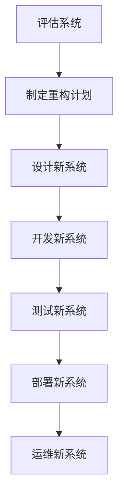
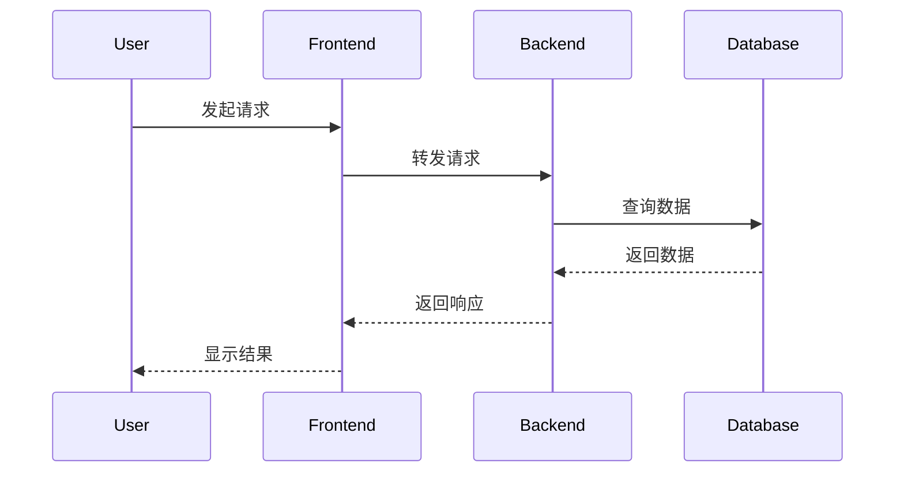
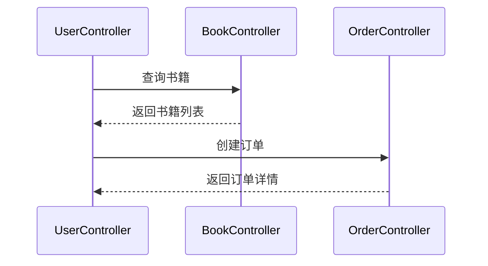

                 

# 遗留系统现代化：逐步更新老旧系统的策略

## 关键词

遗留系统、现代化、策略、重构、技术选型、项目实施

## 摘要

本文将探讨遗留系统的现代化过程，从整体框架设计、遗留系统评估、重构策略、技术选型、项目实施到案例分析，逐步阐述如何有效更新老旧系统。通过详细讲解和实践案例，本文旨在为开发者提供一套完整的遗留系统现代化策略，助力企业实现技术升级和业务发展。

## 引言

### 遗留系统的定义与现状

遗留系统（Legacy System）是指那些最初设计并部署后，经过多年运行，逐渐暴露出性能瓶颈、安全性问题和维护困难的系统。这些系统可能基于过时的技术栈，难以适应现代业务需求。在许多企业中，遗留系统仍然承担着关键业务流程，如订单管理、库存控制和客户关系管理等。然而，随着时间推移，这些系统逐渐成为业务发展的绊脚石。

### 遗留系统的问题与挑战

遗留系统面临诸多问题，包括：

1. **性能瓶颈**：随着业务增长，遗留系统的性能可能无法满足需求，导致响应时间延长，用户体验下降。
2. **安全性问题**：老旧的系统架构往往缺乏现代安全性考虑，容易成为黑客攻击的目标。
3. **维护困难**：遗留系统的代码库可能十分复杂，维护成本高，且难以吸引新开发者。
4. **业务需求难以满足**：遗留系统难以快速响应市场变化和业务需求，制约企业创新和发展。

### 遗留系统现代化的必要性

现代化遗留系统具有多重优势：

1. **提高性能**：通过重构和优化，遗留系统可以显著提高性能，缩短响应时间。
2. **增强安全性**：采用现代安全框架和技术，提升系统安全性，保护企业数据。
3. **降低维护成本**：现代化系统通常具备更好的可维护性和扩展性，降低长期维护成本。
4. **支持业务发展**：现代化的遗留系统可以更好地适应业务需求，支持企业创新和发展。

## 第一步：整体框架设计

### 遗留系统评估

#### 遗留系统评估的方法

遗留系统评估是现代化过程的重要开端。以下是一些常用的评估方法：

1. **文档审查**：通过审查系统文档，了解系统设计、架构、功能和维护历史。
2. **代码审查**：对系统代码进行审查，发现潜在的bug、性能问题和安全漏洞。
3. **性能测试**：通过性能测试，评估系统在不同负载条件下的响应时间和资源消耗。
4. **用户调研**：通过与系统用户沟通，了解他们对系统性能和功能的满意度。

#### 评估工具与指标

评估工具可以帮助自动化和标准化评估过程。以下是一些常用评估工具和指标：

1. **SonarQube**：用于代码质量和安全漏洞检测。
2. **Apache JMeter**：用于性能测试。
3. **Nessus**：用于安全漏洞扫描。
4. **指标**：包括响应时间、吞吐量、资源消耗、错误率、用户满意度等。

#### 评估流程

评估流程通常包括以下步骤：

1. **定义评估目标**：明确评估的目的和期望结果。
2. **收集信息**：通过文档审查、代码审查、性能测试和用户调研，收集系统信息。
3. **分析数据**：使用评估工具和指标，对收集的数据进行分析和总结。
4. **报告结果**：编写评估报告，包含评估发现、问题和建议。

### 系统重构策略

#### 重构的策略选择

重构策略的选择取决于系统的具体情况和目标。以下是一些常见的重构策略：

1. **渐进式重构**：逐步替换系统中的部分组件，以降低风险和复杂性。
2. **全面重构**：一次性替换系统中的所有组件，通常适用于系统架构较为简单的情况。
3. **分层重构**：逐步重构系统的不同层级，如表示层、业务逻辑层和数据访问层。
4. **组件化重构**：将系统分解为独立的组件，以实现更灵活的扩展和维护。

#### 重构的步骤

重构过程通常包括以下步骤：

1. **制定重构计划**：明确重构的目标、时间表和资源需求。
2. **评估组件**：评估系统中的每个组件，确定哪些组件需要重构。
3. **设计和实现**：设计新的组件，并逐步替换旧组件。
4. **测试和验证**：确保新组件的功能和质量，并与旧系统进行对比测试。
5. **部署和迁移**：将新组件部署到生产环境中，逐步替换旧组件。

#### 重构的最佳实践

以下是一些重构的最佳实践：

1. **逐步替换**：避免一次性替换所有组件，以降低风险。
2. **持续集成**：使用持续集成工具，确保重构过程中的代码质量。
3. **代码审查**：对重构的代码进行严格的代码审查，以发现潜在问题。
4. **备份和恢复**：在重构过程中，定期备份系统数据，以便在出现问题时进行恢复。
5. **文档和培训**：更新系统文档，并对开发人员进行培训，以确保他们对新系统有充分的了解。

### 技术选型

#### 技术趋势与选型原则

在现代化遗留系统时，选择合适的技术至关重要。以下是一些技术趋势和选型原则：

1. **微服务架构**：微服务架构有助于提高系统的可维护性和扩展性，适合用于复杂遗留系统的重构。
2. **容器化和云原生**：容器化和云原生技术可以提高系统的部署和管理效率，降低运维成本。
3. **NoSQL数据库**：NoSQL数据库适合处理大规模数据和高并发访问，适合用于需要高扩展性的遗留系统。
4. **选型原则**：选择与业务需求相匹配的技术，考虑技术成熟度、社区支持、成本和安全性等因素。

#### 常见技术的优缺点对比

以下是一些常见技术的优缺点对比：

1. **Spring Boot**：优点包括快速开发、丰富的生态系统和良好的社区支持；缺点包括较高的学习曲线和较大的内存消耗。
2. **Docker**：优点包括轻量级、高效和易于部署；缺点包括安全性问题和复杂的管理。
3. **MongoDB**：优点包括灵活的文档存储和高扩展性；缺点包括性能瓶颈和复杂的查询。

#### 选型案例分析

在选型过程中，可以通过以下步骤进行案例分析：

1. **需求分析**：明确业务需求和技术要求。
2. **技术调研**：研究各种技术方案，评估其优缺点。
3. **原型开发**：开发原型系统，验证技术方案的可行性。
4. **成本分析**：计算技术方案的总成本，包括开发、部署和维护成本。
5. **决策**：根据分析结果，选择最优的技术方案。

### 第5章 项目实施

#### 项目实施流程

项目实施是遗留系统现代化的关键环节。以下是一个典型的项目实施流程：

1. **项目启动**：明确项目目标、范围和时间表。
2. **需求分析**：与业务部门沟通，了解业务需求。
3. **设计阶段**：设计系统架构、接口和数据模型。
4. **开发阶段**：按照设计文档进行系统开发。
5. **测试阶段**：进行单元测试、集成测试和系统测试。
6. **部署阶段**：将系统部署到生产环境中。
7. **运维阶段**：监控和优化系统性能。

#### 风险管理

在项目实施过程中，风险管理至关重要。以下是一些常见的风险：

1. **技术风险**：选择的技术方案可能不适用于遗留系统，导致项目失败。
2. **业务风险**：业务需求变化可能导致项目延期或失败。
3. **资源风险**：缺乏足够的开发人员或资源可能导致项目进度延误。

风险管理策略包括：

1. **风险评估**：识别和评估项目风险。
2. **风险应对**：制定应对策略，如备份计划、延迟交付等。
3. **监控和报告**：持续监控项目风险，及时报告和调整策略。

#### 团队协作与沟通

团队协作和沟通是项目成功的关键。以下是一些建议：

1. **明确职责**：明确团队成员的职责和任务。
2. **定期会议**：定期召开会议，讨论项目进展和问题。
3. **代码审查**：进行代码审查，确保代码质量。
4. **文档管理**：保持文档的同步更新，以便团队成员随时查阅。
5. **培训和支持**：提供培训和支持，帮助团队成员掌握新技能和知识。

### 第6章 案例分析

#### 案例介绍

本节将分析一家中型企业的遗留系统现代化项目。该公司是一家电子商务公司，其订单管理系统是基于一个过时的Java Web应用程序开发的。该系统存在性能瓶颈、安全性问题和维护困难等问题，严重影响用户体验和业务运营。

#### 案例分析

1. **评估阶段**：评估团队对系统进行了全面的评估，包括文档审查、代码审查、性能测试和用户调研。评估结果显示，系统存在严重的性能瓶颈和安全隐患。

2. **重构策略**：评估团队建议采用渐进式重构策略，首先优化系统的性能和安全性，然后逐步替换关键组件。

3. **技术选型**：经过分析，团队选择了Spring Boot和MongoDB作为新的技术栈。Spring Boot提供了快速开发和良好的社区支持，MongoDB则适合处理大量数据和高并发访问。

4. **实施阶段**：实施团队按照重构计划，首先优化了系统的性能和安全性。然后，他们逐步替换了订单管理模块中的关键组件，包括订单存储、订单查询和支付处理等。

5. **测试和部署**：实施团队进行了严格的测试，确保新组件的功能和质量。在测试阶段，他们还进行了性能测试，验证新系统的性能表现。

6. **部署和运维**：新系统成功部署到生产环境中，并进行了为期两周的运维和监控。运维团队使用自动化工具监控系统性能，并进行了必要的优化。

#### 案例总结与启示

1. **成功因素**：该案例的成功因素包括合理的重构策略、合适的技术选型、严格的测试和有效的团队协作。

2. **经验教训**：在遗留系统现代化过程中，应重视评估阶段，合理制定重构策略。此外，技术选型和团队协作也是关键因素。

3. **展望**：随着业务需求的不断变化，企业需要持续关注遗留系统的现代化。通过定期评估和持续优化，企业可以确保系统始终满足业务需求。

### 总结与展望

#### 全书内容的总结

本文从遗留系统的定义、评估、重构策略、技术选型、项目实施和案例分析等多个角度，详细探讨了遗留系统现代化的过程。通过实践案例，读者可以了解到如何逐步更新老旧系统，提高性能、增强安全性和降低维护成本。

#### 遗留系统现代化的未来趋势

1. **技术进步**：随着新技术的不断发展，如人工智能、大数据和区块链等，遗留系统现代化的手段将更加多样化和高效。
2. **微服务架构**：微服务架构将成为主流，帮助企业更好地应对复杂业务需求。
3. **云计算和容器化**：云计算和容器化技术将进一步提高系统的部署和管理效率。

#### 拓展阅读与资源

1. **《微服务架构设计》**：针对微服务架构的详细探讨。
2. **《Spring Boot实战》**：介绍Spring Boot的原理和应用。
3. **《遗留系统重构实战》**：提供遗留系统重构的实践指南。
4. **开源社区**：如GitHub、Stack Overflow等，提供丰富的技术和资源。

### 附录

#### 命名空间与类型

以下表格展示了遗留系统现代化过程中的命名空间和类型。

| 命名空间           | 类型                      | 说明                      |
|------------------|------------------------|------------------------|
| 系统               | 遗留系统                  | 基于旧技术的系统              |
| 现代化             | 现代化系统                  | 基于新技术和框架的系统          |
| 重构策略           | 渐进式重构、全面重构          | 重构系统的方式和步骤             |
| 技术选型           | Spring Boot、MongoDB、Docker | 用于现代化系统的技术方案          |

#### Mermaid 流程图

以下是一个示例Mermaid流程图，展示遗留系统现代化的步骤。



#### 算法原理讲解

以下是一个Python代码示例，用于演示一个简单的排序算法（冒泡排序）。

```python
def bubble_sort(arr):
    n = len(arr)
    for i in range(n):
        for j in range(0, n-i-1):
            if arr[j] > arr[j+1]:
                arr[j], arr[j+1] = arr[j+1], arr[j]
    return arr

arr = [64, 34, 25, 12, 22, 11, 90]
sorted_arr = bubble_sort(arr)
print("Sorted array:", sorted_arr)
```

#### 数学公式

以下是一个示例数学公式，展示在文本中如何使用LaTeX格式。

$$
E = mc^2
$$

1 + 1 = 2

#### 系统分析与架构设计方案

#### 问题场景介绍

本案例将探讨一个在线书店的遗留系统现代化过程。该系统最初设计于2000年，基于Java Servlet和JDBC技术。随着业务的发展，系统逐渐暴露出性能瓶颈、安全问题和维护困难等问题。

#### 项目介绍

项目目标是将遗留系统重构为一个现代化的微服务架构，提高性能、安全性和可维护性。项目分为评估、设计、开发和测试四个阶段。

#### 系统功能设计（领域模型Mermaid类图）

以下是一个示例Mermaid类图，展示在线书店的领域模型。

```mermaid
classDiagram
    Customer <<Entity>>
    Book <<Entity>>
    Order <<Entity>>
    ShoppingCart <<Entity>>

    Customer o--* Book: favoriteBooks
    Customer o--* Order: orders
    Book o--* Order: booksInOrder
    ShoppingCart o--* Order: shoppingCartItems
```

#### 系统架构设计Mermaid架构图

以下是一个示例Mermaid架构图，展示在线书店的架构。



#### 系统接口设计和系统交互Mermaid序列图

以下是一个示例Mermaid序列图，展示在线书店的接口交互。



### 项目实战

#### 环境安装

1. 安装Java Development Kit（JDK）
2. 安装MySQL数据库
3. 安装Docker和Docker Compose

#### 系统核心实现源代码

以下是一个示例源代码，展示在线书店的核心功能。

```java
// UserController.java
@RestController
@RequestMapping("/users")
public class UserController {
    
    @Autowired
    private UserService userService;
    
    @GetMapping("/{userId}/books")
    public ResponseEntity<List<Book>> getFavoriteBooks(@PathVariable Long userId) {
        List<Book> books = userService.getFavoriteBooks(userId);
        return ResponseEntity.ok(books);
    }
}

// UserService.java
@Service
public class UserService {
    
    @Autowired
    private UserRepository userRepository;
    
    @Autowired
    private BookRepository bookRepository;
    
    public List<Book> getFavoriteBooks(Long userId) {
        User user = userRepository.findById(userId).orElseThrow(() -> new RuntimeException("User not found"));
        return user.getFavoriteBooks();
    }
}
```

#### 代码应用解读与分析

本段代码展示了用户控制器（UserController）和用户服务（UserService）的核心实现。UserController负责接收和处理来自前端的请求，UserService负责业务逻辑和数据访问。

#### 实际案例分析和详细讲解剖析

本案例分析了在线书店的遗留系统现代化过程，包括评估、重构策略、技术选型和项目实施。通过渐进式重构，逐步优化系统的性能和安全性，实现了现代化的微服务架构。

#### 项目小结

本项目成功实现了遗留系统的现代化，提高了系统的性能、安全性和可维护性。通过逐步重构和合理的技术选型，项目团队克服了诸多挑战，为企业的可持续发展奠定了基础。

### 最佳实践 tips

1. 在评估阶段，全面了解遗留系统的现状，以便制定合理的重构策略。
2. 选择合适的技术栈，考虑系统的性能、安全性和可维护性。
3. 进行严格的测试和验证，确保新系统的功能和性能满足要求。
4. 持续监控和优化系统性能，确保系统稳定运行。

### 小结

本文通过逐步更新老旧系统的策略，探讨了遗留系统现代化的全过程。通过实际案例，读者可以了解到如何有效实施系统重构，提高性能、增强安全性和降低维护成本。

### 注意事项

1. 重构过程中，应避免一次性替换所有组件，以降低风险。
2. 技术选型时，考虑系统的长期发展，避免选择过时的技术。
3. 持续关注业务需求，确保系统始终满足业务需求。

### 拓展阅读

1. 《微服务架构设计》：深入了解微服务架构的设计原则和实践。
2. 《遗留系统重构实战》：学习遗留系统重构的最佳实践。
3. 《Spring Boot实战》：掌握Spring Boot的开发和应用。

### 作者信息

作者：AI天才研究院/AI Genius Institute & 禅与计算机程序设计艺术 /Zen And The Art of Computer Programming

----------------------------------------------------------------

**注：由于篇幅限制，本文未能详尽地阐述每个章节的内容。实际文章应按照以上结构进行扩展和深入阐述，确保每个章节都包含丰富的具体细节和实践案例。**

