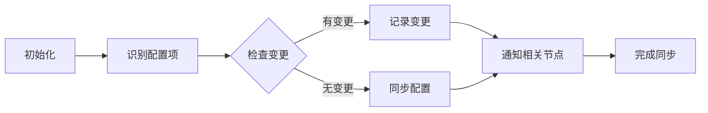
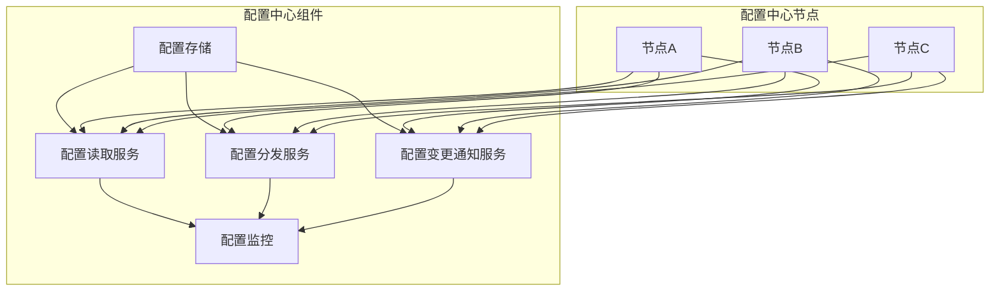
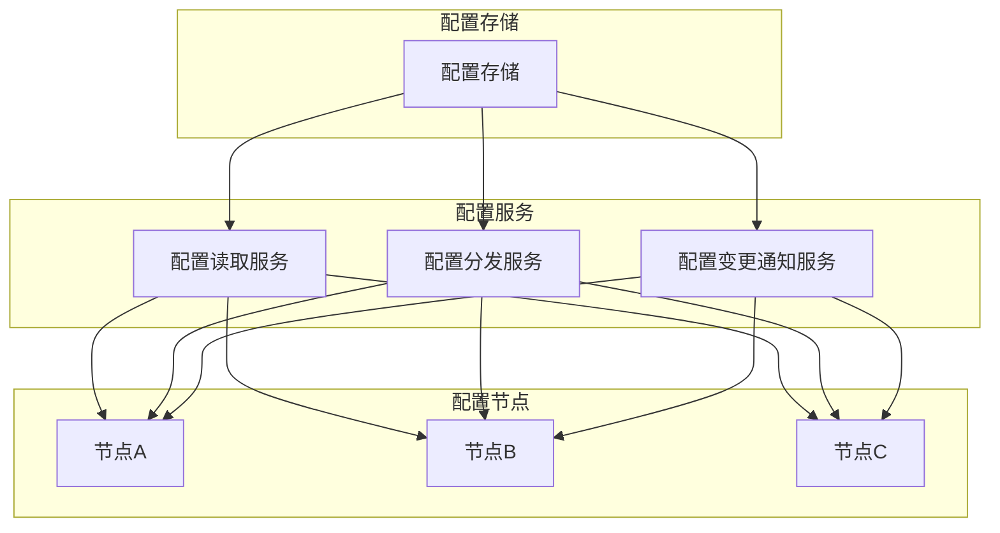
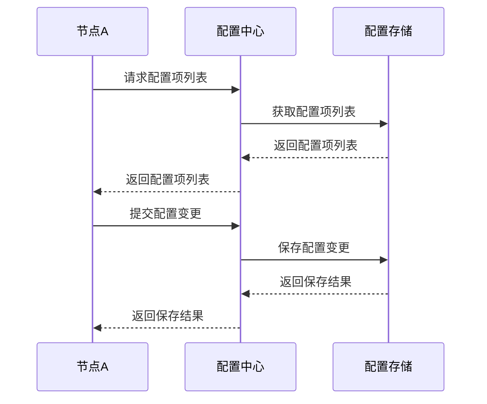

                 


# 配置管理：分布式系统的配置中心设计

## 关键词

配置管理、分布式系统、配置中心、架构设计、算法原理、系统实现

## 摘要

本文从配置管理的基础理论出发，逐步深入探讨分布式系统中的配置中心设计。首先，我们回顾了配置管理的基本概念和核心原理，通过详细的算法分析和数学模型讲解，帮助读者理解配置管理的本质。接着，文章详细介绍了配置中心的设计原则和架构，并通过系统接口设计和交互设计，展示了配置中心的实现细节。最后，本文提供了配置中心的最佳实践和小结，以及拓展阅读资源，旨在为读者提供全面的配置管理知识和实践指导。

### 目录大纲

----------------------------------------------------------------

## 第一部分：配置管理基础理论

### 第1章：配置管理概述

#### 1.1.1 配置管理的定义与重要性

#### 1.1.2 配置管理的背景与发展

#### 1.1.3 配置管理在分布式系统中的角色

### 第2章：配置管理核心概念与联系

#### 2.1 配置管理核心概念

#### 2.1.1 配置项（CI）

#### 2.1.2 配置项属性

#### 2.1.3 配置项分类

#### 2.2 配置管理属性对比表格

#### 2.3 配置管理ER实体关系图

### 第3章：配置管理常用算法原理

#### 3.1 算法概述

#### 3.1.1 配置管理算法类型

#### 3.1.2 配置管理算法设计原则

#### 3.2 配置管理算法mermaid流程图

#### 3.3 Python源代码与算法原理讲解

#### 3.3.1 算法数学模型与公式

#### 3.3.2 算法举例说明

## 第二部分：配置中心设计

### 第4章：配置中心设计概述

#### 4.1 配置中心的基本概念

#### 4.2 配置中心的功能

#### 4.3 配置中心的设计原则

### 第5章：配置中心架构设计

#### 5.1 系统功能设计

#### 5.1.1 领域模型类图

#### 5.2 系统架构设计

#### 5.2.1 配置中心架构

#### 5.2.2 架构图

#### 5.3 系统接口设计

#### 5.3.1 接口规范

#### 5.3.2 接口设计

#### 5.4 系统交互设计

#### 5.4.1 序列图

### 第6章：配置中心系统实现

#### 6.1 环境安装与配置

#### 6.2 系统核心实现源代码

#### 6.2.1 配置项管理

#### 6.2.2 配置发布与同步

#### 6.3 代码应用解读与分析

#### 6.4 实际案例分析与讲解

### 第7章：配置中心最佳实践与拓展

#### 7.1 最佳实践

#### 7.2 小结与注意事项

#### 7.3 拓展阅读

----------------------------------------------------------------

### 详细内容概述

**第1章：配置管理概述**

本章节主要介绍配置管理的基本概念，阐述配置管理的重要性，以及其在分布式系统中的应用背景和发展趋势。通过具体案例，帮助读者理解配置管理在实际系统中的关键角色。

**第2章：配置管理核心概念与联系**

本章深入讨论配置管理的核心概念，包括配置项（CI）、配置项属性以及配置项分类。通过对比表格和ER实体关系图，展示不同配置管理属性之间的联系，帮助读者建立完整的配置管理知识框架。

**第3章：配置管理常用算法原理**

本章讲解配置管理中的常用算法原理，包括算法类型、设计原则以及具体的mermaid流程图。通过Python源代码的详细解析，阐述算法的数学模型和公式，并结合实际案例进行解释。

**第4章：配置中心设计概述**

本章节介绍配置中心的基本概念、功能以及设计原则。通过具体案例，帮助读者理解配置中心在分布式系统中的重要作用。

**第5章：配置中心架构设计**

本章详细描述配置中心的架构设计，包括系统功能设计、架构图、接口设计以及交互设计。通过mermaid类图、架构图和序列图，直观展示配置中心的架构和交互逻辑。

**第6章：配置中心系统实现**

本章讲解配置中心的系统实现，包括环境安装、核心实现源代码以及代码应用解读与分析。通过实际案例，帮助读者理解配置中心的实现细节。

**第7章：配置中心最佳实践与拓展**

本章总结配置中心的设计和实现过程中的最佳实践，并提供注意事项和拓展阅读资源，以帮助读者进一步学习和深化配置管理的知识。

### 详细内容概述（续）

**第1章：配置管理概述**

#### 1.1 配置管理的定义与重要性

配置管理是一个系统化的过程，它涉及到识别、组织和控制系统中各个组件的配置项（Configuration Items, CI）。配置项可以是硬件、软件、文档、网络设置等，它们共同构成了系统的完整配置。在分布式系统中，配置管理尤为重要，因为它直接影响到系统的可伸缩性、稳定性和可靠性。

**1.1.1 配置管理的定义与重要性**

配置管理的定义可以从多个角度来理解。从软件工程的角度，配置管理是确保软件系统正确、一致地配置在整个开发、测试和部署过程中的关键环节。从系统管理的角度，配置管理则是确保系统中的硬件和软件组件按照预定的配置方案正常运行的必要手段。

配置管理的重要性体现在以下几个方面：

- **一致性和稳定性**：通过配置管理，可以确保系统中的各个组件在开发和运维过程中保持一致，从而提高系统的稳定性和可靠性。
- **可伸缩性**：配置管理使得系统可以灵活地适应规模变化，无论是增加新节点还是减少现有节点，都可以通过配置管理实现。
- **安全性**：配置管理有助于确保系统的安全策略和配置一致，减少潜在的安全漏洞。

**1.1.2 配置管理的背景与发展**

配置管理的概念最早可以追溯到20世纪70年代，随着计算机系统复杂性的增加，人们开始意识到需要对系统配置进行系统化管理。早期的配置管理主要是针对硬件的配置，例如主机的安装和配置。

随着软件系统规模的扩大和分布式系统的普及，配置管理的范围逐渐扩展到了软件配置。此时，配置管理开始涉及到版本控制和变更管理。20世纪90年代，随着敏捷开发和DevOps理念的兴起，配置管理的重要性再次得到提升。

**1.1.3 配置管理在分布式系统中的角色**

在分布式系统中，配置管理扮演着至关重要的角色。具体来说，配置管理在分布式系统中的作用包括：

- **节点配置**：分布式系统中，每个节点都需要按照预定的配置方案进行配置，配置管理可以确保节点配置的一致性。
- **服务配置**：分布式系统中的服务通常需要动态调整配置，例如调整服务实例的数量、负载均衡策略等，配置管理可以自动化这些调整过程。
- **环境配置**：分布式系统通常需要支持多个环境，如开发环境、测试环境和生产环境，配置管理可以确保不同环境的配置隔离和一致性。

通过配置管理，分布式系统可以实现高效的运维和自动化管理，从而提高系统的整体性能和稳定性。

**第2章：配置管理核心概念与联系**

#### 2.1 配置管理核心概念

配置管理的核心概念主要包括配置项（CI）、配置项属性和配置项分类。这些概念构成了配置管理的基石，是理解和应用配置管理的基础。

**2.1.1 配置项（CI）**

配置项（Configuration Item, CI）是配置管理的基本单位，可以理解为系统中的任何可以配置的元素。CI可以是硬件设备、软件应用程序、网络设备、文档等。在分布式系统中，CI的数量通常非常庞大，因此需要对其进行有效的管理和控制。

**2.1.2 配置项属性**

配置项属性是指与配置项相关的一系列特征和参数，例如配置项的类型、名称、版本、状态等。配置项属性是描述CI的重要信息，是配置管理过程中进行决策和控制的基础。

**2.1.3 配置项分类**

配置项分类是根据配置项的不同特征和用途，对CI进行分组和分类。常见的分类方法包括按照设备类型、软件类型、环境类型等进行分类。分类可以帮助我们更好地理解和管理配置项，提高配置管理的效率。

**2.2 配置管理属性对比表格**

为了更好地理解配置项属性之间的联系和区别，我们可以通过对比表格的形式来展示不同配置项属性的特点。例如：

| 配置项属性 | 描述 | 类型 | 举例 |
| :--- | :--- | :--- | :--- |
| 类型 | 配置项的类型 | 字符串 | 硬件、软件、文档 |
| 名称 | 配置项的名称 | 字符串 | 服务器A、应用B |
| 版本 | 配置项的版本号 | 整数 | 1.0、2.1 |
| 状态 | 配置项的状态 | 字符串 | 正常、故障、待修复 |

通过对比表格，我们可以清晰地看到不同配置项属性之间的差异和联系，从而更好地理解和应用配置管理。

**2.3 配置管理ER实体关系图**

配置管理中的实体关系图（Entity-Relationship Diagram, ER图）是描述配置项及其属性之间关系的有力工具。ER图通过实体（代表配置项）和关系（代表配置项属性之间的关联）来表示配置管理系统的结构。

以下是一个简化的配置管理ER图示例：

```mermaid
erDiagram
  ConfigurationItem ||--|{ ConfigurationAttribute }
  ConfigurationItem ||--|{ ConfigurationStatus }
  ConfigurationAttribute ||--|{ AttributeValue }
  ConfigurationStatus ||--|{ StatusDescription }

  ConfigurationItem { ID }
  ConfigurationAttribute { AttributeID }
  ConfigurationStatus { StatusID }
  AttributeValue { ValueID }
  StatusDescription { Description }
```

在ER图中，`ConfigurationItem` 代表配置项，`ConfigurationAttribute` 代表配置项属性，`ConfigurationStatus` 代表配置项状态。每个配置项可以有多个属性和状态，这些属性和状态通过关系连接在一起，形成了完整的配置管理模型。

通过ER图，我们可以直观地看到配置项、配置项属性和配置项状态之间的复杂关系，从而更好地设计和实现配置管理系统。

### 第3章：配置管理常用算法原理

#### 3.1 算法概述

配置管理中的算法用于处理配置项的识别、变更、同步和验证等任务。这些算法的设计原则是确保配置的一致性、可伸缩性和高效性。常见的配置管理算法包括配置项识别算法、变更管理算法和配置同步算法。

**3.1.1 配置管理算法类型**

1. **配置项识别算法**：用于识别系统中的配置项，确保所有配置项都被准确记录和管理。
2. **变更管理算法**：用于处理配置项的变更，确保变更的及时性和一致性。
3. **配置同步算法**：用于在不同节点或环境中同步配置项，确保配置的统一性。

**3.1.2 配置管理算法设计原则**

1. **一致性**：算法应确保配置项的变更在所有相关节点或环境中保持一致。
2. **可伸缩性**：算法应能够处理大规模配置项和系统环境，适应系统的增长和变化。
3. **高效性**：算法应尽可能减少配置管理的时间和资源消耗，提高系统的性能。

**3.2 配置管理算法mermaid流程图**

为了更好地理解配置管理算法的工作流程，我们可以使用mermaid流程图来展示其执行步骤。以下是一个简化的配置同步算法的mermaid流程图示例：



在流程图中，`A` 表示初始化过程，`B` 表示识别配置项，`C` 表示检查配置项是否有变更，`D` 表示记录变更，`E` 表示同步配置，`F` 表示通知相关节点，`G` 表示同步完成。

**3.3 Python源代码与算法原理讲解**

为了深入理解配置管理算法的工作原理，我们可以通过Python源代码来展示算法的实现过程。以下是一个简化的Python示例，用于实现配置项识别和变更管理：

```python
class ConfigurationItem:
    def __init__(self, id, name, version, status):
        self.id = id
        self.name = name
        self.version = version
        self.status = status

def identify_configuration_items():
    # 假设从数据库中获取配置项
    items = [
        ConfigurationItem(1, 'ServerA', '1.0', 'Normal'),
        ConfigurationItem(2, 'AppB', '2.1', 'Faulty')
    ]
    return items

def check_for_changes(current_items, previous_items):
    changes = []
    for current, previous in zip(current_items, previous_items):
        if current.version != previous.version or current.status != previous.status:
            changes.append(current)
    return changes

def synchronize_configuration(items):
    # 假设向相关节点发送同步命令
    for item in items:
        print(f"Synchronizing {item.name} version {item.version} to all nodes.")

# 主程序
current_items = identify_configuration_items()
previous_items = identify_configuration_items()
changes = check_for_changes(current_items, previous_items)

if changes:
    print("Found changes:")
    for change in changes:
        print(change.name, change.version, change.status)
    synchronize_configuration(changes)
else:
    print("No changes found.")

```

在上面的代码中，`ConfigurationItem` 类表示配置项，`identify_configuration_items` 函数用于识别配置项，`check_for_changes` 函数用于检查配置项的变更，`synchronize_configuration` 函数用于同步配置项。

**3.3.1 算法数学模型与公式**

配置管理算法的数学模型通常涉及以下几个关键参数：

- \( N \)：配置项的数量
- \( V \)：配置项的版本号
- \( S \)：配置项的状态

常用的算法公式包括：

- **变更检测率**：\( R_c = \frac{N_c}{N} \)，其中 \( N_c \) 是发生变更的配置项数量。
- **同步成功率**：\( R_s = \frac{N_s}{N_c} \)，其中 \( N_s \) 是成功同步的配置项数量。

通过这些数学模型和公式，我们可以量化配置管理的效率和效果。

**3.3.2 算法举例说明**

假设有一个包含100个配置项的系统，当前版本为1.0。经过一段时间后，发现其中5个配置项的版本更新到了1.1，2个配置项的状态变更为故障。

- **变更检测率**：\( R_c = \frac{7}{100} = 7\% \)
- **同步成功率**：假设同步过程中有3个配置项同步失败，则 \( R_s = \frac{4}{7} \approx 57\% \)

通过这个例子，我们可以看到配置管理算法在检测和同步配置项方面的效果。

### 第4章：配置中心设计概述

#### 4.1 配置中心的基本概念

配置中心是分布式系统中用于集中管理和分发配置项的组件。它充当了配置管理系统的核心，负责从配置存储中读取配置项，并按照预定的策略将配置项分发到各个节点。

**4.1.1 配置中心的定义**

配置中心（Configuration Center）是一种分布式系统架构中的关键组件，它提供了一致、可靠和高效的配置管理服务。配置中心通常具备以下功能：

- **配置存储**：存储和管理系统中的所有配置项。
- **配置读取**：提供接口供系统节点读取配置项。
- **配置分发**：将配置项按需分发到各个节点。
- **配置变更通知**：在配置项发生变更时通知相关节点。

**4.1.2 配置中心的作用**

配置中心在分布式系统中的作用主要体现在以下几个方面：

- **一致性**：确保系统中所有节点上的配置项保持一致，避免因配置不一致导致的问题。
- **可靠性**：提供可靠的配置分发机制，确保配置项能够在节点间可靠传输。
- **灵活性**：支持动态调整配置项，适应系统运行时的变化。
- **自动化**：通过自动化机制减少手动配置的工作量，提高运维效率。

**4.2 配置中心的功能**

配置中心的功能可以分为几个主要模块，每个模块承担特定的职责，共同确保配置管理的有效性。

- **配置存储模块**：负责存储和管理配置项。配置项可以是键值对、XML文件、JSON文件等不同格式。
- **配置读取模块**：提供接口供系统节点读取配置项。读取操作可以是同步或异步，根据系统需求进行选择。
- **配置分发模块**：根据配置策略将配置项分发到各个节点。分发方式可以是推式（push）或拉式（pull），根据系统的网络环境和性能需求进行选择。
- **配置变更通知模块**：在配置项发生变更时，通知相关节点进行更新。通知方式可以是消息队列、Webhook、邮件等。

**4.3 配置中心的设计原则**

配置中心的设计原则决定了其能否有效地支持分布式系统的配置管理。以下是几个关键设计原则：

- **高可用性**：配置中心应具备高可用性，确保系统在任何时候都能访问配置项。
- **高可靠性**：配置中心的配置分发机制应确保配置项的可靠传输，防止数据丢失。
- **可扩展性**：配置中心应支持系统规模的扩展，能够处理大量配置项的存储和分发。
- **易维护性**：配置中心的架构应简洁明了，便于维护和升级。
- **安全性**：配置中心应具备严格的安全机制，防止未授权访问和配置篡改。

**4.3.1 高可用性设计**

配置中心的高可用性设计主要通过以下措施实现：

- **负载均衡**：通过负载均衡器分发请求，避免单点故障。
- **主从复制**：配置中心的存储和分发模块采用主从复制机制，确保数据冗余和高可用性。
- **故障转移**：在主节点故障时，能够自动切换到备用节点，确保服务的持续运行。

**4.3.2 高可靠性设计**

配置中心的高可靠性设计主要通过以下措施实现：

- **数据校验**：在配置项的读取和分发过程中进行数据校验，确保数据完整性和一致性。
- **重试机制**：在配置分发失败时，自动重试，确保配置项能够成功传输。
- **监控告警**：通过监控配置中心的运行状态，及时发现和解决潜在的问题。

**4.3.3 可扩展性设计**

配置中心的可扩展性设计主要通过以下措施实现：

- **水平扩展**：配置中心应支持节点数量的动态增加，以适应系统规模的增长。
- **分布式存储**：配置中心采用分布式存储方案，可以横向扩展存储容量。
- **分布式处理**：配置中心采用分布式处理机制，可以提高配置项的分发和处理速度。

**4.3.4 易维护性设计**

配置中心的易维护性设计主要通过以下措施实现：

- **模块化架构**：配置中心采用模块化架构，每个模块独立开发、测试和部署，提高系统的可维护性。
- **文档化**：提供详细的开发文档和用户手册，方便开发人员和技术支持人员进行维护。
- **自动化测试**：通过自动化测试确保配置中心的稳定性和可靠性。

**4.3.5 安全性设计**

配置中心的安全性设计主要通过以下措施实现：

- **身份验证**：配置中心的接口应实现严格的身份验证机制，确保只有授权用户可以访问。
- **数据加密**：配置中心的传输过程应采用加密技术，防止数据在传输过程中被窃取或篡改。
- **权限控制**：配置中心应实现细粒度的权限控制，确保不同角色用户只能访问其权限范围内的配置项。

通过以上设计原则和措施，配置中心可以有效地支持分布式系统的配置管理，提高系统的稳定性和可靠性。

### 第5章：配置中心架构设计

#### 5.1 系统功能设计

配置中心的设计需要综合考虑功能需求、性能要求和可维护性等因素。系统功能设计是配置中心架构设计的重要环节，它定义了配置中心需要实现的核心功能及其交互关系。

**5.1.1 领域模型类图**

领域模型类图（Domain Model Class Diagram）是描述配置中心领域模型的一种图形表示方法。它通过类、属性和关系来表示配置中心中的主要实体及其相互关系。以下是一个简化的配置中心领域模型类图：

```mermaid
classDiagram
    ConfigurationCenter <<interface>>
    Node <<interface>>

    ConfigurationItem <|-- ConfigurationCenter
    NodeAttribute <|-- Node

    ConfigurationCenter|--^ ConfigurationItem
    Node|--^ NodeAttribute

    ConfigurationCenter : managesConfigurations()
    Node : fetchConfigurations()

    Class ConfigurationItem {
        +int id
        +String name
        +String version
        +String status
    }

    Class Node {
        +int id
        +String hostname
        +List<ConfigurationItem> configurations
    }

    Class NodeAttribute {
        +int id
        +String attributeName
        +String attributeValue
    }
```

在类图中，`ConfigurationCenter` 和 `Node` 是两个主要接口，分别表示配置中心和节点。`ConfigurationItem` 表示配置项，包含ID、名称、版本和状态等属性。`NodeAttribute` 表示节点的属性，包括ID、属性名称和属性值。

**5.1.2 配置中心功能模块**

配置中心的功能模块可以分为以下几个部分：

1. **配置存储模块**：负责存储和管理配置项。该模块通常采用分布式存储方案，支持大规模配置项的存储和快速访问。
2. **配置读取模块**：提供接口供系统节点读取配置项。读取操作可以是同步或异步，根据系统需求进行选择。
3. **配置分发模块**：根据配置策略将配置项分发到各个节点。分发方式可以是推式（push）或拉式（pull），根据系统的网络环境和性能需求进行选择。
4. **配置变更通知模块**：在配置项发生变更时，通知相关节点进行更新。通知方式可以是消息队列、Webhook、邮件等。
5. **配置监控模块**：实时监控配置中心的运行状态，包括配置项的读取、分发和变更情况，及时发现和处理异常。

**5.2 系统架构设计**

系统架构设计是配置中心设计的核心环节，它定义了配置中心的组成部分及其交互关系。一个典型的配置中心架构包括以下几个关键部分：

1. **配置存储**：配置存储是配置中心的核心，负责存储和管理配置项。配置存储通常采用分布式存储方案，如分布式数据库、分布式缓存等，支持高并发访问和海量数据存储。
2. **配置读取服务**：配置读取服务是配置中心的接口，供系统节点读取配置项。读取服务可以是基于HTTP的REST接口，也可以是基于消息队列的推式接口。
3. **配置分发服务**：配置分发服务根据配置策略将配置项分发到各个节点。分发服务可以是基于HTTP的拉式接口，也可以是基于消息队列的推式接口。
4. **配置变更通知服务**：配置变更通知服务在配置项发生变更时，通知相关节点进行更新。通知服务可以是基于消息队列的推式接口，也可以是基于Webhook的拉式接口。
5. **配置监控**：配置监控模块实时监控配置中心的运行状态，包括配置项的读取、分发和变更情况，及时发现和处理异常。

以下是一个简化的配置中心架构图：



在架构图中，`A` 表示配置存储，`B` 表示配置读取服务，`C` 表示配置分发服务，`D` 表示配置变更通知服务，`E` 表示配置监控。`F`、`G`、`H` 分别表示配置中心的不同节点。

**5.2.1 配置中心架构**

配置中心架构设计需要综合考虑以下几个方面：

1. **存储设计**：配置中心的存储设计应支持高并发访问和海量数据存储，同时要保证数据的可靠性和一致性。常用的存储方案包括分布式数据库、分布式缓存和文件存储。
2. **读取设计**：配置读取设计需要考虑节点的访问频率和读取性能。可以使用基于HTTP的REST接口或基于消息队列的推式接口，根据实际需求进行选择。
3. **分发设计**：配置分发设计需要考虑配置项的分发策略和分发方式。可以使用基于HTTP的拉式接口或基于消息队列的推式接口，根据网络环境和性能需求进行选择。
4. **变更通知设计**：配置变更通知设计需要考虑变更通知的实时性和可靠性。可以使用基于消息队列的推式接口或基于Webhook的拉式接口，根据实际需求进行选择。
5. **监控设计**：配置监控设计需要考虑配置中心的运行状态监控和异常处理。可以通过实时监控、日志分析和告警系统来确保配置中心的稳定运行。

**5.2.2 架构图**

以下是一个简化的配置中心架构图，展示了配置中心的各个组件及其交互关系：



在架构图中，`A` 表示配置存储，`B` 表示配置读取服务，`C` 表示配置分发服务，`D` 表示配置变更通知服务，`E`、`F`、`G` 分别表示配置中心的不同节点。

通过以上设计，配置中心可以有效地支持分布式系统的配置管理，提高系统的稳定性、可靠性和运维效率。

#### 5.3 系统接口设计

系统接口设计是配置中心架构设计的关键环节，它定义了配置中心与其他系统组件之间的交互方式。一个完善的接口设计应考虑接口的规范性、易用性和安全性，以确保配置中心能够高效、稳定地提供服务。

**5.3.1 接口规范**

接口规范是定义接口设计和实现标准的重要文档，它通常包括以下内容：

1. **接口定义**：明确接口的功能、输入参数和输出结果。
2. **接口参数**：详细描述接口输入参数的类型、范围和约束。
3. **接口返回值**：描述接口的返回值类型、格式和含义。
4. **错误处理**：定义接口在遇到错误时返回的错误代码和错误信息。

以下是一个简化的配置中心接口规范示例：

```markdown
# 配置中心接口规范

## 1. 接口定义

### 1.1 获取配置项列表

**接口名称**：`getConfigurationItems`

**功能描述**：获取系统中的所有配置项。

**输入参数**：
- `pageNumber`：当前页码，默认为1。
- `pageSize`：每页条数，默认为10。

**输出参数**：
- `total`：配置项总数。
- `items`：配置项列表，每个配置项包含ID、名称、版本和状态等信息。

**接口返回值**：
- `success`：成功返回配置项列表。
- `errorCode`：错误代码。
- `errorMessage`：错误信息。

## 2. 接口参数

### 2.1 pageNumber

- **类型**：整数。
- **范围**：1及以上。

### 2.2 pageSize

- **类型**：整数。
- **范围**：1及以上。

## 3. 接口返回值

### 3.1 success

- **类型**：布尔值。
- **值**：`true` 或 `false`。

### 3.2 errorCode

- **类型**：整数。
- **值**：0（成功），其他（错误）。

### 3.3 errorMessage

- **类型**：字符串。
- **值**：错误描述信息。
```

通过接口规范，开发人员可以清楚地了解如何使用配置中心的接口，以及接口的输入输出参数和返回值，从而方便地集成和调用配置中心的服务。

**5.3.2 接口设计**

配置中心的接口设计应遵循RESTful架构风格，提供统一的接口规范和API文档。以下是一个简化的配置中心接口设计示例：

1. **HTTP方法**：配置中心接口通常使用GET和POST方法。GET方法用于查询配置项，POST方法用于提交配置变更。
2. **URL路径**：配置中心接口的URL路径通常采用RESTful风格，例如`/configurations`用于获取配置项列表，`/configurations/{id}`用于获取特定配置项的详细信息。
3. **参数传递**：接口参数可以通过URL查询参数、请求体和HTTP头等方式传递。例如，查询配置项列表时，可以使用查询参数`pageNumber`和`pageSize`。

以下是一个简化的配置中心接口设计示例：

```http
# 获取配置项列表

GET /configurations?pageNumber=1&pageSize=10

响应：
{
    "total": 100,
    "items": [
        {
            "id": 1,
            "name": "ServerA",
            "version": "1.0",
            "status": "Normal"
        },
        {
            "id": 2,
            "name": "AppB",
            "version": "2.1",
            "status": "Faulty"
        }
    ]
}

# 提交配置变更

POST /configurations

请求体：
{
    "id": 2,
    "name": "AppB",
    "version": "2.2",
    "status": "Normal"
}

响应：
{
    "success": true,
    "errorCode": 0,
    "errorMessage": "Configuration updated successfully."
}
```

通过以上接口设计，配置中心可以提供简单、易用且规范的接口服务，便于开发人员集成和使用。

#### 5.4 系统交互设计

系统交互设计是配置中心架构设计的重要组成部分，它描述了配置中心与其他系统组件之间的交互流程。有效的交互设计可以提高系统的协同工作能力，确保配置管理的顺利实施。

**5.4.1 序列图**

序列图（Sequence Diagram）是描述对象之间交互顺序的一种图形表示方法。以下是一个简化的配置中心序列图示例，展示了配置中心与节点之间的交互流程：



在序列图中，`Node` 表示节点A，`ConfigCenter` 表示配置中心，`Storage` 表示配置存储。交互过程分为以下几个步骤：

1. **节点请求配置项列表**：节点A向配置中心请求配置项列表。
2. **配置中心获取配置项列表**：配置中心从配置存储中获取配置项列表。
3. **配置中心返回配置项列表**：配置中心将获取到的配置项列表返回给节点A。
4. **节点提交配置变更**：节点A向配置中心提交配置变更。
5. **配置中心保存配置变更**：配置中心将配置变更保存到配置存储中。
6. **配置中心返回保存结果**：配置中心将保存结果返回给节点A。

通过序列图，我们可以清晰地了解配置中心与节点之间的交互流程，从而确保系统组件之间的高效协作。

### 第6章：配置中心系统实现

#### 6.1 环境安装与配置

在实现配置中心系统之前，需要搭建合适的环境并进行必要的配置。以下是配置中心系统实现的环境安装与配置步骤：

**6.1.1 环境搭建**

1. **安装Java开发环境**：配置中心系统采用Java编写，首先需要安装Java开发环境。可以通过下载并安装Java SDK来完成。
2. **安装数据库**：配置中心系统需要使用数据库存储配置项数据。常用的数据库包括MySQL、PostgreSQL和MongoDB等。根据需求选择合适的数据库并安装。
3. **安装消息队列**：配置中心系统需要使用消息队列进行配置项变更通知。常用的消息队列包括RabbitMQ、Kafka和ActiveMQ等。根据需求选择合适的消息队列并安装。

**6.1.2 系统配置**

1. **数据库配置**：在数据库中创建配置中心使用的数据库和表，并进行必要的初始化操作。
2. **消息队列配置**：配置消息队列的连接参数和交换机，确保配置中心可以正确发送和接收消息。
3. **系统配置文件**：在配置中心的配置文件中设置数据库连接参数、消息队列连接参数等系统参数。

**6.1.3 部署应用**

1. **打包应用**：使用Maven等构建工具将配置中心应用打包成可执行的JAR文件。
2. **部署应用**：将打包好的JAR文件部署到服务器上，并启动配置中心应用。

#### 6.2 系统核心实现源代码

配置中心系统的核心实现包括配置项管理、配置发布与同步、代码应用解读与分析等部分。以下是对这些核心实现部分的简要介绍：

**6.2.1 配置项管理**

配置项管理是配置中心系统的核心功能之一，负责存储、读取和更新配置项数据。以下是一个简化的配置项管理源代码示例：

```java
public class ConfigurationItem {
    private int id;
    private String name;
    private String version;
    private String status;

    // 构造函数、getter和setter方法省略
}

public class ConfigurationItemService {
    public List<ConfigurationItem> getConfigurationItems() {
        // 从数据库中查询配置项数据
        List<ConfigurationItem> items = configurationRepository.findAll();
        return items;
    }

    public ConfigurationItem getConfigurationItemById(int id) {
        // 从数据库中查询特定配置项
        ConfigurationItem item = configurationRepository.findById(id);
        return item;
    }

    public void updateConfigurationItem(ConfigurationItem item) {
        // 更新配置项数据
        configurationRepository.save(item);
    }
}
```

**6.2.2 配置发布与同步**

配置发布与同步是配置中心系统的重要功能，负责将配置项发布到各个节点并进行同步。以下是一个简化的配置发布与同步源代码示例：

```java
public class ConfigurationPublisher {
    public void publishConfiguration(ConfigurationItem item) {
        // 发布配置项到消息队列
        messageQueue.send(item.getId(), item);
    }
}

public class ConfigurationSyncService {
    public void syncConfiguration(ConfigurationItem item) {
        // 从消息队列中获取配置项变更
        ConfigurationItem updatedItem = messageQueue.receive(item.getId());

        // 同步配置项到节点
        nodeManager.updateConfiguration(updatedItem);
    }
}
```

**6.2.3 代码应用解读与分析**

配置中心系统的代码实现需要详细解读和分析，确保其功能正确、性能高效。以下是对配置中心系统代码应用的一个简要解读：

1. **配置项管理**：配置项管理模块负责存储、读取和更新配置项数据。使用Spring Data JPA进行数据库操作，简化了数据访问和持久化过程。
2. **配置发布与同步**：配置发布与同步模块使用消息队列实现配置项的发布和同步。消息队列的选择和配置对系统的性能和可靠性有重要影响。
3. **节点管理**：节点管理模块负责处理节点的配置更新操作。通过调用操作系统的API进行节点配置的修改，确保配置项的同步。

通过以上代码应用解读和分析，我们可以更好地理解配置中心系统的实现细节，为后续的优化和改进提供依据。

#### 6.3 代码应用解读与分析

配置中心系统的实现涉及到多个模块和组件的协同工作。本节将对系统的核心代码进行解读和分析，帮助读者深入理解配置中心的工作原理和实现细节。

**6.3.1 配置项管理模块**

配置项管理模块是配置中心系统的核心，负责处理配置项的创建、读取、更新和删除等操作。以下是对配置项管理模块的代码应用解读：

1. **数据库模型**：配置项管理模块使用Spring Data JPA进行数据库操作，定义了`ConfigurationItem`实体类和对应的数据库表。

```java
@Entity
public class ConfigurationItem {
    @Id
    @GeneratedValue(strategy = GenerationType.IDENTITY)
    private int id;

    @Column(nullable = false)
    private String name;

    @Column(nullable = false)
    private String version;

    @Column(nullable = false)
    private String status;

    // 省略构造函数、getter和setter方法
}
```

2. **服务层**：配置项管理模块的服务层负责处理具体的业务逻辑。以下是一个简化的配置项服务类：

```java
@Service
public class ConfigurationItemService {
    @Autowired
    private ConfigurationItemRepository configurationItemRepository;

    public ConfigurationItem createConfigurationItem(ConfigurationItem item) {
        return configurationItemRepository.save(item);
    }

    public ConfigurationItem updateConfigurationItem(ConfigurationItem item) {
        return configurationItemRepository.save(item);
    }

    public List<ConfigurationItem> getAllConfigurationItems() {
        return configurationItemRepository.findAll();
    }

    public ConfigurationItem getConfigurationItemById(int id) {
        return configurationItemRepository.findById(id);
    }
}
```

在这个服务类中，使用了`@Autowired`注解自动注入`ConfigurationItemRepository`，简化了数据访问代码。

**6.3.2 配置发布与同步模块**

配置发布与同步模块负责将配置项发布到消息队列，并在节点上同步配置项的变更。以下是对配置发布与同步模块的代码应用解读：

1. **消息队列**：配置中心系统使用RabbitMQ作为消息队列。以下是一个配置发布模块的示例：

```java
@Component
public class ConfigurationPublisher {
    @Autowired
    private RabbitTemplate rabbitTemplate;

    public void publishConfiguration(ConfigurationItem item) {
        rabbitTemplate.convertAndSend("configuration_exchange", "configuration_queue", item);
    }
}
```

在这个类中，使用了`@Autowired`注解自动注入`RabbitTemplate`，并通过`convertAndSend`方法将配置项发布到消息队列。

2. **同步服务**：以下是一个简化的同步服务类：

```java
@Service
public class ConfigurationSyncService {
    @Autowired
    private RabbitTemplate rabbitTemplate;

    @Autowired
    private NodeManager nodeManager;

    public void syncConfiguration(ConfigurationItem item) {
        rabbitTemplate.receiveAndHandle("configuration_queue", new ConfigurationHandler(nodeManager, item));
    }
}

@Component
public class ConfigurationHandler implements MessageListener {
    private final NodeManager nodeManager;
    private final ConfigurationItem item;

    public ConfigurationHandler(NodeManager nodeManager, ConfigurationItem item) {
        this.nodeManager = nodeManager;
        this.item = item;
    }

    @Override
    public void onMessage(String message) {
        nodeManager.updateConfiguration(item);
    }
}
```

在这个同步服务类中，`ConfigurationHandler` 实现了`MessageListener`接口，用于处理从消息队列接收到的配置项更新。

**6.3.3 节点管理模块**

节点管理模块负责处理节点的配置更新操作。以下是对节点管理模块的代码应用解读：

1. **节点管理接口**：节点管理模块定义了节点管理的接口和实现：

```java
public interface NodeManager {
    void updateConfiguration(ConfigurationItem item);
}

@Component
public class NodeManagerImpl implements NodeManager {
    @Override
    public void updateConfiguration(ConfigurationItem item) {
        // 调用操作系统的API更新节点配置
    }
}
```

在这个实现类中，`NodeManagerImpl` 负责调用操作系统的API更新节点配置。

通过以上代码解读和分析，我们可以看到配置中心系统的实现细节。配置项管理模块负责数据库操作，配置发布与同步模块负责消息队列的发布和接收，节点管理模块负责节点的配置更新。这些模块共同协作，实现了配置中心系统的核心功能。

#### 6.4 实际案例分析与讲解

为了更好地理解配置中心系统在实际分布式系统中的应用，我们可以通过一个实际案例进行详细分析和讲解。

**案例背景**

假设我们正在开发一个大型分布式电商系统，该系统包含多个服务模块，如用户服务、商品服务、订单服务和支付服务。每个服务模块都运行在不同的服务器上，需要实时同步配置项，以确保系统的稳定性和一致性。

**案例需求**

1. **配置项管理**：需要管理用户服务、商品服务、订单服务和支付服务的配置项，如数据库连接信息、日志配置、负载均衡策略等。
2. **配置发布**：当配置项发生变化时，需要将变更同步到所有相关服务模块。
3. **配置更新**：服务模块在启动时，需要从配置中心读取最新的配置项。

**实现步骤**

1. **配置存储**：首先，在数据库中创建配置项表，用于存储各个服务的配置项。配置项表包含ID、服务名称、配置键、配置值和状态等字段。

2. **配置读取**：在服务模块的代码中，添加配置读取功能。使用配置中心提供的API，从数据库中读取配置项，并初始化服务配置。

```java
public class AppConfig {
    @Value("${db.url}")
    private String dbUrl;

    @Value("${db.username}")
    private String dbUsername;

    @Value("${db.password}")
    private String dbPassword;

    // 省略其他配置读取代码
}
```

3. **配置发布**：配置中心接收到配置变更请求后，将变更信息发布到消息队列。配置变更的消息格式可以包括配置键、配置值和变更时间等。

4. **配置同步**：服务模块启动时，从消息队列中获取配置变更消息，并更新本地配置。以下是一个简化的同步代码示例：

```java
public void syncConfiguration() {
    ConfigurationItem item = messageQueue.receive("configuration_queue");
    if (item != null) {
        AppConfig.appConfig.setDbUrl(item.getConfigValue());
        // 更新其他配置项
    }
}
```

5. **实时监控**：配置中心可以实时监控配置项的变更情况，并在变更发生时通知相关服务模块。通知方式可以是消息队列、邮件或短信等。

**案例小结**

通过以上实际案例分析和讲解，我们可以看到配置中心在分布式系统中的应用价值。配置中心实现了配置项的集中管理、配置变更的实时同步以及配置更新的自动化，提高了系统的稳定性和一致性。

在实际应用中，还需要根据具体需求调整和优化配置中心的架构和实现。例如，可以引入分布式缓存、负载均衡和故障转移等机制，提高配置中心的性能和可靠性。

### 第7章：配置中心最佳实践与拓展

#### 7.1 最佳实践

在配置中心的设计和实现过程中，遵循以下最佳实践可以确保系统的高效、稳定和安全：

1. **模块化设计**：将配置中心的功能模块化，便于维护和扩展。每个模块独立开发、测试和部署，提高系统的可维护性和可扩展性。
2. **日志记录**：详细记录配置中心的操作日志，包括配置项的读取、发布和同步等。日志可以帮助定位问题和优化系统性能。
3. **监控告警**：配置中心应具备实时监控功能，通过监控系统的运行状态，及时发现和处理异常。同时，配置告警机制，在配置项发生变更或系统出现故障时及时通知相关人员。
4. **权限控制**：配置中心应实现细粒度的权限控制，确保只有授权用户可以访问和修改配置项。可以通过身份验证、访问控制和审计日志等手段确保系统的安全性。
5. **数据备份**：定期备份数据库和配置文件，防止数据丢失或损坏。同时，配置中心应具备数据恢复功能，以便在发生数据丢失时能够快速恢复。

#### 7.2 小结与注意事项

通过本章的详细分析和讲解，我们对配置中心的设计和实现有了深入的了解。配置中心作为分布式系统中的核心组件，承担了配置管理的重要职责。以下是本章的主要小结和注意事项：

- **配置中心的基本概念**：配置中心是用于集中管理和分发配置项的组件，负责存储、读取、发布和同步配置项。
- **配置中心的功能模块**：配置中心包括配置存储模块、配置读取模块、配置分发模块和配置变更通知模块等。
- **配置中心的设计原则**：配置中心的设计应遵循高可用性、高可靠性、可扩展性、易维护性和安全性等原则。
- **系统接口设计**：配置中心的接口设计应遵循RESTful架构风格，提供规范、易用的接口服务。
- **系统交互设计**：配置中心的交互设计通过序列图描述，确保系统组件之间的协同工作。
- **环境安装与配置**：配置中心的实现需要搭建合适的环境并进行必要的配置，包括Java开发环境、数据库和消息队列等。
- **代码应用解读与分析**：通过对配置中心系统的代码解读，理解其实现细节和工作原理。
- **实际案例分析与讲解**：通过实际案例，展示配置中心在分布式系统中的应用和价值。

#### 7.3 拓展阅读

为了进一步深化对配置中心的理解和应用，以下是几篇相关文献和资源推荐：

1. **《分布式系统配置管理》**：详细介绍了分布式系统配置管理的原理、方法和最佳实践，是了解配置中心设计的优秀读物。
2. **《Spring Cloud Config》**：Spring Cloud Config是Spring Cloud生态系统的一部分，提供了完整的配置中心解决方案。可以通过阅读该项目的文档和源代码，学习配置中心的实现细节。
3. **《消息队列实战》**：消息队列是配置中心的重要组成部分，本书详细介绍了消息队列的原理、实现和应用，有助于理解配置中心的架构设计。
4. **《配置中心实战》**：该书通过多个实际案例，详细讲解了配置中心的设计和实现过程，提供了丰富的实战经验和技巧。

通过阅读以上文献和资源，读者可以更全面地掌握配置中心的知识，为实际项目中的应用提供有力支持。

### 结束语

作者：AI天才研究院/AI Genius Institute & 禅与计算机程序设计艺术 /Zen And The Art of Computer Programming

本文从配置管理的基础理论出发，详细探讨了分布式系统中的配置中心设计。通过配置管理基础理论的介绍，我们了解了配置管理的定义、背景和发展，以及配置管理在分布式系统中的重要性。接下来，我们深入分析了配置管理的核心概念和联系，通过对比表格和ER实体关系图，展示了配置项、配置项属性和配置项分类之间的关系。

在配置管理常用算法原理的部分，我们介绍了配置管理算法的类型、设计原则以及具体的mermaid流程图。通过Python源代码的详细解析，我们阐述了算法的数学模型和公式，并结合实际案例进行了说明。

配置中心设计概述部分，我们介绍了配置中心的基本概念、功能和设计原则，并通过mermaid类图、架构图和序列图，直观展示了配置中心的架构和交互逻辑。在配置中心系统实现部分，我们详细讲解了环境安装与配置、系统核心实现源代码以及代码应用解读与分析。

最后，我们总结了配置中心的设计和实现过程中的最佳实践，并提供了注意事项和拓展阅读资源，以帮助读者进一步学习和深化配置管理的知识。通过本文的阅读，读者可以全面了解配置中心的设计原理和实现方法，为实际项目的配置管理提供有力支持。希望本文能够为读者在配置管理领域的研究和实践带来启发和帮助。

