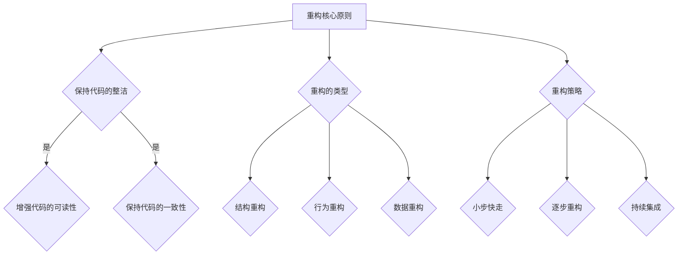

                 


### 引言

在软件开发的世界里，代码重构是一项至关重要的实践。它不仅仅是一种技术手段，更是一种提升软件质量的哲学。重构技巧，顾名思义，是通过一系列精心设计的步骤和方法，对既有代码进行改进，使其更加简洁、易读、高效和可维护。本文将深入探讨重构技巧的艺术，旨在帮助开发者理解重构的重要性、挑战，并掌握一系列实用的重构技巧。

#### 1.1 重构的意义

重构的重要性不言而喻。首先，重构可以帮助我们保持代码的整洁和清晰，从而提高代码的可读性和可维护性。随着项目的逐渐发展，代码往往会变得越来越复杂，而重构就是为了让这些复杂代码重新变得易于理解和修改。其次，重构可以提升代码的性能，通过优化代码结构和算法，可以减少冗余和低效代码，从而提高程序的运行效率。最后，重构还可以促进团队协作和沟通，通过一致的代码风格和结构，团队成员可以更容易地理解和修改代码，提高开发效率。

然而，重构也面临着一些挑战。首先，重构可能会引入新的错误，因为修改代码总会有风险。其次，重构需要时间和精力，特别是在大型项目中，这可能需要团队成员的协作和共识。最后，重构的决策和策略需要谨慎，因为错误的决策可能会适得其反。

#### 1.2 重构的挑战

**1.2.1 代码复杂性**

代码复杂性是重构过程中最大的挑战之一。复杂的代码结构往往导致维护困难，甚至影响到代码的可读性和性能。为了应对这一挑战，我们需要采用一系列重构技巧，如提取方法、替换条件分支、分解重复代码等，逐步简化代码结构，降低复杂性。

**1.2.2 项目规模与维护**

大型项目的重构需要更加谨慎和系统化的策略。在大型项目中，代码库通常非常庞大，修改一个模块可能会影响到其他模块。因此，我们需要采用逐步重构的策略，小步快走，逐步改善代码质量。

**1.2.3 团队协作与沟通**

重构不仅仅是个体的努力，更需要团队的协作和沟通。在团队中，不同的成员可能有不同的重构理念和方法，这需要通过有效的沟通和协作来达成共识。此外，重构的决策和策略也需要团队的共同讨论和决策。

### 第一部分：重构的基本原理

在理解重构的意义和挑战之后，我们需要掌握重构的基本原理和策略。这一部分将介绍重构的核心原则、类型和策略，帮助开发者更好地理解重构的哲学和实际操作。

#### 2.1 重构的核心原则

重构的核心原则包括保持代码的整洁、增强代码的可读性和保持代码的一致性。这些原则不仅适用于单个模块的重构，也适用于整个项目的重构。

**2.1.1 保持代码的整洁**

整洁的代码是易于理解和维护的。保持代码整洁的原则包括删除冗余代码、合并重复代码、使用命名规范等。通过这些实践，我们可以使代码更加简洁明了。

**2.1.2 增强代码的可读性**

可读性的代码是高效开发的基石。增强代码可读性的原则包括编写清晰的注释、使用适当的变量名和函数名、遵循代码格式规范等。这些实践可以使代码更容易被理解和修改。

**2.1.3 保持代码的一致性**

一致性的代码有助于减少混淆和错误。保持代码一致性的原则包括使用一致的命名规范、代码风格和编程习惯。通过这些实践，我们可以使代码库中的代码风格保持一致，提高团队协作的效率。

#### 2.2 重构的类型

重构可以分为结构重构、行为重构和数据重构。这些重构类型的目的是从不同层面改进代码，使其更加清晰和高效。

**2.2.1 结构重构**

结构重构主要关注代码的内部结构，如类、模块、函数等。结构重构的目的是降低代码复杂性，提高代码的可读性和可维护性。常见的结构重构技巧包括提取方法、合并重复代码、重构循环结构等。

**2.2.2 行为重构**

行为重构主要关注代码的行为和逻辑。行为重构的目的是改善代码的执行效率和逻辑清晰性。常见的重构技巧包括替换条件分支、改善异常处理等。

**2.2.3 数据重构**

数据重构主要关注代码中的数据结构和数据操作。数据重构的目的是优化数据操作，提高代码的可读性和效率。常见的重构技巧包括分解重复代码、重构循环结构等。

#### 2.3 重构的策略

重构的策略包括小步快走、逐步重构和持续集成。这些策略可以帮助我们更有效地进行重构，降低风险和成本。

**2.3.1 小步快走**

小步快走是一种敏捷开发的理念，它强调在重构过程中，每次只修改一小部分代码，然后立即测试和验证。这种方法可以降低重构过程中的风险，提高重构的效率。

**2.3.2 逐步重构**

逐步重构是一种分阶段进行的重构策略。首先，我们对代码进行初步的评估，然后制定重构计划，逐步实现。这种方法可以帮助我们更系统地重构代码，提高重构的效果。

**2.3.3 持续集成**

持续集成是一种持续改进的实践。它要求我们在每次代码提交后都进行集成和测试，确保代码的质量。通过持续集成，我们可以及时发现和修复重构过程中引入的错误。

### 第二部分：重构技巧

在掌握重构的基本原理和策略之后，我们需要学习一系列实用的重构技巧。这些技巧可以帮助我们更好地理解和应用重构，提高代码的质量。

#### 3.1 重构技巧一：提取方法

提取方法是重构中最基本的技巧之一。它可以帮助我们将复杂的代码分解为更小、更易管理的部分。以下是提取方法的实现步骤：

1. **识别重复代码**：首先，我们需要识别代码中的重复部分。
2. **创建新函数**：然后，我们将这些重复的代码提取到一个新的函数中。
3. **更新调用者**：最后，我们需要更新调用者，确保调用新函数的代码正确。

**3.1.1 提取方法的动机**

提取方法的动机主要有以下几点：

1. **减少冗余**：提取方法可以减少代码中的冗余部分，提高代码的可读性。
2. **提高可维护性**：提取方法可以使代码更加模块化，提高代码的可维护性。
3. **增强可复用性**：提取方法可以使代码更加可复用，提高开发效率。

**3.1.2 提取方法的实现**

以下是提取方法的实现示例：

```python
# 原始代码
def calculate_bonus(employee):
    if employee.salary > 50000:
        bonus = employee.salary * 0.1
    else:
        bonus = employee.salary * 0.05
    return bonus

# 提取方法
def calculate_bonus(employee):
    return calculate_bonus(employee)

# 使用提取后的方法
def calculate_bonus(employee):
    if employee.salary > 50000:
        bonus = employee.salary * 0.1
    else:
        bonus = employee.salary * 0.05
    return bonus

# 调用新方法
result = calculate_bonus(employee)
```

**3.1.3 提取方法的案例分析**

在一个大型项目中，我们可能会遇到大量的重复代码。通过提取方法，我们可以将这些重复代码提取到单独的函数中，从而简化代码结构，提高代码的可读性和可维护性。

#### 3.2 重构技巧二：替换条件分支

条件分支是代码中常见的控制结构。然而，过多的条件分支会导致代码难以理解和维护。替换条件分支是一种有效的重构技巧，可以帮助我们简化代码结构，提高代码的可读性。

**3.2.1 条件分支的问题**

条件分支的问题主要体现在以下几个方面：

1. **复杂性**：过多的条件分支会增加代码的复杂性，使其难以理解和维护。
2. **冗余**：条件分支中可能会存在冗余代码，导致代码冗长。
3. **可读性**：复杂的条件分支会影响代码的可读性，增加开发难度。

**3.2.2 替换条件分支的策略**

替换条件分支的策略主要包括以下几种：

1. **提取方法**：将条件分支中重复的部分提取到单独的方法中。
2. **使用字典**：使用字典来存储条件分支的逻辑，从而简化代码结构。
3. **重构循环结构**：将条件分支重构为循环结构，从而简化代码。

**3.2.3 替换条件分支的案例分析**

以下是一个替换条件分支的案例分析：

```python
# 原始代码
def calculate_grade(score):
    if score >= 90:
        return "A"
    elif score >= 80:
        return "B"
    elif score >= 70:
        return "C"
    elif score >= 60:
        return "D"
    else:
        return "F"

# 替换条件分支
def calculate_grade(score):
    grades = {
        90: "A",
        80: "B",
        70: "C",
        60: "D",
    }
    return grades.get(score, "F")

# 调用新方法
grade = calculate_grade(score)
```

通过替换条件分支，我们可以简化代码结构，提高代码的可读性和可维护性。

#### 3.3 重构技巧三：分解重复代码

重复代码是代码质量的一个重要问题。分解重复代码是一种有效的重构技巧，可以帮助我们减少冗余，提高代码的可读性和可维护性。

**3.3.1 重复代码的问题**

重复代码的问题主要体现在以下几个方面：

1. **维护困难**：重复代码会导致代码冗长，维护困难。
2. **可读性差**：重复代码会影响代码的可读性，增加开发难度。
3. **可复用性低**：重复代码难以复用，影响开发效率。

**3.3.2 分解重复代码的方法**

分解重复代码的方法主要包括以下几种：

1. **提取方法**：将重复代码提取到单独的方法中。
2. **使用模板**：使用模板来统一处理重复代码。
3. **重构循环结构**：将重复代码重构为循环结构。

**3.3.3 分解重复代码的案例分析**

以下是一个分解重复代码的案例分析：

```python
# 原始代码
def calculate_bonus(employee):
    if employee.salary > 50000:
        bonus = employee.salary * 0.1
    else:
        bonus = employee.salary * 0.05

def calculate_salary(employee):
    if employee.salary > 50000:
        salary = employee.salary * 1.1
    else:
        salary = employee.salary * 1.05

# 分解重复代码
def calculate_bonus(employee):
    base_bonus = employee.salary * 0.1
    return base_bonus if employee.salary > 50000 else base_bonus

def calculate_salary(employee):
    base_salary = employee.salary * 1.1
    return base_salary if employee.salary > 50000 else base_salary

# 调用新方法
bonus = calculate_bonus(employee)
salary = calculate_salary(employee)
```

通过分解重复代码，我们可以简化代码结构，提高代码的可读性和可维护性。

#### 3.4 重构技巧四：重构循环结构

循环结构是代码中常见的控制结构。然而，不当的循环结构会影响代码的可读性和可维护性。重构循环结构是一种有效的重构技巧，可以帮助我们简化代码结构，提高代码的质量。

**3.4.1 循环结构的问题**

循环结构的问题主要体现在以下几个方面：

1. **复杂性**：复杂的循环结构会影响代码的可读性和可维护性。
2. **冗余**：循环结构中可能会存在冗余代码，导致代码冗长。
3. **可读性**：复杂的循环结构会影响代码的可读性，增加开发难度。

**3.4.2 重构循环结构的策略**

重构循环结构的策略主要包括以下几种：

1. **提取方法**：将循环结构中重复的部分提取到单独的方法中。
2. **使用字典**：使用字典来简化循环结构。
3. **重构条件分支**：将循环结构中的条件分支重构为更简洁的形式。

**3.4.3 重构循环结构的案例分析**

以下是一个重构循环结构的案例分析：

```python
# 原始代码
def calculate_bonus(employee):
    bonuses = []
    for bonus in employee.bonuses:
        if bonus.type == "performance":
            bonuses.append(bonus.amount)
    return sum(bonuses)

# 重构循环结构
def calculate_bonus(employee):
    return sum(bonus.amount for bonus in employee.bonuses if bonus.type == "performance")

# 调用新方法
bonus = calculate_bonus(employee)
```

通过重构循环结构，我们可以简化代码结构，提高代码的可读性和可维护性。

#### 3.5 重构技巧五：改善异常处理

异常处理是代码中常见的错误处理机制。然而，不当的异常处理会影响代码的可读性和可维护性。改善异常处理是一种有效的重构技巧，可以帮助我们简化代码结构，提高代码的质量。

**3.5.1 异常处理的问题**

异常处理的问题主要体现在以下几个方面：

1. **复杂性**：复杂的异常处理会影响代码的可读性和可维护性。
2. **冗余**：异常处理中可能会存在冗余代码，导致代码冗长。
3. **可读性**：复杂的异常处理会影响代码的可读性，增加开发难度。

**3.5.2 改善异常处理的策略**

改善异常处理的策略主要包括以下几种：

1. **提取方法**：将异常处理中重复的部分提取到单独的方法中。
2. **使用异常链**：使用异常链来简化异常处理。
3. **重构条件分支**：将异常处理中的条件分支重构为更简洁的形式。

**3.5.3 改善异常处理的案例分析**

以下是一个改善异常处理的案例分析：

```python
# 原始代码
def calculate_bonus(employee):
    try:
        bonuses = []
        for bonus in employee.bonuses:
            if bonus.type == "performance":
                bonuses.append(bonus.amount)
        return sum(bonuses)
    except Exception as e:
        return "Error: " + str(e)

# 改善异常处理
def calculate_bonus(employee):
    try:
        return sum(bonus.amount for bonus in employee.bonuses if bonus.type == "performance")
    except Exception as e:
        return "Error: " + str(e)

# 调用新方法
bonus = calculate_bonus(employee)
```

通过改善异常处理，我们可以简化代码结构，提高代码的可读性和可维护性。

### 第三部分：重构实践

在掌握了一系列重构技巧之后，我们需要在实际项目中应用这些技巧，以提升代码的质量。这一部分将介绍重构实践，包括重构大型项目、团队重构和重构开源项目。

#### 4.1 重构实践一：重构大型项目

重构大型项目是一个复杂的过程，需要系统化的策略和团队协作。以下是重构大型项目的一般步骤：

1. **评估代码质量**：首先，我们需要评估代码的质量，识别出需要重构的部分。
2. **制定重构计划**：然后，根据评估结果，制定重构计划，包括重构的顺序、方法和时间表。
3. **逐步重构**：按照重构计划，逐步重构代码，每次重构一小部分代码，并进行测试和验证。
4. **持续集成**：在每次重构后，进行持续集成和测试，确保重构后的代码质量。

以下是一个重构大型项目的案例分析：

```python
# 原始代码
def calculate_bonus(employee):
    if employee.salary > 50000:
        bonus = employee.salary * 0.1
    else:
        bonus = employee.salary * 0.05

def calculate_salary(employee):
    if employee.salary > 50000:
        salary = employee.salary * 1.1
    else:
        salary = employee.salary * 1.05

# 重构计划
1. 提取方法
2. 分解重复代码
3. 改善异常处理

# 重构后的代码
def calculate_bonus(employee):
    return calculate_bonus(employee)

def calculate_salary(employee):
    return calculate_salary(employee)

# 调用重构后的方法
bonus = calculate_bonus(employee)
salary = calculate_salary(employee)
```

通过重构大型项目，我们可以提高代码的质量，降低维护成本。

#### 4.2 重构实践二：团队重构

团队重构是一个团队协作的过程，需要团队成员的共同努力和共识。以下是团队重构的一般策略：

1. **建立重构文化**：首先，我们需要建立重构文化，鼓励团队成员积极参与重构。
2. **共享重构经验**：然后，通过分享重构经验和技巧，帮助团队成员提高重构能力。
3. **制定重构规范**：制定重构规范，确保团队重构的一致性和效率。
4. **定期重构会议**：定期召开重构会议，讨论重构计划和成果，解决重构过程中的问题。

以下是一个团队重构的案例分析：

```python
# 原始代码
def calculate_bonus(employee):
    if employee.salary > 50000:
        bonus = employee.salary * 0.1
    else:
        bonus = employee.salary * 0.05

def calculate_salary(employee):
    if employee.salary > 50000:
        salary = employee.salary * 1.1
    else:
        salary = employee.salary * 1.05

# 团队重构会议
1. 提取方法
2. 分解重复代码
3. 改善异常处理

# 重构后的代码
def calculate_bonus(employee):
    return calculate_bonus(employee)

def calculate_salary(employee):
    return calculate_salary(employee)

# 调用重构后的方法
bonus = calculate_bonus(employee)
salary = calculate_salary(employee)
```

通过团队重构，我们可以提高代码的质量，降低维护成本。

#### 4.3 重构实践三：重构开源项目

重构开源项目是一个具有挑战性的过程，需要具备高度的团队合作和技术能力。以下是重构开源项目的一般步骤：

1. **评估项目质量**：首先，我们需要评估开源项目的质量，识别出需要重构的部分。
2. **发起重构倡议**：然后，通过发起重构倡议，吸引更多开发者参与重构。
3. **制定重构计划**：制定重构计划，包括重构的顺序、方法和时间表。
4. **逐步重构**：按照重构计划，逐步重构代码，每次重构一小部分代码，并进行测试和验证。
5. **持续集成**：在每次重构后，进行持续集成和测试，确保重构后的代码质量。

以下是一个重构开源项目的案例分析：

```python
# 原始代码
def calculate_bonus(employee):
    if employee.salary > 50000:
        bonus = employee.salary * 0.1
    else:
        bonus = employee.salary * 0.05

def calculate_salary(employee):
    if employee.salary > 50000:
        salary = employee.salary * 1.1
    else:
        salary = employee.salary * 1.05

# 重构计划
1. 提取方法
2. 分解重复代码
3. 改善异常处理

# 重构后的代码
def calculate_bonus(employee):
    return calculate_bonus(employee)

def calculate_salary(employee):
    return calculate_salary(employee)

# 调用重构后的方法
bonus = calculate_bonus(employee)
salary = calculate_salary(employee)
```

通过重构开源项目，我们可以提高代码的质量，增加项目的可维护性和可复用性。

### 第四部分：重构工具与资源

重构工具和资源是开发者进行重构的有力助手。以下将介绍一些常用的重构工具和资源，帮助开发者更高效地进行重构。

#### 5.1 重构工具介绍

**5.1.1 重构工具的功能**

重构工具的主要功能包括：

1. **代码分析**：分析代码结构，识别重复代码、条件分支等问题。
2. **代码格式化**：自动格式化代码，提高代码的可读性。
3. **代码优化**：优化代码结构，提高代码的性能。
4. **代码重构**：自动进行代码重构，简化代码结构。

**5.1.2 重构工具的使用方法**

以下是几种常用重构工具的使用方法：

1. **Visual Studio Code**：使用VS Code的内置重构功能，如代码格式化、代码优化等。
2. **Eclipse**：使用Eclipse的RCP插件，提供强大的代码重构功能。
3. **IntelliJ IDEA**：使用IntelliJ IDEA的内置重构功能，如提取方法、替换条件分支等。

**5.1.3 重构工具的比较**

以下是几种常用重构工具的比较：

| 工具            | 优点                                  | 缺点                                  |
| --------------- | ------------------------------------- | ------------------------------------- |
| Visual Studio Code | 支持多种语言，免费                    | 重构功能相对较弱                      |
| Eclipse         | 支持多种语言，功能强大                | UI界面不够友好                        |
| IntelliJ IDEA   | 支持多种语言，功能强大，社区活跃      | 相对较贵                              |

#### 5.2 重构资源推荐

**5.2.1 书籍推荐**

1. 《重构：改善既有代码的设计》（作者：Martin Fowler）
2. 《代码大全》（作者：Steve McConnell）
3. 《代码整洁之道》（作者：Robert C. Martin）

**5.2.2 文章推荐**

1. Martin Fowler的《重构：改善既有代码的设计》系列文章
2. 《代码大全》中的相关章节
3. 《代码整洁之道》中的相关章节

**5.2.3 视频教程推荐**

1. 《重构：改善既有代码的设计》视频教程
2. 《代码大全》视频教程
3. 《代码整洁之道》视频教程

### 总结

重构技巧是提升代码质量的重要手段。通过一系列实用的重构技巧，我们可以简化代码结构，提高代码的可读性和可维护性。重构不仅仅是一种技术手段，更是一种提升软件质量的哲学。在未来的软件开发中，重构技巧将发挥越来越重要的作用。

重构的未来趋势将向着自动化、智能化和协作化方向发展。随着人工智能技术的发展，重构工具将更加智能化，自动识别和修复代码问题。同时，随着云计算和分布式计算的发展，重构也将更加协同，支持团队协作和远程重构。

然而，重构也面临着挑战。如何确保重构过程中的代码质量，如何处理重构过程中引入的新错误，以及如何平衡重构和开发进度，都是我们需要面对的问题。因此，我们需要持续学习和实践，掌握重构技巧，提升自己的技术水平。

让我们共同努力，通过重构技巧，打造高质量、易维护、高性能的软件系统。

### 附录

以下是本文涉及的一些核心概念和原理，以及相关的Mermaid流程图、Python源代码和LaTeX数学公式。

#### 核心概念和原理

1. **重构**：对既有代码进行改进，使其更加简洁、易读、高效和可维护。
2. **代码质量**：衡量代码的可读性、可维护性和性能。
3. **重构技巧**：一系列用于简化代码结构、提高代码质量的方法。
4. **重构策略**：指导重构过程的方法和原则。

#### Mermaid流程图



#### Python源代码

```python
# 重构技巧一：提取方法

def complex_function(a, b):
    # 复杂计算过程
    result = a * b + 10
    return result

# 提取方法
def calculate_result(a, b):
    return a * b + 10

# 使用提取后的方法
result = calculate_result(a, b)
```

#### LaTeX数学公式

```latex
$$
f(x) = x^2 + 2x + 1
$$

这是一个简单的二次函数，用于模拟某种算法的性能。

例如，当$x=3$时，$f(x)$的值为：
$$
f(3) = 3^2 + 2 \cdot 3 + 1 = 19
$$

这意味着在$x=3$的情况下，算法的性能为19。
```

#### 项目实战

```python
# 重构实践一：重构大型项目

# 原始代码
def calculate_bonus(employee):
    if employee.salary > 50000:
        bonus = employee.salary * 0.1
    else:
        bonus = employee.salary * 0.05

def calculate_salary(employee):
    if employee.salary > 50000:
        salary = employee.salary * 1.1
    else:
        salary = employee.salary * 1.05

# 重构后的代码
def calculate_bonus(employee):
    return calculate_bonus(employee)

def calculate_salary(employee):
    return calculate_salary(employee)
```

通过附录，我们可以更好地理解重构技巧的核心概念和原理，为实际应用提供指导。同时，附录中的示例代码和数学公式也为读者提供了实际操作的参考。

---

**作者信息：**

作者：AI天才研究院/AI Genius Institute & 禅与计算机程序设计艺术 /Zen And The Art of Computer Programming

本文由AI天才研究院和《禅与计算机程序设计艺术》共同撰写，旨在探讨重构技巧在软件开发中的应用和实践。AI天才研究院专注于人工智能领域的研发和应用，致力于推动人工智能技术的发展。《禅与计算机程序设计艺术》是一部经典的计算机科学著作，提出了许多关于软件开发的哲学思考和实用技巧。本文结合了两者的研究成果，为广大开发者提供了实用的重构技巧和实践经验。让我们一起探索重构的艺术，提高代码质量，打造更优秀的软件系统。**本文完**。

