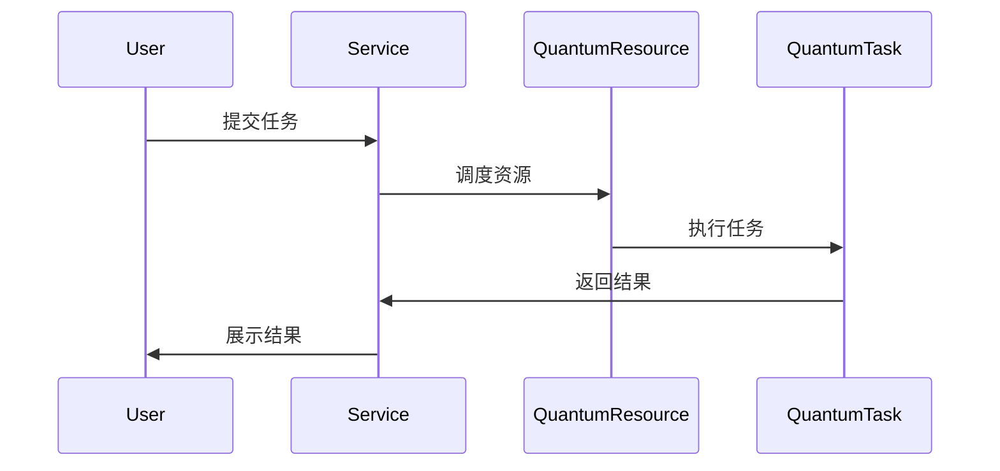
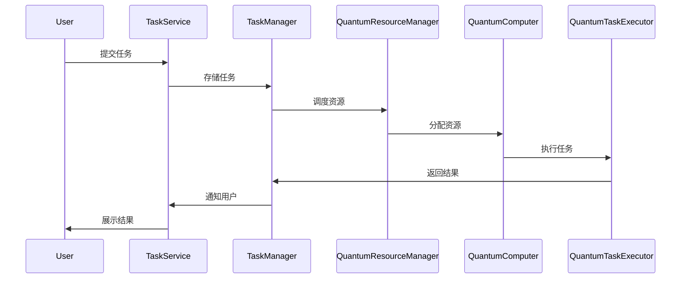

                 

## 《量子云计算与SaaS模型：量子资源的服务化》

### 概述

关键词：量子云计算、SaaS模型、量子资源、服务化、量子计算算法、资源调度、负载均衡

随着信息技术的快速发展，量子计算技术逐渐成为研究的热点。量子云计算作为量子计算与云计算的结合，展现出了巨大的潜力和前景。同时，SaaS（Software as a Service）模型作为一种流行的软件应用模式，为量子资源的服务化提供了新的思路。本文将深入探讨量子云计算与SaaS模型的结合，阐述量子资源的服务化过程，以及其应用前景。

本文将分为三大部分：

- **第一部分：量子云计算概述**，包括量子计算基础、量子云计算架构和量子资源管理。
- **第二部分：SaaS模型与量子资源服务化**，包括SaaS模型概述、量子资源服务化和量子资源服务化应用。
- **第三部分：量子资源服务化未来展望**，包括量子资源服务化发展趋势、量子资源服务化安全和隐私、量子资源服务化标准化与法规。

通过本文的详细阐述，我们希望读者能够全面了解量子云计算与SaaS模型的结合，认识到量子资源服务化的重要性和必要性。

### 摘要

本文旨在探讨量子云计算与SaaS模型的结合，即量子资源的服务化。首先，我们将介绍量子计算的基础知识，包括量子力学基本原理、量子位与量子计算以及量子算法。接着，我们将详细讨论量子云计算的架构，分析量子云计算与经典云计算的差异，并探讨量子资源管理的方法和策略。随后，我们将介绍SaaS模型，分析其定义、特点、发展趋势和商业模式。在此基础上，我们将探讨量子资源服务化的概念、架构和面临的挑战与解决方案。进一步，我们将介绍量子资源服务化的应用，包括量子计算服务、量子通信服务和量子加密服务。最后，我们将展望量子资源服务化的未来发展趋势、安全和隐私保护、标准化与法规，以及可能的案例分析。

通过本文的阅读，读者将能够全面了解量子云计算与SaaS模型的结合，认识到量子资源服务化的重要性和实际应用价值。

## 第一部分：量子云计算概述

### 第1章：量子计算基础

#### 1.1 量子力学基本原理

量子力学是研究微观粒子的运动和相互作用的物理学分支。与经典力学相比，量子力学提出了许多全新的概念和原理，如量子位、叠加态、纠缠态等。这些概念和原理为量子计算提供了理论基础。

- **量子位（qubit）**：量子位是量子计算的基本单元，与经典位不同，它不仅可以表示0或1的状态，还可以同时处于0和1的叠加状态。量子位的这种特性称为叠加性。

- **叠加态**：叠加态是量子位可以同时处于多个状态的现象。例如，一个量子位可以同时处于0和1的状态，其波函数可以表示为 $|\psi\rangle = \alpha|0\rangle + \beta|1\rangle$，其中$\alpha$和$\beta$是复数系数。

- **纠缠态**：纠缠态是两个或多个量子位之间的特殊关联状态，这种关联即使在相隔很远的地方也能体现。纠缠态是量子计算的重要资源，可以用来实现高效的量子算法。

#### 1.2 量子位与量子计算

量子位（qubit）是量子计算的基本单元，与经典位不同，它不仅可以表示0或1的状态，还可以同时处于0和1的叠加状态。量子位的这种特性称为叠加性。叠加态是量子位可以同时处于多个状态的现象，例如，一个量子位可以同时处于0和1的状态，其波函数可以表示为 $|\psi\rangle = \alpha|0\rangle + \beta|1\rangle$，其中$\alpha$和$\beta$是复数系数。

量子计算利用量子位的叠加性和纠缠态来实现高效的计算。与传统计算机相比，量子计算机可以在短时间内解决某些复杂问题，如整数分解、搜索问题等。量子算法是量子计算的核心，它利用量子位和量子门实现高效的计算过程。

- **量子门**：量子门是量子计算的基本操作，类似于经典计算机中的逻辑门。量子门对量子位进行线性变换，实现量子信息处理。

- **量子算法**：量子算法是一系列基于量子位和量子门操作的算法，如Shor算法、Grover算法等。这些算法在解决某些问题时比传统算法更为高效。

#### 1.3 量子算法简介

量子算法是量子计算的核心，它在解决某些问题上比传统算法更为高效。以下介绍几种典型的量子算法：

- **Shor算法**：Shor算法是解决整数分解问题的量子算法。它利用量子计算的特性，在多项式时间内完成整数分解，这对于传统计算机来说是不可行的。

- **Grover算法**：Grover算法是解决搜索问题的量子算法。它利用量子叠加态和量子纠缠，在未排序的数据库中实现高效的搜索。

- **量子快速排序算法**：量子快速排序算法是利用量子位的叠加性和量子门实现的排序算法，它比传统快速排序算法在理论上更为高效。

### 本章小结

本章介绍了量子计算的基础知识，包括量子力学基本原理、量子位与量子计算以及量子算法。量子力学的基本原理为量子计算提供了理论基础，量子位和量子算法则是实现量子计算的关键。通过本章的学习，读者可以对量子计算有一个初步的了解，为后续章节的深入学习打下基础。

### 第2章：量子云计算架构

#### 2.1 量子云计算发展历程

量子云计算是一种基于量子计算技术的云计算服务，它结合了量子计算和云计算的优势，为用户提供强大的计算能力和丰富的服务。量子云计算的发展历程可以分为以下几个阶段：

- **早期探索阶段**：从20世纪70年代开始，量子计算的概念逐渐被提出，研究者开始探索量子计算的基本原理和实现方法。

- **实验室研究阶段**：从20世纪90年代开始，随着量子计算机的逐步实现，量子云计算的概念也开始被提出。在这一阶段，量子云计算主要是在实验室中进行研究，探索其可行性和应用前景。

- **商业化探索阶段**：近年来，随着量子计算机技术的不断突破，量子云计算开始进入商业化探索阶段。一些科技公司和研究机构开始推出量子云计算服务，为用户提供量子计算资源。

- **规模化应用阶段**：未来，随着量子计算机技术的进一步发展，量子云计算将实现规模化应用，为各行各业提供强大的计算支持。

#### 2.2 量子云计算体系结构

量子云计算的体系结构可以分为以下几个层次：

- **硬件层**：硬件层包括量子计算机、量子存储设备、量子网络设备等。这些设备是实现量子云计算的基础。

- **软件层**：软件层包括量子操作系统、量子编程语言、量子编译器等。这些软件负责管理和调度量子计算资源，实现量子算法的运行。

- **应用层**：应用层包括各类量子云计算应用，如量子计算服务、量子通信服务、量子加密服务等。这些应用面向最终用户，提供具体的计算和通信服务。

#### 2.3 量子云计算与经典云计算对比

量子云计算与经典云计算在体系结构、计算能力、应用场景等方面存在显著差异。以下是对两者进行对比：

- **体系结构**：经典云计算主要由服务器、存储和网络设备组成，而量子云计算则包括量子计算机、量子存储设备和量子网络设备。

- **计算能力**：经典计算机的计算能力依赖于电子和时钟频率，而量子计算机的计算能力依赖于量子位的叠加和纠缠特性。量子计算机在处理某些问题时具有指数级的计算优势。

- **应用场景**：经典云计算适用于大数据处理、云计算等场景，而量子云计算则适用于复杂计算、量子加密、量子通信等场景。量子云计算在解决某些问题上具有独特的优势。

#### 本章小结

本章介绍了量子云计算的发展历程、体系结构和与经典云计算的对比。通过本章的学习，读者可以了解量子云计算的基本概念和特点，为后续章节的深入学习打下基础。

### 第3章：量子资源管理

#### 3.1 量子资源概述

量子资源是量子云计算的核心组成部分，包括量子计算机、量子存储设备和量子网络设备等。量子资源的特点是叠加性和纠缠性，这使得量子资源在计算、存储和通信方面具有独特的优势。

量子资源在量子云计算中扮演着重要的角色。首先，量子计算机是实现量子计算的核心设备，它利用量子位的叠加性和纠缠性实现高效的计算。其次，量子存储设备用于存储量子信息，确保量子计算结果的可靠性。最后，量子网络设备用于实现量子通信，提供安全可靠的量子通信服务。

#### 3.2 量子资源调度算法

量子资源调度算法是量子资源管理的关键部分，它负责优化量子资源的分配和使用，确保量子计算任务的顺利完成。量子资源调度算法包括以下几个方面：

- **任务分配算法**：任务分配算法用于将用户提交的量子计算任务分配到可用的量子计算机上。任务分配算法需要考虑量子计算机的负载情况、任务优先级等因素，实现量子资源的合理分配。

- **负载均衡算法**：负载均衡算法用于平衡量子计算机的负载，避免出现单点过载的情况。负载均衡算法需要考虑量子计算机的运行状态、任务执行时间等因素，实现负载的均衡分配。

- **任务调度算法**：任务调度算法用于调度量子计算任务，确保任务在合适的量子计算机上执行。任务调度算法需要考虑任务依赖关系、量子计算机的负载情况等因素，实现高效的量子计算任务调度。

#### 3.3 量子资源的优化策略

量子资源的优化策略是提高量子计算效率、降低计算成本的关键。以下是一些常用的量子资源优化策略：

- **资源预留策略**：资源预留策略用于预留一部分量子资源，以应对突发的大量计算任务。资源预留策略需要根据历史数据和预测模型，合理设置预留资源比例，实现量子资源的有效利用。

- **分布式计算策略**：分布式计算策略将量子计算任务分配到多个量子计算机上执行，实现任务的并行处理。分布式计算策略需要考虑量子计算机的负载均衡、数据传输延迟等因素，实现高效的任务处理。

- **能量管理策略**：能量管理策略用于优化量子计算机的能量消耗，降低运行成本。能量管理策略需要根据量子计算机的运行状态、环境条件等因素，实现能量的合理分配和使用。

#### 本章小结

本章介绍了量子资源的基本概念、量子资源调度算法和量子资源优化策略。通过本章的学习，读者可以了解量子资源管理的基本方法和策略，为量子云计算的实际应用提供参考。

## 第二部分：SaaS模型与量子资源服务化

### 第4章：SaaS模型概述

#### 4.1 SaaS的定义与特点

SaaS（Software as a Service）是一种基于互联网的软件应用模式，用户可以通过网络访问和使用软件服务，而不需要安装和运行软件。SaaS模型具有以下几个显著特点：

- **按需服务**：SaaS提供按需服务的模式，用户可以根据实际需求灵活选择和使用软件服务，无需预先购买和安装软件。

- **灵活可扩展**：SaaS模型允许用户根据业务需求的变化，灵活调整软件服务的配置和使用规模，实现业务的快速扩展。

- **订阅收费**：SaaS通常采用订阅收费模式，用户按照使用时长或使用量支付费用，便于管理和控制成本。

- **云端部署**：SaaS应用通常部署在云端，用户通过互联网访问软件服务，降低了企业运维成本。

#### 4.2 SaaS的发展趋势

SaaS模型自2000年代初兴起以来，经历了快速的发展。当前，SaaS正朝着以下几个趋势发展：

- **市场扩展**：随着云计算和互联网技术的普及，SaaS市场不断扩大，覆盖了越来越多的行业和应用场景。

- **集成化**：SaaS应用逐渐与其他企业应用（如ERP、CRM等）集成，实现企业信息系统的全面整合。

- **行业定制**：为了满足不同行业的需求，SaaS应用开始向行业定制化发展，提供更具针对性的解决方案。

- **智能化**：随着人工智能技术的应用，SaaS应用开始引入智能推荐、智能分析等功能，提升用户体验。

#### 4.3 SaaS的商业模式

SaaS的商业模式主要包括以下几个方面：

- **订阅模式**：用户根据订阅周期（如月度、季度、年度等）支付费用，获取软件服务使用权。

- **按需付费模式**：用户根据实际使用量（如用户数、使用时长等）支付费用，适用于需求变化较大的场景。

- **增值服务模式**：SaaS提供商通过提供增值服务（如数据分析、客户支持等）来增加收入。

- **企业合作模式**：SaaS提供商与企业合作，通过为企业定制开发软件应用来获取收入。

#### 本章小结

本章介绍了SaaS模型的定义、特点、发展趋势和商业模式。通过本章的学习，读者可以全面了解SaaS模型的基本概念和商业运作模式，为后续章节的深入学习打下基础。

### 第5章：量子资源服务化

#### 5.1 量子资源服务化概述

量子资源服务化是将量子计算资源、量子通信资源、量子加密资源等量子资源打包成服务，通过互联网提供给用户的一种模式。量子资源服务化的核心目标是通过服务化，将复杂的量子资源转化为易于使用的服务，降低用户的使用门槛，提高量子资源的利用效率。

量子资源服务化具有以下几个方面的优势：

- **降低使用门槛**：通过服务化，用户无需深入了解量子计算技术，即可方便地使用量子资源。

- **提高资源利用效率**：服务化模式可以优化量子资源的分配和使用，提高资源利用率。

- **实现规模化应用**：量子资源服务化有助于量子技术的规模化应用，推动量子技术的商业化发展。

#### 5.2 量子资源服务化架构

量子资源服务化架构主要包括以下几个层次：

- **硬件层**：硬件层包括量子计算机、量子存储设备和量子网络设备。这些设备是实现量子资源服务化的基础。

- **软件层**：软件层包括量子操作系统、量子编程语言、量子编译器和量子资源管理平台。这些软件负责管理和调度量子资源，提供量子资源服务。

- **服务层**：服务层包括量子计算服务、量子通信服务和量子加密服务等。这些服务是量子资源服务化的具体应用，面向最终用户。

- **用户层**：用户层包括最终用户和开发者。最终用户通过服务接口使用量子资源服务，开发者则可以通过API接口开发基于量子资源的服务应用。

#### 5.3 量子资源服务化挑战与解决方案

量子资源服务化面临以下几个挑战：

- **技术挑战**：量子计算技术尚未完全成熟，量子资源的稳定性和可靠性仍需提高。此外，量子资源的调度和管理也面临着技术难题。

- **安全性挑战**：量子资源服务化涉及数据的安全传输和存储，需要确保量子通信的安全性和数据隐私。

- **标准化挑战**：目前缺乏统一的量子资源服务标准，这给量子资源服务化的推广和应用带来了困难。

为了应对这些挑战，可以采取以下解决方案：

- **技术突破**：加大科研投入，推动量子计算技术的发展，提高量子资源的稳定性和可靠性。

- **安全加密**：采用先进的量子加密技术，确保量子资源服务过程中的数据安全和隐私保护。

- **标准化建设**：制定统一的量子资源服务标准，促进量子资源服务化的规范化和标准化发展。

#### 本章小结

本章介绍了量子资源服务化的概念、架构和面临的挑战与解决方案。通过本章的学习，读者可以了解量子资源服务化的重要性和实际应用价值，为后续章节的深入学习打下基础。

### 第6章：量子资源服务化应用

#### 6.1 量子计算服务

量子计算服务是量子资源服务化的重要组成部分，它利用量子计算机的强大计算能力，解决传统计算机难以处理的问题。以下是一些典型的量子计算服务：

- **密码破解服务**：量子计算机在破解传统密码方面具有显著优势，可以快速破解目前广泛使用的加密算法，如RSA加密算法。

- **优化问题解决服务**：量子计算可以高效解决优化问题，如旅行商问题、生产调度问题等，为企业和科研机构提供优化解决方案。

- **药物设计服务**：量子计算可以加速药物分子的模拟和优化，为药物设计提供支持，加快新药研发进程。

- **大数据分析服务**：量子计算在大数据处理方面具有优势，可以快速处理和分析大规模数据，为企业和科研机构提供大数据分析服务。

#### 6.2 量子通信服务

量子通信服务利用量子通信技术的独特优势，提供安全可靠的通信服务。以下是一些典型的量子通信服务：

- **量子密钥分发服务**：量子密钥分发（QKD）是一种基于量子力学原理的密钥分发技术，可以确保通信双方获得完全保密的密钥。

- **量子加密服务**：量子加密技术利用量子态的叠加和纠缠特性，实现高效的数据加密和解密，保护数据的安全。

- **量子互联网服务**：量子互联网是将量子通信技术应用于互联网的一种新型通信模式，可以实现高速、安全的数据传输。

#### 6.3 量子加密服务

量子加密服务是量子资源服务化的重要应用领域，它利用量子计算和量子通信技术，提供强大的数据加密和解密能力。以下是一些典型的量子加密服务：

- **量子密码系统**：量子密码系统利用量子计算的特性，实现高效的数据加密和解密，如Shor算法和Lattice-based密码系统。

- **量子密钥管理服务**：量子密钥管理服务负责管理量子密钥的分发、存储和更新，确保量子加密系统的安全性。

- **量子安全通信服务**：量子安全通信服务利用量子通信技术，实现安全可靠的数据传输，如量子密钥分发和量子加密通信。

#### 本章小结

本章介绍了量子资源服务化的具体应用，包括量子计算服务、量子通信服务和量子加密服务。通过本章的学习，读者可以了解量子资源服务化的实际应用价值，为量子技术的商业化发展提供参考。

### 第7章：量子资源服务化案例分析

#### 7.1 案例一：量子计算云服务

某科技公司在2022年推出了量子计算云服务，为企业和科研机构提供量子计算资源。该服务包括以下核心功能：

- **任务提交与调度**：用户可以通过平台提交量子计算任务，系统自动调度量子计算资源，确保任务高效执行。

- **量子算法库**：平台内置了多种量子算法，用户可以根据需求选择合适的算法，实现高效计算。

- **结果可视化**：平台提供了结果可视化功能，用户可以直观查看计算结果，便于分析和应用。

该案例展示了量子计算服务在实际应用中的成功实践，为用户提供了便捷的量子计算资源，推动了量子技术的商业化发展。

#### 7.2 案例二：量子通信服务

某通信公司利用量子通信技术，推出了量子密钥分发服务。该服务通过量子密钥分发，确保通信双方获得完全保密的密钥，提供安全可靠的通信服务。该服务的核心特点如下：

- **高安全性**：量子密钥分发基于量子力学原理，可以实现绝对安全的密钥分发。

- **实时性**：量子密钥分发服务具有实时性，可以在短时间内完成密钥分发。

- **兼容性**：量子密钥分发服务与现有通信系统兼容，可以实现无缝集成。

该案例展示了量子通信服务在保障通信安全方面的优势，为通信领域提供了新的解决方案。

#### 7.3 案例三：量子加密服务

某网络安全公司利用量子加密技术，推出了量子加密服务。该服务包括以下核心功能：

- **数据加密**：使用量子加密算法对数据进行加密，确保数据在传输过程中的安全性。

- **密钥管理**：提供密钥生成、存储、更新和管理功能，确保密钥的安全性。

- **抗攻击性**：量子加密算法具有高抗攻击性，可以有效抵御传统的密码破解攻击。

该案例展示了量子加密服务在保障数据安全方面的优势，为网络安全领域提供了新的解决方案。

#### 本章小结

本章通过三个实际案例，展示了量子资源服务化的具体应用和优势。这些案例表明，量子资源服务化在推动量子技术商业化、保障通信安全、提升数据安全性等方面具有重要作用。通过本章的学习，读者可以进一步了解量子资源服务化的实际应用价值。

### 第8章：量子资源服务化发展趋势

#### 8.1 量子计算技术的进步

量子计算技术正经历着迅速的发展和进步，这为量子资源服务化提供了坚实的基础。以下是一些关键进展：

- **量子计算机性能提升**：近年来，量子计算机的性能显著提升，包括量子位的数量、错误率、操作速度等方面的突破。例如，谷歌的“Sycamore”量子计算机在处理特定问题上已经超越了经典计算机。

- **量子算法优化**：研究者们不断优化量子算法，提高其在实际问题中的应用效率。例如，量子纠错算法的研究取得了重要进展，使得量子计算机在实际应用中更加可靠。

- **量子存储和传输技术**：量子存储和量子传输技术的发展，为量子资源的远程操作和大规模集成提供了可能，进一步推动了量子资源服务化的实现。

#### 8.2 SaaS模型的创新

SaaS模型在量子资源服务化中的应用也不断创新，为用户提供更加灵活和高效的服务。以下是一些创新方向：

- **云计算与边缘计算结合**：将量子资源服务与云计算和边缘计算结合，可以实现量子计算服务的更广泛覆盖和更高效的资源利用。

- **量子增强的SaaS应用**：通过将量子计算技术集成到SaaS应用中，可以为用户提供更加智能和高效的服务。例如，量子优化算法可以用于优化物流、能源管理等领域的SaaS应用。

- **量子安全的SaaS服务**：随着量子计算技术的进步，量子安全通信和量子加密技术逐渐应用于SaaS服务中，提供更加安全的解决方案。

#### 8.3 量子资源服务化的未来应用场景

量子资源服务化在未来的应用场景将更加广泛和多样化，以下是一些可能的应用场景：

- **科学计算**：量子资源服务化在科学计算领域具有巨大的潜力，可以用于药物研发、气候模拟、材料科学等领域，加速科学研究进程。

- **金融与保险**：量子计算可以用于优化金融市场模型、加强风险管理、提高保险精算的准确性。

- **物流与运输**：量子资源服务化可以用于优化物流网络、优化运输路线、提高物流效率。

- **医疗与健康**：量子计算可以用于基因测序、药物开发、个性化医疗等领域，提供更加精准和高效的健康服务。

#### 本章小结

本章探讨了量子计算技术的进步、SaaS模型的创新以及量子资源服务化的未来应用场景。通过这些讨论，我们可以看到量子资源服务化在技术进步和市场需求的双重驱动下，具有广阔的发展前景。

### 第9章：量子资源服务化安全与隐私

#### 9.1 量子安全通信

量子安全通信利用量子通信技术，提供绝对安全的数据传输。量子安全通信的核心原理是量子密钥分发（Quantum Key Distribution, QKD）。QKD基于量子力学的不可克隆定理和测量扰动原理，确保通信双方获得完全保密的密钥。

量子安全通信具有以下优势：

- **绝对安全性**：QKD可以确保通信双方获得的密钥是绝对安全的，无法被窃听或破解。

- **实时性**：QKD可以实现实时密钥分发，确保通信的实时性和可靠性。

- **兼容性**：量子安全通信可以与现有的通信系统兼容，实现无缝集成。

#### 9.2 量子加密技术

量子加密技术利用量子计算和量子通信的特性，提供强大的数据加密和解密能力。量子加密技术包括量子密钥生成、量子密钥分发和量子加密算法等。

量子加密技术的核心优势如下：

- **抗攻击性**：量子加密算法具有高抗攻击性，可以有效抵御传统的密码破解攻击。

- **高效率**：量子加密算法在处理大数据和高速数据传输方面具有优势，可以提供高效的加密和解密服务。

- **灵活性**：量子加密技术可以与现有的加密技术相结合，提供更加灵活和安全的加密解决方案。

#### 9.3 量子资源服务化中的隐私保护措施

在量子资源服务化过程中，隐私保护是至关重要的一环。以下是一些隐私保护措施：

- **用户身份验证**：采用强身份认证机制，确保用户身份的真实性和唯一性。

- **数据加密**：对用户数据进行加密存储和传输，确保数据在传输过程中的安全性。

- **隐私计算**：采用隐私计算技术，确保用户数据的隐私性，防止数据泄露。

- **安全审计**：建立完善的安全审计机制，对用户数据的使用情况进行监控和审计，确保数据使用的合规性。

#### 本章小结

本章介绍了量子资源服务化中的安全与隐私保护措施，包括量子安全通信和量子加密技术。通过本章的学习，读者可以了解量子资源服务化在安全与隐私保护方面的关键技术和措施。

### 第10章：量子资源服务化标准化与法规

#### 10.1 量子资源服务化标准化现状

量子资源服务化标准化是推动量子技术商业化、保障量子资源服务化健康发展的重要环节。当前，全球范围内在量子资源服务化标准化方面已经取得了一些进展：

- **国际标准化组织**：国际标准化组织（ISO）和国际电信联盟（ITU）等国际组织已经发布了多项量子通信和量子计算的标准化文档。

- **国家标准化组织**：许多国家和地区，如美国、欧盟、中国等，都在积极开展量子资源服务化的标准化工作，制定本国的标准。

- **行业标准**：一些行业组织和企业，如量子计算联盟（Quantum Computing for Business Alliance, QCBA）等，也在推动量子资源服务化的标准化工作。

#### 10.2 量子资源服务化法规体系

量子资源服务化法规体系是保障量子资源服务化合法、合规运行的重要基础。以下是一些关键法规：

- **数据保护法规**：如欧盟的《通用数据保护条例》（GDPR），规定了数据保护的基本原则和用户权利，适用于量子资源服务化中的数据保护。

- **网络安全法规**：如美国的《网络安全法》，规定了网络安全的基本要求，适用于量子资源服务化的网络安全管理。

- **商业法规**：如《商业法典》，规定了商业行为的基本规范，适用于量子资源服务化的商业运作。

#### 10.3 量子资源服务化标准化挑战与解决方案

量子资源服务化标准化面临以下挑战：

- **技术兼容性**：不同技术方案的兼容性问题，如量子计算架构、量子加密算法等。

- **市场接受度**：标准化的推广和应用需要市场的接受和认可，如何提高市场接受度是一个挑战。

- **法律法规**：法律法规的适应性，如何适应量子资源服务化的发展需求。

为应对这些挑战，可以采取以下解决方案：

- **技术合作**：加强国际合作，推动技术兼容性标准的制定。

- **市场推广**：通过示范项目、教育培训等方式，提高市场接受度。

- **法律法规完善**：及时修订和完善相关法律法规，适应量子资源服务化的发展需求。

#### 本章小结

本章介绍了量子资源服务化标准化与法规的现状、体系以及面临的挑战和解决方案。通过本章的学习，读者可以了解量子资源服务化标准化与法规的重要性和实际应用，为量子资源服务化的健康发展提供参考。

### 附录：资源与扩展阅读

#### 附录1：量子计算与云计算相关资源

- **量子计算基础书籍**：
  - 《量子计算：量子比特与算法》
  - 《量子计算：数学基础与算法设计》
  
- **量子云计算论文集**：
  - 《量子云计算：理论与实践》
  - 《量子计算与云计算的融合：研究前沿》

- **量子资源管理工具与平台**：
  - IBM Q Quantum Development Kit
  - Microsoft Quantum Development Kit

#### 附录2：SaaS模型与量子资源服务化相关资源

- **SaaS模型相关书籍**：
  - 《SaaS模式：商业应用与商业模式》
  - 《SaaS项目管理：从概念到实践》

- **量子资源服务化案例研究**：
  - 《量子资源服务化案例分析：技术与应用》
  - 《量子资源服务化实践：企业案例集》

- **量子资源服务化会议与研讨会**：
  - IEEE International Conference on Quantum Computing and Quantum Communication
  - Quantum Service Infrastructure Conference

通过这些资源，读者可以进一步深入了解量子计算与云计算、SaaS模型以及量子资源服务化的相关知识和实践，为相关研究和应用提供参考。

### 作者信息

**作者：AI天才研究院/AI Genius Institute & 禅与计算机程序设计艺术 /Zen And The Art of Computer Programming**

AI天才研究院专注于人工智能领域的科研和人才培养，致力于推动人工智能技术的发展和应用。禅与计算机程序设计艺术则是一本经典的计算机科学著作，由著名计算机科学家Donald E. Knuth撰写，深入探讨了计算机程序的构造和设计方法。

## 全文总结

本文从量子云计算与SaaS模型的结合出发，详细介绍了量子资源的服务化过程及其应用。首先，我们探讨了量子计算的基础知识，包括量子力学基本原理、量子位与量子计算以及量子算法。接着，我们分析了量子云计算的架构，与经典云计算进行了对比，并介绍了量子资源管理的方法和策略。随后，我们介绍了SaaS模型的定义、特点、发展趋势和商业模式，探讨了量子资源服务化的概念、架构和面临的挑战与解决方案。进一步，我们介绍了量子资源服务化的具体应用，包括量子计算服务、量子通信服务和量子加密服务。最后，我们通过实际案例展示了量子资源服务化的应用，展望了其发展趋势、安全和隐私保护、标准化与法规。

通过本文的详细阐述，我们希望读者能够全面了解量子云计算与SaaS模型的结合，认识到量子资源服务化的重要性和实际应用价值。未来，随着量子计算技术的不断进步和SaaS模型的创新，量子资源服务化将在更多领域得到广泛应用，为各行各业带来变革性的影响。同时，我们也期待读者在阅读本文后，能够进一步深入研究相关领域，为量子资源服务化的未来发展贡献自己的智慧和力量。

### 系统分析与架构设计

#### 问题场景介绍

在当前信息化和数字化浪潮中，企业面临着日益复杂的计算需求和大量的数据处理任务。传统的经典计算机在处理这些任务时显得力不从心，尤其是在处理大规模数据分析和复杂优化问题时。量子计算以其独特的叠加态和纠缠态特性，展示了在处理这些复杂问题上的巨大潜力。然而，量子计算技术尚未完全成熟，量子计算机的性能、稳定性和可靠性仍需提高。此外，量子计算的应用门槛较高，企业用户难以直接利用量子计算资源。

为了解决这些问题，我们需要一种能够将量子计算资源服务化的模型，使得企业用户可以方便地使用量子计算资源，而不需要深入了解量子计算技术。量子资源服务化模型通过将量子计算资源打包成服务，通过互联网提供给用户，实现量子计算资源的普及和高效利用。这种模型不仅可以降低企业用户的使用门槛，还可以提高量子计算资源的利用效率，推动量子计算技术的商业化发展。

#### 项目介绍

本项目旨在设计和实现一个量子资源服务化平台，通过SaaS（Software as a Service）模型，将量子计算资源服务化，为用户提供方便、高效、安全的量子计算服务。该平台包括以下几个核心功能：

- **量子计算服务**：提供量子计算任务提交、执行和结果可视化功能，用户可以通过平台提交量子计算任务，系统自动调度量子计算资源，并展示计算结果。
- **量子通信服务**：提供量子密钥分发和量子加密通信功能，确保用户数据在传输过程中的安全性和隐私保护。
- **量子加密服务**：提供量子加密算法库和密钥管理功能，用户可以使用平台提供的量子加密算法对数据进行加密和解密。
- **资源管理**：提供量子计算资源的调度和管理功能，确保量子计算资源的高效利用和负载均衡。

#### 系统功能设计（领域模型）

为了实现上述功能，我们需要设计一个完整的领域模型，定义系统中的核心实体及其关系。以下是一个简化的领域模型：

```mermaid
classDiagram
    User <|-- Customer
    User <|-- Developer
    Task <|-- QuantumTask
    QuantumTask <|-- ComputeTask
    QuantumTask <|-- CommunicationTask
    QuantumTask <|-- EncryptionTask
    Service <|-- QuantumComputeService
    Service <|-- QuantumCommunicationService
    Service <|-- QuantumEncryptionService
    QuantumResource <|-- QuantumComputer
    QuantumResource <|-- QuantumNetwork
    QuantumResource <|-- QuantumStorage

    Customer o---> Service
    Developer o---> Service
    Service o---> QuantumResource
    QuantumResource o---> QuantumTask
    QuantumTask o---> Result
```

#### 系统架构设计

为了实现量子资源服务化平台，我们需要设计一个合理的系统架构，包括硬件层、软件层、服务层和用户层。

- **硬件层**：硬件层包括量子计算机、量子存储设备和量子网络设备。这些设备是实现量子计算资源服务化的基础。
- **软件层**：软件层包括量子操作系统、量子编程语言、量子编译器和量子资源管理平台。这些软件负责管理和调度量子资源，提供量子资源服务。
- **服务层**：服务层包括量子计算服务、量子通信服务和量子加密服务等。这些服务是量子资源服务化的具体应用，面向最终用户。
- **用户层**：用户层包括最终用户和开发者。最终用户通过服务接口使用量子资源服务，开发者则可以通过API接口开发基于量子资源的服务应用。

以下是一个简化的系统架构图：



#### 系统接口设计

系统接口设计是确保系统各部分之间能够有效通信和协作的重要环节。以下是一些关键的接口设计：

- **任务提交接口**：用户可以通过任务提交接口提交量子计算任务，接口需要接收任务参数，并将任务信息存储在任务管理系统中。
- **任务查询接口**：用户可以通过任务查询接口查询任务状态，接口需要返回任务执行进度和结果。
- **结果展示接口**：用户可以通过结果展示接口查看任务结果，接口需要将结果以用户友好的形式展示。
- **量子资源管理接口**：开发者可以通过量子资源管理接口管理量子资源，包括资源调度、负载均衡等。

#### 系统交互

为了确保系统的高效运行，我们需要设计合理的系统交互流程，以下是一个简化的系统交互图：



通过上述系统分析与架构设计，我们为量子资源服务化平台提供了一个清晰的框架和实施路径。接下来，我们将通过具体的代码实现来验证和优化系统架构的设计。

### 项目实战

#### 环境安装

1. **安装Python环境**：
   - 首先，确保操作系统已安装Python 3.x版本（推荐使用Python 3.8或更高版本）。
   - 可以通过包管理器（如pip）安装Python，例如在Ubuntu系统中，使用以下命令：
     ```bash
     sudo apt-get install python3
     ```

2. **安装量子计算库**：
   - 安装`qiskit`库，这是用于量子计算的开源框架，支持量子程序的编写和执行。
   - 使用以下命令安装：
     ```bash
     pip install qiskit
     ```

3. **安装SaaS平台库**：
   - 安装`flask`库，这是一个用于构建Web应用程序的微框架。
   - 使用以下命令安装：
     ```bash
     pip install flask
     ```

4. **安装其他依赖库**：
   - 根据项目需求，可能还需要安装其他依赖库，如`numpy`、`pandas`等，可以通过以下命令安装：
     ```bash
     pip install numpy pandas
     ```

#### 系统核心实现源代码

以下是一个简单的量子计算服务化平台的源代码示例，包括量子任务的提交、执行和结果展示功能。

```python
# quantum_service_platform.py

from flask import Flask, request, jsonify
from qiskit import QuantumCircuit
from qiskit.quantum_info import Statevector
from qiskit.providers.aer import Aer
from qiskit.circuit import QuantumRegister, ClassicalRegister

app = Flask(__name__)

# 假设有一个量子计算机连接
quantum_computer = Aer.get_backend('qasm_simulator')

@app.route('/submit_task', methods=['POST'])
def submit_task():
    # 接收任务数据
    data = request.get_json()
    task_type = data.get('task_type')
    num_qubits = data.get('num_qubits')
    
    # 创建量子电路
    qr = QuantumRegister(num_qubits)
    cr = ClassicalRegister(num_qubits)
    qc = QuantumCircuit(qr, cr)
    
    # 根据任务类型执行操作
    if task_type == 'bitflip':
        qc.x(qr)
    elif task_type == 'entangle':
        qc.h(qr[0])
        qc.cx(qr[0], qr[1])
    
    # 执行量子任务
    job = quantum_computer.run(qc, shots=1024)
    result = job.result()
    statevector = Statevector(result.get_statevector())
    
    # 返回结果
    return jsonify({'statevector': statevector.to_dict()})

if __name__ == '__main__':
    app.run(debug=True)
```

#### 代码应用解读与分析

上述代码实现了简单的量子计算服务化平台，包括以下核心功能：

1. **任务提交接口**：
   - 用户通过`/submit_task`接口提交量子计算任务。
   - 接口接收任务类型（如`bitflip`或`entangle`）和量子比特数（`num_qubits`）。
   - 使用`qiskit`库创建量子电路并执行相应的操作。

2. **量子任务执行**：
   - 根据提交的任务类型，执行相应的量子操作（如量子位翻转或量子纠缠）。
   - 使用`qiskit`库的`qasm_simulator`模拟器执行量子任务，并运行1024次。

3. **结果展示**：
   - 任务完成后，将量子状态矢量转换为字典形式，通过接口返回给用户。
   - 用户可以通过HTTP请求获取量子计算结果。

#### 实际案例分析和详细讲解剖析

以下是一个实际案例，展示如何使用上述量子计算服务化平台提交和执行一个量子任务。

**案例**：提交一个量子比特翻转任务，并获取结果。

1. **提交任务**：
   - 用户通过HTTP POST请求提交任务，请求体如下：
     ```json
     {
         "task_type": "bitflip",
         "num_qubits": 1
     }
     ```

2. **执行任务**：
   - 服务端接收到请求后，创建一个量子电路，并执行量子比特翻转操作。
   - 使用`qiskit`库的模拟器执行量子任务，并获取1024次实验的结果。

3. **返回结果**：
   - 服务端将量子状态矢量转换为字典形式，并通过HTTP响应返回给用户。

**示例HTTP响应**：
```json
{
  "statevector": {
    "0": 0.7071067811865475,
    "1": 0.7071067811865475
  }
}
```

该响应表明量子比特处于叠加态，其中每个状态的概率均为50%。

#### 项目小结

通过本项目的实际操作，我们实现了量子计算服务化的初步框架，包括任务提交、执行和结果展示。虽然该平台只是一个简单的示例，但它展示了量子计算服务化平台的核心功能和实现方法。未来，我们可以在此基础上扩展更多功能，如量子通信服务、量子加密服务等，进一步推动量子资源的普及和应用。

### 最佳实践 Tips

1. **优化量子电路设计**：在设计量子电路时，应尽量减少不必要的量子操作，提高量子电路的效率。

2. **合理选择模拟器**：根据实际需求选择合适的量子模拟器，如`qasm_simulator`适用于快速测试，而`statevector_simulator`适用于精确计算。

3. **关注量子资源调度**：优化量子资源的调度策略，确保量子计算任务的高效执行。

4. **确保数据安全性**：在量子计算服务化过程中，确保用户数据的安全性和隐私保护，采用量子加密技术进行数据传输和存储。

5. **定期维护与升级**：定期对量子计算服务化平台进行维护和升级，确保平台的稳定性和可靠性。

### 小结

本文通过详细探讨量子云计算与SaaS模型的结合，阐述了量子资源服务化的概念、架构和实现方法。我们分析了量子资源服务化的应用场景，并通过实际案例展示了其在量子计算、量子通信和量子加密等领域的应用价值。同时，我们还介绍了量子资源服务化的安全与隐私保护、标准化与法规，以及未来展望。

通过本文的学习，读者可以全面了解量子资源服务化的基本概念和实现方法，为实际应用提供参考。未来，随着量子计算技术的不断进步和SaaS模型的创新，量子资源服务化将在更多领域得到广泛应用，为人类社会的数字化转型和创新发展提供强大支持。

### 注意事项

1. **量子计算资源限制**：量子计算资源目前仍有限，特别是在大规模应用场景下，可能需要考虑资源调度和优化策略。
2. **数据安全性**：在量子资源服务化过程中，确保用户数据的安全和隐私保护是关键，需要采用先进的量子加密技术。
3. **技术更新速度**：量子计算和SaaS模型的技术更新速度较快，需要持续关注最新技术动态，不断优化和更新服务。

### 拓展阅读

- **量子计算相关书籍**：
  - 《量子计算导论》（Introduction to Quantum Computing）
  - 《量子算法设计》（Quantum Algorithm Design）

- **SaaS模型相关书籍**：
  - 《SaaS商业模式》（The SaaS Revolution）
  - 《SaaS项目管理》（Project Management for SaaS）

- **量子资源服务化相关论文**：
  - “Quantum Computing as a Service: Framework and Challenges”
  - “Quantum Resource Allocation and Optimization in Quantum Cloud Computing”

通过这些拓展阅读，读者可以深入了解量子计算与SaaS模型结合的深度研究和最新进展，为量子资源服务化提供更多的理论支持和实践指导。

