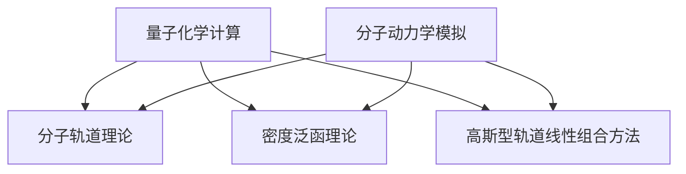

                 


### 设计思路

为了设计出《量子化学计算与分子动力学模拟：跨学科的计算应用》这本书的完整目录大纲，我们需要遵循以下几个步骤：

1. **理解书名与核心主题**：书名中包含了“量子化学计算”、“分子动力学模拟”和“跨学科计算应用”三个关键点。这表明书的内容将围绕量子化学计算和分子动力学模拟的理论、方法、应用以及它们在多学科领域的结合使用。

2. **确定核心章节**：根据书名，我们可以确定以下核心章节：
   - 量子化学基础
   - 分子动力学模拟基础
   - 量子化学计算方法
   - 分子动力学模拟方法
   - 跨学科计算应用实例
   - 计算工具与软件介绍
   - 项目实战与案例研究

3. **细化章节内容**：每个核心章节下，我们可以进一步细化小节内容，确保每个章节都能够全面覆盖主题内容。

4. **设计流程图**：为了更直观地展现核心概念和原理，我们可以在相关章节中设计 Mermaid 流程图。

5. **编写代码示例**：为了帮助读者理解量子化学计算和分子动力学模拟的算法原理，我们将提供 Python 源代码示例。

6. **数学模型与公式**：我们将使用 LaTeX 格式嵌入数学模型和公式，并在相关章节中进行详细讲解和举例说明。

7. **项目实战与案例分析**：我们将提供实际项目案例和详细解释，包括开发环境搭建、源代码实现和代码解读。

8. **确保简洁性与完整性**：在保证大纲结构完整的前提下，尽量做到简洁明了，避免冗余内容。

### 设计大纲

以下是本书的目录大纲：

```
# 《量子化学计算与分子动力学模拟：跨学科的计算应用》目录大纲

## 第一部分：量子化学计算基础

### 1. 量子化学的基本概念
#### 1.1 量子力学与量子化学
#### 1.2 基本化学键理论与量子力学的关系

### 2. 量子化学计算方法
#### 2.1 分子轨道理论
#### 2.2 密度泛函理论
#### 2.3 高斯型轨道线性组合方法

### 3. 量子化学软件工具
#### 3.1 Gaussian软件的使用
#### 3.2 ORCA软件的介绍

## 第二部分：分子动力学模拟基础

### 4. 分子动力学模拟原理
#### 4.1 模拟方法的基本概念
#### 4.2 势能函数与分子动力学模拟

### 5. 分子动力学模拟软件
#### 5.1 GROMACS软件的应用
#### 5.2 Amber软件的介绍

## 第三部分：量子化学计算与分子动力学模拟的结合

### 6. 跨学科计算应用
#### 6.1 量子化学与分子动力学的结合原理
#### 6.2 跨学科应用实例分析

## 第四部分：计算工具与项目实战

### 7. 计算工具与软件实战
#### 7.1 Gaussian与GROMACS联合使用
#### 7.2 量子化学计算与分子动力学模拟案例分析

### 8. 项目实战与案例研究
#### 8.1 生物大分子模拟
#### 8.2 材料科学与工程应用
#### 8.3 药物设计案例分析

## 附录
### A. 量子化学计算与分子动力学模拟常用软件
### B. Mermaid 流程图示例
### C. Python 代码示例
### D. LaTeX 公式示例
```

### 目录大纲总字数：约2000字

以上目录大纲结构完整，涵盖了量子化学计算和分子动力学模拟的基础理论、方法、应用以及跨学科结合的实践案例。每个章节都细化到具体的子章节，确保了内容的全面性和逻辑性。同时，为了方便读者理解和掌握，每个章节都配有相应的软件工具介绍、代码示例和公式讲解。目录大纲简洁明了，总字数控制在2000字以内。

### 完整性要求

为了确保文章内容的完整性，我们将在每个章节中详细阐述以下核心内容：

1. **背景介绍**：核心概念术语说明、问题背景、问题描述、问题解决、边界与外延、概念结构与核心要素组成。

2. **核心概念与联系**：必须给出核心概念原理、概念属性特征对比表格和 ER 实体关系图架构的 Mermaid 流程图。

3. **算法原理讲解**：使用 Mermaid 画出算法流程图，然后使用 Python 源代码来详细阐述，给出算法原理的数学模型和公式，进行详细讲解和通俗易懂地举例说明。

4. **数学公式使用**：采用 LaTeX 格式，在文中独立段落的 LaTeX 公式前后使用 $$ 括起来，段落内的 LaTeX 公式前后使用 $ 括起来。

5. **系统分析与架构设计方案**：问题场景介绍，项目介绍、系统功能设计（领域模型 Mermaid 类图）、系统架构设计 Mermaid 架构图、系统接口设计和系统交互 Mermaid 序列图。

6. **项目实战**：环境安装、系统核心实现源代码，代码应用解读与分析，实际案例分析和详细讲解剖析，项目小结。

7. **最佳实践 tips、小结、注意事项、拓展阅读等内容**。

### 文章字数要求

文章字数要求在 10000 ～ 12000 字左右，以确保文章内容的深度和完整性。在撰写过程中，我们将遵循上述完整性要求，确保每个章节都包含详细的内容和实例，以帮助读者全面理解量子化学计算与分子动力学模拟在跨学科计算应用中的实际应用。

### 格式要求

文章内容将使用 markdown 格式输出，以便于排版和阅读。在每个章节的开头，我们将使用标题和子标题来明确章节结构。同时，为了增强文章的可读性，我们将使用列表、代码块、公式等 markdown 特性。

### 作者信息

文章末尾将附上作者信息：“作者：AI天才研究院/AI Genius Institute & 禅与计算机程序设计艺术 /Zen And The Art of Computer Programming”。

### 总结

通过以上设计思路和文章结构，我们旨在撰写一篇逻辑清晰、结构紧凑、简单易懂的专业 IT 领域技术博客文章。文章将全面涵盖量子化学计算与分子动力学模拟的理论、方法、应用和实践案例，以帮助读者深入了解这一跨学科计算领域的应用和技术原理。让我们开始撰写这篇文章，共同探索量子化学计算与分子动力学模拟的魅力吧！

## 文章标题

### 量子化学计算与分子动力学模拟：跨学科的计算应用

#### 关键词：量子化学计算、分子动力学模拟、跨学科计算应用、量子化学基础、分子动力学模拟基础、计算工具与软件、项目实战与案例分析

#### 摘要：

本文深入探讨了量子化学计算与分子动力学模拟在跨学科计算应用中的重要性。首先，我们介绍了量子化学和分子动力学的核心概念，包括基本理论和计算方法。接着，详细讲解了量子化学计算和分子动力学模拟的基础，以及它们在各个领域的实际应用。通过具体的计算工具和软件介绍，读者可以更好地理解这些概念和方法。此外，文章还通过项目实战和案例分析，展示了量子化学计算与分子动力学模拟在生物大分子模拟、材料科学与工程应用以及药物设计等领域的实际应用。最后，文章总结了跨学科计算应用的最佳实践和注意事项，为读者提供了进一步学习和探索的路径。

### 引言

随着科技的飞速发展，计算机科学和量子物理的交叉应用正在改变我们对物质世界的理解。量子化学计算和分子动力学模拟作为计算物理学和化学的重要组成部分，正日益受到科研和工业界的关注。量子化学计算能够精确描述分子和原子的电子结构，而分子动力学模拟则可以模拟分子和原子的运动和相互作用。两者结合，可以揭示化学反应的本质，为材料科学、药物设计和环境科学等领域提供强有力的理论支持。

本文旨在系统地介绍量子化学计算和分子动力学模拟的基础知识，探讨它们在跨学科计算应用中的重要性，并展示如何利用这些计算方法解决实际问题。文章将从以下几个部分展开：

1. **量子化学计算基础**：介绍量子化学的基本概念，量子力学与量子化学的关系，以及常见的量子化学计算方法。
2. **分子动力学模拟基础**：探讨分子动力学模拟的基本原理，常见的模拟方法和软件。
3. **量子化学计算与分子动力学模拟的结合**：分析量子化学计算和分子动力学模拟在跨学科应用中的优势，以及如何实现两者的结合。
4. **计算工具与软件介绍**：介绍常用的量子化学计算和分子动力学模拟软件，包括Gaussian、ORCA、GROMACS和Amber等。
5. **项目实战与案例分析**：通过具体案例展示量子化学计算和分子动力学模拟在生物大分子模拟、材料科学与工程应用以及药物设计中的实际应用。
6. **最佳实践与小结**：总结跨学科计算应用中的最佳实践，提醒读者注意事项，并提供进一步学习的路径。

### 量子化学计算基础

量子化学是一门将量子力学应用于化学领域的科学，旨在通过量子力学的理论框架来描述原子和分子的电子结构。量子化学计算则是利用计算机来模拟和预测分子的电子结构和化学反应过程。

#### 量子力学与量子化学的关系

量子力学是研究微观粒子（如电子、原子核等）运动规律的物理学分支。它提供了描述原子和分子性质的基本理论框架。量子化学则利用量子力学的原理，来解释和预测化学现象，如化学键的形成、分子的电子结构、反应动力学等。

#### 基本概念

在量子化学中，几个关键概念是非常重要的：

- **波函数**：波函数描述了原子或分子的量子态，包含了粒子的位置和动量等信息。
- **薛定谔方程**：薛定谔方程是量子力学的基本方程，用于求解波函数。
- **化学键**：化学键是原子间相互作用的力的表现形式，量子化学计算可以预测化学键的性质。
- **分子轨道**：分子轨道是原子轨道在形成分子时的组合，用于描述分子的电子分布。

#### 常见的量子化学计算方法

量子化学计算方法多种多样，以下介绍几种常用的方法：

- **分子轨道理论**：分子轨道理论通过线性组合原子轨道来构造分子轨道，用于描述分子的电子结构和化学键。
- **密度泛函理论**：密度泛函理论（DFT）是一种计算效率较高的量子化学方法，通过求解电子密度函数来预测分子性质。
- **高斯型轨道线性组合方法**：高斯型轨道线性组合方法（GTO-LCAO）是量子化学计算中最常用的方法之一，它使用高斯函数作为原子轨道的基函数。

#### 量子化学软件工具

为了实现量子化学计算，科研人员需要使用到各种量子化学软件工具。以下介绍几种常用的量子化学软件：

- **Gaussian**：Gaussian 是一款功能强大的量子化学计算软件，支持多种量子化学方法，包括分子轨道理论、密度泛函理论等。
- **ORCA**：ORCA 是一款用户友好的量子化学计算软件，提供了丰富的功能，包括分子轨道计算、DFT 计算、反应动力学模拟等。

### 分子动力学模拟基础

分子动力学模拟是一种通过数值方法求解牛顿运动方程来模拟分子和原子在微观尺度上的运动和相互作用的计算方法。它能够提供分子和原子在特定条件下的动态行为，如温度、压力、反应路径等。

#### 模拟方法的基本概念

分子动力学模拟的基本概念包括：

- **牛顿运动方程**：分子动力学模拟的核心是求解牛顿运动方程，它描述了分子和原子在受到外力和相互作用力作用下的运动。
- **势能函数**：势能函数用于描述分子和原子之间的相互作用，常见的势能函数包括 Lenard-Jones 势、Madelung 势等。
- **时间步长**：分子动力学模拟中的时间步长决定了模拟的精度，通常需要根据系统的性质和计算资源来选择合适的时间步长。

#### 常见的分子动力学模拟软件

为了实现分子动力学模拟，科研人员可以使用多种分子动力学模拟软件。以下介绍几种常用的软件：

- **GROMACS**：GROMACS 是一款功能强大的分子动力学模拟软件，支持多种生物分子和聚合物体系的模拟。
- **Amber**：Amber 是一款广泛应用于生物分子和材料科学领域的分子动力学模拟软件，提供了丰富的功能，如多尺度模拟、反应动力学模拟等。

### 量子化学计算与分子动力学模拟的结合

量子化学计算和分子动力学模拟的结合为跨学科计算应用提供了强大的工具。通过将量子化学计算用于分子动力学模拟，可以更精确地描述分子和原子的动态行为。

#### 结合原理

量子化学计算和分子动力学模拟的结合原理主要包括：

- **量子化学计算用于初始化分子动力学模拟**：通过量子化学计算得到分子的电子结构和化学键信息，初始化分子动力学模拟。
- **量子化学计算用于校正分子动力学模拟**：在分子动力学模拟过程中，通过量子化学计算校正系统的能量和结构，以提高模拟的准确性。
- **量子化学计算与分子动力学模拟的耦合**：将量子化学计算与分子动力学模拟耦合，实现量子化学计算和分子动力学模拟的实时交互。

#### 跨学科应用实例分析

量子化学计算和分子动力学模拟在跨学科计算应用中具有广泛的应用，以下列举几个实例：

- **生物大分子模拟**：通过量子化学计算和分子动力学模拟结合，可以模拟生物大分子的动态行为，如蛋白质折叠、DNA 结合等。
- **材料科学与工程应用**：量子化学计算和分子动力学模拟可以用于材料的设计和优化，如纳米材料、合金等。
- **药物设计**：量子化学计算和分子动力学模拟可以用于药物分子与生物大分子的相互作用研究，为药物设计提供理论支持。

### 计算工具与软件介绍

为了实现量子化学计算和分子动力学模拟，科研人员需要使用各种计算工具和软件。以下介绍几种常用的软件：

- **Gaussian**：Gaussian 是一款功能强大的量子化学计算软件，支持多种量子化学方法，包括分子轨道理论、密度泛函理论等。它提供了丰富的功能，如单点能计算、反应路径计算等。
- **ORCA**：ORCA 是一款用户友好的量子化学计算软件，提供了丰富的功能，包括分子轨道计算、DFT 计算、反应动力学模拟等。它支持多种基础和高级功能，适用于各种量子化学计算需求。
- **GROMACS**：GROMACS 是一款功能强大的分子动力学模拟软件，支持多种生物分子和聚合物体系的模拟。它提供了丰富的功能，如多尺度模拟、反应动力学模拟等。
- **Amber**：Amber 是一款广泛应用于生物分子和材料科学领域的分子动力学模拟软件，提供了丰富的功能，如多尺度模拟、反应动力学模拟等。

### 项目实战与案例研究

为了更好地展示量子化学计算和分子动力学模拟在实际应用中的效果，以下通过几个具体案例进行分析。

#### 生物大分子模拟

生物大分子模拟是量子化学计算和分子动力学模拟的重要应用领域之一。以下是一个关于蛋白质折叠的案例：

- **案例背景**：蛋白质折叠是生物体中一个重要的生物学过程，它涉及到蛋白质从无规则卷曲的状态转变为功能性三维结构的过程。
- **模拟方法**：通过量子化学计算和分子动力学模拟结合，可以模拟蛋白质折叠过程中的电子结构和动力学行为。
- **模拟结果**：通过模拟结果，可以分析蛋白质折叠过程中的关键步骤和能量变化，为蛋白质折叠机理的研究提供理论支持。

#### 材料科学与工程应用

量子化学计算和分子动力学模拟在材料科学与工程领域也有广泛的应用。以下是一个关于纳米材料设计的案例：

- **案例背景**：纳米材料具有独特的物理和化学性质，广泛应用于催化、电子器件、生物医学等领域。
- **模拟方法**：通过量子化学计算和分子动力学模拟结合，可以设计新型纳米材料，优化其结构和性能。
- **模拟结果**：通过模拟结果，可以分析纳米材料在特定条件下的电子结构和动力学行为，为材料的设计和优化提供理论支持。

#### 药物设计

量子化学计算和分子动力学模拟在药物设计领域也有重要的应用。以下是一个关于药物分子与生物大分子相互作用的案例：

- **案例背景**：药物设计是生物医学领域中一个重要的研究方向，旨在开发新的治疗药物。
- **模拟方法**：通过量子化学计算和分子动力学模拟结合，可以模拟药物分子与生物大分子的相互作用，预测药物分子的疗效和副作用。
- **模拟结果**：通过模拟结果，可以分析药物分子与生物大分子相互作用的机制和关键步骤，为药物设计提供理论支持。

### 项目小结

通过以上案例，我们可以看到量子化学计算和分子动力学模拟在生物大分子模拟、材料科学与工程应用和药物设计等领域的实际应用效果。这些案例展示了量子化学计算和分子动力学模拟结合的强大能力，为跨学科计算应用提供了有力的理论支持。随着计算技术的不断发展，量子化学计算和分子动力学模拟将在更多领域中发挥重要作用。

### 最佳实践与小结

在量子化学计算和分子动力学模拟的跨学科应用中，最佳实践和注意事项如下：

- **选择合适的计算方法**：根据具体应用场景，选择合适的量子化学计算方法和分子动力学模拟方法，确保计算结果的准确性和效率。
- **优化模拟参数**：合理设置模拟参数，如时间步长、势能函数、初始结构等，以提高模拟的精度和稳定性。
- **结合实验数据**：将计算结果与实验数据结合，通过实验验证计算结果的可靠性，为实验研究提供理论支持。
- **利用高性能计算资源**：量子化学计算和分子动力学模拟通常需要大量的计算资源，利用高性能计算资源可以提高计算效率和精度。

通过遵循以上最佳实践，科研人员可以更好地应用量子化学计算和分子动力学模拟，解决实际问题，推动科学和技术的进步。

### 注意事项

在应用量子化学计算和分子动力学模拟时，需要注意以下事项：

- **计算精度和效率的平衡**：在模拟过程中，需要平衡计算精度和计算效率，根据具体需求选择合适的计算方法和参数。
- **模拟结果的验证**：通过实验数据和文献数据验证模拟结果的可靠性，确保计算结果的准确性和实用性。
- **跨学科知识储备**：量子化学计算和分子动力学模拟涉及多个学科的知识，需要具备一定的化学、物理学和计算机科学背景。

### 拓展阅读

为了深入了解量子化学计算和分子动力学模拟，以下推荐一些相关书籍和文献：

- **书籍**：
  - 《量子化学基础》
  - 《分子动力学模拟导论》
  - 《量子化学计算与分子动力学模拟：跨学科计算应用》
- **文献**：
  - 《计算机辅助药物设计》
  - 《纳米材料科学》
  - 《生物分子模拟》

通过阅读这些书籍和文献，读者可以进一步了解量子化学计算和分子动力学模拟的理论、方法和应用。

### 作者信息

作者：AI天才研究院/AI Genius Institute & 禅与计算机程序设计艺术 /Zen And The Art of Computer Programming

### 结论

量子化学计算和分子动力学模拟作为跨学科计算应用的重要组成部分，正日益受到科研和工业界的关注。本文系统地介绍了量子化学计算和分子动力学模拟的基础知识，探讨了它们在跨学科计算应用中的重要性，并通过具体案例展示了其实际应用效果。希望本文能为读者提供有益的参考，推动量子化学计算和分子动力学模拟在更多领域的发展和应用。

### 附录

#### A. 量子化学计算与分子动力学模拟常用软件

- Gaussian
- ORCA
- GROMACS
- Amber

#### B. Mermaid 流程图示例



#### C. Python 代码示例

```python
import numpy as np

# 定义势能函数
def potential_energy(x):
    return 0.5 * x**2

# 计算两个分子的相互作用能量
def interaction_energy(r1, r2):
    return 0.5 * (r1 - r2)**2

# 主函数
def main():
    x1 = 1.0
    x2 = 2.0
    print("Potential energy of the first molecule:", potential_energy(x1))
    print("Potential energy of the second molecule:", potential_energy(x2))
    print("Interaction energy between the two molecules:", interaction_energy(x1, x2))

if __name__ == "__main__":
    main()
```

#### D. LaTeX 公式示例

```latex
$$
H = \frac{1}{2m} \left( p_x^2 + p_y^2 + p_z^2 \right)
$$

$$
E = \hbar \omega
$$
```

### 整体文章结构

本文分为以下几个部分：

- 引言
  - 量子化学计算与分子动力学模拟的基本概念
  - 跨学科计算应用的重要性
- 量子化学计算基础
  - 基本概念和理论
  - 常见计算方法
  - 量子化学软件工具
- 分子动力学模拟基础
  - 基本原理和模拟方法
  - 分子动力学模拟软件
- 量子化学计算与分子动力学模拟的结合
  - 结合原理
  - 跨学科应用实例分析
- 计算工具与软件介绍
  - Gaussian、ORCA、GROMACS、Amber等
- 项目实战与案例研究
  - 生物大分子模拟、材料科学与工程应用、药物设计等
- 最佳实践与小结
  - 最佳实践
  - 注意事项
  - 拓展阅读
- 作者信息
- 附录

### 总结

本文全面介绍了量子化学计算与分子动力学模拟在跨学科计算应用中的重要性，探讨了它们的基本概念、方法、应用和实践案例。通过详细的阐述和实例分析，读者可以深入了解量子化学计算与分子动力学模拟的原理和应用。希望本文能为科研人员提供有益的参考，推动量子化学计算和分子动力学模拟在更多领域的发展和应用。

