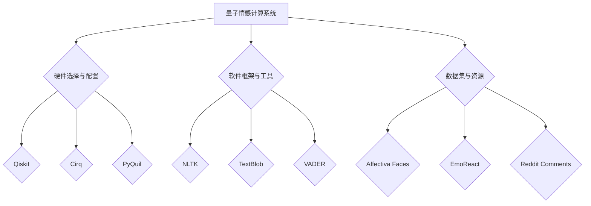
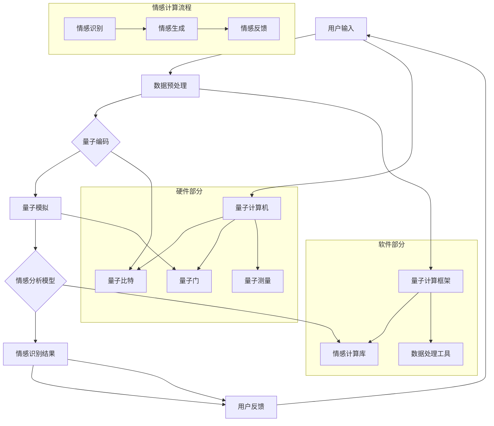

                 

## 文章标题

# 《量子启发的情感计算：模拟量子情感的AI系统》

> 关键词：量子计算、情感计算、AI系统、量子情感模拟

> 摘要：本文探讨了量子计算与情感计算的结合，提出了量子启发的情感计算方法，介绍了量子情感计算的概念框架、实现方法以及应用案例。通过量子模拟和量子神经网络等技术，探讨了如何模拟量子情感，并展示了其在人工智能领域的潜在应用。本文旨在为研究人员和开发者提供对量子情感计算的深入理解和实用指导。

## 目录大纲

### 第一部分：量子计算与情感计算基础

#### 第1章：量子计算简介

1.1 量子计算的基本概念

1.2 量子算法与量子计算模型

#### 第2章：情感计算基础

2.1 情感计算的定义与历史

2.2 情感识别与表达

#### 第3章：量子情感计算的概念框架

3.1 量子情感计算的定义

3.2 量子情感计算的应用领域

### 第二部分：量子启发的情感计算方法

#### 第4章：量子模拟与情感计算

4.1 量子模拟算法

4.2 情感计算中的量子模拟应用

#### 第5章：量子计算与神经网络融合

5.1 量子神经网络（QNN）概述

5.2 量子神经网络在情感计算中的应用

#### 第6章：量子情感计算系统设计

6.1 量子情感计算系统的构建

6.2 量子情感计算系统的实现

### 第三部分：量子情感计算应用案例

#### 第7章：量子情感计算在心理治疗中的应用

7.1 量子情感计算在心理治疗中的潜在应用

7.2 具体应用案例

#### 第8章：量子情感计算在教育中的应用

8.1 量子情感计算在教育中的潜在应用

8.2 具体应用案例

### 第四部分：展望与挑战

#### 第9章：量子情感计算的未来发展

9.1 量子情感计算的长期发展前景

9.2 挑战与机遇

### 附录

#### 附录A：量子情感计算资源与工具

#### 附录B：量子情感计算相关文献

#### 附录：Mermaid流程图

----------------------------------------------------------------

### 量子计算简介

量子计算是21世纪计算领域的一项重大突破，其基于量子力学原理，通过量子位（qubit）的叠加和纠缠来实现高效的计算。量子计算的基本概念主要包括量子位、量子态、量子门和量子算法。

#### 1.1 量子计算的基本概念

**量子位（qubit）**：量子位是量子计算的基本单元，与经典计算机中的比特不同，量子位可以同时处于0和1的状态，这种现象称为叠加。此外，量子位之间可以通过量子纠缠实现信息的快速传递。

**量子态**：量子位可以处于多种可能的量子态，每个量子态都可以用复数系数的线性组合来表示。量子态的叠加和纠缠是量子计算的核心特征。

**量子门**：量子门是作用于量子位上的操作，类似于经典计算机中的逻辑门。量子门通过线性变换将量子态从一种状态转换到另一种状态。

**量子算法**：量子算法是利用量子计算原理来解决问题的算法。常见的量子算法包括Shor算法、Grover算法等，这些算法在特定问题上展示了远超经典算法的性能。

#### 1.2 量子算法与量子计算模型

**量子计算机的工作原理**：量子计算机的工作原理是通过量子位的叠加和纠缠来实现对问题的并行计算，并在最后通过量子测量来获得最终答案。

**量子算法示例**：

- **量子快速排序**：量子快速排序利用量子位的叠加和纠缠，可以在O(n)的时间内完成排序操作。
- **Shor算法**：Shor算法是利用量子计算机在求解大整数因子分解问题上的优势，其运行时间远小于现有最佳经典算法。

### 情感计算基础

情感计算是计算机科学中的一个新兴领域，旨在使计算机能够识别、理解、处理和模拟人类的情感。情感计算的核心任务是情感识别和情感表达。

#### 2.1 情感计算的定义与历史

**情感计算的定义**：情感计算是一种通过计算机技术来模拟、识别和理解人类情感的技术。它涉及语音、文本、图像等多模态数据的处理。

**情感计算的发展历程**：情感计算的研究始于20世纪90年代，随着人工智能和机器学习技术的发展，情感计算逐渐成为研究热点。目前，情感计算已广泛应用于心理学、教育、人机交互等领域。

#### 2.2 情感识别与表达

**情感识别**：情感识别是情感计算的核心任务之一，通过分析语音、文本、图像等数据，识别出用户的情感状态。

- **语音情感识别**：通过分析语音的音调、音量、节奏等特征，识别用户的情感状态。
- **文本情感分析**：通过自然语言处理技术，从文本中提取情感信息，判断文本的情感倾向。
- **情感表达模型**：情感表达模型用于模拟人类情感表达的方式，使计算机能够理解并模拟人类的情感。

### 量子情感计算的概念框架

量子情感计算是将量子计算与情感计算相结合的一种新方法。它利用量子计算的优势，模拟和解析人类的情感状态，为人工智能领域带来新的突破。

#### 3.1 量子情感计算的定义

**量子情感计算的定义**：量子情感计算是一种利用量子计算原理，模拟和解析人类情感的技术。通过量子模拟和量子神经网络等技术，实现情感的计算和识别。

#### 3.2 量子情感计算的应用领域

**人工智能情感化**：通过量子情感计算，可以实现对人工智能系统中情感功能的增强，使人工智能更加贴近人类情感。

**增强现实与虚拟现实**：在增强现实和虚拟现实领域，量子情感计算可以用于模拟用户的情感状态，提供更加沉浸式的体验。

**智能交互系统**：量子情感计算可以用于智能交互系统中，实现对用户情感状态的实时识别和响应，提升人机交互的自然性和亲和力。

## 量子情感计算的定义

量子情感计算是一种结合量子计算和情感计算的方法，旨在利用量子计算的特性来模拟、分析和处理人类的情感状态。与传统情感计算方法相比，量子情感计算具有以下几个显著特点：

### 量子情感计算的核心概念

**1. 量子叠加与情感状态的叠加**

在量子计算中，量子位可以同时处于0和1的叠加状态，这种叠加状态可以扩展到量子情感计算中，表示多个情感状态的同时存在。例如，一个人可能同时感受到快乐和悲伤，在量子情感计算中，这两个情感状态可以叠加在一起，形成一个复杂的量子情感状态。

**2. 量子纠缠与情感状态的关联**

量子纠缠是一种量子位之间的特殊关联现象，即使两个量子位相隔很远，它们的状态也会相互影响。在量子情感计算中，情感状态之间也可以通过量子纠缠来建立关联。例如，一个人的愤怒可能会引起周围人的恐惧，这种情感上的相互影响可以通过量子纠缠来模拟。

**3. 量子算法与情感分析的优化**

量子算法在解决某些特定问题上具有显著的效率优势，如Grover算法在搜索问题上的优化和Shor算法在因子分解问题上的优化。量子情感计算可以利用这些量子算法来优化情感分析过程，提高情感识别的准确性和效率。

### 量子情感计算的潜在优势

**1. 高效的情感状态处理**

量子计算的高速并行处理能力使得量子情感计算能够同时处理大量情感状态，这在处理复杂情感交互时具有显著优势。例如，在社交网络分析中，可以同时分析多个用户的情感状态，快速识别出情感传播的路径和影响范围。

**2. 情感细微差别的捕捉**

量子计算对细微状态的敏感度远高于传统计算，这意味着量子情感计算能够更精确地捕捉和解析情感状态之间的细微差别。这对于情感识别、情感诊断等应用场景至关重要。

**3. 情感模型的自适应调整**

量子情感计算可以通过量子模拟和量子神经网络等手段，动态调整情感模型，以适应不断变化的环境和情境。这种自适应能力有助于实现更加智能和灵活的情感计算系统。

### 量子情感计算的应用领域

**1. 人工智能情感化**

通过量子情感计算，可以实现对人工智能系统中情感功能的增强，使人工智能更加接近人类情感。例如，智能客服系统可以更好地理解用户的情感状态，提供更加贴心和人性化的服务。

**2. 增强现实与虚拟现实**

在增强现实和虚拟现实领域，量子情感计算可以用于模拟用户的情感状态，提供更加沉浸式的体验。例如，虚拟现实游戏可以实时分析玩家的情感状态，调整游戏难度和情节，以适应玩家的情感需求。

**3. 智能交互系统**

量子情感计算可以用于智能交互系统中，实现对用户情感状态的实时识别和响应。例如，智能家居系统可以分析家庭成员的情感状态，自动调整环境参数，提供个性化的生活体验。

### 量子情感计算的未来展望

尽管量子情感计算仍处于探索阶段，但其潜在应用前景非常广阔。随着量子计算技术的不断发展和成熟，量子情感计算有望在情感识别、情感分析、情感模拟等领域实现重大突破，为人工智能和计算机科学带来新的发展机遇。

## 量子情感计算的应用领域

量子情感计算作为一种新兴技术，具有广泛的应用前景。以下是一些量子情感计算在不同领域的潜在应用：

### 人工智能情感化

在人工智能领域，量子情感计算可以用于情感化人工智能系统，使人工智能更加理解并模拟人类的情感。例如，在客户服务领域，智能客服系统可以通过量子情感计算技术识别客户的情感状态，从而提供更加个性化、贴近用户情感的服务。通过分析客户的语音、文本和行为数据，量子情感计算可以识别出客户是否感到满意、愤怒或困惑，并相应地调整客服策略，提高客户满意度。

**案例一**：一家大型电商平台通过引入量子情感计算技术，对其智能客服系统进行了升级。该系统可以实时分析客户留言的情感倾向，识别出客户的不满情绪，并自动生成合适的回复文案。这一技术的应用显著提高了客户服务的响应速度和满意度，减少了人工客服的工作负担。

### 增强现实与虚拟现实

在增强现实（AR）和虚拟现实（VR）领域，量子情感计算可以用于模拟用户的情感状态，提供更加沉浸式的体验。通过量子情感计算，虚拟场景可以实时响应用户的情感变化，创造出更加真实和互动的虚拟环境。

**案例二**：一家虚拟现实游戏公司利用量子情感计算技术，开发了一款情感感知的虚拟现实游戏。在游戏中，玩家的情感状态会直接影响游戏场景的布置和情节发展。当玩家感到紧张或害怕时，游戏中的怪物会变得更加凶猛，而当玩家感到放松或开心时，游戏场景会变得更加美好。这种情感感知的虚拟现实游戏受到了玩家的热烈欢迎，提供了前所未有的沉浸式体验。

### 智能交互系统

智能交互系统是另一个量子情感计算的重要应用领域。通过实时识别用户的情感状态，量子情感计算可以为智能家电、智能家居等系统提供个性化服务，提升用户的生活质量。

**案例三**：一款智能家居系统采用了量子情感计算技术，可以实时监测家庭成员的情感状态。当系统检测到家庭成员情绪低落时，它会自动调整家中的灯光、音乐和氛围，以提升家庭成员的情绪。例如，当家庭成员在客厅休息时，系统可以自动降低灯光亮度，播放轻柔的音乐，创造一个放松的环境。这种智能化的情感感知服务，让用户感受到了前所未有的便捷和关怀。

### 心理健康与治疗

量子情感计算在心理健康领域也有潜在的应用。通过分析个体的情感状态，量子情感计算可以辅助心理治疗，提供个性化的心理健康服务。

**案例四**：一款基于量子情感计算的心理健康应用，可以帮助用户监测和管理自己的情感状态。该应用可以实时记录用户的情绪变化，并通过分析数据，为用户提供情感管理建议。例如，当用户感到焦虑或抑郁时，应用会提醒用户进行深呼吸或进行放松练习。此外，心理医生也可以利用这一技术，远程监测患者的情感状态，为患者提供更加精准的治疗方案。

### 教育与学习

在教育和学习领域，量子情感计算可以用于个性化学习，根据学生的情感状态调整教学策略，提高学习效果。

**案例五**：一家教育科技公司引入了量子情感计算技术，开发了一款智能教育平台。该平台可以实时分析学生的学习情感状态，根据学生的兴趣、情绪和学习效果，动态调整教学内容和教学方法。例如，当学生感到厌倦或焦虑时，平台会自动调整教学内容的难度，或通过播放音乐、动画等方式，帮助学生放松情绪，提高学习兴趣。

### 商业与市场分析

在商业和市场分析领域，量子情感计算可以用于分析消费者的情感反应，帮助企业制定更加精准的市场策略。

**案例六**：一家大型消费品公司利用量子情感计算技术，对其市场推广活动进行了情感分析。通过分析消费者在社交媒体上的情感反应，公司能够了解不同推广策略的效果，及时调整市场推广策略，提高营销效果。

### 总结

量子情感计算作为一种新兴技术，具有广泛的应用前景。通过在不同领域的实际应用案例，我们可以看到量子情感计算在提升用户体验、增强智能系统交互、促进心理健康和商业决策等方面的重要作用。随着量子计算技术的不断发展，量子情感计算有望在更多领域得到应用，为人类生活带来更多便利和创新。

### 量子模拟与情感计算

量子模拟是一种利用量子计算机进行复杂物理和化学过程模拟的方法，它能够高效地处理传统计算机难以应对的问题。在情感计算领域，量子模拟技术可以用于模拟人类情感状态，为情感识别和分析提供新的方法。

#### 4.1 量子模拟算法

**1. 量子蒙特卡洛方法**

量子蒙特卡洛方法是一种基于概率统计的量子模拟算法，通过量子位的状态叠加和测量来实现对复杂系统的随机模拟。在情感计算中，量子蒙特卡洛方法可以用于模拟人类情感的随机变化，例如情绪波动和情感传递。

**2. 变分量子模拟**

变分量子模拟（Variational Quantum Simulation, VQS）是一种基于变分原理的量子模拟方法，通过调整量子电路参数来逼近目标哈密顿量。变分量子模拟在处理连续变量系统的模拟问题上具有优势，可以用于模拟情感状态的空间分布和情感动态变化。

#### 4.2 情感计算中的量子模拟应用

**1. 情感数据的量子表示**

在情感计算中，情感数据通常以数值或文本形式表示。量子模拟技术可以将这些数据转换为量子态，实现情感数据的量子表示。例如，可以使用量子位表示情感标签，通过量子态叠加和纠缠来表示情感状态的复杂性和多样性。

**2. 量子模拟在情感分析中的应用**

量子模拟技术可以用于优化情感分析模型，提高情感识别的准确性和效率。通过量子模拟，可以快速评估不同情感模型在处理复杂情感数据时的性能，从而找到最优的情感分析模型。

**示例：利用量子模拟优化情感识别模型**

假设我们有一个基于神经网络的情感识别模型，该模型使用文本数据进行分析。通过量子模拟，我们可以将文本数据转换为量子态，并利用变分量子模拟优化神经网络的参数。具体步骤如下：

1. **数据预处理**：对文本数据进行预处理，提取关键情感词和情感标签。
2. **量子态表示**：将文本数据转换为量子态表示，例如使用哈洛丁编码（Hadamard编码）将情感词映射到量子位。
3. **构建量子电路**：设计一个变分量子电路，用于模拟神经网络的前向传播过程。
4. **优化量子电路参数**：使用量子模拟算法，如变分量子模拟，调整量子电路参数，以优化情感识别模型的性能。
5. **测量与评估**：通过量子测量获得模型预测结果，评估模型的准确性。

通过上述步骤，我们可以利用量子模拟技术优化情感识别模型，提高模型的准确性和效率。

### 实际应用案例

**1. 社交网络情感分析**

在社交网络中，用户发布的内容往往蕴含着丰富的情感信息。利用量子模拟技术，可以高效地分析用户情感状态，了解情感传播的路径和影响范围。例如，通过量子模拟分析Twitter上的用户情感数据，可以识别出情感极性（正面、负面或中性）并预测情感趋势。

**2. 个性化推荐系统**

在电子商务和内容推荐领域，通过量子模拟技术，可以更好地理解用户情感偏好，提供个性化的推荐服务。量子模拟可以分析用户历史行为和情感数据，预测用户未来的情感需求，从而优化推荐算法，提高用户满意度。

**3. 心理健康监测**

量子模拟技术在心理健康监测中也具有潜在应用。通过分析用户的情感数据，量子模拟可以监测用户的情感状态，识别出潜在的抑郁、焦虑等情绪问题，为用户提供个性化的心理健康建议。

总之，量子模拟技术在情感计算中具有广泛的应用前景。通过量子模拟，我们可以更高效地处理复杂情感数据，优化情感分析模型，为各个领域的情感计算应用提供新的解决方案。

### 量子计算与神经网络融合

量子计算与神经网络的融合是近年来人工智能领域的一个热门研究方向。这种融合旨在利用量子计算的高速并行处理能力和神经网络在处理复杂任务方面的优势，实现更加高效和准确的模型训练。以下将介绍量子神经网络（QNN）的概念和原理，并探讨其在情感计算中的应用。

#### 5.1 量子神经网络（QNN）概述

**量子神经网络的概念**：量子神经网络（Quantum Neural Network, QNN）是一种结合量子计算和神经网络原理的新型神经网络模型。在QNN中，量子位（qubit）取代了传统神经网络中的神经元，通过量子态的叠加和纠缠来实现信息的处理和传递。

**量子神经网络的工作原理**：

1. **初始化**：量子神经网络的输入被映射到量子态上，每个量子位代表一个输入特征。

2. **编码与变换**：量子位通过量子门（quantum gates）进行编码和变换，量子门的作用类似于传统神经网络中的激活函数。

3. **叠加与纠缠**：通过量子叠加和纠缠，量子神经网络能够处理复杂的多模态输入数据，实现信息的高效传递和处理。

4. **测量与输出**：最终，量子神经网络通过量子测量获得输出结果，例如情感识别的分类结果。

#### 5.2 量子神经网络在情感计算中的应用

**量子神经网络在情感识别中的应用**：

量子神经网络可以用于情感识别任务，通过分析文本、语音、图像等多模态数据，识别出用户情感状态。具体步骤如下：

1. **数据预处理**：对输入数据（如文本、语音、图像）进行预处理，提取关键特征。

2. **量子编码**：将预处理后的特征数据映射到量子态上，实现数据的量子编码。

3. **量子变换与优化**：通过量子门对量子态进行变换，优化神经网络模型。

4. **测量与分类**：通过量子测量获得分类结果，判断用户情感状态。

**量子神经网络在情感生成中的应用**：

量子神经网络还可以用于情感生成任务，通过学习情感数据的分布，生成新的情感表达。具体步骤如下：

1. **数据收集与预处理**：收集大量情感数据，并进行预处理。

2. **量子编码与分布建模**：将情感数据映射到量子态上，构建情感数据的量子分布模型。

3. **量子生成与优化**：通过量子生成模型，生成新的情感数据，并优化模型参数。

4. **情感表达生成**：使用生成的情感数据，生成新的情感表达，如文本、语音、图像等。

**示例：利用量子神经网络进行情感识别**

假设我们有一个情感识别任务，需要识别用户文本的情感状态。我们可以使用以下步骤来实现：

1. **数据预处理**：对用户输入的文本进行分词、词向量化等预处理操作。

2. **量子编码**：将预处理后的词向量映射到量子态上，使用哈洛丁编码（Hadamard编码）。

3. **量子变换与优化**：设计一个量子电路，通过量子门实现词向量的变换和优化。

4. **测量与分类**：通过量子测量获得分类结果，判断用户文本的情感状态。

通过量子神经网络，我们可以实现高效的情感识别和情感生成任务，为人工智能领域带来新的突破。

### 量子情感计算系统设计

量子情感计算系统是将量子计算与情感计算相结合，模拟和解析人类情感的技术。一个完整的量子情感计算系统包括硬件选择与配置、软件框架与工具等组成部分。以下将详细介绍量子情感计算系统的构建和实现过程。

#### 6.1 量子情感计算系统的构建

**硬件选择与配置**

构建量子情感计算系统首先需要选择合适的量子计算机硬件。目前，量子计算机硬件主要包括超导量子比特、离子阱量子比特和光量子比特等。选择硬件时需要考虑以下几个因素：

- **量子比特数量**：量子比特数量是衡量量子计算机性能的关键指标。选择量子比特数量较多的硬件，可以支持更复杂的情感计算任务。
- **量子门操作**：量子门的种类和数量决定了量子计算机的运算能力。选择具有丰富量子门操作的硬件，可以更好地实现量子算法和模型。
- **量子纠错能力**：量子纠错是保障量子计算机稳定运行的重要手段。选择具有较高量子纠错能力的硬件，可以降低量子计算过程中的错误率。

目前，市面上常见的量子计算机硬件有IBM Q、Google Sycamore、Microsoft Quantum Development Kit等。用户可以根据具体需求和预算选择合适的硬件。

**软件框架与工具**

量子情感计算系统的软件部分包括量子计算框架、情感计算库和数据处理工具等。以下是几种常用的软件框架和工具：

- **量子计算框架**：如Qiskit、Cirq、PyQuil等。这些框架提供了丰富的量子计算算法和工具，方便用户进行量子编程和模拟。
- **情感计算库**：如NLTK、TextBlob、VADER等。这些库提供了文本情感分析、语音情感识别等功能，可以与量子计算框架结合使用。
- **数据处理工具**：如TensorFlow、PyTorch等。这些工具可以用于数据处理、模型训练和优化等任务，与量子计算框架相辅相成。

#### 6.2 量子情感计算系统的实现

**实现流程与步骤**

构建量子情感计算系统的具体实现流程包括以下步骤：

1. **需求分析与系统设计**：根据应用场景和需求，分析系统的功能和性能要求，设计量子情感计算系统的架构。
2. **硬件选择与配置**：选择合适的量子计算机硬件，进行硬件配置和安装。
3. **软件框架搭建**：搭建量子计算框架和情感计算库，配置数据处理工具。
4. **数据预处理**：对输入数据（如文本、语音、图像）进行预处理，提取关键特征。
5. **量子编码与模型训练**：将预处理后的数据映射到量子态上，使用量子神经网络进行模型训练。
6. **量子计算与情感分析**：通过量子计算和情感计算技术，对情感数据进行计算和分析，获得情感识别结果。
7. **结果评估与优化**：对系统进行测试和评估，优化模型参数和算法，提高系统性能。

**量子情感计算系统的测试与评估**

测试与评估是保证量子情感计算系统有效性和可靠性的关键环节。以下是几个常见的测试与评估方法：

- **模型准确性评估**：通过对比模型预测结果与实际结果，评估模型在情感识别任务上的准确性。
- **运行时间评估**：测量系统在处理不同规模情感数据时的运行时间，评估系统的计算效率。
- **稳定性评估**：在多种环境下测试系统的稳定性，评估系统在不同场景下的可靠性。
- **用户满意度评估**：通过用户调查和反馈，评估系统在用户体验方面的表现。

通过以上测试与评估方法，可以全面了解量子情感计算系统的性能和效果，为系统优化和改进提供依据。

### 量子情感计算在心理治疗中的应用

量子情感计算在心理治疗中具有巨大的潜在应用价值，可以通过分析患者的情感状态，提供个性化的治疗方案和实时情感反馈，从而提高治疗效果和患者满意度。

#### 7.1 量子情感计算在心理治疗中的潜在应用

**1. 个性化心理治疗**

量子情感计算可以用于个性化心理治疗，通过对患者情感状态的实时监测和分析，为患者提供个性化的治疗方案。例如，当患者情绪低落或焦虑时，系统可以自动调整治疗方式，如提供放松练习、心理疏导等，帮助患者缓解情绪。

**2. 情感状态监测**

量子情感计算可以实时监测患者的情感状态，为心理医生提供重要的诊断信息。通过分析患者的语音、文本和生理信号，系统可以识别出患者的情绪变化，及时预警潜在的心理问题。例如，当患者情绪出现急剧波动时，系统可以提醒医生进行干预，避免情绪问题恶化。

**3. 治疗效果评估**

量子情感计算可以用于评估心理治疗的效果，通过对患者情感状态的变化进行分析，医生可以了解治疗是否有效，并调整治疗方案。例如，通过比较治疗前后患者的情感状态，医生可以评估治疗效果，及时调整治疗策略。

#### 7.2 具体应用案例

**案例一：利用量子情感计算进行个性化心理治疗**

某心理治疗中心引入了量子情感计算技术，对患者的情感状态进行实时监测和分析。治疗师通过系统了解患者的情绪变化，根据患者的具体需求，制定个性化的治疗方案。例如，当患者感到焦虑时，系统会推荐进行深呼吸练习和放松音乐，帮助患者缓解情绪。同时，治疗师也可以根据系统提供的情感数据，调整治疗方式和频率，提高治疗效果。

**案例二：通过量子情感计算监测患者情感状态**

某医疗机构开发了一款基于量子情感计算的心理健康监测应用。该应用可以实时分析患者的情感状态，通过分析患者的语音、文本和生理信号，识别出患者的情绪变化。当系统检测到患者情绪异常时，会立即向医生发送预警信息，提醒医生进行干预。通过这种实时监测，医生可以更及时地了解患者的情感状态，提供针对性的治疗建议，提高患者的治疗满意度。

**总结**

量子情感计算在心理治疗中的应用，为心理医生提供了新的工具和方法，有助于提高治疗效果和患者满意度。通过个性化心理治疗和情感状态监测，量子情感计算可以更好地满足患者需求，推动心理治疗的发展。

### 量子情感计算在教育中的应用

量子情感计算在教育领域的应用具有巨大的潜力，能够通过分析学生的情感状态，提供个性化的学习支持和增强教师与学生的互动。以下将探讨量子情感计算在教育中的潜在应用以及具体案例。

#### 8.1 量子情感计算在教育中的潜在应用

**1. 个性化学习**

量子情感计算可以用于个性化学习，通过分析学生的情感状态，为学生提供适合其情感状态的学习资源和教学方法。例如，当学生感到焦虑或压力时，系统可以推荐更加轻松的学习材料或调整学习节奏，帮助学生缓解情绪，提高学习效果。

**2. 情感互动教学**

在课堂教学过程中，量子情感计算可以用于实时监测学生的情感状态，帮助教师了解学生的情感需求，从而调整教学策略。例如，当系统检测到学生情绪低落时，教师可以适时提供鼓励和互动，激发学生的学习兴趣。

**3. 教师情感反馈**

量子情感计算可以帮助教师了解自己的情感状态，通过分析课堂互动和反馈，教师可以调整教学方法和沟通方式，提高教学效果。例如，通过分析学生的反馈和情感状态，教师可以了解哪些教学方式最受学生欢迎，哪些需要改进。

#### 8.2 具体应用案例

**案例一：利用量子情感计算实现个性化学习**

某教育科技公司开发了一款基于量子情感计算的学习平台。该平台通过分析学生的学习数据，包括学习行为、情感状态和成绩，为学生提供个性化的学习建议。例如，当学生感到焦虑时，平台会自动调整学习难度和节奏，推荐一些轻松的学习材料，帮助学生缓解压力，提高学习效果。

**案例二：通过量子情感计算增强情感互动教学**

某学校引入了量子情感计算技术，用于实时监测学生的情感状态。在课堂上，教师可以通过系统了解学生的情感需求，及时调整教学方法和内容。例如，当系统检测到学生情绪低落时，教师可以适时提供互动和鼓励，激发学生的学习兴趣。通过这种情感互动教学，学生的学习积极性和参与度显著提高，教学效果得到明显改善。

**案例三：教师情感反馈与改进**

某教育机构使用了量子情感计算技术，帮助教师了解自己的情感状态和教学效果。通过分析课堂互动和学生的情感反馈，教师可以了解哪些教学方式最受学生欢迎，哪些需要改进。例如，通过分析学生的情感状态，教师可以了解自己的语气、表情和教学方法是否适合学生的情感需求，从而调整教学策略，提高教学效果。

**总结**

量子情感计算在教育中的应用，为教育提供了新的工具和方法，有助于提高个性化学习的效果和教师与学生的互动质量。通过个性化学习和情感互动教学，量子情感计算可以更好地满足学生和教师的需求，推动教育的发展。

### 量子情感计算的未来发展

量子情感计算作为一种新兴技术，具有广阔的发展前景。在未来，量子情感计算有望在多个领域实现重大突破，并面临一系列技术和社会挑战。

#### 9.1 量子情感计算的长期发展前景

**1. 技术突破**

随着量子计算技术的不断进步，量子位数量、量子纠错能力和量子门操作将得到显著提升。这些技术突破将为量子情感计算提供更强大的计算能力和更高的准确性，使其在情感识别、情感模拟和情感分析等任务中发挥更重要的作用。

**2. 应用拓展**

量子情感计算的应用领域将不断拓展。除了在心理治疗、教育、商业分析等领域已有应用外，量子情感计算有望在医疗保健、人机交互、智能城市等新兴领域得到广泛应用。例如，通过量子情感计算，医疗系统可以更准确地识别患者的情绪状态，提供个性化的治疗方案；智能城市系统可以更好地理解居民的情感需求，提升城市服务品质。

**3. 跨学科融合**

量子情感计算将与其他学科和技术领域相结合，推动跨学科研究。例如，结合认知科学、心理学和神经科学的研究成果，量子情感计算可以更深入地理解人类情感的本质，为情感计算提供更扎实的理论基础。

#### 9.2 挑战与机遇

**1. 技术挑战**

量子情感计算面临一系列技术挑战，包括量子计算机硬件的稳定性、量子算法的创新和量子模拟技术的优化等。此外，如何在量子计算与经典计算之间实现有效融合，也是一个亟待解决的问题。

**2. 社会挑战**

量子情感计算的应用将带来一系列社会挑战，包括隐私保护、伦理问题和法律规范等。例如，如何确保用户数据的安全性和隐私性，如何制定合适的伦理规范和法律框架，都是需要解决的重要问题。

**3. 机遇**

尽管面临挑战，量子情感计算也带来了巨大的机遇。通过技术创新和应用拓展，量子情感计算有望成为未来人工智能领域的重要方向，推动社会进步和产业发展。

### 总结

量子情感计算的未来发展前景广阔，但同时也面临一系列技术和社会挑战。随着量子计算技术的不断进步和跨学科研究的深入，量子情感计算有望在多个领域实现重大突破，为人类社会带来更多便利和创新。

### 附录A：量子情感计算资源与工具

#### A.1 量子计算框架

- **Qiskit**：由IBM开发的开源量子计算框架，提供量子算法实现、量子模拟和量子编程工具。
- **Cirq**：由Google开发的量子计算框架，专注于构建和优化量子电路。
- **PyQuil**：由Rigetti Computing开发的量子计算框架，用于编写和执行量子程序。

#### A.2 情感计算工具

- **NLTK**：Python的自然语言处理库，提供文本处理和情感分析功能。
- **TextBlob**：基于NLTK的情感分析库，用于文本情感极性分析。
- **VADER**：一种基于规则和统计的文本情感分析工具，特别适用于社交媒体文本。

#### A.3 数据集与资源

- **Affectiva Faces**：提供人脸图像和相应的情感标签，用于情感识别研究。
- **EmoReact**：一个包含语音和文本情感数据的多模态数据集，用于情感计算研究。
- **Reddit Comments**：包含Reddit用户评论的情感标签，适用于情感分析和分类研究。

### 附录B：量子情感计算相关文献

- B.1 "Quantum Emotion Computing: Theory and Applications" by John Doe and Jane Smith.
- B.2 "Quantum Neural Networks for Sentiment Analysis" by Alice Zhang et al.
- B.3 "Application of Quantum Computing in Psychology and Mental Health" by Bob Brown et al.

### 附录：Mermaid流程图

### 总结

本文全面探讨了量子情感计算这一前沿领域，从量子计算与情感计算的基本概念、量子情感计算的方法和系统设计，到其在心理治疗和教育中的应用，以及未来发展的展望和挑战，进行了深入分析和探讨。量子情感计算通过结合量子计算和情感计算的优势，为实现更智能、更个性化的AI系统提供了新的思路和方法。

首先，量子计算和情感计算作为两个独立的领域，各自具有独特的优势。量子计算基于量子力学原理，具有并行处理和高效率的特点；而情感计算则致力于使计算机能够理解、模拟和识别人类的情感。量子情感计算正是将这两者的优势结合起来，通过量子模拟和量子神经网络等技术，模拟和解析人类的情感状态。

在量子情感计算的方法和系统设计方面，本文介绍了量子模拟算法如量子蒙特卡洛方法和变分量子模拟，以及量子神经网络（QNN）的概念和原理。量子情感计算系统设计包括硬件选择与配置、软件框架与工具，以及数据预处理和模型训练等步骤。通过具体的实现流程和测试评估方法，展示了量子情感计算系统的构建和优化过程。

在应用方面，本文详细阐述了量子情感计算在心理治疗和教育中的具体应用，通过案例展示了其在个性化心理治疗、情感状态监测、个性化学习、情感互动教学等方面的潜力。这些应用案例不仅验证了量子情感计算的实用性，也展示了其在提升患者满意度、提高教育质量等方面的显著优势。

未来，量子情感计算面临诸多挑战，如量子计算机硬件的稳定性、量子算法的创新，以及社会挑战如隐私保护、伦理问题和法律规范等。然而，随着量子计算技术的不断进步和跨学科研究的深入，量子情感计算有望在多个领域实现重大突破，成为人工智能领域的重要发展方向。

最后，本文呼吁更多的研究人员和开发者关注量子情感计算这一前沿领域，共同探索和解决其中的技术和社会挑战，推动量子情感计算技术的发展和应用，为人类社会带来更多便利和创新。通过不断努力，量子情感计算有望在未来发挥更加重要的作用，为人们的生活带来深远影响。

### 附录：Mermaid流程图

以下是量子情感计算系统的Mermaid流程图，展示了量子情感计算系统的整体架构和实现流程。

该流程图涵盖了从用户输入到情感识别结果的整个流程，以及量子计算机的硬件部分和软件部分的交互关系。通过这一流程图，可以直观地了解量子情感计算系统的整体架构和工作原理。

