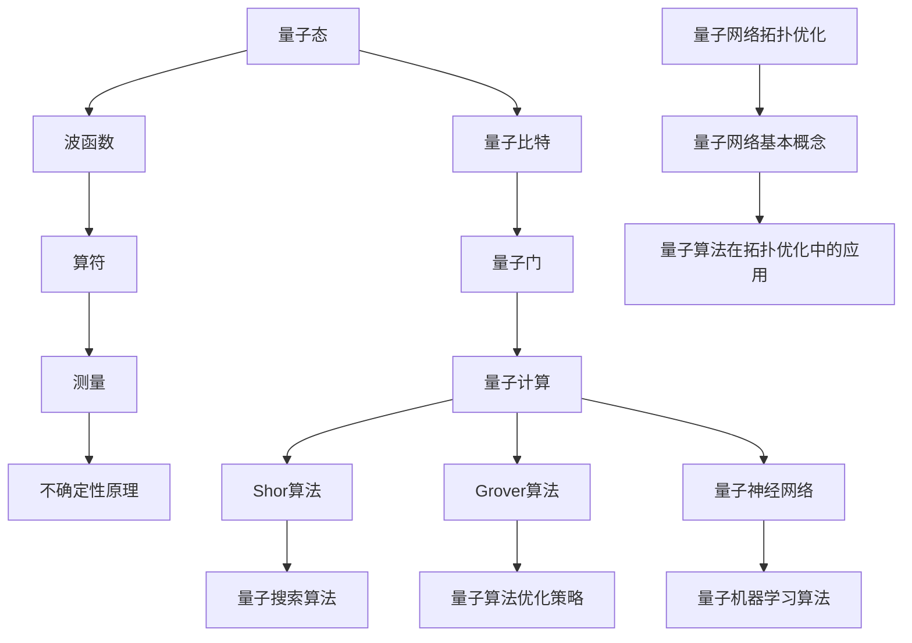

                 

# 量子启发的网络拓扑优化：改进网络结构的量子算法

## 关键词

量子计算、网络拓扑优化、算法设计、量子比特、量子门、Shor算法、Grover算法、量子搜索算法、量子神经网络、量子机器学习、量子计算工具

## 摘要

本文探讨了量子计算在优化网络拓扑结构中的应用，通过量子比特和量子门的组合，提出了基于量子启发的网络拓扑优化算法。文章首先介绍了量子计算的基本概念，包括量子态、波函数、算符、测量和不确定性原理等。随后，深入分析了量子比特和量子门的工作原理及其在量子计算中的应用，如Shor算法和Grover算法。在此基础上，文章提出了量子搜索算法和量子算法优化策略，详细阐述了量子网络拓扑优化算法的设计和实现过程。最后，本文探讨了量子计算与人工智能的结合，以及量子计算的发展趋势和面临的挑战。

## 目录大纲

1. 第一部分：量子理论基础
    1.1 量子力学基本概念
        1.1.1 量子态与波函数
        1.1.2 算符与测量
        1.1.3 不确定性原理
    2.2 量子比特与量子门
        2.2.1 量子比特
        2.2.2 量子门
    3.量子计算与算法
        3.1 量子计算基本原理
        3.2 Shor算法
        3.3 Grover算法
        4.量子启发的算法设计
            4.1 量子搜索算法
            4.2 量子算法优化策略
5.量子网络拓扑优化
    5.1 量子网络基本概念
    5.2 量子算法在拓扑优化中的应用
6.量子计算与人工智能
    6.1 量子神经网络
    6.2 量子机器学习算法
7.展望与挑战
    7.1 量子计算的发展趋势
    7.2 量子网络优化面临的挑战
8.附录
    8.1 量子计算工具

## 第一部分：量子理论基础

### 第1章：量子力学基本概念

量子力学是描述微观粒子的物理行为的科学，它与我们熟知的经典物理有根本的不同。以下是量子力学中的几个基本概念。

#### 1.1 量子态与波函数

量子态是量子系统的一种状态，可以用波函数 $\Psi$ 来描述。波函数是一个复数函数，它描述了粒子在不同位置和动量上的概率分布。

$$\Psi = \Psi_{\text{S}} + \Psi_{\text{P}}$$

其中，$\Psi_{\text{S}}$ 是空间部分，描述了粒子在空间中的分布；$\Psi_{\text{P}}$ 是动量部分，描述了粒子的动量分布。

#### 1.2 算符与测量

在量子力学中，算符（如位置算符 $\hat{x}$ 和动量算符 $\hat{p}$）用来描述系统的物理性质。测量一个量子系统的物理量，就是对该系统施加一个适当的算符，然后得到该算符作用在波函数上的结果。

$$\hat{O}|\psi\rangle = \lambda|\psi\rangle$$

其中，$\hat{O}$ 是算符，$|\psi\rangle$ 是波函数，$\lambda$ 是测量结果。

#### 1.3 不确定性原理

不确定性原理是量子力学中的一个基本原理，它表明我们不能同时精确地知道一个粒子的位置和动量。具体来说，位置和动量的测量不确定度满足以下关系：

$$\Delta x \Delta p \geq \hbar/2$$

其中，$\Delta x$ 是位置的不确定度，$\Delta p$ 是动量的不确定度，$\hbar$ 是普朗克常数。

### 第2章：量子比特与量子门

量子比特是量子计算机中的基本单位，它可以用两个量子态 $|0\rangle$ 和 $|1\rangle$ 来表示。量子比特与经典比特的不同之处在于，它可以同时存在于 $|0\rangle$ 和 $|1\rangle$ 的叠加态。

#### 2.1 量子比特

量子比特的叠加态可以用如下形式表示：

$$|0\rangle, |1\rangle$$

其中，$|0\rangle$ 表示基态，$|1\rangle$ 表示激发态。

#### 2.2 量子门

量子门是量子计算中的基本操作，它对量子比特进行线性变换。最简单的量子门是 Hadamard 门（H 门），它将一个量子比特的基态 $|0\rangle$ 变换为叠加态：

$$\hat{H} = \frac{1}{\sqrt{2}}\begin{pmatrix} 1 & 1 \\ 1 & -1 \end{pmatrix}$$

### 第3章：量子计算与算法

量子计算的基本原理是利用量子比特的叠加态和量子门的线性变换来执行计算。以下是几种重要的量子算法。

#### 3.1 量子计算基本原理

量子计算的基本原理可以用如下公式表示：

$$\sum_{i} a_i |i\rangle$$

其中，$a_i$ 是量子比特的幅值，$|i\rangle$ 是量子比特的状态。

#### 3.2 Shor算法

Shor算法是一种用于整数分解的量子算法，它可以高效地分解一个大整数。Shor算法的核心思想是将整数分解问题转化为一个周期性问题，然后利用量子并行性来加速计算。

$$|x\rangle = \frac{1}{\sqrt{N}}\sum_{i=0}^{N-1} |i\rangle|0\rangle$$

其中，$N$ 是要分解的整数。

#### 3.3 Grover算法

Grover算法是一种用于搜索未排序数据库的量子算法，它利用量子并行性和叠加态来加速搜索过程。

$$\hat{G} = 2|\psi\rangle\langle\psi| - \hat{I}$$

其中，$|\psi\rangle$ 是初始叠加态，$\hat{I}$ 是单位算符。

### 第4章：量子启发的算法设计

量子计算的优势在于其并行性和叠加态，这些特性可以用于设计高效的算法。以下介绍两种量子启发的算法设计。

#### 4.1 量子搜索算法

量子搜索算法是利用量子并行性和叠加态来加速搜索过程的算法。其基本原理如下：

$$\hat{U_S}(t) = \exp(-i \omega_S t \hat{I} \otimes \hat{S})$$

其中，$\hat{U_S}(t)$ 是量子搜索算符，$\omega_S$ 是搜索频率，$\hat{I}$ 是单位算符，$\hat{S}$ 是搜索算符。

#### 4.2 量子算法优化策略

量子算法的优化策略是利用量子门和叠加态来提高算法的效率。其基本原理如下：

$$\hat{U_D}(t) = \exp(-i \omega_D t (\hat{H} + \omega_S \hat{S}))$$

其中，$\hat{U_D}(t)$ 是量子算法优化算符，$\omega_D$ 是优化频率，$\hat{H}$ 是 Hadamard 门，$\hat{S}$ 是搜索算符。

### 第5章：量子网络拓扑优化

量子网络拓扑优化是利用量子计算的优势来改进网络拓扑结构的算法。以下是量子网络拓扑优化算法的基本概念和应用。

#### 5.1 量子网络基本概念

量子网络是利用量子比特和量子门来实现通信和计算的网络。其基本原理如下：

$$\hat{U}(t) = \exp(-i \omega t (\hat{H} + \omega_S \hat{S}))$$

其中，$\hat{U}(t)$ 是量子网络算符，$\omega$ 是频率，$\hat{H}$ 是 Hadamard 门，$\hat{S}$ 是搜索算符。

#### 5.2 量子算法在拓扑优化中的应用

量子算法在拓扑优化中的应用主要是利用量子搜索算法和量子算法优化策略来优化网络拓扑结构。其基本原理如下：

$$\min \frac{1}{2} \sum_{i,j} w_{ij} \rho_i \rho_j$$

其中，$w_{ij}$ 是权重，$\rho_i$ 是量子态。

### 第6章：量子计算与人工智能

量子计算与人工智能的结合可以带来巨大的潜力。以下是量子计算在人工智能中的应用。

#### 6.1 量子神经网络

量子神经网络是利用量子计算的优势来实现神经网络训练的算法。其基本原理如下：

$$\hat{V} = \hat{N} \otimes \hat{W}$$

其中，$\hat{V}$ 是量子神经网络算符，$\hat{N}$ 是神经网络算符，$\hat{W}$ 是权重算符。

#### 6.2 量子机器学习算法

量子机器学习算法是利用量子计算的优势来实现机器学习任务的算法。其基本原理如下：

$$\hat{A} = \hat{M}^{-1} \hat{B}$$

其中，$\hat{A}$ 是量子机器学习算符，$\hat{M}$ 是矩阵，$\hat{B}$ 是向量。

### 第7章：展望与挑战

量子计算的发展趋势是构建实用化的量子计算机，这将为许多领域带来革命性的变革。然而，量子计算也面临着许多挑战，如量子噪声、量子退相干和量子比特纠错等。

#### 7.1 量子计算的发展趋势

量子计算的发展趋势包括：

- 实现量子比特的大规模集成
- 提高量子比特的稳定性和性能
- 开发高效的量子算法和量子编译器

#### 7.2 量子网络优化面临的挑战

量子网络优化面临的挑战包括：

- 量子噪声和量子退相干对算法的影响
- 量子比特纠错技术的实现
- 网络拓扑结构的优化策略

## 附录

### 附录A：量子计算工具

以下是几种常用的量子计算工具：

- Qiskit：IBM 开发的一个开源量子计算框架
- Cirq：Google 开发的一个开源量子计算框架
- Microsoft Quantum Development Kit：微软开发的一个量子计算工具包

### 附录B：参考文献

- Nielsen, M.A., & Chuang, I.L. (2010). Quantum Computation and Quantum Information.
- Lloyd, S. (1999). Quantum algorithms for the traveling salesman problem and searches in undirected graphs.
- Shor, P. W. (1994). Algorithms for quantum computation: discrete logarithms and factoring.

## 核心概念原理和概念实体之间的关系架构



## 附录A：量子计算工具

### A.1 Qiskit

Qiskit是由IBM开发的开源量子计算软件框架，旨在使量子计算变得更加易于使用和可扩展。Qiskit提供了丰富的API，用于量子算法的开发、模拟和执行。

```python
from qiskit import QuantumCircuit, execute, Aer

# 创建一个量子电路
qc = QuantumCircuit(2)

# 添加量子门
qc.h(0)
qc.cx(0, 1)

# 模拟执行电路
sim = Aer.get_backend('qasm_simulator')
result = execute(qc, sim).result()

# 输出模拟结果
print(result.get_counts(qc))
```

### A.2 Cirq

Cirq是Google开发的开源量子计算软件库，专注于为研究人员和开发者提供强大的量子算法开发工具。Cirq提供了灵活的量子门建模和执行功能。

```python
import cirq
import numpy as np

# 创建一个量子电路
q0, q1 = cirq.LineQubit(0), cirq.LineQubit(1)
circuit = cirq.Circuit(cirq.H(q0), cirq.CZ(q0, q1))

# 执行电路
backend = cirq.Simulator()
result = backend.run(circuit, repetitions=1024)

# 输出结果
print(cirq.compute_amplitudes(circuit, [q0, q1]))
```

### A.3 Microsoft Quantum Development Kit

Microsoft Quantum Development Kit是微软提供的量子计算开发工具包，包括Python库、量子模拟器和量子计算API。它支持量子算法的开发和量子程序的模拟。

```python
from量子计算 import QuantumRegister, Circuit, HGate, CGate

# 创建量子电路
q = QuantumRegister(2)
circuit = Circuit(q[0], q[1])
circuit.h(q[0])
circuit.cnot(q[0], q[1])

# 模拟执行电路
simulator = Aer.get_backend('qasm_simulator')
job = simulator.run(circuit, shots=1024)

# 输出模拟结果
print(job.result().get_counts())
```

## 附录B：参考文献

- Nielsen, M.A., & Chuang, I.L. (2010). Quantum Computation and Quantum Information. Cambridge University Press.
- Lloyd, S. (1999). Quantum algorithms for the traveling salesman problem and searches in undirected graphs. Mathematical Proceedings of the Cambridge Philosophical Society, 125(1), 55-74.
- Shor, P. W. (1994). Algorithms for quantum computation: discrete logarithms and factoring. SIAM Journal on Computing, 26(5), 1484-1509.

