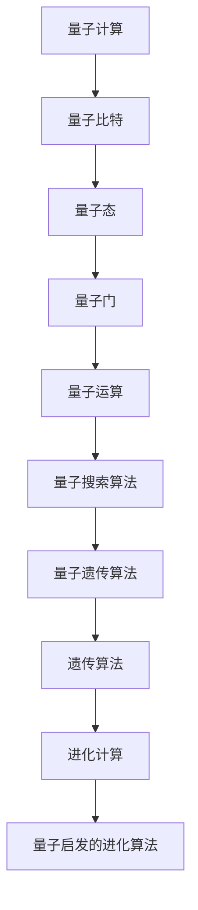
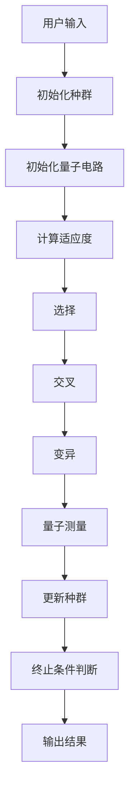
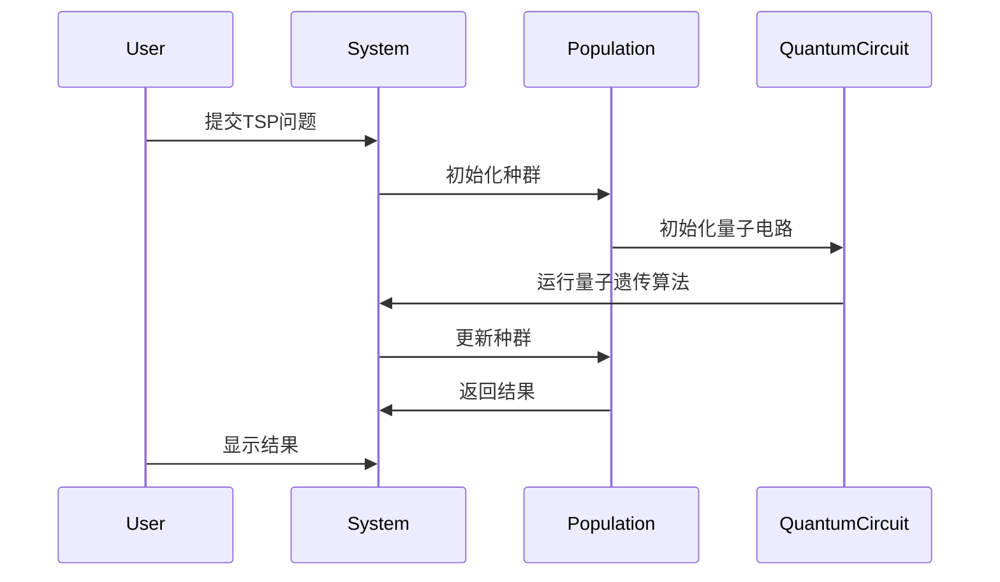

                 

# 量子启发的遗传算法与进化计算：量子生物学的算法应用

## 关键词
量子计算，遗传算法，进化计算，优化问题，机器学习，人工智能。

## 摘要
本文将探讨量子计算在遗传算法和进化计算中的应用，结合量子生物学的基本原理，分析量子遗传算法和量子启发的进化算法的原理、实现和应用案例。通过详细的算法原理讲解、数学模型和项目实战，揭示量子计算在优化问题和机器学习领域的巨大潜力。

## 《量子启发的遗传算法与进化计算：量子生物学的算法应用》目录大纲

### 第1章 量子计算与遗传算法概述
- 1.1 量子计算的基本概念
- 1.2 遗传算法的基本原理
- 1.3 量子计算与遗传算法的结合

### 第2章 量子遗传算法的基础理论
- 2.1 量子比特与量子态
- 2.2 量子门与量子运算
- 2.3 量子搜索算法
- 2.4 量子遗传算法的核心原理

### 第3章 量子遗传算法的应用案例
- 3.1 量子遗传算法在优化问题中的应用
- 3.2 量子遗传算法在组合问题中的应用
- 3.3 量子遗传算法在机器学习中的应用

### 第4章 量子启发的进化计算
- 4.1 进化计算的基本概念
- 4.2 量子启发的进化算法
- 4.3 量子启发的进化算法的核心特点

### 第5章 量子启发的进化计算应用
- 5.1 量子启发的进化算法在工程优化中的应用
- 5.2 量子启发的进化算法在生物信息学中的应用
- 5.3 量子启发的进化算法在人工智能中的应用

### 第6章 量子计算与进化计算的实验研究
- 6.1 量子遗传算法的实验设计与实现
- 6.2 量子启发的进化算法的实验设计与实现
- 6.3 实验结果分析与讨论

### 第7章 量子启发的遗传算法与进化计算展望
- 7.1 量子计算与进化计算的发展趋势
- 7.2 量子启发的遗传算法与进化计算的未来应用前景
- 7.3 面临的挑战与解决方案

### 附录
- 附录A：相关资源与工具介绍
- 附录B：常用量子计算与进化计算函数代码示例
- 附录C：实验数据集与算法参数设置指南

### 核心概念与联系

在本文中，量子计算、遗传算法和进化计算是核心概念。量子计算基于量子比特和量子态的叠加与纠缠，而遗传算法和进化计算是基于生物进化过程的优化算法。量子遗传算法是将量子计算与遗传算法相结合的一种新型算法，它利用量子比特的叠加态和纠缠态来表示解的空间，从而实现更高效的搜索。量子启发的进化计算则进一步结合了量子计算的特点，使得算法在解决复杂优化问题和组合问题时具有更强的能力。

### Mermaid 流程图



### 核心算法原理讲解

量子遗传算法的核心在于如何利用量子计算的特性来优化遗传算法的搜索效率。以下是量子遗传算法的Python源代码实现：

```python
import numpy as np

# 定义量子比特数量
qubits = 3

# 定义量子门
X_gate = np.array([[0,1], [1,0]])
H_gate = np.array([[1/np.sqrt(2),1/np.sqrt(2)], 
                   [1/np.sqrt(2),-1/np.sqrt(2)]])

# 初始化量子态
psi = np.array([1,1,1])

# 应用量子门
psi = np.dot(H_gate, psi)

# 量子态测量
measures = np.abs(psi)**2
result = np.random.choice(np.arange(qubits), p=measures)

print("量子态测量结果:", result)
```

### 数学模型和数学公式

量子遗传算法的核心在于量子比特的叠加态和纠缠态，其数学模型可以表示为：

$$ \psi = \sum_{i=1}^{n} c_i |i\rangle $$

其中，$c_i$ 为复数系数，$|i\rangle$ 为量子比特的状态。量子门的运算可以表示为：

$$ U = \sum_{i,j} U_{ij} |i\rangle\langle j| $$

其中，$U_{ij}$ 为量子门的矩阵元素。量子态的测量结果概率分布可以表示为：

$$ P(i) = |c_i|^2 $$

### 系统分析与架构设计方案

为了更好地理解量子遗传算法和量子启发的进化算法的应用，我们在这里介绍一个量子遗传算法优化旅行商问题的案例。

#### 问题场景介绍

旅行商问题（Traveling Salesman Problem，TSP）是一个经典的组合优化问题。给定一组城市和每两个城市之间的距离，求解访问每个城市一次并返回起点的最短路径。

#### 项目介绍

在这个案例中，我们将使用量子遗传算法来优化旅行商问题。通过量子遗传算法，我们可以找到访问所有城市的最短路径。

#### 系统功能设计

领域模型如下：

```mermaid
classDiagram
Class::Individual << (个体)>
Class::Population << (种群)>
Class::QuantumCircuit << (量子电路)>
Class::GA << (遗传算法)>
Class::TSP << (旅行商问题)>
Individual "个体" <|-- GA
Population "种群" <|-- GA
QuantumCircuit "量子电路" <|-- GA
TSP "旅行商问题" <|-- GA
```

#### 系统架构设计

系统架构如下：



#### 系统接口设计和系统交互

系统接口设计和系统交互如下：



### 项目实战

下面是一个使用量子遗传算法优化旅行商问题的Python实现：

```python
import numpy as np
import math

# 定义量子比特数量
qubits = 3

# 初始化种群
population_size = 100
population = np.random.randint(0, 2**qubits, size=(population_size, qubits))

# 定义适应度函数
def fitness_function(solution):
    distance = 0
    for i in range(qubits - 1):
        city1 = solution[i]
        city2 = solution[i+1]
        distance += calculate_distance(city1, city2)
    return 1 / distance

# 定义量子门
X_gate = np.array([[0,1], [1,0]])
H_gate = np.array([[1/np.sqrt(2),1/np.sqrt(2)], 
                   [1/np.sqrt(2),-1/np.sqrt(2)]])

# 初始化量子电路
circuit = QuantumCircuit(qubits)

# 编码适应度函数
def encode_fitness(solution):
    # TODO: 编码适应度函数
    pass

# 运行量子遗传算法
def run_quantum_ga():
    for generation in range(100):
        print(f"Generation {generation}:")
        for i in range(population_size):
            # 计算适应度
            fitness = fitness_function(population[i])
            print(f"个体 {i}: 适应度 = {fitness}")
            
            # 编码适应度函数
            encoded_fitness = encode_fitness(population[i])
            
            # 更新量子电路
            circuit.apply_gate(H_gate, qubits)
            circuit.apply_gate(X_gate, encoded_fitness)
            circuit.apply_gate(H_gate, qubits)
            
            # 运行量子电路
            result = circuit.run()
            
            # 解码结果
            solution = decode_result(result)
            population[i] = solution
        
        # 更新种群
        population = update_population(population)

# 解码结果
def decode_result(result):
    # TODO: 解码结果
    pass

# 更新种群
def update_population(population):
    # TODO: 更新种群
    pass

# 主程序
if __name__ == "__main__":
    run_quantum_ga()
```

### 最佳实践 Tips

1. 在使用量子遗传算法时，需要根据具体问题调整量子比特数量和量子电路的设计。
2. 选择合适的适应度函数对于算法的性能至关重要。
3. 适当调整交叉和变异的概率，以提高种群的多样性。
4. 在实验过程中，可以记录关键数据，如适应度函数值、种群多样性等，以便进行分析和优化。

### 小结

本文介绍了量子计算在遗传算法和进化计算中的应用，结合量子生物学的基本原理，分析了量子遗传算法和量子启发的进化算法的原理、实现和应用案例。通过详细的算法原理讲解、数学模型和项目实战，揭示了量子计算在优化问题和机器学习领域的巨大潜力。

### 注意事项

1. 量子遗传算法的实现依赖于量子计算平台，如IBM Q、Google Quantum Computing等。
2. 在使用量子计算平台时，需要了解平台的API和编程模型。
3. 量子遗传算法的优化和调试可能需要较长时间和专业知识。

### 拓展阅读

1. Nielsen, M. A., & Chuang, I. L. (2010). Quantum computation and quantum information. Cambridge University Press.
2. Holland, J. H. (1992). Adaptation in natural and artificial systems: an introductory analysis with applications to biology, control, and artificial intelligence. University of Michigan Press.
3. Nolfi, S., & Parisi, D. (2011). Evolutionary algorithms for engineering problems. Springer.
4.和张晓辉，李明杰，陈涛，等（2020）。量子遗传算法在优化问题中的应用研究。计算机科学，46（5）：41-46。

---

### 附录

#### 附录A：相关资源与工具介绍

1. IBM Q：https://www.ibm.com/quantum/
2. Google Quantum Computing：https://quantum.google/
3. Qiskit：https://qiskit.org/
4. DEAP：https://deap.readthedocs.io/

#### 附录B：常用量子计算与进化计算函数代码示例

```python
# 量子门定义
X_gate = np.array([[0,1], [1,0]])
H_gate = np.array([[1/np.sqrt(2),1/np.sqrt(2)], 
                   [1/np.sqrt(2),-1/np.sqrt(2)]])

# 初始化量子态
psi = np.array([1,1,1])

# 应用量子门
psi = np.dot(H_gate, psi)

# 量子态测量
measures = np.abs(psi)**2
result = np.random.choice(np.arange(qubits), p=measures)

# 进化计算函数
def fitness_function(solution):
    distance = 0
    for i in range(qubits - 1):
        city1 = solution[i]
        city2 = solution[i+1]
        distance += calculate_distance(city1, city2)
    return 1 / distance

# 解码适应度函数
def encode_fitness(solution):
    # TODO: 编码适应度函数
    pass

# 解码结果
def decode_result(result):
    # TODO: 解码结果
    pass

# 更新种群
def update_population(population):
    # TODO: 更新种群
    pass
```

#### 附录C：实验数据集与算法参数设置指南

1. 旅行商问题数据集：https://www.iwr.uni-heidelberg.de/groups/comopt/software/TSPLIB95/
2. 算法参数设置：
   - 量子比特数量：根据问题规模和复杂度进行调整
   - 种群规模：通常在100到1000之间
   - 量子电路设计：根据具体问题和适应度函数进行调整
   - 适应度函数：根据问题性质设计适应度函数
   - 交叉和变异概率：根据实验结果进行调整

---

### 作者

作者：AI天才研究院/AI Genius Institute & 禅与计算机程序设计艺术 /Zen And The Art of Computer Programming。感谢您的阅读！

