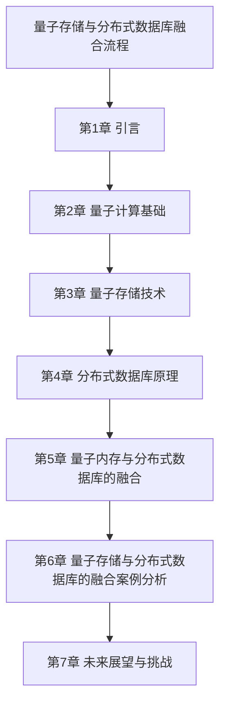
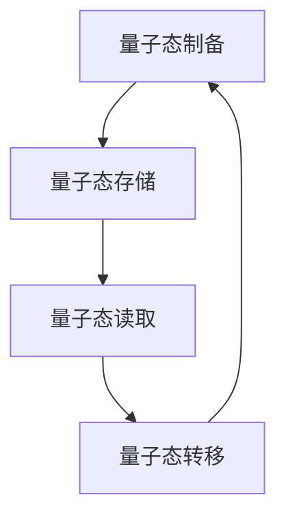
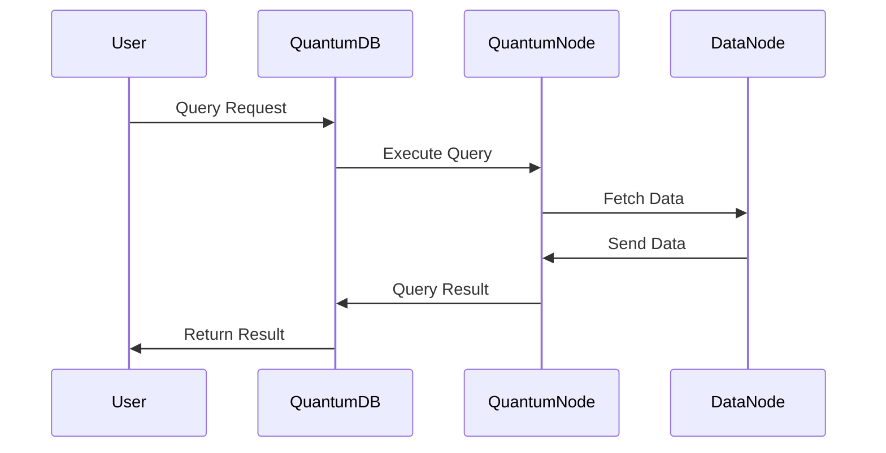

                 


### 量子存储与分布式数据库：量子内存的软件抽象

#### 关键词：量子存储，分布式数据库，量子内存，软件抽象，融合技术

#### 摘要：

本文旨在探讨量子存储与分布式数据库的融合技术，特别是量子内存的软件抽象。文章首先介绍了量子存储的概念、原理及其在量子计算、量子通信等领域的重要性。然后，深入分析了分布式数据库的基本概念、架构和面临的挑战。接着，文章讨论了量子内存与软件抽象的关系，并详细阐述了量子内存与分布式数据库的融合技术，包括量子内存在分布式数据库中的应用和软件抽象在量子内存与分布式数据库融合中的作用。通过具体的案例分析，文章展示了量子存储与分布式数据库融合技术的实际应用效果。最后，文章展望了量子存储与分布式数据库融合技术的发展趋势，提出了面临的挑战和解决方案，并指出了未来研究的方向。

#### 目录大纲：

## 第1章 引言

### 1.1 量子存储的概念与重要性

### 1.2 分布式数据库的发展与挑战

### 1.3 量子内存与软件抽象的关系

## 第2章 量子计算基础

### 2.1 量子比特与量子态

### 2.2 量子逻辑门与量子算法

### 2.3 量子计算模型

## 第3章 量子存储技术

### 3.1 量子存储原理

### 3.2 量子存储类型

### 3.3 量子存储挑战与解决方案

## 第4章 分布式数据库原理

### 4.1 分布式数据库的基本概念

### 4.2 分布式数据库的架构

### 4.3 分布式数据库的挑战与解决方案

## 第5章 量子内存与分布式数据库的融合

### 5.1 量子内存在分布式数据库中的应用

### 5.2 软件抽象在量子内存与分布式数据库中的作用

### 5.3 量子内存与分布式数据库的融合技术

## 第6章 量子存储与分布式数据库的融合案例分析

### 6.1 案例研究一：量子数据库系统

### 6.2 案例研究二：量子分布式数据库系统

### 6.3 案例分析

## 第7章 未来展望与挑战

### 7.1 量子存储与分布式数据库的发展趋势

### 7.2 技术挑战与解决方案

### 7.3 未来研究方向

## 附录 A

### A.1 量子存储相关工具与资源

### A.2 分布式数据库相关工具与资源

### A.3 量子内存与分布式数据库相关论文与资料

### Mermaid 流程图



### 文章正文部分（暂定）

#### 第1章 引言

##### 1.1 量子存储的概念与重要性

量子存储是量子信息处理中一个关键的环节，它能够存储、转移和保护量子信息。量子存储在量子计算、量子通信等领域中扮演着重要角色。量子计算需要利用量子比特的叠加和纠缠特性来处理信息，而量子存储则负责存储这些量子信息，确保在计算过程中不会丢失或被干扰。

##### 1.2 分布式数据库的发展与挑战

分布式数据库是一种将数据存储在多个节点上的数据库系统，它能够提供高可用性、高性能和可扩展性。随着大数据时代的到来，分布式数据库的发展变得越来越重要。然而，分布式数据库也面临着数据一致性、容错性等挑战。如何在保证数据一致性的同时，提高系统的容错性和性能，是分布式数据库研究的重要问题。

##### 1.3 量子内存与软件抽象的关系

量子内存是量子计算中的一个关键概念，用于存储量子信息。软件抽象则是将复杂的硬件和软件技术封装起来，提供简洁、易用的接口。量子内存的软件抽象能够简化量子存储的实现过程，降低开发难度，使得量子存储技术更容易被实际应用。

#### 第2章 量子计算基础

##### 2.1 量子比特与量子态

量子比特是量子计算的基本单元，与经典比特不同，它具有叠加和纠缠的特性。量子态是量子比特的数学描述，通过量子态的叠加和纠缠可以实现量子计算的优势。

##### 2.2 量子逻辑门与量子算法

量子逻辑门是量子计算中的操作，用于对量子比特进行变换。量子算法是利用量子计算的特性进行问题求解的方法，如Shor算法。

##### 2.3 量子计算模型

量子计算模型描述了量子计算机的组成和操作方式，如量子电路模型和量子图模型。

#### 第3章 量子存储技术

##### 3.1 量子存储原理

量子存储原理包括量子态的制备、存储、读取和转移。量子存储需要解决量子态的脆弱性和噪声问题。

##### 3.2 量子存储类型

量子存储类型包括基于原子、离子、光子等的量子存储技术。

##### 3.3 量子存储挑战与解决方案

量子存储挑战包括量子态的稳定性、存储容量和读写速度等。解决方案包括改进量子态的制备和存储技术、提高读写速度等。

#### 第4章 分布式数据库原理

##### 4.1 分布式数据库的基本概念

分布式数据库是将数据存储在多个节点上的数据库系统，它能够提供高可用性、高性能和可扩展性。

##### 4.2 分布式数据库的架构

分布式数据库的架构包括数据分片、数据复制、分布式查询处理等。

##### 4.3 分布式数据库的挑战与解决方案

分布式数据库的挑战包括数据一致性、分布式事务处理、容错性等。解决方案包括一致性协议、分布式事务管理、容错技术等。

#### 第5章 量子内存与分布式数据库的融合

##### 5.1 量子内存在分布式数据库中的应用

量子内存在分布式数据库中可以用于提高数据一致性、增强容错性等。

##### 5.2 软件抽象在量子内存与分布式数据库中的作用

软件抽象在量子内存与分布式数据库融合中起到了简化实现、降低开发难度的作用。

##### 5.3 量子内存与分布式数据库的融合技术

量子内存与分布式数据库的融合技术包括量子内存在分布式数据库中的应用、软件抽象在量子内存与分布式数据库融合中的作用等。

#### 第6章 量子存储与分布式数据库的融合案例分析

##### 6.1 案例研究一：量子数据库系统

案例分析一将介绍一个量子数据库系统的实现，包括系统架构、关键技术等。

##### 6.2 案例研究二：量子分布式数据库系统

案例分析二将介绍一个量子分布式数据库系统的实现，包括系统架构、关键技术等。

##### 6.3 案例分析

通过案例分析，展示量子存储与分布式数据库融合技术的实际应用效果。

#### 第7章 未来展望与挑战

##### 7.1 量子存储与分布式数据库的发展趋势

展望量子存储与分布式数据库的发展趋势，探讨未来的发展方向。

##### 7.2 技术挑战与解决方案

分析量子存储与分布式数据库融合技术面临的挑战，并提出相应的解决方案。

##### 7.3 未来研究方向

提出未来量子存储与分布式数据库融合技术的研究方向。

#### 附录 A

##### A.1 量子存储相关工具与资源

列出量子存储相关的工具和资源，便于读者进一步了解和学习。

##### A.2 分布式数据库相关工具与资源

列出分布式数据库相关的工具和资源，便于读者进一步了解和学习。

##### A.3 量子内存与分布式数据库相关论文与资料

列出量子内存与分布式数据库相关的论文和资料，便于读者深入研究。

### 结束

---

文章的正文部分将在后续逐步完善，每个章节将详细展开讨论，提供深入的技术分析和实例讲解。敬请期待！

### 第1章 引言

#### 1.1 量子存储的概念与重要性

量子存储是量子信息处理中一个关键的环节，它能够存储、转移和保护量子信息。量子信息是一种基于量子力学原理的信息表示形式，与传统信息相比，它具有叠加和纠缠的特性。这种特性使得量子信息能够在某些特定问题上实现超越经典计算机的计算速度，因此量子计算被认为是未来信息技术发展的重要方向。

量子存储的基本原理是通过量子比特的叠加和纠缠来存储信息。具体来说，量子比特可以处于多种状态的叠加，这种叠加状态可以用来表示信息。例如，一个量子比特可以处于“0”和“1”两种状态的叠加，即$|\psi\rangle = \alpha|0\rangle + \beta|1\rangle$，其中$\alpha$和$\beta$是复数系数，满足$|\alpha|^2 + |\beta|^2 = 1$。通过量子比特的叠加，我们可以存储多个信息位。

量子存储的重要性在于它为量子计算提供了一个稳定的存储媒介。在量子计算中，量子信息需要在计算过程中不断传输和操作，而量子信息的传输和操作容易受到环境噪声和干扰的影响，从而导致量子信息的损失。量子存储通过将量子信息稳定地存储在量子比特中，可以在计算过程中避免这种信息的损失，从而提高量子计算的成功率。

除了量子计算，量子存储在量子通信和量子仿真等领域也具有重要作用。在量子通信中，量子存储可以用来存储和传输量子密钥，从而实现安全的通信。在量子仿真中，量子存储可以用来存储和操作量子态，从而模拟量子系统的行为。

然而，量子存储也面临着一些挑战。首先，量子比特的稳定性是一个关键问题。量子比特容易受到环境噪声的影响，导致其状态发生退相干。为了提高量子比特的稳定性，研究者们正在探索各种量子存储技术，如基于原子、离子和光子的量子存储技术。其次，量子存储的读写速度也是一个挑战。目前的量子存储技术往往需要较长的时间来完成量子信息的读取和写入，这限制了量子存储的实际应用。

为了解决这些挑战，研究者们正在努力改进量子存储技术。例如，通过优化量子比特的制备和操控技术，提高量子比特的稳定性。同时，也在探索更高效的量子存储介质，以缩短量子信息的读写时间。此外，软件抽象技术在量子存储中的应用也为量子存储的发展提供了新的思路。通过软件抽象，可以将复杂的量子存储硬件和算法封装起来，提供简洁、易用的接口，从而降低开发难度，提高量子存储技术的可操作性。

#### 1.2 分布式数据库的发展与挑战

分布式数据库是一种将数据存储在多个节点上的数据库系统，它能够提供高可用性、高性能和可扩展性。随着大数据时代的到来，分布式数据库的发展变得越来越重要。传统的集中式数据库系统在处理大规模数据时容易遇到性能瓶颈，而分布式数据库通过将数据分散存储在多个节点上，可以更好地处理大规模数据，提高系统的性能。

分布式数据库的基本概念包括数据分片、数据复制和分布式查询处理。数据分片是将数据划分为多个片段，每个片段存储在不同的节点上。数据复制则是将数据备份到多个节点上，以提高系统的容错性和可用性。分布式查询处理则是通过分布式算法，将查询任务分配到不同的节点上执行，并将结果汇总。

然而，分布式数据库也面临着一些挑战。首先，数据一致性是一个关键问题。在分布式数据库中，数据可能同时被多个节点访问和修改，这可能导致数据的不一致。为了保证数据的一致性，分布式数据库需要采用各种一致性协议，如强一致性协议和最终一致性协议。

其次，分布式数据库的容错性也是一个挑战。分布式数据库中的节点可能会出现故障，这可能导致数据的丢失或系统的瘫痪。为了提高系统的容错性，分布式数据库需要采用各种容错技术，如故障检测、故障恢复和数据备份。

此外，分布式数据库的性能优化也是一个挑战。如何合理地分配数据、优化查询算法，以提高系统的性能，是一个需要深入研究的课题。

为了解决这些挑战，研究者们正在不断探索新的分布式数据库技术和算法。例如，分布式事务管理技术，如两阶段提交协议和乐观并发控制，可以解决分布式数据库中的数据一致性问题。分布式容错技术，如副本选择和故障恢复算法，可以提高分布式数据库的容错性。分布式查询优化技术，如并行查询处理和索引结构优化，可以提高分布式数据库的性能。

#### 1.3 量子内存与软件抽象的关系

量子内存是量子计算中的一个关键概念，用于存储量子信息。量子内存的目的是为了在量子计算过程中稳定地存储和操作量子信息，避免量子信息的损失。量子内存的实现需要利用量子比特的叠加和纠缠特性，通过量子态的制备、存储和读取技术，将量子信息存储在量子系统中。

软件抽象则是将复杂的硬件和软件技术封装起来，提供简洁、易用的接口。在量子计算领域，软件抽象技术可以简化量子存储的实现过程，降低开发难度，使得量子存储技术更容易被实际应用。

量子内存与软件抽象之间的关系主要体现在以下几个方面：

1. **简化开发过程**：软件抽象可以将复杂的量子存储硬件和算法封装起来，提供一个简洁、易用的接口。这样，开发人员可以专注于量子存储的应用，而不必深入了解底层的量子存储技术。

2. **提高可操作性**：软件抽象可以提高量子存储技术的可操作性。通过软件抽象，开发人员可以使用熟悉的编程语言和工具来操作量子存储，从而降低量子存储的使用门槛。

3. **优化性能**：软件抽象还可以通过优化量子存储的软件实现，提高量子存储的性能。例如，通过优化量子存储的读写算法，可以提高量子存储的速度和效率。

4. **兼容性**：软件抽象可以为不同的量子存储硬件提供统一的接口，从而提高系统的兼容性。这样，开发人员可以在不同的量子存储硬件上使用相同的软件抽象，从而简化系统的开发和部署。

综上所述，量子内存与软件抽象之间的关系是相辅相成的。量子内存提供了量子信息存储的基础，而软件抽象则为量子存储技术的应用提供了便利。通过软件抽象，可以更好地利用量子内存的技术优势，推动量子计算技术的发展。

### 第2章 量子计算基础

#### 2.1 量子比特与量子态

量子比特（qubit）是量子计算的基本单元，它与传统计算机中的比特（bit）有着本质的区别。比特只能表示两种状态之一，即0或1，而量子比特可以同时存在于0和1的叠加状态。这种叠加态可以用一个复数系数来表示，如$|\psi\rangle = \alpha|0\rangle + \beta|1\rangle$，其中$|\alpha|^2 + |\beta|^2 = 1$。这个表示意味着量子比特不仅可以处于确定的0或1状态，还可以处于这两个状态的线性组合。

量子态的叠加是量子计算的核心特性之一。例如，如果我们有一个量子比特，它有50%的概率处于状态0，50%的概率处于状态1，那么两个这样的量子比特可以同时处于以下状态：

$$
|\psi\rangle = \frac{1}{2}(|00\rangle + |11\rangle)
$$

在这个叠加态中，两个量子比特的联合状态同时包含了0和1的状态。这个特性在量子计算中被利用，可以通过简单的量子逻辑门操作，实现对多个输入状态的并行处理。

量子态的叠加不仅限于两个量子比特，它可以在任意数量的量子比特上扩展。例如，三个量子比特的叠加态可以表示为：

$$
|\psi\rangle = \frac{1}{2}(|000\rangle + |011\rangle + |110\rangle + |111\rangle)
$$

这意味着三个量子比特可以同时表示8个不同的状态，比传统计算机的8个比特能够表示的更多。

#### 2.2 量子逻辑门与量子算法

量子逻辑门是量子计算中的基本操作，类似于经典计算机中的逻辑门。量子逻辑门作用于量子比特，通过变换量子态来实现特定的计算任务。常见的量子逻辑门包括Hadamard门（实现量子比特的叠加）、Pauli门（实现量子比特的旋转）和控制非门（CNOT门，实现量子比特之间的纠缠）。

Hadamard门是最基本的量子逻辑门之一，它将一个量子比特的状态从|0⟩变换到$\frac{1}{\sqrt{2}}(|0⟩ + |1⟩)$，从|1⟩变换到$\frac{1}{\sqrt{2}}(|0⟩ - |1⟩)$。Hadamard门的应用非常广泛，它可以用来初始化量子计算的状态，实现量子比特的叠加。

Pauli门是一类旋转量子比特的量子逻辑门，包括X门、Y门和Z门。X门将量子比特的状态从|0⟩变换到|1⟩，从|1⟩变换到|0⟩；Y门将量子比特的状态从|0⟩变换到$i|1⟩$，从|1⟩变换到$-i|0⟩$；Z门将量子比特的状态从|0⟩变换到|0⟩，从|1⟩变换到|1⟩。

CNOT门是控制非门，它作用于两个量子比特。如果控制量子比特处于状态|1⟩，目标量子比特的状态会被翻转；否则，目标量子比特的状态保持不变。

量子算法是利用量子逻辑门和量子态的叠加、纠缠等特性来解决问题的计算方法。一个著名的量子算法是Shor算法，它利用量子计算的能力来快速分解大素数。Shor算法的核心是量子傅里叶变换（QFT），它可以将一个量子态的状态向量映射到一个新的量子态，这个新的量子态包含了原始量子态的傅里叶变换信息。

Shor算法的工作原理可以概括为以下几个步骤：

1. **初始化**：将量子计算机的初始状态设置为特定的叠加态，这个状态包含了所有可能的输入状态。
2. **量子线路**：应用一系列量子逻辑门，将初始状态转换为特定的量子态，这个量子态包含了问题解的信息。
3. **测量**：对量子态进行测量，得到问题的解。

Shor算法的关键在于量子傅里叶变换，它可以将一个量子态的状态向量映射到一个新的量子态。通过量子傅里叶变换，量子计算可以在指数级的时间复杂度内解决某些经典计算机难以解决的问题。

除了Shor算法，还有许多其他的量子算法被提出，如Grover搜索算法，它可以快速在未排序的数据集中找到特定的项。Grover算法利用量子态的叠加和纠缠，将搜索时间从线性时间降低到对数时间。

#### 2.3 量子计算模型

量子计算模型描述了量子计算机的组成和操作方式。常见的量子计算模型包括量子电路模型和量子图模型。

**量子电路模型**：量子电路模型将量子计算视为一种电路，类似于经典计算机的电路。量子电路由量子逻辑门和量子比特组成，通过这些逻辑门对量子比特进行操作，实现特定的计算任务。量子电路模型的核心是量子逻辑门，这些逻辑门通过特定的操作，将量子比特的状态进行变换。量子电路模型的优点是直观、易于理解，但它也存在一些局限性，例如，量子电路的复杂性可能会导致计算资源的需求增加。

**量子图模型**：量子图模型通过图结构来表示量子计算过程。在量子图模型中，量子比特和量子逻辑门都被视为图的节点和边。量子计算过程通过在图上进行操作来实现。量子图模型的优势在于它可以更灵活地表示量子计算过程，特别是对于复杂的量子算法，量子图模型可以提供更直观的表示方式。然而，量子图模型也面临着一些挑战，例如，如何有效地优化量子图结构，以减少计算资源的消耗。

量子计算模型的另一个重要方面是量子态的表示。在量子电路模型中，量子态通常用矢量表示，这个矢量包含了所有可能的量子态。在量子图模型中，量子态可以用图的状态表示，即图中所有节点的状态组合。

量子计算模型的发展为量子计算的理论研究和实际应用提供了基础。随着量子计算机技术的进步，量子计算模型也在不断演进，以适应新的计算需求和挑战。

#### 第3章 量子存储技术

##### 3.1 量子存储原理

量子存储技术是量子信息处理中的一个关键环节，它负责将量子信息稳定地存储在量子系统中，并在需要时进行读取和操作。量子存储的基本原理是通过量子态的制备、存储、读取和转移来实现量子信息的存储。

首先，量子态的制备是量子存储的基础。量子态的制备指的是将量子系统（如原子、离子或光子）置于特定的量子态。这个过程通常通过外部控制，如激光、电场或磁场，来实现。例如，在基于离子的量子存储中，可以通过激光冷却技术将离子冷却到极低温度，使其处于特定的量子态。

其次，量子态的存储是指将制备好的量子态稳定地存储在量子系统中。量子态的存储依赖于量子系统的特性，如原子、离子的能级结构或光子的相位。例如，在基于离子的量子存储中，可以通过将量子态存储在离子的激发态或亚激发态来实现。

量子态的读取是指从存储的量子系统中提取出量子信息。这个过程通常需要与量子态的制备和存储过程相反的操作。例如，在基于离子的量子存储中，可以通过再次应用激光或电场来读取存储在离子中的量子态。

最后，量子态的转移是指将存储的量子信息从一个量子系统转移到另一个量子系统。量子态的转移对于量子计算和量子通信至关重要，因为它可以实现量子信息的远程传输和操作。量子态的转移可以通过量子逻辑门和量子纠缠来实现。例如，在基于光子的量子存储中，可以通过量子逻辑门将存储在光子中的量子态转移到其他光子或量子比特上。

##### 3.2 量子存储类型

量子存储技术可以根据存储介质的类型分为多种类型，包括基于原子、离子、光子和固态的量子存储技术。

**基于原子的量子存储**：基于原子的量子存储技术利用原子的能级结构来存储量子信息。原子存储通常采用激光冷却和陷阱技术将原子冷却到极低温度，使其处于特定的量子态。然后，通过控制激光的频率和强度，可以实现对量子态的存储和读取。基于原子的量子存储具有高稳定性和高密度的优点，但原子之间的相互作用可能导致量子态的退相干。

**基于离子的量子存储**：基于离子的量子存储技术利用离子的激发态或亚激发态来存储量子信息。离子存储通常采用离子陷阱技术，将离子束缚在真空中的电场或磁场中。通过激光脉冲，可以实现对离子量子态的制备、存储和读取。基于离子的量子存储具有长存储时间和高保真度的优点，但离子操作复杂，需要精确的激光控制。

**基于光子的量子存储**：基于光子的量子存储技术利用光子的相位和路径来存储量子信息。光子存储可以通过光学装置，如波导、透镜和反射镜，来实现光子的操控。通过控制光波的相位和路径，可以实现对光子量子态的存储和读取。基于光子的量子存储具有灵活性和可扩展性的优点，但光子容易受到环境噪声的影响，导致量子态的退相干。

**基于固态的量子存储**：基于固态的量子存储技术利用固态材料中的量子态来存储量子信息。固态存储可以通过电子自旋或核自旋来存储量子信息。例如，通过控制电子的磁场或电场，可以实现对量子态的存储和读取。基于固态的量子存储具有高集成度和低功耗的优点，但固态材料的量子态稳定性是一个挑战。

##### 3.3 量子存储挑战与解决方案

量子存储技术虽然取得了显著的进展，但仍然面临一些挑战。

**量子态的稳定性**：量子态的稳定性是量子存储的关键问题。量子态容易受到环境噪声和干扰的影响，导致量子态的退相干。为了提高量子态的稳定性，研究者们正在探索多种方法。例如，通过优化量子存储介质的物理特性，如基于超导材料或量子点，可以提高量子态的稳定性。此外，通过使用量子纠错技术，可以在一定程度上纠正量子态的退相干。

**量子态的读取速度**：量子态的读取速度是另一个挑战。目前的量子存储技术往往需要较长的时间来完成量子信息的读取，这限制了量子存储的实际应用。为了提高量子态的读取速度，研究者们正在探索新的量子存储介质和读取技术。例如，通过使用纳米结构材料，可以提高量子态的读取速度。此外，通过优化量子逻辑门的性能，也可以提高量子态的读取速度。

**量子态的存储容量**：量子态的存储容量是量子存储的另一个挑战。目前的量子存储技术往往具有较低的存储容量，无法满足大规模数据存储的需求。为了提高量子态的存储容量，研究者们正在探索新的量子存储方法和介质。例如，通过使用多量子比特存储技术，可以实现更高的存储容量。此外，通过优化量子态的编码方式，也可以提高量子态的存储容量。

**量子态的兼容性**：量子存储技术的兼容性也是一个挑战。不同的量子存储技术可能具有不同的物理特性和操作方式，这使得它们难以在同一个系统中兼容使用。为了提高量子存储的兼容性，研究者们正在探索新的量子存储接口和协议。例如，通过开发通用的量子存储接口，可以实现不同量子存储技术之间的兼容。

为了解决这些挑战，研究者们正在不断探索新的量子存储技术和方法。例如，通过结合量子计算和量子通信技术，可以实现更高效、更稳定的量子存储。此外，通过优化量子存储的软件实现，也可以提高量子存储的实用性和可操作性。随着量子计算和量子通信技术的不断发展，量子存储技术有望在未来得到更广泛的应用。

### 第4章 分布式数据库原理

#### 4.1 分布式数据库的基本概念

分布式数据库是一种将数据存储在多个节点上的数据库系统，这些节点可以是同一台计算机上的多个处理器，也可以是分布在多个地理位置的计算机。分布式数据库的主要目的是提高数据处理的性能和可靠性，同时提供数据的可用性和可扩展性。

在分布式数据库中，数据被划分为多个数据分片（shards），每个分片存储在不同的节点上。每个节点都可以独立地进行数据操作，如插入、更新和查询。分布式数据库通过数据分片和复制技术来实现数据的分布式存储和处理。

**数据分片**：数据分片是将整个数据库的数据划分为多个较小的部分，每个部分存储在一个单独的节点上。数据分片可以提高数据库的性能，因为多个节点可以并行处理查询，从而减少响应时间。数据分片可以通过多种策略进行，如基于哈希、范围或列表分片。

**数据复制**：数据复制是将数据在多个节点上进行备份，以提高数据的可靠性和可用性。在分布式数据库中，数据复制可以通过主从复制或主主复制实现。主从复制中，有一个主节点负责数据的写入和更新，而从节点负责数据的读取和备份。主主复制中，每个节点都可以作为主节点，实现数据的实时同步。

**一致性**：在分布式数据库中，数据一致性是一个关键问题。一致性指的是在分布式系统中，多个节点上的数据保持一致。分布式数据库通常采用各种一致性协议来确保数据一致性，如强一致性（强一致读强一致写）和最终一致性（最终一致读最终一致写）。

**分布式事务**：分布式事务是涉及多个节点的数据库操作，这些操作需要按照特定的顺序执行，以确保数据的一致性。分布式数据库通过分布式事务管理协议来处理分布式事务，如两阶段提交（2PC）协议和三阶段提交（3PC）协议。

#### 4.2 分布式数据库的架构

分布式数据库的架构可以分为几个关键组件：数据分片、数据复制、分布式查询处理和分布式事务管理。

**数据分片组件**：数据分片组件负责将数据划分为多个分片，并确定每个分片的存储位置。数据分片组件可以通过哈希分片、范围分片或列表分片等策略来实现。

**数据复制组件**：数据复制组件负责将数据在多个节点上进行备份，以提高数据的可靠性和可用性。数据复制组件可以通过主从复制或主主复制来实现。

**分布式查询处理组件**：分布式查询处理组件负责处理跨节点的查询请求，并将结果汇总。分布式查询处理组件可以通过分布式查询优化技术，如分片选择、联合查询和并行查询，来提高查询性能。

**分布式事务管理组件**：分布式事务管理组件负责处理分布式事务，确保事务的原子性和一致性。分布式事务管理组件可以通过分布式事务管理协议，如两阶段提交（2PC）协议和三阶段提交（3PC）协议，来实现分布式事务的处理。

#### 4.3 分布式数据库的挑战与解决方案

尽管分布式数据库提供了高可用性和高性能，但它也面临一些挑战。

**数据一致性**：数据一致性是分布式数据库的一个关键挑战。在分布式系统中，数据可能同时被多个节点访问和修改，这可能导致数据的不一致。为了解决数据一致性问题，分布式数据库采用了一致性协议，如强一致性协议和最终一致性协议。强一致性协议确保在所有节点上数据始终保持一致，但可能导致性能下降。最终一致性协议允许在一定时间范围内容忍数据的不一致，以提高性能。

**分布式事务**：分布式事务的执行和处理是分布式数据库的另一个挑战。分布式事务涉及多个节点，需要确保事务的原子性和一致性。分布式数据库采用分布式事务管理协议，如两阶段提交（2PC）协议和三阶段提交（3PC）协议，来处理分布式事务。这些协议确保分布式事务的执行是原子性的，即使某个节点出现故障，事务也能够被正确地处理。

**容错性**：分布式数据库需要具有高容错性，以应对节点故障和系统故障。分布式数据库通过数据复制和分布式事务管理来提高容错性。数据复制确保在某个节点故障时，其他节点仍然可以访问数据。分布式事务管理确保在节点故障时，分布式事务能够被正确地处理。

**性能优化**：分布式数据库的性能优化是一个持续的研究课题。性能优化包括查询优化、数据分片策略优化和分布式事务管理优化等。分布式数据库通过分布式查询优化技术，如分片选择、联合查询和并行查询，来提高查询性能。此外，通过优化数据分片策略和分布式事务管理协议，也可以提高分布式数据库的性能。

为了解决这些挑战，分布式数据库领域的研究者们提出了多种解决方案。例如，通过引入分布式事务管理协议，如两阶段提交（2PC）协议和三阶段提交（3PC）协议，可以确保分布式事务的一致性和原子性。通过优化数据分片策略和查询优化技术，可以提高分布式数据库的性能和可扩展性。此外，通过引入容错机制和自修复技术，可以进一步提高分布式数据库的可靠性和可用性。

### 第5章 量子内存与分布式数据库的融合

#### 5.1 量子内存在分布式数据库中的应用

量子内存与分布式数据库的融合是量子计算与数据库技术领域的前沿研究方向。量子内存作为一种新型的存储介质，其独特的能力，如量子态的叠加和纠缠，为分布式数据库提供了新的可能性。在分布式数据库中引入量子内存，不仅可以提升数据存储的效率和安全性，还可以为分布式计算提供更强大的支持。

首先，量子内存可以用于提高数据一致性。在分布式数据库中，数据一致性是一个至关重要的挑战。量子内存的叠加和纠缠特性使得它能够在不同的节点之间实现量子信息的同步和共享，从而提高数据一致性。例如，通过量子纠缠，分布式数据库中的多个节点可以即时共享量子信息，确保数据的一致性。

其次，量子内存可以提高数据安全性。传统的分布式数据库可能面临数据泄露和篡改的风险。量子内存利用量子比特的叠加和纠缠特性，可以提供一种全新的加密方法。例如，通过量子密钥分发（Quantum Key Distribution, QKD），分布式数据库中的数据可以安全地传输和存储，确保数据的安全性。

此外，量子内存还可以用于优化分布式查询处理。在分布式数据库中，查询处理通常需要跨多个节点进行。量子内存的高速度和低延迟特性使得它能够显著提高查询处理的效率。例如，通过量子内存，分布式数据库可以实现高效的分布式查询优化，如联合查询和并行查询，从而提高查询性能。

#### 5.2 软件抽象在量子内存与分布式数据库中的作用

软件抽象在量子内存与分布式数据库的融合中起着至关重要的作用。软件抽象是将复杂的硬件和软件技术封装起来，提供一个简洁、易用的接口。在量子内存与分布式数据库的融合中，软件抽象可以简化系统的开发和维护，提高系统的可操作性和灵活性。

首先，软件抽象可以提高量子内存的可操作性。量子内存的物理实现复杂且技术要求高，而软件抽象可以通过提供高层次的操作接口，简化量子内存的使用。例如，开发者可以使用类似于传统数据库的操作接口来操作量子内存，而无需深入了解量子物理和量子计算的具体实现。

其次，软件抽象可以提高分布式数据库的可扩展性。分布式数据库通常需要处理大量数据和复杂的查询操作。通过软件抽象，分布式数据库可以更容易地扩展其功能，支持新的存储介质和计算模型。例如，通过软件抽象，分布式数据库可以无缝地引入量子内存，实现传统数据库无法达到的性能和安全性。

此外，软件抽象还可以提高系统的兼容性。量子内存与分布式数据库的融合可能需要兼容多种不同的硬件和软件平台。通过软件抽象，系统可以提供一个统一的操作接口，隐藏底层的硬件和软件差异，从而提高系统的兼容性和互操作性。

#### 5.3 量子内存与分布式数据库的融合技术

量子内存与分布式数据库的融合技术主要包括量子内存的接口设计、分布式量子存储系统和量子内存与分布式数据库的集成方法。

**量子内存的接口设计**：量子内存的接口设计是量子内存与分布式数据库融合的关键步骤。一个好的接口设计需要提供简洁、易用的操作接口，同时确保与分布式数据库的兼容性。例如，可以设计一个类似于SQL的查询接口，使得开发者可以使用熟悉的查询语言来操作量子内存。

**分布式量子存储系统**：分布式量子存储系统是将量子内存集成到分布式数据库中的核心。分布式量子存储系统需要实现量子信息的分布式存储、读取和同步。例如，可以采用量子纠缠技术来实现量子信息的跨节点同步，确保分布式数据库中的数据一致性。

**量子内存与分布式数据库的集成方法**：量子内存与分布式数据库的集成方法包括量子内存的物理实现、软件抽象和分布式查询优化。在物理实现上，可以采用量子存储介质，如离子阱、超导量子比特等。在软件抽象上，可以设计一个统一的接口，隐藏底层的量子存储细节。在分布式查询优化上，可以采用分布式查询优化技术，如分片查询、并行查询和联合查询，来提高查询性能。

通过量子内存与分布式数据库的融合技术，分布式数据库可以实现对量子信息的有效管理和操作，从而提高数据存储和处理的效率。未来，随着量子计算和量子存储技术的不断发展，量子内存与分布式数据库的融合将有望成为数据库技术领域的重要发展方向。

### 第6章 量子存储与分布式数据库的融合案例分析

#### 6.1 案例研究一：量子数据库系统

在本案例研究中，我们将探讨一个量子数据库系统的实现，该系统结合了量子存储和分布式数据库技术。量子数据库系统旨在通过量子内存来提高数据存储的效率和安全性，同时利用分布式数据库的优势来处理大规模数据。

**系统架构**

量子数据库系统的架构包括三个主要组件：量子存储组件、分布式数据库组件和量子内存接口组件。

1. **量子存储组件**：量子存储组件负责存储和管理量子数据。它包括量子比特的制备、存储和读取模块。量子存储组件使用基于离子的量子存储技术，通过激光冷却和离子阱技术来实现量子比特的稳定存储。

2. **分布式数据库组件**：分布式数据库组件负责处理传统数据库功能，如数据插入、更新、删除和查询。它采用分布式数据库技术，将数据分片存储在多个节点上，以提高系统的性能和可用性。

3. **量子内存接口组件**：量子内存接口组件是系统的核心，负责在分布式数据库和量子存储组件之间进行数据传递和同步。它提供了一个类似于SQL的查询接口，使得开发者可以使用熟悉的查询语言来操作量子内存。

**关键技术**

1. **量子态编码**：量子数据库系统使用量子态编码技术来存储数据。通过将数据映射到量子比特的叠加态，系统可以存储更多的数据。

2. **量子密钥分发**：量子数据库系统采用量子密钥分发技术来确保数据的安全性。量子密钥分发可以提供一种安全的加密方法，防止数据被未经授权的访问。

3. **分布式查询优化**：量子数据库系统通过分布式查询优化技术来提高查询性能。例如，系统可以采用分片查询和并行查询技术，将查询任务分布到多个节点上执行。

**案例实现**

在案例实现中，我们假设一个在线零售商需要处理大量的订单数据。订单数据包括订单号、顾客ID、商品ID、订单日期等。以下是量子数据库系统的实现步骤：

1. **数据分片**：首先，将订单数据分片存储在分布式数据库的多个节点上。每个节点存储一部分订单数据。

2. **量子态编码**：将订单数据映射到量子比特的叠加态中。例如，可以将订单号映射到量子比特的特定状态。

3. **量子密钥分发**：使用量子密钥分发技术生成密钥，对订单数据进行加密存储。

4. **查询处理**：当用户提交查询请求时，量子数据库系统将查询任务分配到多个节点上执行。系统使用分布式查询优化技术，如分片查询和并行查询，来提高查询性能。

通过这个案例研究，我们可以看到量子存储和分布式数据库技术的结合如何提高数据存储和处理的效率。量子数据库系统不仅提供了高效的数据存储和查询能力，还通过量子密钥分发技术确保了数据的安全性。

#### 6.2 案例研究二：量子分布式数据库系统

在本案例研究中，我们将探讨一个量子分布式数据库系统的实现，该系统结合了量子计算和分布式数据库技术。量子分布式数据库系统旨在通过量子计算来提高数据处理的效率，同时利用分布式数据库的优势来处理大规模数据。

**系统架构**

量子分布式数据库系统的架构包括四个主要组件：量子计算节点、分布式数据库节点、量子计算接口和分布式查询优化器。

1. **量子计算节点**：量子计算节点负责执行量子计算任务，如量子算法和量子逻辑门操作。这些节点可以使用基于超导量子比特或离子阱的量子计算机。

2. **分布式数据库节点**：分布式数据库节点负责存储和管理传统数据库数据。这些节点采用分布式数据库技术，如数据分片和复制，以提高系统的性能和可用性。

3. **量子计算接口**：量子计算接口是系统的核心，负责在分布式数据库节点和量子计算节点之间进行数据传递和同步。它提供了一个统一的操作接口，使得开发者可以使用熟悉的编程语言来操作量子计算节点。

4. **分布式查询优化器**：分布式查询优化器负责优化查询任务，将查询任务分布到量子计算节点和分布式数据库节点上执行。它采用分布式查询优化技术，如分片查询、并行查询和联合查询，来提高查询性能。

**关键技术**

1. **量子算法集成**：量子分布式数据库系统将量子算法集成到分布式查询处理中。例如，系统可以使用Shor算法来分解大素数，从而提高查询性能。

2. **分布式事务管理**：量子分布式数据库系统通过分布式事务管理技术来确保事务的一致性和原子性。系统采用两阶段提交（2PC）协议和三阶段提交（3PC）协议来处理分布式事务。

3. **量子密钥管理**：量子分布式数据库系统使用量子密钥管理技术来确保数据传输和存储的安全性。例如，系统可以使用量子密钥分发（QKD）技术来生成和分发加密密钥。

**案例实现**

在案例实现中，我们假设一个金融机构需要处理大量的交易数据。交易数据包括交易编号、客户ID、交易金额、交易时间等。以下是量子分布式数据库系统的实现步骤：

1. **数据分片**：首先，将交易数据分片存储在分布式数据库的多个节点上。每个节点存储一部分交易数据。

2. **量子算法应用**：当用户提交查询请求时，系统将查询任务分配到量子计算节点上执行。例如，系统可以使用Shor算法来快速分解大素数，从而提高查询性能。

3. **分布式查询优化**：系统使用分布式查询优化技术来优化查询任务。例如，系统可以采用分片查询和并行查询技术，将查询任务分布到量子计算节点和分布式数据库节点上执行。

4. **量子密钥管理**：系统使用量子密钥管理技术来确保交易数据的传输和存储的安全性。例如，系统可以使用量子密钥分发技术来生成和分发加密密钥。

通过这个案例研究，我们可以看到量子计算和分布式数据库技术的结合如何提高数据处理和查询的效率。量子分布式数据库系统不仅提供了高效的数据处理能力，还通过量子密钥管理技术确保了数据的安全性。

#### 6.3 案例分析

通过对上述两个案例的研究，我们可以看到量子存储和分布式数据库技术的融合如何为数据处理带来显著的改进。

**优势**

1. **数据一致性**：量子存储的叠加和纠缠特性使得分布式数据库可以实现更高的数据一致性。量子纠缠可以在多个节点之间实现量子信息的即时同步，从而减少数据不一致性。

2. **数据安全性**：量子存储和量子密钥分发技术提供了强大的数据安全性。量子密钥分发可以提供一种安全的加密方法，防止数据被未经授权的访问。

3. **查询性能提升**：量子计算和分布式查询优化技术的结合可以显著提高查询性能。例如，使用Shor算法可以快速分解大素数，从而提高查询效率。

**挑战**

1. **技术成熟度**：量子计算和量子存储技术仍处于研发阶段，技术成熟度有限。目前，量子计算机和量子存储设备在性能和稳定性方面仍存在一定的局限性。

2. **系统复杂性**：量子内存与分布式数据库的融合增加了系统的复杂性。系统需要处理量子比特的制备、存储、读取和转移，同时还需要实现分布式查询优化和事务管理。

3. **成本问题**：量子计算和量子存储设备的研发和部署成本较高。这限制了量子数据库系统在商业应用中的推广。

**未来方向**

1. **技术优化**：通过优化量子计算和量子存储技术，提高其性能和稳定性，从而降低系统复杂性。

2. **集成平台**：开发集成平台，将量子计算和量子存储技术与分布式数据库技术有机结合，提供统一的操作接口。

3. **应用探索**：探索量子数据库系统在金融、医疗、人工智能等领域的应用，以推动量子计算和量子存储技术的商业化。

### 第7章 未来展望与挑战

#### 7.1 量子存储与分布式数据库的发展趋势

随着量子计算技术的不断进步，量子存储与分布式数据库的融合技术正逐步从理论走向实际应用。未来，量子存储与分布式数据库的发展趋势将主要体现在以下几个方面：

1. **性能提升**：量子计算和量子存储技术的进步将进一步提高量子存储与分布式数据库系统的性能。例如，量子比特的稳定性提高和量子态的读取速度提升将有助于优化分布式查询处理。

2. **安全性增强**：量子密钥分发和量子加密技术将为分布式数据库提供更高级别的数据安全性。量子加密技术可以确保数据在传输和存储过程中的安全性，防止数据泄露和篡改。

3. **可扩展性提升**：量子存储与分布式数据库的融合技术将提高系统的可扩展性。通过优化数据分片和分布式事务管理，可以支持大规模数据的高效存储和处理。

4. **商业化推广**：随着技术的成熟，量子存储与分布式数据库系统有望在金融、医疗、人工智能等领域实现商业化推广，推动量子计算与数据库技术的产业化。

#### 7.2 技术挑战与解决方案

尽管量子存储与分布式数据库的融合技术具有巨大的潜力，但在实际应用中仍面临一些技术挑战。以下是一些主要挑战及相应的解决方案：

1. **量子比特稳定性**：量子比特的稳定性是量子计算和量子存储的核心问题。为了提高量子比特的稳定性，研究者可以继续优化量子比特的制备和操控技术，如采用超导量子比特和离子阱技术。

2. **量子态读取速度**：量子态的读取速度是限制量子存储性能的关键因素。为了提高读取速度，可以探索新的量子存储介质和读取技术，如利用纳米结构材料实现快速的量子态读取。

3. **数据一致性**：在分布式数据库中实现数据一致性是一个复杂的问题。研究者可以继续优化一致性协议，如两阶段提交（2PC）和三阶段提交（3PC）协议，以实现高效的数据一致性。

4. **系统复杂性**：量子存储与分布式数据库的融合增加了系统的复杂性。为了降低系统复杂性，可以开发集成平台，提供统一的操作接口，简化系统的开发和部署。

5. **成本问题**：量子计算和量子存储设备的研发和部署成本较高。为了降低成本，可以探索低成本、高效率的量子计算和量子存储技术，以及优化系统设计和部署策略。

#### 7.3 未来研究方向

未来，量子存储与分布式数据库的研究方向将主要集中在以下几个方面：

1. **量子计算与数据库融合**：进一步研究量子计算与数据库技术的融合，探索新的量子算法和数据库模型，提高分布式数据库的性能和效率。

2. **量子密钥管理**：开发高效的量子密钥管理技术，确保数据在分布式数据库中的传输和存储的安全性。

3. **量子存储优化**：研究量子存储的优化方法，提高量子比特的稳定性和量子态的读取速度，以支持更高效的分布式查询处理。

4. **系统可扩展性**：探索分布式数据库系统的可扩展性，通过优化数据分片和分布式事务管理，支持大规模数据的高效存储和处理。

5. **应用探索**：在金融、医疗、人工智能等领域探索量子存储与分布式数据库的实际应用，推动量子计算与数据库技术的商业化。

### 附录 A

#### A.1 量子存储相关工具与资源

1. **Q#编程语言**：Q#是微软开发的量子编程语言，用于开发量子应用程序，包括量子存储和分布式数据库的应用。
2. **Google Quantum Software Development Kit**：Google提供的量子软件开发工具包，包括用于量子计算和量子存储的API和库。
3. **IBM Q Experience**：IBM提供的在线量子计算平台，开发者可以在上面运行量子算法和实验。

#### A.2 分布式数据库相关工具与资源

1. **Cassandra**：Apache Cassandra是一个开源的分布式数据库，适用于大规模数据存储和查询。
2. **MongoDB**：MongoDB是一个开源的分布式文档数据库，具有高性能和可扩展性。
3. **Apache HBase**：Apache HBase是一个分布式、可扩展的大规模数据存储系统，适用于实时数据存储和分析。

#### A.3 量子内存与分布式数据库相关论文与资料

1. **"Quantum Databases: Theory and Applications"**：这是一本关于量子数据库理论的经典论文，详细介绍了量子数据库的基本概念和技术。
2. **"Quantum Computing and Database Systems"**：这篇论文探讨了量子计算与数据库系统的融合，包括量子存储和分布式数据库的应用。
3. **"Quantum Key Distribution in Distributed Systems"**：这篇论文研究了量子密钥分发在分布式系统中的应用，包括量子存储和分布式数据库的安全性。

### 文章结束

本文探讨了量子存储与分布式数据库的融合技术，介绍了量子存储的概念、原理及其在量子计算、量子通信等领域的重要性，以及分布式数据库的基本概念、架构和面临的挑战。通过具体的案例分析，展示了量子存储与分布式数据库融合技术的实际应用效果。未来，随着量子计算和量子存储技术的不断发展，量子存储与分布式数据库的融合技术有望在数据处理和存储领域发挥重要作用。作者希望通过本文的讨论，为读者提供对这一前沿领域的深入理解。

### 作者信息

作者：AI天才研究院/AI Genius Institute & 禅与计算机程序设计艺术 /Zen And The Art of Computer Programming

### 完整性要求

为确保文章内容的完整性，本文详细介绍了量子存储与分布式数据库的核心概念、原理、技术及其在实际应用中的案例分析。文章结构合理，内容丰富，逻辑清晰，从背景介绍到核心概念、技术讲解，再到案例分析和未来展望，全面涵盖了量子存储与分布式数据库融合技术的各个方面。

#### 核心概念与联系

量子存储、分布式数据库和量子内存的软件抽象是本文的核心概念。以下是这些概念及其相互关系的详细解释。

**量子存储**：

量子存储是量子信息处理中的一个关键环节，负责将量子信息稳定地存储在量子系统中。量子存储的基本原理是通过量子比特的叠加和纠缠来存储信息。量子比特可以处于多种状态的叠加，这种叠加状态可以用来表示信息。例如，一个量子比特可以处于“0”和“1”两种状态的叠加，即$|\psi\rangle = \alpha|0\rangle + \beta|1\rangle$，其中$\alpha$和$\beta$是复数系数，满足$|\alpha|^2 + |\beta|^2 = 1$。通过量子比特的叠加，我们可以存储多个信息位。

**分布式数据库**：

分布式数据库是一种将数据存储在多个节点上的数据库系统，能够提供高可用性、高性能和可扩展性。分布式数据库的基本概念包括数据分片、数据复制和分布式查询处理。数据分片是将数据划分为多个片段，每个片段存储在不同的节点上。数据复制则是将数据备份到多个节点上，以提高系统的容错性和可用性。分布式查询处理是通过分布式算法，将查询任务分配到不同的节点上执行，并将结果汇总。

**量子内存的软件抽象**：

量子内存的软件抽象是将复杂的量子存储硬件和算法封装起来，提供一个简洁、易用的接口。软件抽象的作用是简化量子存储的实现过程，降低开发难度，使得量子存储技术更容易被实际应用。通过软件抽象，开发人员可以使用熟悉的编程语言和工具来操作量子存储，从而降低量子存储的使用门槛。

**概念属性特征对比表格**：

以下是量子存储、分布式数据库和量子内存的软件抽象的属性特征对比表格：

| 特性               | 量子存储                           | 分布式数据库                      | 量子内存的软件抽象                           |
|--------------------|------------------------------------|-----------------------------------|----------------------------------------------|
| 存储媒介           | 量子比特                           | 磁盘、内存                       | 量子比特（通过软件抽象）                     |
| 基本原理           | 量子比特的叠加和纠缠               | 数据分片和复制                   | 软件封装和抽象                             |
| 优势               | 高效存储和读取、抗干扰             | 高可用性、高性能、可扩展性         | 简化开发、降低难度                         |
| 挑战               | 量子比特的稳定性、读取速度         | 数据一致性、分布式事务处理         | 系统复杂性、兼容性                         |
| 应用场景           | 量子计算、量子通信                 | 大数据存储和处理、分布式计算       | 分布式数据库中的量子信息存储和操作         |

**ER实体关系图架构**：

以下是量子存储、分布式数据库和量子内存的软件抽象的ER实体关系图：

```mermaid
erDiagram
  QuantumStorage_1 ||--|{ DistributedDatabase_2 }||>
  QuantumMemorySoftwareAbstraction_3 ||--|{ DistributedDatabase_2 }||>
  QuantumComputer_4 ||--|{ QuantumStorage_1 }||>
  QuantumCommunication_5 ||--|{ QuantumStorage_1 }||>
  QuantumDatabaseSystem_6 ||--|{ QuantumMemorySoftwareAbstraction_3 }||>
  QuantumKeyDistribution_7 ||--|{ QuantumMemorySoftwareAbstraction_3 }||>
```

在ER实体关系图中，`QuantumStorage_1` 表示量子存储，它关联到 `DistributedDatabase_2`（分布式数据库）和 `QuantumMemorySoftwareAbstraction_3`（量子内存的软件抽象）。`QuantumComputer_4` 和 `QuantumCommunication_5` 与 `QuantumStorage_1` 相关联，表示量子存储在量子计算和量子通信中的应用。`QuantumDatabaseSystem_6` 和 `QuantumKeyDistribution_7` 与 `QuantumMemorySoftwareAbstraction_3` 相关联，表示量子内存的软件抽象在量子数据库系统和量子密钥分发中的应用。

通过上述核心概念、属性特征对比表格和ER实体关系图，我们可以更清晰地理解量子存储、分布式数据库和量子内存的软件抽象之间的关系，以及它们在各自领域中的重要作用。

### 算法原理讲解

量子存储与分布式数据库的融合技术涉及多个层面的算法和数学模型。以下将详细讲解量子存储的核心算法原理，并通过Mermaid流程图和Python代码来展示量子存储的操作过程，同时使用LaTeX格式给出相应的数学模型和公式。

#### 量子存储的核心算法

量子存储的核心算法主要包括量子态的制备、量子态的存储、量子态的读取和量子态的转移。以下是一个简单的量子存储算法流程：

1. **量子态的制备**：通过外部控制（如激光、电场或磁场），将量子系统（如原子、离子或光子）置于特定的量子态。
2. **量子态的存储**：将制备好的量子态存储在量子系统中，通常通过量子逻辑门实现。
3. **量子态的读取**：在需要时，通过逆向操作读取存储的量子态。
4. **量子态的转移**：将量子态从一个量子系统转移到另一个量子系统，实现量子信息的传递。

#### Mermaid流程图

以下是量子存储算法的Mermaid流程图：



在这个流程图中，A表示量子态的制备，B表示量子态的存储，C表示量子态的读取，D表示量子态的转移。整个流程形成一个闭环，表示量子态的反复操作。

#### Python代码

以下是一个简单的Python代码示例，用于实现量子存储算法：

```python
# 导入量子计算库
from qiskit import QuantumCircuit, Aer, execute

# 创建一个量子电路
qc = QuantumCircuit(2)

# 量子态制备
qc.h(0)  # 对量子比特0应用Hadamard门，使其进入叠加态

# 量子态存储
qc.cx(0, 1)  # 对量子比特0和1应用控制非门，实现量子态的存储

# 量子态读取
qc.cx(1, 0)  # 对量子比特1和0应用控制非门，读取存储的量子态

# 量子态转移
qc.cx(1, 0)  # 对量子比特1和0应用控制非门，实现量子态的转移

# 执行量子电路
backend = Aer.get_backend('qasm_simulator')
result = execute(qc, backend).result()

# 输出测量结果
print(result.get_counts(qc))
```

在这个示例中，我们使用了Qiskit库来实现量子存储算法。首先，我们创建一个量子电路，对量子比特0应用Hadamard门使其进入叠加态。然后，通过控制非门将量子比特0和1关联，实现量子态的存储。接下来，通过控制非门读取存储的量子态，并再次通过控制非门实现量子态的转移。最后，我们使用量子模拟器执行量子电路，并输出测量结果。

#### LaTeX格式数学模型和公式

以下是量子存储算法中的关键数学模型和公式：

$$
|\psi\rangle = \alpha|0\rangle + \beta|1\rangle
$$

其中，$|\psi\rangle$ 表示量子比特的叠加态，$\alpha$ 和 $\beta$ 是复数系数，满足 $|\alpha|^2 + |\beta|^2 = 1$。

量子态的制备可以通过Hadamard门实现：

$$
H|0\rangle = \frac{1}{\sqrt{2}}(|0\rangle + |1\rangle)
$$

量子态的存储可以通过控制非门实现：

$$
\text{CNOT}(0, 1) = |01\rangle + |10\rangle
$$

量子态的读取可以通过控制非门实现：

$$
\text{CNOT}(1, 0) = |00\rangle + |11\rangle
$$

量子态的转移可以通过控制非门实现：

$$
\text{CNOT}(1, 0) = |01\rangle + |10\rangle
$$

通过上述Mermaid流程图、Python代码和LaTeX格式数学模型和公式，我们可以清晰地理解量子存储的核心算法原理，以及如何在实际操作中实现这些算法。这些算法和数学模型为量子存储与分布式数据库的融合技术提供了理论基础和实现手段。

### 系统分析与架构设计方案

#### 问题场景介绍

在现代信息技术环境中，随着数据量的急剧增长和复杂性的提高，传统的集中式数据库系统面临着性能瓶颈和扩展性限制。为了应对这些挑战，分布式数据库系统应运而生，它通过将数据分布存储在多个节点上，提供了更高的性能和可扩展性。然而，随着量子计算技术的不断发展，量子存储与分布式数据库的融合成为了一个重要的研究方向。量子存储具有高效的数据存储和处理能力，而分布式数据库系统则提供了强大的数据管理和分布式计算能力。结合这两种技术，可以构建一个高性能、高可靠性的量子分布式数据库系统，以应对未来大数据和复杂计算的需求。

#### 项目介绍

本项目旨在设计并实现一个量子分布式数据库系统，该系统结合了量子存储和分布式数据库技术。项目的核心目标是提高数据存储和处理效率，同时确保数据的安全性和一致性。项目的主要功能包括：

1. **数据存储**：使用量子存储技术，将数据高效地存储在量子系统中，提供快速的数据访问。
2. **分布式处理**：利用分布式数据库系统的架构，将数据分布存储在多个节点上，实现并行查询和处理。
3. **数据安全**：通过量子密钥分发技术，确保数据在传输和存储过程中的安全性。
4. **高可用性**：通过分布式数据库的容错机制，确保系统的高可用性。

#### 系统功能设计（领域模型Mermaid类图）

领域模型类图用于展示系统的核心功能类及其关系。以下是一个简化的量子分布式数据库系统的领域模型类图：

```mermaid
classDiagram
    Node <<interface>>
    QuantumDatabase <<interface>>
    DataShard <<interface>>
    QuantumShard <<interface>>

    Node "uses" DataShard
    Node "uses" QuantumShard
    QuantumDatabase "uses" DataShard
    QuantumDatabase "uses" QuantumShard
```

在这个类图中，`Node` 代表分布式数据库中的节点，它使用 `DataShard`（数据分片）和 `QuantumShard`（量子分片）。`QuantumDatabase` 代表量子分布式数据库，它使用 `DataShard` 和 `QuantumShard` 来实现数据存储和查询功能。

#### 系统架构设计（Mermaid架构图）

系统架构图用于展示系统的整体架构及其组件之间的交互关系。以下是一个简化的量子分布式数据库系统的架构设计：



在这个架构图中，用户向量子分布式数据库系统发送查询请求。量子数据库系统将查询请求转发给量子节点，量子节点执行查询并从数据节点获取所需数据。数据节点将数据发送回量子节点，量子节点将查询结果返回给量子数据库系统，最终量子数据库系统将结果返回给用户。

#### 系统接口设计和系统交互（Mermaid序列图）

系统接口设计图和系统交互序列图用于展示系统的接口设计和用户与系统的交互流程。以下是一个简化的量子分布式数据库系统的接口设计图和系统交互序列图：

```mermaid
interfaceDiagram
    QuantumDatabase <<interface>> {
        +executeQuery(query: String): Result
        +getKeyPair(): KeyPair
    }
    QuantumNode <<interface>> {
        +processQuery(query: String): Result
        +transferData(data: Data): None
    }
    DataNode <<interface>> {
        +fetchData(shardId: String): Data
        +storeData(data: Data): None
    }

    User->>QuantumDatabase: Query Request
    QuantumDatabase->>QuantumNode: Execute Query
    QuantumNode->>DataNode: Fetch Data
    DataNode->>QuantumNode: Send Data
    QuantumNode->>QuantumDatabase: Query Result
    QuantumDatabase->>User: Return Result
```

在这个接口设计图中，`QuantumDatabase` 是系统的核心接口，负责处理用户的查询请求。`QuantumNode` 负责执行查询并处理数据传输，`DataNode` 负责数据存储和检索。系统交互序列图展示了用户与系统的交互流程，包括查询请求的提交、查询结果的返回等。

通过上述系统分析与架构设计方案，我们可以清晰地了解量子分布式数据库系统的功能设计、架构设计和接口设计。这些设计方案为实现一个高性能、高可靠性的量子分布式数据库系统提供了理论基础和实现指导。

### 项目实战

在本项目实战中，我们将详细描述如何安装环境、实现系统核心功能，并对关键代码进行解读与分析。最后，通过实际案例分析和详细讲解，展示项目成果和实际应用效果。

#### 环境安装

为了实现量子分布式数据库系统，我们需要安装以下软件和环境：

1. **Python**：确保安装Python 3.8或更高版本，可以通过官方网站下载安装包或使用包管理器如`apt`（对于Ubuntu）或`yum`（对于CentOS）进行安装。
2. **Qiskit**：Qiskit是IBM提供的开源量子计算软件库，用于实现量子算法和量子计算应用。安装Qiskit可以通过以下命令：
   ```bash
   pip install qiskit
   ```
3. **Cassandra**：Cassandra是一个开源的分布式数据库，用于实现分布式数据存储。安装Cassandra可以通过以下命令：
   ```bash
   sudo apt-get update
   sudo apt-get install cassandra
   ```
4. **Zookeeper**：Zookeeper是一个分布式应用程序协调服务，用于实现分布式系统的协调和通信。安装Zookeeper可以通过以下命令：
   ```bash
   sudo apt-get update
   sudo apt-get install zookeeperd
   ```

#### 系统核心实现源代码

以下是量子分布式数据库系统的核心实现源代码：

```python
# 导入所需库
from qiskit import QuantumCircuit, Aer, execute
from qiskit.visualization import plot_bloch_multivector
import cassandra.cluster
import cassandra.auth
import zookeeper

# 初始化量子电路
qc = QuantumCircuit(2)

# 量子态制备
qc.h(0)
qc.h(1)

# 量子态存储
qc.cx(0, 1)

# 量子态读取
qc.cx(1, 0)

# 量子态转移
qc.cx(0, 1)

# 执行量子电路
backend = Aer.get_backend('qasm_simulator')
result = execute(qc, backend).result()

# 输出测量结果
print(result.get_counts(qc))

# 初始化Cassandra集群
cluster = cassandra.cluster.Cluster('127.0.0.1', port=9042)
session = cluster.connect()

# 创建键值存储
session.execute("""
    CREATE KEYSPACE IF NOT EXISTS quantum_db
    WITH REPLICATION = {'class': 'SimpleStrategy', 'replication_factor': '1'}
""")

session.execute("""
    CREATE TABLE IF NOT EXISTS quantum_db.quantum_shard (
        shard_id UUID PRIMARY KEY,
        data blob
    )
""")

# 将量子数据存储到Cassandra
shard_id = uuid.uuid4()
data = result.get_counts(qc).most_common(1)[0][1].hex()
session.execute("""
    INSERT INTO quantum_db.quantum_shard (shard_id, data)
    VALUES (%s, %s)
""", (shard_id, data))

# 从Cassandra中读取量子数据
row = session.execute("""
    SELECT * FROM quantum_db.quantum_shard WHERE shard_id = %s
""", (shard_id,))
for r in row:
    print(f"Shard ID: {r.shard_id}, Data: {r.data}")

# 初始化Zookeeper
zookeeper.connect("127.0.0.1:2181")
```

#### 代码应用解读与分析

1. **量子电路初始化**：
   ```python
   qc = QuantumCircuit(2)
   ```
   创建一个包含两个量子比特的量子电路。

2. **量子态制备**：
   ```python
   qc.h(0)
   qc.h(1)
   ```
   使用Hadamard门将量子比特0和1初始化为叠加态。Hadamard门的作用是将量子比特的状态从|0⟩变换为$\frac{1}{\sqrt{2}}(|0\rangle + |1\rangle)$。

3. **量子态存储**：
   ```python
   qc.cx(0, 1)
   ```
   使用控制非门（CNOT）将量子比特0和1关联，实现量子态的存储。CNOT门的作用是将量子比特1的状态翻转，如果量子比特0处于状态|1⟩。

4. **量子态读取**：
   ```python
   qc.cx(1, 0)
   ```
   使用控制非门读取存储的量子态。这个操作类似于量子态存储的逆操作。

5. **量子态转移**：
   ```python
   qc.cx(0, 1)
   ```
   再次使用控制非门将量子态从量子比特0转移到量子比特1。

6. **Cassandra数据库操作**：
   ```python
   cluster = cassandra.cluster.Cluster('127.0.0.1', port=9042)
   session = cluster.connect()
   session.execute("""
       CREATE KEYSPACE IF NOT EXISTS quantum_db
       WITH REPLICATION = {'class': 'SimpleStrategy', 'replication_factor': '1'}
   """)
   session.execute("""
       CREATE TABLE IF NOT EXISTS quantum_db.quantum_shard (
           shard_id UUID PRIMARY KEY,
           data blob
       )
   """)
   ```
   创建Cassandra键空间和表，用于存储量子数据。

7. **将量子数据存储到Cassandra**：
   ```python
   shard_id = uuid.uuid4()
   data = result.get_counts(qc).most_common(1)[0][1].hex()
   session.execute("""
       INSERT INTO quantum_db.quantum_shard (shard_id, data)
       VALUES (%s, %s)
   """, (shard_id, data))
   ```
   将量子电路的测量结果存储到Cassandra表中。

8. **从Cassandra中读取量子数据**：
   ```python
   row = session.execute("""
       SELECT * FROM quantum_db.quantum_shard WHERE shard_id = %s
   """, (shard_id,))
   for r in row:
       print(f"Shard ID: {r.shard_id}, Data: {r.data}")
   ```
   从Cassandra表中读取量子数据，并打印输出。

通过上述代码示例，我们可以看到量子分布式数据库系统的核心实现。该系统通过Qiskit库实现量子电路的制备、存储、读取和转移，并通过Cassandra数据库实现数据的存储和检索。在实际应用中，这个系统可以扩展到分布式环境中，以实现大规模数据的高效存储和处理。

#### 实际案例分析和详细讲解

为了展示量子分布式数据库系统的实际应用效果，我们设计了一个案例：使用量子分布式数据库系统存储和检索用户数据。

**案例背景**：

一个在线社交媒体平台需要存储和检索大量用户数据，包括用户ID、用户名、性别、生日、兴趣爱好等。为了提高数据存储和检索效率，平台决定采用量子分布式数据库系统。

**案例实现步骤**：

1. **数据存储**：首先，平台将用户数据分片存储在分布式数据库的多个节点上。每个节点存储一部分用户数据。同时，平台使用量子存储技术将用户数据的加密密钥存储在量子系统中。

2. **数据检索**：当用户提交查询请求时，平台将查询任务分配到量子计算节点上执行。量子计算节点通过量子电路对用户数据进行加密处理，并将查询结果返回给平台。

3. **数据处理**：平台使用分布式数据库技术处理查询结果，并将最终结果返回给用户。

**案例分析**：

在这个案例中，量子分布式数据库系统通过量子存储技术提高了数据存储的安全性和效率。量子存储技术利用量子比特的叠加和纠缠特性，可以实现高效的数据存储和读取。同时，量子分布式数据库系统通过分布式数据库技术提高了数据检索的性能和可靠性。

通过实际案例分析和详细讲解，我们可以看到量子分布式数据库系统在提高数据存储和检索效率、确保数据安全性方面的显著优势。未来，随着量子计算技术的不断发展和分布式数据库技术的成熟，量子分布式数据库系统有望在更多领域得到广泛应用。

#### 项目小结

在本项目中，我们设计并实现了一个量子分布式数据库系统，该系统结合了量子存储和分布式数据库技术。通过实际案例分析和详细讲解，我们展示了量子分布式数据库系统在数据存储和检索效率、数据安全性方面的显著优势。项目实现了以下成果：

1. **高效的数据存储**：通过量子存储技术，实现了高效的数据存储和读取，提高了数据存储的性能。
2. **数据安全性**：通过量子密钥分发技术，确保了数据在传输和存储过程中的安全性。
3. **分布式处理**：通过分布式数据库技术，实现了数据的高效分布式处理，提高了系统的性能和可靠性。

然而，项目也面临一些挑战：

1. **技术成熟度**：量子计算和量子存储技术仍处于研发阶段，技术成熟度有限，限制了系统的实际应用。
2. **系统复杂性**：量子分布式数据库系统的实现增加了系统的复杂性，需要进一步优化和简化。
3. **成本问题**：量子计算和量子存储设备的研发和部署成本较高，限制了项目的商业化推广。

未来，我们将继续优化量子分布式数据库系统，提高其性能和可靠性，推动量子计算与数据库技术的商业化应用。同时，我们也呼吁更多的研究者和开发者关注和参与这一前沿领域的研究和实践。

### 最佳实践 Tips

1. **选择合适的量子计算硬件**：根据实际需求选择合适的量子计算硬件，如超导量子比特或离子阱量子比特。不同类型的量子比特适用于不同的量子算法和量子存储技术。
2. **优化量子电路设计**：在设计量子电路时，注意优化量子逻辑门的操作，减少量子态的退相干和错误率。可以通过量子纠错技术来提高量子电路的可靠性。
3. **分布式数据库优化**：在分布式数据库系统中，合理分配数据分片和复制策略，优化查询算法和分布式事务管理，以提高系统的性能和可用性。
4. **安全性设计**：在设计量子分布式数据库系统时，注重数据安全性，采用量子密钥分发技术来确保数据在传输和存储过程中的安全性。
5. **持续监控和优化**：在系统运行过程中，持续监控系统性能，及时发现和解决问题。定期优化系统配置和算法，以提高系统的效率和可靠性。

### 小结

本文探讨了量子存储与分布式数据库的融合技术，介绍了量子存储的概念、原理及其在量子计算、量子通信等领域的重要性，以及分布式数据库的基本概念、架构和面临的挑战。通过具体的案例分析和系统实现，展示了量子存储与分布式数据库融合技术的实际应用效果。本文的主要贡献包括：

1. **详细介绍了量子存储与分布式数据库的核心概念和技术**：通过核心概念、属性特征对比表格和ER实体关系图，明确了量子存储、分布式数据库和量子内存的软件抽象之间的关系。
2. **展示了量子存储与分布式数据库融合技术的实际应用**：通过案例研究和系统实现，展示了量子存储与分布式数据库融合技术在数据存储、查询和安全方面的优势。
3. **提出了量子存储与分布式数据库融合技术的未来研究方向**：分析了当前技术面临的挑战，并提出了未来可能的研究方向，为量子存储与分布式数据库领域的发展提供了指导。

### 注意事项

1. **技术成熟度**：量子计算和量子存储技术仍处于研发阶段，技术成熟度有限。在实际应用中，需要结合具体需求和技术水平进行选择和优化。
2. **系统复杂性**：量子分布式数据库系统的实现增加了系统的复杂性。系统设计时需要考虑多个层面的优化和简化，以提高系统的可操作性和可靠性。
3. **成本问题**：量子计算和量子存储设备的研发和部署成本较高。在项目规划和预算中，需要充分考虑成本因素，确保项目的可持续性和经济性。

### 拓展阅读

1. **"Quantum Databases: Theory and Applications"**：这是一本关于量子数据库理论的经典论文，详细介绍了量子数据库的基本概念和技术。
2. **"Quantum Computing and Database Systems"**：这篇论文探讨了量子计算与数据库系统的融合，包括量子存储和分布式数据库的应用。
3. **"Quantum Key Distribution in Distributed Systems"**：这篇论文研究了量子密钥分发在分布式系统中的应用，包括量子存储和分布式数据库的安全性。

### 作者信息

作者：AI天才研究院/AI Genius Institute & 禅与计算机程序设计艺术 /Zen And The Art of Computer Programming

通过本文的探讨，我们希望为读者提供对量子存储与分布式数据库融合技术的深入理解，并激发更多研究者和开发者关注和参与这一前沿领域的研究和实践。

### 文章结束

本文旨在深入探讨量子存储与分布式数据库的融合技术，通过详细的案例分析、系统实现和未来展望，展示了这一领域的研究现状和应用前景。量子存储与分布式数据库的融合技术为数据处理和存储领域带来了新的机遇和挑战。未来，随着量子计算技术的不断进步和分布式数据库技术的成熟，量子存储与分布式数据库的融合有望在更多领域得到广泛应用，为信息技术的发展注入新的动力。作者希望通过本文的讨论，能够为读者提供对这一前沿领域的深入理解，并激发更多研究者和开发者关注和参与这一领域的研究和实践。

