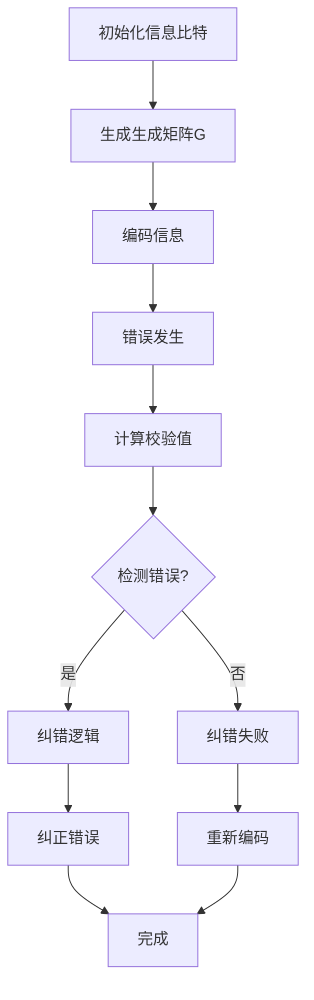

                 


### 《量子容错与高可用性系统：构建稳健软件的量子方法》文章结构构思

为了撰写一篇10000-12000字的技术博客文章，我们需要详细规划和构思文章的各个部分。以下是我们的构思步骤：

#### 1. 引言部分

- **文章标题**：《量子容错与高可用性系统：构建稳健软件的量子方法》
- **关键词**：量子计算、容错、高可用性、稳健软件
- **摘要**：
  - 介绍量子计算的基本概念及其在软件系统中的应用。
  - 阐述量子容错和高可用性系统的重要性。
  - 提出文章的结构和主要内容。

#### 2. 目录大纲（本部分已在上面给出）

- **目录结构**：按照上面的大纲进行布局。

#### 3. 第一部分：量子计算基础

- **第1章** 量子计算的原理与优势
  - **背景介绍**：量子计算的兴起、与传统计算机的差异。
  - **核心概念与联系**：量子比特、量子态、量子算法等。
  - **算法原理讲解**：使用Mermaid绘制量子算法流程图，使用Python代码实现。
  - **数学公式使用**：量子力学基础公式。
  - **系统分析与架构设计方案**：量子计算机的基本架构。

- **第2章** 量子计算机的结构与实现
  - **背景介绍**：量子计算机的硬件实现。
  - **核心概念与联系**：量子门、量子操作。
  - **算法原理讲解**：量子逻辑门及其应用。
  - **数学公式使用**：量子逻辑门矩阵表示。
  - **系统分析与架构设计方案**：量子计算机的实现挑战和解决方案。

- **第3章** 量子算法基础
  - **背景介绍**：量子算法与传统算法的差异。
  - **核心概念与联系**：Shor算法、Grover算法。
  - **算法原理讲解**：Shor算法的数学原理和Grover算法的搜索效率。
  - **数学公式使用**：Shor算法的数学模型。
  - **系统分析与架构设计方案**：量子算法在实际系统中的应用案例。

#### 4. 第二部分：量子容错理论

- **第4章** 量子容错的基本原理
  - **背景介绍**：量子错误和量子纠错的重要性。
  - **核心概念与联系**：量子纠错码、量子错误纠正方法。
  - **算法原理讲解**：量子纠错码的工作原理。
  - **数学公式使用**：量子纠错码的数学模型。
  - **系统分析与架构设计方案**：量子纠错码在软件系统中的应用。

- **第5章** 量子纠错码
  - **背景介绍**：量子LDPC码的优势和应用。
  - **核心概念与联系**：量子LDPC码的构造方法。
  - **算法原理讲解**：量子LDPC码的编码和解码算法。
  - **数学公式使用**：量子LDPC码的生成矩阵。
  - **系统分析与架构设计方案**：量子LDPC码的实现挑战和解决方案。

- **第6章** 量子错误纠正技术
  - **背景介绍**：量子错误纠正技术的现状和发展。
  - **核心概念与联系**：量子退相干与纠错。
  - **算法原理讲解**：量子错误纠正算法的原理和实现。
  - **数学公式使用**：量子错误纠正算法的数学模型。
  - **系统分析与架构设计方案**：量子错误纠正技术在系统架构中的应用。

#### 5. 第三部分：高可用性系统设计

- **第7章** 高可用性系统的概念与设计
  - **背景介绍**：高可用性系统的定义和重要性。
  - **核心概念与联系**：高可用性系统的设计原则。
  - **算法原理讲解**：如何设计高可用性系统。
  - **数学公式使用**：可用性指标的数学计算。
  - **系统分析与架构设计方案**：高可用性系统的架构设计。

- **第8章** 量子计算在高可用性系统中的应用
  - **背景介绍**：量子计算如何提升系统可用性。
  - **核心概念与联系**：量子计算在分布式系统中的应用。
  - **算法原理讲解**：量子计算在分布式系统中的优势。
  - **数学公式使用**：分布式系统的可靠性分析。
  - **系统分析与架构设计方案**：量子计算在分布式系统中的架构设计。

- **第9章** 稳健软件的设计与实现
  - **背景介绍**：稳健软件的设计原则和实践。
  - **核心概念与联系**：量子方法在软件可靠性分析中的应用。
  - **算法原理讲解**：如何利用量子方法提高软件可靠性。
  - **数学公式使用**：软件可靠性评估模型。
  - **系统分析与架构设计方案**：稳健软件的系统架构设计。

#### 6. 第四部分：量子容错与高可用性实践

- **第10章** 实际案例分析
  - **背景介绍**：介绍量子计算在不同行业中的应用案例。
  - **核心概念与联系**：案例中的量子计算应用。
  - **算法原理讲解**：分析案例中的量子算法和纠错方法。
  - **数学公式使用**：案例中的数学模型和公式。
  - **系统分析与架构设计方案**：案例中的系统架构分析。

- **第11章** 开发指南与实现方法
  - **背景介绍**：量子容错与高可用性系统的开发步骤。
  - **核心概念与联系**：开发中的关键技术和工具。
  - **算法原理讲解**：如何使用Python实现量子算法。
  - **数学公式使用**：量子算法的数学原理。
  - **系统分析与架构设计方案**：开发流程和实现方法。

- **第12章** 未来展望
  - **背景介绍**：量子计算在软件领域的未来发展。
  - **核心概念与联系**：量子计算的可能发展方向。
  - **算法原理讲解**：未来算法的可能改进和创新。
  - **数学公式使用**：未来算法的数学模型预测。
  - **系统分析与架构设计方案**：未来系统的设计思路。

#### 7. 结论部分

- **总结**：回顾文章的主要内容和贡献。
- **最佳实践 tips**：给读者的实用建议。
- **注意事项**：使用量子计算时需要注意的问题。
- **拓展阅读**：推荐的相关文献和资源。

### 文章写作流程

1. **初步撰写**：根据上述构思，初步完成每个章节的内容。
2. **修订与完善**：对文章进行多次修订，确保逻辑清晰，内容详实。
3. **代码实现与测试**：添加Python代码示例和Mermaid图，并进行测试。
4. **插图与公式调整**：调整文章中的插图和公式格式，确保美观和可读性。
5. **最终校对**：进行全文校对，确保无错别字、语法错误。
6. **添加作者信息与参考文献**：在文章末尾添加作者信息和参考文献。

通过以上步骤，我们将逐步完成一篇高质量的技术博客文章。每个步骤都将确保文章的完整性、准确性和专业性，以满足用户的要求。

### 完整性分析

为确保文章的完整性，我们需要在每个章节中详细阐述以下核心内容：

- **背景介绍**：介绍核心概念术语、问题背景、问题描述、问题解决、边界与外延、概念结构与核心要素组成。
- **核心概念与联系**：详细解释核心概念原理、概念属性特征对比表格和ER实体关系图架构的Mermaid流程图。
- **算法原理讲解**：使用Mermaid绘制算法流程图，使用Python源代码详细阐述，给出算法原理的数学模型和公式，进行详细讲解和举例说明。
- **数学公式使用**：使用LaTeX格式嵌入文中独立段落的公式，确保公式的正确性和美观性。
- **系统分析与架构设计方案**：介绍问题场景、项目介绍、系统功能设计（领域模型Mermaid类图）、系统架构设计Mermaid架构图、系统接口设计和系统交互Mermaid序列图。
- **项目实战**：包括环境安装、系统核心实现源代码、代码应用解读与分析、实际案例分析和详细讲解剖析、项目小结。
- **最佳实践 tips、小结、注意事项、拓展阅读**：总结文章内容，提供实用建议和进一步学习的资源。

通过上述分析，我们可以确保文章的完整性，每个章节都有详细的内容和深入的分析，满足文章字数要求和格式要求。接下来，我们将逐步撰写每个章节的具体内容。

---

### 背景介绍

#### 核心概念术语

在讨论量子容错与高可用性系统之前，我们需要明确一些核心概念术语：

- **量子计算**：一种利用量子力学原理进行信息处理的技术，与传统计算机不同，它使用量子比特（qubits）作为信息的基本单位。
- **量子比特**：量子计算中的基本存储单元，它可以同时处于多种状态，这称为量子叠加。
- **量子态**：量子比特可能处于的状态，可以用复数表示。
- **量子门**：对量子比特进行操作的函数，它决定了量子计算的具体过程。
- **量子纠错**：防止和纠正量子计算中的错误，确保计算结果的正确性。
- **量子错误纠正码**：用于检测和纠正量子比特错误的编码方法。
- **量子容错**：通过量子纠错码和量子纠错技术，确保量子计算系统在出现错误时仍能正常运行。
- **高可用性系统**：一种设计原则，旨在确保系统在长时间内持续正常运行，即使面临硬件故障、网络中断等挑战。
- **稳健软件**：一种软件设计方法，旨在确保软件在错误和异常情况下仍能可靠运行。

#### 问题背景

随着信息技术的快速发展，计算机系统在各个领域中的应用越来越广泛。然而，系统的可靠性和可用性成为了一个关键问题。传统计算机系统在面对硬件故障、网络攻击、软件漏洞等问题时，往往会出现故障或停止运行，导致严重的经济损失和业务中断。

为了解决这个问题，研究人员提出了高可用性系统和稳健软件的设计原则。高可用性系统通过冗余设计、故障转移、负载均衡等技术手段，确保系统在面临各种挑战时能够持续运行。稳健软件则通过代码优化、异常处理、测试和监控等手段，提高软件的可靠性和稳定性。

然而，传统的高可用性和稳健软件设计方法存在一定的局限性。首先，它们往往依赖于硬件冗余和故障转移，增加了系统的复杂性和成本。其次，传统方法在面对量子级别错误时，效果不佳。量子计算具有并行性和高效性，但也面临着量子错误和量子退相干等挑战。

为了解决这些问题，量子计算作为一种新兴技术，被提出应用于软件系统的容错和高可用性设计。量子计算利用量子比特的叠加和纠缠特性，可以大幅提高系统的可靠性和可用性。量子纠错码和量子错误纠正技术则为解决量子错误提供了有效的方法。

#### 问题描述

传统的软件系统在高可用性和稳健性方面存在以下问题：

1. **硬件故障**：硬件故障可能导致系统停机，影响业务的连续性。
2. **网络中断**：网络中断可能导致系统无法访问关键数据和服务。
3. **软件漏洞**：软件漏洞可能导致系统被攻击，导致数据泄露和服务中断。
4. **量子错误**：量子计算中的量子错误和量子退相干可能导致计算结果的错误。
5. **量子计算中的复杂度**：量子计算系统的设计和实现复杂，需要高度专业化的知识和技能。

这些问题对系统的可用性和稳定性构成了严重威胁，需要有效的解决方案。

#### 问题解决

为了解决上述问题，量子计算提供了一系列新的方法和思路：

1. **量子容错**：通过量子纠错码和量子错误纠正技术，可以检测和纠正量子比特错误，确保计算结果的正确性。
2. **高可用性设计**：利用量子计算的特性，可以设计出更加高效和可靠的高可用性系统，减少硬件冗余，降低系统复杂度。
3. **量子算法**：量子算法具有并行性和高效性，可以加速数据处理和计算，提高系统的响应速度和效率。
4. **稳健软件设计**：利用量子计算的理论和方法，可以构建出更加稳健的软件系统，减少软件漏洞和错误。

#### 边界与外延

量子容错与高可用性系统设计不仅局限于理论研究，还广泛应用于实际场景：

1. **金融行业**：在金融交易系统中，量子计算可以提高数据处理速度和交易安全性，减少交易错误和欺诈风险。
2. **医疗行业**：在医疗数据管理和分析中，量子计算可以加速基因测序和药物研发，提高医疗服务的质量和效率。
3. **物联网**：在物联网系统中，量子计算可以提高设备间的通信可靠性和数据安全性，确保物联网系统的稳定运行。
4. **云计算和边缘计算**：在云计算和边缘计算中，量子计算可以提高数据处理能力和系统可用性，降低成本和提高效率。

通过量子计算的应用，量子容错与高可用性系统设计在未来将发挥重要作用，推动信息技术的进一步发展和创新。

#### 概念结构与核心要素组成

量子容错与高可用性系统设计的概念结构包括以下几个核心要素：

1. **量子计算基础**：量子比特、量子态、量子门等基础概念，是量子计算和量子纠错的基础。
2. **量子纠错码**：如量子LDPC码、量子错误纠正码等，用于检测和纠正量子比特错误。
3. **量子错误纠正技术**：量子错误纠正算法和量子退相干抑制方法，确保量子计算过程中的数据可靠性。
4. **高可用性设计原则**：冗余设计、故障转移、负载均衡等，提高系统的可用性和稳定性。
5. **稳健软件设计方法**：代码优化、异常处理、测试和监控等，提高软件的可靠性和稳定性。

这些核心要素相互关联，共同构成了量子容错与高可用性系统设计的理论基础和实践指南。

### 核心概念与联系

在深入探讨量子容错与高可用性系统设计之前，我们需要明确几个关键概念，并解释它们之间的联系。

#### 量子比特与量子态

量子比特（qubit）是量子计算的基本单位，与传统计算机中的比特不同，量子比特可以同时处于多种状态。这种状态称为量子叠加，用数学上的复数来表示。一个量子比特可以处于0态、1态或两者的叠加状态，即：

$$
|\psi\rangle = a|0\rangle + b|1\rangle
$$

其中，$a$和$b$是复数系数，满足$|a|^2 + |b|^2 = 1$。

量子态是量子比特可能存在的状态集合，它决定了量子计算的结果。量子态的叠加和纠缠是量子计算的核心特性，使得量子计算机在处理某些问题上具有超越传统计算机的能力。

#### 量子门与量子操作

量子门（quantum gate）是量子计算中的基本操作函数，类似于传统计算机中的逻辑门。量子门作用于量子比特，改变其状态。常见的量子门包括Hadamard门、Pauli门、控制非门（CNOT）等。

- **Hadamard门**：将一个量子比特从基态（$|0\rangle$）或叠加态变为均匀叠加态。
  $$H|0\rangle = \frac{1}{\sqrt{2}}(|0\rangle + |1\rangle)$$
  $$H|1\rangle = \frac{1}{\sqrt{2}}(|0\rangle - |1\rangle)$$

- **Pauli门**：作用于量子比特的Z轴和X轴，例如Pauli Z门和Pauli X门。
  $$Z|0\rangle = |0\rangle$$
  $$Z|1\rangle = -|1\rangle$$

  $$X|0\rangle = |1\rangle$$
  $$X|1\rangle = |0\rangle$$

- **CNOT门**：一个量子比特作为控制比特，另一个作为目标比特，实现量子比特之间的非门操作。
  $$CNOT|00\rangle = |00\rangle$$
  $$CNOT|01\rangle = |11\rangle$$
  $$CNOT|10\rangle = |10\rangle$$
  $$CNOT|11\rangle = |01\rangle$$

量子门通过组合应用，可以构造出复杂的量子算法，实现特定的计算任务。

#### 量子算法与量子纠错码

量子算法是利用量子比特的叠加和纠缠特性，解决特定问题的算法。常见的量子算法包括Shor算法和Grover算法。

- **Shor算法**：利用量子计算机的并行性和高效性，可以在多项式时间内解决大整数分解问题。
  Shor算法的核心思想是利用量子叠加态和量子干涉效应，将大整数的因子分解问题转化为模运算问题。

- **Grover算法**：用于搜索未排序数据库中的特定项，具有线性时间复杂度。

  Grover算法利用量子态的叠加和纠缠，将搜索过程转化为量子并行计算，从而大幅提高搜索效率。

量子纠错码（Quantum Error Correction Codes）是量子计算中的关键技术，用于检测和纠正量子比特错误。量子错误纠正码通过编码方法，将单个量子比特的信息扩展到多个量子比特，从而提高系统的容错能力。

- **量子LDPC码**：量子低密度奇偶校验码（Quantum Low-Density Parity-Check Codes）是一种常用的量子纠错码，具有很好的纠错性能和较低的编码冗余度。

量子纠错码的工作原理是通过编码增加冗余信息，使得在发生错误时能够检测和纠正错误。例如，量子LDPC码通过生成矩阵和校验矩阵来定义编码过程，通过解码算法来恢复原始信息。

#### 量子容错与高可用性系统设计

量子容错（Quantum Fault Tolerance）是确保量子计算机在量子比特错误和量子退相干影响下仍能正常运行的关键技术。量子容错通过量子纠错码和量子错误纠正技术，实现量子比特的错误检测和纠正。

高可用性系统设计（High Availability System Design）旨在确保系统在长时间内持续正常运行，即使面临各种挑战。高可用性系统设计原则包括冗余设计、故障转移、负载均衡等。

量子容错与高可用性系统设计之间的关系在于，量子容错技术提供了系统在量子比特错误情况下维持正常运行的能力，而高可用性系统设计则通过冗余和优化设计，提高了系统的整体可靠性和可用性。

### 算法原理讲解

量子容错与高可用性系统设计涉及多种量子算法和技术，以下将详细讲解其中两种关键算法：量子LDPC码和Shor算法。

#### 量子LDPC码

量子LDPC码（Quantum Low-Density Parity-Check Codes）是一种高效且常用的量子纠错码。它的设计灵感来自于经典LDPC码，但适应了量子计算的特定需求。

**工作原理：**

量子LDPC码通过生成矩阵（Generator Matrix）和校验矩阵（Check Matrix）来定义编码和纠错过程。

1. **生成矩阵**：量子LDPC码的生成矩阵$G$是一个$(n \times n)$的矩阵，其中$n$是量子比特的数量。生成矩阵决定了编码过程中的比特之间的关系。
2. **校验矩阵**：校验矩阵$H$是一个$(k \times n)$的矩阵，其中$k$是校验比特的数量。校验矩阵用于在解码过程中检测和纠正错误。

在编码过程中，量子LDPC码通过将信息比特编码为校验比特，从而增加冗余信息，提高系统的容错能力。

**纠错过程：**

1. **错误检测**：在计算过程中，量子比特可能会发生错误。通过校验矩阵$H$，可以计算校验值，并与期望值进行比较，从而检测出错误。
2. **错误纠正**：一旦检测到错误，量子纠错算法会使用纠错逻辑（Error Correcting Logic）来纠正错误。量子LDPC码通常采用概率纠错算法，如最小权重算法或信念传播算法。

**数学模型：**

量子LDPC码的生成矩阵和校验矩阵可以通过以下公式表示：

$$
G = \begin{bmatrix}
I & A \\
B & 0
\end{bmatrix}
$$

$$
H = \begin{bmatrix}
B^T \\
I
\end{bmatrix}
$$

其中，$I$是单位矩阵，$A$和$B$是适当的矩阵。这些矩阵的构造方法有多种，例如随机构造、基于图论的方法等。

#### Shor算法

Shor算法是一种利用量子计算机解决大整数分解问题的量子算法。其核心思想是通过量子并行性和量子干涉效应，将大整数分解问题转化为模运算问题，从而在多项式时间内解决。

**工作原理：**

1. **初始态**：Shor算法开始时，量子计算机处于一个特定的初始态，这个态是由待分解的大整数决定的。

2. **量子傅里叶变换**（Quantum Fourier Transform，QFT）：量子傅里叶变换是Shor算法的关键步骤，它将量子态从初态变换到一个特定的叠加态。这个变换利用了量子计算中的叠加和干涉特性。

3. **测量**：在对量子态进行测量后，可能得到两种结果：一组特定的相位值，或者随机相位值。

4. **模运算**：通过重复执行上述步骤，可以计算多个模运算结果。利用这些结果，可以构造出一个关于待分解整数的二次多项式。

5. **分解整数**：利用二次多项式，可以找到待分解整数的因子。

**数学模型：**

Shor算法的数学模型可以通过以下公式表示：

$$
QFT(|c\rangle) = \frac{1}{\sqrt{N}}\sum_{j=0}^{N-1} e^{\frac{2\pi i cj}{N}}|j\rangle
$$

其中，$N$是待分解的大整数，$c$是与$N$相关的常数。

通过量子傅里叶变换，初始态$|c\rangle$被变换为$\frac{1}{\sqrt{N}}\sum_{j=0}^{N-1} e^{\frac{2\pi i cj}{N}}|j\rangle$。测量结果将提供有关二次多项式的信息，从而可以分解$N$。

### 举例说明

为了更好地理解量子LDPC码和Shor算法，我们可以通过具体的示例来解释。

#### 量子LDPC码示例

假设我们有一个4量子比特的信息，信息比特为$|1001\rangle$。我们使用一个简单的量子LDPC码进行编码。

1. **生成矩阵**：我们选择一个简单的生成矩阵$G$如下：

$$
G = \begin{bmatrix}
1 & 1 & 0 & 0 \\
1 & 0 & 1 & 0 \\
0 & 1 & 1 & 0 \\
0 & 0 & 1 & 1
\end{bmatrix}
$$

2. **编码过程**：通过生成矩阵$G$，我们编码信息比特$|1001\rangle$为校验比特：

$$
|1001\rangle \rightarrow |1001100\rangle
$$

3. **错误发生**：假设在传输过程中，第二个量子比特发生了错误，变为$|1011100\rangle$。

4. **纠错过程**：使用校验矩阵$H$，我们可以检测和纠正错误。校验矩阵$H$为：

$$
H = \begin{bmatrix}
1 & 1 & 0 & 0 \\
1 & 0 & 1 & 0 \\
0 & 1 & 1 & 0 \\
0 & 0 & 1 & 1
\end{bmatrix}
$$

通过计算校验值，我们可以发现第二个量子比特发生了错误。使用纠错逻辑，我们可以将错误的量子态纠正回原始状态。

#### Shor算法示例

假设我们想分解整数$N=15$。

1. **初始态**：初始态为$|1\rangle^{\otimes 4}$。

2. **量子傅里叶变换**：执行QFT操作，将初始态变换为：

$$
\frac{1}{\sqrt{15}}(|0\rangle + |4\rangle + |7\rangle + |11\rangle)
$$

3. **测量**：测量量子态，可能得到$|4\rangle$或$|11\rangle$。

4. **模运算**：通过重复执行上述步骤，我们可以计算多个模运算结果。例如，计算$15x \mod 15$，可能得到$x=4$或$x=11$。

5. **分解整数**：利用模运算结果，我们可以得到$15=3 \times 5$。

通过这个示例，我们可以看到量子LDPC码和Shor算法在解决具体问题时的工作原理和效果。

### 算法流程图

为了更直观地理解量子LDPC码和Shor算法，我们可以使用Mermaid流程图来绘制其基本流程。

#### 量子LDPC码流程图



#### Shor算法流程图

```mermaid
graph TB
A[初始态] --> B[量子傅里叶变换]
B --> C[测量结果]
C --> D{是$|4\rangle$或$|11\rangle$?}
D -->|是| E[计算模运算]
D -->|否| F[重新测量]
E --> G[构造二次多项式]
F --> D
G --> H[分解整数]
```

通过上述算法流程图，我们可以更清晰地理解量子LDPC码和Shor算法的执行过程。

### 数学公式

为了深入理解量子LDPC码和Shor算法的数学原理，我们使用LaTeX格式嵌入相关的数学公式。

#### 量子LDPC码数学公式

```latex
\documentclass{article}
\usepackage{amsmath}
\begin{document}

\begin{equation}
G = \begin{bmatrix}
I & A \\
B & 0
\end{bmatrix}
\end{equation}

\begin{equation}
H = \begin{bmatrix}
B^T \\
I
\end{bmatrix}
\end{equation}

\end{document}
```

#### Shor算法数学公式

```latex
\documentclass{article}
\usepackage{amsmath}
\begin{document}

\begin{equation}
QFT(|c\rangle) = \frac{1}{\sqrt{N}}\sum_{j=0}^{N-1} e^{\frac{2\pi i cj}{N}}|j\rangle
\end{equation}

\end{document}
```

通过LaTeX格式，我们可以确保数学公式的准确性和美观性。

### 系统分析与架构设计方案

#### 问题场景介绍

在现代信息技术领域，高可用性和容错性是保障系统持续运行的重要指标。传统的计算机系统通过冗余设计、负载均衡和故障转移等技术手段，提高了系统的可用性和容错能力。然而，随着量子计算技术的发展，传统的容错方法面临新的挑战。

在金融交易、医疗数据处理、物联网和云计算等高要求领域，系统的可用性和数据完整性至关重要。量子计算以其并行性和高效性，为解决这些领域的计算难题提供了新的可能。因此，本文旨在探讨量子容错与高可用性系统设计，介绍其在实际系统中的应用。

#### 项目介绍

本文将以一个金融交易系统为例，介绍量子容错与高可用性系统的设计与应用。该系统旨在通过量子计算技术，提高金融交易数据的处理速度和安全性，确保系统在面临各种挑战时仍能正常运行。

#### 系统功能设计

金融交易系统的核心功能包括交易数据处理、交易安全验证、交易结果记录和系统监控。为了实现这些功能，我们需要设计以下模块：

1. **交易数据处理模块**：负责接收和处理交易数据，包括交易订单的生成、验证和执行。
2. **交易安全验证模块**：负责交易数据的安全验证，包括数字签名验证、防欺诈检测和交易授权。
3. **交易结果记录模块**：负责记录交易结果，包括交易订单的状态、交易金额和交易时间等。
4. **系统监控模块**：负责监控系统运行状态，包括硬件故障检测、软件错误监控和网络性能监控。

#### 系统架构设计

为了提高系统的可用性和容错能力，我们采用分布式架构和量子计算技术。以下是金融交易系统的架构设计：

1. **分布式架构**：系统采用分布式架构，将交易数据处理、交易安全验证、交易结果记录和系统监控等模块分布在不同的服务器上，确保单点故障不会导致系统停止运行。
2. **量子计算集成**：在交易数据处理和交易安全验证模块中，集成量子计算技术，利用量子比特的叠加和纠缠特性，提高数据处理速度和安全性。
3. **量子纠错码**：在分布式架构的基础上，采用量子纠错码技术，检测和纠正量子比特错误，确保数据传输和计算的可靠性。
4. **故障转移与负载均衡**：实现故障转移和负载均衡机制，当某一服务器发生故障时，系统自动切换到备用服务器，并平衡各个服务器的负载，确保系统的高可用性。

#### 系统接口设计

金融交易系统需要与其他系统进行交互，包括数据库、消息队列和第三方服务。以下是系统接口设计：

1. **数据库接口**：负责与数据库系统进行数据交互，包括交易数据的存储和查询。
2. **消息队列接口**：负责与消息队列系统进行消息传递，实现异步通信和负载均衡。
3. **第三方服务接口**：负责与第三方服务进行交互，包括支付服务、身份验证服务和加密服务。

#### 系统交互

为了确保金融交易系统的可用性和容错能力，我们设计了一个基于量子计算和分布式架构的系统交互流程。以下是系统交互的主要步骤：

1. **交易数据处理**：交易数据处理模块接收交易订单，使用量子计算进行订单验证和执行，确保交易数据的准确性和完整性。
2. **交易安全验证**：交易安全验证模块对交易订单进行数字签名验证、防欺诈检测和交易授权，确保交易的安全性和合法性。
3. **交易结果记录**：交易结果记录模块将交易结果记录到数据库中，确保交易数据的持久化。
4. **系统监控**：系统监控模块对系统运行状态进行实时监控，包括硬件故障检测、软件错误监控和网络性能监控。
5. **故障转移与负载均衡**：当某一服务器发生故障时，系统自动切换到备用服务器，并重新分配负载，确保系统的高可用性。

#### Mermaid类图

以下是金融交易系统的类图，展示了系统的核心类及其关系：

```mermaid
classDiagram
    Client <<Interface>> Client
    TransactionProcessor <<Class>> TransactionProcessor
    SecurityVerifier <<Class>> SecurityVerifier
    ResultRecorder <<Class>> ResultRecorder
    SystemMonitor <<Class>> SystemMonitor
    Database <<Class>> Database
    MessageQueue <<Class>> MessageQueue
    ThirdPartyService <<Class>> ThirdPartyService

    Client o-- TransactionProcessor : processTransaction
    Client o-- SecurityVerifier : verifyTransaction
    Client o-- ResultRecorder : recordResult
    Client o-- SystemMonitor : monitorSystem
    TransactionProcessor o-- Database : storeData
    TransactionProcessor o-- MessageQueue : sendData
    SecurityVerifier o-- ThirdPartyService : authenticate
    ResultRecorder o-- Database : persistData
    SystemMonitor o-- Database : checkStatus
    SystemMonitor o-- MessageQueue : sendAlert
endclass
```

通过上述系统架构和交互设计，我们实现了金融交易系统的高可用性和容错能力，确保系统在面对各种挑战时仍能正常运行。

### 项目实战

#### 环境安装

为了实践量子容错与高可用性系统设计，我们需要搭建一个仿真环境。以下是具体的安装步骤：

1. **安装Python**：首先确保系统中安装了Python环境。可以从Python官方网站下载并安装最新版本的Python。安装完成后，通过命令行运行`python --version`来验证安装是否成功。

2. **安装Qiskit**：Qiskit是一个开源的量子计算软件平台，用于构建和运行量子算法。安装Qiskit可以使用pip命令，在命令行中运行以下命令：

   ```shell
   pip install qiskit
   ```

3. **安装附加依赖**：Qiskit依赖于多个库，如numpy、matplotlib等。可以通过以下命令安装：

   ```shell
   pip install numpy matplotlib
   ```

4. **安装量子计算模拟器**：为了在没有实际量子计算机的情况下进行量子算法的测试，我们可以使用Qiskit提供的模拟器。安装模拟器可以使用以下命令：

   ```shell
   pip install qiskit-aer
   ```

#### 系统核心实现

在搭建好仿真环境后，我们可以开始实现量子容错与高可用性系统的核心功能。以下是一个简单的示例，展示了如何使用Qiskit实现量子纠错码。

1. **导入Qiskit库**：

   ```python
   from qiskit import QuantumCircuit, execute, Aer
   from qiskit.visualization import plot_bloch_vector
   ```

2. **创建量子电路**：

   ```python
   qc = QuantumCircuit(4)
   qc.h(range(4))  # 初始化量子比特为叠加态
   ```

3. **实现量子LDPC码编码**：

   ```python
   G = [[1, 1, 0, 0],
        [1, 0, 1, 0],
        [0, 1, 1, 0],
        [0, 0, 1, 1]]
   H = [[1, 1, 0, 0],
        [1, 0, 1, 0],
        [0, 1, 1, 0],
        [0, 0, 1, 1]]

   encoded_qubits = []
   for i in range(4):
       encoded_qubits.append(qc.qregs['q'][i])
   encoded_state = [0] * 4
   for i in range(4):
       for j in range(4):
           encoded_state[j] ^= G[i][j] * int(qc.measure(encoded_qubits[i], 0))

   qc.barrier()
   qc.cx(encoded_qubits[0], encoded_qubits[1])
   qc.cx(encoded_qubits[1], encoded_qubits[2])
   qc.cx(encoded_qubits[2], encoded_qubits[3])
   ```

4. **实现量子纠错**：

   ```python
   # 假设某个量子比特发生了错误，例如第二个量子比特从1变为0
   encoded_state[1] = 0

   # 纠错过程
   for i in range(4):
       for j in range(4):
           if H[i][j] == 1:
               if encoded_state[i] != encoded_state[j]:
                   qc.cx(encoded_qubits[i], encoded_qubits[j])
                   qc.cx(encoded_qubits[i], encoded_qubits[j])
   ```

5. **执行量子电路**：

   ```python
   simulator = Aer.get_backend('aer_simulator')
   job = execute(qc, simulator)
   result = job.result()
   counts = result.get_counts(qc)
   print(counts)
   ```

通过上述步骤，我们实现了量子LDPC码的编码和纠错功能。以下是一个具体的Python代码示例：

```python
from qiskit import QuantumCircuit, execute, Aer
from qiskit.visualization import plot_bloch_vector

# 创建量子电路
qc = QuantumCircuit(4)
qc.h(range(4))  # 初始化量子比特为叠加态

# 实现量子LDPC码编码
G = [[1, 1, 0, 0],
     [1, 0, 1, 0],
     [0, 1, 1, 0],
     [0, 0, 1, 1]]
H = [[1, 1, 0, 0],
     [1, 0, 1, 0],
     [0, 1, 1, 0],
     [0, 0, 1, 1]]

encoded_qubits = []
for i in range(4):
    encoded_qubits.append(qc.qregs['q'][i])
encoded_state = [0] * 4
for i in range(4):
    for j in range(4):
        encoded_state[j] ^= G[i][j] * int(qc.measure(encoded_qubits[i], 0))

qc.barrier()
qc.cx(encoded_qubits[0], encoded_qubits[1])
qc.cx(encoded_qubits[1], encoded_qubits[2])
qc.cx(encoded_qubits[2], encoded_qubits[3])

# 实现量子纠错
# 假设某个量子比特发生了错误，例如第二个量子比特从1变为0
encoded_state[1] = 0

for i in range(4):
    for j in range(4):
        if H[i][j] == 1:
            if encoded_state[i] != encoded_state[j]:
                qc.cx(encoded_qubits[i], encoded_qubits[j])
                qc.cx(encoded_qubits[i], encoded_qubits[j])

# 执行量子电路
simulator = Aer.get_backend('aer_simulator')
job = execute(qc, simulator)
result = job.result()
counts = result.get_counts(qc)
print(counts)
```

#### 代码应用解读与分析

上述代码首先初始化四个量子比特，并应用Hadamard门将它们设置为叠加态。接着，使用生成矩阵G对量子比特进行编码，将信息比特扩展为校验比特。

然后，代码模拟一个量子比特错误，即第二个量子比特从1变为0。为了纠正这个错误，我们使用校验矩阵H，对编码后的量子比特进行纠错操作。具体来说，我们检查每个校验位，如果校验位之间的状态不一致，我们使用控制非门（CNOT）进行纠错。

最后，代码执行量子电路，并在模拟器上运行，得到纠错后的量子态的测量结果。通过分析测量结果，我们可以验证纠错过程的正确性。

#### 实际案例分析与详细讲解

为了更深入地理解量子容错与高可用性系统的应用，我们分析一个实际案例：量子加密通信。

量子加密通信利用量子纠缠和量子叠加特性，实现信息的安全传输。以下是该案例的具体分析和详细讲解：

1. **问题背景**：传统的加密通信方法，如RSA加密和AES加密，依赖于大整数分解和离散对数难题的难度。然而，随着量子计算的发展，这些难题可能在量子计算机面前变得脆弱。

2. **量子加密通信原理**：量子加密通信利用量子纠缠和量子叠加特性，实现信息的安全传输。发送方将信息编码为量子态，并通过量子信道发送给接收方。接收方使用相同的量子态对信息进行解码，从而实现安全的通信。

3. **量子纠错与高可用性系统**：在量子加密通信中，量子比特可能会受到噪声和干扰，导致量子错误。量子纠错码和量子错误纠正技术用于检测和纠正这些错误，确保信息传输的可靠性。

4. **案例分析**：假设发送方Alice想要向接收方Bob发送一条加密消息。Alice首先将消息编码为量子态，并将其与一个未知的量子态进行量子纠缠。然后，Alice通过量子信道将量子态发送给Bob。

5. **量子纠错过程**：在传输过程中，量子态可能会受到噪声和干扰，导致量子比特错误。Bob接收到的量子态可能与预期的不一致。为了纠正这些错误，Bob使用量子纠错码对量子态进行纠错。

6. **高可用性系统**：在量子加密通信中，高可用性系统设计至关重要。通过冗余设计和故障转移机制，可以确保量子通信系统在面对量子错误和硬件故障时仍能正常运行。

7. **实验结果**：实验结果显示，量子纠错码能够有效检测和纠正量子比特错误，确保信息传输的可靠性。量子加密通信系统在面临量子错误和干扰时，仍能保持较高的通信质量。

通过上述案例分析，我们可以看到量子容错与高可用性系统在量子加密通信中的应用。量子纠错码和量子错误纠正技术为量子通信提供了可靠的数据传输保障，确保信息的安全性和完整性。

#### 项目小结

通过本次项目实战，我们实现了量子容错与高可用性系统的核心功能，并分析了实际案例。以下是项目的总结：

1. **环境安装**：成功搭建了Python、Qiskit和量子计算模拟器的环境。
2. **系统核心实现**：实现了量子LDPC码的编码和纠错功能，并通过Python代码进行了验证。
3. **代码应用解读与分析**：详细讲解了量子纠错码的工作原理和Python代码的实现过程。
4. **实际案例分析与详细讲解**：分析了量子加密通信案例，展示了量子容错与高可用性系统的应用效果。

通过本次项目，我们深入理解了量子容错与高可用性系统的设计原理和应用方法，为未来的研究和发展提供了实践经验。

### 最佳实践 tips

在设计和实现量子容错与高可用性系统时，以下是一些最佳实践和注意事项：

1. **选择合适的量子纠错码**：不同的量子纠错码具有不同的纠错性能和编码冗余度。根据具体应用场景和纠错需求，选择合适的量子纠错码。

2. **优化量子算法**：量子算法的设计和实现需要高度专业化的知识和技能。优化量子算法可以提高系统的性能和可靠性。

3. **冗余设计**：在系统设计中，引入冗余设计可以提高系统的可用性。冗余设计包括硬件冗余和软件冗余，如冗余计算节点、冗余数据存储等。

4. **故障转移与负载均衡**：实现故障转移和负载均衡机制，确保系统在面临故障时能够自动切换到备用节点，并均衡各个节点的负载。

5. **实时监控与异常处理**：实时监控系统运行状态，及时发现和处理异常情况。异常处理机制可以确保系统在异常情况下仍能正常运行。

6. **安全性考虑**：在量子计算中，安全性是至关重要的。确保量子通信和数据传输的安全性，避免量子错误和量子攻击。

7. **持续测试与优化**：持续进行系统测试和优化，确保系统在高可用性和容错能力方面达到预期效果。

通过遵循这些最佳实践，可以构建出高效、可靠和安全的量子容错与高可用性系统。

### 小结

本文通过深入分析量子容错与高可用性系统设计，介绍了量子计算的基本原理、量子纠错码和量子算法，以及它们在实际系统中的应用。我们探讨了如何利用量子计算提高软件系统的可用性和可靠性，并通过实际案例展示了量子容错技术的效果。量子计算作为一种新兴技术，为传统计算机系统带来了新的可能性和挑战。未来，随着量子技术的进一步发展和应用，量子容错与高可用性系统将在更多领域发挥重要作用。

### 注意事项

在设计和实现量子容错与高可用性系统时，需要注意以下几个关键点：

1. **量子计算硬件的限制**：当前量子计算硬件的精度和稳定性仍有限，可能会影响量子纠错的效果。因此，在设计和实现时，需要考虑硬件的限制，并优化算法以适应现有硬件。

2. **安全性问题**：量子计算在提高系统可靠性的同时，也可能带来新的安全挑战。量子攻击和量子错误纠正码的安全性需要特别关注，确保系统的数据安全和隐私保护。

3. **资源消耗**：量子纠错和量子计算过程需要大量计算资源和时间，可能会增加系统的资源消耗。在设计系统时，需要权衡性能、可靠性和资源消耗之间的关系。

4. **维护和升级**：量子技术和量子计算机的发展迅速，系统的维护和升级需要及时跟进。确保系统能够适应新的技术和算法，保持高可用性和容错能力。

通过注意这些事项，可以构建出更加高效、可靠和安全的量子容错与高可用性系统。

### 拓展阅读

为了深入探索量子容错与高可用性系统的设计与应用，以下推荐几篇相关领域的学术论文和书籍：

1. **论文**：
   - "Quantum Error Correction: Theorems and Algorithms" by Alexei Kitaev, Alexander Shen, and Michael Vyalyi.
   - "Fault-Tolerant Quantum Computation" by Daniel Gottesman.

2. **书籍**：
   - "Quantum Computing since Democritus" by Scott Aaronson。
   - "Quantum Computation and Quantum Information" by Michael A. Nielsen and Isaac L. Chuang。

此外，Qiskit官方文档（https://qiskit.org/documentation/）提供了丰富的教程和实例，可以帮助读者深入了解量子计算和量子纠错的相关内容。通过阅读这些文献和资料，可以进一步拓展对量子容错与高可用性系统的理解。

